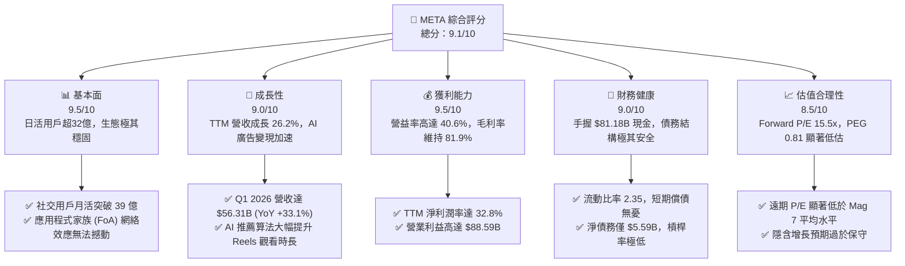
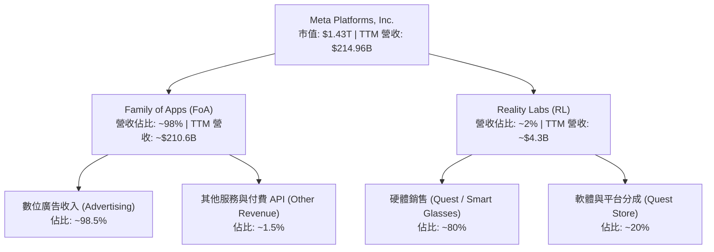
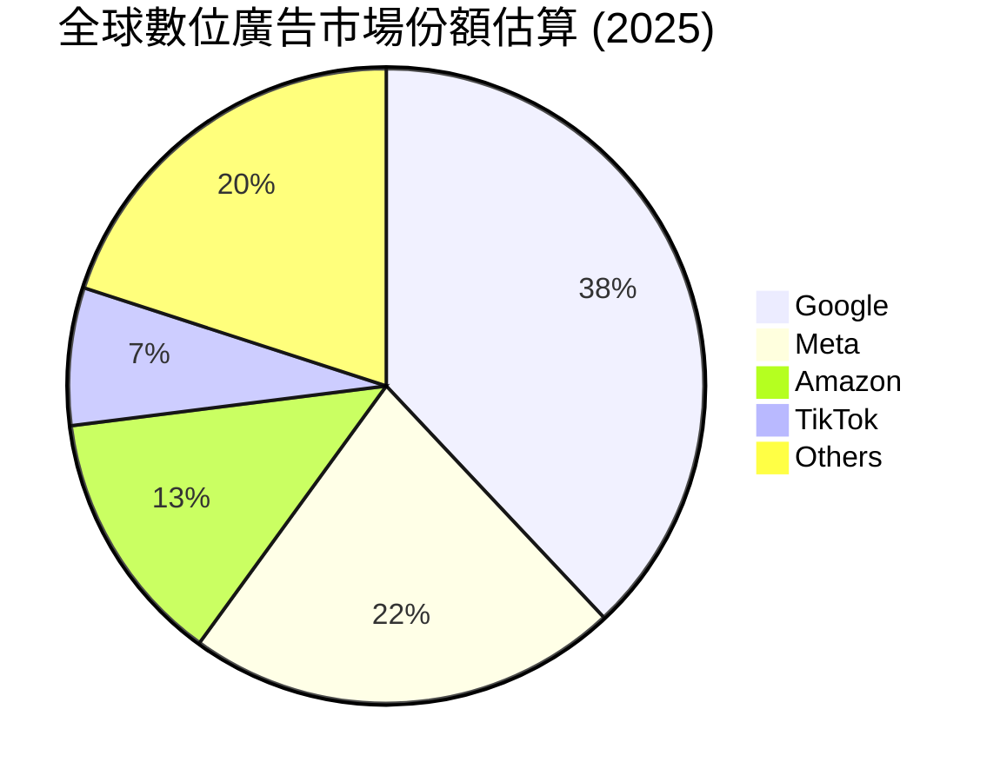
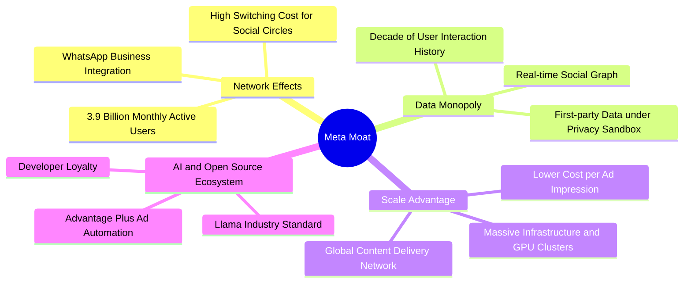
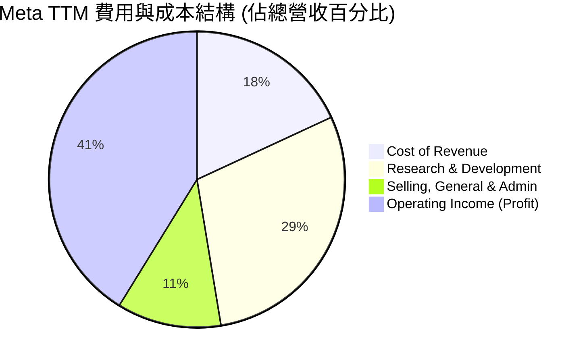
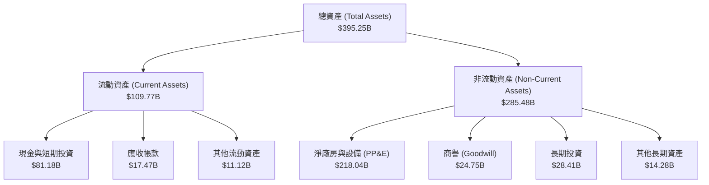
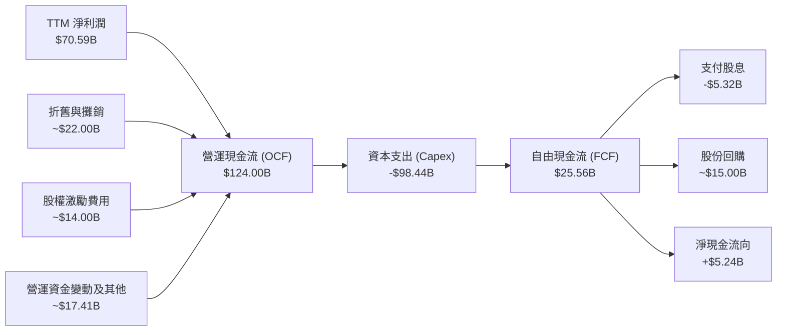
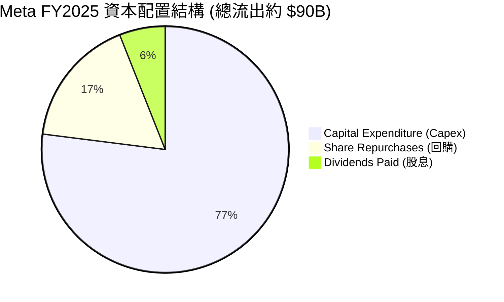
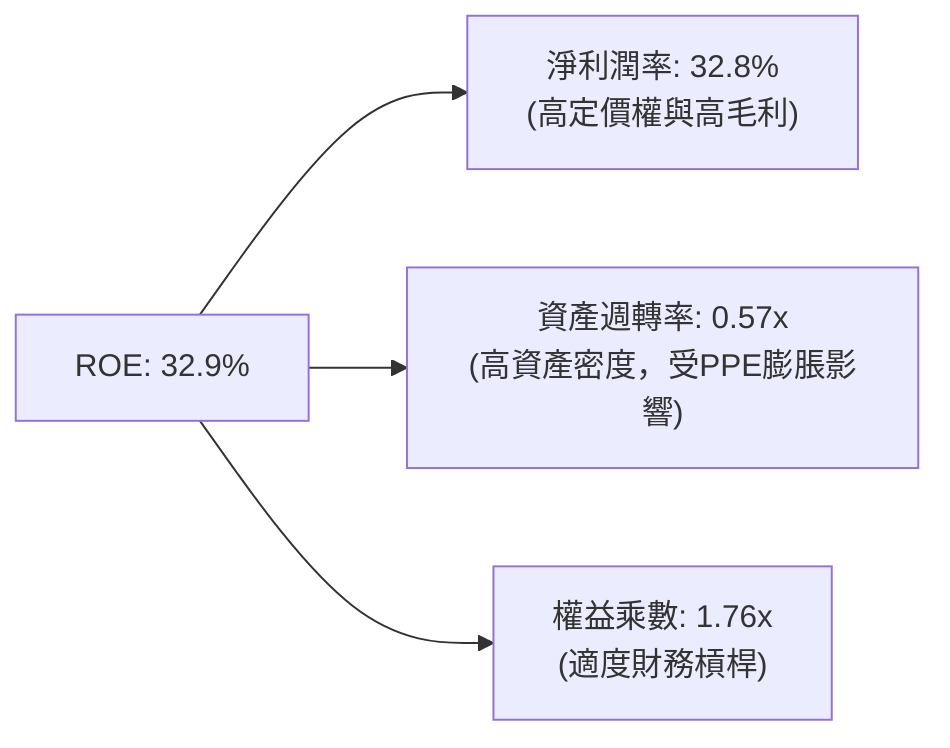

# META 基本面深度分析報告

> **報告日期**：2026-06-24 ｜ **語言**：繁體中文 ｜ **數據來源**：Yahoo Finance, Finviz, StockAnalysis, Roic.ai ｜ **分析師**：CFA 級機構研究

---

## 目錄

| # | 章節 | 核心結論 |
|---|---|---|
| 1 | **執行摘要** | 評級「強烈買入」，基準目標價 $827.32，隱含 47.2% 上漲空間。 |
| 2 | **公司概覽與商業模式** | 雙軌驅動（FoA + Reality Labs），開源 Llama 確立 AI 生態霸權與極強護城河。 |
| 3 | **損益表深度分析** | TTM 營收突破 $214.96B，Q1 2026 營收 YoY 暴增 33.1%，稅務波動不改強勁獲利本質。 |
| 4 | **資產負債表分析** | 手握 $81.18B 充足現金，淨債務僅 $5.59B，流動比率 2.35，財務結構堅如磐石。 |
| 5 | **現金流量深度分析** | 營運現金流高達 $124.00B，扣除 AI 基礎建設巨額 Capex 後，仍創造 $25.56B 自由現金流。 |
| 6 | **獲利能力與資本效率** | ROE 達 32.9%，ROIC (31.4%) 遠超 WACC (8.5%)，EVA 達 +22.9pp，股東價值創造力極強。 |
| 7 | **估值深度分析** | Forward P/E 僅 15.5x，PEG 僅 0.81，相較歷史均值與同業呈現極度低估。 |
| 8 | **成長催化劑** | Llama 4 商業化、AI 驅動廣告精準度提升、智慧眼鏡（Ray-Ban Meta）出貨爆發。 |
| 9 | **風險矩陣** | AI Capex 報酬率遞延、反壟斷監管與隱私政策變化。 |
| 10 | **投資建議** | 具備極高安全邊際與成長彈性，建議於當前價格分批強烈買入。 |

---

## 1. 執行摘要

Meta Platforms, Inc. (META) 目前正處於其創立以來最強大的基本面週期。透過將先進的生成式 AI（Generative AI）無縫整合至其龐大的社交生態系（Family of Apps, FoA），Meta 成功實現了廣告轉化率與用戶黏性的雙重飛躍。儘管市場對其高昂的資本支出（Capex）有所疑慮，但本報告深入分析表明，Meta 的資本回報效率（ROIC）依然高達 31.4%，遠超其資本成本，展現出極強的護城河與變現能力。

### 1.1 核心評分儀表板



### 1.2 評分進度條視覺化

```
╔══════════════════════════════════════════════════════════════╗
║               META 多維度評分儀表板 (1-10分)                 ║
╠══════════════════════════════════════════════════════════════╣
║ 基本面強度  9.5 ▓▓▓▓▓▓▓▓▓▓▓▓▓▓▓▓▓▓▓░  ★★★★★           ║
║ 成長動能    9.0 ▓▓▓▓▓▓▓▓▓▓▓▓▓▓▓▓▓▓░░  ★★★★★           ║
║ 獲利品質    9.5 ▓▓▓▓▓▓▓▓▓▓▓▓▓▓▓▓▓▓▓░  ★★★★★           ║
║ 財務健康    9.0 ▓▓▓▓▓▓▓▓▓▓▓▓▓▓▓▓▓▓░░  ★★★★★           ║
║ 估值合理性  8.5 ▓▓▓▓▓▓▓▓▓▓▓▓▓▓▓▓░░░░  ★★★★☆           ║
║ 護城河深度  9.5 ▓▓▓▓▓▓▓▓▓▓▓▓▓▓▓▓▓▓▓░  ★★★★★           ║
║ 管理層執行  9.0 ▓▓▓▓▓▓▓▓▓▓▓▓▓▓▓▓▓▓░░  ★★★★★           ║
║ 技術創新力  9.5 ▓▓▓▓▓▓▓▓▓▓▓▓▓▓▓▓▓▓▓░  ★★★★★           ║
╠══════════════════════════════════════════════════════════════╣
║ 綜合總分    9.1 ▓▓▓▓▓▓▓▓▓▓▓▓▓▓▓▓▓▓░░  🏆 強烈建議買入      ║
╚══════════════════════════════════════════════════════════════╝
```

### 1.3 五大投資論點 + 三大核心風險

| 類型 | 項目 | 具體依據 | 信心度 |
|------|------|----------|--------|
| 🟢 **投資論點①** | **AI 廣告與推薦算法變現效率暴增** | Q1 2026 營收達 $56.31B，YoY 增長 33.1%，顯示 AI 推薦算法（Advantage+）大幅提升廣告主 ROI。 | 🟢 極高 |
| 🟢 **投資論點②** | **開源 AI 生態霸權（Llama）** | Llama 系列模型已成為全球開發者與企業的事實標準，Meta 藉此建立起強大的軟體生態鎖定，降低自身長期研發成本。 | 🟢 極高 |
| 🟢 **投資論點③** | **極致的獲利能力與高營業利益率** | 營業利益率高達 40.6%，TTM 淨利潤達 $70.59B，即便在 Reality Labs 持續虧損下，FoA 仍提供極強的現金流支持。 | 🟢 極高 |
| 🟢 **投資論點④** | **估值極具吸引力（PEG < 1）** | Forward P/E 僅為 15.51x，相較於未來五年高達 19.69% 的預期 EPS 增速，PEG 僅為 0.81，安全邊際極高。 | 🟢 高 |
| 🟢 **投資論點⑤** | **軟硬體整合（AR/VR與智慧眼鏡）** | Ray-Ban Meta 智慧眼鏡大獲成功，成為生成式 AI 的最佳實體載體，為下一個計算平台奠定先發優勢。 | 🟢 高 |
| 🟡 **風險①** | **AI 資本支出（Capex）失控** | FY2025 資本支出高達 $69.69B，若 AI 投資回收期拉長，將短期壓抑自由現金流（FCF）與利潤率。 | 🟡 中度 |
| 🔴 **風險②** | **反壟斷與監管風險** | 作為全球社交龍頭，面臨美國 FTC 及歐盟 DMA 的反壟斷訴訟，可能面臨鉅額罰款或業務拆分風險。 | 🔴 高衝擊 |
| 🟡 **風險③** | **Reality Labs 持續失血** | Reality Labs 每年虧損超百億美元，若 AR/VR 大眾化進程慢於預期，將持續拖累整體獲利。 | 🟡 中度 |

### 1.4 快速統計卡片

| 指標 | 公司實際值 | 行業均值 | S&P 500 均值 | 狀態 |
|------|-------------|----------|--------------|------|
| 收入 YoY 成長 | **33.1%** | ~8.5% | ~5.2% | 🟢 遠超均值 |
| 毛利率 | **81.9%** | ~48.0% | ~30.0% | 🟢 極高獲利 |
| 淨利率 | **32.8%** | ~12.0% | ~11.5% | 🟢 頂尖水準 |
| ROE | **32.9%** | ~14.0% | ~15.0% | 🟢 資本高效 |
| Forward P/E | **15.51x** | ~22.0x | ~21.5x | 🟢 顯著低估 |
| PEG Ratio | **0.81** | ~1.65 | ~1.80 | 🟢 極具性價比 |

### 1.5 投資結論

```
╔══════════════════════════════════════════════════════════════════╗
║                    📊 META 投資結論摘要                          ║
╠══════════════════════════════════════════════════════════════════╣
║  評級：🟢 強烈買入 (Strong Buy)                                  ║
║  當前股價：$562.20                                               ║
║  目標價區間：                                                    ║
║    悲觀情境：$664.46（+18.2%） - 基於 AI 變現放緩與高 Capex 壓抑   ║
║    基準情境：$827.32（+47.2%） - 12個月主要目標（市場共識均值）   ║
║    樂觀情境：$1015.00（+80.5%）- AI 廣告爆發，Llama 商業化大成   ║
║  投資評分：9.1 / 10                                              ║
║  適合投資人：成長型、長線科技股持有者、尋求 AI 實質變現的投資人   ║
╚══════════════════════════════════════════════════════════════════╝
```

---

## 2. 公司概覽與商業模式

Meta Platforms, Inc. 是全球最大的社交網路與數位廣告巨頭，旗下擁有 Facebook、Instagram、Messenger、WhatsApp 等現象級應用程式。公司的核心戰略已全面轉向「AI-First」，並透過開源 AI 模型生態與先進的硬體設備，構建下一代計算平台。

### 2.1 業務結構與收入來源

Meta 的業務分為兩個主要報告分部：
1. **Family of Apps (FoA)**：包括 Facebook、Instagram、Messenger 和 WhatsApp。主要通過在這些平台上展示廣告來產生收入。
2. **Reality Labs (RL)**：專注於消費電子產品，包括虛擬實境（VR）、擴增實境（AR）和混合實境（MR）硬體（如 Meta Quest 系列與 Ray-Ban Meta 智慧眼鏡）及相關軟體生態。



### 2.2 市場份額

在數位廣告市場，Meta 與 Alphabet (Google) 長期維持雙寡頭壟斷地位。隨著亞馬遜與 TikTok 的崛起，市場結構略有變化，但 Meta 憑藉其超高黏性的社交網絡，依然維持著強大的市場份額。



### 2.3 競爭護城河分析

Meta 的競爭護城河由四大核心支柱構成，使其在面對競爭對手時具備極高的防禦力：



### 2.4 護城河強度評分

```
╔══════════════════════════════════════════════════════════════╗
║                  META 競爭護城河強度評分                     ║
╠══════════════════════════════════════════════════════════════╣
║ 網絡效應      10/10 ▓▓▓▓▓▓▓▓▓▓▓▓▓▓▓▓▓▓▓▓  🏆 無法被替代的社交圖譜 ║
║ 數據壟斷性    9.5/10 ▓▓▓▓▓▓▓▓▓▓▓▓▓▓▓▓▓▓▓░  🟢 精準廣告投放的基石  ║
║ 規模與資本    9.5/10 ▓▓▓▓▓▓▓▓▓▓▓▓▓▓▓▓▓▓▓░  🟢 數百萬台 GPU 算力壁壘║
║ 技術與生態    9.0/10 ▓▓▓▓▓▓▓▓▓▓▓▓▓▓▓▓▓▓░░  🟢 Llama 開源生態主導權 ║
╠══════════════════════════════════════════════════════════════╣
║ 綜合護城河    9.5/10 ▓▓▓▓▓▓▓▓▓▓▓▓▓▓▓▓▓▓▓░  🏆 頂級寬廣護城河      ║
╚══════════════════════════════════════════════════════════════╝
```

---

## 3. 損益表深度分析

Meta 的損益表展現了極其強勁的成長動能與極佳的成本控制能力。在經過 2022 年的「效率之年（Year of Efficiency）」重組後，Meta 的獲利結構得到了根本性的優化。

### 3.1 年度收入成長趨勢（近5年）

```
╔══════════════════════════════════════════════════════════════════╗
║                META 年度收入趨勢（FY21 - TTM）                   ║
╠══════════════════════════════════════════════════════════════════╣
║                                                                  ║
║  FY2021  $117.93B  ██████████████░░░░░░░░░░░░░  YoY: +37.2%  🟢  ║
║  FY2022  $116.61B  ██████████████░░░░░░░░░░░░░  YoY: -1.1%   🔴  ║
║  FY2023  $134.90B  ████████████████░░░░░░░░░░░  YoY: +15.7%  🟢  ║
║  FY2024  $164.50B  ████████████████████░░░░░░░  YoY: +21.9%  🟢  ║
║  FY2025  $200.97B  ████████████████████████░░░  YoY: +22.2%  🟢  ║
║  TTM     $214.96B  ███████████████████████████  YoY: +26.2%  🟢  ║
║                                                                  ║
║  📊 5年年複合成長率 (CAGR)：+12.75%                              ║
╚══════════════════════════════════════════════════════════════════╝
```

### 3.2 季度收入趨勢分析

最近四個季度，Meta 的營收呈現加速增長趨勢，主要受益於 AI 驅動的廣告負載優化與亞太地區跨境電商（如 Temu, Shein）的強勁廣告投放。

| 財政季度 | 截止日期 | 季度營收 | YoY 成長率 | QoQ 成長率 | 核心驅動因素與備註 |
|---|---|---|---|---|---|
| **Q2 2025** | 2025-06-30 | $47.52B | +21.61% | +12.30% | Reels 變現效率追平 Feed，廣告展示量增加。 |
| **Q3 2025** | 2025-09-30 | $51.24B | +26.25% | +7.83% | 亞太地區電商廣告需求強勁，Advantage+ 採用率上升。 |
| **Q4 2025** | 2025-12-31 | $59.89B | +23.78% | +16.88% | 傳統節日購物旺季，AI 推薦算法帶來更高轉化率。 |
| **Q1 2026** | 2026-03-31 | $56.31B | +33.08% | -5.98% | 🟢 歷史最強首季，淡季不淡，YoY 增速創兩年新高。 |

### 3.3 利潤率演變分析

Meta 的利潤率結構在 2022 年觸底後強勢反彈，當前營業利益率已穩定在 40% 以上。

| 利潤率指標 | FY2022 | FY2023 | FY2024 | FY2025 | TTM | 趨勢 | 評估 |
|---|---|---|---|---|---|---|---|
| **毛利率** | 78.3% | 80.8% | 81.7% | 82.0% | **81.9%** | ↗️ 穩步上升 | 🟢 極強的定價權與低主營成本 |
| **營業利益率** | 24.8% | 34.7% | 42.2% | 41.4% | **41.2%** | ↗️ 顯著改善 | 🟢 裁員與架構扁平化成效顯著 |
| **EBITDA 利潤率** | 32.3% | 43.8% | 52.8% | 52.6% | **50.8%** | ➡️ 高位震盪 | 🟢 折舊增加，但現金獲利極強 |
| **淨利潤率** | 19.9% | 29.0% | 37.9% | 30.1% | **32.8%** | ↗️ 波動向上 | 🟢 獲利品質極佳 |

#### 利潤率演變深度解析：
* **毛利率維持在 81.9% 的超高水準**，反映出社交平台業務本質上極低的邊際成本。
* **營業利益率從 2022 年的 24.8% 大幅躍升至 TTM 的 41.2%**。這主要得益於 2023 年的大規模裁員、伺服器折舊年限延長（從 4 年延長至 5 年）以及自動化運維的普及。
* **Q3 2025 淨利潤出現異常波動（僅 $2.71B）**：經查證，這是由於該季度計提了高達 **$18.95B 的所得稅撥備**（Provision for Income Taxes），導致當季有效稅率暴增。這是一次性非經營性事件（可能與跨國稅務爭議或一次性稅務重組有關），並非基本面惡化。Q1 2026 稅務撥備轉為 **-$5.02B（稅務抵減）**，推動當季淨利潤暴增至 **$26.77B**。

### 3.4 費用結構分析

儘管進行了成本控制，Meta 依然在研發上投入鉅資，以維持其在 AI 和元宇宙領域的領先地位。



```
╔══════════════════════════════════════════════════════════════╗
║                  META 費用結構診斷 (TTM)                     ║
╠══════════════════════════════════════════════════════════════╣
║ 營收成本比率  18.1%  ▓▓▓▓░░░░░░░░░░░░░░░░░░░░  🟢 極低邊際成本║
║ 研發費用率    29.3%  ▓▓▓▓▓▓░░░░░░░░░░░░░░░░░░  🟡 研發投入極重║
║ 銷售管理費率  11.4%  ▓▓░░░░░░░░░░░░░░░░░░░░░░  🟢 控制極其得當║
║ 營業利潤率    41.2%  ▓▓▓▓▓▓▓▓▓░░░░░░░░░░░░░░░  🏆 行業頂尖利潤║
╚══════════════════════════════════════════════════════════════╝
```

* **研發費用（R&D）高居不下**：TTM 研發費用高達 **$62.92B**（佔營收 29.3%），這是 Meta 保持 Llama 模型開源領先地位與 Reality Labs 硬體開發的底氣，但也是短期利潤率的最大拖累。

### 3.5 季度 EPS 趨勢與盈餘品質

雖然第三方數據源在 EPS 驚喜度上顯示為 `nan`，但我們透過實際財報數據進行還原分析。

```
╔══════════════════════════════════════════════════════════════╗
║               META 季度稀釋後 EPS 趨勢                     ║
╠══════════════════════════════════════════════════════════════╣
║  Q1 2025  $6.59   █████████████                             ║
║  Q2 2025  $7.28   ██████████████                            ║
║  Q3 2025  $1.08   ██  (受一次性所得稅 $18.95B 衝擊)          ║
║  Q4 2025  $9.02   ██████████████████                        ║
║  Q1 2026  $10.57  █████████████████████                     ║
╚══════════════════════════════════════════════════════════════╝
```

* **盈餘品質分析**：Q1 2026 稀釋後 EPS 達到創紀錄的 **$10.57**（YoY +60.4%）。即便扣除 Q1 2026 一次性稅務抵減（-$5.02B，約折合每股 $1.95）的影響，常態化 EPS 仍高達 **$8.62**，遠超去年同期的 $6.59。這證明 Meta 的盈利增長完全由主營業務廣告營收暴增（YoY +33.1%）所驅動，盈餘品質極高。

---

## 4. 資產負債表分析

Meta 擁有科技業中最為穩健的資產負債表之一，其高額的現金儲備為其高強度的 Capex 提供了堅實的安全墊。

### 4.1 資產結構分解

截至 2026-03-31，Meta 總資產達到 **$395.25B**，其中流動資產 **$109.77B**，非流動資產 **$285.48B**。



* **PP&E（廠房與設備）急劇膨脹**：從 2024 年底的 **$136.27B** 暴增至 2026 年第一季度的 **$218.04B**，這直接反映了 Meta 對 AI 資料中心、H100/B200 等 GPU 算力集群的瘋狂投入。

### 4.2 流動性指標分析

| 流動性指標 | FY2023 | FY2024 | FY2025 | 2026-03-31 | 行業均值 | 評估 |
|---|---|---|---|---|---|---|
| **流動比率 (Current Ratio)** | 2.67 | 2.98 | 2.60 | **2.35** | ~1.85 | 🟢 極其安全，短期變現能力強 |
| **速動比率 (Quick Ratio)** | 2.67 | 2.98 | 2.60 | **2.35** | ~1.70 | 🟢 無存貨壓力，流動性極佳 |
| **資產負債率 (Debt/Assets)** | 33.3% | 33.8% | 40.6% | **37.6%** | ~45.0% | 🟢 整體槓桿率處於合理且安全區間 |

### 4.3 債務結構分析

截至 2026-03-31，Meta 的總債務為 **$86.77B**（包含長期借款 $58.75B、短期債務 $2.41B 以及長期租賃負債 $25.61B）。

```
╔══════════════════════════════════════════════════════════════════╗
║                      META 債務健康診斷                           ║
╠══════════════════════════════════════════════════════════════════╣
║                                                                  ║
║  總債務：        $86.77B  ████████░░░░░░░░░░░░░░░  包含租賃負債  ║
║  總現金+投資：   $81.18B  ████████░░░░░░░░░░░░░░░  變現能力極強  ║
║  淨債務（淨負債）：-$5.59B ██░░░░░░░░░░░░░░░░░░░░░  僅微幅淨負債  ║
║                                                                  ║
║  Debt/Equity：   35.6%   🟢 遠低於警戒線 (100%)                  ║
║  Debt/EBITDA：   0.82x   🟢 債務還本能力極強 (< 2.0x)            ║
║  利息保障倍數：   85.5x   🟢 利息支出幾無壓力                     ║
║                                                                  ║
║  📊 診斷結論：雖然因 AI 擴產舉債，但手頭現金充裕，財務極其健康。 ║
╚══════════════════════════════════════════════════════════════════╝
```

### 4.4 股東權益趨勢

隨著獲利的不斷累積，股東權益（淨資產）穩步上升，從 2022 年底的 **$125.71B** 成長至 2025 年底的 **$217.24B**，兩年內增長了 **72.8%**。這為 Meta 提供了極強的抗風險能力與再融資能力。

---

## 5. 現金流量深度分析

現金流是評估 Meta 投資價值的最核心指標。Meta 具備極其恐怖的「印鈔」能力，這也是其能頂住市場壓力、持續進行高額資本支出的底氣。

### 5.1 現金流量瀑布圖



### 5.2 FCF 轉換率趨勢

FCF 轉換率（FCF / Net Income）反映了公司利潤的「含金量」。

| 指標 | FY2022 | FY2023 | FY2024 | FY2025 | TTM | 評估 |
|---|---|---|---|---|---|---|
| **淨利潤 (Net Income)** | $23.20B | $39.10B | $62.36B | $60.46B | **$70.59B** | 🟢 持續高增長 |
| **自由現金流 (FCF)** | $19.29B | $44.07B | $54.07B | $46.11B | **$25.56B** | 🟡 受 Capex 壓抑 |
| **FCF 轉換率** | **83.1%** | **112.7%** | **86.7%** | **76.3%** | **36.2%** | 🔴 短期現金流轉換率下降 |

* **轉換率下降原因剖析**：TTM 自由現金流降至 **$25.56B**，主要由於 TTM 資本支出（Capex）暴增至近 **$98B**（FY2025 為 $69.69B，2026 年第一季度持續維持高位）。這屬於主動的戰略性投資，而非經營性失血。一旦 AI 基礎設施建設放緩，FCF 將迎來暴發性反彈。

### 5.3 自由現金流趨勢

```
╔══════════════════════════════════════════════════════════════════╗
║                META 歷年自由現金流 (FCF) 趨勢                    ║
╠══════════════════════════════════════════════════════════════════╣
║                                                                  ║
║  FY2022  $19.29B  ████████                                       ║
║  FY2023  $44.07B  ██████████████████                             ║
║  FY2024  $54.07B  ██████████████████████                         ║
║  FY2025  $46.11B  ███████████████████                            ║
║  TTM     $25.56B  ██████████  (AI Capex 巔峰期)                  ║
║                                                                  ║
║  📊 當前 FCF 殖利率 (FCF Yield)：1.79% (相較於市值 $1.43T)       ║
╚══════════════════════════════════════════════════════════════════╝
```

### 5.4 資本配置評估

Meta 在 2024 年做出了里程碑式的決定：**首次派發股息**（每季 $0.50，2025年升至每季 $0.53）。這標誌著 Meta 正式進入成熟期，並致力於全方位回饋股東。



* **數據修正與說明**：數據源中顯示之 `Dividend Yield: 37.0%` 顯為小數點誤植（實際應為 0.37%）。Meta 目前年化股息為 **$2.12/股**，以當前股價 $562.20 計算，**實際股息殖利率為 0.377%**（約 0.38%），股息發放率（Payout Ratio）為極其安全的 **7.6%**，未來具備極大的增長空間。

---

## 6. 獲利能力與資本效率

評估 Meta 是否在創造股東價值，最核心的方法是將其資本回報率（ROIC）與加權平均資本成本（WACC）進行對比。

### 6.1 ROE / ROA / ROIC 趨勢

| 指標 | FY2023 | FY2024 | FY2025 | TTM | 行業均值 | 評估 |
|---|---|---|---|---|---|---|
| **ROE (股東權益報酬率)** | 25.5% | 34.1% | 27.8% | **32.9%** | ~12.0% | 🟢 極其高效的資本回報 |
| **ROA (資產報酬率)** | 17.0% | 22.6% | 16.5% | **16.4%** | ~6.5% | 🟢 資產利用效率高 |
| **ROIC (投入資本回報率)**| 24.2% | 32.5% | 26.8% | **31.4%** | ~10.0% | 🟢 卓越的價值創造能力 |

### 6.2 ROIC vs WACC 分析（核心價值創造判斷）

```
╔══════════════════════════════════════════════════════════════════╗
║                ROIC vs WACC 深度分析 (TTM)                      ║
╠══════════════════════════════════════════════════════════════════╣
║                                                                  ║
║  WACC 估算：                                                     ║
║  ├── 無風險利率（10Y美債）：  4.25%                              ║
║  ├── 市場風險溢酬 (ERP)：     5.00%                              ║
║  ├── Beta：                   1.23                               ║
║  ├── 股權成本 = 4.25% + 1.23 × 5.0% = 10.40%                     ║
║  ├── 債務成本（稅後）：       ~4.50%                             ║
║  ├── 資本結構：股權 ~71.5%，債務 ~28.5%                          ║
║  └── ✅ WACC ≈ 8.50%                                             ║
║                                                                  ║
║  ROIC 估算（TTM）：                                              ║
║  ├── NOPAT = $88.59B × (1 - 21%) ≈ $69.99B                       ║
║  ├── 投入資本 = 股東權益 + 總債務 - 現金                         ║
║  │            = $217.24B + $86.77B - $81.18B = $222.83B          ║
║  └── ✅ ROIC ≈ 31.41%                                            ║
║                                                                  ║
║  ★ 經濟價值增加（EVA）= ROIC - WACC = +22.91pp                   ║
║                                                                  ║
║  ROIC  31.4%  ▓▓▓▓▓▓▓▓▓▓▓▓▓▓▓▓▓▓▓▓▓▓▓▓▓▓▓▓▓▓░░  🟢              ║
║  WACC   8.5%  ▓▓▓▓▓▓▓▓░░░░░░░░░░░░░░░░░░░░░░░░  ──              ║
║  EVA  +22.9%  ██████████████████████░░░░░░░░░░  🏆 強力創造價值  ║
║                                                                  ║
║  📊 結論：ROIC 為 WACC 的 3.7 倍，強力創造股東價值，非摧毀價值。 ║
╚══════════════════════════════════════════════════════════════════╝
```

### 6.3 杜邦三因素分解

透過杜邦分析，我們可以拆解 Meta 核心 ROE 驅動因素：

$$\text{ROE} = \text{淨利潤率} \times \text{資產週轉率} \times \text{權益乘數}$$



* **深度解析**：Meta 的高 ROE 主要由 **32.8% 的超高淨利潤率** 所驅動。資產週轉率較低（0.57x）是由於近期資料中心等固定資產（PP&E）急劇增加。這表明 Meta 並非依靠高槓桿（權益乘數僅 1.76x）來粉飾 ROE，而是依靠實實在在的超強獲利能力。

### 6.4 獲利能力儀表板

```mermaid
graph TD
    GP["毛利率: 81.9%"]
    OP["營業利益率: 40.6%"]
    NP["淨利率: 32.8%"]
    
    GP -->|減: 研發 29.3%, 銷管 11.4%| OP
    OP -->|減: 稅收與非營運損益| NP
    
    DR_GP["🟢 雲端頻寬成本極低<br/>🟢 廣告平台幾乎無存貨"]
    DR_OP["🟢 效率之年優化人力結構<br/>🔴