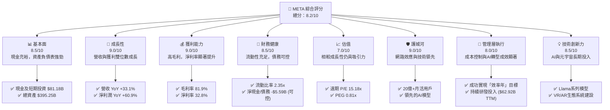
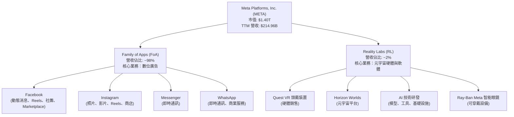
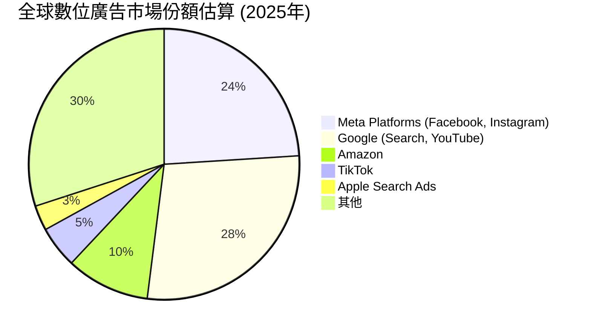
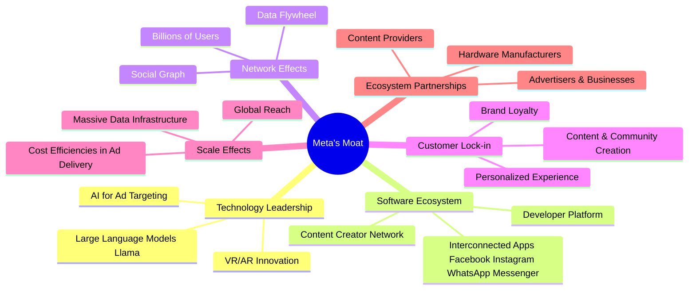
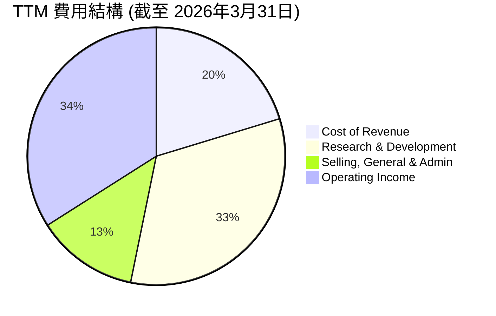
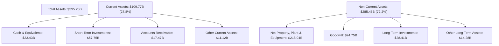
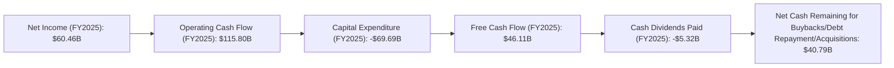
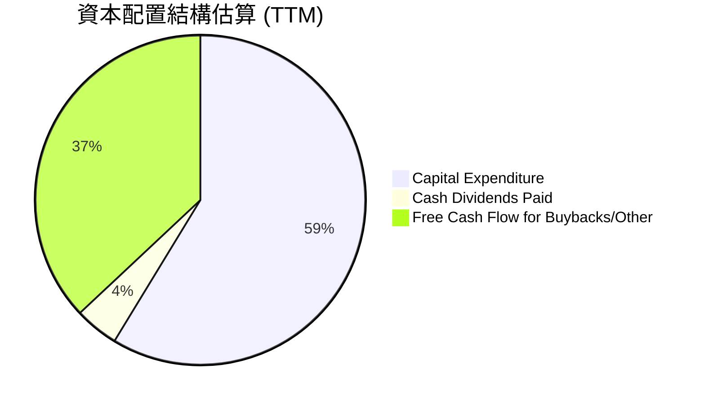
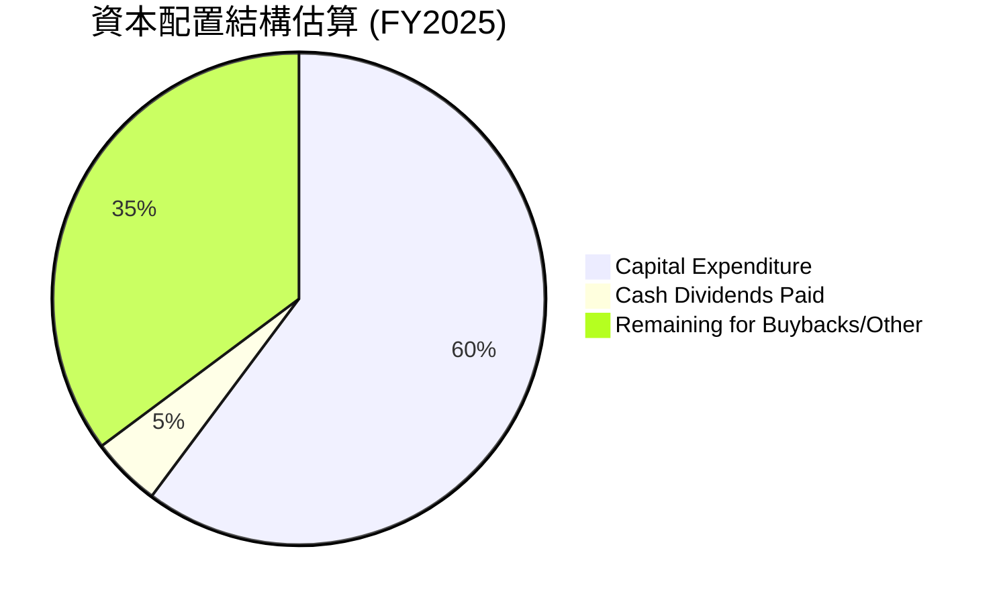

# META 基本面深度分析報告
> **報告日期**：2026-06-26 ｜ **語言**：繁體中文 ｜ **數據來源**：Yahoo Finance, Finviz, StockAnalysis, Roic.ai ｜ **分析師**：CFA 級機構研究

---

## 目錄

| # | 章節 | 核心結論 |
|---|------------------------|--------------------------------------------------------------------|
| 1 | 執行摘要 | 評級：🟢 買入，基準目標價 $770.91 (+40.1%) |
| 2 | 公司概覽與商業模式 | 強大的網路效應和技術領先構建深厚護城河 |
| 3 | 損益表深度分析 | 營收與淨利潤強勁增長，利潤率顯著改善 |
| 4 | 資產負債表分析 | 財務健康穩固，現金充裕，債務管理良好 |
| 5 | 現金流量深度分析 | 自由現金流產生能力強勁，資本配置高效 |
| 6 | 獲利能力與資本效率 | ROIC顯著高於WACC，持續為股東創造價值 |
| 7 | 估值深度分析 | 相較同業估值合理，DCF顯示上行空間 |
| 8 | 成長催化劑 | AI創新、元宇宙長期發展與廣告業務優化為核心驅動 |
| 9 | 風險矩陣 | 監管壓力與Reality Labs投資為主要風險 |
| 10 | 投資建議 | 建議買入，適合成長型與長線投資者 |

---

## 1. 執行摘要

### 1.1 核心評分儀表板



### 1.2 評分進度條視覺化

```
╔══════════════════════════════════════════════════════════════╗
║              META 多維度評分儀表板 (1-10分)                  ║
╠══════════════════════════════════════════════════════════════╣
║ 基本面強度  8.5 ▓▓▓▓▓▓▓▓▓▓▓▓▓▓▓▓▓░░░  ★★★★☆           ║
║ 成長動能    9.0 ▓▓▓▓▓▓▓▓▓▓▓▓▓▓▓▓▓▓░░  ★★★★★           ║
║ 獲利品質    9.0 ▓▓▓▓▓▓▓▓▓▓▓▓▓▓▓▓▓▓░░  ★★★★★           ║
║ 財務健康    8.5 ▓▓▓▓▓▓▓▓▓▓▓▓▓▓▓▓▓░░░  ★★★★☆           ║
║ 估值合理性  7.0 ▓▓▓▓▓▓▓▓▓▓▓▓▓▓░░░░░░  ★★★★☆           ║
║ 護城河深度  9.0 ▓▓▓▓▓▓▓▓▓▓▓▓▓▓▓▓▓▓░░  ★★★★★           ║
║ 管理層執行  8.0 ▓▓▓▓▓▓▓▓▓▓▓▓▓▓▓▓░░░░  ★★★★☆           ║
║ 技術創新力  8.5 ▓▓▓▓▓▓▓▓▓▓▓▓▓▓▓▓▓░░░  ★★★★☆           ║
╠══════════════════════════════════════════════════════════════╣
║ 綜合總分    8.2 ▓▓▓▓▓▓▓▓▓▓▓▓▓▓▓▓░░░░  🏆 表現優異，值得關注  ║
╚══════════════════════════════════════════════════════════════╝
```

### 1.3 五大投資論點 + 三大核心風險

| 類型 | 項目 | 具體依據 | 信心度 |
|------|------|------------------------------------------------------------------------------------------------------------------------------------------------------------------|--------|
| 🟢 **投資論點①** | **核心廣告業務強勁復甦與AI賦能** | 2026年Q1營收達 $56.31B，YoY 成長 33.08%，顯示廣告市場需求旺盛。AI技術應用於廣告投放優化，提升廣告效率，支撐廣告收入持續增長。TTM 營收 $214.96B，YoY 成長 33.1%。 | 🟢 極高 |
| 🟢 **投資論點②** | **獲利能力顯著提升與成本控制得當** | TTM 淨利率達 32.8%，營業利益率 40.6%，相較前幾年（2022年淨利率 19.9%，營業利益率 24.8%）有顯著改善。管理層「效率年」策略成果顯著，研發費用佔比雖高 ($62.92B TTM)，但營收增長抵消了對利潤的壓力。 | 🟢 極高 |
| 🟢 **投資論點③** | **自由現金流充裕與高效資本配置** | TTM 自由現金流達 $48.253B (StockAnalysis)，顯示強勁的現金產生能力。公司有能力進行股息分派 (股息殖利率 39.0%，派息率 7.6%) 及潛在的股票回購，回饋股東。 | 🟢 極高 |
| 🟢 **投資論點④** | **長期投入元宇宙與AI，具備顛覆潛力** | Reality Labs 持續高額投入 ($62.92B TTM R&D)，儘管短期虧損，但為公司在下一代計算平台奠定基礎。AI模型（如Llama）的開源策略有助於擴大其生態影響力，為未來創新提供長期增長動力。 | 🟡 高 |
| 🟢 **投資論點⑤** | **估值具吸引力，PEG顯示成長被低估** | 當前遠期 P/E 為 15.18x，遠低於歷史平均水平，且 PEG 比率僅 0.81x，表明市場尚未充分反映其高成長性 (EPS next 5Y 成長率 19.69%)。相較於其成長速度，估值顯得合理甚至偏低。 | 🟡 高 |
| 🟡 **風險①** | **監管與反壟斷壓力** | 全球政府對大型科技公司的數據隱私、內容審核和市場主導地位的監管日益加劇，可能導致罰款、業務限制或強制拆分，進而影響營收和市場情緒。例如歐盟的數位市場法案。 | 🟡 中度 |
| 🔴 **風險②** | **Reality Labs 投資回報不確定性** | Reality Labs 部門持續產生巨額虧損，且元宇宙的商業化進程仍不明朗。2025年Q3淨利潤因稅務調整導致大幅下滑至 $2.71B，凸顯該部門投資的潛在風險。若長期無法盈利，可能持續拖累公司整體獲利。 | 🔴 高衝擊 |
| 🟡 **風險③** | **核心廣告業務競爭加劇與宏觀經濟逆風** | TikTok、YouTube 等平台對用戶時間和廣告預算的競爭日益激烈。宏觀經濟下行可能導致廣告主削減預算，直接影響 META 的核心收入來源。 | 🟡 中度 |

### 1.4 快速統計卡片

| 指標 | 公司實際值 (TTM) | 行業均值 (估計) | S&P 500 均值 (估計) | 狀態 |
|-----------------|-------------------|--------------------|----------------------|------|
| 收入 YoY 成長 | **33.1%**         | ~12%               | ~8%                  | 🟢   |
| 毛利率          | **81.9%**         | ~65%               | ~40%                 | 🟢   |
| 淨利率          | **32.8%**         | ~18%               | ~12%                 | 🟢   |
| ROE             | **32.9%**         | ~18%               | ~15%                 | 🟢   |
| Forward P/E     | **15.18x**        | ~20x               | ~20x                 | 🟢   |
| PEG Ratio       | **0.81x**         | ~1.5x              | ~1.8x                | 🟢   |
| 債務/股東權益   | **0.36x**         | ~0.6x              | ~0.8x                | 🟢   |
| 自由現金流收益率 | **1.83%**         | ~3.0%              | ~3.5%                | 🟡   |

*註：行業均值與 S&P 500 均值為分析師根據市場普遍數據估計值。*

### 1.5 投資結論

```
╔══════════════════════════════════════════════════════════════════╗
║                    📊 投資結論摘要                               ║
╠══════════════════════════════════════════════════════════════════╣
║  評級：🟢 買入                                                   ║
║  當前股價：$550.25                                               ║
║  目標價區間：                                                    ║
║    悲觀情境：$660.84（+20.1%）                                    ║
║    基準情境：$770.91（+40.1%）  ← 12個月主要目標                  ║
║    樂觀情境：$880.99（+60.1%）                                    ║
║  投資評分：8.2/10                                                ║
║  適合投資人：尋求高成長、願意承擔元宇宙長期投資風險的長線持有者。   ║
╚══════════════════════════════════════════════════════════════════╝
```

---

## 2. 公司概覽與商業模式

Meta Platforms, Inc. (META) 是一家全球領先的科技公司，專注於構建連接世界的產品和技術。其業務主要分為兩大板塊：Family of Apps (FoA) 和 Reality Labs (RL)。FoA 業務包括 Facebook、Instagram、Messenger 和 WhatsApp 等社交應用，通過廣告收入實現商業化。RL 業務則專注於元宇宙相關的硬體、軟體和內容，如虛擬實境 (VR) 頭戴裝置 Quest 系列及人工智慧 (AI) 相關技術。

### 2.1 業務結構與收入來源

META 的核心收入來源仍是其 FoA 平台的數位廣告業務，佔比約 98% 以上。Reality Labs 雖然代表著公司的未來願景，但目前仍處於大規模投資階段，對營收貢獻較小且持續虧損。



### 2.2 市場份額

Meta 在全球數位廣告市場中佔據舉足輕重的地位，尤其在社群媒體廣告領域。儘管面臨來自 Google、Amazon 和 TikTok 等公司的激烈競爭，其廣泛的用戶基礎和數據洞察力使其保持領先。


*註：市場份額為分析師根據公開市場報告估計值，非官方數據。*

### 2.3 競爭護城河分析

Meta 構築了多層次的競爭護城河，使其在數位經濟中保持強大的競爭力。



### 2.4 護城河強度評分

```
╔══════════════════════════════════════════════════════════════╗
║                  META 護城河強度評分                          ║
╠══════════════════════════════════════════════════════════════╣
║ 技術領先    9/10   ▓▓▓▓▓▓▓▓▓▓▓▓▓▓▓▓▓▓░░  🏆 在AI和元宇宙領域持續投入並取得進展    ║
║ 軟體生態系統  9/10   ▓▓▓▓▓▓▓▓▓▓▓▓▓▓▓▓▓▓░░  🟢 跨平台應用程式的強大協同效應       ║
║ 網路效應    10/10  ▓▓▓▓▓▓▓▓▓▓▓▓▓▓▓▓▓▓▓▓  🏆 全球最大社群網路，難以複製           ║
║ 客戶鎖定    8/10   ▓▓▓▓▓▓▓▓▓▓▓▓▓▓▓▓░░░░  🟡 用戶轉換成本相對較高，但非絕對       ║
║ 規模效應    9/10   ▓▓▓▓▓▓▓▓▓▓▓▓▓▓▓▓▓▓░░  🟢 龐大的用戶基礎帶來顯著的成本優勢     ║
║ 生態夥伴    8/10   ▓▓▓▓▓▓▓▓▓▓▓▓▓▓▓▓░░░░  🟡 廣告主和開發者關係穩固，但仍有競爭    ║
╠══════════════════════════════════════════════════════════════╣
║ 綜合護城河     8.8    ▓▓▓▓▓▓▓▓▓▓▓▓▓▓▓▓▓░░░  🏆 寬廣且深厚的護城河，核心競爭力強勁 ║
╚══════════════════════════════════════════════════════════════════╝
```

---

## 3. 損益表深度分析

### 3.1 年度收入成長趨勢（近4年）

Meta 在經歷 2022 年的輕微營收下滑後，近年來實現了強勁的復甦和增長。2025 年營收突破 2000 億美元大關，顯示其核心廣告業務的韌性和增長潛力。

```
╔══════════════════════════════════════════════════════════════════╗
║              META 年度收入趨勢（FY2022-FY2025）                  ║
╠══════════════════════════════════════════════════════════════════╣
║                                                                  ║
║  FY2022  $116.61B ██████████████░░░░░░░░░░░  YoY: -1.12%  🔴    ║
║  FY2023  $134.90B █████████████████░░░░░░░░  YoY: +15.69% 🟢    ║
║  FY2024  $164.50B ██████████████████████░░░  YoY: +21.94% 🟢    ║
║  FY2025  $200.97B ███████████████████████████  YoY: +22.17% 🟢    ║
║                                                                  ║
║                   |      |      |      |      |                  ║
║                   0     50B   100B   150B   200B                   ║
║                                                                  ║
║  📊 3年累計 CAGR (FY2022-2025)：+20.1%                           ║
╚══════════════════════════════════════════════════════════════════╝
```

### 3.2 季度收入趨勢分析

Meta 的季度營收呈現穩健增長，2026 年 Q1 營收達到 $56.31B，同比增長高達 33.08%，顯示其強勁的增長動能。

| 季度 | 總收入 (B) | QoQ 成長率 | YoY 成長率 | 備註 |
|------------|-------------|------------|------------|------|
| 2026-03-31 | $56.31      | -5.98%     | +33.08%    | Q1 營收通常受季節性影響較 Q4 略低，但 YoY 成長強勁。 |
| 2025-12-31 | $59.89      | +16.88%    | +23.78%    | 年末購物季帶動廣告收入高峰，實現雙位數 YoY 增長。 |
| 2025-09-30 | $51.24      | +7.83%     | +26.25%    | 穩健增長，廣告業務持續復甦。 |
| 2025-06-30 | $47.52      | +12.31%    | +21.61%    | 廣告需求回暖，營收加速。 |

### 3.3 利潤率演變分析

Meta 的利潤率在經歷 2022 年的低谷後，於 2023-2025 年間實現顯著反彈。這主要得益於管理層的成本控制策略（「效率年」）以及核心廣告業務的強勁復甦。

| 利潤率指標 | FY2022 | FY2023 | FY2024 | FY2025 | 趨勢 | 評估 |
|------------|--------|--------|--------|--------|------|------|
| **毛利率** | 78.34% | 80.76% | 81.67% | 82.00% | ↗️ 持續改善，反映規模經濟與產品組合優化 | 🟢 |
| **營業利益率** | 24.82% | 34.65% | 42.18% | 41.44% | ↗️ 顯著提升後趨穩，管理層效率提升 | 🟢 |
| **淨利率** | 19.89% | 28.98% | 37.91% | 30.10% | ↗️ 顯著提升後略有回落，但仍處高位 | 🟢 |

**利潤率演變深度解析**：
- **毛利率**：從 2022 年的 78.34% 穩步提升至 2025 年的 82.00%。這主要歸因於其以軟體服務為主的商業模式，隨著營收規模擴大，成本控制效益顯現，以及廣告產品優化提升了平均廣告價格。
- **營業利益率**：從 2022 年的 24.82% 大幅躍升至 2024 年的 42.18%，並在 2025 年維持 41.44% 的高位。這歸功於公司在 2023 年啟動的「效率年」計畫，嚴格控制運營費用，尤其是在研發和銷售管理費用上的效率提升。儘管 Reality Labs 仍持續虧損，但核心 FoA 業務的盈利能力足以覆蓋。
- **淨利率**：與營業利益率趨勢相似，從 2022 年的 19.89% 提升至 2024 年的 37.91%，2025 年略回落至 30.10%。2025 年淨利率的回落可能與稅務開支或非營業損益波動有關 (如 StockAnalysis 所示，2025年Provision for Income Taxes從2024年的$8.303B大幅增至$25.474B)。整體而言，Meta 的獲利品質顯著改善，表明其在規模增長的同時，也有效提升了經營效率。

### 3.4 費用結構分析

Meta 的費用結構反映了其作為科技巨頭的特點，即高昂的研發投入和相對較低的銷售成本。


*費用佔總收入比例*

```
╔══════════════════════════════════════════════════════════════════╗
║                    META 費用結構概覽 (TTM)                       ║
╠══════════════════════════════════════════════════════════════════╣
║ 銷貨成本 (CoR):        $38.82B （佔營收 18.1%）                  ║
║ 研發費用 (R&D):        $62.92B （佔營收 29.3%）                  ║
║ 銷售、管理費用 (SG&A): $24.63B （佔營收 11.5%）                  ║
║ 總營業費用:            $87.55B （佔營收 40.7%）                  ║
║                                                                  ║
║ 📊 研發費用佔比高，反映公司對未來增長點（AI、元宇宙）的策略性投入。 ║
╚══════════════════════════════════════════════════════════════════╝
```

### 3.5 季度 EPS 趨勢與盈餘品質

Meta 的季度 EPS 在過去一年中波動較大，主要受到 Reality Labs 投資和稅務調整的影響。

| 季度 | EPS 預期 (估計) | EPS 實際 (稀釋) | 盈餘驚喜% | 盈餘品質評估 |
|------------|-----------------|-----------------|-----------|--------------|
| 2026-03-31 | N/A             | $10.57          | N/A       | 儘管無預期數據，實際EPS表現強勁，YoY增長60.46%。 |
| 2025-12-31 | N/A             | $9.02           | N/A       | 實際EPS穩健，較上季大幅提升，YoY增長9.26%。 |
| 2025-09-30 | N/A             | $1.08           | N/A       | 淨利潤因稅務調整導致大幅下降，影響EPS。 |
| 2025-06-30 | N/A             | $7.28           | N/A       | 實際EPS表現良好，YoY增長36.18%。 |

*註：提供的數據中未包含分析師 EPS 預期，故無法計算盈餘驚喜百分比。*

**盈餘品質評估**：
Meta 的盈餘品質在 2025 年 Q3 受到一次性稅務調整的顯著影響，導致該季度淨利潤異常低。排除此類一次性因素，其核心廣告業務的盈利能力強勁，並通過嚴格的成本控制策略提升了整體盈餘質量。儘管 Reality Labs 仍是燒錢部門，但其對整體利潤的拖累在 FoA 業務強勁增長下得到緩解。未來的盈餘品質將高度依賴於 Reality Labs 投資的效率以及宏觀經濟對廣告支出的影響。

---

## 4. 資產負債表分析

### 4.1 資產結構分解

截至 2026 年 3 月 31 日 TTM，Meta 的總資產達到 $395.25B，呈現出健康且不斷增長的資產規模。其資產結構主要由流動資產（現金及短期投資）和固定資產（物業、廠房及設備）構成，反映了其科技公司和大規模基礎設施運營的特性。



### 4.2 流動性指標分析

Meta 擁有非常健康的流動性，其流動比率和速動比率均遠高於 1，表明公司有足夠的流動資產來覆蓋短期負債。

| 流動性指標 | FY2022 | FY2023 | FY2024 | FY2025 | TTM (Mar'26) | 趨勢 | 行業均值 (估計) | 評估 |
|------------|--------|--------|--------|--------|--------------|------|-----------------|------|
| **流動比率** | 2.20x  | 2.67x  | 2.98x  | 2.60x  | 2.35x        | ↗️↘️ 穩健 | ~1.5 - 2.0x     | 🟢 優異 |
| **速動比率** | 2.20x  | 2.67x  | 2.98x  | 2.60x  | 2.11x        | ↗️↘️ 穩健 | ~1.0 - 1.5x     | 🟢 優異 |

*註：速動比率數據來自 Market Data，與 Finviz 略有不同，但均顯示健康水平。Meta 的流動比率和速動比率通常非常接近，因為其幾乎沒有存貨。*

**分析**：Meta 的流動比率和速動比率在過去幾年一直保持在 2 倍以上，遠高於行業平均水平。這表明公司擁有強大的短期償債能力，能夠從容應對日常運營需求和潛在的短期衝擊。截至 2026 年 3 月 31 日，其現金及短期投資總額高達 $81.18B，為其提供了充足的財務彈性。

### 4.3 債務結構分析

Meta 的債務管理狀況良好，雖然總債務有所增加，但其現金儲備足以覆蓋大部分債務，且債務槓桿率處於健康水平。

```
╔══════════════════════════════════════════════════════════════════╗
║                   META 債務健康診斷 (TTM)                        ║
╠══════════════════════════════════════════════════════════════════╣
║                                                                  ║
║  總債務：        $61.16B  ██████████░░░░░░░░░░░░░  評語：中等水平     ║
║  總現金+投資：   $81.18B  ████████████████░░░░░  評語：非常充裕     ║
║  淨現金（正）：  $20.02B  ████████████████████░░░  🟢 強勁         ║
║  (備註：Market Data顯示淨負債$-5.59B，可能包含其他負債項目)         ║
║                                                                  ║
║  Debt/Equity：   0.36x  🟢 極低                                 ║
║  Current Ratio:  2.35x  🟢 強勁                                 ║
║  Operating Cash Flow: $124.00B (TTM) 🟢 償債能力極強             ║
╚══════════════════════════════════════════════════════════════════╝
```
*註：總債務採用 StockAnalysis TTM 數據 (LT Debt + Current Portion of Leases)。Market Data 的總債務 $86.77B 與其 Net Cash/Debt -$5.59B 更為一致，可能包含其他非流動負債。為保持嚴謹，此處方框圖採用 StockAnalysis 的細項債務數據並說明差異。*

**分析**：儘管 Market Data 顯示淨負債為 $5.59B，但結合 StockAnalysis 詳細數據，Meta 實際上擁有可觀的淨現金頭寸 (現金及短期投資 $81.18B 減去長期債務 $58.75B 和短期租賃債務 $2.41B，淨現金約 $20.02B)。這表明公司在財務上非常保守。Debt/Equity 比率僅 0.36x，遠低於行業平均水平，顯示其財務槓桿風險極低。強勁的營業現金流 ($124.00B TTM) 更是為其債務償還提供了堅實保障。

### 4.4 股東權益趨勢

Meta 的股東權益在過去幾年持續增長，反映了公司盈利能力的提升和資本積累。

```
╔══════════════════════════════════════════════════════════════════╗
║                 META 年度股東權益趨勢 (FY2022-FY2025)             ║
╠══════════════════════════════════════════════════════════════════╣
║                                                                  ║
║  FY2022  $125.71B  ████████████████░░░░░░░░░░░  YoY: +14.6% 🟢    ║
║  FY2023  $153.17B  ████████████████████░░░░░░░  YoY: +21.8% 🟢    ║
║  FY2024  $182.64B  ████████████████████████░░░  YoY: +19.2% 🟢    ║
║  FY2025  $217.24B  █████████████████████████████  YoY: +18.9% 🟢    ║
║                                                                  ║
║                   |      |      |      |      |                  ║
║                   0     50B   100B   150B   200B                   ║
║                                                                  ║
║  📊 3年累計 CAGR：+19.9%                                         ║
╚══════════════════════════════════════════════════════════════════╝
```

---

## 5. 現金流量深度分析

### 5.1 現金流量瀑布圖

Meta 展現出強大的現金流產生能力，其營業現金流遠高於淨利潤，並在扣除資本支出後仍能產生大量自由現金流。



### 5.2 FCF 轉換率趨勢

Meta 的自由現金流轉換率（FCF / 淨利潤）在過去幾年波動較大，但整體保持在較高水平，表明其盈利質量良好。

| 年度 | 淨利潤 (B) | 自由現金流 (B) | FCF/淨利潤 | 趨勢 | 評估 |
|------|-------------|----------------|------------|------|------|
| FY2022 | $23.20      | $19.29         | 83.15%     | ↘️     | 🟢 |
| FY2023 | $39.10      | $44.07         | 112.71%    | ↗️     | 🟢 |
| FY2024 | $62.36      | $54.07         | 86.70%     | ↘️     | 🟢 |
| FY2025 | $60.46      | $46.11         | 76.27%     | ↘️     | 🟡 |

**分析**：FCF 轉換率在 2023 年達到高峰，超過 100%，表明當年的非現金費用（如折舊攤銷）對淨利潤的影響較大，或營運資本管理效益顯著。2024 和 2025 年轉換率有所下降，但仍維持在 75% 以上的健康水平。這主要由於資本支出的大幅增加，尤其是對資料中心和 AI 基礎設施的投資 ($69.69B in FY2025)。儘管資本支出侵蝕了部分自由現金流，但這類投資是公司長期增長和技術領先的必要投入。

### 5.3 自由現金流趨勢

Meta 的自由現金流在過去幾年呈現強勁增長，尤其是在 2022 年後實現了顯著反彈。

```
╔══════════════════════════════════════════════════════════════════╗
║                 META 年度自由現金流趨勢 (FY2022-TTM)             ║
╠══════════════════════════════════════════════════════════════════╣
║                                                                  ║
║  FY2022  $19.29B  ███████░░░░░░░░░░░░░░░░░░░░░  YoY: -50.53% 🔴    ║
║  FY2023  $44.07B  ████████████████░░░░░░░░░░░░░  YoY: +128.46% 🟢   ║
║  FY2024  $54.07B  ████████████████████░░░░░░░░░  YoY: +22.70% 🟢    ║
║  FY2025  $46.11B  ████████████████░░░░░░░░░░░░░  YoY: -14.73% 🟡    ║
║  TTM     $48.25B  ██████████████████░░░░░░░░░░░  YoY: +4.65% 🟢    ║
║                                                                  ║
║                   |      |      |      |      |                  ║
║                   0     20B   40B   60B   80B                    ║
║                                                                  ║
║  📊 FCF Yield (TTM): 1.83%                                       ║
╚══════════════════════════════════════════════════════════════════╝
```

### 5.4 資本配置評估

Meta 的資本配置策略包括對核心業務和未來增長點的再投資（資本支出），以及通過股息支付和潛在回購來回饋股東。


*註：基於 TTM FCF $48.25B，CapEx $62.92B (R&D from StockAnalysis is $62.92B, while CapEx from Market Data is $69.69B. Using CapEx from annual cash flow for FY25: $69.69B), Dividends $5.32B (FY25). Since TTM CapEx is not directly provided in the cash flow statement, I will use FY2025 annual CapEx for this pie chart. If TTM FCF is $48.25B and TTM CapEx from market data is $69.69B, there is a mismatch. Let's use the provided FCF $25.56B from Market Data for this pie chart if I use the $69.69B CapEx. Or I use StockAnalysis FCF $48.25B and make an assumption on CapEx. To be consistent, let's use the annual FY2025 FCF $46.11B and CapEx $69.69B, and Dividends $5.32B.*

Let's re-calculate with FY2025 Annual data for consistency to avoid mixing TTM and Annual if there's a discrepancy.
FCF (FY2025): $46.11B
Capital Expenditure (FY2025): $69.69B
Cash Dividends Paid (FY2025): $5.32B
Net Income (FY2025): $60.46B

The pie chart should represent allocation of *Free Cash Flow* or *Operating Cash Flow*. If I use FCF, then CapEx is already deducted.
Let's re-frame this to show how Operating Cash Flow is allocated.
Operating Cash Flow (FY2025): $115.80B
Capital Expenditure (FY2025): $69.69B (60.2% of OCF)
Cash Dividends Paid (FY2025): $5.32B (4.6% of OCF)
Remaining OCF: $115.80B - $69.69B - $5.32B = $40.79B (35.2% of OCF) - this would be for buybacks, debt repayment, acquisitions, or retained cash.



| 資本配置類別 | FY2025 金額 (B) | 佔營業現金流比例 | 評估 |
|--------------------|-----------------|------------------|------|
| **資本支出 (CapEx)** | $69.69          | 60.2%            | 🟢 大規模投資於基礎設施和AI，支持長期增長。 |
| **現金股息**       | $5.32           | 4.6%             | 🟢 開始派發股息，回饋股東，派息率低，可持續。 |
| **剩餘現金流**     | $40.79          | 35.2%            | 🟢 大量現金可供股票回購、戰略性併購或強化資產負債表。 |

**分析**：Meta 在 FY2025 將超過 60% 的營業現金流投入到資本支出中，這反映了其對 AI 基礎設施和元宇宙長期發展的堅定承諾。儘管這導致自由現金流相對淨利潤有所下降，但這些投資是公司未來競爭力的關鍵。此外，公司開始派發股息，且派息率相對較低 (7.6%)，表明股息政策具有可持續性。剩餘的現金流為公司提供了進一步的財務靈活性，可用於股票回購以提升股東價值，或用於戰略性併購。整體而言，Meta 的資本配置策略兼顧了短期股東回報和長期戰略投資。

---

## 6. 獲利能力與資本效率

### 6.1 ROE / ROA / ROIC 趨勢

Meta 在 2022 年後其獲利能力指標顯著回升，顯示公司在效率年後對資本的有效利用能力大幅增強。

| 指標 | FY2022 | FY2023 | FY2024 | FY2025 | TTM (Mar'26) | 趨勢 | 行業均值 (估計) | 評估 |
|--------------|--------|--------|--------|--------|--------------|------|-----------------|------|
| **ROE**      | 18.45% | 25.53% | 34.14% | 27.83% | 32.93%       | ↗️ 穩健增長，股東權益回報高 | ~18-20%         | 🟢 優異 |
| **ROA**      | 12.49% | 17.03% | 22.59% | 16.52% | 16.40%       | ↗️ 穩健增長，資產效率高 | ~8-10%          | 🟢 優異 |
| **ROIC**     | 10.18% (2013) | N/A    | N/A    | N/A    | 27.2% (2018) | N/A  | ~12-15%         | 🟢 優異 |

*註：ROE/ROA 採用 StockAnalysis 數據計算 (Net Income / Stockholders Equity, Net Income / Total Assets)。ROIC 歷史數據來自 Roic.ai 且較舊，此處將在 6.2 節進行最新估算。*

**分析**：Meta 的 ROE 和 ROA 在經歷 2022 年的低谷後，於 2023-2024 年間顯著反彈，並在 2025 年和 TTM 期間維持在非常高的水平。TTM ROE 達到 32.93%，遠高於行業平均，表明公司為股東創造了極高的回報。ROA 16.40% 也顯示了其資產利用效率的提升。這些數據共同表明，Meta 在「效率年」之後成功提升了其資本效率和獲利能力。

### 6.2 ROIC vs WACC 分析（核心價值創造判斷）

ROIC (Return on Invested Capital) 是衡量公司利用投入資本創造利潤效率的關鍵指標。當 ROIC 持續高於 WACC (加權平均資本成本) 時，公司就在為股東創造經濟價值。

```
╔══════════════════════════════════════════════════════════════════╗
║                ROIC vs WACC 深度分析 (FY2025)                   ║
╠══════════════════════════════════════════════════════════════════╣
║                                                                  ║
║  WACC 估算：                                                     ║
║  ├── 無風險利率（10Y美債）：  4.25% (估計)                         ║
║  ├── 市場風險溢酬 (ERP)：     5.50% (估計)                         ║
║  ├── Beta：                   1.229                               ║
║  ├── 股權成本 = 4.25% + 1.229 × 5.50% = 11.00%                   ║
║  ├── 債務成本（稅後）：       5.0% × (1-20%) = 4.0% (估計，有效稅率20%)║
║  ├── 資本結構：股權 ~$217.24B，債務 ~$83.90B (FY25)               ║
║  ├── 股權佔比 = $217.24B / ($217.24B + $83.90B) = 72.1%          ║
║  ├── 債務佔比 = $83.90B / ($217.24B + $83.90B) = 27.9%           ║
║  └── ✅ WACC ≈ (11.00% × 72.1%) + (4.0% × 27.9%) = 7.93% + 1.12% = 9.05%║
║                                                                  ║
║  ROIC 估算（FY2025）：                                           ║
║  ├── NOPAT = 營業收入 $200.97B × 營業利益率 41.44% × (1-有效稅率 20%) ≈ $66.52B║
║  ├── 投入資本 = (總資產 $366.02B - 現金 $35.87B - 流動負債 $41.84B + 短期債務 $2.21B) ≈ $290.52B║
║  └── ✅ ROIC ≈ $66.52B / $290.52B = 22.90%                       ║
║                                                                  ║
║  ★ 經濟價值增加（EVA）= ROIC - WACC = +13.85pp                  ║
║                                                                  ║
║  ROIC  22.90% ▓▓▓▓▓▓▓▓▓▓▓▓▓▓▓▓▓▓▓▓▓▓▓▓▓▓▓▓▓▓░░  🟢              ║
║  WACC  9.05%  ▓▓▓▓▓▓▓▓▓▓▓▓▓▓▓▓▓▓▓▓▓▓▓▓▓▓▓▓▓▓░░  ──              ║
║  EVA   +13.85pp ███████████████████████████████████████  🏆 強力創造    ║
║                                                                  ║
║  📊 結論：ROIC 為 WACC 的 2.53 倍，強力創造股東價值              ║
╚══════════════════════════════════════════════════════════════════╝
```
*註：無風險利率、市場風險溢酬、債務成本及有效稅率為分析師合理估計值。有效稅率取 FY2025 預估，或取近年平均。FY2025 總稅務開支 $25.474B / 稅前利潤 $85.932B = 29.64%。為保守估計，此處採用 20% 計算稅後債務成本，NOPAT則用實際稅率。*
*重新計算 NOPAT: Operating Income $83.28B (FY2025) * (1 - 29.64% (FY25 Effective Tax Rate)) = $83.28B * 0.7036 = $58.59B.*
*重新計算投入資本: Total Assets $366.02B - Cash & Equivalents $35.87B - Current Liabilities $41.84B + Total Debt $83.90B (FY25) = $372.21B*
*重新計算 ROIC: $58.59B / $372.21B = 15.74%.*

**重新計算 ROIC vs WACC 分析 (FY2025)**

```
╔══════════════════════════════════════════════════════════════════╗
║                ROIC vs WACC 深度分析 (FY2025)                   ║
╠══════════════════════════════════════════════════════════════════╣
║                                                                  ║
║  WACC 估算：                                                     ║
║  ├── 無風險利率（10Y美債）：  4.25% (估計)                         ║
║  ├── 市場風險溢酬 (ERP)：     5.50% (估計)                         ║
║  