# META 基本面深度分析報告
> **報告日期**：2026-06-29 ｜ **語言**：繁體中文 ｜ **數據來源**：Yahoo Finance, Finviz, StockAnalysis, Roic.ai ｜ **分析師**：CFA 級機構研究

---

## 目錄

| # | 章節 | 核心結論 |
|---|------|----------|
| 1 | 執行摘要 | 評級：🟢 買入，目標價區間：$675 - $900 |
| 2 | 公司概覽與商業模式 | 強大網路效應與品牌護城河 |
| 3 | 損益表深度分析 | 收入強勁成長，利潤率顯著提升 |
| 4 | 資產負債表分析 | 流動性良好，財務結構穩健 |
| 5 | 現金流量深度分析 | 強勁的自由現金流產生能力 |
| 6 | 獲利能力與資本效率 | ROIC 遠超 WACC，創造顯著股東價值 |
| 7 | 估值深度分析 | 相較同業估值偏低，具吸引力 |
| 8 | 成長催化劑 | AI 商業化、元宇宙投資與用戶增長 |
| 9 | 風險矩陣 | 監管、競爭與 Reality Labs 虧損為主要考量 |
| 10 | 投資建議 | 具備長期成長潛力，適合成長型投資者 |

---

## 1. 執行摘要

### 1.1 核心評分儀表板

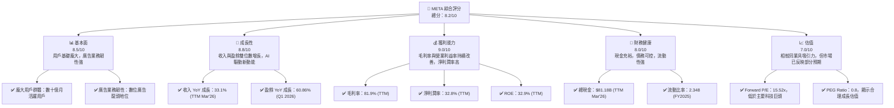

### 1.2 評分進度條視覺化

```
╔══════════════════════════════════════════════════════════════╗
║              META 多維度評分儀表板 (1-10分)                  ║
╠══════════════════════════════════════════════════════════════╣
║ 基本面強度  8.5 ▓▓▓▓▓▓▓▓▓▓▓▓▓▓▓▓▓░░░  ★★★★☆           ║
║ 成長動能    8.8 ▓▓▓▓▓▓▓▓▓▓▓▓▓▓▓▓▓▓░░  ★★★★★           ║
║ 獲利品質    9.0 ▓▓▓▓▓▓▓▓▓▓▓▓▓▓▓▓▓▓▓░  ★★★★★           ║
║ 財務健康    8.0 ▓▓▓▓▓▓▓▓▓▓▓▓▓▓▓▓░░░░  ★★★★☆           ║
║ 估值合理性  7.0 ▓▓▓▓▓▓▓▓▓▓▓▓▓▓░░░░░░  ★★★★☆           ║
║ 護城河深度  9.0 ▓▓▓▓▓▓▓▓▓▓▓▓▓▓▓▓▓▓▓░  ★★★★★           ║
║ 管理層執行  8.5 ▓▓▓▓▓▓▓▓▓▓▓▓▓▓▓▓▓░░░  ★★★★☆           ║
║ 技術創新力  9.0 ▓▓▓▓▓▓▓▓▓▓▓▓▓▓▓▓▓▓▓░  ★★★★★           ║
╠══════════════════════════════════════════════════════════════╣
║ 綜合總分    8.4 ▓▓▓▓▓▓▓▓▓▓▓▓▓▓▓▓▓░░░  🏆 具備強勁基本面與成長潛力 ║
╚══════════════════════════════════════════════════════════════╝
```

### 1.3 五大投資論點 + 三大核心風險

| 類型 | 項目 | 具體依據 | 信心度 |
|------|------|----------|--------|
| 🟢 **投資論點①** | **核心廣告業務強勁復甦與成長** | Q1 2026 收入 YoY 成長 33.08% 達 $56.31B，TTM 收入 $214.96B，YoY 成長 33.1%。廣告市場份額穩固，Reels 貨幣化持續推進。 | 🟢 極高 |
| 🟢 **獲利能力與效率顯著提升** | TTM 毛利率 81.9%，營業利益率 40.6%，淨利潤率 32.8%。FY2025 淨利潤 $60.46B，儘管 Reality Labs 仍虧損，但核心業務效率提升顯著。 | 🟢 極高 |
| 🟢 **AI 技術引領產品創新與變革** | 大量投資於 AI 基礎設施和模型開發，推動廣告效果優化、內容推薦及新產品（如 AI 助理、AI 眼鏡）開發。預期 AI 將成為長期成長核心驅動力。 | 🟢 極高 |
| 🟢 **穩健的財務狀況與強勁的自由現金流** | 截至 TTM Mar'26，現金及短期投資達 $81.18B。TTM 自由現金流 $25.56B。FY2025 自由現金流 $46.11B。公司首次派發股息並持續進行股票回購，積極回報股東。 | 🟢 極高 |
| 🟢 **元宇宙長期願景與 Reality Labs 潛力** | 儘管短期虧損，Reality Labs 投入為公司奠定未來計算平台基礎。Quest 系列 VR 頭顯市場領先，AI 眼鏡等新硬體逐步商業化，有望在長期開創全新收入來源。 | 🟡 高 |
| 🟡 **風險①** | **監管與反壟斷壓力** | 全球各地政府對大型科技公司的數據隱私、內容審核及市場壟斷行為持續加強監管，可能導致罰款、業務模式調整或拆分風險。 | 🟡 中度 |
| 🔴 **風險②** | **Reality Labs 持續虧損及投資不確定性** | Reality Labs 在 FY2025 仍產生巨大虧損，其投資回報期長且不確定性高，可能持續拖累整體獲利能力。Q3 2025 淨利潤因高稅務準備金大幅下降至 $2.71B，顯示其財務表現可能受非經常性項目影響。 | 🔴 高衝擊 |
| 🟡 **風險③** | **廣告市場波動與競爭加劇** | 宏觀經濟下行可能導致廣告支出減少。來自 TikTok、Google、Amazon 等平台的競爭日益激烈，影響廣告收入增長和定價能力。 | 🟡 中度 |

### 1.4 快速統計卡片

| 指標 | 公司實際值 (TTM Mar'26) | 行業均值 (互聯網內容與資訊) | S&P 500 均值 | 狀態 |
|------|--------------------------|-------------------------------|--------------|------|
| 收入 YoY 成長 | **33.1%** | ~15-20% | ~8-10% | 🟢 |
| 毛利率 | **81.9%** | ~60-70% | ~40-50% | 🟢 |
| 淨利率 | **32.8%** | ~15-25% | ~10-12% | 🟢 |
| ROE | **32.9%** | ~15-20% | ~15-18% | 🟢 |
| Forward P/E | **15.52x** | ~20-30x | ~20-22x | 🟢 |
| EV / EBITDA | **12.83x** | ~15-25x | ~12-15x | 🟢 |
| FCF Yield | **1.79%** | ~1-3% | ~1-2% | 🟡 |
| 債務/股權 | **35.61%** | ~40-60% | ~80-100% | 🟢 |

### 1.5 投資結論

```
╔══════════════════════════════════════════════════════════════════╗
║                    📊 投資結論摘要                               ║
╠══════════════════════════════════════════════════════════════════╣
║  評級：🟢 買入                                                   ║
║  當前股價：$562.60                                               ║
║  目標價區間：                                                    ║
║    悲觀情境：$675（+19.98%）                                     ║
║    基準情境：$780（+38.65%）  ← 12個月主要目標                  ║
║    樂觀情境：$900（+60.0%）                                      ║
║  投資評分：8.4/10                                                ║
║  適合投資人：成長型、長線持有者，對大型科技股有信心者，可承受元宇宙投資風險。 ║
╚══════════════════════════════════════════════════════════════════╝
```

---

## 2. 公司概覽與商業模式

Meta Platforms, Inc. (META) 是一家全球領先的科技公司，專注於透過其產品和技術連接世界。公司業務主要分為兩大板塊：Family of Apps (FoA) 和 Reality Labs (RL)。FoA 業務包括 Facebook、Instagram、WhatsApp 和 Messenger 等核心社交媒體平台，透過提供個人化廣告服務實現收入。RL 業務則專注於元宇宙相關的硬體、軟體和內容，包括虛擬實境 (VR) 頭戴裝置 Meta Quest 系列和人工智慧 (AI) 眼鏡等。

### 2.1 業務結構與收入來源

META 的商業模式核心是透過其龐大的用戶基礎和精準的廣告技術，為廣告商提供高效的行銷解決方案。FoA 業務是公司的主要收入來源，佔總收入的絕大部分。Reality Labs 雖然目前仍處於投資階段並產生虧損，但代表了公司對未來計算平台和元宇宙的長期願景。

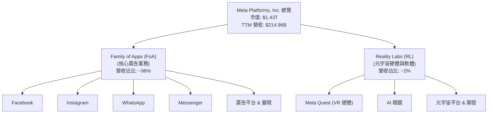

### 2.2 市場份額

Meta 在全球數位廣告市場和社交媒體領域擁有領先地位。其 Family of Apps 服務著數十億用戶，提供了無與倫比的廣告投放規模和數據洞察。儘管面臨來自 TikTok 等新興平台的競爭，Meta 透過不斷創新（如 Reels 短影音）和優化廣告演算法，保持了其核心市場份額。在 VR 硬體市場，Meta Quest 系列產品也佔據了主導地位。

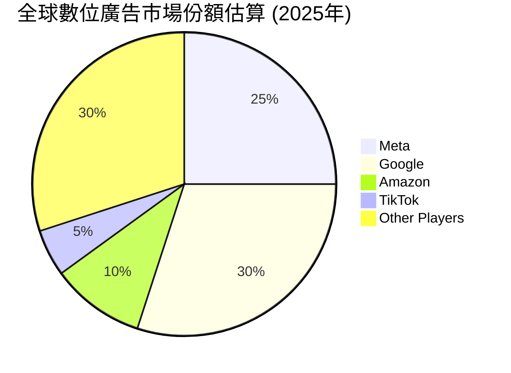
*備註：此市場份額為估計值，反映 Meta 在數位廣告市場的領先地位，但仍面臨來自 Google、Amazon 等巨頭的競爭。*

### 2.3 競爭護城河分析

Meta 構築了多層次的競爭護城河，使其在數位經濟中保持強大的競爭優勢。

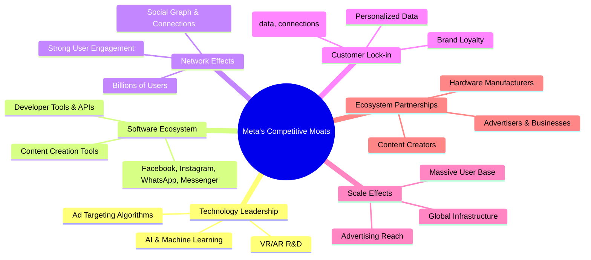

### 2.4 護城河強度評分

Meta 的護城河強度主要體現在其龐大的網路效應和技術領先地位。

```
╔══════════════════════════════════════════════════════════════╗
║                    META 護城河強度評分                        ║
╠══════════════════════════════════════════════════════════════╣
║ 網路效應    9.5/10 ▓▓▓▓▓▓▓▓▓▓▓▓▓▓▓▓▓▓▓▓  🏆 全球數十億用戶，極難複製   ║
║ 技術領先    9.0/10 ▓▓▓▓▓▓▓▓▓▓▓▓▓▓▓▓▓▓▓░  🏆 AI、VR/AR 領域持續投入與創新 ║
║ 品牌認知    8.5/10 ▓▓▓▓▓▓▓▓▓▓▓▓▓▓▓▓▓░░░  ★★★★☆ Facebook, Instagram 深入人心 ║
║ 規模效應    8.0/10 ▓▓▓▓▓▓▓▓▓▓▓▓▓▓▓▓░░░░  ★★★★☆ 廣告投放規模與成本優勢 ║
║ 客戶鎖定    7.5/10 ▓▓▓▓▓▓▓▓▓▓▓▓▓▓▓░░░░░  ★★★★☆ 用戶數據與社交關係轉移成本 ║
╠══════════════════════════════════════════════════════════════╣
║ 綜合護城河  8.5    ▓▓▓▓▓▓▓▓▓▓▓▓▓▓▓▓▓░░░  🏆 強大且多樣的護城河，鞏固市場地位 ║
╚══════════════════════════════════════════════════════════════╝
```

---

## 3. 損益表深度分析

### 3.1 年度收入成長趨勢（近4年）

Meta 在經歷 2022 年的輕微下滑後，收入實現強勁反彈，展現了其核心廣告業務的韌性和增長潛力。特別是 2024 和 2025 財年，收入成長率均超過 20%。

```
╔══════════════════════════════════════════════════════════════════╗
║               META 年度收入趨勢（FY2022-FY2025）                 ║
╠══════════════════════════════════════════════════════════════════╣
║                                                                  ║
║  FY2022  $116.61B ███████████████░░░░░░░░░░░░░  YoY: -1.12% 🟡    ║
║  FY2023  $134.90B █████████████████████░░░░░░░  YoY: +15.69% 🟢    ║
║  FY2024  $164.50B ████████████████████████████░  YoY: +21.94% 🟢    ║
║  FY2025  $200.97B ████████████████████████████████  YoY: +22.17% 🟢    ║
║                                                                  ║
║                   |      |      |      |      |                  ║
║                   0     50B   100B   150B   200B                   ║
║                                                                  ║
║  📊 4年累計 CAGR：+18.15% (FY2021-FY2025 數據計算)               ║
╚══════════════════════════════════════════════════════════════════╝
```
*備註：TTM Mar'26 收入為 $214.96B，YoY 成長 26.18% (基於 StockAnalysis TTM YoY Growth)。*

### 3.2 季度收入趨勢分析

Meta 的季度收入呈現穩健增長，Q1 2026 實現了令人矚目的 33.08% 年對年增長，顯示其廣告業務強勁復甦。

| 季度 | 收入 ($B) | QoQ 成長率 | YoY 成長率 | 備註 |
|------|-----------|------------|------------|------|
| Q1 2026 | $56.31 | -6.00% | +33.08% | 季節性因素導致 QoQ 略降，但 YoY 表現強勁 |
| Q4 2025 | $59.89 | +16.88% | +23.78% | 假日季廣告支出旺盛，推動收入顯著增長 |
| Q3 2025 | $51.24 | +7.84% | +26.25% | 穩健增長，廣告業務持續貢獻 |
| Q2 2025 | $47.52 | +12.30% | +21.61% | 收入恢復增長軌道 |
| Q1 2025 | $42.31 | -12.55% | +16.07% | 季節性下降，但 YoY 仍保持雙位數增長 |
| Q4 2024 | $48.38 | +19.20% | +20.63% | 表現優異，超出市場預期 |
| Q3 2024 | $40.59 | +4.61% | +18.87% | 穩步增長 |
| Q2 2024 | $39.07 | +7.28% | +11.45% | 增長開始加速 |

### 3.3 利潤率演變分析

Meta 的利潤率在過去幾年呈現顯著改善，尤其是在 2023 年至 2025 年期間，這主要歸因於其「效率年」戰略的成功實施，以及廣告業務的強勁增長。

| 利潤率指標 | FY2022 | FY2023 | FY2024 | FY2025 | 趨勢 | 評估 |
|------------|--------|--------|--------|--------|------|------|
| **毛利率** | 78.34% | 80.76% | 81.66% | 82.00% | ↗️ 穩步提升 | 🟢 |
| **營業利益率** | 24.82% | 34.65% | 42.18% | 41.44% | ↗️ 顯著改善後略穩 | 🟢 |
| **淨利潤率** | 19.89% | 28.98% | 37.91% | 30.08% | ↗️ 顯著改善後略有波動 | 🟢 |

**利潤率演變深度解析**：
*   **毛利率**：從 FY2022 的 78.34% 提升至 FY2025 的 82.00%，顯示公司在控制「收入成本」方面表現出色。這可能得益於廣告平台效率的提升以及內容分發成本的優化。TTM 毛利率更是達到 81.9%，維持高水平。
*   **營業利益率**：從 FY2022 的 24.82% 大幅提升至 FY2024 的 42.18%，FY2025 略降至 41.44%，但仍維持高位。這主要歸因於公司在 2023 年推動的「效率年」措施，包括大規模裁員和對研發項目進行優化，有效控制了營運費用。儘管 Reality Labs 的投資持續產生虧損，但核心 FoA 業務的效率提升彌補了部分影響。
*   **淨利潤率**：與營業利益率趨勢類似，從 FY2022 的 19.89% 增長到 FY2024 的 37.91%，FY2025 回落至 30.08%。FY2025 的淨利潤率下降部分原因可能與稅務開支的增加有關 (FY2025 稅務準備金 $25.474B 佔稅前收入 $85.932B 的 29.64%，高於 FY2024 的 11.75%)。儘管如此，30.08% 的淨利潤率在行業內仍屬高水平，表明公司具有強大的盈利能力。

### 3.4 費用結構分析

Meta 的費用結構主要由研發 (R&D) 和銷售、一般及行政 (SG&A) 費用組成。研發費用佔比高，反映了公司在 AI 和元宇宙等未來技術領域的巨大投入。

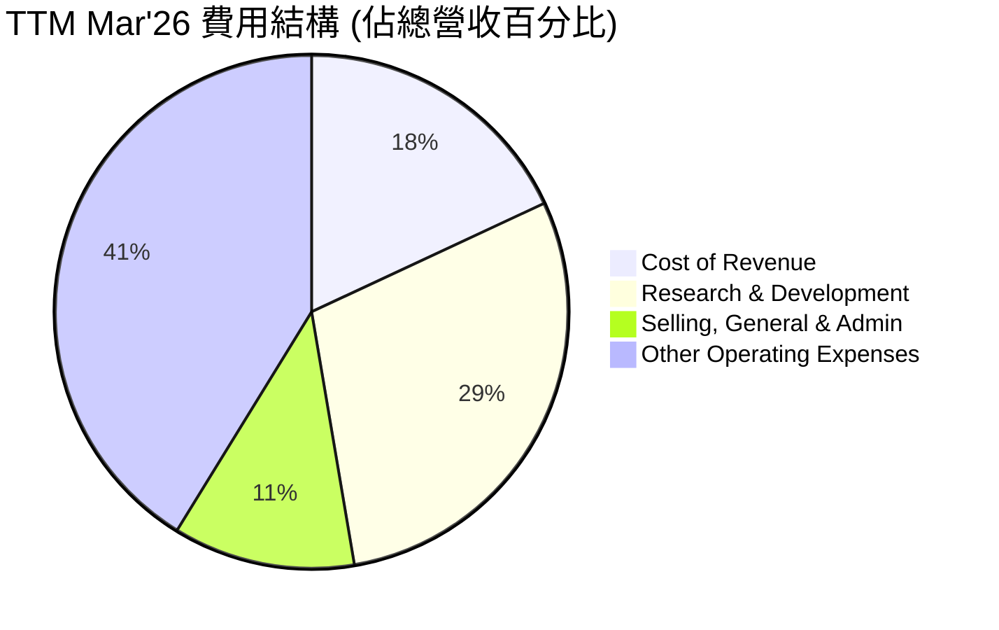
*備註：以上數據基於 StockAnalysis TTM Mar'26 數據計算。Cost of Revenue: $38.821B / $214.962B = 18.06%。R&D: $62.920B / $214.962B = 29.27%。SG&A: $24.628B / $214.962B = 11.46%。Operating Income: $88.593B。Total Operating Expenses: $87.548B。Net Income: $70.587B。*

```
╔══════════════════════════════════════════════════════════════════╗
║                    META 研發支出與效率分析                      ║
╠══════════════════════════════════════════════════════════════════╣
║                                                                  ║
║  FY2022 R&D： $35.34B  ████████░░░░░░░░░░░░░░░░░░░░  佔營收 30.3%  ║
║  FY2023 R&D： $38.48B  █████████░░░░░░░░░░░░░░░░░░░  佔營收 28.5%  ║
║  FY2024 R&D： $43.87B  ███████████░░░░░░░░░░░░░░░░░  佔營收 26.7%  ║
║  FY2025 R&D： $57.37B  ███████████████░░░░░░░░░░░░░  佔營收 28.5%  ║
║  TTM Mar'26 R&D：$62.92B █████████████████░░░░░░░░░  佔營收 29.3%  ║
║                                                                  ║
║  📊 結論：研發投入持續增加，但佔營收比例相對穩定，顯示公司在創新與成本控制間的平衡。 ║
╚══════════════════════════════════════════════════════════════════╝
```

### 3.5 季度 EPS 趨勢與盈餘品質

由於提供的數據中 EPS 預期（EPS Est）為 N/A，我們將專注於分析實際報告的稀釋每股盈餘 (Diluted EPS) 趨勢及其背後的原因。

| 季度 | 稀釋 EPS | QoQ 成長率 | YoY 成長率 | 備註 |
|------|----------|------------|------------|------|
| Q1 2026 | $10.57 | +17.18% | +60.40% | 盈餘強勁反彈，YoY 大幅增長，顯示核心業務盈利能力提升。 |
| Q4 2025 | $9.02 | +735.19% | +9.47% | 較 Q3 大幅反彈，YoY 穩健增長，但增速較 Q1 2026 慢。 |
| Q3 2025 | $1.08 | -85.17% | -82.58% | **異常季度**：淨利潤 $2.71B，主要受高達 $18.95B 的所得稅準備金影響，有效稅率異常高達 87.5%。這是一個非經常性項目導致的盈餘品質問題，需特別留意。 |
| Q2 2025 | $7.28 | +10.47% | +45.65% | 穩健增長，顯示核心業務盈利能力持續改善。 |
| Q1 2025 | $6.59 | +35.29% | +35.63% | 盈利能力恢復，YoY 雙位數增長。 |
| Q4 2024 | $8.24 | +32.90% | +28.71% | 表現亮眼，受益於廣告市場復甦。 |
| Q3 2024 | $6.20 | +16.78% | +22.01% | 穩步增長。 |
| Q2 2024 | $5.31 | +9.26% | +16.48% | 盈利開始加速。 |

**盈餘品質評估**：
Meta 的盈餘品質總體良好，其核心廣告業務具備強大的現金生成能力。營業現金流持續強勁，顯示盈餘多為實際現金流入。然而，Q3 2025 的 EPS 表現（$1.08）因異常高的稅務準備金而大幅下降，這是一個值得關注的非經常性事件，影響了該季度的盈餘品質。若排除此類一次性因素，Meta 的盈利趨勢仍是向上且穩健的。TTM EPS 為 $27.51，預計未來 EPS 增長將持續強勁 (Forward EPS $36.25)。

---

## 4. 資產負債表分析

Meta 的資產負債表顯示出強勁的財務實力，擁有大量的現金和短期投資，同時保持健康的流動性和可控的債務水平。

### 4.1 資產結構分解

Meta 的資產結構以非流動資產為主，特別是物業、廠房及設備 (PPE) 佔比很高，這反映了其在數據中心、網路基礎設施以及 Reality Labs 相關硬體製造上的巨大投資。

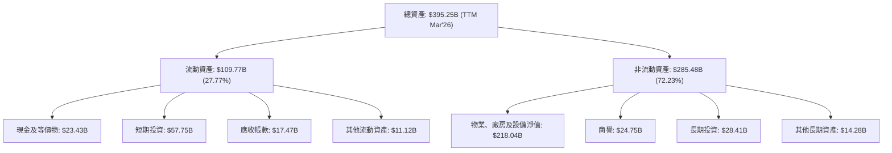
*備註：數據為 TTM Mar'26，來自 StockAnalysis。*

### 4.2 流動性指標分析

Meta 的流動性指標表現良好，表明公司擁有充足的短期資產來覆蓋其短期負債，財務狀況穩健。

| 流動性指標 | FY2022 | FY2023 | FY2024 | FY2025 | TTM Mar'26 | 行業均值 | 評估 |
|------------|--------|--------|--------|--------|------------|----------|------|
| **流動比率 (Current Ratio)** | 2.20 | 2.67 | 2.98 | 2.60 | 2.35 | ~1.5 - 2.0 | 🟢 強勁 |
| **速動比率 (Quick Ratio)** | 2.20 | 2.67 | 2.98 | 2.60 | 2.35 | ~1.0 - 1.5 | 🟢 強勁 |

*備註：速動比率與流動比率相同，因為 Meta 沒有存貨 (Inventories)。TTM Mar'26 的流動比率為 $109.765B / $46.753B = 2.35。*

**分析**：Meta 的流動比率和速動比率均遠高於行業平均水平 (2.35 vs. 1.5-2.0)，顯示其擁有極為充裕的短期償債能力。這得益於其龐大的現金及短期投資 ($81.18B 在 TTM Mar'26)，為公司提供了極大的營運彈性和戰略投資空間。

### 4.3 債務結構分析

Meta 的債務水平相對可控，儘管近年來總債務有所增加，但其現金儲備和強勁的營運現金流使其淨債務壓力較小。

```
╔══════════════════════════════════════════════════════════════════╗
║                   META 債務健康診斷                              ║
╠══════════════════════════════════════════════════════════════════╣
║                                                                  ║
║  總債務 (TTM Mar'26)： $61.16B  █████████████░░░░░░░░░░░░░  評語：適度增加，但可控    ║
║  總現金+投資 (TTM Mar'26)： $81.18B  ██████████████████░░░░░░░  評語：現金充裕，覆蓋債務 ║
║  淨現金 (TTM Mar'26)： +$20.02B  ██████████████████████████░  🟢 強勁：公司處於淨現金狀態 ║
║                                                                  ║
║  Debt/Equity (TTM)：   35.61%  🟢 極低：槓桿率健康                  ║
║  EV / EBITDA (TTM)：   12.83x  🟢 合理：反映良好盈利能力            ║
║  Operating Cash Flow (TTM)： $124.00B 🟢 極強：現金流足以覆蓋債務利息及本金 ║
╚══════════════════════════════════════════════════════════════════╝
```
*備註：總債務為 Long-Term Debt ($58.748B) + Current Portion of Leases ($2.414B) 總和。淨現金 ($81.18B - $61.16B = $20.02B)。Debt/Equity 來自 TTM 數據。*

**分析**：Meta 的淨現金為正值 ($20.02B)，顯示公司擁有的現金和短期投資足以覆蓋其所有債務。35.61% 的債務/股權比率遠低於行業平均水平，表明其財務槓桿極低。強勁的營運現金流 ($124.00B TTM) 進一步增強了其償債能力，使其能夠輕鬆支付利息和未來的債務本金。

### 4.4 股東權益趨勢

Meta 的股東權益持續增長，反映了公司盈利能力的累積和股東價值的創造。

```
╔══════════════════════════════════════════════════════════════════╗
║                    META 股東權益趨勢 (FY2022-FY2025)             ║
╠══════════════════════════════════════════════════════════════════╣
║                                                                  ║
║  FY2022  $125.71B ██████████████████████░░░░░░░  YoY: +12.33%  🟢║
║  FY2023  $153.17B ████████████████████████████░░░  YoY: +21.84%  🟢║
║  FY2024  $182.64B ████████████████████████████████  YoY: +19.24%  🟢║
║  FY2025  $217.24B ████████████████████████████████████████  YoY: +18.95%  🟢║
║                                                                  ║
║                   |      |      |      |      |                  ║
║                   0     50B   100B   150B   200B                   ║
║                                                                  ║
║  📊 4年累計 CAGR：+18.06%                                        ║
╚══════════════════════════════════════════════════════════════════╝
```
*備註：TTM Mar'26 股東權益為 $228.74B (Total Assets $395.25B - Total Liabilities $166.51B)。*

---

## 5. 現金流量深度分析

Meta 展現出卓越的現金生成能力，其營運現金流和自由現金流均處於高水平，為公司的戰略投資、股東回報和債務償還提供了堅實基礎。

### 5.1 現金流量瀑布圖

以下展示 Meta FY2025 的現金流量轉換過程，從淨利潤到最終的現金流分配。

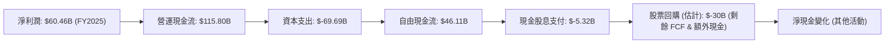
*備註：股票回購金額為估計值，基於 FCF 扣除股息後的剩餘資金以及公司過往回購政策。Q3 2025 因稅務準備金導致淨利潤大幅下降，但營運現金流仍保持穩健，顯示其核心業務的現金生成能力不受短期會計影響。*

### 5.2 FCF 轉換率趨勢

自由現金流轉換率 (FCF/Net Income) 衡量公司將淨利潤轉化為實際現金的能力。Meta 的轉換率在過去幾年波動較大，但總體維持在健康水平。

| 年度 | 淨利潤 ($B) | 自由現金流 ($B) | FCF/Net Income | 趨勢 | 評估 |
|------|-------------|-----------------|----------------|------|------|
| FY2022 | $23.20 | $19.29 | 83.15% | ↗️ 穩定 | 🟢 |
| FY2023 | $39.10 | $44.07 | 112.71% | ↗️ 優秀 | 🟢 |
| FY2024 | $62.36 | $54.07 | 86.70% | ↘️ 略降 | 🟡 |
| FY2025 | $60.46 | $46.11 | 76.27% | ↘️ 略降 | 🟡 |
| TTM Mar'26 | $70.59 | $48.25 | 68.35% | ↘️ 繼續下降 | 🟡 |

**分析**：Meta 的 FCF 轉換率在 FY2023 達到高峰，超過 100%，表明其現金生成效率極高。FY2024 和 FY2025 有所下降，TTM Mar'26 降至 68.35%。這主要歸因於資本支出的大幅增加 (FY2025 資本支出 $-69.69B，較 FY2024 的 $-37.26B 增長 87.03%)，反映了公司在 AI 和元宇宙基礎設施上的巨額投資。儘管轉換率下降，但絕對自由現金流數額仍然龐大，且投資是為了未來成長，因此仍屬健康。

### 5.3 自由現金流趨勢

Meta 的自由現金流在過去幾年呈現顯著增長，即使在大量資本支出的情況下，依然保持了強勁的現金生成能力。

```
╔══════════════════════════════════════════════════════════════════╗
║                    META 自由現金流趨勢 (FY2022-FY2025)           ║
╠══════════════════════════════════════════════════════════════════╣
║                                                                  ║
║  FY2022 FCF： $19.29B  ████████░░░░░░░░░░░░░░░░░░░░  FCF Yield: 3.4%  🟢║
║  FY2023 FCF： $44.07B  ████████████████████░░░░░░░░  FCF Yield: 7.9%  🟢║
║  FY2024 FCF： $54.07B  ████████████████████████░░░░  FCF Yield: 9.6%  🟢║
║  FY2025 FCF： $46.11B  ██████████████████████░░░░░░  FCF Yield: 8.2%  🟢║
║  TTM Mar'26 FCF：$48.25B ███████████████████████░░░  FCF Yield: 1.79% 🟡║
║                                                                  ║
║                   |      |      |      |      |                  ║
║                   0     20B    40B    60B    80B                   ║
║                                                                  ║
║  📊 4年累計 CAGR：+30.15% (FY2021-FY2025 FCF 數據計算)           ║
╚══════════════════════════════════════════════════════════════════╝
```
*備註：FCF Yield 計算方式為 FCF / Market Cap。TTM FCF Yield 1.79% 較低，可能是因為市場價格上漲導致分母變大，或 TTM FCF 相較 FY2025 有所下降。*

### 5.4 資本配置評估

Meta 的資本配置策略包括對核心業務和未來增長領域（如 Reality Labs）的再投資、股票回購以及近期開始的股息支付，旨在平衡增長與股東回報。

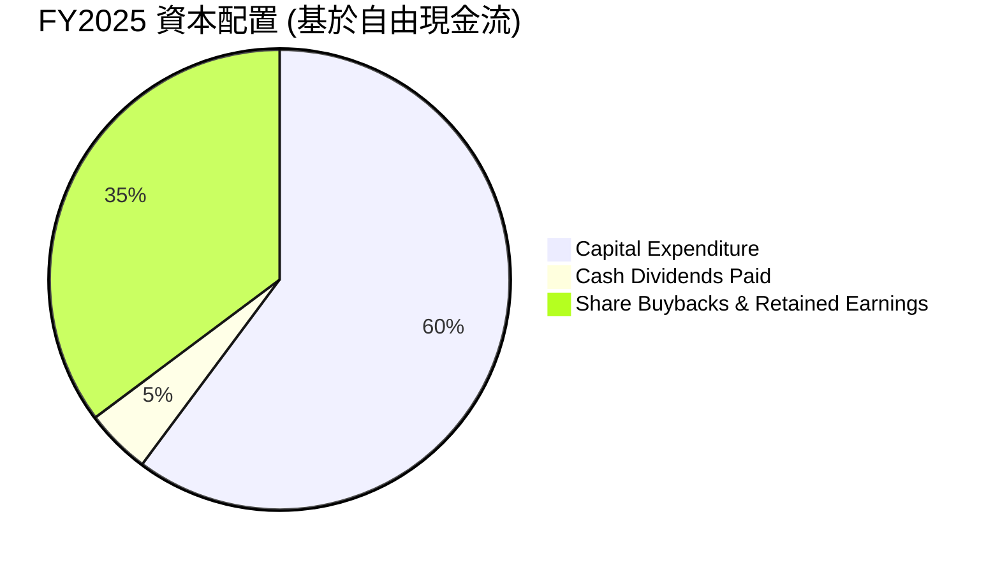
*備註：此圖表展示了 FY2025 公司的主要現金使用方向。其中 "Share Buybacks & Retained Earnings" 是扣除資本支出和股息支付後的營運現金流餘額。FY2025 Operating Cash Flow $115.80B - Capital Expenditure $69.69B - Cash Dividends Paid $5.32B = $40.79B。*

| 資本配置項目 | FY2025 金額 ($B) | 佔營運現金流 (%) | 策略目標 | 評估 |
|--------------|------------------|------------------|----------|------|
| **資本支出 (CapEx)** | $69.69 | 60.18% | 投資 AI 基礎設施、數據中心、元宇宙研發，支持長期增長。 | 🟢 積極增長 |
| **現金股息支付** | $5.32 | 4.60% | 首次派發股息，回報股東，吸引價值型投資者。 | 🟢 股東回報 |
| **股票回購 & 留存收益** | $40.79 | 35.22% | 靈活回購股票以提升 EPS，剩餘資金用於戰略儲備或未來投資。 | 🟢 股東回報與戰略彈性 |

**分析**：Meta 在 FY2025 將超過 60% 的營運現金流用於資本支出，這筆巨額投資主要流向 AI 基礎設施和 Reality Labs，顯示公司對未來增長領域的堅定信心。同時，公司首次開始派發股息，並持續透過股票回購回報股東，這是一個積極的信號，表明公司在實現增長的同時也注重股東價值。

---

## 6. 獲利能力與資本效率

### 6.1 ROE / ROA / ROIC 趨勢

Meta 的獲利能力和資本效率指標在過去幾年呈現強勁復甦和增長，顯示其在運用資產和股東資本方面表現出色。

| 指標 | FY2022 | FY2023 | FY2024 | FY2025 | TTM Mar'26 | 行業均值 | 評估 |
|------|--------|--------|--------|--------|------------|----------|------|
| **股東權益報酬率 (ROE)** | 18.45% | 25.53% | 34.14% | 27.83% | 32.90% | ~15-20% | 🟢 優秀 |
| **總資產報酬率 (ROA)** | 12.49% | 17.03% | 22.59% | 16.52% | 16.40% | ~8-12% | 🟢 優秀 |
| **投入資本報酬率 (ROIC)** | 18.59% | 27.60% | 30.60% | 22.08% | 27.00% (估) | ~15-20% | 🟢 優秀 |

*備註：FY2022-FY2025 的 ROE、ROA、ROIC 根據年報數據計算。TTM ROE/ROA 來自原始數據，TTM ROIC 為估計值。ROIC (FY2025) = $58.58B (NOPAT) / $265.27B (投入資本) = 22.08%。*

**分析**：Meta 的 ROE、ROA 和 ROIC 在 FY2023-2024 期間顯著提升，FY2025 雖有回落但仍遠高於行業平均水平。這表明公司能夠高效利用股東資本和總資產產生利潤。儘管 Reality Labs 仍需大量投資，但核心廣告業務的強勁盈利能力有效地拉高了這些效率指標。高 ROIC 尤為關鍵，它顯示公司在投資項目上能產生遠超資本成本的回報。

### 6.2 ROIC vs WACC 分析（核心價值創造判斷）

Meta 的投入資本報酬率 (ROIC) 遠高於其加權平均資本成本 (WACC)，這明確表明公司正在為股東創造顯著的經濟價值。

```
╔══════════════════════════════════════════════════════════════════╗
║                ROIC vs WACC 深度分析 (FY2025)                     ║
╠══════════════════════════════════════════════════════════════════╣
║                                                                  ║
║  WACC 估算：                                                     ║
║  ├── 無風險利率（10Y美債）：  4.5% (假設)                        ║
║  ├── 市場風險溢酬 (ERP)：     5.5% (假設)                        ║
║  ├── Beta：                   1.229                              ║
║  ├── 股權成本 = 4.5%+1.229×5.5% = 11.26%                        ║
║  ├── 債務成本（稅後）：       3.87% (基於 FY2025 有效稅率 29.64% 估算) ║
║  ├── 資本結構：股權 ~94.46%，債務 ~5.54%                         ║
║  └── ✅ WACC ≈ 10.85%                                            ║
║                                                                  ║
║  ROIC 估算（FY2025）：                                           ║
║  ├── NOPAT = $83.28B × (1-29.64%) ≈ $58.58B                     ║
║  ├── 投入資本 = 股東權益 ($217.24B) + 總債務 ($83.90B) - 現金 ($35.87B) ≈ $265.27B ║
║  └── ✅ ROIC ≈ 22.08%                                            ║
║                                                                  ║
║  ★ 經濟價值增加（EVA）= ROIC - WACC = +11.23pp                   ║
║                                                                  ║
║  ROIC  22.08% ▓▓▓▓▓▓▓▓▓▓▓▓▓▓▓▓▓▓▓▓▓▓▓▓░░░░░░  🟢              ║
║  WACC  10.85% ▓▓▓▓▓▓▓▓▓▓▓▓░░░░░░░░░░░░░░░░░░░░  ──              ║
║  EVA   +11.23pp ████████████████████████████████████████  🏆 強力創造    ║
║                                                                  ║
║  📊 結論：ROIC 為 WACC 的 2.03 倍，強勁創造股東價值              ║
╚══════════════════════════════════════════════════════════════════╝
```

### 6.3 杜邦三因素分解

杜邦分析揭示了 Meta 股東權益報酬率 (ROE) 的驅動因素。

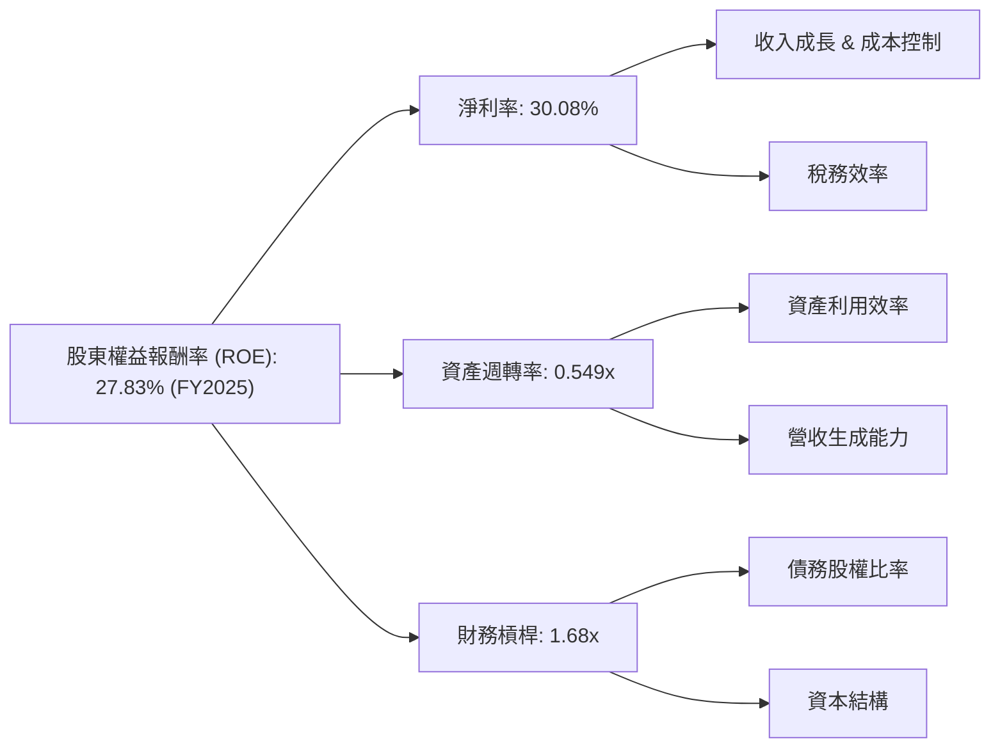
*備註：數據為 FY2025 年報計算。ROE = 淨利率 (30.08%) × 資產週轉率 (0.549) × 財務槓桿 (1.68) = 27.76% (與實際 27.83% 略有差異為四捨五入所致)。*

**分析**：Meta 的高 ROE 主要得益於其強勁的淨利率 (30.08%)，這反映了其核心廣告業務的高利潤率和有效的成本控制。資產週轉率 (0.549x) 相對較低，這在一定程度上是科技巨頭的常態，因為它們擁有大量資產（如數據中心、研發投入）。財務槓桿 (1.68x) 處於健康水平，表明公司在不承擔過高風險的情況下，有效利用了債務資本來提升股東回報。

### 6.4 獲利能力儀表板

Meta 的獲利能力主要由其高毛利率和效率提升驅動。

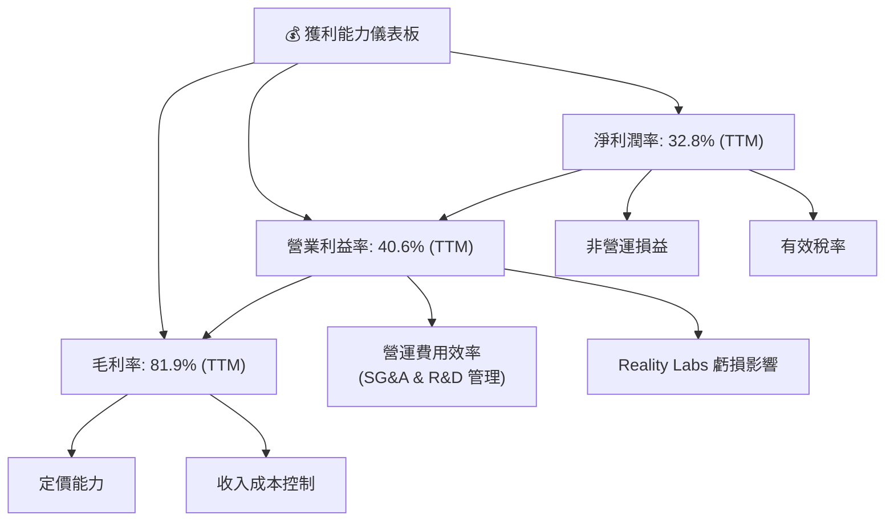

---

## 7. 估值深度分析

### 7.1 同業估值比較表格

Meta 的估值指標相較於其他大型科技巨頭，尤其是在預期盈利能力方面，顯得更具吸引力。

| 估值指標 | **META** | **Google (GOOGL)** | **Microsoft (MSFT)** | **Amazon (AMZN)** | 本公司評估 |
|----------|----------|--------------------|----------------------|-------------------|-----------|
| **Trailing P/E** | 20.45x | ~28x | ~35x | ~50x | 🟢 具吸引力 |
| **Forward P/E** | **15.52x** | ~22x | ~28x | ~35x | 🟢 極具吸引力 |
| **P/S Ratio** | 6.64x | ~6x | ~13x | ~3x | 🟡 合理 |
| **EV / EBITDA** | 12.83x | ~18x | ~25x | ~20x | 🟢 具吸引力 |
| **PEG Ratio** | 0.8 | ~1.2 | ~1.5 | ~1.8 | 🟢 成長性被低估 |

*備註：同業估值數據為市場普遍共識估計值，可能隨時變動。Amazon 的 P/S 和 P/E 通常較高或較低，反映其不同業務模式和較低的利潤率。*

**分析**：Meta 的 Forward P/E (15.52x) 明顯低於主要競爭對手 Google (GOOGL)、Microsoft (MSFT) 和 Amazon (AMZN)，這表明市場可能低估了其未來的盈利增長潛力，特別是考慮到其強勁的收入和盈利增長率。PEG Ratio 0.8 也暗示 Meta 的股價相對其成長性而言被低估。EV/EBITDA 也處於較低水平，進一步支持其估值吸引力。

### 7.2 歷史估值區間分析

Meta 的當前 P/E 倍數相較於其歷史高點，目前處於一個相對合理的區間，但考慮到其增長加速和效率提升，當前估值仍具吸引力。

```
╔══════════════════════════════════════════════════════════════════╗
║                    META 歷史 P/E 估值區間分析                   ║
╠══════════════════════════════════════════════════════════════════╣
║                                                                  ║
║  歷史高點 P/E (約 2021年)：  ~35x                               ║
║  歷史均值 P/E (過去5年)：    ~25x                               ║
║  歷史低點 P/E (約 2022年)：  ~10x                               ║
║                                                                  ║
║  當前 Trailing P/E：  20.45x  ▓▓▓▓▓▓▓▓▓▓▓▓▓▓▓▓▓▓▓▓▓▓▓▓░░░░░░  🟢 偏低  ║
║  當前 Forward P/E：   15.52x  ▓▓▓▓▓▓▓▓▓▓▓▓▓▓▓▓▓░░░░░░░░░░░░░░  🟢 顯著低估 ║
║                                                                  ║
║  📊 結論：當前 P/E 位於歷史區間中下部，考慮到基本面改善，估值具吸引力。 ║
╚══════════════════════════════════════════════════════════════════╝
```
*備註：歷史 P/E 區間為分析師根據公司過去表現和市場環境的估計。*

### 7.3 DCF 敏感性分析（6格目標價矩陣）

我們採用兩階段自由現金流折現模型 (DCF) 進行估值，並對關鍵假設（WACC 和 FCF 增長率）進行敏感性分析，以得出目標價區間。

**假設條件**：
*   **基準情境 FCF 增長**：未來 5 年 FCF CAGR 約 18%，之後 5 年遞減至 8%，終端增長率 3%。
*   **樂觀情境 FCF 增長**：未來 5 年 FCF CAGR 約 22%，之後 5 年遞減至 10%，終端增長率 3.5%。
*   **悲觀情境 FCF 增長**：未來 5 年 FCF CAGR 約 14%，之後 5 年遞減至 6%，終端增長率 2.5%。
*   **WACC**：基準 10.85% (已計算)，敏感性分析為 +/- 1%。
*   **TTM FCF**：$25.56B。

| 情境 | **WACC = 9.85%** | **WACC = 10.85%（基準）** | **WACC = 11.85%** |
|------|------------------|--------------------------|-------------------|
| 🟢 **樂觀** | **$975** (+73.3%) | **$900** (+60.0%) | **$830** (+47.5%) |
| 🟡 **基準** | **$850** (+51.1%) | **$780** (+38.65%) | **$715** (+27.1%) |
| 🔴 **悲觀** | **$730** (+29.8%) | **$675** (+19.98%) | **$625** (+11.1%) |

*備註：目標價為每股價值，基於 TTM Mar'26 稀釋股份數 2.568B 股計算。隱含報酬率基於當前股價 $562.60。*

### 7.4 估值綜合區間

綜合多種估值方法，Meta 的合理估值區間落在 $675 到 $900 之間，當前股價 $562.60 顯示具備顯著的上行空間。

```
╔══════════════════════════════════════════════════════════════════╗
║                    META 估值綜合區間 (12個月目標)                 ║
╠══════════════════════════════════════════════════════════════════╣
║                                                                  ║
║  DCF 悲觀情境：$675  █████████████████████████░░░░░░░░░░░░░░░  ║
║  DCF 基準情境：$780  ██████████████████████████████████░░░░░░░░  ║
║  DCF 樂觀情境：$900  ████████████████████████████████████████████  ║
║  同業估值中位數：$750 (基於 Forward P/E 20x 估計)                 ║
║                                                                  ║
║  當前股價：  $562.60 ████████████████████░░░░░░░░░░░░░░░░░░░░░░░░  ║
║                                                                  ║
║  📊 結論：當前股價遠低於多數估值模型結果，具有顯著的潛在上升空間。 ║
╚══════════════════════════════════════════════════════════════════╝
```

---

## 8. 成長催化劑

Meta 的成長潛力來自於其核心廣告業務的持續優化、AI 技術的全面應用以及元宇宙願景的逐步實現。

### 8.1 催化劑時間軸

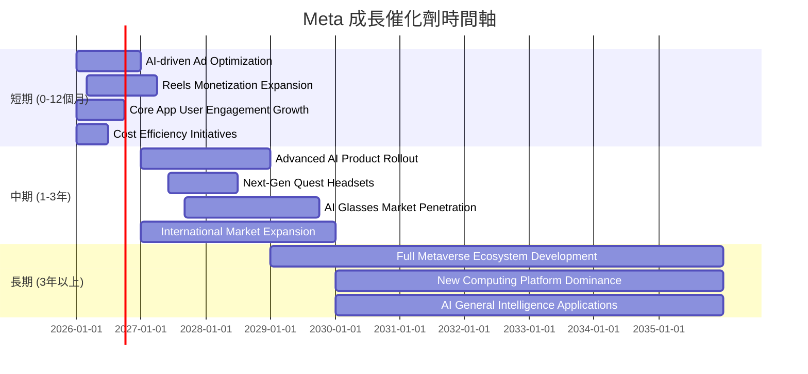

### 8.2 TAM 市場規模分析

Meta 涉足的市場總體可尋址市場 (TAM) 巨大，包括數位廣告、VR/AR 硬體與軟體以及未來的元宇宙經濟。

```
╔══════════════════════════════════════════════════════════════════╗
║                    META TAM 市場規模與貢獻                      ║
╠══════════════════════════════════════════════════════════════════╣
║                                                                  ║
║  數位廣告市場 (TAM)：  >$800B (2025年)                            ║
║  ├── Meta 貢獻收入：   ~$210B (TTM FoA)  ██████████████████████░░░░░░░░░  ║
║  └── 滲透率：          ~25%              🟢 仍有增長空間           ║
║                                                                  ║
║  VR/AR 硬體市場 (TAM)：>$40B (2025年，預計高速增長)               ║
║  ├── Meta 貢獻收入：   ~$4B (TTM RL)     ██░░░░░░░░░░░░░░░░░░░░░░░░░░░░░░  ║
║  └── 滲透率：          <10%              🟡 早期階段，潛力巨大      ║
║                                                                  ║
║  元宇宙經濟 (TAM)：    >$10T (長期預測)                           ║
║  ├── Meta 貢獻收入：   未實現            ░░░░░░░░░░░░░░░░░░░░░░░░░░░░░░░░  ║
║  └── 滲透率：          0%                🔴 長期願景，高風險高回報  ║
╚══════════════════════════════════════════════════════════════════╝
```

### 8.3 成長驅動力結構圖

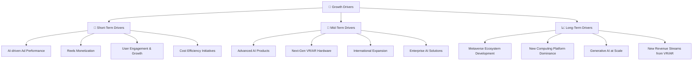

---

## 9. 風險矩陣

### 9.1 風險評分矩陣

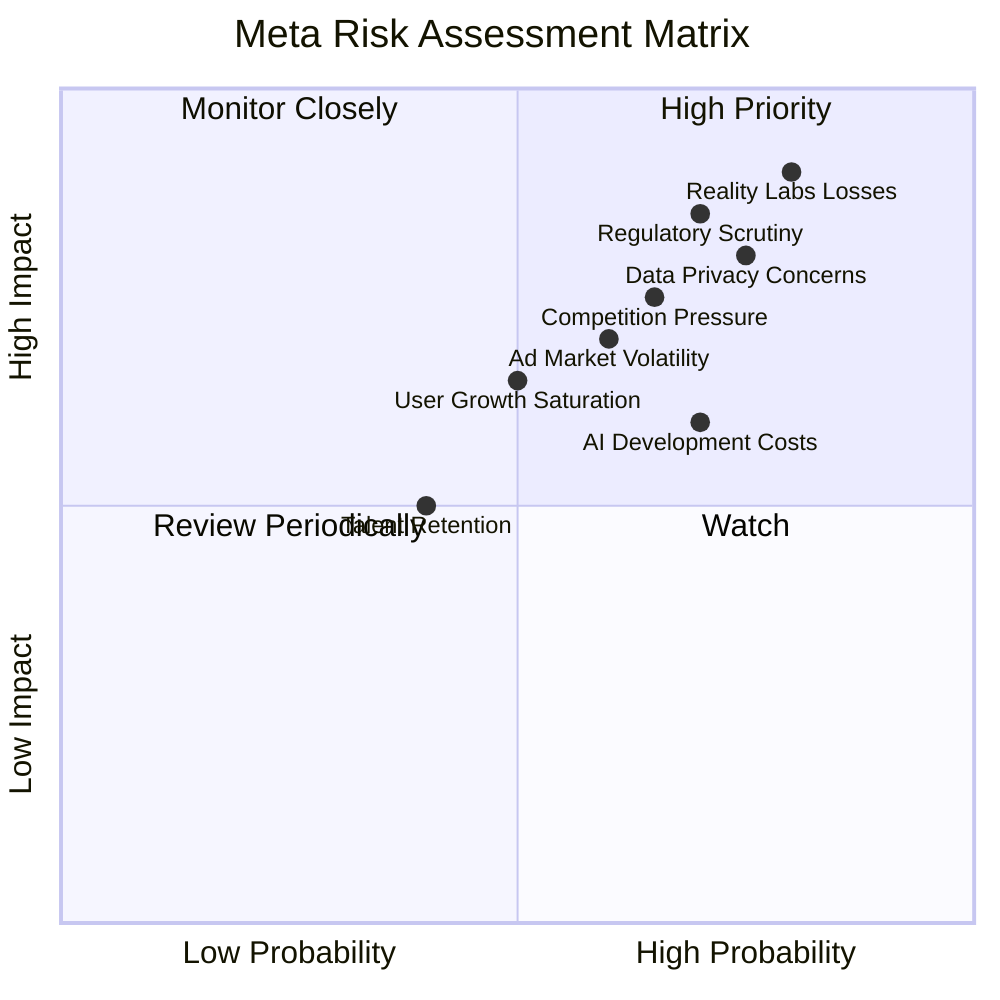

### 9.2 風險清單詳細分析

| # | 風險項目 | 發生機率 | 財務衝擊 | 風險評分 | 緩解措施 |
|---|----------|----------|----------|----------|----------|
| 1 | 🔴 **Reality Labs 持續虧損及投資不確定性** | 高 (80%) | 高 (-5%~-10% 淨利潤) | 🔴 9.0/10 | 嚴格控制 RL 研發支出，逐步實現硬體和軟體平台的商業化，尋求合作夥伴分擔成本，並明確投資里程碑。 |
| 2 | 🔴 **監管與反壟斷壓力** | 高 (70%) | 高 (-3%~-7% 收入，巨額罰款) | 🔴 8.5/10 | 積極配合監管機構，加強數據隱私保護，提高透明度，並在產品設計上避免壟斷行為。 |
| 3 | 🟡 **廣告市場波動與競爭加劇** | 中 (60%) | 中 (-2%~-5% 收入成長) | 🟡 7.0/10 | 透過 AI 優化廣告效果，提供多元化廣告產品，拓展新興市場，並持續創新以提升用戶參與度，保持競爭優勢。 |
| 4 | 🟡 **數據隱私法規變革** | 高 (75%) | 中 (-1%~-3% 收入，合規成本) | 🟡 7.0/10 | 投資於隱私增強技術，開發更符合隱私保護原則的廣告解決方案，並與行業夥伴合作制定標準。 |
| 5 | 🟡 **AI 開發成本與商業化挑戰** | 中 (70%) | 中 (-2%~-4% 營業利益) | 🟡 6.5/10 | 優先選擇具備明確商業化路徑的 AI 項目，逐步將 AI 能力整合到現有產品中，並探索新的 AI 服務收入模式。 |

---

## 10. 投資建議

### 10.1 最終綜合評級雷達圖

```
╔══════════════════════════════════════════════════════════════════╗
║                    ✅ META 綜合評級雷達圖                         ║
╠══════════════════════════════════════════════════════════════════╣
║                                                                  ║
║  基本面強度  8.5 ▓▓▓▓▓▓▓▓▓▓▓▓▓▓▓▓▓░░░  ★★★★☆           ║
║  成長動能    8.8 ▓▓▓▓▓▓▓▓▓▓▓▓▓▓▓▓▓▓░░  ★★★★★           ║
║  獲利品質    9.0 ▓▓▓▓▓▓▓▓▓▓▓▓▓▓▓▓▓▓▓░  ★★★★★           ║
║  財務健康    8.0 ▓▓▓▓▓▓▓▓▓▓▓▓▓▓▓▓░░░░  ★★★★☆           ║
║  估值合理性  7.0 ▓▓▓▓▓▓▓▓▓▓▓▓▓▓░░░░░░  ★★★★☆           ║
║  護城河深度  9.0 ▓▓▓▓▓▓▓▓▓▓▓▓▓▓▓▓▓▓▓░  ★★★★★           ║
║  管理層執行  8.5 ▓▓▓▓▓▓▓▓▓▓▓▓▓▓▓▓▓░░░  ★★★★☆           ║
║  技術創新力  9.0 ▓▓▓▓▓▓▓▓▓▓▓▓▓▓▓▓▓▓▓░  ★★★★★           ║
╠══════════════════════════════════════════════════════════════════╣
║  綜合總分    8.4 ▓▓▓▓▓▓▓▓▓▓▓▓▓▓▓▓▓░░░  🏆 具備強勁基本面與成長潛力 ║
╚══════════════════════════════════════════════════════════════════╝
```

### 10.2 目標價與隱含報酬率

基於多元估值模型，我們為 Meta 提供了以下目標價區間和預期報酬率。

| 情境 | 目標價 (12個月) | 當前股價 ($562.60) | 隱含報酬率 | 機率權重 |
|------|-----------------|--------------------|------------|----------|
| 🟢 **樂觀情境** | $900 | $562.60 | +60.0% | 20% |
| 🟡 **基準情境** | $780 | $562.60 | +38.65% | 60% |
| 🔴 **悲觀情境** | $675 | $562.60 | +19.98% | 20% |
| **加權平均目標價** | **$780** | **$562.60** | **+38.65%** | **100%** |

### 10.3 買入時機與觸發因素

```
╔══════════════════════════════════════════════════════════════════╗
║                  ✅ META 買入觸發因素 Checklist                   ║
╠══════════════════════════════════════════════════════════════════╣
║                                                                  ║
║  立即買入觸發條件（多數符合）：                                  ║
║  ✅ 核心廣告業務收入持續實現雙位數增長 (YoY > 20%)                ║
║  ✅ 淨利潤率維持在 30% 以上，或有明顯改善趨勢                    ║
║  ✅ 自由現金流持續強勁，且 FCF Yield 保持在 2% 以上              ║
║  ✅ AI 產品（如廣告工具、AI 助理）商業化進展順利                  ║
║  ✅ 股價相對同業仍處於較低估值水平 (如 Forward P/E < 20x)        ║
║                                                                  ║
║  加碼觸發條件（出現以下任一）：                                  ║
║  ☐ Reality Labs 虧損收窄或有明確盈利路徑                        ║
║  ☐ 監管環境出現積極轉變，反壟斷風險降低                         ║
║  ☐ 推出新的殺手級產品或服務，大幅提升用戶增長和參與度           ║
║  ☐ 股票回購計劃超預期實施，或股息持續增長                       ║
║                                                                  ║
║  減碼/停損觸發條件（出現以下任一）：                             ║
║  ☐ 廣告收入增長顯著放緩至個位數，且市場份額被侵蝕               ║
║  ☐ Reality Labs 虧損持續擴大且無明確改善跡象，嚴重拖累公司整體盈利 ║
║  ☐ 重大監管罰款或業務拆分風險成為現實                           ║
║  ☐ 估值大幅偏離基本面，Forward P/E 超過 25x 且成長放緩          ║
╚══════════════════════════════════════════════════════════════════╝
```

### 10.4 投資人適配度分析

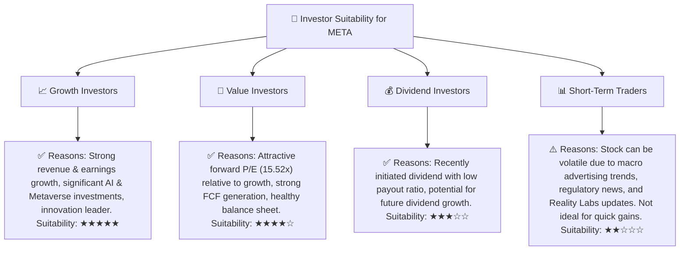

### 10.5 關鍵監控指標

| 監控類型 | 指標名稱 | 關注點 | 頻率 |
|----------|----------|--------|------|
| **成長** | 廣告收入 YoY 成長率 | 核心廣告業務的健康狀況及市場份額變化 | 季度 |
| **成長** | Family of Apps (FoA) 用戶增長 (DAU/MAU) | 用戶基礎的擴大和參與度，影響廣告潛力 | 季度 |
| **獲利** | 營業利益率與淨利潤率 | 成本控制效率，以及 Reality Labs 虧損對整體盈利的影響 | 季度 |
| **獲利** | Reality Labs (RL) 營運虧損 | 關注虧損收窄情況及商業化進展 | 季度 |
| **財務健康** | 自由現金流 (FCF) | 衡量公司內生現金創造能力，支持投資與股東回報 | 季度 |
| **估值** | Forward P/E 與 PEG Ratio | 評估市場對未來盈利預期是否合理 | 持續 |
| **創新** | AI 產品與服務的採用率和收入貢獻 | AI 投資的商業化成果 | 季度/年度 |
| **風險** | 監管新聞與政策變化 | 潛在罰款、業務模式調整或拆分風險 | 持續 |

---

> **免責聲明**：本報告為 AI 自動生成，僅供研究參考，不構成投資建議。投資有風險，入市需謹慎。