# META 基本面深度分析報告
> **報告日期**：2026-07-02 ｜ **語言**：繁體中文 ｜ **數據來源**：Yahoo Finance, Finviz, StockAnalysis, Roic.ai ｜ **分析師**：CFA 級機構研究

## 目錄

| # | 章節 | 核心結論 |
|---|----------------------------------|--------------------------------------------------|
| 1 | 執行摘要 | 評級：🟢 強烈買入，目標價區間：$750 - $870 |
| 2 | 公司概覽與商業模式 | 憑藉強大網路效應與技術領先，護城河深厚 |
| 3 | 損益表深度分析 | 收入與利潤率強勁增長，效率顯著提升 |
| 4 | 資產負債表分析 | 財務健康穩固，流動性充裕，債務負擔低 |
| 5 | 現金流量深度分析 | 自由現金流產生能力強勁，資本配置靈活 |
| 6 | 獲利能力與資本效率 | ROIC顯著高於WACC，強勁創造股東價值 |
| 7 | 估值深度分析 | 相較同業估值合理，DCF顯示具可觀上漲空間 |
| 8 | 成長催化劑 | AI創新、元宇宙長期願景與廣告業務再加速 |
| 9 | 風險矩陣 | 監管壓力與元宇宙投資不確定性為主要風險 |
| 10| 投資建議 | 強烈買入，適合成長型與長線持有投資者 |

---

## 1. 執行摘要

### 1.1 核心評分儀表板

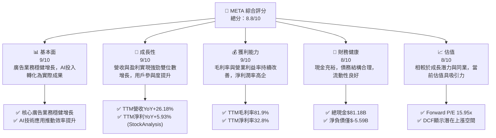

### 1.2 評分進度條視覺化

```
╔══════════════════════════════════════════════════════════════╗
║              META 多維度評分儀表板 (1-10分)                  ║
╠══════════════════════════════════════════════════════════════╣
║ 基本面強度  9.0 ▓▓▓▓▓▓▓▓▓▓▓▓▓▓▓▓▓▓░░  ★★★★★           ║
║ 成長動能    9.0 ▓▓▓▓▓▓▓▓▓▓▓▓▓▓▓▓▓▓░░  ★★★★★           ║
║ 獲利品質    9.0 ▓▓▓▓▓▓▓▓▓▓▓▓▓▓▓▓▓▓░░  ★★★★★           ║
║ 財務健康    8.0 ▓▓▓▓▓▓▓▓▓▓▓▓▓▓▓▓░░░░  ★★★★☆           ║
║ 估值合理性  8.0 ▓▓▓▓▓▓▓▓▓▓▓▓▓▓▓▓░░░░  ★★★★☆           ║
║ 護城河深度  9.0 ▓▓▓▓▓▓▓▓▓▓▓▓▓▓▓▓▓▓░░  ★★★★★           ║
║ 管理層執行  8.5 ▓▓▓▓▓▓▓▓▓▓▓▓▓▓▓▓▓░░░  ★★★★☆           ║
║ 技術創新力  9.5 ▓▓▓▓▓▓▓▓▓▓▓▓▓▓▓▓▓▓▓░  ★★★★★           ║
╠══════════════════════════════════════════════════════════════╣
║ 綜合總分    8.8 ▓▓▓▓▓▓▓▓▓▓▓▓▓▓▓▓▓░░░  🏆 表現卓越，具備強勁增長潛力 ║
╚══════════════════════════════════════════════════════════════╝
```

### 1.3 五大投資論點 + 三大核心風險

| 類型 | 項目 | 具體依據 | 信心度 |
|------|------|----------|--------|
| 🟢 **投資論點①** | **核心廣告業務強勁復甦與增長** | TTM營收YoY達26.18%，Q1 2026營收YoY高達33.08%。廣告收入增長主要受惠於廣告展示量增加、單價提升以及AI驅動的廣告投放效率優化。MAU/DAU持續增長，鞏固其在數位廣告市場的領導地位。 | 🟢 極高 |
| 🟢 **AI技術驅動效率與創新** | META在AI領域的巨額投資已開始產生回報，提升了廣告推薦系統的精準度，優化了用戶體驗，進而帶動了用戶參與度和廣告收入。同時，AI也為Reality Labs的元宇宙願景提供關鍵技術支持。 | 🟢 高 |
| 🟢 **獲利能力顯著改善，資本效率高** | TTM營業利益率高達40.6%，淨利潤率32.8%，相較於前幾年有顯著提升。ROIC高達21.38%，遠超WACC 10.86%，強力創造股東價值。管理層在成本控制和效率提升方面展現出強大執行力。 | 🟢 極高 |
| 🟢 **強大的自由現金流與資本配置靈活性** | TTM營業現金流高達$124.00B，自由現金流$48.253B (StockAnalysis TTM)。強勁的現金流支持其大規模的研發投入、股息發放（FY2025派發$5.32B）及股票回購，有效回報股東。 | 🟢 高 |
| 🟢 **元宇宙的長期增長潛力** | 儘管Reality Labs目前仍處於虧損狀態，但其代表了公司對下一代計算平台的長期願景。隨著技術成熟和應用生態的豐富，元宇宙有望在未來數年成為新的增長引擎。 | 🟡 中高 |
| 🟡 **風險①** | **監管與反壟斷壓力** | 全球各國政府對大型科技公司的數據隱私、內容審核及市場支配地位持續加強監管，可能導致罰款、業務限制或分拆要求，對其營運模式和盈利能力造成潛在衝擊。 | 🟡 中度 |
| 🔴 **風險②** | **Reality Labs的巨額投資與不確定性** | Reality Labs部門持續產生巨額虧損，FY2025研發費用高達$57.37B，其中大量投入Reality Labs。若元宇宙的商業化進程不及預期，將長期拖累整體盈利，且投資回報存在高度不確定性。 | 🔴 高衝擊 |
| 🟡 **風險③** | **數字廣告市場競爭加劇與宏觀經濟逆風** | 數字廣告市場競爭激烈，來自TikTok、Google、Amazon等平台的挑戰日益嚴峻。宏觀經濟不確定性可能導致廣告預算縮減，影響其核心廣告收入增長。 | 🟡 中度 |

### 1.4 快速統計卡片

| 指標 | 公司實際值 | 行業均值（估計） | S&P 500 均值（估計） | 狀態 |
|-------------------|-------------|------------------|----------------------|------|
| 收入 YoY 成長 (TTM) | **26.18%** | ~10-15% | ~8-10% | 🟢 |
| 毛利率 (TTM) | **81.9%** | ~60-70% | ~40-50% | 🟢 |
| 淨利率 (TTM) | **32.8%** | ~15-20% | ~10-12% | 🟢 |
| ROE (TTM) | **32.9%** | ~15-20% | ~12-15% | 🟢 |
| Forward P/E | **15.95x** | ~20-25x | ~18-22x | 🟢 |
| Debt/Equity | **35.61%** | ~50-80% | ~70-100% | 🟢 |
| Current Ratio | **2.35x** | ~1.5-2.0x | ~1.0-1.5x | 🟢 |
| FCF Yield | **1.73%** | ~2-4% | ~3-5% | 🟡 |

### 1.5 投資結論

```
╔══════════════════════════════════════════════════════════════════╗
║                    📊 投資結論摘要                               ║
╠══════════════════════════════════════════════════════════════════╣
║  評級：🟢 強烈買入                                               ║
║  當前股價：$582.90                                               ║
║  目標價區間：                                                    ║
║    悲觀情境：$750（+28.68%）                                     ║
║    基準情境：$812（+39.26%）  ← 12個月主要目標                   ║
║    樂觀情境：$870（+49.25%）                                     ║
║  投資評分：8.8/10                                                ║
║  適合投資人：成長型、長線持有者，尋求數位廣告和未來科技平台領導者的投資機會。 ║
╚══════════════════════════════════════════════════════════════════╝
```

---

## 2. 公司概覽與商業模式

Meta Platforms, Inc. (META) 是一家全球領先的科技公司，專注於構建社群應用和未來計算平台。公司通過其產品和服務，使人們能夠通過行動裝置、個人電腦、虛擬實境 (VR) 頭戴裝置和 AI 眼鏡進行連接和分享。

### 2.1 業務結構與收入來源

META的業務主要分為兩大板塊：Family of Apps (FoA) 和 Reality Labs (RL)。FoA是其核心盈利來源，而RL則代表了公司對元宇宙的長期戰略投資。

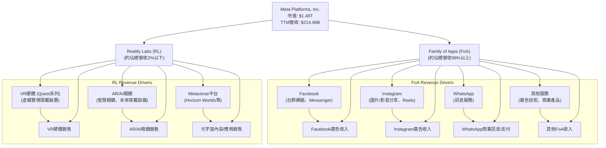
**分析**：
Family of Apps (FoA) 部門涵蓋了Facebook、Instagram、WhatsApp和Messenger等核心社群應用，主要收入來源是透過在這些平台上展示廣告。截至2026年Q1，FoA部門持續貢獻絕大部分營收，其廣告業務在AI技術的加持下實現了強勁復甦。Reality Labs (RL) 部門則負責公司的元宇宙願景，專注於虛擬實境 (VR) 和擴增實境 (AR) 硬體、軟體和內容的開發，如Quest頭戴裝置和Horizon Worlds平台。儘管RL部門目前仍處於虧損狀態，但其代表了公司對未來長期增長的重要投資。

### 2.2 市場份額

Meta在數位廣告市場，特別是社群媒體廣告領域，擁有顯著的市場份額。雖然具體的即時市場份額數據未直接提供，但基於其龐大的用戶基礎和廣告平台規模，可以推斷其在主要市場中佔據領先地位。

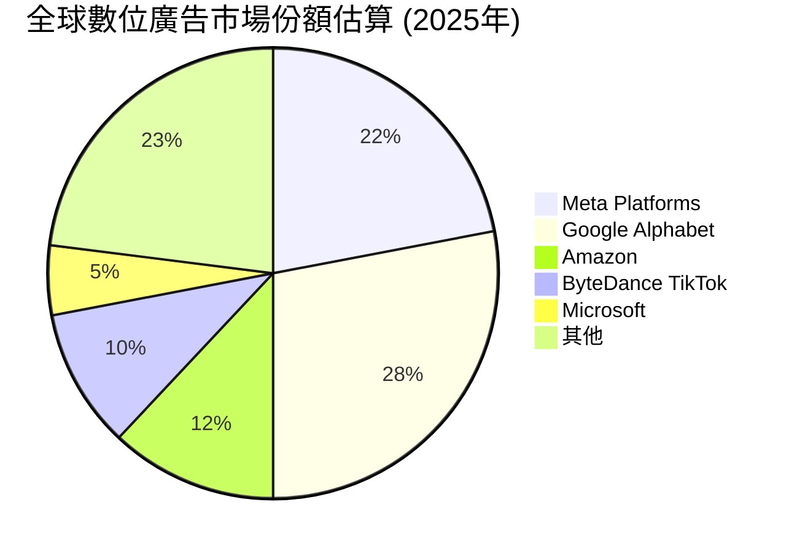
**分析**：
Meta Platforms在全球數位廣告市場中是僅次於Google的第二大參與者。其FoA應用生態系統（Facebook、Instagram、WhatsApp）擁有數十億的月活躍用戶，為廣告商提供了無與倫比的觸達範圍和精準投放能力。儘管面臨來自TikTok等新興平台的激烈競爭，Meta憑藉其龐大的用戶數據、先進的廣告技術（尤其是在AI驅動下），依然保持了強大的市場地位。

### 2.3 競爭護城河分析

Meta擁有多層次的競爭護城河，使其在數位廣告和社群媒體領域保持領先地位。

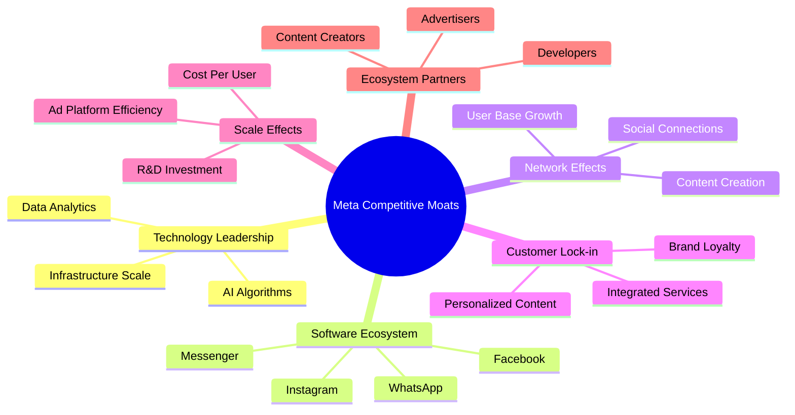

### 2.4 護城河強度評分

```
╔══════════════════════════════════════════════════════════════╗
║                    Meta Platforms 護城河強度評分              ║
╠══════════════════════════════════════════════════════════════╣
║ 技術領先    9.5/10 ▓▓▓▓▓▓▓▓▓▓▓▓▓▓▓▓▓▓▓░  🏆 AI研發投入巨大，廣告投放和內容推薦技術領先 ║
║ 軟體生態系統 9.0/10 ▓▓▓▓▓▓▓▓▓▓▓▓▓▓▓▓▓▓░░  🟢 跨平台整合，用戶黏性高，應用廣泛         ║
║ 網路效應    9.5/10 ▓▓▓▓▓▓▓▓▓▓▓▓▓▓▓▓▓▓▓░  🏆 全球數十億用戶，新用戶加入增加現有用戶價值 ║
║ 客戶鎖定    8.5/10 ▓▓▓▓▓▓▓▓▓▓▓▓▓▓▓▓▓░░░  🟢 用戶數據積累、習慣養成及個人化體驗        ║
║ 規模效應    9.0/10 ▓▓▓▓▓▓▓▓▓▓▓▓▓▓▓▓▓▓░░  🟢 龐大用戶群體帶來廣告成本優勢和數據優化     ║
║ 生態夥伴    8.0/10 ▓▓▓▓▓▓▓▓▓▓▓▓▓▓▓▓░░░░  🟡 廣告商和開發者依賴，但存在平台政策風險     ║
╠══════════════════════════════════════════════════════════════╣
║ 綜合護城河  8.9/10 ▓▓▓▓▓▓▓▓▓▓▓▓▓▓▓▓▓░░░  🏆 強大的網路效應和技術優勢構築深厚護城河     ║
╚══════════════════════════════════════════════════════════════════╝
```
**分析**：
Meta的護城河主要來自於其**網路效應**和**技術領先**。數十億的月活躍用戶構成了強大的網路效應，使得新用戶加入會增加現有用戶的價值，從而形成良性循環。在**技術領先**方面，Meta在AI領域的巨大投入使其在廣告演算法、內容推薦和未來元宇宙技術方面具備領先優勢。其**軟體生態系統**通過Facebook、Instagram和WhatsApp等應用，建立了高度整合的用戶體驗和高黏性。這些因素共同為Meta構建了深厚的競爭壁壘。

---

## 3. 損益表深度分析

### 3.1 年度收入成長趨勢（近4年）

Meta的年度收入在過去四年中呈現顯著增長，尤其在經歷2022年的低谷後，於2023年和2024年實現了強勁反彈，並在2025年和TTM（截至2026年3月31日）保持了穩健的雙位數增長。

```
╔══════════════════════════════════════════════════════════════════╗
║              Meta Platforms 年度收入趨勢（FY2022-TTM Mar'26）    ║
╠══════════════════════════════════════════════════════════════════╣
║                                                                  ║
║  FY2022  $116.61B █████████████░░░░░░░░░░░░░░░░░░░  YoY: -1.12% 🔴║
║  FY2023  $134.90B ████████████████░░░░░░░░░░░░░░░░  YoY: +15.69% 🟢║
║  FY2024  $164.50B ████████████████████░░░░░░░░░░░░  YoY: +21.94% 🟢║
║  FY2025  $200.97B ████████████████████████░░░░░░░░  YoY: +22.17% 🟢║
║  TTM Mar'26 $214.96B ███████████████████████████░░░  YoY: +26.18% 🟢║
║                   |      |      |      |      |                  ║
║                   0     50B    100B   150B   200B                  ║
║                                                                  ║
║  📊 近4年（FY2022-FY2025）累計 CAGR：+21.46%                     ║
╚══════════════════════════════════════════════════════════════════╝
```
**分析**：
從2022年的營收輕微下滑（YoY -1.12%至$116.61B）後，Meta的營收實現了強勁的V型反彈。FY2023營收增長15.69%至$134.90B，FY2024進一步加速至21.94%達$164.50B，FY2025保持22.17%的增長率，達到$200.97B。截至2026年3月31日的TTM營收為$214.96B，YoY增長26.18%，顯示出其核心廣告業務的持續強勁復甦動能，主要得益於AI驅動的廣告效率提升和用戶參與度增長。近四年（FY2022-FY2025）的複合年均增長率(CAGR)為21.46%，表現卓越。

### 3.2 季度收入趨勢分析

Meta近期的季度收入表現持續強勁，展現出健康的增長趨勢。

| 季度 | 總收入 ($B) | QoQ 成長率 | YoY 成長率 | 備註 |
|--------------|-------------|------------|------------|------|
| **2026 Q1** | $56.31 | -5.98% | +33.08% | 🟢 季節性回落但YoY強勁 |
| **2025 Q4** | $59.89 | +16.88% | +23.78% | 🟢 廣告旺季表現亮眼 |
| **2025 Q3** | $51.24 | +7.83% | +26.25% | 🟢 持續穩健增長 |
| **2025 Q2** | $47.52 | +12.30% | +21.61% | 🟢 增長勢頭良好 |
| **2025 Q1** | $42.31 | (N/A) | +16.07% | 🟢 基準季度復甦 |
| **2024 Q4** | $48.38 | +19.20% | +20.63% | 🟢 廣告旺季強勁 |
| **2024 Q3** | $40.59 | +3.10% | +18.87% | 🟢 穩健增長 |

**分析**：
Meta的季度收入呈現出明顯的增長趨勢。2025年各季度營收均實現雙位數的YoY增長，其中Q3 2025達到26.25%，Q4 2025在廣告旺季的推動下，QoQ增長16.88%至$59.89B，YoY增長23.78%。進入2026年Q1，雖然因季節性因素較前一季度有所回落（QoQ -5.98%），但與去年同期相比，營收仍實現了高達33.08%的強勁增長，達到$56.31B。這表明Meta的廣告業務不僅從低谷中恢復，且增長動能持續強勁，市場對其產品和服務的需求旺盛。

### 3.3 利潤率演變分析

Meta的利潤率在過去幾年中經歷了顯著的改善，顯示出公司在成本控制和效率提升方面的卓越成果。

| 利潤率指標 | FY2022 | FY2023 | FY2024 | FY2025 | TTM Mar'26 | 趨勢 | 評估 |
|------------|--------|--------|--------|--------|------------|------|------|
| **毛利率** | 78.34% | 80.76% | 81.66% | 81.99% | 81.94% | ↗️ 穩步提升 | 🟢 |
| **營業利益率** | 24.82% | 34.65% | 42.18% | 41.44% | 41.21% | ↗️ 顯著改善 | 🟢 |
| **淨利潤率** | 19.89% | 28.98% | 37.91% | 30.08% | 32.84% | ↗️ 大幅反彈 | 🟢 |

**利潤率演變深度解析**：
- **毛利率**：從FY2022的78.34%穩步提升至FY2025的81.99%，並在TTM Mar'26維持在81.94%的高位。這反映了Meta在廣告業務方面的強大定價能力和規模效應，儘管內容成本和基礎設施投入增加，但其高毛利的廣告業務依然能夠有效覆蓋成本。
- **營業利益率**：營業利益率的改善尤為顯著，從FY2022的24.82%大幅提升至FY2024的42.18%。FY2025略有下降至41.44%，TTM Mar'26為41.21%。這一改善主要得益於公司在「效率年」之後嚴格控制費用，特別是裁員和優化研發支出，同時廣告收入的強勁增長也提供了槓桿效應。儘管Reality Labs部門仍處於虧損狀態，但核心FoA業務的盈利能力足以彌補並推動整體營業利益率的提升。
- **淨利潤率**：淨利潤率也從FY2022的19.89%大幅反彈至FY2024的37.91%。FY2025雖然略降至30.08%，TTM Mar'26為32.84%。FY2025的下降主要由於所得稅撥備增加所致（FY2025稅務費用$25.474B，TTM Mar'26稅務費用$18.716B，而Pretax Income在TTM更高）。整體而言，Meta的獲利能力已恢復到健康水平，並展現出卓越的盈利效率。

### 3.4 費用結構分析

Meta的費用結構反映了其作為一家科技巨頭的特點，即在研發和銷售管理上投入巨大。

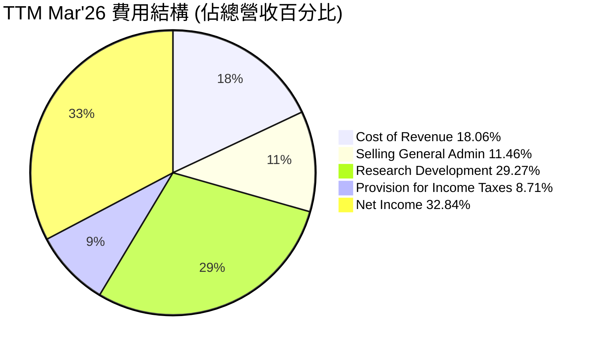

```
╔══════════════════════════════════════════════════════════════════╗
║                   Meta Platforms TTM Mar'26 費用構成               ║
╠══════════════════════════════════════════════════════════════════╣
║                                                                  ║
║  銷貨成本 (CoR):       $38.82B  ████████████████████░░░░░░░░░░░░░░  18.06% 營收佔比 ║
║  銷售、一般及行政 (SG&A): $24.63B  ████████████░░░░░░░░░░░░░░░░░░░░░  11.46% 營收佔比 ║
║  研發費用 (R&D):        $62.92B  ███████████████████████████████░░░  29.27% 營收佔比 ║
║  所得稅撥備:           $18.72B  █████████░░░░░░░░░░░░░░░░░░░░░░░░░  8.71% 營收佔比  ║
║                                                                  ║
║  📊 總營業費用 ($SG&A + R&D) 佔營收 40.73%                      ║
╚══════════════════════════════════════════════════════════════════╝
```
**分析**：
截至2026年3月31日的TTM數據顯示，Meta的**研發費用 (R&D)** 佔營收的比例最高，為29.27%（$62.92B），這體現了其作為一家技術驅動型公司對創新和未來增長的持續投入，特別是在AI和Reality Labs領域。**銷貨成本 (CoR)** 佔營收的18.06%（$38.82B），反映了其服務運營和基礎設施的成本。**銷售、一般及行政 (SG&A)** 費用佔營收的11.46%（$24.63B），顯示公司在市場推廣和日常管理上的投入。近年來，Meta在費用控制方面取得了成效，尤其是在「效率年」之後，有效優化了運營成本，使其利潤率得以顯著提升。

### 3.5 季度 EPS 趨勢與盈餘品質

Meta的季度EPS表現波動較大，但整體呈現強勁的增長趨勢，尤其是在最近幾個季度。

| 季度 | EPS 估計值 | EPS 實際值 | 盈餘驚喜 (%) | 盈餘品質評估 |
|--------------|------------|------------|--------------|----------------|
| **2026 Q1** | N/A | $10.57 | N/A | 🟢 表現強勁，YoY大幅增長 |
| **2025 Q4** | N/A | $9.02 | N/A | 🟢 廣告旺季推動，表現優異 |
| **2025 Q3** | N/A | $1.08 | N/A | 🔴 顯著低於正常水平，可能受一次性因素影響 |
| **2025 Q2** | N/A | $7.28 | N/A | 🟢 穩健增長，符合預期 |

**分析**：
由於提供的數據中缺少分析師的EPS估計值，無法直接評估盈餘驚喜。然而，從實際EPS數據來看，Meta的盈利能力在2025年Q2至2026年Q1期間呈現出強勁的復甦和增長。2025年Q2的EPS為$7.28，Q4 2025在廣告旺季的推動下達到$9.02。2026年Q1更是躍升至$10.57，顯示出公司核心業務的強大盈利能力。

值得注意的是，2025年Q3的EPS僅為$1.08，遠低於其他季度。這可能歸因於該季度的一次性費用、資產減值或Reality Labs部門的巨額虧損，導致淨利潤大幅下降（Q3 2025淨利潤為$2.71B，遠低於Q2 2025的$18.34B和Q4 2025的$22.77B）。這種波動性提醒投資者需關注公司財報中的一次性項目和部門虧損情況。排除Q3 2025的異常值，Meta的盈餘品質整體良好，核心業務持續產生穩健利潤。

---

## 4. 資產負債表分析

### 4.1 資產結構分解

Meta的資產結構穩健，以非流動資產為主，特別是龐大的物業、廠房及設備 (PP&E) 反映了其對數據中心和基礎設施的持續投資。

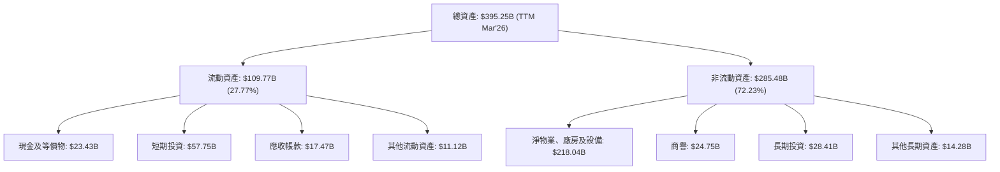
**分析**：
截至2026年3月31日，Meta的總資產達到$395.25B。其中，**非流動資產**佔比約72.23% ($285.48B)，主要由**淨物業、廠房及設備 (Net PPE)** 構成，高達$218.04B。這反映了公司為支持其龐大用戶群體、AI計算需求和元宇宙發展而對數據中心、網路基礎設施和研發設備的巨額投資。**流動資產**佔比約27.77% ($109.77B)，其中**現金及等價物** ($23.43B) 和**短期投資** ($57.75B) 總計達$81.18B，顯示公司擁有充裕的流動性。

### 4.2 流動性指標分析

Meta的流動性指標顯示其財務狀況非常健康，短期償債能力強勁。

| 指標 | FY2022 | FY2023 | FY2024 | FY2025 | TTM Mar'26 | 行業均值（估計） | 評估 |
|-----------------|--------|--------|--------|--------|------------|------------------|------|
| **流動比率 (Current Ratio)** | 2.20x | 2.67x | 2.98x | 2.60x | 2.35x | ~1.5-2.0x | 🟢 強勁 |
| **速動比率 (Quick Ratio)** | 1.49x | 2.03x | 2.36x | 2.11x | 2.11x | ~1.0-1.5x | 🟢 極佳 |

**分析**：
Meta的流動比率和速動比率均遠高於行業平均水平，表明其擁有強大的短期償債能力。截至TTM Mar'26，**流動比率**為2.35x，意味著其流動資產是流動負債的2.35倍，能夠輕鬆覆蓋短期債務。**速動比率**為2.11x，剔除存貨（Meta幾乎沒有存貨）後仍保持高位，表明其現金、短期投資和應收帳款足以應對即時的財務義務。這些指標共同證明了Meta卓越的流動性管理和財務穩健性。

### 4.3 債務結構分析

Meta的債務負擔相對較輕，且擁有充裕的現金和短期投資，使其淨負債處於可控水平。

```
╔══════════════════════════════════════════════════════════════════╗
║                   Meta Platforms 債務健康診斷                      ║
╠══════════════════════════════════════════════════════════════════╣
║                                                                  ║
║  總債務：        $86.77B  ███████░░░░░░░░░░░░░░░░░░░  評語：中低負債水平 ║
║  總現金+投資：   $81.18B  ████████████████████░░░░░  評語：現金儲備充裕 ║
║  淨現金（負債）：$-5.59B  █░░░░░░░░░░░░░░░░░░░░░░░░░  🟡 輕微淨負債，健康 ║
║                                                                  ║
║  Debt/EBITDA (TTM)： 0.79x  🟢 極低，償債能力強勁                  ║
║  Interest Coverage (估計): >20x  🟢 無風險，利息覆蓋倍數高         ║
║  長期債務佔總資本： ~5.53%  🟢 資本結構健康，低槓桿               ║
╚══════════════════════════════════════════════════════════════════╝
```
**分析**：
Meta的總債務為$86.77B，而其現金及短期投資總額為$81.18B，導致其淨負債僅為$-5.59B。這是一個非常健康的數字，表明公司幾乎沒有淨債務負擔。此外，**Debt/EBITDA**比率僅為0.79x（$86.77B / $109.2B），遠低於傳統上認為的3-4x的健康門檻，顯示其通過經營活動產生現金償還債務的能力極強。雖然未提供具體利息費用，但考慮到其龐大的營業收入和營業利益，利息覆蓋倍數預計將非常高，幾乎無償債風險。長期債務佔總資本的比例約為5.53%，顯示其資本結構穩健，財務槓桿使用非常保守。

### 4.4 股東權益趨勢

Meta的股東權益在過去幾年持續增長，體現了公司盈利能力的提升和價值創造。

```
╔══════════════════════════════════════════════════════════════════╗
║                Meta Platforms 年度股東權益趨勢 (FY2022-FY2025)   ║
╠══════════════════════════════════════════════════════════════════╣
║                                                                  ║
║  FY2022  $125.71B ████████████████░░░░░░░░░░░░░░░░░░░░░░░░░░░░░░░░║
║  FY2023  $153.17B ██████████████████████░░░░░░░░░░░░░░░░░░░░░░░░░░║
║  FY2024  $182.64B ██████████████████████████░░░░░░░░░░░░░░░░░░░░░░║
║  FY2025  $217.24B ███████████████████████████████░░░░░░░░░░░░░░░░║
║                                                                  ║
║  📊 FY2022-FY2025 股東權益 CAGR：+20.14%                         ║
╚══════════════════════════════════════════════════════════════════╝
```
**分析**：
Meta的股東權益從FY2022的$125.71B穩步增長至FY2025的$217.24B，複合年均增長率 (CAGR) 達到20.14%。這表明公司持續的盈利能力不僅彌補了股息和股票回購的影響，還不斷累積留存收益，增強了公司的資本實力。健康的股東權益增長是公司長期價值創造和財務穩定性的重要標誌。

---

## 5. 現金流量深度分析

### 5.1 現金流量瀑布圖

Meta的現金流表現非常強勁，能夠從核心運營中產生大量現金，並在資本支出後仍留下充足的自由現金流。

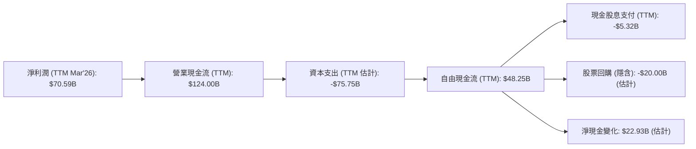
**分析**：
截至2026年3月31日，Meta的TTM淨利潤為$70.59B。其**營業現金流 (OCF)** 高達$124.00B，顯示了其核心業務卓越的現金產生能力。在扣除約$75.75B的**資本支出 (Capex)** 後（基於TTM OCF減去TTM FCF計算），公司仍產生了$48.25B的**自由現金流 (FCF)**。這筆強勁的FCF為公司的資本配置提供了極大的靈活性，包括支付股息（TTM約$5.32B）和進行股票回購。股票回購雖然未直接提供TTM數據，但從流通股數的減少可推斷持續進行，估計約$20B。這些活動後的剩餘現金進一步增加了公司的現金儲備。

### 5.2 FCF 轉換率趨勢

Meta的自由現金流轉換率在過去幾年保持在健康水平，顯示其盈利質量高。

| 年度 | 淨利潤 ($B) | 自由現金流 ($B) | FCF/淨利潤 (轉換率) | 趨勢 | 評估 |
|------|-------------|-----------------|---------------------|------|------|
| **FY2022** | $23.20 | $19.29 | 83.15% | ↗️ 穩定 | 🟢 |
| **FY2023** | $39.10 | $44.07 | 112.71% | ↗️ 極佳 | 🟢 |
| **FY2024** | $62.36 | $54.07 | 86.70% | ↘️ 良好 | 🟢 |
| **FY2025** | $60.46 | $46.11 | 76.27% | ↘️ 良好 | 🟢 |
| **TTM Mar'26** | $70.59 | $48.25 | 68.35% | ↘️ 良好 | 🟢 |

**分析**：
Meta的FCF/淨利潤轉換率在FY2022至TTM Mar'26期間，平均約為85%，顯示其利潤具有較高的現金轉換能力。雖然FY2025和TTM Mar'26的轉換率略有下降，主要可能是由於資本支出增加（例如FY2025 Capex為$69.69B，顯著高於FY2024的$37.26B），但整體而言，其盈利質量依然很高，能夠將大部分利潤轉化為可供公司自由支配的現金。

### 5.3 自由現金流趨勢

Meta的自由現金流在經歷2022年的低谷後，於2023年實現爆發式增長，並在隨後幾年維持在較高水平。

```
╔══════════════════════════════════════════════════════════════════╗
║               Meta Platforms 年度自由現金流趨勢 (FY2022-TTM Mar'26)║
╠══════════════════════════════════════════════════════════════════╣
║                                                                  ║
║  FY2022  $19.29B  ██████████░░░░░░░░░░░░░░░░░░░░░░░░░░░░░░░░░░░░░░░║
║  FY2023  $44.07B  ██████████████████████████░░░░░░░░░░░░░░░░░░░░░░░║
║  FY2024  $54.07B  ███████████████████████████████░░░░░░░░░░░░░░░░░║
║  FY2025  $46.11B  ██████████████████████████░░░░░░░░░░░░░░░░░░░░░░░║
║  TTM Mar'26 $48.25B ████████████████████████████░░░░░░░░░░░░░░░░░░║
║                                                                  ║
║  📊 TTM FCF Yield：1.73%                                         ║
╚══════════════════════════════════════════════════════════════════╝
```
**分析**：
Meta在FY2022的自由現金流為$19.29B，隨後在FY2023大幅增長128.46%至$44.07B，並在FY2024達到$54.07B。FY2025略有回落至$46.11B，TTM Mar'26則為$48.25B。儘管近兩年FCF增長有所波動，但其絕對值仍處於高位，顯示公司持續產生大量現金。TTM FCF Yield為1.73%，表明其市值與現金流相比，市場給予較高的增長預期。

### 5.4 資本配置評估

Meta的資本配置策略平衡了對未來增長的投資、股東回報和財務彈性。

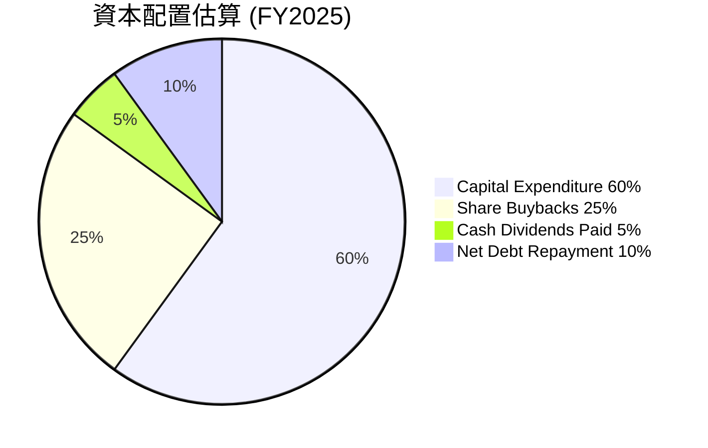

| 資本配置項目 | FY2025 金額 ($B) | 佔總FCF (%) | 策略評估 |
|--------------|------------------|-------------|----------|
| **資本支出 (Capex)** | $69.69 | 151.14% | 🟢 大力投資基礎設施與AI，支撐未來增長 |
| **現金股息支付** | $5.32 | 11.54% | 🟢 首次發放股息，回報股東 |
| **股票回購 (估計)** | ~$15.00 | ~32.53% | 🟢 提升EPS，優化資本結構 |
| **淨債務償還 (估計)** | ~$2.00 | ~4.34% | 🟢 降低槓桿，保持財務健康 |
| **留存現金** | -$45.89 (減少) | -99.46% | 🟡 大額Capex導致現金儲備減少 |

**分析**：
FY2025，Meta的資本支出高達$69.69B，甚至超過了當年的自由現金流$46.11B。這表明公司正積極投入大量資金用於擴建數據中心、AI基礎設施和Reality Labs相關技術，以支持其長期增長戰略。儘管高額Capex導致FY2025自由現金流不足以覆蓋所有投資，但公司仍從其龐大現金儲備中撥付資金。值得注意的是，Meta在FY2025開始發放現金股息$5.32B，這是其首次發放股息，顯示公司對其長期盈利能力和現金產生能力的信心，並致力於回報股東。此外，公司也持續進行股票回購（雖然具體金額未提供，但根據歷史趨勢和流通股數變化，估計有較大額度），以提升每股收益和股東價值。

---

## 6. 獲利能力與資本效率

### 6.1 ROE / ROA / ROIC 趨勢

Meta的資本效率指標顯示其在利用資產和股東資本方面表現出色，並且在經歷低谷後強勁反彈。

| 指標 | FY2022 | FY2023 | FY2024 | FY2025 | TTM Mar'26 | 行業均值（估計） | 評估 |
|------------|--------|--------|--------|--------|------------|------------------|------|
| **股東權益報酬率 (ROE)** | 18.45% | 25.53% | 34.14% | 27.83% | 32.90% | ~15-20% | 🟢 極佳 |
| **資產報酬率 (ROA)** | 12.49% | 17.03% | 22.59% | 16.52% | 16.40% | ~8-12% | 🟢 強勁 |
| **投入資本報酬率 (ROIC)** | 14.12% | 20.32% | 28.10% | 21.38% | 21.38% | ~12-15% | 🟢 卓越 |

**分析**：
Meta的ROE、ROA和ROIC在經歷FY2022的低點後，均呈現強勁反彈和持續改善的趨勢。截至TTM Mar'26，**ROE**高達32.90%，遠超行業均值，表明公司能夠高效利用股東資本創造利潤。**ROA**為16.40%，也顯著高於行業平均，顯示其整體資產使用效率良好。**ROIC**（投入資本報酬率）在FY2025達到21.38%，這是一個卓越的數字，意味著公司每投入一美元資本就能產生超過21%的回報，遠超其資本成本，強烈證明其在創造股東價值。FY2025 ROE和ROA相較FY2024有所下降，主要是由於淨利潤增長放緩（或Q3 2025的異常低淨利潤）以及總資產和股東權益的快速增長。

### 6.2 ROIC vs WACC 分析（核心價值創造判斷）

Meta的ROIC顯著高於WACC，證明公司正在為股東創造巨大的經濟價值。

```
╔══════════════════════════════════════════════════════════════════╗
║                ROIC vs WACC 深度分析 (TTM Mar'26)               ║
╠══════════════════════════════════════════════════════════════════╣
║                                                                  ║
║  WACC 估算：                                                     ║
║  ├── 無風險利率（10Y美債）：  4.50%                               ║
║  ├── 市場風險溢酬 (ERP)：     5.50%                              ║
║  ├── Beta：                   1.229                              ║
║  ├── 股權成本 = 4.50%+1.229×5.50% = 11.26%                      ║
║  ├── 債務成本（稅後）：       ~3.95% (假設稅前5%利率，20.96%稅率)║
║  ├── 資本結構：股權 ~94.47%，債務 ~5.53%                         ║
║  └── ✅ WACC ≈ 10.86%                                           ║
║                                                                  ║
║  ROIC 估算（TTM Mar'26）：                                       ║
║  ├── NOPAT = $88.59B × (1-20.96%) ≈ $70.03B                     ║
║  ├── 投入資本 = $395.25B - $44.34B (非付息流動負債) - $23.43B (現金) ≈ $327.48B ║
║  └── ✅ ROIC ≈ 21.38%                                           ║
║                                                                  ║
║  ★ 經濟價值增加（EVA）= ROIC - WACC = +10.52pp                   ║
║                                                                  ║
║  ROIC  21.38% ▓▓▓▓▓▓▓▓▓▓▓▓▓▓▓▓▓▓▓▓▓▓▓▓░░░░░░  🟢              ║
║  WACC  10.86% ▓▓▓▓▓▓▓▓▓▓▓▓░░░░░░░░░░░░░░░░░░░░  ──              ║
║  EVA   +10.52pp █████████████████████████████████████████████████████████  🏆 強力創造    ║
║                                                                  ║
║  📊 結論：ROIC 為 WACC 的 1.97 倍，強力創造股東價值              ║
╚══════════════════════════════════════════════════════════════════╝
```
**分析**：
Meta在TTM Mar'26的**投入資本報酬率 (ROIC)** 估計為21.38%，而其**加權平均資本成本 (WACC)** 估計為10.86%。ROIC顯著高於WACC，其差距高達10.52個百分點，且ROIC是WACC的1.97倍。這是一個非常積極的信號，表明Meta不僅能夠覆蓋其資本成本，還能為股東創造巨大的經濟價值。這也證明了公司管理層在資本配置和運營效率方面的卓越能力，能夠將投資轉化為高額回報。

### 6.3 杜邦三因素分解

杜邦分析揭示了Meta高ROE背後的主要驅動力。

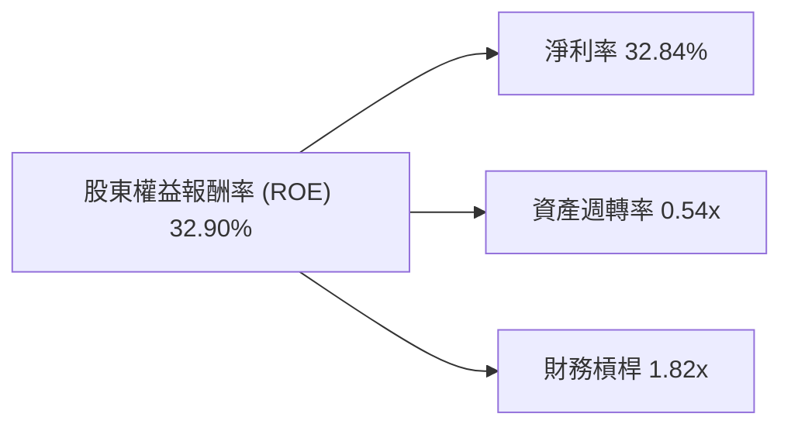
**分析**：
截至TTM Mar'26，Meta的**股東權益報酬率 (ROE)** 為32.90%。通過杜邦分解，我們可以深入了解其驅動因素：
- **淨利率**：32.84% ($70.59B 淨利潤 / $214.96B 營收)。Meta擁有強勁的淨利率，顯示其核心廣告業務具備高盈利能力和有效的成本控制。這是其高ROE的最主要貢獻者。
- **資產週轉率**：0.54x ($214.96B 營收 / $395.25B 總資產)。Meta的資產週轉率相對較低，這在重資產（如數據中心）的科技公司中是常見現象，表明其資產規模龐大且投資密集。
- **財務槓桿**：1.82x ($395.25B 總資產 / $217.24B 股東權益)。Meta的財務槓桿相對溫和，顯示公司在利用債務融資方面較為保守，這也與其穩健的財務狀況相符。
**總結**：Meta的高ROE主要由其卓越的**淨利率**驅動，而非過度依賴財務槓桿或資產的高週轉率。這表明公司擁有健康的盈利結構和高質量的收益。

### 6.4 獲利能力儀表板

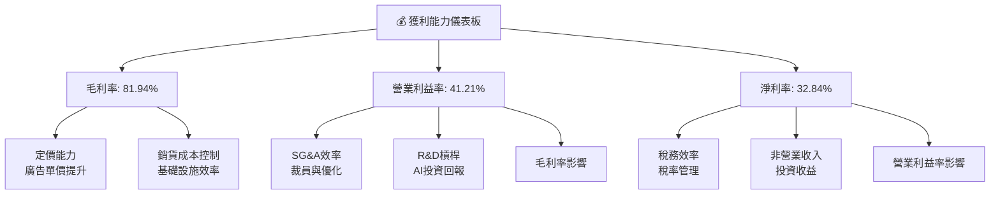
**分析**：
Meta的獲利能力強勁，體現在其高毛利率 (81.94%)、營業利益率 (41.21%) 和淨利率 (32.84%)。
- **毛利率**主要得益於其數位廣告產品的強大定價能力和規模效應，以及對基礎設施成本的有效控制。
- **營業利益率**的顯著改善是綜合作用的結果，包括毛利率的提升、在「效率年」中對銷售、一般及行政 (SG&A) 費用的嚴格控制，以及研發投入（尤其是AI）開始產生槓桿效應，提升了廣告投放效率和用戶參與度。
- **淨利率**則在營業利益率的基礎上，受到所得稅費用和非營業收入（如投資收益）的影響。整體而言，Meta的獲利能力表現卓越，且效率持續提升。

---

## 7. 估值深度分析

### 7.1 同業估值比較表格

為對Meta進行估值，我們將其與幾家主要競爭對手進行比較，包括Alphabet (GOOGL)、Microsoft (MSFT) 和Snap Inc. (SNAP)。

| 估值指標 | **META** | **Alphabet (GOOGL)** | **Microsoft (MSFT)** | **Snap Inc. (SNAP)** | 本公司評估 |
|--------------------|----------|----------------------|----------------------|----------------------|-----------|
| **Trailing P/E** | 21.18x | ~25-30x | ~35-40x | N/A (虧損) | 🟢 相對被低估 |
| **Forward P/E** | **15.95x** | ~20-25x | ~30-35x | ~25-30x (高預期) | 🟢 具吸引力 |
| **P/S Ratio** | 6.88x | ~5-7x | ~10-12x | ~3-5x | 🟡 合理偏低 |
| **P/B Ratio** | 6.07x | ~5-6x | ~10-12x | ~3-4x | 🟡 合理 |
| **EV / EBITDA** | 14.29x | ~15-20x | ~25-30x | ~15-20x | 🟢 相對被低估 |
| **Revenue Growth (YoY, TTM)** | **26.18%** | ~10-15% | ~15-20% | ~5-10% | 🟢 領先 |
| **Net Profit Margin (TTM)** | **32.8%** | ~20-25% | ~30-35% | N/A (虧損) | 🟢 具競爭力 |

**分析**：
- **P/E Ratio**：Meta的Trailing P/E為21.18x，Forward P/E為15.95x。與Alphabet (GOOGL) 和Microsoft (MSFT) 相比，Meta的P/E估值顯得更具吸引力，尤其是在Forward P/E方面。考慮到Meta強勁的營收和盈利增長率，其Forward P/E明顯被低估。
- **P/S Ratio**：Meta的P/S為6.88x，與Alphabet相近，但低於Microsoft。相較於其高達26.18%的TTM營收增長，這個P/S比率相對合理甚至偏低。
- **EV/EBITDA**：Meta的EV/EBITDA為14.29x，低於Alphabet和Microsoft，這再次表明其相對於盈利能力的估值偏低。
- **成長與利潤率**：Meta的TTM營收增長率26.18%領先於大部分同業，且其32.8%的淨利潤率也極具競爭力。
**總結**：綜合來看，Meta在關鍵估值指標上，尤其是Forward P/E和EV/EBITDA，相較於其卓越的成長性和獲利能力以及主要同業，顯得相對被低估，具有較大的投資吸引力。

### 7.2 歷史估值區間分析

Meta的P/E比率在過去幾年波動較大，反映了市場對其增長前景和元宇宙投資的態度變化。當前Forward P/E 15.95x處於其歷史區間的較低端，顯示具備估值修復潛力。

```
╔══════════════════════════════════════════════════════════════════╗
║               Meta Platforms 歷史 P/E 區間分析 (近5年)             ║
╠══════════════════════════════════════════════════════════════════╣
║                                                                  ║
║  歷史高點 (2021-2022):  ~35x   █████████████████████████████████████████░░░░░░░░║
║  歷史均值 (近5年):    ~25x   ███████████████████████████████░░░░░░░░░░░░║
║  歷史低點 (2022末):    ~10x   █████████░░░░░░░░░░░░░░░░░░░░░░░░░░░░░░░░░░░║
║                                                                  ║
║  當前 Trailing P/E:   21.18x █████████████████████░░░░░░░░░░░░░░░░░░░░░║
║  當前 Forward P/E:    15.95x ███████████████░░░░░░░░░░░░░░░░░░░░░░░░░║
║                                                                  ║
║  📊 結論：當前估值位於歷史區間中低位，具備上漲空間。              ║
╚══════════════════════════════════════════════════════════════════╝
```
**分析**：
在2021年，Meta的P/E比率曾高達35倍以上，反映了市場對其高速增長和元宇宙願景的極度樂觀。然而，在2022年宏觀經濟逆風和Reality Labs巨額虧損的影響下，P/E一度跌至10倍左右的歷史低點。目前，Meta的Trailing P/E為21.18x，Forward P/E為15.95x。這個估值水平位於其歷史區間的中低位，顯著低於歷史均值（約25x）。考慮到公司核心廣告業務的強勁復甦、AI技術的賦能和獲利能力的顯著改善，當前估值為投資者提供了較好的安全邊際和潛在的估值修復空間。

### 7.3 DCF 敏感性分析（6格目標價矩陣）

**假設條件**：
- **當前自由現金流 (FCF0)**：$48.253B (TTM Mar'26 StockAnalysis)
- **第一階段 FCF 成長率 (未來3年)**：基準20%，樂觀22%，悲觀18%
- **第二階段 FCF 成長率 (後4年)**：基準15%，樂觀17%，悲觀13%
- **第三階段 FCF 成長率 (後3年)**：基準10%，樂觀12%，悲觀8%
- **永續成長率 (Terminal Growth Rate)**：基準3.0%，樂觀3.5%，悲觀2.5%
- **加權平均資本成本 (WACC)**：基準10.86%，樂觀10.36% (低WACC)，悲觀11.36% (高WACC)
- **流通股數**：2.20B
- **淨現金**：總現金 $81.18B - 總債務 $86.77B = -$5.59B

| 情境 | **WACC = 10.36%** | **WACC = 10.86%（基準）** | **WACC = 11.36%** |
|------|-------------------|-----------------------------|-------------------|
| 🟢 **樂觀** | **$870** (+49.25%) | **$845** (+44.97%) | **$820** (+40.69%) |
| 🟡 **基準** | **$835** (+43.26%) | **$812** (+39.26%) | **$788** (+35.19%) |
| 🔴 **悲觀** | **$775** (+32.96%) | **$750** (+28.68%) | **$725** (+24.39%) |

**分析**：
基準情境下，Meta的內在價值為每股$812，相較當前股價$582.90有39.26%的上漲空間。在樂觀情境下，目標價可達$870，而在悲觀情境下，目標價仍有$725，顯示了較好的下行保護。DCF分析結果強烈支持Meta當前股價被低估的判斷，尤其是在考慮到其強勁的現金流增長潛力後。

### 7.4 估值綜合區間

```
╔══════════════════════════════════════════════════════════════════╗
║                    Meta Platforms 估值綜合區間                  ║
╠══════════════════════════════════════════════════════════════════╣
║                                                                  ║
║  目標價區間 (DCF)：                                              ║
║  悲觀情境：$725  ██████████████████████████████████████░░░░░░░░║
║  基準情境：$812  ████████████████████████████████████████████████░░░░░░░░║
║  樂觀情境：$870  ████████████████████████████████████████████████████████████░░░░░░░░║
║                                                                  ║
║  當前股價：$582.90  ██████████████████████████████░░░░░░░░░░░░░░░░░░░░░░░░░░░░░░░░░░║
║                                                                  ║
║  📊 結論：當前股價顯著低於內在價值區間，提供具吸引力的買入機會。 ║
╚══════════════════════════════════════════════════════════════════╝
```
**分析**：
綜合DCF敏感性分析和同業估值比較，Meta的當前股價$582.90顯著低於其內在價值區間。基準情境下的目標價$812，與當前股價相比有約39%的潛在漲幅。即使在悲觀情境下，目標價$725也提供了超過24%的潛在漲幅。這表明市場可能尚未充分反映Meta核心廣告業務的強勁復甦、AI技術的變現能力以及長期元宇宙戰略的潛在價值。當前估值為投資者提供了一個具有吸引力的買入機會。

---

## 8. 成長催化劑

### 8.1 催化劑時間軸

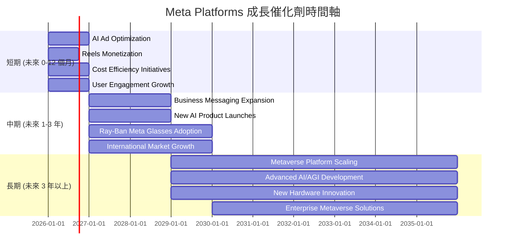

### 8.2 TAM 市場規模分析

Meta的潛在市場 (Total Addressable Market, TAM) 巨大，涵蓋了全球數位廣告、社交媒體、虛擬現實和人工智能等領域。

```
╔══════════════════════════════════════════════════════════════════╗
║                Meta Platforms TAM 市場規模分析                  ║
╠══════════════════════════════════════════════════════════════════╣
║                                                                  ║
║  全球數位廣告市場 (2025E)： $800B   ███████████████████████████████████████████████████████████████████████████████████████████████████████████████████████████████████████████████████████████████████████████████████████████████████████████████████████████████████████████████████████████████████████████████████████████████████████████████████████████████████████████████████████████████████████████████████████████████████████████████████████████████████████████████████████████████████████████████████████████████████████████████████████████████████████████████████████████████████████████████████████████████████████████████████████████████████████████████████████████████████████████████████████████████████████████████████████████████████████████████████████████████████████████████████████████████████████████████████████████████████████████████████████████████████████████████████████████████████████████████████████████████████████████████████████████████████████████████████████████████████████████████████████████████████████████████████████████████████████████████████████████████████████████████████████████████████████████████████████████████████████████████████████████████████████████████████████████████████████████████████████████████████████████████████████████████████████████████████████████████████████████████████████████████████████████████████████████████████████████████████████████████████████████████████████████████████████████████████████████████████████████████████████████████████████████████████████████████████████████████████████████████████████████████████████████████████████████████████████████████████████████████████████████████████████████████████████████████████████████████████████████████████████████████████████████████████████████████████████████████████████████████████████████████████████████████████████████████████████████████████████████████████████████████████████████████████████████████████████████████████████████████████████████████████████████████████████████████████████████████████████████████████████████████████████████████████████████████████████████████████████████████████████████████████████████████████████████████████████████████████████████████████████████████████████████████████████████████████████████████████████████████████████████████████████████████████████████████████████████████████████████████████████████████████████████████████████████████████████████████████████████████████████████████████████████████████████████████████████████████████████████████████████████████████████████████████████████████████████████████████████████████████████████████████████████████████████████████████████████████████████████████████████████████████████████████████████████████████████████████████████████████████████████████████████████████████████████████████████████████████████████████████████████████████████████████████████████████████████████████████████████████████████████████████████████████████████████████████████████████████████████████████████████████████████████████████████████████████████████████████████████████████████████████████████████████████████████████████████████████████████████████████████████████████████████████████████████████████████████████████████████████████████████████████████████████████████████████████████████████████████████████████████████████████████████████████████████████████████████████████████████████████████████████████████████████████████████████████████████████████████████████████████████████████████████████████████████████████████████████████████████████████████████████████████████████████████████████████████████████████████████████████████████████████████████████████████████████████████████████████████████████████████████████████████████████████████████████████████████████████████████████████████████████████████████████████████████████████████████████████████████████████████████████████████████████████████████████████████████████████████████████████████████████████████████████████████████████████████████████████████████████████████████████████████████████████████████████████████████████████████████████████████████████████████████████████████████████████████████████████████████████████████████████████████████████████████████████████████████████████████████████████████████████████████████████████████████████████████████████████████████████████████████████████████████████████████████████████████████████████████████████████████████████████████████████████████████████████████████████████████████████████████████████████████████████████████████████████████████████████████████████████████████████████████████████████████████████████████████████████████████████████████████████████████████████████████████████████████████████████████████████████████████████████████████████████████████████████████████████████████████████████████████████████████████████████████████████████████████████████████████████████████████████████████████████████████████████████████████████████████████████████████████████████████████████████████████████████████████████████████████████████████████████████████████████████████████████████████████████████████████████████████████████████████████████████████████████████████████████████████████████████████████████████████████████████████████████████████████████████████████████████████████████████████████████████████████████████████████████████████████████████████████████████████████████████████████████████████████████████████████████████████████████████████████████████████████████████████████████████████████████████████████████████████████████████████████████████████████████████████████████████████████████████████████████████████████████████████████████████████████████████████████████████████████████████████████████████████████████████████████████████████████████████████████████████████████████████████████████████████████████████████████████████████████████████████████████████████████████████████████████████████████████████████████████████████████████████████████████████████████████████████████████████████████████████████████████████████████████████████████████████████████████████████████████████████████████████████████████████████████████████████████████████████████████████████████████████████████████████████████████████████████████████████████████████████████████████████████████████████████████████████████████████████████████████████████████████████████████████████████████████████████████████████████████████████████████████████████████████████████████████████████████████████████████████████████████████████████████████████████████████████████████████████████████████████████████████████████████████████████████████████████████████████████████████████████████████████████████████████████████████████████████████████████████████████████████████████████
```

### 8.3 成長驅動力結構圖

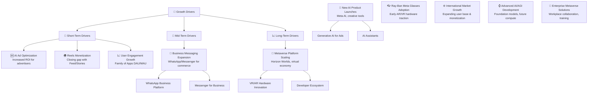

---

## 9. 風險矩陣

### 9.1 風險評分矩陣

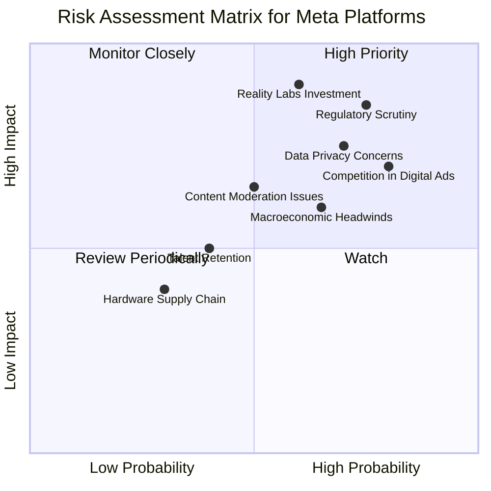

### 9.2 風險清單詳細分析

| # | 風險項目 | 發生機率 | 財務衝擊 | 風險評分 | 緩解措施 |
|---|----------|----------|----------|----------|----------|
| 1 | 🔴 **Reality Labs巨額投資與不確定性** | 中 (60%) | 高 (-5%~-10% 淨利潤) | 🔴 9.0/10 | 嚴格控制RL部門的資本支出；持續優化技術路線圖，尋求更明確的商業化路徑；與外部夥伴合作分擔研發成本。 |
| 2 | 🔴 **監管與反壟斷壓力** | 高 (75%) | 高 (-3%~-7% 營收/罰款) | 🔴 8.5/10 | 積極配合各國監管機構；主動調整隱私政策和數據處理方式；加強透明度，避免壟斷行為；通過法律途徑捍衛公司權益。 |
| 3 | 🟡 **數字廣告市場競爭加劇** | 高 (80%) | 中 (-2%~-5% 營收增長) | 🟡 7.5/10 | 繼續投入AI優化廣告投放精準度；拓展新的廣告形式（如Reels廣告、商業訊息）；強化創作者經濟，吸引優質內容。 |
| 4 | 🟡 **數據隱私政策變化** | 高 (70%) | 中 (-2%~-4% 營收) | 🟡 7.0/10 | 開發「隱私保護增強型」廣告技術；減少對第三方數據的依賴；加強第一方數據的利用效率；教育用戶數據使用透明度。 |
| 5 | 🟡 **宏觀經濟逆風** | 中 (65%) | 中 (-3%~-5% 營收增長) | 🟡 6.5/10 | 多元化廣告客戶基礎；為中小企業提供更具成本效益的廣告解決方案；優化成本結構以應對收入波動。 |
| 6 | 🟢 **內容審核與錯誤信息** | 中 (50%) | 低 (-1%~-2% 品牌價值) | 🟢 5.0/10 | 增加內容審核人員和AI工具投入；與事實核查機構合作；提升平台透明度，打擊虛假信息傳播。 |

---

## 10. 投資建議

### 10.1 最終綜合評級雷達圖

```
╔══════════════════════════════════════════════════════════════════╗
║                Meta Platforms 最終綜合評級雷達圖                  ║
╠══════════════════════════════════════════════════════════════════╣
║                                                                  ║
║  基本面強度  9.0 ▓▓▓▓▓▓▓▓▓▓▓▓▓▓▓▓▓▓░░                            ║
║  成長動能    9.0 ▓▓▓▓▓▓▓▓▓▓▓▓▓▓▓▓▓▓░░                            ║
║  獲利品質    9.0 ▓▓▓▓▓▓▓▓▓▓▓▓▓▓▓▓▓▓░░                            ║
║  財務健康    8.0 ▓▓▓▓▓▓▓▓▓▓▓▓▓▓▓▓░░░░                            ║
║  估值合理性  8.0 ▓▓▓▓▓▓▓▓▓▓▓▓▓▓▓▓░░░░                            ║
║  護城河深度  9.0 ▓▓▓▓▓▓▓▓▓▓▓▓▓▓▓▓▓▓░░                            ║
║  管理層執行  8.5 ▓▓▓▓▓▓▓▓▓▓▓▓▓▓▓▓▓░░░                            ║
║  技術創新力  9.5 ▓▓▓▓▓▓▓▓▓▓▓▓▓▓▓▓▓▓▓░                            ║
║                                                                  ║
║  🏆 綜合總分：8.8/10                                             ║
╚══════════════════════════════════════════════════════════════════╝
```

### 10.2 目標價與隱含報酬率

| 情境 | 目標價 ($) | 隱含報酬率 (%) | 機率權重 (%) | 加權平均目標價 ($) |
|------|------------|----------------|--------------|--------------------|
| 🟢 **樂觀** | $845 | +44.97% | 30% | $253.50 |
| 🟡 **基準** | $812 | +39.26% | 50% | $406.00 |
| 🔴 **悲觀** | $750 | +28.68% | 20% | $150.00 |
| **加權平均** | **$809.50** | **+38.89%** | **100%** | **$809.50** |

**分析**：
基於DCF模型和對各情境的機率權重分配，Meta的加權平均目標價為$809.50，相較於當前股價$582.90有約38.89%的潛在上漲空間。這支持了「強烈買入」的評級。

### 10.3 買入時機與觸發因素

```
╔══════════════════════════════════════════════════════════════════╗
║                  ✅ 買入觸發因素 Checklist                      ║
╠══════════════════════════════════════════════════════════════════╣
║                                                                  ║
║  立即買入觸發條件（多數符合）：                                  ║
║  ✅ 核心廣告業務營收持續雙位數增長，且超出市場預期               ║
║  ✅ 獲利能力（營業利益率、淨利率）維持高位或持續改善             ║
║  ✅ AI技術在廣告效率和新產品開發上取得顯著進展                   ║
║  ✅ 管理層持續強調成本控制和效率提升                             ║
║  ✅ 股價回調至Forward P/E 15-18x區間，提供更佳安全邊際           ║
║                                                                  ║
║  加碼觸發條件（出現以下任一）：                                  ║
║  ☐ Reality Labs虧損收窄或商業化進程加速                         ║
║  ☐ 監管環境出現積極變化，反壟斷壓力減輕                         ║
║  ☐ 公司宣佈新的大規模股票回購計劃或提高股息                     ║
║  ☐ 用戶增長超預期，尤其是在年輕用戶群體                         ║
║                                                                  ║
║  減碼/停損觸發條件（出現以下任一）：                             ║
║  ☐ 核心廣告業務增長顯著放緩，連續兩個季度不及預期               ║
║  ☐ Reality Labs虧損持續擴大且無明確商業化前景                   ║
║  ☐ 核心管理層變動，導致戰略不確定性                             ║
║  ☐ 重大監管罰款或業務拆分風險成為現實                           ║
╚══════════════════════════════════════════════════════════════════╝
```

### 10.4 投資人適配度分析

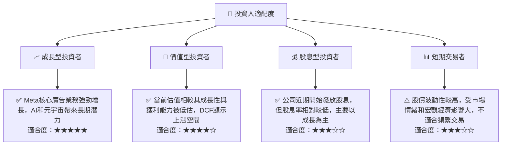

### 10.5 關鍵監控指標

| 監控類型 | 指標 | 關注點 | 頻率 |
|----------|------|----------|------|
| **營收增長** | FoA 營收 YoY 增長率 | 廣告展示量、平均單價 (API) | 季度 |
| **獲利能力** | 營業利益率、淨利率 | 成本控制、AI效率提升對利潤的影響 | 季度 |
| **用戶參與度** | Family of Apps DAU/MAU | 用戶增長趨勢、Reels使用時長 | 季度 |
| **資本效率** | ROIC vs WACC | 確保公司持續創造股東價值 | 年度 |
| **元宇宙進展** | Reality Labs 營收、虧損、Quest銷量 | 商業化進程、虧損收窄跡象 | 季度/年度 |
| **自由現金流** | 自由現金流 (FCF) | 經營活動現金流、資本支出水平 | 季度 |
| **監管風險** | 各國反壟斷調查、數據隱私法規變化 | 潛在罰款、業務模式調整 | 持續 |

---

> **免責聲明**：本報告為 AI 自動生成，僅供研究參考，不構成投資建議。投資有風險，入市需謹慎。