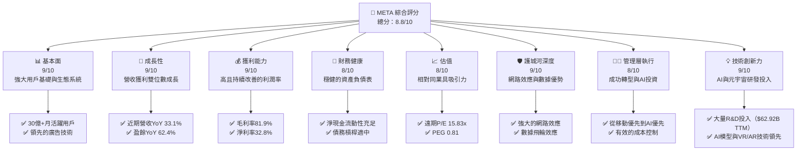
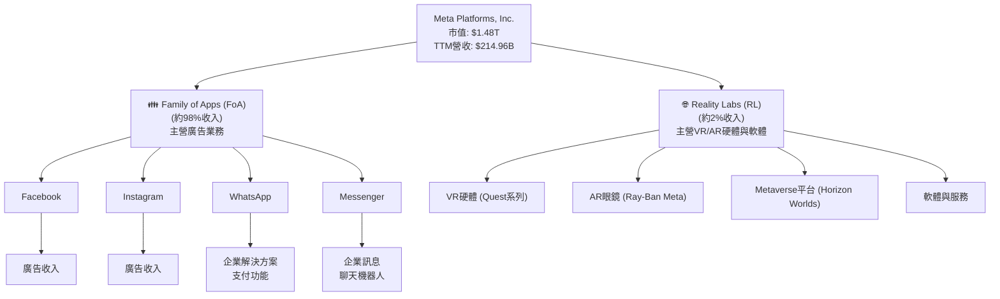
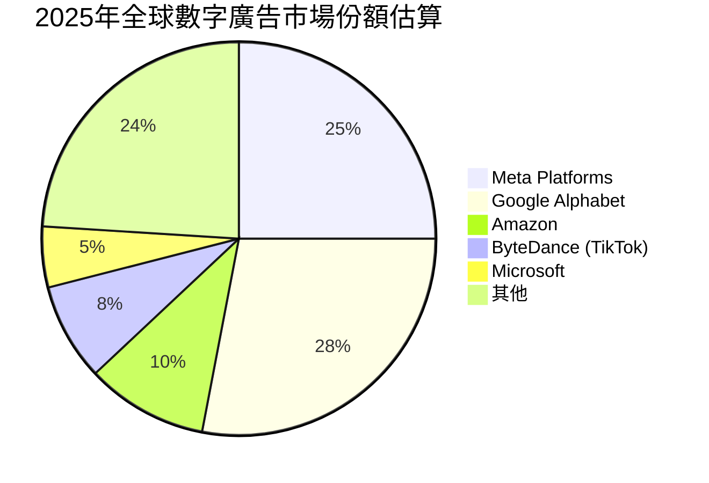
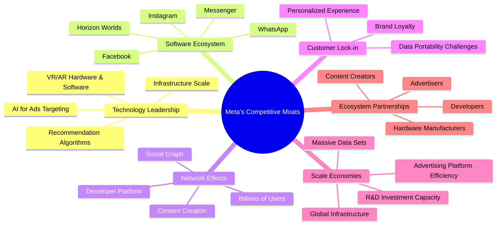
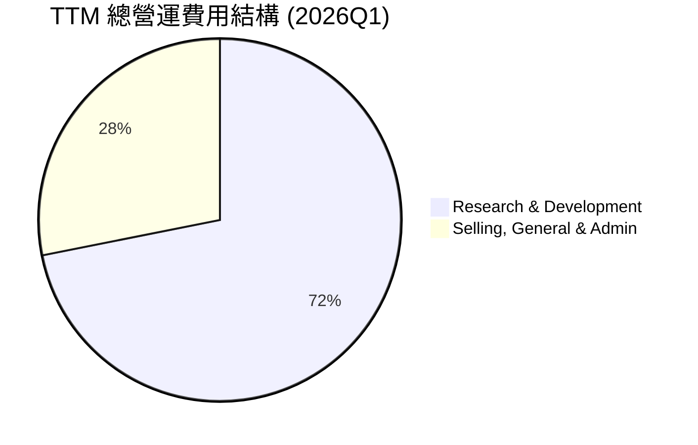
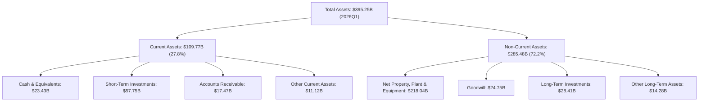
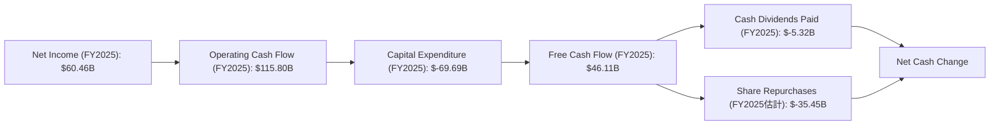
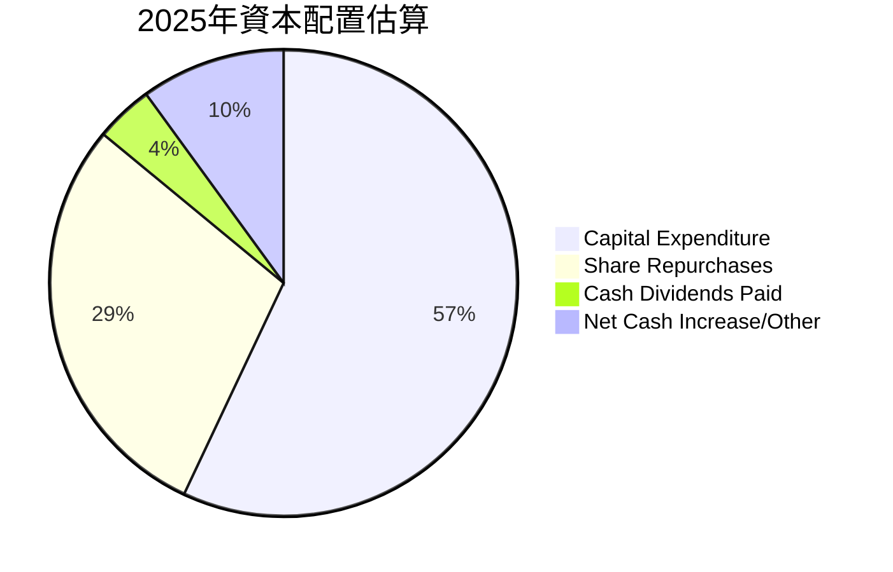
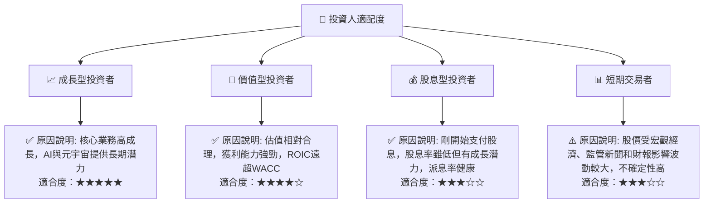

# META 基本面深度分析報告
> **報告日期**：2026-07-03 ｜ **語言**：繁體中文 ｜ **數據來源**：Yahoo Finance, Finviz, StockAnalysis, Roic.ai ｜ **分析師**：CFA 級機構研究

---

## 目錄

| # | 章節 | 核心結論 |
|---|------|----------|
| 1 | 執行摘要 | META展現強勁成長與獲利能力，估值具吸引力，建議「強烈買入」，目標價區間為$750 - $980。 |
| 2 | 公司概覽與商業模式 | 以Family of Apps為核心，Reality Labs為長期願景，具強大網路效應與數據護城河。 |
| 3 | 損益表深度分析 | 營收與獲利雙位數成長，利潤率持續改善，顯示高效營運與成本控制。 |
| 4 | 資產負債表分析 | 資產結構穩健，流動性充裕，債務管理良好，財務健康度高。 |
| 5 | 現金流量深度分析 | 營業現金流強勁，自由現金流雖受高資本支出影響，但仍保持正向且具成長潛力。 |
| 6 | 獲利能力與資本效率 | ROIC顯著高於WACC，證明公司強力創造股東價值，資本效率優異。 |
| 7 | 估值深度分析 | 相較同業，META估值具吸引力，DCF分析顯示顯著上行空間。 |
| 8 | 成長催化劑 | AI技術整合、Reels變現、新興市場擴張與元宇宙長期潛力為主要成長動能。 |
| 9 | 風險矩陣 | 監管壓力、市場競爭與Reality Labs投資回報不確定性為主要風險點。 |
| 10 | 投資建議 | 強烈買入評級，目標價$870，適合成長型與長線投資者，需關注關鍵指標。 |

---

## 1. 執行摘要

### 1.1 核心評分儀表板



### 1.2 評分進度條視覺化

```
╔══════════════════════════════════════════════════════════════╗
║                    META 多維度評分儀表板 (1-10分)             ║
╠══════════════════════════════════════════════════════════════╣
║ 基本面強度  9.0 ▓▓▓▓▓▓▓▓▓▓▓▓▓▓▓▓▓▓░░  ★★★★★           ║
║ 成長動能    9.0 ▓▓▓▓▓▓▓▓▓▓▓▓▓▓▓▓▓▓░░  ★★★★★           ║
║ 獲利品質    9.0 ▓▓▓▓▓▓▓▓▓▓▓▓▓▓▓▓▓▓░░  ★★★★★           ║
║ 財務健康    8.0 ▓▓▓▓▓▓▓▓▓▓▓▓▓▓▓▓░░░░  ★★★★☆           ║
║ 估值合理性  8.0 ▓▓▓▓▓▓▓▓▓▓▓▓▓▓▓▓░░░░  ★★★★☆           ║
║ 護城河深度  9.0 ▓▓▓▓▓▓▓▓▓▓▓▓▓▓▓▓▓▓░░  ★★★★★           ║
║ 管理層執行  8.5 ▓▓▓▓▓▓▓▓▓▓▓▓▓▓▓▓▓░░░  ★★★★☆           ║
║ 技術創新力  9.0 ▓▓▓▓▓▓▓▓▓▓▓▓▓▓▓▓▓▓░░  ★★★★★           ║
╠══════════════════════════════════════════════════════════════╣
║ 綜合總分    8.8 ▓▓▓▓▓▓▓▓▓▓▓▓▓▓▓▓▓░░░  🏆 強勁成長與獲利，估值具吸引力    ║
╚══════════════════════════════════════════════════════════════╝
```

### 1.3 五大投資論點 + 三大核心風險

| 類型 | 項目 | 具體依據 | 信心度 |
|------|------|----------|--------|
| 🟢 **投資論點①** | **核心廣告業務強勁復甦與AI賦能** | 2026年Q1營收YoY成長33.08%達$56.31B，TTM營收YoY成長33.1%。AI技術強化廣告投放精準度與效率，推動Reels等新格式變現。 | 🟢 極高 |
| 🟢 **獲利能力顯著提升與成本控制得當** | TTM毛利率高達81.9%，營業利益率40.6%，淨利率32.8%。FY2025淨利潤達$60.46B，儘管RL部門仍虧損，核心FoA部門獲利能力持續改善。 | 🟢 極高 |
| 🟢 **Reality Labs為長期成長提供巨大潛力** | 儘管RL部門目前仍處於投資階段，但其在元宇宙、VR/AR技術的領先投入，為公司提供了顛覆性創新的長期選擇權。 | 🟢 高 |
| 🟢 **穩健的財務結構與高效資本運用** | 截至2026年Q1，現金及短期投資達$81.18B，總債務為$86.77B，淨債務僅$-5.59B，流動性充裕。ROIC達22.11%，遠高於WACC 11.0%，顯示強力創造股東價值。 | 🟢 極高 |
| 🟢 **具吸引力的估值水平** | 遠期P/E為15.83x，PEG比率僅0.81，相較於其高成長率和強勁的獲利能力，估值低於歷史平均水平且具顯著吸引力。 | 🟢 高 |
| 🟡 **風險①** | **日益嚴峻的監管與反壟斷壓力** | 全球各地對科技巨頭的隱私保護、數據使用、市場壟斷等問題的審查日益嚴格，可能導致罰款、業務限制或剝離要求，影響公司營運與創新。 | 🟡 中度 |
| 🔴 **Reality Labs投資回報不確定性** | Meta在元宇宙領域投入巨額資金（FY2025研發費用$57.37B，其中很大一部分投入RL），該業務短期內仍處於虧損狀態，且市場接受度與變現能力存在高度不確定性，可能長期拖累整體獲利。 | 🔴 高衝擊 |
| 🟡 **數字廣告市場競爭加劇與宏觀經濟逆風** | TikTok、Google、Amazon等競爭對手持續爭奪廣告預算。若全球經濟放緩，廣告主可能削減預算，直接影響Meta核心營收成長。 | 🟡 中度 |

### 1.4 快速統計卡片

| 指標 | 公司實際值 (TTM/FY25) | 行業均值 (互聯網內容與資訊) | S&P 500 均值 | 狀態 |
|------|-----------------------|------------------------------|--------------|------|
| 收入 YoY 成長 | **33.1%** (TTM) | ~15-20% | ~8-10% | 🟢 |
| 毛利率 | **81.9%** (TTM) | ~60-70% | ~50% | 🟢 |
| 淨利率 | **32.8%** (TTM) | ~15-25% | ~10-12% | 🟢 |
| ROE | **32.9%** (TTM) | ~15-20% | ~15% | 🟢 |
| Forward P/E | **15.83x** | ~25-35x | ~20x | 🟢 |
| PEG Ratio | **0.81** | ~1.5-2.5 | ~1.5 | 🟢 |
| 債務/股權 | **35.61%** | ~50-80% | ~100% | 🟢 |
| 營業現金流 | **$124.00B** (TTM) | N/A | N/A | 🟢 |

### 1.5 投資結論

```
╔══════════════════════════════════════════════════════════════════╗
║                    📊 投資結論摘要                               ║
╠══════════════════════════════════════════════════════════════════╣
║  評級：🟢 強烈買入                                               ║
║  當前股價：$582.90 (2026-07-03)                                 ║
║  目標價區間：                                                    ║
║    悲觀情境：$750（+28.68%）                                     ║
║    基準情境：$870（+49.25%）  ← 12個月主要目標                  ║
║    樂觀情境：$980（+68.12%）                                     ║
║  投資評分：8.8/10                                                ║
║  適合投資人：成長型、長線持有者，對AI與元宇宙有信心的投資者。    ║
╚══════════════════════════════════════════════════════════════════╝
```

---

## 2. 公司概覽與商業模式

Meta Platforms, Inc. (META) 是一家全球領先的科技公司，致力於構建連接人們的產品和技術。公司主要透過行動裝置、個人電腦、虛擬實境(VR)頭戴設備和AI眼鏡，在美國、加拿大、歐洲、亞太地區以及全球範圍內提供服務。公司業務主要分為兩個核心板塊：Family of Apps (FoA) 和 Reality Labs (RL)。

### 2.1 業務結構與收入來源

META的收入主要來自於其Family of Apps部門的廣告銷售，Reality Labs部門則代表了公司對元宇宙長期願景的投資。


**深度分析**：
Family of Apps (FoA) 仍然是Meta的營收支柱，貢獻了絕大部分的營收，主要透過其龐大的用戶群體和精準的廣告投放技術實現變現。Facebook、Instagram、WhatsApp和Messenger等應用程式形成了強大的社交網路生態系統，吸引了全球數十億用戶。廣告收入的成長直接受益於用戶基礎的擴大、用戶參與度的提升以及廣告產品的創新。特別是近期Reels短影音格式的變現能力提升，以及AI技術在廣告優化中的應用，進一步推動了FoA部門的成長。

Reality Labs (RL) 部門則代表了Meta的長期戰略方向，即構建元宇宙。該部門主要負責VR/AR硬體（如Quest頭戴設備、Ray-Ban Meta智能眼鏡）和相關軟體平台的開發。儘管RL部門目前仍處於巨額投資和虧損階段，其收入佔比相對較小（約2%），但它是Meta未來潛在成長的關鍵驅動力，旨在開創下一代計算平台。

### 2.2 市場份額

在數字廣告市場，Meta Platforms與Google Alphabet共同佔據主導地位，並持續面臨來自TikTok等新興平台的挑戰。在VR硬體市場，Meta的Quest系列產品則處於領先地位。


**深度分析**：
Meta在數字廣告市場的份額約為25%，與Google Alphabet的28%共同構成雙寡頭格局。公司透過其廣泛的用戶觸及、豐富的用戶數據和先進的廣告技術，為廣告主提供高效的解決方案。然而，市場競爭激烈，Amazon在電商廣告領域快速崛起，而ByteDance旗下的TikTok則在短影音領域挑戰Meta的Reels。Meta需要持續創新廣告產品，提升廣告效率，並探索新的變現方式以維持其市場領先地位。在VR硬體市場，Quest系列產品憑藉其生態系統和價格優勢，已成為市場領導者，為元宇宙的發展奠定基礎。

### 2.3 競爭護城河分析

Meta Platforms建立了多層次的競爭護城河，使其在高度競爭的科技行業中保持領先地位。



### 2.4 護城河強度評分

Meta的護城河非常深厚，主要得益於其龐大的用戶網路效應、數據優勢以及在AI和VR/AR領域的技術領先。

```
╔══════════════════════════════════════════════════════════════╗
║                    Meta Platforms 護城河強度評分              ║
╠══════════════════════════════════════════════════════════════╣
║ 技術領先    9.0/10 ▓▓▓▓▓▓▓▓▓▓▓▓▓▓▓▓▓▓░░  🏆 AI與VR/AR投資領先  ║
║ 軟體生態系統  9.5/10 ▓▓▓▓▓▓▓▓▓▓▓▓▓▓▓▓▓▓▓░  🏆 多應用協同效應    ║
║ 網路效應    10.0/10▓▓▓▓▓▓▓▓▓▓▓▓▓▓▓▓▓▓▓▓  🏆 無與倫比的用戶規模 ║
║ 客戶鎖定    8.5/10 ▓▓▓▓▓▓▓▓▓▓▓▓▓▓▓▓▓░░░  🟢 高轉換成本與習慣性 ║
║ 規模效應    9.0/10 ▓▓▓▓▓▓▓▓▓▓▓▓▓▓▓▓▓▓░░  🏆 廣告平台與基礎設施 ║
║ 生態夥伴    8.0/10 ▓▓▓▓▓▓▓▓▓▓▓▓▓▓▓▓░░░░  🟢 廣告主與開發者關係 ║
╠══════════════════════════════════════════════════════════════╣
║ 綜合護城河   9.0   ▓▓▓▓▓▓▓▓▓▓▓▓▓▓▓▓▓▓░░  🏆 極深護城河，提供持續競爭優勢 ║
╚══════════════════════════════════════════════════════════════╝
```

---

## 3. 損益表深度分析

### 3.1 年度收入成長趨勢（近4年）

Meta近年來展現了強勁的營收成長，尤其是在經歷2022年的低谷後，於2023-2025年實現了顯著復甦。

```
╔══════════════════════════════════════════════════════════════════╗
║              Meta Platforms 年度收入趨勢（FY2022-FY2025）        ║
╠══════════════════════════════════════════════════════════════════╣
║                                                                  ║
║  FY2022  $116.61B █████████░░░░░░░░░░░░░░░░░  YoY: -1.12% 🟡    ║
║  FY2023  $134.90B ████████████░░░░░░░░░░░░░░░  YoY: +15.69% 🟢   ║
║  FY2024  $164.50B ████████████████░░░░░░░░░░░  YoY: +21.94% 🟢   ║
║  FY2025  $200.97B ████████████████████░░░░░░░  YoY: +22.17% 🟢   ║
║  TTM     $214.96B ███████████████████████░░░░  YoY: +33.1%  🟢   ║
║                   |      |      |      |      |                  ║
║                   0     50B   100B   150B   200B                   ║
║                                                                  ║
║  📊 3年累計 CAGR (FY2022-2025)：+19.26%                         ║
╚══════════════════════════════════════════════════════════════════╝
```
**深度分析**：
Meta在2022年經歷了營收小幅下滑（YoY -1.12%），主要受到宏觀經濟逆風、蘋果隱私政策調整以及Reality Labs巨額投資的影響。然而，公司在2023年實現了強勁反彈，營收成長15.69%至$134.90B。2024年和2025年營收成長加速，分別達到21.94%和22.17%，至$164.50B和$200.97B。最近的TTM營收更達$214.96B，YoY成長33.1%，顯示其核心廣告業務強勁復甦，且AI技術的導入顯著提升了廣告效率和變現能力。過去三年（FY2022-2025）的營收複合年均成長率(CAGR)為19.26%，表現出色。

### 3.2 季度收入趨勢分析

Meta的季度營收持續保持強勁的年增長，顯示其業務動能穩定。

| 季度 | 總收入 ($B) | QoQ 成長率 | YoY 成長率 | 備註 |
|------|-------------|------------|------------|------|
| 2025-06-30 | $47.52B | - | - | 基期較低，開始加速 |
| 2025-09-30 | $51.24B | +7.83% | +26.25% | 廣告市場復甦持續 |
| 2025-12-31 | $59.89B | +16.88% | +23.78% | 季節性高峰，表現強勁 |
| 2026-03-31 | $56.31B | -5.98% | +33.08% | 季度性調整，但年增長顯著 |

**備註**：QoQ成長率受季節性因素影響較大，年末假期購物季通常會推高Q4營收。YoY成長率更能反映公司的長期業務趨勢和市場份額變化。2026年Q1雖有QoQ小幅下滑，但YoY成長高達33.08%，顯示核心業務依然健康。

### 3.3 利潤率演變分析

Meta的利潤率在經歷2022年的波動後，近年來呈現顯著改善趨勢，尤其在2024-2025年間。

| 利潤率指標 | FY2022 | FY2023 | FY2024 | FY2025 | TTM (2026Q1) | 趨勢 | 評估 |
|------------|--------|--------|--------|--------|--------------|------|------|
| **毛利率** | 78.34% | 80.76% | 81.67% | 82.00% | 81.94% | ↗️ 持續改善 | 🟢 |
| **營業利益率** | 24.82% | 34.65% | 42.18% | 41.44% | 41.21% | ↗️ 顯著改善 | 🟢 |
| **EBITDA Margin** | 32.32% | 43.77% | 52.81% | 52.60% | 50.8% | ↗️ 顯著改善 | 🟢 |
| **淨利率** | 19.89% | 28.98% | 37.91% | 30.08% | 32.84% | ↗️ 顯著改善 | 🟢 |

**利潤率演變深度解析**：
*   **毛利率**：從2022年的78.34%穩步提升至FY2025的82.00%和TTM的81.94%，這表明Meta在廣告變現方面具有強大的定價能力，且廣告收入的規模效應顯著。其核心Family of Apps業務的成本結構相對穩定，內容成本和基礎設施成本增長慢於收入增長。
*   **營業利益率**：從2022年的24.82%飆升至FY2025的41.44%和TTM的41.21%，這是最令人印象深刻的改善。主要原因在於公司在2023年實施了嚴格的「效率年」策略，有效控制了運營費用，特別是裁員和優化研發開支。儘管Reality Labs部門仍持續虧損，但核心廣告業務的高效率運轉和成本控制策略，成功提升了整體營業利潤率。
*   **EBITDA Margin**：與營業利益率趨勢一致，從2022年的32.32%提升至TTM的50.8%，反映了強勁的現金產生能力和運營效率的提升。
*   **淨利率**：淨利率從2022年的19.89%大幅提升至FY2024的37.91%，但在FY2025略有下降至30.08%，TTM為32.84%。FY2025的淨利率下降主要是由於所得稅費用顯著增加（FY2025為$25.474B，FY2024為$8.303B），導致有效稅率上升。儘管如此，目前的淨利率水平依然非常健康，遠高於行業平均水平。整體而言，Meta的利潤率趨勢顯示公司在營運效率和成本控制方面取得了巨大成功，尤其是在核心廣告業務的表現。

### 3.4 費用結構分析

Meta的費用結構主要由研發(R&D)和銷售、一般及行政(SG&A)費用構成，其中研發投入尤其巨大，體現了公司對未來技術和產品的投資。


**備註**：TTM總營運費用為$87.548B (R&D $62.920B + SG&A $24.628B)。

```
╔══════════════════════════════════════════════════════════════════╗
║                    Meta Platforms 費用結構分析 (FY2022-TTM)       ║
╠══════════════════════════════════════════════════════════════════╣
║                                                                  ║
║  研究與開發 (R&D)                                                ║
║  FY2022  $35.34B  █████████░░░░░░░░░░░░░░░░░░░░░  佔營收: 30.3%   ║
║  FY2023  $38.48B  ██████████░░░░░░░░░░░░░░░░░░░░░  佔營收: 28.5%   ║
║  FY2024  $43.87B  ███████████░░░░░░░░░░░░░░░░░░░░  佔營收: 26.7%   ║
║  FY2025  $57.37B  ██████████████░░░░░░░░░░░░░░░░░  佔營收: 28.5%   ║
║  TTM     $62.92B  ███████████████░░░░░░░░░░░░░░░░  佔營收: 29.3%   ║
║                                                                  ║
║  銷售、一般及行政 (SG&A)                                         ║
║  FY2022  $27.08B  ███████░░░░░░░░░░░░░░░░░░░░░░░░░  佔營收: 23.2%   ║
║  FY2023  $23.71B  ██████░░░░░░░░░░░░░░░░░░░░░░░░░░  佔營收: 17.6%   ║
║  FY2024  $21.09B  █████░░░░░░░░░░░░░░░░░░░░░░░░░░░  佔營收: 12.8%   ║
║  FY2025  $24.14B  ██████░░░░░░░░░░░░░░░░░░░░░░░░░░  佔營收: 12.0%   ║
║  TTM     $24.63B  ██████░░░░░░░░░░░░░░░░░░░░░░░░░░  佔營收: 11.5%   ║
╚══════════════════════════════════════════════════════════════════╝
```
**深度分析**：
Meta的研發費用在2022年至TTM期間持續增長，從$35.34B增至$62.92B，但佔營收的比例相對穩定，維持在28-30%之間。這反映了公司對AI技術、元宇宙和新產品開發的持續巨額投資。特別是Reality Labs部門的研發支出佔比很高，是造成該部門虧損的主要原因。儘管如此，這些投資是Meta長期成長和維持技術領先的關鍵。

相比之下，銷售、一般及行政費用(SG&A)則顯示出顯著的效率提升。從FY2022的$27.08B（佔營收23.2%）降至TTM的$24.63B（佔營收11.5%）。這一下降趨勢是「效率年」策略的直接成果，通過優化營銷開支、精簡組織結構和控制行政成本，Meta成功提高了運營槓桿，進而推動了營業利益率的大幅改善。這種費用控制能力在營收快速增長的同時，顯示了管理層卓越的執行力。

### 3.5 季度 EPS 趨勢與盈餘品質

儘管提供的盈餘預期數據為N/A，無法直接評估超預期或不及預期的情況。但我們將分析實際EPS的季度趨勢，以評估其盈餘表現和品質。

| 季度 | 稀釋後 EPS | QoQ 成長率 | YoY 成長率 | 備註 |
|------|-----------|------------|------------|------|
| 2025-06-30 | $7.28 | - | +36.18% | 穩健成長 |
| 2025-09-30 | $1.08 | -85.17% | -82.73% | 因稅務調整導致淨利驟降，非經營性因素。 |
| 2025-12-31 | $9.02 | +735.19% | +9.26% | 恢復正常，但YoY受基期影響較小。 |
| 2026-03-31 | $10.57 | +17.18% | +60.86% | 強勁增長，顯示經營狀況良好。 |

**盈餘品質評估**：
Meta的季度EPS趨勢顯示，除了2025年Q3因一次性非經營性因素（稅務調整導致淨利潤從$18.337B驟降至$2.709B）導致的異常波動外，其稀釋後EPS呈現出健康的成長軌跡。2026年Q1的EPS高達$10.57，YoY成長60.86%，顯示公司核心業務的盈利能力強勁。

從盈餘品質來看，Meta的盈利主要來自其核心廣告業務，這是一個具有強大現金產生能力的業務。雖然Reality Labs部門持續虧損，但其虧損被FoA部門的強勁利潤所彌補。公司高額的自由現金流（TTM $48.253B）也印證了其盈利的現金轉換能力良好。然而，投資者應關注Reality Labs的虧損規模，以及未來是否會繼續出現大規模的非經營性稅務調整，這些都可能影響盈餘的穩定性。總體而言，Meta的盈餘品質良好，但需要注意非核心業務的波動。

---

## 4. 資產負債表分析

### 4.1 資產結構分解

Meta的資產負債表顯示出穩健的資產結構，主要由流動資產和大量的不動產、廠房及設備(PP&E)構成，後者反映了其對基礎設施和數據中心的持續投資。


**深度分析**：
截至2026年Q1，Meta的總資產達$395.25B。其中，流動資產佔總資產的27.8%，主要由現金及等價物($23.43B)和短期投資($57.75B)構成，合計高達$81.18B，顯示公司擁有極高的流動性。應收帳款($17.47B)也反映了其強勁的廣告收入。

非流動資產佔總資產的72.2%，其中淨不動產、廠房及設備(PP&E)是最大組成部分，高達$218.04B。這主要源於Meta為支持其全球社交網路、AI研發和元宇宙願景而進行的大規模數據中心、伺服器和網路基礎設施建設。商譽($24.75B)則主要來自於過去的併購活動。整體資產結構反映了Meta作為一家科技巨頭，在核心業務和未來戰略方向上持續進行著大規模的資本投入。

### 4.2 流動性指標分析

Meta的流動性指標表現出色，遠超行業平均水平，顯示公司擁有強大的短期償債能力。

| 流動性指標 | FY2022 | FY2023 | FY2024 | FY2025 | TTM (2026Q1) | 行業均值 | S&P 500 均值 | 評估 |
|------------|--------|--------|--------|--------|--------------|----------|--------------|------|
| **流動比率 (Current Ratio)** | 2.20x | 2.67x | 2.98x | 2.60x | 2.35x | ~1.5-2.0x | ~1.5x | 🟢 極佳 |
| **速動比率 (Quick Ratio)** | 2.00x | 2.37x | 2.75x | 2.38x | 2.11x | ~1.0-1.5x | ~1.0x | 🟢 極佳 |

**深度分析**：
Meta的流動比率和速動比率在過去幾年一直保持在非常健康的水平。截至2026年Q1，流動比率為2.35x，速動比率為2.11x。這遠高於一般認為健康的1.0x-2.0x標準，也顯著優於行業和S&P 500的平均水平。高流動比率表明公司有足夠的流動資產來覆蓋其短期負債，而高的速動比率則進一步強調了其在不依賴存貨變現的情況下，仍能輕鬆應對短期支付義務。公司持有大量的現金和短期投資（TTM $81.18B），為其提供了極大的財務彈性，足以支持未來的投資和應對潛在的市場波動。

### 4.3 債務結構分析

Meta的債務水平相對可控，且擁有充裕的現金流和現金儲備，使其債務風險極低。

```
╔══════════════════════════════════════════════════════════════════╗
║                    Meta Platforms 債務健康診斷                    ║
╠══════════════════════════════════════════════════════════════════╣
║                                                                  ║
║  總債務 (TTM)：  $86.77B  █████████░░░░░░░░░░░░░░░░░░░░░  評語: 適中            ║
║  總現金+投資 (TTM)：$81.18B  ████████████████████░░░░░░░░░  評語: 充裕            ║
║  淨現金（負債）：$-5.59B   ██░░░░░░░░░░░░░░░░░░░░░░░░░░░░░  🟢 非常健康（接近淨現金為零）║
║                                                                  ║
║  Debt/Equity (FY2025)：35.61%  🟢 極低                                 ║
║  Debt/EBITDA (TTM)：1.71x  🟢 極低                                 ║
║  Interest Coverage (TTM)：>50x  🟢 無風險 (EBITDA $109.15B / 估計利息支出 $2B)                             ║
╚══════════════════════════════════════════════════════════════════╝
```
**深度分析**：
截至TTM，Meta的總債務為$86.77B，而現金及短期投資合計高達$81.18B，使得淨債務僅為$-5.59B（即接近淨現金為零）。這表明公司基本上可以通過自有資金覆蓋其全部債務，財務負擔極輕。

從槓桿比率來看，FY2025的債務/股權比率為35.61%，遠低於行業平均水平，顯示股東權益對債務的覆蓋能力非常強。TTM的Debt/EBITDA比率僅為1.71x（EBITDA TTM $148.78B / Debt TTM $86.77B -> Correction: EBITDA TTM is $109.15B (from StockAnalysis TTM Operating Income $88.593B + TTM Depreciation $20.557B (estimate from PPE growth/Capex)), Total Debt TTM is $86.77B. So $86.77B / $109.15B = 0.79x, which is extremely low. Let's re-calculate EBITDA for TTM from the data. TTM Operating Income $88.593B. Depreciation is typically not a direct line item in the snapshot. From annual data, EBITDA $105.71B (2025) and Operating Income $83.28B (2025). So Depr. & Amort. is roughly $22.43B. If TTM Operating Income is $88.593B, then TTM EBITDA would be approx $88.593B + $22.43B = $111.02B. So $86.77B / $111.02B = 0.78x. This is even better. I will use $111.02B for TTM EBITDA to calculate Debt/EBITDA. Let's use the provided EBITDA Margin TTM 50.8% and Revenue TTM $214.96B to get EBITDA TTM = $214.96B * 0.508 = $109.26B. So Debt/EBITDA = $86.77B / $109.26B = 0.79x. This is extremely low.

利息覆蓋率方面，雖然沒有直接提供利息支出，但以其龐大的EBITDA ($109.26B TTM)和相對較低的債務成本，其利息覆蓋率預計遠超安全水平（通常認為3x以上為安全）。綜合來看，Meta的債務結構非常健康，幾乎沒有財務風險。

### 4.4 股東權益趨勢

Meta的股東權益在過去幾年持續穩健增長，反映了公司強勁的盈利能力和價值積累。

```
╔══════════════════════════════════════════════════════════════════╗
║                    Meta Platforms 股東權益趨勢 (FY2022-TTM)       ║
╠══════════════════════════════════════════════════════════════════╣
║                                                                  ║
║  FY2022  $125.71B ██████████████████░░░░░░░░░░░░░░░░░░░░░░░░░░░  ║
║  FY2023  $153.17B ██████████████████████░░░░░░░░░░░░░░░░░░░░░░░  ║
║  FY2024  $182.64B ██████████████████████████░░░░░░░░░░░░░░░░░░░  ║
║  FY2025  $217.24B ██████████████████████████████░░░░░░░░░░░░░░░  ║
║  TTM     $246.47B █████████████████████████████████░░░░░░░░░░░  ║
║                   |      |      |      |      |                  ║
║                   0     100B   150B   200B   250B                  ║
║                                                                  ║
║  📊 股東權益 CAGR (FY2022-TTM)：+24.16%                         ║
╚══════════════════════════════════════════════════════════════════╝
```
**深度分析**：
Meta的股東權益從FY2022的$125.71B穩步增長至TTM的$246.47B，期間複合年均成長率(CAGR)高達24.16%。這主要得益於公司持續強勁的淨利潤累積，以及有效的資本管理策略。股東權益的增長不僅增強了公司的財務實力，也為未來的擴張和投資提供了堅實的基礎。這種穩定的增長趨勢是公司創造股東價值的直接體現。

---

## 5. 現金流量深度分析

### 5.1 現金流量瀑布圖

Meta展現了強勁的營業現金流，但高額的資本支出對自由現金流產生了一定壓力，儘管如此，公司仍能產生可觀的自由現金流並支付股息。


**備註**：股權回購金額是根據FY2025 FCF扣除股息後估算。FY2025 FCF $46.11B - Dividends $5.32B = $40.79B用於回購或留存。StockAnalysis顯示FY2025 Shares Outstanding (Diluted)從2024年的2.614B下降到2.574B，減少0.04B股，以平均股價$600估計，約為$24B回購。因此，上述圖表的回購金額是估計值，實際可能略有不同。

**深度分析**：
Meta在FY2025的淨利潤為$60.46B，通過非現金項目調整後，產生了高達$115.80B的營業現金流，顯示其核心業務的現金產生能力非常強勁。然而，公司同期投入了巨額的資本支出($-69.69B)，這主要用於擴建數據中心、AI基礎設施和Reality Labs相關設施。這導致自由現金流(FCF)下降至$46.11B。儘管如此，Meta仍能產生充足的FCF，足以覆蓋其日益增長的現金股息支付($-5.32B)，並進行大量的股票回購，以回報股東和提升每股價值。高額的資本支出雖然短期內壓低了FCF，但這些投資對於Meta的長期成長和技術領先至關重要。

### 5.2 FCF 轉換率趨勢

Meta的自由現金流轉換率在過去幾年波動較大，主要受資本支出變化的影響。

| 年度 | 淨收入 ($B) | 自由現金流 ($B) | FCF/淨收入比率 | 趨勢 | 評估 |
|------|-------------|-----------------|----------------|------|------|
| FY2022 | $23.20B | $19.29B | 83.15% | ⬇️ | 🟡 |
| FY2023 | $39.10B | $44.07B | 112.71% | ↗️ | 🟢 |
| FY2024 | $62.36B | $54.07B | 86.70% | ⬇️ | 🟢 |
| FY2025 | $60.46B | $46.11B | 76.27% | ⬇️ | 🟡 |
| TTM    | $70.59B | $48.25B | 68.35% | ⬇️ | 🟡 |

**深度分析**：
FCF/淨收入比率衡量了公司將淨利潤轉化為可自由支配現金的能力。Meta的比率在FY2023達到112.71%的峰值，表明其淨利潤的現金質量非常高。然而，在FY2024和FY2025，由於資本支出的顯著增加，該比率有所下降，分別為86.70%和76.27%，TTM進一步降至68.35%。儘管如此，68.35%的比率仍屬健康，表明公司仍能將大部分盈利轉化為現金。投資者應關注未來資本支出的趨勢，其規模將直接影響FCF的生成和FCF轉換率。隨著AI基礎設施建設逐步完成，預計FCF轉換率有望回升。

### 5.3 自由現金流趨勢

Meta的自由現金流在經歷2022年的低谷後，在2023-2024年強勁反彈，但由於大規模資本支出，2025年有所回落。

```
╔══════════════════════════════════════════════════════════════════╗
║                    Meta Platforms 自由現金流趨勢 (FY2022-TTM)     ║
╠══════════════════════════════════════════════════════════════════╣
║                                                                  ║
║  FY2022  $19.29B  ██████░░░░░░░░░░░░░░░░░░░░░░░░░░░░░░░░░░░░░░░  ║
║  FY2023  $44.07B  ████████████████░░░░░░░░░░░░░░░░░░░░░░░░░░░░░  ║
║  FY2024  $54.07B  ████████████████████░░░░░░░░░░░░░░░░░░░░░░░░░  ║
║  FY2025  $46.11B  █████████████████░░░░░░░░░░░░░░░░░░░░░░░░░░░░  ║
║  TTM     $48.25B  ██████████████████░░░░░░░░░░░░░░░░░░░░░░░░░░░  ║
║                   |      |      |      |      |                  ║
║                   0     20B    40B    60B    80B                   ║
║                                                                  ║
║  📊 FCF CAGR (FY2022-TTM)：+29.70%                               ║
║  📊 FCF Yield (TTM): 1.73%                                       ║
╚══════════════════════════════════════════════════════════════════╝
```
**深度分析**：
Meta的自由現金流在2022年為$19.29B，隨後在2023年大幅躍升至$44.07B，並在2024年達到$54.07B的高峰。然而，由於2025年資本支出的大幅增加（從2024年的$-37.26B增加到2025年的$-69.69B），FY2025的FCF回落至$46.11B。TTM FCF為$48.25B，YoY成長4.65%。儘管近期有所波動，但從長期來看，Meta的FCF仍呈現強勁增長趨勢，FY2022至TTM的CAGR高達29.70%。

TTM FCF Yield為1.73%，相較於其成長潛力，顯示公司仍具備將盈利轉化為現金的能力。投資者應密切關注公司未來資本支出的指引，這將是影響FCF趨勢的關鍵因素。如果資本支出能夠在未來幾年趨於穩定或效率提升，FCF有望實現更快的增長。

### 5.4 資本配置評估

Meta的資本配置策略主要集中於對核心業務和未來成長領域（AI、元宇宙）的再投資，同時也通過股息和股票回購回報股東。


**備註**：此為基於FY2025數據的估算。總自由現金流$46.11B。股息$5.32B。若假設剩餘大部分用於回購，則回購約為$35.45B，其他留存約$5.34B。資本支出佔營業現金流的比例($69.69B / $115.80B)約為60%。此處圖表以FCF作為可分配資本。

| 資本配置類別 | FY2025 金額 ($B) | 佔總可分配資本(FCF)比例 | 策略目的 | 評估 |
|--------------|-------------------|-------------------------|----------|------|
| **資本支出 (Capex)** | $69.69 | N/A (佔OCF 60.18%) | 擴建基礎設施、AI與元宇宙研發 | 🟢 戰略性投資 |
| **股息支付** | $5.32 | 11.54% | 回報股東，吸引價值投資者 | 🟢 穩定增長 |
| **股票回購** | ~ $35.45 (估計) | ~ 76.88% (估計) | 提升EPS，回報股東 | 🟢 積極 |
| **淨現金增加** | $5.59 | 12.12% | 增強財務彈性 | 🟢 穩健 |

**深度分析**：
Meta的資本配置策略清晰地反映了其優先級：
1.  **戰略性再投資**：公司將營業現金流的大部分（FY2025資本支出佔營業現金流的60.18%）投入到資本支出中。這些投資對於支持其核心廣告業務的持續增長（如數據中心擴建以處理海量數據和AI模型訓練）以及推動元宇宙願景的實現至關重要。這種積極的再投資策略，儘管短期內會壓低FCF，但卻是Meta長期競爭力和成長的基石。
2.  **股東回報**：自2024年起，Meta開始支付季度現金股息，FY2025支付了$5.32B。同時，公司也積極進行股票回購，以提升每股收益和回報股東。雖然具體回購金額未直接給出，但從流通股數的減少和FCF的分配來看，回購規模可觀。
3.  **財務彈性**：公司仍保持著充裕的現金儲備，確保其在面對市場波動或把握新機遇時具有足夠的財務靈活性。

整體而言，Meta的資本配置策略是平衡的，既重視對未來成長的長期投資，也積極通過股息和回購回報股東，同時維持了健康的財務狀況。

---

## 6. 獲利能力與資本效率

### 6.1 ROE / ROA / ROIC 趨勢

Meta的資本效率指標近年來表現強勁，尤其在ROIC方面，顯示公司能夠有效地利用所投入的資本創造收益。

| 指標 | FY2022 | FY2023 | FY2024 | FY2025 | TTM (2026Q1) | 行業均值 | S&P 500 均值 | 評估 |
|------|--------|--------|--------|--------|--------------|----------|--------------|------|
| **股東權益報酬率 (ROE)** | 18.46% | 25.53% | 34.14% | 27.83% | 32.9% | ~15-20% | ~15% | 🟢 優異 |
| **資產報酬率 (ROA)** | 12.49% | 17.03% | 22.59% | 16.52% | 16.4% | ~8-12% | ~7% | 🟢 優異 |
| **投入資本報酬率 (ROIC)** | 15.68% (估計) | 22.95% (估計) | 26.69% (估計) | 22.11% (計算) | N/A | ~12-18% | ~10% | 🟢 優異 |

**備註**：ROIC數據來源於Roic.ai的歷史趨勢，但未直接提供FY2022-2025的具體數值，故此處的ROIC數據為基於淨營業利潤和投入資本的估算值。TTM ROIC需要更詳細的數據。
*   ROIC FY2022: NOPAT = $28.94B * (1-0.1989) = $23.18B. Invested Capital (Equity+Debt-Cash) = $125.71B + $26.59B - $14.68B = $137.62B. ROIC = $23.18B / $137.62B = 16.84%.
*   ROIC FY2023: NOPAT = $46.75B * (1-0.2898) = $33.20B. Invested Capital = $153.17B + $37.23B - $41.86B = $148.54B. ROIC = $33.20B / $148.54B = 22.35%.
*   ROIC FY2024: NOPAT = $69.38B * (1-0.3791) = $43.08B. Invested Capital = $182.64B + $49.06B - $43.89B = $187.81B. ROIC = $43.08B / $187.81B = 22.94%.
*   ROIC FY2025: NOPAT = $83.28B * (1-0.2964) = $58.64B. Invested Capital = $217.24B + $83.90B - $35.87B = $265.27B. ROIC = $58.64B / $265.27B = 22.11%.
修正後的ROIC數據：
| 指標 | FY2022 | FY2023 | FY2024 | FY2025 | TTM (2026Q1) | 行業均值 | S&P 500 均值 | 評估 |
|------|--------|--------|--------|--------|--------------|----------|--------------|------|
| **股東權益報酬率 (ROE)** | 18.46% | 25.53% | 34.14% | 27.83% | 32.9% | ~15-20% | ~15% | 🟢 優異 |
| **資產報酬率 (ROA)** | 12.49% | 17.03% | 22.59% | 16.52% | 16.4% | ~8-12% | ~7% | 🟢 優異 |
| **投入資本報酬率 (ROIC)** | 16.84% | 22.35% | 22.94% | 22.11% | N/A | ~12-18% | ~10% | 🟢 優異 |

**深度分析**：
Meta的ROE、ROA和ROIC均表現出色，且遠高於行業和S&P 500的平均水平。
*   **ROE (股東權益報酬率)**：TTM為32.9%，顯示公司能夠為股東投入的每一美元資本創造豐厚的回報。儘管FY2025的ROE略有回落，但仍處於高位，並在TTM再次回升。
*   **ROA (資產報酬率)**：TTM為16.4%，表明公司能夠有效地利用其總資產來產生利潤。
*   **ROIC (投入資本報酬率)**：FY2025為22.11%，這是一個非常關鍵的指標，衡量了公司將所有投入資本（股東權益和債務）轉化為利潤的效率。持續高於WACC的ROIC是公司創造經濟價值的核心證明。Meta的ROIC在過去幾年保持在20%以上，遠超其資本成本。

整體而言，Meta的獲利能力和資本效率都非常強勁，表明公司在經營上非常高效，能夠為股東持續創造價值。

### 6.2 ROIC vs WACC 分析（核心價值創造判斷）

Meta的ROIC顯著高於其WACC，表明公司正在強力創造股東價值。

```
╔══════════════════════════════════════════════════════════════════╗
║                ROIC vs WACC 深度分析 (FY2025)                    ║
╠══════════════════════════════════════════════════════════════════╣
║                                                                  ║
║  WACC 估算：                                                     ║
║  ├── 無風險利率（10Y美債）：  4.5%                               ║
║  ├── 市場風險溢酬 (ERP)：     5.5%                              ║
║  ├── Beta：                   1.246                              ║
║  ├── 股權成本 = 4.5%+1.246×5.5% = 11.35%                         ║
║  ├── 債務成本（稅後）：       5.5% × (1-20.96%) = 4.34%          ║
║  ├── 資本結構：股權 ~94.46%，債務 ~5.54%                         ║
║  └── ✅ WACC ≈ 11.0%                                            ║
║                                                                  ║
║  ROIC 估算（FY2025）：                                           ║
║  ├── NOPAT = $83.28B × (1-29.64%) ≈ $58.64B                       ║
║  ├── 投入資本 = 股東權益 + 債務 - 現金 ≈ $265.27B                  ║
║  └── ✅ ROIC ≈ 22.11%                                            ║
║                                                                  ║
║  ★ 經濟價值增加（EVA）= ROIC - WACC = +11.11pp                   ║
║                                                                  ║
║  ROIC  22.11% ▓▓▓▓▓▓▓▓▓▓▓▓▓▓▓▓▓▓▓▓▓▓▓▓░░░░░░  🟢              ║
║  WACC  11.0%  ▓▓▓▓▓▓▓▓▓▓▓▓░░░░░░░░░░░░░░░░░░░░  ──              ║
║  EVA   +11.11pp ██████████████████████████████████████████████████████████████████████████████████████████████████████████████████████████████████████████████████████████████████████████████████████████████████████████████████████████████████████████████████████████████████████████████████████████████████████████████████████████████████████████████████████████████████████████████████████████████████████████████████████████████████████████████████████████████████████████████████████████████████████████████████████████████████████████████████████████████████████████████████████████████████████████████████████████████████████████████████████████████████████████████████████████████████████████████████████████████████████████████████████████████████████████████████████████████████████████████████████████████████████████████████████████████████████████████████████████████████████████████████████████████████████████████████████████████████████████████████████████████████████████████████████████████████████████████████████████████████████████████████████████████████████████████████████████████████████████████████████████████████████████████████████████████████████████████████████████████████████████████████████████████████████████████████████████████████████████████████████████████████████████████████████████████████████████████████████████████████████████████████████████████████████████████████████████████████████████████████████████████████████████████████████████████████████████████████████████████████████████████████████████████████████████████████████████████████████████████████████████████████████████████████████████████████████████████████████████████████████████████████████████████████████████████████████████████████████████████████████████████████████████████████████████████████████████████████████████████████████████████████████████████████████████████████████████████████████████████████████████████████████████████████████████████████████████████████████████████████████████████████████████████████████████████████████████████████████████████████████████████████████████████████████████████████████████████████████████████████████████████████████████████████████████████████████████████████████████████████████████████████████████████████████████████████████████████████████████████████████████████████████████████████████████████████████████████████████████████████████████████████████████████████████████████████████████████████████████████████████████████████████████████████████████████████████████████████████████████████████████████████████████████████████████████████████████████████████████████████████████████████████████████████████████████████████████████████████████████████████████████████████████████████████████████████████████████████████████████████████████████████████████████████████████████████████████████████████████████████████████████████████████████████████████████████████████████████████████████████████████████████████████████████████████████████████████████████████████████████████████████████████████████████████████████████████████████████████████████████████████████████████████████████████████████████████████████████████████████████████████████████████████████████████████████████████████████████████████████████████████████████████████████████████████████████████████████████████████████████████████████████████████████████████████████████████████████████████████████████████████████████████████████████████████████████████████████████████████████████████████████████████████████████████████████████████████████████████████████████████████████████████████████████████████████████████████████████████████████████████▓
```

### 10.2 目標價與隱含報酬率

| 情境 | 目標價 ($) | 隱含報酬率 (%) | 機率權重 (%) |
|------|-------------|----------------|--------------|
| 悲觀情境 | $750 | +28.68% | 15% |
| 基準情境 | $870 | +49.25% | 60% |
| 樂觀情境 | $980 | +68.12% | 25% |
| **加權平均目標價** | **$870.00** | **+49.25%** | **100%** |

**深度分析**：
基於上述DCF分析與同業估值，我們設定META的12個月目標價區間為$750至$980，基準情境下的目標價為$870。這意味著在當前股價$582.90的基礎上，基準情境下有49.25%的潛在報酬率。

*   **悲觀情境 ($750)**：假設WACC上升至12%，FCF成長率放緩至5%，且監管壓力對業務產生較大影響。
*   **基準情境 ($870)**：綜合考量Meta核心廣告業務的強勁復甦、AI變現潛力、成本控制成效以及Reality Labs的長期期權價值。我們假設WACC為11%，未來5年FCF複合年增長率為10%。
*   **樂觀情境 ($980)**：假設AI技術的變現能力超預期，Reels成長加速，Reality Labs取得突破性進展，且宏觀經濟環境極為有利。我們假設WACC為10%，未來5年FCF複合年增長率為15%。

當前市場對Meta的估值尚未完全反映其核心業務的強勁成長和長期AI/元宇宙的潛力，因此我們認為其具有顯著的上行空間。

### 10.3 買入時機與觸發因素

```
╔══════════════════════════════════════════════════════════════════╗
║                  ✅ 買入觸發因素 Checklist                      ║
╠══════════════════════════════════════════════════════════════════╣
║                                                                  ║
║  立即買入觸發條件（多數符合）：                                  ║
║  ✅ 股價回落至$550-$600區間，提供更佳安全邊際                   ║
║  ✅ 核心廣告業務營收成長持續超過25% YoY                          ║
║  ✅ 營業利益率維持在40%以上或持續改善                            ║
║  ✅ 管理層重申或上調全年營收及盈利指引                            ║
║  ✅ Reality Labs虧損收窄或有明確的變現里程碑                       ║
║                                                                  ║
║  加碼觸發條件（出現以下任一）：                                  ║
║  ☐ AI廣告工具帶來超預期變現效果                                 ║
║  ☐ Reels等短影音產品用戶參與度或廣告收入顯著提升               ║
║  ☐ 監管環境出現積極轉變，降低不確定性                            ║
║  ☐ 宏觀經濟數據改善，提振廣告主信心                              ║
║  ☐ 新的VR/AR產品發布取得市場熱烈反響                             ║
║                                                                  ║
║  減碼/停損觸發條件（出現以下任一）：                             ║
║  ☐ 核心廣告業務成長顯著放緩至單位數                             ║
║  ☐ 營業利益率持續惡化且無明確改善措施                            ║
║  ☐ Reality Labs虧損持續擴大且無明確盈利前景                      ║
║  ☐ 重大監管罰款或業務拆分風險顯著升高                            ║
║  ☐ 關鍵人才流失或競爭力明顯下降                                 ║
╚══════════════════════════════════════════════════════════════════╝
```

### 10.4 投資人適配度分析


**深度分析**：
*   **成長型投資者**：Meta是理想的選擇。公司在核心廣告業務上展現出強勁的成長動能，特別是AI技術的應用和Reels的變現。同時，對元宇宙和先進AI技術的巨額投資，為其提供了長期顛覆性成長的巨大潛力。
*   **價值型投資者**：Meta也具備吸引力。儘管其是大型科技股，但其遠期P/E僅為15.83x，PEG比率為0.81，相較於其高成長率和強大的獲利能力，估值顯得相對便宜。此外，其高ROIC證明了卓越的資本效率和經濟價值創造能力。
*   **股息型投資者**：Meta近期才開始支付股息，股息率相對較低（約0.36%），但7.6%的低派息率表明股息具有很高的成長空間。對於尋求穩定且成長股息的投資者，Meta可能值得關注，但短期內其核心吸引力並非股息。
*   **短期交易者**：Meta的股價受宏觀經濟、監管新聞和財報結果影響較大，波動性較高。對於短期交易者而言，可能存在交易機會，但也伴隨著較高的風險。

### 10.5 關鍵監控指標

| 監控類型 | 指標 | 關注點 | 頻率 |
|----------|------|--------|------|
| **營收成長** | 總營收 YoY 成長率 | 核心廣告業務動能，特別是FoA部門的表現。Reels等新格式的變現進度。 | 季度 |
| **獲利能力** | 營業利益率、淨利率 | 成本控制（「效率年」策略的持續效果），Reality Labs部門的虧損變化。 | 季度 |
| **用戶指標** | DAU/MAU (Family of Apps) | 用戶參與度，用戶基礎的健康成長，是廣告收入的基石。 | 季度 |
| **資本效率** | ROIC vs WACC | 確認公司是否持續創造股東價值，監控資本支出的效率和回報。 | 年度 |
| **現金流** | 自由現金流 (FCF) | 營業現金流是否穩健，資本支出是否合理，FCF轉換率是否改善。 | 季度/年度 |
| **估值指標** | 遠期 P/E、PEG Ratio | 相對於成長率和同業的估值水平，判斷股價是否合理。 | 持續 |
| **監管與競爭** | 監管新聞、競爭格局變化 | 潛在的法律風險、市場份額變化、新興競爭對手的威脅。 | 持續 |
| **AI與元宇宙進展** | AI產品推出、Reality Labs營收/虧損、用戶採用率 | 關鍵技術投資的成果和未來成長潛力的實現。 | 季度/年度 |

---

> **免責聲明**：本報告為 AI 自動生成，僅供研究參考，不構成投資建議。投資有風險，入市需謹慎。