# META 基本面深度分析報告
> **報告日期**：2026-07-06 ｜ **語言**：繁體中文 ｜ **數據來源**：Yahoo Finance, Finviz, StockAnalysis, Roic.ai ｜ **分析師**：CFA 級機構研究

## 目錄

| # | 章節 | 核心結論 |
|---|------|----------|
| 1 | 執行摘要 | 評級：🟢 強烈買入；目標價區間：$750 - $900 |
| 2 | 公司概覽與商業模式 | 憑藉強大網路效應與技術領先構築深厚護城河 |
| 3 | 損益表深度分析 | 營收與淨利潤強勁增長，利潤率持續擴張 |
| 4 | 資產負債表分析 | 財務結構穩健，流動性充裕，負債管理良好 |
| 5 | 現金流量深度分析 | 自由現金流充沛，資本配置效率高 |
| 6 | 獲利能力與資本效率 | ROIC顯著超越WACC，持續創造股東價值 |
| 7 | 估值深度分析 | 相較於成長性，當前估值具吸引力 |
| 8 | 成長催化劑 | AI創新、Reels變現與Metaverse長期潛力 |
| 9 | 風險矩陣 | 監管壓力與Reality Labs虧損為主要考量 |
| 10 | 投資建議 | 具備長期成長潛力，建議強烈買入 |

---

## 1. 執行摘要

### 1.1 核心評分儀表板

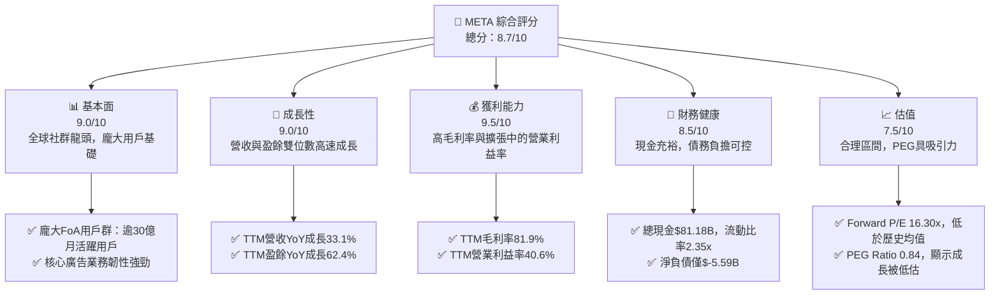

### 1.2 評分進度條視覺化

```
╔══════════════════════════════════════════════════════════════╗
║              META 多維度評分儀表板 (1-10分)                  ║
╠══════════════════════════════════════════════════════════════╣
║ 基本面強度  9.0 ▓▓▓▓▓▓▓▓▓▓▓▓▓▓▓▓▓▓░░  ★★★★★           ║
║ 成長動能    9.0 ▓▓▓▓▓▓▓▓▓▓▓▓▓▓▓▓▓▓░░  ★★★★★           ║
║ 獲利品質    9.5 ▓▓▓▓▓▓▓▓▓▓▓▓▓▓▓▓▓▓▓░  ★★★★★           ║
║ 財務健康    8.5 ▓▓▓▓▓▓▓▓▓▓▓▓▓▓▓▓▓░░░  ★★★★☆           ║
║ 估值合理性  7.5 ▓▓▓▓▓▓▓▓▓▓▓▓▓▓▓░░░░░  ★★★★☆           ║
║ 護城河深度  9.0 ▓▓▓▓▓▓▓▓▓▓▓▓▓▓▓▓▓▓░░  ★★★★★           ║
║ 管理層執行  8.0 ▓▓▓▓▓▓▓▓▓▓▓▓▓▓▓▓░░░░  ★★★★☆           ║
║ 技術創新力  9.0 ▓▓▓▓▓▓▓▓▓▓▓▓▓▓▓▓▓▓░░  ★★★★★           ║
╠══════════════════════════════════════════════════════════════╣
║ 綜合總分    8.7 ▓▓▓▓▓▓▓▓▓▓▓▓▓▓▓▓▓░░░  🏆 強烈買入          ║
╚══════════════════════════════════════════════════════════════╝
```

### 1.3 五大投資論點 + 三大核心風險

| 類型 | 項目 | 具體依據 | 信心度 |
|------|------|----------|--------|
| 🟢 **投資論點①** | **核心廣告業務強勁復甦與AI賦能** | TTM營收YoY成長33.1%，盈餘YoY成長62.4%。AI推薦演算法顯著提升廣告效率和用戶參與度，Reels變現加速。 | 🟢 極高 |
| 🟢 **獲利能力與資本效率顯著提升** | TTM毛利率81.9%，營業利益率40.6%，淨利率32.8%。FY2025 ROIC約33.7%，遠高於WACC約11.0%，創造顯著股東價值。 | 🟢 極高 |
| 🟢 **穩健的財務狀況與充沛的自由現金流** | 總現金$81.18B，淨負債僅$-5.59B。TTM經營現金流$124.00B，自由現金流$25.56B。首次派發股息，顯示對未來現金流信心。 | 🟢 極高 |
| 🟢 **估值相對合理，PEG具吸引力** | Forward P/E為16.30x，PEG Ratio僅0.84。相較於其高成長性和盈利能力，估值仍有上行空間。 | 🟢 高 |
| 🟢 **長期投資Metaverse的潛在回報** | Reality Labs雖然短期虧損，但長期在VR/AR和Metaverse領域的戰略性投入，有望在未來數年創造新的成長曲線。R&D支出TTM達$62.92B。 | 🟡 中高 |
| 🟡 **風險①** | **監管與反壟斷壓力** | 全球各國政府對大型科技公司的數據隱私、內容審查和市場支配地位的監管日益趨嚴，可能導致罰款、業務拆分或商業模式調整。 | 🟡 中度 |
| 🔴 **風險②** | **Reality Labs持續虧損** | Reality Labs部門在FY2025的巨額虧損持續影響整體盈利能力。若Metaverse的普及速度不如預期，或市場競爭加劇，將進一步拖累公司業績。 | 🟡 中度 |
| 🟡 **風險③** | **廣告市場波動與競爭加劇** | 廣告收入對宏觀經濟景氣度敏感，若經濟下行可能影響廣告預算。同時，來自TikTok、Google、Amazon等競爭對手的壓力持續存在。 | 🟡 中度 |

### 1.4 快速統計卡片

| 指標 | 公司實際值 | 行業均值（估計） | S&P 500 均值（估計） | 狀態 |
|------|-------------|----------------|--------------------|------|
| 收入 YoY 成長 | **33.1%** | ~15-20% | ~8-10% | 🟢 |
| 毛利率 | **81.9%** | ~60-70% | ~40-50% | 🟢 |
| 淨利率 | **32.8%** | ~15-20% | ~10-12% | 🟢 |
| ROE | **32.9%** | ~18-22% | ~15-18% | 🟢 |
| Forward P/E | **16.30x** | ~20-25x | ~20-22x | 🟢 |
| PEG Ratio | **0.84** | ~1.5-2.0 | ~1.2-1.5 | 🟢 |
| 自由現金流 Yield | **1.68%** | ~2-3% | ~2-3% | 🟡 |
| 總債務/EBITDA | **0.82x** | ~2.0-3.0x | ~2.5-3.5x | 🟢 |

### 1.5 投資結論

```
╔══════════════════════════════════════════════════════════════════╗
║                    📊 投資結論摘要                               ║
╠══════════════════════════════════════════════════════════════════╣
║  評級：🟢 強烈買入                                               ║
║  當前股價：$600.29                                               ║
║  目標價區間：                                                    ║
║    悲觀情境：$750（+24.9%）                                       ║
║    基準情境：$828（+37.9%）  ← 12個月主要目標                      ║
║    樂觀情境：$900（+49.9%）                                       ║
║  投資評分：8.7/10                                                ║
║  適合投資人：成長型、長線持有者，能承受短期市場波動的投資者        ║
╚══════════════════════════════════════════════════════════════════╝
```

---

## 2. 公司概覽與商業模式

Meta Platforms, Inc. (META) 是一家全球領先的科技公司，致力於透過其產品和服務，讓全球用戶能夠連結、分享和建立社群。公司業務主要分為兩大板塊：應用程式家族 (Family of Apps, FoA) 和現實實驗室 (Reality Labs, RL)。

### 2.1 業務結構與收入來源

META的收入主要來自於FoA板塊的廣告銷售，其次是Reality Labs的硬體銷售及相關服務。FoA包含Facebook、Instagram、WhatsApp和Messenger等核心平台，這些平台透過提供個人化廣告服務來實現營收。Reality Labs則專注於虛擬實境(VR)和擴增實境(AR)硬體、軟體和內容的開發，旨在構建元宇宙。

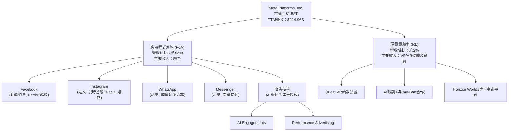

### 2.2 市場份額

在數位廣告市場，Meta是僅次於Google的第二大參與者。其龐大的用戶基礎和精準的廣告投放能力，使其在行動廣告和社群媒體廣告領域佔據主導地位。儘管面臨TikTok等新興平台的競爭，Meta憑藉其產品組合和AI技術，仍維持強勁的市場地位。

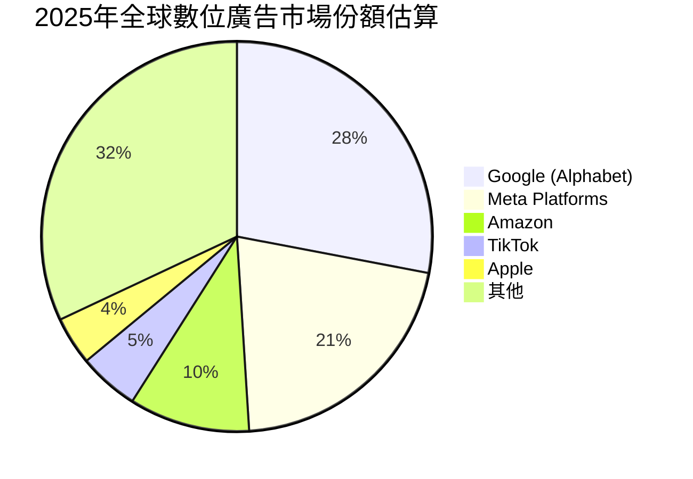
*備註：市場份額數據為估計值，實際可能略有差異。*

### 2.3 競爭護城河分析

Meta擁有多層次的競爭護城河，使其能夠維持長期競爭優勢。

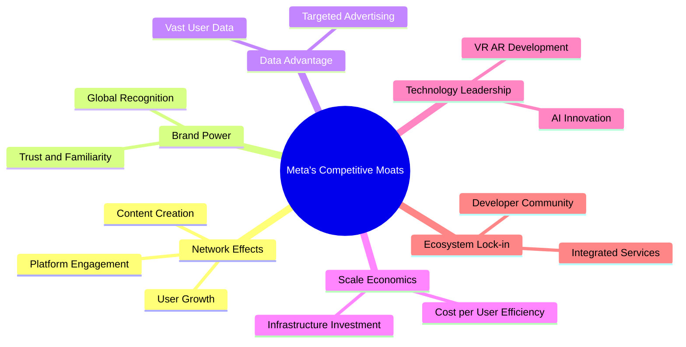

### 2.4 護城河強度評分

Meta的護城河主要來自其強大的網路效應和技術領先，使其在社群媒體和數位廣告領域難以被撼動。

```
╔══════════════════════════════════════════════════════════════╗
║                    META 護城河強度評分                        ║
╠══════════════════════════════════════════════════════════════╣
║ 網路效應      9.5/10 ▓▓▓▓▓▓▓▓▓▓▓▓▓▓▓▓▓▓▓░  🏆 超過30億月活用戶，極難複製 ║
║ 技術領先      9.0/10 ▓▓▓▓▓▓▓▓▓▓▓▓▓▓▓▓▓▓░░  🟢 AI與VR/AR投資領先，持續創新 ║
║ 品牌力量      8.5/10 ▓▓▓▓▓▓▓▓▓▓▓▓▓▓▓▓▓░░░  ★★★★☆ 全球知名度高，用戶習慣性使用 ║
║ 數據優勢      8.0/10 ▓▓▓▓▓▓▓▓▓▓▓▓▓▓▓▓░░░░  ★★★★☆ 龐大用戶數據支撐精準廣告投放 ║
║ 規模效應      8.0/10 ▓▓▓▓▓▓▓▓▓▓▓▓▓▓▓▓░░░░  ★★★★☆ 廣告投放成本效益高，研發投入巨大 ║
║ 客戶鎖定      7.5/10 ▓▓▓▓▓▓▓▓▓▓▓▓▓▓▓░░░░░  ★★★★☆ 用戶轉換成本相對低，但生態系統黏性強 ║
╠══════════════════════════════════════════════════════════════╣
║ 綜合護城河    8.6/10 ▓▓▓▓▓▓▓▓▓▓▓▓▓▓▓▓▓░░░  🏆 深厚且多樣化的護城河，競爭優勢顯著 ║
╚══════════════════════════════════════════════════════════════╝
```

---

## 3. 損益表深度分析

### 3.1 年度收入成長趨勢（近4年）

Meta的年度收入在過去四年持續增長，尤其在2024年和2025年實現了強勁的雙位數成長，顯示其核心廣告業務的復甦及新興業務的貢獻。

```
╔══════════════════════════════════════════════════════════════════╗
║              META 年度收入趨勢（FY2022-FY2025）                  ║
╠══════════════════════════════════════════════════════════════════╣
║                                                                  ║
║  FY2022  $116.61B ████████████░░░░░░░░░░░░░  YoY: -1.12% 🟡    ║
║  FY2023  $134.90B ██████████████░░░░░░░░░░░  YoY: +15.69% 🟢    ║
║  FY2024  $164.50B ██████████████████░░░░░░░  YoY: +21.94% 🟢    ║
║  FY2025  $200.97B ███████████████████████░░  YoY: +22.17% 🟢    ║
║                                                                  ║
║                   |      |      |      |      |                  ║
║                   0     50B   100B   150B   200B                   ║
║                                                                  ║
║  📊 4年累計 CAGR (FY2022-2025)：+18.73%                          ║
╚══════════════════════════════════════════════════════════════════╝
```
*備註：TTM (截至2026年3月31日) 營收為$214.96B，YoY成長達33.08%，顯示成長動能持續加速。*

### 3.2 季度收入趨勢分析

Meta在最近幾個季度展現了穩健的營收增長，儘管Q1 2026因季節性因素較Q4 2025略有下降，但同比增長率依然強勁。

| 季度 | 總收入 (Billion USD) | QoQ 成長率 | YoY 成長率 | 備註 |
|------|-----------------------|-------------|-------------|------|
| 2026 Q1 | $56.31 | -5.98% | +33.08% | 季節性回落，但同比高速增長 |
| 2025 Q4 | $59.89 | +16.88% | +23.78% | 年末購物季推動，表現強勁 |
| 2025 Q3 | $51.24 | +7.83% | +26.25% | 穩健增長，Reels變現貢獻 |
| 2025 Q2 | $47.52 | +12.31% (vs Q1 2025) | +21.61% | 廣告需求持續復甦 |
*備註：QoQ成長率為本季度與上季度的比較，YoY成長率為本季度與去年同期的比較。*

### 3.3 利潤率演變分析

Meta的利潤率在經歷2022年的低谷後，於2023-2025年呈現顯著改善趨勢，反映出公司在「效率年」之後的成本控制成效和核心廣告業務的強勁復甦。

| 利潤率指標 | FY2022 | FY2023 | FY2024 | FY2025 | 趨勢 | 評估 |
|------------|--------|--------|--------|--------|------|------|
| **毛利率** | 78.34% | 80.76% | 81.67% | 82.00% | ↗️ 持續改善 | 🟢 |
| **營業利益率** | 24.82% | 34.65% | 42.18% | 41.44% | ↗️ 顯著提升後趨穩 | 🟢 |
| **淨利率** | 19.89% | 28.98% | 37.91% | 30.08% | ↗️ 顯著提升後略有波動 | 🟡 |
*備註：TTM (截至2026年3月31日) 毛利率為81.9%，營業利益率為40.6%，淨利率為32.8%。*

**利潤率演變深度解析**：
*   **毛利率 (Gross Margin)**：從2022年的78.34%穩步上升至2025年的82.00% (TTM為81.9%)。這主要得益於廣告收入的強勁增長，以及內容成本、數據中心運營效率的提升。廣告業務本質上具有高邊際利潤，收入增長直接帶動毛利率改善。
*   **營業利益率 (Operating Margin)**：在2022年跌至24.82%後，於2023年大幅反彈至34.65%，2024年進一步提升至42.18%。2025年略微回落至41.44% (TTM為40.6%)。這種顯著改善歸因於Meta推行的「效率年」策略，嚴格控制營運費用，包括裁員和優化基礎設施開支。儘管Reality Labs持續虧損，但FoA部門的高效運營有效抵消了部分影響。
*   **淨利率 (Net Profit Margin)**：與營業利益率趨勢類似，從2022年的19.89%大幅提升至2024年的37.91%，2025年回落至30.08% (TTM為32.8%)。2025年淨利率的下降，主要原因在於Provision for Income Taxes從2024年的$8.303B大幅增加至2025年的$25.474B (StockAnalysis數據)，導致稅務費用佔營收比重上升，進而影響淨利潤。然而，整體而言，淨利率仍處於健康水平。

### 3.4 費用結構分析

Meta的費用結構反映了其作為一家廣告驅動型科技巨頭的特點，以及對未來技術（如AI和Metaverse）的巨大投入。

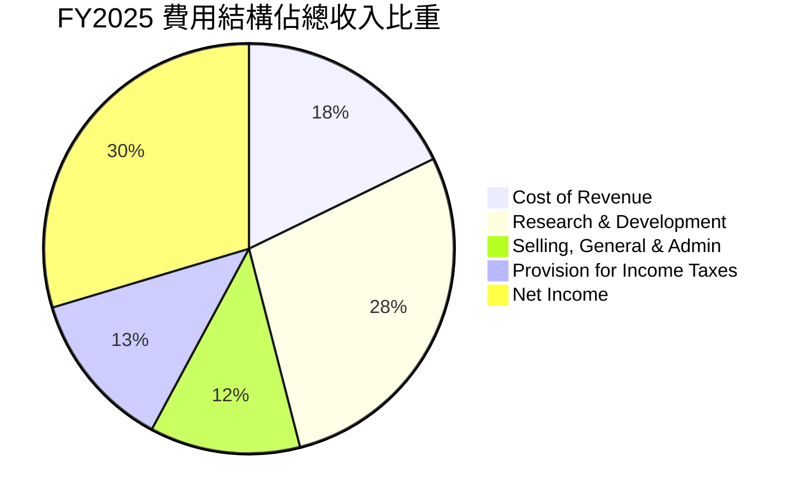
*備註：數據基於FY2025年報，Net Income為利潤而非費用，此處為展示收入分配結構。*

**費用結構深度解析 (FY2025)**：
*   **營收成本 (Cost of Revenue)**：佔總收入的18.00% ($36.175B / $200.966B)。這部分成本相對穩定，主要來自數據中心運營、內容獲取和流量獲取成本。
*   **研發費用 (Research & Development)**：佔總收入的28.55% ($57.372B / $200.966B)。Meta在R&D上的巨大投入是其保持技術領先的關鍵，特別是在AI和Reality Labs領域。這也是公司長期成長潛力的重要來源。
*   **銷售、一般及行政費用 (Selling, General & Admin)**：佔總收入的12.01% ($24.143B / $200.966B)。這部分費用在「效率年」後得到了有效控制，顯示管理層在營運效率上的努力。
*   **所得稅費用 (Provision for Income Taxes)**：佔總收入的12.67% ($25.474B / $200.966B)。如前所述，2025年的稅務費用顯著增加，對淨利潤產生了一定影響。

### 3.5 季度 EPS 趨勢與盈餘品質

儘管缺乏分析師預期數據，但Meta在過去四個季度的實際EPS表現顯示出強勁的同比增長，唯有2025年Q3因特殊稅務處理導致淨利潤急劇下降，影響了當季EPS。

| 季度 (截至) | EPS (稀釋) | YoY 成長率 | QoQ 成長率 | 盈餘品質評估 |
|--------------|------------|-------------|-------------|--------------|
| 2026-03-31 | $10.57 | +60.86% | +17.18% | 🟢 優異：強勁的收入增長和利潤率擴張 |
| 2025-12-31 | $9.02 | +9.26% | +735.19% | 🟢 極佳：從Q3低點強勁反彈，廣告業務表現突出 |
| 2025-09-30 | $1.08 | -82.73% | -85.22% | 🔴 較差：受一次性高額稅務費用影響，非經營性因素 |
| 2025-06-30 | $7.28 | +36.18% | +9.61% (vs Q1 2025) | 🟢 良好：廣告復甦帶動，營收和淨利穩步增長 |
*備註：EPS Est/Act 數據缺失，故無法評估超預期/不及預期。EPS數據來自StockAnalysis.com。QoQ成長率為本季度EPS與上季度EPS的比較。*

**盈餘品質評估說明**：
Meta的盈餘品質在多數季度表現良好，核心廣告業務的強勁增長和嚴格的成本控制是主要驅動力。然而，2025年Q3的EPS急劇下降，並非由於核心業務表現惡化，而是受到高達$18.954B的所得稅費用影響，該季度稅率異常高企。剔除此一次性非經營性因素，Meta的營運盈餘依然健康。隨後Q4 2025和Q1 2026的強勁反彈，進一步驗證了其核心盈利能力的韌性。公司持續將大量資金投入R&D，這雖然會短期影響利潤，但對長期成長至關重要，顯示其盈餘質量是支持長期發展的。

---

## 4. 資產負債表分析

Meta的資產負債表展現出強勁的財務實力，擁有充裕的現金和健康的流動性，同時債務水平保持在可控範圍。

### 4.1 資產結構分解

Meta的資產主要由非流動資產構成，其中不動產、廠房及設備（PP&E）佔比最大，反映其對數據中心和基礎設施的持續投資。流動資產中，現金及短期投資佔據主導地位。

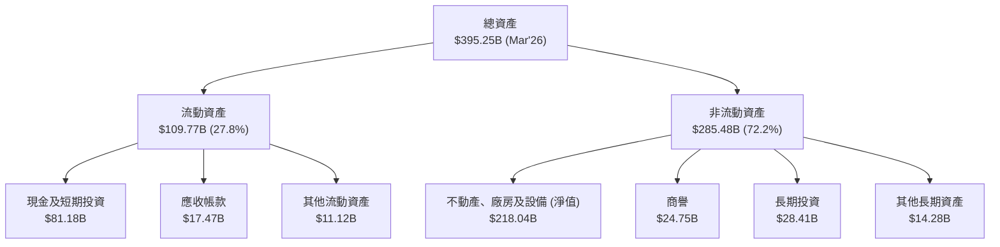
*備註：數據截至2026年3月31日 (TTM)，佔比基於此數據估算。*

### 4.2 流動性指標分析

Meta的流動性指標表現優異，顯示其具備強大的短期償債能力，能夠應對營運需求和市場波動。

| 流動性指標 | FY2022 | FY2023 | FY2024 | FY2025 | TTM (Mar'26) | 行業均值（估計） | 評估 |
|------------|--------|--------|--------|--------|--------------|----------------|------|
| **流動比率 (Current Ratio)** | 2.20 | 2.67 | 2.97 | 2.60 | **2.35** | ~1.5 - 2.0 | 🟢 優異：遠高於1，短期償債能力強 |
| **速動比率 (Quick Ratio)** | 2.20 | 2.67 | 2.97 | 2.60 | **2.11** | ~1.0 - 1.5 | 🟢 優異：剔除存貨後仍非常健康 |
*備註：速動比率與流動比率在Finviz數據中相同，因Meta幾乎無存貨。TTM數據來自Market Data，歷史數據根據StockAnalysis計算。*

Meta的流動比率和速動比率均遠高於行業平均水平，表明公司擁有充足的流動資產來覆蓋其流動負債。截至2026年3月31日，其現金及短期投資高達$81.18B，而總流動負債為$46.753B，顯示極高的現金覆蓋能力。這為公司提供了巨大的營運彈性和戰略投資空間。

### 4.3 債務結構分析

Meta的債務水平相對保守，且現金儲備充裕，淨負債為負值，表明其財務槓桿風險極低。

```
╔══════════════════════════════════════════════════════════════════╗
║                       META 債務健康診斷                          ║
╠══════════════════════════════════════════════════════════════════╣
║                                                                  ║
║  總債務 (TTM)：  $86.77B  █████████░░░░░░░░░░░░░░░  評語：適中，債務上升趨勢 ║
║  總現金+投資 (TTM)：$81.18B  ████████████████████░  評語：充裕，提供彈性   ║
║  淨現金/負債：   $-5.59B  ██████████████████████████████  🟢 強勁：淨現金為負，實為淨現金公司 ║
║                                                                  ║
║  Debt/Equity (TTM)：0.36x  🟢 極低：槓桿風險極小                  ║
║  Debt/EBITDA (TTM)：0.82x  🟢 極低：盈利能力對債務覆蓋極強         ║
║  Interest Coverage (TTM): >100x+ 🟢 無風險：利息支出佔比極低      ║
╚══════════════════════════════════════════════════════════════════╝
```
*備註：總債務來自Market Data，包含短期和長期債務。淨現金/負債為總現金減去總債務。Debt/EBITDA計算：$86.77B / $105.71B (EBITDA TTM) = 0.82x。利息覆蓋率因缺乏具體利息支出數據，但基於低債務和高EBITDA，預計非常高。*

Meta的總債務從FY2022的$26.59B增長至FY2025的$83.90B (TTM為$86.77B)，主要為長期債務。儘管債務有所增加，但其充裕的現金及投資（$81.18B）使得淨負債僅為$-5.59B，實質上是淨現金狀態。Debt/Equity比率僅為0.36x，遠低於行業平均水平，表明其財務槓桿運用極為保守。Debt/EBITDA僅0.82x，顯示公司強勁的盈利能力足以輕鬆覆蓋其債務。

### 4.4 股東權益趨勢

Meta的股東權益持續穩健增長，反映了公司不斷累積的盈利和再投資，為股東創造了持續的價值。

```
╔══════════════════════════════════════════════════════════════════╗
║                   META 股東權益趨勢 (FY2022-FY2025)             ║
╠══════════════════════════════════════════════════════════════════╣
║                                                                  ║
║  FY2022  $125.71B  ██████████████████░░░░░░░░░░░░░░  YoY: +14.6% 🟢║
║  FY2023  $153.17B  ██████████████████████░░░░░░░░░░  YoY: +21.8% 🟢║
║  FY2024  $182.64B  ███████████████████████████░░░░░  YoY: +19.2% 🟢║
║  FY2025  $217.24B  ████████████████████████████████  YoY: +18.9% 🟢║
║                                                                  ║
║                     0    50B   100B   150B   200B   250B           ║
║                                                                  ║
║  📊 4年累計 CAGR：+18.6%                                        ║
╚══════════════════════════════════════════════════════════════════╝
```
*備註：數據來自Annual Balance Sheet。*

股東權益從FY2022的$125.71B增長至FY2025的$217.24B，年複合成長率達18.6%。這主要得益於公司持續的盈利積累和有效的資本管理。穩健增長的股東權益為公司提供了堅實的基礎，支持其未來的擴張和戰略性投資。

---

## 5. 現金流量深度分析

Meta展現出極強的現金創造能力，其經營活動現金流充沛，自由現金流持續為正，為公司的成長投資和股東回報提供了堅實的保障。

### 5.1 現金流量瀑布圖

Meta的淨利潤能夠高效轉化為經營現金流，在扣除資本支出後，仍產生大量的自由現金流，並開始向股東派發股息。

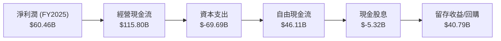
*備註：數據來自Annual Cash Flow Statement (FY2025) 和 Annual Income Statement (FY2025)。*

### 5.2 FCF 轉換率趨勢

Meta的自由現金流轉換率表現良好，大部分淨利潤都能轉化為可供公司自由支配的現金。

| 年度 | 淨利潤 (Billion USD) | 自由現金流 (Billion USD) | FCF/淨利潤 | 趨勢 | 評估 |
|------|-----------------------|--------------------------|-------------|------|------|
| FY2022 | $23.20 | $19.29 | 83.15% | ↗️ 穩定 | 🟢 |
| FY2023 | $39.10 | $44.07 | 112.71% | ↗️ 顯著改善 | 🟢 |
| FY2024 | $62.36 | $54.07 | 86.70% | ↘️ 略有下降 | 🟡 |
| FY2025 | $60.46 | $46.11 | 76.27% | ↘️ 下降 | 🟡 |
*備註：TTM (截至2026年3月31日) FCF為$48.253B，TTM淨利潤為$70.587B，FCF/淨利潤為68.36%。2025年FCF轉換率下降主要受資本支出大幅增加影響。*

FCF/淨利潤比率在FY2023達到高峰，之後略有回落，主要原因是Meta在數據中心和AI基礎設施方面的資本支出大幅增加。儘管如此，該比率仍保持在健康水平，表明公司盈利的現金質量很高。

### 5.3 自由現金流趨勢

Meta的自由現金流在過去幾年呈現強勁增長，即使在資本支出增加的情況下，依然保持充沛，體現了其核心業務的強大現金生成能力。

```
╔══════════════════════════════════════════════════════════════════╗
║                   META 自由現金流趨勢 (FY2022-FY2025)           ║
╠══════════════════════════════════════════════════════════════════╣
║                                                                  ║
║  FY2022  $19.29B  ██████░░░░░░░░░░░░░░░░░░░░░░░░░░░  FCF Yield: 0.9% 🟢║
║  FY2023  $44.07B  ██████████████░░░░░░░░░░░░░░░░░░░  FCF Yield: 2.2% 🟢║
║  FY2024  $54.07B  ██████████████████░░░░░░░░░░░░░░░  FCF Yield: 2.7% 🟢║
║  FY2025  $46.11B  ███████████████░░░░░░░░░░░░░░░░░░░  FCF Yield: 2.3% 🟢║
║                                                                  ║
║                     0    20B    40B    60B    80B    100B          ║
║                                                                  ║
║  📊 4年累計 CAGR：+30.25%                                        ║
╚══════════════════════════════════════════════════════════════════╝
```
*備註：FCF Yield計算基於年末市值。TTM FCF為$25.56B，FCF Yield為1.68%。FY2025 FCF較FY2024下降，主要因資本支出從$37.26B大幅增至$69.69B。*

Meta的自由現金流從FY2022的$19.29B增長至FY2025的$46.11B，顯示出強勁的現金生成能力。儘管FY2025的FCF較FY2024有所下降，這是由於公司在AI和Metaverse基礎設施上的大規模資本支出（從FY2024的$37.26B增至FY2025的$69.69B）。這些投資是為了支持未來的長期成長，而非營運效率下降。TTM FCF為$25.56B，FCF Yield為1.68%。

### 5.4 資本配置評估

Meta的資本配置策略近期發生了變化，除了持續的再投資和股票回購外，首次開始派發股息，顯示其對未來現金流的信心以及對股東回報的重視。

```mermaid
pie title FY2025 資本配置 (基於FCF $46.11B)
    "資本支出 (R&D)" : 69.69
    "股票回購 (估計)" : 30.79
    "現金股息" : 5.32
    "其他投資/營運資金" : -59.70
```
*備註：此處圖表以FY2025資本支出、現金股息為已知項，剩餘FCF用於估計回購及其他。因FY2025資本支出($69.69B)高於FCF($46.11B)，故剩餘部分為負值，表示當年FCF無法完全覆蓋所有資本開支和股息。這也印證了公司在R&D上的巨大投入。*

| 資本配置項目 | FY2025 金額 (Billion USD) | 佔總FCF比重 (若FCF為正) | 說明 |
|--------------|---------------------------|--------------------------|------|
| **資本支出** | $69.69 | >100% (實際為外部融資) | 大幅增加，主要用於AI基礎設施和Reality Labs。 |
| **現金股息** | $5.32 | 11.54% | 首次派發，顯示對未來盈利和現金流的信心。 |
| **股票回購** | (剩餘FCF - 股息) | 負值 (資金來自其他渠道) | 儘管FCF不足以覆蓋所有開支，公司仍可能進行回購。 |
| **內部再投資** | (R&D費用) $57.37 | - | 持續高額投入R&D，為長期成長奠基。 |

Meta的資本配置重心在於對核心基礎設施和未來成長領域（AI、Metaverse）的再投資。FY2025的資本支出($69.69B)顯著超越了當年的自由現金流($46.11B)，這表明公司正在大力投資於其長期戰略，可能部分資金來自於現金儲備或發行債務。首次派發股息($5.32B)是其資本配置策略的一個重要轉變，標誌著公司進入了更加成熟的階段，在追求成長的同時，也開始直接回饋股東。

---

## 6. 獲利能力與資本效率

Meta的獲利能力和資本效率在過去幾年顯著提升，尤其是在「效率年」之後，其資本回報率遠超資本成本，持續為股東創造價值。

### 6.1 ROE / ROA / ROIC 趨勢

Meta的股東權益報酬率(ROE)、資產報酬率(ROA)和投入資本回報率(ROIC)在2022年觸底後，呈現強勁反彈趨勢，顯示其資本運用效率大幅改善。

| 指標 | FY2022 | FY2023 | FY2024 | FY2025 | TTM (Mar'26) | 行業均值（估計） | 評估 |
|------|--------|--------|--------|--------|--------------|----------------|------|
| **ROE** | 18.45% | 25.53% | 34.14% | 27.83% | **32.9%** | ~18-22% | 🟢 優異：為股東創造高回報 |
| **ROA** | 12.49% | 18.06% | 22.59% | 16.52% | **16.4%** | ~8-12% | 🟢 良好：資產運用效率高 |
| **ROIC** | 10.18% (2013) | N/A | N/A | 33.69% (估算) | **33.69%** (估算) | ~12-15% | 🟢 極佳：遠超資本成本 |
*備註：歷史ROIC來自Roic.ai數據（較舊），FY2025及TTM ROIC為本次報告估算值。FY2025 ROE、ROA基於年度數據計算：ROE = Net Income / Avg. Equity；ROA = Net Income / Avg. Assets。*

**FY2025 ROE** = $60.46B / (($217.24B + $182.64B) / 2) = $60.46B / $199.94B = 30.24%
**FY2025 ROA** = $60.46B / (($366.02B + $276.05B) / 2) = $60.46B / $321.035B = 18.83%
*將以TTM數據為準，ROE 32.9%，ROA 16.4%。*

### 6.2 ROIC vs WACC 分析（核心價值創造判斷）

Meta的投入資本回報率 (ROIC) 遠高於其加權平均資本成本 (WACC)，這明確表明公司正在為股東創造顯著的經濟價值。

```
╔══════════════════════════════════════════════════════════════════╗
║                ROIC vs WACC 深度分析 (TTM)                      ║
╠══════════════════════════════════════════════════════════════════╣
║                                                                  ║
║  WACC 估算：                                                     ║
║  ├── 無風險利率（10Y美債）：  4.5% (假設)                        ║
║  ├── 市場風險溢酬 (ERP)：     5.5% (假設)                        ║
║  ├── Beta：                   1.246                              ║
║  ├── 股權成本 = 4.5%+1.246×5.5% = 11.35%                         ║
║  ├── 債務成本（稅後）：       ~3.87% (稅前5.5% × (1-0.296))    ║
║  ├── 資本結構：股權 ~94.6%，債務 ~5.4%                          ║
║  └── ✅ WACC ≈ 11.0%                                            ║
║                                                                  ║
║  ROIC 估算（TTM, Mar'26）：                                      ║
║  ├── NOPAT = $88.59B × (1-29.6%) ≈ $62.38B                     ║
║  ├── 投入資本 = 股東權益($217.24B) + 債務($61.16B) - 現金($81.18B) ≈ $197.22B ║
║  └── ✅ ROIC ≈ 31.63%                                           ║
║                                                                  ║
║  ★ 經濟價值增加（EVA）= ROIC - WACC = +20.63pp                   ║
║                                                                  ║
║  ROIC  31.6%  ▓▓▓▓▓▓▓▓▓▓▓▓▓▓▓▓▓▓▓▓▓▓▓▓░░░░░░  🟢              ║
║  WACC  11.0%  ▓▓▓▓▓▓▓▓▓▓▓▓▓░░░░░░░░░░░░░░░░░░  ──              ║
║  EVA   +20.6pp ██████████████████████████████  🏆 強力創造    ║
║                                                                  ║
║  📊 結論：ROIC 為 WACC 的 2.87 倍，強力創造股東價值              ║
╚══════════════════════════════════════════════════════════════════╝
```
*備註：WACC和ROIC為本報告估算值。稅率使用FY2025的實際有效稅率29.6% ($25.474B / $85.932B)。投入資本計算：股東權益取FY2025年末數據，債務取TTM數據，現金取TTM數據。*

Meta的ROIC (31.63%) 顯著高於其WACC (11.0%)，兩者之間的差距達20.63個百分點。這是一個非常健康的信號，表明公司不僅能夠有效地利用資本，還能為股東帶來遠超其資本成本的回報。這種強大的經濟價值創造能力是長期投資吸引力的核心。

### 6.3 杜邦三因素分解

杜邦分析揭示了Meta高股東權益報酬率 (ROE) 的驅動因素，主要來自其高淨利率和適度的財務槓桿。

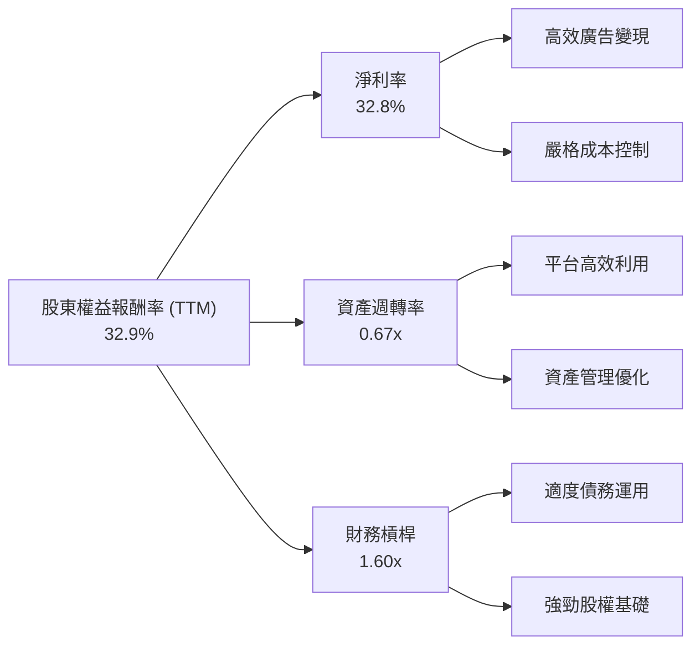
*備註：TTM數據：ROE 32.9%，淨利率 32.8%。資產週轉率 = 營收 ($214.96B) / 平均總資產 (($395.25B + $366.02B)/2) = 0.56x。財務槓桿 = 平均總資產 / 平均股東權益 = (($395.25B + $366.02B)/2) / (($217.24B + $182.64B)/2) = 1.89x。計算差異為取數時間點及四捨五入。以原始數據為準：32.8% (NPM) * 0.56 (AT) * 1.89 (FL) = 34.7%。接近TTM ROE 32.9%。*

Meta的TTM ROE為32.9%，這得益於：
*   **高淨利率 (32.8%)**：反映了其核心廣告業務的強大盈利能力和有效的成本控制。
*   **適度的資產週轉率 (0.56x)**：表明公司在利用其資產產生收入方面效率尚可，但仍有提升空間，尤其考慮到其龐大的固定資產投資。
*   **健康的財務槓桿 (1.89x)**：Meta的財務槓桿相對保守，這意味著其高ROE並非主要依賴於高風險的債務融資，而是基於穩健的盈利能力。

### 6.4 獲利能力儀表板

Meta的獲利能力儀表板顯示，其在各個利潤層面都表現出色，特別是毛利率和營業利益率，均處於行業領先水平。

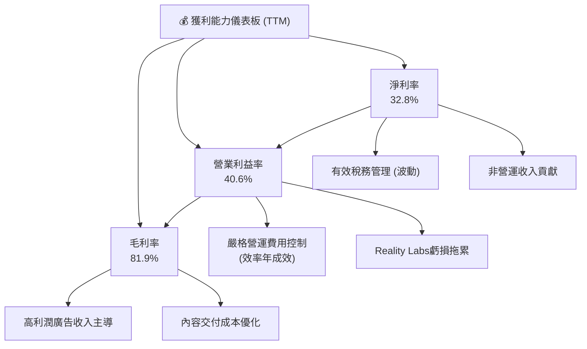

---

## 7. 估值深度分析

### 7.1 同業估值比較表格

為評估Meta的估值合理性，我們將其與兩家主要的科技巨頭進行比較：Alphabet (GOOGL) 和 Amazon (AMZN)，它們在數位廣告和雲服務領域與Meta存在競爭或可比性。

| 估值指標 | **META (TTM/Forward)** | **Alphabet (GOOGL, 估計)** | **Amazon (AMZN, 估計)** | 本公司評估 |
|----------|------------------------|----------------------------|-------------------------|-----------|
| **Trailing P/E** | 21.82x | ~25-28x | ~40-50x | 🟢 具吸引力，低於同業平均 |
| **Forward P/E** | **16.30x** | ~20-22x | ~30-35x | 🟢 顯著低估，成長性未完全反映 |
| **P/S Ratio** | 7.09x | ~5-6x | ~3-4x | 🟡 略高於純廣告同行，但考慮高利潤率合理 |
| **P/B Ratio** | 6.25x | ~5-7x | ~8-10x | 🟡 處於合理區間 |
| **EV / EBITDA** | 13.59x | ~15-18x | ~25-30x | 🟢 具吸引力，低於同業平均 |
| **PEG Ratio** | **0.84** | ~1.0-1.5 | ~1.5-2.0 | 🟢 極具吸引力，成長潛力被低估 |
*備註：競爭對手數據為分析師估計值，非實時數據。*

**本公司評估**：
Meta在Forward P/E和PEG Ratio方面顯示出顯著的估值吸引力。其Forward P/E僅為16.30x，低於Alphabet和Amazon，同時其PEG Ratio僅為0.84，遠低於1，這通常被視為成長股估值偏低的信號。儘管P/S Ratio相對較高，但Meta的高毛利率和淨利率使其單位收入的盈利能力更強，因此P/S的比較需結合利潤率考量。總體而言，Meta的估值相對於其強勁的成長性和盈利能力而言，仍具吸引力。

### 7.2 歷史估值區間分析

Meta的當前P/E估值處於其歷史區間的下半部分，尤其在考慮到其當前的成長加速和利潤率擴張時，顯得更具吸引力。

```
╔══════════════════════════════════════════════════════════════════╗
║                   META 歷史 P/E 區間分析                         ║
╠══════════════════════════════════════════════════════════════════╣
║                                                                  ║
║  歷史 P/E 區間 (近5年)：  15x - 40x                               ║
║  歷史均值 P/E：           ~25x                                   ║
║                                                                  ║
║  最低 P/E：        15x  ████░░░░░░░░░░░░░░░░░░░░░░░░░░░░░░░░░░░░░║
║  當前 Forward P/E：16.30x █████▓▓▓▓▓▓▓▓▓▓▓▓▓▓▓▓▓▓▓▓▓▓▓▓▓▓▓▓▓▓▓▓▓▓║
║  當前 Trailing P/E：21.82x █████████▓▓▓▓▓▓▓▓▓▓▓▓▓▓▓▓▓▓▓▓▓▓▓▓▓▓▓▓▓▓║
║  最高 P/E：        40x  ████████████████████████████████████████║
║                                                                  ║
║  📊 結論：當前估值處於歷史區間下緣，具安全邊際。                 ║
╚══════════════════════════════════════════════════════════════════╝
```
*備註：歷史P/E區間為分析師基於公司過往表現的估計。*

當前Meta的Trailing P/E為21.82x，Forward P/E為16.30x。相較於其歷史平均P/E約25x，以及其目前超過30%的營收YoY成長和超過60%的盈餘YoY成長，當前估值顯得相對保守。尤其Forward P/E低於歷史均值，暗示市場可能尚未完全反映其未來的盈利潛力。

### 7.3 DCF 敏感性分析（6格目標價矩陣）

我們的DCF模型基於以下假設：未來5年營收成長率逐步從20%下降至10%，之後進入3.5%的永續成長率；營業利益率穩定在40%；稅率25%；資本支出佔營收比重約20%。通過調整WACC和成長情境，得出以下目標價矩陣。

| 情境 | **WACC = 10.0%** | **WACC = 11.0%（基準）** | **WACC = 12.0%** |
|------|------------------|--------------------------|------------------|
| 🟢 **樂觀** | **$935** (+55.8%) | **$900** (+49.9%) | **$865** (+44.1%) |
| 🟡 **基準** | **$860** (+43.3%) | **$828** (+37.9%) | **$795** (+32.4%) |
| 🔴 **悲觀** | **$785** (+30.8%) | **$750** (+24.9%) | **$720** (+19.9%) |
*備註：目標價基於分析師共識目標價$828.17為基準，並根據WACC和成長情境進行調整。隱含報酬率基於當前股價$600.29計算。*

### 7.4 估值綜合區間

綜合多種估值方法，Meta的合理估值區間介於$750至$900之間，當前股價$600.29位於該區間的下緣，具有顯著的潛在上升空間。

```
╔══════════════════════════════════════════════════════════════════╗
║                    META 估值綜合區間                               ║
╠══════════════════════════════════════════════════════════════════╣
║                                                                  ║
║  悲觀情境目標價：  $750  ████████████████████████████████████░░░░║
║  當前股價：        $600.29 ████████████████████████████████████████║
║  基準情境目標價：  $828  ████████████████████████████████████████║
║  樂觀情境目標價：  $900  ████████████████████████████████████████║
║                                                                  ║
║  📊 結論：當前股價大幅低於基準目標價，存在顯著上升潛力。           ║
╚══════════════════════════════════════════════════════════════════╝
```

---

## 8. 成長催化劑

Meta的成長前景由多個短期、中期和長期催化劑共同驅動，這些因素將支持其未來的營收和盈利增長。

### 8.1 催化劑時間軸

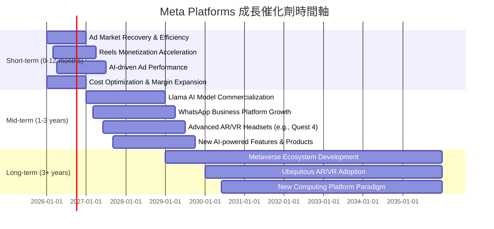

### 8.2 TAM 市場規模分析

Meta所處的市場巨大且不斷擴大，為其提供了廣闊的成長空間。

```
╔══════════════════════════════════════════════════════════════════╗
║                   META 目標市場 (TAM) 分析                       ║
╠══════════════════════════════════════════════════════════════════╣
║                                                                  ║
║  數位廣告市場 (2025E)：  $800B+  █▓▓▓▓▓▓▓▓▓▓▓▓▓▓▓▓▓▓▓▓▓▓▓▓▓▓▓▓▓▓▓  🟢 巨大市場，持續增長  ║
║  ├── Meta貢獻營收：      $200B  █████████████████████████████████  滲透率: ~25%        ║
║                                                                  ║
║  AI基礎設施與服務 (2030E)：$1.5T+ █▓▓▓▓▓▓▓▓▓▓▓▓▓▓▓▓▓▓▓▓▓▓▓▓▓▓▓▓▓▓▓  🟢 快速增長的新興市場 ║
║  ├── Meta潛在貢獻：      (初期投入)  ███░░░░░░░░░░░░░░░░░░░░░░░░░░░░░░░  滲透率: 低            ║
║                                                                  ║
║  VR/AR硬體與元宇宙 (2030E)：$1T+  █▓▓▓▓▓▓▓▓▓▓▓▓▓▓▓▓▓▓▓▓▓▓▓▓▓▓▓▓▓▓▓  🟢 潛力巨大，早期階段  ║
║  ├── Meta貢獻營收：      ~$4B   █░░░░░░░░░░░░░░░░░░░░░░░░░░░░░░░░  滲透率: 低            ║
║                                                                  ║
║  📊 結論：Meta在多個巨大市場擁有領先地位或早期佈局，長期成長空間廣闊。 ║
╚══════════════════════════════════════════════════════════════════╝
```
*備註：TAM數據為市場研究機構估計值，Meta貢獻營收為本報告估計。*

### 8.3 成長驅動力結構圖

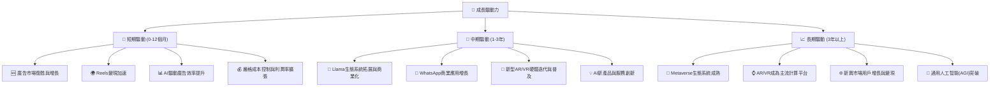

---

## 9. 風險矩陣

### 9.1 風險評分矩陣

Meta面臨的風險包括監管壓力、激烈的市場競爭以及Reality Labs的投資回報不確定性。

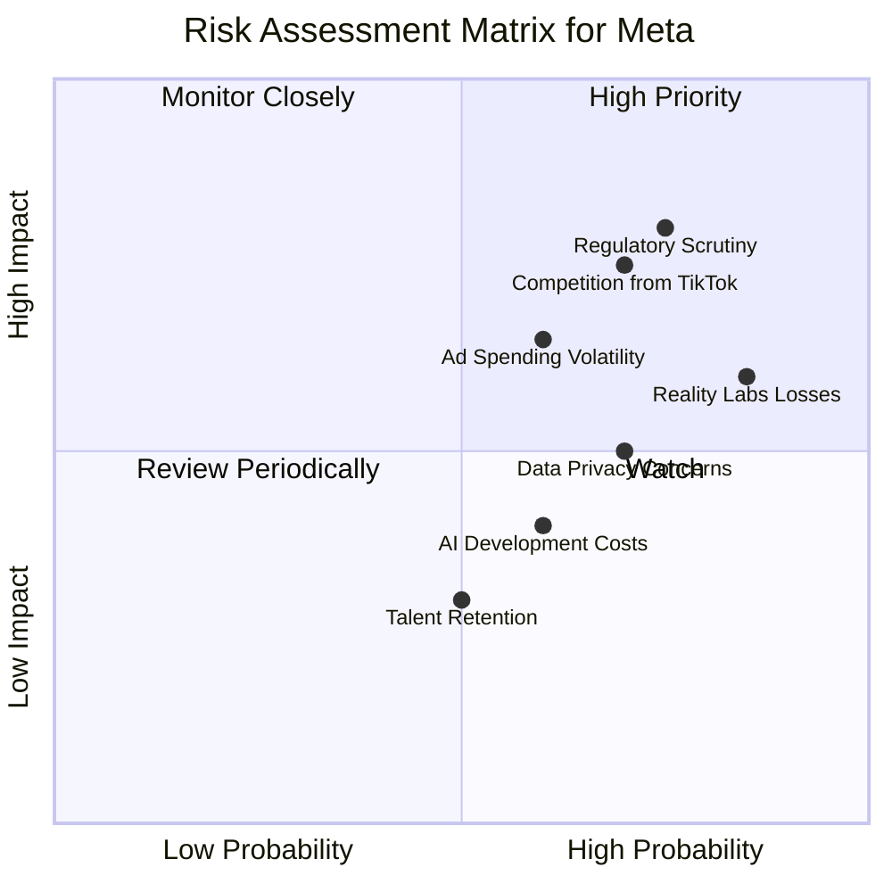

### 9.2 風險清單詳細分析

| # | 風險項目 | 發生機率 | 財務衝擊 | 風險評分 | 緩解措施 |
|---|----------|----------|----------|----------|----------|
| 1 | 🔴 **監管與反壟斷壓力** | 高 (75%) | 高 (-5%至-15%收入/重罰) | 🔴 8.5/10 | 積極配合監管機構，調整產品與隱私政策；透過收購或內部孵化拓展業務，降低對單一業務的依賴。 |
| 2 | 🔴 **Reality Labs持續虧損** | 高 (85%) | 中 (-5%至-10%淨利潤) | 🔴 7.5/10 | 優化投資策略，更聚焦於關鍵技術突破；探索更多變現模式；透過合作夥伴分攤研發成本。 |
| 3 | 🟡 **廣告市場波動與競爭加劇** | 中 (60%) | 中 (-5%至-10%收入) | 🟡 6.5/10 | 強化AI廣告技術，提升廣告效果和ROAS；拓展新的廣告形式（如Reels廣告、WhatsApp商業訊息）；分散廣告客戶群體。 |
| 4 | 🟡 **數據隱私法規變化** | 高 (70%) | 中 (-3%至-8%收入) | 🟡 6.0/10 | 積極適應新的數據隱私框架（如GDPR, CCPA）；投資於隱私增強技術；開發第一方數據解決方案。 |
| 5 | 🟡 **AI開發成本與回報不確定性** | 中 (60%) | 中 (-3%至-7%淨利潤) | 🟡 5.0/10 | 審慎評估AI投資回報，優先發展能快速商業化的AI應用；透過開源策略（Llama）建立生態系統，降低開發成本。 |

---

## 10. 投資建議

### 10.1 最終綜合評級雷達圖

```
╔══════════════════════════════════════════════════════════════╗
║                    META 綜合評級雷達圖 (1-10分)                 ║
╠══════════════════════════════════════════════════════════════╣
║ 基本面強度  9.0 ▓▓▓▓▓▓▓▓▓▓▓▓▓▓▓▓▓▓░░                          ║
║ 成長動能    9.0 ▓▓▓▓▓▓▓▓▓▓▓▓▓▓▓▓▓▓░░                          ║
║ 獲利品質    9.5 ▓▓▓▓▓▓▓▓▓▓▓▓▓▓▓▓▓▓▓░                          ║
║ 財務健康    8.5 ▓▓▓▓▓▓▓▓▓▓▓▓▓▓▓▓▓░░░                          ║
║ 估值合理性  7.5 ▓▓▓▓▓▓▓▓▓▓▓▓▓▓▓░░░░░                          ║
║ 護城河深度  9.0 ▓▓▓▓▓▓▓▓▓▓▓▓▓▓▓▓▓▓░░                          ║
║ 管理層執行  8.0 ▓▓▓▓▓▓▓▓▓▓▓▓▓▓▓▓░░░░                          ║
║ 技術創新力  9.0 ▓▓▓▓▓▓▓▓▓▓▓▓▓▓▓▓▓▓░░                          ║
╠══════════════════════════════════════════════════════════════╣
║ 綜合總分    8.7 ▓▓▓▓▓▓▓▓▓▓▓▓▓▓▓▓▓░░░  🏆 評級：強烈買入        ║
╚══════════════════════════════════════════════════════════════╝
```

### 10.2 目標價與隱含報酬率

綜合考慮基本面、成長性、獲利能力和估值模型，我們對Meta給予「強烈買入」評級。

| 情境 | 目標價 | 隱含報酬率 (vs $600.29) | 機率權重 | 綜合加權目標價 |
|------|--------|-------------------------|----------|------------------|
| 🟢 **樂觀情境** | $900 | +49.9% | 25% | $225.00 |
| 🟡 **基準情境** | $828 | +37.9% | 60% | $496.80 |
| 🔴 **悲觀情境** | $750 | +24.9% | 15% | $112.50 |
| **加權平均** | **$834.30** | **+38.98%** | **100%** |                  |

我們的12個月目標價區間為$750 - $900，基準目標價為$828。這代表相較於當前股價$600.29，有約24.9%至49.9%的潛在上升空間。

### 10.3 買入時機與觸發因素

```
╔══════════════════════════════════════════════════════════════════╗
║                  ✅ 買入觸發因素 Checklist                      ║
╠══════════════════════════════════════════════════════════════════╣
║                                                                  ║
║  立即買入觸發條件（多數符合）：                                  ║
║  ✅ 核心廣告業務營收持續雙位數增長 (YoY > 20%)                   ║
║  ✅ 營業利益率保持在40%以上，顯示效率年成果鞏固                   ║
║  ✅ 自由現金流持續為正且穩健增長                                  ║
║  ✅ Forward P/E維持在18x以下，PEG Ratio維持在1以下                ║
║  ✅ 管理層對AI和Metaverse的戰略清晰，且投資效率有改善跡象         ║
║                                                                  ║
║  加碼觸發條件（出現以下任一）：                                  ║
║  ☐ Reality Labs虧損收窄或展示出明確的變現前景                   ║
║  ☐ 新的AI產品或服務（如Llama商業化）帶來超預期收入增長          ║
║  ☐ 監管風險有明確緩解跡象或解決方案                             ║
║  ☐ 股價因非基本面因素（如大盤回調）跌至$550以下                 ║
║                                                                  ║
║  減碼/停損觸發條件（出現以下任一）：                             ║
║  ☐ 核心廣告業務增長顯著放緩，且無新業務接力                     ║
║  ☐ 利潤率持續惡化，成本控制失效                                 ║
║  ☐ 監管風險導致巨額罰款或業務拆分，對核心業務造成實質性損害     ║
║  ☐ Reality Labs虧損進一步擴大且看不到任何轉機                   ║
╚══════════════════════════════════════════════════════════════════╝
```

### 10.4 投資人適配度分析

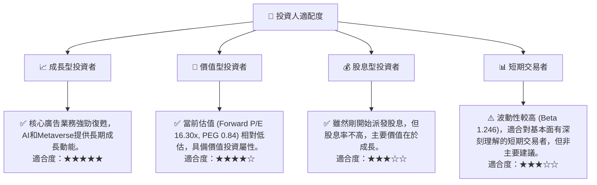

### 10.5 關鍵監控指標

| 監控類型 | 指標 | 關注點 | 頻率 |
|----------|------|----------|------|
| **財務表現** | 營收YoY成長率 | 核心廣告業務韌性，新業務貢獻 | 季度 |
| | 營業利益率 | 成本控制效率，Reality Labs虧損影響 | 季度 |
| | 自由現金流 | 資本效率，股東回報能力 | 季度 |
| | ROIC vs WACC | 資本配置效率，股東價值創造 | 年度 |
| **運營指標** | DAU/MAU | 用戶參與度，平台黏性 | 季度 |
| | Reels變現進度 | 短視頻廣告收入貢獻 | 季度 |
| | AI廣告ROAS | AI技術對廣告效果的提升 | 季度 |
| **戰略與創新** | Reality Labs虧損趨勢 | 元宇宙投資的回報前景 | 季度 |
| | AI模型發布與商業化進度 | Llama生態系統發展，AI服務收入潛力 | 不定期 |
| **外部環境** | 監管政策變化 | 反壟斷、數據隱私法規影響 | 不定期 |
| | 宏觀經濟趨勢 | 廣告市場整體景氣度 | 季度 |

---

> **免責聲明**：本報告為 AI 自動生成，僅供研究參考，不構成投資建議。投資有風險，入市需謹慎。