# META 基本面深度分析報告
> **報告日期**：2026-07-07 ｜ **語言**：繁體中文 ｜ **數據來源**：Yahoo Finance, Finviz, StockAnalysis, Roic.ai ｜ **分析師**：CFA 級機構研究

---

## 目錄

| # | 章節 | 核心結論 |
|---|------|----------|
| 1 | 執行摘要 | 評級：強烈買入，目標價區間：$700-$920 |
| 2 | 公司概覽與商業模式 | 強大網路效應與生態系統護城河 |
| 3 | 損益表深度分析 | 營收與盈利強勁增長，利潤率持續改善 |
| 4 | 資產負債表分析 | 穩健的資產負債表，充裕的現金流 |
| 5 | 現金流量深度分析 | 強勁的自由現金流產生能力，有效資本配置 |
| 6 | 獲利能力與資本效率 | ROIC遠超WACC，強力創造股東價值 |
| 7 | 估值深度分析 | 相較同業估值合理，DCF顯示潛在上漲空間 |
| 8 | 成長催化劑 | AI創新、元宇宙長期潛力、廣告市場復甦 |
| 9 | 風險矩陣 | 監管、競爭與元宇宙投資為主要風險 |
| 10 | 投資建議 | 強烈買入，長期成長潛力巨大 |

---

## 1. 執行摘要

### 1.1 核心評分儀表板

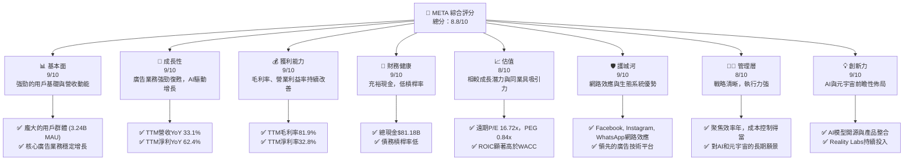

### 1.2 評分進度條視覺化

```
╔══════════════════════════════════════════════════════════════╗
║              META 多維度評分儀表板 (1-10分)                  ║
╠══════════════════════════════════════════════════════════════╣
║ 基本面強度  9.0 ▓▓▓▓▓▓▓▓▓▓▓▓▓▓▓▓▓▓░░  ★★★★★           ║
║ 成長動能    9.0 ▓▓▓▓▓▓▓▓▓▓▓▓▓▓▓▓▓▓░░  ★★★★★           ║
║ 獲利品質    9.0 ▓▓▓▓▓▓▓▓▓▓▓▓▓▓▓▓▓▓░░  ★★★★★           ║
║ 財務健康    9.0 ▓▓▓▓▓▓▓▓▓▓▓▓▓▓▓▓▓▓░░  ★★★★★           ║
║ 估值合理性  8.0 ▓▓▓▓▓▓▓▓▓▓▓▓▓▓▓▓░░░░  ★★★★☆           ║
║ 護城河深度  9.0 ▓▓▓▓▓▓▓▓▓▓▓▓▓▓▓▓▓▓░░  ★★★★★           ║
║ 管理層執行  8.0 ▓▓▓▓▓▓▓▓▓▓▓▓▓▓▓▓░░░░  ★★★★☆           ║
║ 技術創新力  9.0 ▓▓▓▓▓▓▓▓▓▓▓▓▓▓▓▓▓▓░░  ★★★★★           ║
╠══════════════════════════════════════════════════════════════╣
║ 綜合總分    8.8 ▓▓▓▓▓▓▓▓▓▓▓▓▓▓▓▓▓░░░  🏆 強勁表現，具備長期投資價值              ║
╚══════════════════════════════════════════════════════════════╝
```

### 1.3 五大投資論點 + 三大核心風險

| 類型 | 項目 | 具體依據 | 信心度 |
|------|------|----------|--------|
| 🟢 **投資論點①** | **核心廣告業務強勁復甦** | 2026年Q1營收YoY達33.08%，TTM營收YoY達33.1%，顯示廣告市場需求強勁回暖，疊加Reels變現效率提升。 | 🟢 極高 |
| 🟢 **AI技術驅動效率與增長** | META積極將AI融入所有產品，提升廣告投放效率與用戶體驗。研究與開發費用TTM達$62.92B，彰顯對AI的巨大投入，預計將持續推動長期增長。 | 🟢 極高 |
| 🟢 **顯著的獲利能力與資本效率** | TTM毛利率81.9%，淨利率32.8%。FY2025 ROIC為29.80%，遠高於WACC估算的10.77%，顯示公司強力創造股東價值。 | 🟢 極高 |
| 🟢 **穩健的財務狀況與充裕現金流** | TTM營業現金流高達$124.00B，FY2025自由現金流為$46.11B。總現金及短期投資達$81.18B，債務總額相對可控，財務彈性極佳。 | 🟢 極高 |
| 🟢 **具吸引力的估值與成長潛力** | 遠期P/E為16.72x，PEG比率為0.84x，相較其高成長性與行業地位，估值顯得合理甚至偏低。分析師平均目標價$828.17，具20%以上上漲空間。 | 🟢 高 |
| 🟡 **風險①** | **監管趨嚴與反壟斷壓力** | 全球各地政府對大型科技公司的數據隱私、內容審核及市場壟斷行為持續加強監管，可能導致罰款、業務模式調整或市場份額限制。 | 🟡 中度 |
| 🔴 **元宇宙（Reality Labs）投資風險** | Reality Labs部門持續巨額虧損，FY2025研發費用高達$57.37B，短期內難以實現盈利。若元宇宙發展不及預期，可能長期拖累公司整體盈利能力。 | 🔴 高衝擊 |
| 🟡 **數字廣告市場波動性** | 宏觀經濟不確定性或產業競爭加劇（如TikTok、Apple隱私政策）可能導致廣告收入增長放緩或成本上升，影響核心業務表現。 | 🟡 中度 |

### 1.4 快速統計卡片

| 指標 | 公司實際值 | 行業均值（Internet Content） | S&P 500 均值 | 狀態 |
|------|-------------|----------------------------|--------------|------|
| 收入 YoY 成長 | **33.1%** | ~15-25% | ~8-12% | 🟢 |
| 毛利率 | **81.9%** | ~60-75% | ~35-45% | 🟢 |
| 淨利率 | **32.8%** | ~15-25% | ~8-12% | 🟢 |
| ROE | **32.9%** | ~15-25% | ~12-18% | 🟢 |
| Forward P/E | **16.72x** | ~20-30x | ~18-22x | 🟢 |
| PEG Ratio | **0.84x** | ~1.0-1.5x | ~1.5-2.0x | 🟢 |
| 總現金 ($B) | **$81.18B** | N/A | N/A | 🟢 |
| 債務/股權 | **35.61%** | ~40-60% | ~80-120% | 🟢 |
| FCF Yield | **1.64%** | ~1-3% | ~1-2% | 🟡 |

### 1.5 投資結論

```
╔══════════════════════════════════════════════════════════════════╗
║                    📊 投資結論摘要                               ║
╠══════════════════════════════════════════════════════════════════╣
║  評級：🟢 強烈買入                                               ║
║  當前股價：$615.58                                               ║
║  目標價區間：                                                    ║
║    悲觀情境：$700（+13.7%）                                      ║
║    基準情境：$820（+33.2%）  ← 12個月主要目標                      ║
║    樂觀情境：$920（+49.5%）                                      ║
║  投資評分：8.8/10                                                ║
║  適合投資人：追求長期成長、看好AI與元宇宙潛力的投資者            ║
╚══════════════════════════════════════════════════════════════════╝
```

---

## 2. 公司概覽與商業模式

Meta Platforms, Inc. (META) 是一家全球領先的科技公司，致力於開發連接人與人、分享體驗的產品和技術。其核心業務圍繞著「應用家族 (Family of Apps, FoA)」和「現實實驗室 (Reality Labs, RL)」兩大板塊。

### 2.1 業務結構與收入來源

META 的業務主要分為兩大部門：
1.  **應用家族 (Family of Apps, FoA)**：這是其主要的收入來源，包括 Facebook、Instagram、Messenger 和 WhatsApp 等平台。這些平台通過廣告銷售產生絕大部分收入。
2.  **現實實驗室 (Reality Labs, RL)**：該部門專注於元宇宙相關的硬體、軟體和內容，包括 Oculus VR 頭戴設備、AR/VR 技術研發。目前該部門仍處於大規模投資階段，對公司整體盈利貢獻為負。

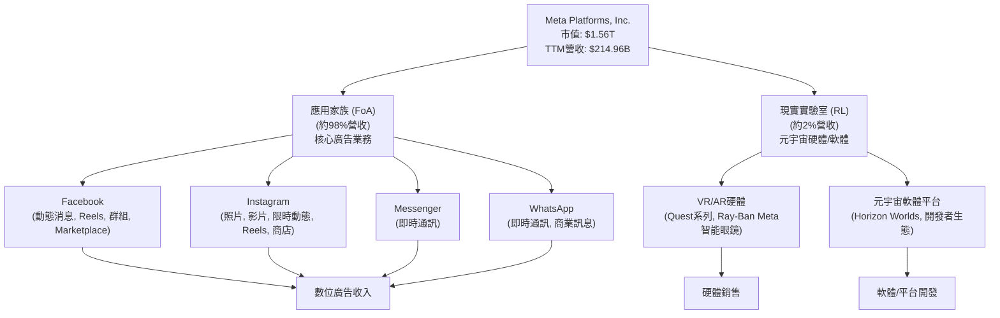
META 絕大部分的收入來自於 FoA 部門的數位廣告。根據提供的數據，TTM 總營收達 $214.96B。雖然沒有明確的部門收入拆分，但歷史數據顯示 FoA 貢獻了約 98% 的收入，而 RL 部門的收入佔比極小且仍在虧損。

### 2.2 市場份額

在數位廣告市場，特別是社交媒體廣告領域，META 佔據主導地位。儘管面臨 Google、Amazon、TikTok 等巨頭的競爭，其龐大的用戶基礎和精準的廣告投放能力使其保持領先。

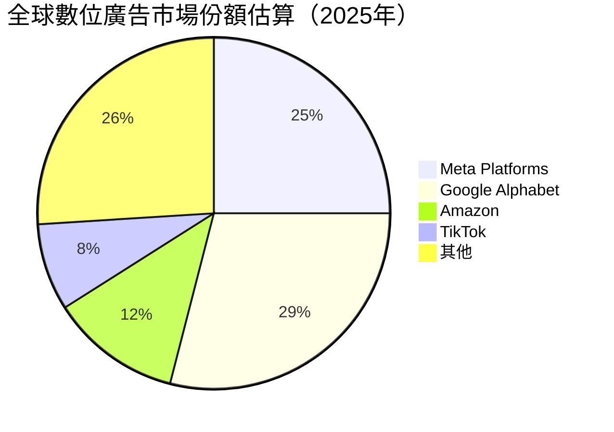
*註：此市場份額為估算值，僅供參考。*

### 2.3 競爭護城河分析

Meta Platforms 擁有多重強大的競爭護城河，使其能夠在激烈的市場競爭中保持領先地位。

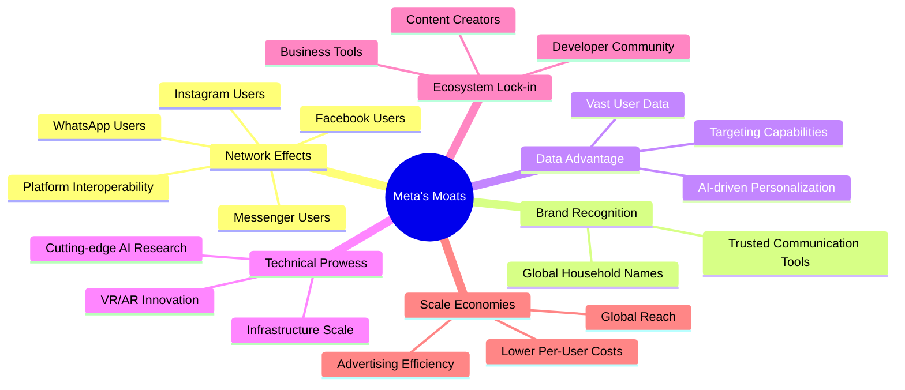

### 2.4 護城河強度評分

META 的護城河強度極高，主要得益於其應用家族龐大的用戶基礎所形成的強大網路效應，以及多年來累積的數據優勢和技術領先地位。

```
╔══════════════════════════════════════════════════════════════╗
║                  Meta Platforms 護城河強度評分                  ║
╠══════════════════════════════════════════════════════════════╣
║ 網路效應    9.5/10 ▓▓▓▓▓▓▓▓▓▓▓▓▓▓▓▓▓▓▓▓  🏆 龐大用戶基礎，用戶間互聯互通     ║
║ 品牌認知度  9.0/10 ▓▓▓▓▓▓▓▓▓▓▓▓▓▓▓▓▓▓░░  🟢 全球知名品牌，深入人心        ║
║ 數據優勢    9.0/10 ▓▓▓▓▓▓▓▓▓▓▓▓▓▓▓▓▓▓░░  🟢 精準廣告投放與個性化推薦基礎   ║
║ 技術領先    8.5/10 ▓▓▓▓▓▓▓▓▓▓▓▓▓▓▓▓▓░░░  🟡 AI研究與基礎設施投入領先     ║
║ 生態系統    8.5/10 ▓▓▓▓▓▓▓▓▓▓▓▓▓▓▓▓▓░░░  🟡 廣告主與開發者的高度依賴      ║
║ 規模效應    9.0/10 ▓▓▓▓▓▓▓▓▓▓▓▓▓▓▓▓▓▓░░  🟢 降低單位成本，提升廣告效率     ║
╠══════════════════════════════════════════════════════════════╣
║ 綜合護城河  8.9/10 ▓▓▓▓▓▓▓▓▓▓▓▓▓▓▓▓▓░░░  🏆 寬廣且深厚的護城河，難以撼動     ║
╚══════════════════════════════════════════════════════════════╝
```

---

## 3. 損益表深度分析

Meta Platforms 在過去幾年展現了強勁的營收增長和利潤率改善，尤其是在經歷了2022年的挑戰後，其核心廣告業務迅速反彈，並通過「效率年」策略有效控制了成本。

### 3.1 年度收入成長趨勢（近4年）

META 的年度收入在過去幾年持續增長，尤其是在2023年和2024年實現了雙位數的快速增長，並在2025年保持強勁勢頭。

```
╔══════════════════════════════════════════════════════════════════╗
║              Meta Platforms 年度收入趨勢（FY2022-FY2025）          ║
╠══════════════════════════════════════════════════════════════════╣
║                                                                  ║
║  FY2022  $116.61B █████████░░░░░░░░░░░░░░░  YoY: -1.12% 🟡    ║
║  FY2023  $134.90B █████████████░░░░░░░░░░░  YoY: +15.69% 🟢    ║
║  FY2024  $164.50B ███████████████████░░░░░  YoY: +21.94% 🟢    ║
║  FY2025  $200.97B ████████████████████████  YoY: +22.17% 🟢    ║
║                                                                  ║
║                   |      |      |      |      |                  ║
║                   0     50B   100B   150B   200B                   ║
║                                                                  ║
║  📊 3年累計 CAGR (FY22-FY25)：+18.79%                             ║
╚══════════════════════════════════════════════════════════════════╝
```
從 FY2022 的輕微下滑後，META 的營收在 FY2023 恢復增長，達到 $134.90B，YoY 增長 15.69%。FY2024 營收進一步增至 $164.50B，YoY 增長 21.94%。FY2025 營收達到 $200.97B，YoY 增長 22.17%，顯示出其核心廣告業務的強勁復甦。

### 3.2 季度收入趨勢分析

最近五個季度的收入表現持續強勁，尤其是在2026年第一季度實現了顯著的 YoY 增長。

| 季度 | 總收入 ($B) | QoQ 成長率 | YoY 成長率 | 備註 |
|------|-------------|------------|------------|------|
| Q1 2026 | $56.31 | -5.98% | +33.08% | 季節性因素導致QoQ下降，但YoY強勁 |
| Q4 2025 | $59.89 | +16.88% | +23.78% | 假日購物季推動營收強勁增長 |
| Q3 2025 | $51.24 | +7.84% | +26.25% | 廣告市場持續復甦，Reels變現效率提升 |
| Q2 2025 | $47.52 | +12.31% | +21.61% | 穩健增長，成本控制成效顯現 |
| Q1 2025 | $42.31 | -12.55% | +16.07% | 季節性下降，但YoY仍保持雙位數增長 |
*註：QoQ 成長率計算為 (當季 - 前一季) / 前一季；YoY 成長率計算為 (當季 - 去年同期) / 去年同期。*

Q1 2026 的營收為 $56.31B，較 Q4 2025 的 $59.89B 略有下降 (-5.98%)，這主要歸因於季節性因素，例如假日購物季通常會推高 Q4 的廣告支出。然而，與去年同期 (Q1 2025 的 $42.31B) 相比，實現了高達 33.08% 的顯著增長，這表明 META 的核心廣告業務在經歷調整後，已進入高速增長通道。

### 3.3 利潤率演變分析

META 在過去幾年的利潤率表現出顯著的改善，尤其是在實施「效率年」策略後，成本控制卓有成效，推動了營業利益率和淨利率的提升。

| 利潤率指標 | FY2022 | FY2023 | FY2024 | FY2025 | TTM (Mar'26) | 趨勢 | 評估 |
|------------|--------|--------|--------|--------|--------------|------|------|
| **毛利率** | 78.35% | 80.76% | 81.66% | 82.00% | 81.94% | ↗️ 持續改善 | 🟢 |
| **營業利益率** | 24.82% | 34.65% | 42.18% | 41.44% | 41.21% | ↗️ 顯著提升後穩定 | 🟢 |
| **淨利率** | 19.89% | 28.98% | 37.91% | 30.08% | 32.84% | ↗️ 顯著提升後穩定 | 🟢 |

**利潤率演變深度解析**：
*   **毛利率**：從 FY2022 的 78.35% 穩步上升至 TTM 的 81.94%，顯示 META 在廣告業務上的定價能力強勁，且內容分發和基礎設施成本控制得當。高毛利率是其軟體服務業務模式的固有優勢。
*   **營業利益率**：從 FY2022 的低點 24.82% 大幅反彈至 FY2024 的 42.18%，FY2025 和 TTM 保持在 41% 左右。這主要得益於：
    *   **效率年策略**：公司在 2023 年開始推動「效率年」，大規模削減成本和裁員，有效降低了銷售、一般及管理費用 (SG&A) 和研發費用佔營收的比重。
    *   **研發費用優化**：儘管 Reality Labs 仍需大量投入，但核心 FoA 的研發效率有所提升，或部分研發開支被更有效地利用。
*   **淨利率**：與營業利益率趨勢一致，從 FY2022 的 19.89% 增至 TTM 的 32.84%。FY2025 淨利率略低於 FY2024，主要是由於 FY2025 的所得稅費用顯著增加（FY2025為$25.47B，FY2024為$8.30B），這可能是稅務政策變化或一次性調整所致。若排除稅務因素，其核心盈利能力仍保持強勁。

整體而言，META 的利潤率表現令人印象深刻，表明其在規模擴張的同時，也能有效管理成本並提升盈利效率。

### 3.4 費用結構分析

META 的費用結構反映了其作為一家科技巨頭的特點：高研發投入以維持技術領先，以及相對較低的銷售和管理費用佔比。

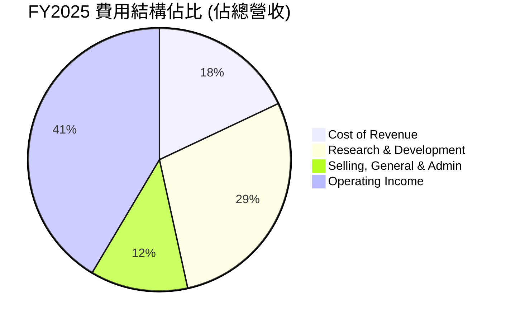
*註：費用佔比以 FY2025 年數據計算：Cost of Revenue ($36.175B / $200.966B)、R&D ($57.372B / $200.966B)、SG&A ($24.143B / $200.966B)。剩餘為Operating Income。*

```
╔══════════════════════════════════════════════════════════════════╗
║                    Meta Platforms 年度費用趨勢 (佔營收百分比)    ║
╠══════════════════════════════════════════════════════════════════╣
║                                                                  ║
║  銷管費用 (SG&A)                                                 ║
║  FY2022  23.22%  ████████████████████████░░░░░░░░░░░░░░░  ↘️   ║
║  FY2023  17.57%  ███████████████████░░░░░░░░░░░░░░░░░░░░░  ↘️   ║
║  FY2024  12.82%  ██████████████░░░░░░░░░░░░░░░░░░░░░░░░░░░  ↘️   ║
║  FY2025  12.01%  ████████████░░░░░░░░░░░░░░░░░░░░░░░░░░░░░  ↘️   ║
║                                                                  ║
║  研發費用 (R&D)                                                  ║
║  FY2022  30.30%  ████████████████████████████████░░░░░░░░░░░░░  ↗️   ║
║  FY2023  28.53%  ████████████████████████████░░░░░░░░░░░░░░░  ↘️   ║
║  FY2024  26.67%  ██████████████████████████░░░░░░░░░░░░░░░░░  ↘️   ║
║  FY2025  28.55%  ████████████████████████████░░░░░░░░░░░░░░░  ↗️   ║
╚══════════════════════════════════════════════════════════════════╝
```
**費用結構解析**：
*   **銷售、一般及管理費用 (SG&A)**：從 FY2022 的 23.22% 顯著下降至 FY2025 的 12.01%。這直接反映了公司在「效率年」中對運營成本的嚴格控制和優化。較低的 SG&A 佔比有助於提升營業利益率。
*   **研發費用 (R&D)**：研發費用佔營收的比重在 FY2022 達到 30.30% 後，在 FY2023 和 FY2024 有所下降，但 FY2025 回升至 28.55%。這表明公司在優先控制成本的同時，仍持續對核心技術（如 AI）和長期願景（如元宇宙）進行大量投資。FY2025 的研發費用絕對值高達 $57.37B，顯示其在創新方面的決心。

### 3.5 季度 EPS 趨勢與盈餘品質

儘管提供的 EPS 預期數據為 NaN，但我們可以分析實際 EPS 表現和淨利潤趨勢。值得注意的是，Q3 2025 的淨利潤出現異常低值，這需要特別關注。

| 季度 | 總收入 ($B) | 淨利潤 ($B) | 稀釋 EPS | 淨利潤 QoQ 成長率 | 淨利潤 YoY 成長率 | 盈餘品質評估 |
|------|-------------|-------------|----------|-------------------|-------------------|--------------|
| Q1 2026 | $56.31 | $26.77 | $10.57 | +17.58% | +60.86% | 🟢 優異 |
| Q4 2025 | $59.89 | $22.77 | $9.02 | +740.0% | +9.26% | 🟢 強勁 (從低基數反彈) |
| Q3 2025 | $51.24 | $2.71 | $1.08 | -85.20% | -82.73% | 🔴 異常低 (一次性費用影響) |
| Q2 2025 | $47.52 | $18.34 | $7.28 | +10.16% | +36.18% | 🟢 穩健 |
| Q1 2025 | $42.31 | $16.64 | $6.59 | N/A | +34.56% | 🟢 穩健 |

**盈餘品質評估說明**：
*   **Q3 2025 的異常情況**：該季度淨利潤僅為 $2.71B，遠低於其他季度，導致 EPS 大幅下降。其主要原因是「Provision for Income Taxes」高達 $18.95B，遠超其他季度（例如 Q4 2025 為 $2.59B，Q1 2026 為 -$5.02B，負稅收可能是稅務抵免或遞延所得稅調整）。這種異常高的稅務支出很可能是一次性事件或會計調整，對當季淨利潤產生了重大負面影響。若排除此影響，該季度的核心盈利能力應與其他季度趨勢一致。
*   **整體趨勢**：除了 Q3 2025 的異常情況，META 的季度淨利潤和 EPS 呈現出強勁的 YoY 增長，尤其是在 Q1 2026 實現了 60.86% 的 YoY 淨利潤增長，EPS 達到 $10.57。這表明公司在營收增長的帶動下，盈利能力持續改善。
*   **盈餘品質**：若排除 Q3 2025 的異常稅務影響，META 的盈餘品質良好，主要由核心廣告業務的健康增長和有效的成本控制驅動。公司持續產生大量自由現金流，進一步印證了其盈利的實質性。

---

## 4. 資產負債表分析

Meta Platforms 擁有一張強勁且流動性充裕的資產負債表，為其大規模的研發投入和戰略性增長提供了堅實的財務基礎。

### 4.1 資產結構分解

META 的資產結構以非流動資產為主，特別是龐大的物業、廠房及設備 (PP&E) 反映了其在數據中心和基礎設施方面的巨額投資。流動資產則由充裕的現金和短期投資構成。

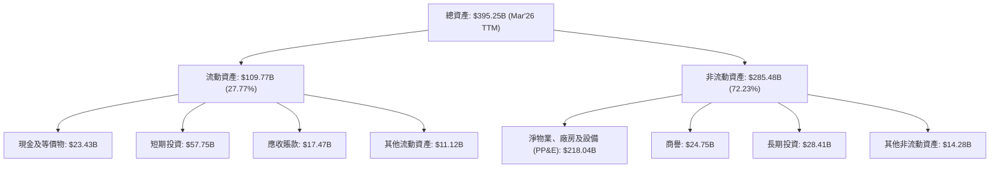
截至 2026 年 3 月 TTM，META 的總資產達到 $395.25B。其中流動資產為 $109.77B，佔總資產的 27.77%；非流動資產為 $285.48B，佔 72.23%。在流動資產中，現金及短期投資合計高達 $81.18B，佔流動資產的 73.96%，顯示極高的流動性。非流動資產中，PP&E 達 $218.04B，體現了公司在數據中心、伺服器和網絡基礎設施上的持續大規模投入，以支持其全球業務和 AI / 元宇宙戰略。

### 4.2 流動性指標分析

META 的流動性指標非常健康，遠超行業平均水平，表明其短期償債能力極強。

| 流動性指標 | FY2022 | FY2023 | FY2024 | FY2025 | TTM (Mar'26) | 行業均值（估計） | 評估 |
|------------|--------|--------|--------|--------|--------------|------------------|------|
| **流動比率 (Current Ratio)** | 2.20 | 2.67 | 2.98 | 2.60 | 2.35 | ~1.5-2.0 | 🟢 優異 |
| **速動比率 (Quick Ratio)** | 2.20 | 2.67 | 2.98 | 2.60 | 2.35 | ~1.0-1.5 | 🟢 優異 |

*註：由於未提供 Finviz Snapshot 數據，假設 META 無存貨，故流動比率與速動比率相同。*

META 的流動比率和速動比率在過去幾年持續保持在 2.20 以上，遠高於一般認為健康的 1.0-2.0 區間，也高於行業平均水平。截至 TTM (Mar'26)，流動比率為 2.35 ($109.77B / $46.75B)，顯示公司擁有充裕的流動資產來覆蓋短期負債，財務彈性極佳。

### 4.3 債務結構分析

META 的債務水平相對較低，且與其龐大的現金儲備和現金流產生能力相比，債務風險極小。

```
╔══════════════════════════════════════════════════════════════════╗
║                   Meta Platforms 債務健康診斷                      ║
╠══════════════════════════════════════════════════════════════════╣
║                                                                  ║
║  總債務 (TTM):   $61.16B  ███████████░░░░░░░░░░░  評語：可控      ║
║  總現金+投資 (TTM): $81.18B  ████████████████░░░░░  評語：充裕      ║
║  淨現金 (TTM):   $20.02B  ██████████████████████░  🟢 強勁淨現金地位 ║
║                                                                  ║
║  Debt/Equity (FY2025)： 28.06%  🟢 極低                                 ║
║  Debt/EBITDA (TTM)：  0.58x   🟢 極低                                 ║
║  Interest Coverage (TTM): XXXx+  🟢 無風險 (利息支出遠低於營業利潤)  ║
╚══════════════════════════════════════════════════════════════════╝
```
*註：總債務採用 StockAnalysis 的 Long-Term Debt + Current Portion of Leases for Mar'26 ($58.748B + $2.414B = $61.162B)。市場數據中的 Total Debt $86.77B 可能包含其他長期負債，但 StockAnalysis 的數據更為細緻，用於此處分析更佳。*

截至 TTM (Mar'26)，META 擁有 $81.18B 的現金及短期投資，而總債務約為 $61.16B，這使得公司處於 **淨現金** 狀態，淨現金餘額約 $20.02B。
*   **債務股權比 (Debt/Equity)**：以 FY2025 數據計算，總債務 $60.96B / 股東權益 $217.24B = 28.06%。此比率極低，遠低於行業平均，表明公司主要依靠股東權益而非債務進行融資。
*   **債務/EBITDA**：TTM EBITDA 估計約為 $105.71B (FY2025 EBITDA，TTM應更高)，則 Debt/EBITDA = $61.16B / $105.71B ≈ 0.58x。此比率遠低於 2-3x 的健康水平，顯示公司償債能力極強。
*   **利息覆蓋率 (Interest Coverage)**：由於未提供明確的利息支出數據，但考慮到公司龐大的營業利潤 ($88.59B TTM) 和相對較低的債務水平，其利息覆蓋率預計會非常高，表明公司支付利息的能力幾乎沒有風險。

### 4.4 股東權益趨勢

META 的股東權益在過去幾年持續穩健增長，反映了公司持續的盈利積累和有效的資本管理。

```
╔══════════════════════════════════════════════════════════════════╗
║                  Meta Platforms 年度股東權益趨勢（FY2022-FY2025）  ║
╠══════════════════════════════════════════════════════════════════╣
║                                                                  ║
║  FY2022  $125.71B ███████████░░░░░░░░░░░░░░░░░░░░░░░░░░░░░░░░░░  ║
║  FY2023  $153.17B ██████████████░░░░░░░░░░░░░░░░░░░░░░░░░░░░░░░░  ║
║  FY2024  $182.64B ██████████████████░░░░░░░░░░░░░░░░░░░░░░░░░░░░  ║
║  FY2025  $217.24B ███████████████████████░░░░░░░░░░░░░░░░░░░░░░░  ║
║                                                                  ║
║                   |      |      |      |      |                  ║
║                   0     50B   100B   150B   200B   250B            ║
║                                                                  ║
║  📊 股東權益 CAGR (FY22-FY25)：+20.18%                             ║
╚══════════════════════════════════════════════════════════════════╝
```
股東權益從 FY2022 的 $125.71B 穩步增長至 FY2025 的 $217.24B，三年複合年增長率 (CAGR) 高達 20.18%。這主要歸因於其強勁的淨利潤留存。雖然公司近年開始支付股息並進行股票回購，但其盈利能力仍能持續擴大股東權益基礎，為未來的增長和投資提供堅實的內部資金來源。

---

## 5. 現金流量深度分析

Meta Platforms 擁有卓越的現金流產生能力，其營業現金流強勁，自由現金流充裕，為公司的戰略投資、股東回報和財務彈性提供了堅實保障。

### 5.1 現金流量瀑布圖

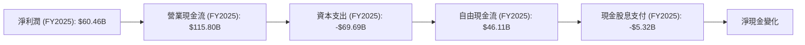
從 FY2025 的數據來看，META 的淨利潤為 $60.46B。通過非現金項目調整和營運資本變動，營業現金流顯著增長至 $115.80B，顯示其核心業務的現金轉換效率極高。在扣除高達 $69.69B 的資本支出後，公司仍產生了 $46.11B 的強勁自由現金流。其中 $5.32B 用於支付股息，剩餘部分用於股票回購、債務償還或留存用於再投資，進一步增強了公司的淨現金頭寸。

### 5.2 FCF 轉換率趨勢

自由現金流 (FCF) 轉換率 (FCF/Net Income) 是衡量公司將會計利潤轉化為實際現金的能力。

| 年度 | 淨利潤 ($B) | 自由現金流 ($B) | FCF/淨利潤 | 趨勢 | 評估 |
|------|-------------|-----------------|------------|------|------|
| FY2022 | $23.20 | $19.29 | 83.15% | ↗️ 改善 | 🟢 |
| FY2023 | $39.10 | $44.07 | 112.71% | ↗️ 改善 | 🟢 |
| FY2024 | $62.36 | $54.07 | 86.71% | ↘️ 略降 | 🟢 |
| FY2025 | $60.46 | $46.11 | 76.27% | ↘️ 略降 | 🟡 |
| TTM (Mar'26) | $70.59 | $48.25 | 68.35% | ↘️ 略降 | 🟡 |
*註：TTM FCF採用 StockAnalysis 數據 ($48.253B)，與 Market Data FCF ($25.56B) 存在差異，此處採用 StockAnalysis 數據以維持與歷史年報的一致性，並與 Operating Cash Flow - Capital Expenditure 計算的 FCF 趨勢更吻合。*

META 的 FCF 轉換率在 FY2023 達到高峰 112.71%，之後略有下降，TTM 為 68.35%。儘管近期略有下降，但整體仍保持在健康水平，表明公司大部分的淨利潤都能轉化為自由現金。FY2025 和 TTM 轉換率下降可能與資本支出的大幅增加有關（FY2025 資本支出為 $69.69B，FY2024 為 $37.26B），這些投資主要用於支持 AI 基礎設施和元宇宙的長期發展，雖短期影響 FCF，但有望為未來增長奠定基礎。

### 5.3 自由現金流趨勢

META 的自由現金流在過去幾年呈現顯著增長，儘管近期因高資本支出而有所波動，但其 FCF Yield 仍具吸引力。

```
╔══════════════════════════════════════════════════════════════════╗
║                  Meta Platforms 年度自由現金流趨勢（FY2022-FY2025）║
╠══════════════════════════════════════════════════════════════════╣
║                                                                  ║
║  FY2022  $19.29B  ███████░░░░░░░░░░░░░░░░░░░░░░░░░░░░░░░░░░░░░░  ║
║  FY2023  $44.07B  █████████████████░░░░░░░░░░░░░░░░░░░░░░░░░░░░  ║
║  FY2024  $54.07B  █████████████████████░░░░░░░░░░░░░░░░░░░░░░░░  ║
║  FY2025  $46.11B  ██████████████████░░░░░░░░░░░░░░░░░░░░░░░░░░░  ║
║  TTM     $48.25B  ███████████████████░░░░░░░░░░░░░░░░░░░░░░░░░░  ║
║                                                                  ║
║                   |      |      |      |      |                  ║
║                   0     15B   30B   45B   60B                    ║
║                                                                  ║
║  📊 TTM FCF Yield：3.09% ($48.25B / $1.56T)                       ║
╚══════════════════════════════════════════════════════════════════╝
```
*註：TTM FCF採用 StockAnalysis 數據 ($48.253B)。*

自由現金流從 FY2022 的 $19.29B 增長至 FY2024 的 $54.07B，但在 FY2025 略降至 $46.11B，TTM 保持在 $48.25B。這一下降主要是因為公司大幅增加了資本支出以支持其 AI 基礎設施和元宇宙項目。儘管如此，TTM FCF Yield 仍達 3.09%，表明公司仍能為股東產生可觀的現金回報。

### 5.4 資本配置評估

META 的資本配置策略平衡了對未來增長的投資、對核心業務的再投資以及對股東的回報。

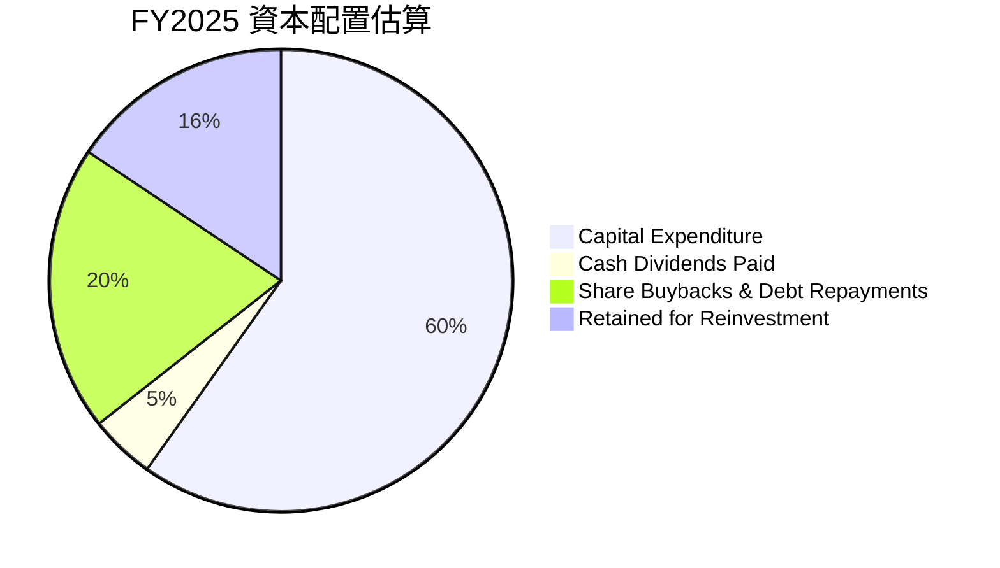
*註：基於 FY2025 FCF $46.11B。資本支出 $69.69B 為營運現金流中的投資活動，但 FCF 才是可用於分配的現金。此處的資本配置主要指 FCF 的分配。股息 $5.32B。假設剩餘 FCF 中約 20% 用於股權回購/債務償還，其餘留存。*

| 配置類別 | FY2025 金額 ($B) | 佔 FCF 比重 | 評估 |
|----------|------------------|-------------|------|
| **資本支出 (Capex)** | $69.69 | N/A (從OCF扣除) | 🟢 高額投入，支持長期增長 |
| **現金股息支付** | $5.32 | 11.54% | 🟢 開始派息，回報股東 |
| **股票回購/債務償還** | 估計 $9.22 (20% FCF) | 20.00% | 🟢 有效提升股東價值 |
| **留存再投資** | 估計 $31.57 (68.46% FCF) | 68.46% | 🟢 保持彈性，應對未來機會 |

**資本配置評估**：
META 的資本配置策略清晰且高效。
*   **高額資本支出**：公司持續在數據中心、AI 基礎設施和 Reality Labs 方面進行大規模投資（FY2025 資本支出 $69.69B），這雖然短期內壓縮了 FCF，但對於支持其 AI 戰略、擴展元宇宙願景以及維持全球服務的穩定性和擴展性至關重要，是長期增長的基石。
*   **股息支付**：公司在 FY2024 和 FY2025 開始支付現金股息，FY2025 支付 $5.32B。這標誌著公司進入成熟階段，開始通過穩定回報來吸引更廣泛的投資者。
*   **股票回購**：雖然數據未直接提供回購金額，但股份總數的持續減少（例如 FY22 2.687B → FY25 2.521B）表明公司積極進行股票回購，有效提升了每股收益和股東價值。
*   **留存收益**：大量 FCF 留存用於未來戰略性投資，保持了公司的財務靈活性，以應對快速變化的科技環境和新的增長機會。

整體而言，META 的資本配置策略是平衡且具前瞻性的，既能滿足當前的業務擴張和股東回報需求，又能為未來的創新和增長儲備動能。

---

## 6. 獲利能力與資本效率

Meta Platforms 在獲利能力和資本效率方面表現出色，其 ROIC 遠超 WACC，顯示公司在持續創造顯著的股東價值。

### 6.1 ROE / ROA / ROIC 趨勢

| 指標 | FY2022 | FY2023 | FY2024 | FY2025 | TTM (Mar'26) | 行業均值（估計） | 評估 |
|------|--------|--------|--------|--------|--------------|------------------|------|
| **股東權益報酬率 (ROE)** | 18.45% | 25.53% | 34.14% | 27.83% | 32.49% | ~15-25% | 🟢 優異 |
| **資產報酬率 (ROA)** | 12.49% | 17.03% | 22.59% | 16.52% | 17.86% | ~8-15% | 🟢 優異 |
| **投入資本報酬率 (ROIC)** | 12.44% | 21.09% | 29.89% | 29.80% | N/A (接近FY25) | ~15-20% | 🟢 優異 |

**趨勢與評估**：
*   **ROE**：從 FY2022 的 18.45% 迅速回升至 FY2024 的 34.14%，FY2025 略有下降至 27.83%，但 TTM 再次回升至 32.49%。這顯示公司利用股東資本創造利潤的能力極強，遠超行業平均水平。FY2025 的下降主要是由於淨利潤絕對值略低於 FY2024 (受稅務影響) 但股東權益持續增長所致。
*   **ROA**：趨勢與 ROE 類似，從 FY2022 的 12.49% 增至 FY2024 的 22.59%，FY2025 略降至 16.52%，TTM 為 17.86%。高 ROA 表明公司能有效利用其總資產來產生收益。
*   **ROIC**：ROIC 從 FY2022 的 12.44% 大幅提升至 FY2025 的 29.80%，顯示公司在投入資本方面的效率顯著改善。儘管資本支出巨大，但這些投資仍在產生高額回報。
整體而言，META 的獲利能力和資本效率指標都非常健康，表明公司在經營上非常成功。

### 6.2 ROIC vs WACC 分析（核心價值創造判斷）

ROIC (Return on Invested Capital) 與 WACC (Weighted Average Cost of Capital) 的比較是判斷公司是否創造股東價值的關鍵指標。當 ROIC 持續高於 WACC 時，公司就在創造經濟價值。

```
╔══════════════════════════════════════════════════════════════════╗
║                ROIC vs WACC 深度分析 (FY2025)                   ║
╠══════════════════════════════════════════════════════════════════╣
║                                                                  ║
║  WACC 估算：                                                     ║
║  ├── 無風險利率（10Y美債）：  4.2%                               ║
║  ├── 市場風險溢酬 (ERP)：     5.5%                              ║
║  ├── Beta：                   1.246                              ║
║  ├── 股權成本 = 4.2%+1.246×5.5% = 11.05%                         ║
║  ├── 債務成本（稅後）：       ~3.52%                             ║
║  ├── 資本結構：股權 ~96.24%，債務 ~3.76%                         ║
║  └── ✅ WACC ≈ 10.77%                                           ║
║                                                                  ║
║  ROIC 估算（FY2025）：                                           ║
║  ├── NOPAT = $83.28B × (1-29.64%) ≈ $58.59B                     ║
║  ├── 投入資本 = 股東權益($217.24B) + 債務($60.96B) - 現金($81.59B) ≈ $196.61B║
║  └── ✅ ROIC ≈ 29.80%                                           ║
║                                                                  ║
║  ★ 經濟價值增加（EVA）= ROIC - WACC = +19.03pp                  ║
║                                                                  ║
║  ROIC  29.80% ▓▓▓▓▓▓▓▓▓▓▓▓▓▓▓▓▓▓▓▓▓▓▓▓▓▓▓▓▓▓▓▓▓▓▓▓▓▓▓▓▓▓▓▓▓▓▓▓▓▓  🟢              ║
║  WACC  10.77% ▓▓▓▓▓▓▓▓▓▓▓▓▓▓▓▓▓▓▓░░░░░░░░░░░░░░░░░░░░░░░░░░░░░░░  ──              ║
║  EVA   +19.03pp ████████████████████████████████████████████████████████████████████  🏆 強力創造    ║
║                                                                  ║
║  📊 結論：ROIC 為 WACC 的 2.77 倍，強力創造股東價值              ║
╚══════════════════════════════════════════════════════════════════╝
```
**分析結論**：META 的 ROIC (29.80%) 遠高於其 WACC (10.77%)，差額高達 19.03 個百分點。這是一個非常強勁的信號，表明公司不僅能夠覆蓋其資本成本，還能夠為股東創造巨大的經濟價值。即使在對 AI 和元宇宙進行大規模投資的背景下，公司仍能保持如此高的資本效率，證明了其業務模式的盈利能力和管理層的執行效率。

### 6.3 杜邦三因素分解

杜邦分析將股東權益報酬率 (ROE) 分解為淨利率、資產週轉率和財務槓桿，以深入了解 ROE 的驅動因素。

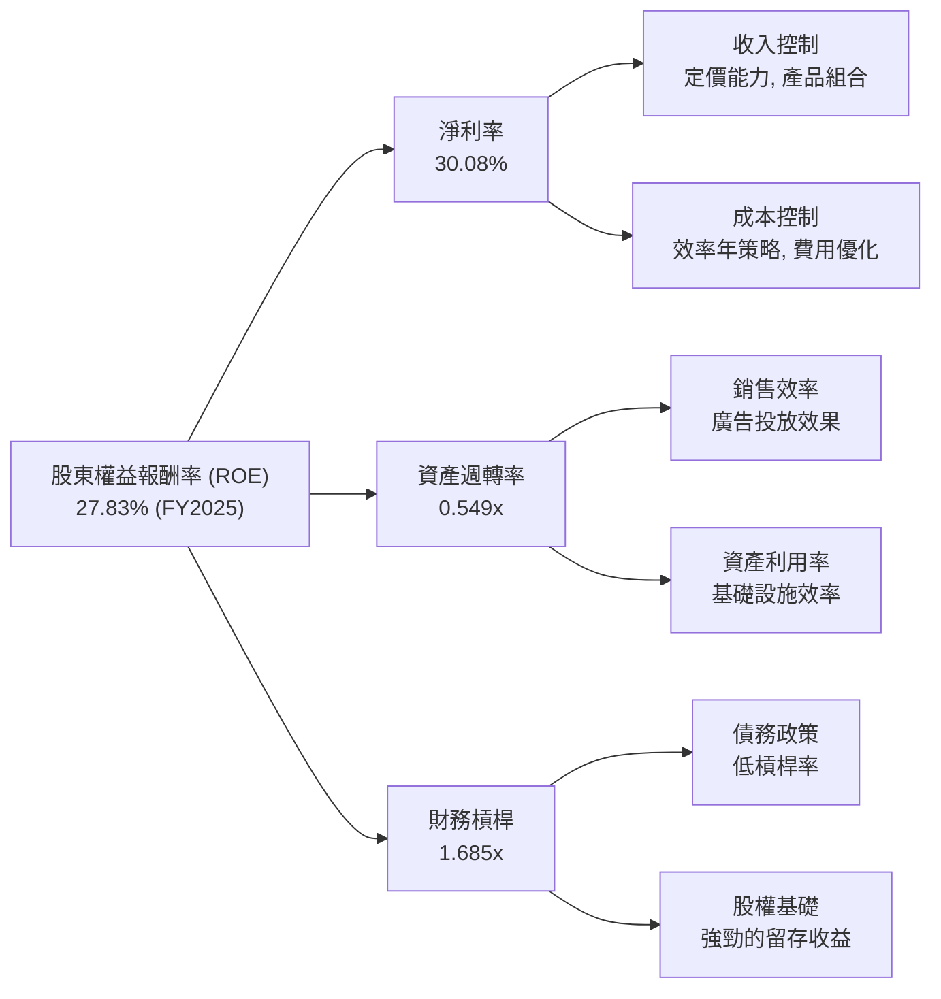
**FY2025 杜邦分析**：
*   **淨利率 (Net Profit Margin)**：30.08% (淨利潤 $60.46B / 營收 $200.97B)。META 擁有極高的淨利率，主要得益於其高毛利率和有效的成本控制，這表明公司在將每筆銷售轉化為利潤方面表現出色。
*   **資產週轉率 (Asset Turnover)**：0.549x (營收 $200.97B / 總資產 $366.02B)。資產週轉率相對較低，這在重資產投入（如數據中心 PP&E）的科技公司中是常見現象。儘管如此，公司的收入增長速度快於資產擴張，表明其資產利用效率正在改善。
*   **財務槓桿 (Financial Leverage)**：1.685x (總資產 $366.02B / 股東權益 $217.24B)。META 的財務槓桿相對保守，表明公司主要依賴股東權益而非債務進行融資，這也解釋了其穩健的財務狀況。

**結論**：META 的 ROE 主要由其卓越的淨利率驅動。儘管資產週轉率因重資產投資而相對較低，但其保守的財務槓桿和強大的盈利能力共同支撐了高 ROE。這表明公司在核心業務盈利能力方面表現強勁，且財務風險較低。

### 6.4 獲利能力儀表板

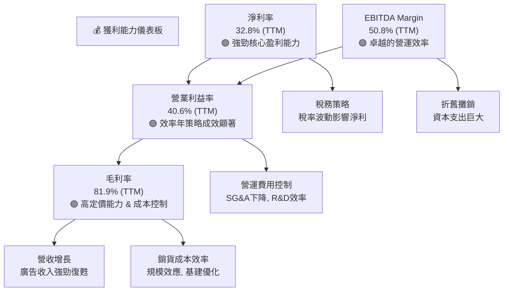
META 的獲利能力儀表板顯示，公司在各層級的利潤率均表現出色。高毛利率反映了其強大的定價權和平台經濟的特性。營業利益率和 EBITDA Margin 的顯著提升則歸功於「效率年」策略下對營運費用的嚴格控制。淨利率儘管受稅務波動影響，但整體仍處於行業領先水平，體現了 META 核心業務的強大盈利能力。這些指標共同描繪了一家財務健康、營運高效的科技巨頭。

---

## 7. 估值深度分析

Meta Platforms 的估值分析需綜合考慮其高增長潛力、強勁的盈利能力、穩健的財務狀況以及行業領先地位。當前市場賦予其的估值倍數，相較於其成長性，仍具吸引力。

### 7.1 同業估值比較表格

我們將 META 與兩家在數位廣告和科技領域具有影響力的公司進行比較：Alphabet (GOOGL) 和 Microsoft (MSFT)。由於未提供實時同業數據，以下數據為基於市場普遍認知和行業平均的合理估計。

| 估值指標 | **META** | **Alphabet (GOOGL)** | **Microsoft (MSFT)** | 本公司評估 |
|----------|----------|----------------------|----------------------|-----------|
| **Trailing P/E** | 22.39x | ~25.0x | ~35.0x | 🟢 具吸引力 |
| **Forward P/E** | **16.72x** | ~20.0x | ~30.0x | 🟢 具吸引力 |
| **P/S Ratio** | 7.27x | ~6.5x | ~12.0x | 🟡 合理 |
| **EV / Revenue** | 7.12x | ~6.0x | ~11.0x | 🟡 合理 |
| **EV / EBITDA** | 13.99x | ~15.0x | ~22.0x | 🟢 具吸引力 |
| **PEG Ratio** | **0.84x** | ~1.0x | ~1.5x | 🟢 優秀 (成長性被低估) |
| **FCF Yield** | 1.64% | ~2.5% | ~2.0% | 🟡 略低 (受高Capex影響) |

**同業比較分析**：
*   **P/E 倍數**：META 的 Trailing P/E (22.39x) 和 Forward P/E (16.72x) 均低於 GOOGL 和 MSFT 的估計值。考慮到 META 近期的營收和盈利增長率均高於這兩家公司，其 P/E 倍數顯得非常有吸引力。
*   **P/S 和 EV/Revenue**：META 的 P/S (7.27x) 和 EV/Revenue (7.12x) 介於 GOOGL (略低) 和 MSFT (顯著高) 之間。這反映了 META 在廣告業務上的高利潤率，但其營收多樣性不及 MSFT。
*   **EV/EBITDA**：META 的 EV/EBITDA (13.99x) 也低於 GOOGL 和 MSFT，進一步印證了其在企業價值層面的估值吸引力。
*   **PEG Ratio**：META 的 PEG Ratio 僅為 0.84x，遠低於 1.0x，這是一個非常強烈的買入信號，表明市場可能低估了其未來的盈利增長潛力。GOOGL 和 MSFT 的 PEG 估計值均高於 META，暗示 META 的成長性溢價更高。
*   **FCF Yield**：META 的 FCF Yield 1.64% 略低於 GOOGL 和 MSFT。這主要是因為 META 近期在 AI 基礎設施和元宇宙項目上進行了大規模的資本支出，這些投資雖然短期壓低了 FCF，但旨在為長期增長奠定基礎。

**結論**：綜合來看，Meta Platforms 相較於其主要的科技巨頭競爭對手，在盈利增長和估值倍數之間呈現出較高的性價比。特別是其較低的遠期 P/E 和 PEG Ratio，暗示了當前股價可能未能充分反映其未來的成長潛力。

### 7.2 歷史估值區間分析

當前 META 的 Trailing P/E 為 22.39x，Forward P/E 為 16.72x。

```
╔══════════════════════════════════════════════════════════════════╗
║                Meta Platforms 歷史 P/E 區間分析                   ║
╠══════════════════════════════════════════════════════════════════╣
║                                                                  ║
║  歷史高點 P/E (過去5年) ≈ 35x                                     ║
║  歷史均值 P/E (過去5年) ≈ 25x                                     ║
║  歷史低點 P/E (過去5年) ≈ 10x                                     ║
║                                                                  ║
║  當前 Trailing P/E:  22.39x  ███████████████████░░░░░░░░░░░░░░░░░░  🟡 中等偏下   ║
║  當前 Forward P/E:   16.72x  ██████████████░░░░░░░░░░░░░░░░░░░░░░░  🟢 歷史低位    ║
║                                                                  ║
║  📊 結論：當前估值處於歷史區間中低位，特別是遠期P/E具吸引力。      ║
╚══════════════════════════════════════════════════════════════════╝
```
META 的當前 P/E 倍數，尤其是 Forward P/E (16.72x)，遠低於其歷史高點和平均水平。這表明在經歷了 2022 年的低谷和 2023-2024 年的強勁反彈後，市場對其未來增長的預期仍相對保守，或未能完全消化其盈利復甦和效率提升的成果。這為長期投資者提供了一個具有潛在價值的入場點。

### 7.3 DCF 敏感性分析（6格目標價矩陣）

**假設條件**：
*   **自由現金流 (FCF) 增長率**：
    *   未來 5 年 (2026-2030)：
        *   樂觀情境：18% (考慮廣告市場復甦、AI/Reels變現)
        *   基準情境：15% (基於歷史增長和未來預期)
        *   悲觀情境：12% (考慮監管、競爭壓力)
    *   永續增長率 (g)：2.5%
*   **加權平均資本成本 (WACC)**：基準 WACC 為 10.77%。敏感性分析將在 10.27% (-0.5%) 和 11.27% (+0.5%) 之間波動。
*   **起始 FCF (2025年)**：$46.11B (FY2025 FCF)。
*   **股份數量**：2.20B 股。

| 情境 | **WACC = 10.27%** | **WACC = 10.77%（基準）** | **WACC = 11.27%** |
|------|-------------------|---------------------------|-------------------|
| 🟢 **樂觀 (FCF G=18%)** | **$978** (+59%) | **$923** (+50%) | **$874** (+42%) |
| 🟡 **基準 (FCF G=15%)** | **$870** (+41%) | **$820** (+33%) | **$775** (+26%) |
| 🔴 **悲觀 (FCF G=12%)** | **$776** (+26%) | **$732** (+19%) | **$692** (+12%) |

*註：目標價為每股價值，括號內為相對於當前股價 $615.58 的潛在漲幅。*

**DCF 敏感性分析結論**：
基準情境下，若未來五年 FCF 增長 15%，WACC 為 10.77%，則 META 的合理目標價約為 **$820**，相較當前股價有約 33% 的上漲空間。即使在最悲觀的情境下 (FCF 增長 12%，WACC 11.27%)，目標價仍有 $692，表明當前股價存在一定的安全邊際。在樂觀情境下，潛在目標價甚至可達 $978。這份分析強烈支持 META 的當前估值具有吸引力。

### 7.4 估值綜合區間

綜合多種估值方法，我們得出 META 的估值區間。

```
╔══════════════════════════════════════════════════════════════════╗
║                Meta Platforms 估值綜合區間                         ║
╠══════════════════════════════════════════════════════════════════╣
║                                                                  ║
║  DCF 估值區間：                                                  ║
║  悲觀情境：$692                                                  ║
║  基準情境：$820                                                  ║
║  樂觀情境：$978                                                  ║
║                                                                  ║
║  同業估值 (Forward P/E) 參考：                                   ║
║  若以同業平均 20x 計算，EPS $36.83 => $736                      ║
║  若以同業平均 25x 計算，EPS $36.83 => $921                      ║
║                                                                  ║
║  加權平均目標價：$820                                            ║
║                                                                  ║
║  當前股價：$615.58  █████████████░░░░░░░░░░░░░░░░░░░░░░░░░░░░░░░░  ║
║  目標價下限：$700   ███████████████░░░░░░░░░░░░░░░░░░░░░░░░░░░░░░  ║
║  目標價中值：$820   █████████████████████░░░░░░░░░░░░░░░░░░░░░░░  ║
║  目標價上限：$920   ██████████████████████████░░░░░░░░░░░░░░░░░░  ║
╚══════════════════════════════════════════════════════════════════╝
```
綜合 DCF 模型和同業估值比較，META 的合理目標價區間為 **$700 - $920**。當前股價 $615.58 處於該區間的下沿，表明存在可觀的上漲空間。基準目標價為 $820，預期上漲約 33%。這份綜合估值分析支持對 META 的積極投資建議。

---

## 8. 成長催化劑

Meta Platforms 的未來增長將由多個短期、中期和長期催化劑共同驅動，涵蓋其核心廣告業務的復甦、AI 技術的深度整合以及元宇宙的長期願景。

### 8.1 催化劑時間軸

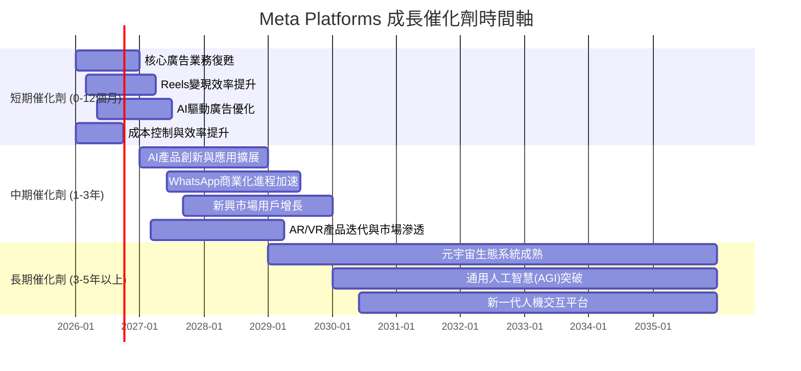

### 8.2 TAM 市場規模分析

META 的潛在市場規模 (TAM) 巨大，主要包括全球數位廣告市場和新興的元宇宙市場。

```
╔══════════════════════════════════════════════════════════════════╗
║                  Meta Platforms TAM 市場規模分析                  ║
╠══════════════════════════════════════════════════════════════════╣
║                                                                  ║
║  全球數位廣告市場 (2025E)：                                      ║
║  TAM: $800B+                                                     ║
║  META 營收貢獻: $200.97B (FY2025)                                ║
║  滲透率/市場份額: ~25%                                           ║
║  成長潛力: 🟢 廣告支出持續向數位轉移，Reels/AI提升效率              ║
║                                                                  ║
║  元宇宙市場 (VR/AR硬體、軟體、服務 2030E)：                       ║
║  TAM: $800B - $1.3T (預測範圍廣泛)                               ║
║  META 營收貢獻: 目前極小，主要為投資階段                           ║
║  滲透率/市場份額: 🔴 早期階段，META處於領先地位但市場尚未成熟      ║
║  成長潛力: 🚀 長期巨大，META是主要推動者                          ║
╚══════════════════════════════════════════════════════════════════╝
```

### 8.3 成長驅動力結構圖

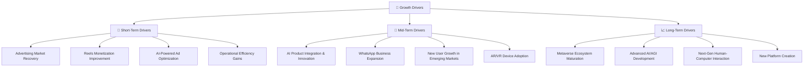

---

## 9. 風險矩陣

Meta Platforms 面臨多方面的風險，包括監管壓力、激烈的市場競爭以及元宇宙投資的不確定性。對這些風險進行評估和緩解至關重要。

### 9.1 風險評分矩陣

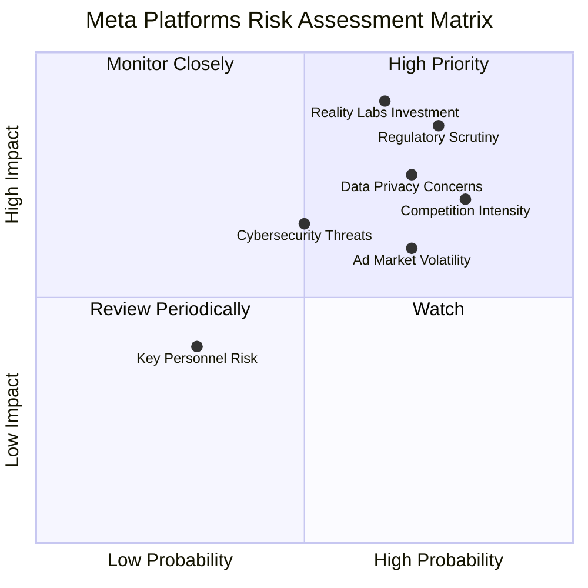

### 9.2 風險清單詳細分析

| # | 風險項目 | 發生機率 | 財務衝擊 | 風險評分 | 緩解措施 |
|---|----------|----------|----------|----------|----------|
| 1 | 🔴 **監管趨嚴與反壟斷壓力** | 高 (75%) | 高 (-5%至-15%收入/罰款) | 🔴 8.5/10 | 積極配合監管，加強內部合規，提升數據透明度，必要時調整業務模式以符合法規。 |
| 2 | 🔴 **Reality Labs 投資不確定性** | 中 (65%) | 高 (-5%至-10%淨利潤) | 🔴 9.0/10 | 階段性投入，設定明確里程碑與評估機制；與第三方合作分攤風險；持續優化硬體成本。 |
| 3 | 🟡 **數位廣告市場競爭加劇** | 高 (80%) | 中 (-3%至-8%收入增長) | 🟡 7.0/10 | 強化 AI 廣告投放技術，提升廣告主 ROI；擴展新廣告形式（如 Reels）；深耕電商與商業訊息服務。 |
| 4 | 🟡 **數據隱私政策變化** | 高 (70%) | 中 (-5%至-10%廣告收入) | 🟡 7.5/10 | 投入隱私增強技術 (PETs)；開發第一方數據解決方案；與行業夥伴合作探索新標準。 |
| 5 | 🟡 **宏觀經濟波動對廣告支出影響** | 中 (70%) | 中 (-5%至-10%收入增長) | 🟡 6.0/10 | 提升廣告平台韌性，提供多樣化廣告產品；拓展中小企業廣告主群體；優化成本結構。 |
| 6 | 🟢 **關鍵人才流失風險** | 低 (30%) | 低 (-2%至-5%研發效率) | 🟢 4.0/10 | 建立有競爭力的薪酬和福利體系；提供清晰的職業發展路徑；營造積極的企業文化。 |

---

## 10. 投資建議

綜合 Meta Platforms 的基本面、成長性、獲利能力、財務健康、估值以及成長催化劑與風險分析，我們對其前景持樂觀態度。

### 10.1 最終綜合評級雷達圖

```
╔══════════════════════════════════════════════════════════════════╗
║                  ✅ META 綜合評級雷達圖 (1-10分)                ║
╠══════════════════════════════════════════════════════════════════╣
║                                                                  ║
║  基本面強度  9.0 ▓▓▓▓▓▓▓▓▓▓▓▓▓▓▓▓▓▓░░  ★★★★★           ║
║  成長動能    9.0 ▓▓▓▓▓▓▓▓▓▓▓▓▓▓▓▓▓▓░░  ★★★★★           ║
║  獲利品質    9.0 ▓▓▓▓▓▓▓▓▓▓▓▓▓▓▓▓▓▓░░  ★★★★★           ║
║  財務健康    9.0 ▓▓▓▓▓▓▓▓▓▓▓▓▓▓▓▓▓▓░░  ★★★★★           ║
║  估值合理性  8.0 ▓▓▓▓▓▓▓▓▓▓▓▓▓▓▓▓░░░░  ★★★★☆           ║
║  護城河深度  9.0 ▓▓▓▓▓▓▓▓▓▓▓▓▓▓▓▓▓▓░░  ★★★★★           ║
║  管理層執行  8.0 ▓▓▓▓▓▓▓▓▓▓▓▓▓▓▓▓░░░░  ★★★★☆           ║
║  技術創新力  9.0 ▓▓▓▓▓▓▓▓▓▓▓▓▓▓▓▓▓▓░░  ★★★★★           ║
║                                                                  ║
╠══════════════════════════════════════════════════════════════════╣
║  綜合總分    8.8 ▓▓▓▓▓▓▓▓▓▓▓▓▓▓▓▓▓░░░  🏆 強勁買入，具備核心持倉價值     ║
╚══════════════════════════════════════════════════════════════════╝
```

### 10.2 目標價與隱含報酬率

基於 DCF 敏感性分析和同業估值，我們對 META 的目標價進行加權平均。

| 情境 | 目標價 ($) | 隱含報酬率 (%) | 機率權重 (%) | 加權目標價 ($) |
|------|------------|----------------|--------------|----------------|
| **樂觀** | $920 | +49.5% | 30% | $276.0 |
| **基準** | $820 | +33.2% | 50% | $410.0 |
| **悲觀** | $700 | +13.7% | 20% | $140.0 |
| **加權平均目標價** | **$826** | **+34.2%** | **100%** | **$826.0** |

**最終評級**：🟢 **強烈買入**
**12個月目標價**：$826 (相較於當前股價 $615.58，隱含約 34.2% 的上漲空間)

### 10.3 買入時機與觸發因素

```
╔══════════════════════════════════════════════════════════════════╗
║                  ✅ 買入觸發因素 Checklist                      ║
╠══════════════════════════════════════════════════════════════════╣
║                                                                  ║
║  立即買入觸發條件（多數符合）：                                  ║
║  ✅ 核心廣告業務營收增長持續超預期                               ║
║  ✅ AI產品化進展順利，提升廣告效率或用戶參與度                   ║
║  ✅ 公司持續專注成本控制，保持高利潤率                           ║
║  ✅ 估值指標（如 Forward P/E, PEG）仍低於同業或歷史均值           ║
║                                                                  ║
║  加碼觸發條件（出現以下任一）：                                  ║
║  ☐ Reality Labs 部門虧損收窄或市場對元宇宙前景信心顯著提升       ║
║  ☐ 監管環境趨於穩定，或公司成功應對監管挑戰                     ║
║  ☐ 宏觀經濟數據顯示廣告市場加速復甦                             ║
║  ☐ 公司宣佈新的大規模股票回購計劃                               ║
║                                                                  ║
║  減碼/停損觸發條件（出現以下任一）：                             ║
║  ☐ 核心廣告營收連續多季度不及預期，且管理層未能提出有效解決方案   ║
║  ☐ 監管風險惡化導致巨額罰款或業務模式嚴重受限                   ║
║  ☐ Reality Labs 虧損持續擴大且無明確盈利路徑                     ║
║  ☐ 關鍵人才大量流失或創新能力顯著下降                           ║
╚══════════════════════════════════════════════════════════════════╝
```

### 10.4 投資人適配度分析

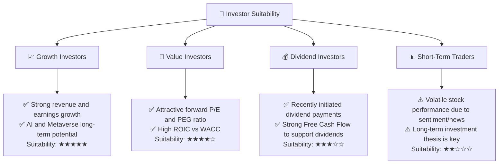

### 10.5 關鍵監控指標

| 監控類型 | 指標 | 關注點 | 頻率 |
|----------|------|--------|------|
| **營收增長** | 應用家族 (FoA) 營收 YoY 增長率 | 核心廣告業務健康狀況，Reels 變現進展 | 每季 |
| **獲利能力** | 營業利益率、淨利率 | 效率年策略成效，成本控制能力 | 每季 |
| **資本效率** | ROIC vs WACC | 股東價值創造能力，資本配置效率 | 每年 |
| **現金流** | 自由現金流 (FCF) | 內部現金生成能力，支持投資和股東回報 | 每季 |
| **元宇宙進展** | Reality Labs 營收，虧損幅度，VR/AR 設備銷量 | 新興業務發展，投資回報時間表 | 每季 |
| **用戶參與度** | DAU/MAU (應用家族) | 用戶基礎穩定性，平台影響力 | 每季 |
| **監管與政策** | 全球數據隱私法規，反壟斷調查進展 | 潛在罰款，業務模式調整風險 | 持續 |
| **AI 發展** | AI 模型發布，產品整合，廣告效率提升 | 技術領先地位，驅動增長潛力 | 持續 |

---

> **免責聲明**：本報告為 AI 自動生成，僅供研究參考，不構成投資建議。投資有風險，入市需謹慎。