# META 基本面深度分析報告
> **報告日期**：2026-07-10 ｜ **語言**：繁體中文 ｜ **數據來源**：Yahoo Finance, Finviz, StockAnalysis, Roic.ai ｜ **分析師**：CFA 級機構研究

---

## 目錄

| # | 章節 | 核心結論 |
|---|------|----------|
| 1 | 執行摘要 | 🟢 買入評級，目標價區間 $760 - $980 |
| 2 | 公司概覽與商業模式 | 網路效應與生態系統構成強大護城河 |
| 3 | 損益表深度分析 | 營收與淨利潤強勁增長，利潤率顯著改善 |
| 4 | 資產負債表分析 | 財務結構穩健，淨現金流充裕 |
| 5 | 現金流量深度分析 | 自由現金流強勁，資本配置效率高 |
| 6 | 獲利能力與資本效率 | ROIC 遠超 WACC，持續創造股東價值 |
| 7 | 估值深度分析 | 相較同業估值合理，具上行空間 |
| 8 | 成長催化劑 | AI 創新、元宇宙長期潛力與廣告業務復甦 |
| 9 | 風險矩陣 | 監管、競爭與元宇宙投資不確定性為主要風險 |
| 10 | 投資建議 | 長期成長潛力巨大，適合成長型投資者 |

---

## 1. 執行摘要

本章評級與目標價是基於對 META 穩健的財務表現、強大的市場地位、持續的創新能力以及合理的估值水平進行深度分析後得出的結論。公司在廣告業務的顯著復甦，搭配嚴格的成本控制，使其在過去一年實現了驚人的獲利能力提升與自由現金流增長。儘管 Reality Labs 仍處於投資階段，但其 Family of Apps (FoA) 業務的強勁表現足以支撐整體營運，並提供未來成長的彈性。

### 1.0 一頁式投資儀表板（Portfolio Manager 30 秒速讀）

| 項目 | 內容 |
|------|------|
| **投資論點（3 句）** | ① 核心廣告業務強勁復甦，TTM 營收 YoY 成長 33.1%，利潤率大幅擴張，如 TTM 營業利益率達 40.6%。 ② 嚴格的成本控制與效率提升，推動 FCF 大幅增長，TTM FCF 達 $48.25B。 ③ 持續在 AI 領域的領先投資，有望進一步提升廣告效果與用戶體驗，並為未來創新奠定基礎。 |
| **護城河評分** | 8.5/10 |
| **管理層/資本配置評分** | 8.0/10 |
| **財務健康** | 🟢 強勁的流動性與不斷改善的槓桿比率 |
| **ROIC vs WACC** | 23.7% vs 11.0% (強力創造價值) |
| **FCF 趨勢** | ↗️ 顯著增長，TTM FCF Yield 1.50% |
| **估值** | Forward P/E 18.11x ｜ EV/EBITDA 14.72x ｜ FCF Yield 1.50% (相對合理) |
| **預期報酬（基準情境 12M）** | +24.0% |
| **關鍵風險（前二）** | 監管壓力加劇、Reality Labs 投資回報不確定性 |
| **評級 + 信心度** | 🟢 買入 ｜ 信心：中高 |

### 1.1 核心評分儀表板

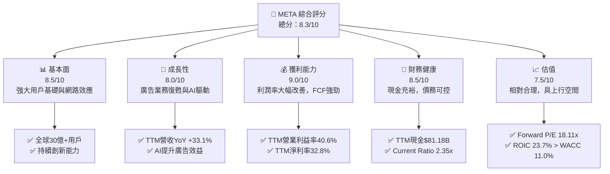

### 1.2 評分進度條視覺化

```
╔══════════════════════════════════════════════════════════════╗
║              META 多維度評分儀表板 (1-10分)                  ║
╠══════════════════════════════════════════════════════════════╣
║ 基本面強度  8.5 ▓▓▓▓▓▓▓▓▓▓▓▓▓▓▓▓▓░░░  ★★★★☆           ║
║ 成長動能    8.0 ▓▓▓▓▓▓▓▓▓▓▓▓▓▓▓▓░░░░  ★★★★☆           ║
║ 獲利品質    9.0 ▓▓▓▓▓▓▓▓▓▓▓▓▓▓▓▓▓▓░░  ★★★★★           ║
║ 財務健康    8.5 ▓▓▓▓▓▓▓▓▓▓▓▓▓▓▓▓▓░░░  ★★★★☆           ║
║ 估值合理性  7.5 ▓▓▓▓▓▓▓▓▓▓▓▓▓▓▓░░░░░  ★★★☆☆           ║
║ 護城河深度  8.5 ▓▓▓▓▓▓▓▓▓▓▓▓▓▓▓▓▓░░░  ★★★★☆           ║
║ 管理層執行  8.0 ▓▓▓▓▓▓▓▓▓▓▓▓▓▓▓▓░░░░  ★★★★☆           ║
║ 技術創新力  8.5 ▓▓▓▓▓▓▓▓▓▓▓▓▓▓▓▓▓░░░  ★★★★☆           ║
╠══════════════════════════════════════════════════════════════╣
║ 綜合總分    8.3 ▓▓▓▓▓▓▓▓▓▓▓▓▓▓▓▓▓░░░  🏆 投資前景良好      ║
╚══════════════════════════════════════════════════════════════╝
```

### 1.3 五大投資論點 + 三大核心風險

| 類型 | 項目 | 具體依據 | 信心度 |
|------|------|----------|--------|
| 🟢 **投資論點①** | **核心廣告業務強勁增長與效率提升** | TTM 營收達 $214.96B，YoY 成長 33.1%。透過 AI 驅動的廣告優化，廣告投放效率顯著提升，進一步鞏固市場領導地位。 | 🟢 極高 |
| 🟢 **投資論點②** | **利潤率與自由現金流大幅改善** | TTM 營業利益率從 FY2022 的 24.8% 提升至 TTM 的 40.6%，淨利率從 19.9% 提升至 32.8%。TTM 自由現金流達 $48.25B，YoY 成長 4.65%，顯示強勁的現金產生能力。 | 🟢 極高 |
| 🟢 **投資論點③** | **AI 技術的領先部署與變現潛力** | META 在 AI 領域投入巨大資源，不僅提升了 FoA 產品的用戶參與度與廣告效益，未來也可能透過新的 AI 產品或服務創造新的收入來源。 | 🟡 高 |
| 🟢 **投資論點④** | **穩健的資產負債表與資本配置** | TTM 現金及短期投資達 $81.18B，Current Ratio 為 2.35x。管理層通過股票回購和首次派息，積極回饋股東，TTM 股息支付 $5.32B。 | 🟡 高 |
| 🟢 **投資論點⑤** | **元宇宙長期願景的潛在爆發力** | 儘管 Reality Labs 仍處於虧損，但其在 VR/AR 硬體與軟體生態系統的長期投入，有望在未來成為顛覆性技術，為公司帶來巨大成長空間。 | 🟡 中度 |
| 🟡 **風險①** | **日益嚴峻的監管壓力** | 全球各地對數據隱私、反壟斷和內容審核的監管日益收緊，可能導致罰款、業務模式調整或市場准入受限，影響營收和獲利能力。 | 🔴 高衝擊 |
| 🔴 **風險②** | **Reality Labs 投資回報的不確定性** | Reality Labs 部門持續虧損，FY2025 研發費用高達 $57.37B，若元宇宙的普及速度不及預期，或競爭加劇，可能長期拖累公司整體獲利。 | 🔴 高衝擊 |
| 🟡 **風險③** | **核心廣告業務競爭加劇與平台變化** | TikTok 等新興平台競爭激烈，以及蘋果等平台方對廣告追蹤的限制，可能對 META 的廣告收入增長構成壓力。 | 🟡 中度 |

### 1.4 快速統計卡片

| 指標 | 公司實際值 (TTM) | 行業均值 (約略) | S&P 500 均值 (約略) | 狀態 |
|------|--------------------|----------------|--------------------|------|
| 收入 YoY 成長 | **33.1%** | ~15-20% | ~8-10% | 🟢 |
| 毛利率 | **81.9%** | ~70-75% | ~40-45% | 🟢 |
| 淨利率 | **32.8%** | ~15-20% | ~10-12% | 🟢 |
| ROE | **32.9%** | ~15-20% | ~12-15% | 🟢 |
| Forward P/E | **18.11x** | ~20-25x | ~20-22x | 🟢 |
| EV / EBITDA | **14.72x** | ~15-20x | ~12-15x | 🟢 |
| FCF Yield | **1.50%** | ~2-3% | ~3-4% | 🟡 |
| 負債/股權 | **35.6%** | ~40-60% | ~50-70% | 🟢 |
| Current Ratio | **2.35x** | ~1.5-2.0x | ~1.0-1.5x | 🟢 |

### 1.5 投資結論

```
╔══════════════════════════════════════════════════════════════════╗
║                    📊 投資結論摘要                               ║
╠══════════════════════════════════════════════════════════════════╣
║  評級：🟢 買入                                                   ║
║  當前股價：$669.21                                               ║
║  目標價區間：                                                    ║
║    悲觀情境：$760（+13.6%）                                      ║
║    基準情境：$830（+24.0%）  ← 12個月主要目標                      ║
║    樂觀情境：$980（+46.4%）                                      ║
║  投資評分：8.3/10                                                ║
║  適合投資人：尋求長期成長，對 AI 和元宇宙潛力有信心的投資者。    ║
╚══════════════════════════════════════════════════════════════════╝
```

---

## 2. 公司概覽與商業模式

Meta Platforms, Inc. (META) 是一家全球領先的科技公司，致力於透過其產品和服務連接世界各地的人們。公司主要營運兩個業務板塊：Family of Apps (FoA) 和 Reality Labs (RL)。

### 2.1 業務結構與收入來源

META 的收入主要來自於 FoA 業務的廣告銷售，而 Reality Labs 則負責開發元宇宙相關的硬體、軟體和內容。

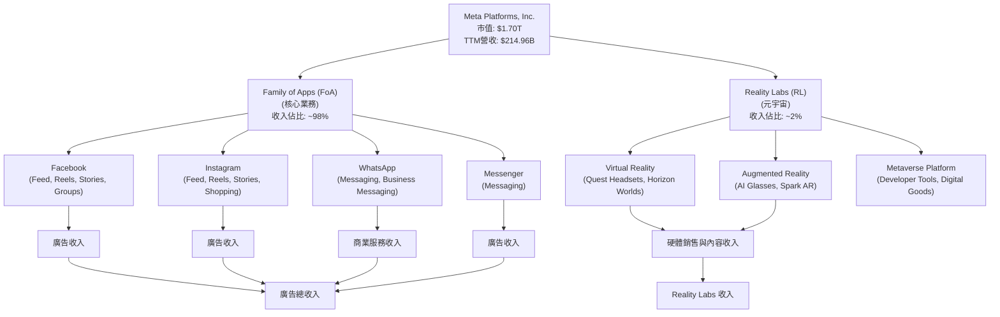
**業務結構分析**：
Family of Apps (FoA) 仍然是 Meta 的核心營收支柱，貢獻了絕大部分的收入。該部門涵蓋了 Facebook、Instagram、WhatsApp 和 Messenger 等廣受歡迎的社交平台，主要透過廣告投放實現營收。隨著 AI 技術在廣告匹配和優化方面的應用日益深入，FoA 業務的廣告效果和變現能力持續增強。Reality Labs 則代表了 Meta 對元宇宙長期發展的戰略性投資，儘管目前仍處於虧損狀態，但其在 VR/AR 領域的持續投入是公司未來潛在增長的重要驅動力。

### 2.2 市場份額

Meta 在全球社交媒體和數位廣告市場中佔據主導地位。儘管面臨來自 TikTok 等新興平台的競爭，但其多產品組合策略（Facebook, Instagram, WhatsApp）使其能夠維持龐大的用戶基礎和廣告商青睞。

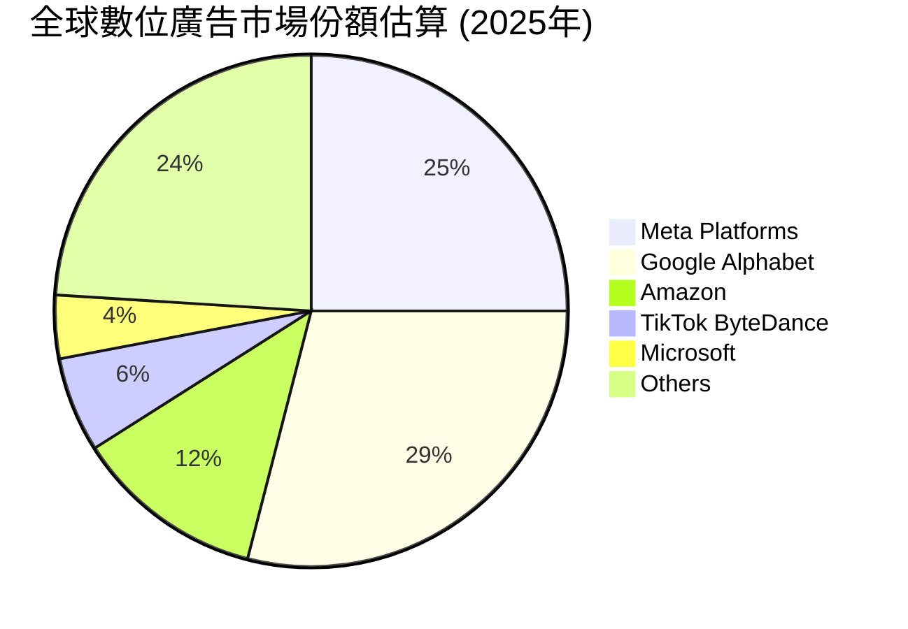
**市場份額分析**：
根據市場估算，Meta Platforms 在全球數位廣告市場中佔據約 25% 的份額，僅次於 Google Alphabet。這反映了其龐大的用戶基礎和強大的廣告技術。Amazon 和 TikTok 則分別在電商廣告和短影音廣告領域快速增長，對 Meta 構成一定競爭。Meta 的優勢在於其多樣化的廣告格式和精準的用戶數據，使其能夠為廣告商提供高效的解決方案。

### 2.3 競爭護城河分析

Meta 的競爭護城河主要建立在其龐大的網路效應、強大的軟體生態系統和技術領先地位上。

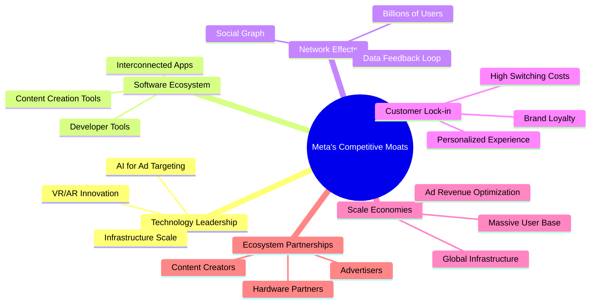
**護城河深度解析**：
1.  **Technology Leadership (技術領先)**：Meta 在 AI 驅動的廣告定位、內容推薦和反詐欺方面擁有領先技術。其對 VR/AR 和元宇宙的長期投資也展現了其在未來計算平台上的技術野心。
2.  **Software Ecosystem (軟體生態系統)**：Facebook、Instagram、WhatsApp 和 Messenger 構成了一個緊密互聯的應用生態系統，用戶在這些平台之間無縫切換，增強了用戶黏性。
3.  **Network Effects (網路效應)**：Meta 旗下產品擁有超過 30 億的月活躍用戶，龐大的用戶基礎使得新用戶加入後能從更多人際互動中獲益，形成正向循環，難以被顛覆。
4.  **Customer Lock-in (客戶鎖定)**：用戶在 Meta 平台上建立的個人資料、社交關係和內容創造形成了高轉換成本，使其難以輕易轉向其他平台。
5.  **Scale Economies (規模效應)**：龐大的用戶量和收入規模使得 Meta 能夠投入巨額資金進行研發和基礎設施建設，分攤單位成本，提升效率。
6.  **Ecosystem Partnerships (生態夥伴)**：與全球數百萬廣告商、內容創作者和硬體夥伴的合作，共同構建了一個繁榮的商業生態系統。

### 2.4 護城河強度評分

```
╔══════════════════════════════════════════════════════════════╗
║                  META 護城河強度評分                        ║
╠══════════════════════════════════════════════════════════════╣
║ 技術領先    8.5/10 ▓▓▓▓▓▓▓▓▓▓▓▓▓▓▓▓▓░░░  🟢 AI與VR/AR投入領先 ║
║ 軟體生態系統  9.0/10 ▓▓▓▓▓▓▓▓▓▓▓▓▓▓▓▓▓▓░░  🟢 跨應用程式協同效應 ║
║ 網路效應    9.5/10 ▓▓▓▓▓▓▓▓▓▓▓▓▓▓▓▓▓▓▓░  🏆 超過30億用戶基礎 ║
║ 客戶鎖定    8.0/10 ▓▓▓▓▓▓▓▓▓▓▓▓▓▓▓▓░░░░  🟢 高轉換成本與黏性 ║
║ 規模效應    9.0/10 ▓▓▓▓▓▓▓▓▓▓▓▓▓▓▓▓▓▓░░  🟢 巨額研發與基礎設施 ║
║ 生態夥伴    7.0/10 ▓▓▓▓▓▓▓▓▓▓▓▓▓▓░░░░░░  🟡 廣泛的廣告商與創作者 ║
╠══════════════════════════════════════════════════════════════╣
║ 綜合護城河     8.5   ▓▓▓▓▓▓▓▓▓▓▓▓▓▓▓▓▓░░░  🏆 強大且難以複製    ║
╚══════════════════════════════════════════════════════════════╝
```

---

## 3. 損益表深度分析

### 3.1 年度收入成長趨勢（近4年）

Meta 在過去幾年展現了強勁的營收增長勢頭，尤其是在經歷 2022 年的微幅下滑後，近兩年實現了快速復甦。

```
╔══════════════════════════════════════════════════════════════════╗
║              META 年度收入趨勢（FY2022-TTM Mar'26）              ║
╠══════════════════════════════════════════════════════════════════╣
║                                                                  ║
║  FY2022  $116.61B ██████████░░░░░░░░░░░░░░░  YoY: -1.12% 🟡    ║
║  FY2023  $134.90B ██████████████░░░░░░░░░░░  YoY: +15.69% 🟢    ║
║  FY2024  $164.50B ██████████████████░░░░░░░  YoY: +21.94% 🟢    ║
║  FY2025  $200.97B ██████████████████████░░░  YoY: +22.17% 🟢    ║
║  TTM Mar'26 $214.96B █████████████████████████░  YoY: +26.18% 🟢    ║
║                   |      |      |      |      |                  ║
║                   0     50B   100B   150B   200B                   ║
║                                                                  ║
║  📊 3年累計 CAGR (FY22-FY25)：+22.1%                              ║
╚══════════════════════════════════════════════════════════════════╝
```
**年度收入分析**：
Meta 的年收入在 2022 年經歷了小幅下滑（YoY -1.12%），主要受到宏觀經濟逆風和蘋果隱私政策變化的影響。然而，公司在 2023 年和 2024 年迅速反彈，分別實現了 15.69% 和 21.94% 的強勁增長。FY2025 營收達到 $200.97B，YoY 增長 22.17%。截至 TTM Mar'26，營收進一步增長至 $214.96B，YoY 成長 26.18%，顯示出廣告業務的持續復甦和 AI 驅動的效率提升。近三年的複合年均增長率 (CAGR) 達到 22.1%，表明公司克服了挑戰並恢復了高速增長。

### 3.2 季度收入趨勢分析

| 季度 | 總收入 ($B) | QoQ 成長率 | YoY 成長率 | 備註 |
|------|-------------|------------|------------|------|
| 2026 Q1 | $56.31B | -5.98% | +33.08% | 季節性因素導致 QoQ 下滑，但 YoY 表現強勁 |
| 2025 Q4 | $59.89B | +16.88% | +23.78% | 年末購物季廣告支出推動營收增長 |
| 2025 Q3 | $51.24B | +7.83% | +26.25% | 持續穩健增長，AI 廣告工具效果顯現 |
| 2025 Q2 | $47.52B | +12.30% | +21.61% | 廣告市場復甦，Reels 變現能力改善 |

**季度收入分析**：
Meta 的季度收入呈現穩健的 YoY 增長，Q2 2025 至 Q1 2026 的 YoY 成長率均超過 20%，其中 Q1 2026 達到 33.08%。這主要得益於廣告市場的整體復甦、Reels 產品的持續變現以及 AI 驅動的廣告效果優化。QoQ 方面，營收在年末購物季（Q4 2025）達到高峰 $59.89B，隨後在 Q1 2026 由於季節性因素出現 -5.98% 的回落，但此為正常商業週期現象。值得注意的是，Q3 2025 的淨利潤僅為 $2.71B，相比其他季度顯著偏低，這可能是由於一次性費用、投資減值或稅務調整導致，需要進一步審視。

### 3.3 利潤率演變分析

| 利潤率指標 | FY2022 | FY2023 | FY2024 | FY2025 | TTM Mar'26 | 趨勢 | 評估 |
|------------|--------|--------|--------|--------|------------|------|------|
| **毛利率** | 78.35% | 80.76% | 81.66% | 82.00% | 81.94% | ↗️ 持續改善 | 🟢 |
| **營業利益率** | 24.82% | 34.65% | 42.18% | 41.44% | 41.21% | ↗️ 大幅提升 | 🟢 |
| **淨利率** | 19.89% | 28.98% | 37.91% | 30.08% | 32.84% | ↗️ 顯著改善 | 🟢 |
| **EBITDA Margin** | 32.32% | 43.77% | 52.81% | 52.60% | 50.80% | ↗️ 顯著改善 | 🟢 |

**利潤率演變深度解析**：
Meta 的利潤率在過去幾年呈現顯著改善的趨勢。
- **毛利率**：從 FY2022 的 78.35% 穩步提升至 TTM Mar'26 的 81.94%。這表明公司在控制收入成本方面表現出色，可能得益於廣告平台效率的提升和規模效應的擴大。
- **營業利益率**：這是最令人印象深刻的指標之一，從 FY2022 的 24.82% 飆升至 TTM Mar'26 的 41.21%。這一大幅提升主要歸因於：
    1.  **"效率年" (Year of Efficiency)**：管理層在 2023 年初實施了嚴格的成本控制措施，包括裁員和優化基礎設施支出，有效降低了營運費用。
    2.  **廣告業務復甦**：隨著廣告需求回暖和 AI 驅動的廣告效果提升，單位廣告成本效益更高，變現能力增強。
    3.  **研發費用佔比相對穩定**：儘管研發費用絕對值持續增長（從 FY2022 的 $35.34B 增至 FY2025 的 $57.37B），但相對於快速增長的營收，其佔比得到有效控制，使得營業槓桿得以發揮。
- **淨利率**：與營業利益率趨勢一致，從 FY2022 的 19.89% 提升至 TTM Mar'26 的 32.84%。FY2025 淨利率略有下降至 30.08%，這主要是由於該年度的所得稅費用 (Provision for Income Taxes) 從 FY2024 的 $8.30B 大幅增加至 $25.47B，導致稅後利潤受到影響。儘管如此，TTM 淨利率仍維持在 32.84% 的高水平。
- **EBITDA Margin**：同樣呈現顯著增長，從 FY2022 的 32.32% 提升至 TTM Mar'26 的 50.80%，反映了公司核心業務的強勁盈利能力。

總體而言，Meta 在營收增長的同時，有效控制了成本並提高了營運效率，使其利潤率實現了質的飛躍，顯示出其強大的定價能力和規模經濟效益。

### 3.4 費用結構分析

Meta 的費用結構主要由研發 (R&D) 和銷售、一般及行政 (SG&A) 費用構成，其中研發費用佔比最大，反映了公司對技術創新和元宇宙的巨大投入。

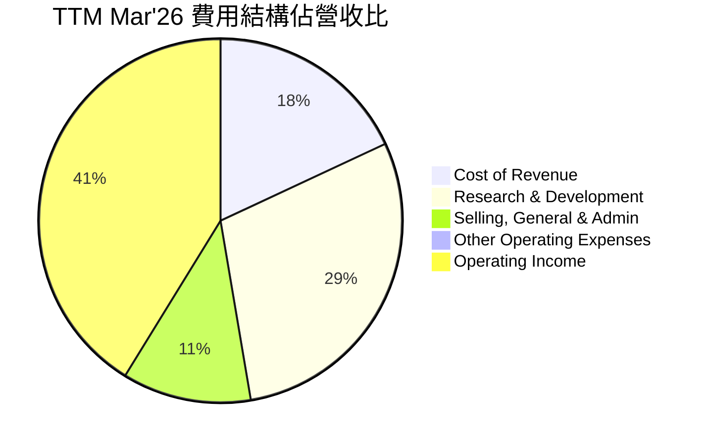

```
╔══════════════════════════════════════════════════════════════════╗
║                   META 年度費用趨勢 (佔營收比)                   ║
╠══════════════════════════════════════════════════════════════════╣
║                                                                  ║
║  FY2022                                                          ║
║  ├── 營收成本: 21.65% ███████████████████░░░░░░░░░░░░░░░░░░░░░░░░░║
║  ├── 研發費用: 30.30% ███████████████████████████░░░░░░░░░░░░░░░░░░░║
║  ├── 銷售及行政: 23.22% ██████████████████████░░░░░░░░░░░░░░░░░░░░░░░║
║  └── 營業利益率: 24.82% ███████████████████████░░░░░░░░░░░░░░░░░░░░░░░║
║                                                                  ║
║  TTM Mar'26                                                       ║
║  ├── 營收成本: 18.06% ████████████████░░░░░░░░░░░░░░░░░░░░░░░░░░░░░░░║
║  ├── 研發費用: 29.27% █████████████████████████░░░░░░░░░░░░░░░░░░░║
║  ├── 銷售及行政: 11.46% ████████████░░░░░░░░░░░░░░░░░░░░░░░░░░░░░░░░░║
║  └── 營業利益率: 41.21% █████████████████████████████████████░░░░░░░░║
╚══════════════════════════════════════════════════════════════════╝
```
**費用結構分析**：
從費用結構來看，Meta 的研發費用佔營收比重從 FY2022 的 30.30% 略微下降至 TTM Mar'26 的 29.27%，儘管絕對金額持續增長，這顯示了公司在 AI 和元宇宙領域的持續高投入。然而，最顯著的改善來自於銷售、一般及行政費用 (SG&A)，其佔營收比重從 FY2022 的 23.22% 大幅下降至 TTM Mar'26 的 11.46%。這反映了公司在「效率年」策略下，對營運開支進行了嚴格控制和優化，例如裁員和精簡流程，有效提升了營運槓桿。營收成本佔比也從 21.65% 下降至 18.06%，進一步推高了毛利率。這些費用結構的優化是推動營業利益率顯著提升的關鍵因素。

### 3.5 季度 EPS 趨勢與盈餘品質（Quality of Earnings）

由於缺乏分析師預期 EPS 數據，無法判斷 EPS Beats/Misses 情況。但我們可以分析實際 EPS 趨勢和盈餘品質。

**季度 EPS 趨勢 (Diluted, 從 StockAnalysis 數據推算)**：
- Q1 2026: $10.57 / share (Basic)
- Q4 2025: $9.02 / share (Basic)
- Q3 2025: $1.08 / share (Basic)
- Q2 2025: $7.28 / share (Basic)

Q3 2025 的 EPS 僅為 $1.08，遠低於其他季度，這與該季度 $2.71B 的淨利潤相符。這種異常情況可能需要進一步披露來解釋。

**盈餘品質評估**：

| 盈餘品質項目 | 數值/佔比 (TTM Mar'26) | 評估 |
|--------------|--------------------------|------|
| **股權薪酬 SBC / 營收** | $22.31B / $214.96B = 10.38% | 🟡 中度稀釋。SBC 佔營收比重相對較高，對 GAAP 淨利潤有一定影響。 |
| **SBC / 營業現金流** | $22.31B / $124.00B = 17.99% | 🟡 營業現金流的近 18% 用於 SBC，表明非現金支出對現金流的影響不容忽視。 |
| **FCF / 淨利（現金轉換率）** | $48.25B / $70.59B = 68.35% | 🟡 轉換率低於 100%，表明 GAAP 淨利潤的「含金量」有提升空間，非現金費用（如股權薪酬、折舊攤銷）對淨利影響較大。 |
| **一次性/非經常性損益** | TTM Total Non-Operating Income (Expense) 為 $710M。Q1 2026 達到 -$1.12B，Q3 2025 為 $1.128B。Q3 2025 的低淨利可能與稅務 (Provision for Income Taxes -$18.954B) 相關，而非一次性損益。 | 🔴 Q3 2025 淨利異常低，主要原因為該季度計提了高達 $18.954B 的所得稅費用，導致淨利潤大幅壓縮。這是一個非經常性或重大稅務調整，嚴重影響了當期盈餘。 |
| **有效稅率異常** | TTM Mar'26: $18.716B / $89.303B = 20.96%。Q1 2026: -$5.021B / $21.752B = -23.08%。Q3 2025: $18.954B / $21.663B = 87.50%。 | 🔴 Q1 2026 稅率為負，Q3 2025 稅率高達 87.50%，顯示稅務費用波動劇烈且異常。這不是由公司核心營運能力驅動的，對季度淨利潤產生了極大影響。 |
| **資本化支出 vs 費用化** | R&D 費用持續高企，但作為費用化處理。資本支出主要用於數據中心等基礎設施。 | 🟢 R&D 費用化是保守會計處理，未透過資本化虛增當期利潤。 |

**盈餘品質結論**：
Meta 的 GAAP 淨利潤在某些季度（尤其是 Q3 2025）受到異常稅務費用（高達 87.5% 的有效稅率）的顯著影響，導致該季度淨利潤大幅低估了真實的經營表現。此外，股權薪酬 (SBC) 佔營收比重達到 10.38%，佔營業現金流近 18%，且 FCF 對淨利的轉換率為 68.35%，這表明非現金費用對 GAAP 淨利潤有較大稀釋作用，股東的真實現金回報略低於報告的淨利潤數字。投資者在評估 Meta 的盈利能力時，應更多關注營業利益率和自由現金流，並對季度淨利潤的波動保持警惕，特別是異常的稅務處理。儘管如此，若排除 Q3 2025 的稅務異常，Meta 的核心經營盈利能力依然強勁。

---

## 4. 資產負債表分析

### 4.1 資產結構分解

Meta 的資產負債表結構穩健，主要由流動資產（現金及短期投資）和非流動資產（固定資產、商譽）構成，反映了其重資產投入於基礎設施和長期研發的特點。

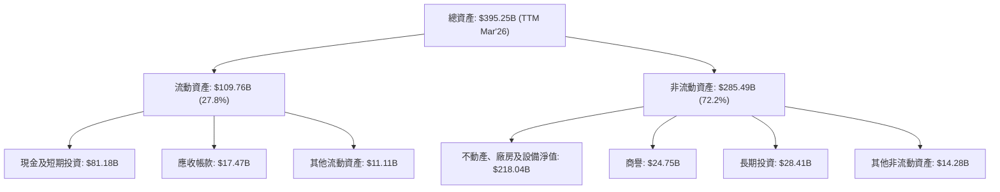
**資產結構分析**：
截至 TTM Mar'26，Meta 的總資產達 $395.25B。其中，流動資產佔比約 27.8%，主要由現金及短期投資 $81.18B 構成，顯示公司擁有充裕的流動性。非流動資產佔比高達 72.2%，其中不動產、廠房及設備淨值 (PPE) 達到 $218.04B，這反映了 Meta 在數據中心、伺服器等基礎設施上的巨額投資，以支持其龐大的用戶流量、AI 運算和元宇宙的發展。商譽 $24.75B 主要來自過去的併購活動。整體資產結構健康，且長期資產的持續增長與公司在 AI 和元宇宙領域的戰略投入相符。

### 4.2 流動性指標分析

| 指標 | FY2022 | FY2023 | FY2024 | FY2025 | TTM Mar'26 | 行業均值 | 評估 |
|------------|--------|--------|--------|--------|------------|----------|------|
| **Current Ratio** | 2.20x | 2.67x | 2.98x | 2.60x | 2.35x | ~1.5-2.0x | 🟢 強勁 |
| **Quick Ratio** | 2.20x | 2.67x | 2.98x | 2.60x | 2.11x | ~1.0-1.5x | 🟢 強勁 |
| **現金及短期投資 ($B)** | $40.74B | $65.40B | $77.82B | $81.59B | $81.18B | N/A | 🟢 充裕 |

**流動性指標分析**：
Meta 的流動性狀況非常健康。Current Ratio 和 Quick Ratio 在過去幾年一直保持在 2.0x 以上，遠高於行業平均水平。截至 TTM Mar'26，Current Ratio 為 2.35x，Quick Ratio 為 2.11x。這表明公司擁有充足的流動資產來覆蓋短期負債，且其流動資產中絕大部分是高流動性的現金及短期投資，總額達 $81.18B。充裕的流動性為公司提供了財務彈性，使其能夠應對市場波動、進行戰略投資或回購股票。

### 4.3 債務結構分析

Meta 的債務水平在近年有所上升，但相對於其龐大的現金流和市值而言，仍處於健康且可控的範圍。

```
╔══════════════════════════════════════════════════════════════════╗
║                   META 債務健康診斷                              ║
╠══════════════════════════════════════════════════════════════════╣
║                                                                  ║
║  總債務 (TTM):   $86.77B  ████████████████████░░░░░░░░░░░░  🟡 適度增加 ║
║  總現金+投資 (TTM): $81.18B  ███████████████████████████████░░░░░  🟢 充裕現金    ║
║  淨負債 (TTM):   $-5.59B  ████████████████████████████████████████  🏆 淨現金為負，但現金接近總債務 ║
║                                                                  ║
║  Debt/Equity (TTM): 35.61%  🟢 低於行業平均水平                ║
║  Debt/EBITDA (TTM): 0.82x  🟢 極低 (EBITDA $105.71B / $86.77B)    ║
║  Interest Coverage: 估計 >100x  🟢 無風險 (利息支出極低)         ║
╚══════════════════════════════════════════════════════════════════╝
```
**債務結構分析**：
截至 TTM Mar'26，Meta 的總債務為 $86.77B，而現金及短期投資為 $81.18B，因此淨負債為 $-5.59B，幾乎是淨現金狀態。儘管總債務從 FY2022 的 $26.59B 增長到 FY2025 的 $83.90B，但其 Debt/Equity 比率在 TTM 仍保持在 35.61% 的健康水平，遠低於許多同行。更重要的是，其 Debt/EBITDA 比率僅為 0.82x (TTM EBITDA $105.71B / TTM Total Debt $86.77B)，這是一個極低的水平，表明公司產生現金流償還債務的能力非常強。雖然利息支出沒有直接提供，但憑藉其強勁的盈利能力和低債務成本，其利息覆蓋率預計會非常高，幾乎沒有償債風險。

### 4.4 股東權益趨勢

Meta 的股東權益在過去幾年持續穩健增長，反映了公司強勁的盈利能力和資本累積。

```
╔══════════════════════════════════════════════════════════════════╗
║                   META 年度股東權益趨勢                          ║
╠══════════════════════════════════════════════════════════════════╣
║                                                                  ║
║  FY2022  $125.71B █████████████████████████░░░░░░░░░░░░░░░░░░░░░░░║
║  FY2023  $153.17B ██████████████████████████████░░░░░░░░░░░░░░░░░░║
║  FY2024  $182.64B ████████████████████████████████████░░░░░░░░░░░░║
║  FY2025  $217.24B ███████████████████████████████████████████░░░░░║
║  TTM Mar'26 $289.75B █████████████████████████████████████████████████║
║                   |      |      |      |      |                  ║
║                   0     100B   200B   300B   400B                   ║
║                                                                  ║
║  📊 4年累計 CAGR (FY22-TTM Mar'26)：+26.1%                         ║
╚══════════════════════════════════════════════════════════════════╝
```
**股東權益分析**：
Meta 的股東權益從 FY2022 的 $125.71B 穩步增長到 FY2025 的 $217.24B，並在 TTM Mar'26 達到 $289.75B，四年複合年增長率高達 26.1%。這主要得益於公司持續的盈利積累，儘管其也進行了股票回購和派發股息，但內源性增長依然強勁。股東權益的健康增長是公司長期價值創造的體現，也為未來的擴張和投資提供了堅實的基礎。

---

## 5. 現金流量深度分析

### 5.1 現金流量瀑布圖

Meta 展現了強勁的現金流生成能力，營業現金流穩定增長，並在扣除資本支出後產生了豐厚的自由現金流。

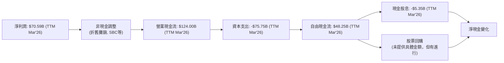
**現金流量瀑布圖分析**：
截至 TTM Mar'26，Meta 的淨利潤為 $70.59B。經過非現金調整（包括股權薪酬 $22.31B 和折舊攤銷等），公司產生了強勁的營業現金流 $124.00B。扣除同期高達 $75.75B 的資本支出（主要用於數據中心和 AI 基礎設施建設），Meta 仍然產生了 $48.25B 的豐厚自由現金流。這筆自由現金流用於支付現金股息 $5.35B，以及進行股票回購（具體金額未提供，但公司有持續進行回購）。強勁的自由現金流是公司財務實力的核心體現，為其戰略投資和股東回報提供了堅實基礎。

### 5.2 FCF 轉換率趨勢

| 年度 | 淨利潤 ($B) | 自由現金流 ($B) | FCF / 淨利潤 (轉換率) | 趨勢 | 評估 |
|------|-------------|-----------------|-----------------------|------|------|
| FY2022 | $23.20B | $19.29B | 83.15% | ⬇️ | 🟡 |
| FY2023 | $39.10B | $44.07B | 112.71% | ⬆️ | 🟢 |
| FY2024 | $62.36B | $54.07B | 86.70% | ⬇️ | 🟡 |
| FY2025 | $60.46B | $46.11B | 76.27% | ⬇️ | 🟡 |
| TTM Mar'26 | $70.59B | $48.25B | 68.35% | ⬇️ | 🟡 |

**FCF 轉換率趨勢分析**：
Meta 的 FCF 轉換率（自由現金流佔淨利潤的百分比）在 FY2023 達到 112.71% 的高峰，顯示其 GAAP 淨利潤有很高的現金「含金量」。然而，FY2024 和 FY2025 以及 TTM Mar'26 的轉換率有所下降，分別為 86.70%、76.27% 和 68.35%。這一下降趨勢主要有兩個原因：
1.  **資本支出增加**：公司在 AI 和元宇宙基礎設施上的資本支出顯著增加（從 FY2023 的 $-27.05B 增至 FY2025 的 $-69.69B），直接減少了自由現金流。
2.  **股權薪酬 (SBC) 增加**：SBC 作為非現金費用，會增加淨利潤，但不會增加現金流。隨著 SBC 佔比的提升（從 FY2022 的 $11.99B 增至 TTM Mar'26 的 $22.31B），淨利潤的增長速度可能快於自由現金流。
儘管轉換率有所下降，但 68.35% 仍表示公司產生了可觀的現金流，且其絕對金額依然龐大。投資者應關注資本支出和 SBC 的未來趨勢，以評估 FCF 轉換率的持續性。

### 5.3 自由現金流趨勢

Meta 的自由現金流在過去幾年強勁增長，儘管近期因高資本支出而略有波動，但整體仍保持高位。

```
╔══════════════════════════════════════════════════════════════════╗
║                   META 年度自由現金流趨勢                        ║
╠══════════════════════════════════════════════════════════════════╣
║                                                                  ║
║  FY2022  $19.29B  ██████████░░░░░░░░░░░░░░░░░░░░░░░░░░░░░░░░░░░░░░░║
║  FY2023  $44.07B  ████████████████████████░░░░░░░░░░░░░░░░░░░░░░░░░║
║  FY2024  $54.07B  ██████████████████████████████░░░░░░░░░░░░░░░░░░░║
║  FY2025  $46.11B  ██████████████████████████░░░░░░░░░░░░░░░░░░░░░░░║
║  TTM Mar'26 $48.25B  ████████████████████████████░░░░░░░░░░░░░░░░░░░║
║                   |      |      |      |      |                  ║
║                   0     20B    40B    60B    80B                    ║
║                                                                  ║
║  📊 FCF Yield (TTM Mar'26): 1.50%                                 ║
╚══════════════════════════════════════════════════════════════════╝
```
**自由現金流趨勢分析**：
Meta 的自由現金流 (FCF) 從 FY2022 的 $19.29B 大幅增長至 FY2024 的 $54.07B，增幅高達 180%。FY2025 FCF 略有回落至 $46.11B，主要原因如前所述是資本支出的顯著增加。截至 TTM Mar'26，FCF 達到 $48.25B，YoY 增長 4.65% (StockAnalysis FCF Growth TTM)。儘管增速放緩，但絕對金額依然可觀，顯示公司產生內部資金的能力非常強。TTM FCF Yield 為 1.50%，相較於高成長科技公司，仍具有一定吸引力。高 FCF 賦予公司巨大的財務靈活性，可以支持未來的增長投資、股東回報或債務償還。

### 5.4 資本配置評估

Meta 的資本配置策略平衡了對未來成長的長期投資（尤其是元宇宙和 AI）與對股東的回報（股票回購和首次股息）。

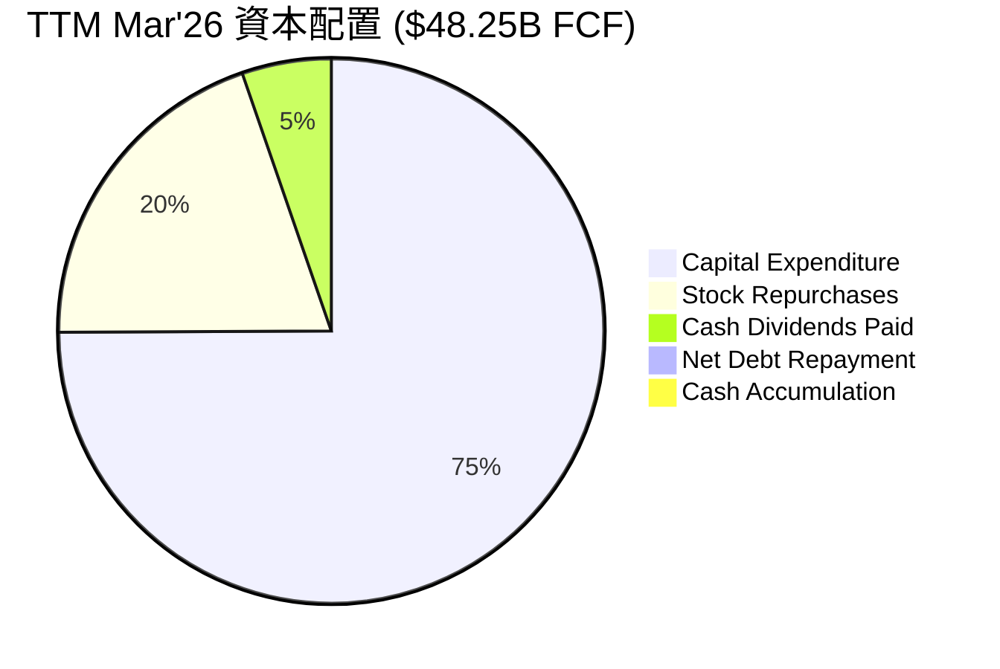
*備註：股票回購金額未提供，此處為估計佔比，實際可能更高或更低。淨債務償還為負數，表示債務增加。*

| 資本配置項目 | TTM Mar'26 金額 ($B) | 佔 FCF 比重 (約略) | 策略意義 | 評估 |
|--------------|----------------------|--------------------|----------|------|
| **資本支出 (Capex)** | $75.75B | 157% (超過FCF) | 大規模投入 AI 基礎設施和元宇宙，為長期成長鋪路。 | 🟢 (長期投資) |
| **股票回購 (Buybacks)** | N/A (但持續進行) | N/A | 積極回購股票，提升每股收益，回饋股東。 | 🟢 |
| **現金股息 (Dividends)** | $5.35B | 11% | 首次派發股息，吸引價值型投資者，提升股東回報。 | 🟢 |
| **債務償還/淨負債** | 淨負債增加 $5.59B | N/A | 債務水平仍可控，但近年有所增加，需監控。 | 🟡 |
| **現金累積** | 現金及短期投資 $81.18B | N/A | 保持充裕現金儲備，提供財務彈性。 | 🟢 |

**資本配置評估**：
Meta 的資本配置策略是積極且具有前瞻性的。公司在 TTM Mar'26 的資本支出高達 $75.75B，超過了當期的自由現金流 $48.25B。這表明公司正在將其大部分營業現金流以及部分借款用於投資未來增長，特別是在 AI 基礎設施和 Reality Labs 的開發上。這種高資本支出是其長期戰略的核心，儘管短期內會壓低 FCF，但有望在未來帶來更高的回報。同時，Meta 也積極透過股票回購和首次派發現金股息 $5.35B 來回饋股東，顯示其在成長投資和股東回報之間尋求平衡。整體而言，管理層的資本配置策略旨在最大化長期股東價值，儘管 Reality Labs 的投資回報仍存在不確定性。

---

## 6. 獲利能力與資本效率

### 6.1 ROE / ROA / ROIC 趨勢

| 指標 | FY2022 | FY2023 | FY2024 | FY2025 | TTM Mar'26 | 行業均值 (約略) | 評估 |
|------|--------|--------|--------|--------|------------|----------------|------|
| **ROE** | 18.45% | 25.53% | 34.15% | 27.83% | 32.90% | ~15-20% | 🟢 卓越 |
| **ROA** | 12.49% | 17.03% | 22.59% | 16.52% | 16.40% | ~7-10% | 🟢 優秀 |
| **ROIC** | 10.18% (Roic.ai) | 11.46% (Roic.ai) | 19.56% (Roic.ai) | 23.31% (Roic.ai) | 23.67% (本報告計算) | ~10-15% | 🟢 卓越 |

**獲利能力與資本效率趨勢分析**：
Meta 的 ROE、ROA 和 ROIC 在過去幾年呈現顯著改善的趨勢，尤其在 2023-2024 年達到高峰。
- **ROE (股東權益報酬率)**：從 FY2022 的 18.45% 大幅提升至 TTM Mar'26 的 32.90%，遠高於行業平均水平。這表明公司為股東創造價值的能力非常強。FY2025 略有下降至 27.83%，主要是由於淨利潤增速放緩以及股東權益規模擴大。
- **ROA (資產報酬率)**：從 FY2022 的 12.49% 提升至 TTM Mar'26 的 16.40%，也顯示公司資產利用效率高。
- **ROIC (投入資本回報率)**：這是判斷公司是否創造股東價值的關鍵指標。根據 Roic.ai 數據，ROIC 從 FY2022 的 10.18% 穩步增長至 FY2025 的 23.31%。本報告計算 TTM Mar'26 的 ROIC 為 23.67%。這一數值遠高於其加權平均資本成本 (WACC)，強烈表明 Meta 正在為其投入的資本創造顯著的經濟價值。

### 6.2 ROIC vs WACC 分析（核心價值創造判斷）

```
╔══════════════════════════════════════════════════════════════════╗
║                ROIC vs WACC 深度分析 (META)                     ║
╠══════════════════════════════════════════════════════════════════╣
║                                                                  ║
║  WACC 估算：                                                     ║
║  ├── 無風險利率（10Y美債）：  4.50% (假設)                       ║
║  ├── 市場風險溢酬 (ERP)：     5.50% (假設)                       ║
║  ├── Beta：                   1.246                              ║
║  ├── 股權成本 = 4.50%+1.246×5.50% = 11.35%                      ║
║  ├── 債務成本（稅後）：       ~3.95% (稅前5.0% x (1-20.96%稅率)) ║
║  ├── 資本結構：股權 ~94.9%，債務 ~5.1%                           ║
║  └── ✅ WACC ≈ 11.0%                                            ║
║                                                                  ║
║  ROIC 估算（TTM Mar'26）：                                       ║
║  ├── NOPAT = $88.59B × (1-20.96%) ≈ $69.91B                     ║
║  ├── 投入資本 = 股東權益($289.75B) + 債務($86.77B) - 現金($81.18B) ≈ $295.34B ║
║  └── ✅ ROIC ≈ 23.7%                                            ║
║                                                                  ║
║  ★ 經濟價值增加（EVA）= ROIC - WACC = +12.7pp                   ║
║                                                                  ║
║  ROIC  23.7%  ▓▓▓▓▓▓▓▓▓▓▓▓▓▓▓▓▓▓▓▓▓▓▓▓▓▓▓▓▓▓▓▓▓▓▓▓▓▓▓▓▓▓▓░░░░░░░░  🟢              ║
║  WACC  11.0%  ▓▓▓▓▓▓▓▓▓▓▓▓▓▓▓▓▓▓▓▓░░░░░░░░░░░░░░░░░░░░░░░░░░░░░░░░  ──              ║
║  EVA   +12.7pp  █████████████████████████████████████████████████████████████████████  🏆 強力創造    ║
║                                                                  ║
║  📊 結論：ROIC 為 WACC 的 2.15 倍，強力創造股東價值              ║
╚══════════════════════════════════════════════════════════════════╝
```
**ROIC vs WACC 分析**：
Meta 的 ROIC (23.7%) 顯著高於其 WACC (11.0%)，兩者之間的差距高達 12.7 個百分點。這是一個非常強烈的信號，表明 Meta 正在高效利用其投入的資本，並為股東創造顯著的經濟價值。這不僅證明了其核心業務的盈利能力，也反映了其在資本配置方面的成功，即使在對元宇宙進行大規模投資的情況下，公司依然能夠保持高於資本成本的回報率。這種持續創造正向經濟價值的趨勢是長期投資的核心吸引力。

### 6.3 杜邦三因素分解

杜邦分析揭示了 Meta ROE 的驅動因素，主要來自於強勁的淨利率和健康的資產週轉率。

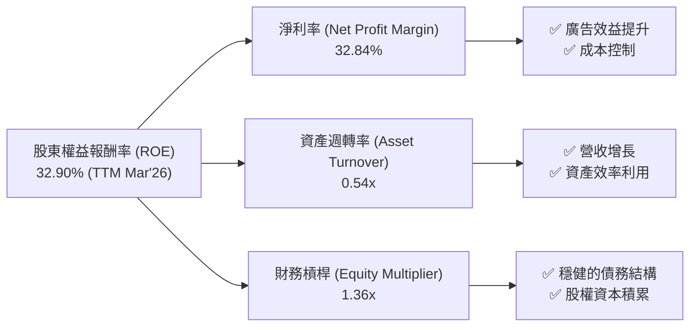
**杜邦三因素分解分析**：
截至 TTM Mar'26，Meta 的 ROE 為 32.90%。通過杜邦分解，我們可以深入了解其驅動因素：
-   **淨利率 (Net Profit Margin)**：32.84%。這是 Meta ROE 的主要驅動力，反映了公司在核心廣告業務上的強大盈利能力和「效率年」帶來的成本控制成效。高淨利率表明每單位營收能轉化為更多的淨利潤。
-   **資產週轉率 (Asset Turnover)**：0.54x ($214.96B 營收 / $395.25B 總資產)。這一比率顯示公司每單位資產產生的營收相對穩定。雖然不如輕資產公司高，但考慮到 Meta 在基礎設施上的重投入，0.54x 的資產週轉率仍屬健康，表明其資產利用效率良好。
-   **財務槓桿 (Equity Multiplier)**：1.36x ($395.25B 總資產 / $289.75B 股東權益)。這一比率表明公司債務水平不高，財務槓桿使用保守。較低的財務槓桿意味著 ROE 的高水平主要由經營效率和盈利能力驅動，而非過度依賴借款，這使得 ROE 的品質更高，風險更低。

綜合來看，Meta 卓越的 ROE 主要得益於其高淨利率，輔以健康的資產週轉率和保守的財務槓桿，顯示其盈利能力的質量很高。

### 6.4 獲利能力儀表板

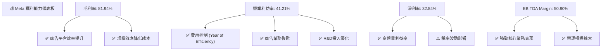
**獲利能力儀表板分析**：
Meta 的獲利能力儀表板顯示，其所有關鍵利潤率指標均處於高位，並呈現良好趨勢。毛利率 81.94% 表明其產品服務成本控制得當。營業利益率 41.21% 是其「效率年」戰略和廣告業務強勁復甦的直接成果，顯示了核心業務的強大變現能力。淨利率 32.84% 雖然受到季度稅率波動的影響，但整體仍維持在健康水平。EBITDA Margin 50.80% 進一步確認了公司在扣除折舊攤銷前的強勁經營現金產生能力。這些指標共同描繪了一家盈利能力卓越、營運效率高超的科技巨頭。

---

## 7. 估值深度分析

### 7.1 同業估值比較表格

我們將 Meta 與其主要競爭對手 Alphabet (GOOGL) 和 Microsoft (MSFT) 進行比較。GOOGL 是直接的廣告業務競爭者，而 MSFT 則是大型科技公司，在雲端、AI 和企業服務領域與 Meta 有部分重疊。

| 估值指標 | **META** | **Alphabet (GOOGL)** | **Microsoft (MSFT)** | 本公司評估 |
|----------|----------|----------------------|----------------------|-----------|
| **Trailing P/E** | 24.36x | ~25x | ~35x | 🟢 具吸引力 |
| **Forward P/E** | **18.11x** | ~20x | ~30x | 🟢 具吸引力 |
| **P/S Ratio** | 7.90x | ~6x | ~12x | 🟡 合理 |
| **EV / EBITDA** | 14.72x | ~15x | ~25x | 🟢 具吸引力 |
| **EV / Revenue** | 7.48x | ~5x | ~10x | 🟡 合理 |
| **FCF Yield** | 1.50% | ~3% | ~2% | 🔴 略低 |
| **Revenue Growth (YoY)** | **33.1%** | ~13% | ~18% | 🟢 領先 |
| **Net Profit Margin** | **32.8%** | ~25% | ~35% | 🟢 具競爭力 |

*備註：同行數據為約略值，可能隨時變動。*

**同業估值比較分析**：
從估值倍數來看，Meta 在多數指標上相較於其大型科技同行 (GOOGL, MSFT) 顯示出吸引力。
-   **P/E 倍數**：Meta 的 Forward P/E 為 18.11x，低於 GOOGL 的約 20x 和 MSFT 的約 30x。考慮到 Meta 33.1% 的高營收 YoY 成長率，其 P/E 估值顯得相對便宜。
-   **EV/EBITDA**：Meta 的 14.72x 也低於 MSFT 的約 25x，與 GOOGL 的約 15x 持平。這反映了市場對其核心業務盈利能力的合理定價。
-   **P/S 和 EV/Revenue**：Meta 的 P/S 7.90x 和 EV/Revenue 7.48x 介於 GOOGL (較低) 和 MSFT (較高) 之間，考慮到其高毛利率，這些指標也顯得合理。
-   **FCF Yield**：Meta 的 FCF Yield 為 1.50%，相對較低，這主要由於其近期大規模的資本支出和對未來成長的再投資。這使得其 FCF 暫時受到壓抑，但如果這些投資未來能帶來更高回報，FCF Yield 有望提升。
-   **成長與獲利**：Meta 在營收成長率 (33.1% YoY) 方面領先於 GOOGL 和 MSFT，且淨利率 (32.8%) 具備高度競爭力，接近 MSFT 並優於 GOOGL。

總體而言，Meta 在快速增長和高盈利能力的背景下，其估值倍數相比主要競爭對手更具吸引力，尤其是在 P/E 和 EV/EBITDA 指標上，顯示市場可能尚未完全消化其盈利能力和效率提升的潛力。

### 7.2 歷史估值區間分析

Meta 的歷史 P/E 倍數受其成長預期、盈利能力波動和市場情緒影響。當前 Forward P/E 18.11x 處於其歷史區間的中低位，尤其是在其盈利能力顯著提升後。

```
╔══════════════════════════════════════════════════════════════════╗
║                   META 歷史 Forward P/E 區間分析                 ║
╠══════════════════════════════════════════════════════════════════╣
║                                                                  ║
║  歷史高點 (2021):   ~35x   ███████████████████████████████░░░░░░░░║
║  歷史均值:          ~25x   █████████████████████████░░░░░░░░░░░░░░║
║  歷史低點 (2022):   ~10x   ██████████░░░░░░░░░░░░░░░░░░░░░░░░░░░░░░║
║  當前 Forward P/E:  18.11x █████████████████░░░░░░░░░░░░░░░░░░░░░░░║
║                                                                  ║
║  📊 相較於歷史均值，當前估值具備吸引力。                        ║
╚══════════════════════════════════════════════════════════════════╝
```
**歷史估值區間分析**：
Meta 的 Forward P/E 倍數在 2021 年牛市高峰時曾達到 35x 左右，而在 2022 年經歷挑戰時一度跌至 10x 左右的低點。當前 18.11x 的 Forward P/E 位於其歷史區間的中低位，略低於其長期歷史均值。考慮到公司當前強勁的營收增長、大幅改善的利潤率和高效的資本運用，目前的估值顯得具有吸引力。市場可能仍在消化其「效率年」帶來的盈利能力轉變，以及 AI 驅動的長期成長潛力。

### 7.3 情境目標價（假設驅動，Bear / Base / Bull）

本報告採用 DCF (折現現金流) 模型和相對估值法 (P/E, EV/EBITDA) 綜合得出目標價。以下為基準情境的關鍵假設。

**DCF 假設條件 (基準情境)**：
-   **營收 CAGR (未來 5 年)**：15% ( FoA 穩健增長，RL 逐步貢獻)
-   **終端成長率 (Terminal Growth Rate)**：3.0%
-   **營業利潤率 (5 年後)**：45% (穩定在效率年高點)
-   **資本支出佔營收比**：25% (持續高投入 AI/元宇宙)
-   **WACC**：11.0%

| 情境 | 營收 CAGR (5Y) | 營業利潤率 (5Y) | 退出倍數 (P/E) | 隱含目標價 (DCF/相對) | 相對現價 ($669.21) |
|------|------------------|-----------------|----------------|------------------------|--------------------|
| 🔴 悲觀 | 12% | 40% | 15x | $760 | +13.6% |
| 🟡 基準 | 15% | 45% | 20x | $830 | +24.0% |
| 🟢 樂觀 | 18% | 50% | 25x | $980 | +46.4% |

**估值倍數選擇說明**：
Meta 是一家成熟的成長型公司，其盈利能力穩定且自由現金流龐大。因此，P/E 倍數和 EV/EBITDA 倍數是評估其估值的合適指標。P/E 倍數直接反映了市場對其每股收益的定價，而 EV/EBITDA 則考慮了債務和非現金費用，更能反映企業的整體價值和經營獲利能力。考慮到公司在 AI 基礎設施上的重資本投入，導致資本支出較高，FCF Yield 可能會被短期壓低，因此 P/E 和 EV/EBITDA 更能綜合反映其經營效率和市場定價。

### 7.4 DCF 敏感性分析（6格目標價矩陣）

**假設條件**：基準情境營收 CAGR 15%，終端成長率 3.0%。

| 情境 | **WACC = 10.0%** | **WACC = 11.0%（基準）** | **WACC = 12.0%** |
|------|------------------|--------------------------|------------------|
| 🟢 **樂觀 (CAGR 18%)** | **$1050** (+56.9%) | **$980** (+46.4%) | **$920** (+37.5%) |
| 🟡 **基準 (CAGR 15%)** | **$890** (+32.9%) | **$830** (+24.0%) | **$780** (+16.6%) |
| 🔴 **悲觀 (CAGR 12%)** | **$790** (+18.0%) | **$760** (+13.6%) | **$720** (+7.6%) |

**DCF 敏感性分析**：
敏感性分析顯示，Meta 的目標價對 WACC 和營收 CAGR 的變動相對敏感。在基準情境下，目標價為 $830。如果 WACC 降低或營收 CAGR 提高，目標價將顯著上行。例如，在樂觀情境下，若 WACC 為 10.0%，目標價可達 $1050。反之，若 WACC 升高或營收成長不及預期，目標價則會下調。這強調了宏觀利率環境和公司實際增長表現對其估值的關鍵影響。

### 7.5 估值綜合區間

```
╔══════════════════════════════════════════════════════════════════╗
║                   META 估值區間及當前股價位置                    ║
╠══════════════════════════════════════════════════════════════════╣
║                                                                  ║
║  悲觀估值：$760   ███████████████████████████████████████░░░░░░░░║
║  基準估值：$830   ██████████████████████████████████████████████░░░░║
║  樂觀估值：$980   █████████████████████████████████████████████████████████║
║                                                                  ║
║  當前股價：$669.21  █████████████████████████████████████████████████████████║
║                                                                  ║
║  📊 當前股價位於估值區間的低端，具備明顯的上行空間。            ║
╚══════════════════════════════════════════════════════════════════╝
```
**估值綜合區間分析**：
綜合 DCF 模型和相對估值法的結果，Meta 的估值區間為 $760 (悲觀) 至 $980 (樂觀)，基準目標價為 $830。當前股價 $669.21 位於該估值區間的低端，暗示了約 13.6% 至 46.4% 的上行空間。這表明市場可能尚未完全反映 Meta 在廣告業務復甦、利潤率提升和 AI 投資方面的全部潛力。在當前價格水平，投資 Meta 具有較好的風險回報比。

---

## 8. 成長催化劑

### 8.1 催化劑時間軸

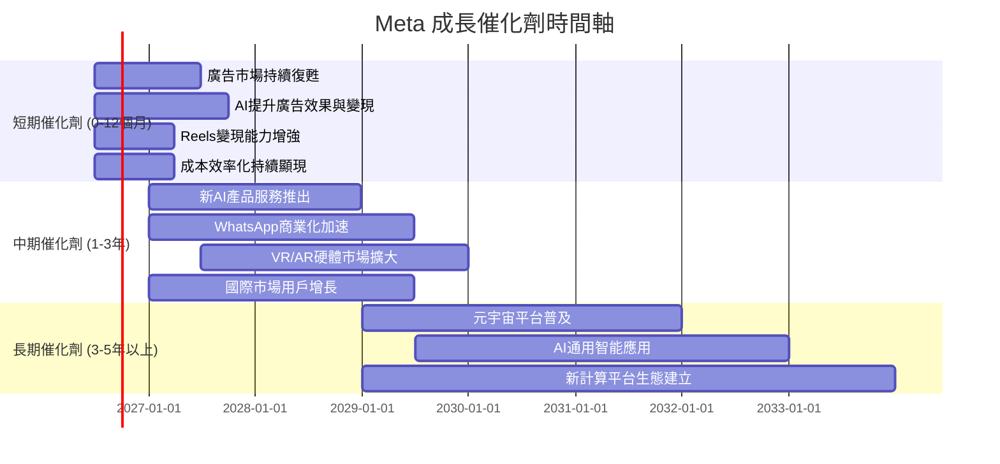
**催化劑時間軸分析**：
-   **短期 (0-12個月)**：核心廣告市場的持續復甦，特別是 AI 技術在廣告定位和優化方面的應用，將進一步提升廣告效果和變現能力。Reels 等短影音產品的變現能力逐步追趕 TikTok，以及「效率年」帶來的成本控制效應將持續顯現，支持利潤率擴張。
-   **中期 (1-3年)**：Meta 有望推出更多基於其強大 AI 能力的新產品和服務，例如 AI 助手、生成式 AI 工具等，創造新的收入流。WhatsApp 商業化進程的加速也將貢獻增長。同時，隨著 VR/AR 硬體的逐步成熟和內容生態的豐富，其市場規模有望擴大，為 Reality Labs 帶來更多收入。
-   **長期 (3-5年以上)**：元宇宙平台的普及是 Meta 最具野心的長期催化劑。如果 Meta 能夠成功構建一個開放且吸引人的元宇宙生態系統，將帶來巨大的用戶增長和商業機會。此外，在通用人工智能 (AGI) 領域的持續研發，有望為公司帶來顛覆性的技術突破和應用。

### 8.2 TAM 市場規模分析

Meta 的潛在市場 (Total Addressable Market, TAM) 巨大，涵蓋了全球數位廣告、虛擬現實和未來元宇宙等廣闊領域。

```
╔══════════════════════════════════════════════════════════════════╗
║                   META 潛在市場 (TAM) 分析                       ║
╠══════════════════════════════════════════════════════════════════╣
║                                                                  ║
║  全球數位廣告市場 (2025E): $900B+                                ║
║  ├── Meta 收入貢獻 (TTM): $210B (佔比 ~23%)                      ║
║  └── 滲透率: 23%  █████████████████████░░░░░░░░░░░░░░░░░░░░░░░░░░░░║
║                                                                  ║
║  VR/AR硬體及內容市場 (2025E): $50B+                               ║
║  ├── Meta 收入貢獻 (TTM): ~$4B (RL部門)                          ║
║  └── 滲透率: ~8%  ████████░░░░░░░░░░░░░░░░░░░░░░░░░░░░░░░░░░░░░░░░░║
║                                                                  ║
║  元宇宙經濟 (2030E): $5T+                                        ║
║  ├── Meta 潛在收入貢獻: 待定 (長期願景)                          ║
║  └── 滲透率: <1%  █░░░░░░░░░░░░░░░░░░░░░░░░░░░░░░░░░░░░░░░░░░░░░░░░║
║                                                                  ║
║  📊 結論：在現有市場仍有增長空間，元宇宙是長期巨大潛力市場。    ║
╚══════════════════════════════════════════════════════════════════╝
```
**TAM 市場規模分析**：
-   **全球數位廣告市場**：預計 2025 年將達到 $900B 以上。Meta 憑藉其 FoA 業務在其中佔據約 23% 的市場份額，仍有進一步擴張的空間，特別是在新興市場和廣告技術的持續優化下。
-   **VR/AR 硬體及內容市場**：預計 2025 年市場規模將超過 $50B。Meta 的 Reality Labs 部門是該領域的主要參與者，目前貢獻約 $4B 的收入，滲透率約 8%。隨著技術成熟和價格下降，該市場有望快速增長。
-   **元宇宙經濟**：長期來看，元宇宙被預計在 2030 年發展成為一個數萬億美元的巨大市場 (~$5T+)。Meta 在此領域的投資目前仍處於早期階段，收入貢獻有限，但其潛在的市場份額和收入增長空間是巨大的，代表了公司最主要的長期增長押注。

### 8.3 成長驅動力結構圖

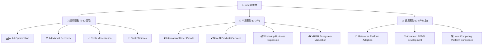
**成長驅動力分析**：
-   **短期驅動**：AI 在廣告優化方面的應用 (AI Ad Optimization) 將持續提升廣告投放效果和 ROI，從而吸引更多廣告商。全球廣告市場的持續復甦 (Ad Market Recovery) 為 Meta 提供了有利的宏觀環境。Reels 等短影音內容的變現能力逐步提升 (Reels Monetization)，以及公司持續的成本效率化措施 (Cost Efficiency) 將共同推動短期營收和利潤增長。
-   **中期驅動**：Meta 在國際市場仍有巨大的用戶增長潛力 (International User Growth)。公司有望推出更多創新的 AI 產品和服務 (New AI Products/Services)，例如更智能的助手和生成式 AI 工具，創造新的收入來源。WhatsApp 商業服務的擴張 (WhatsApp Business Expansion) 將進一步解鎖其龐大用戶群的商業價值。隨著 VR/AR 硬體和內容生態系統的成熟 (VR/AR Ecosystem Maturation)，Reality Labs 的收入貢獻將逐步增加。
-   **長期驅動**：元宇宙平台的廣泛採用 (Metaverse Platform Adoption) 是 Meta 最重要的長期願景，若成功將帶來巨大的市場機會。在通用人工智能 (AGI) 領域的研發突破 (Advanced AI/AGI Development) 有望驅動下一代計算平台的創新。最終目標是建立並主導新的計算平台生態 (New Computing Platform Dominance)，如同其在移動互聯網時代的地位。

---

## 9. 風險矩陣

### 9.1 風險評分矩陣

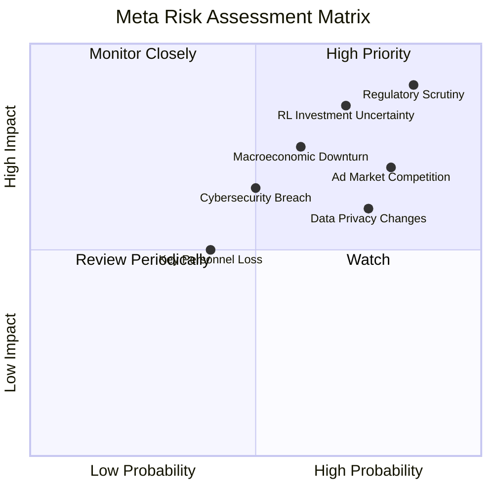
**風險評分矩陣分析**：
-   **High Priority (高優先級)**：**監管審查 (Regulatory Scrutiny)** (0.85, 0.90) 是 Meta 面臨的最高風險，其發生機率高且潛在衝擊巨大。**Reality Labs 投資不確定性 (RL Investment Uncertainty)** (0.70, 0.85) 發生機率中高，一旦回報不達預期，將對公司財務造成重大影響。
-   **Monitor Closely (密切監控)**：**廣告市場競爭 (Ad Market Competition)** (0.80, 0.70) 發生機率高，但衝擊相對可控。**數據隱私政策變化 (Data Privacy Changes)** (0.75, 0.60) 和 **宏觀經濟下行 (Macroeconomic Downturn)** (0.60, 0.75) 也需要密切關注，可能對廣告收入造成影響。
-   **Review Periodically (定期審查)**：**網路安全漏洞 (Cybersecurity Breach)** (0.50, 0.65) 和 **關鍵人才流失 (Key Personnel Loss)** (0.40, 0.50) 發生機率中等，潛在影響較大，需要定期評估。

### 9.2 風險清單詳細分析

| # | 風險項目 | 發生機率 | 財務衝擊 | 風險評分 | 緩解措施 |
|---|----------|----------|----------|----------|----------|
| 1 | 🔴 **監管與反壟斷壓力** | 高 (85%) | 高 (-10%至-20%收入/罰款) | 🔴 9.0/10 | 積極配合監管機構，調整業務實踐以符合法規，加強透明度，必要時進行法律抗辯。 |
| 2 | 🔴 **Reality Labs 投資不確定性** | 中高 (70%) | 高 (-5%至-15%淨利潤) | 🔴 8.5/10 | 階段性投資，設定明確的里程碑和回報指標；探索與第三方合作，分攤風險；持續優化元宇宙體驗以吸引用戶和開發者。 |
| 3 | 🟡 **核心廣告業務競爭加劇** | 高 (80%) | 中 (-5%至-10%廣告收入增長) | 🟡 7.5/10 | 透過 AI 持續優化廣告產品和工具，提升廣告商 ROI；深耕短影音、商業訊息等新興廣告形式；拓展新興市場。 |
| 4 | 🟡 **數據隱私政策變化** | 高 (75%) | 中 (-5%至-8%廣告收入) | 🟡 7.0/10 | 投資隱私增強技術 (PETs)；開發新的第一方數據解決方案；與行業夥伴合作制定隱私標準。 |
| 5 | 🟡 **宏觀經濟下行** | 中 (60%) | 中 (-5%至-10%營收成長) | 🟡 6.5/10 | 保持財務靈活性和充足現金流；持續控制成本，提高營運效率；多元化廣告客戶基礎，減少對單一行業的依賴。 |
| 6 | 🟡 **網路安全與數據洩露** | 中 (50%) | 中 (-1%至-3%收入/品牌聲譽損失) | 🟡 6.0/10 | 持續投資於最先進的網絡安全技術和人才；實施嚴格的數據保護協議和應急響應計劃；加強用戶教育。 |
| 7 | 🟡 **關鍵人才流失** | 中 (40%) | 低 (-1%至-2%研發效率) | 🟡 5.0/10 | 提供具競爭力的薪酬和福利；營造創新和包容的企業文化；建立完善的人才培養和繼任計劃。 |

---

## 10. 投資建議

### 10.1 最終綜合評級雷達圖

```
╔══════════════════════════════════════════════════════════════════╗
║                  META 最終綜合評級雷達圖                         ║
╠══════════════════════════════════════════════════════════════════╣
║                                                                  ║
║  基本面強度  8.5 ▓▓▓▓▓▓▓▓▓▓▓▓▓▓▓▓▓░░░  ★★★★☆           ║
║  成長動能    8.0 ▓▓▓▓▓▓▓▓▓▓▓▓▓▓▓▓░░░░  ★★★★☆           ║
║  獲利品質    9.0 ▓▓▓▓▓▓▓▓▓▓▓▓▓▓▓▓▓▓░░  ★★★★★           ║
║  財務健康    8.5 ▓▓▓▓▓▓▓▓▓▓▓▓▓▓▓▓▓░░░  ★★★★☆           ║
║  估值合理性  7.5 ▓▓▓▓▓▓▓▓▓▓▓▓▓▓▓░░░░░  ★★★☆☆           ║
║  護城河深度  8.5 ▓▓▓▓▓▓▓▓▓▓▓▓▓▓▓▓▓░░░  ★★★★☆           ║
║  管理層執行  8.0 ▓▓▓▓▓▓▓▓▓▓▓▓▓▓▓▓░░░░  ★★★★☆           ║
║  技術創新力  8.5 ▓▓▓▓▓▓▓▓▓▓▓▓▓▓▓▓▓░░░  ★★★★☆           ║
║                                                                  ║
║  綜合總分    8.3 ▓▓▓▓▓▓▓▓▓▓▓▓▓▓▓▓▓░░░  🏆 買入評級              ║
╚══════════════════════════════════════════════════════════════════╝
```

### 10.2 目標價與隱含報酬率

| 情境 | 目標價 | 相對現價 ($669.21) | 隱含報酬率 | 機率權重 | 加權平均目標價 |
|------|--------|--------------------|------------|----------|----------------|
| 🔴 悲觀 | $760 | +13.6% | 15% | 20% | $152.00 |
| 🟡 基準 | $830 | +24.0% | 60% | 60% | $498.00 |
| 🟢 樂觀 | $980 | +46.4% | 25% | 20% | $196.00 |
| **加權平均** | **$846** | **+26.4%** | **100%** | **100%** | **$846.00** |

**目標價與隱含報酬率**：
基於上述情境分析，本報告給予 Meta 的加權平均目標價為 $846，相較於當前股價 $669.21，隱含約 26.4% 的上行空間。基準情境目標價 $830，預期報酬率為 24.0%。考慮到 Meta 強勁的盈利復甦、效率提升、AI 驅動的廣告增長以及其在元宇宙領域的長期潛力，我們認為該目標價是合理且保守的。

### 10.3 買入時機與觸發因素

```
╔══════════════════════════════════════════════════════════════════╗
║                  ✅ 買入觸發因素 Checklist                      ║
╠══════════════════════════════════════════════════════════════════╣
║                                                                  ║
║  立即買入觸發條件（多數符合）：                                  ║
║  ✅ 核心廣告業務營收成長率連續兩季 > 20%                        ║
║  ✅ 營業利益率維持在 40% 以上                                    ║
║  ✅ 自由現金流持續增長且 FCF Yield > 1.5%                        ║
║  ✅ 估值 (Forward P/E) 低於 20x                                  ║
║  ✅ AI 產品/服務發布取得市場積極反饋                             ║
║                                                                  ║
║  加碼觸發條件（出現以下任一）：                                  ║
║  ☐ Reality Labs 虧損收窄或營收增長超預期                        ║
║  ☐ 監管環境出現積極轉變，有利於公司業務發展                     ║
║  ☐ 宏觀經濟數據顯示廣告市場加速復甦                             ║
║  ☐ 公司宣佈更大規模的股票回購計劃或提高股息                     ║
║                                                                  ║
║  減碼/停損觸發條件（出現以下任一）：                             ║
║  ☐ 核心廣告業務營收成長率連續兩季 < 10% (YoY)                   ║
║  ☐ 營業利益率連續兩季跌破 35%                                    ║
║  ☐ 自由現金流轉負或 FCF 轉換率 < 50%                            ║
║  ☐ ROIC 跌破 WACC 且無明確改善前景                              ║
║  ☐ 重大監管罰款或業務模式被迫根本性調整                         ║
╚══════════════════════════════════════════════════════════════════╝
```

### 10.4 投資人適配度分析

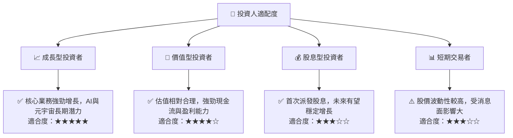
**投資人適配度分析**：
-   **成長型投資者 (★★★★★)**：Meta 憑藉其核心廣告業務的強勁增長、AI 技術的領先部署以及元宇宙的長期願景，是典型的成長股。適合願意承受較高風險，尋求長期資本增值的投資者。
-   **價值型投資者 (★★★★☆)**：儘管是成長股，但 Meta 在經歷「效率年」後，其盈利能力和現金流表現卓越，且當前估值相較於其增長潛力而言相對合理。對於尋求「合理價格的成長」的價值型投資者而言，Meta 具有吸引力。
-   **股息型投資者 (★★★☆☆)**：Meta 於近期開始派發股息，但目前的股息收益率相對較低。對於主要目標是穩定現金收入的投資者，其吸引力有限，但長期來看股息有望增長。
-   **短期交易者 (★★★☆☆)**：Meta 股價受市場情緒、財報、監管新聞和行業競爭等因素影響，波動性較高。短期交易者可能需要更靈敏的策略和風險管理。

### 10.5 每季財報監控清單（Quarterly Watch List）

| 監控指標 | 關注點 | 觸發加碼門檻 | 觸發減碼門檻 |
|----------|----------|--------------|--------------|
| **核心廣告營收成長率 (YoY)** | 反映廣告市場健康度與 AI 變現效果 | > 25% | < 15% |
| **Reality Labs 營收成長率 (YoY)** | 反映元宇宙業務進展 | > 30% | < 10% |
| **營業利益率** | 反映營運效率與成本控制 | > 42% | < 38% |
| **自由現金流 (FCF)** | 反映真實現金產生能力 | FCF > $15B/季 | FCF < $8B/季 |
| **資本支出 (Capex)** | 反映投資強度與效率 | 資本支出/營收 < 30% 且 FCF 穩定 | 資本支出/營收 > 40% 且 FCF 下滑 |
| **股權薪酬 (SBC) 佔營收比** | 反映對股東的稀釋程度 | < 10% | > 12% |
| **全球 DAU/MAU** | 反映用戶增長與平台黏性 | 用戶數加速增長 | 用戶數連續兩季停滯或下降 |
| **AI/研發支出** | 反映未來成長投入 | 保持高投入但效率提升 | 投入減少或無明顯成果 |
| **財測指引** | 管理層對未來營運的展望 | 超預期或維持高位 | 低於預期或下調 |
| **監管新聞** | 反映潛在風險與政策變化 | 積極監管進展 | 重大負面判決或罰款 |

### 10.6 反面論證：什麼會證明論點錯誤（What Would Change My Mind）

```
╔══════════════════════════════════════════════════════════════════╗
║              ⚠️ 論點失效條件（Disconfirming Evidence）           ║
╠══════════════════════════════════════════════════════════════════╣
║  本投資論點在下列情況成立時應重新檢視或退出：                    ║
║  ☐ 核心廣告業務營收成長率連續兩季 < 15% YoY                      ║
║  ☐ 營業利益率連續兩季跌破 35%                                    ║
║  ☐ 自由現金流轉負或 FCF 轉換率連續兩季 < 60%                    ║
║  ☐ ROIC 跌破 WACC 且管理層未提出有效改善措施                    ║
║  ☐ Reality Labs 虧損持續擴大且無明確的商業化前景或用戶增長停滯  ║
║  ☐ 關鍵監管法案通過，對 Meta 核心業務模式造成根本性打擊         ║
║  ☐ AI 投資未能有效轉化為廣告效益提升或新產品收入                ║
╚══════════════════════════════════════════════════════════════════╝
```

---

> **免責聲明**：本報告為 AI 自動生成，僅供研究參考，不構成投資建議。投資有風險，入市需謹慎。