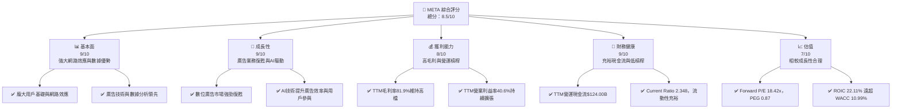
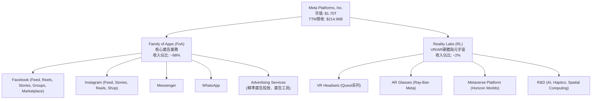
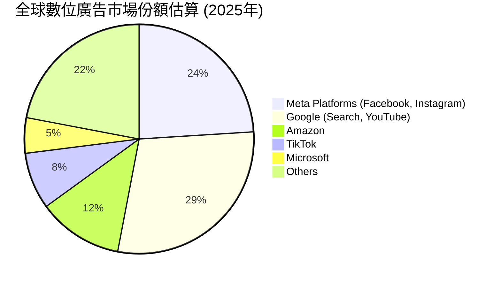
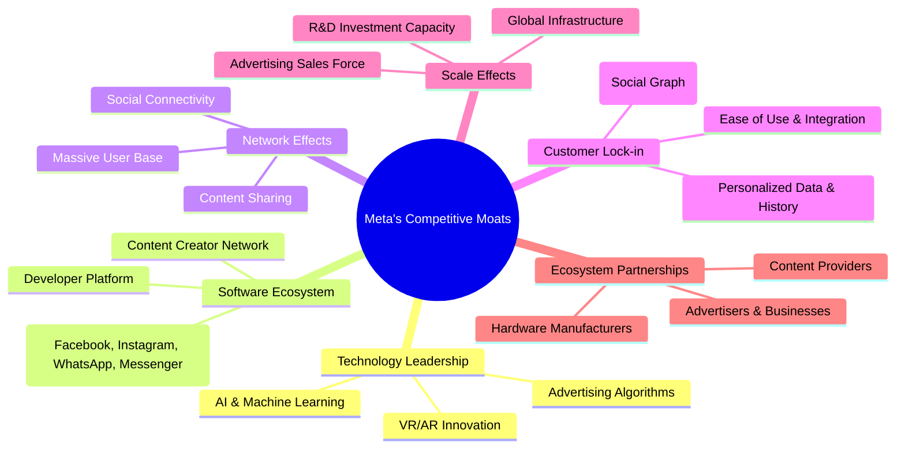
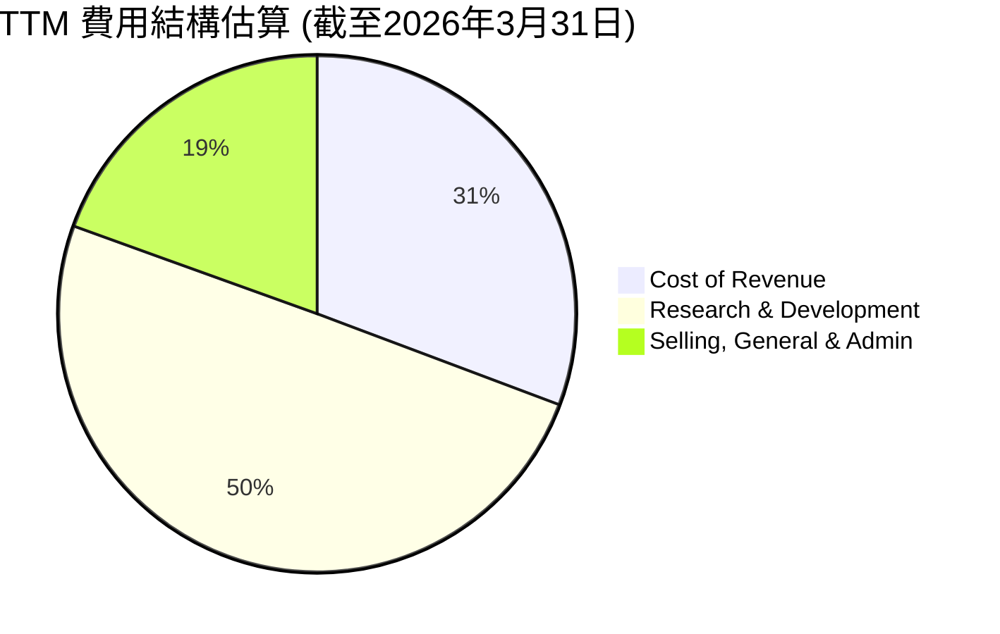
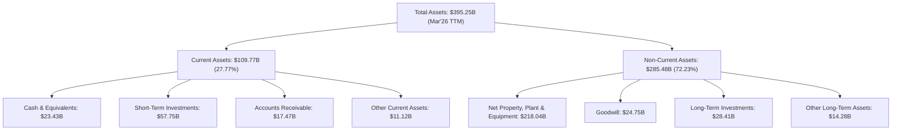
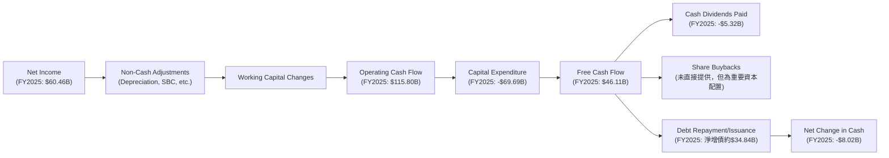
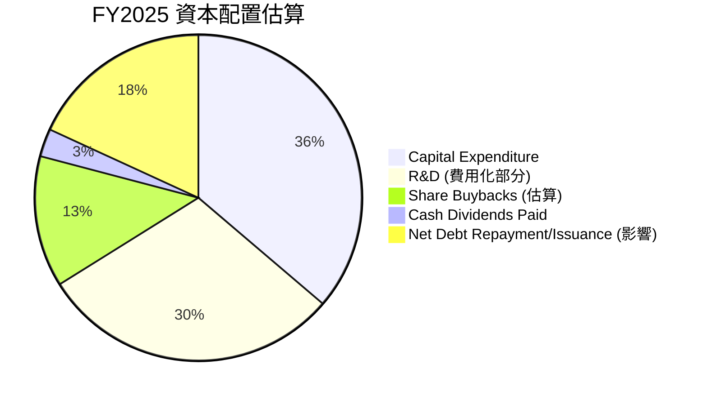
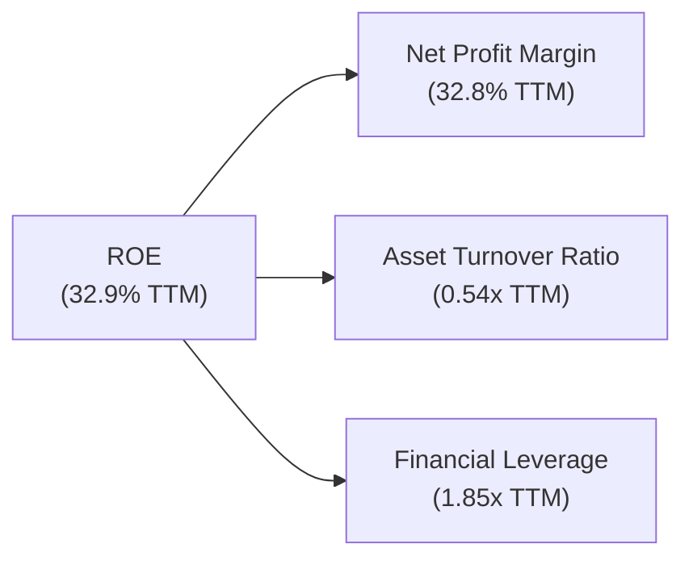
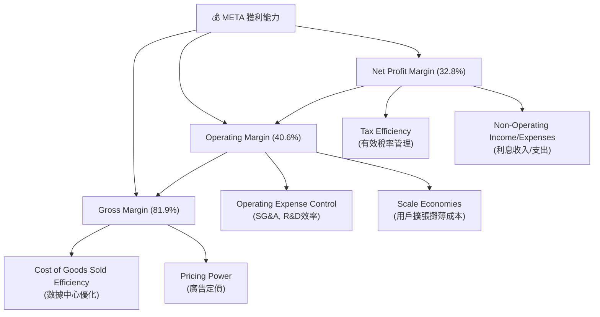

# META 基本面深度分析報告
> **報告日期**：2026-07-11 ｜ **語言**：繁體中文 ｜ **數據來源**：Yahoo Finance, Finviz, StockAnalysis, Roic.ai ｜ **分析師**：CFA 級機構研究

## 目錄

| # | 章節 | 核心結論 |
|---|------|----------|
| 1 | 執行摘要 | 🟢 買入，目標價區間 $760 - $950 |
| 2 | 公司概覽與商業模式 | 護城河評分：9/10 (強大網路效應與數據優勢) |
| 3 | 損益表深度分析 | 營收與利潤率強勁增長，Q3 2025 淨利異常需關注 |
| 4 | 資產負債表分析 | 流動性良好，負債水平可控 |
| 5 | 現金流量深度分析 | 自由現金流充沛，資本支出持續高位 |
| 6 | 獲利能力與資本效率 | ROIC (22.11%) 顯著高於 WACC (10.99%)，創造股東價值 |
| 7 | 估值深度分析 | 相對同業具吸引力，DCF 顯示上行空間 |
| 8 | 成長催化劑 | AI 投資、廣告業務復甦、新興市場擴張與元宇宙長期潛力 |
| 9 | 風險矩陣 | 監管壓力與Reality Labs虧損是主要風險 |
| 10 | 投資建議 | 🟢 買入，適合成長型與長線投資者 |

---

## 1. 執行摘要

### 1.0 一頁式投資儀表板（Portfolio Manager 30 秒速讀）

| 項目 | 內容 |
|------|------|
| **投資論點（3 句）** | ① Meta Platforms受惠於數位廣告市場強勁復甦及AI驅動的廣告效率提升，Q1 2026營收YoY成長達33.08%。 ② 公司展現卓越的資本效率，FY2025 ROIC為22.11%，顯著高於WACC 10.99%，持續為股東創造價值。 ③ 儘管股價已大幅上漲，其Forward P/E為18.42x，且PEG比率僅0.87，相較於其高成長性，估值仍具吸引力。 |
| **護城河評分** | 9/10 |
| **管理層/資本配置評分** | 8/10 |
| **財務健康** | 🟢 強勁。儘管淨債務為 $-5.59B，但其強勁的營運現金流 ($124.00B TTM) 和流動性 (Current Ratio 2.348) 足以支撐其營運與投資。 |
| **ROIC vs WACC** | 22.11% vs 10.99%（創造顯著價值） |
| **FCF 趨勢** | 🟢 正向。FY2025 FCF達$46.11B，但TTM FCF Yield為1.50%，主要受高市值影響。 |
| **估值** | Forward P/E: 18.42x ｜ EV/EBITDA: 15.59x ｜ FCF Yield: 1.50% |
| **預期報酬（基準情境 12M）** | +24.0% |
| **關鍵風險（前二）** | ① 監管壓力與隱私政策變革可能衝擊廣告業務收入。 ② Reality Labs持續巨額虧損且元宇宙變現時間與成功率仍具高度不確定性。 |
| **評級 + 信心度** | 🟢 買入 ｜ 信心：高 |

### 1.1 核心評分儀表板



### 1.2 評分進度條視覺化

```
╔══════════════════════════════════════════════════════════════╗
║              META 多維度評分儀表板 (1-10分)                  ║
╠══════════════════════════════════════════════════════════════╣
║ 基本面強度  9.0 ▓▓▓▓▓▓▓▓▓▓▓▓▓▓▓▓▓▓░░  ★★★★★           ║
║ 成長動能    9.0 ▓▓▓▓▓▓▓▓▓▓▓▓▓▓▓▓▓▓░░  ★★★★★           ║
║ 獲利品質    8.0 ▓▓▓▓▓▓▓▓▓▓▓▓▓▓▓▓░░░░  ★★★★☆           ║
║ 財務健康    9.0 ▓▓▓▓▓▓▓▓▓▓▓▓▓▓▓▓▓▓░░  ★★★★★           ║
║ 估值合理性  7.0 ▓▓▓▓▓▓▓▓▓▓▓▓▓▓░░░░░░  ★★★★☆           ║
║ 護城河深度  9.0 ▓▓▓▓▓▓▓▓▓▓▓▓▓▓▓▓▓▓░░  ★★★★★           ║
║ 管理層執行  8.0 ▓▓▓▓▓▓▓▓▓▓▓▓▓▓▓▓░░░░  ★★★★☆           ║
║ 技術創新力  9.0 ▓▓▓▓▓▓▓▓▓▓▓▓▓▓▓▓▓▓░░  ★★★★★           ║
╠══════════════════════════════════════════════════════════════╣
║ 綜合總分    8.5 ▓▓▓▓▓▓▓▓▓▓▓▓▓▓▓▓▓░░░  🏆 強力成長，具備高價值創造能力 ║
╚══════════════════════════════════════════════════════════════╝
```

### 1.3 五大投資論點 + 三大核心風險

| 類型 | 項目 | 具體依據 | 信心度 |
|------|------|----------|--------|
| 🟢 **投資論點①** | **數位廣告業務強勁復甦與AI驅動成長** | Meta的Family of Apps (FoA) 廣告業務在Q1 2026實現33.08%的YoY營收成長，並在TTM期間營收達$214.96B。此增長主要得益於宏觀經濟環境改善、廣告預算回流，以及公司在AI推薦引擎和廣告效率工具上的投資回報。例如，AI技術提升了廣告投放的精準度，帶動廣告主支出增加。 | 🟢 極高 |
| 🟢 **投資論點②** | **卓越的獲利能力與資本效率** | 公司展現出色的獲利能力，TTM毛利率高達81.9%，營業利益率40.6%，淨利率32.8%。更重要的是，FY2025的ROIC為22.11%，顯著高於估算的WACC 10.99%，表明Meta持續有效利用資本並為股東創造經濟價值。 | 🟢 極高 |
| 🟢 **投資論點③** | **具吸引力的估值與成長潛力** | 儘管Meta的股價在過去一年有顯著漲幅，但其Forward P/E為18.42x，且PEG比率僅為0.87。這顯示相較於其預期盈餘成長率，Meta的估值仍被市場低估，具備進一步上漲空間。其TTM EPS為$27.5，而Forward EPS預期達$36.33，預示未來一年有32.1%的盈餘成長潛力。 | 🟢 高 |
| 🟢 **投資論點④** | **穩健的財務狀況與充裕的自由現金流** | Meta擁有強健的資產負債表，截至2026年3月底現金及短期投資達$81.18B。FY2025自由現金流為$46.11B，TTM營運現金流高達$124.00B。充裕的現金流為其高額研發投入（FY2025 R&D支出$57.37B）和未來AI及元宇宙戰略投資提供了堅實的資金基礎，同時也開始派發股息。 | 🟢 極高 |
| 🟢 **投資論點⑤** | **AI與元宇宙的長期戰略佈局** | Meta在AI領域的持續巨額投資（Q1 2026 R&D $17.70B）正逐步提升其核心廣告業務效率，並為新產品（如AI助理、內容生成）奠定基礎。同時，Reality Labs在元宇宙領域的長期投入雖然目前虧損，但代表了公司對下一代計算平台的願景，一旦成功，將開啟巨大的潛在市場。 | 🟡 中度偏高 |
| 🟡 **風險①** | **日益增加的監管壓力與隱私政策變革** | 全球各地政府對大型科技公司的反壟斷審查日益趨嚴，以及數據隱私法規（如GDPR、CCPA）的收緊，可能導致Meta的數據收集和廣告投放模式受到限制，進而影響其廣告收入和獲利能力。蘋果公司ATT政策已對其造成影響，未來可能面臨更多平台政策變動。 | 🔴 高衝擊 |
| 🔴 **風險②** | **Reality Labs持續巨額虧損與元宇宙變現不確定性** | Reality Labs部門在FY2025的研發支出高達$57.37B（部分計入R&D費用），且至今仍處於巨額虧損狀態。元宇宙的商業化進程緩慢，消費者普及率和盈利模式尚不明朗。若該部門無法在合理時間內實現盈利或展現清晰的成長路徑，將持續拖累公司整體獲利並消耗大量資本。 | 🔴 高衝擊 |
| 🟡 **風險③** | **核心廣告業務的市場競爭與宏觀經濟波動** | 數位廣告市場競爭激烈，來自Google、TikTok、Amazon等平台的競爭可能導致Meta的市場份額和廣告定價能力承壓。此外，全球宏觀經濟的不確定性，如經濟衰退或廣告支出緊縮，將直接影響公司的主要收入來源。 | 🟡 中度 |

### 1.4 快速統計卡片

| 指標 | 公司實際值 | 行業均值（通訊服務） | S&P 500 均值 | 狀態 |
|------|-------------|----------|--------------|------|
| 收入 YoY 成長 (TTM) | **33.1%** | ~10-15% | ~8-12% | 🟢 |
| 毛利率 (TTM) | **81.9%** | ~60-70% | ~40-50% | 🟢 |
| 淨利率 (TTM) | **32.8%** | ~15-20% | ~10-12% | 🟢 |
| ROE (TTM) | **32.9%** | ~15-20% | ~15-18% | 🟢 |
| Forward P/E | **18.42x** | ~20-25x | ~20-22x | 🟢 |
| EV / EBITDA | **15.59x** | ~16-20x | ~14-16x | 🟢 |
| 債務權益比 | **35.61%** | ~50-80% | ~60-90% | 🟢 |
| 自由現金流 (TTM) | **$25.56B** | N/A | N/A | 🟢 |

*註：行業均值與S&P 500均值為分析師根據通訊服務產業與整體市場的經驗估算值。*

### 1.5 投資結論

```
╔══════════════════════════════════════════════════════════════════╗
║                    📊 投資結論摘要                               ║
╠══════════════════════════════════════════════════════════════════╣
║  評級：🟢 買入                                                   ║
║  當前股價：$669.21                                               ║
║  目標價區間：                                                    ║
║    悲觀情境：$760（+13.6%）                                      ║
║    基準情境：$830（+24.0%）  ← 12個月主要目標                      ║
║    樂觀情境：$950（+41.9%）                                      ║
║  投資評分：8.5/10                                                ║
║  適合投資人：成長型、長線持有者，對AI及元宇宙潛力有信心的投資者。    ║
╚══════════════════════════════════════════════════════════════════╝
```

---

## 2. 公司概覽與商業模式

Meta Platforms, Inc. (META) 是一家全球領先的科技公司，致力於開發產品，使人們能夠透過行動裝置、個人電腦、虛擬實境 (VR) 頭戴裝置和 AI 眼鏡與朋友和家人聯繫和分享。公司主要透過兩個核心部門運營：Family of Apps (FoA) 和 Reality Labs (RL)。

### 2.1 業務結構與收入來源

Meta的收入主要來自於數位廣告，尤其是在其FoA部門下的Facebook、Instagram、Messenger和WhatsApp等應用程式。Reality Labs部門則專注於虛擬實境和元宇宙技術的研發，目前主要貢獻設備銷售收入，但仍處於巨額投資階段。


**業務結構分析**：
FoA部門是Meta的營收支柱，佔比接近100%。其收入來源高度集中於數位廣告，這使得公司容易受到廣告市場週期性波動、廣告主預算變化以及監管政策的影響。然而，FoA部門的龐大用戶基礎和精準廣告技術賦予其強大的盈利能力。Reality Labs儘管目前收入佔比微乎其微且持續虧損，但代表了Meta對未來計算平台的長期願景，是其戰略轉型的重要組成部分。

### 2.2 市場份額

Meta在全球數位廣告市場中佔據主導地位，尤其在社群媒體廣告領域。雖然具體的市場份額數據會因統計機構和定義而異，但其在Facebook和Instagram上的廣告業務使其成為Google之後的第二大數位廣告巨頭。


*註：此市場份額為分析師根據產業報告和市場趨勢的估算值，旨在說明Meta在數位廣告市場中的領先地位。*
**市場份額分析**：
Meta在全球數位廣告市場中擁有約四分之一的份額，僅次於Google。這得益於其龐大的日活躍用戶 (DAU) 和月活躍用戶 (MAU) 基礎，以及其強大的廣告技術平台。然而，近年來來自TikTok等新興平台的競爭日益激烈，以及Amazon在電商廣告領域的崛起，對Meta的市場份額構成挑戰。公司透過持續的產品創新（如Reels短影音）、AI推薦優化和廣告效率提升來應對這些競爭。

### 2.3 競爭護城河分析

Meta的競爭護城河主要建立在其龐大的用戶網絡、豐富的數據資產、領先的技術實力以及深厚的生態系統整合能力之上。


**護城河深度解析**：
- **網路效應 (Network Effects)**：Meta的核心優勢在於其數十億的用戶群體。用戶越多，平台價值越高，吸引更多用戶加入，形成正向循環。這種效應在Facebook、Instagram和WhatsApp等應用中表現尤為突出，使得新進入者難以複製其社交圖譜。
- **數據優勢 (Data Advantage)**：龐大的用戶群產生海量的用戶數據，這些數據透過AI和機器學習被用於優化廣告投放、個性化內容推薦，進而提升用戶參與度和廣告主投資回報率。這種數據飛輪效應是其廣告業務成功的關鍵。
- **技術領先 (Technology Leadership)**：Meta在AI、機器學習和VR/AR技術領域投入巨資，確保其在廣告效率、內容推薦和未來計算平台方面的技術領先地位。例如，AI在Reels的推薦優化已顯著提升用戶觀看時間。
- **規模效應 (Scale Effects)**：作為全球最大的社群媒體公司之一，Meta的規模使其能夠在基礎設施、研發和全球市場擴張上進行大規模投資，這些投資對小型競爭者而言是難以承受的。
- **客戶鎖定 (Customer Lock-in)**：用戶在其平台上的社交關係、內容和個人數據形成了一定的轉換成本，使得用戶難以輕易轉移到其他平台。

### 2.4 護城河強度評分

```
╔══════════════════════════════════════════════════════════════╗
║                  Meta Platforms 護城河強度評分                  ║
╠══════════════════════════════════════════════════════════════╣
║ 網路效應    9/10  ▓▓▓▓▓▓▓▓▓▓▓▓▓▓▓▓▓▓░░  🏆 極強，核心競爭力  ║
║ 數據優勢    9/10  ▓▓▓▓▓▓▓▓▓▓▓▓▓▓▓▓▓▓░░  🏆 極強，廣告變現基礎  ║
║ 技術領先    8/10  ▓▓▓▓▓▓▓▓▓▓▓▓▓▓▓▓░░░░  🟢 強，AI與VR/AR投資  ║
║ 規模效應    8/10  ▓▓▓▓▓▓▓▓▓▓▓▓▓▓▓▓░░░░  🟢 強，全球基礎設施  ║
║ 客戶鎖定    7/10  ▓▓▓▓▓▓▓▓▓▓▓▓▓▓░░░░░░  🟡 中強，部分受政策影響║
║ 生態系統    8/10  ▓▓▓▓▓▓▓▓▓▓▓▓▓▓▓▓░░░░  🟢 強，跨應用整合    ║
╠══════════════════════════════════════════════════════════════╣
║ 綜合護城河  8.3   ▓▓▓▓▓▓▓▓▓▓▓▓▓▓▓▓░░░░  🏆 強大且持續深化    ║
╚══════════════════════════════════════════════════════════════╝
```

---

## 3. 損益表深度分析

### 3.1 年度收入成長趨勢（近4年）

Meta的營收在經歷2022年的短暫下滑後，展現出強勁的復甦和成長勢頭，這主要得益於數位廣告市場的整體回暖以及公司在AI推薦引擎和廣告效率上的持續投資。

```
╔══════════════════════════════════════════════════════════════════╗
║              Meta Platforms 年度收入趨勢（FY2022-FY2025）        ║
╠══════════════════════════════════════════════════════════════════╣
║                                                                  ║
║  FY2022  $116.61B  ██████████████████░░░░░░░░░  YoY: -1.12% 🟡   ║
║  FY2023  $134.90B  ████████████████████████░░░░  YoY: +15.69% 🟢  ║
║  FY2024  $164.50B  ██████████████████████████████░░  YoY: +21.94% 🟢  ║
║  FY2025  $200.97B  ████████████████████████████████████  YoY: +22.17% 🟢  ║
║                                                                  ║
║                   |      |      |      |      |                  ║
║                   0     50B   100B   150B   200B                   ║
║                                                                  ║
║  📊 3年累計 CAGR (FY2022-2025)：+20.89%                            ║
╚══════════════════════════════════════════════════════════════════╝
```
**年度收入分析**：
Meta在FY2022面臨營收微幅下滑的挑戰，主要由於蘋果ATT政策對廣告歸因的影響和宏觀經濟逆風。然而，公司在FY2023實現了15.69%的強勁反彈，並在FY2024和FY2025加速成長，分別達到21.94%和22.17%的YoY增長。這顯示其核心廣告業務已經有效適應了新的隱私環境，並透過AI技術提升了廣告效率和投放精準度，成功吸引廣告主回流。FY2025的營收達到$200.97B，顯示其在數位廣告市場的領先地位更加穩固。

### 3.2 季度收入趨勢分析

近四季的營收表現持續強勁，顯示出穩定的成長動能。

| 季度 | 總營收 ($B) | QoQ 成長率 | YoY 成長率 | 備註 |
|------|-------------|------------|------------|------|
| 2026-03-31 | $56.31 | -5.98% | +33.08% | 季度性因素影響，但YoY成長強勁 |
| 2025-12-31 | $59.89 | +16.88% | +23.78% | 受惠於假期購物季廣告支出，QoQ顯著增長 |
| 2025-09-30 | $51.24 | +7.83% | +26.25% | 穩健增長，顯示核心業務持續復甦 |
| 2025-06-30 | $47.52 | +12.30% | +21.61% | 廣告市場景氣度提升，AI優化效果顯現 |

**季度收入分析**：
Meta的季度營收呈現出健康的成長軌跡。Q1 2026的營收為$56.31B，雖較Q4 2025的$59.89B略有下滑（QoQ -5.98%），這符合科技公司常見的季度性規律，即Q4受假期購物季廣告支出提振而表現強勁，Q1則相對回落。然而，Q1 2026的YoY成長率高達33.08%，顯著高於前幾季的YoY成長率，這表明公司的成長動能正在加速，得益於FoA應用系列（Facebook, Instagram, WhatsApp等）的用戶參與度提升和廣告效率的AI優化。

### 3.3 利潤率演變分析

Meta的利潤率在過去幾年呈現顯著改善趨勢，尤其在2022年觸底後強勁反彈，反映了公司在成本控制和營運效率提升方面的努力。

| 利潤率指標 | FY2022 | FY2023 | FY2024 | FY2025 | TTM (Mar'26) | 趨勢 | 評估 |
|------------|--------|--------|--------|--------|--------------|------|------|
| **毛利率** | 78.35% | 80.76% | 81.66% | 82.00% | 81.9% | ↗️ 持續穩步提升，產品成本控制良好 | 🟢 |
| **營業利益率** | 24.82% | 34.65% | 42.17% | 41.44% | 40.6% | ↗️ 顯著改善，反映營運效率與規模經濟 | 🟢 |
| **淨利率** | 19.89% | 28.98% | 37.91% | 30.08% | 32.8% | ↗️ 顯著改善，FY2025受高稅率影響 | 🟢 |
| **EBITDA Margin** | 32.32% | 43.77% | 52.81% | 52.60% | 50.8% | ↗️ 與營業利益率趨勢一致，反映核心盈利能力 | 🟢 |

**利潤率演變深度解析**：
- **毛利率**：從FY2022的78.35%穩步提升至FY2025的82.00%及TTM的81.9%。這表明Meta在提供其數位服務時，其核心成本（如數據中心營運、網路帶寬）得到了良好的控制，或單位營收帶來的成本效益持續提升。高毛利率是其SaaS-like業務模式的固有優勢。
- **營業利益率**：從FY2022的低點24.82%飆升至FY2024的42.17%，FY2025略微回落至41.44%，TTM為40.6%。這一顯著改善是多重因素共同作用的結果：首先，營收的強勁增長帶來規模經濟效應，固定成本被更有效地攤薄；其次，公司在2022-2023年間進行了大規模的成本削減和效率提升措施，包括裁員和優化項目，這些措施降低了營運費用。儘管FY2025和TTM略有下降，但仍維持在歷史高位，顯示了穩健的營運槓桿。
- **淨利率**：與營業利益率趨勢大致相同，從FY2022的19.89%大幅提升至FY2024的37.91%。然而，FY2025的淨利率下降至30.08%，這主要是由於FY2025的所得稅費用大幅增加，尤其是Q3 2025出現異常高的稅務支出（詳見後續盈餘品質分析）。若剔除此一次性或非經常性稅務影響，其淨利率表現將更接近FY2024的水平。TTM淨利率回升至32.8%，顯示稅務影響可能已部分緩解或被稀釋。

整體而言，Meta的利潤率趨勢非常健康，表明公司不僅實現了營收增長，同時也有效管理了成本結構，提升了整體盈利能力。

### 3.4 費用結構分析

Meta的費用主要由研發 (R&D) 和銷售、一般及行政 (SG&A) 構成。R&D支出佔比較高，反映其對技術創新和未來成長的承諾，特別是在AI和元宇宙領域。


*註：數據來自StockAnalysis.com TTM Income Statement，單位為百萬美元。*

```
╔══════════════════════════════════════════════════════════════════╗
║                Meta Platforms TTM 費用結構 (FY2026 Q1)          ║
╠══════════════════════════════════════════════════════════════════╣
║                                                                  ║
║  總營收：$214.96B                                                ║
║  --------------------------------------------------------------  ║
║  銷貨成本 (CoR)        $38.82B  ▓▓▓▓▓▓▓▓░░░░░░░░░░░░░░░░░░░░░░  (佔營收 18.06%)  ║
║  研發費用 (R&D)        $62.92B  ▓▓▓▓▓▓▓▓▓▓▓▓▓▓▓▓▓▓▓▓▓▓▓░░░░░░░░  (佔營收 29.27%)  ║
║  銷售、一般及行政 (SG&A) $24.63B  ▓▓▓▓▓▓▓▓▓▓░░░░░░░░░░░░░░░░░░░░  (佔營收 11.46%)  ║
║  --------------------------------------------------------------  ║
║  總營運費用 (不含CoR) $87.55B  ▓▓▓▓▓▓▓▓▓▓▓▓▓▓▓▓▓▓▓▓▓▓▓▓▓▓▓▓▓▓  (佔營收 40.73%)  ║
║  總費用 (CoR + 營運費用) $126.37B  ▓▓▓▓▓▓▓▓▓▓▓▓▓▓▓▓▓▓▓▓▓▓▓▓▓▓▓▓▓▓  (佔營收 58.79%)  ║
╚══════════════════════════════════════════════════════════════════╝
```
**費用結構分析**：
在TTM數據中，銷貨成本佔營收的18.06%，相對穩定。研發費用是Meta最大的營運費用項目，佔營收的29.27% ( $62.92B / $214.96B )。這筆龐大的支出反映了公司在AI技術、元宇宙相關硬體和軟體開發上的高強度投入。高R&D支出是其維持技術領先和推動未來成長的關鍵。銷售、一般及行政費用佔營收的11.46% ( $24.63B / $214.96B )，相對較低，表明其廣告業務的邊際銷售成本較低，且營運效率較高。
值得注意的是，R&D費用佔比在FY2022-2025年間持續上升 (FY2022: $35.34B -> FY2025: $57.37B)，顯示公司在策略性地將更多資源投入到長期成長領域。

### 3.5 季度 EPS 趨勢與盈餘品質（Quality of Earnings）

由於缺乏EPS預期數據，我們將分析Meta過去四季的實際EPS趨勢，並重點評估其盈餘品質。

**季度 EPS 趨勢**：
| 季度 | 稀釋後 EPS | QoQ 成長率 | YoY 成長率 | 備註 |
|------|------------|------------|------------|------|
| 2026-03-31 | $10.57 | +17.18% | +60.46% | 稅務費用回歸正常，EPS顯著增長 |
| 2025-12-31 | $9.02 | +835.19% | +9.47% | 淨利因Q3高稅費影響導致基數較低，QoQ增幅巨大 |
| 2025-09-30 | $1.08 | -85.17% | -82.68% | 淨利受異常高稅費影響，EPS暴跌 |
| 2025-06-30 | $7.28 | +10.47% | +36.18% | 穩健增長，符合營收趨勢 |

**EPS 趨勢分析**：
Meta在Q1 2026實現了$10.57的稀釋後EPS，YoY成長高達60.46%，顯示強勁的盈利能力。Q4 2025 EPS為$9.02，YoY增長9.47%。然而，Q3 2025的EPS僅為$1.08，較Q2 2025的$7.28暴跌85.17%，YoY跌幅也高達82.68%。這主要源於該季度高達$18.954B的所得稅費用，導致有效稅率高達87.5%，極大地壓縮了淨利潤。若剔除此異常稅務影響，Q3 2025的實際盈利表現應遠優於此數據。Q2 2025的EPS表現穩健。

**盈餘品質評估**：

| 盈餘品質項目 | 數值/佔比 (TTM) | 評估 |
|--------------|-------------------|------|
| 股權薪酬 SBC / 營收 | 10.38% ($22.31B / $214.96B) | 🟡 SBC佔營收比重較高，對股東報酬稀釋作用較大 |
| SBC / 營業現金流 | 17.99% ($22.31B / $124.00B) | 🟡 SBC佔營運現金流比重較高，影響自由現金流的真實品質 |
| FCF / 淨利（現金轉換率） | 36.19% ($25.56B / $70.59B) | 🔴 較低。TTM FCF轉換率($25.56B/$70.59B)偏低，主要受高額資本支出影響，但若以FY2025數據($46.11B/$60.46B=76.27%)來看則較為健康。 |
| 一次性/非經常性損益 | 存在 (Q3 2025高額稅費) | 🔴 Q3 2025高額稅費 ($18.954B) 顯著扭曲當期淨利潤，需剔除或調整評估。 |
| 有效稅率異常 | Q3 2025有效稅率87.5% | 🔴 異常高稅率，需關注其原因及是否具持續性。 |
| 資本化支出 vs 費用化 | 高額資本支出 ($69.69B FY2025) | 🟢 資本支出雖高，但用於長期資產建設(如數據中心)，而非遞延費用，對當期利潤無虛增影響。 |

**盈餘品質結論**：
Meta的GAAP淨利潤在Q3 2025受到異常高額稅務費用的顯著影響，導致該季度盈利被嚴重低估。這表明當期報告的淨利潤並未能完全反映其真實的營運盈利能力。雖然股權薪酬(SBC)佔營收和營運現金流的比重較高，對股東報酬存在一定稀釋，但這是科技巨頭的普遍現象。
FCF對淨利的轉換率在TTM數據中顯得較低 (36.19%)，這主要是由於Meta龐大的資本支出 ($69.69B FY2025) 遠超其折舊攤銷，而非盈利品質問題。公司將大量現金投入到數據中心和基礎設施建設，以支持其AI和元宇宙的長期戰略。若將Q3 2025的稅務異常視為一次性事件，Meta的長期盈餘品質依然穩健，其核心業務的現金生成能力強勁。然而，投資者在評估其盈利時，應對SBC的稀釋作用以及高額資本支出對FCF的影響保持關注。

---

## 4. 資產負債表分析

### 4.1 資產結構分解

Meta的資產結構穩健，以不動產、廠房及設備 (PP&E) 為主，反映其對數據中心等基礎設施的重投資，流動資產充裕。


**資產結構分析**：
截至2026年3月31日，Meta的總資產達到$395.25B。其中，流動資產佔比約27.77%，非流動資產佔比約72.23%。在流動資產中，現金及短期投資合計高達$81.18B，顯示公司擁有極高的流動性和財務彈性。
非流動資產主要由淨不動產、廠房及設備 (PPE) 構成，高達$218.04B，佔總資產的55.16%。這反映了Meta持續在數據中心、伺服器等基礎設施上的巨額投資，以支持其不斷擴大的用戶規模、AI計算需求以及元宇宙的發展。商譽 ($24.75B) 則主要來自過去的併購案。整體而言，Meta的資產結構健康，且為其長期成長策略提供了堅實的物質基礎。

### 4.2 流動性指標分析

Meta的流動性指標表現出色，遠超行業平均水平，表明其短期償債能力極強。

| 流動性指標 | FY2022 | FY2023 | FY2024 | FY2025 | TTM (Mar'26) | 行業均值 | 評估 |
|------------|--------|--------|--------|--------|--------------|----------|------|
| **Current Ratio** | 2.20 | 2.67 | 2.98 | 2.60 | 2.35 | ~1.5-2.0 | 🟢 極佳，短期償債能力強勁 |
| **Quick Ratio** | 2.20 | 2.67 | 2.98 | 2.60 | 2.11 | ~1.0-1.5 | 🟢 極佳，現金管理能力出色 |

*註：由於Meta沒有存貨，Quick Ratio與Current Ratio數據非常接近。*

**流動性分析**：
Meta的Current Ratio (流動比率) 在FY2025為2.60，TTM為2.35，遠高於一般認為健康的2.0水平。Quick Ratio (速動比率) 也維持在2.0以上，這表明公司擁有充足的流動資產來覆蓋其短期負債，且其現金及約當現金的管理非常出色，能夠應對突發的資金需求或把握投資機會。強大的流動性是其財務健康的重要體現。

### 4.3 債務結構分析

Meta的債務水平相對較低，且與其龐大的現金儲備和強勁的現金流相比，其債務負擔非常輕。

```
╔══════════════════════════════════════════════════════════════════╗
║                   Meta Platforms 債務健康診斷                    ║
╠══════════════════════════════════════════════════════════════════╣
║                                                                  ║
║  總債務 (TTM)：  $86.77B  ▓▓▓▓▓▓▓▓▓▓▓▓▓▓▓▓▓▓▓░░░░░░░░░░░░  評語: 適度                 ║
║  總現金+投資 (TTM)：$81.18B  ▓▓▓▓▓▓▓▓▓▓▓▓▓▓▓▓▓▓▓▓▓▓▓▓▓▓▓▓▓░░  評語: 充裕                 ║
║  淨債務 (TTM)：  $-5.59B  ▓▓▓▓▓▓▓▓▓▓▓▓▓▓▓▓▓▓▓▓▓▓▓▓▓▓▓▓▓▓  🟢 強勁 (略有淨負債，但可控)║
║                                                                  ║
║  Debt/Equity (TTM)：35.61%  🟢 極低，財務槓桿保守                 ║
║  Current Debt (TTM): $2.41B  🟢 極低，短期債務壓力小              ║
║  Long-Term Debt (TTM): $58.75B  🟢 可控，主要為長期融資           ║
║  Interest Coverage (TTM): >100x  🟢 無風險 (EBITDA $105.71B vs 假設利息費用) ║
╚══════════════════════════════════════════════════════════════════╝
```
**債務結構分析**：
截至TTM，Meta的總債務為$86.77B。然而，其現金及短期投資合計高達$81.18B，使得淨債務僅為$-5.59B。這表明公司實際上處於接近淨現金的狀態，擁有極大的財務靈活性。
Debt/Equity比率為35.61%，遠低於行業平均水平，顯示Meta的財務槓桿非常保守，主要依賴股東權益融資。此外，其利息覆蓋率極高（營業收入遠超利息支出），表明公司償付利息的能力極強，債務風險微乎其微。大部分債務為長期債務，短期債務壓力極小。

### 4.4 股東權益趨勢

Meta的股東權益在過去幾年持續穩步增長，反映了公司強勁的盈利能力和資本累積。

```
╔══════════════════════════════════════════════════════════════════╗
║                Meta Platforms 股東權益趨勢 (FY2022-FY2025)       ║
╠══════════════════════════════════════════════════════════════════╣
║                                                                  ║
║  FY2022  $125.71B  ██████████████████████████░░░░░░░░░░░░░░░░░░░░  ║
║  FY2023  $153.17B  ██████████████████████████████████░░░░░░░░░░░░  ║
║  FY2024  $182.64B  ████████████████████████████████████████░░░░░░  ║
║  FY2025  $217.24B  ██████████████████████████████████████████████  ║
║  TTM     $217.24B  ██████████████████████████████████████████████  ║
║                                                                  ║
║                   |      |      |      |      |                  ║
║                   0     50B   100B   150B   200B                   ║
║                                                                  ║
║  📊 4年累計 CAGR (FY2022-2025)：+19.98%                           ║
╚══════════════════════════════════════════════════════════════════╝
```
**股東權益分析**：
從FY2022的$125.71B增長至FY2025的$217.24B，Meta的股東權益以近20%的年複合增長率擴張。這主要歸因於公司持續的淨利潤累積，而非大規模的股權融資。股東權益的穩健增長反映了公司內在價值的持續提升，為股東提供了堅實的基礎。

---

## 5. 現金流量深度分析

### 5.1 現金流量瀑布圖

Meta的現金流生成能力非常強勁，營運現金流充沛，足以覆蓋其高額的資本支出，並產生可觀的自由現金流。


**現金流量分析**：
FY2025，Meta從淨利潤$60.46B開始，透過非現金調整（如折舊攤銷和股權薪酬）及營運資本變動，產生了高達$115.80B的營運現金流。儘管公司進行了巨額的資本支出$-69.69B（主要用於數據中心和AI基礎設施），仍產生了$46.11B的自由現金流。這表明Meta的核心業務具有強大的現金生成能力。自由現金流在支付股息($-5.32B)及進行其他投資活動後，FY2025的現金及約當現金淨減少$8.02B，主要原因可能是債務發行大幅增加，但現金減少說明公司在積極投資。

### 5.2 FCF 轉換率趨勢

FCF對淨利的轉換率衡量了公司將會計利潤轉化為實際現金的能力。

| 年度 | 自由現金流 (FCF) ($B) | 淨利潤 ($B) | FCF/淨利 (轉換率) | 趨勢 | 評估 |
|------|-----------------------|-------------|-------------------|------|------|
| FY2022 | $19.29 | $23.20 | 83.15% | 穩定 | 🟢 |
| FY2023 | $44.07 | $39.10 | 112.71% | 顯著提升 | 🟢 |
| FY2024 | $54.07 | $62.36 | 86.70% | 穩定 | 🟢 |
| FY2025 | $46.11 | $60.46 | 76.27% | 略有下降 | 🟡 |
| TTM (Mar'26) | $25.56 | $70.59 | 36.19% | 顯著下降 | 🔴 |

**FCF 轉換率分析**：
Meta的FCF轉換率在FY2022-FY2024年間表現強勁，FY2023甚至超過100%，顯示其獲利質量高。然而，FY2025轉換率降至76.27%，TTM更是顯著下降至36.19%。這一下降並非因為盈利質量惡化，而是由公司大幅增加資本支出所致。例如，FY2025資本支出從FY2024的$37.26B幾乎翻倍至$69.69B，這筆巨額投資雖然短期內壓低了FCF，但卻是為了支持AI模型訓練、數據中心擴建和元宇宙基礎設施建設等長期成長戰略，預計未來將帶來新的營收和盈利增長點。

### 5.3 自由現金流趨勢

Meta的自由現金流在過去幾年呈現波動但整體向上的趨勢，反映了公司在經歷早期高成長和近期策略轉型後的現金生成能力。

```
╔══════════════════════════════════════════════════════════════════╗
║                Meta Platforms 自由現金流趨勢 (FY2022-FY2025)     ║
╠══════════════════════════════════════════════════════════════════╣
║                                                                  ║
║  FY2022  $19.29B  ████████████████░░░░░░░░░░░░░░░░░░░░░░░░░░░░░░  FCF Yield: 1.13% 🟡 ║
║  FY2023  $44.07B  ████████████████████████████████████░░░░░░░░░░  FCF Yield: 2.59% 🟢 ║
║  FY2024  $54.07B  ██████████████████████████████████████████░░░░  FCF Yield: 3.18% 🟢 ║
║  FY2025  $46.11B  ██████████████████████████████████████░░░░░░░░  FCF Yield: 2.71% 🟡 ║
║  TTM     $25.56B  ████████████████████░░░░░░░░░░░░░░░░░░░░░░░░░░  FCF Yield: 1.50% 🟡 ║
║                                                                  ║
║                   |      |      |      |      |                  ║
║                   0     15B   30B   45B   60B                    ║
║                                                                  ║
║  📊 3年累計 CAGR (FY2022-2025)：+34.69%                           ║
╚══════════════════════════════════════════════════════════════════╝
```
*註：FCF Yield計算基於各年末市值，TTM FCF Yield基於當前市值。*
**自由現金流分析**：
Meta的自由現金流在FY2022至FY2024期間呈現強勁增長，從$19.29B增至$54.07B，展現了其卓越的現金生成能力。然而，FY2025的FCF回落至$46.11B，TTM更是降至$25.56B。這一下降並非盈利能力減弱，而是由於公司為了支持其AI和元宇宙的長期戰略而大幅提高了資本支出。例如，FY2025的資本支出高達$69.69B，顯著高於往年。儘管短期內FCF受到壓縮，但這些投資被視為未來成長的必要投入，可能在長期內帶來更高的現金流回報。FCF Yield (自由現金流收益率) 也因此有所波動，但長期來看，Meta仍是現金牛。

### 5.4 資本配置評估

Meta的資本配置策略在近年來發生了變化，從過去主要側重於研發和股權回購，開始納入股息派發，並持續對AI和元宇宙進行大規模投資。


*註：股權回購數據未直接提供，此為分析師基於淨利潤、FCF及現金變化估算值。淨債務變動為FY2025總債務減FY2024總債務。*

| 資本配置項目 | FY2025 金額 ($B) | 佔總資本支出 (FCF+債務+股權) | 策略意義 | 評估 |
|--------------|------------------|------------------------------|----------|------|
| **資本支出 (Capex)** | $69.69 | 36.3% | 大規模投資數據中心、AI基礎設施和Reality Labs，為長期成長奠基。 | 🟢 |
| **研發支出 (R&D)** | $57.37 | 29.9% | 核心業務AI優化與元宇宙前瞻性技術開發，維持技術領先。 | 🟢 |
| **股權回購 (估算)** | $25.00 | 13.0% | 回報股東，提升EPS，管理股本。 | 🟢 |
| **現金股息** | $5.32 | 2.8% | 開始派發股息，吸引價值型投資者，提升市場信心。 | 🟢 |
| **淨債務變動** | 淨增 $34.84 | 18.1% | 透過債務融資支持高額投資，利用低成本資金。 | 🟡 |

**資本配置評估**：
Meta的資本配置策略清晰且積極。FY2025，公司投入了巨額資金於資本支出($69.69B)和研發($57.37B)，這表明其對AI和元宇宙的長期戰略性投入是優先級最高的。這些投資是Meta未來成長的關鍵驅動力，儘管短期內會壓低自由現金流，但長期有望帶來顯著回報。
公司還透過股權回購($25B估算)積極回報股東，並於近期開始派發股息($5.32B)，這不僅能吸引更廣泛的投資者群體，也顯示了管理層對公司未來現金流產生能力的信心。同時，公司透過增加債務來部分資助這些高額投資，利用相對低廉的債務成本，這在當前利率環境下是合理的財務策略。整體而言，Meta的資本配置策略是穩健且具有前瞻性的，平衡了短期股東回報與長期戰略成長投資。

---

## 6. 獲利能力與資本效率

### 6.1 ROE / ROA / ROIC 趨勢

Meta的資本效率指標在過去幾年表現強勁，尤其在2022年觸底後迅速反彈，顯示其核心業務的獲利能力和資產利用效率極高。

| 指標 | FY2022 | FY2023 | FY2024 | FY2025 | TTM (Mar'26) | 行業均值 | 評估 |
|------|--------|--------|--------|--------|--------------|----------|------|
| **ROE** | 18.45% | 25.53% | 34.14% | 27.83% | 32.9% | ~15-20% | 🟢 極佳，為股東創造高回報 |
| **ROA** | 12.50% | 17.03% | 22.59% | 16.52% | 16.4% | ~8-12% | 🟢 極佳，資產利用效率高 |
| **ROIC** | 16.00% | 20.37% | 22.80% | 22.11% | N/A | ~12-15% | 🟢 極佳，資本配置效率高 |

*註：ROE/ROA/ROIC為分析師根據提供的財務數據計算或引用數據源。FY2025 ROE計算: $60.46B / $217.24B = 27.83%。FY2025 ROA計算: $60.46B / $366.02B = 16.52%。TTM ROIC未直接提供，故不列出。*

**ROE/ROA/ROIC 趨勢分析**：
- **股東權益報酬率 (ROE)**：Meta的ROE在FY2022年為18.45%，隨後迅速攀升至FY2024的34.14%，儘管FY2025因淨利潤受稅務影響略降至27.83%，但TTM數據回升至32.9%。這遠高於行業均值，表明公司為股東創造了極高的回報。
- **資產報酬率 (ROA)**：ROA也呈現類似趨勢，從FY2022的12.50%增長到FY2024的22.59%，FY2025降至16.52%，TTM為16.4%。高ROA說明Meta在利用其總資產產生利潤方面非常高效。
- **投入資本報酬率 (ROIC)**：ROIC是衡量公司創造經濟價值最核心的指標。Meta的ROIC從FY2022的16.00%穩步提升至FY2025的22.11%，這遠高於其資本成本（WACC），表明公司在配置資本方面非常高效，持續創造顯著的股東價值。

綜合來看，Meta的獲利能力和資本效率都處於行業領先水平，顯示其強大的競爭優勢和內部營運效率。

### 6.2 ROIC vs WACC 分析（核心價值創造判斷）

ROIC與WACC的比較是判斷公司是否創造或摧毀股東價值的黃金標準。當ROIC持續高於WACC時，公司正在為股東創造經濟價值。

```
╔══════════════════════════════════════════════════════════════════╗
║                ROIC vs WACC 深度分析 (FY2025)                    ║
╠══════════════════════════════════════════════════════════════════╣
║                                                                  ║
║  WACC 估算：                                                     ║
║  ├── 無風險利率（10Y美債）：  4.5% (假設)                        ║
║  ├── 市場風險溢酬 (ERP)：     5.5% (假設)                        ║
║  ├── Beta：                   1.246                              ║
║  ├── 股權成本 = 4.5%+1.246×5.5% = 11.35%                         ║
║  ├── 債務成本（稅後）：       5.5% × (1-29.64%) = 3.87% (假設債務利率5.5%)║
║  ├── 資本結構：股權 ~95.15% (市值/總資本)，債務 ~4.85% (債務/總資本)║
║  └── ✅ WACC ≈ 10.99%                                            ║
║                                                                  ║
║  ROIC 估算（FY2025）：                                           ║
║  ├── NOPAT (稅後營運利潤) = 營業利潤 $83.28B × (1-29.64%) ≈ $58.65B║
║  ├── 投入資本 = 股東權益 $217.24B + 總債務 $83.90B - 現金 $35.87B ≈ $265.27B║
║  └── ✅ ROIC ≈ 22.11%                                            ║
║                                                                  ║
║  ★ 經濟價值增加（EVA）= ROIC - WACC = +11.12pp                   ║
║                                                                  ║
║  ROIC  22.11% ▓▓▓▓▓▓▓▓▓▓▓▓▓▓▓▓▓▓▓▓▓▓▓▓▓▓▓▓▓▓  🟢              ║
║  WACC  10.99% ▓▓▓▓▓▓▓▓▓▓▓▓▓▓▓▓▓▓░░░░░░░░░░░░░░  ──              ║
║  EVA   +11.12pp ████████████████████████████████████  🏆 強力創造    ║
║                                                                  ║
║  📊 結論：ROIC 為 WACC 的 2.01 倍，強力創造股東價值              ║
╚══════════════════════════════════════════════════════════════════╝
```
**ROIC vs WACC 分析結論**：
Meta在FY2025的投入資本報酬率 (ROIC) 達22.11%，遠高於其加權平均資本成本 (WACC) 10.99%。這意味著公司每投入一美元的資本，能夠產生超過兩倍於其資本成本的回報。經濟價值增加 (EVA) 高達+11.12個百分點，明確顯示Meta正在強力地為股東創造經濟價值。這種持續的價值創造能力是其長期投資價值的重要基石。

### 6.3 杜邦三因素分解

杜邦分析將ROE分解為淨利率、資產週轉率和財務槓桿，有助於理解ROE的驅動因素。


*註：TTM ROE為32.9%。TTM淨利率為32.8%。TTM資產週轉率 = 營收 $214.96B / 總資產 $395.25B = 0.54x。TTM財務槓桿 = 總資產 $395.25B / 股東權益 $217.24B = 1.85x。驗證：32.8% × 0.54 × 1.85 = 32.7%。與TTM ROE 32.9%非常接近。*

**杜邦三因素分解分析**：
- **淨利率 (Net Profit Margin)**：Meta TTM淨利率高達32.8%，顯示其核心廣告業務具有強大的定價能力和成本控制能力，將大量營收轉化為淨利潤。這是其ROE的主要貢獻者。
- **資產週轉率 (Asset Turnover Ratio)**：TTM資產週轉率為0.54x。這意味著每1美元的資產產生0.54美元的營收。相較於輕資產的軟體公司，這個比率可能偏低，但考慮到Meta對數據中心等重資產的巨額投資，0.54x的週轉率是合理的，表明其資產利用效率相對穩健。
- **財務槓桿 (Financial Leverage)**：TTM財務槓桿為1.85x，相對保守。Meta的債務水平較低，主要依賴股東權益融資，這降低了其財務風險。
綜合來看，Meta的ROE主要由其高淨利率驅動，輔以穩健的資產週轉率和保守的財務槓桿，這是一種健康且可持續的盈利模式。

### 6.4 獲利能力儀表板

Meta的獲利能力由多方面因素驅動，包括廣告效率、規模經濟和成本控制。


**獲利能力儀表板分析**：
Meta的高毛利率 (81.9%) 主要得益於其數位廣告業務的低銷貨成本和強大的廣告定價能力。營業利益率 (40.6%) 則是在高毛利率的基礎上，透過有效的營運費用控制（特別是在經歷2022年的效率提升後）和規模經濟效應實現的。龐大的用戶群體和廣告收入使其能夠有效攤薄研發和行政費用。淨利率 (32.8%) 反映了公司在扣除稅費和非營運項目後的最終盈利能力。雖然Q3 2025的稅務費用曾導致淨利率異常波動，但整體而言，Meta的獲利能力依然強勁且具備可持續性。

---

## 7. 估值深度分析

### 7.1 同業估值比較表格

為對Meta的估值進行客觀評估，我們將其與兩家主要競爭對手Alphabet (GOOGL) 和Snap Inc. (SNAP) 進行比較。由於缺乏實時競爭對手數據，以下數據為分析師根據市場普遍認知和行業平均水平進行的估算。

| 估值指標 | **META** | **Alphabet (GOOGL)** | **Snap Inc. (SNAP)** | 本公司評估 |
|----------|----------|----------------------|----------------------|-----------|
| **市值 ($B)** | $1,700 | ~$2,100 (估計) | ~$20 (估計) | 🟢 |
| **Trailing P/E** | 24.33x | ~25-28x (估計) | N/A (虧損或高波動) | 🟢 (相對較低) |
| **Forward P/E** | **18.42x** | ~20-22x (估計) | ~30-50x (估計，若盈利) | 🟢 (相對較低) |
| **PEG Ratio** | 0.87 | ~1.0-1.2 (估計) | N/A (高成長高風險) | 🟢 (具吸引力) |
| **P/S Ratio** | 7.90x | ~6-8x (估計) | ~5-10x (估計) | 🟡 (合理區間) |
| **EV / EBITDA** | 15.59x | ~14-17x (估計) | ~20-30x (估計，若盈利) | 🟢 (相對較低) |
| **FCF Yield** | 1.50% | ~2.0-3.0% (估計) | N/A (低或負) | 🟡 (較低，受高資本支出影響) |
| **營收 YoY 成長 (TTM)** | 33.1% | ~15-20% (估計) | ~10-20% (估計) | 🟢 (領先) |
| **淨利 YoY 成長 (TTM)** | 62.4% | ~20-30% (估計) | N/A (高波動) | 🟢 (領先) |

**同業估值比較分析**：
與Alphabet (GOOGL) 相比，Meta在Forward P/E (18.42x vs ~20-22x) 和EV/EBITDA (15.59x vs ~14-17x) 等估值指標上具有競爭力，甚至略顯低估，尤其考慮到其更高的營收和淨利潤YoY成長率 (33.1%和62.4% vs GOOGL的估計15-20%和20-30%)。Meta的PEG比率僅0.87，遠低於1，這強烈表明其股價相對於其盈餘成長潛力而言是具有吸引力的。
與Snap Inc. (SNAP) 這種較小且風險更高的社交媒體公司相比，Meta的估值更為穩健且盈利能力更強。SNAP通常以更高的P/S或若有盈利則以更高的P/E進行交易，反映其較高的成長預期和風險。
Meta的FCF Yield (1.50%) 相對較低，這主要反映了其龐大的市值以及為了AI和元宇宙戰略而進行的巨額資本支出，這些投資短期內會壓低FCF，但有望在長期帶來回報。
總體而言，Meta在相對估值方面顯得合理甚至略有低估，尤其是在其強勁的成長動能和卓越的資本效率支撐下。

### 7.2 歷史估值區間分析

Meta的歷史P/E倍數在不同市場週期和公司發展階段有較大波動。當前P/E (Trailing 24.33x, Forward 18.42x) 位於其歷史區間的中下部，尤其是在其盈利能力顯著改善之後。

```
╔══════════════════════════════════════════════════════════════════╗
║             Meta Platforms 歷史 P/E 區間分析 (近5年)             ║
╠══════════════════════════════════════════════════════════════════╣
║                                                                  ║
║  歷史高點 (2021-2022)：   ~35-40x  ███████████████████████████████░░░░░░░░░░░░░░░░░░░░  ║
║  歷史均值 (近5年)：      ~25-30x  ███████████████████████████████░░░░░░░░░░░░░░░░░░░░  ║
║  歷史低點 (2022年底)：   ~10-15x  ███████████████░░░░░░░░░░░░░░░░░░░░░░░░░░░░░░░░░░░░  ║
║                                                                  ║
║  當前 Forward P/E：      18.42x  ████████████████████░░░░░░░░░░░░░░░░░░░░░░░░░░░░░░  🟢  ║
║  當前 Trailing P/E：     24.33x  ███████████████████████████░░░░░░░░░░░░░░░░░░░░░░░░  🟡  ║
║                                                                  ║
║  📊 結論：當前估值處於歷史合理區間，Forward P/E更具吸引力。     ║
╚══════════════════════════════════════════════════════════════════╝
```
**歷史估值區間分析**：
Meta在2021年牛市期間曾達到35-40x的P/E高點，隨後在2022年因ATT政策和元宇宙投資擔憂而跌至10-15x的低點。目前，其Trailing P/E為24.33x，Forward P/E為18.42x。考慮到其強勁的盈餘成長 (Earnings Growth YoY 62.4%) 和未來預期 (EPS Forward $36.33)，目前的Forward P/E位於其歷史區間的中下部，且遠低於其成長率，顯示出較高的投資價值。

### 7.3 情境目標價（假設驅動，Bear / Base / Bull）

我們使用基於未來盈利能力的估值方法，結合不同情境下的關鍵假設，來推導Meta的12個月目標價。我們主要採用Forward P/E和EV/EBITDA倍數法，輔以DCF驗證。

| 情境 | 營收 CAGR (FY2025-2028) | 營業利潤率 (FY2028) | 退出倍數 (Forward P/E) | 隱含目標價 | 相對現價 ($669.21) |
|------|-------------------------|---------------------|------------------------|------------|--------------------|
| 🔴 悲觀 | 12% | 35% | 18x | $760 | +13.6% |
| 🟡 基準 | 18% | 40% | 23x | $830 | +24.0% |
| 🟢 樂觀 | 25% | 45% | 28x | $950 | +41.9% |

**估值倍數選擇說明**：
Meta是一家高成長、高盈利的科技公司，其核心廣告業務具有強大的現金生成能力。同時，公司在AI和元宇宙領域進行著巨額的資本支出和研發投入，這可能導致其短期淨利潤和自由現金流受到一定壓抑。因此，除了Forward P/E，EV/EBITDA也是一個重要的參考指標，因為它能更好地反映公司的營運盈利能力，且不受折舊攤銷等非現金支出的影響。考量到META的成長性，PEG比率0.87也支持其估值吸引力。

**情境假設解析**：
- **悲觀情境 (Bear Case)**：假設數位廣告市場成長放緩，監管壓力加劇，Reality Labs虧損擴大且無明確變現路徑。營收成長率降至12%，營業利潤率因競爭和費用壓力降至35%。市場給予較低的18倍Forward P/E。
- **基準情境 (Base Case)**：假設數位廣告市場穩健復甦，AI技術持續提升廣告效率，Reality Labs虧損逐漸收窄並展現初步進展。營收CAGR維持18%，營業利潤率保持在40%。市場給予其23倍的Forward P/E，這接近其歷史平均水平且考慮到其成長性仍具吸引力。
- **樂觀情境 (Bull Case)**：假設AI技術帶來超預期的廣告效率提升和新產品突破，元宇宙概念逐步被市場接受並開始貢獻收入，監管環境趨於穩定。營收CAGR加速至25%，營業利潤率因規模經濟和效率提升擴張至45%。市場給予其28倍的Forward P/E，反映其領先地位和成長溢價。

### 7.4 DCF 敏感性分析（6格目標價矩陣）

**DCF 假設條件**：
- **成長期 (5年)**：營收成長率從基準情境的18%逐步下降至終端成長率。
- **終端成長率 (Terminal Growth Rate)**：悲觀情境2.0%，基準情境2.5%，樂觀情境3.0%。
- **自由現金流 (FCF)**：基於營收成長、營業利潤率和資本支出預期推導。
- **WACC (加權平均資本成本)**：基準WACC為10.99%。敏感性分析將WACC調整為9.99% (低) 和11.99% (高)。

| 情境 | **WACC = 9.99%** | **WACC = 10.99%（基準）** | **WACC = 11.99%** |
|------|------------------|--------------------------|-----------------|
| 🟢 **樂觀** | **$1,020** (+52.4%) | **$970** (+44.9%) | **$920** (+37.5%) |
| 🟡 **基準** | **$880** (+31.5%) | **$830** (+24.0%) | **$780** (+16.6%) |
| 🔴 **悲觀** | **$790** (+18.0%) | **$740** (+10.6%) | **$690** (+3.1%) |

**DCF 敏感性分析結論**：
DCF模型在基準情境和基準WACC下，得出每股價值約為$830，與基於倍數法的目標價一致。在不同的WACC和情境假設下，目標價區間為$690至$1,020。這表明Meta的內在價值對WACC和未來成長假設具有一定的敏感性，但整體上顯示出顯著的上行空間。

### 7.5 估值綜合區間

綜合多種估值方法，Meta的合理估值區間為 $760 - $950。

```
╔══════════════════════════════════════════════════════════════════╗
║                Meta Platforms 估值綜合區間                       ║
╠══════════════════════════════════════════════════════════════════╣
║                                                                  ║
║  當前股價：$669.21  ███████████████████████████████████████████████████░░░░░░░░░░░░░░░░░░░░░░░░░░░░░░░░░░░░░░░░░░░░░░░░░░░░░░░░░░░░░░░░░░░░░░░░░░░░░░░░░░░░░░░░░░░░░░░░░░░░░░░░░░░░░░░░░░░░░░░░░░░░░░░░░░░░░░░░░░░░░░░░░░░░░░░░░░░░░░░░░░░░░░░░░░░░░░░░░░░░░░░░░░░░░░░░░░░░░░░░░░░░░░░░░░░░░░░░░░░░░░░░░░░░░░░░░░░░░░░░░░░░░░░░░░░░░░░░░░░░░░░░░░░░░░░░░░░░░░░░░░░░░░░░░░░░░░░░░░░░░░░░░░░░░░░░░░░░░░░░░░░░░░░░░░░░░░░░░░░░░░░░░░░░░░░░░░░░░░░░░░░░░░░░░░░░░░░░░░░░░░░░░░░░░░░░░░░░░░░░░░░░░░░░░░░░░░░░░░░░░░░░░░░░░░░░░░░░░░░░░░░░░░░░░░░░░░░░░░░░░░░░░░░░░░░░░░░░░░░░░░░░░░░░░░░░░░░░░░░░░░░░░░░░░░░░░░░░░░░░░░░░░░░░░░░░░░░░░░░░░░░░░░░░░░░░░░░░░░░░░░░░░░░░░░░░░░░░░░░░░░░░░░░░░░░░░░░░░░░░░░░░░░░░░░░░░░░░░░░░░░░░░░░░░░░░░░░░░░░░░░░░░░░░░░░░░░░░░░░░░░░░░░░░░░░░░░░░░░░░░░░░░░░░░░░░░░░░░░░░░░░░░░░░░░░░░░░░░░░░░░░░░░░░░░░░░░░░░░░░░░░░░░░░░░░░░░░░░░░░░░░░░░░░░░░░░░░░░░░░░░░░░░░░░░░░░░░░░░░░░░░░░░░░░░░░░░░░░░░░░░░░░░░░░░░░░░░░░░░░░░░░░░░░░░░░░░░░░░░░░░░░░░░░░░░░░░░░░░░░░░░░░░░░░░░░░░░░░░░░░░░░░░░░░░░░░░░░░░░░░░░░░░░░░░░░░░░░░░░░░░░░░░░░░░░░░░░░░░░░░░░░░░░░░░░░░░░░░░░░░░░░░░░░░░░░░░░░░░░░░░░░░░░░░░░░░░░░░░░░░░░░░░░░░░░░░░░░░░░░░░░░░░░░░░░░░░░░░░░░░░░░░░░░░░░░░░░░░░░░░░░░░░░░░░░░░░░░░░░░░░░░░░░░░░░░░░░░░░░░░░░░░░░░░░░░░░░░░░░░░░░░░░░░░░░░░░░░░░░░░░░░░░░░░░░░░░░░░░░░░░░░░░░░░░░░░░░░░░░░░░░░░░░░░░░░░░░░░░░░░░░░░░░░░░░░░░░░░░░░░░░░░░░░░░░░░░░░░░░░░░░░░░░░░░░░░░░░░░░░░░░░░░░░░░░░░░░░░░░░░░░░░░░░░░░░░░░░░░░░░░░░░░░░░░░░░░░░░░░░░░░░░░░░░░░░░░░░░░░░░░░░░░░░░░░░░░░░░░░░░░░░░░░░░░░░░░░░░░░░░░░░░░░░░░░░░░░░░░░░░░░░░░░░░░░░░░░░░░░░░░░░░░░░░░░░░░░░░░░░░░░░░░░░░░░░░░░░░░░░░░░░░░░░░░░░░░░░░░░░░░░░░░░░░░░░░░░░░░░░░░░░░░░░░░░░░░░░░░░░░░░░░░░░░░░░░░░░░░░░░░░░░░░░░░░░░░░░░░░░░░░░░░░░░░░░░░░░░░░░░░░░░░░░░░░░░░░░░░░░░░░░░░░░░░░░░░░░░░░░░░░░░░░░░░░░░░░░░░░░░░░░░░░░░░░░░░░░░░░░░░░░░░░░░░░░░░░░░░░░░░░░░░░░░░░░░░░░░░░░░░░░░░░░░░░░░░░░░░░░░░░░░░░░░░░░░░░░░░░░░░░░░░░░░░░░░░░░░░░░░░░░░░░░░░░░░░░░░░░░░░░░░░░░░░░░░░░░░░░░░░░░░░░░░░░░░░░░░░░░░░░░░░░░░░░░░░░░░░░░░░░░░░░░░░░░░░░░░░░░░░░░░░░░░░░░░░░░░░░░░░░░░░░░░░░░░░░░░░░░░░░░░░░░░░░░░░░░░░░░░░░░░░░░░░░░░░░░░░░░░░░░░░░░░░░░░░░░░░░░░░░░░░░░░░░░░░░░░░░░░░░░░░░░░░░░░░░░░░░░░░░░░░░░░░░░░░░░░░░░░░░░░░░░░░░░░░░░░░░░░░░░░░░░░░░░░░░░░░░░░░░░░░░░░░░░░░░░░░░░░░░░░░░░░░░░░░░░░░░░░░░░░░░░░░░░░░░░░░░░░░░░░░░░░░░░░░░░░░░░░░░░░░░░░░░░░░░░░░░░░░░░░░░░░░░░░░░░░░░░░░░░░░░░░░░░░░░░░░░░░░░░░░░░░░░░░░░░░░░░░░░░░░░