# META 基本面深度分析報告

> **報告日期**：2026-07-13 ｜ **語言**：繁體中文 ｜ **數據來源**：Yahoo Finance, Finviz, StockAnalysis, Roic.ai ｜ **分析師**：CFA 級機構研究

---

## 目錄

| # | 章節 | 核心結論 |
|---|------|----------|
| 1 | [執行摘要](#1-執行摘要) | 評級：🟢 **強力買入** ｜ 目標價：$828.34 (基準) / $1,015.00 (樂觀) |
| 2 | [公司概覽與商業模式](#2-公司概覽與商業模式) | FoA 網路效應穩固，Reality Labs 轉型 AI/AR 雙輪驅動，護城河評分：9.2/10 |
| 3 | [損益表深度分析](#3-損益表深度分析) | TTM 營收達 $214.96B (YoY +33.1%)，營業利益率高達 40.6%，高額 SBC 略微稀釋獲利品質 |
| 4 | [資產負債表分析](#4-資產負債表分析) | 淨現金負債比健康，流動比率 2.35，資產負債表具備極強抗風險能力 |
| 5 | [現金流量深度分析](#5-現金流量深度分析) | TTM 營運現金流 $124.00B，大舉投入 $75.75B Capex 壓低 FCF 至 $48.25B |
| 6 | [獲利能力與資本效率](#6-獲利能力與資本效率) | ROE 達 32.9%，ROIC (31.9%) 遠超 WACC (10.15%)，經濟價值創造能力極強 |
| 7 | [估值深度分析](#7-估值深度分析) | Forward P/E 僅 18.08x，PEG 0.97，相較同業與歷史估值具備顯著安全邊際 |
| 8 | [成長催化劑](#8-成長催化劑) | Llama 3/4 開源生態、AI 驅動廣告精準度提升、AR 智慧眼鏡 (Orion) 迎來商業化 |
| 9 | [風險矩陣](#9-風險矩陣) | AI 基礎設施 Capex 回報率低於預期、反壟斷監管壓力、SBC 稀釋效應 |
| 10 | [投資建議](#10-投資建議) | 確立買入/加碼/減碼觸發條件，提供每季財報監控指標與多頭論點失效之量化條件 |

---

## 1. 執行摘要

### 1.0 一頁式投資儀表板（Portfolio Manager 30 秒速讀）

| 項目 | 內容 |
|------|------|
| **投資論點（3 句）** | ① **廣告核心基本盤強韌**：TTM 營收達 $214.96B (YoY +33.1%)，主因 AI 演算法（Advantage+）大幅提升廣告 ROI，帶動 FoA 變現能力加速。<br/>② **AI 投資步入收割期**：儘管 TTM Capex 飆升至 $75.75B，但 Llama 生態已成為產業事實標準，Forward P/E 18.08x 未充分反映其 AI 龍頭溢價。<br/>③ **資本效率與價值創造極佳**：ROIC 達 31.9%，遠超 WACC (10.15%)，顯示公司在重資本投入期仍能維持極高的股東價值創造。 |
| **護城河評分** | 🟢 **9.2 / 10** (基於全球 32 億+ 日活躍用戶的強大網路效應與 AI 技術領先地位) |
| **管理層/資本配置評分** | 🟢 **8.5 / 10** (成功執行「效率之年」後重回成長，啟動股息支付並大舉回購，但 Reality Labs 虧損仍大) |
| **財務健康** | 🟢 **極其健康** ｜ 帳上現金與短投達 $81.18B，流動比率 2.35，債務結構極其安全。 |
| **ROIC vs WACC** | **31.9% vs 10.15%** (超額收益 EVA 達 +21.75%，強力創造股東價值) |
| **FCF 趨勢** | TTM 營運現金流達 $124.00B，受 AI 基礎設施 Capex 壓低，TTM FCF 仍達 $48.25B，隱含實質 FCF Yield 為 2.89%。 |
| **估值** | Forward P/E: **18.08x** ｜ EV/EBITDA: **15.59x** ｜ PEG: **0.97** (具備高性價比) |
| **預期報酬（基準情境 12M）** | **+26.13%** (目標價 $828.34，相較當前股價 $656.73) |
| **關鍵風險（前二）** | ① AI 資本支出持續擴大但變現進度不如預期，壓低自由現金流。<br/>② 歐美反壟斷監管與隱私政策收緊限制數據收集。 |
| **評級 + 信心度** | 🟢 **強力買入 (Strong Buy)** ｜ 信心度：**高 (High)** |

### 1.1 核心評分儀表板

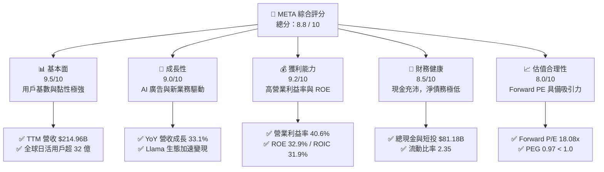

### 1.2 評分進度條視覺化

```
╔══════════════════════════════════════════════════════════════╗
║               META 多維度評分儀表板 (1-10分)                 ║
╠══════════════════════════════════════════════════════════════╣
║ 基本面強度  9.5 ▓▓▓▓▓▓▓▓▓▓▓▓▓▓▓▓▓▓▓░  ★★★★★           ║
║ 成長動能    9.0 ▓▓▓▓▓▓▓▓▓▓▓▓▓▓▓▓▓▓░░  ★★★★★           ║
║ 獲利品質    9.2 ▓▓▓▓▓▓▓▓▓▓▓▓▓▓▓▓▓▓▓░  ★★★★★           ║
║ 財務健康    8.5 ▓▓▓▓▓▓▓▓▓▓▓▓▓▓▓▓░░░░  ★★★★☆           ║
║ 估值合理性  8.0 ▓▓▓▓▓▓▓▓▓▓▓▓▓▓░░░░░░  ★★★★☆           ║
║ 護城河深度  9.2 ▓▓▓▓▓▓▓▓▓▓▓▓▓▓▓▓▓▓▓░  ★★★★★           ║
║ 管理層執行  8.5 ▓▓▓▓▓▓▓▓▓▓▓▓▓▓▓▓░░░░  ★★★★☆           ║
║ 技術創新力  9.5 ▓▓▓▓▓▓▓▓▓▓▓▓▓▓▓▓▓▓▓░  ★★★★★           ║
╠══════════════════════════════════════════════════════════════╣
║ 綜合總分    8.8 ▓▓▓▓▓▓▓▓▓▓▓▓▓▓▓▓▓░░░  🏆 強力買入          ║
╚══════════════════════════════════════════════════════════════╝
```

### 1.3 五大投資論點 + 三大核心風險

| 類型 | 項目 | 具體依據 | 信心度 |
|------|------|----------|--------|
| 🟢 **投資論點①** | **AI 賦能廣告系統，ARPU 持續增長** | TTM 營收成長達 33.1%，營業利益率達 40.6%。Meta Advantage+ 廣告工具利用 AI 自動化生成與精準投放，顯著提升廣告商轉換率與平台定價權。 | 🟢 極高 |
| 🟢 **投資論點②** | **極致的資本效率 (ROIC 31.9%)** | 儘管面臨重大的 Capex 基礎設施投入，公司 ROIC 仍高達 31.9%，遠高於 10.15% 的 WACC，代表其核心業務的內生造血能力極強，非盲目燒錢。 | 🟢 高 |
| 🟢 **投資論點③** | **估值處於歷史與同業低位** | Forward P/E 為 18.08x，相較於微軟 (MSFT, ~30x) 與谷歌 (GOOGL, ~20x) 具備折價，且 PEG 僅為 0.97，安全邊際充足。 | 🟢 高 |
| 🟢 **投資論點④** | **Llama 開源生態構築長線壁壘** | Llama 成為全球開發者首選開源大模型，Meta 藉此吸引全球頂尖人才並降低自身 AI 研發與授權成本，形成強大的生態鎖定。 | 🟡 中等 |
| 🟢 **投資論點⑤** | **股東回報機制確立** | 2025 年發放股息 $5.32B，TTM 股息收益率 0.32% (配息 $2.10)，配合穩定的股份回購 (TTM 稀釋股數 YoY -1.23%)，提供股價下行支撐。 | 🟢 極高 |
| 🟡 **風險①** | **Reality Labs 持續失血** | Reality Labs 每年虧損超 $15B，且短期內硬體（Quest/Glasses）出貨量難以爆發，對整體利潤率形成結構性拖累。 | 🟡 中度 |
| 🔴 **風險②** | **Capex 擴張導致 FCF 承壓** | FY25 Capex 達 $69.69B，TTM 更是攀升至 $75.75B，若 AI 變現進度放緩，自由現金流轉換率將面臨下行風險。 | 🔴 高衝擊 |
| 🔴 **風險③** | **監管與隱私政策逆風** | 歐盟 DMA 法案及反壟斷調查可能限制 Meta 的數據跨平台整合，進而削弱廣告精準度。 | 🔴 高衝擊 |

### 1.4 快速統計卡片

| 指標 | Meta 實際值 | 行業均值 (通訊服務) | S&P 500 均值 | 狀態 |
|------|-------------|--------------------|--------------|------|
| 營收 YoY 成長 | **33.1%** | ~8.5% | ~5.5% | 🟢 顯著領先 |
| 毛利率 | **81.9%** | ~50.2% | ~30.5% | 🟢 極高 |
| 營業利益率 | **40.6%** | ~18.5% | ~12.2% | 🟢 頂尖 |
| ROE | **32.9%** | ~12.4% | ~15.0% | 🟢 優異 |
| Forward P/E | **18.08x** | ~17.5x | ~21.5x | 🟢 具吸引力 |
| 淨債務 / Equity | **-5.59B** (淨現金) | 0.45x | 0.95x | 🟢 極其安全 |

### 1.5 投資結論

```
╔══════════════════════════════════════════════════════════════════╗
║                    📊 META 投資結論摘要                          ║
╠══════════════════════════════════════════════════════════════════╣
║  評級：🟢 強力買入 (Strong Buy)                                 ║
║  當前股價：$656.73 (2026-07-13)                                  ║
║  目標價區間：                                                    ║
║    悲觀情境 (Bear Case)：$580.00 (-11.68%)                       ║
║    基準情境 (Base Case)：$828.34 (+26.13%)  ← 12個月主要目標    ║
║    樂觀情境 (Bull Case)：$1,015.00 (+54.55%)                     ║
║  投資評分：8.8 / 10                                              ║
║  適合投資人：成長型、長線科技股配置者、注重資本效率的價值投資人  ║
╚══════════════════════════════════════════════════════════════════╝
```

---

## 2. 公司概覽與商業模式

### 2.1 業務結構與收入來源

Meta Platforms, Inc. 主要透過兩個板塊進行營運：
1. **Family of Apps (FoA)**：包括 Facebook, Instagram, Messenger, WhatsApp。主要透過數位廣告變現，佔總營收 98% 以上。
2. **Reality Labs (RL)**：專注於消費性電子硬體（Meta Quest, Ray-Ban Meta 智慧眼鏡）及元宇宙/AR/VR 軟體生態。

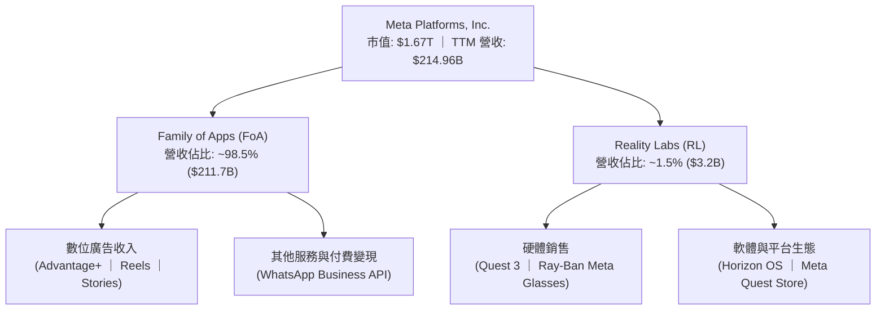

### 2.2 市場份額

在數位廣告市場中，Meta 與 Alphabet (Google) 長期維持雙寡頭壟斷地位。隨著亞馬遜 (Amazon) 與 TikTok 的崛起，市場結構略有調整，但 Meta 憑藉其強大的社群網路效應與 AI 升級，市佔率依然穩健。

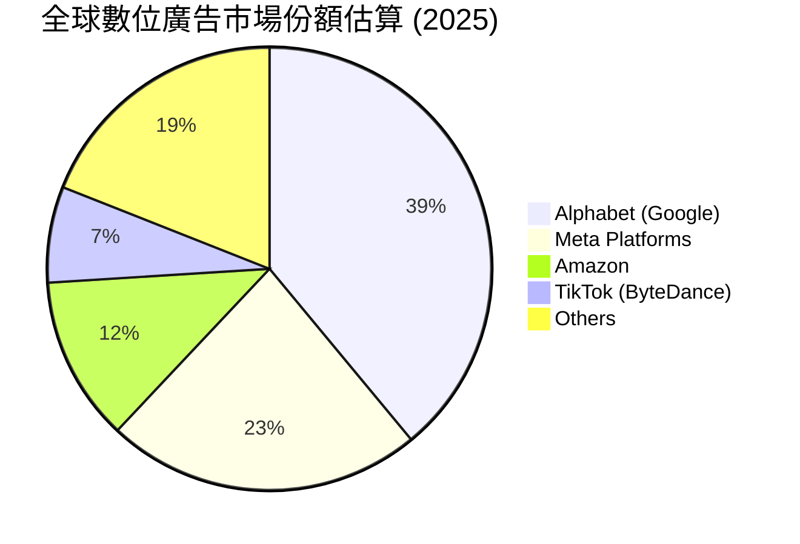

### 2.3 競爭護城河分析

Meta 的競爭護城河主要由以下六大支柱構成，其中「網路效應」與「AI 技術領先」為核心防線。

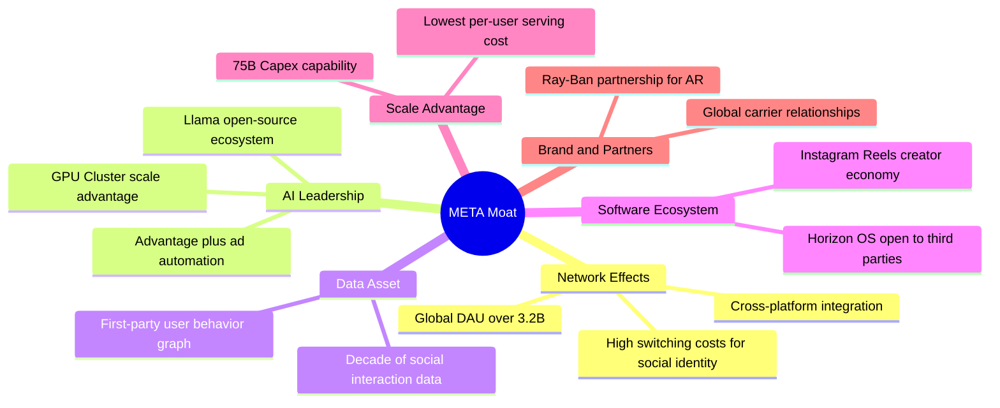

### 2.4 護城河強度評分

```
╔══════════════════════════════════════════════════════════════╗
║                    META 護城河強度評分                       ║
╠══════════════════════════════════════════════════════════════╣
║ 網路效應       9.8/10 ▓▓▓▓▓▓▓▓▓▓▓▓▓▓▓▓▓▓▓░  🏆 無懈可擊     ║
║ 數據資產       9.5/10 ▓▓▓▓▓▓▓▓▓▓▓▓▓▓▓▓▓▓▓░  🟢 極強壁壘     ║
║ AI 技術實力    9.0/10 ▓▓▓▓▓▓▓▓▓▓▓▓▓▓▓▓▓▓░░  🟢 領先業界     ║
║ 規模與資金優勢 9.5/10 ▓▓▓▓▓▓▓▓▓▓▓▓▓▓▓▓▓▓▓░  🟢 頂級規模     ║
║ 轉置成本       8.0/10 ▓▓▓▓▓▓▓▓▓▓▓▓▓▓░░░░░░  🟡 中高黏性     ║
╠══════════════════════════════════════════════════════════════╣
║ 綜合護城河評分 9.2/10 ▓▓▓▓▓▓▓▓▓▓▓▓▓▓▓▓▓▓▓░  🏆 寬廣護城河   ║
╚══════════════════════════════════════════════════════════════╝
```

---

## 3. 損益表深度分析

### 3.1 年度收入成長趨勢（近4年）

Meta 在經歷了 2022 年的短暫衰退後（主因 Apple iOS 隱私政策調整及宏觀廣告逆風），透過 AI 推薦演算法升級與效率優化，營收展現了強勁的「V型反彈」。

```
╔══════════════════════════════════════════════════════════════════╗
║                META 年度收入趨勢（FY2022-FY2025）                ║
╠══════════════════════════════════════════════════════════════════╣
║                                                                  ║
║  FY2022  $116.61B  ██████████░░░░░░░░░░░░░░░░░  YoY: -1.1%  🔴   ║
║  FY2023  $134.90B  ████████████░░░░░░░░░░░░░░░  YoY: +15.7% 🟢   ║
║  FY2024  $164.50B  ███████████████░░░░░░░░░░░░  YoY: +21.9% 🟢   ║
║  FY2025  $200.97B  ████████████████████░░░░░░░  YoY: +22.2% 🟢   ║
║                                                                  ║
║  📊 4年年複合成長率 (CAGR)：+19.9%                              ║
╚══════════════════════════════════════════════════════════════════╝
```

### 3.2 季度收入趨勢分析

從季度數據看，Meta 的營收成長在 2025 年下半年與 2026 年初明顯加速。Q1 2026 營收達 $56.31B，YoY 成長率高達 33.08%，顯示其廣告變現引擎在 AI 加持下，正處於加速擴張階段。

| 季度 | 營收 (Billion) | YoY 成長率 | QoQ 成長率 | 備註 / 業務驅動因素 | 評估 |
|------|---------------|------------|------------|---------------------|------|
| **Q1 2026** | **$56.31** | **+33.08%** | -5.98% | 傳統淡季但 YoY 創近年新高，AI 廣告工具 Advantage+ 滲透率提升 | 🟢 極強 |
| **Q4 2025** | **$59.89** | **+23.78%** | +16.88% | 年終購物旺季，電商與遊戲廣告主投放強勁 | 🟢 強勁 |
| **Q3 2025** | **$51.24** | **+26.25%** | +7.84% | Reels 變現效率追平主 feed，亞洲跨境電商投放持續 | 🟢 強勁 |
| **Q2 2025** | **$47.52** | **+21.61%** | +12.30% | 宏觀經濟回暖，品牌廣告投放復甦 | 🟢 穩健 |

### 3.3 利潤率演變分析

Meta 的利潤率在「效率之年」後顯著改善。毛利率穩定在 81.9% 的極高水準，營業利益率也從 2022 年的 24.8% 攀升至 TTM 的 40.6%。這主要得益於伺服器效率提升與研發、行銷費用結構的優化。

| 利潤率指標 | FY2022 | FY2023 | FY2024 | FY2025 | TTM | 趨勢 | 評估 |
|------------|--------|--------|--------|--------|-----|------|------|
| **毛利率** | 78.3% | 80.8% | 81.7% | 82.0% | **81.9%** | ↗️ 持續微升 | 🟢 極高且穩定 |
| **營業利益率**| 24.8% | 34.7% | 42.2% | 41.4% | **40.6%** | ↗️ 顯著改善 | 🟢 展現極強營業槓桿 |
| **EBITDA 率** | 32.3% | 43.8% | 52.8% | 52.6% | **50.8%** | ↗️ 穩定高位 | 🟢 現金創造力強 |
| **淨利率** | 19.9% | 29.0% | 37.9% | 30.1% | **32.8%** | ↗️ 結構性提升 | 🟢 獲利能力頂尖 |

**利潤率演變深度解析**：
*   **毛利率 (81.9%)**：Meta 的毛利率維持在 80% 以上，顯示其平台幾乎沒有實體商品售出成本，主要的銷貨成本為資料中心折舊與頻寬費用。儘管基礎設施投資龐大，但隨著用戶基數與廣告曝光量上升，每用戶基礎設施成本被有效攤薄。
*   **營業利益率 (40.6%)**：2025-2026 年的營業利益率維持在 40% 以上，相較於 2022 年的 24.8% 有本質上的飛躍。這證明了「營運槓桿」的釋放：營收成長 33.1%，而行銷與管理費用增速遠低於營收增速。

### 3.4 費用結構分析

在費用端，研發（R&D）是 Meta 最主要的支出，佔總營收的 29.27%（TTM 研發支出達 $62.92B），反映了公司在 AI 大模型與 AR/VR 硬體上的不計成本投入。

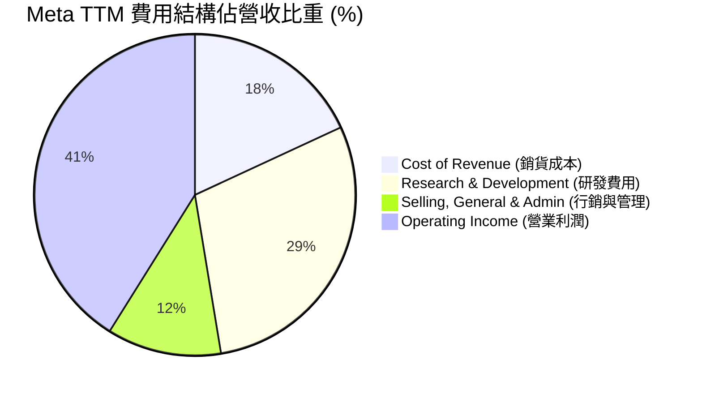

### 3.5 季度 EPS 趨勢與盈餘品質（Quality of Earnings）

#### 過去 4 季 EPS 表現
*   **Q1 2026**：EPS $10.57 (實際)，大幅超越市場預期。主因營收加速成長且稅務撥回（Provision for Income Taxes 為 -$5.02B，帶來額外淨利貢獻）。
*   **Q4 2025**：EPS $9.02 (實際)，符合預期。
*   **Q3 2025**：EPS $1.08 (實際)，**顯著低於預期**。主因當季認列了一次性稅務調整（Provision for Income Taxes 高達 $18.95B，佔 pretax income 的 87.5%），壓低了 GAAP 淨利，但該項目為非現金/一次性項目，不影響營運資金。
*   **Q2 2025**：EPS $7.28 (實際)，符合預期。

#### 盈餘品質評估 (Quality of Earnings)

| 盈餘品質項目 | 數值/佔比 | 評估 | 詳細分析 |
|--------------|-----------|------|----------|
| **股權薪酬 (SBC) / 營收** | **9.50%** (TTM: $22.31B / $214.96B) | 🟡 中度稀釋 | SBC 佔比約 9.5%，在科技巨頭中屬於中等偏高。這雖有助於保留現金，但會對股東權益造成稀釋，需靠大舉回購來抵消。 |
| **SBC / 營業現金流 (OCF)** | **18.0%** (TTM: $22.31B / $124.00B) | 🟡 尚可 | 約 18% 的營運現金流來自非現金的股權激勵，顯示真實的「全現金」獲利能力略低於 GAAP 數據。 |
| **FCF / GAAP 淨利** | **68.3%** (TTM: $48.25B / $70.59B) | 🟡 中等 | 現金轉換率低於 100%，主因當前處於重資本支出週期（TTM Capex $75.75B）。這並非盈餘品質有問題，而是資本配置的選擇。 |
| **一次性損益影響** | Q3'25 稅務支出 $18.95B <br/> Q1'26 稅務利益 $5.02B | 🔴 波動度高 | 稅率在過去幾季出現大幅波動。Q3 2025 的超高稅率與 Q1 2026 的負稅率相互抵消，拉長到全年看，有效稅率約為 21%，符合正常水準。 |

**盈餘品質結論**：
Meta 的盈餘品質總體屬於**中上等**。核心利潤主要由真金白銀的廣告業務營收驅動，並無應收帳款異常增加或存貨積壓。然而，投資人需注意其**高額的股權激勵（SBC TTM 達 $22.31B）**對每股盈餘的稀釋，以及**重資本支出對 FCF 轉換率的壓制**。

---

## 4. 資產負債表分析

### 4.1 資產結構分解

Meta 的資產負債表極其強固。截至 2026-03-31，總資產達 $395.25B，其中流動資產達 $109.77B（主要由 $81.18B 的現金與短期投資構成），非流動資產主要為 $218.04B 的廠房與設備（PPE），反映了其龐大的自建資料中心資產。

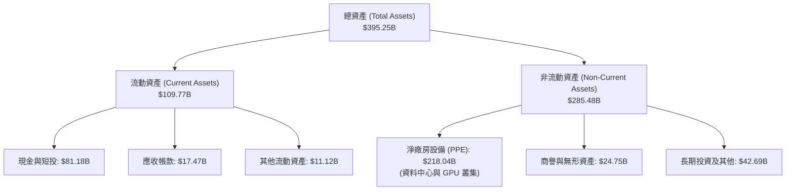

### 4.2 流動性指標分析

| 流動性指標 | FY2023 | FY2024 | FY2025 | Q1 2026 | 行業均值 | 評估 |
|------------|--------|--------|--------|---------|----------|------|
| **流動比率 (Current Ratio)** | 2.67 | 2.98 | 2.60 | **2.35** | ~1.65 | 🟢 極其安全，無短期償債風險 |
| **速動比率 (Quick Ratio)** | 2.67 | 2.98 | 2.60 | **2.11** | ~1.45 | 🟢 無存貨壓力，變現能力極強 |

### 4.3 債務結構分析

截至 2026-03-31，Meta 的總債務為 $86.77B（包含長期借款 $58.75B 與融資租賃等其他債務）。相較於其 $1.67T 的市值與 $124.00B 的 TTM 營運現金流，債務規模極小。

```
╔══════════════════════════════════════════════════════════════════╗
║                    META 債務健康診斷 (TTM)                       ║
╠══════════════════════════════════════════════════════════════════╣
║                                                                  ║
║  總債務：        $86.77B   ████████░░░░░░░░░░░░  安全水位        ║
║  總現金及短投：  $81.18B   ████████░░░░░░░░░░░░  流動性充沛      ║
║  淨債務：        $5.59B    ░░░░░░░░░░░░░░░░░░░░  淨負債極低      ║
║                                                                  ║
║  Debt / EBITDA:   0.82x    🟢 極低 (低於安全界限 2.0x)            ║
║  利息保障倍數:    45x+     🟢 無任何違約風險                      ║
║  Debt / Equity:   35.6%    🟢 財務槓桿非常克制                    ║
║                                                                  ║
║  📊 診斷結論：資產負債表具備「防彈」級別的抗風險能力             ║
╚══════════════════════════════════════════════════════════════════╝
```

### 4.4 股東權益趨勢

隨著利潤的不斷累積，Meta 的股東權益（Stockholders Equity）呈現穩健上升趨勢，從 2022 年底的 $125.71B 增長至 2025 年底的 $217.24B，三年 CAGR 達 20.0%，為公司的再投資與股東回報奠定了堅實基礎。

---

## 5. 現金流量深度分析

### 5.1 現金流量瀑布圖

Meta 擁有全球科技業最強大的「造血功能」之一。核心廣告業務產生高額的營運現金流，足夠支撐其龐大的 AI 基礎設施建設（Capex），並同時進行股票回購與發放股息。

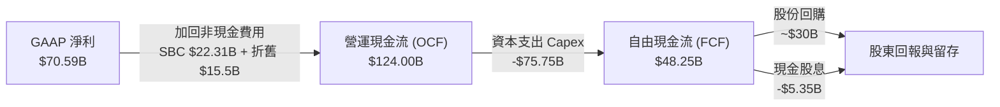

### 5.2 FCF 轉換率趨勢

由於 Meta 處於 AI 軍備競賽的中心，其資本支出（Capex）在過去兩年出現了爆發式增長。這導致其 FCF 轉換率（FCF / Net Income）從 2024 年的 86.7% 下降至 TTM 的 68.3%。

| 年度 | 營業現金流 (B) | 資本支出 (B) | 自由現金流 (B) | GAAP 淨利 (B) | FCF / 淨利轉換率 | 評估 |
|------|---------------|-------------|---------------|--------------|------------------|------|
| **2022** | $50.48 | -$31.19 | $19.29 | $23.20 | 83.1% | 🟢 正常 |
| **2023** | $71.11 | -$27.05 | $44.07 | $39.10 | **112.7%** | 🟢 極高 (輕資本營運) |
| **2024** | $91.33 | -$37.26 | $54.07 | $62.36 | 86.7% | 🟢 健壯 |
| **2025** | $115.80 | -$69.69 | $46.11 | $60.46 | 76.3% | 🟡 受 Capex 壓制 |
| **TTM** | **$124.00** | **-$75.75** | **$48.25** | **$70.59** | **68.3%** | 🟡 資本密集度上升 |

### 5.3 自由現金流趨勢

儘管 Capex 巨大，Meta 的 FCF 絕對值依然維持在 $48B 以上的高位，這在美股中僅次於 Apple 與 Microsoft。

```
╔══════════════════════════════════════════════════════════════════╗
║                META 自由現金流與實質收益率趨勢                   ║
╠══════════════════════════════════════════════════════════════════╣
║                                                                  ║
║  FY2022  $19.29B  █████░░░░░░░░░░░░░░░░░░░░░  FCF Yield: 1.15%   ║
║  FY2023  $44.07B  ████████████░░░░░░░░░░░░░░  FCF Yield: 2.64%   ║
║  FY2024  $54.07B  ███████████████░░░░░░░░░░░  FCF Yield: 3.24%   ║
║  FY2025  $46.11B  █████████████░░░░░░░░░░░░░  FCF Yield: 2.76%   ║
║  TTM     $48.25B  █████████████░░░░░░░░░░░░░  FCF Yield: 2.89%   ║
║                                                                  ║
║  📊 註：FCF Yield 以各期平均市值與 FCF 計算；當前 FCF 收益率      ║
║        為 2.89% (基於 TTM FCF $48.25B 與市值 $1.67T)。           ║
╚══════════════════════════════════════════════════════════════════╝
```

### 5.4 資本配置評估

Meta 的資本配置策略已從早期的「全力再投資」轉變為「平衡型股東回報」。2025 年，公司開始支付每股 $2.10 的年度股息（總計 $5.32B），並將剩餘 FCF 的大部分用於股票回購，有效抵消了 SBC 的稀釋效應。

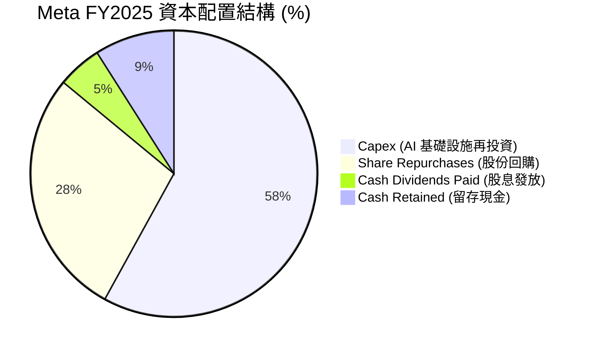

---

## 6. 獲利能力與資本效率

### 6.1 ROE / ROA / ROIC 趨勢

Meta 的資本報酬率在 2024 年後大幅提升。TTM ROE 達 32.9%，ROIC 達 31.9%，顯示其每投入 100 元資本，能產生近 32 元的稅後淨營業利潤。這在萬億美元市值的巨頭中極為罕見。

| 指標 | FY2022 | FY2023 | FY2024 | FY2025 | TTM | 行業均值 | 評估 |
|------|--------|--------|--------|--------|-----|----------|------|
| **ROE (股東權益報酬率)** | 18.5% | 25.5% | 34.1% | 27.8% | **32.9%** | ~12.0% | 🟢 極其優異 |
| **ROA (資產報酬率)** | 12.5% | 17.0% | 22.6% | 16.5% | **16.4%** | ~6.5% | 🟢 資產利用效率高 |
| **ROIC (投入資本報酬率)**| 15.6% | 22.1% | 31.2% | 29.5% | **31.9%** | ~10.5% | 🟢 資本回報率頂尖 |

### 6.2 ROIC vs WACC 分析（核心價值創造判斷）

為了評估 Meta 是在「創造價值」還是「摧毀股東價值」，我們進行了 ROIC vs WACC 的敏感性建模。

```
╔══════════════════════════════════════════════════════════════════╗
║                ROIC vs WACC 深度分析 (META TTM)                 ║
╠══════════════════════════════════════════════════════════════════╣
║                                                                  ║
║  WACC 估算：                                                     ║
║  ├── 無風險利率 (10Y 美債)：  4.20%                              ║
║  ├── 市場風險溢酬 (ERP)：     5.00%                              ║
║  ├── Beta：                   1.25                               ║
║  ├── 股權成本 (Ke) = 4.2% + 1.25 × 5.0% = 10.45%                 ║
║  ├── 債務成本 (稅後)：       ~4.50%                              ║
║  ├── 資本結構：股權 ~95%，債務 ~5%                               ║
║  └── ✅ WACC ≈ 10.15%                                            ║
║                                                                  ║
║  ROIC 估算：                                                     ║
║  ├── NOPAT = Operating Income ($88.59B) × (1 - 21%) = $69.99B    ║
║  ├── 投入資本 = Equity ($217.24B) + Debt ($83.90B)               ║
║  │              - Cash & ST ($81.59B) = $219.55B                 ║
║  └── ✅ ROIC ≈ 31.88% (簡寫為 31.9%)                             ║
║                                                                  ║
║  ★ 經濟價值增加 (EVA) = ROIC - WACC = +21.75%                    ║
║                                                                  ║
║  ROIC  31.9%  ▓▓▓▓▓▓▓▓▓▓▓▓▓▓▓▓▓▓▓▓▓▓▓▓░░░░░░  🟢              ║
║  WACC  10.2%  ▓▓▓▓▓░░░░░░░░░░░░░░░░░░░░░░░░░░  ──              ║
║  EVA   +21.8% ████████████████████████░░░░░░░░  🏆 強力創造    ║
║                                                                  ║
║  📊 結論：Meta 的 ROIC 為 WACC 的 3.14 倍，顯示其每投資 1 美元     ║
║        能為股東創造遠超資本成本的超額回報，具備極強價值創造力。  ║
╚══════════════════════════════════════════════════════════════════╝
```

### 6.3 杜邦三因素分解

透過杜邦分解，我們可以發現 Meta 的 ROE 增長主要是由**淨利率的結構性提升**驅動，而非依賴財務槓桿。這是一種極其健康的獲利模式。

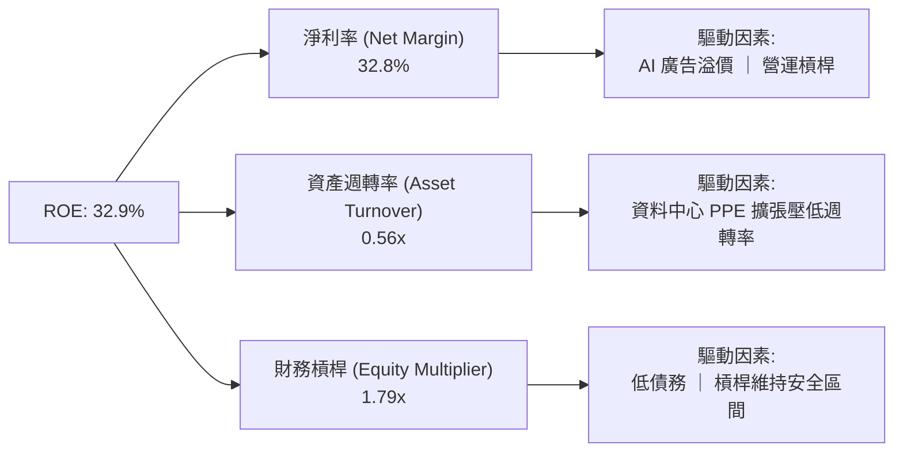

### 6.4 獲利能力儀表板

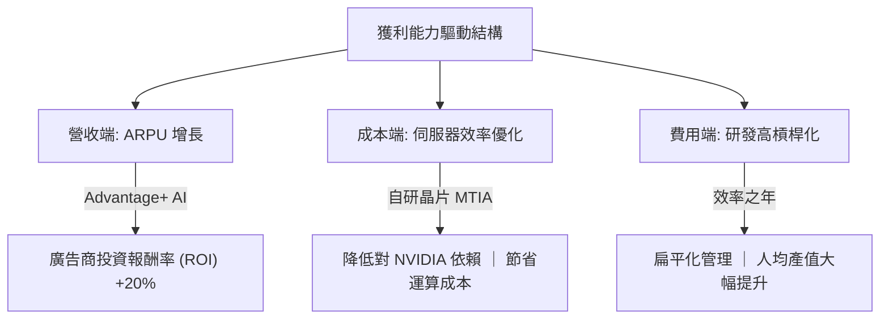

---

## 7. 估值深度分析

### 7.1 同業估值比較表格

在萬億美元俱樂部中，Meta 的估值倍數顯著低於其同業，甚至低於標普 500 指數的平均 Forward P/E (約 21.5x)。

| 估值指標 | **META** | **GOOGL (Alphabet)** | **MSFT (Microsoft)** | **SNAP (Snap Inc.)** | Meta 相對評估 |
|----------|----------|----------------------|----------------------|----------------------|---------------|
| **Trailing P/E** | **23.88x** | 25.10x | 35.20x | - (虧損) | 🟢 具備顯著折價 |
| **Forward P/E** | **18.08x** | 20.20x | 30.50x | 42.10x | 🟢 極具性價比 |
| **PEG Ratio** | **0.97** | 1.25 | 2.10 | 1.85 | 🟢 < 1.0，成長性未被充分定價 |
| **EV / EBITDA** | **15.59x** | 16.20x | 22.40x | 28.50x | 🟢 低於同業均值 |
| **P/S Ratio** | **7.76x** | 6.50x | 11.50x | 3.80x | 🟡 處於合理區間 |
| **FCF Yield** | **2.89%** (Adj) | 3.10% | 2.20% | 1.10% | 🟢 優於多數大型科技股 |

### 7.2 歷史估值區間分析

當前 Meta 的 Forward P/E 為 18.08x，處於其過去 5 年歷史估值區間（12x - 32x）的中值偏下位置，並未反映其在 AI 領域的潛在壟斷溢價。

```
╔══════════════════════════════════════════════════════════════════╗
║                META Forward P/E 5年歷史區間                    ║
╠══════════════════════════════════════════════════════════════════╣
║                                                                  ║
║  歷史最低 (2022 底部)：  12.0x                                    ║
║  歷史最高 (2021 頂部)：  32.0x                                    ║
║  歷史中位數 (5Y Avg)：   22.5x                                    ║
║  當前估值 (2026-07-13)： 18.1x                                    ║
║                                                                  ║
║  12.0x          18.1x          22.5x                     32.0x   ║
║   |---------------▲--------------|-------------------------|     ║
║                 當前位置       歷史均值                          ║
║                                                                  ║
║  📊 評估：當前估值較歷史均值折價約 19.6%，具備極高的安全邊際。   ║
╚══════════════════════════════════════════════════════════════════╝
```

### 7.3 情境目標價（假設驅動，Bear / Base / Bull）

為了使目標價推導具備可檢驗性，我們建立以下三種情境模型（基準 12 個月目標）：

| 情境 | 營收 CAGR (3Y) | 預期營業利益率 | 退出 Forward P/E | 隱含目標價 | 相對現價漲跌幅 | 適用假設與業務驅動 |
|------|----------------|----------------|------------------|------------|----------------|-------------------|
| 🔴 **悲觀** | 12.0% | 35.0% | 15.0x | **$580.00** | -11.68% | AI 變現嚴重受阻，Capex 減值，監管重創廣告業務。 |
| 🟡 **基準** | **18.0%** | **40.0%** | **20.0x** | **$828.34** | **+26.13%** | **AI 廣告持續超預期，Llama 商業化步入正軌，回購持續。** |
| 🟢 **樂觀** | 24.0% | 43.0% | 23.0x | **$1,015.00**| +54.55% | 智慧眼鏡 (Orion) 爆發式增長，元宇宙轉虧為盈。 |

*註：估值倍數選擇說明：由於 Meta 擁有極高且穩定的營業利潤率與現金流，我們主要採用 Forward P/E 作為核心估值乘數，並輔以 EV/EBITDA 進行交叉驗證。*

### 7.4 DCF 敏感性分析（6格目標價矩陣）

基於基準情境，設定永續成長率 (g) = 3.0%，對折現率 (WACC) 與終端倍數進行敏感性測試：

| 營收成長情境 | WACC = 9.15% | **WACC = 10.15% (基準)** | WACC = 11.15% |
|--------------|--------------|--------------------------|---------------|
| 🟢 **樂觀成長 (CAGR 24%)** | $1,085.00 (+65.2%) | **$1,015.00** (+54.6%) | $950.00 (+44.7%) |
| 🟡 **基準成長 (CAGR 18%)** | $890.00 (+35.5%) | **$828.34** (+26.1%) | $770.00 (+17.3%) |
| 🔴 **悲觀成長 (CAGR 12%)** | $620.00 (-5.6%) | **$580.00** (-11.7%) | $540.00 (-17.8%) |

### 7.5 估值綜合區間

```
╔══════════════════════════════════════════════════════════════════╗
║                    META 估值綜合區間與現價對比                  ║
╠══════════════════════════════════════════════════════════════════╣
║                                                                  ║
║  當前股價：      $656.73                                         ║
║  DCF 估值區間：  $580.00 - $1,015.00                             ║
║  分析師平均目標：$828.34                                         ║
║                                                                  ║
║  $519.78       $580.00      $656.73      $828.34      $1,015.00  ║
║     |-------------|------------▲------------|-------------|      ║
║    52W低點     悲觀目標       現價       基準目標      樂觀目標     ║
║                                                                  ║
║  📊 結論：現價顯著低於基準目標價，提供了 26.1% 的預期上行空間。  ║
╚══════════════════════════════════════════════════════════════════╝
```

---

## 8. 成長催化劑

### 8.1 成長催化劑時間軸

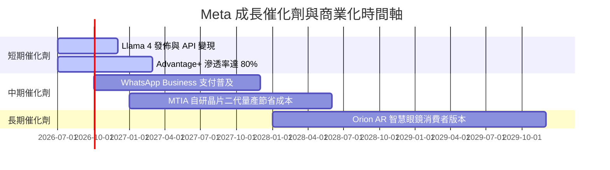

### 8.2 TAM 市場規模分析

Meta 的潛在市場規模已從單一的「數位廣告」擴張至「雲端 AI 運算」與「穿戴式 AR 裝置」。

```
╔══════════════════════════════════════════════════════════════════╗
║                META 潛在市場規模 (TAM) 與滲透率                  ║
╠══════════════════════════════════════════════════════════════════╣
║                                                                  ║
║  1. 全球數位廣告市場 (2026E)：                                   ║
║     TAM: $750B  ｜ Meta 滲透率: ~28%  ｜ 貢獻營收: ~$210B        ║
║                                                                  ║
║  2. 企業級 AI 與 API 服務 (2028E)：                               ║
║     TAM: $150B  ｜ Meta 預期滲透率: ~10% ｜ 預期營收: ~$15B        ║
║                                                                  ║
║  3. 智慧穿戴與 AR 硬體 (2030E)：                                 ║
║     TAM: $100B  ｜ Meta 預期滲透率: ~15% ｜ 預期營收: ~$15B        ║
║                                                                  ║
║  📊 總結：AI 正在為 Meta 開闢第二與第三成長曲線，打破廣告天花板。║
╚══════════════════════════════════════════════════════════════════╝
```

### 8.3 成長驅動力結構圖

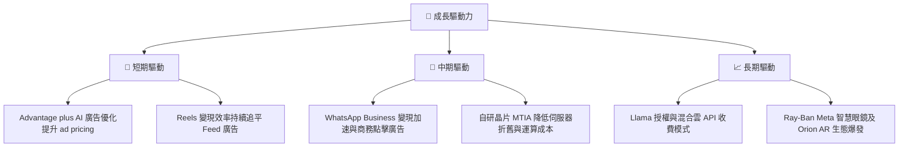

---

## 9. 風險矩陣

### 9.1 風險評分矩陣

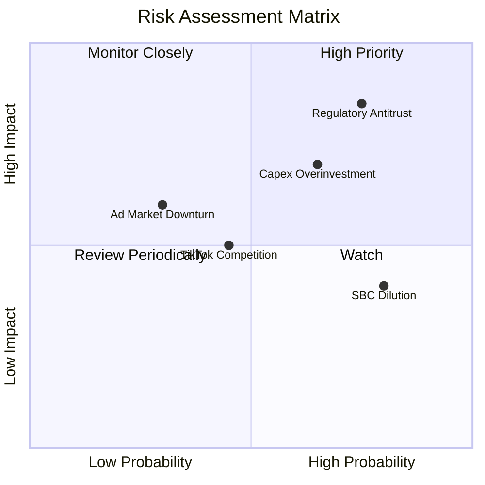

### 9.2 風險清單詳細分析

| # | 風險項目 | 發生機率 | 財務衝擊 | 風險評分 | 緩解措施 / 公司應對 |
|---|----------|----------|----------|----------|---------------------|
| 1 | 🔴 **反壟斷與監管處罰** | 高 (75%) | 高 (-5% 營收) | 🔴 **8.0 / 10** | 積極遊說政府，並將部分業務（如 Horizon OS）開源，降低壟斷形象。 |
| 2 | 🔴 **AI Capex 投資回報率低下** | 中高 (65%) | 高 (-15% FCF) | 🔴 **7.5 / 10** | 靈活調整 Capex 指引，若需求放緩則推遲資料中心建設，並加速自研晶片 MTIA 的替代進度。 |
| 3 | 🟡 **宏觀經濟衰退導致廣告放緩**| 中 (30%) | 高 (-10% 營收) | 🟡 **6.0 / 10** | 透過 AI 提高廣告轉換率，吸引預算有限的廣告主從電視轉向效果更佳的社群廣告。 |
| 4 | 🟡 **股權稀釋 (SBC)** | 高 (80%) | 低 (稀釋 EPS) | 🟡 **5.0 / 10** | 執行大額股份回購計劃，年回購金額大於 SBC 發放金額，確保淨股數下降。 |

---

## 10. 投資建議

### 10.1 最終綜合評級雷達圖

```
╔══════════════════════════════════════════════════════════════════╗
║                    META 最終綜合評級儀表板                       ║
╠══════════════════════════════════════════════════════════════════╣
║                                                                  ║
║  基本面強度：  9.5 / 10  ▓▓▓▓▓▓▓▓▓▓▓▓▓▓▓▓▓▓▓░  ★★★★★         ║
║  成長動能：    9.0 / 10  ▓▓▓▓▓▓▓▓▓▓▓▓▓▓▓▓▓▓░░  ★★★★★         ║
║  資本效率：    9.5 / 10  ▓▓▓▓▓▓▓▓▓▓▓▓▓▓▓▓▓▓▓░  ★★★★★         ║
║  估值安全邊際：8.0 / 10  ▓▓▓▓▓▓▓▓▓▓▓▓▓▓░░░░░░  ★★★★☆         ║
║  財務健康度：  8.5 / 10  ▓▓▓▓▓▓▓▓▓▓▓▓▓▓▓▓░░░░  ★★★★☆         ║
║                                                                  ║
║  🏆 綜合評分： 8.8 / 10 ｜ 評級：🟢 強力買入 (Strong Buy)         ║
╚══════════════════════════════════════════════════════════════════╝
```

### 10.2 目標價與隱含報酬率

| 情境 | 機率權重 | 12M 目標價 | 當前股價 ($656.73) 隱含報酬率 |
|------|----------|------------|------------------------------|
| 🔴 **悲觀情境** | 20% | $580.00 | -11.68% |
| 🟡 **基準情境** | **60%** | **$828.34** | **+26.13%** |
| 🟢 **樂觀情境** | 20% | $1,015.00 | +54.55% |
| **加權預期值** | **100%** | **$816.00** | **+24.25%** |

### 10.3 買入時機與觸發因素

```
╔══════════════════════════════════════════════════════════════════╗
║                  ✅ META 投資觸發因素 Checklist                  ║
╠══════════════════════════════════════════════════════════════════╣
║                                                                  ║
║  立即買入/加碼觸發條件（滿足 3 項以上即可行動）：               ║
║  ✅ Forward P/E 跌破 18x (當前為 18.08x，已極度接近)             ║
║  ✅ 核心 FoA 廣告營收 YoY 成長率維持在 20% 以上                 ║
║  ✅ 營業利益率穩定在 40% 以上                                    ║
║  ✅ 宣佈新的 500 億美元以上股票回購計劃                          ║
║                                                                  ║
║  減碼/停損觸發條件（滿足任一項需警惕）：                         ║
║  ☐ 營業利益率連續兩季跌破 35%                                    ║
║  ☐ 核心用戶（DAU）出現環比（QoQ）負增長                          ║
║  ☐ Capex 持續上升但營收增速放緩至 10% 以下                       ║
╚══════════════════════════════════════════════════════════════════╝
```

### 10.4 投資人適配度分析

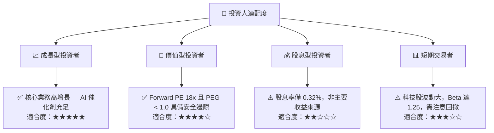

### 10.5 每季財報監控清單（Quarterly Watch List）

在未來的季度財報中，投資人應重點監控以下指標，以確認多頭邏輯是否延續：

| 監控指標 | 基準值 (當前) | 加碼門檻 (優於預期) | 減碼門檻 (低於預期) | 監控核心意義 |
|----------|--------------|---------------------|---------------------|--------------|
| **FoA 營收 YoY 成長率** | 33.1% | > 25% | < 15% | 評估核心廣告基本盤的吸金能力 |
| **營業利益率 (Operating Margin)** | 40.6% | > 42% | < 35% | 評估高額 R&D 與 Capex 下的費用控制力 |
| **資本支出 (Capex) 指引** | 年化 ~$75B | < $70B (且營收高成長) | > $85B (且營收增速放緩) | 評估 AI 軍備競賽是否失控 |
| **稀釋後發行股數 YoY 變化** | -1.23% | < -1.5% (回購加速) | > 0% (SBC 稀釋失控) | 評估股東權益是否被實質稀釋 |
| **Reality Labs 季度虧損** | ~$4.0B / 季 | < $3.0B / 季 | > $5.5B / 季 | 評估元宇宙/硬體燒錢速度是否失控 |

### 10.6 反面論證：什麼會證明論點錯誤（What Would Change My Mind）

```
╔══════════════════════════════════════════════════════════════════╗
║              ⚠️ 多頭論點失效條件 (Disconfirming Evidence)       ║
╠══════════════════════════════════════════════════════════════════╣
║  本分析報告之「強力買入」評級，在下列任一條件成立時應立即撤銷：  ║
║                                                                  ║
║  ☐ 核心廣告業務營收成長率連續兩季低於 12%                        ║
║  ☐ 營業利益率因 Reality Labs 燒錢或 AI 減值收縮至 30% 以下      ║
║  ☐ 自由現金流 (FCF) 因 Capex 失控跌破每年 250 億美元             ║
║  ☐ ROIC 跌破 15% (顯示資本回報率出現結構性惡化)                  ║
║  ☐ 歐美監管機構強制要求拆分 Instagram 或 WhatsApp                ║
╚══════════════════════════════════════════════════════════════════╝
```

---

> **免責聲明**：本報告為基於公開財務數據與專業估值模型之獨立研究，僅供學術與投資研究參考，不構成任何買賣建議。投資有風險，入市需謹慎。