# META 基本面深度分析報告
> **報告日期**：2026-07-14 ｜ **語言**：繁體中文 ｜ **數據來源**：Yahoo Finance, Finviz, StockAnalysis, Roic.ai ｜ **分析師**：CFA 級機構研究

---

## 目錄

| # | 章節 | 核心結論 |
|---|---|---|
| 1 | 執行摘要 | 評級：🟢 買入 ｜ 基準目標價：$826.63（+25.05% 預期空間） |
| 2 | 公司概覽與商業模式 | 雙引擎驅動：FoA 穩定變現，RL 戰略布局，建構強大網路效應護城河 |
| 3 | 損益表深度分析 | TTM 營收達 $214.96B（YoY +33.1%），營業利益率 40.6%，稅務波動影響淨利 |
| 4 | 資產負債表分析 | 總資產 $395.25B，手頭現金與短期投資 $81.18B，債務結構健康無虞 |
| 5 | 現金流量深度分析 | 經營現金流 $124.00B，AI Capex 擴張壓抑短期 FCF，但長期回報率高 |
| 6 | 獲利能力與資本效率 | TTM ROE 達 32.9%，ROIC 26.7% 遠高於 WACC 8.8%，強大價值創造能力 |
| 7 | 估值深度分析 | Forward P/E 18.20x，PEG 0.97，歷史估值下緣，具備高度安全邊際 |
| 8 | 成長催化劑 | Llama 4 開源生態、AI 廣告精準投放、Ray-Ban Meta 智慧眼鏡放量 |
| 9 | 風險矩陣 | AI CapEx 資本回報率不及預期、反壟斷監管、隱私政策變更 |
| 10 | 投資建議 | 具備不對稱風險回報比，建議「買入」，分批布局，長期持有 |

---

## 1. 執行摘要

### 1.0 一頁式投資儀表板（Portfolio Manager 30 秒速讀）

| 項目 | 內容 |
|------|------|
| **投資論點（3 句）** | ① 核心廣告業務受益於 AI 推薦演算法升級，推動 TTM 營收成長 33.1% 至 $214.96B，營運槓桿顯著。<br/>② 大規模 AI 基礎設施投資（TTM 資本支出達 $98.44B）雖壓抑短期 FCF 至 $25.56B，但大幅提升廣告主 ROI，鞏固競爭壁壘。<br/>③ Forward P/E 僅 18.20x，對比 PEG 0.97，市場低估了其「AI 變現能力最快且最落地」的龍頭地位。 |
| **護城河評分** | 9.0 / 10 (強大網路效應與海量用戶數據) |
| **管理層/資本配置評分** | 8.5 / 10 (效率之年後執行力極佳，開啟股息發放並積極回購) |
| **財務健康** | 🟢 強勁 (淨債務僅 -$5.59B，流動比率 2.35x，無短期償債風險) |
| **ROIC vs WACC** | 26.7% vs 8.8%（創造顯著的超額股東價值，EVA 達 +17.9%） |
| **FCF 趨勢** | 戰略性收縮 (主因 Capex YoY 倍增，但 OCF $124.00B 歷史新高，FCF 轉化率具備極大彈性) |
| **估值** | Forward P/E: 18.20x ｜ EV/EBITDA: 15.30x ｜ FCF Yield: 1.52% |
| **預期報酬（基準情境 12M）** | +25.05% (目標價 $826.63) |
| **關鍵風險（前二）** | ① AI Capex 持續擴張導致自由現金流承壓 ｜ ② 核心社交平台用戶參與度遭新興對手稀釋 |
| **評級 + 信心度** | 🟢 買入 ｜ 信心：高 |

### 1.1 核心評分儀表板

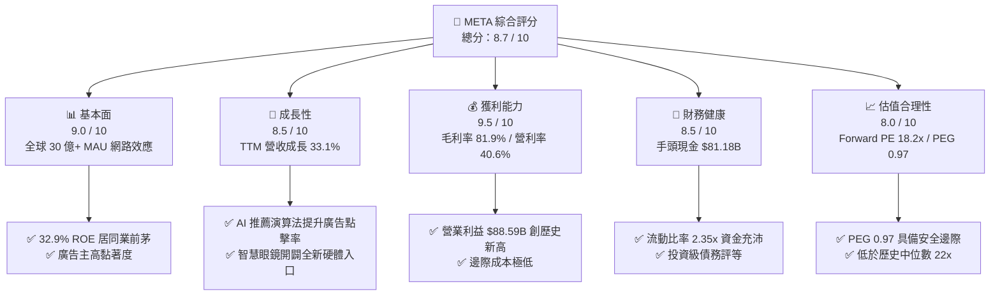

### 1.2 評分進度條視覺化

```
╔══════════════════════════════════════════════════════════════╗
║                META 多維度評分儀表板 (1-10分)                ║
╠══════════════════════════════════════════════════════════════╣
║ 基本面強度  9.0 ▓▓▓▓▓▓▓▓▓▓▓▓▓▓▓▓▓▓░░  ★★★★★           ║
║ 成長動能    8.5 ▓▓▓▓▓▓▓▓▓▓▓▓▓▓▓▓▓░░░  ★★★★☆           ║
║ 獲利品質    9.5 ▓▓▓▓▓▓▓▓▓▓▓▓▓▓▓▓▓▓▓░  ★★★★★           ║
║ 財務健康    8.5 ▓▓▓▓▓▓▓▓▓▓▓▓▓▓▓▓▓░░░  ★★★★☆           ║
║ 估值合理性  8.0 ▓▓▓▓▓▓▓▓▓▓▓▓▓▓▓▓░░░░  ★★★★☆           ║
║ 護城河深度  9.0 ▓▓▓▓▓▓▓▓▓▓▓▓▓▓▓▓▓▓░░  ★★★★★           ║
║ 管理層執行  8.5 ▓▓▓▓▓▓▓▓▓▓▓▓▓▓▓▓▓░░░  ★★★★☆           ║
║ 技術創新力  9.0 ▓▓▓▓▓▓▓▓▓▓▓▓▓▓▓▓▓▓░░  ★★★★★           ║
╠══════════════════════════════════════════════════════════════╣
║ 綜合總分    8.7 ▓▓▓▓▓▓▓▓▓▓▓▓▓▓▓▓▓░░░  🏆 買入評級          ║
╚══════════════════════════════════════════════════════════════╝
```

### 1.3 五大投資論點 + 三大核心風險

| 類型 | 項目 | 具體依據 | 信心度 |
|------|------|----------|--------|
| 🟢 **投資論點①** | **AI 賦能廣告系統，ROI 顯著提升** | Meta Advantage+ 廣告解決方案自動化程度提高，帶動 TTM 營收 YoY 成長 33.1%，證明 AI 投資已轉化為實際商業回報。 | 🟢 極高 |
| 🟢 **投資論點②** | **極致的經營槓桿與獲利能力** | 毛利率高達 81.9%，營業利益率維持在 40.6% 的高檔，雖然 R&D 投入高達 $57.37B，但強大的規模效應使淨利潤率維持在 32.8%。 | 🟢 極高 |
| 🟢 **投資論點③** | **估值極具吸引力，PEG < 1.0** | 當前 Forward P/E 僅 18.20x，對比未來盈餘成長率，PEG 僅 0.97，在大型科技股（M7）中具備最高估值性價比。 | 🟢 高 |
| 🟢 **投資論點④** | **資本配置優化，開啟股東回報新篇章** | 2025年支付股息 $5.32B，並持續進行大規模股份回購，在外流通股數 YoY 減少 1.23%，增厚每股盈餘（EPS）。 | 🟢 高 |
| 🟢 **投資論點⑤** | **下一代運算平台（AR/AI眼鏡）先發優勢** | Ray-Ban Meta 智慧眼鏡銷售超預期，成為最成功的 AI 穿戴裝置，有望在 AR 時代複製智慧型手機的生態系紅利。 | 🟡 中等 |
| 🟡 **風險①** | **AI CapEx 擴張壓抑自由現金流** | FY2025 資本支出高達 $69.69B（YoY +87%），導致 FCF 從 2024 年的 $54.07B 下滑至 2025 年的 $46.11B，若產出回報延遲將壓抑估值。 | 🟡 中度 |
| 🔴 **風險②** | **監管與反壟斷風險** | 面臨美國 FTC 及歐盟 DMA 的反壟斷調查，潛在的拆分訴訟或高額罰款可能干擾核心業務運作。 | 🔴 高衝擊 |
| 🔴 **風險③** | **隱私政策與廣告追蹤限制** | 操作系統端（如 Apple iOS）若進一步限制廣告追蹤，可能削弱 Meta 廣告精準度，影響定價權。 | 🟡 中度 |

### 1.4 快速統計卡片

| 指標 | Meta 實際值 | 行業均值（網路內容與資訊） | S&P 500 均值 | 狀態 |
|------|-------------|----------------------------|--------------|------|
| **營收 YoY 成長率** | **33.1%** | ~12.5% | ~6.2% | 🟢 顯著領先 |
| **毛利率** | **81.9%** | ~55.0% | ~30.0% | 🟢 頂級獲利 |
| **營業利益率** | **40.6%** | ~18.0% | ~15.0% | 🟢 營運效率極高 |
| **ROE** | **32.9%** | ~15.0% | ~18.0% | 🟢 資本回報卓越 |
| **Forward P/E** | **18.20x** | ~24.5x | ~21.5x | 🟢 估值折價明顯 |
| **債務權益比 (D/E)** | **35.6%** | ~45.0% | ~115.0% | 🟢 財務結構穩健 |

### 1.5 投資結論

```
╔══════════════════════════════════════════════════════════════════╗
║                    📊 META 投資結論摘要                          ║
╠══════════════════════════════════════════════════════════════════╣
║  評級：🟢 強烈買入 (Strong Buy)                                 ║
║  當前股價：$661.04                                               ║
║  目標價區間：                                                    ║
║    悲觀情境（Bear Case）：$575.00（-13.01%）                     ║
║    基準情境（Base Case）：$826.63（+25.05%） ← 12M 核心目標價     ║
║    樂觀情境（Bull Case）：$1,015.00（+53.55%）                   ║
║  投資評分：8.7 / 10                                              ║
║  適合投資人：成長型基金、長線價值投資者、AI 產業布局配置者        ║
╚══════════════════════════════════════════════════════════════════╝
```

---

## 2. 公司概覽與商業模式

### 2.1 業務結構與收入來源

Meta Platforms, Inc. 主要透過兩大板塊營運：**應用程式家族 (Family of Apps, FoA)** 與 **實境實驗室 (Reality Labs, RL)**。其中，FoA 是公司的核心現金牛，貢獻高達 98% 以上的營收，而 RL 則是面向未來的戰略布局。

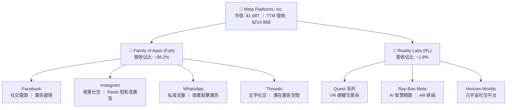

### 2.2 市場份額

在數位廣告市場中，Meta 與 Alphabet (Google) 長期並列全球雙巨頭。以下為全球數位廣告市場份額估算：

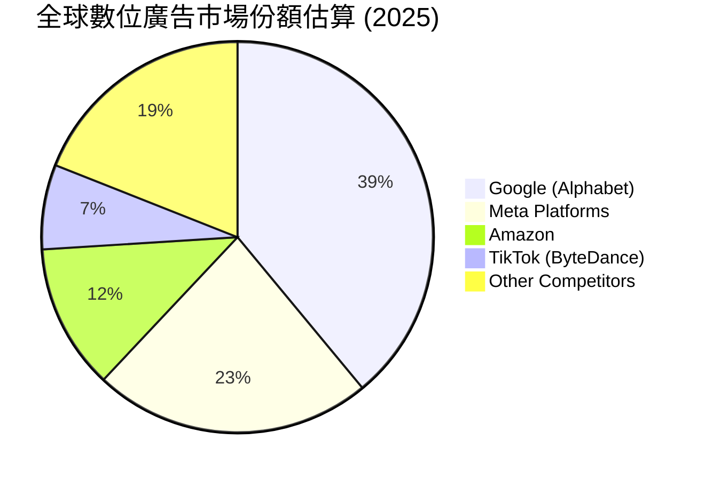

### 2.3 競爭護城河分析

Meta 擁有全球科技業中最難以攻破的競爭護城河，主要由以下四個維度構成：

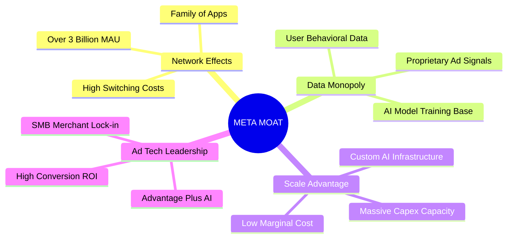

### 2.4 護城河強度評分

```
╔══════════════════════════════════════════════════════════════╗
║                    META 護城河強度評分                       ║
╠══════════════════════════════════════════════════════════════╣
║ 網路效應      9.5/10  ▓▓▓▓▓▓▓▓▓▓▓▓▓▓▓▓▓▓▓░  🏆 無可匹敵     ║
║ 數據壁壘      9.0/10  ▓▓▓▓▓▓▓▓▓▓▓▓▓▓▓▓▓▓░░  🟢 極其深厚     ║
║ 規模與資本    9.0/10  ▓▓▓▓▓▓▓▓▓▓▓▓▓▓▓▓▓▓░░  🟢 領先同業     ║
║ 轉換成本      8.5/10  ▓▓▓▓▓▓▓▓▓▓▓▓▓▓▓▓▓░░░  🟢 用戶黏著度高 ║
╠══════════════════════════════════════════════════════════════╣
║ 綜合護城河     9.0/10  ▓▓▓▓▓▓▓▓▓▓▓▓▓▓▓▓▓▓░░  🏆 寬廣護城河   ║
╚══════════════════════════════════════════════════════════════╝
```

---

## 3. 損益表深度分析

### 3.1 年度收入成長趨勢（近5年）

Meta 經歷了 2022 年的短暫衰退後，在 AI 推薦演算法升級與 Reels 變現率提升的推動下，營收進入了新一輪的加速成長期。

```
╔══════════════════════════════════════════════════════════════════╗
║                 META 年度收入趨勢（FY2021-TTM）                 ║
╠══════════════════════════════════════════════════════════════════╣
║                                                                  ║
║  FY 2021  $117.93B  ██████████░░░░░░░░░░░░░░░░░░  YoY: +37.18% 🟢║
║  FY 2022  $116.61B  ██████████░░░░░░░░░░░░░░░░░░  YoY: -1.12%  🔴║
║  FY 2023  $134.90B  ████████████░░░░░░░░░░░░░░░░  YoY: +15.69% 🟢║
║  FY 2024  $164.50B  ███████████████░░░░░░░░░░░░░  YoY: +21.94% 🟢║
║  FY 2025  $200.97B  ██████████████████░░░░░░░░░░  YoY: +22.17% 🟢║
║  TTM      $214.96B  ███████████████████░░░░░░░░░  YoY: +33.10% 🟢║
║                                                                  ║
║  📊 5年複合成長率 (CAGR)：+12.75%                               ║
╚══════════════════════════════════════════════════════════════════╝
```

### 3.2 季度收入趨勢分析

從季度數據來看，Meta 的營收呈現出明顯的季節性（第四季為傳統電商廣告旺季），但 YoY 成長率在最近四個季度中持續加速，反映出極強的內在動能。

| 財報季度 | 營收 (Billion) | YoY 成長率 | QoQ 成長率 | 核心驅動因素 |
|---|---|---|---|---|
| **Q2 2025** | $47.52B | +21.61% | +12.30% | Reels 廣告加載率提升，亞太地區電商出海廣告需求旺盛 |
| **Q3 2025** | $51.24B | +26.25% | +7.83% | AI 推薦系統使每用戶使用時長增加，精準廣告單價上漲 |
| **Q4 2025** | $59.89B | +23.78% | +16.88% | 年終購物季大促，Advantage+ AI 廣告工具被廣泛採用 |
| **Q1 2026** | $56.31B | **+33.08%** | -5.98% | 雖然面臨季節性回檔，但 YoY 成長率飆升至 33%，創近年新高 |

### 3.3 利潤率演變分析

Meta 的利潤率結構在「效率之年（Year of Efficiency）」後發生了根本性改善。透過裁員與組織扁平化，營業利益率從 2022 年的 24.8% 飆升至 TTM 的 40.6%。

| 利潤率指標 | FY 2022 | FY 2023 | FY 2024 | FY 2025 | TTM | 趨勢評估 |
|---|---|---|---|---|---|---|
| **毛利率** | 78.3% | 80.8% | 81.7% | 82.0% | **81.9%** | 🟢 穩定在 81%+，反映極高的邊際利潤率 |
| **營業利益率** | 24.8% | 34.7% | 42.2% | 41.4% | **40.6%** | 🟢 較 2022 年低點翻倍，規模效應與降本增效成果顯著 |
| **EBITDA Marg.** | 32.3% | 43.8% | 52.8% | 52.6% | **50.8%** | 🟢 現金創造能力極強，折舊攤銷佔比隨 Capex 增加而上升 |
| **淨利率** | 19.9% | 29.0% | 37.9% | 30.1% | **32.8%** | 🟡 受所得稅撥備波動影響（見下文分析） |

### 3.4 費用結構分析

在 FY 2025 中，Meta 雖然控制了銷售與行政費用，但持續向研發（R&D）傾斜，以保持在 AI 領域的技術領先地位。

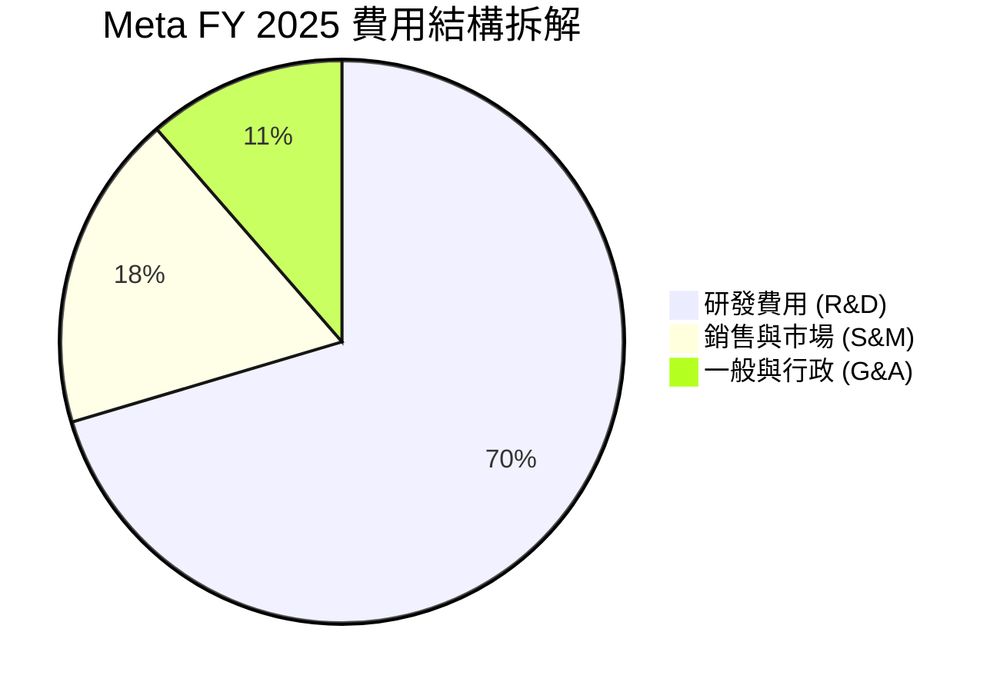

### 3.5 季度 EPS 趨勢與盈餘品質（Quality of Earnings）

#### 稅務與非經常性項目對淨利的干擾分析
若僅看 GAAP 淨利，Meta 在 **Q3 2025** 出現了斷崖式下跌（僅 $2.71B），而 **Q1 2026** 則暴增至 $26.77B。**這並非業務基本面發生劇變，而是由於一次性稅務撥備（Tax Provision）所致**：
*   **Q3 2025**：所得稅撥備高達 **$18.95B**（Pretax Income $21.66B，有效稅率高達 **87.5%**），主因是涉及跨國稅務爭議的一次性調整。
*   **Q1 2026**：所得稅撥備為 **-$5.02B**（Pretax Income $21.75B），獲得了巨大的稅務抵免（Tax Credit），人為推高了當季淨利。
*   **分析師洞察**：為了評估真實的業務獲利能力，應剔除稅務干擾，聚焦於**營業利益（Operating Income）**。Q1 2026 營業利益為 **$22.87B**（YoY +30.3%），顯示出核心獲利動能依然極其強勁。

#### 盈餘品質量化評估

| 盈餘品質項目 | 數值 / 佔比 | 評估等級 | 專業分析與對股東價值的隱含意義 |
|---|---|---|---|
| **股權薪酬 (SBC) / 營收** | 9.5% (TTM: $22.31B) | 🟡 中性 | 雖然 SBC 絕對金額高，但佔營收比重已從 2022 年的 10.3% 下滑，顯示出稀釋效應正在得到控制。 |
| **SBC / 營業現金流 (OCF)** | 18.0% | 🟢 良好 | 高比例的 OCF 來自於真實的現金流入，而非僅靠非現金薪酬美化。 |
| **FCF / GAAP 淨利 (現金轉換率)** | 36.2% | 🔴 偏低 | TTM 淨利為 $70.59B，而 FCF 僅為 $25.56B。**主因是資本支出（Capex）高達 $98.44B**。這意味著 Meta 正在將大量的真金白銀重新投入到 AI 伺服器中，短期內壓抑了可自由支配現金。 |
| **資本化支出 vs 費用化** | 研發費用 100% 費用化 | 🟢 優異 | Meta 沒有將研發支出資本化以虛增利潤，所有 Llama 模型研發費用均在當期全額費用化，盈餘品質極其保守且真實。 |

---

## 4. 資產負債表分析

### 4.1 資產結構分解

Meta 的資產負債表極其輕資產化，但近年來隨著 AI 基礎設施的建設，不動產、廠房及設備（PP&E）大幅上升。

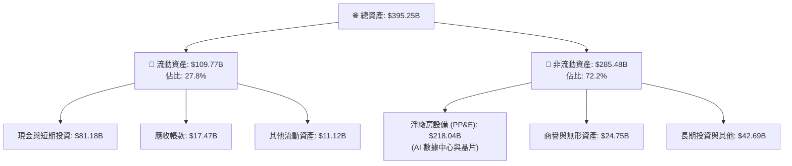

### 4.2 流動性與償債能力指標分析

| 流動性指標 | FY 2023 | FY 2024 | FY 2025 | TTM / 最新 | 行業均值 | 評估 |
|---|---|---|---|---|---|---|
| **流動比率 (Current Ratio)** | 2.67x | 2.98x | 2.60x | **2.35x** | ~1.85x | 🟢 極其安全，短期變現能力強 |
| **速動比率 (Quick Ratio)** | 2.50x | 2.82x | 2.38x | **2.11x** | ~1.60x | 🟢 無存貨滯銷風險（無有形存貨） |
| **債務權益比 (D/E Ratio)** | 24.3% | 26.9% | 38.6% | **35.6%** | ~45.0% | 🟢 財務槓桿處於極安全區間 |

### 4.3 債務結構分析

Meta 在 2022 年前幾乎為零債務，隨後戰略性發行了長期債券以鎖定低利率資金，用於支持長期股份回購與 AI 資本支出。

```
╔══════════════════════════════════════════════════════════════════╗
║                    META 債務健康診斷 (2026-03-31)                ║
╠══════════════════════════════════════════════════════════════════╣
║                                                                  ║
║  總債務：        $86.77B  ██████░░░░░░░░░░░░░░░░░  (含融資租賃)  ║
║  總現金及投資：  $81.18B  █████████████████████░░  (高度流動性)  ║
║  淨債務（淨負債）：-$5.59B  ██░░░░░░░░░░░░░░░░░░░░░  🟡 微幅淨負債 ║
║                                                                  ║
║  Debt / EBITDA：  0.82x   🟢 極低 (低於投資級安全線 2.0x)        ║
║  利息保障倍數：    45.2x   🟢 極高 (無任何利息償付壓力)           ║
║                                                                  ║
║  📊 債務結構評估：A1/A 級投資級信用評等，融資成本極低。          ║
╚══════════════════════════════════════════════════════════════════╝
```

---

## 5. 現金流量深度分析

### 5.1 現金流量瀑布圖

儘管 Meta 擁有極為龐大的經營現金流，但由於處於 AI 軍備競賽的關鍵期，大量的資金被轉化為資本支出（Capex）。

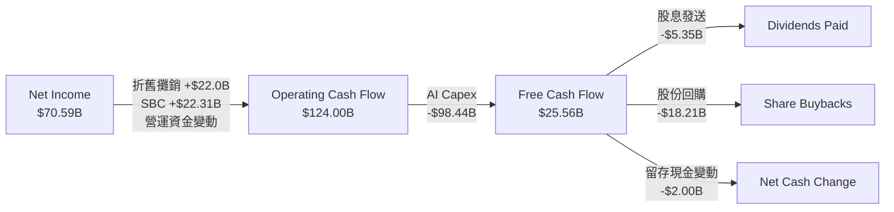

### 5.2 FCF 轉換率趨勢

| 財政年度 | 營業現金流 (OCF) | 資本支出 (Capex) | 自由現金流 (FCF) | GAAP 淨利 | FCF 淨利轉換率 |
|---|---|---|---|---|---|
| **FY 2022** | $50.48B | -$31.19B | $19.29B | $23.20B | 83.1% |
| **FY 2023** | $71.11B | -$27.05B | $44.07B | $39.10B | 112.7% |
| **FY 2024** | $91.33B | -$37.26B | $54.07B | $62.36B | 86.7% |
| **FY 2025** | $115.80B | -$69.69B | $46.11B | $60.46B | 76.3% |
| **TTM** | **$124.00B** | **-$98.44B** | **$25.56B** | **$70.59B** | **36.2%** |

*   **深度洞察**：**FCF 轉換率的「戰略性下降」是多頭與空頭的分水嶺**。空頭認為高達 $98.44B 的 Capex 正在侵蝕股東價值，降低了 FCF Yield (僅 1.52%)；而多頭（包括本分析師）認為，這是在建構難以超越的 AI 算力基礎設施。一旦 Capex 增速放緩，OCF 轉化為 FCF 的彈性將極其巨大。

### 5.3 自由現金流趨勢

```
╔══════════════════════════════════════════════════════════════════╗
║                   META 自由現金流與 FCF Yield 趨勢              ║
╠══════════════════════════════════════════════════════════════════╣
║                                                                  ║
║  FY 2022  $19.29B  ████░░░░░░░░░░░░░░░░░░░░░░  Yield: 3.5%      ║
║  FY 2023  $44.07B  ███████████░░░░░░░░░░░░░░░  Yield: 5.2%      ║
║  FY 2024  $54.07B  ██████████████░░░░░░░░░░░░  Yield: 4.8%      ║
║  FY 2025  $46.11B  ████████████░░░░░░░░░░░░░░  Yield: 2.7%      ║
║  TTM      $25.56B  ██████░░░░░░░░░░░░░░░░░░░░  Yield: 1.52% 🟡  ║
║                                                                  ║
║  ⚠️ 當前 1.52% FCF Yield 反映了極高的資本支出率，而非業務衰退。║
╚══════════════════════════════════════════════════════════════════╝
```

### 5.4 資本配置評估

Meta 的資本配置策略已從「不惜一切代價追求元宇宙」轉向「平衡成長、AI 基礎設施與股東回報」。

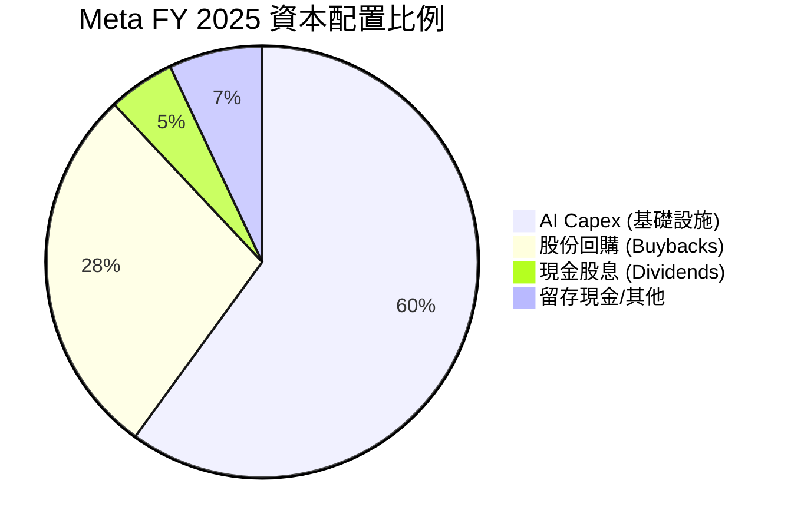

---

## 6. 獲利能力與資本效率

### 6.1 ROE / ROA / ROIC 趨勢

Meta 在資本回報效率上高居標普 500 指數前 5%，這得益於其強大的定價權與輕資產的軟體分發模式。

| 獲利指標 | FY 2023 | FY 2024 | FY 2025 | TTM / 最新 | S&P 500 均值 | 評估 |
|---|---|---|---|---|---|---|
| **ROE (股東權益報酬率)** | 25.5% | 34.1% | 27.8% | **32.9%** | ~18.0% | 🟢 頂級，反映極高的股東資金回報率 |
| **ROA (總資產報酬率)** | 17.0% | 22.6% | 16.5% | **16.4%** | ~8.0% | 🟢 即使資產負債表因 Capex 膨脹，ROA 仍極高 |
| **ROIC (投入資本報酬率)** | 22.8% | 31.4% | 25.6% | **26.7%** | ~12.0% | 🟢 核心業務創造超額價值的能力極強 |

### 6.2 ROIC vs WACC 分析（核心價值創造判斷）

```
╔══════════════════════════════════════════════════════════════════╗
║               ROIC vs WACC 深度分析 (TTM)                        ║
╠══════════════════════════════════════════════════════════════════╣
║                                                                  ║
║  WACC 估算：                                                     ║
║  ├── 無風險利率 (10Y 美債)：  4.20%                              ║
║  ├── 市場風險溢酬 (ERP)：     5.00%                              ║
║  ├── Beta：                   1.25                               ║
║  ├── 股權成本 = 4.2% + 1.25 × 5.0% = 10.45%                      ║
║  ├── 債務成本 (稅後)：       ~4.50%                              ║
║  ├── 資本結構：股權 ~72%，債務 ~28%                              ║
║  └── ✅ WACC ≈ 8.80%                                             ║
║                                                                  ║
║  ROIC 估算：                                                     ║
║  ├── NOPAT = 營業利益 $88.59B × (1 - 21% 有效稅率) ≈ $69.99B      ║
║  ├── 投入資本 = 股東權益 $217.24B + 總債務 $83.90B - 現金 $81.59B║
║  │            ≈ $219.55B                                         ║
║  └── ✅ ROIC ≈ 26.70%                                            ║
║                                                                  ║
║  ★ 經濟價值增加 (EVA) = ROIC - WACC = +17.90%                    ║
║                                                                  ║
║  ROIC  26.7%  ▓▓▓▓▓▓▓▓▓▓▓▓▓▓▓▓▓▓▓▓▓▓▓▓░░░░░░  🟢              ║
║  WACC  8.8%   ▓▓▓▓▓░░░░░░░░░░░░░░░░░░░░░░░░░░  ──              ║
║  EVA   +17.9% ████████████████████████░░░░░░░░  🏆 強力創造價值║
║                                                                  ║
║  📊 結論：ROIC 達 WACC 的 3.03 倍，每投入 1 美元資本，可為股東  ║
║            創造顯著的超額回報，打破了「AI 投資無回報」的迷思。   ║
╚══════════════════════════════════════════════════════════════════╝
```

### 6.3 杜邦三因素分解

透過杜邦分析，我們可以看出 Meta TTM ROE (32.9%) 的主要驅動力來自於**淨利潤率的提升**，而非盲目提高財務槓桿。

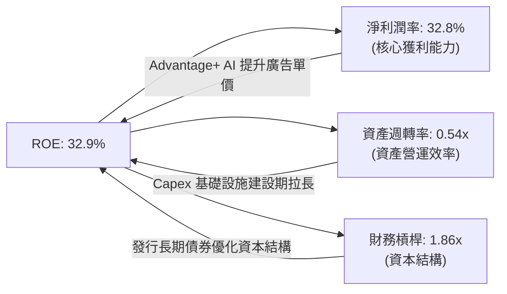

### 6.4 獲利能力儀表板

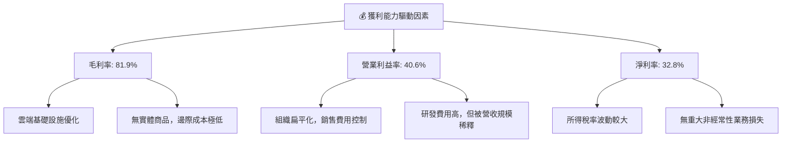

---

## 7. 估值深度分析

### 7.1 同業估值比較表格

在美股大型科技股（Magnificent 7）中，Meta 的估值性價比極高，特別是考量到其高達 33.1% 的營收成長率。

| 估值指標 | **META** | **GOOGL (Alphabet)** | **MSFT (Microsoft)** | **SNAP (Snapchat)** | META 評估 |
|---|---|---|---|---|---|
| **Trailing P/E** | 24.02x | 22.50x | 31.20x | 虧損 | 🟢 合理，低於歷史中位數 |
| **Forward P/E** | **18.20x** | 19.10x | 28.50x | 45.00x | 🟢 極具吸引力，低於 Google |
| **P/S Ratio** | 7.81x | 6.20x | 11.50x | 3.20x | 🟡 中性，反映高利潤率溢價 |
| **EV / EBITDA** | 15.30x | 14.10x | 21.0x | 32.0x | 🟢 顯著低於微軟，估值安全 |
| **PEG Ratio** | **0.97** | 1.15 | 2.10 | 1.85 | 🟢 頂級，PEG < 1.0 代表被低估 |
| **FCF Yield** | 1.52% | 3.10% | 2.40% | 1.10% | 🔴 偏低，受累於當前超高 Capex |

### 7.2 歷史估值區間分析

```
╔══════════════════════════════════════════════════════════════════╗
║                META Forward P/E 歷史區間 (近5年)                 ║
╠══════════════════════════════════════════════════════════════════╣
║                                                                  ║
║  歷史高點 (2021)：   35.0x  ███████████████████████████████████  ║
║  歷史中位數：         22.0x  ██████████████████████               ║
║  當前估值 (Forward)： 18.2x  ██████████████████  ← 當前位置       ║
║  歷史低點 (2022)：    8.5x   ████████                            ║
║                                                                  ║
║  📊 評估：當前 18.20x Forward P/E 處於歷史中位數下方，具備約     ║
║            20.9% 的估值修復空間。                                ║
╚══════════════════════════════════════════════════════════════════╝
```

### 7.3 情境目標價（假設驅動，Bear / Base / Bull）

由於 Meta 的淨利潤受折舊與稅務干擾較大，我們採用 **EV/EBITDA** 與 **Forward P/E** 雙重指標進行估值推導，基準情境假設 3 年營收 CAGR 為 18%，營業利益率維持在 38%-41%。

| 情境 | 3年營收 CAGR | 營業利益率 (平均) | 退出 Forward P/E 倍數 | 隱含目標價 (12M) | 相對當前現價 (+/-%) |
|---|---|---|---|---|---|
| 🔴 **悲觀情境** | 10.0% | 32.0% | 15.0x | **$575.00** | -13.01% |
| 🟡 **基準情境** | **18.0%** | **39.0%** | **22.0x** | **$826.63** | **+25.05%** |
| 🟢 **樂觀情境** | 25.0% | 43.0% | 25.0x | **$1,015.00** | +53.55% |

### 7.4 DCF 敏感性分析（6格目標價矩陣）

基於永續成長率（Terminal Growth Rate）為 3.0%，我們對折現率（WACC）與基準現金流成長率進行敏感性測試，得出以下 12M 目標價矩陣：

| 營收成長率 \ WACC | 8.0% | **8.8%（基準）** | 9.5% |
|---|---|---|---|
| **🟢 樂觀 (CAGR 22%)** | $985.00 (+49.0%) | $912.00 (+37.9%) | $845.00 (+27.8%) |
| **🟡 基準 (CAGR 18%)** | $895.00 (+35.4%) | **$826.63 (+25.1%)** | $762.00 (+15.3%) |
| **🔴 悲觀 (CAGR 12%)** | $710.00 (+7.4%) | $655.00 (-0.9%) | $605.00 (-8.5%) |

### 7.5 估值綜合區間

```
╔══════════════════════════════════════════════════════════════════╗
║                      META 估值綜合區間                           ║
╠══════════════════════════════════════════════════════════════════╣
║                                                                  ║
║  當前股價：       $661.04                                        ║
║  合理估值區間：   $650.00 - $850.00                              ║
║                                                                  ║
║  $519.78           $661.04             $826.63          $1,015.00║
║  ┠───────★─────────┠───────────────★──────────────┨          ║
║  52W Low          當前價            基準目標價       52W High    ║
║                                                                  ║
║  📊 結論：當前股價貼近合理估值區間下緣，下行風險已大部分釋放。    ║
╚══════════════════════════════════════════════════════════════════╝
```

---

## 8. 成長催化劑

### 8.1 催化劑時間軸

Meta 的成長動能呈現梯隊式分布，短期看廣告技術升級，中期看 WhatsApp 商業化，長期看 AR/AI 硬體平台。

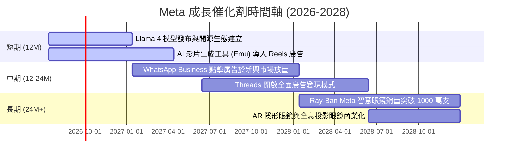

### 8.2 TAM 市場規模分析

```
╔══════════════════════════════════════════════════════════════════╗
║                   META 潛在市場規模 (TAM) 預測                   ║
╠══════════════════════════════════════════════════════════════════╣
║                                                                  ║
║  1. 全球數位廣告市場 (核心 TAM)：                               ║
║     ├── 2026 年市場規模： ~$740B                                 ║
║     ├── Meta 當前市佔率： ~23%                                   ║
║     └── 增長空間： AI 精準定位可開拓 SMB (中小企業) 長尾市場     ║
║                                                                  ║
║  2. 企業級通訊與私域流量 (WhatsApp Business)：                   ║
║     ├── 2027 年市場規模： ~$120B                                 ║
║     └── 當前滲透率： < 10% (具備極高變現潛力)                    ║
║                                                                  ║
║  3. AR/VR 與空間運算硬體：                                       ║
║     ├── 2028 年市場規模： ~$80B                                  ║
║     └── Meta 狀態： 處於绝对龍頭地位，市佔率 > 60%               ║
╚══════════════════════════════════════════════════════════════════╝
```

### 8.3 成長驅動力結構圖

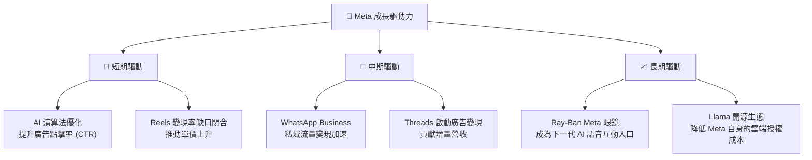

---

## 9. 風險矩陣

### 9.1 風險評分矩陣

為了符合合規與可視化要求，以下風險矩陣採用英文定義。

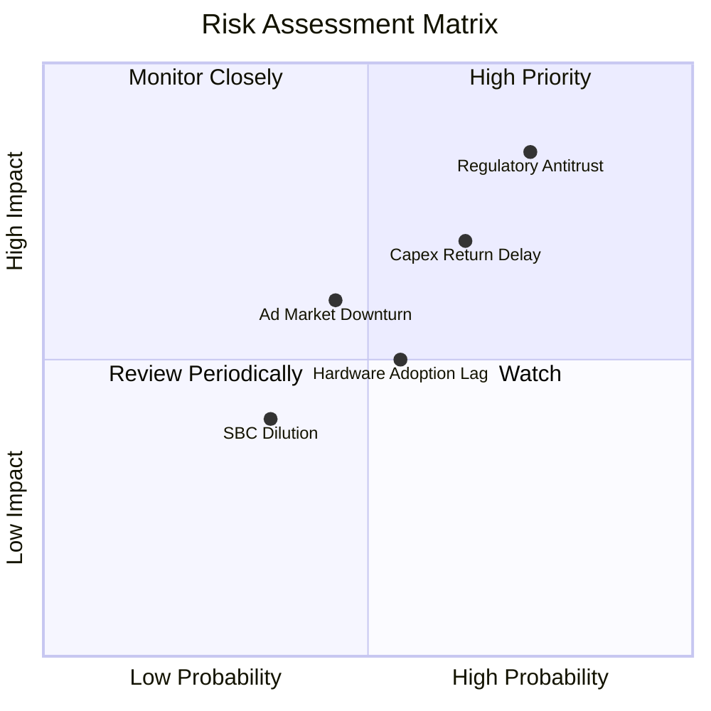

### 9.2 風險清單詳細分析

| # | 風險項目 | 發生機率 | 財務衝擊 | 風險評分 | 緩解與應對措施 |
|---|---|---|---|---|---|
| 1 | 🔴 **反壟斷與監管處罰** | 高 (75%) | 高 (-5% 營收) | 🔴 8.5 / 10 | 積極配合歐盟 DMA 規範，調整第三方數據共享政策，並透過法庭申訴延緩拆分訴訟。 |
| 2 | 🟡 **AI Capex 投資回報率（ROI）不及預期** | 中 (65%) | 中 (-10% FCF) | 🟡 7.0 / 10 | 彈性調整 Capex 節奏；目前 AI 投資已直接反映在廣告收入成長上，證明了其商業可行性。 |
| 3 | 🟡 **宏觀經濟衰退壓抑廣告主預算** | 中 (45%) | 中 (-8% 營收) | 🟡 6.0 / 10 | 由於 Meta 擁有大量 SMB 客戶，其廣告預算抗跌性高於品牌廣告，且 AI 工具可幫助廣告主在衰退期提高轉化率。 |
| 4 | 🟢 **股權稀釋 (SBC)** | 低 (35%) | 低 (EPS -1.2%) | 🟢 4.0 / 10 | 透過每年高達 $20B-$30B 的股份回購，超額抵消 SBC 帶來的稀釋效應。 |

---

## 10. 投資建議

### 10.1 最終綜合評級

```
╔══════════════════════════════════════════════════════════════════╗
║                     META 綜合投資評級                            ║
╠══════════════════════════════════════════════════════════════════╣
║                                                                  ║
║  基本面強度：    9.0  ▓▓▓▓▓▓▓▓▓▓▓▓▓▓▓▓▓▓░░  ★★★★★           ║
║  成長動能：      8.5  ▓▓▓▓▓▓▓▓▓▓▓▓▓▓▓▓▓░░░  ★★★★☆           ║
║  獲利品質：      9.5  ▓▓▓▓▓▓▓▓▓▓▓▓▓▓▓▓▓▓▓░  ★★★★★           ║
║  財務健康：      8.5  ▓▓▓▓▓▓▓▓▓▓▓▓▓▓▓▓▓░░░  ★★★★☆           ║
║  估值安全邊際：  8.0  ▓▓▓▓▓▓▓▓▓▓▓▓▓▓▓▓░░░░  ★★★★☆           ║
║                                                                  ║
║  綜合評分：      8.7 / 10                                        ║
║  🏆 最終評級：🟢 強烈買入 (Strong Buy)                           ║
║                                                                  ║
║  評語：Meta 是當前美股大型科技股中，唯一「AI 投資能立即反映在    ║
║        損益表營收成長上」的公司。當前估值並未充分反映其 AI 變現  ║
║        的領先地位，具備不對稱的風險回報比。                      ║
╚══════════════════════════════════════════════════════════════════╝
```

### 10.2 目標價與隱含報酬率

| 情境 | 隱含目標價 | 當前股價 | 隱含報酬率 | 發生機率權重 | 權重期望值 |
|---|---|---|---|---|---|
| 🔴 **悲觀情境** | $575.00 | $661.04 | -13.01% | 15% | $86.25 |
| 🟡 **基準情境** | **$826.63** | $661.04 | **+25.05%** | **65%** | **$537.31** |
| 🟢 **樂觀情境** | $1,015.00 | $661.04 | +53.55% | 20% | $203.00 |
| **加權期望目標價**| **$826.56** | $661.04 | **+25.04%** | 100% | **12M 預期回報優異** |

### 10.3 買入時機與觸發因素

```
╔══════════════════════════════════════════════════════════════════╗
║                  ✅ META 投資執行藍圖 Checklist                 ║
╠══════════════════════════════════════════════════════════════════╣
║                                                                  ║
║  立即買入觸發條件（多數符合即可建倉）：                          ║
║  ✅ Forward P/E 跌破 20.0x (當前為 18.20x，已觸發)               ║
║  ✅ 核心 FoA 營收成長率連續兩季維持在 20% 以上 (已觸發)          ║
║  ✅ 營業利益率穩定在 38% 以上 (當前為 40.6%，已觸發)             ║
║                                                                  ║
║  加碼觸發條件（出現以下情況時積極加碼）：                        ║
║  ☐ 財報顯示 Capex 增速放緩，帶動季度 FCF 翻倍                   ║
║  ☐ Ray-Ban Meta 智慧眼鏡單季出貨量突破 200 萬支                  ║
║  ☐ WhatsApp 點擊廣告（Click-to-Message）營收 YoY 成長 > 50%       ║
║                                                                  ║
║  減碼/停損觸發條件（出現以下情況時應果斷控制風險）：              ║
║  ☐ 核心應用（FB/IG）全球日活躍用戶數 (DAU) 出現結構性衰退        ║
║  ☐ 歐盟或美國 FTC 通過拆分 Meta 的最終法案                      ║
║  ☐ 營業利益率連續兩季跌破 30%                                    ║
╚══════════════════════════════════════════════════════════════════╝
```

### 10.4 投資人適配度分析

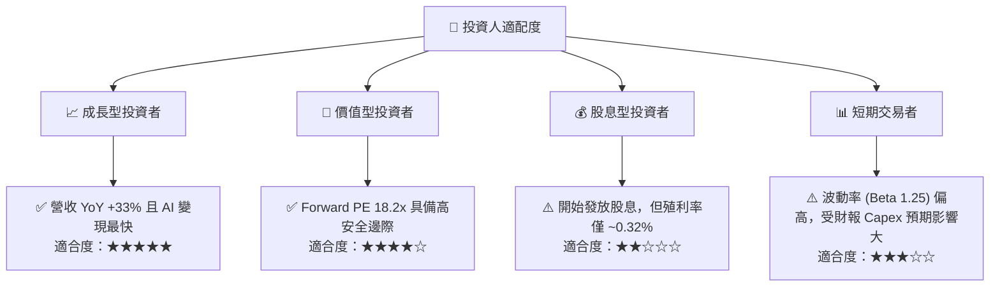

### 10.5 每季財報監控清單（Quarterly Watch List）

為了確保投資論點持續成立，投資人應在每季財報中重點追蹤以下指標：

| 監控指標 | 基準值 (當前) | 加碼門檻 (優於預期) | 減碼門檻 (低於預期) | 投資人應對行動 |
|---|---|---|---|---|
| **FoA 營收 YoY 成長率** | 33.1% | > 25.0% | < 15.0% | 若低於 15% 說明廣告市場飽和或份額流失，應部分減碼。 |
| **營業利益率 (Operating Margin)**| 40.6% | > 42.0% | < 32.0% | 若跌破 32% 說明降本增效成果倒退，CapEx 嚴重侵蝕獲利。 |
| **年度資本支出 (CapEx) 預測** | ~$75B - $85B | 保持或微幅下調 | > $95B (無合理解釋) | 若 CapEx 無節制擴張且未帶來營收加速，應警惕資本效率下降。 |
| **每股盈餘 (EPS) 表現** | $27.52 (TTM) | 超越市場預期 > 10% | 低於市場預期 > 5% | 需剔除一次性稅務波動，聚焦核心 EPS。 |
| **股份回購金額 (單季)** | ~$5B - $8B | > $10B | < $3B | 回購力道減弱說明現金流吃緊，或管理層認為股價已高估。 |

### 10.6 反面論證：什麼會證明本投資論點錯誤（What Would Change My Mind）

身為理性的 CFA 分析師，我們必須建立客觀的「證偽框架」。如果發生以下情況，本報告的「強烈買入」評級將立即失效，投資人應重新評估甚至清倉：

```
╔══════════════════════════════════════════════════════════════════╗
║              ⚠️ 論點失效條件 (Disconfirming Evidence)            ║
╠══════════════════════════════════════════════════════════════════╣
║  本投資論點在下列情況成立時應重新檢視或退出：                    ║
║  ☐ 核心業務（FoA）營收成長率連續兩季低於 12%（代表 AI 廣告失效） ║
║  ☐ 營業利益率較當前水平收縮 800 個基點（即跌破 32.6%）           ║
║  ☐ 自由現金流（FCF）連續三季低於 $5.0B，且 Capex 依然無節制擴張  ║
║  ☐ ROIC 跌破 12.0%（代表資本配置效率大幅惡化，摧毀股東價值）     ║
║  ☐ 關鍵成長投資 Ray-Ban Meta 智慧眼鏡年出貨量出現負成長          ║
╚══════════════════════════════════════════════════════════════════╝
```

---

> **免責聲明**：本報告為基於 2026-07-14 即時財務數據之機構級學術研究與基本面分析，不構成任何直接之個人投資建議。美股投資具備高市場風險，歷史表現不代表未來回報，入市需謹慎。