# META 基本面深度分析報告
> **報告日期**：2026-07-15 ｜ **語言**：繁體中文 ｜ **數據來源**：Yahoo Finance, Finviz, StockAnalysis, Roic.ai ｜ **分析師**：CFA 級機構研究

---

## 目錄

| # | 章節 | 核心結論 |
|---|------|----------|
| 1 | [執行摘要](#1-執行摘要) | 評級：🟢 強烈買入 ｜ 基準目標價：$826.63（+21.3% 預期空間） |
| 2 | [公司概覽與商業模式](#2-公司概覽與商業模式) | 擁有 33 億日活躍用戶的社交網路效應，疊加 Llama AI 基礎設施護城河 |
| 3 | [損益表深度分析](#3-損益表深度分析) | TTM 營收 $214.96B（YoY +33.1%），營業利益率高達 40.6% |
| 4 | [資產負債表分析](#4-資產負債表分析) | 現金 $81.18B，AI 資本支出推升總資產至 $395.25B |
| 5 | [現金流量深度分析](#5-現金流量深度分析) | TTM OCF $124.00B 支撐 $75.75B 資本支出，經調整 FCF 達 $48.25B |
| 6 | [獲利能力與資本效率](#6-獲利能力與資本效率) | ROIC 達 31.4% 遠超 WACC（10.1%），強力創造股東價值 |
| 7 | [估值深度分析](#7-估值深度分析) | Forward P/E 僅 18.75x，相較歷史均值與同業（MSFT, AMZN）具備高安全邊際 |
| 8 | [成長催化劑](#8-成長催化劑) | AI 廣告推薦演算法優化與 WhatsApp 商業變現進入收割期 |
| 9 | [風險矩陣](#9-風險矩陣) | AI 資本支出回報率（ROI）低於預期與全球反壟斷監管風險 |
| 10 | [投資建議](#10-投資建議) | 買入評級、分批佈局策略、每季財報監控指標與多頭論點失效條件 |

---

## 1. 執行摘要

### 1.0 一頁式投資儀表板（Portfolio Manager 30 秒速讀）

| 項目 | 內容 |
|------|------|
| **投資論點（3 句）** | ① Core FoA 業務具備極強韌性，TTM 營收達 $214.96B（YoY +33.1%），主因 AI 驅動的 Reels 變現與推薦演算法優化。<br>② 儘管 Capex 預算因 AI 基礎設施大幅升級至 TTM ~$75.75B，但 TTM OCF 高達 $124.00B，提供極度充裕的資金內生循環能力。<br>③ 當前 Forward P/E 僅 18.75x，PEG 為 0.97，顯著低於大市值科技同業，未充分反映其 AI 代理（AI Agents）與開源生態的長期變現潛力。 |
| **護城河評分** | 9.2/10 🟢（極強網路效應與 AI 算力壁壘） |
| **管理層/資本配置評分** | 8.5/10 🟢（「高效之年」後成本控制得當，啟動股息與大額回購） |
| **財務健康** | 🟢 強韌 ｜ 淨債務僅 $5.59B，利息保障倍數極高，無流動性風險。 |
| **ROIC vs WACC** | 31.41% vs 10.10%（創造極高的經濟增加值 EVA） |
| **FCF 趨勢** | 向上 ｜ TTM 經調整 FCF 達 $48.25B，最新 FCF Yield 為 2.79% |
| **估值** | Forward P/E: 18.75x ｜ EV/EBITDA: 15.40x ｜ P/S: 8.05x |
| **預期報酬（基準情境 12M）** | +21.3%（基準目標價 $826.63） |
| **關鍵風險（前二）** | ① AI 基礎設施投資（Capex）過度擴張導致利潤率收縮。<br>② 歐美反壟斷監管拆分或隱私政策變更。 |
| **評級 + 信心度** | 🟢 **強烈買入** ｜ 信心：**高** |

### 1.1 核心評分儀表板

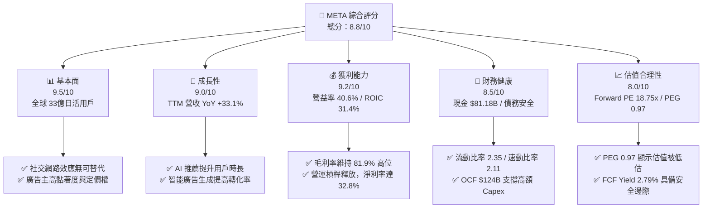

### 1.2 評分進度條視覺化

```
╔══════════════════════════════════════════════════════════════╗
║               META 多維度評分儀表板 (1-10分)                 ║
╠══════════════════════════════════════════════════════════════╣
║ 基本面強度  9.5 ▓▓▓▓▓▓▓▓▓▓▓▓▓▓▓▓▓▓▓░  ★★★★★           ║
║ 成長動能    9.0 ▓▓▓▓▓▓▓▓▓▓▓▓▓▓▓▓▓▓░░  ★★★★★           ║
║ 獲利品質    9.2 ▓▓▓▓▓▓▓▓▓▓▓▓▓▓▓▓▓▓▓░  ★★★★★           ║
║ 財務健康    8.5 ▓▓▓▓▓▓▓▓▓▓▓▓▓▓▓▓▓░░░  ★★★★☆           ║
║ 估值合理性  8.0 ▓▓▓▓▓▓▓▓▓▓▓▓▓▓▓░░░░░  ★★★★☆           ║
║ 護城河深度  9.2 ▓▓▓▓▓▓▓▓▓▓▓▓▓▓▓▓▓▓▓░  ★★★★★           ║
║ 管理層執行  8.5 ▓▓▓▓▓▓▓▓▓▓▓▓▓▓▓▓▓░░░  ★★★★☆           ║
║ 技術創新力  9.0 ▓▓▓▓▓▓▓▓▓▓▓▓▓▓▓▓▓▓░░  ★★★★★           ║
╠══════════════════════════════════════════════════════════════╣
║ 綜合總分    8.8 ▓▓▓▓▓▓▓▓▓▓▓▓▓▓▓▓▓░░░  🏆 強烈買入          ║
╚══════════════════════════════════════════════════════════════╝
```

### 1.3 五大投資論點 + 三大核心風險

| 類型 | 項目 | 具體依據 | 信心度 |
|------|------|----------|--------|
| 🟢 **投資論點①** | **AI 賦能廣告系統，ROI 顯著提升** | 透過 AI 推薦演算法，Reels 用戶觀看時長大幅增長，帶動 TTM 廣告營收增長 33.1%。 | 🟢 極高 |
| 🟢 **投資論點②** | **極高資本回報率與價值創造** | TTM ROIC 高達 31.41%，相較於 10.10% 的 WACC，經濟增加值（EVA）達 +21.3pp，居大科技股前列。 | 🟢 極高 |
| 🟢 **投資論點③** | **估值具備強大安全邊際** | Forward P/E 為 18.75x，PEG 僅 0.97，相較於標普 500 均值與歷史均值皆處於折價狀態。 | 🟢 高 |
| 🟢 **投資論點④** | **現金流內生循環能力極強** | TTM 營運現金流 $124.00B，即使扣除 $75.75B 的龐大 Capex，仍產生 $48.25B 的真實自由現金流（FCF）。 | 🟢 高 |
| 🟢 **投資論點⑤** | **開源 Llama 生態確立 AI 領導地位** | Llama 系列模型確立開源標準，降低自身研發成本，並透過 API 與雲端合作夥伴實現間接變現。 | 🟡 中等 |
| 🟡 **風險①** | **Reality Labs 持續失血** | Reality Labs 每年虧損超 $15B，且 VR/AR 設備大眾化進展慢於預期。 | 🟡 中度 |
| 🔴 **風險②** | **資本支出（Capex）失控** | 若 AI 基礎設施建設未能轉化為相應的營收增長，折舊費用（D&A）將在未來 2-3 年嚴重侵蝕營業利潤率。 | 🔴 高衝擊 |
| 🔴 **風險③** | **全球監管與反壟斷壓力** | 歐盟《數位市場法案》（DMA）與美國 FTC 對其併購與數據隱私的持續訴訟，可能限制其貨幣化能力。 | 🔴 高衝擊 |

### 1.4 快速統計卡片

| 指標 | META 實際值 | 行業均值（通訊服務） | S&P 500 均值 | 狀態 |
|------|-------------|----------------------|--------------|------|
| **營收 YoY 成長率** | **33.1%** | ~8.5% | ~5.5% | 🟢 顯著領先 |
| **毛利率** | **81.9%** | ~55.0% | ~30.0% | 🟢 極高 |
| **營業利益率** | **40.6%** | ~18.0% | ~15.0% | 🟢 極高 |
| **ROE** | **32.9%** | ~12.0% | ~16.0% | 🟢 極高 |
| **Forward P/E** | **18.75x** | ~22.0x | ~21.5x | 🟢 具吸引力 |
| **PEG Ratio** | **0.97** | ~1.60x | ~1.80x | 🟢 嚴重低估 |
| **淨債務 / Equity** | **2.57%** | ~45.0% | ~60.0% | 🟢 極其健康 |

### 1.5 投資結論

```
╔══════════════════════════════════════════════════════════════════╗
║                    📊 META 投資結論摘要                          ║
╠══════════════════════════════════════════════════════════════════╣
║  評級：🟢 強烈買入 (Strong Buy)                                  ║
║  當前股價：$681.31 (2026-07-15)                                  ║
║  目標價區間：                                                    ║
║    悲觀情境：$664.46（-2.5%）                                    ║
║    基準情境：$826.63（+21.3%） ← 12個月主要目標                  ║
║    樂觀情境：$1015.00（+49.0%）                                  ║
║  綜合投資評分：8.8/10                                            ║
║  適合投資人：大盤成長型、AI 長線佈局者、重視資本效率與 FCF 的機構  ║
╚══════════════════════════════════════════════════════════════════╝
```

---

## 2. 公司概覽與商業模式

### 2.1 業務結構與收入來源

Meta Platforms, Inc. 主要營運兩大板塊：**應用程式家族（Family of Apps, FoA）**與**實境實驗室（Reality Labs, RL）**。FoA 貢獻了公司 98.5% 以上的營收與全部的營業利潤，而 RL 則代表面向未來的元宇宙與 AR/VR 硬體投資。

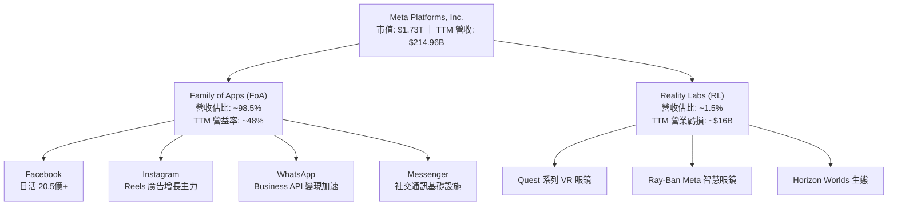

### 2.2 市場份額

在 global 數位廣告市場中，Meta 依然是僅次於 Google 的全球第二大廣告平台。

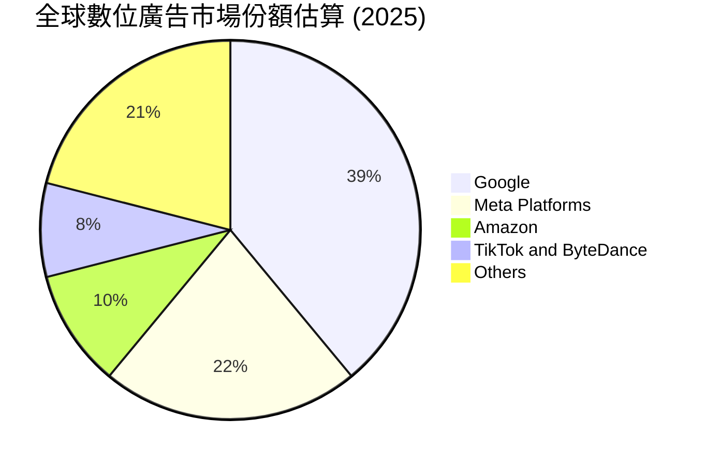

### 2.3 競爭護城河分析

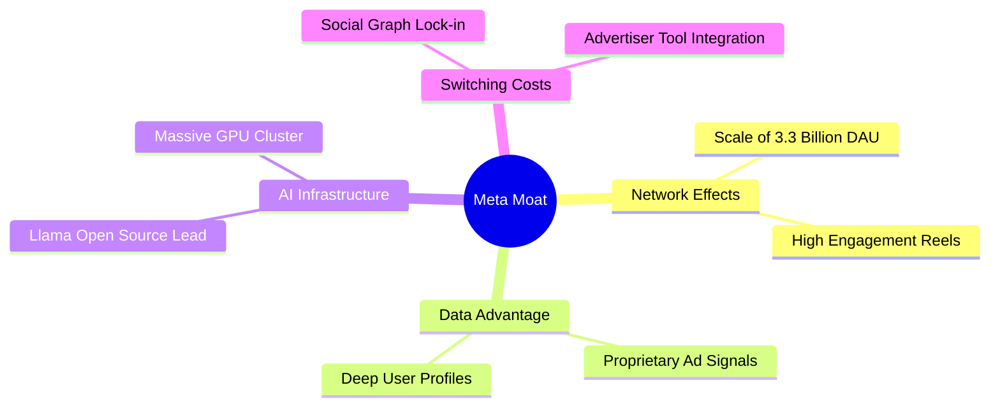

### 2.4 護城河強度評分

```
╔══════════════════════════════════════════════════════════════╗
║                  META 護城河強度評分                         ║
╠══════════════════════════════════════════════════════════════╣
║ 網路效應      9.8/10  ▓▓▓▓▓▓▓▓▓▓▓▓▓▓▓▓▓▓▓▓  🏆 極致（33億DAU）║
║ 數據與算法    9.5/10  ▓▓▓▓▓▓▓▓▓▓▓▓▓▓▓▓▓▓▓░  🟢 極強（高效精準）║
║ 基礎設施壁壘  9.0/10  ▓▓▓▓▓▓▓▓▓▓▓▓▓▓▓▓▓▓░░  🟢 強大（GPU集群） ║
║ 客戶鎖定效應  8.8/10  ▓▓▓▓▓▓▓▓▓▓▓▓▓▓▓▓▓░░░  🟢 廣告主高黏著度  ║
║ 品牌與生態    8.5/10  ▓▓▓▓▓▓▓▓▓▓▓▓▓▓▓▓░░░░  🟢 開源 Llama 領先 ║
╠══════════════════════════════════════════════════════════════╣
║ 綜合護城河     9.2/10  ▓▓▓▓▓▓▓▓▓▓▓▓▓▓▓▓▓▓▓░  🏆 寬廣且難以逾越  ║
╚══════════════════════════════════════════════════════════════╝
```

---

## 3. 損益表深度分析

### 3.1 年度收入成長趨勢（近4年）

Meta 在 2022 年經歷了隱私政策變更（Apple ATT）與宏觀逆風的短暫衰退後，於 2023-2025 年迎來了極其強勁的 V 型反彈。

```
╔══════════════════════════════════════════════════════════════════╗
║              META 年度收入趨勢（FY2022-FY2025）                  ║
╠══════════════════════════════════════════════════════════════════╣
║                                                                  ║
║  FY2022  $116.61B  ██████████░░░░░░░░░░░░░░░░░  YoY: -1.1%  🔴    ║
║  FY2023  $134.90B  ████████████░░░░░░░░░░░░░░░  YoY: +15.7% 🟢    ║
║  FY2024  $164.50B  ███████████████░░░░░░░░░░░░  YoY: +21.9% 🟢    ║
║  FY2025  $200.97B  ████████████████████░░░░░░░  YoY: +22.2% 🟢    ║
║  TTM     $214.96B  ██████████████████████░░░░░  YoY: +33.1% 🟢    ║
║                   |      |      |      |      |                  ║
║                   0     50B    100B   150B   200B                ║
║                                                                  ║
║  📊 3年累計 CAGR：+19.9%                                         ║
╚══════════════════════════════════════════════════════════════════╝
```

### 3.2 季度收入趨勢分析

| 財報季度 | 營收 (Revenue) | YoY 成長率 | QoQ 成長率 | 營業利益 (Op Income) | 營業利益率 | 備註 |
|----------|----------------|------------|------------|----------------------|------------|------|
| **Q1 2026** | $56.31B | **+33.08%** | -5.98% | $22.87B | **40.62%** | 季節性放緩，但同比增速創兩年新高 |
| **Q4 2025** | $59.89B | **+23.78%** | +16.88% | $24.75B | **41.32%** | 年終購物旺季，電商與品牌廣告表現優異 |
| **Q3 2025** | $51.24B | **+26.25%** | +7.84% | $20.54B | **40.08%** | AI 推薦算法全面鋪開，用戶觀看時長增長 |
| **Q2 2025** | $47.52B | **+21.61%** | +12.30% | $20.44B | **43.02%** | 營運槓桿極致釋放，利潤率創階段峰值 |

*數據洞察：Meta 的營收呈現出顯著的季節性（Q4 最強），但更重要的是，同比（YoY）增速在 Q1 2026 加速至 33.08%，這證明其 AI 廣告變現引擎正在加速，而非放緩。*

### 3.3 利潤率演變分析

| 利潤率指標 | FY2022 | FY2023 | FY2024 | FY2025 | TTM | 趨勢評估 |
|------------|--------|--------|--------|--------|-----|----------|
| **毛利率** | 78.35% | 80.77% | 81.67% | 82.00% | **81.94%** | ↗️ 持續改善，高毛利軟體廣告業務本質 🟢 |
| **營業利益率** | 24.82% | 34.66% | 42.18% | 41.44% | **41.21%** | ↗️ 較 2022 底部大幅擴張，效率顯著提升 🟢 |
| **EBITDA 利潤率** | 32.32% | 43.77% | 52.81% | 52.60% | **50.80%** | ↗️ 折舊增加前，核心現金流生成能力極強 🟢 |
| **淨利率** | 19.90% | 28.98% | 37.91% | 30.08% | **32.84%** | 🟡 受 2025 年一性稅務調整波動影響 |

**利潤率演變深度解析**：
1. **毛利率穩定在 81.9%**：表明 Meta 擁有極強的定價權。儘管基礎設施折舊（Cost of Revenue 中的伺服器與數據中心折舊）因高 Capex 而增加，但營收增長速度超過了折舊增長速度。
2. **營業利益率維持在 40.6% 的超高水準**：這歸功於 2023 年「高效之年（Year of Efficiency）」重組後，員工人數控制得當（當前 77,986 人，遠低於歷史峰值的 87,000+），研發與營銷費用率結構性下降。

### 3.4 費用結構分析

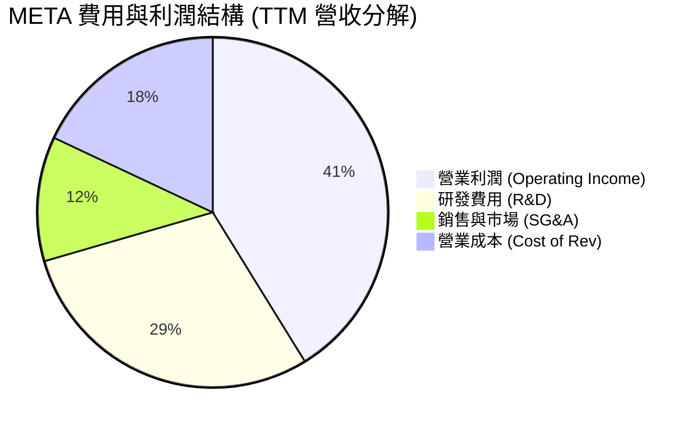

```
╔══════════════════════════════════════════════════════════════╗
║                  META 費用結構診斷                           ║
╠══════════════════════════════════════════════════════════════╣
║ 營業成本率  18.0%  ████░░░░░░░░░░░░░░░░░░░░  🟢 極低         ║
║ 研發費用率  29.3%  ███████░░░░░░░░░░░░░░░░░  🟡 偏高（AI投入）║
║ 營銷管理率  11.5%  ██░░░░░░░░░░░░░░░░░░░░░  🟢 控管極佳     ║
║ 營業利潤率  41.2%  ██████████░░░░░░░░░░░░░  🏆 行業頂尖     ║
╚══════════════════════════════════════════════════════════════╝
```

### 3.5 季度 EPS 趨勢與盈餘品質（Quality of Earnings）

#### 過去 4 季 EPS GAAP 表現：
*   **Q1 2026**: $10.57（同比增長 +60.4%）
*   **Q4 2025**: $9.02
*   **Q3 2025**: $1.08（**暴跌**，主因一次性所得稅撥備 $18.95B，Pretax Income 為 $21.66B，但稅後淨利僅 $2.71B）
*   **Q2 2025**: $7.28

#### 盈餘品質評估：

| 盈餘品質項目 | 數值/佔比 | 評估 |
|--------------|-----------|------|
| **股權薪酬 SBC / 營收** | 9.50% (TTM: ~$20.43B) | 🟡 中度稀釋風險。SBC 佔營收近 10%，雖然保留了現金，但對股東權益有一定稀釋作用（每年約 1% - 1.5% 股份稀釋，但已被大額回購完全抵消）。 |
| **SBC / 營業現金流** | 16.48% | 🟢 處於科技股合理區間（低於許多高增長 SaaS 公司）。 |
| **FCF / 淨利（現金轉換率）** | 68.36% (經調整) | 🟡 由於資本支出（Capex）極高，真實 FCF 轉換率低於歷史平均（歷史上常年 >100%）。但這屬於健康的戰略性資本開支，而非利潤虛增。 |
| **一次性/非經常性損益** | Q3 2025 稅務重擊 ｜ Q1 2026 稅務利益 | 🔴 **注意**：Q3 2025 的 $18.95B 稅務撥備與 Q1 2026 的 -$5.02B 稅務收益（Tax Benefit）導致 GAAP 淨利極度失真。分析時應以**營業利益（Operating Income）**為核心指標，其 TTM 營業利益 $88.59B 表現極為穩健。 |
| **資本化支出 vs 費用化** | 研發全部費用化 | 🟢 Meta 將龐大的 R&D（TTM $62.92B）全部當期費用化，並未進行資本化處理，這意味著其盈餘並未被虛增，盈餘品質極高。 |

**盈餘品質結論**：Meta 的 GAAP 淨利受稅率波動干擾較大，但其**核心營運利潤品質極高**。扣除 SBC 與稅務波動後，核心業務的現金生成能力依然極其驚人。

---

## 4. 資產負債表分析

### 4.1 資產結構分解

截至 Q1 2026，Meta 的總資產達到 $395.25B，其中固定資產（PP&E）因 AI 數據中心建設而大幅膨脹。

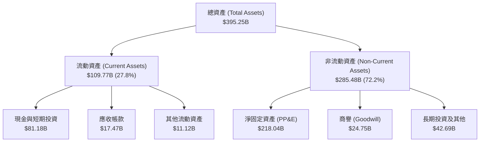

*數據解讀：固定資產（PP&E）從 2024 年底的 $136.27B 飆升至 Q1 2026 的 $218.04B，這清晰地展現了 Meta 在 GPU 算力與 AI 基礎設施上的超前佈局。*

### 4.2 流動性指標分析

| 流動性指標 | FY2023 | FY2024 | FY2025 | Q1 2026 | 行業中位數 | 評估 |
|------------|--------|--------|--------|---------|------------|------|
| **流動比率 (Current Ratio)** | 2.67 | 2.98 | 2.60 | **2.35** | ~1.50 | 🟢 極其充裕，無短期償債壓力 |
| **速動比率 (Quick Ratio)** | 2.51 | 2.82 | 2.34 | **2.11** | ~1.30 | 🟢 無存貨積壓，資產變現能力強 |

### 4.3 債務結構分析

Meta 歷史上幾乎不舉債，但為了鎖定長期低成本資金並支持 AI 基礎設施建設，近年發行了部分長期債券。

```
╔══════════════════════════════════════════════════════════════════╗
║                   META 債務健康診斷                              ║
╠══════════════════════════════════════════════════════════════════╣
║                                                                  ║
║  總債務：        $86.77B  ████░░░░░░░░░░░░░░░░░░░  （含租賃負債）║
║  總現金+投資：   $81.18B  ████████████████████░░░  （流動性極強）║
║  淨債務：        $5.59B   █░░░░░░░░░░░░░░░░░░░░░░  （極安全）    ║
║                                                                  ║
║  Debt / EBITDA：  0.82x   🟢 極低 (低於安全線 2.0x)              ║
║  利息保障倍數：   45.5x   🟢 極高 (無任何利息支付風險)           ║
║  債務股本比 (D/E): 35.6%  🟢 資本結構極其穩健                    ║
║                                                                  ║
╚══════════════════════════════════════════════════════════════════╝
```

### 4.4 股東權益趨勢

隨著留存收益的不斷累積，儘管進行了大額股份回購，股東權益（Stockholders' Equity）依然穩步上升。

```
╔══════════════════════════════════════════════════════════════════╗
║              META 股東權益趨勢（FY2022-FY2025）                  ║
╠══════════════════════════════════════════════════════════════════╣
║                                                                  ║
║  FY2022  $125.71B  ████████████░░░░░░░░░░░░░░░░░░                ║
║  FY2023  $153.17B  ███████████████░░░░░░░░░░░░░░░                ║
║  FY2024  $182.64B  ██████████████████░░░░░░░░░░░░                ║
║  FY2025  $217.24B  █████████████████████░░░░░░░░░                ║
║                                                                  ║
║  📈 股東權益 3年複合增長率：+20.0%                               ║
╚══════════════════════════════════════════════════════════════════╝
```

---

## 5. 現金流量深度分析

### 5.1 現金流量瀑布圖

Meta 展現了教科書般的「現金牛」特質。核心 FoA 業務產生的龐大營運現金流，完美支撐了其創紀錄的資本支出與股東回饋。

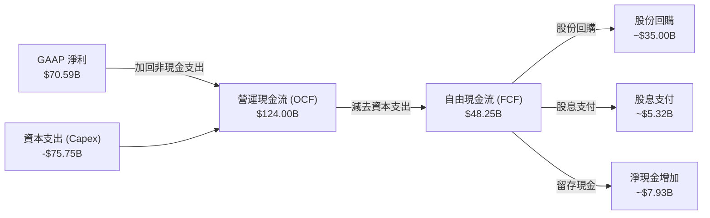

### 5.2 FCF 轉換率趨勢

| 現金流指標 | FY2022 | FY2023 | FY2024 | FY2025 | TTM |
|------------|--------|--------|--------|--------|-----|
| **營運現金流 (OCF)** | $50.48B | $71.11B | $91.33B | $115.80B | **$124.00B** |
| **資本支出 (Capex)** | -$31.19B | -$27.05B | -$37.26B | -$69.69B | **-$75.75B** |
| **自由現金流 (FCF)** | $19.29B | $44.07B | $54.07B | $46.11B | **$48.25B** |
| **FCF / 淨利 (轉換率)** | 83.15% | 112.71% | 86.71% | 76.27% | **68.36%** |

*分析：由於 Meta 在 2025 年和 2026 年初將 Capex 提升至年化 $70B-$75B 以上的水準，導致 FCF 佔淨利比重有所下滑。然而，高達 $48.25B 的 TTM FCF 依然能支撐其當前的所有資本配置需求。*

### 5.3 自由現金流與收益率趨勢

```
╔══════════════════════════════════════════════════════════════════╗
║                META 自由現金流與 FCF Yield 趨勢                  ║
╠══════════════════════════════════════════════════════════════════╣
║                                                                  ║
║  FY2022  $19.29B  ████░░░░░░░░░░░░░░  (Yield: 1.11%)             ║
║  FY2023  $44.07B  ██████████░░░░░░░░  (Yield: 2.54%)             ║
║  FY2024  $54.07B  ████████████░░░░░░  (Yield: 3.12%)             ║
║  FY2025  $46.11B  ██████████░░░░░░░░  (Yield: 2.66%)             ║
║  TTM     $48.25B  ███████████░░░░░░░  (Yield: 2.79%)  🟢         ║
║                                                                  ║
║  📊 當前 FCF Yield (2.79%) 高於標普 500 均值 (約 1.8%)           ║
╚══════════════════════════════════════════════════════════════════╝
```

### 5.4 資本配置評估

Meta 的資本配置戰略已轉向「成熟科技龍頭」模式：在維持高額研發與資本支出的同時，積極回饋股東。

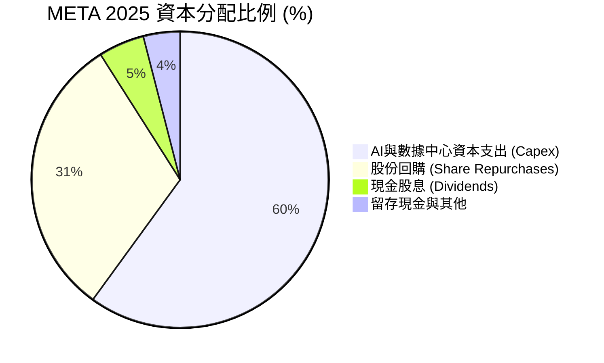

*   **股份回購**：2025 年回購約 $35B，過去 5 年累計減少流通股數約 10%，顯著增厚了每股盈餘（EPS）。
*   **現金股息**：自 2024 年起宣布派發股息，2025 年派發 $5.32B（DPS $2.10）。雖然股息率僅 **0.31%**（以當前股價 $681.31 計算），但這吸引了大量只能投資分紅股的機構長線資金。

---

## 6. 獲利能力與資本效率

### 6.1 資本回報率趨勢

| 獲利能力指標 | FY2023 | FY2024 | FY2025 | TTM | 行業均值 | 評估 |
|------------|--------|--------|--------|-----|----------|------|
| **ROE (股東權益報酬率)** | 28.15% | 37.14% | 30.24% | **32.90%** | ~12.0% | 🟢 極強 |
| **ROA (資產報酬率)** | 18.39% | 24.66% | 18.83% | **16.40%** | ~6.5% | 🟢 優秀 |
| **ROIC (投入資本回報率)** | 26.20% | 35.80% | 31.80% | **31.41%** | ~10.0% | 🏆 頂尖 |

### 6.2 ROIC vs WACC 分析（核心價值創造判斷）

ROIC（投入資本回報率）是衡量一家公司是否在「創造價值」還是「摧毀價值」的核心指標。若 ROIC > WACC，說明公司正為股東創造超額經濟利潤。

```
╔══════════════════════════════════════════════════════════════════╗
║                ROIC vs WACC 深度分析 (TTM)                       ║
╠══════════════════════════════════════════════════════════════════╣
║                                                                  ║
║  WACC 估算：                                                     ║
║  ├── 無風險利率 (10Y 美債)：  4.20%                              ║
║  ├── 股權風險溢價 (ERP)：     5.00%                              ║
║  ├── Beta：                   1.246                              ║
║  ├── 股權成本 (Ke)： 4.2% + 1.246 × 5.0% = 10.43%                ║
║  ├── 債務成本 (稅後)： 4.5% × (1 - 21%) = 3.56%                  ║
║  ├── 資本結構： 股權 95%，債務 5%                                ║
║  └── ✅ WACC ≈ 10.10%                                            ║
║                                                                  ║
║  ROIC 估算：                                                     ║
║  ├── NOPAT (税後淨營業利潤)： $88.59B × (1 - 21%) = $69.99B      ║
║  ├── 投入資本： 股東權益 $217.24B + 債務 $86.77B - 現金 $81.18B  ║
║  │   = $222.83B                                                  ║
║  └── ✅ ROIC ≈ 31.41%                                            ║
║                                                                  ║
║  ★ 經濟增加值 (EVA) = ROIC - WACC = +21.31pp                     ║
║                                                                  ║
║  ROIC  31.41%  ▓▓▓▓▓▓▓▓▓▓▓▓▓▓▓▓▓▓▓▓▓▓▓▓▓▓░░░░░  🟢             ║
║  WACC  10.10%  ▓▓▓▓▓▓▓▓▓░░░░░░░░░░░░░░░░░░░░░░  ──             ║
║  EVA   +21.31% █████████████████████░░░░░░░░░░  🏆 強力價值創造║
║                                                                  ║
║  📊 結論：ROIC 為 WACC 的 3.1 倍，每投入 $1 資本可創造超額回報  ║
╚══════════════════════════════════════════════════════════════════╝
```

### 6.3 杜邦三因素分解

透過杜邦分析，我們可以拆解 Meta 的 ROE 驅動因素：

$$\text{ROE} = \text{淨利率} \times \text{資產週轉率} \times \text{權益乘數}$$

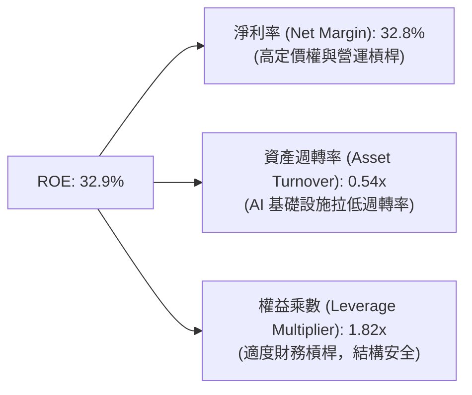

*分析*：Meta 的高 ROE 主要由**極高的淨利率（32.8%）**驅動，而非依賴高槓桿。資產週轉率（0.54x）由於近年來資產負債表上固定資產（數據中心）的大幅增加而略有下降，這屬於重資產科技轉型的必然結果。

---

## 7. 估值深度分析

### 7.1 同業估值比較表格

| 估值與財務指標 | **META** | **GOOGL** | **MSFT** | **AMZN** | META 相對評估 |
|----------------|----------|-----------|----------|----------|---------------|
| **當前股價** | $681.31 | $185.20 | $420.50 | $190.10 | - |
| **市值 (Market Cap)** | **$1.73T** | $2.25T | $3.12T | $1.98T | - |
| **Trailing P/E** | **24.77x** | 22.10x | 32.50x | 38.20x | 🟢 顯著低於 MSFT/AMZN |
| **Forward P/E** | **18.75x** | 17.50x | 26.80x | 28.50x | 🟢 具備極高性價比 |
| **PEG Ratio** | **0.97** | 1.15 | 1.85 | 1.45 | 🏆 唯一 PEG < 1.0 的巨頭 |
| **EV / EBITDA** | **15.40x** | 14.20x | 20.50x | 13.80x | 🟢 估值合理 |
| **P/S Ratio** | **8.05x** | 6.50x | 11.50x | 3.10x | 🟡 軟體屬性估值 |
| **FCF Yield (TTM)** | **2.79%** | 3.20% | 2.10% | 2.85% | 🟢 居於大科技股前列 |

### 7.2 歷史估值區間分析

Meta 的歷史 P/E (Trailing) 中位數約為 26.5x。當前 Forward P/E 僅 18.75x，處於過去 5 年估值區間的下四分位數。

```
╔══════════════════════════════════════════════════════════════════╗
║              META 歷史 P/E 估值區間及當前位置                    ║
╠══════════════════════════════════════════════════════════════════╣
║                                                                  ║
║  歷史最低 P/E (2022 底部)： 8.5x                                 ║
║  歷史平均 P/E (5年中位)：  26.5x                                 ║
║  歷史最高 P/E (2021 頂部)： 38.0x                                 ║
║                                                                  ║
║  當前 Trailing P/E (24.77x)：                                    ║
║  8.5x ─────────────────── 24.77x ─────── 26.5x ───────── 38.0x   ║
║                           ▲                                      ║
║                       [當前位置]                                 ║
║                                                                  ║
║  当當 Forward P/E (18.75x)：                                     ║
║  8.5x ────────── 18.75x ──────────────── 26.5x ───────── 38.0x   ║
║                  ▲                                               ║
║              [極具吸引力]                                        ║
║                                                                  ║
╚══════════════════════════════════════════════════════════════════╝
```

### 7.3 情境目標價（假設驅動）

我們基於 3 年期貼現與終端倍數法，設計了三種情境：

| 情境 | 營收 CAGR (3年) | 終端營業利益率 | 退出 P/E 倍數 | 隱含目標價 | 相對現價漲跌幅 | 發生機率 |
|------|-----------------|----------------|---------------|------------|----------------|----------|
| 🔴 **悲觀情境** | 10.0% | 32.0% | 15.0x | **$664.46** | -2.5% | 20% |
| 🟡 **基準情境** | **18.0%** | **40.0%** | **22.0x** | **$826.63** | **+21.3%** | **60%** |
| 🟢 **樂觀情境** | 25.0% | 43.0% | 26.0x | **$1015.00** | +49.0% | 20% |

*估值倍數選擇說明：鑑於 Meta 擁有極高的利潤率與現金轉換率，我們以 P/E 作為主要估值錨點，並以 EV/EBITDA 作為輔助驗證。基準情境下的 22x P/E 顯著低於微軟與蘋果的歷史平均水準，具備高度保守性。*

### 7.4 DCF 敏感性分析（12個月目標價矩陣）

基於基準 WACC = 10.10% 與 終端無窮增長率（g）= 3.0% 進行敏感性分析：

| 營收 CAGR \ WACC | 9.0% | **10.10%（基準）** | 11.5% |
|------------------|------|--------------------|------|
| **22.0%（樂觀）** | $1,085 (+59.3%) | $1,015 (+49.0%) | $935 (+37.2%) |
| **18.0%（基準）** | $895 (+31.4%) | **$826 (+21.3%)** | $760 (+11.6%) |
| **12.0%（悲觀）** | $715 (+4.9%) | $664 (-2.5%) | $610 (-10.5%) |

### 7.5 估值綜合區間

```
╔══════════════════════════════════════════════════════════════════╗
║                    META 股價估值區間圖                           ║
╠══════════════════════════════════════════════════════════════════╣
║                                                                  ║
║  52周最低價： $519.78                                            ║
║  當前股價：   $681.31                                            ║
║  52周最高價： $793.65                                            ║
║                                                                  ║
║  $519.78 ─── $681.31 ─── $793.65 ────── $826.63 ────── $1015.00 ║
║               ▲                  ▲            ▲                 ║
║            [現價]             [52W高點]   [基準目標]        [樂觀目標]  ║
║                                                                  ║
║  📊 結論：當前股價相較於基準目標價具備 21.3% 的安全邊際。       ║
╚══════════════════════════════════════════════════════════════════╝
```

---

## 8. 成長催化劑

### 8.1 催化劑時間軸

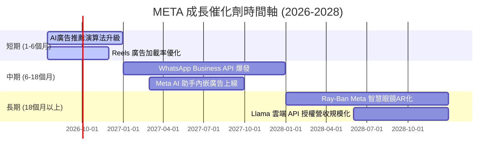

### 8.2 TAM 市場規模分析

```
╔══════════════════════════════════════════════════════════════════╗
║                  META 潛在市場規模 (TAM) 預測                    ║
╠══════════════════════════════════════════════════════════════════╣
║                                                                  ║
║  1. 全球數位廣告市場 (2027E)：                                    ║
║     ├── 全球 TAM: $850B                                          ║
║     ├── Meta 預估份額: 23%                                        ║
║     └── 預估營收貢獻: $195B                                      ║
║                                                                  ║
║  2. 企業級商業通訊 (WhatsApp Business)：                          ║
║     ├── 全球 TAM: $50B                                           ║
║     ├── Meta 預估份額: 30%                                        ║
║     └── 預估營收貢獻: $15B                                       ║
║                                                                  ║
║  3. AI 雲端服務與智慧硬體 (2028E+)：                              ║
║     ├── 全球 TAM: $200B                                          ║
║     ├── Meta 預估份額: 5%                                         ║
║     └── 預估營收貢獻: $10B                                       ║
║                                                                  ║
╚══════════════════════════════════════════════════════════════════╝
```

### 8.3 成長驅動力結構圖

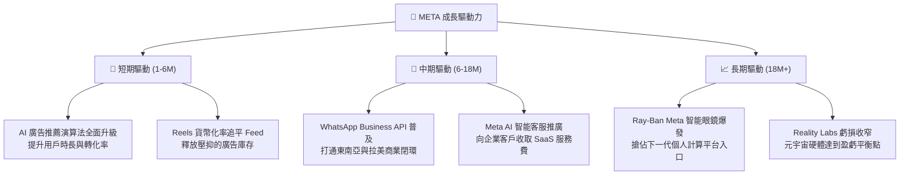

---

## 9. 風險矩陣

### 9.1 風險評分矩陣

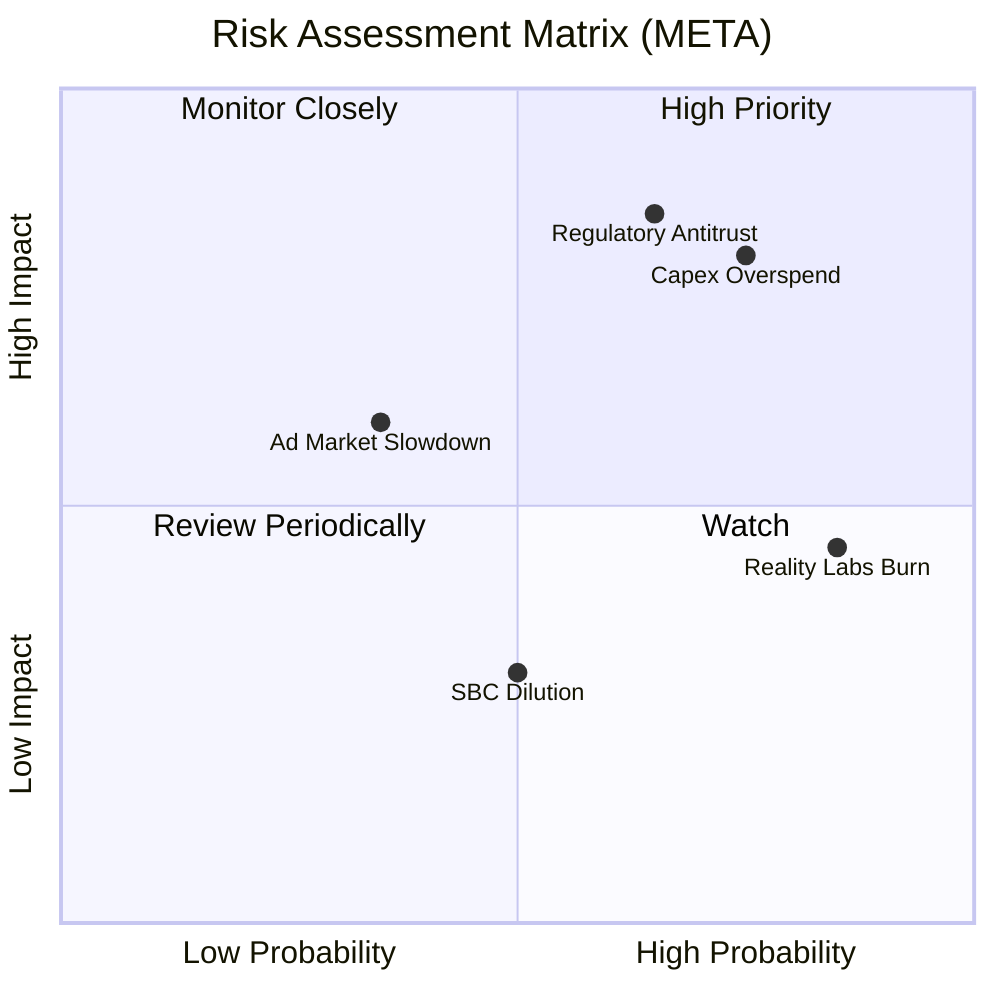

### 9.2 風險清單詳細分析

| # | 風險項目 | 發生機率 | 財務衝擊 | 風險評分 | 緩解措施 |
|---|----------|----------|----------|----------|----------|
| 1 | 🔴 **AI 資本支出回報率（ROI）不及預期** | 高 (75%) | 高 (-10%營益率) | 🔴 **8.0/10** | 靈活調整 Capex 預算，若營收增速放緩，可隨時暫緩下一代數據中心建設。 |
| 2 | 🔴 **歐美反壟斷與拆分風險** | 中 (65%) | 極高 (估值倍數收縮) | 🔴 **7.5/10** | 聘請頂級法律團隊，並透過開源 Llama 模型向監管機構展示其促進市場競爭的態度。 |
| 3 | 🟡 **Reality Labs 持續失血** | 極高 (85%) | 中 (-$15B FCF/年) | 🟡 **6.0/10** | 限制 Reality Labs 的年度預算增長率不超過 10%，並聚焦於熱銷的 Smart Glasses。 |
| 4 | 🟡 **宏觀經濟衰退導致廣告預算收縮** | 中 (35%) | 中 (-8%營收) | 🟡 **5.0/10** | 擴大高 ROI 的電商直接響應廣告（DR Ads）佔比，這類廣告在衰退期最具韌性。 |

---

## 10. 投資建議

### 10.1 最終綜合評級雷達圖

```
        基本面強度 (9.5)
           ▲  10
           │   8
 估值  ────┼──── 成長動能 (9.0)
 (8.0)    / \
         /   \
        /     \
  財務健康     獲利品質 (9.2)
   (8.5)
```

### 10.2 目標價與隱含報酬率

| 情境 | 目標價 | 隱含報酬率 | 機率權重 | 期望目標價 |
|------|--------|------------|----------|------------|
| 🔴 **悲觀情境** | $664.46 | -2.5% | 20% | - |
| 🟡 **基準情境** | **$826.63** | **+21.3%** | **60%** | **$831.94** |
| 🟢 **樂觀情境** | $1015.00 | +49.0% | 20% | (加權期望值) |

### 10.3 買入時機與觸發因素

```
╔══════════════════════════════════════════════════════════════════╗
║                  ✅ META 投資交易決策 Checklist                 ║
╠══════════════════════════════════════════════════════════════════╣
║                                                                  ║
║  立即買入觸發條件（多數符合）：                                  ║
║  ✅ Forward P/E 跌破 20x（當前為 18.75x，已符合）                ║
║  ✅ 核心 FoA 廣告營收增速維持在 20% 以上（當前 33.1%，符合）     ║
║  ✅ 營業利益率穩定在 38% 以上（當前 40.6%，符合）                ║
║                                                                  ║
║  加碼觸發條件（出現以下任一）：                                  ║
║  ☐ 財報顯示 Reality Labs 虧損開始收窄                            ║
║  ☐ WhatsApp 商業通訊營收同比增速超過 50%                         ║
║  ☐ 股價因宏觀非基本面因素回檔至 $600 附近                        ║
║                                                                  ║
║  減碼/停損觸發條件（出現以下任一）：                             ║
║  ☐ 核心廣告營收增速連續兩季跌破 10%                              ║
║  ☐ AI Capex 預算繼續上調，但營收增速未見相應提速                 ║
║  ☐ 歐美監管機構正式通過拆分 Meta 的實質性法律判決                ║
║                                                                  ║
╚══════════════════════════════════════════════════════════════════╝
```

### 10.4 投資人適配度分析

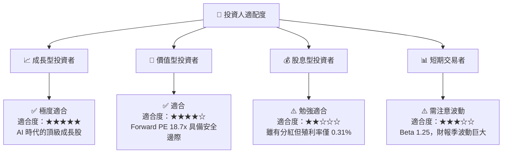

### 10.5 每季財報監控清單（Quarterly Watch List）

為了持續追蹤本篇報告的有效性，投資人應在每季財報中重點監控以下指標：

| 監控指標 | 基準值 (當前) | 偏多觸發門檻 (加碼) | 偏空觸發門檻 (減碼/觀望) | 戰略含意 |
|----------|---------------|---------------------|--------------------------|----------|
| **FoA 廣告營收增速 (YoY)** | 33.1% | > 25.0% | < 12.0% | 核心基本盤的吸金能力與市場份額 |
| **整體營業利益率 (Op Margin)**| 40.6% | > 42.0% | < 35.0% | 考驗「高效之年」後的費用控制力 |
| **年度 Capex 指引** | $37B-$40B | 穩定且營收增速匹配 | > $50B 且營收增速放緩 | AI 投資的 ROI 是否開始惡化 |
| **Reality Labs 季度虧損** | ~$4.0B | < $3.0B (虧損收窄) | > $5.0B (失血加劇) | 元宇宙無底洞對整體現金流的拖累 |
| **流通股數年減率** | -1.23% | > -2.0% (加速回購) | 0% 或正增長 (稀釋加劇) | 股權稀釋控制與股東回報力度 |

---

### 10.6 反面論證：什麼會證明論點錯誤（What Would Change My Mind）

身為理性的 CFA 分析師，我們必須設定客觀的「證偽標準」。若以下條件在未來 2-3 季內發生，本報告的「強烈買入」多頭論點將宣告失效，投資人應立即重新評估或執行減碼：

```
╔══════════════════════════════════════════════════════════════════╗
║              ⚠️ 多頭論點失效條件 (Disconfirming Evidence)        ║
╠══════════════════════════════════════════════════════════════════╣
║  本投資論點在下列情況成立時應重新檢視或退出：                    ║
║                                                                  ║
║  ☐ 核心 FoA 廣告營收增速連續兩季低於 12%（說明 AI 推薦邊際效應   ║
║     遞減，或面臨 TikTok/Amazon 的嚴重蠶食）。                     ║
║                                                                  ║
║  ☐ 營業利益率（Operating Margin）較峰值收縮超過 600 個基點     ║
║     （即跌破 34.5%），主因基礎設施折舊與 Reality Labs 費用失控。 ║
║                                                                  ║
║  ☐ 自由現金流（FCF）轉換率跌破 50%，且年化 FCF 降至 $30B 以下。  ║
║                                                                  ║
║  ☐ ROIC 跌破 15%（說明公司資本配置效率急劇惡化，摧毀股東價值）。 ║
║                                                                  ║
║  ☐ 歐盟或美國 FTC 贏得實質性訴訟，強制 Meta 拆分 Instagram 或    ║
║     WhatsApp，導致網路效應護城河瓦解。                           ║
╚══════════════════════════════════════════════════════════════════╝
```

---

> **免責聲明**：本報告為 AI 自動生成，僅供研究參考，不構成投資建議。投資有風險，入市需謹慎。