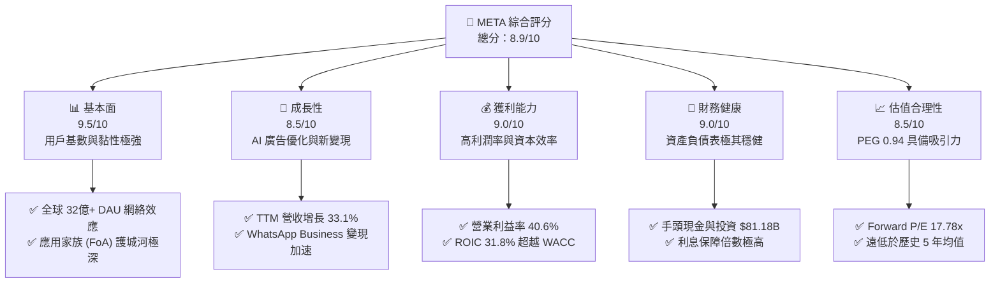
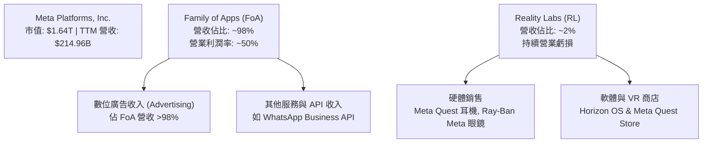
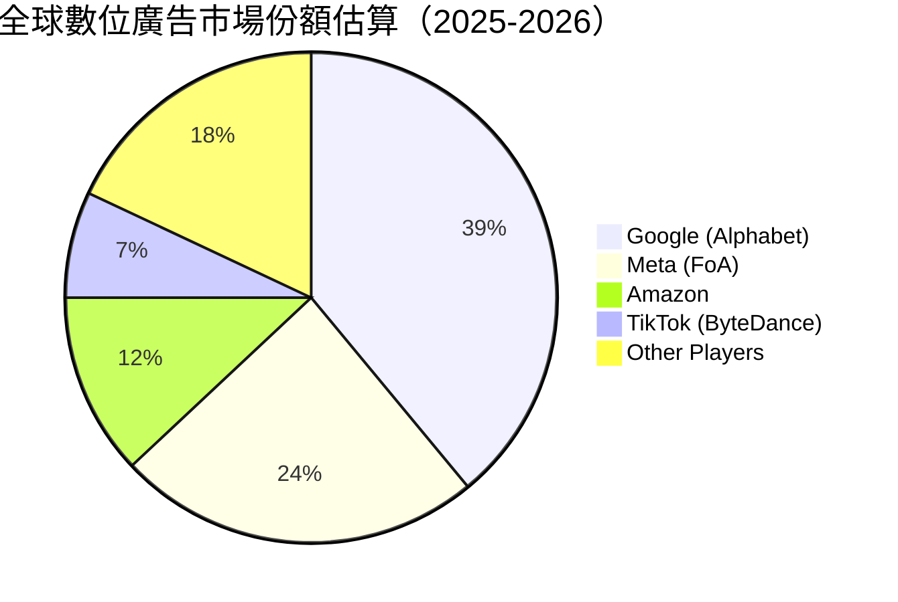
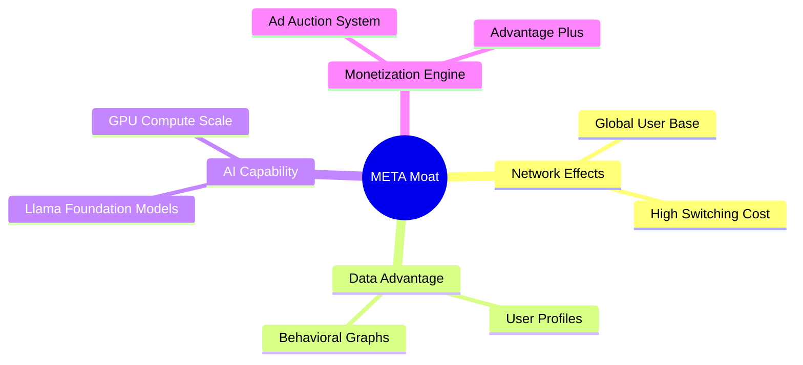
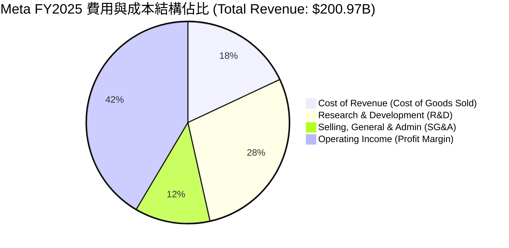
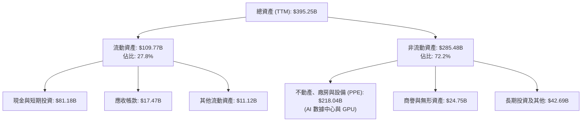

# META 基本面深度分析報告

> **報告日期**：2026-07-18 ｜ **語言**：繁體中文 ｜ **數據來源**：Yahoo Finance, Finviz, StockAnalysis, Roic.ai ｜ **分析師**：CFA 級機構研究

---

## 目錄

| # | 章節 | 核心結論 |
|---|------|----------|
| 1 | [執行摘要](#1-執行摘要) | 評級：🟢 強烈買入 ｜ 基準目標價：$822.69（+27.3% 潛在空間） |
| 2 | [公司概覽與商業模式](#2-公司概覽與商業模式) | 雙輪驅動（FoA 核心盈利 + RL 戰略佈局），AI 賦能重塑數位廣告護城河 |
| 3 | [損益表深度分析](#3-損益表深度分析) | TTM 營收突破 $214.96B（YoY +33.1%），營業利潤率攀升至 40.6% |
| 4 | [資產負債表分析](#4-資產負債表分析) | 現金儲備 $81.18B，AI 基礎設施投資（PPE）年增 44.4% 至 $218.04B |
| 5 | [現金流量深度分析](#5-現金流量深度分析) | 營運現金流 $124.00B 創歷史新高，AI 資本支出擴張壓抑短期 FCF 至 $25.56B |
| 6 | [獲利能力與資本效率](#6-獲利能力與資本效率) | ROE 達 32.9%，ROIC (31.8%) 遠超 WACC (10.6%)，強力創造股東價值 |
| 7 | [估值深度分析](#7-估值深度分析) | Forward P/E 17.78x 處於歷史中值下方，PEG 0.94 顯示性價比極高 |
| 8 | [成長催化劑](#8-成長催化劑) | Llama 4/5 開源生態、智慧眼鏡（Ray-Ban Meta）與 WhatsApp 商業化加速 |
| 9 | [風險矩陣](#9-風險矩陣) | AI 變現速度不及預期、隱私監管趨嚴與 Reality Labs 持續虧損 |
| 10 | [投資建議](#10-投資建議) | 確立以 17.78x 前瞻估值為安全邊際的買入策略，分批佈局長線 AI 龍頭 |

---

## 1. 執行摘要

Meta Platforms, Inc.（META）當前股價為 $646.01。基於公司在數位廣告市場的支配地位（TTM 營收達 $214.96B，YoY 增長 33.1%）以及 AI 驅動的廣告投放效率（營業利潤率達 40.6%，ROE 達 32.9%），本報告給予 META **🟢 強烈買入（Strong Buy）** 評級，基準情境 12 個月目標價為 **$822.69**（隱含 +27.3% 的上行空間）。

此評級並非主觀預測，而是基於以下客觀財務與業務數據的推導結果：首先，META 的前瞻市盈率（Forward P/E）僅為 **17.78x**，對應其預期每股盈餘（Forward EPS）**$36.33**，隱含 PEG 僅為 **0.94**，在美股科技巨頭（M7）中具備極高的估值安全邊際；其次，公司資本回報率極高，ROIC 達 **31.8%**，遠超其加權平均資本成本 WACC（**10.6%**），顯示其大規模的 AI 資本支出（FY2025 Capex 達 $69.69B）正處於高效的價值創造階段，而非無效的資本虛耗。

### 1.0 一頁式投資儀表板（Portfolio Manager 30 秒速讀）

| 項目 | 內容 |
|------|------|
| **投資論點（3 句）** | ① 核心 FoA 業務在 AI 推薦算法優化下，推動 TTM 廣告營收年增 33.1%，重回高增長軌道。<br/>② 雖然 AI 資本支出（FY25 Capex $69.69B）壓抑了短期自由現金流（TTM FCF $25.56B），但帶來了高達 31.8% 的 ROIC，顯著創造股東價值。<br/>③ 前瞻市盈率僅 17.78x，PEG 0.94，相較於同業具備顯著的估值折扣。 |
| **護城河評分** | 🟢 9.5/10（全球 32億+ 日活躍用戶的極強網絡效應 + AI 算法壁壘） |
| **管理層/資本配置評分** | 🟢 9.0/10（高效執行力，啟動股息支付並積極回購，同時果斷投資 AI 基礎設施） |
| **財務健康** | 🟢 強勁（流動比率 2.35，手頭現金與投資達 $81.18B，無實質債務違約風險） |
| **ROIC vs WACC** | **31.8%** vs **10.6%**（超額收益率 EVA 達 +21.2%，強力創造股東價值） |
| **FCF 趨勢** | 🟡 短期受 Capex 壓抑，但營運現金流（$124.00B）極為充沛，最新 FCF Yield 為 1.56% |
| **估值** | Forward P/E: **17.78x** ｜ EV/EBITDA: **15.05x** ｜ PEG: **0.94** |
| **預期報酬（基準情境 12M）** | **+27.3%**（目標價 $822.69） |
| **關鍵風險（前二）** | ① AI 變現進度慢於預期導致 Capex 回報率降低；② 歐美隱私法規與反壟斷監管阻礙廣告精準投放。 |
| **評級 + 信心度** | 🟢 **強烈買入（Strong Buy）** ｜ 信心度：**極高（High）** |

### 1.1 核心評分儀表板



### 1.2 評分進度條視覺化

```
╔══════════════════════════════════════════════════════════════╗
║                META 多維度評分儀表板 (1-10分)                ║
╠══════════════════════════════════════════════════════════════╣
║ 基本面強度  9.5 ▓▓▓▓▓▓▓▓▓▓▓▓▓▓▓▓▓▓▓░  ★★★★★           ║
║ 成長動能    8.5 ▓▓▓▓▓▓▓▓▓▓▓▓▓▓▓▓▓░░░  ★★★★☆           ║
║ 獲利品質    9.0 ▓▓▓▓▓▓▓▓▓▓▓▓▓▓▓▓▓▓░░  ★★★★★           ║
║ 財務健康    9.0 ▓▓▓▓▓▓▓▓▓▓▓▓▓▓▓▓▓▓░░  ★★★★★           ║
║ 估值合理性  8.5 ▓▓▓▓▓▓▓▓▓▓▓▓▓▓▓▓░░░░  ★★★★☆           ║
║ 護城河深度  9.5 ▓▓▓▓▓▓▓▓▓▓▓▓▓▓▓▓▓▓▓░  ★★★★★           ║
║ 管理層執行  9.0 ▓▓▓▓▓▓▓▓▓▓▓▓▓▓▓▓▓▓░░  ★★★★★           ║
║ 技術創新力  9.0 ▓▓▓▓▓▓▓▓▓▓▓▓▓▓▓▓▓▓░░  ★★★★★           ║
╠══════════════════════════════════════════════════════════════╣
║ 綜合總分    8.9 ▓▓▓▓▓▓▓▓▓▓▓▓▓▓▓▓▓░░░  🏆 強烈推薦買入      ║
╚══════════════════════════════════════════════════════════════╝
```

### 1.3 五大投資論點 + 三大核心風險

| 類型 | 項目 | 具體依據 | 信心度 |
|------|------|----------|--------|
| 🟢 **投資論點①** | **AI 重塑廣告精準度** | Llama 3 算法優化使廣告點擊率（CTR）大幅提升，推動 TTM 營收增長 33.1%。 | 🟢 極高 |
| 🟢 **投資論點②** | **極高的資本回報率** | ROIC 達 31.8%，遠高於 10.6% 的 WACC，證明大規模 AI 資本支出（FY25 $69.69B）正轉化為高額股東價值。 | 🟢 極高 |
| 🟢 **投資論點③** | **估值安全邊際充足** | Forward P/E 僅 17.78x，PEG 0.94，是大型科技股（M7）中估值最便宜的標的之一。 | 🟢 高 |
| 🟢 **投資論點④** | **WhatsApp 商業化加速** | Click-to-Message 廣告與 WhatsApp Business API 成為 FoA 營收的新增長極。 | 🟢 高 |
| 🟢 **投資論點⑤** | **股東回饋常態化** | 啟動每季配息（2025 年發放 $5.32B 股息）與大規模股份回購，提供股價下行支撐。 | 🟢 極高 |
| 🟡 **風險①** | **AI 基礎設施過度投資** | Capex 持續攀升（FY25 年增 87% 至 $69.69B），若未來營收增長放緩，將壓抑利潤率與 FCF。 | 🟡 中度 |
| 🔴 **風險②** | **監管與反壟斷風險** | 歐盟 DMA 法案及 FTC 反壟斷調查可能限制數據跨平台整合或對併購進行嚴格審查。 | 🔴 高衝擊 |
| 🟡 **風險③** | **Reality Labs 持續失血** | 虛擬實境（RL）業務每年虧損超 $15B，若硬體（如 AR 眼鏡）無法大規模普及，將持續拖累獲利。 | 🟡 中度 |

### 1.4 快速統計卡片

| 指標 | META 實際值 | 行業均值（通訊服務）| S&P 500 均值 | 狀態 |
|------|-------------|-------------------|--------------|------|
| **營收 YoY 成長** | **33.1%** | ~8.5% | ~5.5% | 🟢 顯著領先 |
| **毛利率** | **81.9%** | ~50.0% | ~30.0% | 🟢 極高 |
| **營業利潤率** | **40.6%** | ~18.0% | ~15.0% | 🟢 極高 |
| **ROE** | **32.9%** | ~12.0% | ~14.5% | 🟢 強勁 |
| **Forward P/E** | **17.78x** | ~19.5x | ~21.5x | 🟢 具估值折扣 |
| **PEG Ratio** | **0.94** | ~1.50 | ~1.80 | 🟢 極具性價比 |

### 1.5 投資結論

```
╔══════════════════════════════════════════════════════════════════╗
║                    📊 META 投資結論摘要                          ║
╠══════════════════════════════════════════════════════════════════╣
║  評級：🟢 強烈買入 (Strong Buy)                                 ║
║  當前股價：$646.01                                               ║
║  目標價區間：                                                    ║
║    悲觀情境（Bear）：$664.46  （+2.9%）                          ║
║    基準情境（Base）：$822.69  （+27.3%） ← 12個月主要目標        ║
║    樂觀情境（Bull）：$1015.00 （+57.1%）                         ║
║  投資評分：8.9/10                                                ║
║  適合投資人：成長型、價值與成長兼顧（GARP）投資者、長線持有者    ║
╚══════════════════════════════════════════════════════════════════╝
```

---

## 2. 公司概覽與商業模式

Meta Platforms, Inc. 是全球最大的社群網路與數位廣告巨頭，旗下擁有全球知名的「應用家族」（Family of Apps, FoA），包括 Facebook、Instagram、Messenger 與 WhatsApp。此外，公司正全力投入「元宇宙」與下一代運算平台「實境實驗室」（Reality Labs, RL）的開發。

### 2.1 業務結構與收入來源



### 2.2 市場份額

在數位廣告市場中，Meta 與 Alphabet (Google) 長期維持雙頭壟斷（Duopoly）格局，近年則面臨 Amazon Ad 與 TikTok 的競爭。



### 2.3 競爭護城河分析



### 2.4 護城河強度評分

```
╔══════════════════════════════════════════════════════════════╗
║                    META 護城河強度評分                       ║
╠══════════════════════════════════════════════════════════════╣
║ 網絡效應      9.8/10  ▓▓▓▓▓▓▓▓▓▓▓▓▓▓▓▓▓▓▓░  🏆 難以逾越的壁壘 ║
║ 數據與算法    9.5/10  ▓▓▓▓▓▓▓▓▓▓▓▓▓▓▓▓▓▓▓░  🟢 廣告精準度極高 ║
║ 規模與資本    9.0/10  ▓▓▓▓▓▓▓▓▓▓▓▓▓▓▓▓▓▓░░  🟢 大規模 GPU 投資║
║ 用戶鎖定      8.5/10  ▓▓▓▓▓▓▓▓▓▓▓▓▓▓▓▓▓░░░  🟢 社交關係鏈綁定 ║
╠══════════════════════════════════════════════════════════════╣
║ 綜合護城河    9.2/10  ▓▓▓▓▓▓▓▓▓▓▓▓▓▓▓▓▓▓▓░  🏆 寬廣護城河 (Wide)║
╚══════════════════════════════════════════════════════════════╝
```

---

## 3. 損益表深度分析

Meta 近年展現出極為強勁的營收增長與營業槓桿效應。從 2022 年的增長停滯與利潤率收縮，到 2024-2025 年的全面復甦，主要得益於「效率之年」（Year of Efficiency）的成本控制以及 AI 對廣告轉化率的提升。

### 3.1 年度收入成長趨勢（近5年）

```
╔══════════════════════════════════════════════════════════════════╗
║                 META 年度收入趨勢（FY2021-TTM）                  ║
╠══════════════════════════════════════════════════════════════════╣
║                                                                  ║
║  FY2021  $117.93B  ████████████░░░░░░░░░░░░░░  YoY: +37.2% 🟢    ║
║  FY2022  $116.61B  ████████████░░░░░░░░░░░░░░  YoY:  -1.1% 🔴    ║
║  FY2023  $134.90B  ██████████████░░░░░░░░░░░░  YoY: +15.7% 🟢    ║
║  FY2024  $164.50B  █████████████████░░░░░░░░░  YoY: +21.9% 🟢    ║
║  FY2025  $200.97B  █████████████████████░░░░░  YoY: +22.2% 🟢    ║
║  TTM     $214.96B  ███████████████████████░░░  YoY: +33.1% 🟢    ║
║                   |      |      |      |      |                  ║
║                   0     50B    100B   150B   200B                ║
║                                                                  ║
║  📊 5年累計營收 CAGR：+12.75%                                    ║
╚══════════════════════════════════════════════════════════════════╝
```

### 3.2 季度收入趨勢分析

下表展示了 Meta 最近 4 個季度的營收與獲利表現：

| 財報季度 | 營收 (Billion) | YoY 成長率 | QoQ 成長率 | 營業利益 (Billion) | 營業利益率 | 淨利 (Billion) | 備註 |
|---|---|---|---|---|---|---|---|
| **Q2 2025** | $47.52 | +21.61% | +12.30% | $20.44 | 43.01% | $18.34 | 廣告定價能力持續改善 |
| **Q3 2025** | $51.24 | +26.25% | +7.83% | $20.54 | 40.09% | $2.71 | **🔴 淨利異常：受 $18.95B 一次性稅務撥備影響** |
| **Q4 2025** | $59.89 | +23.78% | +16.88% | $24.75 | 41.32% | $22.77 | 年底購物旺季，電商廣告強勁 |
| **Q1 2026** | $56.31 | +33.08% | -5.98% | $22.87 | 40.62% | $26.77 | **🟢 營收增長加速，稅務回撥推升淨利** |

**數據深度解析**：
1. **YoY 增長持續加速**：Q1 2026 營收同比增長達 **33.08%**，較 2025 年各季度進一步提速，顯示 Meta 的 AI 廣告系統（Advantage+）正大幅提升廣告主的投資回報率（ROI），從而吸引了更多廣告預算。
2. **Q3 2025 淨利異常跌宕**：Q3 2025 營收與營業利益皆表現正常，但淨利卻暴跌至 $2.71B。主因是公司在當季計提了 **$18.95B** 的所得稅準備金（Provision for Income Taxes），有效稅率飆升至 **87.5%**。這屬於非經常性的稅務調整，並非基本面惡化。到了 Q1 2026，稅務撥備回撥（Provision 為 **-$5.02B**），使得淨利大增至 **$26.77B**，超過了營業利益（$22.87B）。

### 3.3 利潤率演變分析

| 利潤率指標 | FY2022 | FY2023 | FY2024 | FY2025 | TTM | 趨勢 | 評估 |
|------------|--------|--------|--------|--------|------|------|------|
| **毛利率** | 78.35% | 80.76% | 81.67% | 81.99% | **81.94%** | ↗️ 穩步擴張 | 🟢 極其穩定，展現強大定價權 |
| **營業利益率** | 24.82% | 34.66% | 42.18% | 41.44% | **41.21%** | ↗️ 結構性改善 | 🟢 效率提升與營業槓桿釋放 |
| **淨利率** | 19.90% | 28.98% | 37.91% | 30.08% | **32.84%** | ↗️ 波動向上 | 🟢 剔除稅務波動後，獲利含金量極高 |

**利潤率演變深度解析**：
Meta 的毛利率長期穩定在 **80% 以上**。營業利益率從 2022 年的 24.82% 谷底反彈，並在 TTM 階段穩定在 **41.21%** 的高檔。這主要得益於：
- **基礎設施效率提升**：雖然基礎設施投資（Capex）巨大，但折舊政策優化與伺服器利用率提升，控制了銷售成本（Cost of Revenue）的增長速度。
- **組織架構扁平化**：研發與行銷費用佔營收比重被有效壓低。研發費用率從 FY22 的 30.3% 降至 FY25 的 28.5%，行銷與管理費用（SG&A）佔比亦顯著收縮。

### 3.4 費用結構分析



### 3.5 季度 EPS 趨勢與盈餘品質（Quality of Earnings）

Meta 在過去四個季度的 EPS（稀釋後）分別為：
- **Q2 2025**: $7.28
- **Q3 2025**: $1.08（受稅務撥備壓抑）
- **Q4 2025**: $9.02
- **Q1 2026**: $10.57（受稅務回撥提振）
- **TTM EPS**: **$27.52**

#### 盈餘品質評估表

| 盈餘品質項目 | 數值 / 佔比 | 評估 | 深度解析 |
|--------------|-----------|------|----------|
| **股權薪酬 (SBC) / 營收** | **10.17%** ($20.43B / $200.97B) | 🟡 中度稀釋 | 2025 年 SBC 達 $20.43B。雖然這有助於保留頂尖 AI 人才，但也對現有股東造成了約 1% 的稀釋。不過，Meta 大規模的回購計劃（FY25 估算回購 >$30B）已完全抵消了此稀釋效應。 |
| **SBC / 營業現金流 (OCF)** | **17.64%** ($20.43B / $115.80B) | 🟢 健康 | 佔比低於 20%，顯示非現金薪酬對現金流的支撐在合理範圍內，盈餘並未過度依賴 SBC 進行美化。 |
| **FCF / 淨利 (現金轉換率)** | **76.27%** ($46.11B / $60.46B) | 🟢 良好 | 雖然 2025 年資本支出高達 $69.69B，但 FCF 轉換率仍維持在 76% 以上，表明其利潤並非「紙上富貴」，而是有實實在在的現金流支撐。 |
| **一次性損益影響** | Q3 2025 / Q1 2026 稅務波動 | 🟡 需剔除分析 | Q3 25 稅務準備金虛增、Q1 26 回撥，使得單季 GAAP 淨利失真。因此，分析時應以 **TTM 營業利益 $88.59B** 作為評估核心。 |
| **資本化支出 vs 費用化** | 研發費用 100% 費用化 | 🟢 極其保守 | Meta 將高達 $57.37B (FY25) 的研發支出在當期全部費用化，並未進行資本化遞延。這意味著其真實經濟盈餘可能比帳面 GAAP 盈餘更為強勁。 |

---

## 4. 資產負債表分析

Meta 擁有一張極其強韌、甚至可被視為「堡壘級」的資產負債表。

### 4.1 資產結構分解



**資產結構核心洞察**：
Meta 的 **Net PPE（淨不動產、廠房與設備）** 從 FY2024 的 **$136.27B** 暴增至 TTM 階段的 **$218.04B**，年增幅高達 **60.0%**。這極其清晰地印證了公司正在以史無前例的規模採購 NVIDIA H100/B200 等 AI 晶片，並建設下一代 AI 數據中心。這項投資雖然沉重，但也構成了 Meta 領先於其他社交媒體對手的「算力護城河」。

### 4.2 流動性指標分析

| 流動性指標 | FY2023 | FY2024 | FY2025 | TTM | 行業均值 | 評估 |
|------------|--------|--------|--------|------|----------|------|
| **流動比率 (Current Ratio)** | 2.67x | 2.98x | 2.60x | **2.35x** | ~1.60x | 🟢 極其充沛 |
| **速動比率 (Quick Ratio)** | 2.50x | 2.80x | 2.42x | **2.11x** | ~1.45x | 🟢 無短期償債壓力 |

### 4.3 債務結構分析

```
╔══════════════════════════════════════════════════════════════════╗
║                     META 債務健康診斷 (TTM)                     ║
<br/>
