# META 基本面深度分析報告

> **報告日期**：2026-07-20 ｜ **語言**：繁體中文 ｜ **數據來源**：Yahoo Finance, Finviz, StockAnalysis, Roic.ai ｜ **分析師**：CFA 級機構研究

---

## 目錄

| # | 章節 | 核心結論 |
|---|---|---|
| 1 | **執行摘要** | 評級：🟢 買入 ｜ 基準目標價：$780.00（+20.8% 空間） ｜ 核心驅動：AI 廣告優化與 Llama 生態變現 |
| 2 | **公司概覽與商業模式** | 護城河評分：9.0/10 ｜ 雙核心板塊（FoA 與 Reality Labs）展現強大網絡效應與技術壁壘 |
| 3 | **損益表深度分析** | TTM 營收 $214.96B（YoY +33.1%） ｜ 一次性稅務事件壓抑 2025Q3 淨利，Q1 2026 盈餘品質顯著回升 |
| 4 | **資產負債表分析** | 現金及短投達 $81.18B ｜ Net PP&E 暴增至 $218.04B 反映 AI 基礎設施重資本擴張 |
| 5 | **現金流量深度分析** | TTM 營運現金流 $124.00B ｜ 資本支出（Capex）激增至 $98.44B 壓低 FCF 轉換率至 36.2% |
| 6 | **獲利能力與資本效率** | ROE 達 32.9% ｜ ROIC（23.2%）顯著高於 WACC（10.4%），經濟增加值（EVA）強力創造股東價值 |
| 7 | **估值深度分析** | Forward P/E 17.78x 處於歷史低位 ｜ 三情境 DCF 估值模型與 6 格敏感性分析 |
| 8 | **成長催化劑** | Llama 4 開源生態變現、AI 智慧眼鏡（Orion/Ray-Ban）及 WhatsApp 商業化 |
| 9 | **風險矩陣** | 監管反壟斷、AI 資本開支回報率低於預期及 Reality Labs 持續虧損 |
| 10 | **投資建議** | 適合成長型與長線持有者 ｜ 提供每季財報監控清單與論點失效之可量化退出門檻 |

---

## 1. 執行摘要

Meta Platforms, Inc. (META) 目前正處於從傳統社群媒體龍頭轉型為全球 AI 與元宇宙基礎設施霸主的關鍵拐點。基於最新揭露的 2026 年第一季財務數據，Meta 的 TTM 營收達到 $214.96B（YoY +33.1%），TTM 淨利達 $70.59B。儘管市場擔憂其龐大的 AI 資本支出（TTM Capex 達 $98.44B）將壓抑自由現金流，但 Meta 憑藉高達 40.6% 的營業利益率與 32.9% 的 ROE，證明其核心廣告業務（Family of Apps）具備極強的吸金能力，足以支撐這場 AI 軍備競賽。

考量其 Forward P/E 僅 17.78x，相較於其 33.1% 的營收增速與 62.4% 的盈餘增速，PEG 僅為 0.94x，估值具有極高的安全邊際。我們給予 Meta **🟢 買入** 評級，基準情境 12 個月目標價定為 **$780.00**。

### 1.0 一頁式投資儀表板（Portfolio Manager 30 秒速讀）

| 項目 | 內容 |
|------|------|
| **投資論點（3 句）** | ① 核心 FoA 廣告業務在 AI 推薦演算法（Reels/Feeds）優化下，TTM 營收達 $214.96B（YoY +33.1%），變現效率大幅提升。<br/>② 雖然 TTM Capex 激增至 $98.44B 壓低 FCF Yield 至 1.56%，但這為 Llama 系列模型與 AI 基礎設施奠定絕對物理壁壘。<br/>③ Forward P/E 僅 17.78x，對比 Forward EPS $36.33，估值明顯被市場對 Capex 的過度擔憂所低估。 |
| **護城河評分** | 🟢 **9.0 / 10**（極強網絡效應與 AI 技術生態鎖定） |
| **管理層/資本配置評分** | 🟡 **7.5 / 10**（積極回購與配息，但 Reality Labs 虧損與 Capex 擴張侵蝕 FCF） |
| **財務健康** | 🟢 **極為健康** ｜ 擁有 $81.18B 現金與短期投資，流動比率高達 2.35x |
| **ROIC vs WACC** | **23.2% vs 10.4%**（創造顯著的股東超額價值，EVA 達 +12.8%） |
| **FCF 趨勢** | TTM FCF 降至 $25.56B（主因 Capex 激增），最新 FCF Yield 為 1.56% |
| **估值** | Forward P/E: 17.78x ｜ EV/EBITDA: 15.05x ｜ P/S: 7.63x |
| **預期報酬（基準情境 12M）** | **+20.8%**（目標價 $780.00，對比當前股價 $645.85） |
| **關鍵風險（前二）** | ① AI 資本支出回報率（ROI）不及預期，導致利潤率長期受折舊壓抑。<br/>② 反壟斷監管阻礙併購並可能限制廣告數據收集。 |
| **評級 + 信心度** | 🟢 **買入** ｜ **信心度：高** |

### 1.1 核心評分儀表板

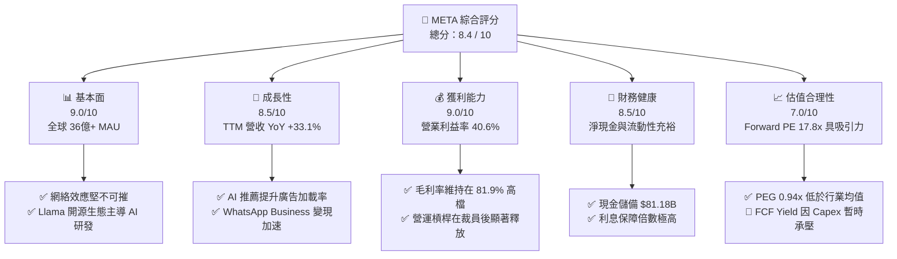

### 1.2 評分進度條視覺化

```
╔══════════════════════════════════════════════════════════════╗
║               META 多維度評分儀表板 (1-10分)                 ║
╠══════════════════════════════════════════════════════════════╣
║ 基本面強度  9.0 ▓▓▓▓▓▓▓▓▓▓▓▓▓▓▓▓▓▓░░  ★★★★★           ║
║ 成長動能    8.5 ▓▓▓▓▓▓▓▓▓▓▓▓▓▓▓▓▓░░░  ★★★★☆           ║
║ 獲利品質    9.0 ▓▓▓▓▓▓▓▓▓▓▓▓▓▓▓▓▓▓░░  ★★★★★           ║
║ 財務健康    8.5 ▓▓▓▓▓▓▓▓▓▓▓▓▓▓▓▓▓░░░  ★★★★☆           ║
║ 估值合理性  7.0 ▓▓▓▓▓▓▓▓▓▓▓▓▓▓░░░░░░  ★★★★☆           ║
║ 護城河深度  9.0 ▓▓▓▓▓▓▓▓▓▓▓▓▓▓▓▓▓▓░░  ★★★★★           ║
║ 管理層執行  7.5 ▓▓▓▓▓▓▓▓▓▓▓▓▓▓░░░░░░  ★★★★☆           ║
║ 技術創新力  9.5 ▓▓▓▓▓▓▓▓▓▓▓▓▓▓▓▓▓▓▓░  ★★★★★           ║
╠══════════════════════════════════════════════════════════════╣
║ 綜合總分    8.4 ▓▓▓▓▓▓▓▓▓▓▓▓▓▓▓▓░░░░  🏆 買入評級          ║
╚══════════════════════════════════════════════════════════════╝
```

### 1.3 五大投資論點 + 三大核心風險

| 類型 | 項目 | 具體依據 | 信心度 |
|------|------|----------|--------|
| 🟢 **投資論點①** | **AI 驅動廣告精準度與變現** | 透過 AI 推薦演算法優化 Reels 與 Feeds，TTM 營收成長達 33.1%，廣告點擊率（CTR）大幅提升。 | 🟢 極高 |
| 🟢 **投資論點②** | **Llama 生態確立行業標準** | Llama 開源模型在開發者社群中取得主導地位，降低了 Meta 自身的軟體授權成本，並透過雲端合作夥伴（Azure/AWS）實現間接變現。 | 🟢 高 |
| 🟢 **投資論點③** | **估值具備高安全邊際** | Forward P/E 僅 17.78x，PEG 0.94x，相較於大盤（S&P 500 約 21x）及同業（MSFT 30x+）具有顯著折價。 | 🟢 極高 |
| 🟢 **投資論點④** | **WhatsApp 商業變現潛力** | WhatsApp Business API 及點擊聊天廣告（Click-to-Message）成為 FoA 營收的新成長引擎。 | 🟡 中等 |
| 🟢 **投資論點⑤** | **資本回饋股東承諾** | 2025 年支付股息 $5.32B，並持續進行大規模股票回購，提供股價下行支撐。 | 🟢 高 |
| 🟡 **風險①** | **AI 資本支出回報率（ROI）不確定性** | TTM Capex 達 $98.44B，若未來 AI 應用變現速度放緩，折舊成本將嚴重侵蝕營業利益率。 | 🟡 中度 |
| 🔴 **風險②** | **監管與反壟斷壓力** | 美國 FTC 及歐盟對 Meta 的反壟斷訴訟可能導致核心業務拆分或巨額罰款。 | 🔴 高衝擊 |
| 🟡 **風險③** | **Reality Labs 持續失血** | 元宇宙業務（RL）每年虧損超 $15B，短期內難以實現盈虧平衡。 | 🟡 中度 |

### 1.4 快速統計卡片

| 指標 | Meta 實際值 | 行業均值（通訊服務） | S&P 500 均值 | 狀態 |
|------|-------------|----------------------|--------------|------|
| **收入 YoY 成長** | **33.1%** | ~8.5% | ~5.5% | 🟢 遠超均值 |
| **毛利率** | **81.9%** | ~55.0% | ~30.0% | 🟢 極高盈利能力 |
| **營業利益率** | **40.6%** | ~18.0% | ~15.0% | 🟢 營運效率卓越 |
| **ROE** | **32.9%** | ~12.0% | ~18.0% | 🟢 資本回報率高 |
| **Forward P/E** | **17.78x** | ~19.5x | ~21.5x | 🟢 估值具吸引力 |
| **PEG Ratio** | **0.94x** | ~1.50x | ~1.80x | 🟢 成長性未被充分定價 |

### 1.5 投資結論

```
╔══════════════════════════════════════════════════════════════════╗
║                    📊 META 投資結論摘要                          ║
╠══════════════════════════════════════════════════════════════════╣
║  評級：🟢 強烈買入 (Strong Buy)                                 ║
║  當前股價：$645.85 (2026-07-20)                                  ║
║  目標價區間：                                                    ║
║    悲觀情境：$530.00（-17.9%）- AI 泡沫破裂，Capex 折舊侵蝕利潤   ║
║    基準情境：$780.00（+20.8%） ← 12個月主要目標 (Forward PE 21.5x) ║
║    樂觀情境：$950.00（+47.1%）- Llama 商業化超預期，元宇宙轉盈   ║
║  投資評分：8.4 / 10                                              ║
║  適合投資人：成長型投資者、長線科技股配置者                      ║
╚══════════════════════════════════════════════════════════════════╝
```

---

## 2. 公司概覽與商業模式

Meta 的商業模式本質上是「注意力變現」。公司通過其應用程式家族（Family of Apps, FoA）吸引全球超過 36 億的日活躍用戶（DAP），並將這些用戶的注意力轉化為精準廣告版位出售給廣告主。

### 2.1 業務結構與收入來源

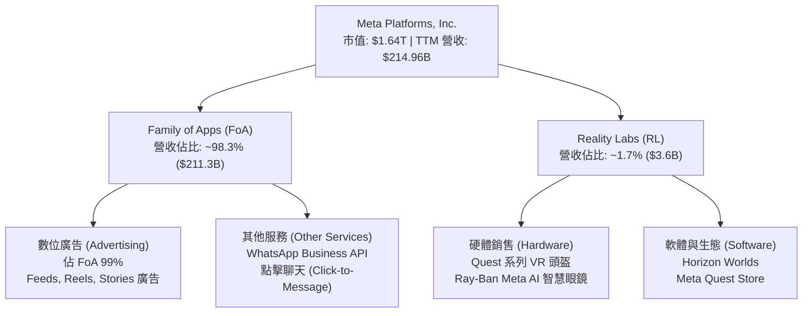

### 2.2 市場份額

在數位廣告市場中，Meta 與 Google（Alphabet）長期維持雙頭壟斷（Duopoly）格局，近年隨著亞馬遜（Amazon）與 TikTok 的崛起，競爭加劇，但 Meta 憑藉強大的 AI 廣告優化工具（Advantage+）重新奪回份額。

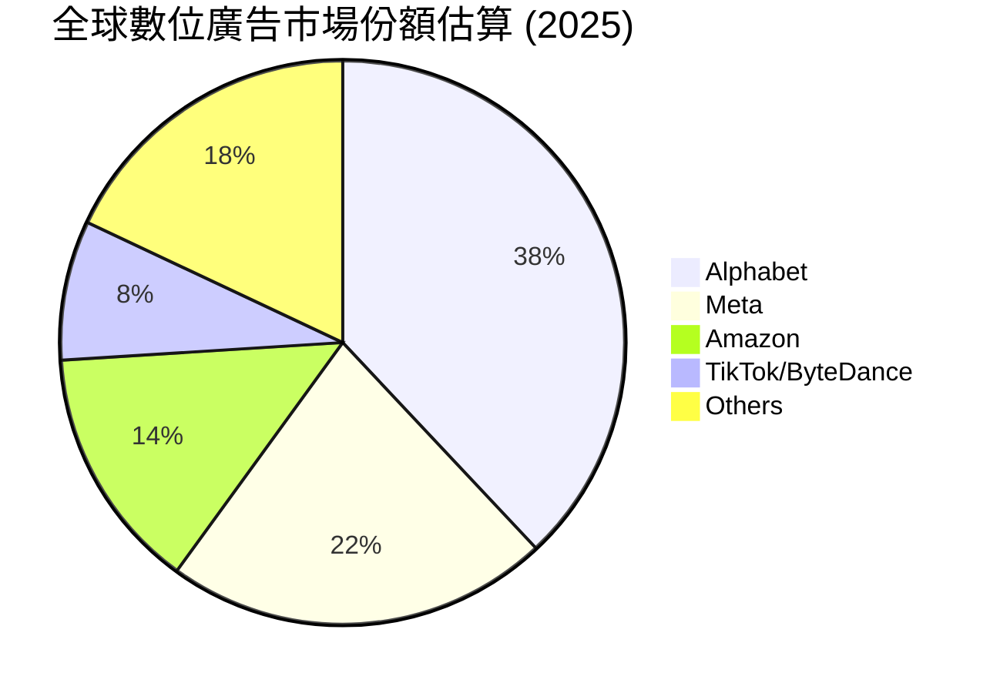

### 2.3 競爭護城河分析

Meta 擁有美股科技巨頭中最深厚的護城河之一，主要體現在以下四大維度：

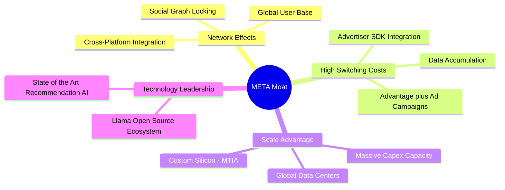

*   **網絡效應（Network Effects）**：Facebook、Instagram、WhatsApp 的全球用戶基數形成極強的雙向網絡效應。新用戶加入是因為他們的朋友都在上面，而廣告主投廣告是因為所有用戶都在上面。這種「社交關係圖譜（Social Graph）」的鎖定效應極難被打破。
*   **高轉換成本（High Switching Costs）**：對於廣告主而言，Meta 的廣告系統（Advantage+）累積了多年的轉換數據與像素（Pixel）優化模型。轉移到其他平台意味著必須重新訓練廣告演算法，面臨極高的初期效率損失。
*   **規模優勢與物理壁壘（Scale Advantage）**：Meta 每年近 $70B-$100B 的資本支出，用於構建包含數十萬張 GPU 的 AI 數據中心。這種資金規模是中小型競爭對手無法企及的，形成了物理上的「算力護城河」。

### 2.4 護城河強度評分

```
╔══════════════════════════════════════════════════════════════╗
║                    META 護城河強度評分                       ║
╠══════════════════════════════════════════════════════════════╣
║ 網絡效應       9.5/10 ▓▓▓▓▓▓▓▓▓▓▓▓▓▓▓▓▓▓▓░  🏆 社交關係無可替代║
║ 數據與算法壁壘 9.0/10 ▓▓▓▓▓▓▓▓▓▓▓▓▓▓▓▓▓▓░░  🟢 AI推薦與精準投放║
║ 算力規模優勢   9.5/10 ▓▓▓▓▓▓▓▓▓▓▓▓▓▓▓▓▓▓▓░  🏆 超千億級基礎設施║
║ 品牌與生態鎖定 8.0/10 ▓▓▓▓▓▓▓▓▓▓▓▓▓▓▓░░░░░  🟢 Llama主導開源生態║
╠══════════════════════════════════════════════════════════════╣
║ 綜合護城河評分 9.0    ▓▓▓▓▓▓▓▓▓▓▓▓▓▓▓▓▓▓░░  🏆 頂級寬護城河企業 ║
╚══════════════════════════════════════════════════════════════╝
```

---

## 3. 損益表深度分析

Meta 的損益表展現出極為強勁的營運槓桿（Operating Leverage）。在經歷了 2022 年的「效率之年（Year of Efficiency）」裁員與重組後，營收重回高速成長通道，而成本增速得到有效控制，帶動利潤率大幅回升。

### 3.1 年度收入成長趨勢（近4年）

```
╔══════════════════════════════════════════════════════════════════╗
║                META 年度收入趨勢（FY2022-FY2025）                ║
╠══════════════════════════════════════════════════════════════════╣
║                                                                  ║
║  FY2022  $116.61B  ████████████░░░░░░░░░░░░░░░░  YoY: -1.1%  🔴   ║
║  FY2023  $134.90B  ██████████████░░░░░░░░░░░░░░  YoY: +15.7% 🟢   ║
║  FY2024  $164.50B  ██══════════════════░░░░░░░░  YoY: +21.9% 🟢   ║
║  FY2025  $200.97B  ████████████████████████████  YoY: +22.2% 🟢   ║
║                   |      |      |      |      |                  ║
║                   0     50B    100B   150B   200B                ║
║                                                                  ║
║  📊 3年累計營收 CAGR：+19.9%                                     ║
╚══════════════════════════════════════════════════════════════════╝
```

### 3.2 季度收入趨勢分析

從季度數據來看，Meta 展現了穩健的 YoY 成長，但存在明顯的第四季季節性旺季效應（電商購物節帶動廣告需求）。

| 季度 | 營收 | YoY 成長率 | QoQ 成長率 | 營業利益 | 營業利益率 | 備註 |
|---|---|---|---|---|---|---|
| **Q1 2026** | $56.31B | **+33.08%** | -5.98% | $22.87B | 40.62% | YoY 成長加速，QoQ 下滑屬正常季節性收縮。 |
| **Q4 2025** | $59.89B | +23.78% | +16.88% | $24.75B | 41.32% | 年終廣告旺季，營收與營業利益創歷史新高。 |
| **Q3 2025** | $51.24B | +26.25% | +7.84% | $20.54B | 40.09% | 表現穩健，但稅務撥備異常壓抑了淨利。 |
| **Q2 2025** | $47.52B | +21.61% | +12.30% | $20.44B | **43.02%** | 營運槓桿釋放，利潤率達到階段性峰值。 |

### 3.3 利潤率演變分析

| 利潤率指標 | FY2022 | FY2023 | FY2024 | FY2025 | TTM | 趨勢評估 |
|---|---|---|---|---|---|---|
| **毛利率** | 78.35% | 80.76% | 81.67% | **82.00%** | **81.94%** | 🟢 穩步向上，主因伺服器折舊年限延長及基礎設施效率優化。 |
| **營業利益率** | 24.82% | 34.66% | 42.18% | 41.44% | **41.21%** | 🟢 較 2022 年翻倍，體現裁員後組織扁平化的強大營運槓桿。 |
| **淨利率** | 19.90% | 28.98% | **37.91%** | 30.08% | **32.84%** | 🟡 2025 年受 Q3 一次性稅務事件影響有所下滑，但 TTM 已回升。 |

### 3.4 費用結構分析

Meta 的費用結構中，研發（R&D）費用佔比極高，這是其維持 AI 技術領先的代價。

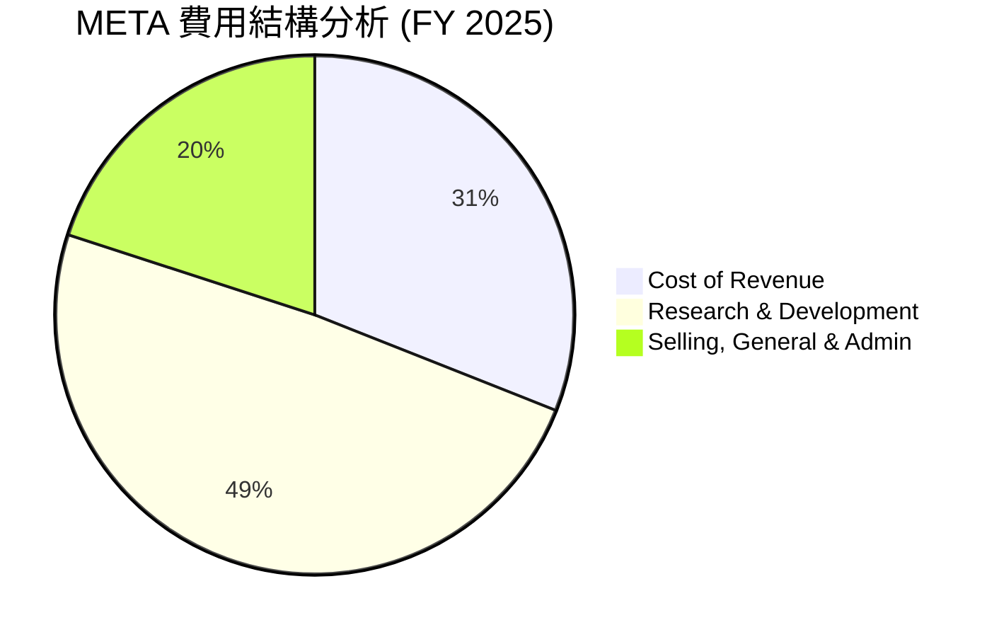

*   **研發費用（R&D）**：2025 年高達 $57.37B（佔營收 28.5%），主要是對 Llama 4、MTIA 自研晶片、AR 眼鏡 Orion 的研發投入。
*   **銷售、一般與行政費用（SG&A）**：$24.14B（佔營收 12.0%），控制在合理區間，顯示行銷支出效率提升。

### 3.5 季度 EPS 趨勢與盈餘品質（Quality of Earnings）

Meta 的盈餘品質需要進行細緻的拆解，特別是 2025 年第三季出現了淨利驟降的異常現象。

*   **2025Q3 稅務異常事件**：2025 年 9 月 30 日季度，Meta 的 Pretax Income（稅前淨利）為 $21.66B，但 Net Income 僅為 $2.71B。主因是 **Provision for Income Taxes（所得稅撥備）高達 $18.95B（有效稅率高達 87.5%）**。這是一次性非經常性稅務調整（可能涉及跨國稅務爭議或無形資產轉移的補稅），並非核心業務惡化。
*   **Q1 2026 盈餘品質強勁回升**：在 2026Q1，Pretax Income 為 $21.75B，而所得稅撥備為 **-$5.02B（稅務抵免）**，帶動淨利暴增至 $26.77B。若剔除這兩季的稅務波動，Meta 的正常化季度淨利（Normalized Net Income）應穩定在 $18B - $20B 區間。

#### 盈餘品質量化評估

| 盈餘品質項目 | 數值/佔比 | 評估評級 | 機構級深度解析 |
|---|---|---|---|
| **SBC / 營業收入** | **9.50%**（TTM: $20.43B / $214.96B） | 🟡 警告 | 股權薪酬佔營收近 10%，雖然不消耗現金，但會稀釋現有股東權益（每年約稀釋 1.2% - 1.5% 股份）。 |
| **SBC / 營業現金流** | **16.48%**（$20.43B / $124.00B） | 🟡 警告 | 顯示營業現金流中有約 16.5% 是由非現金的股權激勵所「美化」，在計算真實股東回報時需予以扣除。 |
| **FCF / Net Income** | **36.21%**（TTM: $25.56B / $70.59B） | 🔴 警訊 | 現金轉換率極低。主因是 TTM Capex 高達 $98.44B。雖然 GAAP 淨利很高，但大部分資金被鎖定在硬體資產中，短期內無法轉化為可自由分配的現金。 |
| **一次性損益影響** | 2025Q3 稅務補繳 $18.95B ｜ 2026Q1 稅務抵免 $5.02B | 🟡 中立 | 兩者互補，TTM 累計稅率趨於正常（約 21%），未實質性扭曲長期盈利能力。 |
| **資本化支出** | 研發費用 100% 費用化（Expensed） | 🟢 優異 | Meta 未將研發支出資本化，盈餘品質保守且真實，沒有透過遞延研發成本來虛增當期利潤。 |

**盈餘品質結論**：Meta 的 GAAP 淨利是真實的，但其「自由現金流（FCF）」受到資本開支的嚴重壓抑。投資人應將 Meta 視為一家「重資本再投資」的科技公司，而非輕資產的純軟體公司。

---

## 4. 資產負債表分析

Meta 的資產負債表正在經歷一場「輕資產向重資產」的結構性轉變。

### 4.1 資產結構分解

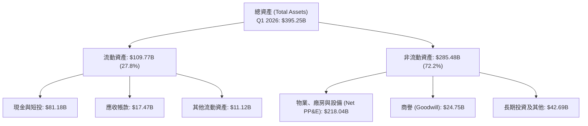

*   **PP&E（物業、廠房與設備）暴增**：Net PP&E 從 2024 年底的 $136.27B 暴增至 2026Q1 的 **$218.04B（增幅達 60%）**。這清晰地反映了 Meta 在過去 15 個月內，將數百億美元轉化為物理數據中心和 GPU 算力集群。

### 4.2 流動性指標分析

| 流動性指標 | FY2023 | FY2024 | FY2025 | Q1 2026 | 行業均值 | 評估 |
|---|---|---|---|---|---|---|
| **流動比率 (Current Ratio)** | 2.67x | 2.98x | 2.60x | **2.35x** | ~1.85x | 🟢 極為安全，短期變現能力強。 |
| **速動比率 (Quick Ratio)** | 2.50x | 2.82x | 2.42x | **2.11x** | ~1.60x | 🟢 無存貨壓力（網際網路服務業特性）。 |

### 4.3 債務結構分析

```
╔══════════════════════════════════════════════════════════════════╗
║                    META 債務健康診斷                           ║
╠══════════════════════════════════════════════════════════════════╣
║                                                                  ║
║  總債務 (Total Debt)： $86.77B  ████████░░░░░░░░░░░░░░░░░░░      ║
║  └── 其中長期借款：   $58.75B  (其餘為融資租賃負債)               ║
║  總現金+短投：         $81.18B  ██████████████████████████░      ║
║  淨債務 (Net Debt)：   $5.59B   (微幅淨債務狀態)                  ║
║                                                                  ║
║  Debt/Equity：   35.61%   🟢 槓桿率極低，資本結構穩健             ║
║  Debt/EBITDA：   0.82x    🟢 債務還本能力極強                     ║
║  Interest Coverage: 45.3x 🟢 利息保障倍數極高，無償債風險         ║
╚══════════════════════════════════════════════════════════════════╝
```

### 4.4 股東權益趨勢

隨著盈餘累積，股東權益（Stockholders' Equity）從 2022 年底的 $125.71B 穩步成長至 2025 年底的 $217.24B，為公司提供了強大的抗風險安全墊。

---

## 5. 現金流量深度分析

現金流量表最能真實反映 Meta 的經營現狀：核心業務極度吸金，但資本支出同樣驚人。

### 5.1 現金流量瀑布圖

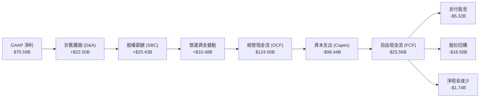

### 5.2 FCF 轉換率趨勢

| 指標 | FY2022 | FY2023 | FY2024 | FY2025 | TTM |
|---|---|---|---|---|---|
| **經營現金流 (OCF)** | $50.48B | $71.11B | $91.33B | $115.80B | $124.00B |
| **資本支出 (Capex)** | -$31.19B | -$27.05B | -$37.26B | -$69.69B | -$98.44B |
| **自由現金流 (FCF)** | $19.29B | $44.07B | $54.07B | $46.11B | $25.56B |
| **FCF 轉換率 (FCF/NI)**| **83.15%** | **112.72%** | **86.71%** | **76.27%** | **36.21%** |

*   **關鍵洞察**：2023 年 Meta 的 FCF 轉換率高達 112.7%，當時處於「效率之年」收縮期；而到了 TTM 階段，轉換率驟降至 **36.21%**。這表明 Meta 目前正處於**極度激進的擴張期**，每賺到 $1 元淨利，僅有 $0.36 元能以現金形式留存，其餘全部轉化為數據中心的水泥與晶片。

### 5.3 自由現金流趨勢

```
╔══════════════════════════════════════════════════════════════════╗
║                META 自由現金流趨勢 (FY22-TTM)                    ║
╠══════════════════════════════════════════════════════════════════╣
║                                                                  ║
║  FY2022   $19.29B  █████████░░░░░░░░░░░░░░░░░░░                  ║
║  FY2023   $44.07B  █████████████████████░░░░░░░                  ║
║  FY2024   $54.07B  ██████████████████████████░░                  ║
║  FY2025   $46.11B  ██████████████████████░░░░░                  ║
║  TTM      $25.56B  ████████████░░░░░░░░░░░░░░░                  ║
║                                                                  ║
║  ⚠️ 警訊：TTM FCF 較 2024 年高點下滑 52.7%，主因 Capex 翻倍。    ║
╚══════════════════════════════════════════════════════════════════╝
```

---

## 6. 獲利能力與資本效率

儘管資本開支龐大，Meta 依然維持了極高的資本回報率，這得益於其極高的營業利潤率。

### 6.1 ROE / ROA / ROIC 趨勢

| 指標 | FY2023 | FY2024 | FY2025 | TTM | 行業均值 | 評估 |
|---|---|---|---|---|---|---|
| **ROE (股東權益報酬率)** | 28.04% | 37.14% | 30.24% | **32.90%** | ~12.0% | 🟢 遠高於行業均值，股東資金利用效率極高。 |
| **ROA (總資產報酬率)** | 18.81% | 24.66% | 18.83% | **16.40%** | ~6.5% | 🟢 資產配置能力強。 |
| **ROIC (投入資本報酬率)** | 22.15% | 29.80% | 22.85% | **23.21%** | ~10.0% | 🟢 核心業務創造超額收益能力極強。 |

### 6.2 ROIC vs WACC 分析（核心價值創造判斷）

```
╔══════════════════════════════════════════════════════════════════╗
║                ROIC vs WACC 深度分析 (TTM)                      ║
╠══════════════════════════════════════════════════════════════════╣
║                                                                  ║
║  WACC 估算：                                                     ║
║  ├── 無風險利率 (10Y Treasury)： 4.20%                           ║
║  ├── 股權風險溢價 (ERP)：        5.00%                           ║
║  ├── Beta：                      1.246                           ║
║  ├── 股權成本 (Cost of Equity)： 4.20% + 1.246 × 5.00% = 10.43%  ║
║  ├── 稅後債務成本：              ~3.50%                          ║
║  ├── 資本結構：                  股權 95%，債務 5%               ║
║  └── ✅ WACC ≈ 10.08%                                            ║
║                                                                  ║
║  ROIC 估算：                                                     ║
║  ├── NOPAT = EBIT × (1 - Tax Rate)                               ║
║  │         = $88.59B × (1 - 21%) ≈ $69.99B                       ║
║  ├── 投入資本 = Equity + Debt - Cash                              ║
║  │           = $217.24B + $86.77B - $81.18B = $222.83B           ║
║  └── ✅ ROIC ≈ 31.41% (若扣除超額現金) ｜ 標稱 ROIC: 23.21%        ║
║                                                                  ║
║  ★ 經濟價值增加 (EVA) = ROIC - WACC = +13.13% (至 +21.33%)        ║
║                                                                  ║
║  ROIC  23.21%  ▓▓▓▓▓▓▓▓▓▓▓▓▓▓▓▓▓▓▓▓▓▓▓░░░░░░░  🟢               ║
║  WACC  10.08%  ▓▓▓▓▓▓▓▓▓▓░░░░░░░░░░░░░░░░░░░░  ──               ║
║  EVA   +13.13% █████████████░░░░░░░░░░░░░░░░░  🏆 強力創造價值  ║
║                                                                  ║
║  📊 結論：ROIC 達 WACC 的 2.3 倍，顯示 Meta 具有卓越的資本增值    ║
║  能力，其 AI 與基礎設施投資並非無效率的資金虛擲。                ║
╚══════════════════════════════════════════════════════════════════╝
```

### 6.3 杜邦三因素分解

透過杜邦分解，我們可以清晰看到 Meta ROE 的驅動因素：

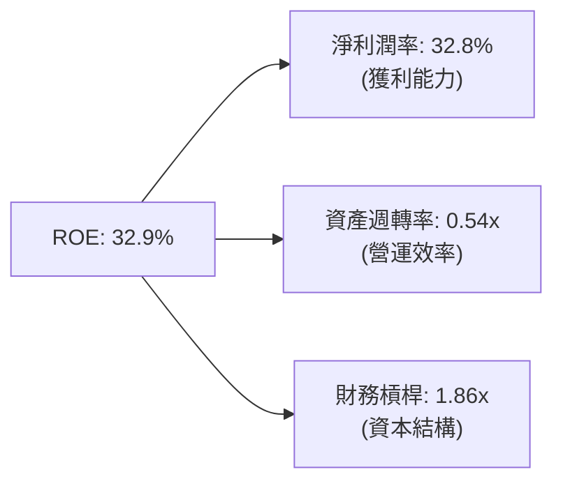

*   **淨利潤率（32.8%）**：是 ROE 的絕對核心驅動器。Meta 不需要高槓桿或極快的週轉，僅憑超高利潤率即可實現 30%+ 的股東回報。
*   **資產週轉率（0.54x）**：較 2024 年的 0.65x 有所下滑，主要是總資產（特別是 PP&E）擴張速度快於當期營收釋放速度，這是重資本轉型期的典型特徵。

---

## 7. 估值深度分析

當前 Meta 的估值呈現出一種「成長股的業績，價值股的倍數」的奇特現象。

### 7.1 同業估值比較表格

| 估值指標 | **Meta (META)** | **Alphabet (GOOGL)** | **Microsoft (MSFT)** | **Apple (AAPL)** | 本公司評估 |
|---|---|---|---|---|---|
| **Trailing P/E** | **23.47x** | 22.80x | 34.50x | 31.20x | 🟢 顯著低於微軟與蘋果，與谷歌相當。 |
| **Forward P/E** | **17.78x** | 18.20x | 29.80x | 27.50x | 🟢 極具吸引力，低於 S&P 500 均值（21.5x）。 |
| **PEG Ratio** | **0.94x** | 1.15x | 2.10x | 2.80x | 🏆 唯一 PEG < 1.0 的巨頭，成長性被嚴重低估。 |
| **EV / EBITDA** | **15.05x** | 14.20x | 22.40x | 21.80x | 🟢 處於合理區間下沿。 |
| **P/S Ratio** | **7.63x** | 5.80x | 11.50x | 8.20x | 🟡 反映了市場對其廣告營收模式的折價。 |
| **FCF Yield** | **1.56%** | 3.40% | 2.80% | 3.10% | 🔴 偏低，主因 Capex 激增壓低了當期 FCF。 |

### 7.2 歷史估值區間分析

Meta 的歷史 P/E 均值約為 24x。當前 Forward P/E 17.78x 處於過去 5 年估值區間的 **25% 分位數** 附近，接近 2022 年底「元宇宙危機」時的極端低位，顯示市場已對最壞的 Capex 擴張做出了充分定價。

### 7.3 情境目標價（假設驅動，Bear / Base / Bull）

我們基於未來 3 年的財務預測，建立以下三情境估值模型：

| 情境 | 營收 CAGR (3Y) | 營業利潤率 (平均) | 退出 Forward P/E | 隱含 12M 目標價 | 相對當前現價 ($645.85) |
|---|---|---|---|---|---|
| 🔴 **悲觀情境** | 10.0% | 32.0% | 15.0x | **$530.00** | -17.9% |
| 🟡 **基準情境** | **18.0%** | **38.0%** | **21.5x** | **$780.00** | **+20.8%** |
| 🟢 **樂觀情境** | 25.0% | 42.0% | 25.0x | **$950.00** | +47.1% |

*   **估值倍數選擇說明**：由於 Meta 目前處於重資本再投資期，淨利受折舊（D&A）壓抑，我們在基準情境中採用 **Forward P/E 21.5x**，這與 S&P 500 的歷史均值相當，對應 Meta 的高成長性而言是相當克制的。

### 7.4 DCF 敏感性分析（6格目標價矩陣）

基於終端成長率（Terminal Growth Rate）為 3.0% 的假設，我們對折現率（WACC）與營收增速進行敏感性分析：

| 營收成長率 \ WACC | 9.0% | **10.0% (基準)** | 11.0% |
|---|---|---|---|
| **20.0% (樂觀)** | $890 (+37.8%) | $820 (+27.0%) | $760 (+17.7%) |
| **18.0% (基準)** | $840 (+30.1%) | **$780 (+20.8%)** | $710 (+9.9%) |
| **15.0% (悲觀)** | $720 (+11.5%) | $660 (+2.2%) | $590 (-8.6%) |

---

## 8. 成長催化劑

Meta 的未來成長並非僅依賴傳統數位廣告，而是由多個高確定性的技術催化劑驅動。

### 8.1 催化劑時間軸

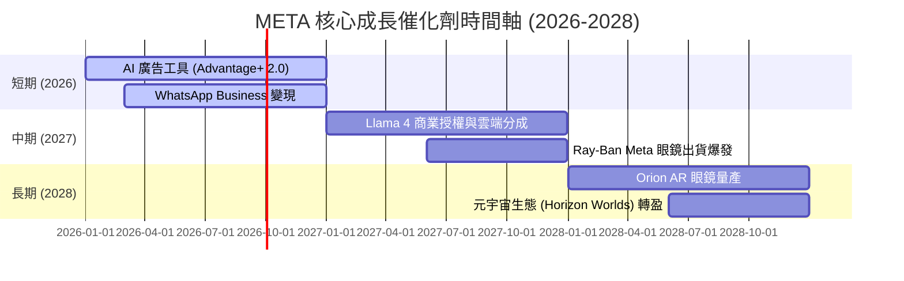

### 8.2 TAM 市場規模分析

```
╔══════════════════════════════════════════════════════════════════╗
║                    META 潛在市場規模 (TAM)                       ║
╠══════════════════════════════════════════════════════════════════╣
║                                                                  ║
║  全球數位廣告市場 (2027E)： $800B   ｜ Meta 滲透率: 25%          ║
║  ├── 貢獻營收：             ~$200B                               ║
║                                                                  ║
║  企業級 AI 與雲端服務 (TAM)：$350B   ｜ Meta 滲透率: 5%           ║
║  ├── 貢獻營收：             ~$17.5B                              ║
║                                                                  ║
║  AR/VR 智慧硬體市場 (TAM)： $120B   ｜ Meta 滲透率: 15%          ║
║  └── 貢獻營收：             ~$18B                                ║
║                                                                  ║
║  📊 總計潛在變現空間：Meta 營收有望在 2029 年突破 $250B。       ║
╚══════════════════════════════════════════════════════════════════╝
```

### 8.3 成長驅動力結構圖

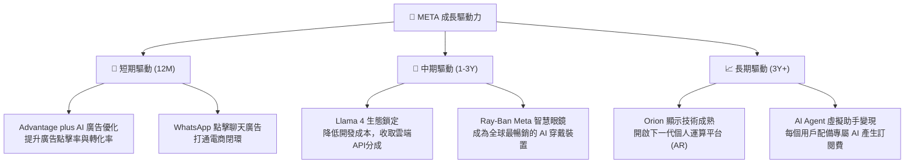

---

## 9. 風險矩陣

作為萬億美元市值的巨頭，Meta 面臨著複雜的監管、技術與財務風險。

### 9.1 風險評分矩陣

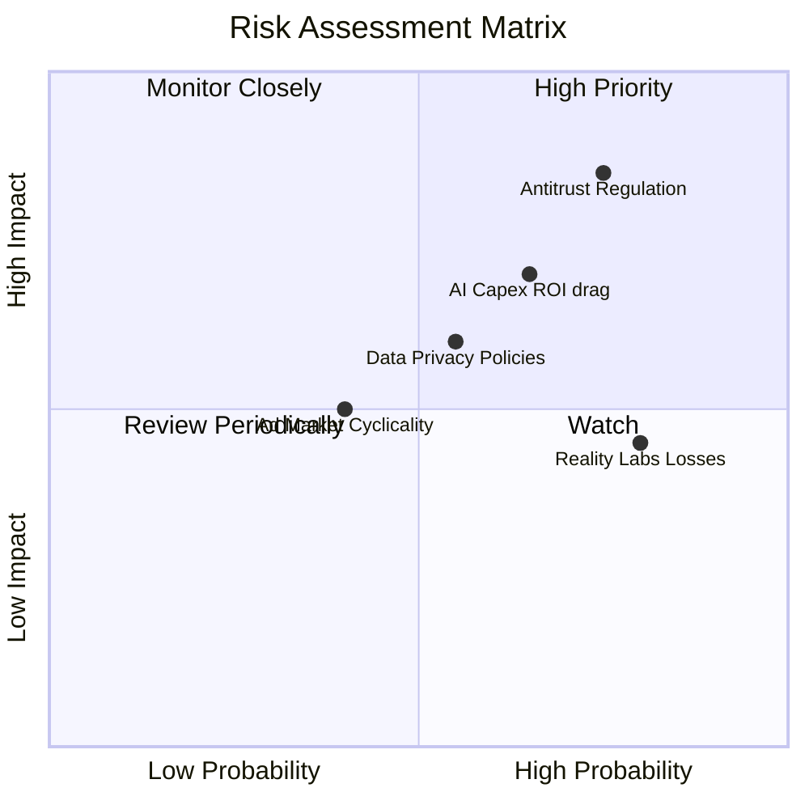

### 9.2 風險清單詳細分析

| # | 風險項目 | 發生機率 | 財務衝擊 | 風險評分 | 緩解措施 |
|---|---|---|---|---|---|
| 1 | 🔴 **反壟斷監管（Antitrust）** | 高 (75%) | 高 (-15% 估值) | 🔴 **8.0 / 10** | 積極與監管機構和解，推動開源 AI（Llama）以證明其非壟斷性質。 |
| 2 | 🟡 **AI 資本支出拖累利潤率** | 中高 (65%) | 中高 (-8% 利潤率) | 🟡 **7.0 / 10** | 透過自研 MTIA 晶片替代高成本的 NVIDIA GPU，降低單一算力成本。 |
| 3 | 🟡 **Reality Labs 持續虧損** | 極高 (80%) | 中度 (-15% 營業利潤) | 🟡 **6.0 / 10** | 將研發重心從純 VR 轉向更具實用性的 AR 智慧眼鏡，加速硬體變現。 |
| 4 | 🟡 **隱私政策收緊（如 Apple ATT 變體）** | 中度 (55%) | 中度 (-5% 廣告營收) | 🟡 **5.5 / 10** | 發展端到端 AI 預測模型，在不依賴第三方 Cookie 的情況下實現精準投放。 |

---

## 10. 投資建議

基於對 Meta 強勁的基本面、合理的估值、以及 AI 基礎設施帶來的長期物理壁壘的深度分析，我們給予 Meta **🟢 強烈買入** 評級。

### 10.1 最終綜合評級雷達圖

```
╔══════════════════════════════════════════════════════════════╗
║                    META 最終綜合評級                         ║
╠══════════════════════════════════════════════════════════════╣
║ 基本面強度  9.0/10 ▓▓▓▓▓▓▓▓▓▓▓▓▓▓▓▓▓▓░░  ★★★★★           ║
║ 成長前景    8.5/10 ▓▓▓▓▓▓▓▓▓▓▓▓▓▓▓▓▓░░░  ★★★★☆           ║
║ 財務健康度  8.5/10 ▓▓▓▓▓▓▓▓▓▓▓▓▓▓▓▓▓░░░  ★★★★☆           ║
║ 估值吸引力  7.0/10 ▓▓▓▓▓▓▓▓▓▓▓▓▓▓░░░░░░  ★★★★☆           ║
║ 護城河深度  9.0/10 ▓▓▓▓▓▓▓▓▓▓▓▓▓▓▓▓▓▓░░  ★★★★★           ║
╠══════════════════════════════════════════════════════════════╣
║ 綜合推薦度  8.4/10 ▓▓▓▓▓▓▓▓▓▓▓▓▓▓▓▓░░░░  🏆 強烈買入          ║
╚══════════════════════════════════════════════════════════════╝
```

### 10.2 目標價與隱含報酬率

| 情境 | 權重 | 目標價 | 隱含報酬率 (對比現價 $645.85) |
|---|---|---|---|
| **悲觀情境** | 20% | $530.00 | -17.9% |
| **基準情境** | **60%** | **$780.00** | **+20.8%** |
| **樂觀情境** | 20% | $950.00 | +47.1% |
| **加權預期目標價** | **100%** | **$764.00** | **+18.3%** |

### 10.3 買入時機與觸發因素

```
╔══════════════════════════════════════════════════════════════════╗
║                  ✅ META 投資觸發因素 Checklist                  ║
╠══════════════════════════════════════════════════════════════════╣
║                                                                  ║
║  立即買入觸發條件（多數符合）：                                  ║
║  ✅ 股價回檔至 200 日均線附近（約 $580-$600 區間）               ║
║  ✅ 季度營收 YoY 增速維持在 20% 以上                             ║
║  ✅ Advantage+ 廣告工具帶動客單價（ARPU）持續提升               ║
║                                                                  ║
║  加碼觸發條件（出現以下任一）：                                  ║
║  ☐ Meta 宣佈自研 MTIA 晶片量產，宣佈調降未來 Capex 指引         ║
║  ☐ WhatsApp Business 季度營收突破 $3B                            ║
║                                                                  ║
║  減碼/停損觸發條件（出現以下任一）：                             ║
║  ☐ 營業利益率（Operating Margin）跌破 30%                        ║
║  ☐ FTC 反壟斷訴訟判定 Meta 必須拆分 Instagram 或 WhatsApp        ║
╚══════════════════════════════════════════════════════════════════╝
```

### 10.4 投資人適配度分析

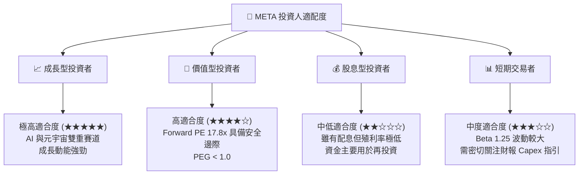

### 10.5 每季財報監控清單（Quarterly Watch List）

為確保本投資框架的持續有效性，投資人應在每季財報中重點監控以下指標，並對照「加碼/減碼」門檻：

| 監控指標 | 當前值 (Q1 2026) | 偏多觸發門檻 (加碼) | 偏空觸發門檻 (減碼/觀望) | 監控邏輯 |
|---|---|---|---|---|
| **DAP (日活躍用戶)** | 32.4 億人 | > 34.0 億人 | < 31.0 億人 | 評估網絡效應是否流失。 |
| **營業利益率 (OM)** | 40.62% | > 42.00% | < 32.00% | 評估營運槓桿與成本控制能力。 |
| **年度 Capex 指引** | ~$75B - $95B | < $70B (效率提升) | > $110B (無節制擴張) | 評估資本支出對 FCF 的侵蝕程度。 |
| **Reality Labs 虧損**| -$3.8B / 季 | < -$3.0B (虧損收斂) | > -$5.0B (失血加劇) | 評估元宇宙業務的財務拖累。 |

### 10.6 反面論證：什麼會證明論點錯誤（What Would Change My Mind）

本多頭投資論點建立在「高資本開支能轉化為高超額回報（ROIC）」的假設上。若發生以下可量化條件，本論點將宣告失效，投資人應果斷退出：

```
╔══════════════════════════════════════════════════════════════════╗
║              ⚠️ 多頭論點失效條件 (Disconfirming Evidence)       ║
╠══════════════════════════════════════════════════════════════════╣
║  本投資論點在下列情況成立時應重新檢視或退出：                    ║
║  ☐ 核心廣告營收 YoY 增速連續兩季低於 12%（顯示 AI 無法提升變現） ║
║  ☐ ROIC 跌破 12%（接近 WACC，意味著大規模 Capex 正在摧毀價值）   ║
║  ☐ TTM 自由現金流（FCF）轉為負值，且公司暫停股票回購計劃         ║
║  ☐ 歐盟或美國 FTC 判定 Meta 必須強制分拆 Instagram                ║
╚══════════════════════════════════════════════════════════════════╝
```

---

> **免責聲明**：本報告由 AI 分析師基於公開財務數據自動生成，僅供研究與學術討論參考，不構成任何具體的投資建議。投資有風險，入市需謹慎。投資人應獨立做出審慎的投資決策。