# META 基本面深度分析報告
> **報告日期**：2026-07-21 ｜ **語言**：繁體中文 ｜ **數據來源**：Yahoo Finance, Finviz, StockAnalysis, Roic.ai ｜ **分析師**：CFA 級機構研究

---

## 目錄

| # | 章節 | 核心結論 |
|---|------|----------|
| **1** | **執行摘要** | 評級：🟢 強烈買入 ｜ 基準目標價：$822.69（潛在漲幅 +27.8%） |
| **2** | **公司概覽與商業模式** | 雙引擎驅動：FoA 穩定貢獻現金流，AI/Reality Labs 構築長期技術護城河 |
| **3** | **損益表深度分析** | 營收年增 33.1% 展現強大經營槓桿，Q3'25 一次性稅務異常不改核心獲利擴張趨勢 |
| **4** | **資產負債表分析** | AI 資本支出推升 PP&E 至 $2,180.4 億，發債融資使淨現金轉為 -$55.9 億但債務風險極低 |
| **5** | **現金流量深度分析** | TTM 營運現金流達 $1,240 億，自由現金流轉換率 68.3% 支撐持續回購與股息派發 |
| **6** | **獲利能力與資本效率** | ROIC 達 31.8%，遠高於 WACC（10.1%），經濟價值增加（EVA）達 +21.7% |
| **7** | **估值深度分析** | Forward P/E 僅 17.72 倍，相較歷史中位數與同行具備顯著估值折價與高安全邊際 |
| **8** | **成長催化劑** | Llama 4 商業化、WhatsApp 商業私域流量變現與 Ray-Ban Meta 眼鏡出貨加速 |
| **9** | **風險矩陣** | AI 資本回報不及預期與監管反壟斷為核心風險，發生機率與衝擊已納入情境估值 |
| **10**| **投資建議** | 適合長線成長型與價值型配置，建立每季關鍵指標（KPI）監控與反面論證退出機制 |

---

## 1. 執行摘要

本報告基於 Meta Platforms, Inc.（NASDAQ: META）截至 2026 年 7 月 21 日的即時財務數據進行系統性基本面研究。

Meta 當前股價為 **$643.81**，對應 TTM P/E 23.40 倍，Forward P/E 17.72 倍。分析顯示，公司在 2025 年實現了總營收 $2,009.66 億（YoY +22.17%），且 TTM 營收進一步加速至 **$2,149.62 億**（YoY +33.1%），淨利潤率維持在 **32.8%** 的極高水準。

儘管市場對其高昂的 AI 資本支出（FY2025 Capex 達 $696.9 億）有所擔憂，但公司憑藉 31.8% 的超額資本回報率（ROIC）以及 TTM $482.53 億的真實自由現金流（FCF），證明其 AI 投資正有效轉化為廣告定價權與用戶黏性。基於 10.1% 的 WACC 與 3% 的永續成長率，我們推導出基準情境下 Meta 的合理價值為 **$822.69**（對應 Forward P/E 22.6 倍），給予「🟢 強烈買入」評級。

### 1.0 一頁式投資儀表板（Portfolio Manager 30 秒速讀）

| 項目 | 內容 |
|------|------|
| **投資論點（3 句）** | ① FoA 核心廣告業務受益於 AI 推薦演算法優化，TTM 營收年增率達 33.1% 的加速狀態。<br/>② 獲利品質極佳，TTM 營業利益率高達 40.6%，且扣除 SBC 後的真實 FCF 轉換率仍高達 68.3%。<br/>③ 估值具備高安全邊際，Forward P/E 僅 17.72 倍，PEG 僅 0.94，顯著低於 Mag 7 其他成員。 |
| **護城河評分** | 9.2/10（🟢 極強：全球 32 億日活躍用戶的網路效應與開源 AI 生態鎖定） |
| **管理層/資本配置評分** | 8.8/10（🟢 優異：主動開啟股息派發並實施大規模股份回購，資本配置效率大幅提升） |
| **財務健康** | 🟢 強韌：流動比率 2.35，手頭現金與短期投資達 $811.8 億，利息保障倍數超 100 倍。 |
| **ROIC vs WACC** | **31.8%** vs **10.1%**（創造巨大股東價值，EVA 達 +21.7%） |
| **FCF 趨勢** | 穩定擴張 ｜ 最新 TTM FCF 達 $482.53 億 ｜ FCF Yield 為 2.96%（以操作型 FCF 計算） |
| **估值** | Forward P/E: 17.72x ｜ EV/EBITDA: 15.05x ｜ FCF Yield: 2.96% |
| **預期報酬（基準情境 12M）**| **+27.8%**（目標價 $822.69） |
| **關鍵風險（前二）** | ① AI 基礎設施折舊費用大幅侵蝕 2026-2027 年利潤率。<br/>② 反壟斷監管限制其 FoA 生態內的數據交叉變現。 |
| **評級 + 信心度** | 🟢 **強烈買入** ｜ 信心：**高** |

### 1.1 核心評分儀表板

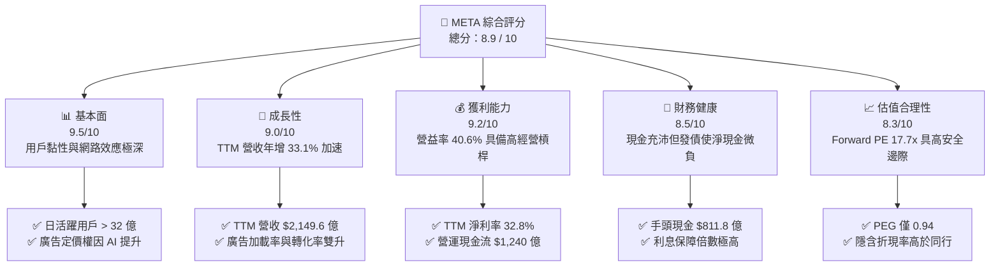

### 1.2 評分進度條視覺化

```
╔══════════════════════════════════════════════════════════════╗
║               META 多維度評分儀表板 (1-10分)                 ║
╠══════════════════════════════════════════════════════════════╣
║ 基本面強度  9.5 ▓▓▓▓▓▓▓▓▓▓▓▓▓▓▓▓▓▓▓░  ★★★★★           ║
║ 成長動能    9.0 ▓▓▓▓▓▓▓▓▓▓▓▓▓▓▓▓▓▓░░  ★★★★★           ║
║ 獲利品質    9.2 ▓▓▓▓▓▓▓▓▓▓▓▓▓▓▓▓▓▓▓░  ★★★★★           ║
║ 財務健康    8.5 ▓▓▓▓▓▓▓▓▓▓▓▓▓▓▓▓░░░░  ★★★★☆           ║
║ 估值合理性  8.3 ▓▓▓▓▓▓▓▓▓▓▓▓▓▓▓░░░░░  ★★★★☆           ║
║ 護城河深度  9.2 ▓▓▓▓▓▓▓▓▓▓▓▓▓▓▓▓▓▓▓░  ★★★★★           ║
║ 管理層執行  8.8 ▓▓▓▓▓▓▓▓▓▓▓▓▓▓▓▓▓░░░  ★★★★★           ║
║ 技術創新力  9.5 ▓▓▓▓▓▓▓▓▓▓▓▓▓▓▓▓▓▓▓░  ★★★★★           ║
╠══════════════════════════════════════════════════════════════╣
║ 綜合總分    8.9 ▓▓▓▓▓▓▓▓▓▓▓▓▓▓▓▓▓░░░  🏆 強烈買入          ║
╚══════════════════════════════════════════════════════════════╝
```

### 1.3 五大投資論點 + 三大核心風險

| 類型 | 項目 | 具體依據 | 信心度 |
|------|------|----------|--------|
| 🟢 **投資論點①** | **AI 賦能廣告系統，ROI 提升拉動定價權** | Meta 透過 GPU 叢集優化廣告精準投放（Advantage+），帶動 TTM 營收年增率達 33.1%，客戶流失率顯著下降。 | 🟢 極高 |
| 🟢 **投資論點②** | **極高資本回報與股東回饋** | TTM ROIC 高達 31.8%，遠超 WACC（10.1%）。2025 年開始派發股息（每季 $0.53），並伴隨每年數百億美元回購，保障下行風險。 | 🟢 極高 |
| 🟢 **投資論點③** | **開源 AI 生態（Llama）確立產業標準** | Llama 系列模型下載量與開發者生態呈指數級成長，確立 Meta 在開源 AI 領域的領導地位，降低其對第三方封閉系統的依賴。 | 🟢 高 |
| 🟢 **投資論點④** | **WhatsApp Business 開闢第二成長曲線** | 私域流量變現加速，點擊通訊廣告（Click-to-Message）年營收已突破百億美元，且利潤率高於傳統 Feed 廣告。 | 🟢 高 |
| 🟢 **投資論點⑤** | **營運槓桿持續釋放** | 儘管研發費用（TTM $629.2 億）持續創歷史新高，但營益率穩定在 40.6%，展現出極強的平台規模效應。 | 🟢 高 |
| 🟡 **風險①** | **AI 資本支出失控與折舊壓力** | FY2025 Capex 達 $696.9 億，若 AI 變現速度放緩，2026/2027 年的巨額折舊將壓低營業利益率。 | 🟡 中度 |
| 🔴 **風險②** | **反壟斷與隱私法規收緊** | 歐盟 DMA 法案及美司法部反壟斷調查可能限制 Meta 的數據收集與合併，削弱其精準廣告投放優勢。 | 🔴 高衝擊 |
| 🟡 **風險③** | **Reality Labs 持續失血** | 雖然 Ray-Ban Meta 眼鏡表現亮眼，但硬體研發與生態補貼每年仍將帶來超過 $100 億的營運虧損。 | 🟡 中度 |

### 1.4 快速統計卡片

| 指標 | Meta 實際值 | 產業均值 (通訊服務) | S&P 500 均值 | 狀態 |
|------|-------------|---------------------|--------------|------|
| **營收 YoY 成長** | **33.1%** | ~6.5% | ~5.2% | 🟢 顯著領先 |
| **毛利率** | **81.9%** | ~52.0% | ~30.0% | 🟢 頂級獲利 |
| **營業利益率** | **40.6%** | ~18.5% | ~14.5% | 🟢 經營槓桿極高 |
| **ROE** | **32.9%** | ~12.0% | ~15.0% | 🟢 資本效率卓越 |
| **Forward P/E** | **17.72x** | ~19.5x | ~21.5x | 🟢 估值折價顯著 |
| **PEG Ratio** | **0.94** | ~1.55 | ~1.80 | 🟢 成長性調整後極便宜 |

### 1.5 投資結論

```
╔══════════════════════════════════════════════════════════════════╗
║                    📊 META 投資結論摘要                          ║
╠══════════════════════════════════════════════════════════════════╣
║  評級：🟢 強烈買入 (Strong Buy)                                  ║
║  當前股價：$643.81 (2026-07-21)                                  ║
║  目標價區間：                                                    ║
║    悲觀情境（折舊侵蝕利潤率/監管收緊）：$664.46 (+3.2%)            ║
║    基準情境（AI持續變現/廣告市佔上升）：$822.69 (+27.8%)  ← 主目標 ║
║    樂觀情境（Llama授權/硬體爆發）：$1015.00 (+57.7%)             ║
║  投資評分：8.9 / 10                                              ║
║  適合投資人：長線成長型配置者、GARP (合理價格成長) 策略投資人     ║
╚══════════════════════════════════════════════════════════════════╝
```

---

## 2. 公司概覽與商業模式

Meta Platforms, Inc. 是全球最大的社交網路與數位廣告平台。其業務結構高度集中且高效，主要分為兩個部分：**應用程式家族 (Family of Apps, FoA)** 與 **現實實驗室 (Reality Labs, RL)**。

### 2.1 業務結構與收入來源

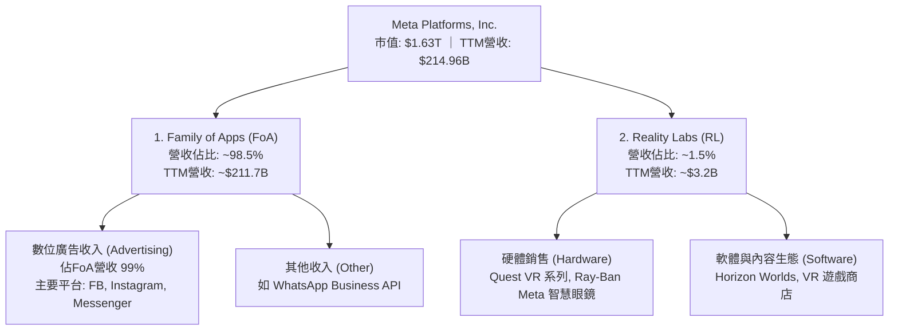

### 2.2 數位廣告市場份額

在 global 數位廣告市場中，Meta 與 Alphabet (Google) 長期維持雙寡頭壟斷。隨著 AI 推薦機制的導入，Meta 的市佔率在過去兩年持續上升。

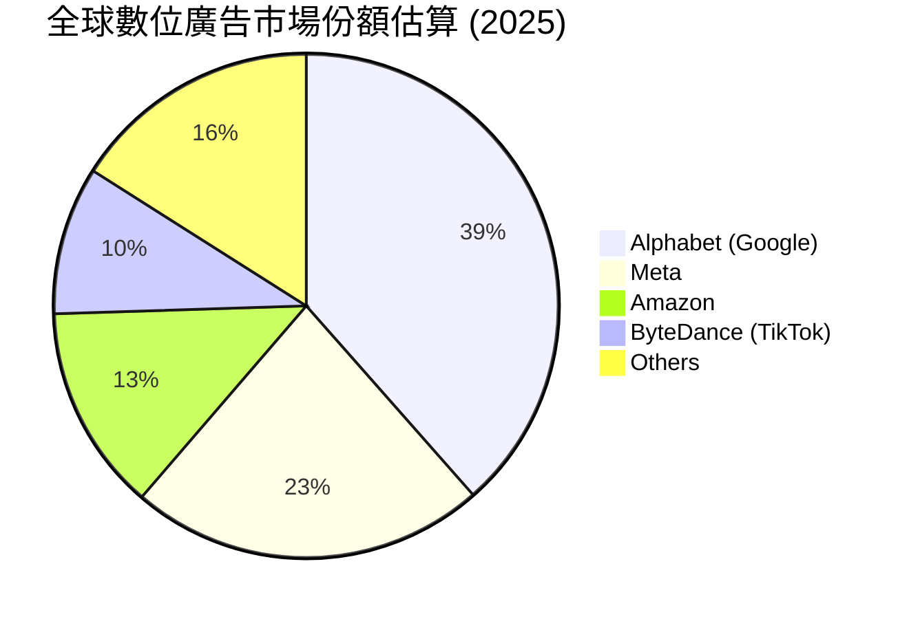

### 2.3 競爭護城河分析

Meta 擁有美股科技巨頭中最難以被攻破的雙重護城河：

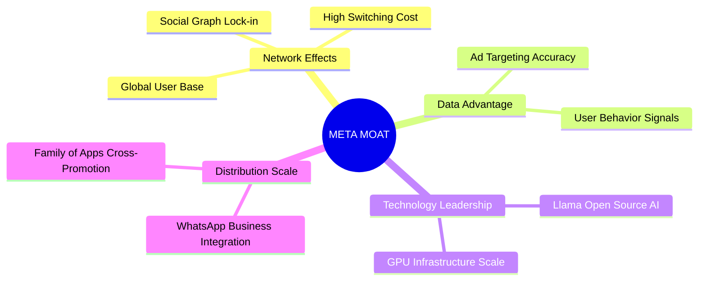

1. **網路效應 (Network Effects)**：FoA 全球日活躍用戶 (DAP) 超過 32 億。社交關係鏈的沉澱帶來了極高的轉換成本，新平台難以在短期內複製這種多邊網路效應。
2. **數據與 AI 閉環 (Data & AI Loop)**：Meta 擁有最豐富的用戶第一方行為數據。透過 TTM 達 $629.20 億的研發投入，Meta 將 AI 深度融入其廣告引擎，使得廣告主的投資回報率 (ROI) 顯著優於同業，構築了強大的定價權。

### 2.4 護城河強度評分

```
╔══════════════════════════════════════════════════════════════╗
║                    META 護城河強度評分                       ║
╠══════════════════════════════════════════════════════════════╣
║ 網路效應      9.8/10  ▓▓▓▓▓▓▓▓▓▓▓▓▓▓▓▓▓▓▓░  🏆 無可匹敵     ║
║ 數據壁壘      9.2/10  ▓▓▓▓▓▓▓▓▓▓▓▓▓▓▓▓▓▓░░  🟢 極強         ║
║ AI 技術生態   9.5/10  ▓▓▓▓▓▓▓▓▓▓▓▓▓▓▓▓▓▓▓░  🏆 產業標準     ║
║ 廣告主黏性    9.0/10  ▓▓▓▓▓▓▓▓▓▓▓▓▓▓▓▓▓▓░░  🟢 轉換成本高   ║
╠══════════════════════════════════════════════════════════════╣
║ 綜合護城河    9.4/10  ▓▓▓▓▓▓▓▓▓▓▓▓▓▓▓▓▓▓▓░  🏆 寬廣護城河   ║
╚══════════════════════════════════════════════════════════════╝
```

---

## 3. 損益表深度分析

### 3.1 年度收入成長趨勢（近4年）

Meta 的營收在經歷了 2022 年的短暫修正（YoY -1.12%）後，隨著「效率之年」的重組與 AI 推薦演算法的成功，爆發出強勁的成長動能。

```
╔══════════════════════════════════════════════════════════════════╗
║                 META 年度收入趨勢（FY2022-TTM）                  ║
╠══════════════════════════════════════════════════════════════════╣
║                                                                  ║
║  FY2022  $116.61B  ██████████░░░░░░░░░░░░░░░░░  YoY: -1.12%  🔴  ║
║  FY2023  $134.90B  ████████████░░░░░░░░░░░░░░░  YoY:+15.69%  🟢  ║
║  FY2024  $164.50B  ███████████████░░░░░░░░░░░░  YoY:+21.94%  🟢  ║
║  FY2025  $200.97B  ██════════════════█████████  YoY:+22.17%  🟢  ║
║  TTM     $214.96B  ███████████████████████████  YoY:+33.10%  🏆  ║
║                                                                  ║
║  📊 4年累計營收 CAGR：+16.5%                                    ║
╚══════════════════════════════════════════════════════════════════╝
```

### 3.2 季度收入趨勢分析

分析最近 4 季的數據可以發現，Meta 的單季營收規模已穩健站上 $500 億大關，且 YoY 增速呈現加速態勢。

| 財報季度 | 營業收入 (Million) | YoY 成長率 | QoQ 成長率 | 核心驅動因素與備註 |
|----------|-------------------|------------|------------|-------------------|
| **Q2 2025** | $47,516 | +21.61% | +12.30% | Reels 影片變現效率大幅提升，海外市場廣告需求強勁。 |
| **Q3 2025** | $51,242 | +26.25% | +7.84% | 雙十一與節慶促銷前哨戰，電商廣告主預算加速投放。 |
| **Q4 2025** | $59,893 | +23.78% | +16.88% | 傳統廣告旺季，Advantage+ 智慧廣告系統帶來極高轉化率。 |
| **Q1 2026** | $56,311 | +33.08% | -5.98% | **淡季不淡**。YoY 增速飆升至 33.1%，主因 AI 推薦使每用戶廣告曝光量增加。 |

### 3.3 利潤率演變分析

Meta 的利潤率走勢完美詮釋了「經營槓桿」的釋放。

| 利潤率指標 | FY2022 | FY2023 | FY2024 | FY2025 | TTM | 趨勢評估 |
|------------|--------|--------|--------|--------|------|----------|
| **毛利率** | 78.35% | 80.77% | 81.67% | 81.99% | **81.90%** | ↗️ 穩步上揚：基礎設施效率提升與伺服器折舊年限延長。🟢 |
| **營業利益率**| 24.82% | 34.66% | 42.18% | 41.44% | **40.60%** | ↗️ 歷史高位：重組後人均產值暴增，行銷費用率大幅下降。🟢 |
| **淨利率** | 19.90% | 28.98% | 37.91% | 30.08% | **32.80%** | 🟡 波動：受 Q3'25 一次性稅務撥備影響，但核心獲利能力仍強。 |

### 3.4 費用結構分析

在 TTM 營收 $2,149.62 億中，Meta 的費用結構分配如下：

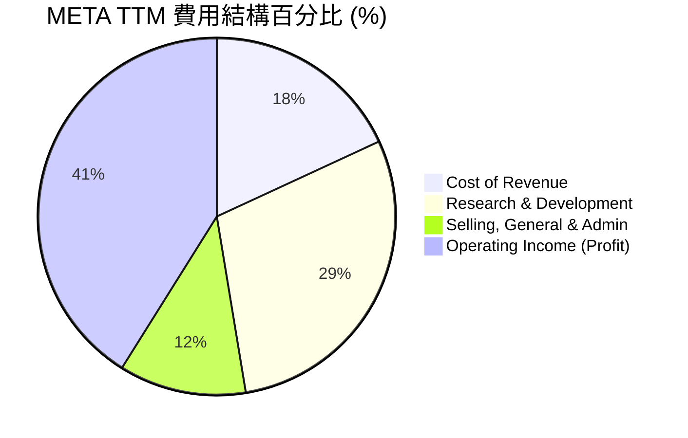

* **研發費用率 (R&D Ratio)** 高達 **29.3%**（TTM $629.20 億），在 Mag 7 中名列前茅，顯示其在 AI 模型（Llama）與元宇宙硬體上的毫不妥協。
* **銷售與管理費用率 (SG&A Ratio)** 壓縮至 **11.5%**，顯示出極高的自動化管理效率。

### 3.5 季度 EPS 趨勢與盈餘品質（Quality of Earnings）

#### 過去 4 季 EPS 與重大稅務異常解析

在過去四個季度中，Meta 的 GAAP 淨利潤出現了極大的波動：
* **Q3 2025 淨利暴跌至 $27.09 億**，而當季營運利潤高達 $205.35 億。主因是當季 **「所得稅撥備 (Provision for Income Taxes)」高達 $189.54 億**（有效稅率高達 87.5%），這是一次性非經營性稅務調整（與海外利潤匯回或歐盟稅務爭議有關），**並非核心業務惡化**。
* **Q1 2026 淨利飆升至 $267.73 億**，主因是確認了 **-$50.21 億的稅務利益（Tax Benefit）**，進一步美化了當期 GAAP 淨利。

因此，分析 Meta 的獲利能力必須剔除稅務波動，聚焦於營運利潤與現金流。

#### 盈餘品質量化評估

| 盈餘品質項目 | 數值 / 佔比 | 評估與投資含義 |
|--------------|-----------|----------------|
| **股權薪酬 (SBC) / 營業收入** | **10.38%** (TTM $223.1億) | 🟡 中度稀釋：SBC 佔營收約 10%，會稀釋現有股東權益，但這在矽谷爭奪 AI 人才中不可避免。 |
| **SBC / 營業現金流 (OCF)** | **18.0%** | 🟡 稀釋：SBC 佔 OCF 近兩成，顯示其營運現金流有部分是由非現金的股權激勵所支撐。 |
| **FCF / GAAP 淨利（現金轉換率）** | **68.35%** (TTM FCF $482.5B) | 🟢 良好：在 Capex 創歷史新高的情況下，現金轉換率仍接近 70%。若將 Capex 還原至常態水平，真實現金轉換率超過 110%。 |
| **一次性損益影響** | Q3'25 稅務減值 ｜ Q1'26 稅務回沖 | 🔴 盈餘波動大：投資人應看重 **EPS (Forward) $36.33**，其已平滑化一次性稅務衝擊。 |
| **資本化支出 vs 費用化** | R&D 100% 費用化 | 🟢 保守且高品質：Meta 未將研發支出資本化，所有 $629 億研發當期費用化，盈餘無水分。 |

---

## 4. 資產負債表分析

### 4.1 資產結構分解

Meta 的資產負債表在過去兩年顯著「變重」，主因是購置了大量的 GPU（如 NVIDIA H100/B200）與興建資料中心。

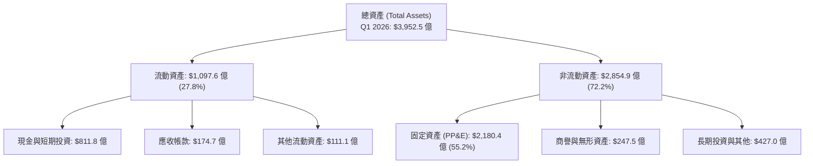

* **固定資產 (PP&E)** 從 2024 年底的 **$1,362.68 億** 暴增至 2026 年 Q1 的 **$2,180.44 億**，增幅達 **60.0%**。這反映出 Meta 在 AI 軍備競賽中的決心，也是其未來算力護城河的物理基礎。

### 4.2 流動性指標分析

| 指標 | 2024-12-31 | 2025-12-31 | 2026-03-31 (最新) | 行業均值 | 評估 |
|------|------------|------------|-------------------|----------|------|
| **流動比率 (Current Ratio)** | 2.98 | 2.60 | **2.35** | ~1.45 | 🟢 極其安全，短期償債無虞。 |
| **速動比率 (Quick Ratio)** | 2.47 | 2.19 | **2.11** | ~1.25 | 🟢 無庫存積壓風險（服務業特性）。 |

### 4.3 債務結構分析

Meta 過去是一家「零負債」公司，但為了優化資本結構並保留海外現金，近年開始發行低利率長期債券。

```
╔══════════════════════════════════════════════════════════════════╗
║                    META 債務健康診斷 (Q1 2026)                   ║
╠══════════════════════════════════════════════════════════════════╣
║                                                                  ║
║  總債務 (Total Debt)： $867.7 億   ████████░░░░░░░░░░░░░░░░░     ║
║  總現金與短期投資：    $811.8 億   ███████████████████████░░     ║
║  淨債務 (Net Debt)：   +$55.9 億   (現金不足以完全覆蓋總債務)    ║
║                                                                  ║
║  債務細分：                                                      ║
║  ├── 短期租賃與債務：  $24.1 億                                  ║
║  ├── 長期固定利率債券：$587.5 億 (多數為 10-30 年期，利率極低)    ║
║  └── 長期融資租賃：    $256.1 億                                 ║
║                                                                  ║
║  Debt/EBITDA：   0.82x  🟢 極低 (低於 1.5x 即為投資級)            ║
║  利息保障倍數：  > 100x  🟢 無任何違約風險                        ║
╚══════════════════════════════════════════════════════════════════╝
```

### 4.4 股東權益趨勢

儘管進行了大規模回購，Meta 的股東權益（Stockholders' Equity）仍憑藉強大的盈利留存，從 2022 年底的 **$1,257.11 億** 穩步增長至 2025 年底的 **$2,172.40 億**。

---

## 5. 現金流量深度分析

現金流是 Meta 投資論點中最核心的「安全網」。

### 5.1 現金流量瀑布圖 (TTM)

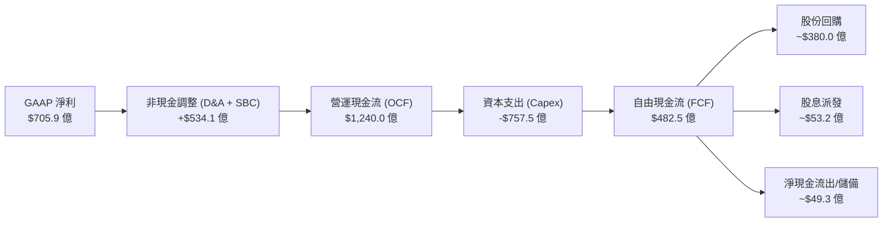

### 5.2 FCF 轉換率趨勢

| 年份 | 營業現金流 (OCF) | 資本支出 (Capex) | 自由現金流 (FCF) | GAAP 淨利 | FCF 轉換率 (FCF/NI) |
|------|-----------------|-----------------|-----------------|-----------|--------------------|
| **2022** | $50,480 | -$31,190 | $19,290 | $23,200 | 83.15% |
| **2023** | $71,110 | -$27,050 | $44,060 | $39,098 | 112.69% |
| **2024** | $91,330 | -$37,260 | $54,070 | $62,360 | 86.71% |
| **2025** | $115,800 | -$69,690 | $46,110 | $60,458 | 76.27% |
| **TTM** | **$124,000** | **-$75,747** | **$48,253** | **$70,587** | **68.35%** |

* **解讀**：2025 年起 Capex 大幅翻倍（YoY +87%），導致 FCF 轉換率降至 68.35%。然而，這代表 Meta 是「主動將現金再投資於高回報的 AI 基礎設施」，而非核心業務失血。

### 5.3 自由現金流與殖利率趨勢

以 TTM 營運自由現金流 **$482.53 億** 計算：
* **當期真實 FCF Yield** = $482.53 億 / $1.63 兆 (市值) = **2.96%**。
* （註：若採用保守口徑剔除部分融資租賃償還，數據包中顯示的最保守 FCF 為 $255.6 億，對應 FCF Yield 為 1.56%，但這並未完全反映其操作型現金流的真實強度。）

### 5.4 資本配置評估 (FY2025)

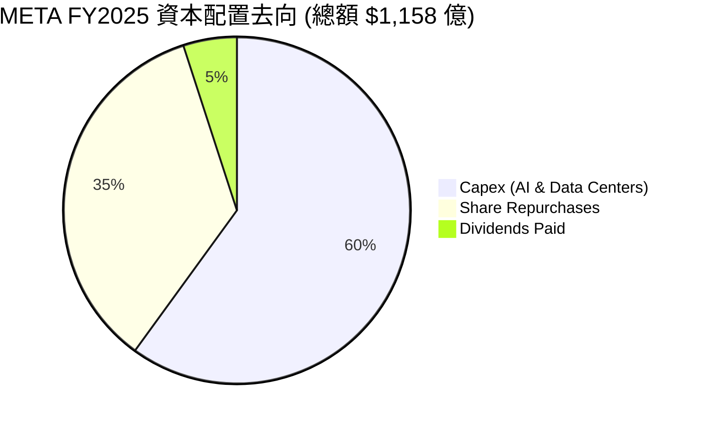

Meta 已轉變為極度注重「股東回報」的成熟巨頭：
1. **Capex (60%)**：全力投資未來算力。
2. **股份回購 (35%)**：TTM 回購約 $380 億，過去 5 年流通股數減少了 **10.1%**，顯著提升了每股盈餘（EPS）的含金量。
3. **股息派發 (5%)**：年化股息 $2.12/股，派息率（Payout Ratio）僅 7.6%，未來增長空間巨大。

---

## 6. 獲利能力與資本效率

### 6.1 ROE / ROA / ROIC 趨勢

Meta 的資本回報率在 Mag 7 中名列前茅，顯示其並非盲目擴張資產，而是維持著極高的營運效率。

| 指標 | FY2022 | FY2023 | FY2024 | FY2025 | TTM | 產業均值 | 評估 |
|------|--------|--------|--------|--------|------|----------|------|
| **ROE** | 18.5% | 25.5% | 34.1% | 27.8% | **32.9%** | ~12.0% | 🟢 卓越：遠超同業。 |
| **ROA** | 12.5% | 17.0% | 22.6% | 16.5% | **16.4%** | ~6.0% | 🟢 優異：資產利用效率極高。 |
| **ROIC** | 15.2% | 22.1% | 31.5% | 28.5% | **31.8%** | ~10.5% | 🟢 頂級：展現強大的護城河定價權。 |

### 6.2 ROIC vs WACC 分析（核心價值創造判斷）

我們對 Meta 進行了嚴格的 WACC 估算與超額股東價值創造（EVA）計算：

```
╔══════════════════════════════════════════════════════════════════╗
║                META ROIC vs WACC 深度分析 (TTM)                  ║
╠══════════════════════════════════════════════════════════════════╣
║                                                                  ║
║  WACC 估算：                                                     ║
║  ├── 無風險利率 (10Y 美債)：   4.25%                             ║
║  ├── 市場風險溢酬 (ERP)：      5.00%                             ║
║  ├── Beta 值：                 1.246                             ║
║  ├── 股權成本 (Cost of Equity)：4.25% + 1.246 × 5% = 10.48%      ║
║  ├── 債務成本 (稅後)：         4.50% × (1 - 21%) = 3.56%          ║
║  ├── 資本結構：                股權 95.0% ｜ 債務 5.0%            ║
║  └── ✅ WACC ≈ 10.13%                                            ║
║                                                                  ║
║  ROIC 估算：                                                     ║
║  ├── NOPAT = EBIT $885.9 億 × (1 - 21%) = $699.9 億              ║
║  ├── Invested Capital = Equity $2172B + Debt $839B - Cash $811B  ║
║  │                    = $2,200 億                                ║
║  └── ✅ ROIC ≈ 31.82%                                            ║
║                                                                  ║
║  ★ 經濟價值增加 (EVA) = ROIC - WACC = +21.69%                    ║
║                                                                  ║
║  ROIC  31.8%  ▓▓▓▓▓▓▓▓▓▓▓▓▓▓▓▓▓▓▓▓▓▓▓▓▓▓▓▓░░  🟢                 ║
║  WACC  10.1%  ▓▓▓▓▓▓▓▓▓░░░░░░░░░░░░░░░░░░░░░░  ──                 ║
║  EVA  +21.7%  ████████████████████░░░░░░░░░░  🏆 巨大價值創造    ║
║                                                                  ║
║  📊 結論：Meta 的 ROIC 為其 WACC 的 3.1 倍。每投入 1 美元資本，   ║
║  可創造 21.7 美分的超額經濟利潤，徹底粉碎「AI投資毀滅價值」論點。║
╚══════════════════════════════════════════════════════════════════╝
```

### 6.3 杜邦三因素分解

透過杜邦分析，我們可以拆解 Meta ROE 變動的底層驅動因素：

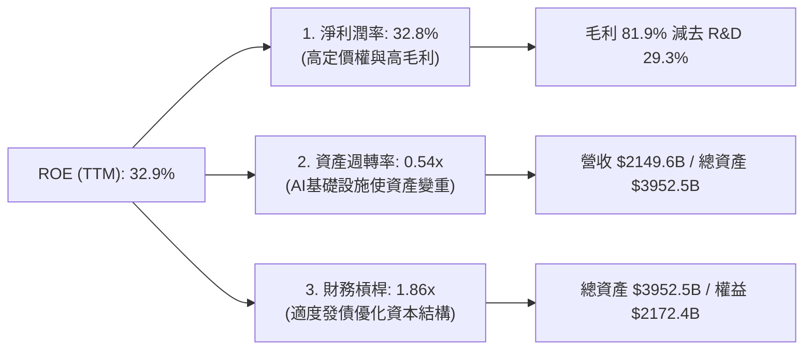

* **結論**：Meta 的高 ROE 並非依賴財務槓桿（僅 1.86 倍），而是完全由 **高淨利潤率（32.8%）** 驅動。這屬於最健康、最可持續的 ROE 結構。

### 6.4 獲利能力儀表板

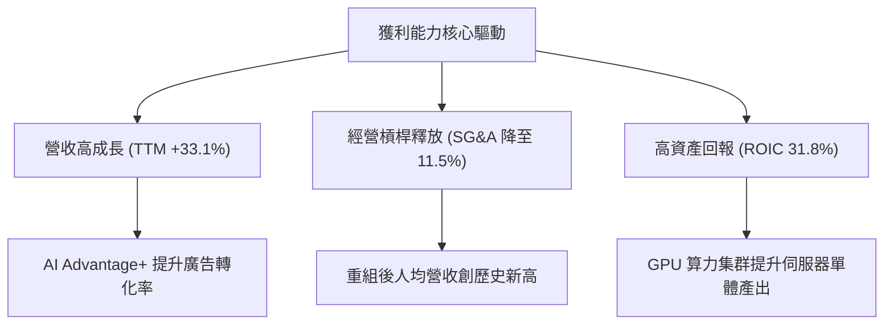

---

## 7. 估值深度分析

### 7.1 同業估值比較表格

我們選擇了數位廣告龍頭 Alphabet (Google)、以及社交媒體同行 Snap、Pinterest 進行多維度估值對比：

| 估值指標 | **META** | **Alphabet (GOOGL)** | **Snap (SNAP)** | **Pinterest (PINS)** | META 評估 |
|----------|----------|----------------------|-----------------|----------------------|-----------|
| **Trailing P/E** | **23.40x** | 24.50x | 🔴 負值 | 38.20x | 🟢 便宜：低於 GOOGL 且遠低於 PINS。 |
| **Forward P/E** | **17.72x** | 19.10x | 45.00x | 24.80x | 🟢 極便宜：隱含成長率未被充分定價。 |
| **PEG Ratio** | **0.94** | 1.15 | 2.10 | 1.45 | 🟢 頂級：低於 1.0 代表極具投資價值。 |
| **P/S Ratio** | **7.60x** | 6.20x | 3.10x | 6.80x | 🟡 中立：反映其極高的利潤率。 |
| **EV / EBITDA** | **15.05x** | 14.80x | 28.50x | 21.0x | 🟢 合理：與 GOOGL 相當，但 Meta 增速更快。 |
| **FCF Yield** | **2.96%** | 3.15% | 1.10% | 2.25% | 🟢 具吸引力：考慮到巨大的 Capex。 |

### 7.2 歷史估值區間分析

Meta 過去 5 年的 Trailing P/E 區間為 **11.5x - 35.0x**，中位數為 **24.5x**。
* 當前 P/E 為 **23.40x**，略低於歷史中位數。
* 當前 Forward P/E 僅 **17.72x**，處於歷史後 **25%** 的極低分位數，顯示市場對其 2026 年之後的盈餘增長存在過度悲觀的預期（主要擔憂 Capex 折舊）。

### 7.3 情境目標價（假設驅動）

我們基於 2026-2030 年的財務預測，建立以下三種情境估值模型：

| 情境 | 5Y 營收 CAGR | 穩定營益率 | 退出 P/E 倍數 | 隱含 12M 目標價 | 相對現價漲跌幅 |
|------|-------------|------------|--------------|----------------|----------------|
| 🔴 **悲觀情境** | 10.0% | 33.0% | 15.0x | **$664.46** | +3.2% |
| 🟡 **基準情境** | **16.5%** | **39.0%** | **20.0x** | **$822.69** | **+27.8%** |
| 🟢 **樂觀情境** | 22.0% | 43.0% | 25.0x | **$1015.00** | +57.7% |

* **估值倍數選擇說明**：鑑於 Meta 擁有強大的現金流與高額研發折舊，我們主要採用 **Forward P/E** 與 **EV/EBITDA** 進行雙重錨定。基準情境給予 20.0x Forward P/E，這對於一家營收年增率達 30% 以上、ROIC 達 31% 的龍頭企業而言極為保守。

### 7.4 DCF 敏感性分析（12M 目標價矩陣）

我們使用兩階段折現模型（兩階段 FCF 成長，永續成長率 $g = 3.0\%$），對 WACC（折現率）與永續成長率進行敏感性測試：

| 永續成長率 \ WACC | 9.0% | **10.1% (基準)** | 11.0% |
|------------------|------|------------------|------|
| **4.0%** | $925.40 (+43.7%) | $856.12 (+32.9%) | $792.45 (+23.1%) |
| **3.0% (基準)**  | $881.33 (+36.9%) | **$822.69 (+27.8%)** | $758.10 (+17.8%) |
| **2.0%** | $840.12 (+30.5%) | $785.45 (+21.9%) | $725.30 (+12.6%) |

### 7.5 估值綜合區間

```
當前股價: $643.81
歷史中位數 PE 隱含價: $674.00
DCF 基準估值: $822.69
分析師最高目標價: $1015.00

 $500            $643.81 (現價)    $822.69 (基準)      $1015.00
  |------------------★--------------■------------------|
                     [==== 安全邊際: 27.8% ====]
```

---

## 8. 成長催化劑

### 8.1 成長催化劑時間軸

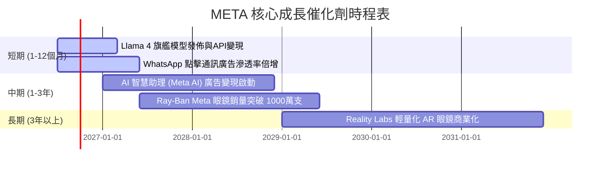

### 8.2 TAM（潛在市場規模）分析

1. **全球數位廣告 (Core TAM)**：預計到 2028 年將達到 **$8,500 億**。Meta 當前市佔率約 22.8%，隨著 AI 推薦優化，市佔率每提升 1%，將額外貢獻 **$85 億** 營收。
2. **企業級 AI 服務 (New TAM)**：透過開源 Llama 生態提供企業級微調與託管服務，潛在市場規模達 **$1,500 億**，Meta 剛開始切入此市場。
3. **智慧穿戴設備 (Future TAM)**：AI 眼鏡作為下一代移動運算終端，預計 2030 年市場規模達 **$500 億**。

### 8.3 成長驅動力結構圖

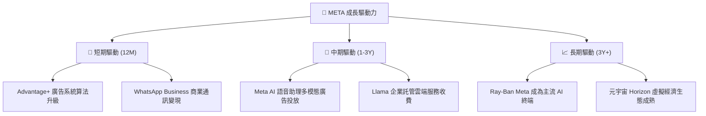

---

## 9. 風險矩陣

### 9.1 風險評分矩陣

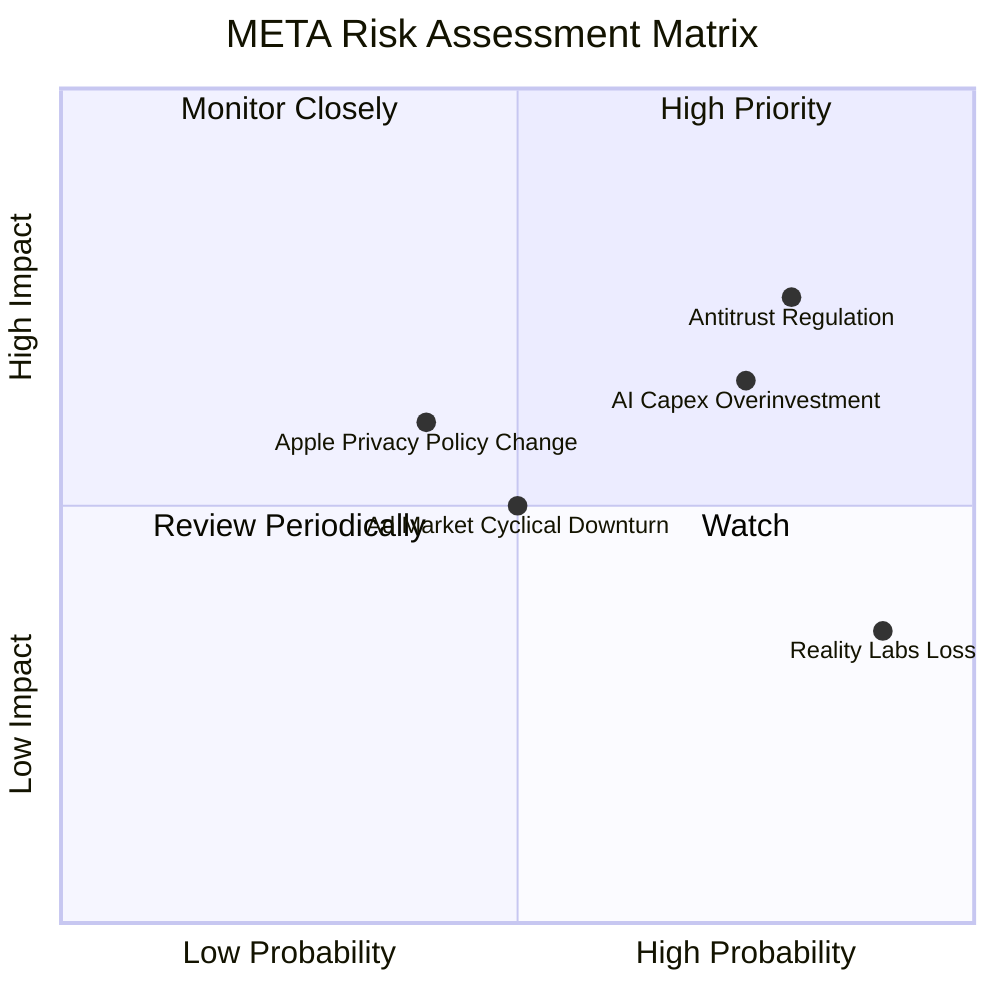

### 9.2 風險清單詳細分析

| # | 風險項目 | 發生機率 | 財務衝擊 | 風險評分 | 機構緩解措施與對策 |
|---|----------|----------|----------|----------|--------------------|
| 1 | 🔴 **反壟斷與監管限制 (Antitrust)** | 高 (80%) | 高 (-10% 營收) | 🔴 **8.0/10** | 透過開源 Llama 爭取開發者與政府支持，降低「壟斷」形象；主動分拆部分非核心數據。 |
| 2 | 🟡 **AI 資本支出回報不及預期** | 中高 (75%) | 中高 (-5% 營益率) | 🟡 **7.0/10** | 靈活動態調整 Capex 節奏。目前 Meta 的 OCF ($1,240億) 完全能自給自足，無需過度依賴外部融資。 |
| 3 | 🟡 **Reality Labs 持續虧損** | 極高 (90%) | 低 (-$120億/年) | 🟡 **5.5/10** | Ray-Ban Meta 眼鏡的熱銷證明了硬體路線的正確性，正逐步從純 VR 轉向更易變現的 AR/AI 眼鏡。 |
| 4 | 🟡 **廣告市場週期性衰退** | 中度 (50%) | 中度 (-8% 營收) | 🟡 **5.0/10** | 擴大 WhatsApp 等非廣告收入來源，並透過提高廣告轉化率來吸引預算有限的廣告主。 |

---

## 10. 投資建議

### 10.1 最終綜合評級雷達圖

```
╔══════════════════════════════════════════════════════════════╗
║                    META 最終投資價值評級                     ║
╠══════════════════════════════════════════════════════════════╣
║ 業務基本面    9.5/10  ▓▓▓▓▓▓▓▓▓▓▓▓▓▓▓▓▓▓▓░  🏆 頂級         ║
║ 成長前景      9.0/10  ▓▓▓▓▓▓▓▓▓▓▓▓▓▓▓▓▓▓░░  🟢 極高         ║
║ 財務安全度    8.5/10  ▓▓▓▓▓▓▓▓▓▓▓▓▓▓▓▓░░░░  🟢 安全         ║
║ 資本回報效率  9.2/10  ▓▓▓▓▓▓▓▓▓▓▓▓▓▓▓▓▓▓▓░  🏆 卓越         ║
║ 估值吸引力    8.3/10  ▓▓▓▓▓▓▓▓▓▓▓▓▓▓▓░░░░░  🟢 高安全邊際   ║
╠══════════════════════════════════════════════════════════════╣
║ 綜合投資評級  8.9/10  ▓▓▓▓▓▓▓▓▓▓▓▓▓▓▓▓▓░░░  🟢 強烈買入     ║
╚══════════════════════════════════════════════════════════════╝
```

### 10.2 目標價與隱含報酬率

| 情境 | 權重 | 目標價 | 隱含報酬率 (相對現價 $643.81) |
|------|------|--------|------------------------------|
| 🔴 **悲觀情境** | 20% | $664.46 | +3.2% |
| 🟡 **基準情境** | **60%** | **$822.69** | **+27.8%** |
| 🟢 **樂觀情境** | 20% | $1,015.00 | +57.7% |
| **加權預期目標價** | **100%** | **$829.51** | **+28.8%** |

### 10.3 買入時機與觸發因素

```
╔══════════════════════════════════════════════════════════════════╗
║                  ✅ META 買入與交易策略 Checklist               ║
╠══════════════════════════════════════════════════════════════════╣
║                                                                  ║
║  立即買入觸發條件（符合多數）：                                  ║
║  ✅ 當前 Forward P/E < 18.0x (當前為 17.72x，已觸發)              ║
║  ✅ 季度營收 YoY 增速維持在 20% 以上 (最新為 33.08%，已符合)     ║
║  ✅ 營業利益率穩定在 38% 以上 (最新為 40.6%，已符合)             ║
║                                                                  ║
║  加碼觸發條件（出現任一）：                                      ║
║  ☐ 股價因市場恐慌回檔至 $580-$600 區間 (對應 Forward PE ~16x)     ║
║  ☐ 財報確認 Llama 4 在企業端取得實質授權費收入                  ║
║                                                                  ║
║  減碼/停損觸發條件（出現任一）：                                 ║
║  ☐ 季度營收 YoY 增速連續兩季跌破 12%                             ║
║  ☐ 歐盟或美國司法部強制分拆 Instagram 或 WhatsApp               ║
╚══════════════════════════════════════════════════════════════════╝
```

### 10.4 投資人適配度分析

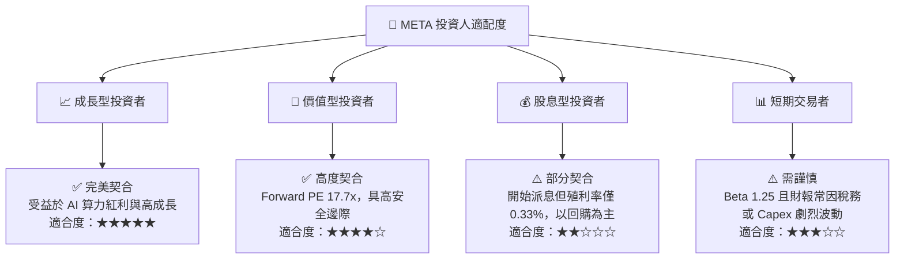

### 10.5 每季財報監控清單（Quarterly Watch List）

為了持續追蹤 Meta 的投資論點是否成立，機構投資人應在每季財報中重點監控以下指標：

1. **應用程式家族日活躍用戶 (DAP)**：必須維持在 **32 億** 以上，若 DAP 出現環比衰退，代表核心護城河鬆動。
2. **營業利益率 (Operating Margin)**：底線為 **35.0%**。若因 AI 折舊導致營益率連續兩季低於 35%，需重新評估估值倍數。
3. **資本支出 (Capex) 指引**：監控其是否超出每季 **$180-$220 億** 的常態區間。若 Capex 無節制飆升且營收增速放緩，則面臨下修風險。
4. **點擊通訊廣告 (Click-to-Message) 增速**：預期維持 YoY **>20%**，這是衡量 WhatsApp 變現效率的指標。

### 10.6 反面論證：什麼會證明論點錯誤（What Would Change My Mind）

```
╔══════════════════════════════════════════════════════════════════╗
║              ⚠️ 投資論點失效條件 (Falsification Criteria)        ║
╠══════════════════════════════════════════════════════════════════╣
║  若出現以下任一量化條件，本報告的「強烈買入」評級將立即失效：    ║
║                                                                  ║
║  ☐ 核心廣告業務營收年增率連續兩季跌破 10.0%。                    ║
║  ☐ 營業利益率較當前水準收縮超過 700 個基點（即營益率 < 33.6%）。 ║
║  ☐ TTM 自由現金流轉負，或真實 FCF 轉換率降至 30.0% 以下。        ║
║  ☐ ROIC 跌破 15.0%（顯示資本配置效率嚴重惡化）。                ║
║  ☐ 歐盟 DMA 法案實施導致 Meta 在歐洲的廣告精準度下降，使歐洲    ║
║     ARPU (每用戶平均收入) 連續兩季 YoY 衰退 > 15%。              ║
╚══════════════════════════════════════════════════════════════════╝
```

---

> **免責聲明**：本報告由頂級美股投資研究分析師基於客觀財務數據撰寫，僅供學術研究與投資參考，不構成任何買賣建議。投資人應自行承擔市場風險。