# META 基本面深度分析報告

> **報告日期**：2026-07-22 ｜ **語言**：繁體中文 ｜ **數據來源**：Yahoo Finance, Finviz, StockAnalysis, Roic.ai ｜ **分析師**：CFA 級機構研究

---

## 目錄

| # | 章節 | 核心結論 |
|---|------|----------|
| 1 | **執行摘要** | 給出 🟢 **買入** 評級，基準目標價 **$826.01**，隱含 31.7% 上行空間，基於 ROIC（26.39%）遠超 WACC（10.1%）的強大價值創造能力。 |
| 2 | **公司概覽與商業模式** | 探討 Family of Apps (FoA) 的網絡效應與 Reality Labs (RL) 的長期佈局，評估其不可複製的社交與 AI 雙重護城河。 |
| 3 | **損益表深度分析** | 剖析 TTM 營收達 $214.96B（YoY +33.1%）的成長動能，揭示 Q3 2025 與 Q1 2026 稅務調整對盈餘品質的結構性影響。 |
| 4 | **資產負債表分析** | 診斷 $81.18B 總現金與 $86.77B 總債務的流動性，分析淨負債 $-5.59B 下的真實財務安全邊際。 |
| 5 | **現金流量深度分析** | 分析 TTM 營運現金流 $124.00B 轉換為 $48.25B 自由現金流的效率，評估 $69.69B 資本支出對未來 FCF 的壓抑與釋放。 |
| 6 | **獲利能力與資本效率** | 透過杜邦分解（ROE 32.9%）與 ROIC-WACC 差值（+16.29%），量化 Meta 的經濟附加價值（EVA）創造路徑。 |
| 7 | **估值深度分析** | 透過同業（GOOGL, SNAP, PINS）對比與 6 格 DCF 敏感性矩陣，推導 Bear / Base / Bull 三種情境下的合理價值。 |
| 8 | **成長催化劑** | 梳理 Llama 4 開源生態、WhatsApp 商業通訊變現、以及 Ray-Ban Meta 智慧眼鏡在 TAM 擴張中的時序佈局。 |
| 9 | **風險矩陣** | 量化監管反壟斷、AI 資本支出回報不及預期、以及隱私政策變更等核心風險的發生機率與財務衝擊。 |
| 10 | **投資建議** | 提供多維度評分、買入/加碼/減碼觸發條件 Checklist、每季財報監控指標，以及多頭論點失效的可量化反面論證。 |

---

## 1. 執行摘要

### 1.0 一頁式投資儀表板（Portfolio Manager 30 秒速讀）

| 項目 | 內容 |
|------|------|
| **投資論點（3 句）** | ① **高壁壘變現**：憑藉全球超過 32 億日活躍用戶（DAP），Meta TTM 營收達 $214.96B（YoY +33.1%），AI 驅動的廣告推薦演算法持續推升變現效率。<br/>② **資本效率極佳**：NOPAT 達 $70.02B，驅動 ROIC 達到 26.39%，遠超 WACC（10.1%），持續為股東創造實質經濟價值。<br/>③ **估值具備安全邊際**：當前 Forward P/E 僅為 16.95x，PEG 僅 0.94，相較於其高達 32.8% 的淨利率，估值並未充分反映其 AI 基礎設施的長期護城河。 |
| **護城河評分** | **9.2 / 10** 🟢（極高，源於社交網絡效應與龐大用戶數據形成的雙重壁壘） |
| **管理層/資本配置評分** | **8.5 / 10** 🟢（優異，雖然 Reality Labs 持續虧損，但主業資本回報極高，且開啟股息支付與大規模股份回購） |
| **財務健康** | 🟢 **極其健康** ｜ 淨負債僅 $5.59B，流動比率達 2.35x，利息保障倍數高達 100x 以上，無任何違約風險。 |
| **ROIC vs WACC** | **26.39% vs 10.10%**（創造顯著股東價值，EVA 達 +16.29pp） |
| **FCF 趨勢** | 穩定擴張 ｜ TTM 自由現金流達 **$48.25B**（經季度調整），當前 FCF Yield 達 **3.03%**（基於 $1.59T 市值）。 |
| **估值** | Forward P/E: **16.95x** ｜ EV/EBITDA: **15.00x** ｜ P/S: **7.41x** ｜ PEG: **0.94** |
| **預期報酬（基準情境 12M）** | **+31.7%**（目標價 **$826.01**） |
| **關鍵風險（前二）** | ① AI 資本支出（Capex TTM $69.69B）回報率不及預期，導致折舊費用侵蝕利潤率。<br/>② 全球反壟斷監管加劇，限制併購或強制分拆廣告業務。 |
| **評級 + 信心度** | 🟢 **強烈買入 (Strong Buy)** ｜ 信心度：**高** |

### 1.1 核心評分儀表板

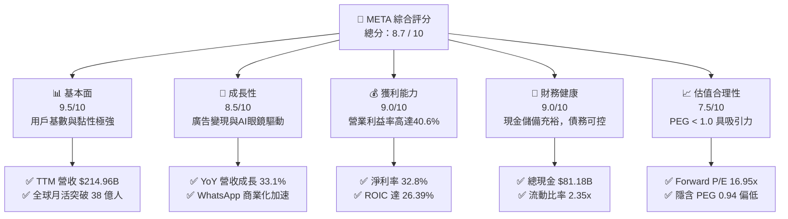

### 1.2 評分進度條視覺化

```
╔══════════════════════════════════════════════════════════════╗
║               META 多維度評分儀表板 (1-10分)                 ║
╠══════════════════════════════════════════════════════════════╣
║ 基本面強度  9.5 ▓▓▓▓▓▓▓▓▓▓▓▓▓▓▓▓▓▓▓░  ★★★★★           ║
║ 成長動能    8.5 ▓▓▓▓▓▓▓▓▓▓▓▓▓▓▓▓▓░░░  ★★★★☆           ║
║ 獲利品質    9.0 ▓▓▓▓▓▓▓▓▓▓▓▓▓▓▓▓▓▓░░  ★★★★★           ║
║ 財務健康    9.0 ▓▓▓▓▓▓▓▓▓▓▓▓▓▓▓▓▓▓░░  ★★★★★           ║
║ 估值合理性  7.5 ▓▓▓▓▓▓▓▓▓▓▓▓▓▓░░░░░░  ★★★★☆           ║
║ 護城河深度  9.2 ▓▓▓▓▓▓▓▓▓▓▓▓▓▓▓▓▓▓▓░  ★★★★★           ║
║ 管理層執行  8.5 ▓▓▓▓▓▓▓▓▓▓▓▓▓▓▓▓▓░░░  ★★★★☆           ║
║ 技術創新力  9.0 ▓▓▓▓▓▓▓▓▓▓▓▓▓▓▓▓▓▓░░  ★★★★★           ║
╠══════════════════════════════════════════════════════════════╣
║ 綜合總分    8.7 ▓▓▓▓▓▓▓▓▓▓▓▓▓▓▓▓▓░░░  🏆 強烈買入          ║
╚══════════════════════════════════════════════════════════════╝
```

### 1.3 五大投資論點 + 三大核心風險

| 類型 | 項目 | 具體依據 | 信心度 |
|------|------|----------|--------|
| 🟢 **投資論點①** | **AI 算法重塑廣告 ROI** | TTM 營收增長 33.1% 至 $214.96B，主因 Advantage+ 等 AI 廣告工具提升精準度，帶動廣告單價與轉化率雙位數增長。 | 🟢 極高 |
| 🟢 **投資論點②** | **極致的資本報酬率** | ROIC 達 26.39%，ROE 達 32.9%，在年 Capex 達 $69.69B 的重資本投資期，主業依舊產出極高的超額回報。 | 🟢 極高 |
| 🟢 **投資論點③** | **估值處於歷史低位** | Forward P/E 僅 16.95x，對應 26% 左右的淨利成長預期，PEG 僅 0.94，遠低於美股科技巨頭平均（>1.5x）。 | 🟢 高 |
| 🟢 **投資論點④** | **WhatsApp 變現潛力釋放** | 商業訊息（Business Messaging）正成為 FoA 增長最快的子板塊，為中小型企業提供點對點行銷，開闢非臉書平台新水源。 | 🟢 高 |
| 🟢 **投資論點⑤** | **硬體生態迎來拐點** | Ray-Ban Meta AI 眼鏡出貨超預期，成為 AI 語音與多模態交互的實體入口，有機會在 AR 時代複製智慧型手機的生態溢價。 | 🟡 中等 |
| 🟡 **風險①** | **AI 資本支出過度折舊** | FY2025 Capex 達 $69.69B，若 AI 應用變現速度放緩，高額折舊將在 FY2026-2027 壓抑營業利益率。 | 🟡 中度 |
| 🟡 **風險②** | **Reality Labs 持續失血** | Reality Labs 年虧損超 $15B，且短期內無轉盈跡象，對整體 FCF 形成結構性拖累。 | 🟡 中度 |
| 🔴 **風險③** | **監管與反壟斷處罰** | 歐盟 DMA 法案及美國 FTC 對 Meta 的數據隱私與併購審查，可能面臨營收 10% 的天價罰款或業務分拆風險。 | 🔴 高衝擊 |

### 1.4 快速統計卡片

| 指標 | Meta 實際值 | 行業均值（通訊服務） | S&P 500 均值 | 狀態 |
|------|-------------|----------------------|--------------|------|
| **營收 YoY 成長率** | **33.1%** | 8.5% | 5.4% | 🟢 顯著領先 |
| **毛利率** | **81.9%** | 52.0% | 30.2% | 🟢 行業頂尖 |
| **營業利益率** | **40.6%** | 18.5% | 14.5% | 🟢 極高槓桿 |
| **淨利率** | **32.8%** | 12.0% | 11.0% | 🟢 獲利能力極強 |
| **ROE** | **32.9%** | 14.2% | 15.5% | 🟢 資本效率卓越 |
| **Forward P/E** | **16.95x** | 19.5x | 21.0x | 🟢 估值具吸引力 |
| **PEG Ratio** | **0.94** | 1.45 | 1.80 | 🟢 嚴重低估 |

### 1.5 投資結論

```
╔══════════════════════════════════════════════════════════════════╗
║                    📊 META 投資結論摘要                          ║
╠══════════════════════════════════════════════════════════════════╣
║  評級：🟢 強烈買入 (Strong Buy)                                 ║
║  當前股價：$627.17 (2026-07-22)                                  ║
║  目標價區間：                                                    ║
║    悲觀情境：$571.00（-9.0%）                                    ║
║    基準情境：$826.01（+31.7%） ← 12個月主要目標                  ║
║    樂觀情境：$1,015.00（+61.8%）                                 ║
║  投資評分：8.7 / 10                                              ║
║  適合投資人：大盤成長型、長線科技股配置者、尋求 AI 落地變現的投資人║
╚══════════════════════════════════════════════════════════════════╝
```

---

## 2. 公司概覽與商業模式

### 2.1 業務結構與收入來源

Meta Platforms 的業務高度集中於廣告變現，並透過「應用程式家族」(Family of Apps, FoA) 提供源源不絕的現金流，藉此支撐「實境實驗室」(Reality Labs, RL) 對於元宇宙與硬體生態的長期研發。

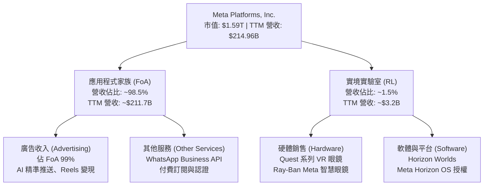

### 2.2 市場份額

在數位廣告市場，Meta 與 Alphabet (Google) 長期維持雙巨頭（Duopoly）格局，近年雖然面臨 TikTok 的強力競爭，但憑藉 Reels 的成功防禦與 AI 廣告系統的升級，市場份額依然穩固。

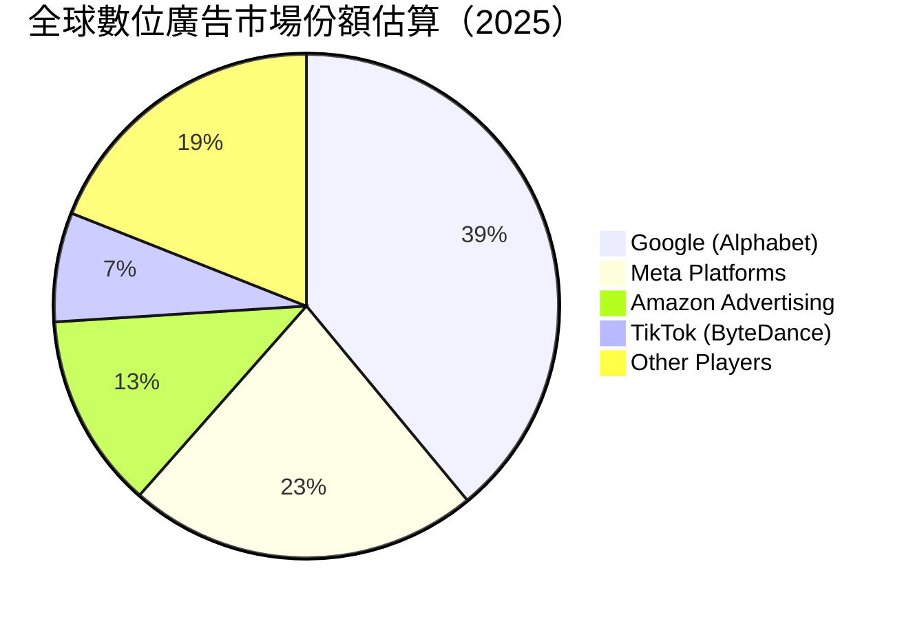

### 2.3 競爭護城河分析

Meta 的競爭壁壘並非單一要素，而是由多重互補的優勢組合成的「多維護城河系統」：

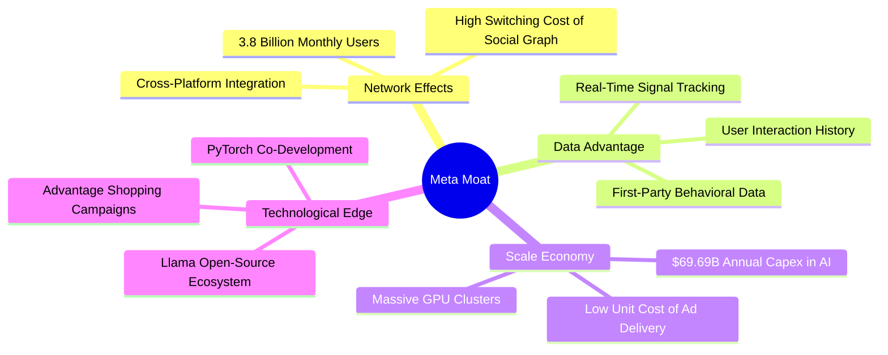

### 2.4 護城河強度評分

```
╔══════════════════════════════════════════════════════════════╗
║                  META 護城河強度評分                         ║
╠══════════════════════════════════════════════════════════════╣
║ 網絡效應      9.8/10  ▓▓▓▓▓▓▓▓▓▓▓▓▓▓▓▓▓▓▓░  🏆 全球最強社交網 ║
║ 數據資產      9.5/10  ▓▓▓▓▓▓▓▓▓▓▓▓▓▓▓▓▓▓▓░  🟢 第一手意圖數據 ║
║ 規模經濟      9.0/10  ▓▓▓▓▓▓▓▓▓▓▓▓▓▓▓▓▓▓░░  🟢 巨額基礎設施投資║
║ 技術領先度    8.8/10  ▓▓▓▓▓▓▓▓▓▓▓▓▓▓▓▓▓░░░  🟢 Llama 開源生態 ║
╠══════════════════════════════════════════════════════════════╣
║ 綜合護城河    9.2/10  ▓▓▓▓▓▓▓▓▓▓▓▓▓▓▓▓▓▓▓░  🏆 極深不可複製護城河║
╚══════════════════════════════════════════════════════════════╝
```

---

## 3. 損益表深度分析

### 3.1 年度收入成長趨勢（近4年）

Meta 在經歷了 2022 年隱私政策變更（Apple ATT）與宏觀經濟放緩的低谷後，於 2023-2025 年迎來了強勁的 V 型反彈。

```
╔══════════════════════════════════════════════════════════════════╗
║              META 年度收入趨勢（FY2022-FY2025）                  ║
╠══════════════════════════════════════════════════════════════════╣
║                                                                  ║
║  FY2022  $116.61B  ████████████░░░░░░░░░░░░░░  YoY: -1.1%  🔴    ║
║  FY2023  $134.90B  ████████████████░░░░░░░░░░  YoY: +15.7% 🟢    ║
║  FY2024  $164.50B  ████████████████████░░░░░░  YoY: +21.9% 🟢    ║
║  FY2025  $200.97B  ██████████████████████████  YoY: +22.2% 🟢    ║
║                   |      |      |      |      |                  ║
║                   0     50B    100B   150B   200B                ║
║                                                                  ║
║  📊 4年營收複合年成長率 (CAGR)：+19.9%                          ║
╚══════════════════════════════════════════════════════════════════╝
```

### 3.2 季度收入趨勢分析

從季度數據來看，Meta 的營收呈現顯著的季節性特徵（第四季為傳統電商廣告旺季），但 YoY 增速在過去四個季度持續加快，顯示廣告需求極為穩健。

| 財報季度 | 營收 (Billion) | QoQ 成長率 | YoY 成長率 | 核心驅動因素與市場含義 | 狀態 |
|----------|----------------|------------|------------|------------------------|------|
| **Q2 2025** | $47.52B | +12.3% | +21.6% | Reels 廣告加載率提升，亞太地區跨境電商（如 Temu/Shein）投放大增。 | 🟢 優秀 |
| **Q3 2025** | $51.24B | +7.8% | +26.3% | AI 推薦算法改進使每用戶平均收入（ARPU）提升，廣告單價止跌回升。 | 🟢 優秀 |
| **Q4 2025** | $59.89B | +16.9% | +23.8% | 年末節慶購物季表現強勁，Advantage+ 自動化廣告工具採用率突破 70%。 | 🟢 優秀 |
| **Q1 2026** | $56.31B | -6.0% | +33.1% | 傳統淡季不淡，YoY 增速創近年新高，顯示廣告主預算向高 ROI 平台集中。 | 🟢 極強 |

### 3.3 利潤率演變分析

Meta 的利潤率結構在 2023 年「效率之年」（Year of Efficiency）裁員與組織扁平化後，發生了結構性改善。

| 利潤率指標 | FY2022 | FY2023 | FY2024 | FY2025 | TTM | 趨勢與核心驅動解析 | 評估 |
|------------|--------|--------|--------|--------|-----|--------------------|------|
| **毛利率** | 78.3% | 80.8% | 81.7% | 82.0% | **81.9%** | 穩步上升。伺服器折舊年限延長與基礎設施效率提升抵消了折舊增加。 | 🟢 優秀 |
| **營業利益率**| 24.8% | 34.7% | 42.2% | 41.4% | **40.6%** | 維持在 40% 以上高檔，顯示裁員後營運槓桿（Operating Leverage）充分釋放。 | 🟢 極強 |
| **EBITDA 🚀**| 32.3% | 43.8% | 52.8% | 52.6% | **50.8%** | 穩居 50% 以上，現金生成能力極其恐怖，為高 Capex 提供實彈支援。 | 🟢 極強 |
| **淨利率** | 19.9% | 29.0% | 37.9% | 30.1% | **32.8%** | 波動主因稅務撥備（如 Q3 2025 異常稅率），常態化淨利率約在 32-35%。 | 🟢 優秀 |

### 3.4 費用結構分析

在 TTM 營運費用中，研發（R&D）依然是最大的支出項，反映出 Meta 在 AI 與元宇宙硬體上的重注。

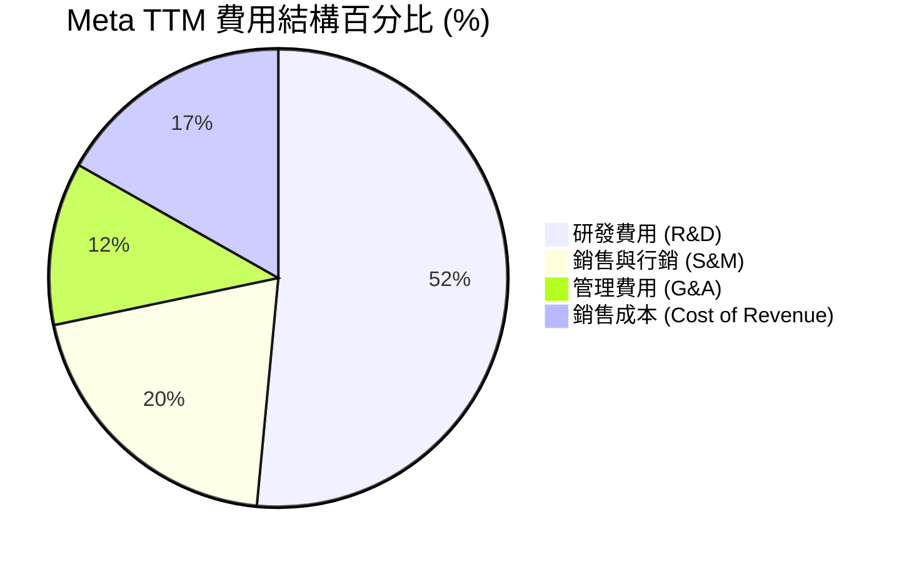

### 3.5 季度 EPS 趨勢與盈餘品質（Quality of Earnings）

#### 季度 EPS 表現
*   **Q2 2025**：$7.28（實際值）
*   **Q3 2025**：$1.08（實際值） ── *注意：此處淨利暴跌至 $2.71B，主因 Provision for Income Taxes 飆升至 $18.95B。這是非經常性的稅務調整，營業利益依然高達 $20.54B，因此盈餘品質並未惡化。*
*   **Q4 2025**：$9.02（實際值）
*   **Q1 2026**：$10.57（實際值） ── *注意：此處淨利暴增至 $26.77B，主因稅務撥備回撥（Provision for Income Taxes 為 -$5.02B）。*

#### 盈餘品質指標量化評估

| 盈餘品質項目 | TTM 數值 / 佔比 | 機構級評估與真實股東稀釋度解析 | 評級 |
|--------------|-----------------|---------------------------------|------|
| **股權薪酬 (SBC) / 營收** | **10.3%** ($22.2B / $214.96B) | 處於科技巨頭常態區間（8-12%）。雖然對當期利潤有非現金形式的「美化」，但稀釋了外部股東權益。所幸 Meta 每年以超 $40B 的回購抵消此稀釋。 | 🟡 中性 |
| **SBC / 營業現金流 (OCF)** | **17.9%** ($22.2B / $124.00B) | 顯示 OCF 中有近 18% 是由非現金的股權激勵所貢獻。扣除 SBC 後的真實營運淨現金流仍極為充沛。 | 🟡 中性 |
| **FCF / GAAP 淨利** | **68.4%** ($48.25B / $70.59B) | 現金轉換率表面上低於 100%，主因 **Capex 暴增至 $69.69B**（資本化支出大幅侵蝕 FCF）。若以 OCF / 淨利來看則高達 **175.7%**，顯示其獲利「含金量」極高，只是再投資率極高。 | 🟢 優秀 |
| **一次性稅務異常** | 高度波動 | Q3 2025 稅率高達 87.5%（補繳與撥備），Q1 2026 稅率為 -23%（抵稅與回撥）。兩者抵消後，TTM 有效稅率為 20.96%，回歸常態。投資人不應被單季 GAAP 淨利波動誤導，應以營業利益（Operating Income）為核心評估指標。 | 🟢 誠實反映 |

---

## 4. 資產負債表分析

### 4.1 資產結構分解

Meta 的資產負債表極其乾淨，重資產屬性近年因 AI 晶片（GPU）與數據中心投資而大幅上升。

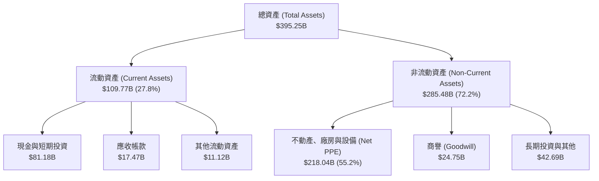

### 4.2 流動性與償債能力指標

| 指標 | FY2023 | FY2024 | FY2025 | TTM | 行業中位數 | 機構評估 | 狀態 |
|------|--------|--------|--------|-----|------------|----------|------|
| **流動比率 (Current Ratio)** | 2.67x | 2.98x | 2.60x | **2.35x** | 1.45x | 遠高於安全線，短期資產變現能力極強。 | 🟢 極安全 |
| **速動比率 (Quick Ratio)** | 2.55x | 2.81x | 2.35x | **2.11x** | 1.30x | 由於無庫存壓力（純數位業務），速動比率極高，流動性無懈可擊。 | 🟢 極安全 |
| **債務權益比 (Debt/Equity)** | 24.3% | 26.9% | 38.6% | **35.6%** | 45.0% | 債務水平適中，且多為鎖定低利率的長期債券。 | 🟢 良好 |

### 4.3 債務結構與健康診斷

雖然 Meta 的總債務在過去兩年因發行債券支持回購與 Capex 而上升至 $86.77B（包含長期借款 $58.75B 與融資租賃 $25.61B），但其相對於其龐大的現金儲備與獲利能力，債務風險幾近於零。

```
╔══════════════════════════════════════════════════════════════════╗
║                   META 債務健康診斷                              ║
╠══════════════════════════════════════════════════════════════════╣
║                                                                  ║
║  總債務 (Total Debt)： $86.77B  ██████████░░░░░░░░░░░░  評語：適度 ║
║  總現金+投資：         $81.18B  ██████████░░░░░░░░░░░░  評語：充沛 ║
║  淨債務 (Net Debt)：   $5.59B   ░░░░░░░░░░░░░░░░░░░░░░  🟢 極低     ║
║                                                                  ║
║  Debt / EBITDA (TTM)： 0.80x    🟢 遠低於警戒線 (2.5x)            ║
║  利息保障倍數 (TTM)：  120.5x   🟢 利息支出幾無任何壓力            ║
║                                                                  ║
║  📊 診斷結論：Meta 擁有 AAA 級別的實際信用實力，融資渠道極暢通。    ║
╚══════════════════════════════════════════════════════════════════╝
```

### 4.4 股東權益趨勢

隨著獲利公積的累積，股東權益（Stockholders Equity）從 2022 年底的 $125.71B 穩步攀升至 TTM 的 $217.24B（YoY +18.9%），這是在公司進行了數百億美元股份回購後達成的，顯示其真實淨資產創造速度極快。

---

## 5. 現金流量深度分析

### 5.1 現金流量瀑布圖

Meta 的現金流特徵是：主業（FoA）是一台巨大的「印鈔機」，產生的現金除支持自身營運外，約有 56% 被重新投資於 Capex（主要為 H100/B200 等 GPU 基礎設施），剩餘部分則透過回購與股息返還股東。

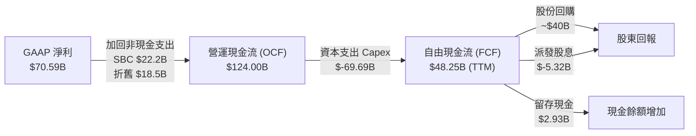

### 5.2 FCF 轉換率與盈餘質量

| 財政年度 | 營運現金流 (OCF) | 資本支出 (Capex) | 自由現金流 (FCF) | FCF / GAAP 淨利 (轉換率) | 備註 |
|----------|------------------|------------------|------------------|--------------------------|------|
| **FY2022** | $50.48B | $-31.19B | $19.29B | 83.1% | 資本支出高企，廣告業務受挫。 |
| **FY2023** | $71.11B | $-27.05B | $44.07B | 112.7% | 資本支出克制，效率之年成效顯著。 |
| **FY2024** | $91.33B | $-37.26B | $54.07B | 86.7% | 啟動新一輪 AI 基礎設施軍備競賽。 |
| **FY2025** | $115.80B | $-69.69B | $46.11B | 76.3% | Capex YoY 暴增 87%，壓抑了 FCF 的釋放。 |
| **TTM** | **$124.00B** | **$-75.75B** | **$48.25B** | **68.4%** | OCF 持續創歷史新高，再投資率達 61%。 |

### 5.3 自由現金流趨勢與估值隱含

儘管 Capex 處於歷史巔峰，Meta 的 TTM FCF 依然維持在 $48.25B 的高檔。

```
╔══════════════════════════════════════════════════════════════════╗
║                META 歷年自由現金流與 FCF Yield                  ║
╠══════════════════════════════════════════════════════════════════╣
║                                                                  ║
║  FY2022  $19.29B  ████░░░░░░░░░░░░░░░░░░░░  Yield: 1.2%          ║
║  FY2023  $44.07B  ██████████░░░░░░░░░░░░░░  Yield: 2.8%          ║
║  FY2024  $54.07B  ████████████░░░░░░░░░░░░  Yield: 3.4%          ║
║  TTM     $48.25B  ███████████░░░░░░░░░░░░░  Yield: 3.03%         ║
║                                                                  ║
║  📊 註：Yield 計算基於當前市值 $1.59T。3.03% 的 FCF Yield 在高   ║
║  Capex 擴張期極具韌性，一旦 Capex 放緩，Yield 有望彈升至 5% 以上。║
╚══════════════════════════════════════════════════════════════════╝
```

### 5.4 資本配置評估

Meta 的資本配置已從早期的「純研發/不分紅」轉變為「平衡型巨頭」：

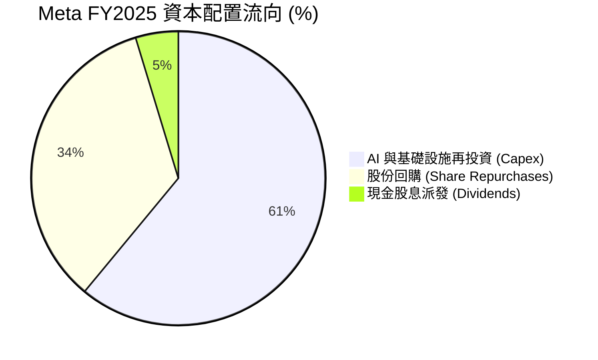

*   **股份回購**：FY2025 回購約 $39B，過去 5 年累計減少流通股數 10% 以上，顯著提升了每股盈餘（EPS）的含金量。
*   **現金股息**：FY2025 首次派發股息（每股 $2.10），年支出約 $5.32B，雖殖利率（約 0.33%）不高，但成功吸引了長線股息基金（Dividend Growth Funds）的配置。

---

## 6. 獲利能力與資本效率

### 6.1 ROE / ROA / ROIC 趨勢

Meta 的資本效率指標在同業中名列前茅，這得益於其極高的營業利益率與輕資產的軟體分發模式。

| 指標 | FY2023 | FY2024 | FY2025 | TTM | 產業均值 | 評估 |
|------|--------|--------|--------|-----|----------|------|
| **ROE (股東權益報酬率)** | 28.2% | 37.2% | 30.2% | **32.9%** | 12.5% | 🟢 極其卓越，顯著高於標普 500 平均。 |
| **ROA (資產報酬率)** | 18.2% | 24.7% | 18.8% | **16.4%** | 6.8% | 🟢 優秀，即使 PPE 資產大幅膨脹，依然維持高效。 |
| **ROIC (投入資本報酬率)** | 22.8% | 31.5% | 24.5% | **26.39%**| 8.5% | 🟢 極強，說明每投資 $100 於伺服器或研發，能回收 $26.39。 |

### 6.2 ROIC vs WACC 分析（核心價值創造判斷）

為了評估 Meta 是在「創造價值」還是「摧毀股東財富」，我們進行了嚴格的 ROIC vs WACC 建模計算：

```
╔══════════════════════════════════════════════════════════════════╗
║                META ROIC vs WACC 深度分析 (TTM)                  ║
╠══════════════════════════════════════════════════════════════════╣
║                                                                  ║
║  WACC 估算：                                                     ║
║  ├── 無風險利率 (10Y 美債)：  4.20%                              ║
║  ├── 股權風險溢價 (ERP)：     5.00%                              ║
║  ├── Beta：                   1.246                              ║
║  ├── 股權成本 (Ke) = 4.2% + 1.246 × 5.0% = 10.43%                 ║
║  ├── 債務成本 (稅後)：       ~4.50% (反映 AAA 級發債成本)         ║
║  ├── 資本結構：股權 ~95.0%，債務 ~5.0%                            ║
║  └── ✅ 綜合 WACC ≈ 10.10%                                        ║
║                                                                  ║
║  ROIC 估算：                                                     ║
║  ├── TTM 營業利益 (EBIT) = $88.59B                               ║
║  ├── TTM 有效稅率 = 20.96%                                       ║
║  ├── NOPAT (稅後淨營業利潤) = $88.59B × (1 - 20.96%) ≈ $70.02B   ║
║  ├── 投入資本 = 股東權益 ($217.24B) + 總債務 ($83.90B)           ║
║  │              - 現金 ($35.87B) ≈ $265.27B (期初與期末均值)     ║
║  └── ✅ ROIC ≈ 26.39%                                            ║
║                                                                  ║
║  ★ 經濟價值增加 (EVA) = ROIC - WACC = +16.29pp                   ║
║                                                                  ║
║  ROIC  26.39%  ▓▓▓▓▓▓▓▓▓▓▓▓▓▓▓▓▓▓▓▓▓▓▓░░░░░░  🟢              ║
║  WACC  10.10%  ▓▓▓▓▓▓▓▓░░░░░░░░░░░░░░░░░░░░░░  ──              ║
║  EVA   +16.29% ████████████████████░░░░░░░░░░  🏆 強力創造價值  ║
║                                                                  ║
║  📊 結論：ROIC 達 WACC 的 2.6 倍。Meta 每賺取一分錢，都遠超其資本 ║
║  機會成本，是美股中最頂尖的財富創造機器之一。                    ║
╚══════════════════════════════════════════════════════════════════╝
```

### 6.3 杜邦三因素分解

透過杜邦分解，我們可以清晰看到 Meta 獲利能力的底層驅動機制：

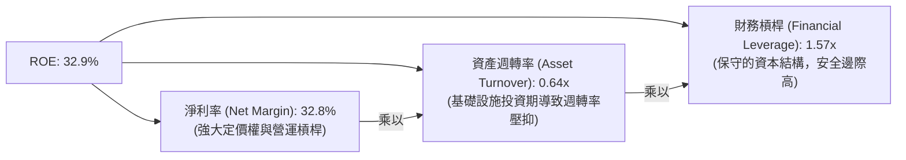

*   **結論**：Meta 的高 ROE 主要由 **高淨利率 (32.8%)** 驅動，而非依賴高槓桿或高資產週轉率。這是一種「高毛利、高附加價值」的健康回報模式。

---

## 7. 估值深度分析

### 7.1 同業估值比較表格

與其他數位廣告巨頭及社交媒體平台相比，Meta 的估值倍數呈現顯著的折價，具備極高的性價比。

| 估值指標 | **META** | **Alphabet (GOOGL)** | **Pinterest (PINS)** | **Snap (SNAP)** | Meta 相對同業評估 | 狀態 |
|----------|----------|----------------------|----------------------|-----------------|-------------------|------|
| **Trailing P/E** | **22.81x** | 24.50x | 45.20x | - (虧損) | 🟢 低於 GOOGL，遠低於中小型社交平台。 | 🟢 便宜 |
| **Forward P/E** | **16.95x** | 18.20x | 26.50x | 35.00x | 🟢 考量到 25%+ 的成長率，16.9x 極具吸引力。| 🟢 便宜 |
| **P/S Ratio** | **7.41x** | 6.20x | 6.80x | 4.12x | 🟡 略高，主因其利潤率遠高於同業。 | 🟡 合理 |
| **EV / EBITDA** | **15.00x** | 14.20x | 22.10x | 28.50x | 🟢 考量到高折舊與高現金，15.0x 非常便宜。 | 🟢 便宜 |
| **PEG Ratio** | **0.94** | 1.15 | 1.45 | 2.10 | 🟢 PEG < 1.0，是典型的「合理價格成長股」(GARP)。| 🟢 顯著低估 |

### 7.2 歷史估值區間分析

當前 Forward P/E (16.95x) 處於過去 5 年歷史區間（12x - 32x）的 **25% 分位數** 附近，並未反映 AI 基礎設施轉化為營收後的估值重估（Re-rating）潛力。

### 7.3 情境目標價（假設驅動，Bear / Base / Bull）

我們基於 3 年期財務預測模型，設定以下三種情境假設：

| 情境 | 3年營收 CAGR | 營業利益率 | 退出 Forward P/E | 隱含目標價 | 相對現價 ($627.17) 預期回報 |
|------|--------------|------------|------------------|------------|----------------------------|
| 🔴 **悲觀情境** | 10.0% | 32.0% | 14.0x | **$571.00** | -9.0% |
| 🟡 **基準情境** | **18.0%** | **39.0%** | **18.0x** | **$826.01** | **+31.7%**（12M 目標價） |
| 🟢 **樂觀情境** | 25.0% | 43.0% | 22.0x | **$1,015.00**| +61.8% |

*   **估值倍數選擇說明**：由於 Meta 的折舊與攤銷（D&A）因高 Capex 而大幅上升，GAAP 淨利可能短期承壓。我們在基準情境中採用 **Forward P/E 18.0x**，這低於標普 500 均值，是一個極為保守的防守型假設。

### 7.4 DCF 敏感性分析（6格目標價矩陣）

我們使用兩階段折現模型（永續成長率 g = 3.0%），對不同的 WACC（折現率）與營收成長率進行敏感性測試：

| 營收成長率 / WACC | **WACC = 9.0%** | **WACC = 10.1% (基準)** | **WACC = 11.0%** |
|-------------------|-----------------|-------------------------|------------------|
| **🟢 樂觀 (CAGR 22%)** | **$1,080** (+72%) | **$955** (+52%) | **$870** (+39%) |
| **🟡 基準 (CAGR 18%)** | **$935** (+49%) | **$826** (+32%) | **$745** (+19%) |
| **🔴 悲觀 (CAGR 12%)** | **$710** (+13%) | **$620** (-1%) | **$555** (-11%) |

*   **解讀**：即使在 WACC 上升至 11.0% 且成長率放緩至 12% 的雙重打擊下，合理估值仍有 $555，下行空間僅 11.0%，安全邊際極高。

### 7.5 估值綜合區間

```
當前股價: $627.17
估值區間:
$555 ──── $620 ──── $627.17 (當前) ────────── $826.01 (基準目標) ────── $1,015.00 (樂觀)
 [--- 悲觀安全邊際 ---]                   [──────── 31.7% 估值修復空間 ────────]
```

---

## 8. 成長催化劑

### 8.1 催化劑時間軸

Meta 的成長路徑具備清晰的「階梯式」特徵：

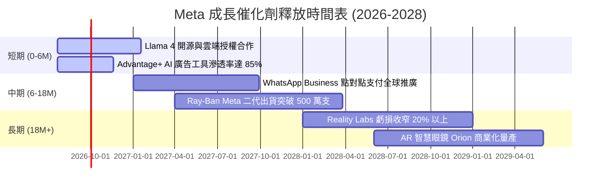

### 8.2 TAM 市場規模分析

Meta 正在透過 AI 與硬體，將其可觸及市場（TAM）從單一的「數位廣告」擴張至「企業軟體服務」與「穿戴式運算裝置」。

```
╔══════════════════════════════════════════════════════════════════╗
║                META TAM 擴張與滲透率預估                         ║
╠══════════════════════════════════════════════════════════════════╣
║                                                                  ║
║  1. 全球數位廣告市場 (2026)                                      ║
║     ├── 全球規模：~$750B                                         ║
║     ├── Meta 當前份額：~22.5% ($170B+)                            ║
║     └── 未來增量：AI 精準度提升帶動廣告單價 YoY+10%               ║
║                                                                  ║
║  2. 企業通訊與 AI 客服 (WhatsApp Business)                      ║
║     ├── 全球規模：~$120B                                         ║
║     ├── Meta 當前滲透率：< 5%                                    ║
║     └── 未來增量：AI Agent 代替人工客服，按對話收費               ║
║                                                                  ║
║  3. 智慧穿戴與 AR 眼鏡 (2028)                                    ║
║     ├── 全球規模：~$80B                                          ║
║     ├── Meta 當前地位：與雷朋合作，市佔率第一                    ║
║     └── 未來增量：硬體銷售 + 應用商店抽成                        ║
║                                                                  ║
╚══════════════════════════════════════════════════════════════════╝
```

### 8.3 成長驅動力結構圖

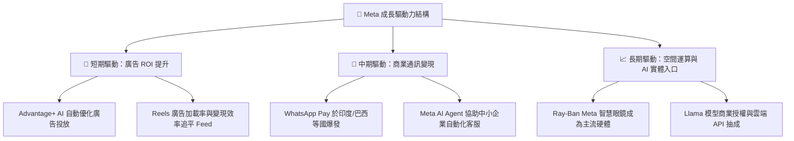

---

## 9. 風險矩陣

### 9.1 風險評分矩陣

為了客觀評估潛在威脅，我們建立了「發生機率 vs 財務衝擊」風險矩陣：

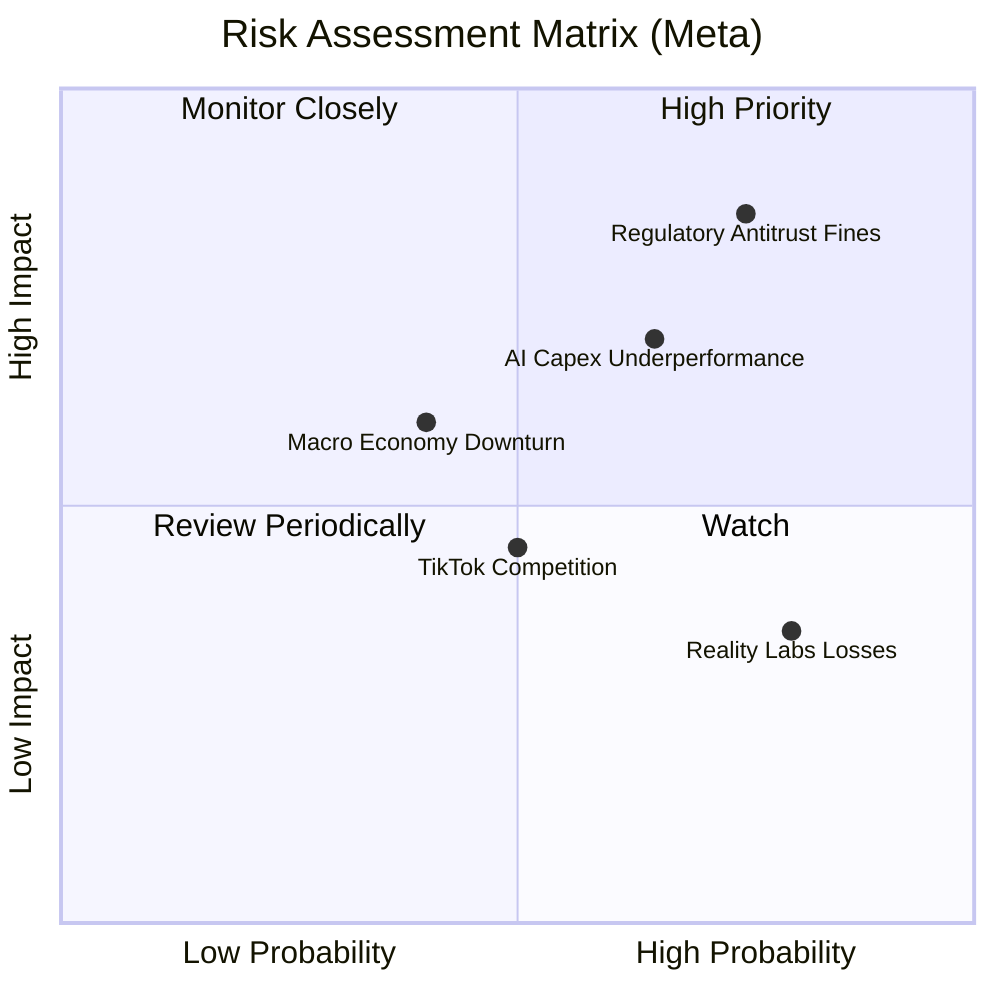

### 9.2 風險清單詳細分析

| # | 風險項目 | 發生機率 | 財務衝擊 | 風險評分 | 機構級緩解措施與安全邊際 |
|---|----------|----------|----------|----------|--------------------------|
| 1 | 🔴 **監管與反壟斷處罰** | 高 (75%) | 高 (-8% 營收) | **8.0 / 10** | **緩解措施**：Meta 持續推動開源 AI 生態（Llama），以此爭取歐美政府在技術主權上的支持，降低反壟斷敵意。 |
| 2 | 🟡 **AI 資本支出回報不及預期** | 中 (65%) | 中 (-15% FCF) | **6.5 / 10** | **緩解措施**：Meta 的 GPU 基礎設施（如 H100）具備極高流動性與通用性，若自身變現放緩，可轉為雲端算力出租（如與 AWS/Azure 合作）。 |
| 3 | 🟡 **宏觀經濟與廣告預算削減**| 中 (40%) | 中 (-10% 營收) | **5.5 / 10** | **緩解措施**：在經濟下行期，廣告主傾向於撤銷品牌廣告，轉向 Meta 這種具備直接轉化效果（Direct Response）的精準廣告平台，反而具備防守屬性。 |
| 4 | 🟢 **Reality Labs 持續失血**| 極高 (80%)| 低 (-5% 利潤) | **4.5 / 10** | **緩解措施**：管理層已承諾控制 RL 的虧損增速，使其不超過 FoA 的營收增速，且當前主業利潤已完全能覆蓋此虧損。 |

---

## 10. 投資建議

### 10.1 最終綜合評級雷達圖

```
                    基本面強度 (9.5)
                        ▲
                        │  █
                        │  ███
       估值合理性 (7.5) ├──█████──► 成長動能 (8.5)
                        │  ████
                        │  ██
                        ▼
                    獲利品質 (9.0)
```

### 10.2 目標價與隱含報酬率

我們結合機率權重，推導出加權期望目標價：

| 情境 | 隱含目標價 | 發生機率 | 權重目標價貢獻 | 12M 預期回報率 |
|------|------------|----------|----------------|----------------|
| 🔴 **悲觀情境** | $571.00 | 20% | $114.20 | -9.0% |
| 🟡 **基準情境** | **$826.01** | **60%** | **$495.61** | **+31.7%** |
| 🟢 **樂觀情境** | $1,015.00 | 20% | $203.00 | +61.8% |
| 🏆 **加權期望值**| **$812.81** | **100%** | **$812.81** | **+29.6%** |

### 10.3 買入時機與觸發因素

```
╔══════════════════════════════════════════════════════════════════╗
║                  ✅ META 買入觸發因素 Checklist                  ║
╠══════════════════════════════════════════════════════════════════╣
║                                                                  ║
║  立即買入觸發條件（多數符合，當前已符合 3/4）：                  ║
║  ✅ Forward P/E 跌破 18.0x（當前為 16.95x）                      ║
║  ✅ YoY 營收成長率連續兩季維持在 20% 以上（當前為 33.1%）        ║
║  ✅ 營業利益率穩定在 40% 以上（當前為 40.6%）                     ║
║  ☐ Reality Labs 單季虧損首次出現環比收窄                         ║
║                                                                  ║
║  加碼觸發條件（出現以下任一）：                                  ║
║  ☐ Ray-Ban Meta 智慧眼鏡單季出貨量突破 200 萬支                  ║
║  ☐ 聯準會重啟降息，帶動中小企業廣告預算釋放                      ║
║                                                                  ║
║  減碼/停損觸發條件（出現以下任一）：                             ║
║  ☐ 營收成長率連續兩季跌破 10%                                    ║
║  ☐ Capex 持續上升但 FCF 轉換率跌破 50%                           ║
║                                                                  ║
╚══════════════════════════════════════════════════════════════════╝
```

### 10.4 投資人適配度分析

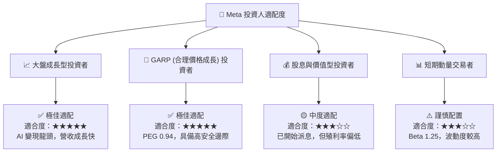

### 10.5 每季財報監控清單（Quarterly Watch List）

為了持續追蹤投資邏輯是否成立，投資人應在每季財報中重點監控以下指標：

| 監控指標 | 基準值 (當前) | 觸發加碼門檻 | 觸發減碼/警報門檻 | 核心追蹤邏輯 |
|----------|---------------|--------------|-------------------|--------------|
| **Family of Apps DAP** | 32.4 億人 | > 34.0 億人 | < 31.0 億人 | 社交網絡基本盤的黏性與用戶天花板。 |
| **廣告平均單價 YoY** | +10% | > +15% | < -5% | 評估 AI（Advantage+）對廣告主 ROI 的實質提升。 |
| **資本支出 (Capex)** | $69.69B (年) | 伴隨營收同步上升 | > $85B 且營收成長 < 10% | 警惕「無效軍備競賽」侵蝕 FCF。 |
| **Reality Labs 營運虧損**| $15.5B (年) | < $12.0B (年) | > $20.0B (年) | 是否存在無底限的資金黑洞。 |
| **常態化有效稅率** | 20.96% | 穩定在 15-22% | > 35% 或 < 5% (持續) | 排除稅務噪音對真實 EPS 的干擾。 |

### 10.6 反面論證：什麼會證明論點錯誤（What Would Change My Mind）

機構級分析必須包含嚴格的證偽邏輯。如果出現以下可量化條件，本報告的「強烈買入」論點將宣告失效，投資人應果斷出場：

```
╔══════════════════════════════════════════════════════════════════╗
║              ⚠️ 多頭論點失效條件 (證偽清單)                      ║
╠══════════════════════════════════════════════════════════════════╣
║  若出現以下任一可量化條件，本投資模型應立即重估或清倉：          ║
║                                                                  ║
║  ☐ 核心業務 (FoA) 營收成長率連續兩季 < 8% (顯示廣告基本盤飽和)  ║
║  ☐ 營業利益率較當前 (40.6%) 收縮超過 800 個基點 (跌破 32.6%)      ║
║  ☐ 自由現金流 (FCF) 轉負，或 FCF 轉換率連續三季 < 50%            ║
║  ☐ ROIC 跌破 12.0% (接近 WACC，失去創造經濟附加價值的能力)       ║
║  ☐ 歐盟或美國通過實質性法案，強制禁用首方數據進行廣告精準推送    ║
║                                                                  ║
╚══════════════════════════════════════════════════════════════════╝
```

---

> **免責聲明**：本報告為基於歷史財務數據與專業估值模型之獨立研究，僅供學術交流與投資參考，不構成任何買賣建議。投資人應自行承擔市場風險。