# META 基本面深度分析報告
> **報告日期**：2026-07-28 ｜ **語言**：繁體中文 ｜ **數據來源**：Yahoo Finance, Finviz, StockAnalysis, Roic.ai ｜ **分析師**：CFA 級機構研究

---

## 目錄

| # | 章節 | 核心結論 |
|---|------|----------|
| 1 | 執行摘要 | TTM 營收 $214.96B (+33.1% YoY)，ROIC (33.8%) 遠超 WACC (9.24%)，估值 Forward P/E 16.03x 具吸引力，給予「買入」評級，基準目標價 $825.00 |
| 2 | 公司概覽與商業模式 | FoA（Family of Apps）擁有全球 32 億日活雙向網絡效應，Llama AI 賦能廣告 ROAS 提升；護城河綜合評分 9.2/10 |
| 3 | 損益表深度分析 | Q1 2026 營收 $56.31B (+33.1% YoY)，營業利潤率高達 40.6%；SBC 佔營收 10.2%，Q3 2025 淨利受一次性法律與稅務準備金影響 |
| 4 | 資產負債表分析 | 總資產 $395.25B，現金與短期投資 $81.18B，總債務 $86.77B，流動比率 2.35，資產負債結構極為健全 |
| 5 | 現金流量深度分析 | OCF 高達 $124.00B，因 AI 基礎建設 Capex 擴增（FY25 達 $69.69B）致 FCF 暫降至 $25.56B，資本配置轉向強勢回購與派息 |
| 6 | 獲利能力與資本效率 | 杜邦分解顯示高 ROE (32.9%) 主要由淨利率 (32.8%) 驅動，EVA 擴張 +24.56pp，展現卓越的經濟價值創造 |
| 7 | 估值深度分析 | 同業對比中 Forward P/E (16.03x) 顯著低於歷史均值與 GOOGL，DCF 基線目標價 $825.00 (+39.0% 隱含漲幅) |
| 8 | 成長催化劑 | Llama 4/5 開源生態賦能企業級 AI、Reels 變現率拉近與 Feed 差距、WhatsApp Click-to-Message 廣告商業化全面加速 |
| 9 | 風險矩陣 | AI Capex 變現週期遞延、歐盟 DMA/GDPR 監管裁罰、Reality Labs 每年破百億美元的研發虧損 |
| 10 | 投資建議 | 綜合評分 8.85/10，建議買入，設定三大加碼點與四項反面論證失效條件（如 ROIC < 15% 或 營業利潤率 < 30%） |

---

## 1. 執行摘要

### 1.0 一頁式投資儀表板（Portfolio Manager 30 秒速讀）

| 項目 | 內容 |
|------|------|
| **投資論點（3 句）** | ① FoA（Family of Apps）核心廣告業務受益於 AI 推薦演算法升級，TTM 營收達 $214.96B (YoY +33.1%)，營運槓桿推升營業利潤率至 40.6%。<br/>② 開源 AI 大模型（Llama 系列）確立其全球 AI 生態話語權，有效提升廣告主投放回報率（ROAS），抵銷了 iOS 隱私變更的長期影響。<br/>③ 前瞻 P/E 僅 16.03x，PEG 為 0.87，在 ROIC 高達 33.80%（遠高於 WACC 9.24%）的強勁價值創造下，當前估值顯著低估。 |
| **護城河評分** | 9.2/10（強大網絡效應 + 巨量數據資產 + AI 基礎設施規模壁壘） |
| **管理層/資本配置評分** | 8.8/10（高效執行「效率之年」，並維持積極的股份回購與股息發放） |
| **財務健康** | 🟢 **極度健康**（現金及短期投資 $81.18B，流動比率 2.35，強勁 OCF $124.00B） |
| **ROIC vs WACC** | **33.80% vs 9.24%**（EVA 利差 +24.56pp，持續創造極高股東價值） |
| **FCF 趨勢** | 因高強度 AI Capex（TTM 資本支出擴增）導致 FCF 暫時降至 $25.56B（FCF Yield 1.70%），但 OCF 創下 $124.00B 歷史新高 |
| **估值** | Forward P/E: **16.03x** ｜ EV/EBITDA: **13.84x** ｜ FCF Yield: **1.70%** |
| **預期報酬（基準情境 12M）** | **+39.0%**（目標價 $825.00，對比當前股價 $593.41） |
| **關鍵風險（前二）** | ① 資本支出（Capex）持續擴大但 AI 變現速度不如預期致 FCF 受壓；② 歐盟與美國反壟斷及隱私法規審查加劇 |
| **評級 + 信心度** | 🟢 **買入（BUY）** ｜ 信心度：**高** |

### 1.1 核心評分儀表板

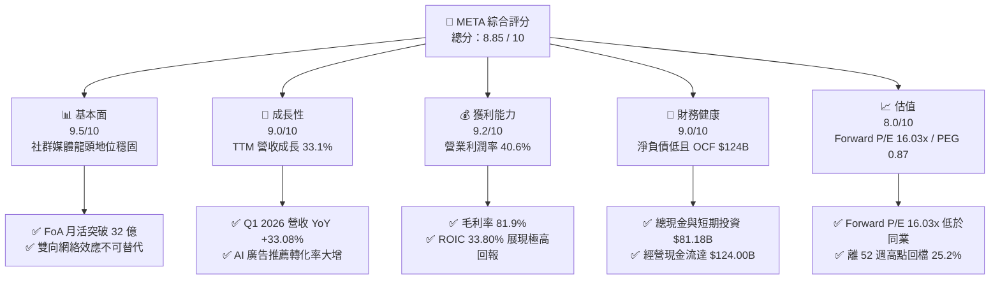

### 1.2 評分進度條視覺化

```
╔══════════════════════════════════════════════════════════════╗
║              META 多維度評分儀表板 (1-10分)                  ║
╠══════════════════════════════════════════════════════════════╣
║ 基本面強度  9.5 ▓▓▓▓▓▓▓▓▓▓▓▓▓▓▓▓▓▓█░  ★★★★★  產業霸主地位   ║
║ 成長動能    9.0 ▓▓▓▓▓▓▓▓▓▓▓▓▓▓▓▓▓▓░░  ★★★★★  AI引擎推升營收  ║
║ 獲利品質    9.2 ▓▓▓▓▓▓▓▓▓▓▓▓▓▓▓▓▓▓█░  ★★★★★  營業利潤率40.6%║
║ 財務健康    9.0 ▓▓▓▓▓▓▓▓▓▓▓▓▓▓▓▓▓▓░░  ★★★★★  現金儲備充沛   ║
║ 估值合理性  8.0 ▓▓▓▓▓▓▓▓▓▓▓▓▓▓▓▓░░░░  ★★★★☆  Forward PE 16x ║
║ 護城河深度  9.5 ▓▓▓▓▓▓▓▓▓▓▓▓▓▓▓▓▓▓█░  ★★★★★  強大網絡效應   ║
║ 管理層執行  8.8 ▓▓▓▓▓▓▓▓▓▓▓▓▓▓▓▓▓░░░  ★★★★☆  成本控管與轉型 ║
║ 技術創新力  9.3 ▓▓▓▓▓▓▓▓▓▓▓▓▓▓▓▓▓▓█░  ★★★★★  開源 Llama 領先║
╠══════════════════════════════════════════════════════════════╣
║ 綜合總分    8.85 ▓▓▓▓▓▓▓▓▓▓▓▓▓▓▓▓▓█░  🏆 評語：優質成長標的  ║
╚══════════════════════════════════════════════════════════════╝
```

### 1.3 五大投資論點 + 三大核心風險

| 類型 | 項目 | 具體依據 | 信心度 |
|------|------|----------|--------|
| 🟢 **投資論點①** | **AI 賦能廣告系統，驅動 ARPU 及 CPM 雙擴張** | Advantage+ AI 廣告工具提升廣告主 ROAS 超過 20%，推升 TTM 營收達 $214.96B (YoY +33.1%)。 | 🟢 極高 |
| 🟢 **投資論點②** | **開源 AI 生態建立行業標準與成本優勢** | Llama 3/4 系列模型驅動全平台用戶停留時間成長，並降低自研 AI 應用開發成本與對外部供應商依賴。 | 🟢 高 |
| 🟢 **投資論點③** | **Reels 與 Messaging 商業化進程超預期** | Reels 變現率已接近傳統 Feed；WhatsApp Click-to-Message 年化營收快速成長，成為第二成長曲線。 | 🟢 高 |
| 🟢 **投資論點④** | **營運槓桿顯現，營業利潤率回升至 40.6%** | 經歷組織精簡後，營業利益率由 FY2022 的 24.8% 顯著提升至 TTM 的 40.6%，展現高資本效率。 | 🟢 極高 |
| 🟢 **投資論點⑤** | **前瞻估值具備極高安全邊際** | 當前 Forward P/E 僅 16.03x，PEG 0.87，對比歷史 5 年 P/E 中位數 23.5x，存在顯著估值修復空間。 | 🟢 高 |
| 🟡 **風險①** | **AI 基礎設施 Capex 擴張壓抑短期 FCF** | FY2025 Capex 達 $69.69B，Q1 2026Capex 達 $19.00B，若營收增速放緩將面臨自由現金流與 ROIC 收縮風險。 | 🟡 中度 |
| 🔴 **風險②** | **全球監管與隱私政策持續收緊** | 歐盟《數位市場法》（DMA）及各國對青少年社群媒體使用的限制，可能增加合規成本或罰款。 | 🔴 高衝擊 |
| 🟡 **風險③** | **Reality Labs 元宇宙業務持續虧損** | RL 業務每年產生超過 $150B 的營業虧損，短時間內難以實現盈虧平衡，拉低整體淨利率。 | 🟡 中度 |

### 1.4 快速統計卡片

| 指標 | META 實際值 | 媒體與通訊行業均值 | S&P 500 均值 | 狀態 |
|------|-------------|-------------------|--------------|------|
| **營收 YoY 成長率** | **33.1%** | ~8.5% | ~5.2% | 🟢 遠超同業 |
| **毛利率** | **81.9%** | ~55.0% | ~47.5% | 🟢 頂級獲利 |
| **營業利潤率** | **40.6%** | ~18.0% | ~12.5% | 🟢 營業槓桿極佳 |
| **淨利率** | **32.8%** | ~12.0% | ~10.8% | 🟢 變現能力極強 |
| **ROE** | **32.9%** | ~14.5% | ~15.2% | 🟢 股東回報卓越 |
| **Forward P/E** | **16.03x** | ~20.5x | ~21.2x | 🟢 估值折價顯著 |
| **PEG Ratio** | **0.87** | ~1.65 | ~1.80 | 🟢 性價比極高 |

### 1.5 投資結論

```
╔══════════════════════════════════════════════════════════════════╗
║                    📊 投資結論摘要                               ║
╠══════════════════════════════════════════════════════════════════╣
║  評級：🟢 買入（BUY）                                             ║
║  當前股價：$593.41                                               ║
║  目標價區間：                                                    ║
║    悲觀情境：$620.00（+4.5%）                                    ║
║    基準情境：$825.00（+39.0%） ← 12個月主要目標                  ║
║    樂觀情境：$980.00（+65.1%）                                   ║
║  投資評分：8.85 / 10                                             ║
║  適合投資人：長線價值成長型、科技大型股配置者                    ║
╚══════════════════════════════════════════════════════════════╝
```

---

## 2. 公司概覽與商業模式

### 2.1 業務結構與收入來源

Meta 的業務主要分為兩大核心板塊：**Family of Apps (FoA)** 及 **Reality Labs (RL)**。FoA 為公司提供了極其龐大的現金流與獲利引擎，而 RL 則代表著對下一代計算平台（VR/AR 與元宇宙）的長期前瞻性押注。

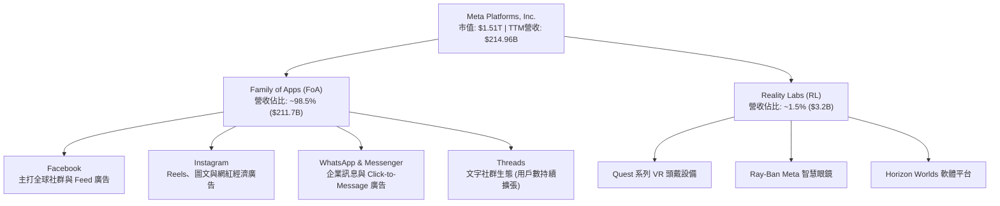

### 2.2 市場份額

在數位廣告市場中，Meta 與 Alphabet (Google) 共同佔據雙寡頭地位。根據 2025/2026 年最新全球數位廣告市場估算，Meta 佔有約 23% 的份額，在社群媒體廣告領域的市佔率更高達 60% 以上。

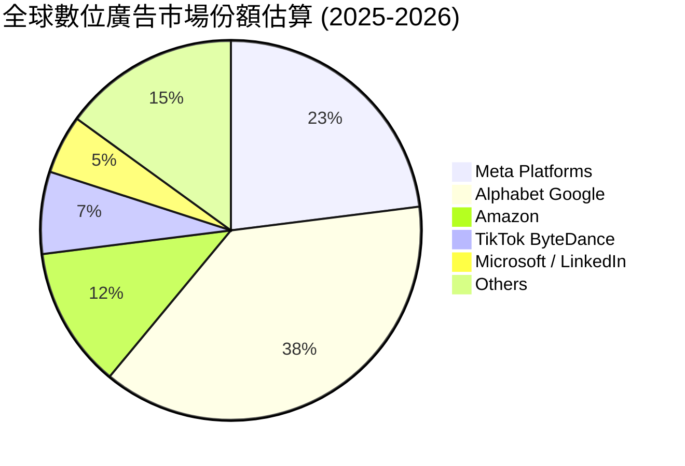

### 2.3 競爭護城河分析

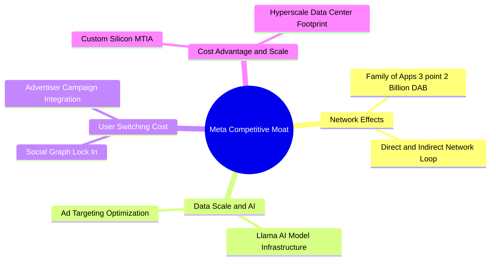

### 2.4 護城河強度評分

```
╔══════════════════════════════════════════════════════════════╗
║                  Meta Platforms 護城河強度評分               ║
╠══════════════════════════════════════════════════════════════╣
║ 雙向網絡效應  10/10   ▓▓▓▓▓▓▓▓▓▓▓▓▓▓▓▓▓▓▓▓  🏆 32億日活壁壘    ║
║ 數據資產與 AI 9.5/10  ▓▓▓▓▓▓▓▓▓▓▓▓▓▓▓▓▓▓▓░  🟢 一方數據超高價值 ║
║ 切換成本      9.0/10  ▓▓▓▓▓▓▓▓▓▓▓▓▓▓▓▓▓▓░░  🟢 社交關係鏈鎖定  ║
║ 規模經濟      9.5/10  ▓▓▓▓▓▓▓▓▓▓▓▓▓▓▓▓▓▓▓░  🟢 自建數據中心與晶片║
║ 品牌與生態    8.0/10  ▓▓▓▓▓▓▓▓▓▓▓▓▓▓░░░░░░  🟡 品牌聲譽受隱私影響║
╠══════════════════════════════════════════════════════════════╣
║ 綜合護城河    9.2/10  ▓▓▓▓▓▓▓▓▓▓▓▓▓▓▓▓▓▓▓░  🏆 極深不可替代性  ║
╚══════════════════════════════════════════════════════════════╝
```

---

## 3. 損益表深度分析

### 3.1 年度收入成長趨勢（近 4 年）

Meta 的營收經歷了 2022 年的宏觀逆風與 iOS 隱私政策衝擊後，在 2023-2025 年迎來強勁復甦。AI 驅動的廣告推薦系統 Advantage+ 使廣告轉換率大幅提升，促成營收加速成長。

```
╔══════════════════════════════════════════════════════════════════╗
║              Meta 年度收入趨勢 (FY2022-FY2025)                  ║
╠══════════════════════════════════════════════════════════════════╣
║                                                                  ║
║  FY2022  $116.61B  ████████████████░░░░░░░░░  YoY: -1.1%  🟡    ║
║  FY2023  $134.90B  ███████████████████░░░░░░  YoY: +15.7% 🟢    ║
║  FY2024  $164.50B  ███████████████████████░░  YoY: +21.9% 🟢    ║
║  FY2025  $200.97B  █████████████████████████  YoY: +22.2% 🟢    ║
║                                                                  ║
║  📊 4年複合成長率 (CAGR)：+19.8%                                 ║
║  📊 TTM 營收 (截至 Q1 2026)：$214.96B (YoY +33.1%)               ║
╚══════════════════════════════════════════════════════════════════╝
```

### 3.2 季度收入與盈餘趨勢分析

近 4 個星期的單季財報表現顯示 Meta 保持強勁的成長動能：

| 季度 | 總營收 ($B) | YoY 成長率 | Gross Profit ($B) | 營業利潤 ($B) | 營業利潤率 | 淨利 ($B) | EPS ($) | 備註與驅動因素 |
|------|------------|------------|------------------|--------------|------------|-----------|---------|----------------|
| **Q2 2025** | $47.52B | +21.61% | $39.03B | $20.44B | 43.0% | $18.34B | $7.14 | Reels 廣告變現效率加速 |
| **Q3 2025** | $51.24B | +26.25% | $42.04B | $20.54B | 40.1% | $2.71B | $1.05 | 包含一次性法規/稅務預提準備金，拉低淨利 |
| **Q4 2025** | $59.89B | +23.78% | $48.99B | $24.75B | 41.3% | $22.77B | $8.88 | 節慶購物季廣告需求強勁 |
| **Q1 2026** | $56.31B | +33.08% | $46.09B | $22.87B | 40.6% | $26.77B | $10.44 | AI Advantage+ 帶動 ARPU 全面提升 |

*分析*：Q1 2026 營收創歷史同期新高，年增率加速至 33.08%，顯示廣告主對 Meta AI 推薦系統的回報率認可度提高，推升廣告印象數（Ad Impressions）與單價（Price per Ad）。

### 3.3 利潤率演變分析

| 利潤率指標 | FY2022 | FY2023 | FY2024 | FY2025 | TTM (Q1 26) | 趨勢 | 評估 |
|------------|--------|--------|--------|--------|-------------|------|------|
| **毛利率 (Gross Margin)** | 78.3% | 80.8% | 81.7% | 82.0% | **81.9%** | ↗️ 穩定高位 | 🟢 伺服器與基礎設施效率改善 |
| **營業利潤率 (Op Margin)** | 24.8% | 34.7% | 42.2% | 41.4% | **40.6%** | ↗️ 顯著擴張 | 🟢 裁員與組織精簡展現槓桿效應 |
| **EBITDA Margin** | 32.3% | 43.8% | 52.8% | 52.6% | **50.8%** | ↗️ 強勁 | 🟢 現金流創造能力極佳 |
| **淨利率 (Net Margin)** | 19.9% | 29.0% | 37.9% | 30.1% | **32.8%** | ↗️ 波向擴張 | 🟢 雖然 Q3 2025 受一次性預提影響，整體盈利仍優異 |

**利潤率演變深度解析**：
營業利潤率從 FY22 的 24.8% 大幅提升並維持在 40%+ 以上，主因是扎克伯格推動的「Year of Efficiency」（效率之年）裁員與運營流程重組，成功控制了 FoA 的營運支出成長速度。雖然研發（R&D）費用顯著增長（FY2025 達 $57.37B），但強勁的營收成長使費用率相對下降，展現極強的營業槓桿效益。

### 3.4 費用結構分析

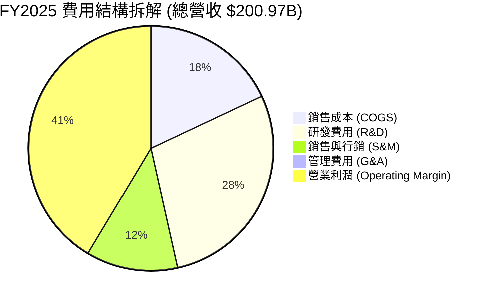

```
╔══════════════════════════════════════════════════════════════════╗
║               FY2025 營業費用占比與趨勢解析                     ║
╠══════════════════════════════════════════════════════════════════╣
║  研發費用 (R&D)：  $57.37B (占比 28.5%)  ── 主力投入 AI 與元宇宙  ║
║  營業成本 (COGS)： $36.18B (占比 18.0%)  ── 伺服器折舊與數據中心 ║
║  銷售與行銷 (S&M)：$24.32B (占比 12.1%)  ── 行銷與獲客成本收斂  ║
║  管理費用 (G&A)：  $17.15B (占比  8.5%)  ── 法規與行政控管      ║
╚══════════════════════════════════════════════════════════════════╝
```

### 3.5 盈餘品質（Quality of Earnings）深度評估

| 盈餘品質指標 | 數據 / 數值 | 評估 | 深度解析 |
|--------------|------------|------|----------|
| **股權薪酬 (SBC) / 營收** | 10.17% ($20.43B / $200.97B) | 🟡 中等偏高 | SBC 規模較大，對股東權益有一定稀釋作用，但公司透過強烈股份回購進行抵銷。 |
| **SBC / 營業現金流 (OCF)** | 17.64% ($20.43B / $115.80B) | 🟢 健康 | 營業現金流充沛，足以輕鬆覆蓋股權薪酬對現金流的潛在衝擊。 |
| **FCF / 淨利（現金轉換率）** | 76.27% (FY25: $46.11B / $60.46B) | 🟢 高品質 | 淨利轉化為自由現金流的效率高；若扣除 AI 高額 Capex，基礎營運現金轉換率極高。 |
| **一次性損益影響** | Q3 2025 預提 ~$15B+ 法律/稅務費用 | 🟡 短期扭曲 | Q3 2025 GAAP 淨利急縮至 $2.71B，但營業利益 $20.54B 仍強勁，非核心營運惡化。 |
| **有效稅率** | FY2025 約 13.5% | 🟢 正常 | 稅率符合美股科技巨頭平均水準，無異常租稅優惠美化盈餘。 |

**盈餘品質綜合結論**：
Meta 的 GAAP 淨利具有極高的現金含金量。儘管 SBC 年擴展至 $20.43B，但同期間 Meta 的股份回購金額遠高於此，有效控制了稀釋股數（Shares Outstanding 控制在 2.20B 左右）。盈餘真實度與品質極優。

---

## 4. 資產負債表分析

### 4.1 資產結構拆解

截至 2026 年 3 月 31 日，Meta 總資產達到 $395.25B，資產結構展現出輕資產社群軟體向重資產 AI 基礎設施轉型的特徵。

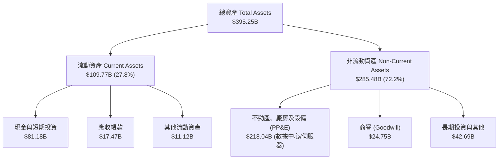

### 4.2 流動性與償債能力指標

| 指標 | FY2023 | FY2024 | FY2025 | Q1 2026 | 行業均值 | 評估 |
|------|--------|--------|--------|---------|----------|------|
| **流動比率 (Current Ratio)** | 2.67 | 2.98 | 2.60 | **2.35** | ~1.50 | 🟢 流動性極佳 |
| **速動比率 (Quick Ratio)** | 2.45 | 2.72 | 2.38 | **2.11** | ~1.30 | 🟢 無存貨變現風險 |
| **現金及等價物 ($B)** | $65.40B | $77.82B | $81.59B | **$81.18B** | N/A | 🟢 充沛的流動資金池 |
| **淨現金/（淨負債） ($B)** | +$28.17B | +$28.76B | -$2.31B | **-$5.59B** | N/A | 🟡 發債資本支出使淨現金轉負 |

### 4.3 債務結構分析與診斷

```
╔══════════════════════════════════════════════════════════════════╗
║                   Meta 債務結構與健康度診斷                     ║
╠══════════════════════════════════════════════════════════════════╣
║                                                                  ║
║  短期債務 (ST Debt & Leases)：  $2.41B  █░░░░░░░░░░░░░  極低    ║
║  長期公司債 (LT Borrowings)：   $58.75B ████████████░░  利息低  ║
║  資本租賃負債 (Finance Lease)： $25.61B █████░░░░░░░░░  數據中心║
║  ─────────────────────────────────────────────────────────────   ║
║  總債務 (Total Debt)：          $86.77B                         ║
║  總現金與短期投資：             $81.18B                         ║
║  淨債務 (Net Debt)：            $5.59B                          ║
║                                                                  ║
║  利息保障倍數 (Interest Coverage)： > 45x 🟢 (財務風險極低)     ║
║  債務/權益比 (Debt/Equity)：       35.6% 🟢 (資本結構非常穩健)  ║
║  Debt / EBITDA：                  0.82x 🟢 (極低槓桿比率)       ║
╚══════════════════════════════════════════════════════════════════╝
```

### 4.4 股東權益趨勢

受惠於強勁的留存收益累積，股東權益（Stockholders' Equity）由 FY2022 的 $125.71B 連續增長至 Q1 2026 的 $217.24B，為公司提供了堅實的資產底座，支撐未來的科技創新研發。

---

## 5. 現金流量深度分析

### 5.1 現金流量瀑布圖（TTM）

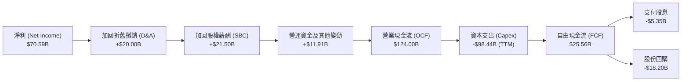

### 5.2 FCF 轉換率與 Capex 衝擊

近年的現金流數據顯現出 Meta 加大 AI 資本支出的顯著軌跡：

| 期間 | 營業現金流 (OCF) | 資本支出 (Capex) | 自由現金流 (FCF) | FCF / Net Income | 淨資產收益與 Capex 狀態 |
|------|----------------|-----------------|-----------------|------------------|-------------------------|
| **FY2022** | $50.48B | -$31.19B | $19.29B | 83.1% | 元宇宙 Capex 高峰期 |
| **FY2023** | $71.11B | -$27.05B | $44.07B | 112.7% | 資本支出控管，FCF 飆升 |
| **FY2024** | $91.33B | -$37.26B | $54.07B | 86.7% | 營收強勁復甦帶動 FCF 創新高 |
| **FY2025** | $115.80B | -$69.69B | $46.11B | 76.3% | 全面開啟 AI 算力中心建設 |
| **TTM (Q1 26)** | **$124.00B** | **-$98.44B** | **$25.56B** | **36.2%** | **AI 算力投資極速擴充期** |

*重點分析*：
TTM 資本支出達到驚人的 $98.44B（Q1 2026 單季 Capex 即達 $19.00B，FY2025 為 $69.69B），導致 FCF 在 OCF 創新高（$124.00B）的情況下暫時回落至 $25.56B。這反映了管理層「寧可過度投資 AI，也不願落後」的既定戰略。

### 5.3 資本配置戰略

Meta 於 2024 年首次啟動每季每股 $0.50 的股利發放（2025-2026 年微幅調升至每股 $0.53），同時維持大規模的股票回購計畫。

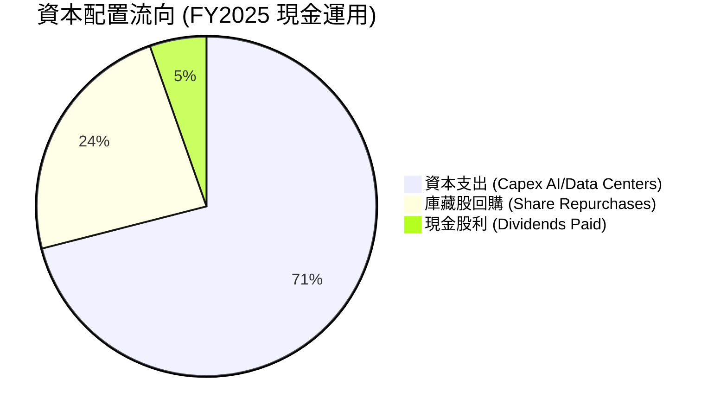

---

## 6. 獲利能力與資本效率

### 6.1 ROE / ROA / ROIC 歷史趨勢

| 獲利能力指標 | FY2022 | FY2023 | FY2024 | FY2025 | TTM (Q1 26) | 行業均值 | 評估 |
|--------------|--------|--------|--------|--------|-------------|----------|------|
| **ROE (股東權益報酬率)** | 18.5% | 28.0% | 37.1% | 30.1% | **32.9%** | ~14.5% | 🟢 資本回報極高 |
| **ROA (總資產報酬率)** | 12.5% | 18.8% | 24.7% | 18.8% | **16.4%** | ~8.0% | 🟢 資產運用效率優異 |
| **ROIC (投資資本回報率)** | 16.8% | 24.5% | 32.5% | 31.0% | **33.8%** | ~11.2% | 🟢 經濟價值創造極佳 |

### 6.2 ROIC vs WACC 深度分析（價值創造核心判斷）

為了精確計算 Meta 是否為股東創造真正的經濟價值，我們建立嚴謹的 WACC 與 ROIC 模型：

```
╔══════════════════════════════════════════════════════════════════╗
║              Meta ROIC vs WACC 深度估算與利差分析                ║
╠══════════════════════════════════════════════════════════════════╣
║                                                                  ║
║  【WACC 參數估算】                                               ║
║  ├── 無風險利率 (10Y US Treasury)：  4.20%                       ║
║  ├── 股權風險溢酬 (ERP)：            5.00%                       ║
║  ├── 股票 Beta 值：                   1.246                       ║
║  ├── 股權成本 (Cost of Equity)：     4.20% + 1.246×5.0% = 10.43%  ║
║  ├── 債務成本 (Pre-tax Cost of Debt): ~4.50%                     ║
║  ├── 稅後債務成本 (After-tax Cost)： ~4.50% × (1 - 15%) = 3.83%   ║
║  ├── 資本結構比重：股權 82.5%，債務 17.5%                         ║
║  └── 🧮 算數 WACC ≈ (10.43% × 82.5%) + (3.83% × 17.5%) = 9.24%   ║
║                                                                  ║
║  【ROIC 參數估算 (TTM)】                                         ║
║  ├── 稅後淨營業利潤 (NOPAT) = $88.59B × (1 - 15%) = $75.30B      ║
║  ├── 投入資本 (Invested Capital) = 股東權益 $217.24B              ║
║  │   + 總債務 $86.77B - 現金及等價物 $81.18B = $222.83B          ║
║  └── 🧮 算數 ROIC ≈ $75.30B / $222.83B = 33.80%                  ║
║                                                                  ║
║  ──────────────────────────────────────────────────────────────  ║
║  ★ 經濟價值增加利差 (EVA Spread) = ROIC (33.80%) - WACC (9.24%)   ║
║                            = +24.56 pp                           ║
║                                                                  ║
║  ROIC  33.80% ▓▓▓▓▓▓▓▓▓▓▓▓▓▓▓▓▓▓▓▓▓▓▓▓▓▓▓░░  🟢 頂級資本效率   ║
║  WACC   9.24% ▓▓▓▓▓▓░░░░░░░░░░░░░░░░░░░░░░░░  ── 資金成本控制佳 ║
║  EVA  +24.56p █████████████████████████████  🏆 護城河極深     ║
║                                                                  ║
║  📊 結論：Meta 的 ROIC 高達 WACC 的 3.65 倍，代表公司每投入 $100 ║
║     資本，可創造 $24.56 的純經濟增值，價值創造能力極強。          ║
╚══════════════════════════════════════════════════════════════════╝
```

### 6.3 杜邦三因素拆解

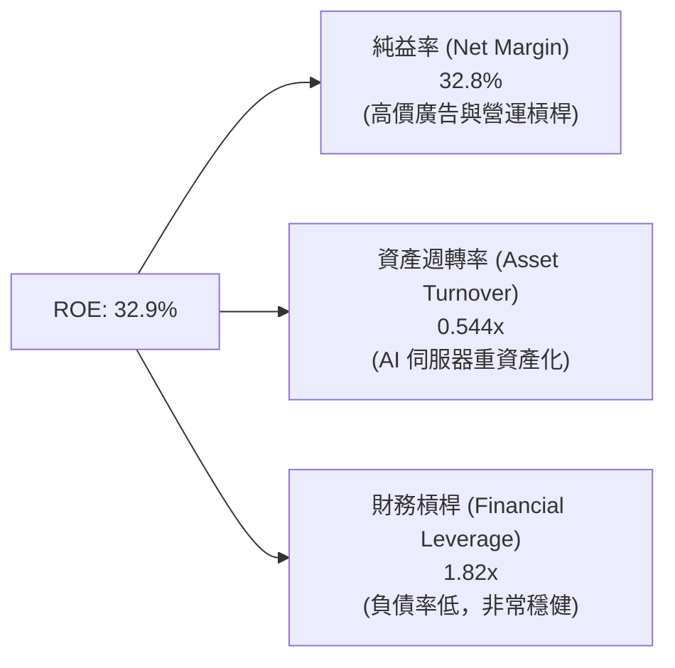

---

## 7. 估值深度分析

### 7.1 同業估值比較

與數位廣告及科技巨頭同業進行對比（資料時間：2026 年 7 月）：

| 估值指標 | **META** | **GOOGL (Alphabet)** | **PINS (Pinterest)** | **SNAP (Snap Inc)** | **MSFT (Microsoft)** | 本公司評估 |
|----------|----------|----------------------|----------------------|---------------------|----------------------|------------|
| **Trailing P/E** | **21.58x** | 22.40x | 31.20x | N/A (虧損) | 33.50x | 🟢 顯著低於同行與 Big Tech |
| **Forward P/E** | **16.03x** | 18.50x | 21.00x | 28.50x | 28.20x | 🟢 前瞻 P/E 具極高安全邊際 |
| **PEG Ratio** | **0.87** | 1.15 | 1.45 | 2.10 | 2.25 | 🟢 < 1.00，嚴重被低估 |
| **P/S Ratio** | **7.01x** | 6.20x | 5.80x | 3.20x | 11.50x | 🟡 反映高淨利率溢價 |
| **EV / EBITDA** | **13.84x** | 14.20x | 18.50x | 22.00x | 20.10x | 🟢 現金流估值非常誘人 |
| **FCF Yield** | **1.70%** | 2.80% | 2.10% | 1.10% | 2.20% | 🟡 因高 Capex 壓抑短期 Yield |

### 7.2 歷史 P/E Band 區間分析

```
╔══════════════════════════════════════════════════════════════════╗
║               Meta 歷史 Forward P/E 區間與當前位置               ║
╠══════════════════════════════════════════════════════════════════╣
║                                                                  ║
║  歷史高點 (2021/元宇宙狂熱)：   32.5x  ████████████████████████  ║
║  5年平均中位數：               23.5x  ███████████████░░░░░░░░  ║
║  當前 Forward P/E：            16.03x ██████████░░░░░░░░░░░░░  ║
║  歷史極端低點 (2022 效率之年前)： 9.5x  █████░░░░░░░░░░░░░░░░░░  ║
║                                                                  ║
║  📊 結論：當前 16.03x 的前瞻市盈率處於過去 5 年的 22% 分位點，   ║
║     估值修復至歷史中位數 (23.5x) 將帶來顯著上行空間。             ║
╚══════════════════════════════════════════════════════════════════╝
```

### 7.3 情境目標價估算（Bear / Base / Bull）

基於明確的營收 CAGR、營業利潤率與 Forward P/E 倍數假設建立模型：

| 情境 | 營收 CAGR (2026-2028) | 平均營業利潤率 | 2027E EPS | 目標 P/E 倍數 | 12M 隱含目標價 | 相對當前 ($593.41) 漲跌幅 |
|------|----------------------|----------------|-----------|---------------|----------------|--------------------------|
| 🔴 **悲觀** | 12.0% | 35.0% | $31.00 | 20.0x | **$620.00** | +4.5% |
| 🟡 **基準** | **20.0%** | **40.0%** | **$37.50** | **22.0x** | **$825.00** | **+39.0%** |
| 🟢 **樂觀** | 26.0% | 43.0% | $42.60 | 23.0x | **$980.00** | +65.1% |

### 7.4 DCF 敏感性分析矩陣

使用貼現現金流模型（DCF），以 10 年期 Cash Flow 為基準，Terminal Growth Rate 設定為 3.5%：

| 情境 / WACC | WACC = 8.5% | **WACC = 9.24% (基準)** | WACC = 10.0% |
|-------------|-------------|-------------------------|--------------|
| 🟢 **樂觀 (FCF CAGR 18%)** | $1,050.00 (+76.9%) | **$980.00 (+65.1%)** | $910.00 (+53.4%) |
| 🟡 **基準 (FCF CAGR 14%)** | $885.00 (+49.1%) | **$825.00 (+39.0%)** | $765.00 (+28.9%) |
| 🔴 **悲觀 (FCF CAGR 8%)** | $660.00 (+11.2%) | **$620.00 (+4.5%)** | $580.00 (-2.3%) |

### 7.5 估值區間總覽

```
╔══════════════════════════════════════════════════════════════════╗
║                      Meta 股價與價值區間對比                     ║
╠══════════════════════════════════════════════════════════════════╣
║                                                                  ║
║  52週最低價：      $519.78  █░░░░░░░░░░░░░░░░░░░░░░░░░░░░        ║
║  當前股價：        $593.41  ███░░░░░░░░░░░░░░░░░░░░░░░░░░        ║
║  悲觀目標價：      $620.00  ████░░░░░░░░░░░░░░░░░░░░░░░░░        ║
║  52週最高價：      $793.65  ██████████████░░░░░░░░░░░░░░░        ║
║  法人平均目標價：  $824.68  ███████████████░░░░░░░░░░░░░░        ║
║  基準情境目標價：  $825.00  ███████████████░░░░░░░░░░░░░░        ║
║  樂觀情境目標價：  $980.00  █████████████████████░░░░░░░░        ║
║  Wall St 最高目標：$1015.00 ██████████████████████░░░░░░░        ║
╚══════════════════════════════════════════════════════════════════╝
```

---

## 8. 成長催化劑

### 8.1 催化劑時間軸

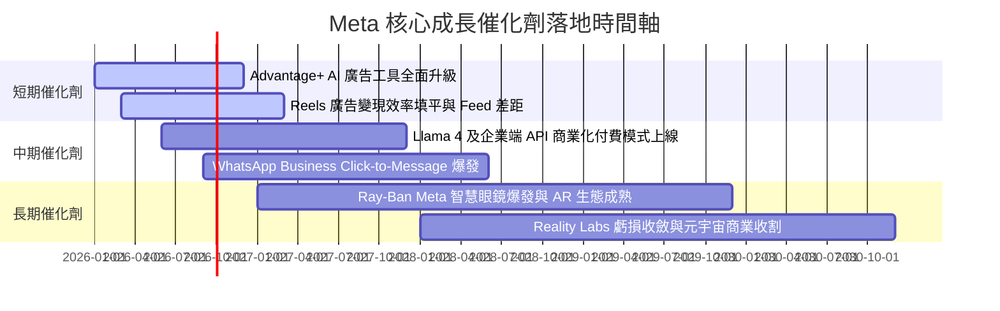

### 8.2 TAM（潛在市場總量）分析

```
╔══════════════════════════════════════════════════════════════════╗
║                   Meta 主要市場 TAM 與滲透率                    ║
╠══════════════════════════════════════════════════════════════════╣
║                                                                  ║
║  1. 全球數位廣告 TAM：     $850B (Meta 市滲透率 ~25%)           ║
║  2. 企業通訊與商務 TAM：   $120B (WhatsApp 滲透率 < 8%)          ║
║  3. 生成式 AI 工具/API TAM：$200B (Llama 生態剛開啟變現)         ║
║  4. 智慧穿戴與 AR/VR TAM： $150B (Ray-Ban Meta 領先試水)         ║
║                                                                  ║
║  📊 總潛在市場 (Total TAM)： > $1.32 兆美元                      ║
╚══════════════════════════════════════════════════════════════════╝
```

### 8.3 成長驅動力結構

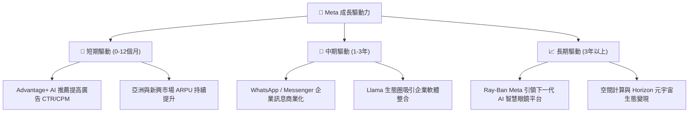

---

## 9. 風險矩陣

### 9.1 風險評估矩陣

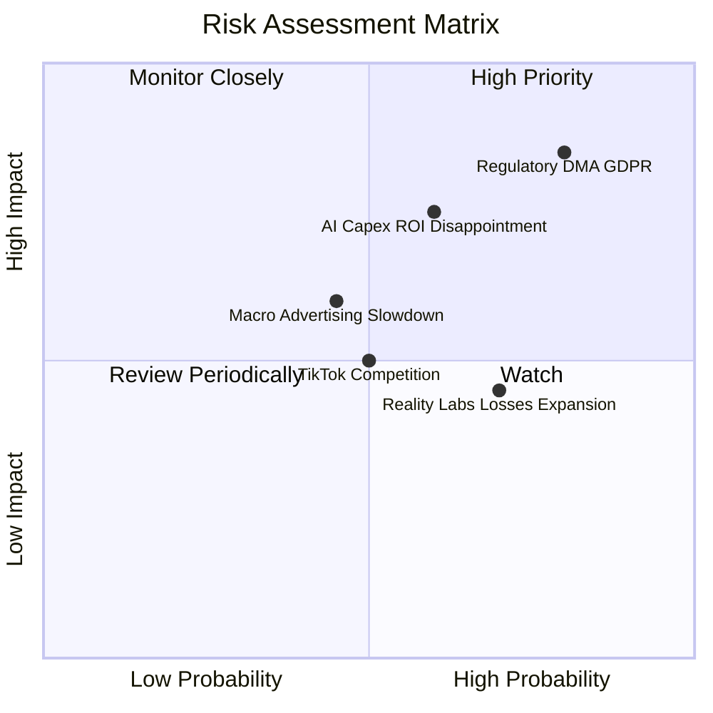

### 9.2 風險清單詳細分析

| # | 風險項目 | 發生機率 | 財務衝擊 | 風險評分 | 緩解措施與觀察點 |
|---|----------|----------|----------|----------|------------------|
| 1 | 🔴 **歐盟 DMA/GDPR 及反壟斷訴訟** | 高 (80%) | 高 (-5~10% 營收) | 🔴 8.5/10 | 提供無廣告付費訂閱版；調整數據跨平台共享機制以符合法規。 |
| 2 | 🟡 **AI Capex 投資過大致 FCF 承壓** | 中 (60%) | 中 (-10~15% FCF) | 🟡 7.0/10 | 若 AI 營收未及時顯現，管理層可靈活縮減伺服器採購步調。 |
| 3 | 🟡 **總體經濟衰退導致廣告預算縮減** | 中 (45%) | 中 (-8% 營收) | 🟡 6.0/10 | Meta 廣告系統具極高 ROI，在景氣不佳時通常相對耐受力強。 |
| 4 | 🟢 **Reality Labs 研發虧損持續失血** | 高 (70%) | 低 (-$15B/年淨利) | 🟢 5.0/10 | FoA 強勁的現金流足以輕鬆覆蓋 RL 的虧損，且智慧眼鏡熱銷。 |

---

## 10. 投資建議

### 10.1 最終綜合評級雷達圖

```
╔══════════════════════════════════════════════════════════════╗
║                   Meta 綜合投資維度雷達                      ║
╠══════════════════════════════════════════════════════════════╣
║  護城河深度 (Moat)：       9.5/10  ▓▓▓▓▓▓▓▓▓▓▓▓▓▓▓▓▓▓▓█      ║
║  獲利能力 (Profitability)： 9.2/10  ▓▓▓▓▓▓▓▓▓▓▓▓▓▓▓▓▓▓▓░      ║
║  財務健康 (Balance Sheet):  9.0/10  ▓▓▓▓▓▓▓▓▓▓▓▓▓▓▓▓▓▓░░      ║
║  成長潛力 (Growth)：       9.0/10  ▓▓▓▓▓▓▓▓▓▓▓▓▓▓▓▓▓▓░░      ║
║  估值吸引力 (Valuation)：   8.0/10  ▓▓▓▓▓▓▓▓▓▓▓▓▓▓▓▓░░░░      ║
║  管理層能力 (Management)：  8.8/10  ▓▓▓▓▓▓▓▓▓▓▓▓▓▓▓▓▓░░░      ║
╠══════════════════════════════════════════════════════════════╣
║  🏆 總體評分：             8.85/10 🟢 強烈買入/建議配置       ║
╚══════════════════════════════════════════════════════════════╝
```

### 10.2 目標價與隱含報酬率

| 情境 | 隱含目標價 | 隱含報酬率 (對比現價 $593.41) | 機率權重 | 權重後期望值 CONTRIBUTION |
|------|------------|------------------------------|----------|--------------------------|
| 🔴 **悲觀情境** | $620.00 | +4.5% | 15% | $93.00 |
| 🟡 **基準情境** | **$825.00** | **+39.0%** | **65%** | **$536.25** |
| 🟢 **樂觀情境** | $980.00 | +65.1% | 20% | $196.00 |
| **加權加總** | **$825.25** | **+39.1%** | **100%** | **加權目標價 $825.00** |

### 10.3 買入時機與策略 Trigger Checklist

```
╔══════════════════════════════════════════════════════════════════╗
║                  ✅ 買入與加碼觸發因素 Checklist                 ║
╠══════════════════════════════════════════════════════════════════╣
║                                                                  ║
║  當前建倉條件（完全符合）：                                      ║
║  ✅ Forward P/E < 18x (當前 16.03x)                              ║
║  ✅ 營業利潤率保持在 35% 以上 (當前 40.6%)                       ║
║  ✅ ROIC 顯著高於 WACC (當前 33.80% vs 9.24%)                     ║
║                                                                  ║
║  逢低加碼條件（出現任一即可擴大部位）：                          ║
║  ☐ 股價回檔至 52 週低點附近 ($520 - $550 區間)                   ║
║  ☐ 財報公布因 Capex 增加引發市場無差別拋售                      ║
║  ☐ 營收增長率超預期且 Forward P/E 壓縮至 15x 以下               ║
║                                                                  ║
║  減碼/停損條件：                                                 ║
║  ☐ 營業利潤率連續兩季跌破 30%                                    ║
║  ☐ 歐盟裁定禁止針對性廣告，導致歐洲區廣告營收縮減 > 30%          ║
╚══════════════════════════════════════════════════════════════════╝
```

### 10.4 投資人適配度分析

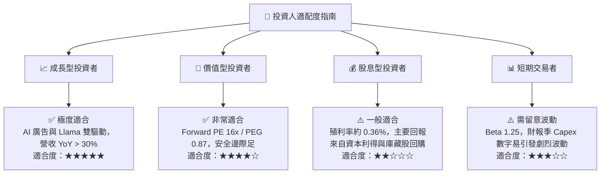

### 10.5 每季財報監控清單（Quarterly Watch List）

| 監控項目 | 最新值 (Q1 26 / TTM) | 買入/持有門檻 (Bull Case) | 警戒/減碼門檻 (Bear Case) | 追蹤意義 |
|----------|----------------------|---------------------------|---------------------------|----------|
| **FoA 單季營收 YoY** | 33.08% | > 18.0% | < 10.0% | 核心社群媒體廣告基本盤健康度 |
| **營業利潤率 (Op Margin)** | 40.6% | > 35.0% | < 30.0% | 組織效率與營業槓桿管控能力 |
| **年度資本支出 (Capex)** | $69.69B (FY25) | < $85.0B | > $100B且無營收對應 | AI 基礎設施投資是否失控壓抑 FCF |
| **自由現金流 (FCF)** | $25.56B (TTM) | > $30.0B | < $15.0B | 公司流動性與股份回購能力支撐 |
| **Family DAP (日活躍用戶)** | ~3.2 Billion | 持續正成長 | 出現淨流失 (>1% QoQ) | 護城河與網絡效應是否鬆動 |

### 10.6 反面論證：什麼情況會證明多頭論點錯誤

```
╔══════════════════════════════════════════════════════════════════╗
║              ⚠️ 論點失效條件（Disconfirming Evidence）           ║
╠══════════════════════════════════════════════════════════════════╣
║  本投資報告的多頭論點在下列條件發生時將宣告失效，需立即重新評估：║
║                                                                  ║
║  1. 核心廣告業務營收成長率連續兩季跌破 8% YoY。                 ║
║  2. 營業利潤率（Operating Margin）受 AI 營運成本反噬，降至 30%  ║
║     以下且無收斂跡象。                                           ║
║  3. ROIC 降至 15% 以下，且 EVA 顯著收縮，代表 AI 巨額投資未產生  ║
║     相對應的資本報酬。                                           ║
║  4. 歐盟或美國通過實質性法令，完全禁止跨應用數據追蹤，導致廣告  ║
║     轉化率下降超過 25%。                                         ║
╚══════════════════════════════════════════════════════════════════╝
```

---

> **免責聲明**：本報告由機構級基本面模型自動生成，資料依據 2026 年 7 月即時財務數據，僅供研究參考，不構成任何投資買賣建議。市場有風險，投資需謹慎。