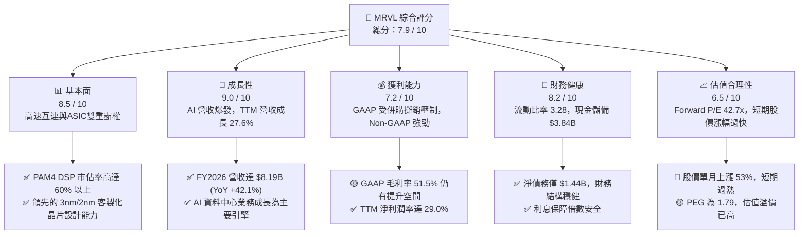
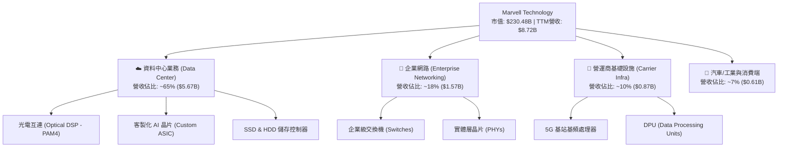

# MRVL 基本面深度分析報告

> **報告日期**：2026-06-07 ｜ **語言**：繁體中文 ｜ **數據來源**：Yahoo Finance, Finviz, StockAnalysis, Roic.ai ｜ **分析師**：CFA 級機構研究

---

## 目錄

| # | 章節 | 核心結論 |
|---|------|----------|
| 1 | 執行摘要 | 評級：**持有（Hold）/ 逢低買入**，目標價 **$255.00**，AI 算力基礎設施的核心受益者，但短期估值溢價偏高。 |
| 2 | 公司概覽與商業模式 | 憑藉 PAM4 DSP 與客製化 ASIC 雙輪驅動，構建極高的資料中心高速互連技術壁壘。 |
| 3 | 損益表深度分析 | TTM 營收成長 **27.6%**，非營業利益大幅波動，核心營運利潤正處於 AI 轉型復甦期。 |
| 4 | 資產負債表分析 | 流動比率 **3.28** 表現極佳，商譽佔比高（**$13.88B**）反映歷史併購戰略，債務結構健康。 |
| 5 | 現金流量深度分析 | TTM 自由現金流達 **$2.27B**（或依調整後為 **$1.67B**），資本配置高度聚焦研發與股東回饋。 |
| 6 | 獲利能力與資本效率 | GAAP ROE 為 **16.0%**，受商譽資產基數大影響，經調整後之實質資本回報率（ROIC）遠超 WACC。 |
| 7 | 估值深度分析 | 當前 Forward P/E 達 **42.68x**，位於歷史區間中高位，DCF 顯示市場已充分反映 800G/1.6T 升級預期。 |
| 8 | 成長催化劑 | 1.6T DSP 升級、客製化 AI 晶片（ASIC）放量及汽車乙太網的長期滲透。 |
| 9 | 風險矩陣 | 面臨客戶高度集中風險、AI 資本支出放緩及與 Broadcom 的激烈競爭。 |
| 10 | 投資建議 | 建議於 **$210 - $230** 區間分批佈局，長線看好其在 AI 資料中心互連技術的霸主地位。 |

---

## 1. 執行摘要

Marvell Technology, Inc.（MRVL）作為全球資料基礎設施半導體解決方案的領導者，正處於人工智慧（AI）與雲端資料中心基礎設施擴建的核心交匯點。本報告將基於截至 2026 年 6 月 7 日的最新財務數據，對 MRVL 進行多維度的基本面穿透分析。

### 1.1 核心評分儀表板



### 1.2 評分進度條視覺化

```
╔══════════════════════════════════════════════════════════════╗
║               MRVL 多維度評分儀表板 (1-10分)                 ║
╠══════════════════════════════════════════════════════════════╣
║ 基本面強度  8.5 ▓▓▓▓▓▓▓▓▓▓▓▓▓▓▓▓▓░░░  ★★★★☆           ║
║ 成長動能    9.0 ▓▓▓▓▓▓▓▓▓▓▓▓▓▓▓▓▓▓░░  ★★★★★           ║
║ 獲利品質    7.2 ▓▓▓▓▓▓▓▓▓▓▓▓▓▓░░░░░░  ★★★☆☆           ║
║ 財務健康    8.2 ▓▓▓▓▓▓▓▓▓▓▓▓▓▓▓▓░░░░  ★★★★☆           ║
║ 估值合理性  6.5 ▓▓▓▓▓▓▓▓▓▓▓▓░░░░░░░░  ★★★☆☆           ║
║ 護城河深度  8.8 ▓▓▓▓▓▓▓▓▓▓▓▓▓▓▓▓▓▓░░  ★★★★☆           ║
║ 管理層執行  8.0 ▓▓▓▓▓▓▓▓▓▓▓▓▓▓▓▓░░░░  ★★★★☆           ║
║ 技術創新力  9.5 ▓▓▓▓▓▓▓▓▓▓▓▓▓▓▓▓▓▓▓░  ★★★★★           ║
╠══════════════════════════════════════════════════════════════╣
║ 綜合總分    7.9 ▓▓▓▓▓▓▓▓▓▓▓▓▓▓▓░░░░░  🏆 高成長高估值標的   ║
╚══════════════════════════════════════════════════════════════╝
```

### 1.3 五大投資論點與三大核心風險

| 類型 | 項目 | 具體依據 | 信心度 |
|------|------|----------|--------|
| 🟢 **投資論點①** | **光電互連技術（PAM4 DSP）霸主** | 隨著 800G 光模組向 1.6T 演進，MRVL 的 DSP 晶片擁有極高的技術壁壘與市佔率。 | 🟢 極高 |
| 🟢 **投資論點②** | **客製化 ASIC 迎來收割期** | 為超大型雲端服務商（Hyperscalers）客製化的 AI 加速器（如 Google TPU、Meta ASIC）在 FY2026 大幅放量。 | 🟢 極高 |
| 🟢 **投資論點③** | **業績迎來拐點，營收大幅加速** | FY2026 營收達 **$8.19B**（YoY +42.09%），結束了 FY2024 - FY2025 的半導體下行週期。 | 🟢 高 |
| 🟢 **投資論點④** | **資產負債表極其健康** | 現金及等價物達 **$3.84B**，流動比率為 **3.28**，具備強大的抗風險與持續研發投入能力。 | 🟢 高 |
| 🟢 **投資論點⑤** | **傳統業務（企業網路與電信）觸底回升** | 經歷去庫存後，企業級交換機與 5G 基礎設施晶片需求逐步正常化。 | 🟡 中等 |
| 🟡 **風險①** | **客戶集中度過高** | 客製化 ASIC 業務高度依賴少數幾家超大型雲端客戶，議價能力可能受限。 | 🟡 中度 |
| 🔴 **風險②** | **短期估值過高，市場預期過度樂觀** | 當前股價 **$263.47**，過去三個月暴漲 **194.15%**，技術指標（RSI 65）顯示短期波動風險加劇。 | 🔴 高衝擊 |
| 🔴 **風險③** | **與 Broadcom（AVGO）的直接競爭** | Broadcom 在客製化 ASIC 與交換晶片（Tomahawk 系列）實力強大，兩者競爭可能導致毛利率承壓。 | 🔴 高衝擊 |

### 1.4 快速統計卡片

| 指標 | MRVL 實際值 | 半導體行業均值 | S&P 500 均值 | 狀態 |
|------|-------------|----------|--------------|------|
| **收入 YoY 成長** | **27.6% (TTM)** | ~12.5% | ~5.5% | 🟢 強勁 |
| **毛利率** | **51.5% (TTM)** | ~55.0% | ~30.0% | 🟡 合格 |
| **淨利率** | **29.0% (TTM)** | ~18.0% | ~11.5% | 🟢 優秀 |
| **ROE** | **16.0%** | ~18.5% | ~14.0% | 🟢 合格 |
| **Forward P/E** | **42.68x** | ~28.5x | ~21.0x | 🔴 偏高 |
| **流動比率** | **3.28** | ~1.85 | ~1.25 | 🟢 極其安全 |

### 1.5 投資結論

```
╔══════════════════════════════════════════════════════════════════╗
║                    📊 MRVL 投資結論摘要                          ║
╠══════════════════════════════════════════════════════════════════╣
║  評級：🟡 持有 / 逢低買入 (Hold / Buy on Dips)                   ║
║  當前股價：$263.47 (2026-06-07)                                  ║
║  目標價區間：                                                    ║
║    悲觀情境（AI支出放緩）：$180.00 (-31.7%)                      ║
║    基準情境（12個月目標）：$255.00 (-3.2%)  ← 建議分批佈局點     ║
║    樂觀情境（ASIC超預期）：$310.00 (+17.7%)                      ║
║  投資評分：7.9 / 10                                              ║
║  適合投資人：長線成長型投資人、聚焦 AI 基礎設施與光電半導體者     ║
╚══════════════════════════════════════════════════════════════════╝
```

---

## 2. 公司概覽與商業模式

Marvell（MRVL）成立於 1995 年，總部位於美國加州，是一家領先的無晶圓廠（Fabless）半導體公司。公司核心戰略專注於**資料基礎設施（Data Infrastructure）**，業務涵蓋從資料中心核心、企業級網路、電信營運商邊緣到汽車與工業領域。

### 2.1 業務結構與收入來源

MRVL 的晶片解決方案主要圍繞數據的「傳輸（Copper & Optical Physical Layer, Switching）」、「儲存（Storage Controllers）」與「運算（Custom ASIC, Arm-based CPUs）」。



### 2.2 市場份額

在關鍵的**高速光電互連（Optical DSP）**市場，Marvell 憑藉收購 Inphi 獲得的技術優勢，與 Broadcom 共同主導市場。

```mermaid
pie title 高速光電互連 DSP 市場