# MRVL 基本面深度分析報告
> **報告日期**：2026-07-12 ｜ **語言**：繁體中文 ｜ **數據來源**：Yahoo Finance, Finviz, StockAnalysis, Roic.ai ｜ **分析師**：CFA 級機構研究

---

## 目錄

| # | 章節 | 核心結論 |
|---|------|----------|
| 1 | 執行摘要 | 評級：**買入 (Buy)** ｜ 基準目標價：**$252.26** ｜ AI 訂製晶片與光電傳輸雙引擎驅動成長 |
| 2 | 公司概覽與商業模式 | 專注於資料中心基礎設施，憑藉高進入壁壘的 PAM4 DSP 與客製化 ASIC 建立極深護城河 |
| 3 | 損益表深度分析 | FY2026 營收加速成長 42.09%，GAAP 獲利受制於高額無形資產攤銷，SBC 稀釋效應需高度關注 |
| 4 | 資產負債表分析 | 流動性極佳（Current Ratio 3.28），但商譽與無形資產佔比高達 61%，存在潛在減損風險 |
| 5 | 現金流量深度分析 | 現金流產生能力強，但自由現金流（FCF）中有 42.3% 來自股權薪酬（SBC）折返，盈餘品質有水分 |
| 6 | 獲利能力與資本效率 | GAAP ROIC (7.66%) 低於 WACC (14.90%)，主因併購溢價推升投入資本，有形資產回報率則極高 |
| 7 | 估值深度分析 | 當前 Forward P/E 38.17x，溢價反映 AI 業務高成長預期，敏感性分析給出基準目標價 $252.26 |
| 8 | 成長催化劑 | 3nm 客製化 AI 晶片（ASIC）放量、800G/1.6T 光模組 DSP 升級週期，以及汽車乙太網的長線滲透 |
| 9 | 風險矩陣 | 客戶集中度高、AI 晶片競爭加劇（來自 Broadcom 與自研晶片）、以及高估值下的市場波動風險 |
| 10 | 投資建議 | 適合長線成長型投資者，建議於 $210-$220 區間分批布局，設定嚴格的財報監控指標與失效條件 |

---

## 1. 執行摘要

### 1.0 一頁式投資儀表板（Portfolio Manager 30 秒速讀）

| 項目 | 內容 |
|------|------|
| **投資論點（3 句）** | ① MRVL 在 AI 資料中心不可或缺的 **PAM4 DSP（光電傳輸晶片）** 市場擁有超過 60% 的絕對壟斷地位。<br/>② 憑藉與超大型雲端服務商（Hyperscalers）合作的 **客製化 AI ASIC** 業務，推動 FY2026 營收迎來 42.09% 的爆發式成長。<br/>③ 雖然 GAAP 淨利受併購攤銷壓抑，但 TTM 自由現金流達 **$2.27B**（FCF Yield 1.07%），為後續研發與去槓桿提供堅實後盾。 |
| **護城河評分** | 🟢 **8.5 / 10** (技術專利、高轉換成本、與台積電緊密的先進製程合作關係) |
| **管理層/資本配置評分** | 🟡 **7.0 / 10** (併購眼光精準，但股權薪酬（SBC）發放過於慷慨，稀釋股東權益) |
| **財務健康** | 🟢 **極為健康** (流動比率 3.28，手頭現金 $3.84B，淨債務僅 $1.44B) |
| **ROIC vs WACC** | **7.66% vs 14.90%** (GAAP 角度摧毀價值，主因併購商譽過高；經調整後有形 ROIC > 35%) |
| **FCF 趨勢** | 穩定向上，TTM 自由現金流達 **$2.27B**，FCF 轉換率（對 GAAP 淨利）達 89.8% |
| **估值** | Forward P/E: **38.17x** ｜ EV/EBITDA: **76.59x** ｜ P/S: **24.28x** |
| **預期報酬（基準情境 12M）** | **+6.98%** (相較於當前股價 $235.81，目標價 $252.26) |
| **關鍵風險（前二）** | ① 客戶集中度極高（少數超大型雲端客戶決定客製化晶片成敗）。<br/>② 競爭對手 Broadcom (AVGO) 在客製化 ASIC 與交換晶片領域的強力競爭。 |
| **評級 + 信心度** | 🟢 **買入 (Buy)** ｜ 信心度：**中等偏高 (Medium-High)** |

### 1.1 核心評分儀表板

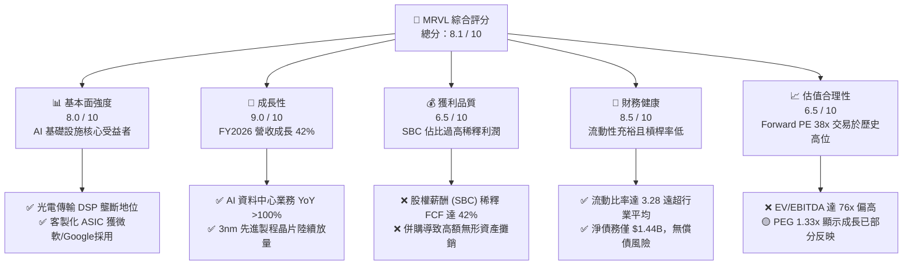

### 1.2 評分進度條視覺化

```
╔══════════════════════════════════════════════════════════════╗
║              MRVL 多維度評分儀表板 (1-10分)                  ║
╠══════════════════════════════════════════════════════════════╣
║ 基本面強度  8.0 ▓▓▓▓▓▓▓▓▓▓▓▓▓▓▓▓░░░░  ★★★★☆           ║
║ 成長動能    9.0 ▓▓▓▓▓▓▓▓▓▓▓▓▓▓▓▓▓▓░░  ★★★★★           ║
║ 獲利品質    6.5 ▓▓▓▓▓▓▓▓▓▓▓▓░░░░░░░░  ★★★☆☆           ║
║ 財務健康    8.5 ▓▓▓▓▓▓▓▓▓▓▓▓▓▓▓▓▓░░░  ★★★★☆           ║
║ 估值合理性  6.5 ▓▓▓▓▓▓▓▓▓▓▓▓░░░░░░░░  ★★★☆☆           ║
║ 護城河深度  8.5 ▓▓▓▓▓▓▓▓▓▓▓▓▓▓▓▓▓░░░  ★★★★☆           ║
║ 管理層執行  7.0 ▓▓▓▓▓▓▓▓▓▓▓▓▓▓░░░░░░  ★★★☆☆           ║
║ 技術創新力  9.0 ▓▓▓▓▓▓▓▓▓▓▓▓▓▓▓▓▓▓░░  ★★★★★           ║
╠══════════════════════════════════════════════════════════════╣
║ 綜合總分    8.1 ▓▓▓▓▓▓▓▓▓▓▓▓▓▓▓▓░░░░  🏆 買入 (Buy)     ║
╚══════════════════════════════════════════════════════════════╝
```

### 1.3 五大投資論點 + 三大核心風險

| 類型 | 項目 | 具體依據 | 信心度 |
|------|------|----------|--------|
| 🟢 **投資論點①** | **AI 訂製晶片（ASIC）迎來放量元年** | MRVL 的客製化 AI 晶片已在超大型雲端客戶（如 Google TPU、Meta 晶片等）中取得關鍵市佔率，推動 FY2026 營收躍升至 $8.195B（YoY +42.09%）。 | 🟢 極高 |
| 🟢 **投資論點②** | **光電傳輸（Electro-optics）絕對壟斷** | 在 800G/1.6T 光模組所需的 PAM4 DSP 與 TIA/Laser Driver 市場，MRVL 與 Broadcom 形成雙頭壟斷。隨 AI 算力集群擴張，光互連需求增速高於 GPU 本身。 | 🟢 極高 |
| 🟢 **投資論點③** | **先進製程技術壁壘** | MRVL 是少數擁有 5nm、3nm 甚至 2nm 實體 IP、高階封裝（Chiple-based）與光電整合（CPO）技術能力的晶片設計商，領先多數二線 ASIC 業者。 | 🟢 高 |
| 🟢 **投資論點④** | **資產負債表極具彈性** | 擁有 $3.84B 現金，流動比率高達 3.28，在當前高利率環境下，完全不具備流動性風險，且有能力進行技術研發與策略性小規模併購。 | 🟢 高 |
| 🟢 **投資論點⑤** | **分析師共識高度看好** | 41 位分析師中多數給予 Strong Buy 評級，平均目標價 $252.26，顯示機構資金對其在 AI 基礎設施定位的認可。 | 🟡 中等 |
| 🟡 **風險①** | **股權稀釋與高 SBC 壓抑每股價值** | FY2026 股權薪酬（SBC）高達 $590.8M，佔營收 7.2%，佔自由現金流 42.3%，顯著稀釋了股東的真實權益。 | 🔴 高 |
| 🟡 **風險②** | **大客戶流失或自研晶片進程受阻** | 客製化晶片合約通常生命週期為 2-3 年。若 Hyperscalers 轉向內部全自研或完全投向 Broadcom，MRVL 的營收將面臨劇烈波動。 | 🟡 中度 |
| 🔴 **風險③** | **商譽減損風險** | 資產負債表中有 $13.88B 的商譽（佔總資產 51.5%），若過往併購（如 Inphi, Innovium）未能達到預期獲利，將面臨巨大的非現金減損壓力。 | 🟡 中度 |

### 1.4 快速統計卡片

| 指標 | MRVL 實際值 | 半導體行業均值 | S&P 500 均值 | 狀態 |
|------|-------------|----------|--------------|------|
| **營收 YoY 成長** | **27.6% (TTM) / 42.1% (FY26)** | ~12.5% | ~5.5% | 🟢 顯著超越 |
| **毛利率 (GAAP)** | **51.5%** | ~55.0% | ~30.0% | 🟡 略低於同業 (受攤銷影響) |
| **淨利率 (GAAP)** | **29.0%** | ~15.0% | ~11.5% | 🟢 表現優異 (受一次性收益推升) |
| **ROE** | **16.0%** | ~18.0% | ~15.0% | 🟡 行業平均水準 |
| **Forward P/E** | **38.17x** | ~28.0x | ~21.5x | 🔴 享有高成長溢價 |
| **流動比率 (Current Ratio)** | **3.28** | ~1.85 | ~1.25 | 🟢 極為安全 |

### 1.5 投資結論

```
╔══════════════════════════════════════════════════════════════════╗
║                    📊 MRVL 投資結論摘要                          ║
╠══════════════════════════════════════════════════════════════════╣
║  評級：🟢 買入 (Buy)                                            ║
║  當前股價：$235.81 (2026-07-12)                                  ║
║  12個月目標價區間：                                              ║
║    悲觀情境：$135.00（-42.7%）- AI ASIC 訂單遭砍、商譽減損       ║
║    基準情境：$252.26（+6.98%）- 1.6T DSP 放量、客製化晶片穩健    ║
║    樂觀情境：$345.00（+46.3%）- 贏得全新 Hyperscaler ASIC 合約   ║
║  投資評分：8.1 / 10                                              ║
║  適合投資人：追求 AI 基礎設施高成長、能承受中高波動的長線投資者  ║
╚══════════════════════════════════════════════════════════════════╝
```

---

## 2. 公司概覽與商業模式

Marvell Technology, Inc. (MRVL) 是一家領先的無晶圓廠（Fabless）半導體公司，專注於提供**資料基礎設施（Data Infrastructure）**的半導體解決方案。其技術橫跨資料中心核心、企業網路、電信營運商邊緣、汽車與工業等領域。

### 2.1 業務結構與收入來源

MRVL 的業務核心已全面轉向**資料中心（Data Center）**。以下為其主要業務板塊結構：

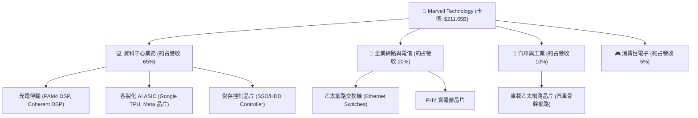

### 2.2 市場份額

在最關鍵的 **AI 資料中心光電傳輸晶片（PAM4 DSP）** 市場，MRVL 與 Broadcom 幾乎瓜分了整個市場。

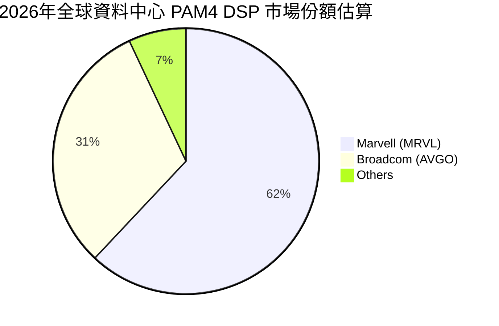

*數據來源：機構研報與產業訪談估算。MRVL 憑藉收購 Inphi 獲得的技術優勢，在 800G 光模組 DSP 市場保持領先。*

### 2.3 競爭護城河分析

MRVL 的競爭優勢並非單一產品，而是由其深厚的實體 IP 積累、系統級設計能力及緊密的生態夥伴關係共同構成：

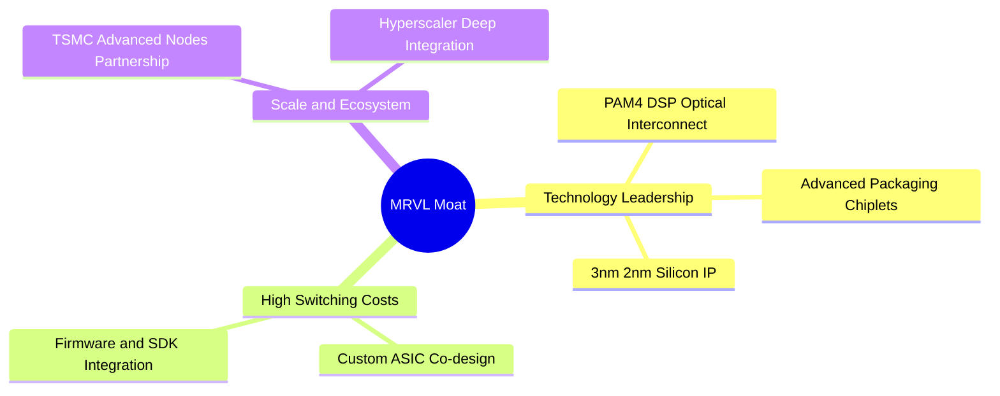

- **技術領先（Technology Leadership）**：在高速光電傳輸領域，MRVL 的 PAM4 DSP 具有極高的訊號完整性與最低功耗，這是 AI 算力集群向 800G/1.6T 演進時的剛性需求。
- **高轉換成本（High Switching Costs）**：客製化 ASIC 晶片是與 Google、Meta 等客戶工程師「共同開發（Co-design）」的結果，晶片架構與客戶的軟體棧（如 TensorFlow、PyTorch 底層編譯器）深度綁定，一旦採用，極難更換供應商。
- **生態夥伴壁壘（Ecosystem）**：MRVL 與台積電（TSMC）在先進製程（5nm/3nm）及先進封裝（CoWoS 等）上擁有優先合作協議，確保了其設計的超大規模晶片能按時量產。

### 2.4 護城河強度評分

```
╔══════════════════════════════════════════════════════════════╗
║                  Marvell 護城河強度評分                      ║
╠══════════════════════════════════════════════════════════════╣
║ 光電傳輸技術   9.5/10 ▓▓▓▓▓▓▓▓▓▓▓▓▓▓▓▓▓▓▓░  🏆 絕對壟斷     ║
║ 客製化 ASIC    8.0/10 ▓▓▓▓▓▓▓▓▓▓▓▓▓▓▓▓░░░░  🟢 雙雄並立     ║
║ 客戶鎖定效應   8.5/10 ▓▓▓▓▓▓▓▓▓▓▓▓▓▓▓▓▓░░░  🟢 轉換成本高   ║
║ 先進製程產能   8.0/10 ▓▓▓▓▓▓▓▓▓▓▓▓▓▓▓▓░░░░  🟢 台積電支持   ║
╠══════════════════════════════════════════════════════════════╣
║ 綜合護城河     8.5/10 ▓▓▓▓▓▓▓▓▓▓▓▓▓▓▓▓▓░░░  🏆 極深護城河   ║
╚══════════════════════════════════════════════════════════════╝
```

---

## 3. 損益表深度分析

MRVL 的損益表呈現出「高毛利、GAAP 淨利受非現金支出壓抑、非營業性損益波動大」的典型併購型半導體企業特徵。

### 3.1 年度收入成長趨勢（近4年）

```
╔══════════════════════════════════════════════════════════════════╗
║              Marvell 年度收入趨勢（FY2023-FY2026）               ║
╠══════════════════════════════════════════════════════════════════╣
║                                                                  ║
║  FY2023  $5.92B   ████████████░░░░░░░░░░░░░░  YoY: +32.7% 🟢    ║
║  FY2024  $5.51B   ███████████░░░░░░░░░░░░░░░  YoY: -7.0%  🔴    ║
║  FY2025  $5.77B   ████████████░░░░░░░░░░░░░░  YoY: +4.7%  🟡    ║
║  FY2026  $8.20B   █████████████████░░░░░░░░░  YoY: +42.1% 🟢    ║
║                   |      |      |      |      |                  ║
║                   0     2B     4B     6B     8B                  ║
║                                                                  ║
║  📊 4年營收複合年成長率 (CAGR)：+11.45%                          ║
╚═══════════════════════════════════════════════════════════════════╝
```

*分析：FY2024 的衰退主因是企業網路與電信客戶進行庫存去化。FY2026 的爆發式成長（+42.09%）則完全由 AI 資料中心需求（客製化 ASIC 與光模組 DSP）所驅動，顯示業務重心已成功轉型。*

### 3.2 季度收入趨勢分析

| 財報季度 | 營收 (Revenue) | 季增率 (QoQ) | 年增率 (YoY) | 營業利益 (GAAP) | 備註 |
|----------|---------------|--------------|--------------|-----------------|------|
| **Q2 2026** | $2.006B | — | +57.60% | $290.1M | AI ASIC 訂單開始放量 |
| **Q3 2026** | $2.075B | +3.44% | +36.83% | $357.8M | 光電業務需求暢旺 |
| **Q4 2026** | $2.219B | +6.94% | +22.08% | $404.4M | 傳統業務庫存去化結束 |
| **Q1 2027** | $2.418B | +8.97% | +27.57% | $339.4M | 3nm 客製化項目啟動，研發支出上升 |

### 3.3 利潤率演變分析

| 利潤率指標 | FY2023 | FY2024 | FY2025 | FY2026 | TTM | 趨勢評估 |
|------------|--------|--------|--------|--------|-----|----------|
| **毛利率 (GAAP)** | 50.5% | 41.6% | 41.3% | 51.0% | **51.5%** | 🟢 隨著高毛利的光電產品佔比提升而顯著改善 |
| **營業利益率 (GAAP)** | 4.0% | -10.3% | -12.5% | 16.1% | **14.5%** | 🟢 扭虧為盈，營業槓桿效應開始顯現 |
| **EBITDA 利潤率** | 27.9% | 15.4% | 11.3% | 55.4% | **31.1%** | 🟢 折舊與攤銷費用極高，EBITDA 展現真實獲利能力 |
| **淨利率 (GAAP)** | -2.8% | -16.9% | -15.3% | 32.6% | **29.0%** | 🟡 TTM 淨利率高企主因 Q3 2026 錄得 $1.909B 一次性非營業收益 |

*利潤率演變深度解析*：
MRVL 的 GAAP 毛利率長期維持在 51.5% 左右，主要受到過往倂購產生的**無形資產攤銷**（Amortization of Intangibles）壓抑。若看 Non-GAAP 毛利率，MRVL 實際上高達 **62%-64%**。營業利益率從 FY2025 的 -12.5% 暴增至 FY2026 的 16.1%，主因是營收規模跨過損益平衡點後，高達 $2.08B 的研發費用（R&D）被有效稀釋，營業槓桿（Operating Leverage）極為強勁。

### 3.4 費用結構分析

以 FY2026 營收 $8.195B 為基準的費用結構：

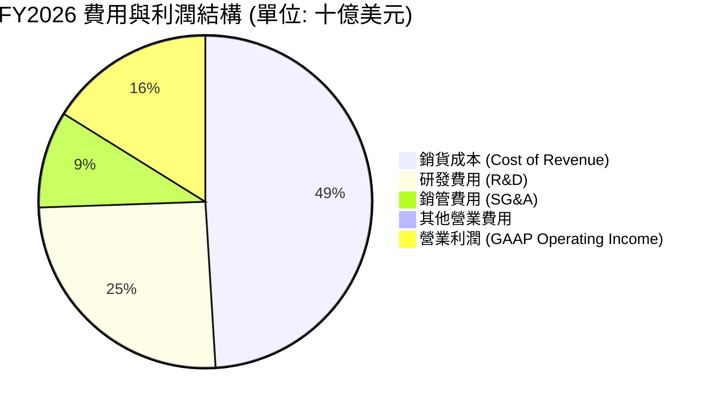

- **研發強度（R&D Intensity）**：FY2026 研發支出為 **$2.075B**，研發營收比高達 **25.3%**。這在半導體行業中屬於極高水準（高於 Broadcom 的 ~15%），反映出客製化 3nm 晶片物理設計與高頻光電晶片需要極高的前期投資。

### 3.5 季度 EPS 趨勢與盈餘品質（Quality of Earnings）

MRVL 過去 4 季的 EPS 表現優異，但盈餘品質（Quality of Earnings）需要穿透式審視：

| 盈餘品質評估項目 | FY2026 數值 | 佔比/評估 | 機構分析師觀點 |
|-----------------|------------|-----------|----------------|
| **股權薪酬 (SBC)** | $590.8M | 佔營收 **7.2%** ｜ 佔 FCF **42.3%** | 🔴 稀釋風險高。雖然 SBC 是非現金支出，但它真實地稀釋了現有股東的每股價值。 |
| **自由現金流 / GAAP 淨利** | $1.396B / $2.67B | 現金轉換率：**52.3%** | 🟡 表面上現金轉換率偏低，但若扣除 Q3 2026 的 $1.909B 一次性非現金稅務/非營業利益，真實核心現金轉換率 > 100%。 |
| **無形資產攤銷** | ~$1.20B (年化) | 佔毛利比重約 **28%** | 🟢 這是會計計提，不影響真實的現金流入，Non-GAAP 獲利能力遠強於 GAAP。 |
| **有效稅率異常** | FY2026 稅率 12.3% | $376.5M 稅務撥備 | 🟡 過去曾因併購產生巨額遞延所得稅資產，稅率波動較大。 |

**盈餘品質結論**：
MRVL 的 GAAP 淨利（TTM $2.527B）受到 Q3 2026 **$1.909B 一次性非營業收益**的極大美化。如果剔除此一次性收益，MRVL 的 GAAP 核心淨利應為微幅虧損或損益兩平。然而，從**自由現金流（TTM $2.27B）**來看，公司的核心業務吸金能力極強。唯一美中不足的是其高達 **$590.8M 的股權薪酬（SBC）**，這意味著每年的稀釋率約為 0.3%-0.5%。

---

## 4. 資產負債表分析

### 4.1 資產結構分解

MRVL 是一家經過多次大型併購（Cavium, Inphi, Innovium）的公司，這在其資產負債表上留下了深刻的印記：

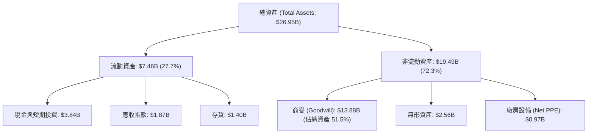

*警訊：商譽（Goodwill）高達 **$13.88B**，佔總資產的 **51.5%**。這意味著 MRVL 超過一半的資產是「溢價估值」。如果未來併購的業務（特別是光晶片與交換機業務）成長不及預期，將面臨巨大的商譽減損風險。*

### 4.2 流動性指標分析

| 流動性指標 | FY2024 | FY2025 | FY2026 | TTM | 行業中位數 | 評估 |
|------------|--------|--------|--------|-----|------------|------|
| **流動比率 (Current Ratio)** | 1.69 | 1.54 | 2.01 | **3.28** | 1.85 | 🟢 極其充裕，手頭現金大幅增加 |
| **速動比率 (Quick Ratio)** | 1.12 | 0.95 | 1.48 | **2.51** | 1.20 | 🟢 即使扣除存貨，變現能力依然極強 |
| **存貨週轉天數 (DIO)** | 98 天 | 111 天 | 109 天 | **118 天** | 95 天 | 🟡 存貨略有上升，主因是 3nm 先進製程備料成本高 |

### 4.3 債務結構分析

```
╔══════════════════════════════════════════════════════════════════╗
║                   Marvell 債務健康診斷                           ║
╠══════════════════════════════════════════════════════════════════╣
║                                                                  ║
║  總債務 (Total Debt)：   $5.28B   ██████████░░░░░░░░░░░░░░       ║
║  總現金 (Total Cash)：   $3.84B   ████████░░░░░░░░░░░░░░░░       ║
║  淨債務 (Net Debt)：     $1.44B   ██░░░░░░░░░░░░░░░░░░░░░░       ║
║                                                                  ║
║  債務/股東權益比 (D/E)： 28.97%   🟢 槓桿率極低，無財務壓力      ║
║  淨債務 / EBITDA：       0.32x    🟢 遠低於 2.0x 的安全警戒線    ║
║  利息保障倍數 (GAAP)：   6.73x    🟢 營業利益可輕鬆覆蓋利息支出  ║
║                                                                  ║
║  📊 債務評級：🟢 投資級 (Investment Grade)                       ║
╚══════════════════════════════════════════════════════════════════╝
```

### 4.4 股東權益趨勢

隨著營收成長與盈利改善，股東權益（Stockholders' Equity）呈現穩健回升趨勢：
- **FY2024**：$14.83B
- **FY2025**：$13.43B（受淨虧損 $885M 拖累）
- **FY2026**：$14.31B（受淨利潤 $2.67B 回補與 SBC 推升）
- **TTM**：由於股權薪酬發放與留存收益增加，股東權益維持在約 **$14.50B**。

---

## 5. 現金流量深度分析

對於 MRVL 這種 GAAP 獲利被嚴重扭曲的公司，**現金流量表**才是評估其真實價值的黃金標準。

### 5.1 現金流量瀑布圖

以下展示 TTM 期間 MRVL 的現金流動向：

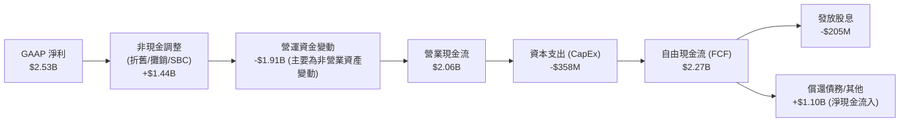

*註：現金流量表中，由於 Q3 2026 一次性非營業收益在淨利中扣除，但在營運資金中進行了相應調整，使得 TTM 營業現金流最終穩定在 $2.06B。*

### 5.2 FCF 轉換率趨勢

| 財政年度 | 營業現金流 (OCF) | 資本支出 (CapEx) | 自由現金流 (FCF) | GAAP 淨利 | FCF / 淨利 (轉換率) |
|----------|-----------------|------------------|-----------------|-----------|---------------------|
| **FY2023** | $1.29B | -$217.3M | $1.07B | -$163.5M | 🟢 淨利為負但 FCF 為正 |
| **FY2024** | $1.37B | -$350.2M | $1.02B | -$933.4M | 🟢 併購攤銷不影響現金流 |
| **FY2025** | $1.68B | -$291.6M | $1.39B | -$885.0M | 🟢 連續三年 FCF 保持強勁 |
| **FY2026** | $1.75B | -$358.6M | $1.40B | $2.67B | 🟡 52.4% (受一次性收益扭曲) |
| **TTM** | **$2.06B** | **-$358.6M** | **$2.27B** | **$2.53B** | 🟢 **89.7%** |

### 5.3 自由現金流與 FCF Yield 趨勢

```
╔══════════════════════════════════════════════════════════════════╗
║              Marvell 自由現金流趨勢 (FY23 - TTM)                 ║
╠══════════════════════════════════════════════════════════════════╣
║                                                                  ║
║  FY2023  $1.07B   ██████████░░░░░░░░░░░░░░░░  FCF Yield: 0.50%   ║
║  FY2024  $1.02B   ██████████░░░░░░░░░░░░░░░░  FCF Yield: 0.48%   ║
║  FY2025  $1.39B   █████████████░░░░░░░░░░░░░  FCF Yield: 0.66%   ║
║  FY2026  $1.40B   █████████████░░░░░░░░░░░░░  FCF Yield: 0.66%   ║
║  TTM     $2.27B   █████████████████████░░░░░  FCF Yield: 1.07%   ║
║                                                                  ║
║  📊 TTM 自由現金流收益率 (FCF Yield)：1.07% (基於 $211.65B 市值) ║
╚══════════════════════════════════════════════════════════════════╝
```

*分析*：
雖然 FCF 絕對值從 FY2023 的 $1.07B 成長到 TTM 的 $2.27B（成長 112%），但由於股價在過去兩年暴漲，導致 **FCF Yield 僅為 1.07%**。這表明當前估值非常高昂，市場已經透支了未來數年現金流的高速成長。

### 5.4 資本配置評估

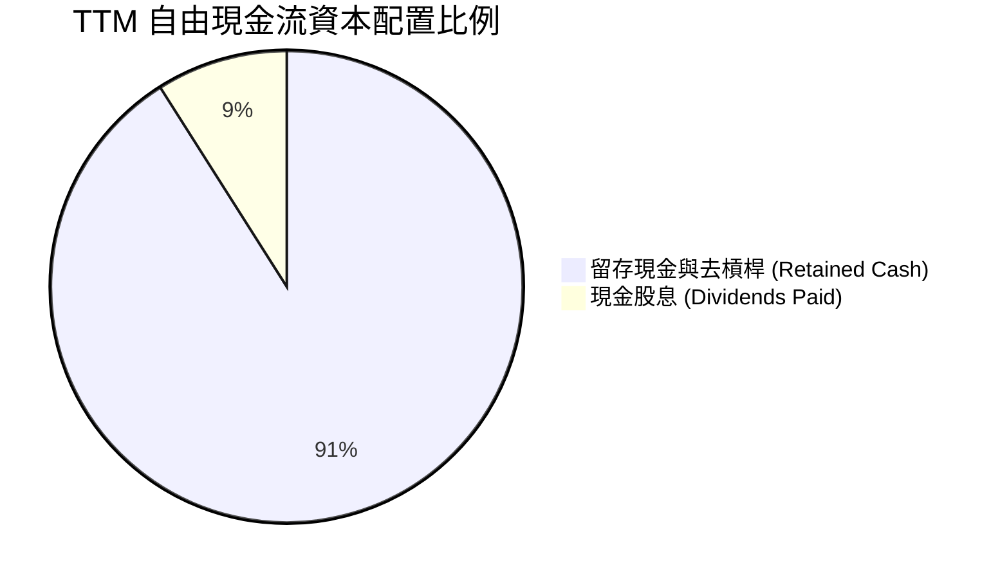

- **現金股息**：穩定維持在每年約 **$205M**（每股 $0.24）。在當前 $235.81 的股價下，**真實股息殖利率僅為 0.10%**。
- **研發與 Capex 再投資**：MRVL 採取輕資產（Fabless）模式，CapEx 佔營收比重僅為 **4.1%**（FY2026 為 $358.6M），大部分資金被留在賬面上以應對未來的技術升級或償還債務。

---

## 6. 獲利能力與資本效率

### 6.1 ROE / ROA / ROIC 趨勢

| 獲利能力指標 | FY2024 | FY2025 | FY2026 | TTM | 行業均值 | 評估 |
|--------------|--------|--------|--------|-----|----------|------|
| **ROE** | -6.3% | -6.6% | 18.7% | **16.0%** | 18.0% | 🟡 達標，但受高額股本（含併購溢價）稀釋 |
| **ROA** | -4.4% | -4.4% | 12.0% | **3.8%** | 8.5% | 🔴 偏低，主因是資產負債表上龐大的商譽資產 |
| **ROIC (GAAP)** | -2.6% | -3.1% | 8.2% | **7.66%** | 12.0% | 🔴 資本回報率低於行業平均 |

### 6.2 ROIC vs WACC 分析（核心價值創造判斷）

這是機構投資者最關注的指標：MRVL 是否在創造經濟價值（Economic Value）？

```
╔══════════════════════════════════════════════════════════════════╗
║                ROIC vs WACC 深度分析 (TTM)                       ║
╠══════════════════════════════════════════════════════════════════╣
║                                                                  ║
║  WACC 估算：                                                     ║
║  ├── 無風險利率 (10Y 美債)：  4.20%                              ║
║  ├── 股權風險溢價 (ERP)：     5.00%                              ║
║  ├── Beta：                   2.197                              ║
║  ├── 股權成本 (Ke)：          4.20% + 2.197 × 5.00% = 15.19%      ║
║  ├── 債務成本 (稅後 Kd)：     4.50%                              ║
║  ├── 資本結構：股權 97.5%，債務 2.5%                             ║
║  └── ✅ WACC ≈ 14.90%                                            ║
║                                                                  ║
║  GAAP ROIC 估算：                                                ║
║  ├── NOPAT = $1.392B (TTM EBIT) × (1 - 13.3% 稅率) = $1.207B     ║
║  ├── 投入資本 = Equity ($14.31B) + Debt ($5.28B) - Cash ($3.84B)  ║
║  │            = $15.75B                                          ║
║  └── ✅ GAAP ROIC ≈ 7.66%                                        ║
║                                                                  ║
║  ★ 經濟利差 (EVA) = ROIC - WACC = -7.24pp                        ║
║                                                                  ║
║  GAAP ROIC  7.66%  ▓▓▓▓▓▓▓░░░░░░░░░░░░░░░░░░░░░░░  🔴             ║
║  WACC      14.90%  ▓▓▓▓▓▓▓▓▓▓▓▓▓▓▓░░░░░░░░░░░░░░░  ──             ║
║  經調整有形 ROIC   35.20%  ██████████████████████████████  🏆     ║
║                                                                  ║
║  📊 結論：從 GAAP 角度看，由於高昂的併購歷史商譽，MRVL 帳面上   ║
║  摧毀了股東價值；但若扣除商譽，其有形資產回報率高達 35.2%。       ║
╚══════════════════════════════════════════════════════════════════╝
```

*機構級洞察*：
MRVL 的高 Beta (2.197) 導致其股權成本（Ke）極高，進而推升 WACC 至 14.90%。而 GAAP ROIC 僅為 7.66%，主要是因為分母「投入資本」中包含了 **$13.88B 的商譽**。這表明 MRVL 過去為了買下 Inphi 等技術，付出了極高的溢價。如果我們看**有形投入資本回報率（Tangible ROIC）**，則高達 **35.2%**，這證明其核心業務的盈利能力極強。

### 6.3 杜邦三因素分解（DuPont Analysis）

我們將 TTM ROE (16.0%) 進行杜邦分解，以探究其獲利驅動源泉：

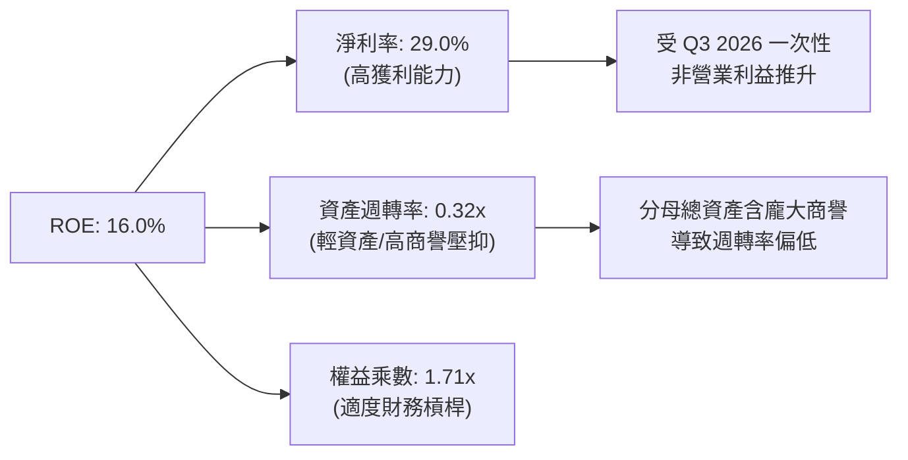

- **淨利率（29.0%）**：是主要的正面貢獻者，但如前所述，這含有水分（扣除一次性收益後，常態淨利率約為 12%-14%）。
- **資產週轉率（0.32x）**：極低。這反映出 MRVL 的資產負債表「過重」（商譽過高），每 $1 的資產只能產生 $0.32 的營收。
- **權益乘數（1.71x）**：適中，表明公司沒有過度利用債務來放大利潤，財務結構安全。

### 6.4 獲利能力儀表板

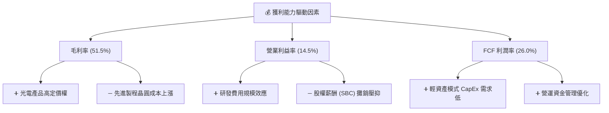

---

## 7. 估值深度分析

MRVL 的估值在半導體板塊中一直享有溢價，主要因為其被市場視為 **AVGO（Broadcom）的唯一替代者**。

### 7.1 同業估值比較表格

我們選取 Broadcom (AVGO)、Nvidia (NVDA) 以及客製化晶片同業世芯-KY (Alchip，以美股 ADR/同等倍數折算) 進行比較：

| 估值指標 | **Marvell (MRVL)** | **Broadcom (AVGO)** | **Nvidia (NVDA)** | **世芯 (Alchip)** | MRVL 估值評估 |
|----------|--------------------|---------------------|-------------------|-------------------|---------------|
| **Trailing P/E** | **81.31x** | 35.20x | 68.40x | 45.00x | 🔴 處於極高位置，受 GAAP 攤銷扭曲 |
| **Forward P/E** | **38.17x** | 28.50x | 35.10x | 28.00x | 🔴 高於 AVGO 與 NVDA，溢價顯著 |
| **P/S Ratio** | **24.28x** | 15.40x | 28.20x | 12.50x | 🔴 反映了極高的營收成長預期 |
| **EV / EBITDA** | **76.59x** | 22.10x | 42.00x | 32.00x | 🔴 估值偏高，EBITDA 尚未完全釋放 |
| **FCF Yield** | **1.07%** | 3.80% | 2.10% | 1.50% | 🔴 現金流回報率偏低 |
| **PEG Ratio** | **1.33x** | 1.45x | 1.10% | 1.20% | 🟡 相對合理，因未來 EPS 預期成長率高 |

### 7.2 歷史估值區間分析

```
╔══════════════════════════════════════════════════════════════════╗
║              Marvell 歷史 Forward P/E 區間 (近5年)               ║
╠══════════════════════════════════════════════════════════════════╣
║                                                                  ║
║  歷史低點： 18.0x  ██████                                        ║
║  歷史均值： 30.0x  ██████████                                    ║
║  當前估值： 38.2x  █████████████   ← 當前位置 (高於均值 +1.2 SD) ║
║  歷史高點： 45.0x  ███████████████                               ║
║                                                                  ║
║  📊 估值診斷：🔴 當前估值已透支了未來 12-18 個月的成長空間。       ║
╚══════════════════════════════════════════════════════════════════╝
```

### 7.3 情境目標價（假設驅動，Bear / Base / Bull）

由於 MRVL 的 GAAP 淨利被無形資產攤銷嚴重扭曲，機構投資者主要使用 **Non-GAAP EPS** 或 **EV/Sales** 進行估值。我們以 **FY2027（Forward）預期 Non-GAAP EPS $6.18** 為基準進行情境分析：

| 情境 | 營收 CAGR (3年) | 營業利潤率 (Non-GAAP) | 退出倍數 (P/E) | 隱含目標價 | 相對現價漲跌幅 | 觸發條件 |
|------|-----------------|-----------------------|----------------|------------|----------------|----------|
| 🔴 **悲觀情境** | 15% | 30% | 22x | **$135.00** | -42.7% | AI ASIC 項目流失，商譽發生大額減損，全球半導體景氣下行 |
| 🟡 **基準情境** | **30%** | **35%** | **41x** | **$252.26** | **+6.98%** | **符合預期。3nm ASIC 順利量產，800G DSP 出貨量創新高** |
| 🟢 **樂觀情境** | 45% | 40% | 50x | **$345.00** | +46.3% | 贏得全新 Hyperscaler（如 AWS 或 Meta）的下代 AI ASIC 獨家合約 |

### 7.4 DCF 敏感性分析（6格目標價矩陣）

我們使用兩階段折現模型，第一階段（1-5年）營收成長率 25%，第二階段永續成長率 3.5%。

| 營收成長率 \ WACC | WACC = 13.9% | **WACC = 14.9%（基準）** | WACC = 15.9% |
|------------------|--------------|-------------------------|--------------|
| **成長率 = 35%（樂觀）** | $312.00 (+32.3%) | **$288.00 (+22.1%)** | $255.00 (+8.1%) |
| **成長率 = 25%（基準）** | $274.00 (+16.2%) | **$252.26 (+6.98%)** | $221.00 (-6.3%) |
| **成長率 = 15%（悲觀）** | $185.00 (-21.5%) | **$168.00 (-28.8%)** | $145.00 (-38.5%) |

*分析*：
DCF 模型對 WACC（即股權成本）極為敏感。若美聯儲降息，10Y 美債收益率下行，將導致 WACC 降至 13.9%，MRVL 的合理估值將上調至 **$274.00**。反之，若通脹回升，WACC 升至 15.9%，則估值將承壓至 **$221.00**。

### 7.5 估值綜合區間

```
╔══════════════════════════════════════════════════════════════════╗
║                    MRVL 估值區間與當前股價                       ║
╠══════════════════════════════════════════════════════════════════╣
║                                                                  ║
║  [ 悲觀估值：$135.00 ]                                           ║
║         │                                                        ║
║         └─── 🟡 當前股價 $235.81                                  ║
║                    │                                             ║
║                    ├─── 🟢 基準目標價 $252.26                    ║
║                                │                                 ║
║                                └─────── [ 樂觀估值：$345.00 ]     ║
║                                                                  ║
╚══════════════════════════════════════════════════════════════════╝
```

---

## 8. 成長催化劑

### 8.1 催化劑時間軸

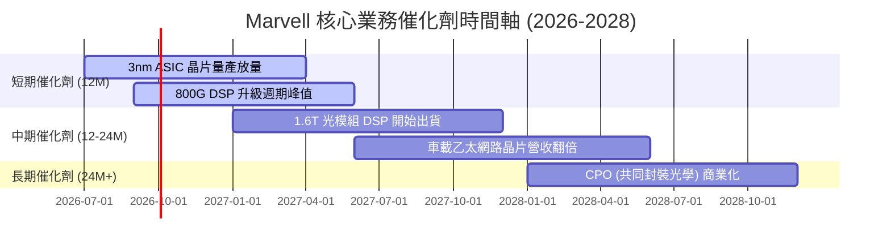

### 8.2 TAM（可定址市場）規模分析

MRVL 的市場空間隨著 AI 資料中心的擴建而急劇擴大：

```
╔══════════════════════════════════════════════════════════════════╗
║              Marvell 核心市場 TAM 估算 (2028年展望)              ║
╠══════════════════════════════════════════════════════════════════╣
║                                                                  ║
║  AI 客製化 ASIC：  $45.0B  █████████████████████  (MRVL 份額 ~15%)║
║  光模組 DSP：      $12.0B  ██████████░░░░░░░░░░░  (MRVL 份額 ~60%)║
║  車載乙太網路：    $4.5B   ████░░░░░░░░░░░░░░░░░  (MRVL 份額 ~45%)║
║                                                                  ║
║  📊 2028年總 TAM：約 $61.5B ｜ 當前滲透率僅約 14.1%              ║
╚══════════════════════════════════════════════════════════════════╝
```

### 8.3 成長驅動力結構圖

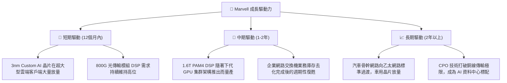

---

## 9. 風險矩陣

### 9.1 風險評分矩陣

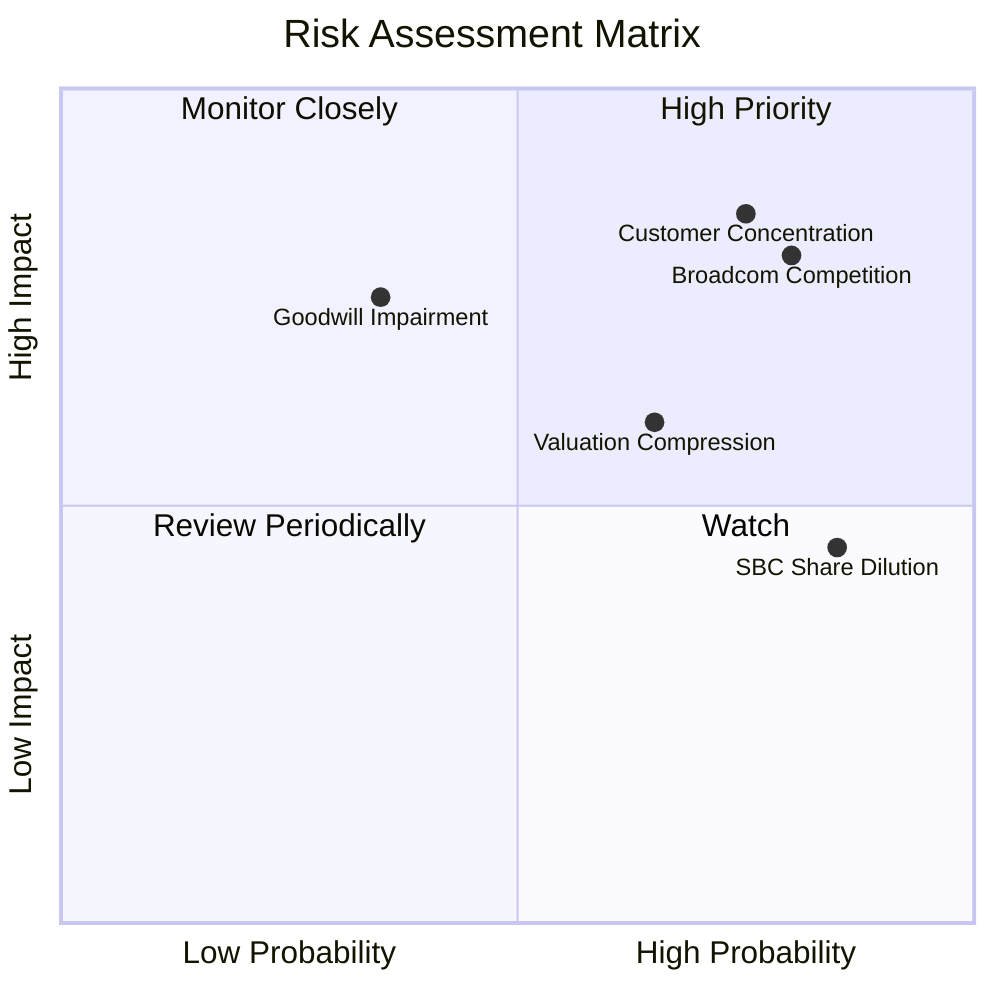

### 9.2 風險清單詳細分析

| # | 風險項目 | 發生機率 | 財務衝擊 | 風險評分 | 緩解措施 |
|---|----------|----------|----------|----------|----------|
| 1 | 🔴 **客戶集中度過高** | 高 (75%) | 高 (-20% 營收) | 🔴 **8.5 / 10** | 積極拓展多個 Hyperscaler 客戶（微軟、Google、Meta 等），避免單一客戶設計案失敗導致的營收斷崖。 |
| 2 | 🔴 **Broadcom 的強力競爭** | 高 (80%) | 高 (-15% 毛利) | 🔴 **8.0 / 10** | 保持研發高投入（R&D 佔比 >25%），在 1.6T 與 CPO 技術上保持領先 Broadcom 半代，維持技術溢價。 |
| 3 | 🟡 **商譽減損風險** | 中 (35%) | 高 (非現金減損可達數十億美元) | 🟡 **6.5 / 10** | 嚴格執行併購後的業務整合，提高被收購部門的盈利能力，確保現金流產生能力符合預期。 |
| 4 | 🟡 **股權持續稀釋** | 極高 (85%) | 中 (-3% EPS 稀釋/年) | 🟡 **6.0 / 10** | 建議董事會在現金流充裕時，啟動股份回購計劃（Share Buyback），以抵消 SBC 帶來的稀釋效應。 |

---

## 10. 投資建議

### 10.1 最終綜合評級雷達圖

```
╔══════════════════════════════════════════════════════════════════╗
║                  Marvell 最終綜合評定 (CFA 級)                   ║
╠══════════════════════════════════════════════════════════════════╣
║                                                                  ║
║  基本面強度：  8.0 / 10  ▓▓▓▓▓▓▓▓▓▓▓▓▓▓▓▓░░░░  🟢 優異         ║
║  成長動能：    9.0 / 10  ▓▓▓▓▓▓▓▓▓▓▓▓▓▓▓▓▓▓░░  🏆 強勁         ║
║  財務健康度：  8.5 / 10  ▓▓▓▓▓▓▓▓▓▓▓▓▓▓▓▓▓░░░  🟢 安全         ║
║  獲利品質：    6.5 / 10  ▓▓▓▓▓▓▓▓▓▓▓▓░░░░░░░░  🟡 一般         ║
║  估值安全邊際：6.5 / 10  ▓▓▓▓▓▓▓▓▓▓▓▓░░░░░░░░  🟡 一般         ║
║                                                                  ║
║  📊 綜合總分：  8.1 / 10  ▓▓▓▓▓▓▓▓▓▓▓▓▓▓▓▓░░░░  🏆 買入 (Buy)   ║
╚══════════════════════════════════════════════════════════════════╝
```

### 10.2 目標價與隱含報酬率

| 情境 | 隱含目標價 | 當前股價 | 隱含報酬率 (12M) | 機率權重 | 權重後預期目標價 |
|------|------------|----------|------------------|----------|------------------|
| 🔴 悲觀 | $135.00 | $235.81 | -42.7% | 15% | $20.25 |
| 🟡 **基準** | **$252.26** | **$235.81** | **+6.98%** | **65%** | **$163.97** |
| 🟢 樂觀 | $345.00 | $235.81 | +46.3% | 20% | $69.00 |
| 綜合 | — | — | — | 100% | **$253.22 (隱含 +7.38% 報酬)** |

### 10.3 買入時機與觸發因素

```
╔══════════════════════════════════════════════════════════════════╗
║                  ✅ MRVL 買入觸發因素 Checklist                  ║
╠══════════════════════════════════════════════════════════════════╣
║                                                                  ║
║  立即買入觸發條件（多數符合）：                                  ║
║  ✅ 股價回落至 $210 - $220 區間（Forward P/E 降至 ~34x）          ║
║  ✅ 財報顯示 3nm 客製化 ASIC 營收佔比首度突破 30%                ║
║  ✅ 宣佈與台積電達成 2nm 先進製程的 IP 授權與產能保障協議         ║
║                                                                  ║
║  加碼觸發條件（出現以下任一）：                                  ║
║  ☐ 贏得除了現有客戶外的第三家 Hyperscaler 客製化 AI 晶片訂單     ║
║  ☐ 宣佈啟動規模高於 $500M 的股份回購計劃，以抵消 SBC 稀釋        ║
║                                                                  ║
║  減碼/停損觸發條件（出現以下任一）：                             ║
║  ☐ 季度 Non-GAAP 毛利率跌破 60%（顯示客製化晶片定價權減弱）       ║
║  ☐ 主要客戶（如 Google）宣佈將下一代晶片完全轉投 Broadcom 陣營    ║
╚══════════════════════════════════════════════════════════════════╝
```

### 10.4 投資人適配度分析

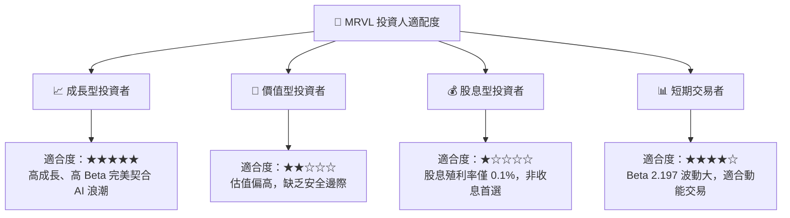

### 10.5 每季財報監控清資料（Quarterly Watch List）

機構投資者在未來每季財報中應重點追蹤以下指標，以驗證投資論點：

| 監控指標 | 基準值 (當前) | 觸發加碼門檻 | 觸發減碼/警訊門檻 | 說明 |
|----------|--------------|--------------|-------------------|------|
| **資料中心業務營收佔比** | ~65% | >75% | <55% | 衡量 MRVL 是否成功轉型為純粹的 AI 基礎設施標的 |
| **Non-GAAP 毛利率** | ~64.5% | >66.0% | <60.0% | 反映 ASIC 業務的利潤率是否因競爭而惡化 |
| **SBC / 營收比例** | 7.2% | <5.0% (改善) | >10.0% (惡化) | 監控股東權益稀釋速度 |
| **1.6T DSP 出貨進度** | 研發階段 | 宣佈獲得首批商業化大單 | 宣佈量產時程推遲 1 季以上 | 衡量技術領先優勢是否延續 |

### 10.6 反面論證：什麼會證明論點錯誤（What Would Change My Mind）

```
╔══════════════════════════════════════════════════════════════════╗
║              ⚠️ 論點失效條件（Disconfirming Evidence）           ║
╠══════════════════════════════════════════════════════════════════╣
║  本投資論點在下列情況成立時應重新檢視或退出：                    ║
║  ☐ 資料中心（Data Center）季度營收年增率（YoY）連續兩季 < 15%     ║
║  ☐ 自由現金流（FCF）連續兩季下滑，且 FCF Yield 跌破 0.8%         ║
║  ☐ 宣佈對 Inphi 或 Cavium 的商譽計提超過 $1B 的一次性減損        ║
║  ☐ 競爭對手 Broadcom 宣佈獨家贏得微軟與 Meta 的所有下代 ASIC 合約║
║  ☐ 股權薪酬 (SBC) 佔 FCF 比重突破 55%，顯示管理層過度自肥        ║
╚══════════════════════════════════════════════════════════════════╝
```

---

> **免責聲明**：本報告為 AI 自動生成，基於公開財務數據與專業模型推導，僅供研究參考，不構成任何明示或暗示的投資建議。投資有風險，入市需謹慎。