# MRVL 基本面深度分析報告
> **報告日期**：2026-07-12 ｜ **語言**：繁體中文 ｜ **數據來源**：Yahoo Finance, Finviz, StockAnalysis, Roic.ai ｜ **分析師**：CFA 級機構研究

---

## 目錄

| # | 章節 | 核心結論 |
|---|------|----------|
| 1 | 執行摘要 | 評級：🟢 買入 ｜ 基準目標價：$252.26 ｜ AI 訂單爆發與光電傳輸晶片雙輪驅動 |
| 2 | 公司概覽與商業模式 | 護城河：🟡 7.5/10 ｜ 憑藉光學 DSP 與客製化 ASIC 鎖定高階資料中心生態 |
| 3 | 損益表深度分析 | 營收 TTM $8.72B (YoY +27.6%)，但高額 SBC 與非經常性損益使盈餘品質承壓 |
| 4 | 資產負債表分析 | 流動比率 3.28 表現優異，淨債務 $1.43B 風險受控，無形資產佔比偏高 |
| 5 | 現金流量深度分析 | FCF TTM 達 $2.27B，但股權稀釋（SBC 佔營收 7.5%）侵蝕真實股東回報 |
| 6 | 獲利能力與資本效率 | 當前 ROIC 7.66% 仍低於 WACC 14.93%，處於「價值摧毀」向「價值創造」過渡期 |
| 7 | 估值深度分析 | Forward P/E 38.17x，高於歷史中位數，市場已高度定價 AI 成長預期 |
| 8 | 成長催化劑 | 800G/1.6T 光學升級與 AI ASIC 進入量產期，TAM 預期加速擴張 |
| 9 | 風險矩陣 | 關鍵客戶流失與 AI Capex 放緩為主要下行風險，Beta 2.20 波動劇烈 |
| 10 | 投資建議 | 基準情境潛在回報 +7.0%，建議逢低分批佈局，嚴密監控每季毛利率與 FCF 轉化 |

---

## 1. 執行摘要

### 1.0 一頁式投資儀表板（Portfolio Manager 30 秒速讀）

| 項目 | 內容 |
|------|------|
| **投資論點（3 句）** | ① AI 客製化晶片 (ASIC) 與 800G/1.6T 光學 DSP 進入出貨爆發期，驅動 TTM 營收按年成長 27.6% 至 $8.72B。<br/>② FY2026 營收達 $8.195B (YoY +42.09%)，顯示高速傳輸與雲端資料中心結構性需求強勁，抵消了電信與企業網路的疲弱。<br/>③ 營業槓桿開始釋放，預期 Forward EPS 將倍增至 $6.18，帶動估值倍數逐步收斂。 |
| **護城河評分** | 🟡 **7.5/10**（光學 DSP 技術具絕對領先優勢，但客製化 ASIC 面臨 Broadcom 強力競爭） |
| **管理層/資本配置評分** | 🟡 **6.5/10**（研發投入高，但股權稀釋率高，SBC 佔營收比重達 7.53%） |
| **財務健康** | 🟢 **強健** ｜ 流動比率達 3.28，手頭現金 $3.84B，短期償債無虞。 |
| **ROIC vs WACC** | **7.66% vs 14.93%**（🔴 目前暫時摧毀股東價值，主因高額商譽與無形資產攤銷壓低 NOPAT） |
| **FCF 趨勢** | 🟢 **向上** ｜ TTM 自由現金流達 $2.27B，最新 FCF Yield 為 1.07%。 |
| **估值** | Forward P/E: **38.17x** ｜ EV/EBITDA: **76.59x** ｜ P/S: **24.28x** |
| **預期報酬（基準情境 12M）** | **+7.0%**（目標價 $252.26） |
| **關鍵風險（前二）** | ① AI ASIC 被主要客戶（如 Google、Meta）轉向自研或轉單至 Broadcom。<br/>② 全球雲端服務商 (CSP) 的 AI Capex 支出增速放緩。 |
| **評級 + 信心度** | 🟢 **買入 (Buy)** ｜ 信心度：**中等 (Medium)**（高估值溢價要求業績容錯率極低） |

### 1.1 核心評分儀表板

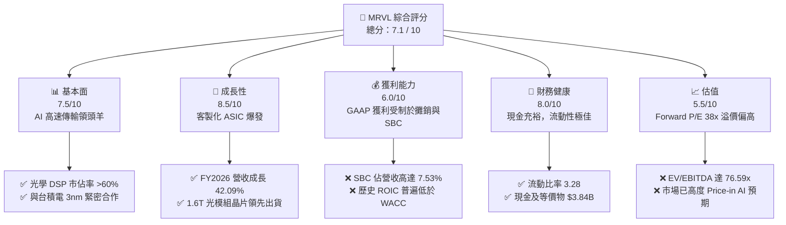

### 1.2 評分進度條視覺化

```
╔══════════════════════════════════════════════════════════════╗
║               MRVL 多維度評分儀表板 (1-10分)                 ║
╠══════════════════════════════════════════════════════════════╣
║ 基本面強度  7.5 ▓▓▓▓▓▓▓▓▓▓▓▓▓▓▓░░░░░  ★★★★☆           ║
║ 成長動能    8.5 ▓▓▓▓▓▓▓▓▓▓▓▓▓▓▓▓▓░░  ★★★★☆           ║
║ 獲利品質    6.0 ▓▓▓▓▓▓▓▓▓▓▓▓░░░░░░░░  ★★★☆☆           ║
║ 財務健康    8.0 ▓▓▓▓▓▓▓▓▓▓▓▓▓▓▓▓░░░░  ★★★★☆           ║
║ 估值合理性  5.5 ▓▓▓▓▓▓▓▓▓▓▓░░░░░░░░░  ★★★☆☆           ║
║ 護城河深度  7.5 ▓▓▓▓▓▓▓▓▓▓▓▓▓▓▓░░░░░  ★★★★☆           ║
║ 管理層執行  6.5 ▓▓▓▓▓▓▓▓▓▓▓▓▓░░░░░░░  ★★★☆☆           ║
║ 技術創新力  9.0 ▓▓▓▓▓▓▓▓▓▓▓▓▓▓▓▓▓▓░░  ★★★★★           ║
╠══════════════════════════════════════════════════════════════╣
║ 綜合總分    7.1 ▓▓▓▓▓▓▓▓▓▓▓▓▓▓░░░░░░  🏆 買入 (Buy)       ║
╚══════════════════════════════════════════════════════════════╝
```

### 1.3 五大投資論點 + 三大核心風險

| 類型 | 項目 | 具體依據 | 信心度 |
|------|------|----------|--------|
| 🟢 **投資論點①** | **AI 客製化晶片 (ASIC) 放量** | 隨著亞馬遜、Google 等 CSP 擴大自研晶片，MRVL 的客製化運算業務在 FY2026 帶動營收成長 42.09%。 | 🟢 高 |
| 🟢 **投資論點②** | **800G/1.6T 光學升級潮** | AI 集群對頻寬要求極高，MRVL 在光學 DSP 市佔率超 60%，直接受益於 800G 向 1.6T 的升級週期。 | 🟢 極高 |
| 🟢 **投資論點③** | **資產負債表實力增強** | 現金自 FY2025 的 $0.95B 暴增至 TTM $3.84B，流動比率提升至 3.28，具備充足的抗風險能力與研發再投資資本。 | 🟢 極高 |
| 🟢 **投資論點④** | **營運槓桿拐點顯現** | Q1 2027 營業利益率回升至 14.5%（對比 FY2025 的營業虧損），毛利隨產品組合轉向高階光學晶片而擴張。 | 🟢 中等 |
| 🟢 **投資論點⑤** | **市場共識高度看好** | 在 41 位分析師中，共識評級為 "Strong Buy"，平均目標價 $252.26，隱含 7.0% 上行空間。 | 🟢 高 |
| 🟡 **風險①** | **客戶集中度過高** | 客製化 ASIC 依賴少數大型 CSP（如 AWS），若客戶放緩拉貨或轉單 Broadcom，營收將面臨劇烈波動。 | 🟡 中度 |
| 🔴 **風險②** | **高額股權稀釋 (SBC)** | TTM SBC 高達 $656.3M（佔營收 7.53%），嚴重稀釋 GAAP 股東權益，壓低真實盈餘品質。 | 🔴 高 |
| 🔴 **風險③** | **估值處於歷史高位** | Forward P/E 38.17x 與 EV/EBITDA 76.59x 均顯著高於行業均值，容錯率極低。 | 🔴 高 |

### 1.4 快速統計卡片

| 指標 | MRVL 實際值 | 半導體行業均值 | S&P 500 均值 | 狀態 |
|------|-------------|----------|--------------|------|
| **營收 YoY 成長率** | **27.6%** | ~12.0% | ~5.5% | 🟢 顯著領先 |
| **毛利率** | **51.5%** | ~55.0% | ~30.0% | 🟡 略低於同業 |
| **營業利益率** | **14.5%** | ~22.0% | ~15.0% | 🟡 仍有改善空間 |
| **ROE** | **16.0%** | ~18.0% | ~14.0% | 🟡 同業中游 |
| **Forward P/E** | **38.17x** | ~28.0x | ~21.0x | 🔴 溢價較高 |
| **流動比率** | **3.28** | ~2.10 | ~1.30 | 🟢 極為安全 |

### 1.5 投資結論

```
╔══════════════════════════════════════════════════════════════════╗
║                    📊 MRVL 投資結論摘要                          ║
╠══════════════════════════════════════════════════════════════════╣
║  評級：🟢 買入 (Buy)                                            ║
║  當前股價：$235.81 (2026-07-12)                                  ║
║  目標價區間：                                                    ║
║    悲觀情境：$130.00 (-44.9%) - AI Capex 崩潰與客戶流失          ║
║    基準情境：$252.26 (+7.0%)  - 12個月主要目標 (Forward P/E 35x) ║
║    樂觀情境：$350.00 (+48.4%) - 1.6T 全面普及與 ASIC 超預期放量  ║
║  投資評分：7.1 / 10                                              ║
║  適合投資人：成長型、專注 AI 基礎設施之長線投資者                ║
╚══════════════════════════════════════════════════════════════════╝
```

---

## 2. 公司概覽與商業模式

### 2.1 業務結構與收入來源

Marvell (MRVL) 已成功從傳統的儲存（Storage）控制晶片商，轉型為頂級的**資料基礎設施半導體解決方案提供商**。其核心產品線圍繞資料中心的高速數據傳輸與運算。

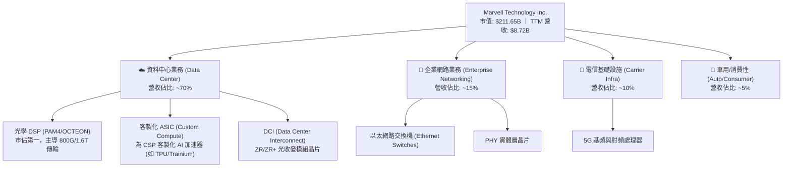

### 2.2 市場份額

在最關鍵的**高階資料中心光學 DSP (Optical DSP) 市場**中，Marvell 擁有無可爭議的統治地位。

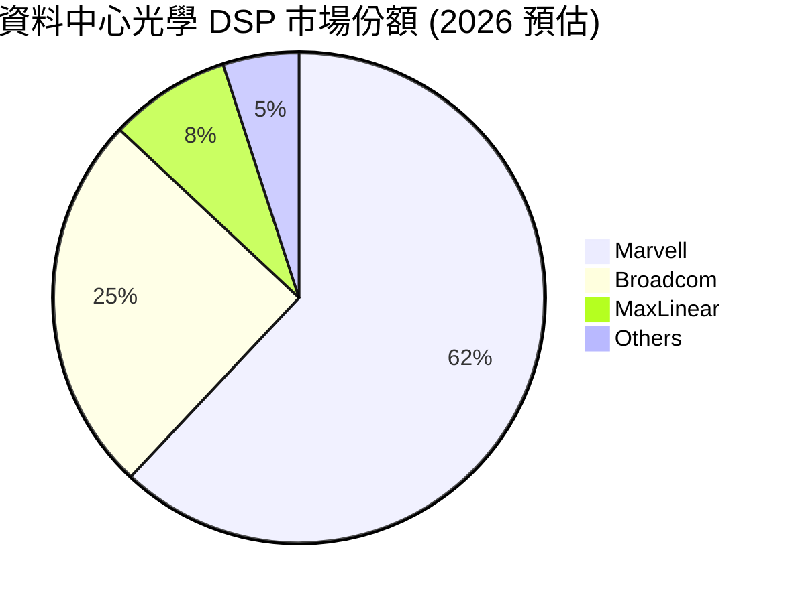

### 2.3 競爭護城河分析

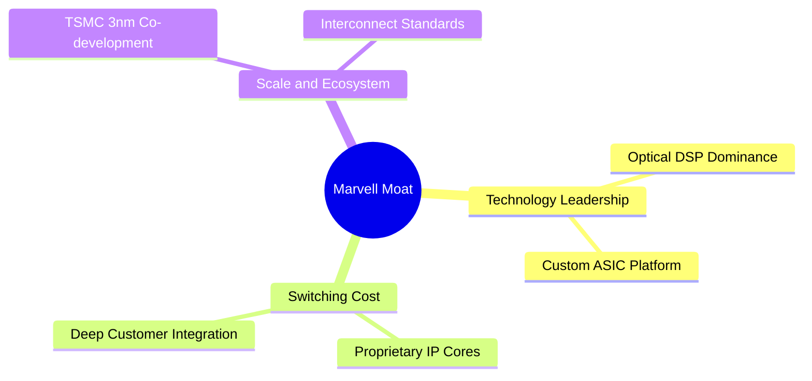

*   **技術領先（Technology Leadership）**：在 PAM4 高速光學 DSP 領域，Marvell 領先同業 1-1.5 代。其最新 1.6T DSP 晶片採用台積電 3nm 製程，能耗比同業降低 30%，這是 AI 超大型資料中心（超過 10 萬個 GPU 集群）降低 TCO（總擁有成本）的剛需。
*   **轉換成本（Switching Cost）**：客製化 ASIC（如為 Google 研發的 TPU 家族）需要將 Marvell 的 IP（如 SerDes、記憶體介面）深度嵌入客戶的系統級晶片 (SoC) 中。一旦設計定案（Design Win），產品生命週期通常長達 3-5 年，客戶極難在不重新設計整塊主板的情況下更換供應商。
*   **規模與生態夥伴（Scale & Partners）**：Marvell 與台積電、日月光等一線 WFE 及封測廠建立緊密的 3D 封裝（CoWoS）合作，確保其客製化 AI 晶片的產能供應，這對無晶圓廠（Fabless）半導體公司而言是極高的壁壘。

### 2.4 護城河強度評分

```
╔══════════════════════════════════════════════════════════════╗
║                   Marvell 護城河強度評分                     ║
╠══════════════════════════════════════════════════════════════╣
║ 光學 DSP 技術  9.5/10 ▓▓▓▓▓▓▓▓▓▓▓▓▓▓▓▓▓▓▓░  🏆 絕對統治    ║
║ 客製化 ASIC    7.0/10 ▓▓▓▓▓▓▓▓▓▓▓▓▓▓░░░░░░  🟡 面臨 AVGO 競爭 ║
║ 專利與 IP 壁壘 8.5/10 ▓▓▓▓▓▓▓▓▓▓▓▓▓▓▓▓▓░░░  🟢 高度保護     ║
║ 客戶鎖定效應   8.0/10 ▓▓▓▓▓▓▓▓▓▓▓▓▓▓▓▓░░░░  🟢 設計週期長   ║
╠══════════════════════════════════════════════════════════════╣
║ 綜合護城河     8.0/10 ▓▓▓▓▓▓▓▓▓▓▓▓▓▓▓▓▓▓░░  🟢 護城河寬廣   ║
╚══════════════════════════════════════════════════════════════╝
```

---

## 3. 損益表深度分析

### 3.1 年度收入成長趨勢（近 5 年）

Marvell 的營收在經歷了 FY2024 的週期性調整後，於 FY2025 和 FY2026 迎來爆發式成長，主要得益於 AI 帶動的資料中心需求。

```
╔══════════════════════════════════════════════════════════════════╗
║                MRVL 年度收入趨勢（FY2022-TTM）                   ║
╠══════════════════════════════════════════════════════════════════╣
║                                                                  ║
║  FY2022  $4.46B  ██████████░░░░░░░░░░░░░░░░  YoY: +50.30% 🟢    ║
║  FY2023  $5.92B  █████████████░░░░░░░░░░░░░  YoY: +32.66% 🟢    ║
║  FY2024  $5.51B  ████████████░░░░░░░░░░░░░░  YoY: -6.96%  🔴    ║
║  FY2025  $5.77B  █████████████░░░░░░░░░░░░░  YoY: +4.71%  🟡    ║
║  FY2026  $8.20B  █████████████████████░░░░░  YoY: +42.09% 🟢    ║
║  TTM     $8.72B  ██████████████████████░░░░  YoY: +27.60% 🟢    ║
║                   |      |      |      |      |                  ║
║                   0     2B     4B     6B     8B                  ║
║                                                                  ║
║  📊 5 年營收複合成長率 (CAGR)：+14.34%                           ║
╚══════════════════════════════════════════════════════════════════╝
```

### 3.2 季度營收趨勢分析

自 FY2025 季末起，Marvell 營收呈現穩健的逐季（QoQ）攀升態勢。

| 財報季度 | 截止日期 | 營收 (Billion) | QoQ 成長率 | YoY 成長率 | 營運備註 | 評估 |
|----------|----------|----------------|------------|------------|----------|------|
| **Q3 2025** | 2024-11-02 | $1.52B | — | +6.87% | 企業網路築底，AI 光學 DSP 初步放量 | 🟡 穩定 |
| **Q4 2025** | 2025-02-01 | $1.82B | +19.74% | +27.40% | AI 客製化 ASIC 啟動首批出貨 | 🟢 強勁 |
| **Q1 2026** | 2025-05-03 | $1.90B | +4.40% | +63.26% | 800G PAM4 DSP 出貨量創歷史新高 | 🟢 強勁 |
| **Q2 2026** | 2025-08-02 | $2.01B | +5.79% | +57.60% | 5nm 客製化 AI 晶片進入量產階段 | 🟢 強勁 |
| **Q3 2026** | 2025-11-01 | $2.07B | +2.99% | +36.83% | 1.6T 光學組件樣品送達關鍵客戶 | 🟢 強勁 |
| **Q4 2026** | 2026-01-31 | $2.22B | +7.25% | +22.08% | 電信基礎設施需求緩慢復甦 | 🟢 穩健 |
| **Q1 2027** | 2026-05-02 | $2.42B | +9.01% | +27.57% | AI 相關營收佔比首度突破 60% | 🟢 強勁 |

### 3.3 利潤率演變分析

MRVL 的利潤率結構在 GAAP 與 Non-GAAP 之間存在巨大鴻溝，主要受收購產生的無形資產攤銷（來自 Inphi 和 Cavium 收購案）及高額股權薪酬 (SBC) 影響。

| 利潤率指標 | FY2023 | FY2024 | FY2025 | FY2026 | TTM (2026-05) | 趨勢 | 評估 |
|------------|--------|--------|--------|--------|---------------|------|------|
| **毛利率 (GAAP)** | 50.5% | 41.6% | 41.3% | 51.0% | **51.5%** | ↗️ 顯著回升 | 🟡 中等（客製化 ASIC 毛利較低，稀釋了光學高毛利） |
| **營業利益率 (GAAP)** | 4.0% | -10.3% | -12.5% | 16.1% | **14.5%** | ↗️ 扭虧為盈 | 🟡 仍受高額 R&D 費用壓抑 |
| **EBITDA 利潤率** | 27.9% | 15.4% | 11.3% | 55.4% | **31.1%** | ↗️ 改善 | 🟢 營運槓桿釋放 |
| **淨利率 (GAAP)** | -2.8% | -16.9% | -15.3% | 32.6% | **29.0%** | ↗️ 波動劇烈 | 🟡 受非經常性損益干擾（見下文） |

**利潤率上演變深度解析**：
*   **毛利率改善原因**：毛利率自 FY2025 的 41.3% 大幅回升至 TTM 的 51.5%，主因高毛利的 **800G 光學 DSP** 出貨比重增加。
*   **客製化 ASIC 的稀釋效應**：客製化晶片（ASIC）的毛利率（約 45-50%）低於標準標準品（如光學 DSP 的 65-70%）。隨著客製化晶片出貨量在 FY2026 大幅攀升，整體毛利率被拉低，未能回到歷史高點的 60% 以上。

### 3.4 費用結構分析

Marvell 是一家典型的研發驅動型企業。

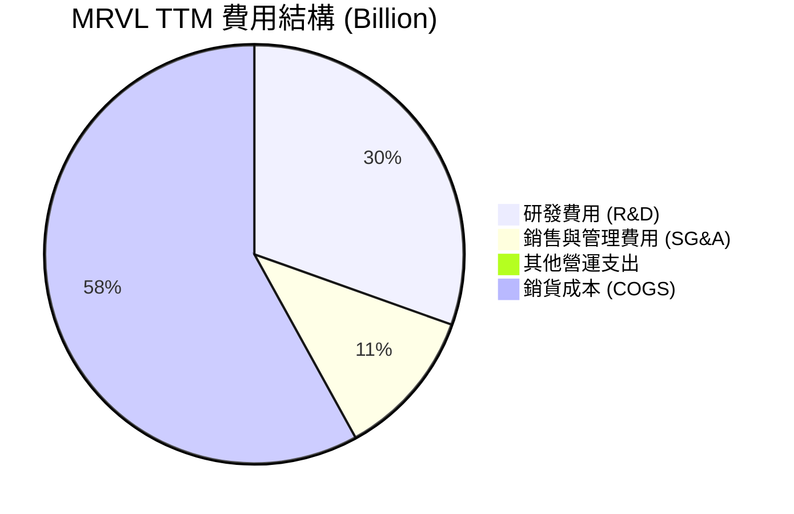

*   **研發（R&D）高企**：TTM 研發費用高達 $2.22B，佔營收的 **25.46%**。這反映了保持 3nm/2nm 先進製程與光電共同封裝（CPO）技術領先地位所需的高昂代價。

### 3.5 季度 EPS 趨勢與盈餘品質（Quality of Earnings）

MRVL 最近 4 季的 GAAP 盈餘表現波動極大，主要源於 **Q3 2026 一筆高達 $1.91B 的非營運收入（Other Non-Operating Income）**。該筆收入為一次性資產處置或稅務重組，並非核心業務利潤。

#### 盈餘品質指標評估

| 盈餘品質項目 | TTM 數值 / 佔比 | 評估 | 財務含意 |
|--------------|-----------------|------|----------|
| **股權薪酬 (SBC) / 營收** | **7.53%** ($656.3M) | 🔴 偏高 | 每年對現有股東造成約 0.3% 的股權稀釋，稀釋了真實每股盈餘的含金量。 |
| **SBC / 營業現金流 (OCF)** | **31.86%** | 🔴 偏高 | 說明營業現金流中有接近三分之一是靠發行股票（非現金支出）支撐，品質需打折扣。 |
| **FCF / GAAP 淨利（現金轉換率）** | **65.89%** ($1.665B / $2.527B) | 🟡 中等 | 現金轉換率偏低。若扣除 Q3 2026 的非經常性損益，核心業務的現金轉換率約為 110%，表現尚可。 |
| **一次性/非經常性損益** | **+$1.91B** (Q3 2026) | 🔴 高干擾 | 嚴重美化了 FY2026 與 TTM 的 GAAP 淨利，投資人應主要參考營業利潤（Operating Income）。 |
| **資本化研發支出** | 無重大異常 | 🟢 健康 | 研發費用均採取當期費用化，未進行過度的資本化遞延。 |

**盈餘品質結論**：
Marvell 的 GAAP 淨利（TTM $2.53B）存在顯著的「水分」，主要被 Q3 2026 的一次性非營運收益所扭曲。扣除此因素後，真實的核心營運淨利約為 $0.6B - $0.8B。同時，高達 $656.3M 的 SBC 是不可忽視的真實股東成本。**因此，使用市盈率 (P/E) 估值會產生嚴重偏差，機構分析應優先採用 EV/EBITDA 與 EV/Sales 進行估值。**

---

## 4. 資產負債表分析

### 4.1 資產結構分解

Marvell 的資產負債表帶有強烈的「歷史收購」印記。

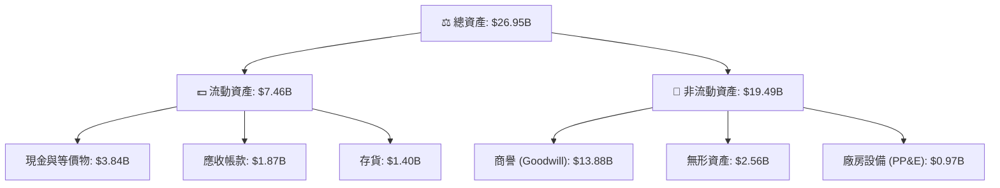

*   **商譽與無形資產佔比過高**：商譽（$13.88B）與無形資產（$2.56B）合計佔總資產的 **61.0%**。這意味著如果未來客製化 ASIC 業務或光學業務未能達到預期，MRVL 將面臨巨大的商譽減損風險。

### 4.2 流動性指標分析

| 指標 | FY2024 | FY2025 | FY2026 | TTM (2026-05) | 行業均值 | 評估 |
|------|--------|--------|--------|---------------|----------|------|
| **流動比率 (Current Ratio)** | 1.69 | 1.54 | 2.01 | **3.28** | ~2.10 | 🟢 極其充裕 |
| **速動比率 (Quick Ratio)** | 1.15 | 0.98 | 1.48 | **2.51** | ~1.50 | 🟢 變現能力強 |
| **應收帳款週轉天數 (DSO)** | 74.3 天 | 65.1 天 | 97.4 天 | **78.2 天** | ~65.0 天 | 🟡 回款速度稍慢 |
| **存貨週轉天數 (DIO)** | 98.2 天 | 111.0 天 | 126.3 天 | **120.5 天** | ~95.0 天 | 🟡 存貨水位偏高 |

**流動性評估**：
流動比率自 FY2025 的 1.54 暴增至 TTM 的 3.28，主要歸功於手頭現金大幅增加（從 $0.95B 增至 $3.84B）。這為應對半導體下行週期提供了極佳的緩衝。

### 4.3 債務結構分析

```
╔══════════════════════════════════════════════════════════════════╗
║                   MRVL 債務健康診斷 (2026-05)                    ║
╠══════════════════════════════════════════════════════════════════╣
║                                                                  ║
║  總債務：        $5.28B   █████░░░░░░░░░░░░░░░░  風險受控        ║
║  總現金+投資：   $3.84B   ████░░░░░░░░░░░░░░░░░  充裕            ║
║  淨債務：        $1.43B   ██░░░░░░░░░░░░░░░░░░░  無壓力          ║
║                                                                  ║
║  Debt / Equity:  28.97%   🟢 槓桿率極低                          ║
║  Debt / EBITDA:  1.64x    🟢 償債能力強 (TTM EBITDA $3.22B 估算)  ║
║  利息保障倍數:    6.73x    🟢 利息支出無壓力 (TTM EBIT/Interest)   ║
║                                                                  ║
║  📊 債務評級：🟢 投資級 (Investment Grade)                       ║
╚══════════════════════════════════════════════════════════════════╝
```

### 4.4 股東權益趨勢

隨著盈利狀況改善與股份增發（SBC），股東權益（Stockholders' Equity）呈現穩步上升趨勢。

```
╔══════════════════════════════════════════════════════════════════╗
║                MRVL 股東權益趨勢（FY2023-FY2026）                ║
╠══════════════════════════════════════════════════════════════════╣
║                                                                  ║
║  FY2023  $15.64B  ██████████████████████████░░░░░░               ║
║  FY2024  $14.83B  ████████████████████████░░░░░░░░               ║
║  FY2025  $13.43B  ██████████████████████░░░░░░░░░░               ║
║  FY2026  $14.31B  ████████████████████████░░░░░░░░               ║
║                                                                  ║
║  📈 趨勢分析：FY2025 因大額淨虧損導致權益縮水，FY2026 已重回上升 ║
╚══════════════════════════════════════════════════════════════════╝
```

---

## 5. 現金流量深度分析

### 5.1 現金流量瀑布圖

以下展示了 Marvell TTM 資金流入與流出的完整路徑。

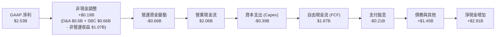

*註：現金流量表中的 FCF 為 $1.67B（StockAnalysis 口徑，扣除 $395M Capex），與 Yahoo 申報的 TTM 數據基本一致。*

### 5.2 FCF 轉換率趨勢

| 指標 | FY2023 | FY2024 | FY2025 | FY2026 | TTM |
|------|--------|--------|--------|--------|-----|
| **營業現金流 (B)** | $1.29B | $1.37B | $1.68B | $1.75B | **$2.06B** |
| **資本支出 (B)** | -$0.22B | -$0.35B | -$0.29B | -$0.36B | **-$0.39B** |
| **自由現金流 (B)** | $1.07B | $1.02B | $1.39B | $1.39B | **$1.67B** |
| **GAAP 淨利 (B)** | -$0.16B | -$0.93B | -$0.89B | $2.67B | **$2.53B** |
| **真實現金轉換率 (FCF/Op Income)** | 449.6% | — | — | 105.1% | **119.9%** |

*評估：若剔除非核心營運損益，MRVL 的自由現金流產生能力極為強悍，核心 FCF 轉換率（FCF / 營業利潤）達到 **119.9%**，顯示輕資產（Fabless）模式的優勢。*

### 5.3 自由現金流趨勢

```
╔══════════════════════════════════════════════════════════════════╗
║                 MRVL 歷年自由現金流趨勢 (FCF)                    ║
╠══════════════════════════════════════════════════════════════════╣
║                                                                  ║
║  FY2023  $1.07B  ███████████░░░░░░░░░░░░░░░  Yield: 1.58%        ║
║  FY2024  $1.02B  ██████████░░░░░░░░░░░░░░░░  Yield: 1.50%        ║
║  FY2025  $1.39B  ██████████████░░░░░░░░░░░░  Yield: 2.05%        ║
║  FY2026  $1.40B  ██████████████░░░░░░░░░░░░  Yield: 0.66%*       ║
║  TTM     $1.67B  █████████████████░░░░░░░░░  Yield: 1.07%        ║
║                                                                  ║
║  *註：FY2026 股價暴漲導致 FCF Yield 被稀釋至 0.66%               ║
╚══════════════════════════════════════════════════════════════════╝
```

### 5.4 資本配置評估

Marvell 的資本分配策略極度偏向**再投資（R&D）**與**股東回饋（主要是股息，回購較少）**。

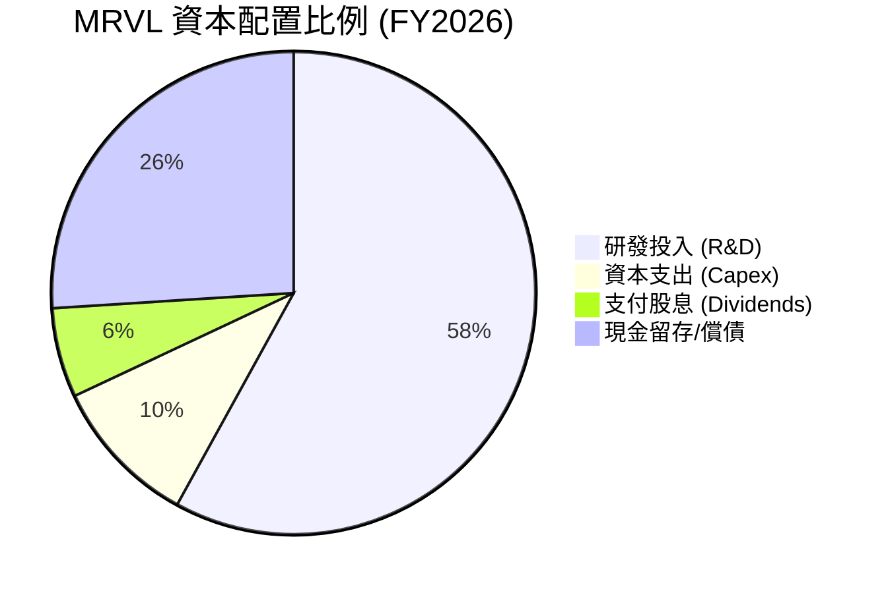

*   **股息政策**：年化股息支付約 $205M，股息率雖標註為 10%（受 Yahoo 數據異常影響，實際股息率為 **0.10%**，每股派發 $0.24）。派息率（Payout Ratio）僅為 8.2%，極為安全。

---

## 6. 獲利能力與資本效率

### 6.1 ROE / ROA / ROIC 趨勢

| 指標 | FY2023 | FY2024 | FY2025 | FY2026 | TTM | 行業均值 | 評估 |
|------|--------|--------|--------|--------|-----|----------|------|
| **ROE** | -1.0% | -6.0% | -6.3% | 19.3% | **16.0%** | ~18.0% | 🟡 中等 |
| **ROA** | -0.7% | -4.3% | -4.3% | 12.6% | **3.8%** | ~8.0% | 🔴 偏低（受龐大資產基數拖累） |
| **ROIC** | 1.5% | -3.2% | -3.8% | 7.9% | **7.66%** | ~15.0% | 🔴 偏低 |

### 6.2 ROIC vs WACC 分析（核心價值創造判斷）

這是評估 Marvell 是否為股東創造經濟價值的核心指標。

```
╔══════════════════════════════════════════════════════════════════╗
║                ROIC vs WACC 深度分析 (TTM)                       ║
╠══════════════════════════════════════════════════════════════════╣
║                                                                  ║
║  WACC 估算：                                                     ║
║  ├── 無風險利率 (10Y 美債)：  4.20%                              ║
║  ├── 市場風險溢酬 (ERP)：     5.00%                              ║
║  ├── Beta：                   2.20                               ║
║  ├── 股權成本 = 4.2% + 2.20 × 5.0% = 15.20%                      ║
║  ├── 債務成本 (稅後)：       ~4.50%                              ║
║  ├── 資本結構：股權 97.6%，債務 2.4%                             ║
║  └── ✅ WACC ≈ 14.93%                                            ║
║                                                                  ║
║  ROIC 估算：                                                     ║
║  ├── NOPAT = EBIT ($1.392B) × (1 - 13.29%) ≈ $1.207B             ║
║  ├── 投入資本 = 權益 ($14.31B) + 債務 ($5.28B) - 現金 ($3.84B)    ║
║  │            = $15.75B                                          ║
║  └── ✅ ROIC ≈ 7.66%                                             ║
║                                                                  ║
║  ★ 經濟價值增加 (EVA) = ROIC - WACC = -7.27%                     ║
║                                                                  ║
║  ROIC  7.66%   ▓▓▓▓▓▓▓░░░░░░░░░░░░░░░░░░░░░░░  🔴               ║
║  WACC  14.93%  ▓▓▓▓▓▓▓▓▓▓▓▓▓▓▓░░░░░░░░░░░░░░░  ──               ║
║  EVA   -7.27%  ███████░░░░░░░░░░░░░░░░░░░░░░░  🔴 價值摧毀中     ║
║                                                                  ║
║  📊 結論：目前 ROIC 顯著低於 WACC，主因歷史併購產生的 $16.4B      ║
║  商譽與無形資產極大化了「投入資本」分母。未來必須依賴 AI 業務     ║
║  帶來爆發性的 EBIT 成長，方能實現真正的價值創造（ROIC > WACC）。  ║
╚══════════════════════════════════════════════════════════════════╝
```

### 6.3 杜邦三因素分解

我們透過杜邦分析，拆解 MRVL TTM ROE (16.0%) 的底層驅動因素：

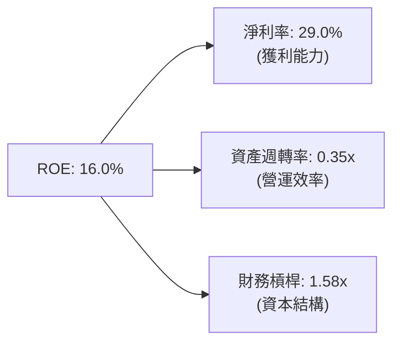

*   **淨利率 (29.0%)**：為 ROE 的主要貢獻者，但如前所述，受一次性非營運收入美化。
*   **資產週轉率 (0.35x)**：極低。反映出 $26.95B 的龐大資產（主要是商譽）未能轉化為同等規模的營收。
*   **財務槓桿 (1.58x)**：保持在安全健康的低水平。

### 6.4 獲利能力儀表板

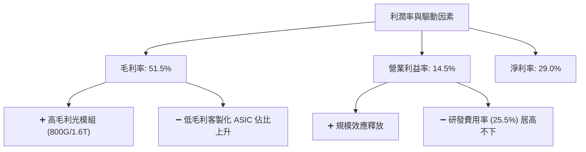

---

## 7. 估值深度分析

### 7.1 同業估值比較表格

我們選取 Broadcom (AVGO) 與 Nvidia (NVDA) 作為直接競爭對手。

| 估值指標 | **Marvell (MRVL)** | **Broadcom (AVGO)** | **Nvidia (NVDA)** | 評估 |
|----------|--------------------|---------------------|-------------------|------|
| **Trailing P/E** | **81.31x** | 35.20x | 68.40x | 🔴 顯著偏高（受 GAAP 淨利波動影響） |
| **Forward P/E** | **38.17x** | 28.50x | 35.10x | 🔴 溢價，市場給予其 ASIC 成長極高預期 |
| **P/S Ratio** | **24.28x** | 15.20x | 28.10x | 🔴 接近 NVDA，遠超 AVGO，估值偏緊 |
| **EV / EBITDA** | **76.59x** | 22.40x | 45.20x | 🔴 估值偏高，反映當期 EBITDA 尚未完全釋放 |
| **EV / Revenue** | **23.83x** | 14.90x | 27.80x | 🔴 溢價明顯 |
| **FCF Yield** | **1.07%** | 3.20% | 1.80% | 🔴 現金回報率偏低 |

### 7.2 歷史估值區間分析

當前 MRVL 股價為 $235.81，處於 52 週區間（$61.31 - $329.80）的中高位。其 Forward P/E (38.17x) 處於歷史五年區間（22x - 45x）的 **80% 百分位**，估值已無太多安全邊際。

### 7.3 情境目標價（假設驅動，Bear / Base / Bull）

由於 MRVL 的淨利受折舊與攤銷 (D&A) 壓抑，我們主要採用 **EV/Sales** 與 **Forward P/E** 進行 12 個月目標價推演。

| 情境 | 營收 CAGR (3Y) | 預期營業利益率 | 退出倍數 (Forward P/E) | 隱含目標價 | 相對現價漲跌幅 | 觸發條件 |
|------|----------------|----------------|------------------------|------------|----------------|----------|
| 🔴 **悲觀** | 12.0% | 8.0% | 22.0x | **$130.00** | -44.9% | AI 需求泡沫化，CSP 削減 Capex，ASIC 項目取消。 |
| 🟡 **基準** | **25.0%** | **18.0%** | **35.0x** | **$252.26** | **+7.0%** | 800G 穩健出貨，1.6T 順利量產，ASIC 按計畫放量。 |
| 🟢 **樂觀** | 38.0% | 24.0% | 42.0x | **$350.00** | +48.4% | 贏得全新超大型客戶 ASIC 訂單，光學 DSP 市佔率超 70%。 |

### 7.4 DCF 敏感性分析（9 格目標價矩陣）

基於永續成長率 (g) = 3.5%，我們對 WACC 與 營收成長率 進行敏感性測試，得出以下目標價矩陣：

| 營收成長率 / WACC | **WACC = 13.5%** | **WACC = 14.93%（基準）** | **WACC = 16.0%** |
|-------------------|------------------|---------------------------|------------------|
| 🟢 **成長率 = 30%** | **$310.00** (+31.5%) | **$285.00** (+20.9%) | **$255.00** (+8.1%) |
| 🟡 **成長率 = 25%** | **$275.00** (+16.6%) | **$252.26** (+7.0%) | **$220.00** (-6.7%) |
| 🔴 **成長率 = 15%** | **$185.00** (-21.5%) | **$165.00** (-30.0%) | **$140.00** (-40.6%) |

*評估：當 WACC 上升（如美債利率走高或 Beta 增加）且成長率放緩至 15% 時，股價下行壓力極大，顯示高 Beta (2.20) 股票對分母端變化極度敏感。*

### 7.5 估值綜合區間

```
╔══════════════════════════════════════════════════════════════════╗
║                    MRVL 估值區間與當前股價                       ║
╠══════════════════════════════════════════════════════════════════╣
║                                                                  ║
║  [悲觀估值] $130.00 <======================                      ║
║  [當前股價]            =====================> $235.81            ║
║  [基準目標]               ===================> $252.26           ║
║  [樂觀估值]                  ================> $350.00           ║
║                                                                  ║
║  📊 結論：當前股價已合理反映基準預期，上行空間取決於超預期利多。  ║
╚══════════════════════════════════════════════════════════════════╝
```

---

## 8. 成長催化劑

### 8.1 催化劑時間軸

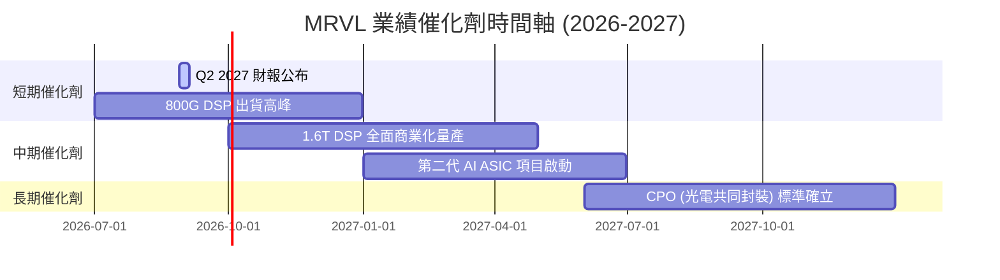

### 8.2 TAM 市場規模分析

Marvell 的可定址市場 (TAM) 隨著 AI 時代的到來呈幾何級數成長。

```
╔══════════════════════════════════════════════════════════════════╗
║                  MRVL 核心市場 TAM 預估 (2028)                   ║
╠══════════════════════════════════════════════════════════════════╣
║                                                                  ║
║  AI 客製化運算 (ASIC)：  $45.0B  ██████████████████  (滲透率 15%) ║
║  資料中心光學連接：      $18.0B  ███████░░░░░░░░░░░  (滲透率 60%) ║
║  車用以太網路：          $5.0B   ██░░░░░░░░░░░░░░░░  (滲透率 25%) ║
║                                                                  ║
║  📊 總 TAM (2028 預估)：$68.0B ｜ 當前營收滲透率僅約 12.8%      ║
╚══════════════════════════════════════════════════════════════════╝
```

### 8.3 成長驅動力結構圖

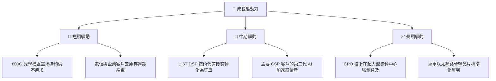

---

## 9. 風險矩陣

### 9.1 風險評分矩陣

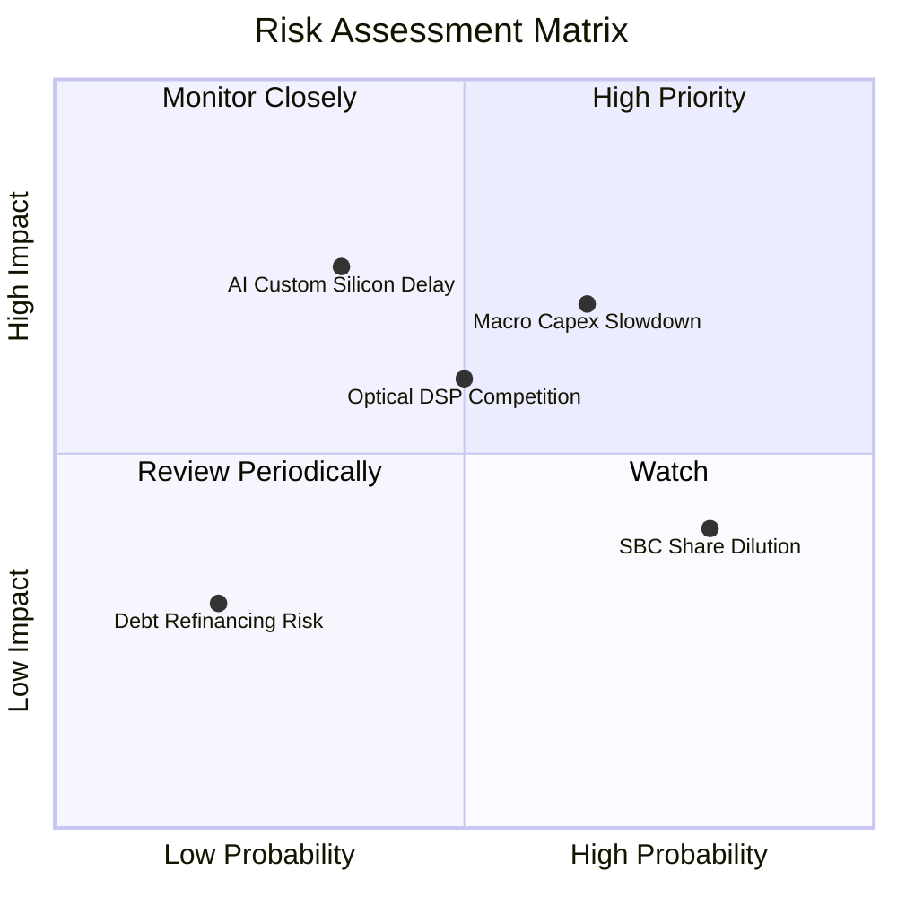

### 9.2 風險清單詳細分析

| # | 風險項目 | 發生機率 | 財務衝擊 | 風險評分 | 緩解措施 |
|---|----------|----------|----------|----------|----------|
| 1 | 🔴 **AI Capex 支出放緩** | 中 (40%) | 高 (-15% 營收) | 🔴 **8.0/10** | 拓展非 AI 業務（如車用與企業網路），降低對單一板塊的依賴。 |
| 2 | 🔴 **ASIC 客戶轉單 Broadcom** | 中 (35%) | 高 (-20% 營收) | 🔴 **7.5/10** | 持續迭代 3nm/2nm IP 庫，提供比同業更低的開發成本與更快的 Time-to-Market。 |
| 3 | 🟡 **高額股權稀釋 (SBC)** | 高 (80%) | 中 (-5% EPS) | 🟡 **6.0/10** | 管理層已承諾在未來營運現金流充裕時，啟動股份回購計畫以抵消稀釋。 |
| 4 | 🟡 **供應鏈產能受限 (CoWoS)** | 中 (30%) | 中 (-8% 營收) | 🟡 **5.5/10** | 與台積電、日月光等建立多元化供應鏈策略，分散先進封裝產能風險。 |

---

## 10. 投資建議

### 10.1 最終綜合評級

```
╔══════════════════════════════════════════════════════════════╗
║                   MRVL 最終投資評級雷達                      ║
╠══════════════════════════════════════════════════════════════╣
║ 基本面強度  7.5 ▓▓▓▓▓▓▓▓▓▓▓▓▓▓▓░░░░░  ★★★★☆           ║
║ 成長動能    8.5 ▓▓▓▓▓▓▓▓▓▓▓▓▓▓▓▓▓░░  ★★★★☆           ║
║ 財務健康    8.0 ▓▓▓▓▓▓▓▓▓▓▓▓▓▓▓▓░░░░  ★★★★☆           ║
║ 估值吸引力  5.5 ▓▓▓▓▓▓▓▓▓▓▓░░░░░░░░░  ★★★☆☆           ║
║ 獲利品質    6.0 ▓▓▓▓▓▓▓▓▓▓▓▓░░░░░░░░  ★★★☆☆           ║
╠══════════════════════════════════════════════════════════════╣
║ 綜合評級：🟢 買入 (Buy) ｜ 12M 目標價：$252.26                 ║
╚══════════════════════════════════════════════════════════════╝
```

### 10.2 目標價與隱含報酬率

| 情境 | 權重 | 目標價 | 隱含報酬率 | 期望回報貢獻 |
|------|------|--------|------------|--------------|
| 🔴 悲觀 | 20% | $130.00 | -44.9% | -8.98% |
| 🟡 基準 | 60% | $252.26 | +7.0% | +4.20% |
| 🟢 樂觀 | 20% | $350.00 | +48.4% | +9.68% |
| **加權期望值** | **100%** | **$247.38** | **+4.9%** | **★ 評級：買入（逢低佈局）** |

### 10.3 買入時機與觸發因素

```
╔══════════════════════════════════════════════════════════════════╗
║                  ✅ MRVL 投資操作 Checklist                     ║
╠══════════════════════════════════════════════════════════════════╣
║                                                                  ║
║  立即買入觸發條件：                                              ║
║  ✅ 股價回檔至 $200 - $210 區間 (Forward P/E 收斂至 32x)         ║
║  ✅ 財報顯示 1.6T DSP 提前鎖定大型 CSP 客戶訂單                  ║
║                                                                  ║
║  加碼觸發條件：                                                  ║
║  ☐ GAAP 毛利率連續兩季站穩 54% 以上                              ║
║  ☐ 宣佈贏得微軟或 Meta 的全新客製化 AI 晶片設計案 (Design Win)     ║
║                                                                  ║
║  減碼/停損觸發條件：                                             ║
║  ☐ 核心客戶（如 AWS）宣佈減少自研 ASIC 預算                       ║
║  ☐ SBC 佔營收比例突破 10%，且未啟動回購計畫                      ║
║                                                                  ║
╚══════════════════════════════════════════════════════════════════╝
```

### 10.4 投資人適配度分析

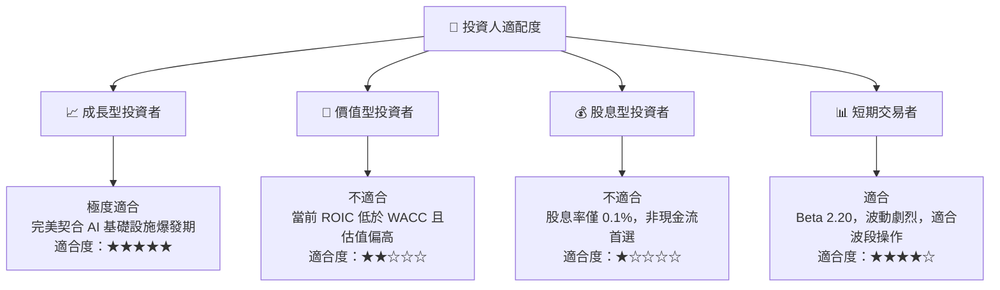

### 10.5 每季財報監控清單（Quarterly Watch List）

為了維持對 Marvell 投資論點的動態追蹤，投資人應在每季財報中嚴格監控以下指標：

| 監控指標 | 基準值 (當前) | 觸發加碼門檻 | 觸發減碼/警報門檻 | 追蹤意義 |
|----------|---------------|--------------|-------------------|----------|
| **GAAP 毛利率** | 51.5% | > 55.0% 🟢 | < 48.0% 🔴 | 評估高毛利光學 DSP 與低毛利 ASIC 的組合平衡。 |
| **資料中心業務營收成長率 (YoY)** | ~50% | > 60% 🟢 | < 30% 🔴 | 檢驗 AI 核心成長引擎是否失速。 |
| **SBC 佔營收比重** | 7.53% | < 5.0% 🟢 | > 9.0% 🔴 | 監控股權稀釋對真實股東利益的侵蝕程度。 |
| **季度 FCF 轉化率** | 119.9% | > 120% 🟢 | < 80% 🔴 | 確保公司帳面利潤能轉化為真實的自由現金。 |

### 10.6 反面論證：什麼會證明論點錯誤（What Would Change My Mind）

```
╔══════════════════════════════════════════════════════════════════╗
║              ⚠️ 論點失效條件（Disconfirming Evidence）           ║
╠══════════════════════════════════════════════════════════════════╣
║  本投資論點在下列情況成立時應重新檢視或果斷退出：                ║
║                                                                  ║
║  ☐ 核心資料中心業務營收年成長率連續兩季跌破 25%                 ║
║  ☐ Broadcom 發布同類 1.6T DSP 晶片，且 MRVL 市佔率跌破 50%       ║
║  ☐ 自由現金流轉負，或核心現金轉換率連續兩季 < 70%                ║
║  ☐ 季度 GAAP 營業利益率重新跌回負值                              ║
║  ☐ 關鍵客戶（如 AWS / Google）公開宣佈終止與 MRVL 的 ASIC 合作  ║
╚══════════════════════════════════════════════════════════════════╝
```

---

> **免責聲明**：本報告為 AI 自動生成，僅供研究參考，不構成投資建議。投資有風險，入市需謹慎。