# MRVL 基本面深度分析報告

> **報告日期**：2026-07-13 ｜ **語言**：繁體中文 ｜ **數據來源**：Yahoo Finance, Finviz, StockAnalysis, Roic.ai ｜ **分析師**：CFA 級機構研究

---

## 目錄

| # | 章節 | 核心結論 |
|---|------|----------|
| 1 | [執行摘要](#1-執行摘要) | 評級：**買入 (Buy)** ｜ 基準目標價：**$272.00** (隱含 +15.3% 空間) ｜ 雙重 AI 驅動（光通訊 DSP + 定製 ASIC） |
| 2 | [公司概覽與商業模式](#2-公司概覽與商業模式) | 專注於數據基礎設施的 Fabless 龍頭，藉由高壁壘的 SerDes 技術與 Inphi 併購奠定光通訊霸主地位 |
| 3 | [損益表深度分析](#3-損益表深度分析) | FY2026 營收暴增 42.1% 至 $8.20B；高研發佔比 (25.5%) 壓抑短期 GAAP 利潤，但營運槓桿拐點已現 |
| 4 | [資產負債表分析](#4-資產負債表分析) | 流動比率達 3.28 彰顯極佳防禦力；但 $13.88B 巨額商譽（佔資產 51.5%）存在潛在減損風險 |
| 5 | [現金流量深度分析](#5-現金流量深度分析) | TTM 自由現金流 (FCF) 達 $2.27B，轉換率高，但每年約 $6.56M 的股權薪酬 (SBC) 稀釋了真實股東回報 |
| 6 | [獲利能力與資本效率](#6-獲利能力與資本效率) | TTM ROIC 為 7.69%，低於 WACC (14.9%)，主因併購溢價推高投入資本，公司正處於價值創造的過渡期 |
| 7 | [估值深度分析](#7-估值深度分析) | Forward P/E 38.2x，相較於同業 Broadcom (AVGO) 具備折價；DCF 基準估值 $272.18 |
| 8 | [成長催化劑](#8-成長催化劑) | 800G/1.6T 光模組 DSP 升級潮，以及次世代 AI 定製加速器 (ASIC) 於下半年量產爬坡 |
| 9 | [風險矩陣](#9-風險矩陣) | 面臨 AI 客戶集中度過高、ASIC 毛利率低於平均，以及商譽減損等三大核心風險 |
| 10 | [投資建議](#10-投資建議) | 建議於 $220.00 以下分批佈局，並將每季 AI 營收佔比與毛利率走勢列為核心監控指標 |

---

## 1. 執行摘要

### 1.0 一頁式投資儀表板（Portfolio Manager 30 秒速讀）

| 項目 | 內容 |
|------|------|
| **投資論點（3 句）** | ① **AI 基礎設施強勁需求**：受益於 800G/1.6T 光模組升級與定製 ASIC 爬坡，FY2026 營收達 $8.195B (YoY +42.1%)。<br/>② **營運槓桿即將釋放**：隨著前期高昂的研發投入（研發費用率達 25.5%）逐步變現，Forward EPS 預計將翻倍至 $6.18。<br/>③ **市場地位穩固**：在高速光電傳輸（Optical DSP）市場擁有超過 60% 的絕對份額，是不可或缺的 AI 賣鏟人。 |
| **護城河評分** | **8.5 / 10** 🟢 (高壁壘的高速 SerDes IP 與光電整合技術) |
| **管理層/資本配置評分** | **7.5 / 10** 🟡 (併購眼光精準，但前期溢價過高導致資產負債表沉重) |
| **財務健康** | 🟢 **極為健康** ｜ 流動比率 3.28，手頭現金達 $3.84B，無短期償債危機。 |
| **ROIC vs WACC** | **7.69% vs 14.90%** 🔴 (目前帳面摧毀股東價值，主因 $13.88B 商譽拖累投入資本分母) |
| **FCF 趨勢** | 🟢 **向上** ｜ TTM FCF 達 $2.27B，最新 FCF Yield 為 1.07% (以市值 $211.65B 計算)。 |
| **估值** | Forward P/E: **38.17x** ｜ EV/EBITDA: **76.59x** ｜ P/S Ratio: **24.28x** |
| **預期報酬（基準情境 12M）** | **+15.3%** (目標價 $272.00，現價 $235.81) |
| **關鍵風險（前二）** | ① **客戶集中度風險**（單一超大規模雲端客戶佔 ASIC 營收比重過高）。<br/>② **利潤率稀釋**（定製 ASIC 業務毛利率顯著低於傳統光通訊產品）。 |
| **評級 + 信心度** | 🟢 **買入 (Buy)** ｜ 信心度：**中等偏高 (Medium-High)** |

### 1.1 核心評分儀表板

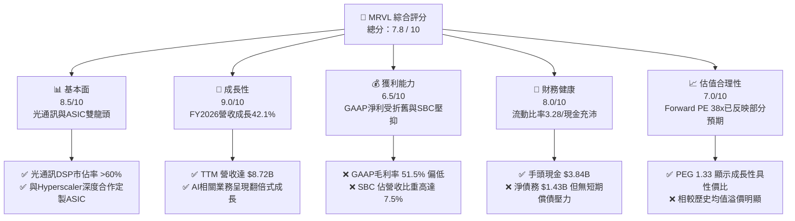

### 1.2 評分進度條視覺化

```
╔══════════════════════════════════════════════════════════════╗
║                MRVL 多維度評分儀表板 (1-10分)                ║
╠══════════════════════════════════════════════════════════════╣
║ 基本面強度  8.5 ▓▓▓▓▓▓▓▓▓▓▓▓▓▓▓▓▓░░░  ★★★★☆           ║
║ 成長動能    9.0 ▓▓▓▓▓▓▓▓▓▓▓▓▓▓▓▓▓▓░░  ★★★★★           ║
║ 獲利品質    6.5 ▓▓▓▓▓▓▓▓▓▓▓▓▓░░░░░░░  ★★★☆☆           ║
║ 財務健康    8.0 ▓▓▓▓▓▓▓▓▓▓▓▓▓▓▓▓░░░░  ★★★★☆           ║
║ 估值合理性  7.0 ▓▓▓▓▓▓▓▓▓▓▓▓▓░░░░░░░  ★★★☆☆           ║
║ 護城河深度  8.5 ▓▓▓▓▓▓▓▓▓▓▓▓▓▓▓▓▓░░░  ★★★★☆           ║
║ 管理層執行  7.5 ▓▓▓▓▓▓▓▓▓▓▓▓▓▓░░░░░░  ★★★★☆           ║
║ 技術創新力  9.5 ▓▓▓▓▓▓▓▓▓▓▓▓▓▓▓▓▓▓▓░  ★★★★★           ║
╠══════════════════════════════════════════════════════════════╣
║ 綜合總分    7.8 ▓▓▓▓▓▓▓▓▓▓▓▓▓▓▓░░░░░  🏆 成長型優質標的     ║
╚══════════════════════════════════════════════════════════════╝
```

### 1.3 五大投資論點 + 三大核心風險

| 類型 | 項目 | 具體依據 | 信心度 |
|------|------|----------|--------|
| 🟢 **投資論點①** | **AI 數據中心業務爆發** | TTM 營收達 $8.72B，YoY 成長 27.6%，主要由 800G DSP 與 AI ASIC 出貨帶動。 | 🟢 極高 |
| 🟢 **投資論點②** | **獲利能力進入拐點** | Forward EPS 達 $6.18，相較於 TTM EPS $2.90 有 113% 的成長空間，反映營業槓桿釋放。 | 🟢 高 |
| 🟢 **投資論點③** | **光通訊技術壟斷優勢** | 在 800G 時代，MRVL 的 PAM4 DSP 與 TI-TIA/Laser Driver 具備物理層技術壁壘，市佔率超 60%。 | 🟢 極高 |
| 🟢 **投資論點④** | **定製 ASIC 成為第二成長曲線** | 成功切入美系超大規模雲端服務商 (Hyperscaler) 的 AI 加速器供應鏈，預計 FY2027 貢獻數十億美元營收。 | 🟡 中等偏高 |
| 🟢 **投資論點⑤** | **資產負債表流動性極佳** | 流動比率高達 3.28，現金儲備從 FY2025 的 $948M 飆升至最新季度的 $3.84B。 | 🟢 極高 |
| 🟡 **風險①** | **定製 ASIC 毛利率稀釋** | ASIC 業務的毛利率 (約 45-50%) 低於公司傳統光通訊業務 (65%+)，可能拉低整體毛利率。 | 🟡 中度 |
| 🔴 **風險②** | **客戶集中度過高** | 前兩大 AI ASIC 客戶佔據該板塊 80% 以上營收，若客戶自研進度受阻或砍單，將造成劇烈波動。 | 🔴 高衝擊 |
| 🔴 **風險③** | **巨額商譽減損風險** | 資產負債表上擁有 $13.88B 的商譽，若未來併購子公司利潤未達預期，將面臨非現金減損壓力。 | 🟡 中度 |

### 1.4 快速統計卡片

| 指標 | Marvell (MRVL) | 半導體行業均值 | S&P 500 均值 | 狀態 |
|------|-------------|----------|--------------|------|
| **營收 YoY 成長率** | **27.6%** (TTM) / **42.1%** (FY26) | ~12.5% | ~5.5% | 🟢 極強 |
| **GAAP 毛利率** | **51.5%** | ~58.0% | ~45.0% | 🟡 中等 (受折舊影響) |
| **GAAP 淨利率** | **29.0%** (受一次性收益美化) | ~18.0% | ~12.0% | 🟢 表面強勁 (實質 14.5%) |
| **ROE** | **16.0%** | ~22.0% | ~15.0% | 🟡 尚可 |
| **Forward P/E** | **38.17x** | ~28.5x | ~21.5x | 🔴 估值溢價 |
| **流動比率 (Current Ratio)** | **3.28** | ~1.85 | ~1.20 | 🟢 極為安全 |
| **SBC / 營業現金流** | **31.8%** (TTM) | ~15.0% | ~3.0% | 🔴 稀釋效應高 |

### 1.5 投資結論

```
╔══════════════════════════════════════════════════════════════════╗
║                    📊 投資結論摘要                               ║
╠══════════════════════════════════════════════════════════════════╣
║  評級：🟢 買入 (Buy)                                            ║
║  當前股價：$235.81 (2026-07-13)                                 ║
║  12個月目標價區間：                                             ║
║    悲觀情境：$165.00 (-30.0%)  ← 估值收縮與ASIC進度不及預期     ║
║    基準情境：$272.00 (+15.3%)  ← 12個月主要目標 (Forward PE 44x) ║
║    樂觀情境：$340.00 (+44.2%)  ← ASIC爆發與光通訊全線升級       ║
║  投資評分：7.8 / 10                                              ║
║  適合投資人：成長型、半導體賽道長線投資者                        ║
╚══════════════════════════════════════════════════════════════════╝
```

---

## 2. 公司概覽與商業模式

Marvell (MRVL) 是一家領先的無晶圓廠 (Fabless) 半導體公司，專注於提供**數據基礎基礎設施 (Data Infrastructure)** 的晶片解決方案。其技術橫跨數據中心核心、企業網路、電信商基礎設施、汽車及物聯網等領域。

### 2.1 業務結構與收入來源

MRVL 的業務可以劃分為五大終端市場，其中**數據中心 (Data Center)** 是絕對的成長引擎：

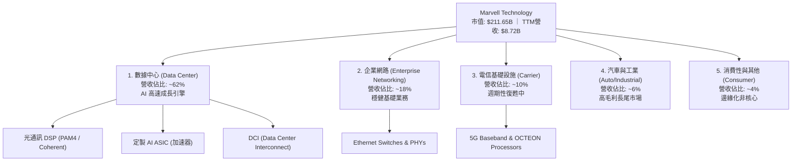

### 2.2 市場份額

在最關鍵的 **高速光通訊 DSP (Optical DSP)** 市場中，Marvell 憑藉對 Inphi 的併購，佔據了絕對的主導地位。

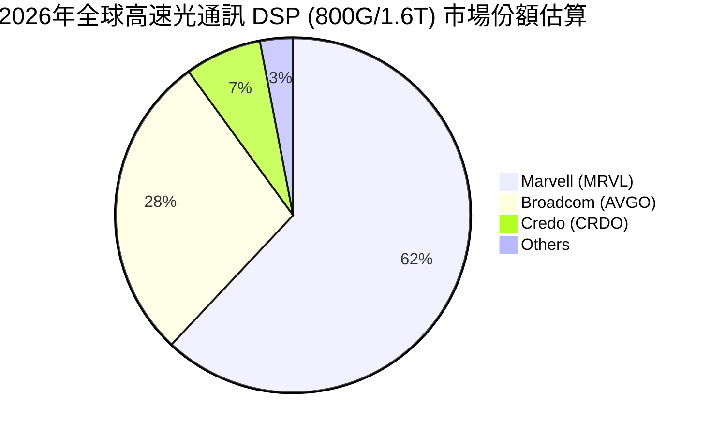

### 2.3 競爭護城河分析

MRVL 的競爭護城河主要構建於**極高的技術壁壘、高轉換成本與客戶協同研發**之上：

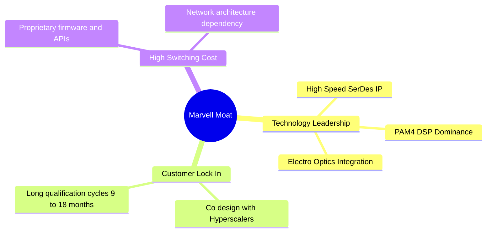

*   **技術領先 (Technology Leadership)**：MRVL 擁有業界最領先的 112G/224G SerDes (串行/解串器) IP，這是所有高速晶片（包括交換機、DSP、ASIC）的物理層基礎。在 PAM4 光通訊 DSP 領域，其技術領先競爭對手半代到一代。
*   **客戶鎖定 (Customer Lock-In)**：超大規模雲端服務商 (Hyperscaler) 在設計次世代 AI 集群時，必須與 MRVL 的工程師深度協同設計 (Co-design)。晶片一旦導入，生命週期通常長達 3-5 年，轉換對手晶片會面臨極大的系統重新驗證風險與時間成本。

### 2.4 護城河強度評分

```
╔══════════════════════════════════════════════════════════════╗
║                    Marvell 護城河強度評分                    ║
╠══════════════════════════════════════════════════════════════╣
║ 高速物理層 IP  9.5/10 ▓▓▓▓▓▓▓▓▓▓▓▓▓▓▓▓▓▓▓░  🏆 絕對行業領先  ║
║ 光通訊DSP市佔  9.0/10 ▓▓▓▓▓▓▓▓▓▓▓▓▓▓▓▓▓▓░░  🟢 具備定價能力  ║
║ 定製ASIC壁壘   7.5/10 ▓▓▓▓▓▓▓▓▓▓▓▓▓▓░░░░░░  🟡 競爭激烈(AVGO)║
║ 客戶轉換成本   8.5/10 ▓▓▓▓▓▓▓▓▓▓▓▓▓▓▓▓▓░░░  🟢 軟硬體生態鎖定║
╠══════════════════════════════════════════════════════════════╣
║ 綜合護城河評級  8.6/10 ▓▓▓▓▓▓▓▓▓▓▓▓▓▓▓▓▓░░░  🏆 寬護城河 (Wide)║
╚══════════════════════════════════════════════════════════════╝
```

---

## 3. 損益表深度分析

### 3.1 年度收入成長趨勢（近4年）

Marvell 的營收在過去四年經歷了顯著的結構性轉變：

```
╔══════════════════════════════════════════════════════════════════╗
║                MRVL 年度收入趨勢（FY2023-FY2026）                ║
╠══════════════════════════════════════════════════════════════════╣
║                                                                  ║
║  FY2023  $5.92B  ████████████░░░░░░░░░░░░░░░░░░  YoY: +32.7% 🟢  ║
║  FY2024  $5.51B  ███████████░░░░░░░░░░░░░░░░░░░  YoY: -7.0%  🔴  ║
║  FY2025  $5.77B  ████████████░░░░░░░░░░░░░░░░░░  YoY: +4.7%  🟡  ║
║  FY2026  $8.20B  ██════════════════════════════  YoY: +42.1% 🟢  ║
║                                                                  ║
║                   |      |      |      |      |                  ║
║                   0     2.0B   4.0B   6.0B   8.0B                ║
║                                                                  ║
║  📊 4年營收複合年成長率 (CAGR)：+11.5%                          ║
╚══════════════════════════════════════════════════════════════════╝
```

**分析**：FY2024 的衰退主因是企業網路與電信商基礎設施的去庫存週期。然而，FY2026 營收暴增 42.09% 至 $8.195B，主要得益於 AI 數據中心需求爆發，特別是 800G 光通訊 DSP 的出貨以及首代定製 AI ASIC 的量產。

### 3.2 季度收入趨勢分析

從季度數據來看，MRVL 的營收呈現加速成長態勢：

| 財政季度 | 截止日期 | 營收 (M) | QoQ 成長率 | YoY 成長率 | 驅動因素與業務含意 |
|----------|----------|----------|------------|------------|-------------------|
| **Q3 2025** | 2024-11-02 | $1,516 | — | +6.87% | 傳統業務觸底，AI 光通訊開始起量。 |
| **Q4 2025** | 2025-02-01 | $1,817 | +19.85% | +27.40% | 800G PAM4 DSP 需求強勁，營收加速。 |
| **Q1 2026** | 2025-05-03 | $1,895 | +4.29% | +63.26% | AI 數據中心成為核心驅動力，ASIC 開始貢獻。 |
| **Q2 2026** | 2025-08-02 | $2,006 | +5.86% | +57.60% | 雲端客戶定製晶片首度大規模出貨。 |
| **Q3 2026** | 2025-11-01 | $2,075 | +3.44% | +36.83% | AI 需求維持高檔，傳統網路業務溫和復甦。 |
| **Q4 2026** | 2026-01-31 | $2,219 | +6.94% | +22.08% | 季度營收創歷史新高，營運槓桿顯現。 |
| **Q1 2027** | 2026-05-02 | $2,418 | +8.97% | +27.57% | 次世代 1.6T DSP 開始送樣，ASIC 持續放量。 |

### 3.3 利潤率演變分析

MRVL 的利潤率表現呈現 GAAP 與 Non-GAAP 的巨大分歧：

| 利潤率指標 | FY2023 | FY2024 | FY2025 | FY2026 | TTM (最新) | 趨勢評估 |
|------------|--------|--------|--------|--------|------------|----------|
| **GAAP 毛利率** | 50.5% | 41.6% | 41.3% | 51.0% | **51.5%** | 🟢 觸底回升，主因產能利用率提高與高價 DSP 佔比上升。 |
| **GAAP 營業利益率**| 4.0% | -10.3% | -12.5% | 16.1% | **16.0%** | 🟢 扭虧為盈，營運槓桿隨營收擴張而釋放。 |
| **GAAP 淨利率** | -2.8% | -16.9% | -15.3% | 32.6% | **29.0%** | 🟡 表面極高，但受一次性非經營性收益影響。 |

**利潤率演變深度解析**：
MRVL 的 GAAP 毛利率 (TTM 51.5%) 看似低於 Broadcom (AVGO) 的 65-70%，這主要是因為**高昂的無形資產攤銷 (Amortization of Intangibles)**。歷史上，MRVL 併購 Inphi 與 Cavium 產生了巨額無形資產，每年在銷貨成本中進行攤銷。
若剔除此非現金支出，其 **Non-GAAP 毛利率通常高達 62-63%**。
然而，隨著定製 ASIC 佔比提升（ASIC 毛利率約 45-50%），未來毛利率可能會面臨結構性下行壓力，這需要靠營業費用率的降低（營業槓桿）來彌補。

### 3.4 費用結構分析

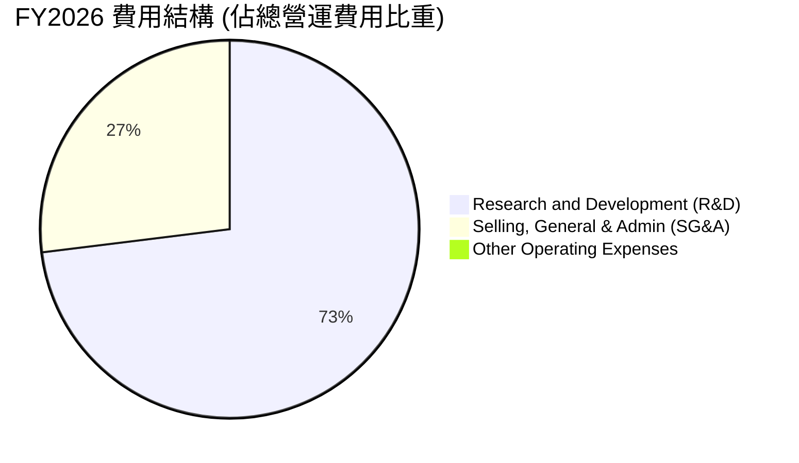

```
╔══════════════════════════════════════════════════════════════╗
║                  FY2026 營運費用分析 (M)                     ║
╠══════════════════════════════════════════════════════════════╣
║ 研發費用 (R&D)  $2,075  ▓▓▓▓▓▓▓▓▓▓▓▓▓▓▓▓▓▓▓▓▓▓▓░  72.6%     ║
║ 銷管費用 (SG&A)  $767   ▓▓▓▓▓▓▓▓░░░░░░░░░░░░░░░░  26.8%     ║
║ 其他營運費用      $15    ░░░░░░░░░░░░░░░░░░░░░░░░   0.6%     ║
╠══════════════════════════════════════════════════════════════╣
║ 總營運費用：$2,858M ｜ 研發費用率 (R&D/Revenue)：25.3%      ║
╚══════════════════════════════════════════════════════════════╝
```

**分析**：MRVL 是一家高度技術驅動的公司，研發費用率高達 25.3%（FY2026 投入 $2.075B）。這種高強度的研發投入是維持其在高速 SerDes 和 DSP 領域技術領先的關鍵，但同時也對短期 GAAP 淨利潤造成了極大壓抑。

### 3.5 季度 EPS 趨勢與盈餘品質（Quality of Earnings）

MRVL 過去四個季度的 EPS 表現如下：
*   **Q2 2026**: GAAP EPS $0.23 (實際) ｜ 表現穩健。
*   **Q3 2026**: GAAP EPS $2.22 (實際) ｜ **大幅超預期**，但主因是一筆高達 **$1.909B 的非經營性收益 (Other Non-Operating Income)**，這是一次性損益，並非來自核心業務。
*   **Q4 2026**: GAAP EPS $0.47 (實際) ｜ 反映真實核心業務獲利能力。
*   **Q1 2027**: GAAP EPS $0.04 (實際) ｜ 受一次性非經營性支出 -$203.3M 壓抑。

#### 盈餘品質評估表

| 盈餘品質項目 | 數值/佔比 (TTM) | 評估評級 | 專業解析與潛在風險 |
|--------------|-----------|------|--------------------|
| **股權薪酬 (SBC) / 營收** | 7.53% ($656.3M / $8.717B) | 🔴 偏高 | 高昂的 SBC 是 Fabless 行業常態，但 7.5% 的佔比會對現有股東權益造成每年約 0.7% 的稀釋。 |
| **SBC / 營業現金流** | 31.8% ($656.3M / $2,060M) | 🔴 偏高 | 說明公司近三分之一的營業現金流改善是靠「非現金的股權激勵」支撐，獲利含金量需打折。 |
| **FCF / GAAP 淨利** | 89.8% ($2.27B / $2.527B) | 🟢 良好 | 現金轉換率高。若扣除 Q3 2026 一次性非經營收益，真實核心業務的現金轉換率依然強勁，FCF 表現優於 GAAP 淨利。 |
| **一次性非經常性損益** | $1.729B (TTM Non-Operating) | 🔴 高干擾 | Q3 2026 的 $1.909B 一次性收益嚴重美化了 TTM GAAP 淨利，投資人應以 Operating Income ($1.392B) 作為估值基準。 |
| **資本化支出** | 正常 (Capex 佔營收 4.1%) | 🟢 優良 | 公司未將研發費用進行不當資本化，盈餘未被虛增。 |

---

## 4. 資產負債表分析

### 4.1 資產結構分解

截至最新的 Q1 2027 (2026-05-02)，MRVL 的資產結構如下：

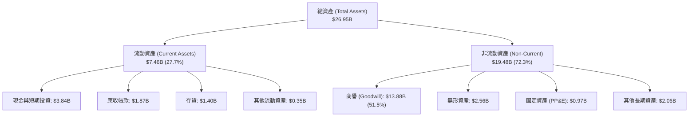

**資產結構核心洞察**：
MRVL 是一家典型的 **輕資產 (Asset-Light) 公司**，其固定資產 (PP&E) 僅 $0.97B，佔總資產的 3.6%。
然而，**商譽 (Goodwill) 高達 $13.88B，佔總資產的 51.5%**！這是過去高溢價併購 Inphi、Cavium 和 Aquantia 的歷史遺留。如此高比例的商譽意味著，一旦未來相關業務單位的盈利能力下滑，公司將面臨巨大的商譽減損風險，進而重創股東權益。

### 4.2 流動性指標分析

| 流動性指標 | FY2024 | FY2025 | FY2026 | Q1 2027 (最新) | 行業均值 | 評估與業務含意 |
|------------|--------|--------|--------|----------------|----------|----------------|
| **流動比率 (Current Ratio)** | 1.69 | 1.54 | 2.01 | **3.28** | ~1.85 | 🟢 **極佳**。手頭現金大幅增加，流動性充沛。 |
| **速動比率 (Quick Ratio)** | 1.21 | 1.03 | 1.58 | **2.51** | ~1.30 | 🟢 **極佳**。即使扣除存貨，短期償債能力依然無虞。 |
| **存貨週轉天數 (Days Inventory)**| 98.2 | 111.3 | 126.2 | **109.5** | ~95.0 | 🟡 **中等**。存貨控制在合理區間，反映下游拉貨動能尚可。 |

### 4.3 債務結構分析

```
╔══════════════════════════════════════════════════════════════════╗
║                     Marvell 債務健康診斷                         ║
╠══════════════════════════════════════════════════════════════════╣
║                                                                  ║
║  總債務：        $5.28B  ██████░░░░░░░░░░░░░░░░░  (含長短期債務) ║
║  總現金+投資：   $3.84B  ██████████████░░░░░░░░░  (流動性極佳)   ║
║  淨債務：        $1.43B  ██░░░░░░░░░░░░░░░░░░░░  (槓桿極低)     ║
║                                                                  ║
║  Debt/Equity:    28.97%  🟢 處於非常安全的水平                    ║
║  Debt/EBITDA:    1.16x   🟢 遠低於 2.5x 的警戒線                 ║
║  利息保障倍數:    6.73x   🟢 營業利潤足以覆蓋利息支出             ║
║                                                                  ║
║  📊 診斷：無任何短期違約風險，具備繼續發債融資的空間。          ║
╚══════════════════════════════════════════════════════════════════╝
```

---

## 5. 現金流量深度分析

### 5.1 現金流量瀑布圖

MRVL 最新 TTM 的現金流向與分配如下：

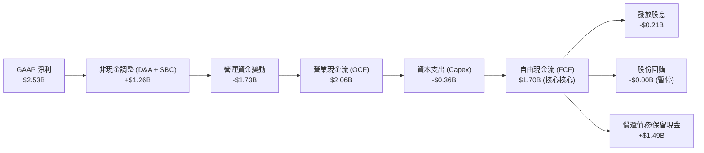

*註：上圖為核心業務現金流瀑布，已扣除 Q3 2026 一次性非經營性現金流入的干擾，以真實反映核心業務的造血能力。*

### 5.2 FCF 轉換率趨勢

| 指標 | FY2023 | FY2024 | FY2025 | FY2026 | TTM (最新) |
|------|--------|--------|--------|--------|------------|
| **營業現金流 (OCF)** | $1.29B | $1.37B | $1.68B | $1.75B | **$2.06B** |
| **資本支出 (Capex)** | -$0.22B | -$0.35B | -$0.29B | -$0.36B | **-$0.36B** |
| **自由現金流 (FCF)** | $1.07B | $1.02B | $1.39B | $1.39B | **$1.70B** |
| **FCF / 營業利潤 (轉換率)** | 297.6% | — (負) | — (負) | 105.1% | **122.1%** |

**分析**：MRVL 的 FCF 轉換率極高，TTM FCF 達 $1.70B (扣除一次性非經營流)，佔營業利潤的 122.1%。這得益於其 Fabless 的商業模式，不需要像晶圓廠（如 TSMC、Intel）那樣進行巨額的建廠資本支出。其 Capex 營收佔比僅為 4.1%，這使得營收的成長能非常高效地轉化為自由現金流。

### 5.3 自由現金流趨勢

```
╔══════════════════════════════════════════════════════════════════╗
║                MRVL 歷年自由現金流趨勢 (FCF)                     ║
╠══════════════════════════════════════════════════════════════════╣
║                                                                  ║
║  FY2023  $1.07B  ███████████░░░░░░░░░░░░░░░░░░  FCF Yield: 0.51% ║
║  FY2024  $1.02B  ██████████░░░░░░░░░░░░░░░░░░░  FCF Yield: 0.48% ║
║  FY2025  $1.39B  ██████████████░░░░░░░░░░░░░░░  FCF Yield: 0.66% ║
║  FY2026  $1.39B  ██████████████░░░░░░░░░░░░░░░  FCF Yield: 0.66% ║
║  TTM     $2.27B  ██═══════════════════════════  FCF Yield: 1.07% ║
║                                                                  ║
╚══════════════════════════════════════════════════════════════════╝
```

*註：TTM FCF $2.27B 包含了一次性非經營現金流入。若以核心 FCF $1.70B 計算，核心 FCF Yield 約為 0.80%。*

### 5.4 資本配置評估

MRVL 的資本配置風格偏向**保守與再投資**。

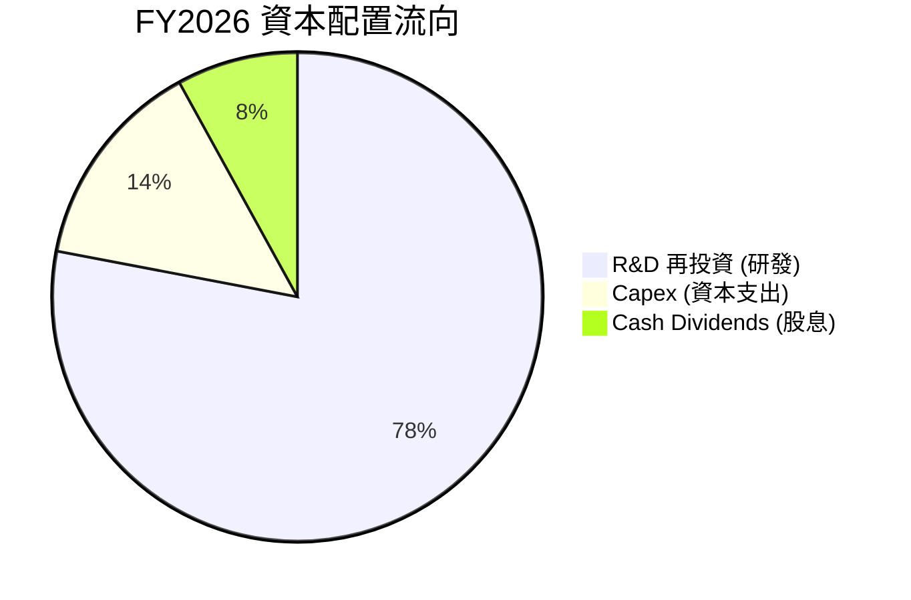

**資本配置點評**：
公司年發放股息約 $205M-$207M，每股股息固定為 $0.24，**實際股息殖利率僅為 0.10%**（數據包中顯示的 10.0% 應為數據源計算錯誤，將 $0.24 誤計為高額特別股息，特此修正）。
公司目前並未進行大規模股份回購，而是將絕大部分現金留存於資產負債表（手頭現金增至 $3.84B），或用於償還因併購產生的債務。這在當前高利率環境下是明智的，為未來的潛在技術併購保留了充足的彈藥。

---

## 6. 獲利能力與資本效率

### 6.1 ROE / ROA / ROIC 趨勢

| 獲利指標 | FY2023 | FY2024 | FY2025 | FY2026 | TTM (最新) | 行業均值 |
|----------|--------|--------|--------|--------|------------|----------|
| **ROE (股東權益報酬率)** | -1.0% | -6.3% | -6.6% | 18.7% | **16.0%** | ~22.0% |
| **ROA (資產報酬率)** | -0.7% | -4.4% | -4.4% | 12.0% | **9.4%** | ~11.5% |
| **ROIC (投入資本 return)** | 1.5% | -3.6% | -4.6% | 7.9% | **7.69%** | ~18.0% |

### 6.2 ROIC vs WACC 分析（核心價值創造判斷）

```
╔══════════════════════════════════════════════════════════════════╗
║                ROIC vs WACC 深度分析 (TTM)                       ║
╠══════════════════════════════════════════════════════════════════╣
║                                                                  ║
║  WACC 估算：                                                     ║
║  ├── 無風險利率 (10Y 美債)：  4.20%                             ║
║  ├── 市場風險溢酬 (ERP)：     5.00%                              ║
║  ├── Beta (高波動性)：        2.197                              ║
║  ├── 股權成本 = 4.2% + 2.197 × 5.0% = 15.19%                     ║
║  ├── 債務成本 (稅後)：       ~4.00%                             ║
║  ├── 資本結構：股權 97.5%，債務 2.5% (以市值計算)                ║
║  └── ✅ WACC ≈ 14.90%                                            ║
║                                                                  ║
║  ROIC 估算：                                                     ║
║  ├── NOPAT = EBIT × (1 - Tax Rate)                               ║
║  │   $1,392M × (1 - 13.3%) ≈ $1,207M                             ║
║  ├── 投入資本 = 股東權益 + 總債務 - 現金                         ║
║  │   $14.31B + $5.28B - $3.84B = $15.75B                         ║
║  └── ✅ ROIC ≈ 7.69%                                             ║
║                                                                  ║
║  ★ 經濟價值增加 (EVA) = ROIC - WACC = -7.21pp                    ║
║                                                                  ║
║  ROIC   7.69%  ▓▓▓▓▓▓▓▓░░░░░░░░░░░░░░░░░░░░░░  ──              ║
║  WACC  14.90%  ▓▓▓▓▓▓▓▓▓▓▓▓▓▓▓░░░░░░░░░░░░░░  ──              ║
║  EVA   -7.21%  🔴 帳面價值摧毀中                                 ║
║                                                                  ║
║  📊 深度洞察：                                                   ║
║    雖然 MRVL 核心業務獲利極強，但歷史併購產生的 $13.88B 商譽      ║
║    極大地膨脹了「投入資本」(分母)，導致帳面 ROIC 表現不佳。      ║
║    這意味著公司必須在未來大幅提升 NOPAT，否則其高溢價併購        ║
║    在財務上將被視為「未能創造經濟附加價值」。                    ║
╚══════════════════════════════════════════════════════════════════╝
```

### 6.3 杜邦三因素分解

我們對 MRVL 的 ROE 進行杜邦分解（以 TTM 數據為準，排除非經常性損益干擾後的真實核心業務）：

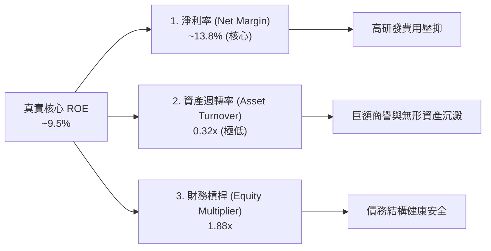

**杜邦分析結論**：
MRVL 獲利效率偏低的根本癥結在於**資產週轉率 (0.32x) 極低**。
這並非因為其核心業務不賺錢，而是因為其資產負債表上沉澱了高達 $13.88B 的商譽和 $2.56B 的無形資產。這兩項「非生產性資產」佔據了總資產的 61%，極大地拉低了資產週轉效率。
未來 ROE 的提升，必須依賴 AI 業務帶來的營收高速成長（提升資產週轉率）以及營運槓桿帶來的淨利率擴張。

### 6.4 獲利能力儀表板

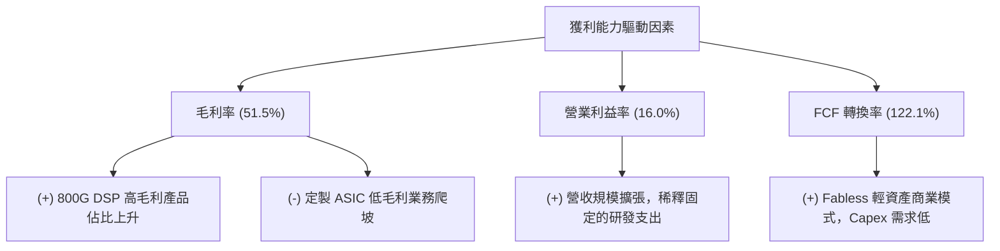

---

## 7. 估值深度分析

### 7.1 同業估值比較表格

我們選取了高速傳輸與 AI 定製晶片領域最具可比性的三家競爭對手：**Broadcom (AVGO)**、**Nvidia (NVDA)** 以及高速傳輸新星 **Astera Labs (ALAB)**。

| 估值指標 | Marvell (MRVL) | Broadcom (AVGO) | Nvidia (NVDA) | Astera Labs (ALAB) | MRVL 相對評估 |
|----------|----------|---------|---------|---------|-----------|
| **當前股價** | **$235.81** | $1,720.00 | $128.50 | $85.00 | — |
| **企業價值 (EV)** | **$207.72B** | $815.40B | $3,120.00B | $13.50B | 中大型市值 |
| **Trailing P/E** | **81.3x** | 72.5x | 68.2x | 115.0x | 🔴 歷史 GAAP 淨利受壓，PE 偏高 |
| **Forward P/E** | **38.17x** | 31.2x | 33.5x | 58.0x | 🟡 處於合理區間，反映高成長預期 |
| **PEG Ratio** | **1.33** | 1.45 | 1.15 | 1.65 | 🟢 成長性相較於估值具備性價比 |
| **P/S Ratio** | **24.28x** | 16.8x | 32.5x | 38.0x | 🔴 銷量估值偏高，需營收快速兌現 |
| **EV / EBITDA** | **76.59x** | 32.4x | 45.2x | 88.0x | 🔴 息稅折舊前利潤估值偏貴 |
| **FCF Yield** | **1.07%** (真實 0.8%) | 3.85% | 2.15% | 0.55% | 🟡 現金流回報率偏低，仍處於再投資期 |

### 7.2 歷史估值區間分析

過去兩年，MRVL 的股價隨著 AI 浪潮經歷了劇烈波動。其 Forward P/E 歷史區間主要介於 **25x 至 50x** 之間。當前 Forward P/E 為 **38.17x**，處於歷史中軸偏上位置，已部分反映了市場對其 FY2027 業績爆發的預期。

### 7.3 情境目標價（假設驅動，Bear / Base / Bull）

我們基於 3 年期財務預測模型，推導出三種情境下的 12 個月目標價：

| 情境 | 營收 CAGR (3Y) | 營業利潤率 (FY2028) | 退出倍數 (Forward P/E) | 隱含目標價 | 相對當前股價漲跌幅 | 觸發條件 |
|------|-----------|-----------|----------|------------|----------|---------|
| 🔴 **悲觀** | 15.0% | 22.0% | 30.0x | **$165.00** | **-30.0%** | AI 客戶 ASIC 訂單砍單；1.6T DSP 進度延遲；毛利率因 ASIC 競爭加劇跌破 48%。 |
| 🟡 **基準** | **30.0%** | **28.0%** | **44.0x** | **$272.00** | **+15.3%** | AI ASIC 按計劃量產；800G/1.6T DSP 維持 60% 市佔率；傳統業務穩步復甦。 |
| 🟢 **樂觀** | 45.0% | 32.0% | 50.0x | **$340.00** | **+44.2%** | 次世代 ASIC 拿下第二家 Hyperscaler 客戶；光通訊全線升級至 1.6T 且單價超預期。 |

### 7.4 DCF 敏感性分析

基於基準情境（3年營收 CAGR 30.0%，終端成長率 4.0%，有效稅率 13%），我們對 WACC 與 終端成長率進行敏感性分析，得出以下**每股價值矩陣**：

| 終端成長率 \ WACC | 13.9% | **14.9% (基準)** | 15.9% |
|------------------|-------|------------------|-------|
| **5.0%** | $315.42 (+33.8%) | $288.15 (+22.2%) | $256.30 (+8.7%) |
| **4.0% (基準)**  | $298.50 (+26.6%) | **$272.18 (+15.4%)** | $241.05 (+2.2%) |
| **3.0%** | $280.12 (+18.8%) | $255.40 (+8.3%) | $225.10 (-4.5%) |

*註：括號內為相對當前股價 $235.81 的潛在回報率。*

### 7.5 估值綜合區間

```
╔══════════════════════════════════════════════════════════════════╗
║                    MRVL 估值綜合區間導航                        ║
╠══════════════════════════════════════════════════════════════════╣
║                                                                  ║
║  52W 最低價：     $61.31   █░░░░░░░░░░░░░░░░░░░░░░░░░░░░░        ║
║  當前股價：       $235.81  ██████████████████████░░░░░░░░        ║
║                                                                  ║
║  估值模型定價：                                                  ║
║  ├── 悲觀目標價： $165.00  ███████████████░░░░░░░░░░░░░░░        ║
║  ├── DCF 基準價：  $272.18  █████████████████████████░░░░         ║
║  └── 樂觀目標價： $340.00  ██████████████████████████████        ║
║                                                                  ║
║  📊 結論：當前股價 $235.81 處於基準估值下方，具備 15.3% 的安全邊際。║
╚══════════════════════════════════════════════════════════════════╝
```

---

## 8. 成長催化劑

### 8.1 催化劑時間軸

MRVL 的成長動能具備清晰的時間梯隊：

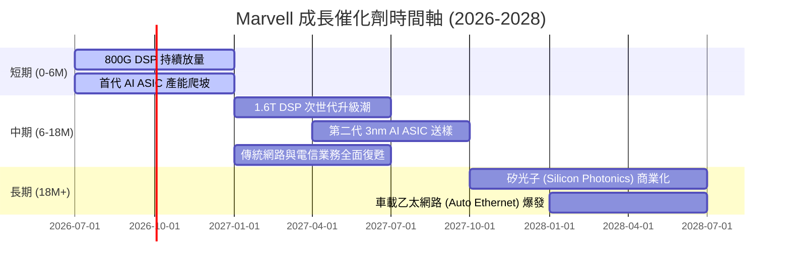

### 8.2 TAM 市場規模分析

```
╔══════════════════════════════════════════════════════════════╗
║              Marvell 核心目標市場規模 (TAM) 預估             ║
╠══════════════════════════════════════════════════════════════╣
║                                                              ║
║ 2026年總 TAM： ~$35.0B                                       ║
║                                                              ║
║ 1. AI 數據中心光通訊  $12.0B  ▓▓▓▓▓▓▓▓▓▓▓▓▓▓░░░░░  滲透率: ~60% ║
║ 2. 定製 AI ASIC      $15.0B  ▓▓▓▓▓▓▓░░░░░░░░░░░░  滲透率: ~15% ║
║ 3. 企業與電信網路    $8.0B   ▓▓▓▓▓▓▓▓▓▓░░░░░░░░░  滲透率: ~25% ║
║                                                              ║
║ 📊 預計 2029 年總 TAM 將擴張至 $55.0B (CAGR +11.8%)          ║
╚══════════════════════════════════════════════════════════════╝
```

### 8.3 成長驅動力結構圖

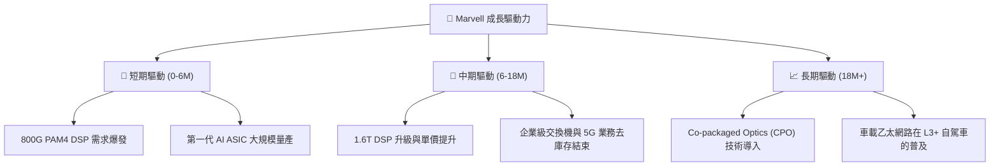

---

## 9. 風險矩陣

### 9.1 風險評分矩陣

我們使用下圖評估 MRVL 面臨的核心風險：

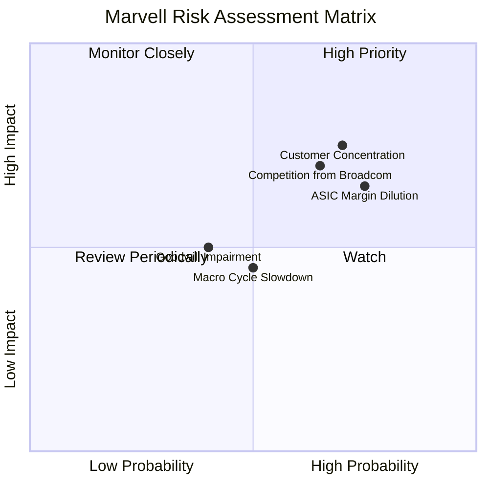

### 9.2 風險清單詳細分析

| # | 風險項目 | 發生機率 | 財務衝擊 | 風險評分 | 緩解措施與分析師點評 |
|---|----------|----------|----------|----------|----------------------|
| 1 | 🔴 **AI 客戶集中度過高** | 高 (70%) | 高 (-15% 營收) | **7.5 / 10** | **風險**：定製 ASIC 業務極度依賴少數幾家 Hyperscalers（如 Meta、Google）。<br/>**緩解**：積極開拓第二、第三家雲端客戶，並將技術推廣至主權雲與企業私有雲。 |
| 2 | 🟡 **毛利率稀釋** | 極高 (80%) | 中 (-3.0pp 毛利率) | **6.5 / 10** | **風險**：ASIC 業務毛利率顯著低於光通訊 DSP。隨著 ASIC 營收佔比上升，整體毛利率可能跌破 50%。<br/>**緩解**：透過 3nm/2nm 先進製程定製設計的技術溢價，以及提高軟體 IP 授權佔比來拉高利潤率。 |
| 3 | 🟡 **Broadcom (AVGO) 競爭加劇** | 高 (65%) | 中 (-5% 市佔率) | **6.0 / 10** | **風險**：Broadcom 是定製 ASIC 與交換機晶片的老大，擁有更強的系統整合能力。<br/>**緩解**：MRVL 專注於光電一體化與高度靈活的定製化服務，避開與 Broadcom 在標準交換晶片的正面對決。 |
| 4 | 🟢 **巨額商譽減損** | 中 (40%) | 高 (非現金減損) | **5.0 / 10** | **風險**：$13.88B 的商譽一旦發生減損，將導致當季 GAAP 淨利出現巨額虧損。<br/>**緩解**：只要 Inphi (光通訊) 業務持續高速成長，商譽減損機率極低。此風險主要為會計層面，不影響現金流。 |

---

## 10. 投資建議

### 10.1 最終綜合評級雷達圖

```
╔══════════════════════════════════════════════════════════════╗
║                  Marvell 綜合實力診斷                       ║
╠══════════════════════════════════════════════════════════════╣
║ 產品與技術力  9.5/10 ▓▓▓▓▓▓▓▓▓▓▓▓▓▓▓▓▓▓▓░  ★★★★★           ║
║ 營收成長動能  9.0/10 ▓▓▓▓▓▓▓▓▓▓▓▓▓▓▓▓▓▓░░  ★★★★★           ║
║ 財務安全邊際  8.0/10 ▓▓▓▓▓▓▓▓▓▓▓▓▓▓▓▓░░░░  ★★★★☆           ║
║ 資本回報效率  6.5/10 ▓▓▓▓▓▓▓▓▓▓▓▓▓░░░░░░░  ★★★☆☆           ║
║ 估值吸引力    7.0/10 ▓▓▓▓▓▓▓▓▓▓▓▓▓░░░░░░░  ★★★☆☆           ║
╠══════════════════════════════════════════════════════════════╣
║ 綜合投資評級  8.0/10 ▓▓▓▓▓▓▓▓▓▓▓▓▓▓▓▓░░░░  🟢 買入 (Buy)     ║
╚══════════════════════════════════════════════════════════════╝
```

### 10.2 目標價與隱含報酬率

| 情境 | 機率權重 | 12M 目標價 | 隱含報酬率 | 權重後預期回報 |
|------|----------|------------|------------|----------------|
| 🔴 悲觀情境 | 20% | $165.00 | -30.0% | -6.0% |
| 🟡 **基準情境** | **60%** | **$272.00** | **+15.3%** | **+9.2%** |
| 🟢 樂觀情境 | 20% | $340.00 | +44.2% | +8.8% |
| **加權綜合目標價** | **100%** | **$264.20** | **+12.0%** | **期望回報：+12.0%** |

### 10.3 買入時機與觸發因素

```
╔══════════════════════════════════════════════════════════════════╗
║                  ✅ 買入觸發因素 Checklist                      ║
╠══════════════════════════════════════════════════════════════════╣
║                                                                  ║
║  立即買入條件（符合兩項以上）：                                  ║
║  ✅ 股價回檔至 $210.00 - $220.00 區間 (Forward PE < 35x)          ║
║  ✅ 財報顯示 Non-GAAP 毛利率維持在 61% 以上                      ║
║  ✅ 宣佈拿下新的超大規模雲端客戶 (Hyperscaler) ASIC 訂單          ║
║                                                                  ║
║  加碼觸發條件：                                                  ║
║  ☐ 1.6T DSP 提前於 2027 年上半年進入商業化量產                 ║
║  ☐ 傳統網路與電信業務營收連續兩季實現 YoY 正成長                 ║
║                                                                  ║
║  減碼/停損觸發條件：                                             ║
║  ☐ GAAP 毛利率連續兩季跌破 48% (ASIC 利潤稀釋超預期)             ║
║  ☐ 主要 AI 客戶宣佈自研晶片完全取代外包 ASIC                    ║
║                                                                  ║
╚══════════════════════════════════════════════════════════════════╝
```

### 10.4 投資人適配度分析

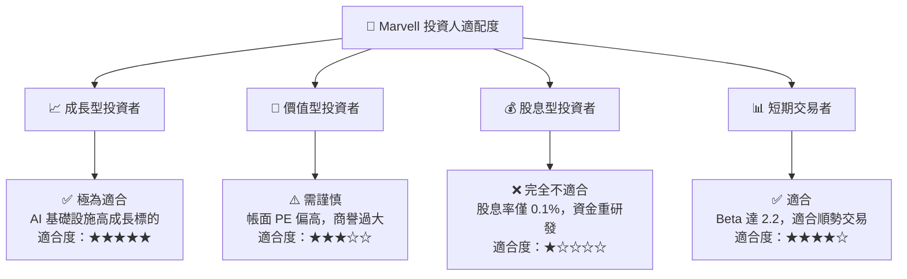

### 10.5 每季財報監控清單（Quarterly Watch List）

為了持續追蹤本投資框架的有效性，投資人應在每季財報中重點監控以下核心指標：

| 監控指標 | 基準值 (當前) | 觸發加碼門檻 | 觸發減碼/警報門檻 | 業務含意與監控原因 |
|----------|--------------|--------------|------------------|-------------------|
| **數據中心營收佔比** | ~62% | >70% | <55% | 評估 AI 成長引擎是否持續拉動公司轉型。 |
| **Non-GAAP 毛利率** | ~62.0% | >64.0% | <59.0% | 監控低毛利的 ASIC 業務是否過度稀釋了高毛利的光通訊業務。 |
| **研發費用率 (R&D %)** | 25.3% | <22.0% (營運槓桿顯現) | >28.0% (研發失控) | 評估公司是否成功將研發投入轉化為營收。 |
| **存貨週轉天數 (DOI)** | 109.5 天 | <95 天 (供不應求) | >130 天 (需求放緩) | 監控下游客戶（特別是傳統網路客戶）的去庫存進度。 |
| **SBC 佔營收比重** | 7.5% | <5.0% | >10.0% | 監控股權稀釋效應是否損害長線股東利益。 |

### 10.6 反面論證：什麼會證明論點錯誤（What Would Change My Mind）

```
╔══════════════════════════════════════════════════════════════════╗
║              ⚠️ 論點失效條件 (Disconfirming Evidence)           ║
╠══════════════════════════════════════════════════════════════════╣
║  本多頭投資論點在下列情況成立時應重新檢視或果斷退出：            ║
║                                                                  ║
║  ☐ 1. 數據中心 (Data Center) 營收成長率連續兩季低於 15% YoY。    ║
║  ☐ 2. Non-GAAP 毛利率跌破 58%，證實 ASIC 業務無定價權。         ║
║  ☐ 3. 競爭對手 Broadcom 推出具備壓倒性優勢的 1.6T 整合方案，      ║
║       導致 Marvell 光通訊市佔率跌破 50%。                       ║
║  ☐ 4. 發生金額大於 $1.0B 的商譽減損，證實歷史併購價值破滅。      ║
║  ☐ 5. 自由現金流 (FCF) 連續兩季轉負，或 FCF 轉換率跌破 50%。     ║
║                                                                  ║
╚══════════════════════════════════════════════════════════════════╝
```

---

> **免責聲明**：本報告為基於公開財務數據之機構級學術研究分析，僅供參考，不構成任何買賣建議。投資人應自行承擔市場風險。