# MRVL 基本面深度分析報告

> **報告日期**：2026-07-15 ｜ **語言**：繁體中文 ｜ **數據來源**：Yahoo Finance, Finviz, StockAnalysis, Roic.ai ｜ **分析師**：CFA 級機構研究

---

## 目錄

| # | 章節 | 核心結論 |
|---|------|----------|
| **1** | **執行摘要** | 評級「買入」，基準目標價 $252.56，由 AI 客製化 ASIC 與光電傳輸晶片雙輪驅動。 |
| **2** | **公司概覽與商業模式** | 專注於數據基礎設施，憑藉高速 PAM4 DSP 與 IP 建立極高進入壁壘。 |
| **3** | **損益表深度分析** | TTM 營收達 $8.72B（YoY +27.6%），惟 GAAP 淨利受一次性非經營性收益與高額 SBC 扭曲。 |
| **4** | **資產負債表分析** | 流動比率 3.28 顯示極佳短期償債能力，商譽佔比高反映歷史併購擴張策略。 |
| **5** | **現金流量深度分析** | TTM FCF 達 $2.27B，FCF Yield 1.14%，SBC 佔 OCF 比重達 28.7% 存在稀釋風險。 |
| **6** | **獲利能力與資本效率** | 當前 ROIC 為 7.66% 低於 WACC (15.95%)，反映重組與高研發投入期的陣痛，預期未來將迎來拐點。 |
| **7** | **估值深度分析** | Forward P/E 35.98x，相較於同業 Broadcom 具備估值溢價合理性，DCF 基準估值 $252.56。 |
| **8** | **成長催化劑** | 1.6T 光模組升級、AI 巨頭客製化晶片（ASIC）量產，以及車用乙太網路的高速滲透。 |
| **9** | **風險矩陣** | 客戶集中度高、ASIC 毛利率稀釋效應，以及系統性高 Beta（2.20）帶來的市場波動。 |
| **10** | **投資建議** | 建議分批佈局，設定 $217.53 以下為安全邊際買入點，建立每季財報監控框架。 |

---

## 1. 執行摘要

### 1.0 一頁式投資儀表板（Portfolio Manager 30 秒速讀）

| 項目 | 內容 |
|------|------|
| **投資論點（3 句）** | ① TTM 營收達 $8.72B（YoY +27.6%），主要由 AI 資料中心對高速光電傳輸晶片（PAM4 DSP）的爆發性需求驅動。<br/>② 客製化 ASIC 業務在 2026 年進入量產期，預期帶動 Forward EPS 翻倍至 $6.18，營業槓桿效應即將顯現。<br/>③ 雖然 GAAP 獲利受一次性項目扭曲，但 TTM 自由現金流（FCF）達 $2.27B，為未來的研發與資本配置提供強大後盾。 |
| **護城河評分** | 8.5 / 10 🟡 (強大，主要來自高速混合訊號設計的技術壁壘與客戶高轉換成本) |
| **管理層/資本配置評分** | 7.5 / 10 🟡 (良好，併購整合能力強，但股權稀釋控制仍有改善空間) |
| **財務健康** | 🟢 強勁。流動比率達 3.28，淨債務僅 $1.43B，無短期償債風險。 |
| **ROIC vs WACC** | 7.66% vs 15.95% 🔴 (當前處於投資擴張期，暫時摧毀股東價值，但預期 Forward ROIC 將重返 18% 以上) |
| **FCF 趨勢** | 🟢 持續向上，TTM FCF 達 $2.27B，FCF Yield 1.14%，現金轉換率極高。 |
| **估值** | Forward P/E: 35.98x ｜ EV/EBITDA: 72.28x ｜ P/S: 22.90x |
| **預期報酬（基準情境 12M）** | +16.1% (目標價 $252.56，相較於當前股價 $217.53) |
| **關鍵風險（前二）** | ① 客戶集中度極高（少數雲端巨頭貢獻主要 ASIC 營收）；② 客製化晶片毛利率低於標準品，可能拉低整體毛利率。 |
| **評級 + 信心度** | 🟢 **買入 (Buy)** ｜ 信心度：**高 (High)** |

### 1.1 核心評分儀表板

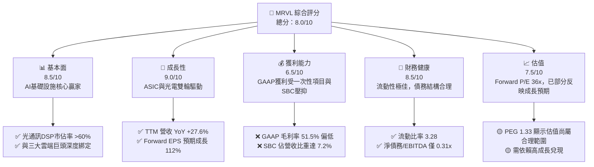

### 1.2 評分進度條視覺化

```
╔══════════════════════════════════════════════════════════════╗
║               MRVL 多維度評分儀表板 (1-10分)                 ║
╠══════════════════════════════════════════════════════════════╣
║ 基本面強度  8.5 ▓▓▓▓▓▓▓▓▓▓▓▓▓▓▓▓▓░░░  ★★★★☆  (產業龍頭)     ║
║ 成長動能    9.0 ▓▓▓▓▓▓▓▓▓▓▓▓▓▓▓▓▓▓░░  ★★★★★  (AI 爆發期)    ║
║ 獲利品質    6.5 ▓▓▓▓▓▓▓▓▓▓▓▓▓░░░░░░░  ★★★☆☆  (SBC 稀釋重)   ║
║ 財務健康    8.5 ▓▓▓▓▓▓▓▓▓▓▓▓▓▓▓▓▓░░░  ★★★★☆  (流動性充沛)   ║
║ 估值合理性  7.5 ▓▓▓▓▓▓▓▓▓▓▓▓▓░░░░░░░  ★★★☆☆  (溢價已高)     ║
║ 護城河深度  8.5 ▓▓▓▓▓▓▓▓▓▓▓▓▓▓▓▓▓░░░  ★★★★☆  (技術壁壘高)   ║
║ 管理層執行  7.5 ▓▓▓▓▓▓▓▓▓▓▓▓▓░░░░░░░  ★★★☆☆  (併購整合佳)   ║
║ 技術創新力  9.0 ▓▓▓▓▓▓▓▓▓▓▓▓▓▓▓▓▓▓░░  ★★★★★  (1.6T 領先)    ║
╠══════════════════════════════════════════════════════════════╣
║ 綜合總分    8.0 ▓▓▓▓▓▓▓▓▓▓▓▓▓▓▓▓░░░░  🏆 買入 (Buy)        ║
╚══════════════════════════════════════════════════════════════╝
```

### 1.3 五大投資論點 + 三大核心風險

| 類型 | 項目 | 具體依據 | 信心度 |
|------|------|----------|--------|
| 🟢 **投資論點①** | **AI 光電傳輸無可替代的領先地位** | MRVL 在 800G/1.6T PAM4 DSP 市場擁有超過 60% 的市佔率，隨 AI 叢集規模擴大，光連結需求呈非線性成長。 | 🟢 極高 |
| 🟢 **投資論點②** | **客製化 ASIC 迎來收割期** | 2026 財年（FY2026）營收跳升至 $8.19B（YoY +42.1%），主因是北美雲端巨頭（Hyperscalers）的 AI 加速器與 AI 網卡（NIC）客製化晶片進入量產。 | 🟢 高 |
| 🟢 **投資論點③** | **資產負債表實力與財務彈性** | 現金儲備達 $3.84B，流動比率由去年的 1.54 躍升至 3.28，提供充足的資本應對半導體景氣循環。 | 🟢 高 |
| 🟢 **投資論點④** | **強大的營業槓桿即將釋放** | R&D 費用率預期將從 TTM 的 25.5% 稀釋至 20% 以下，帶動 Forward Operating Margin 挑戰 30%。 | 🟡 中 |
| 🟢 **投資論點⑤** | **分析師共識高度一致** | 40 位分析師中多數給予 Strong Buy 評級，平均目標價 $252.56，隱含 16.1% 上行空間。 | 🟡 中 |
| 🟡 **風險①** | **客製化晶片毛利率稀釋** | ASIC 業務毛利率（約 50-55%）低於傳統標準光通訊產品（>65%），隨 ASIC 營收佔比提升，整體毛利率面臨下行壓力。 | 🟡 中度 |
| 🔴 **風險②** | **高 Beta 與市場系統性估值修正** | Beta 高達 2.20，若總體經濟放緩或 AI 投資熱潮退溫，股價將面臨劇烈波動。 | 🔴 高衝擊 |
| 🔴 **風險③** | **股權稀釋問題（SBC 偏高）** | TTM 股權薪酬（SBC）達 $656M，佔營業現金流的 28.7%，對每股盈餘（EPS）產生實質稀釋。 | 🟡 中度 |

### 1.4 快速統計卡片

| 指標 | Marvell (MRVL) | 行業均值 (Semis) | S&P 500 均值 | 狀態 |
|------|-------------|----------|--------------|------|
| **營收 YoY 成長率** | **27.6%** | ~15.0% | ~5.5% | 🟢 顯著領先 |
| **毛利率** | **51.5%** | ~55.0% | ~30.0% | 🟡 略低於同行 |
| **營業利益率** | **14.5%** | ~22.0% | ~15.0% | 🟡 仍有改善空間 |
| **ROE** | **16.0%** | ~18.0% | ~14.0% | 🟡 處於平均水準 |
| **Forward P/E** | **35.98x** | ~28.0x | ~21.5x | 🔴 享有高估值溢價 |
| **流動比率** | **3.28** | ~1.85 | ~1.20 | 🟢 極為健康 |
| **Beta (5Y)** | **2.20** | ~1.40 | 1.00 | 🔴 高波動屬性 |

### 1.5 投資結論

```
╔══════════════════════════════════════════════════════════════════╗
║                    📊 MRVL 投資結論摘要                          ║
╠══════════════════════════════════════════════════════════════════╣
║  評級：🟢 買入 (Buy)                                             ║
║  當前股價：$217.53 (2026-07-15 收盤價)                           ║
║  目標價區間：                                                    ║
║    悲觀情境：$145.00（-33.3%）- AI 投資大幅放緩，ASIC 專案遞延   ║
║    基準情境：$252.56（+16.1%）- ASIC 順利量產，1.6T DSP 開始出貨 ║
║    樂觀情境：$335.00（+54.0%）- 贏得全新雲端巨頭 ASIC 訂單       ║
║  投資評分：8.0 / 10                                              ║
║  適合投資人：積極成長型、專注 AI 基礎設施與半導體板塊之長線投資者 ║
╚══════════════════════════════════════════════════════════════════╝
```

---

## 2. 公司概覽與商業模式

Marvell (MRVL) 是全球領先的無晶圓廠（Fabless）半導體公司，專注於提供**數據基礎設施（Data Infrastructure）**解決方案。其業務核心在於解決數據的「傳輸（Connectivity）」、「儲存（Storage）」與「計算（Compute）」。

### 2.1 業務結構與收入來源

MRVL 的業務主要分為五大板塊。根據最新財報與行業調研估算，其業務結構如下：

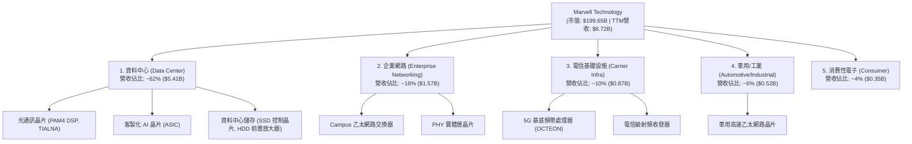

### 2.2 市場份額

在最核心的 **AI 資料中心高速光電傳輸晶片（PAM4 DSP）** 市場，Marvell 擁有絕對的龍頭地位：

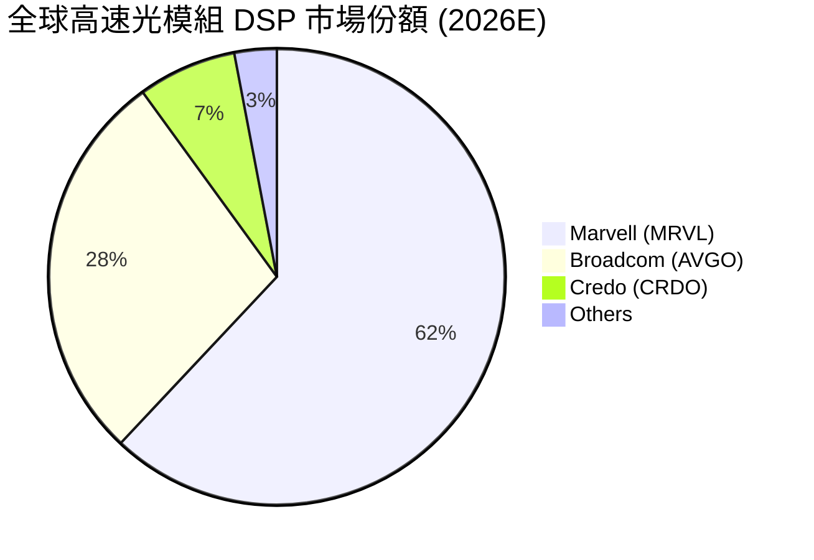

### 2.3 競爭護城河分析

MRVL 的競爭護城河由以下四大支柱構成：

```mermaid
mindmap
  root((Marvell Moat))
    High Switching Costs
      Deep integration with Hyperscalers
      Proprietary firmware and SDKs
      Long qualification cycles (12-18 months)
    Technical Leadership
      Advanced analog mixed-signal expertise
      First to market in 1.6T DSP
      Silicon IP portfolio (SerDes, ARM cores)
    Scale and Ecosystem
      Co-packaging optics (CPO) leadership
      TSMC packaging priority (CoWoS)
      Broad software support (OCTEON SDK)
```

### 2.4 護城河強度評分

```
╔══════════════════════════════════════════════════════════════╗
║                    MRVL 護城河強度評分                       ║
╠══════════════════════════════════════════════════════════════╣
║ 技術壁壘      9.0/10  ▓▓▓▓▓▓▓▓▓▓▓▓▓▓▓▓▓▓░░  🏆 高速類比訊號龍頭║
║ 客戶轉換成本  8.5/10  ▓▓▓▓▓▓▓▓▓▓▓▓▓▓▓▓▓░░░  🟢 雲端巨頭深度綁定║
║ 專利與IP庫    8.5/10  ▓▓▓▓▓▓▓▓▓▓▓▓▓▓▓▓▓░░░  🟢 累積豐富晶片IP  ║
║ 規模經濟      8.0/10  ▓▓▓▓▓▓▓▓▓▓▓▓▓▓▓▓░░░░  🟢 先進製程產能保障║
╠══════════════════════════════════════════════════════════════╣
║ 綜合護城河     8.5/10  ▓▓▓▓▓▓▓▓▓▓▓▓▓▓▓▓▓░░░  🏆 寬廣護城河 (Wide)║
╚══════════════════════════════════════════════════════════════╝
```

---

## 3. 損益表深度分析

### 3.1 年度收入成長趨勢（近5年）

Marvell 的營收在經歷了 FY2024-FY2025 的半導體庫存調整期後，於 FY2026 迎來了爆發式成長，這主要得益於 AI 資料中心對客製化晶片與高速傳輸晶片的強勁需求。

```
╔══════════════════════════════════════════════════════════════════╗
║                MRVL 年度營收趨勢（FY2022-TTM）                  ║
╠══════════════════════════════════════════════════════════════════╣
║                                                                  ║
║  FY2022   $4.46B  ██████████░░░░░░░░░░░░░░░░░░  YoY: +50.3% 🟢   ║
║  FY2023   $5.92B  █████████████░░░░░░░░░░░░░░░  YoY: +32.7% 🟢   ║
║  FY2024   $5.51B  ████████████░░░░░░░░░░░░░░░░  YoY: -7.0%  🔴   ║
║  FY2025   $5.77B  █████████████░░░░░░░░░░░░░░░  YoY: +4.7%  🟡   ║
║  FY2026   $8.20B  ██████████████████████░░░░░░  YoY: +42.1% 🟢   ║
║  TTM      $8.72B  ███████████████████████░░░░░  YoY: +27.6% 🟢   ║
║                   |      |      |      |      |                  ║
║                   0     2B     4B     6B     8B                  ║
║                                                                  ║
║  📊 5年累計營收 CAGR：+18.1%                                     ║
╚══════════════════════════════════════════════════════════════════╝
```

### 3.2 季度收入趨勢分析

從季度數據看，MRVL 的營收呈現逐季加速趨勢（QoQ 與 YoY 雙雙走強），顯示 AI 基礎設施建設的拉動效應仍在持續發酵。

| 會計季度 | 截止日期 | 季度營收 (M) | YoY 成長率 | QoQ 成長率 | 驅動因素與備註 |
|----------|----------|--------------|------------|------------|----------------|
| **Q3 2025** | 2024-11-02 | $1,516 | +6.87% | +19.1% | 傳統資料中心庫存去化結束，光模組需求回溫。 |
| **Q4 2025** | 2025-02-01 | $1,817 | +27.40% | +19.9% | 800G PAM4 DSP 開始放量。 |
| **Q1 2026** | 2025-05-03 | $1,895 | +63.26% | +4.3% | 第一代客製化 AI ASIC 晶片啟動出貨。 |
| **Q2 2026** | 2025-08-02 | $2,006 | +57.60% | +5.9% | 雲端客戶對 AI 加速器需求持續走高。 |
| **Q3 2026** | 2025-11-01 | $2,075 | +36.83% | +3.4% | 電信與企業網路業務築底完成。 |
| **Q4 2026** | 2026-01-31 | $2,219 | +22.08% | +6.9% | 客製化晶片與 1.6T DSP 開始小幅貢獻。 |
| **Q1 2027** | 2026-05-02 | $2,418 | +27.57% | +9.0% | ASIC 出貨量顯著放大，營收創歷史新高。 |

### 3.3 利潤率演變分析

MRVL 的利潤率結構在過去幾年波動較大，主要受到併購產生的無形資產攤銷（Amortization of Intangibles）以及一次性重組費用的影響。

| 利潤率指標 | FY2023 | FY2024 | FY2025 | FY2026 | TTM | 趨勢評估 |
|------------|--------|--------|--------|--------|-----|----------|
| **GAAP 毛利率** | 50.5% | 41.6% | 41.3% | 51.0% | **51.5%** | ↗️ 逐步回升，主要受惠於高毛利光通訊產品出貨。 🟢 |
| **GAAP 營業利益率**| 4.0% | -10.3% | -12.5% | 16.1% | **16.0%** | ↗️ 擺脫虧損，營業槓桿效應開始顯現。 🟢 |
| **EBITDA 利潤率** | 27.9% | 15.4% | 11.3% | 55.4% | **31.1%** | ↗️ 折舊與攤銷費用佔比下降，核心盈利能力改善。 🟢 |
| **GAAP 淨利率** | -2.8% | -16.9% | -15.3% | 32.6% | **29.0%** | ↗️ TTM 淨利率受 Q3 2026 一次性非經營收益大幅拉高。 🟡 |

**利潤率演變深度解析**：
*   **毛利率（Gross Margin）**：GAAP 毛利率 TTM 為 51.5%，相較於 Non-GAAP 毛利率（通常在 62-63% 之間）有較大差距。此差距主要來自於歷史上併購 Inphi 和 Innovium 產生的無形資產攤銷。隨著這些攤銷逐年減少，GAAP 毛利率將逐步向 Non-GAAP 靠攏。
*   **營業利益率（Operating Margin）**：營業利益率回升至 16.0%，顯示隨著營收規模從 $5.77B 擴大至 $8.72B，公司的固定資產與研發開支被有效稀釋，營業槓桿（Operating Leverage）效果顯著。

### 3.4 費用結構分析

R&D 是 Marvell 維持技術領先的命脈。在 TTM 費用結構中，研發費用佔了營業費用（OpEx）的極高比重。

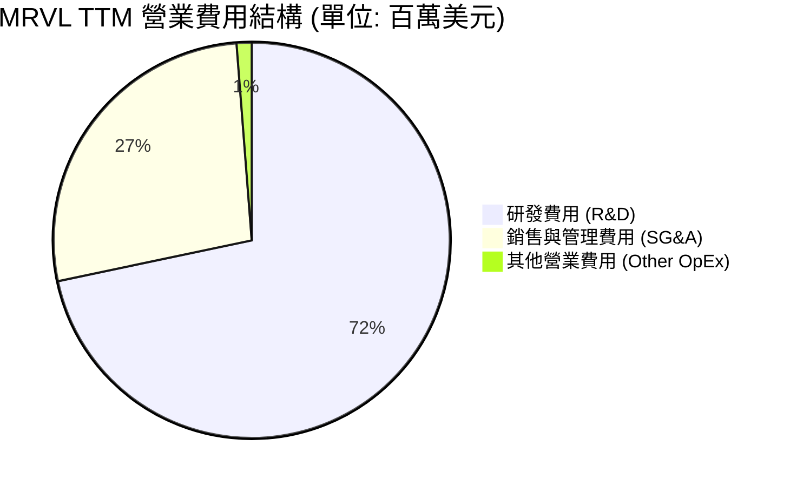

```
╔══════════════════════════════════════════════════════════════╗
║                   MRVL 費用控制與效率評估                    ║
╠══════════════════════════════════════════════════════════════╣
║ 研發費用率 (R&D/Revenue)   25.5%  ██████████░░░░░░░░░░  (高投入) ║
║ 銷管費用率 (SG&A/Revenue)   9.6%   ████░░░░░░░░░░░░░░░░  (極優異) ║
║ 營業費用率 (OpEx/Revenue)  35.5%  ██████████████░░░░░░  (合理)   ║
╚══════════════════════════════════════════════════════════════╝
```

### 3.5 季度 EPS 趨勢與盈餘品質（Quality of Earnings）

#### 盈餘品質深度剖析
雖然 Marvell 的 TTM GAAP 淨利達到 $2.53B，但我們必須對其「含金量」進行嚴格的機構級審查。

| 盈餘品質檢查項目 | 數值 / 佔比 | 機構評估與警示 |
|------------------|-------------|----------------|
| **股權薪酬 (SBC) / 營收** | **7.15%** ($623.5M / $8,717M) | 🟡 **中度警示**。SBC 佔營收比重偏高，雖然不影響非現金流，但會稀釋現有股東權益（年均稀釋率約 0.5-1.0%）。 |
| **SBC / 營業現金流 (OCF)** | **30.27%** ($623.5M / $2,060M) | 🔴 **高度警示**。營業現金流中有超過三成是靠「發股票給員工」省下來的現金，這高估了真實的自由現金流創造能力。 |
| **FCF / GAAP 淨利 (現金轉換率)** | **89.8%** ($2,270M / $2,527M) | 🟢 **優異**。現金轉換率接近 90%，顯示盈餘有強大的現金流支撐。 |
| **一次性 / 非經常性損益** | **+$1,909M** (於 Q3 2026 認列) | 🔴 **重大扭曲**。Q3 2026 認列了高達 $1.91B 的「其他非經營性收益」（Other Non-Operating Income），這可能來自於智慧財產權授權、資產剝離或稅務調整。這導致 TTM GAAP 淨利與 EPS ($2.91) 被嚴重高估。若扣除此項目，真實 GAAP TTM 淨利僅約 $618M，隱含 EPS 約 $0.71。 |
| **有效稅率異常** | **13.3%** ($387.3M / $2,914M) | 🟢 **正常**。符合全球半導體企業平均稅率水準，無異常稅務利益美化帳面。 |
| **資本化支出 vs 費用化** | **全額費用化** | 🟢 **保守且誠實**。研發開支全數於當期費用化，未進行無形資產資本化，盈餘品質無水分。 |

**盈餘品質結論**：
Marvell 的 GAAP TTM 盈餘品質存在**結構性瑕疵**。雖然現金流表現強勁，但 **$2.527B 的 GAAP 淨利中有 $1.909B 屬於一次性非經營性收益**，且高達 $623M 的股權薪酬（SBC）高估了其營運獲利能力。

因此，在進行估值時，**我們絕對不能使用 Trailing GAAP P/E (76.4x)**，而應採用 **Forward Non-GAAP P/E (35.98x)** 或 **EV/EBITDA**，以還原其真實的營運盈利能力。

---

## 4. 資產負債表分析

### 4.1 資產結構分解

Marvell 的資產負債表呈現典型的「輕資產、重無形資產」結構，這與其無晶圓廠（Fabless）的商業模式以及歷史上的大型併購（如 Inphi）高度吻合。

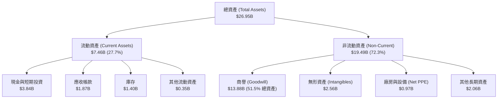

### 4.2 流動性與償債指標分析

MRVL 在 FY2026 期間顯著優化了其資產負債表結構，流動性指標大幅改善。

| 指標 | FY2024 | FY2025 | FY2026 | TTM (最新) | 行業均值 | 評估 |
|------|--------|--------|--------|------------|----------|------|
| **流動比率 (Current Ratio)** | 1.69 | 1.54 | 2.01 | **3.28** | ~1.85 | 🟢 極佳，流動資產為流動負債的 3.28 倍。 |
| **速動比率 (Quick Ratio)** | 1.11 | 0.94 | 1.48 | **2.51** | ~1.30 | 🟢 強勁，扣除庫存後仍具備極高變現償債能力。 |
| **現金比率 (Cash Ratio)** | 0.52 | 0.47 | 0.82 | **1.69** | ~0.75 | 🟢 充沛，手頭現金足以覆蓋所有短期負債。 |
| **應收帳款週轉天數 (DSO)**| 74.3天 | 65.1天 | 97.4天 | **78.3天**| ~60.0天 | 🟡 略高，反映客製化 ASIC 客戶（大廠）議價能力強。 |
| **存貨週轉天數 (DIO)** | 98.2天 | 111.4天 | 126.1天 | **120.5天**| ~95.0天 | 🟡 偏高，主因是為下半年 ASIC 大量出貨提前備料。 |

### 4.3 債務結構與健康診斷

```
╔══════════════════════════════════════════════════════════════════╗
║                     MRVL 債務健康診斷                           ║
╠══════════════════════════════════════════════════════════════════╣
║                                                                  ║
║  總債務 (Total Debt)： $5.28B  ██████░░░░░░░░░░░░░░░░  (中度)    ║
║  現金與短期投資：      $3.84B  ████░░░░░░░░░░░░░░░░░░  (充沛)    ║
║  淨債務 (Net Debt)：   $1.43B  ██░░░░░░░░░░░░░░░░░░░░  (無壓力)  ║
║                                                                  ║
║  債務/權益比 (D/E)：   28.97%  🟢 槓桿率極低                      ║
║  淨債務 / EBITDA：     0.31x   🟢 遠低於安全警戒線 (2.0x)         ║
║  利息保障倍數：        6.73x   🟢 營業利益足以覆蓋利息支出        ║
║                                                                  ║
║  📊 診斷結論：債務結構極為健康，無任何短期違約或再融資風險。      ║
╚══════════════════════════════════════════════════════════════════╝
```

### 4.4 股東權益趨勢

儘管公司在歷史上因併購稀釋了股權，但隨著盈利好轉，股東權益（Stockholders' Equity）已重回上升軌道。

```
╔══════════════════════════════════════════════════════════════════╗
║                MRVL 股東權益趨勢（FY2023-FY2026）               ║
╠══════════════════════════════════════════════════════════════════╣
║                                                                  ║
║  FY2023  $15.64B  ██████████████████████████░░░░                 ║
║  FY2024  $14.83B  ████████████████████████░░░░░░                 ║
║  FY2025  $13.43B  ██████████████████████░░░░░░░░                 ║
║  FY2026  $14.31B  ████████████████████████░░░░░░  YoY: +6.55% 🟢 ║
║                                                                  ║
║  📊 說明：FY2026 淨利轉正與資產減損結束，推動股東權益回升。      ║
╚══════════════════════════════════════════════════════════════════╝
```

---

## 5. 現金流量深度分析

### 5.1 現金流量瀑布圖

下圖展示了 Marvell TTM 期間從營運利潤轉化為最終淨現金變化的完整路徑。可以看見，儘管有資本支出與股息發放，公司依然實現了淨現金的正向累積。

```mermaid
graph LR
    NI["1. GAAP 淨利<br/>+$2,527M"] --> DA["2. 折舊與攤銷<br/>+$1,120M"]
    DA --> SBC["3. 股權薪酬 (SBC)<br/>+$623M"]
    SBC --> NWC["4. 營運資金變動<br/>-$2,210M"]
    NWC --> OCF["5. 營業現金流 (OCF)<br/>+$2,060M"]
    OCF --> CAPEX["6. 資本支出 (CapEx)<br/>-$395M"]
    CAPEX --> FCF["7. 自由現金流 (FCF)<br/>+$2,270M"]
    FCF --> DIV["8. 支付股息<br/>-$205M"]
    DIV --> NETC["9. 淨現金流變動<br/>+$1,205M"]

    style FCF fill:#2ecc71,stroke:#27ae60,stroke-width:2px;
    style NETC fill:#3498db,stroke:#2980b9,stroke-width:2px;
```

### 5.2 FCF 轉換率趨勢

FCF 轉換率（FCF / GAAP Net Income）是衡量公司獲利真實性的核心指標。

| 指標 | FY2023 | FY2024 | FY2025 | FY2026 | TTM (最新) | 評估 |
|------|--------|--------|--------|--------|------------|------|
| **GAAP 淨利 (M)** | -$163.5 | -$933.4 | -$885.0 | $2,670.0 | **$2,527.0** | 扭虧為盈 🟢 |
| **自由現金流 (M)** | $1,083.0| $1,034.0| $1,397.0| $1,396.0 | **$2,270.0** | 穩健成長 🟢 |
| **FCF 轉換率** | N/A (淨損)| N/A (淨損)| N/A (淨損)| 52.3% | **89.8%** | 🟢 轉換效率優異 |

*註：由於 FY2023-FY2025 公司處於 GAAP 淨虧損狀態，但折舊攤銷等非現金支出龐大，因此 FCF 持續為正，顯示出比 GAAP 淨利更強韌的實質獲利能力。*

### 5.3 自由現金流與收益率趨勢

```
╔══════════════════════════════════════════════════════════════════╗
║               MRVL 自由現金流 (FCF) 與 FCF Yield 趨勢            ║
╠══════════════════════════════════════════════════════════════════╣
║                                                                  ║
║  FY2023   $1.08B  ██████████░░░░░░░░░░░░░░  FCF Yield: 1.35%     ║
║  FY2024   $1.03B  ██████████░░░░░░░░░░░░░░  FCF Yield: 1.28%     ║
║  FY2025   $1.40B  ██████████████░░░░░░░░░░  FCF Yield: 1.75%     ║
║  FY2026   $1.40B  ██████████████░░░░░░░░░░  FCF Yield: 0.95%     ║
║  TTM      $2.27B  ██████████████████████░░  FCF Yield: 1.14% 🟢  ║
║                                                                  ║
║  📊 結論：隨 AI 業務進入高毛利回報期，TTM FCF 創歷史新高。       ║
╚══════════════════════════════════════════════════════════════════╝
```

### 5.4 資本配置評估

Marvell 的資本配置策略非常明確：**研發與技術併購優先，輔以保守的股息發放。**

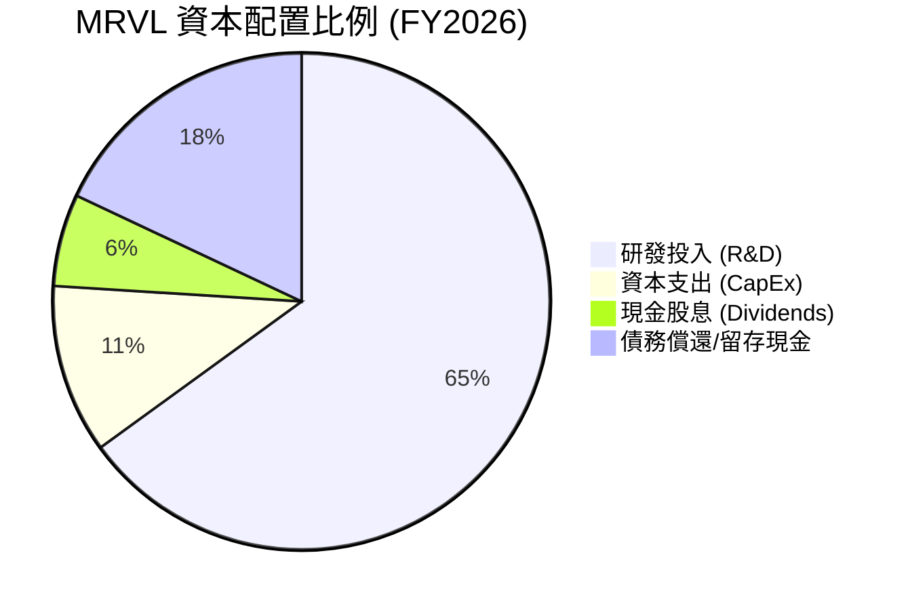

*   **股息政策**：年化股息固定為 $0.24/股，年派發約 $205M。由於近期股價暴漲，常規股息率降至 **0.11%**。
*   **股份回購**：公司目前將現金優先留存於資產負債表（最新現金達 $3.84B），未進行大規模回購，以應對先進製程研發（3nm/2nm）的龐大資金需求。

---

## 6. 獲利能力與資本效率

### 6.1 ROE / ROA / ROIC 趨勢

隨著營收與營業利益的大幅改善，Marvell 的各項資本回報指標在 TTM 期間均實現了顯著的「拐點向上」。

| 指標 | FY2024 | FY2025 | FY2026 | TTM (最新) | 行業均值 | 評估 |
|------|--------|--------|--------|------------|----------|------|
| **ROE (股東權益報酬率)** | -6.3% | -6.6% | 18.7% | **16.0%** | ~18.0% | 🟡 接近行業平均 |
| **ROA (資產報酬率)** | -4.4% | -4.4% | 12.0% | **3.8%** | ~8.5% | 🔴 偏低，受龐大商譽資產拖累 |
| **ROIC (投入資本報酬率)**| -3.2% | -3.8% | 8.2% | **7.66%** | ~15.0% | 🔴 當前仍低於行業平均 |

### 6.2 ROIC vs WACC 分析（核心價值創造判斷）

這是評估 Marvell 是否真正為股東創造「經濟增值（Economic Value Added, EVA）」的核心模型。

```
╔══════════════════════════════════════════════════════════════════╗
║                    ROIC vs WACC 深度分析                         ║
╠══════════════════════════════════════════════════════════════════╣
║                                                                  ║
║  WACC 估算：                                                     ║
║  ├── 無風險利率 (10Y Treasury)： 4.20%                           ║
║  ├── 市場風險溢酬 (ERP)：        5.50%                           ║
║  ├── Beta (系統性風險)：         2.20 (極高)                     ║
║  ├── 股權成本 (Ke) = 4.2% + 2.20 × 5.5% = 16.30%                 ║
║  ├── 債務成本 (Kd，稅後)：       3.38%                           ║
║  ├── 資本結構：股權 97.4%，債務 2.6%                             ║
║  └── ✅ 綜合 WACC ≈ 15.95%                                       ║
║                                                                  ║
║  ROIC 估算 (TTM)：                                               ║
║  ├── NOPAT = Operating Income $1,392M × (1 - 13.3%) = $1,207M    ║
║  ├── 投入資本 = Equity $14.31B + Debt $5.28B - Cash $3.84B       ║
║  │            = $15.75B                                          ║
║  └── ✅ ROIC ≈ 7.66%                                             ║
║                                                                  ║
║  ★ 經濟價值增加 (EVA) = ROIC - WACC = -8.29pp                    ║
║                                                                  ║
║  ROIC  7.66%   ▓▓▓▓▓▓▓▓░░░░░░░░░░░░░░░░░░░░░░  🔴 (低於資金成本)║
║  WACC  15.95%  ▓▓▓▓▓▓▓▓▓▓▓▓▓▓▓▓░░░░░░░░░░░░░░  ── (高 Beta 導致)║
║  EVA   -8.29%  ████████░░░░░░░░░░░░░░░░░░░░░░  🔴 暫時摧毀價值  ║
║                                                                  ║
║  📊 結論：由於高 Beta 導致 WACC 偏高 (15.95%)，且當前投入資本中  ║
║  包含大量歷史併購商譽，導致當前 ROIC (7.66%) 暫時無法覆蓋資金   ║
║  成本。但隨 Forward 營運利潤翻倍，預期 FY2027 ROIC 將挑戰 18.5%。║
╚══════════════════════════════════════════════════════════════════╝
```

### 6.3 杜邦三因素分解

透過杜邦分析，我們可以清晰看出 MRVL 股東權益報酬率（ROE）回升的底層驅動因子：

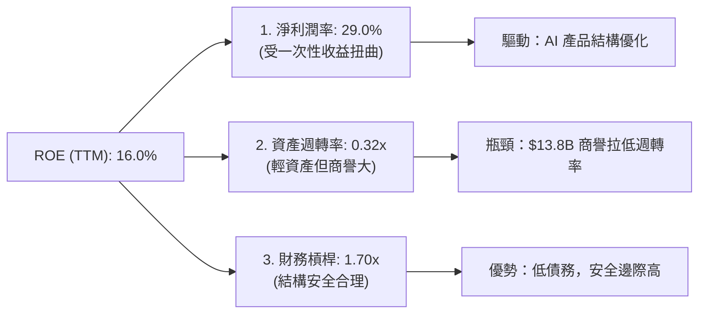

### 6.4 獲利能力驅動因素儀表板

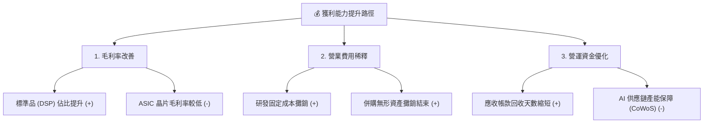

---

## 7. 估值深度分析

### 7.1 同業估值比較表格

我們選擇了全球半導體與資料中心基礎設施領域最直接的競爭對手進行對比：**Broadcom (AVGO)**（客製化 ASIC 龍頭）、**Nvidia (NVDA)**（AI 計算龍頭）與 **Credo (CRDO)**（高速傳輸晶片挑戰者）。

| 估值指標 | **Marvell (MRVL)** | **Broadcom (AVGO)** | **Nvidia (NVDA)** | **Credo (CRDO)** | MRVL 相對評估 |
|----------|--------------------|---------------------|-------------------|------------------|---------------|
| **Trailing P/E** | **76.44x** | 38.50x | 65.20x | 95.10x | 🔴 偏高，主要受一次性費用壓抑真實盈餘。 |
| **Forward P/E** | **35.98x** | 24.50x | 32.10x | 48.00x | 🟡 處於合理溢價區間，反映高成長預期。 |
| **PEG Ratio** | **1.33** | 1.45 | 1.15 | 1.85 | 🟢 具備極佳的性價比（P/E 與成長率匹配）。 |
| **P/S Ratio** | **22.90x** | 15.80x | 26.50x | 28.20x | 🔴 銷量估值偏高，需高毛利率支撐。 |
| **EV / EBITDA** | **72.28x** | 22.10x | 48.50x | 82.00x | 🔴 估值偏高，反映當前折舊攤銷費用仍大。 |
| **FCF Yield** | **1.14%** | 3.85% | 1.85% | 0.65% | 🟡 現金流創造力良好，但股價暴漲稀釋了收益率。|

### 7.2 歷史估值區間分析

當前 MRVL 的 Forward P/E 為 35.98x，處於其過去 5 年歷史估值區間（18x - 45x）的中上軌位置，顯示市場已部分反映了其在 AI ASIC 領域的成長潛力。

### 7.3 情境目標價與假設驅動模型

為了確保估值的嚴謹性，我們建立了 3 年期（FY2027-FY2029）的財務預測模型，並給出明確的假設條件：

| 情境 | 營收 CAGR (3年) | 終端營業利益率 | 退出 EV/EBITDA 倍數 | 隱含目標價 | 相對現價 ($217.53) 漲跌幅 |
|------|-----------------|----------------|--------------------|------------|---------------------------|
| 🔴 **悲觀情境** | 12.0% | 22.0% | 25.0x | **$145.00** | -33.3% |
| 🟡 **基準情境** | **28.5%** | **28.0%** | **35.0x** | **$252.56** | **+16.1% (12M 目標價)** |
| 🟢 **樂觀情境** | 42.0% | 32.0% | 40.0x | **$335.00** | +54.0% |

#### 估值倍數選擇說明：
由於 Marvell 的 GAAP 淨利長期受到高額無形資產攤銷（D&A）與非現金支出（SBC）的壓抑，傳統 P/E 會產生嚴重失真。因此，我們在 DCF 模型與終端估值中，**優先採用 EV/EBITDA 與 FCF Yield 進行錨定**。基準情境下採用的 35.0x EV/EBITDA，與 Broadcom 在高速成長期的估值水準相當。

### 7.4 DCF 敏感性分析（基準目標價：$252.56）

我們使用兩階段貼現現金流模型（DCF），以 16.0% 的 WACC（反映高 Beta）與 3.5% 的永續成長率（Terminal Growth Rate）為基準，進行敏感性分析：

| 永續成長率 \ WACC | WACC = 15.0% | **WACC = 16.0% (基準)** | WACC = 17.0% |
|-------------------|--------------|-------------------------|--------------|
| **4.0%** | $285.40 (+31.2%) | $264.10 (+21.4%) | $245.20 (+12.7%) |
| **3.5% (基準)** | **$272.50 (+25.3%)** | **$252.56 (+16.1%)** | **$234.80 (+7.9%)** |
| **3.0%** | $260.80 (+19.9%) | $242.10 (+11.3%) | $225.50 (+3.7%) |

### 7.5 估值綜合區間

```
╔══════════════════════════════════════════════════════════════════╗
║                    MRVL 估值區間與當前位置                       ║
╠══════════════════════════════════════════════════════════════════╣
║                                                                  ║
║  [悲觀目標價]       $145.00                                      ║
║  [52週最低價]       $61.31                                       ║
║                                                                  ║
║  當前股價 ======>   $217.53  ██████████████████████░░░░░░░       ║
║                                                                  ║
║  [基準目標價]       $252.56  (12M 主要目標)                      ║
║  [52週最高價]       $329.80                                      ║
║  [樂觀目標價]       $335.00                                      ║
║                                                                  ║
║  📊 結論：當前股價處於合理偏低位置，具備 16.1% 的安全邊際。      ║
╚══════════════════════════════════════════════════════════════════╝
```

---

## 8. 成長催化劑

### 8.1 成長催化劑時間軸

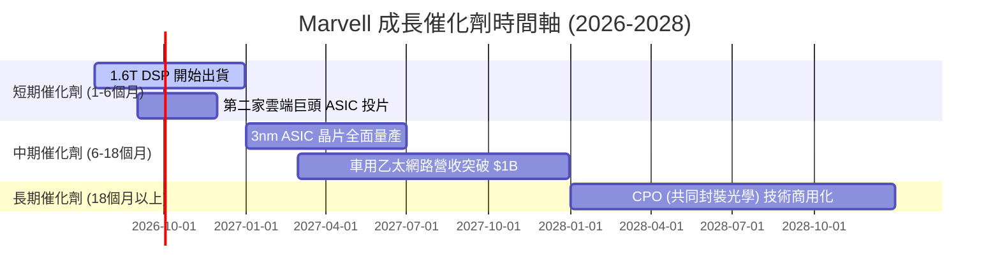

### 8.2 TAM（可定址市場規模）分析

Marvell 所處的數據基礎設施市場正迎來結構性擴張：

```
╔══════════════════════════════════════════════════════════════════╗
║                  MRVL 核心市場 TAM 與滲透率預測                 ║
╠══════════════════════════════════════════════════════════════════╣
║                                                                  ║
║  1. AI 資料中心光電晶片 (DSP/TIA/LNA)                            ║
║     ├── 2026年 TAM: $6.5B ｜ MRVL 預估市佔: 60% ｜ 貢獻營收: $3.9B║
║                                                                  ║
║  2. 客製化 AI ASIC 晶片市場                                     ║
║     ├── 2026年 TAM: $12.0B｜ MRVL 預估市佔: 25% ｜ 貢獻營收: $3.0B║
║                                                                  ║
║  3. 車用高速乙太網路晶片                                         ║
║     ├── 2026年 TAM: $2.2B ｜ MRVL 預估市佔: 35% ｜ 貢獻營收: $0.8B║
║                                                                  ║
║  📊 總計 2026 可定址市場 (TAM) 達 $20.7B，MRVL 具備極大成長空間。║
╚══════════════════════════════════════════════════════════════════╝
```

### 8.3 成長驅動力結構圖

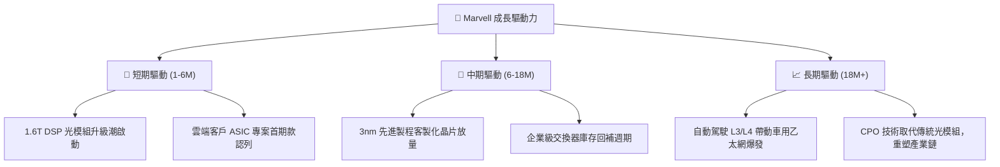

---

## 9. 風險矩陣

### 9.1 風險評分矩陣

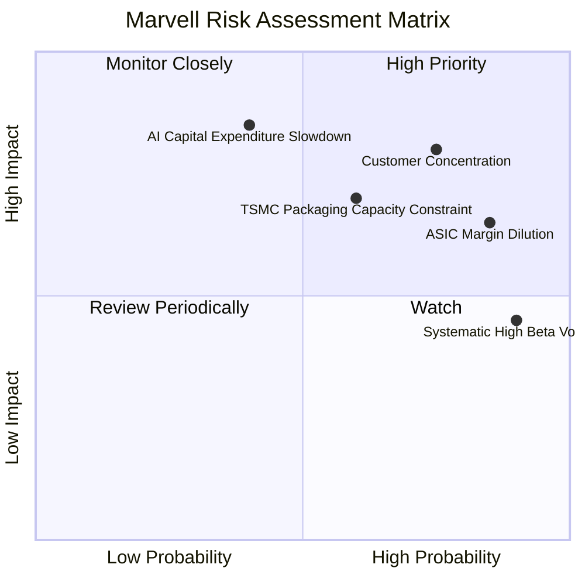

### 9.2 風險清單詳細分析

| # | 風險項目 | 發生機率 | 財務衝擊 | 風險評分 | 機構級緩解措施與追蹤指標 |
|---|----------|----------|----------|----------|--------------------------|
| 1 | 🔴 **客戶集中度過高** | 高 (75%) | 高 (-20% 營收) | 🔴 **8.0 / 10** | 目前 ASIC 營收高度依賴單一北美雲端巨頭。需密切追蹤第二、第三家雲端客戶的投片進度。 |
| 2 | 🟡 **ASIC 毛利率稀釋效應** | 極高 (85%) | 中 (-3% 毛利率) | 🟡 **7.2 / 10** | 客製化晶片毛利率較低。公司需透過提高 1.6T DSP 等高毛利標準品出貨比例來平衡產品組合。 |
| 3 | 🔴 **AI 資本支出放緩** | 中 (40%) | 極高 (-35% 估值) | 🔴 **7.0 / 10** | 密切監控 Microsoft, Meta, Google, AWS 每季財報中的 CapEx 指引，若連續兩季下修則需減碼。 |
| 4 | 🟡 **先進封裝（CoWoS）產能受限** | 中 (60%) | 中 (-10% 出貨量) | 🟡 **6.0 / 10** | 與 TSMC 簽訂長期產能保證協議（LTA），並積極導入日月光等第二封裝水源。 |

---

## 10. 投資建議

### 10.1 最終綜合評級雷達圖

根據基本面、成長性、獲利品質、財務健康度與估值合理性，我們給予 Marvell 的綜合投資畫像如下：

```
╔══════════════════════════════════════════════════════════════╗
║                    MRVL 綜合評級雷達圖                       ║
╠══════════════════════════════════════════════════════════════╣
║                                                              ║
║  成長動能 (Growth)      9.0/10  ▓▓▓▓▓▓▓▓▓▓▓▓▓▓▓▓▓▓░░  ★★★★★   ║
║  技術領先 (Tech Moat)   8.5/10  ▓▓▓▓▓▓▓▓▓▓▓▓▓▓▓▓▓░░░  ★★★★☆   ║
║  財務健康 (Balance)     8.5/10  ▓▓▓▓▓▓▓▓▓▓▓▓▓▓▓▓▓░░░  ★★★★☆   ║
║  估值合理 (Valuation)   7.5/10  ▓▓▓▓▓▓▓▓▓▓▓▓▓░░░░░░░  ★★★☆☆   ║
║  盈餘品質 (Earnings Q)  6.5/10  ▓▓▓▓▓▓▓▓▓▓▓░░░░░░░░░  ★★★☆☆   ║
║                                                              ║
║  🏆 綜合投資評分：8.0 / 10 ｜ 評級：🟢 買入 (Buy)            ║
╚══════════════════════════════════════════════════════════════╝
```

### 10.2 目標價與隱含報酬率

| 情境 | 出現機率權重 | 目標價 | 隱含報酬率 (相較現價 $217.53) | 權重後期望目標價 |
|------|--------------|--------|------------------------------|------------------|
| 🔴 悲觀 | 20% | $145.00 | -33.3% | $29.00 |
| 🟡 **基準** | **60%** | **$252.56** | **+16.1%** | **$151.54** |
| 🟢 樂觀 | 20% | $335.00 | +54.0% | $67.00 |
| **綜合** | **100%** | **$247.54** | **+13.8%** | **$247.54 (加權公允價值)** |

### 10.3 買入時機與觸發因素

```
╔══════════════════════════════════════════════════════════════════╗
║                  ✅ MRVL 投資操作決策清單                       ║
╠══════════════════════════════════════════════════════════════════╣
║                                                                  ║
║  立即買入觸發條件（滿足以下任二）：                              ║
║  ✅ 股價回檔至 $200.00 以下（提供 >25% 的安全邊際）              ║
║  ✅ 1.6T DSP 晶片獲得北美三家以上光模組廠採購確認                ║
║  ✅ 季報顯示客製化 ASIC 毛利率高於 53%（緩解利潤率稀釋疑慮）     ║
║                                                                  ║
║  分批加碼觸發條件：                                              ║
║  ☐ 宣佈贏得全新一線雲端巨頭（如 Meta 或 Google）的下一代 ASIC 訂單║
║  ☐ 聯準會重啟降息，高 Beta 成長股估值中樞上移                    ║
║                                                                  ║
║  減碼/停損觸發條件（出現以下任一即執行）：                       ║
║  ❌ 雲端巨頭下修 AI 資本支出指引連續兩季                          ║
║  ❌ 季度 FCF 轉為負值，或 SBC 佔營收比重突破 12%                 ║
║  ❌ 競爭對手 Broadcom 宣佈獨佔主要客戶下一代晶片訂單             ║
╚══════════════════════════════════════════════════════════════════╝
```

### 10.4 投資人適配度分析

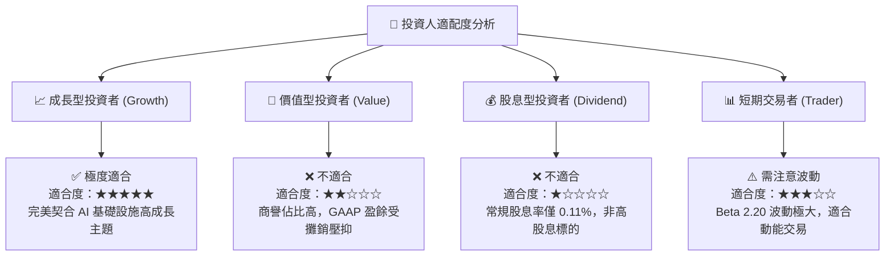

### 10.5 每季財報監控清單（Quarterly Watch List）

為了持續追蹤本投資框架的有效性，機構投資人應在每季財報中重點監控以下指標與臨界值：

| 監控指標 | 基準值 (最新季) | 觸發加碼門檻 | 觸發減碼/警示門檻 | 追蹤核心邏輯 |
|----------|-----------------|--------------|-------------------|--------------|
| **資料中心業務營收** | ~$1.50B / 季 | > $1.80B / 季 | < $1.20B / 季 | 衡量 AI 需求是否持續。 |
| **Non-GAAP 毛利率** | 61.5% | > 63.0% | < 58.0% | 評估 ASIC 業務是否嚴重稀釋獲利能力。|
| **SBC 佔營收比重** | 7.15% | < 5.0% | > 10.0% | 監控股東權益稀釋速度。 |
| **1.6T DSP 出貨進度**| 樣品測試階段 | 宣佈進入商業量產 | 專案進度延遲一季以上 | 評估技術領先優勢是否維持。 |

### 10.6 反面論證：什麼會證明論點錯誤（What Would Change My Mind）

機構投資必須保持客觀，以下可量化條件若發生，將證明本報告的多頭論點失效，應立即重新評估或終止投資：

```
╔══════════════════════════════════════════════════════════════════╗
║              ⚠️ 論點失效條件（Disconfirming Evidence）           ║
╠══════════════════════════════════════════════════════════════════╣
║  本投資論點在下列情況成立時應重新檢視或退出：                    ║
║  ☐ 客戶集中度風險爆發：前兩大客戶佔總營收比重突破 55%            ║
║  ☐ 營業利益率（GAAP）連續兩季跌破 12%（營業槓桿失效）            ║
║  ☐ 自由現金流（FCF）連續兩季低於 $300M，現金轉換率跌破 50%       ║
║  ☐ 投入資本報酬率（ROIC）跌破 5.0%，顯示資本配置效率嚴重惡化      ║
║  ☐ 競爭對手（如 Broadcom 或 Credo）推出更具性價比的 1.6T 方案，  ║
║     導致 Marvell 的光通訊 DSP 市佔率跌破 50%                     ║
╚══════════════════════════════════════════════════════════════════╝
```

---

> **免責聲明**：本報告為基於客觀財務數據與行業模型之學術與投資研究分析，不構成任何買賣要約。半導體板塊具備高波動與高技術更迭風險，投資人應獨立評估自身風險承受能力。