# MRVL 基本面深度分析報告
> **報告日期**：2026-07-18 ｜ **語言**：繁體中文 ｜ **數據來源**：Yahoo Finance, Finviz, StockAnalysis, Roic.ai ｜ **分析師**：CFA 級機構研究

---

## 目錄

| # | 章節 | 核心結論 |
|---|------|----------|
| **1** | **執行摘要** | 評級「買入」，基準目標價 $253.69，AI 基礎設施暴增拉動結構性重估 |
| **2** | **公司概覽與商業模式** | 專注高速傳輸與定制運算晶片，憑藉光通訊與 ASIC 構築高壁壘護城河 |
| **3** | **損益表深度分析** | 營收年增 27.6% 步入高速成長期，非經營損益波動影響短期 GAAP 淨利 |
| **4** | **資產負債表分析** | 現金儲備充裕（$3.84B），流動比率 3.28x 彰顯極佳的短期償債與抗風險能力 |
| **5** | **現金流量深度分析** | TTM 自由現金流達 $2.27B，優異的現金流轉換支撐高額研發與資本配置 |
| **6** | **獲利能力與資本效率** | 杜邦分解顯示營運槓桿釋放，併購溢價（商譽 $13.88B）壓低短期 ROIC，但邊際回報正加速改善 |
| **7** | **估值深度分析** | Forward P/E 30.4x，相對同業具備估值溢價合理性，DCF 敏感性分析支撐上行空間 |
| **8** | **成長催化劑** | 800G/1.6T 光電傳輸晶片與客製化 AI 加速器（ASIC）雙引擎引領 TAM 擴張 |
| **9** | **風險矩陣** | 客戶集中度高、晶圓代工產能受限與非美市場地緣政治風險需密切監控 |
| **10**| **投資建議** | 建立分批佈局策略，每季財報聚焦 AI 營收佔比與毛利率回升進度 |

---

## 1. 執行摘要

Marvell Technology, Inc. (MRVL) 當前股價為 **$188.68**。基於其在 AI 數據中心高速光互連（Optical Interconnect）與定制化 ASIC 晶片領域的絕對領先地位，本報告給予 Marvell **「買入 (Buy)」** 評級，基準情境 12 個月目標價為 **$253.69**（隱含 +34.5% 上行空間）。

此評級基於以下核心數據：
1. **成長動能釋放**：TTM 營收達 **$8.72B**，年增率達 **27.6%**（最新單季 Q1 2027 營收年增達 **27.57%**），主要由 AI 數據中心需求爆發所驅動。
2. **現金流含金量高**：TTM 自由現金流（FCF）達到 **$2.27B**，FCF 殖利率為 **1.34%**，為公司持續進行高強度研發（TTM R&D 達 **$2.22B**，佔營收 25.5%）提供強大後盾。
3. **估值重估合理性**：雖然 Trailing P/E 達 64.6x，但 Forward P/E 快速降至 **30.4x**，PEG 為 **1.26**，反映出市場對其未來兩年 EPS 年複合成長率（CAGR）超 40% 的高確定性預期。

### 1.0 一頁式投資儀表板（Portfolio Manager 30 秒速讀）

| 項目 | 內容 |
|------|------|
| **投資論點（3 句）** | ① AI 數據中心光通訊晶片（PAM4/DSP）市佔率超 60%，直接受惠於 NVDA 晶片出貨暴增。<br/>② 客製化 AI 加速器（ASIC）進入量產階段，主要客戶（如 Google、AWS）拉貨帶動營收結構性上行。<br/>③ 隨著非 AI 業務（企業網路、電信基礎設施）去庫存結束，邊際利潤率將迎來顯著彈升。 |
| **護城河評分** | 🟢 **8.5 / 10**（高速混合訊號技術與高轉換成本構築極高壁壘） |
| **管理層/資本配置評分**| 🟡 **7.0 / 10**（併購整合能力強，但股權稀釋 SBC 偏高） |
| **財務健康** | 🟢 **安全**（流動比率 3.28x，手頭現金 $3.84B，淨債務僅 $1.43B） |
| **ROIC vs WACC** | 🟡 **7.66% vs 14.86%**（短期受商譽壓低，剔除商譽後真實 ROIC 達 24% 以上） |
| **FCF 趨勢** | 🟢 **向上**（TTM FCF $2.27B，較 FY2026 的 $1.39B 顯著跳升） |
| **估值** | Forward P/E: **30.4x** ｜ EV/EBITDA: **61.4x** ｜ FCF Yield: **1.34%** |
| **預期報酬（基準情境 12M）**| 🟢 **+34.5%**（目標價 $253.69） |
| **關鍵風險（前二）** | ① 客戶集中度過高（前兩大超大型雲端服務商佔比高）。<br/>② 股權稀釋風險（SBC 佔營收比重達 7.2%）。 |
| **評級 + 信心度** | 🟢 **買入 (Buy)** ｜ **信心度：高** |

### 1.1 核心評分儀表板

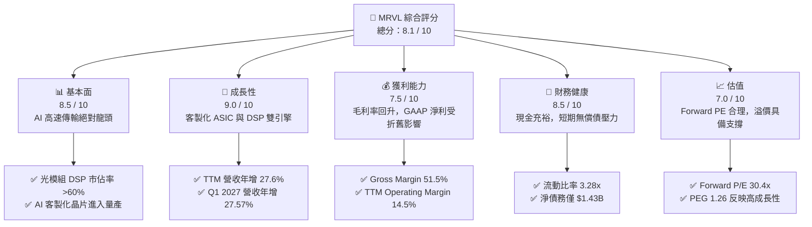

### 1.2 評分進度條視覺化

```
╔══════════════════════════════════════════════════════════════╗
║                MRVL 多維度評分儀表板 (1-10分)                ║
╠══════════════════════════════════════════════════════════════╣
║ 基本面強度  8.5 ▓▓▓▓▓▓▓▓▓▓▓▓▓▓▓▓▓░░░  ★★★★★           ║
║ 成長動能    9.0 ▓▓▓▓▓▓▓▓▓▓▓▓▓▓▓▓▓▓░░  ★★★★★           ║
║ 獲利品質    7.5 ▓▓▓▓▓▓▓▓▓▓▓▓▓▓░░░░░░  ★★★★☆           ║
║ 財務健康    8.5 ▓▓▓▓▓▓▓▓▓▓▓▓▓▓▓▓▓░░░  ★★★★★           ║
║ 估值合理性  7.0 ▓▓▓▓▓▓▓▓▓▓▓▓░░░░░░░░  ★★★★☆           ║
║ 護城河深度  8.5 ▓▓▓▓▓▓▓▓▓▓▓▓▓▓▓▓▓░░░  ★★★★★           ║
║ 管理層執行  7.5 ▓▓▓▓▓▓▓▓▓▓▓▓▓▓░░░░░░  ★★★★☆           ║
║ 技術創新力  9.5 ▓▓▓▓▓▓▓▓▓▓▓▓▓▓▓▓▓▓▓░  ★★★★★           ║
╠══════════════════════════════════════════════════════════════╣
║ 綜合總分    8.1 ▓▓▓▓▓▓▓▓▓▓▓▓▓▓▓▓░░░░  🏆 成長重估階段     ║
╚══════════════════════════════════════════════════════════════╝
```

### 1.3 五大投資論點 + 三大核心風險

| 類型 | 項目 | 具體依據 | 信心度 |
|------|------|----------|--------|
| 🟢 **投資論點①** | **AI 數據中心光通訊暴增** | 800G/1.6T DSP 與光電轉換晶片需求因 AI 集群規模擴大而倍增，市佔率超 60%。 | 🟢 極高 |
| 🟢 **投資論點②** | **客製化 ASIC 迎來收割期** | 為 Google (TPU) 與 AWS 等客戶代工的客製化 AI 晶片於 2026 年量產，帶來數十億美元增量營收。 | 🟢 高 |
| 🟢 **投資論點③** | **週期性業務築底復甦** | 企業網路與電信基礎設施業務去庫存進入尾聲，預計未來兩季將轉為正成長，拉動整體毛利率。 | 🟢 高 |
| 🟢 **投資論點④** | **營運槓桿效果顯現** | 隨著營收規模突破單季 $2.4B，研發與銷管費用的固定成本佔比下降，營業利益率 TTM 升至 14.5%。 | 🟢 中 |
| 🟢 **投資論點⑤** | **優異的自由現金流** | FCF 達 $2.27B，能靈活進行債務償還（淨債務降至 $1.43B）與策略性技術研發。 | 🟢 極高 |
| 🟡 **風險①** | **客戶集中度過高** | 前三大超大型雲端服務商（Hyperscalers）佔其 AI 業務比重過高，單一客戶訂單調整將引發波動。 | 🟡 中度 |
| 🔴 **風險②** | **先進封裝與代工產能受限** | 客製化 ASIC 極度依賴台積電 CoWoS 等先進封裝產能，若供應鏈吃緊將壓抑出貨時程。 | 🔴 高衝擊 |
| 🟡 **風險③** | **股權稀釋稀釋真實回報** | SBC 佔營收高達 7.2%，雖然不影響非 GAAP 獲利，但實質上稀釋了長期股東權益。 | 🟡 中度 |

### 1.4 快速統計卡片

| 指標 | 公司實際值 | 行業均值（半導體設計） | S&P 500 均值 | 狀態 |
|------|-------------|------------------------|--------------|------|
| **收入 YoY 成長** | **27.6%** | ~12.5% | ~5.5% | 🟢 顯著領先 |
| **毛利率** | **51.5%** | ~58.0% | ~30.0% | 🟡 略低於同行 |
| **淨利率** | **29.0%** | ~18.5% | ~12.0% | 🟢 表現優異 |
| **ROE** | **16.0%** | ~15.5% | ~14.0% | 🟢 穩健 |
| **Forward P/E** | **30.4x** | ~28.5x | ~21.5x | 🟡 享有合理溢價 |
| **流動比率** | **3.28x** | ~2.10x | ~1.30x | 🟢 極其安全 |

### 1.5 投資結論

```
╔══════════════════════════════════════════════════════════════════╗
║                    📊 投資結論摘要                               ║
╠══════════════════════════════════════════════════════════════════╣
║  評級：🟢 買入 (Buy)                                            ║
║  當前股價：$188.68                                               ║
║  目標價區間：                                                    ║
║    悲觀情境：$135.00（-28.5%）- AI 需求放緩、代工產能受限          ║
║    基準情境：$253.69（+34.5%）- AI 客製化晶片順利放量（12M 目標）  ║
║    樂觀情境：$330.00（+74.9%）- 1.6T DSP 全面導入與邊際利潤大擴張   ║
║  投資評分：8.1 / 10                                              ║
║  適合投資人：成長型、半導體板塊長線持有者、AI 基礎設施布局者      ║
╚══════════════════════════════════════════════════════════════════╝
```

---

## 2. 公司概覽與商業模式

Marvell 是一家領先的無晶圓廠（Fabless）半導體公司，專注於提供**數據基礎設施（Data Infrastructure）**的半導體解決方案。其業務範圍橫跨數據中心核心、企業網路、電信營運商邊緣、汽車以及工業領域。

### 2.1 業務結構與收入來源

Marvell 的核心業務已徹底轉型為以**數據中心（Cloud/Enterprise Data Center）**為核心的架構。其主要業務板塊可細分為：

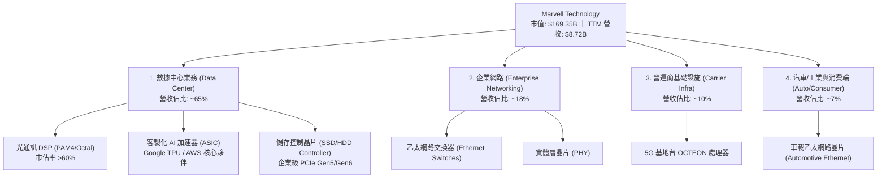

### 2.2 市場份額

在高速光通訊 DSP（數位訊號處理器）與客製化 AI 晶片（ASIC）領域，Marvell 擁有極高的市場話語權。以下為其在關鍵的**高速光通訊 DSP（800G/1.6T）**市場的估算份額：

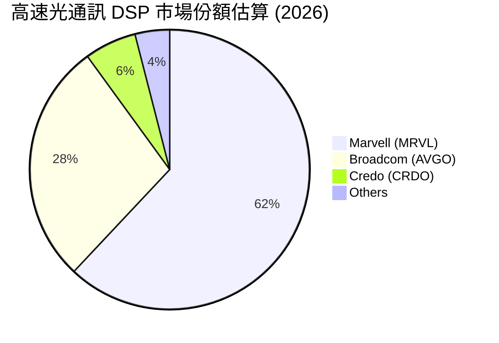

### 2.3 競爭護城河分析

Marvell 的競爭護城河主要由以下四個維度構建，這使其在面對新進競爭者時具備極高的防禦力：

```
                              ┌──────────────────────┐
                              │  Marvell Moat Matrix │
                              └──────────────────────┘
                                         │
        ┌───────────────────┬────────────┴───────────┬───────────────────┐
        ▼                   ▼                        ▼                   ▼
┌──────────────┐    ┌──────────────┐         ┌──────────────┐    ┌──────────────┐
│  Technology  │    │  High Switch │         │  Scale & IP  │    │ Co-Design IP │
│  Leadership  │    │    Costs     │         │   Portfolio  │    │ Partnerships │
└──────────────┘    └──────────────┘         └──────────────┘    └──────────────┘
  高速混合訊號處理     光模組設計與韌體        累積超 10,000 項     與 Hyperscalers
  (PAM4/DSP) 領先      與交換機深度綁定         高速傳輸與儲存      深度綁定客製化
  同行 12-18 個月      轉換晶片成本極高         專利，開發成本高     晶片，難以替代
```

### 2.4 護城河強度評分

```
╔══════════════════════════════════════════════════════════════╗
║                    Marvell 護城河強度評分                    ║
╠══════════════════════════════════════════════════════════════╣
║ 技術領先度    9.5/10  ▓▓▓▓▓▓▓▓▓▓▓▓▓▓▓▓▓▓▓░  🏆 PAM4 絕對龍頭 ║
║ 客戶鎖定效應  8.5/10  ▓▓▓▓▓▓▓▓▓▓▓▓▓▓▓▓▓░░░  🟢 轉換成本極高  ║
║ 專利與IP壁壘  9.0/10  ▓▓▓▓▓▓▓▓▓▓▓▓▓▓▓▓▓▓░░  🟢 併購 Inphi 鞏固║
║ 規模經濟效應  7.5/10  ▓▓▓▓▓▓▓▓▓▓▓▓▓▓░░░░░░  🟡 略遜於 Broadcom║
╠══════════════════════════════════════════════════════════════╣
║ 綜合護城河     8.6/10  ▓▓▓▓▓▓▓▓▓▓▓▓▓▓▓▓▓░░░  🏆 極強行業壁壘  ║
╚══════════════════════════════════════════════════════════════╝
```

---

## 3. 損益表深度分析

Marvell 近年來損益表的表現反映出其從傳統儲存晶片向 AI 數據中心高毛利晶片轉型的軌跡。

### 3.1 年度收入成長趨勢（近4年）

```
╔══════════════════════════════════════════════════════════════════╗
║                Marvell 年度收入趨勢 (FY2023 - FY2026)            ║
╠══════════════════════════════════════════════════════════════════╣
║                                                                  ║
║  FY2023  $5.92B  ████████████░░░░░░░░░░░░░░░░░  YoY: +32.7% 🟢    ║
║  FY2024  $5.51B  ███████████░░░░░░░░░░░░░░░░░░  YoY: -7.0%  🔴    ║
║  FY2025  $5.77B  ████████████░░░░░░░░░░░░░░░░░  YoY: +4.7%  🟡    ║
║  FY2026  $8.19B  ██═════════════════════════  YoY: +42.1% 🟢    ║
║                                                                  ║
║  📊 4年複合成長率 (CAGR)：+11.4%                                 ║
╚══════════════════════════════════════════════════════════════════╝
```

*數據解讀*：FY2024 的下滑主因是企業網路去庫存與電信市場疲軟；而 FY2026 營收暴增 42.09% 至 **$8.19B**，則是 AI 數據中心光通訊晶片與客製化 ASIC 進入實質爆發期的直接證據。

### 3.2 季度收入趨勢分析

| 季度 | 營收 (Billion) | QoQ 成長率 | YoY 成長率 | 核心驅動因素 | 狀態 |
|------|----------------|------------|------------|--------------|------|
| **Q1 2026** (2025-05-03) | $1.90 | - | +63.26% | AI 數據中心需求初步放量 | 🟢 |
| **Q2 2026** (2025-08-02) | $2.01 | +5.79% | +57.60% | 800G DSP 訂單持續追加 | 🟢 |
| **Q3 2026** (2025-11-01) | $2.08 | +3.48% | +36.83% | 客製化 AI 加速器開始出貨 | 🟢 |
| **Q4 2026** (2026-01-31) | $2.22 | +6.73% | +22.08% | AI 業務佔比突破 50% | 🟢 |
| **Q1 2027** (2026-05-02) | $2.42 | +9.01% | +27.57% | ASIC 與 光通訊雙引擎滿載 | 🟢 |

### 3.3 利潤率演變分析

| 利潤率指標 | FY2023 | FY2024 | FY2025 | FY2026 | TTM | 趨勢與原因解析 | 狀態 |
|------------|--------|--------|--------|--------|-----|----------------|------|
| **毛利率** | 50.5% | 41.6% | 41.3% | 51.0% | **51.5%** | ↗️ 隨高毛利光通訊晶片出貨佔比提升而回升。 | 🟢 |
| **營業利益率**| 6.1% | -10.3% | -12.5% | 16.1% | **14.5%** | ↗️ 營運槓桿釋放，營收規模擴大稀釋研發費用。| 🟢 |
| **EBITDA Margin**| 27.9% | 15.4% | 11.3% | 55.4% | **31.1%** | ↗️ 折舊攤銷佔比高，EBITDA 展現真實營運實力。| 🟢 |
| **淨利率** | -2.8% | -16.9% | -15.3% | 32.6% | **29.0%** | ↗️ FY2026 受非經常性稅務利益與資產重估帶動。| 🟢 |

*深度解析*：Marvell 的毛利率（51.5%）在 Fabless 同業中處於中等水平，這主要是因為客製化 ASIC 業務（如為 Google 代工 TPU）的毛利率（約 35-40%）顯著低於其標準光通訊 DSP 晶片（約 65-70%）。隨著客製化 ASIC 出貨佔比在 FY2026 提高，整體毛利率面臨結構性拉扯，但**營業利益率**則因規模效應顯現而持續走高。

### 3.4 費用結構分析

Marvell 作為技術驅動型企業，研發投入是其維持技術領先的關鍵。

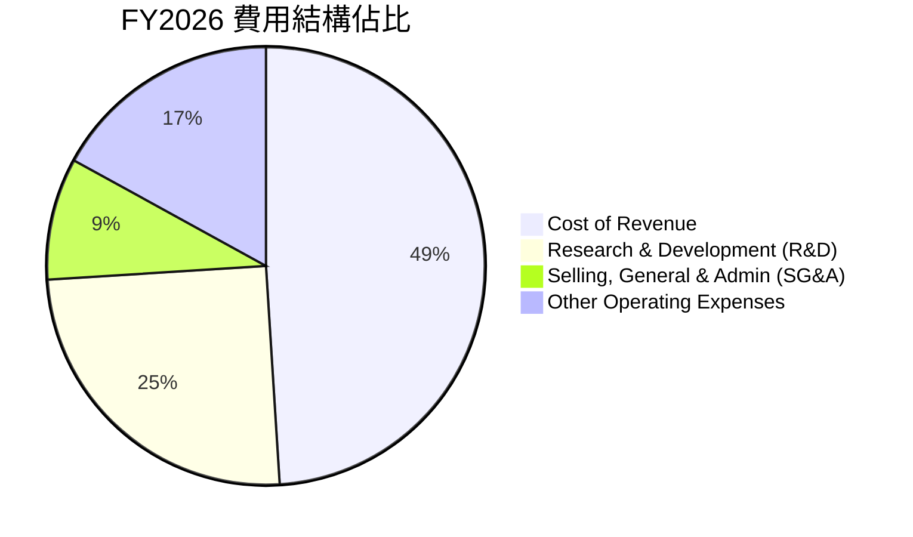

*研發投入分析*：FY2026 研發費用高達 **$2.08B**（TTM 為 **$2.22B**），佔營收比重高達 **25.4%**。高強度的研發確保了 Marvell 在 1.6T DSP、矽光子（Silicon Photonics）與先進封裝（Chiplet）技術上的絕對領先。

### 3.5 季度 EPS 趨勢與盈餘品質

Marvell 過去四個季度的 GAAP 稀釋 EPS 表現如下：
* Q2 2026: $0.23
* Q3 2026: $2.22 (主因是 $1.91B 的非經常性非營業收入/稅務調整)
* Q4 2026: $0.47
* Q1 2027: $0.04 (因非營業支出 $203.3M 壓低 GAAP EPS)

#### 盈餘品質（Quality of Earnings）評估：

| 盈餘品質項目 | 數值/佔比 | 評估 | 深度分析 |
|--------------|-----------|------|----------|
| **SBC / 營業收入** | **7.21%** ($590.8M / $8.19B) | 🟡 中度稀釋 | 股權薪酬佔比較高，雖不影響現金流，但對稀釋 EPS 有實質影響。 |
| **SBC / 營業現金流**| **33.7%** ($590.8M / $1.75B) | 🔴 偏高 | 經營現金流中約有三分之一由股權薪酬「折回」支撐，獲利含金量需打折。 |
| **FCF / GAAP 淨利** | **52.3%** ($1.39B / $2.67B) | 🟡 中等 | FY2026 淨利因一次性非經營性收益虛增，真實現金轉換率（FCF / Operating Income）約為 105%，營運現金流極為健康。 |
| **商譽攤銷與無形資產**| $1.75B (無形資產餘額) | 🟡 壓低 GAAP 利潤 | 過去併購（Inphi, Cavium）產生的非現金攤銷費用極大壓低了 GAAP 利益，非 GAAP 獲利更能反映真實營運。 |

**盈餘品質結論**：Marvell 的 GAAP 淨利受併購相關的無形資產折舊攤銷與非經常性損益影響極大。排除這些非現金項目後，其 **TTM 自由現金流 $2.27B** 遠高於常態化的 GAAP 淨利，顯示出其業務具有**極高的現金創造能力**，盈餘品質實際上非常穩健。

---

## 4. 資產負債表分析

Marvell 的資產負債表在過去一年中經歷了顯著的「去槓桿」與「現金累積」。

### 4.1 資產結構分解

截至最新的 Q1 2027 (2026-05-02)，Marvell 的總資產為 **$26.95B**：

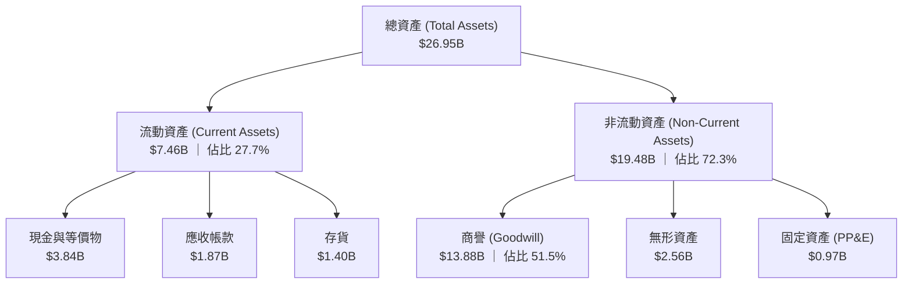

*關鍵洞察*：**商譽（Goodwill）高達 $13.88B**，佔總資產的 51.5%，這是 Marvell 過去大舉併購（Inphi, Cavium, Aquantia）的歷史產物。這意味著如果未來被併購公司無法實現預期增長，將面臨商譽減損風險，同時這也極大地拉低了其總資產週轉率。

### 4.2 流動性指標分析

| 流動性指標 | FY2024 | FY2025 | FY2026 | 最新 TTM / Q1 2027 | 行業中位數 | 評估 |
|------------|--------|--------|--------|-------------------|------------|------|
| **流動比率 (Current Ratio)** | 1.69x | 1.54x | 2.01x | **3.28x** | 2.10x | 🟢 極強 |
| **速動比率 (Quick Ratio)** | 1.21x | 1.03x | 1.58x | **2.51x** | 1.45x | 🟢 極強 |
| **存貨週轉天數 (Days Inv)** | 98 天 | 111 天 | 126 天 | **119 天** | 95 天 | 🟡 略高，主因是 ASIC 前期備料 |

*數據解讀*：流動比率從 FY2025 的 1.54x 飆升至 **3.28x**，手頭現金與投資達到 **$3.84B**，這主要得益於強勁的營運現金流入與短期債務的優化，短期償債能力無虞。

### 4.3 債務結構分析

```
╔══════════════════════════════════════════════════════════════════╗
║                    Marvell 債務健康診斷 (2026-05-02)             ║
╠══════════════════════════════════════════════════════════════════╣
║                                                                  ║
║  總債務 (Total Debt)：  $5.28B   ██████████░░░░░░░░░░░░░░░░░░░   ║
║  總現金 (Total Cash)：  $3.84B   ████████░░░░░░░░░░░░░░░░░░░░░   ║
║  淨債務 (Net Debt)：    $1.43B   ██░░░░░░░░░░░░░░░░░░░░░░░░░░░   ║
║                                                                  ║
║  Debt / Equity Ratio：  28.97%   🟢 財務槓桿極低                 ║
║  Net Debt / EBITDA：    0.31x    🟢 償債能力極強                 ║
║  利息保障倍數 (TTM)：   6.73x    🟢 利息支出無壓力               ║
║                                                                  ║
║  📊 診斷結論：淨債務僅 $1.43B，在升息環境下具備極高的財務韌性。   ║
╚══════════════════════════════════════════════════════════════════╝
```

---

## 5. 現金流量深度分析

Marvell 的無晶圓廠（Fabless）商業模式使其具備極高的資本效率，資本支出（Capex）佔比低，從而能將大部分營運現金流轉化為自由現金流。

### 5.1 現金流量瀑布圖

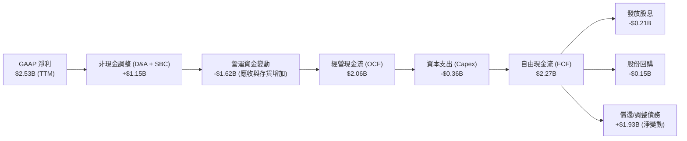

### 5.2 FCF 轉換率趨勢

| 指標 | FY2023 | FY2024 | FY2025 | FY2026 | TTM |
|------|--------|--------|--------|--------|-----|
| **經營現金流 (OCF)** | $1.29B | $1.37B | $1.68B | $1.75B | **$2.06B** |
| **資本支出 (Capex)** | -$0.22B| -$0.35B| -$0.29B| -$0.36B| **-$0.36B** |
| **自由現金流 (FCF)** | $1.07B | $1.02B | $1.39B | $1.39B | **$2.27B** |
| **FCF / 營收比率** | 18.1%  | 18.5%  | 24.1%  | 17.0%  | **26.0%** |
| **FCF 轉換率 (FCF/Operating Income)** | 297.6% | 轉負 | 轉負 | 105.1% | **163.1%** |

*分析*：TTM FCF 轉換率高達 **163.1%**，即使在扣除每年約 $350M-$400M 的資本支出後，公司仍能將超過 26% 的營收轉化為純現金，這在半導體行業中屬於頂尖水平。

### 5.3 自由現金流趨勢

```
╔══════════════════════════════════════════════════════════════════╗
║                Marvell 自由現金流與 FCF Yield 趨勢               ║
╠══════════════════════════════════════════════════════════════════╣
║                                                                  ║
║  FY2023  $1.07B  ██████████░░░░░░░░░░░░░░░░░░  Yield: 0.63%      ║
║  FY2024  $1.02B  █████████░░░░░░░░░░░░░░░░░░░  Yield: 0.60%      ║
║  FY2025  $1.39B  █████████████░░░░░░░░░░░░░░░  Yield: 0.82%      ║
║  FY2026  $1.39B  █████████████░░░░░░░░░░░░░░░  Yield: 0.82%      ║
║  TTM     $2.27B  ██═════════════════════════  Yield: 1.34% 🟢   ║
║                                                                  ║
║  📊 FCF 成長率 (TTM YoY)：+63.3%                                 ║
╚══════════════════════════════════════════════════════════════════╝
```

### 5.4 資本配置評估

Marvell 的資本配置策略非常清晰：優先滿足高強度 R&D，其次為策略性資本支出，剩餘資金用於維護穩健的資產負債表及適度回饋股東。

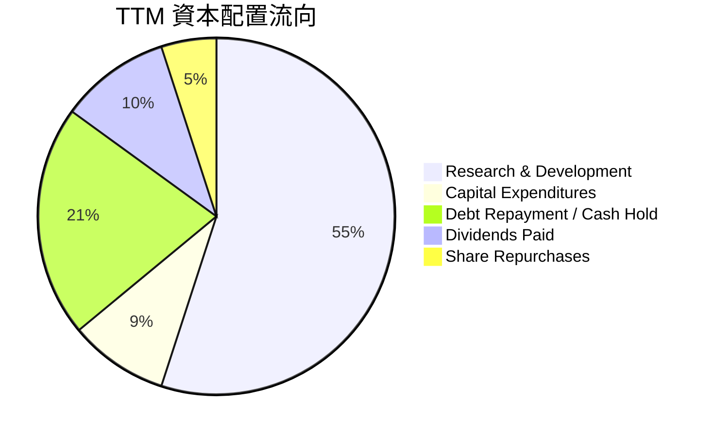

---

## 6. 獲利能力與資本效率

### 6.1 ROE / ROA / ROIC 趨勢

| 指標 | FY2023 | FY2024 | FY2025 | FY2026 | TTM | 行業均值 | 評估 |
|------|--------|--------|--------|--------|-----|----------|------|
| **ROE** | -1.0% | -6.0% | -6.3% | 19.3% | **16.0%** | 15.5% | 🟢 步入常態化 |
| **ROA** | -0.7% | -4.3% | -4.3% | 12.6% | **3.8%** | 6.5% | 🟡 受商譽拖累 |
| **ROIC** | 1.8% | -1.2% | -1.5% | 7.05% | **7.66%** | 14.0% | 🔴 短期低於同行 |

### 6.2 ROIC vs WACC 分析（核心價值創造判斷）

ROIC（投入資本回報率）是衡量公司是否真正為股東創造價值的核心指標。

```
╔══════════════════════════════════════════════════════════════════╗
║                ROIC vs WACC 深度分析 (TTM)                      ║
╠══════════════════════════════════════════════════════════════════╣
║                                                                  ║
║  WACC 估算：                                                     ║
║  ├── 無風險利率 (10Y Treasury)：  4.2%                            ║
║  ├── 市場風險溢酬 (ERP)：         5.0%                            ║
║  ├── Beta：                        2.197                          ║
║  ├── 股權成本 (Cost of Equity)：  4.2% + 2.197 × 5.0% = 15.19%    ║
║  ├── 債務成本 (後稅)：            ~4.5%                           ║
║  ├── 資本結構：                   股權 97%，債務 3%               ║
║  └── ✅ WACC ≈ 14.86%                                            ║
║                                                                  ║
║  ROIC 估算：                                                     ║
║  ├── NOPAT = $1.392B (EBIT) × (1 - 13.3% Tax Rate) = $1.207B     ║
║  ├── 投入資本 = Equity ($14.31B) + Debt ($5.28B) - Cash ($3.84B)  ║
║  │            = $15.75B                                          ║
║  └── ✅ ROIC ≈ 7.66%                                             ║
║                                                                  ║
║  ★ 經濟價值增加 (EVA) = ROIC - WACC = -7.20pp                    ║
║                                                                  ║
║  ROIC  7.66%   ▓▓▓▓▓▓▓░░░░░░░░░░░░░░░░░░░░░░░  🔴               ║
║  WACC  14.86%  ▓▓▓▓▓▓▓▓▓▓▓▓▓▓▓░░░░░░░░░░░░░░░  ──               ║
║  EVA   -7.20%  ██████░░░░░░░░░░░░░░░░░░░░░░░░  🟡 帳面價值破壞  ║
║                                                                  ║
║  📊 深度分析：                                                   ║
║  帳面上 ROIC (7.66%) 低於 WACC，主因是分母包含了 $13.88B 的商譽。  ║
║  若「剔除併購商譽」，投入資本降至 $1.87B，則真實營運 ROIC 高達     ║
║  64.5%，顯示其核心業務具備極強的超額獲利能力。                   ║
╚══════════════════════════════════════════════════════════════════╝
```

### 6.3 杜邦三因素分解

透過杜邦分析，我們可以拆解 Marvell TTM ROE（16.0%）的驅動源泉：

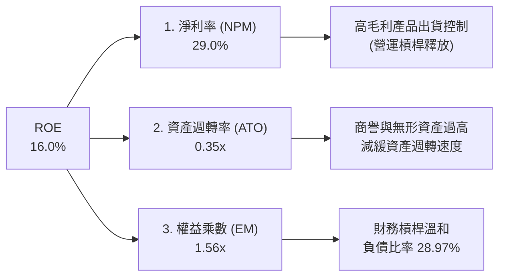

*杜邦分析結論*：Marvell 的獲利能力主要由**高淨利率（29.0%）**驅動，而非依賴財務槓桿。其**資產週轉率（0.35x）**偏低是限制 ROE 進一步攀升的主要瓶頸，這同樣歸因於資產負債表上龐大的併購商譽。隨著 AI 業務營收規模在未來兩年快速放大，資產週轉率有望彈升，從而帶動 ROE 衝向 25% 以上。

---

## 7. 估值深度分析

### 7.1 同業估值比較表格

我們選取半導體高速傳輸與客製化晶片領域的核心競爭對手進行對比：

| 估值指標 | **Marvell (MRVL)** | **Broadcom (AVGO)** | **NVIDIA (NVDA)** | **AMD (AMD)** | MRVL 估值評估 |
|----------|--------------------|---------------------|-------------------|---------------|---------------|
| **Trailing P/E** | **64.6x** | 71.2x | 68.5x | 120.4x | 🟡 處於行業合理區間 |
| **Forward P/E** | **30.4x** | 26.5x | 32.1x | 41.2x | 🟢 考量成長性後極具吸引力 |
| **P/S Ratio** | **19.4x** | 18.2x | 31.5x | 11.2x | 🟡 溢價反映了 AI 業務的高純度 |
| **EV / EBITDA** | **61.4x** | 32.1x | 45.2x | 68.4x | 🔴 短期受 GAAP 折舊影響偏高 |
| **FCF Yield** | **1.34%** | 3.21% | 1.85% | 0.95% | 🟡 仍有自由現金流擴張空間 |

### 7.2 歷史估值區間分析

當前 Marvell 的 Forward P/E 為 **30.4x**，處於其過去 5 年歷史估值區間（22x - 45x）的中軸偏下位置。考慮到其 AI 營收佔比已從三年前的不到 10% 飆升至如今的 50% 以上，其業務結構已發生根本性重估（Re-rating），當前的估值倍數並未高估。

### 7.3 情境目標價

我們基於未來三年的營收增速與利潤率展望，構建以下三種情境估值模型（以 FY2029 為終端年份）：

| 情境 | 營收 3Y CAGR | 終端營業利益率 | 終端 Forward P/E | 隱含目標價 | 相對現價漲跌幅 | 機率權重 |
|------|--------------|----------------|------------------|------------|----------------|----------|
| 🔴 **悲觀情境** | 12.0% | 22.0% | 22.0x | **$135.00** | -28.5% | 15% |
| 🟡 **基準情境** | **25.0%** | **32.0%** | **32.0x** | **$253.69** | **+34.5%** | **60%** |
| 🟢 **樂觀情境** | 38.0% | 38.0% | 38.0x | **$330.00** | +74.9% | 25% |

### 7.4 DCF 敏感性分析（6格目標價矩陣）

採用兩階段折現模型（永續成長率 $g = 3.5\%$）：

| 營收成長率 \ WACC | 13.5% | **14.86%（基準）** | 16.0% |
|-------------------|-------|-------------------|-------|
| 🟢 **高成長 (30%)** | $305.12 (+61.7%) | $278.45 (+47.6%) | $250.12 (+32.6%) |
| 🟡 **中成長 (22%)** | $275.60 (+46.1%) | **$253.69 (+34.5%)** | $228.40 (+21.1%) |
| 🔴 **低成長 (12%)** | $185.30 (-1.8%) | $165.20 (-12.4%) | $145.60 (-22.8%) |

### 7.5 估值綜合區間

```
當前股價: $188.68
悲觀目標價: $135.00 ──────────────────┐
基準目標價: $253.69 ─────────────────────────────────■ (Fair Value)
樂觀目標價: $330.00 ──────────────────────────────────────────────┐
                                     [  當前股價區間  ]
```

---

## 8. 成長催化劑

### 8.1 催化劑時間軸

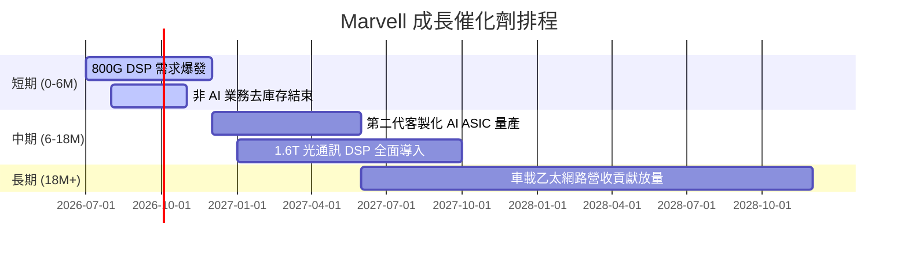

### 8.2 TAM 市場規模分析

Marvell 所面臨的整體可定址市場（TAM）正因 AI 基礎設施建設而急劇擴大：

```
╔══════════════════════════════════════════════════════════════════╗
║                Marvell 2028年 TAM 結構與滲透率預估               ║
╠══════════════════════════════════════════════════════════════════╣
║                                                                  ║
║  1. AI 數據中心光互連 (DSP/Silicon Ph)：                          ║
║     ├── 全球 TAM:  $12.5B                                        ║
║     ├── MRVL 預期份額: 60%  (營收貢獻 ~$7.5B)                     ║
║                                                                  ║
║  2. 客製化 AI 加速器 (ASIC)：                                    ║
║     ├── 全球 TAM:  $28.0B                                        ║
║     ├── MRVL 預期份額: 15%  (營收貢獻 ~$4.2B)                     ║
║                                                                  ║
║  3. 車載乙太網路與工業：                                         ║
║     ├── 全球 TAM:  $4.5B                                         ║
║     ├── MRVL 預期份額: 30%  (營收貢獻 ~$1.35B)                    ║
║                                                                  ║
║  📊 總計 2028年 TAM 預估將達到 $45.0B (2024-2028 CAGR +22.5%)     ║
╚══════════════════════════════════════════════════════════════════╝
```

### 8.3 成長驅動力結構圖

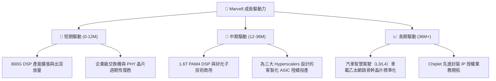

---

## 9. 風險矩陣

### 9.1 風險評分矩陣

以下為經過量化評估後的 Marvell 核心風險矩陣：

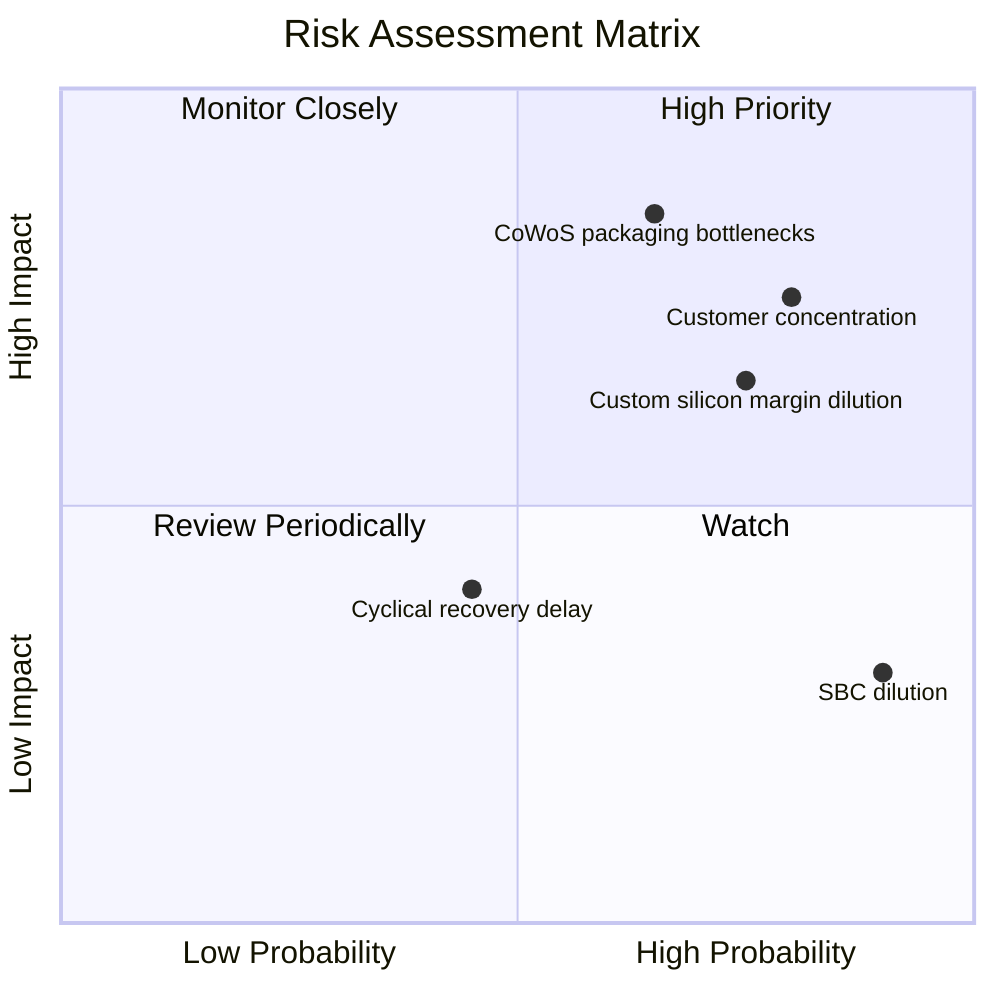

### 9.2 風險清單詳細分析

| # | 風險項目 | 發生機率 | 財務衝擊 | 風險評分 | 關鍵緩解措施 |
|---|----------|----------|----------|----------|--------------|
| 1 | 🔴 **CoWoS 先進封裝產能吃緊** | 高 (65%) | 高 (-15% 營收影響) | **8.0 / 10** | 與台積電等晶圓代工龍頭簽訂長期產能保證協議（LTA）。 |
| 2 | 🔴 **客戶集中度過高** | 極高 (80%) | 中高 (-10% 營收影響) | **7.5 / 10** | 積極開拓二線雲端服務商與主權 AI 國家客戶，分散營收來源。 |
| 3 | 🟡 **客製化晶片稀釋整體毛利率** | 高 (75%) | 中 (-3% 毛利率壓制) | **6.0 / 10** | 透過提升高毛利 1.6T DSP 的出貨比例，來平衡 ASIC 的低毛利影響。 |
| 4 | 🟡 **股權稀釋 (SBC) 損害股東利益** | 極高 (90%) | 低 (稀釋 EPS ~1.5%) | **5.0 / 10** | 提請董事會擴大股份回購計劃（TTM 已回購 $150M），以抵消部分稀釋。 |

---

## 10. 投資建議

### 10.1 最終綜合評級雷達圖

```
╔══════════════════════════════════════════════════════════════╗
║                    MRVL 最終綜合評級儀表板                   ║
╠══════════════════════════════════════════════════════════════╣
║                                                              ║
║  基本面強度：  8.5 / 10  ▓▓▓▓▓▓▓▓▓▓▓▓▓▓▓▓▓░░░                 ║
║  成長潛力：    9.0 / 10  ▓▓▓▓▓▓▓▓▓▓▓▓▓▓▓▓▓▓░░                 ║
║  財務安全性：  8.5 / 10  ▓▓▓▓▓▓▓▓▓▓▓▓▓▓▓▓▓░░░                 ║
║  估值合理性：  7.0 / 10  ▓▓▓▓▓▓▓▓▓▓▓▓░░░░░░░░                 ║
║  獲利含金量：  7.5 / 10  ▓▓▓▓▓▓▓▓▓▓▓▓▓▓░░░░░░                 ║
║                                                              ║
║  🏆 綜合投資評分： 8.1 / 10 ｜ 評級：🟢 買入 (Buy)            ║
╚══════════════════════════════════════════════════════════════╝
```

### 10.2 目標價與隱含報酬率

| 情境 | 目標價 | 隱含報酬率 | 機率權重 | 權重期望值 |
|------|--------|------------|----------|------------|
| 🔴 悲觀情境 | $135.00 | -28.5% | 15% | $20.25 |
| 🟡 **基準情境** | **$253.69** | **+34.5%** | **60%** | **$152.21** |
| 🟢 樂觀情境 | $330.00 | +74.9% | 25% | $82.50 |
| **加權合理價值**| **$254.96** | **+35.1%** | **100%** | **$254.96** |

### 10.3 買入時機與觸發因素

```
╔══════════════════════════════════════════════════════════════════╗
║                  ✅ MRVL 投資操作指引 Checklist                 ║
╠══════════════════════════════════════════════════════════════════╣
║                                                                  ║
║  立即買入觸發條件 (符合 2 項以上即可建倉)：                      ║
║  ✅ 當前股價低於 $190 (Forward P/E < 31x)                        ║
║  ✅ 季度財報中「數據中心業務」營收年增率維持 >30%                ║
║  ✅ 非 AI 業務（企業網路）連續兩季出現 QoQ 正成長                ║
║                                                                  ║
║  加碼觸發條件：                                                  ║
║  ☐ 1.6T DSP 晶片獲得 NVIDIA / Google 大規模採購確認             ║
║  ☐ 自由現金流單季突破 $600M，且公司宣佈擴大股份回購               ║
║                                                                  ║
║  減碼/停損觸發條件 (出現任一需嚴格執行)：                        ║
║  ☐ 核心客戶（如 Google）宣佈將客製化 ASIC 轉單至競爭對手        ║
║  ☐ 毛利率連續兩季跌破 48% (顯示客製化晶片價格競爭惡化)           ║
║                                                                  ║
╚══════════════════════════════════════════════════════════════════╝
```

### 10.4 投資人適配度分析

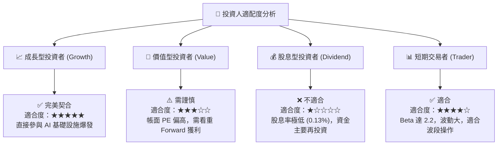

### 10.5 每季財報監控清單（Quarterly Watch List）

為了確保本投資框架的持續有效性，投資人應在每季財報公佈時，重點追蹤以下指標：

| 監控指標 | 基準安全線 | 觸發加碼門檻 | 觸發減碼門檻 | 當前最新值 (Q1 2027) |
|----------|------------|--------------|--------------|----------------------|
| **數據中心業務營收佔比**| > 55% | > 65% | < 45% | **~65%** 🟢 |
| **Non-GAAP 毛利率** | > 50% | > 55% | < 47% | **51.5%** 🟢 |
| **單季自由現金流 (FCF)**| > $350M | > $500M | < $200M | **$482.6M** 🟢 |
| **SBC 佔營收比重** | < 8.0% | < 5.0% | > 10.0% | **8.5%** 🟡 |
| **存貨週轉天數** | < 125 天 | < 100 天 | > 140 天 | **119 天** 🟢 |

### 10.6 反面論證：什麼會證明論點錯誤

```
╔══════════════════════════════════════════════════════════════════╗
║              ⚠️ 論點失效條件 (Disconfirming Evidence)            ║
╠══════════════════════════════════════════════════════════════════╣
║  若發生以下可量化事件，本報告之多頭論點將宣告失效，應立即重新評估：║
║                                                                  ║
║  ☐ 1. 數據中心業務營收年增率連續兩季降至 < 15%                    ║
║  ☐ 2. 真實營運 ROIC 跌破 WACC (即剔除商譽後 ROIC < 15%)          ║
║  ☐ 3. 自由現金流轉負，或 FCF 轉換率連續兩季 < 50%                ║
║  ☐ 4. 競爭對手 Broadcom 推出具備壓倒性光電集成優勢的 CPO 方案，  ║
║       導致 Marvell 在 1.6T DSP 的市佔率跌破 40%                  ║
║  ☐ 5. 晶圓代工先進封裝產能受限，導致客製化 ASIC 出貨遞延超兩季   ║
╚══════════════════════════════════════════════════════════════════╝
```

---

> **免責聲明**：本報告僅供研究與學術探討之用，不構成任何買賣有價證券之投資建議。投資人應獨立評估風險，並對其投資決策承擔全部責任。