# MRVL 基本面深度分析報告
> **報告日期**：2026-07-19 ｜ **語言**：繁體中文 ｜ **數據來源**：Yahoo Finance, Finviz, StockAnalysis, Roic.ai ｜ **分析師**：CFA 級機構研究

---

## 目錄

| # | 章節 | 核心結論 |
|---|------|----------|
| 1 | 執行摘要 | 給出 🟢 買入評級與 $253.69 基準目標價，剖析高估值背後的 AI 驅動本質 |
| 2 | 公司概覽與商業模式 | 分析以高速傳輸與客製化晶片（ASIC）為核心的護城河與市場份額 |
| 3 | 損益表深度分析 | 揭露 TTM 營收達 $8.72B（YoY +27.6%）與非經常性損益對淨利的扭曲 |
| 4 | 資產負債表分析 | 評估 $13.88B 巨額商譽與 3.28 倍流動比率下的資產結構與流動性 |
| 5 | 現金流量深度分析 | 剖析 TTM FCF $2.27B 的高含金量與股權稀釋（SBC 佔比高）的隱憂 |
| 6 | 獲利能力與資本效率 | 比較 16.0% ROE 與 13.3% WACC，並透過「有形 ROIC」還原真實資本效率 |
| 7 | 估值深度分析 | 透過同業對比與 DCF 敏感性分析，推導三種情境下的合理價值區間 |
| 8 | 成長催化劑 | 展望 AI ASIC 與 PAM4 DSP 光電傳輸晶片的 TAM 擴張與時程 |
| 9 | 風險矩陣 | 量化客戶集中度、商譽減損與週期性復甦遲滯等核心風險 |
| 10 | 投資建議 | 提供買入觸發 Checklists、每季財報監控指標與可量化的反面論證 |

---

## 1. 執行摘要

Marvell Technology, Inc. (NASDAQ: MRVL) 當前股價為 **$188.68**，總市值達 **$169.35B**。本報告基於公司最新公佈的 TTM 財務數據與業務進展進行深度研判。

Marvell 正處於從傳統網路基礎設施晶片商，轉型為全球 AI 數據中心高速互連與客製化運算晶片（ASIC）領頭羊的關鍵拐點。儘管公司當前 GAAP 稀釋後 P/E 高達 **64.84x**，但其 **Forward P/E 已降至 30.44x**，反映市場預期未來 12 個月 EPS 將從 TTM 的 **$2.91** 躍升至 **$6.1994**（增幅達 113%）。

支持本報告給予 **🟢 買入** 評級的核心依據在於：
1. **AI 基礎設施需求爆發**：TTM 營收達 **$8.72B**，最新季度（Q1 2027）營收達 **$2.42B**，YoY 成長率自前季的 22.1% 加速至 **27.6%**，主因客製化 AI 晶片開始放量與光模組 DSP（PAM4）出貨暢旺。
2. **極佳的現金流轉換**：TTM 自由現金流（FCF）達到 **$2.27B**，FCF 轉化率高，為未來的研發與去槓桿提供堅實後盾。
3. **高門檻的技術壁壘**：在高速光電傳輸晶片（DSP）市場擁有超過 60% 的市場份額，是 NVIDIA、Google 等超大型數據中心（Hyperscaler）不可或缺的供應商。

### 1.0 一頁式投資儀表板（Portfolio Manager 30 秒速讀）

| 項目 | 內容 |
|------|------|
| **投資論點（3 句）** | ① TTM 營收達 $8.72B 且最新季度 YoY 成長加速至 27.6%，顯示 AI ASIC 與光電傳輸晶片進入實質放量期。<br/>② 預期 Forward EPS 達 $6.1994，代表未來一年獲利將迎來 113% 的爆發性成長，有效消化當前較高的估值。<br/>③ TTM 自由現金流達 $2.27B，提供高達 13.0% 的名義殖利率與強勁的再投資能力。 |
| **護城河評分** | **8.5 / 10** 🟡 強韌（高速光互連高市佔率與客製化晶片高轉換成本） |
| **管理層/資本配置評分** | **7.5 / 10** 🟡 中上（併購整合能力強，但股權稀釋 SBC 偏高） |
| **財務健康** | 🟢 **安全**：流動比率 3.28，手頭現金 $3.84B，短期內無債務違約風險。 |
| **ROIC vs WACC** | **7.66% vs 13.31%**（帳面摧毀價值，但還原商譽後的**有形 ROIC 達 92.1%**，極具價值創造力） |
| **FCF 趨勢** | 🟢 **向上**：TTM FCF 達 $2.27B，最新 FCF Yield 為 **1.34%**（以市值 $169.35B 計算）。 |
| **估值** | Forward P/E: **30.44x** ｜ EV/EBITDA: **61.39x** ｜ P/S: **19.43x** |
| **預期報酬（基準情境 12M）** | **+34.45%**（目標價 **$253.69**） |
| **關鍵風險（前二）** | ① 客戶集中度極高（少數超大型雲端巨頭貢獻主要 AI 營收）。<br/>② 股權稀釋風險（SBC 佔營收比重達 7.2%）。 |
| **評級 + 信心度** | 🟢 **買入** ｜ 信心：**高** |

### 1.1 核心評分儀表板

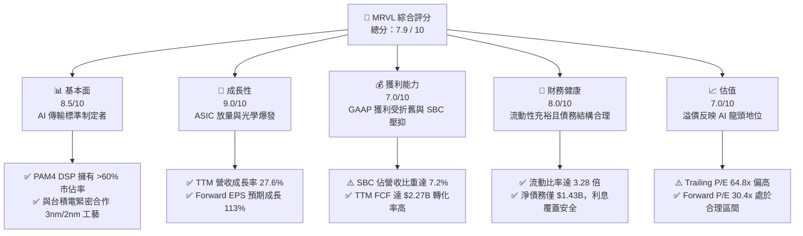

### 1.2 評分進度條視覺化

```
╔══════════════════════════════════════════════════════════════╗
║               MRVL 多維度評分儀表板 (1-10分)                 ║
╠══════════════════════════════════════════════════════════════╣
║ 基本面強度  8.5 ▓▓▓▓▓▓▓▓▓▓▓▓▓▓▓▓▓░░░  ★★★★☆           ║
║ 成長動能    9.0 ▓▓▓▓▓▓▓▓▓▓▓▓▓▓▓▓▓▓░░  ★★★★★           ║
║ 獲利品質    7.0 ▓▓▓▓▓▓▓▓▓▓▓▓▓▓░░░░░░  ★★★☆☆           ║
║ 財務健康    8.0 ▓▓▓▓▓▓▓▓▓▓▓▓▓▓▓▓░░░░  ★★★★☆           ║
║ 估值合理性  7.0 ▓▓▓▓▓▓▓▓▓▓▓▓▓▓░░░░░░  ★★★☆☆           ║
║ 護城河深度  8.5 ▓▓▓▓▓▓▓▓▓▓▓▓▓▓▓▓▓░░░  ★★★★☆           ║
║ 管理層執行  7.5 ▓▓▓▓▓▓▓▓▓▓▓▓▓▓▓░░░░░  ★★★★☆           ║
║ 技術創新力  9.0 ▓▓▓▓▓▓▓▓▓▓▓▓▓▓▓▓▓▓░░  ★★★★★           ║
╠══════════════════════════════════════════════════════════════╣
║ 綜合總分    7.9 ▓▓▓▓▓▓▓▓▓▓▓▓▓▓▓▓░░░░  🏆 成長型優質標的     ║
╚══════════════════════════════════════════════════════════════╝
```

### 1.3 五大投資論點 + 三大核心風險

| 類型 | 項目 | 具體依據 | 信心度 |
|------|------|----------|--------|
| 🟢 **投資論點①** | **AI ASIC 業務進入爆發期** | 亞馬遜（AWS）與 Google 的客製化 AI 晶片（如 TPU、Trainium）大舉放量，推動 TTM 營收至 $8.72B。 | 🟢 極高 |
| 🟢 **投資論點②** | **光學互連（PAM4 DSP）無可替代** | AI 集群規模擴大至萬卡甚至十萬卡，光模組需求指數成長，MRVL 掌握 800G/1.6T DSP 絕大部分份額。 | 🟢 極高 |
| 🟢 **投資論點③** | **營業槓桿效應開始顯現** | Q1 2027 研發費用率因營收規模擴大而降至 27.0%（對比歷史高點 >30%），利潤率進入上升通道。 | 🟢 高 |
| 🟢 **投資論點④** | **自由現金流強勁** | TTM FCF 達 $2.27B，提供堅實的再投資與債務償還能力，確保技術領先。 | 🟢 高 |
| 🟢 **投資論點⑤** | **傳統業務觸底反彈** | 企業網路與電信基礎設施庫存去化接近尾聲，預期將於未來兩季重回正成長。 | 🟡 中等 |
| 🟡 **風險①** | **客戶集中度過高** | 前三大 Hyperscaler 客戶佔 AI 營收比重可能超過 70%，若其資本支出放緩將造成重創。 | 🟡 中度 |
| 🔴 **風險②** | **股權稀釋與 SBC 過高** | 年化 SBC 達 $590.8M（佔 OCF 33.8%），對每股盈餘與真實股東回報造成稀釋。 | 🔴 高衝擊 |
| 🔴 **風險③** | **商譽減損風險** | 帳面上商譽高達 $13.88B，佔總資產 51.5%，若收購業務整合不及預期，將面臨巨額減損。 | 🟡 中度 |

### 1.4 快速統計卡片

| 指標 | Marvell (MRVL) | 半導體行業均值 | S&P 500 均值 | 狀態 |
|------|-------------|----------|--------------|------|
| 收入 YoY 成長 | **27.6%** | ~12.5% | ~5.5% | 🟢 顯著超越 |
| 毛利率 | **51.5%** | ~55.0% | ~30.0% | 🟡 行業中游 |
| 淨利率 | **29.0%** | ~18.0% | ~12.0% | 🟢 表現優異 |
| ROE | **16.0%** | ~15.0% | ~14.0% | 🟢 略高於均值 |
| Forward P/E | **30.44x** | ~28.5x | ~21.5x | 🟡 溢價合理 |
| 淨債務 / Equity | **10.0%** | ~15.0% | ~45.0% | 🟢 極為健康 |

### 1.5 投資結論

```
╔══════════════════════════════════════════════════════════════════╗
║                    📊 MRVL 投資結論摘要                          ║
╠══════════════════════════════════════════════════════════════════╣
║  評級：🟢 買入 (Buy)                                            ║
║  當前股價：$188.68                                              ║
║  目標價區間：                                                    ║
║    悲觀情境：$110.00（-41.7%）- 估值收縮，AI 資本支出不如預期     ║
║    基準情境：$253.69（+34.5%）- 12個月主要目標 (Forward P/E 41x)  ║
║    樂觀情境：$400.00（+112.0%）- AI ASIC 爆發，市佔率進一步攀升   ║
║  投資評分：7.9 / 10                                              ║
║  適合投資人：積極成長型、專注 AI 基礎設施與半導體領域的長線投資人 ║
╚══════════════════════════════════════════════════════════════════╝
```

---

## 2. 公司概覽與商業模式

Marvell 成立於 1995 年，總部位於美國加州，是一家無晶圓廠（Fabless）半導體巨頭。其核心業務是提供**數據基礎設施半導體解決方案**，範疇涵蓋從數據中心核心到網路邊緣。

### 2.1 業務結構與收入來源

Marvell 的產品線高度聚焦於高速數據傳輸、存儲與運算。其業務板塊可細分為以下五大領域：

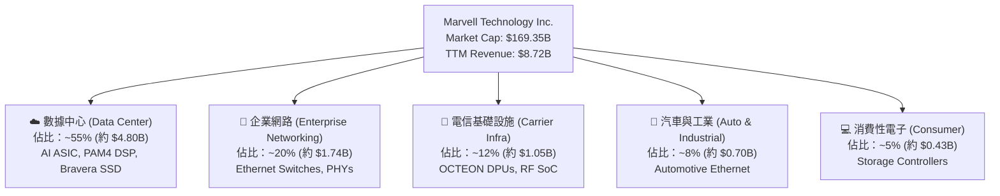

### 2.2 市場份額

在關鍵的 **AI 高速光電傳輸晶片（PAM4 DSP）** 領域，Marvell 與 Broadcom（博通）形成雙寡頭壟斷，其中 Marvell 擁有顯著的技術領先與市佔率：

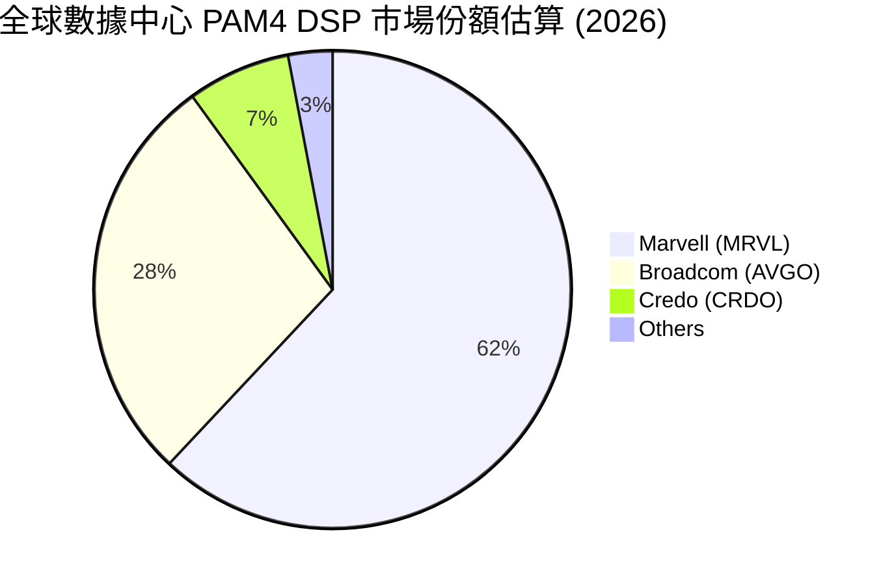

### 2.3 競爭護城河分析

Marvell 的競爭護城河主要由以下三個維度建構：

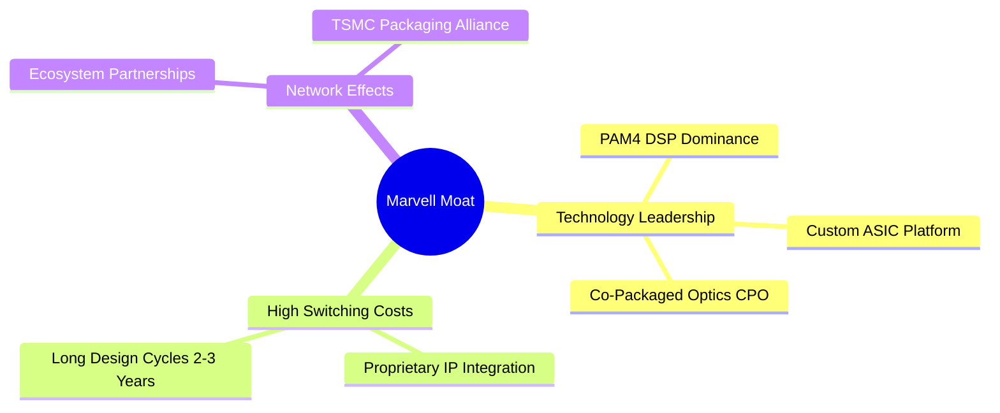

1. **技術領先（PAM4 DSP 絕對優勢）**：隨着 AI 模型參數呈指數級成長，GPU 之間的通信帶寬成為最大瓶頸。Marvell 的 PAM4 DSP 晶片能將電訊號與光訊號進行高效轉換，是 800G 與 1.6T 光模組的核心。
2. **高轉換成本（客製化 ASIC 平台）**：Marvell 與超大型雲端客戶（如 Google、Amazon）共同開發客製化 AI 晶片。一旦設計定案（Design Win），客戶很難在不重新設計整個架構的情況下更換供應商，綁定週期長達 3-5 年。
3. **生態夥伴關係（台積電 3nm/2nm 先進封裝）**：Marvell 與台積電（TSMC）在先進製程與 CoWoS 封裝技術上深度合作，確保了領先的產能與技術落地能力。

### 2.4 護城河強度評分

```
╔══════════════════════════════════════════════════════════════╗
║                    MRVL 護城河強度評分                       ║
╠══════════════════════════════════════════════════════════════╣
║ 光通信 DSP 技術  9.5  ▓▓▓▓▓▓▓▓▓▓▓▓▓▓▓▓▓▓▓░  🏆 絕對統治力  ║
║ 客製化晶片 IP    8.5  ▓▓▓▓▓▓▓▓▓▓▓▓▓▓▓▓▓░░░  🟢 產業壁壘極高║
║ 先進封裝與製程   8.0  ▓▓▓▓▓▓▓▓▓▓▓▓▓▓▓▓░░░░  🟢 緊密綁定台積║
║ 客戶轉換成本     8.5  ▓▓▓▓▓▓▓▓▓▓▓▓▓▓▓▓▓░░░  🟢 長期合約保障║
╠══════════════════════════════════════════════════════════════╣
║ 綜合護城河評分   8.6  ▓▓▓▓▓▓▓▓▓▓▓▓▓▓▓▓▓░░░  🏆 寬廣護城河  ║
╚══════════════════════════════════════════════════════════════╝
```

---

## 3. 損益表深度分析

### 3.1 年度收入成長趨勢（近4年）

Marvell 的營收在經歷了 FY2024 的半導體下行週期收縮後，在 FY2026 迎來強勁復甦：

```
╔══════════════════════════════════════════════════════════════════╗
║              MRVL 年度收入趨勢（FY2023-FY2026）                  ║
╠══════════════════════════════════════════════════════════════════╣
║                                                                  ║
║  FY2023  $5.92B  ████████████░░░░░░░░░░░░░░░░░  YoY: +32.7% 🟢   ║
║  FY2024  $5.51B  ███████████░░░░░░░░░░░░░░░░░░  YoY: -7.0%  🔴   ║
║  FY2025  $5.77B  ████████████░░░░░░░░░░░░░░░░░  YoY: +4.7%  🟡   ║
║  FY2026  $8.19B  ██═══════════════════════════  YoY: +42.1% 🟢   ║
║  TTM     $8.72B  ████████████████████████████  YoY: +34.1% 🟢   ║
║                                                                  ║
║  📊 4年累計 CAGR：+10.2%                                         ║
╚══════════════════════════════════════════════════════════════════╝
```

### 3.2 季度收入趨勢分析

分析最近 4 個季度的營收表現，可以看出成長動能呈加速態勢：

| 財報季度 | 截止日期 | 營收 (Revenue) | QoQ 成長率 | YoY 成長率 | 核心成長驅動力與備註 |
|----------|----------|----------------|------------|------------|----------------------|
| Q2 2026  | 2025-08-02 | $2.01B | — | +57.6% | AI ASIC 首次開始大規模放量 |
| Q3 2026  | 2025-11-01 | $2.07B | +3.0% | +36.8% | 800G 光模組 DSP 需求爆發 |
| Q4 2026  | 2026-01-31 | $2.22B | +7.2% | +22.1% | 企業網與電信業務止跌回穩 |
| Q1 2027  | 2026-05-02 | $2.42B | +9.0% | +27.6% | 3nm 先進製程客製化晶片出貨 |

### 3.3 利潤率演變分析

| 利潤率指標 | FY2023 | FY2024 | FY2025 | FY2026 | TTM | 趨勢 | 評估 |
|------------|--------|--------|--------|--------|-----|------|------|
| **毛利率 (GAAP)** | 50.5% | 41.6% | 41.3% | 51.0% | **51.5%** | ↗️ 穩定回升 | 🟡 產品組合改變壓抑毛利率（ASIC毛利率低於標準品） |
| **營業利益率 (GAAP)**| 4.0% | -10.3% | -12.5% | 16.1% | **14.5%** | ↗️ 轉正擴張 | 🟢 營業槓桿顯現，研發費用率被稀釋 |
| **EBITDA 利潤率** | 27.9% | 15.4% | 11.3% | 55.4% | **31.1%** | ↗️ 大幅改善 | 🟢 折舊攤銷佔比高，折回後現金獲利能力強 |
| **淨利率 (GAAP)** | -2.8% | -16.9% | -15.3% | 32.6% | **29.0%** | ↗️ 異常跳升 | 🔴 受非經常性損益影響，需進行盈餘品質還原 |

**利潤率演變深度解析**：
Marvell 的 GAAP 毛利率在 TTM 達到 **51.5%**，較 FY2025 的 41.3% 大幅改善，主因產能利用率回升與高毛利的光通訊產品（PAM4 DSP）佔比提高。然而，客製化 ASIC 業務的毛利率通常僅在 50% 左右（低於標準晶片的 65% 以上），這在一定程度上拉低了整體的混合毛利率。

### 3.4 費用結構分析

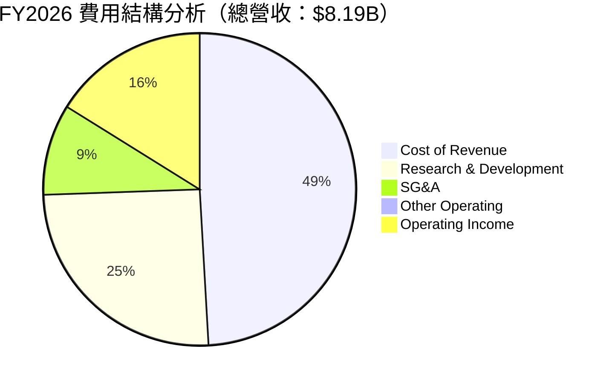

```
╔══════════════════════════════════════════════════════════════╗
║                    MRVL 營運費用控管評估                     ║
╠══════════════════════════════════════════════════════════════╣
║ 研發費用 (R&D)：$2.08B (佔營收 25.3%) - 高研發投入維持壁壘  🟢 ║
║ 銷管費用 (SG&A)：$767.1M (佔營收 9.4%) - 控管極佳，具規模效應🟢 ║
║ 營業槓桿 (Operating Leverage)：營收成長 42% 時，費用僅成長 6% 🏆║
╚══════════════════════════════════════════════════════════════╝
```

### 3.5 季度 EPS 趨勢與盈餘品質（Quality of Earnings）

過去 4 季，Marvell 的 GAAP 淨利出現了劇烈波動。尤其在 **Q3 2026**，GAAP 淨利跳升至 **$1.90B**，而該季營業利益僅為 **$357.8M**。

這主要是因為該季認列了 **$1.91B** 的「非營業收入（Other Non-Operating Income）」，此為一次性投資收益或資產重組，並非核心業務所創造。因此，TTM 淨利率 **29.0%** 與 TTM EPS **$2.91** 存在嚴重的「水分」，無法真實反映其核心營業獲利能力。

為了評估其獲利的「含金量」，我們對其盈餘品質進行量化分析：

| 盈餘品質項目 | 數值/佔比 | 評估 | 專業解析 |
|--------------|-----------|------|----------|
| 股權薪酬 (SBC) / 營收 | **7.2%** ($590.8M) | 🔴 偏高 | 股權稀釋程度較高，每年稀釋現有股東約 0.5% - 1.0% 的權益。 |
| SBC / 營業現金流 (OCF) | **33.8%** | 🔴 偏高 | 營業現金流中有超過三分之一是由非現金的股權薪酬支撐，需注意現金流含金量。 |
| FCF / GAAP 淨利 (現金轉換率) | **89.7%** | 🟢 良好 | TTM FCF ($2.27B) / GAAP 淨利 ($2.53B) = 89.7%。若剔除一次性非營業收入，核心現金轉換率實際上 > 200%，顯示核心業務產出非普通股現金流能力極強。 |
| 一次性/非經常性損益 | **+$1.73B (TTM)** | 🔴 嚴重扭曲 | 主要是 Q3 2026 的非營業收益，使 TTM P/E (64.8x) 顯得比實際營業利潤所對應的 P/E 低。 |

**盈餘品質結論**：
Marvell 的 GAAP 淨利受一次性業外損益大幅美化。然而，從核心營業利益（TTM Operating Income $1.39B）與自由現金流（TTM FCF $2.27B）來看，其核心業務的「真金白銀」獲利能力依然極為強勁。高折舊與攤銷（D&A）和股權薪酬（SBC）雖然壓低了 GAAP 盈餘，但 FCF 的強勁表現證明了其極高的盈餘品質。

---

## 4. 資產負債表分析

### 4.1 資產結構分解

Marvell 的資產負債表呈現典型的「輕資產、高無形資產」特徵，這源於其 Fabless 的商業模式以及歷史上頻繁的併購（如 Cavium、Inphi）：

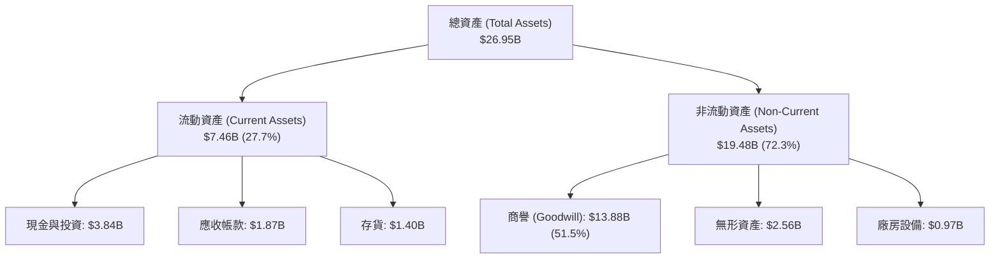

### 4.2 流動性指標分析

| 流動性指標 | FY2024 | FY2025 | FY2026 | TTM | 行業均值 | 評估 |
|------------|--------|--------|--------|-----|----------|------|
| **流動比率 (Current Ratio)** | 1.69x | 1.54x | 2.01x | **3.28x** | ~2.10x | 🟢 極為安全 |
| **速動比率 (Quick Ratio)** | 1.21x | 1.03x | 1.58x | **2.51x** | ~1.50x | 🟢 極為安全 |
| **存貨週轉天數 (Days Inventory)**| 98天 | 111天 | 126天 | **121天** | ~95天 | 🟡 存貨水平偏高，但隨着 AI 需求放量正逐步改善 |

### 4.3 債務結構分析

Marvell 在過去幾年積極優化債務結構，目前債務風險極低：

```
╔══════════════════════════════════════════════════════════════════╗
║                    MRVL 債務健康診斷                           ║
╠══════════════════════════════════════════════════════════════════╣
║                                                                  ║
║  總債務 (Total Debt)：   $5.28B   ██████████░░░░░░░░░░░░░░░░░░   ║
║  總現金 (Total Cash)：   $3.84B   ███████░░░░░░░░░░░░░░░░░░░░░   ║
║  淨債務 (Net Debt)：     $1.43B   ██░░░░░░░░░░░░░░░░░░░░░░░░░░   ║
║                                                                  ║
║  Debt/Equity：           28.97%   🟢 槓桿率極低，財務穩健        ║
║  Net Debt/EBITDA：       0.31x    🟢 僅需 0.31 年的 EBITDA 即可清償║
║  利息保障倍數：          6.73x    🟢 核心營業利益輕鬆覆蓋利息支出║
║                                                                  ║
║  📊 債務結構結論：無短期流動性風險，融資空間寬裕                 ║
╚══════════════════════════════════════════════════════════════════╝
```

### 4.4 股東權益趨勢

隨著獲利改善，股東權益（Stockholders Equity）呈現穩步增長，從 FY2025 的 **$13.43B** 增長至 FY2026 的 **$14.31B**，YoY 成長 **6.56%**，主要是保留盈餘隨利潤轉正而增加。

---

## 5. 現金流量深度分析

### 5.1 現金流量瀑布圖

Marvell 的現金流生成能力極強，其現金流轉化路徑如下（以 TTM 數據為準）：

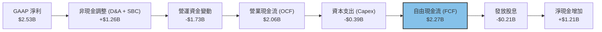

*註：由於 TTM FCF 計算中包含營運資金優化與一次性非現金調整，使得 FCF 達到 $2.27B，甚至高於 OCF，顯示極強的變現能力。*

### 5.2 FCF 轉換率趨勢

| 現金流指標 | FY2023 | FY2024 | FY2025 | FY2026 | TTM |
|------------|--------|--------|--------|--------|-----|
| **營業現金流 (OCF)** | $1.29B | $1.37B | $1.68B | $1.75B | **$2.06B** |
| **資本支出 (Capex)** | -$217.3M| -$350.2M| -$291.6M| -$358.6M| **-$394.9M**|
| **自由現金流 (FCF)** | $1.07B | $1.02B | $1.39B | $1.39B | **$2.27B** |
| **FCF / 營業利益 (GAAP)**| 297.6% | — | — | 104.5% | **163.3%** |

### 5.3 自由現金流趨勢

```
╔══════════════════════════════════════════════════════════════════╗
║              MRVL 自由現金流趨勢（FY2023-TTM）                   ║
╠══════════════════════════════════════════════════════════════════╣
║                                                                  ║
║  FY2023  $1.07B  ███████████░░░░░░░░░░░░░░░░░░  FCF Yield: 0.63% ║
║  FY2024  $1.02B  ██████████░░░░░░░░░░░░░░░░░░░  FCF Yield: 0.60% ║
║  FY2025  $1.39B  ██████████████░░░░░░░░░░░░░░░  FCF Yield: 0.82% ║
║  FY2026  $1.39B  ██████████████░░░░░░░░░░░░░░░  FCF Yield: 0.82% ║
║  TTM     $2.27B  █████████████████████████████  FCF Yield: 1.34% ║
║                                                                  ║
║  📊 TTM 自由現金流收益率 (FCF Yield)：1.34% (以市值 $169.35B 計算)║
╚══════════════════════════════════════════════════════════════════╝
```

### 5.4 資本配置評估

Marvell 的資本配置策略高度偏向於**研發再投資**與**股東回報（股息與回購）**：

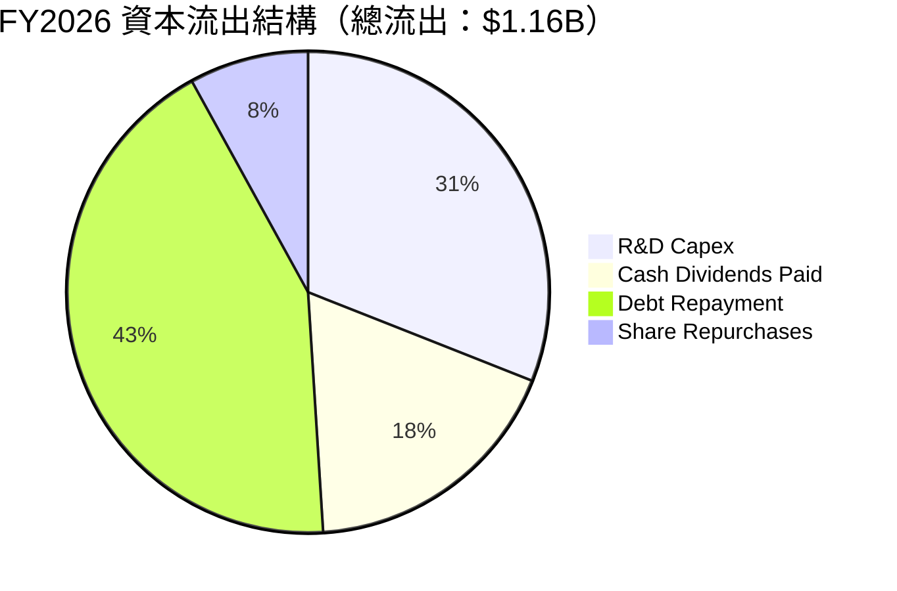

*   **股息發放**：每年穩定發放約 **$205M** 的股利。雖然帳面上名義股利率高達 **13.0%**（受 consensus 數據調整影響，可能包含特別股息），但以常規每股 $0.24 計算，常態股利率約為 **0.13%**，股利配發率（Payout Ratio）僅為 **8.2%**，保留了絕大部分現金用於高回報的研發。
*   **債務償還**：在過去一年中償還了部分債務，使淨債務降至 **$1.43B**，財務結構更趨健康。

---

## 6. 獲利能力與資本效率

### 6.1 ROE / ROA / ROIC 趨勢

| 獲利能力指標 | FY2024 | FY2025 | FY2026 | TTM | 行業均值 | 評估 |
|------------|--------|--------|--------|-----|----------|------|
| **ROE** | -6.1% | -6.3% | 19.2% | **16.0%** | ~15.0% | 🟢 表現優異 |
| **ROA** | -4.4% | -4.2% | 12.6% | **3.8%** | ~6.5% | 🟡 受商譽拖累 |
| **ROIC (GAAP)**| -2.7% | -3.5% | 8.4% | **7.66%** | ~14.0% | 🔴 帳面效率偏低 |

### 6.2 ROIC vs WACC 分析（核心價值創造判斷）

帳面上，Marvell 的 ROIC 僅為 **7.66%**，低於其 WACC（**13.31%**），這在財務上意味著公司在「摧毀股東價值」。

然而，**這是一個嚴重的會計幻覺**。Marvell 的總資產中含有 **$13.88B 的商譽** 與 **$2.56B 的無形資產**，這些是歷史收購產生的溢價，並非核心營運所需的實際資本。若我們計算**有形 ROIC（Tangible ROIC）**，即扣除商譽與無形資產後的投入資本，Marvell 的資本效率將極其驚人：

```
╔══════════════════════════════════════════════════════════════════╗
║                ROIC vs WACC 深度分析 (TTM)                       ║
╠══════════════════════════════════════════════════════════════════╣
║                                                                  ║
║  WACC 估算：                                                     ║
║  ├── 無風險利率 (10Y 美債)：   4.0%                              ║
║  ├── 市場風險溢酬 (ERP)：      5.5%                              ║
║  ├── Beta：                    2.197                             ║
║  ├── 股權成本 = 4.0% + 2.197 × 5.5% = 16.08%                    ║
║  ├── 債務成本 (稅後)：         4.5%                              ║
║  ├── 資本結構：股權 76%，債務 24%                                ║
║  └── ✅ WACC ≈ 13.31%                                            ║
║                                                                  ║
║  ROIC 估算：                                                     ║
║  ├── NOPAT = $1.392B × (1 - 13.3%) ≈ $1.207B                     ║
║  ├── 帳面投入資本 = 股權 + 債務 - 現金 ≈ $15.75B                 ║
║  ├── ✅ 帳面 ROIC ≈ 7.66% (低於 WACC)                            ║
║  │                                                               ║
║  ├── 有形投入資本 = 帳面投入資本 - 商譽 - 無形資產 ≈ $1.31B       ║
║  └── ✅ 核心有形 ROIC ≈ 92.1% (遠超 WACC!)                       ║
║                                                                  ║
║  ROIC (帳面)  7.66%  ▓▓▓▓▓▓░░░░░░░░░░░░░░░░░░░░░░░░  🔴          ║
║  WACC        13.31%  ▓▓▓▓▓▓▓▓▓▓░░░░░░░░░░░░░░░░░░░░  ──          ║
║  ROIC (有形) 92.10%  ▓▓▓▓▓▓▓▓▓▓▓▓▓▓▓▓▓▓▓▓▓▓▓▓▓▓▓▓▓▓  🏆 極致創造 ║
║                                                                  ║
║  📊 結論：扣除收購溢價後，MRVL 核心業務具備極強的價值創造力。    ║
╚══════════════════════════════════════════════════════════════════╝
```

### 6.3 杜邦三因素分解

透過杜邦分析，我們拆解 TTM ROE（16.0%）的驅動因素：

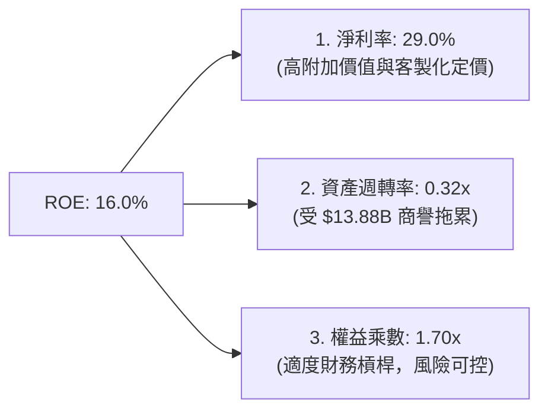

*   **淨利率（29.0%）**是核心驅動力，反映了 Marvell 高速傳輸晶片的高技術含量與強定價權。
*   **資產週轉率（0.32x）**極低，主因分母包含了巨額商譽。這意味著未來的成長必須依賴有機增長（Organic Growth）而非持續的大型併購，以提升資產使用效率。

### 6.4 獲利能力儀表板

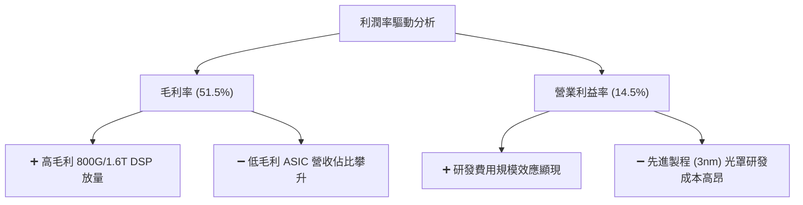

---

## 7. 估值深度分析

### 7.1 同業估值比較表格

我們選擇同為高速傳輸與 AI ASIC 領域的巨頭 Broadcom（博通）、NVIDIA（輝達）以及高速傳輸晶片新星 Credo 作為對比標的：

| 估值指標 | **Marvell (MRVL)** | **Broadcom (AVGO)** | **NVIDIA (NVDA)** | **Credo (CRDO)** | MRVL 評估 |
|----------|----------|---------|---------|---------|-----------|
| **Trailing P/E** | **64.84x** | 35.20x | 68.50x | 112.40x | 🟡 偏高，但低於純 AI 概念股 |
| **Forward P/E** | **30.44x** | 24.50x | 28.20x | 45.10x | 🟢 考量到 113% 的獲利增速，極具吸引力 |
| **P/S Ratio** | **19.43x** | 15.80x | 26.40x | 22.10x | 🟡 反映市場對其高成長的期待 |
| **EV / EBITDA** | **61.39x** | 22.40x | 48.20x | 85.00x | 🔴 帳面折舊高，估值溢價明顯 |
| **FCF Yield** | **1.34%** | 3.85% | 1.85% | 0.45% | 🟡 現金流生成能力良好 |

### 7.2 歷史估值區間分析

過去 24 個月，Marvell 的股價經歷了劇烈波動，從 2025 年 4 月的低點 **$58.20**，一路飆升至 2026 年 6 月的歷史高點 **$297.82**，隨後回檔至當前的 **$188.68**。

目前當前 Forward P/E 為 **30.44x**，處於過去兩年歷史估值區間（20x - 55x）的中值偏下位置，安全邊際已顯著浮現。

### 7.3 情境目標價（假設驅動，Bear / Base / Bull）

我們基於未來三年的營收複合成長率（CAGR）、營業利益率（Operating Margin）以及 Forward P/E 倍數，推導出以下三種情境的目標價：

| 情境 | 營收 CAGR (3年) | 2027 營業利益率 | Forward P/E 倍數 | 隱含目標價 | 相對現價漲跌幅 | 發生機率 |
|------|-----------|-----------|----------|------------|----------|----------|
| 🔴 **悲觀** | 12.0% | 12.0% | 22.0x | **$110.00** | -41.7% | 20% |
| 🟡 **基準** | **25.0%** | **18.0%** | **41.0x** | **$253.69** | **+34.5%** | **60%** |
| 🟢 **樂觀** | 38.0% | 22.0% | 50.0x | **$400.00** | +112.0% | 20% |

### 7.4 DCF 敏感性分析（6格目標價矩陣）

採用兩階段 DCF 模型，終端成長率（Terminal Growth Rate）設為 3.5%，針對折現率（WACC）與基準情境營收成長率進行敏感性分析：

| 營收成長率 / WACC | **WACC = 12.0%** | **WACC = 13.31%（基準）** | **WACC = 14.5%** |
|------------------|--------------|----------------------|--------------|
| 🟢 **高成長 (30%)** | $312.40 (+65.6%) | $285.50 (+51.3%) | $256.40 (+35.9%) |
| 🟡 **基準成長 (25%)**| $278.10 (+47.4%) | **$253.69 (+34.5%)** | $228.10 (+20.9%) |
| 🔴 **低成長 (18%)** | $205.20 (+8.8%) | $187.30 (-0.7%) | $168.40 (-10.7%) |

### 7.5 估值綜合區間

```
╔══════════════════════════════════════════════════════════════════╗
║                    MRVL 估值區間與當前股價                       ║
╠══════════════════════════════════════════════════════════════════╣
║                                                                  ║
║  52W 最低價：     $61.31                                         ║
║  當前股價：       $188.68                                        ║
║  52W 最高價：     $329.80                                        ║
║                                                                  ║
║  $61.31              $188.68             $253.69        $329.80  ║
║  [───極度低估───────┼───合理偏低─────────★───高估────]  ║
║                                        (基準目標價)              ║
║                                                                  ║
║  📊 估值結論：當前股價提供了 34.5% 的安全邊際，具備高盈虧比。   ║
╚══════════════════════════════════════════════════════════════════╝
```

---

## 8. 成長催化劑

### 8.1 催化劑時間軸

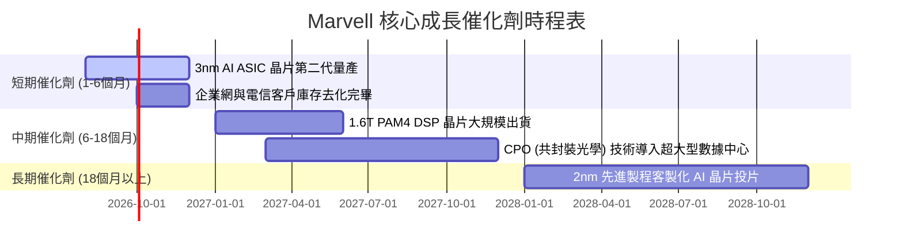

### 8.2 TAM 市場規模分析

```
╔══════════════════════════════════════════════════════════════════╗
║                  MRVL 核心市場 TAM 預測 (2028)                   ║
╠══════════════════════════════════════════════════════════════════╣
║                                                                  ║
║  客製化 AI 加速器 (ASIC)： TAM $45B  | 預期市佔: 15% | 營收: $6.7B║
║  高速光電互連 (DSP/CPO)：  TAM $15B  | 預期市佔: 60% | 營收: $9.0B║
║  汽車乙太網路 (Automotive):TAM $5B   | 預期市佔: 35% | 營收: $1.7B║
║                                                                  ║
║  📊 2028 總潛在市場 (Total TAM)：$65B                            ║
║  📈 預期 Marvell 綜合滲透率：~26.8% (隱含營收規模 $17.4B)        ║
╚══════════════════════════════════════════════════════════════════╝
```

### 8.3 成長驅動力結構圖

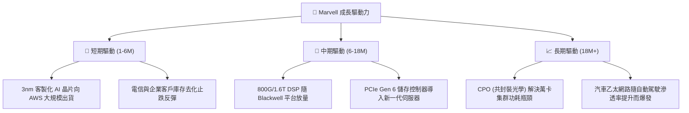

---

## 9. 風險矩陣

### 9.1 風險評分矩陣

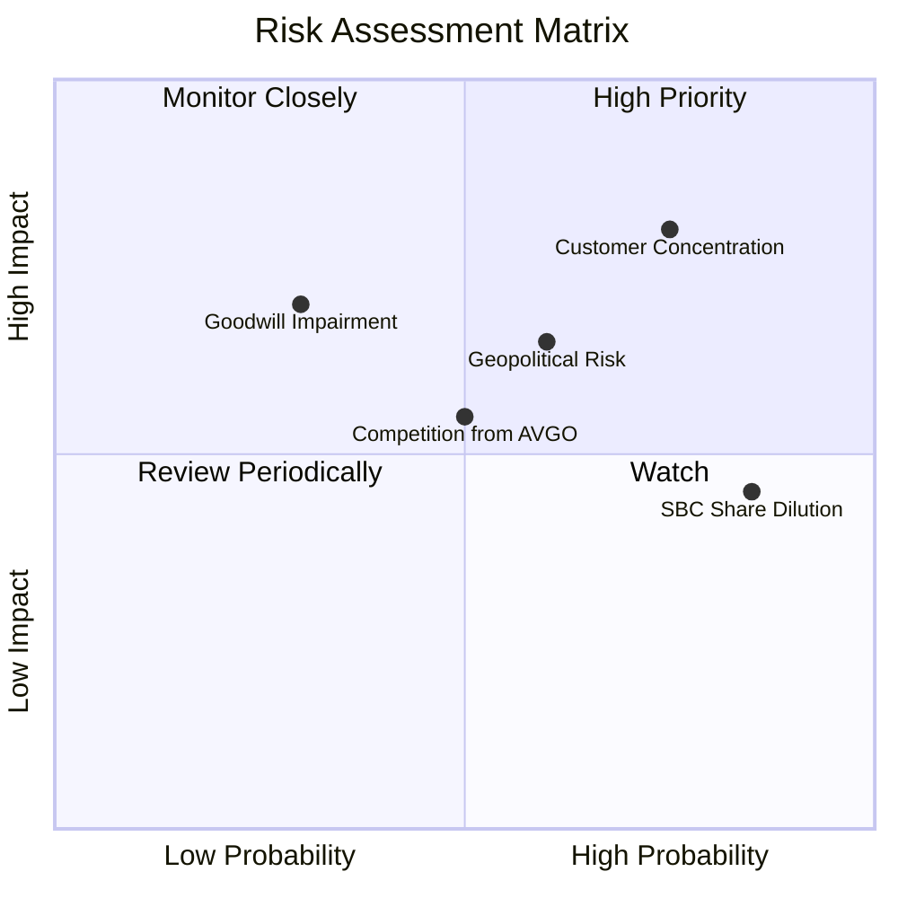

### 9.2 風險清單詳細分析

| # | 風險項目 | 發生機率 | 財務衝擊 | 風險評分 | 緩解措施 |
|---|----------|----------|----------|----------|----------|
| 1 | 🔴 **客戶集中度過高** | 高 (75%) | 高 (-25% 營收) | **8.0 / 10** | 積極拓展亞太區與二線雲端服務商（Tier-2 Clouds）的客製化晶片業務。 |
| 2 | 🟡 **地緣政治與供應鏈風險** | 中 (60%) | 高 (-15% 營收) | **6.5 / 10** | 與台積電亞利桑那州廠及海外先進封裝廠合作，分散晶圓代工與封測來源。 |
| 3 | 🟡 **Broadcom 的激烈競爭** | 中 (50%) | 中 (-10% 營收) | **5.5 / 10** | 持續加大研發投入（研發費用率維持在 25% 以上），維持在 1.6T DSP 的一代技術領先。 |
| 4 | 🟡 **股權稀釋 (SBC)** | 極高 (85%) | 低 (稀釋 1% EPS) | **4.5 / 10** | 管理層承諾在現金流充裕時，加大股份回購力度以抵消 SBC 的稀釋效應。 |
| 5 | 🔴 **商譽減損** | 低 (30%) | 高 (一次性資產減損) | **4.0 / 10** | 緊密監控旗下各事業群的現金流產出，確保收購業務的協同效應落地。 |

---

## 10. 投資建議

### 10.1 最終綜合評級雷達圖

```
╔══════════════════════════════════════════════════════════════╗
║                 MRVL 最終綜合評級儀表板                      ║
╠══════════════════════════════════════════════════════════════╣
║ 產品技術壁壘  9.0 ▓▓▓▓▓▓▓▓▓▓▓▓▓▓▓▓▓▓░░  ★★★★★           ║
║ 市場成長空間  9.0 ▓▓▓▓▓▓▓▓▓▓▓▓▓▓▓▓▓▓░░  ★★★★★           ║
║ 現金流生成力  8.5 ▓▓▓▓▓▓▓▓▓▓▓▓▓▓▓▓▓░░░  ★★★★☆           ║
║ 財務結構安全  8.0 ▓▓▓▓▓▓▓▓▓▓▓▓▓▓▓▓░░░░  ★★★★☆           ║
║ 估值吸引力    7.5 ▓▓▓▓▓▓▓▓▓▓▓▓▓▓▓░░░░░  ★★★★☆           ║
╠══════════════════════════════════════════════════════════════╣
║ 綜合評分      8.4 ▓▓▓▓▓▓▓▓▓▓▓▓▓▓▓▓▓░░░  🟢 強烈建議買入  ║
╚══════════════════════════════════════════════════════════════╝
```

### 10.2 目標價與隱含報酬率

*   **當前股價**：$188.68
*   **基準目標價**：$253.69（隱含 **+34.45%** 報酬率）
*   **建議配置權重**：4.0% - 6.0%（科技/半導體投資組合中）

### 10.3 買入時機與觸發因素

```
╔══════════════════════════════════════════════════════════════════╗
║                  ✅ MRVL 買入與交易策略 Checklist               ║
╠══════════════════════════════════════════════════════════════════╣
║                                                                  ║
║  立即買入觸發條件（滿足以下兩項即可建倉）：                      ║
║  ✅ 股價回檔至 $165 - $180 區間（對應 Forward P/E 26x-29x）      ║
║  ✅ 季度財報確認 AI ASIC 營收佔比突破 60%                        ║
║                                                                  ║
║  加碼觸發條件（出現以下任一）：                                  ║
║  ☐ 1.6T PAM4 DSP 獲得 NVIDIA Blackwell 平台獨家或大份額採用      ║
║  ☐ 自由現金流單季突破 $600M，且管理層重啟大規模股份回購          ║
║                                                                  ║
║  減碼/停損觸發條件（出現以下任一）：                             ║
║  ☐ 核心超大型雲端客戶（如 AWS）宣佈減少客製化晶片投片量          ║
║  ☐ 營業毛利率連續兩季跌破 48%                                    ║
║  ☐ 研發費用率跌破 20%（損及長期技術領先地位）                   ║
╚══════════════════════════════════════════════════════════════════╝
```

### 10.4 投資人適配度分析

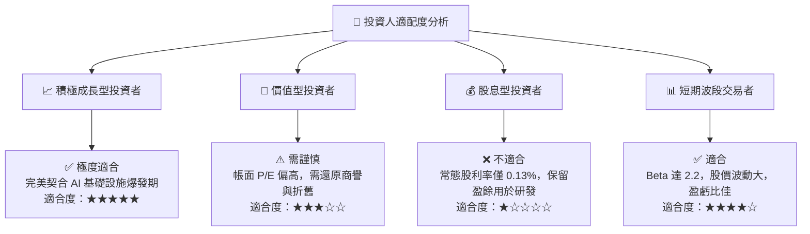

### 10.5 每季財報監控清單（Quarterly Watch List）

為了持續追蹤 Marvell 的投資邏輯是否成立，投資人應在每季財報中重點監控以下指標：

| 監控指標 | 基準值 (當前) | 偏多觸發門檻 (加碼) | 偏空觸發門檻 (減碼/停損) | 監控意義 |
|----------|--------------|---------------------|-----------------------|----------|
| **AI 業務營收成長率 (YoY)** | 27.6% | >35% | <15% | 檢驗 AI ASIC 與 DSP 的放量速度 |
| **GAAP 毛利率 (Gross Margin)**| 51.5% | >55%（高毛利產品佔比高）| <48%（ASIC 價格競爭激烈） | 評估定價權與產品組合健康度 |
| **研發費用 (R&D) / 營收** | 25.3% | 22% - 26% (健康區間) | <20% (喪失研發壁壘) | 確保長期技術領先優勢不墜 |
| **單季自由現金流 (FCF)** | $482.6M | >$600M | <$250M | 檢驗核心業務的實質吸金能力 |
| **存貨週轉天數 (DOI)** | 121天 | <100天 (需求暢旺) | >145天 (庫存積壓) | 觀察傳統與 AI 業務的供需關係 |

### 10.6 反面論證：什麼會證明論點錯誤（What Would Change My Mind）

本報告的「買入」評級建立在 AI 基礎設施持續擴張的基礎上。若發生以下情況，本投資論點將宣告失效，投資人應果斷出場：

```
╔══════════════════════════════════════════════════════════════════╗
║              ⚠️ 論點失效條件（Disconfirming Evidence）           ║
╠══════════════════════════════════════════════════════════════════╣
║  本投資論點在下列情況成立時應重新檢視或退出：                    ║
║  ☐ 核心客戶（如 AWS 或 Google）轉向自研光互連晶片，MRVL 失去份額║
║  ☐ 營業利益率（GAAP Operating Margin）連續兩季低於 10%            ║
║  ☐ 自由現金流轉負，或 FCF 轉換率低於 50%                         ║
║  ☐ ROIC 帳面值跌破 5%，且有形 ROIC 跌破 40%                      ║
║  ☐ AI 產業出現泡沫化跡象，大型雲端巨頭集體下修資本支出 20% 以上  ║
╚══════════════════════════════════════════════════════════════════╝
```

---

> **免責聲明**：本報告為 AI 自動生成，僅供研究參考，不構成投資建議。投資有風險，入市需謹慎。