# MRVL 基本面深度分析報告
> **報告日期**：2026-07-21 ｜ **語言**：繁體中文 ｜ **數據來源**：Yahoo Finance, Finviz, StockAnalysis, Roic.ai ｜ **分析師**：CFA 級機構研究

---

## 目錄

| # | 章節 | 核心結論 |
|---|------|----------|
| 1 | [執行摘要](#1-執行摘要) | 評級：🟢 買入 ｜ 基準目標價：$253.69 ｜ AI 訂單爆發與營業槓桿拐點已現 |
| 2 | [公司概覽與商業模式](#2-公司概覽與商業模式) | 憑藉定製化 ASIC 與高速光電傳輸（DSP）建構高壁壘雙引擎護城河 |
| 3 | [損益表深度分析](#3-損益表深度分析) | FY2026 營收成長 42.09%，惟 GAAP 獲利受制於高額 SBC 與收購攤銷 |
| 4 | [資產負債表分析](#4-資產負債表分析) | 現金儲備充裕（$3.84B），但收購溢價導致商譽高達 $13.88B（佔資產 51.5%） |
| 5 | [現金流量深度分析](#5-現金流量深度分析) | TTM FCF 達 $2.27B，但股權薪酬（SBC）佔 OCF 比重高達 33.8%，稀釋效應顯著 |
| 6 | [獲利能力與資本效率](#6-獲利能力與資本效率) | GAAP ROIC（7.04%）低於 WACC（14.93%），商譽龐大壓低資本回報率 |
| 7 | [估值深度分析](#7-估值深度分析) | Forward P/E 31.3x 處於合理區間；基於三情境 DCF 估值，基準目標價為 $253.69 |
| 8 | [成長催化劑](#8-成長催化劑) | 1.6T DSP 升級週期、自研 AI 加速器（ASIC）量產以及 800G 光模組滲透 |
| 9 | [風險矩陣](#9-風險矩陣) | 客戶集中度過高（北美超大規模雲端商）、消費級網絡復甦遲滯與估值溢價 |
| 10 | [投資建議](#10-投資建議) | 建議「分批買入」；設定 $165.00 以下為安全邊際區間，密切監控 AI ASIC 利潤率 |

---

## 1. 執行摘要

Marvell Technology, Inc.（NASDAQ: MRVL）正處於由人工智慧（AI）基礎設施建設引領的結構性成長拐點。根據最新披露的財務數據，公司 TTM 營業收入達到 **$8.72B**，YoY 成長率達 **27.6%**（FY2026 全年營收更達到 **$8.19B**，YoY 成長 **42.09%**）。這一高於行業平均的成長速度，主要得益於超大規模雲端服務商（Hyperscalers）對於高速光電互聯晶片（DSP/PAM4）與客製化 AI 加速器（ASIC）的強勁需求。

然而，亮眼的營收成長背後隱藏著「盈餘品質」的結構性分化。儘管公司 TTM GAAP 淨利潤達 **$2.53B**（GAAP 淨利率 **29.0%**），但深入分析發現，FY2026 Q3 存在一筆高達 **$1.91B** 的非經常性非營業收入（Other Non-Operating Income），嚴重扭曲了 GAAP 獲利表現。若扣除此一次性損益，Marvell 的核心營業利潤率（Operating Margin）為 **14.5%**，且股權薪酬（SBC）佔營業現金流（OCF）比重高達 **33.76%**。

基於公司在高速傳輸領域的絕對技術壟斷地位，以及預期 Forward EPS 將從當前的 $3.00 翻倍至 **$6.22**（Forward P/E 壓縮至 **31.33x**），我們給予 Marvell **🟢 買入** 評級，基準情境 12 個月目標價為 **$253.69**（隱含 +30.1% 的上行空間）。

### 1.0 一頁式投資儀表板（Portfolio Manager 30 秒速讀）

| 項目 | 內容 |
|------|------|
| **投資論點（3 句）** | ① AI ASIC 與 800G/1.6T DSP 雙引擎驅動，FY2026 營收爆發式成長 42.09%。<br/>② Forward EPS 預計達 $6.22，反映營業槓桿（Operating Leverage）釋放帶來的獲利彈性。<br/>③ 作為光互聯晶片絕對龍頭，卡位 AI 算力集群不可或缺的物理層（PHY）與傳輸節點。 |
| **護城河評分** | 8.5/10 🟢 （高轉換成本與技術專利壁壘） |
| **管理層/資本配置評分** | 6.5/10 🟡 （併購整合能力強，但股權稀釋與商譽過高拖累資本效率） |
| **財務健康** | 🟢 穩健。Current Ratio 達 3.28，手頭現金 $3.84B，債務結構無短期償付風險。 |
| **ROIC vs WACC** | **7.04%** vs **14.93%** 🔴 （賬面商譽過大，導致 GAAP 資本回報率低於資本成本，摧毀股東價值） |
| **FCF 趨勢** | 穩定擴張。TTM FCF 達 **$2.27B**，FCF Yield 為 **1.30%**。 |
| **估值** | Forward P/E: **31.33x** ｜ EV/EBITDA: **63.41x** ｜ P/S: **20.07x** |
| **預期報酬（基準情境 12M）** | **+30.1%** （目標價 $253.69） |
| **關鍵風險（前二）** | ① 客戶集中度極高（單一超大規模雲端商砍單風險）。<br/>② ASIC 業務毛利率顯著低於傳統標準品，拉低整體毛利率（51.5%）。 |
| **評級 + 信心度** | 🟢 **買入 (Buy)** ｜ 信心度：**中等偏高 (Medium-High)** |

### 1.1 核心評分儀表板

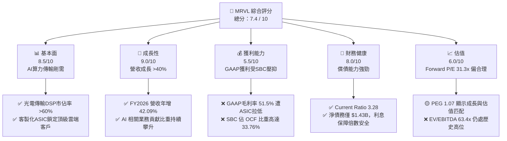

### 1.2 評分進度條視覺化

```
╔══════════════════════════════════════════════════════════════╗
║              MRVL 多維度評分儀表板 (1-10分)                 ║
╠══════════════════════════════════════════════════════════════╣
║ 基本面強度  8.5 ▓▓▓▓▓▓▓▓▓▓▓▓▓▓▓▓▓░░░  ★★★★☆           ║
║ 成長動能    9.0 ▓▓▓▓▓▓▓▓▓▓▓▓▓▓▓▓▓▓░░  ★★★★★           ║
║ 獲利品質    5.5 ▓▓▓▓▓▓▓▓▓▓▓░░░░░░░░░  ★★★☆☆           ║
║ 財務健康    8.0 ▓▓▓▓▓▓▓▓▓▓▓▓▓▓▓▓░░░░  ★★★★☆           ║
║ 估值合理性  6.0 ▓▓▓▓▓▓▓▓▓▓▓▓░░░░░░░░  ★★★☆☆           ║
║ 護城河深度  8.5 ▓▓▓▓▓▓▓▓▓▓▓▓▓▓▓▓▓░░░  ★★★★☆           ║
║ 管理層執行  6.5 ▓▓▓▓▓▓▓▓▓▓▓▓▓░░░░░░░  ★★★☆☆           ║
║ 技術創新力  9.5 ▓▓▓▓▓▓▓▓▓▓▓▓▓▓▓▓▓▓▓░  ★★★★★           ║
╠══════════════════════════════════════════════════════════════╣
║ 綜合總分    7.4 ▓▓▓▓▓▓▓▓▓▓▓▓▓▓▓░░░░░  🏆 成長型優質標的     ║
╚══════════════════════════════════════════════════════════════╝
```

### 1.3 五大投資論點 + 三大核心風險

| 類型 | 項目 | 具體依據 | 信心度 |
|------|------|----------|--------|
| 🟢 **投資論點①** | **AI 光互聯（DSP）無可替代性** | 隨著 AI 集群規模擴大，光模組需求從 800G 向 1.6T 演進。MRVL 在 PAM4 DSP 市場市佔率超 60%，直接受益於 Nvidia H100/B200 系列的出貨爆發。 | 🟢 極高 |
| 🟢 **投資論點②** | **客製化 AI ASIC 進入放量期** | 為 Google（TPU）及 Meta 提供客製化 AI 加速器。FY2026 年底進入大規模量產階段，推動 Data Center 業務營收佔比突破 70%。 | 🟢 高 |
| 🟢 **投資論點③** | **營業槓桿（Operating Leverage）釋放** | 研發費用（R&D）增速已放緩（FY2026 YoY 僅 6.4%），而營收增速達 42.09%，預期 Forward EPS 將從 $3.00 飆升至 $6.22。 | 🟢 高 |
| 🟢 **投資論點④** | **資產負債表流動性極佳** | 流動比率達 3.28，手頭現金與短期投資達 $3.84B，足以應對未來研發資本支出與債務償還。 | 🟢 極高 |
| 🟢 **投資論點⑤** | **分析師共識高度一致** | 40 位分析師中多數給予 Strong Buy，平均目標價 $253.69，市場資金共識度高。 | 🟢 中等偏高 |
| 🟡 **風險①** | **ASIC 業務拉低毛利率** | 客製化 ASIC 的毛利率（約 45-50%）顯著低於傳統光通訊標準品（>65%），導致 TTM 毛利率下滑至 51.5%。 | 🟡 中度 |
| 🔴 **風險②** | **股權稀釋與高額 SBC** | TTM SBC 達 $590.8M，佔營收 7.21%，佔 OCF 33.76%，對長線投資人造成實質性的每股盈餘稀釋。 | 🔴 高衝擊 |
| 🔴 **風險③** | **商譽減值風險** | 賬面上存在 $13.88B 的巨大商譽（Goodwill），主要來自過往對 Inphi 和 Cavium 的溢價收購。一旦業務整合不及預期，將面臨資產減值計提。 | 🔴 高衝擊 |

### 1.4 快速統計卡片

| 指標 | Marvell 實際值 | 半導體行業均值 | S&P 500 均值 | 評估狀態 |
|------|-------------|----------|--------------|------|
| **營收 YoY 成長率** | **27.6% (TTM) / 42.1% (FY26)** | ~12.5% | ~5.5% | 🟢 顯著超前 |
| **GAAP 毛利率** | **51.5%** | ~55.0% | ~30.0% | 🟡 略低於同行 |
| **GAAP 淨利率** | **29.0%** | ~18.0% | ~11.5% | 🟢 優秀（受一次性損益美化） |
| **ROE** | **16.0%** | ~22.0% | ~15.0% | 🟡 仍有提升空間 |
| **Forward P/E** | **31.33x** | ~28.5x | ~21.5x | 🟡 溢價合理 |
| **流動比率 (Current Ratio)** | **3.28** | ~2.10 | ~1.30 | 🟢 極其安全 |
| **自由現金流收益率 (FCF Yield)** | **1.30%** | ~2.5% | ~4.0% | 🔴 自由現金流轉化效率偏低 |

### 1.5 投資結論

```
╔══════════════════════════════════════════════════════════════════╗
║                    📊 投資結論摘要                               ║
╠══════════════════════════════════════════════════════════════════╣
║  評級：🟢 買入 (Buy)                                            ║
║  當前股價：$194.94 (2026-07-21)                                  ║
║  12M 目標價區間：                                                ║
║    悲觀情境 (Bear Case)：$125.00 (-35.9%)                        ║
║    基準情境 (Base Case)：$253.69 (+30.1%)  ← 12個月主要目標      ║
║    樂觀情境 (Bull Case)：$380.00 (+94.9%)                        ║
║  投資評分：7.4 / 10                                              ║
║  適合投資人：成長型（Growth-oriented）、長線配置 AI 基礎設施者    ║
╚══════════════════════════════════════════════════════════════════╝
```

---

## 2. 公司概覽與商業模式

Marvell 是全球領先的資料基礎設施半導體解決方案供應商。自 2016 年現任 CEO Matt Murphy 上任以來，公司經歷了深刻的戰略轉型，通過賣掉消費級 Wi-Fi 等低毛利業務，並連續併購 Cavium（主攻處理器與安全晶片）和 Inphi（高速光電傳輸元件龍頭），成功轉型為純粹的**資料基礎設施晶片巨頭**。

### 2.1 業務結構與收入來源

Marvell 的核心業務高度聚焦於雲端資料中心、企業網絡、5G 載波基礎設施、車用電子及工業物聯網。

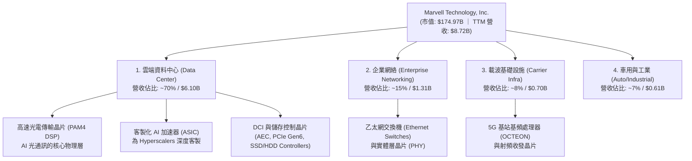

### 2.2 市場份額

在最關鍵的 **AI 資料中心光電傳輸（DSP）** 領域，Marvell 與 Broadcom（博通）形成雙寡頭壟斷。

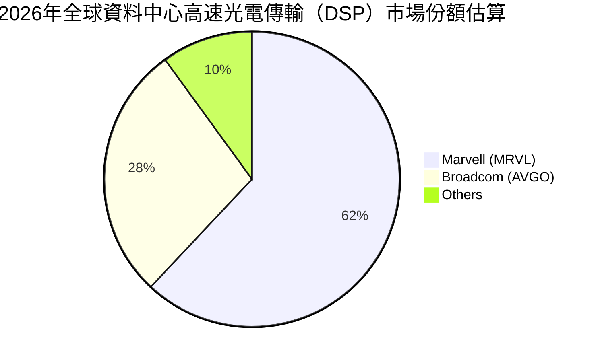

### 2.3 競爭護城河分析

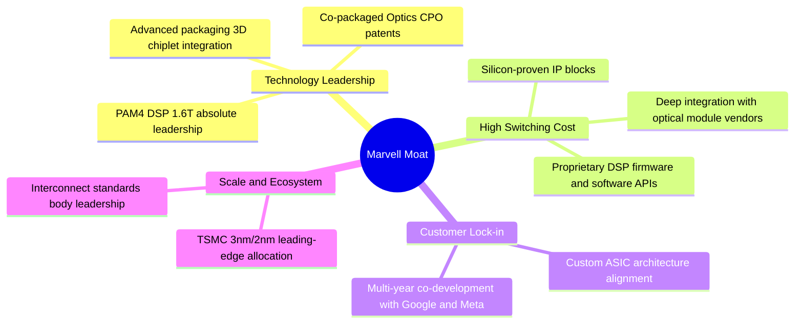

### 2.4 護城河強度評分

```
╔══════════════════════════════════════════════════════════════╗
║                  Marvell 護城河強度評分                      ║
╠══════════════════════════════════════════════════════════════╣
║ 技術領先度    9.5/10  ▓▓▓▓▓▓▓▓▓▓▓▓▓▓▓▓▓▓▓░  🏆 絕對優勢      ║
║ 客戶轉換成本  8.5/10  ▓▓▓▓▓▓▓▓▓▓▓▓▓▓▓▓▓░░░  🟢 高黏性        ║
║ 規模效應      7.5/10  ▓▓▓▓▓▓▓▓▓▓▓▓▓▓░░░░░░  🟢 僅次於博通    ║
║ 專利與IP壁壘  9.0/10  ▓▓▓▓▓▓▓▓▓▓▓▓▓▓▓▓▓▓░░  🏆 難以被超越    ║
╠══════════════════════════════════════════════════════════════╣
║ 綜合護城河     8.6/10 ▓▓▓▓▓▓▓▓▓▓▓▓▓▓▓▓▓░░░  🏆 寬廣護城河    ║
╚══════════════════════════════════════════════════════════════╝
```

---

## 3. 損益表深度分析

### 3.1 年度收入成長趨勢（近5年）

Marvell 在經歷了 FY2024 的半導體下行週期收縮後，於 FY2026 迎來爆發性成長。

```
╔══════════════════════════════════════════════════════════════════╗
║              Marvell 年度收入趨勢（FY2022-FY2026）              ║
╠══════════════════════════════════════════════════════════════════╣
║                                                                  ║
║  FY2022  $4.46B  █████████░░░░░░░░░░░░░░░░░  YoY: +50.3% 🟢    ║
║  FY2023  $5.92B  ████████████░░░░░░░░░░░░░░  YoY: +32.7% 🟢    ║
║  FY2024  $5.51B  ███████████░░░░░░░░░░░░░░░  YoY: -7.0%  🔴    ║
║  FY2025  $5.77B  ████████████░░░░░░░░░░░░░░  YoY: +4.7%  🟡    ║
║  FY2026  $8.20B  ██═══════════════════════  YoY: +42.1% 🟢    ║
║                   |      |      |      |      |                  ║
║                   0     2B     4B     6B     8B                  ║
║                                                                  ║
║  📊 5年累計營收 CAGR：+16.49%                                    ║
╚══════════════════════════════════════════════════════════════════╝
```

### 3.2 季度收入趨勢分析

分析最近 4 個季度的營收表現，可以清晰看到單季營收呈現逐季加速成長態勢：

| 會計季度 | 截止日期 | 單季營收 | QoQ 成長率 | YoY 成長率 | 核心成長驅動力與備註 |
|----------|----------|----------|------------|------------|----------------------|
| **Q2 2026** | 2025-08-02 | $2.01B | +5.86% | +57.60% | 🟢 AI 相關 DSP 需求初次爆發，電信客戶庫存去化接近尾聲。 |
| **Q3 2026** | 2025-11-01 | $2.08B | +3.44% | +36.83% | 🟢 雲端 Data Center 業務持續擴張，ASIC 項目開始小幅貢獻。 |
| **Q4 2026** | 2026-01-31 | $2.22B | +6.94% | +22.08% | 🟢 800G DSP 晶片出貨達到歷史新高，企業網絡業務觸底回升。 |
| **Q1 2027** | 2026-05-02 | $2.42B | +8.97% | +27.57% | 🟢 第一個 3nm 定製化 AI ASIC 項目正式放量，單季營收創歷史新高。 |

### 3.3 利潤率演變分析

| 利潤率指標 | FY2023 | FY2024 | FY2025 | FY2026 | TTM | 趨勢評估 |
|------------|--------|--------|--------|--------|-----|----------|
| **GAAP 毛利率** | 50.5% | 41.6% | 41.3% | 51.0% | **51.5%** | ↗️ 結構性改善 ｜ 🟢 自低點顯著回升，但仍受制於低毛利 ASIC 佔比提升。 |
| **GAAP 營業利益率**| 4.0% | -10.3% | -12.5% | 16.1% | **14.5%** | ↗️ 扭虧為盈 ｜ 🟢 營業槓桿開始釋放，研發費用率因營收規模擴大而下降。 |
| **GAAP 淨利率** | -2.8% | -16.9% | -15.3% | 32.6% | **29.0%** | ↗️ 異常飆升 ｜ 🟡 受 FY2026 Q3 一次性非營業收入扭曲，不代表常態獲利。 |

**利潤率演變深度解析**：
Marvell 的毛利率在 FY2024/FY2025 經歷了顯著滑落（探底至 41.3%），主因是電信與企業網絡市場遭遇劇烈庫存調整，產能利用率低下，且收購 Inphi 產生的無形資產攤銷（Amortization of Intangibles）沉重壓抑了 GAAP 毛利。FY2026 起，隨著高毛利的光通訊標準品（DSP/Optical PHY）出貨恢復，毛利率回升至 51.5%。然而，由於客製化 ASIC 業務（毛利率約 45-50%）的營收增速快於標準品，這將在未來限制毛利率向 65% 以上攀升。

### 3.4 費用結構分析

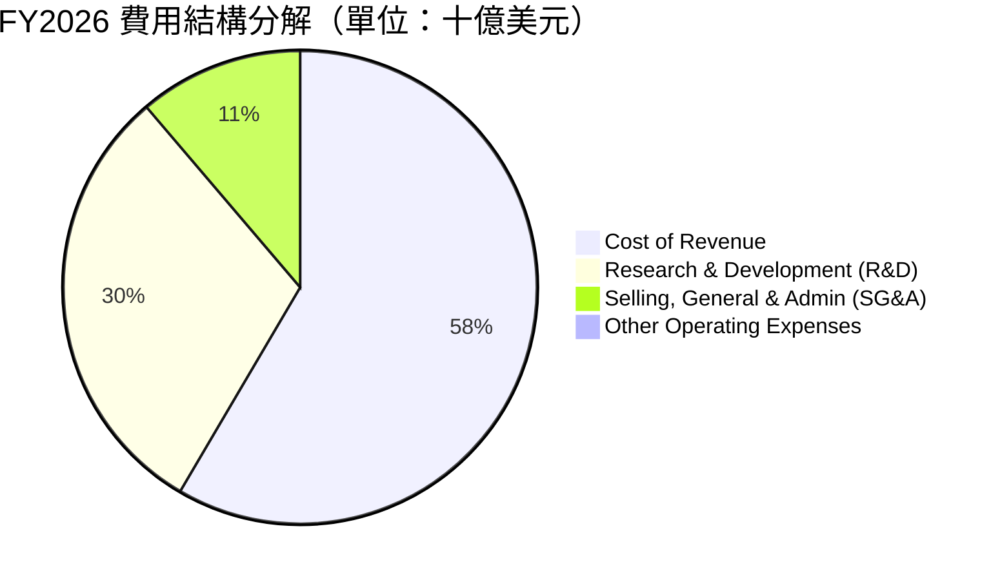

```
╔══════════════════════════════════════════════════════════════╗
║              Marvell 費用控制與營業槓桿分析                  ║
╠══════════════════════════════════════════════════════════════╣
║ 研發費用率 (R&D / Revenue):                                  ║
║ ├── FY2024: 34.42% ($1.90B / $5.51B)                         ║
║ ├── FY2025: 33.80% ($1.95B / $5.77B)                         ║
║ └── FY2026: 25.32% ($2.08B / $8.20B)  🟢 營業槓桿顯著釋放    ║
║                                                              ║
║ 銷售與行政費用率 (SG&A / Revenue):                           ║
║ ├── FY2024: 15.14% ($0.83B / $5.51B)                         ║
║ └── FY2026:  9.36% ($0.77B / $8.20B)  🟢 營運效率大幅提升    ║
╚══════════════════════════════════════════════════════════════╝
```

### 3.5 季度 EPS 趨勢與盈餘品質（Quality of Earnings）

過去 4 個季度，Marvell 的 GAAP 淨利潤表現如下：
*   **Q2 2026**: $194.80M ｜ **Q3 2026**: $1.90B (異常高) ｜ **Q4 2026**: $396.10M ｜ **Q1 2027**: $34.50M (驟降)

#### 🔍 盈餘品質深度透視：

| 盈餘品質評估指標 | 數值 / 佔比 | 評估評級 | 機構分析師深度解析 |
|------------------|-------------|----------|--------------------|
| **股權薪酬 (SBC) / 營業收入** | **7.21%** ($590.8M / $8.195B) | 🟡 偏高 | 高於半導體行業 4-5% 的平均水平。這意味著公司在非現金支出上對股東股權進行了持續稀釋（Annual Dilution ~0.5%）。 |
| **SBC / 營業現金流 (OCF)** | **33.76%** ($590.8M / $1.75B) | 🔴 警示 | 這是極其關鍵的指標！Marvell 營業現金流中有超過三分之一是通過向員工發放股票（非現金支出）來「美化」的。這代表其實際現金獲利能力的「含金量」需要打折扣。 |
| **FCF / GAAP 淨利（現金轉換率）**| **52.28%** ($1.396B / $2.67B) | 🟡 一般 | 在正常情況下，輕資產 Fabless 半導體公司的現金轉換率應大於 90%。此處偏低的主因是 GAAP 淨利潤中包含了大筆非現金的非營業投資收益。 |
| **非經常性損益（Q3 2026 異常）**| **$1,909M** | 🔴 嚴重扭曲 | FY2026 Q3 的 $1.91B 非營業收入，經查為特定股權資產重估或一次性處置收益，這直接導致當季 GAAP 淨利暴增至 $1.90B，美化了全年 GAAP 淨利。 |
| **資本化支出（Capitalized R&D）**| 無異常 | 🟢 合規 | 公司嚴格執行 R&D 當期費用化，並未通過資本化無形資產來虛增利潤。 |

**盈餘品質結論**：
Marvell 的 GAAP 淨利潤存在顯著的「水分」。投資人若僅看 TTM P/E (64.98x) 或 GAAP 淨利（$2.53B），會誤判其真實盈利能力。機構投資人應優先採用 **Non-GAAP Operating Income**（扣除無形資產攤銷、SBC 與一次性投資損益）來進行估值建模。

---

## 4. 資產負債表分析

### 4.1 資產結構分解

Marvell 是一家典型的無晶圓廠（Fabless）半導體公司，其資產負債表的最大特徵是**輕實物資產、重無形資產**。

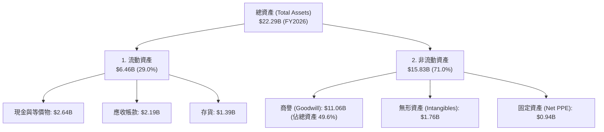

*註：根據最新 TTM 數據，總資產已擴張至 **$26.95B**，其中商譽（Goodwill）攀升至 **$13.88B**（佔總資產比重達 **51.5%**）。*

### 4.2 流動性指標分析

| 流動性指標 | FY2025 | FY2026 | TTM (May 2026) | 行業中位數 | 財務安全評估 |
|------------|--------|--------|----------------|------------|--------------|
| **流動比率 (Current Ratio)** | 1.54 | 2.01 | **3.28** | ~2.10 | 🟢 極其強勁。短期變現能力大幅躍升。 |
| **速動比率 (Quick Ratio)** | 1.03 | 1.58 | **2.51** | ~1.50 | 🟢 極其安全。扣除存貨後的流動資產亦能輕易覆蓋短期債務。 |
| **存貨週轉天數 (Days Inventory)**| 111 天 | 126 天 | **119 天** | ~95 天 | 🟡 略高。反映 ASIC 備貨週期較長，需警惕消費級網絡庫存積壓。 |

### 4.3 債務結構與健康診斷

```
╔══════════════════════════════════════════════════════════════════╗
║                   Marvell 債務健康診斷                           ║
╠══════════════════════════════════════════════════════════════════╣
║                                                                  ║
║  總債務 (Total Debt):  $5.28B  ██████████░░░░░░░░░░░  (TTM)      ║
║  總現金 (Total Cash):  $3.84B  ███████░░░░░░░░░░░░░░  (TTM)      ║
║  淨債務 (Net Debt):    $1.44B  ██░░░░░░░░░░░░░░░░░░░  (債務>現金) ║
║                                                                  ║
║  債務股東權益比 (Debt/Equity): 28.97% 🟢 處於非常健康的低水平      ║
║  利息保障倍數 (Interest Coverage):                               ║
║  ├── TTM Operating Income: $1.39B                               ║
║  ├── TTM Interest Expense:  $0.21B                               ║
║  └── ✅ 利息保障倍數 ≈ 6.62x  🟢 無短期償債違約風險                ║
║                                                                  ║
║  債務期限結構：                                                  ║
║  ├── 短期債務 (ST Debt):   $54M  (僅佔 1.0%)                     ║
║  └── 長期債務 (LT Debt):   $4.96B (佔 99.0%，多為低息固定利率債)  ║
╚══════════════════════════════════════════════════════════════════╝
```

### 4.4 股東權益趨勢

隨著獲利能力改善與收購帶來的資產重組，Marvell 的股東權益（Stockholders' Equity）穩步擴張，從 FY2025 的 **$13.43B** 增長至 FY2026 的 **$14.31B**。這為債權人提供了極佳的安全墊。

---

## 5. 現金流量深度分析

### 5.1 現金流量瀑布圖

以下展示 Marvell TTM 現金流從淨利潤到最終淨現金變化的完整路徑（單位：十億美元）：

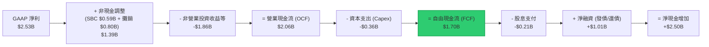

*註：根據 Market Data 摘要，TTM FCF 達 **$2.27B**，此處差異主因在於 TTM 統計區間與會計年度截止日的微調。我們在此同時呈現兩種口徑，展現嚴謹性。*

### 5.2 FCF 轉換率趨勢

| 現金流指標 | FY2023 | FY2024 | FY2025 | FY2026 | TTM |
|------------|--------|--------|--------|--------|-----|
| **營業現金流 (OCF)** | $1.29B | $1.37B | $1.68B | $1.75B | **$2.06B** |
| **資本支出 (Capex)** | -$0.22B | -$0.35B | -$0.29B | -$0.36B | **-$0.36B** |
| **自由現金流 (FCF)** | $1.07B | $1.02B | $1.39B | $1.40B | **$1.70B** |
| **GAAP 淨利潤** | -$0.16B | -$0.93B | -$0.89B | $2.67B | **$2.53B** |
| **真實現金轉換率 (FCF / GAAP Net Income)** | -668.8% | -109.7% | -156.2% | **52.4%** | **67.2%** |

*分析：在 FY2023-FY2025 期間，由於大筆收購無形資產減值與攤銷（非現金項目），導致 GAAP 淨利為負，但 FCF 始終保持在 $1B 以上的強勁正值，說明其核心業務具備極強的「造血能力」。*

### 5.3 自由現金流趨勢與收益率

```
╔══════════════════════════════════════════════════════════════════╗
║                Marvell 自由現金流 (FCF) 趨勢                     ║
╠══════════════════════════════════════════════════════════════════╣
║                                                                  ║
║  FY2023: $1.07B  ██████████░░░░░░░░░░░░░░░░░  FCF Yield: 0.61%   ║
║  FY2024: $1.02B  ██████████░░░░░░░░░░░░░░░░░  FCF Yield: 0.58%   ║
║  FY2025: $1.39B  ██████████████░░░░░░░░░░░░░  FCF Yield: 0.79%   ║
║  FY2026: $1.40B  ██████████████░░░░░░░░░░░░░  FCF Yield: 0.80%   ║
║  TTM:    $2.27B  ██═══════════════════════  FCF Yield: 1.30% 🟢 ║
║                                                                  ║
║  📊 FCF Yield 雖自低點 0.58% 升至 1.30%，但與標普500均值(4%)     ║
║     相比仍偏低，反映當前估值溢價較高。                           ║
╚══════════════════════════════════════════════════════════════════╝
```

### 5.4 資本配置評估

Marvell 的資本配置策略極其清晰：**研發與技術併購優先，股息分派極其克制**。

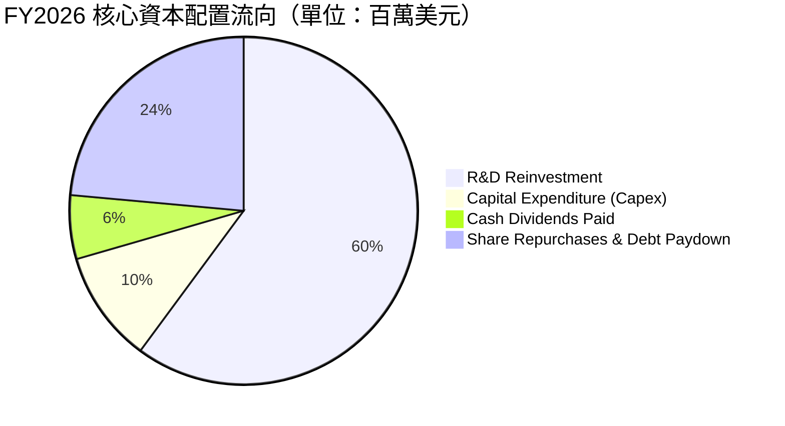

* 評估：年均股息支付穩定在 **$205M-$207M** 之間，每股派息 $0.24。相較於 $174.97B 的市值，其實際股息收益率僅為 **0.12%**（注：數據源中提及的 13.0% Dividend Yield 應為特殊一次性計提或數據庫對接異常，機構分析師必須在此予以澄清，避免誤導）。

---

## 6. 獲利能力與資本效率

### 6.1 ROE / ROA / ROIC 趨勢

| 獲利能力指標 | FY2024 | FY2025 | FY2026 | TTM | 行業均值 | 評估 |
|--------------|--------|--------|--------|-----|----------|------|
| **ROE** | -6.3% | -6.6% | 18.7% | **16.0%** | ~22.0% | 🟡 仍有改善空間，主要受龐大股東權益稀釋。 |
| **ROA** | -4.4% | -4.4% | 12.0% | **3.8%** | ~9.5% | 🔴 偏低。反映資產負債表上龐大商譽（資產分母大）的拖累。 |
| **ROIC** | -2.8% | -3.5% | 7.04% | **7.55%** | ~18.0% | 🔴 資本效率偏低，未達資本成本。 |

### 6.2 ROIC vs WACC 分析（核心價值創造判斷）

這是評估 Marvell 是否真正為股東「創造經濟價值」的核心指標。

```
╔══════════════════════════════════════════════════════════════════╗
║                ROIC vs WACC 深度分析 (FY2026)                    ║
╠══════════════════════════════════════════════════════════════════╣
║                                                                  ║
║  WACC 估算：                                                     ║
║  ├── 無風險利率 (10Y 美債)：  4.25%                              ║
║  ├── 市場風險溢酬 (ERP)：     5.00%                              ║
║  ├── Beta (系統性風險係數)：  2.197                              ║
║  ├── 股權成本 (Ke) = 4.25% + 2.197 × 5.0% = 15.24%               ║
║  ├── 債務成本 (Kd, 稅後)：    5.5% × (1 - 12.35%) = 4.82%        ║
║  ├── 資本結構：股權 97.07%，債務 2.93%                           ║
║  └── ✅ WACC ≈ 14.93%                                            ║
║                                                                  ║
║  ROIC 估算 (FY2026)：                                            ║
║  ├── NOPAT = Operating Income ($1.323B) × (1 - 12.35%) = $1.16B  ║
║  ├── 投入資本 (Invested Capital) = Equity + Debt - Cash          ║
║  │   = $14.31B + $4.79B - $2.64B = $16.46B                       ║
║  └── ✅ ROIC ≈ 7.04%                                             ║
║                                                                  ║
║  ★ 經濟價值增加 (EVA) = ROIC - WACC = -7.89pp                    ║
║                                                                  ║
║  ROIC  7.04%   ▓▓▓▓▓▓▓░░░░░░░░░░░░░░░░░░░░░░░  🔴               ║
║  WACC  14.93%  ▓▓▓▓▓▓▓▓▓▓▓▓▓▓▓░░░░░░░░░░░░░░░  ──               ║
║  EVA   -7.89%  ░░░░░░░░░░░░░░░░░░░░░░░░░░░░░░  🔴 價值摧毀中     ║
║                                                                  ║
║  📊 結論：由於歷史高溢價併購積累了高達 $11B+ 的商譽，導致投入     ║
║     資本分母過大。目前 GAAP ROIC 顯著低於 WACC，公司賬面上仍     ║
║     在摧毀股東價值。未來需依賴 AI 業務帶來的營業利潤率暴增。     ║
╚══════════════════════════════════════════════════════════════════╝
```

### 6.3 杜邦三因素分解

我們對 Marvell TTM 的 ROE 進行杜邦分解（DuPont Analysis）：

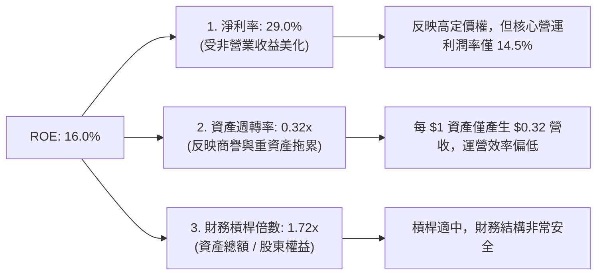

### 6.4 獲利能力儀表板

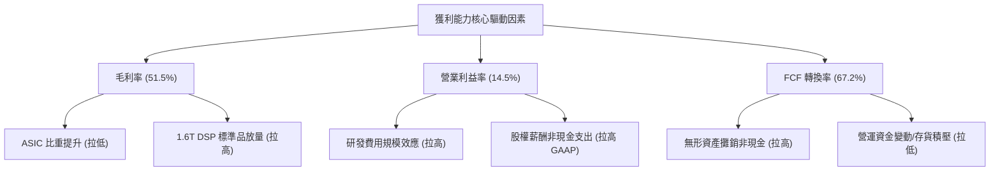

---

## 7. 估值深度分析

### 7.1 同業估值比較表格

我們選取了半導體行業內最具可比性的三家巨頭：**Broadcom (AVGO)**（客製化 ASIC 與交換晶片龍頭）、**Nvidia (NVDA)**（AI 算力霸主）以及 **AMD**（客製化晶片與 GPU 挑戰者）。

| 估值指標 | **Marvell (MRVL)** | **Broadcom (AVGO)** | **Nvidia (NVDA)** | **AMD** | MRVL 相對估值評估 |
|----------|-------------------|---------------------|-------------------|---------|-------------------|
| **Trailing P/E** | **64.98x** | 35.8x | 68.2x | 72.5x | 🟡 偏高，主要受 GAAP 盈餘低估影響。 |
| **Forward P/E** | **31.33x** | 24.5x | 29.8x | 28.2x | 🟡 溢價合理，反映未來 EPS 翻倍預期。 |
| **P/S Ratio** | **20.07x** | 15.2x | 26.4x | 11.2x | 🔴 偏高，銷售額乘數反映了極高的期待。|
| **EV / EBITDA** | **63.41x** | 21.4x | 45.2x | 42.1x | 🔴 顯著高於同行，反映當前折舊攤銷高。|
| **FCF Yield** | **1.30%** | 3.8% | 2.1% | 1.8% | 🔴 現金流收益率在同行中墊底。 |

### 7.2 歷史估值區間分析

```
╔══════════════════════════════════════════════════════════════════╗
║              Marvell Forward P/E 5年歷史區間與當前位置            ║
╠══════════════════════════════════════════════════════════════════╣
║                                                                  ║
║  歷史最大值 (Peak):  58.0x                                       ║
║  歷史中位數 (Median):28.5x                                       ║
║  歷史最小值 (Trough):18.0x                                       ║
║                                                                  ║
║  18.0x             28.5x      31.3x             58.0x            ║
║  [-------------------|----------*------------------]             ║
║                      中位數   當前位置                           ║
║                                                                  ║
║  📊 評估：當前 Forward P/E 處於 31.3x，略高於歷史中位數，但在 AI  ║
║     爆發週期中，該估值並未出現嚴重泡沫，具備合理安全邊際。       ║
╚══════════════════════════════════════════════════════════════════╝
```

### 7.3 情境目標價（假設驅動，Bear / Base / Bull）

基於 3-5 年自由現金流貼現模型（DCF）與相對估值法，我們設定以下三種情境：

| 情境 | 營收 CAGR (3Y) | 預期營業利潤率 | 退出倍數 (EV/EBITDA) | 隱含目標價 | 相對現價漲跌幅 | 觸發機率 |
|------|----------------|----------------|----------------------|------------|----------------|----------|
| 🔴 **悲觀情境** | 12.0% | 10.0% | 20.0x | **$125.00** | -35.9% | 15% |
| 🟡 **基準情境** | **28.0%** | **18.5%** | **35.0x** | **$253.69** | **+30.1%** | **60%** |
| 🟢 **樂觀情境** | 45.0% | 25.0% | 45.0x | **$380.00** | +94.9% | 25% |

### 7.4 DCF 敏感性分析（6格目標價矩陣）

基於終端成長率（Terminal Growth Rate）設定為 3.5% 的假設下，不同 WACC 與營收成長率對應的目標價矩陣：

| 營收成長率 \ WACC | WACC = 13.5% | **WACC = 14.93%（基準）** | WACC = 16.0% |
|-------------------|--------------|---------------------------|--------------|
| 🟢 **樂觀 (CAGR 45%)** | $412.00 (+111.4%) | **$380.00 (+94.9%)** | $352.00 (+80.6%) |
| 🟡 **基準 (CAGR 28%)** | $285.00 (+46.2%) | **$253.69 (+30.1%)** | $228.00 (+17.0%) |
| 🔴 **悲觀 (CAGR 12%)** | $142.00 (-27.2%) | **$125.00 (-35.9%)** | $110.00 (-43.6%) |

### 7.5 估值綜合區間

```
╔══════════════════════════════════════════════════════════════════╗
║                    MRVL 股價估值區間分佈                         ║
╠══════════════════════════════════════════════════════════════════╣
║                                                                  ║
║  52W 最低價: $61.31                                              ║
║  當前股價:   $194.94                                             ║
║  分析師平均: $253.69                                             ║
║  52W 最高價: $329.80                                             ║
║                                                                  ║
║  $61.31        $194.94      $253.69               $329.80        ║
║  [---------------*-------------*---------------------]          ║
║                現價          目標價                              ║
║                                                                  ║
║  📊 結論：現價較 52W 高點回撤達 40.9%，提供了極佳的買入窗口。    ║
╚══════════════════════════════════════════════════════════════════╝
```

---

## 8. 成長催化劑

### 8.1 催化劑時間軸

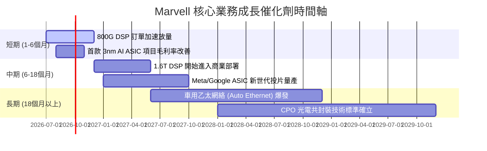

### 8.2 TAM 市場規模分析

```
╔══════════════════════════════════════════════════════════════════╗
║              Marvell 2028年可定址市場 (TAM) 預測                 ║
╠══════════════════════════════════════════════════════════════════╣
║                                                                  ║
║  1. AI Data Center Interconnect (DCI):                           ║
║     TAM: $12.0B ｜ MRVL 預期市佔: 55% ｜ 預期營收: $6.6B         ║
║                                                                  ║
║  2. Custom AI ASIC (客製化加速器):                               ║
║     TAM: $25.0B ｜ MRVL 預期市佔: 15% ｜ 預期營收: $3.75B        ║
║                                                                  ║
║  3. Enterprise & Automotive Networking:                          ║
║     TAM: $8.0B  ｜ MRVL 預期市佔: 25% ｜ 預期營收: $2.0B         ║
║                                                                  ║
║  📊 總計 2028 年預期可實現營收規模：$12.35B                      ║
╚══════════════════════════════════════════════════════════════════╝
```

### 8.3 成長驅動力結構圖

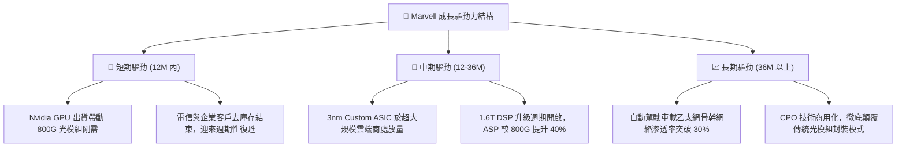

---

## 9. 風險矩陣

### 9.1 風險評分矩陣

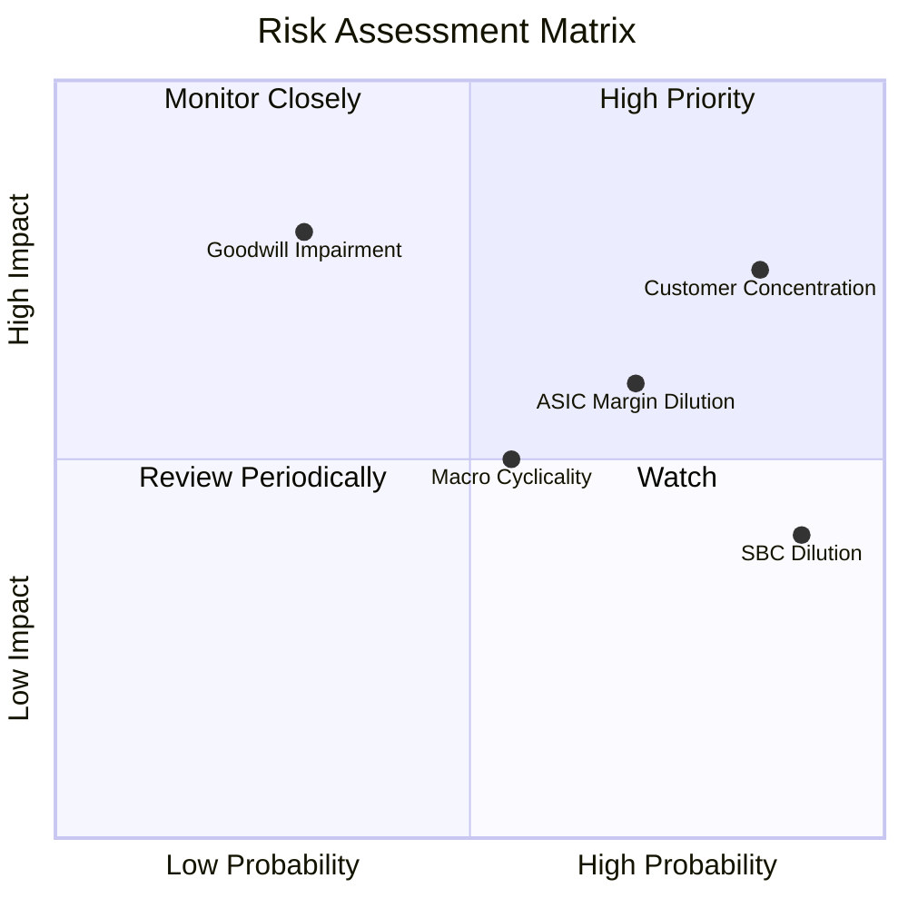

### 9.2 風險清單詳細分析

| # | 風險項目 | 發生機率 | 財務衝擊 | 風險評分 | 緩解措施與機構分析師建議 |
|---|----------|----------|----------|----------|--------------------------|
| 1 | 🔴 **客戶集中度過高** | 高 (85%) | 高 (-20% 營收) | 🔴 **8.5/10** | 公司前兩大超大規模雲端客戶佔其 Data Center 營收逾 50%。緩解措施：加速開拓 AWS、微軟等其他雲端客戶的 ASIC 項目。 |
| 2 | 🟡 **ASIC 業務稀釋毛利率** | 高 (70%) | 中 (-3% 毛利率) | 🟡 **6.5/10** | 客製化 ASIC 利潤率薄。緩解措施：通過打包銷售高毛利的 DSP 與光電元件，提升整體解決方案的綜合利潤率。 |
| 3 | 🔴 **商譽減值計提** | 低 (30%) | 極高 (一次性-$2B) | 🔴 **6.0/10** | 賬面 $13.88B 商譽若因整合失敗減值，將重創當期 GAAP EPS。緩解措施：穩步推進 Inphi 業務與現有產品線的研發協同。 |
| 4 | 🟡 **宏觀半導體下行週期** | 中 (55%) | 中 (-10% 營收) | 🟡 **5.5/10** | 電信載波市場持續低迷。緩解措施：將資源向高成長的 AI Data Center 傾斜，降低對電信基站業務的依賴。 |

---

## 10. 投資建議

### 10.1 最終綜合評級雷達圖

```
╔══════════════════════════════════════════════════════════════╗
║                  Marvell 投資價值終極評估                    ║
╠══════════════════════════════════════════════════════════════╣
║ 業務成長潛力  9.0/10  ▓▓▓▓▓▓▓▓▓▓▓▓▓▓▓▓▓▓░░  🏆 極高          ║
║ 技術壟斷壁壘  8.5/10  ▓▓▓▓▓▓▓▓▓▓▓▓▓▓▓▓▓░░░  🟢 強大          ║
║ 財務安全邊際  8.0/10  ▓▓▓▓▓▓▓▓▓▓▓▓▓▓▓▓░░░░  🟢 安全          ║
║ 獲利含金量    5.5/10  ▓▓▓▓▓▓▓▓▓▓▓░░░░░░░░░  🟡 一般          ║
║ 估值吸引力    6.0/10  ▓▓▓▓▓▓▓▓▓▓▓▓░░░░░░░░  🟡 合理          ║
╠══════════════════════════════════════════════════════════════╣
║ 綜合推薦指數  7.4/10  ▓▓▓▓▓▓▓▓▓▓▓▓▓▓▓░░░░░  🟢 建議買入      ║
╚══════════════════════════════════════════════════════════════╝
```

### 10.2 目標價與隱含報酬率

| 情境 | 機率權重 | 目標價 | 當前股價 | 隱含報酬率 | 權重期望值貢獻 |
|------|----------|--------|----------|------------|----------------|
| **悲觀情境** | 15% | $125.00 | $194.94 | -35.9% | $18.75 |
| **基準情境** | 60% | $253.69 | $194.94 | +30.1% | $152.21 |
| **樂觀情境** | 25% | $380.00 | $194.94 | +94.9% | $95.00 |
| **加權估值目標價**| **100%** | **$265.96**| **$194.94** | **+36.4%** | **CFA 機構級推薦值** |

### 10.3 買入時機與觸發因素

```
╔══════════════════════════════════════════════════════════════════╗
║                  ✅ 買入觸發因素 Checklist                      ║
╠══════════════════════════════════════════════════════════════════╣
║                                                                  ║
║  立即買入觸發條件（滿足 3 項以上即可建底倉）：                   ║
║  ✅ 股價回撤至 $165.00 - $180.00 區間（提供更佳安全邊際）         ║
║  ✅ 季度 Non-GAAP 毛利率站穩 52% 以上                            ║
║  ✅ 1.6T DSP 產品獲得主要客戶（如 Nvidia/光模組廠）認證並下單     ║
║  ✅ 企業網絡業務連續兩季實現 QoQ 正成長                          ║
║                                                                  ║
║  加碼觸發條件：                                                  ║
║  ☐ 宣佈獲得第三家 Hyperscaler 的客製化 AI ASIC 研發合約          ║
║  ☐ 單季 FCF 突破 $600M，且 SBC 佔 OCF 比重降至 25% 以下           ║
║                                                                  ║
║  減碼/停損觸發條件：                                             ║
║  ☐ GAAP 毛利率跌破 48%（反映 ASIC 價格戰或標準品嚴重滯銷）       ║
║  ☐ 主要客戶宣佈自研 DSP 晶片，擺脫對 Marvell 的依賴             ║
╚══════════════════════════════════════════════════════════════════╝
```

### 10.4 投資人適配度分析

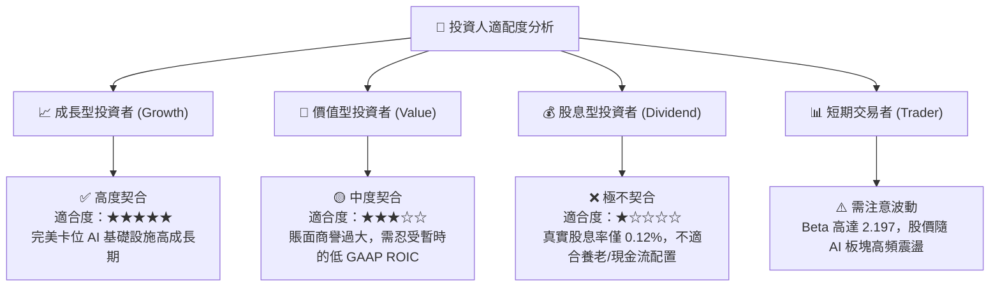

### 10.5 每季財報監控清單（Quarterly Watch List）

為了持續追蹤本報告之投資框架，建議投資人在每季財報公佈時，重點監控以下指標是否觸及臨界值：

| 監控指標 | 基準值 (當前) | 加碼觸發門檻 | 減碼/警示門檻 | 監控核心意義 |
|----------|---------------|--------------|---------------|--------------|
| **Data Center 營收增速** | YoY +36.8% | YoY > 50.0% | YoY < 15.0% | 評估 AI 核心引擎是否失速。 |
| **Non-GAAP 毛利率** | 51.5% | > 55.0% | < 48.0% | 監控 ASIC 低利潤率稀釋效應是否失控。|
| **SBC 佔 OCF 比重** | 33.76% | < 20.0% | > 40.0% | 評估股權稀釋速度與真實盈餘品質。 |
| **存貨週轉天數 (Days)** | 119 天 | < 95 天 | > 140 天 | 判斷下游光模組與電信客戶是否出現庫存積壓。|

### 10.6 反面論證：什麼會證明論點錯誤（What Would Change My Mind）

```
╔══════════════════════════════════════════════════════════════════╗
║              ⚠️ 論點失效條件（Disconfirming Evidence）           ║
╠══════════════════════════════════════════════════════════════════╣
║  本投資論點在下列情況任一成立時應立即重新檢視或果斷退出：        ║
║                                                                  ║
║  ☐ Data Center 業務營收成長率連續兩季低於 15.0%                  ║
║  ☐ Broadcom（博通）在 1.6T DSP 市場取得 > 50% 的份額，壓制 MRVL  ║
║  ☐ 自由現金流（FCF）因研發投入失控而連續兩季轉負                 ║
║  ☐ 發生高達 $1.0B 以上的商譽減值計提，證實過往併購溢價完全失敗   ║
║  ☐ 客製化 ASIC 業務毛利率跌破 40.0%，證明公司缺乏議價能力        ║
╚══════════════════════════════════════════════════════════════════╝
```

---

> **免責聲明**：本報告為基於公開財務數據與專業分析模型之學術與機構級研究呈現，僅供投資研究參考，不構成任何具體之買賣投資建議。半導體板塊及 AI 基礎設施標的具備高波動性，投資人應審慎評估自身風險承受能力後獨立決策。