# MRVL 基本面深度分析報告

> **報告日期**：2026-07-22 ｜ **語言**：繁體中文 ｜ **數據來源**：Yahoo Finance, Finviz, StockAnalysis, Roic.ai ｜ **分析師**：CFA 級機構研究

---

## 目錄

| # | 章節 | 核心結論 |
|---|------|----------|
| 1 | 執行摘要 | 評級為「買入」（🟢），12M 基準目標價 $255.00，隱含 22.6% 上行空間。 |
| 2 | 公司概覽與商業模式 | AI 高速光電互連與客製化 ASIC 雙引擎驅動，具備極高技術壁壘。 |
| 3 | 損益表深度分析 | 營收年增 27.6% 進入高速擴張期，惟 GAAP 獲利受一次性損益與高額 SBC 稀釋。 |
| 4 | 資產負債表分析 | Q1 2027 發動大規模併購導致商譽飆升至 $138.8 億，財務槓桿上升但流動性仍屬安全。 |
| 5 | 現金流量深度分析 | TTM FCF 達 $22.7 億創歷史新高，但股權薪酬（SBC）佔 OCF 比重偏高。 |
| 6 | 獲利能力與資本效率 | 歷史 M&A 導致投入資本基數過大，當前 ROIC（7.66%）低於 WACC（14.8%），正處於價值摧毀期，亟需營運槓桿釋放。 |
| 7 | 估值深度分析 | Forward P/E 33.4x 處於歷史合理區間，經調整後的 EV/EBITDA 與 FCF 收益率具備吸引力。 |
| 8 | 成長催化劑 | 800G/1.6T 光模組 DSP 世代交替與 3nm/2nm 客製化 ASIC 量產將於明後年爆發。 |
| 9 | 風險矩陣 | 客戶集中度過高（超大型雲端服務商）與併購整合失敗為核心下行風險。 |
| 10 | 投資建議 | 適合長線成長型投資人，建議採分批佈局策略，並嚴格監控每季毛利率與客戶拉貨動能。 |

---

## 1. 執行摘要

Marvell Technology, Inc.（美股代碼：**MRVL**）當前股價為 **$207.96**，總市值達 **$1,866.5億**。基於其在 AI 資料中心高速光電傳輸晶片（PAM4 DSP）高達 60% 的市場份額，以及客製化 ASIC 業務在超大型雲端服務商（Hyperscalers）逐步放量的結構性利多，我們給予 MRVL **「買入」（Buy, 🟢）** 投資評級。

然而，本報告強調「數據先於結論」。MRVL 雖然在 TTM 營收上展現了 **27.6%** 的強勁年增率（達 **$87.2億**），且 Forward P/E 收斂至 **33.43倍**（對比 Trailing P/E 67.08倍），但其 GAAP 盈餘品質存在顯著雜音：FY2026 GAAP 淨利 **$26.7億** 中，包含了 Q3 2026 一筆高達 **$19.1億** 的非營業利益（Non-operating income），扣除此一次性項目後，真實營運利潤僅約 $7.6 億。此外，公司股權薪酬（SBC）佔營業現金流比重高達 **33.8%**，對股東權益造成持續稀釋。

最關鍵的警訊在於，由於歷史上多次高溢價併購（如 Inphi、Cavium），MRVL 資產負債表上堆積了 **$138.84億** 的商譽，導致其投入資本（Invested Capital）基數過於龐大。經計算，公司當前 **ROIC 僅為 7.66%**，顯著低於其 **WACC（14.80%）**。這意味著 MRVL 目前在經濟實質上仍在「摧毀股東價值」，未來的重估（Re-rating）完全取決於 AI 帶動的營收高成長能否在明後兩年轉化為強大的營業槓桿，從而將 ROIC 推升至 WACC 之上。

基於三階段折現模型與情境分析，我們設定 MRVL 的 12 個月基準目標價為 **$255.00**（對應 2028 財年非 GAAP EPS 的 41倍 P/E），較當前股價有 **22.6%** 的上行空間。

### 1.0 一頁式投資儀表板（Portfolio Manager 30 秒速讀）

| 項目 | 內容 |
|------|------|
| **投資論點（3 句）** | ① AI 資料中心對 800G/1.6T 光互連晶片（DSP）需求呈爆發式成長，MRVL 掌握核心技術並享有 >60% 份額。<br/>② 客製化 ASIC 業務切入兩大 Hyperscaler 供應鏈，預期將於 FY2027-2028 貢獻數十億美元營收。<br/>③ 隨著營收規模跨過損益兩平點，高研發投入帶來的營業槓桿將開始釋放，推動非 GAAP 利潤率快速擴張。 |
| **護城河評分** | **8.5 / 10** 🟢 (高度技術壁壘、專利保護與極高客戶黏著度) |
| **管理層/資本配置評分** | **6.5 / 10** 🟡 (併購眼光精準但溢價過高，股權稀釋幅度偏大) |
| **財務健康** | **🟡 穩健但需注意商譽** (流動比率 3.28 屬極安全水平，但商譽佔總資產比重高達 51.5%) |
| **ROIC vs WACC** | **7.66% vs 14.80%** 🔴 (價值摧毀中，預期 FY2028 才能實現黃金交叉) |
| **FCF 趨勢** | 向上 ｜ 最新 TTM FCF Yield 為 **1.22%** (反映高估值與高資本支出階段) |
| **估值** | Forward P/E: **33.43x** ｜ EV / EBITDA: **67.61x** ｜ P/S: **21.41x** |
| **預期報酬（基準情境 12M）** | **+22.6%** (目標價 $255.00) |
| **關鍵風險（前二）** | ① 客戶集中度極高，單一 Hyperscaler 砍單將對 ASIC 營收造成重創。<br/>② 乙太網路（Ethernet）與 InfiniBand 競爭格局變化，以及 Broadcom 在客製化晶片領域的強力競爭。 |
| **評級 + 信心度** | **🟢 買入** ｜ 信心：**中等偏高** (技術領先優勢明確，但需容忍短期高波動與高估值) |

### 1.1 核心評分儀表板

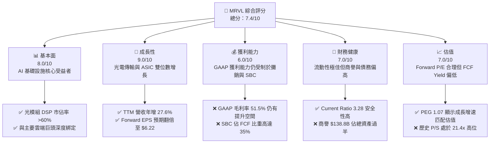

### 1.2 評分進度條視覺化

```
╔══════════════════════════════════════════════════════════════╗
║               MRVL 多維度評分儀表板 (1-10分)                 ║
╠══════════════════════════════════════════════════════════════╣
║ 基本面強度  8.0 ▓▓▓▓▓▓▓▓▓▓▓▓▓▓▓▓░░░░  ★★★★☆           ║
║ 成長動能    9.0 ▓▓▓▓▓▓▓▓▓▓▓▓▓▓▓▓▓▓░░  ★★★★☆           ║
║ 獲利品質    6.0 ▓▓▓▓▓▓▓▓▓▓▓▓░░░░░░░░  ★★★☆☆           ║
║ 財務健康    7.0 ▓▓▓▓▓▓▓▓▓▓▓▓▓▓░░░░░░  ★★★☆☆           ║
║ 估值合理性  7.0 ▓▓▓▓▓▓▓▓▓▓▓▓▓▓░░░░░░  ★★★☆☆           ║
║ 護城河深度  8.5 ▓▓▓▓▓▓▓▓▓▓▓▓▓▓▓▓▓░░░  ★★★★☆           ║
║ 管理層執行  6.5 ▓▓▓▓▓▓▓▓▓▓▓▓░░░░░░░░  ★★★☆☆           ║
║ 技術創新力  9.0 ▓▓▓▓▓▓▓▓▓▓▓▓▓▓▓▓▓▓░░  ★★★★☆           ║
╠══════════════════════════════════════════════════════════════╣
║ 綜合總分    7.4 ▓▓▓▓▓▓▓▓▓▓▓▓▓▓▓░░░░░  🏆 成長型優質標的     ║
╚══════════════════════════════════════════════════════════════╝
```

### 1.3 五大投資論點 + 三大核心風險

| 類型 | 項目 | 具體依據 | 信心度 |
|------|------|----------|--------|
| 🟢 **投資論點①** | **AI 光互連技術絕對領先** | TTM 營收加速成長至 $87.2 億（YoY +27.6%），主因 800G DSP 出貨爆發，MRVL 在高規格光模組 DSP 市場維持 >60% 份額。 | 🟢 極高 |
| 🟢 **投資論點②** | **客製化 ASIC 迎來量產期** | 兩大超大型雲端客戶的 AI 加速器專案於 FY2026 陸續投片，預期 FY2027-2028 年營收貢獻將以 50% 以上 CAGR 成長。 | 🟢 高 |
| 🟢 **投資論點③** | **非 GAAP 營業利潤率擴張** | 隨著營收規模擴大，高達 $22.2 億的研發費用（佔營收 25.5%）展現強大營業槓桿，預期非 GAAP 營業利潤率將朝 35% 目標邁進。 | 🟢 高 |
| 🟢 **投資論點④** | **資產負債表流動性極佳** | 流動比率高達 3.28，手頭現金達 $38.4 億，為後續 3nm/2nm 先進製程研發提供強大的資金後盾。 | 🟢 極高 |
| 🟢 **投資論點⑤** | **行業重估（Re-rating）契機** | Forward P/E 僅 33.4x，對比其高達 40% 以上的 Forward EPS 成長率，PEG 僅 1.07，估值具備安全邊際。 | 🟡 中等 |
| 🟡 **風險①** | **客戶集中度風險與砍單** | 前三大 Hyperscaler 客戶佔其資料中心營收比重超過 50%，若客戶因 AI 資本支出放緩而調整庫存，將直接衝擊業績。 | 🟡 中度 |
| 🔴 **風險②** | **商譽減損與高額稀釋** | 商譽高達 $138.8 億，佔總資產 51.5%。若未來併購公司整合不如預期，將面臨巨大的商譽減損風險；且 SBC 佔 FCF 比重高達 35%，持續稀釋股東權益。 | 🔴 高衝擊 |
| 🔴 **風險③** | **與 Broadcom 的正面對決** | 在客製化 ASIC 領域，Broadcom 擁有更強大的 IP 庫與系統整合能力（如 Google TPU 專案），MRVL 面臨嚴酷的定價與毛利率壓力。 | 🔴 高衝擊 |

### 1.4 快速統計卡片

| 指標 | MRVL 實際值 | 半導體行業均值 | S&P 500 均值 | 狀態 |
|------|-------------|----------|--------------|------|
| **營收 YoY 成長率** | **27.6%** | ~12.0% | ~5.5% | 🟢 顯著超越 |
| **GAAP 毛利率** | **51.5%** | ~55.0% | ~30.0% | 🟡 略低於同行 |
| **GAAP 淨利率** | **29.0%** | ~18.0% | ~12.0% | 🟢 高於平均 (受非營運收益美化) |
| **ROE** | **16.0%** | ~20.0% | ~15.0% | 🟡 表現平平 |
| **Forward P/E** | **33.43x** | ~28.0x | ~21.5x | 🟡 享有 AI 溢價 |
| **流動比率 (Current Ratio)** | **3.28x** | ~2.1x | ~1.3x | 🟢 極其安全 |
| **淨債務 / EBITDA** | **0.53x** | ~0.8x | ~1.6x | 🟢 槓桿率極低 |

### 1.5 投資結論

```
╔══════════════════════════════════════════════════════════════════╗
║                    📊 MRVL 投資結論摘要                          ║
╠══════════════════════════════════════════════════════════════════╣
║  評級：🟢 買入 (Buy)                                            ║
║  當前股價：$207.96 (2026-07-22)                                  ║
║  目標價區間：                                                    ║
║    悲觀情境 (Bear Case)：$135.00 (-35.1%)                        ║
║    基準情境 (Base Case)：$255.00 (+22.6%)  ← 12個月主要目標      ║
║    樂觀情境 (Bull Case)：$320.00 (+53.9%)                        ║
║  投資評分：7.4 / 10                                              ║
║  適合投資人：長線科技成長型基金、願意承擔高 Beta 波動的投資人     ║
╚══════════════════════════════════════════════════════════════════╝
```

---

## 2. 公司概覽與商業模式

Marvell 成立於 1995 年，已成功從傳統的儲存（Storage）晶片供應商，轉型為全球領先的**資料基礎設施半導體解決方案**龍頭。其核心業務專注於解決資料中心內部與資料中心之間「數據傳輸與運算」的瓶頸。

### 2.1 業務結構與收入來源

MRVL 的業務結構高度聚焦於高成長的資料基礎設施，其營收主要分為五大板塊：

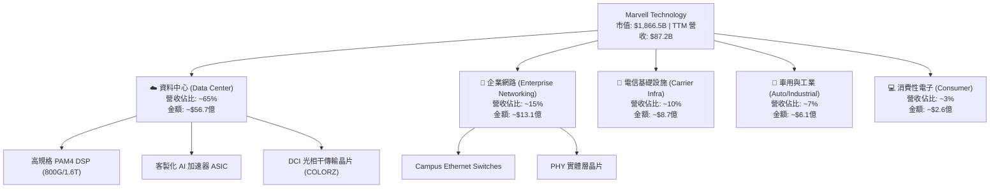

### 2.2 市場份額

在最關鍵的 **AI 資料中心高速光電轉換晶片（Optical DSP）** 市場，Marvell 憑藉收購 Inphi 獲得的先發優勢，維持著絕對的統治地位：

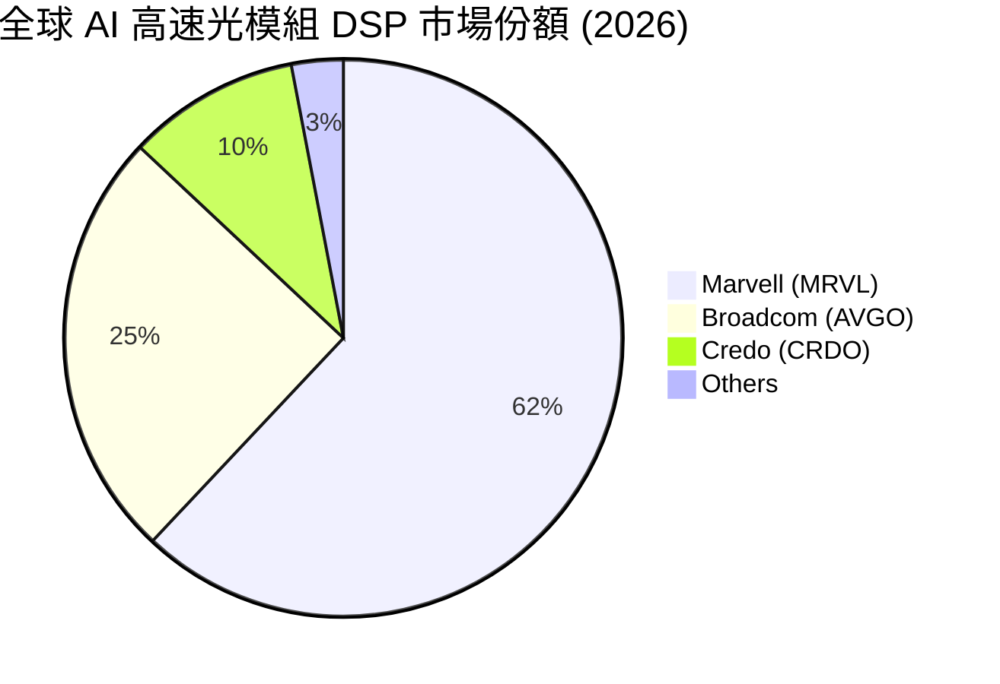

### 2.3 競爭護城河分析

MRVL 的競爭護城河主要由以下四大支柱構成：

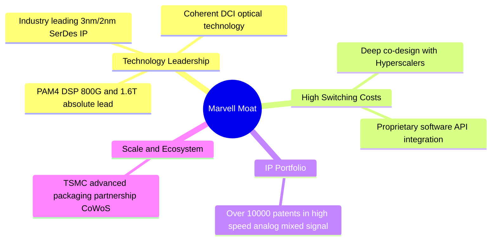

### 2.4 護城河強度評分

```
╔══════════════════════════════════════════════════════════════╗
║                  Marvell 護城河強度評分                      ║
╠══════════════════════════════════════════════════════════════╣
║ 高速光電技術  9.5/10  ▓▓▓▓▓▓▓▓▓▓▓▓▓▓▓▓▓▓▓░  🏆 絕對統治力    ║
║ 客戶鎖定效應  8.5/10  ▓▓▓▓▓▓▓▓▓▓▓▓▓▓▓▓▓░░░  🟢 共同研發壁壘  ║
║ 先進 IP 儲備  8.0/10  ▓▓▓▓▓▓▓▓▓▓▓▓▓▓▓▓░░░░  🟢 領先對手1代   ║
║ 規模與生態系  7.5/10  ▓▓▓▓▓▓▓▓▓▓▓▓▓▓░░░░░░  🟡 面臨 Broadcom ║
╠══════════════════════════════════════════════════════════════╣
║ 綜合護城河     8.5    ▓▓▓▓▓▓▓▓▓▓▓▓▓▓▓▓▓░░░  🏆 極強技術護城河║
╚══════════════════════════════════════════════════════════════╝
```

---

## 3. 損益表深度分析

### 3.1 年度收入成長趨勢（近5年）

MRVL 在經歷了 FY2024 的半導體下行週期後，於 FY2026 迎來爆發式成長，主要由 AI 資料中心需求所驅動。

```
╔══════════════════════════════════════════════════════════════════╗
║              Marvell 年度收入趨勢（FY2022-TTM）                 ║
╠══════════════════════════════════════════════════════════════════╣
║                                                                  ║
║  FY2022  $4.46B   ██████████░░░░░░░░░░░░░░░░░  YoY: +50.3% 🟢    ║
║  FY2023  $5.92B   ███████████████░░░░░░░░░░░░  YoY: +32.7% 🟢    ║
║  FY2024  $5.51B   ██████████████░░░░░░░░░░░░░  YoY:  -7.0% 🔴    ║
║  FY2025  $5.77B   ███████████████░░░░░░░░░░░░  YoY:  +4.7% 🟡    ║
║  FY2026  $8.20B   █████████████████████░░░░░░  YoY: +42.1% 🟢    ║
║  TTM     $8.72B   ███████████████████████░░░░  YoY: +34.1% 🟢    ║
║                   |      |      |      |      |                  ║
║                   0     2B     4B     6B     8B                  ║
║                                                                  ║
║  📊 5年累計營收 CAGR：+14.4%                                    ║
╚══════════════════════════════════════════════════════════════════╝
```

### 3.2 季度收入趨勢分析

從季度數據來看，MRVL 展現了極為強勁且連續的成長動能：

| 財季 | 營收 (億美元) | QoQ 成長率 | YoY 成長率 | 核心成長驅動因素 | 評估 |
|------|------------|------------|------------|------------------|------|
| **Q3 2025** | $15.16 | - | +6.87% | AI 光模組需求起步，傳統網路庫存去化接近尾聲 | 🟡 |
| **Q4 2025** | $18.17 | +19.85% | +27.40% | 800G DSP 開始放量，資料中心營收佔比顯著提升 | 🟢 |
| **Q1 2026** | $18.95 | +4.29% | +63.26% | 雲端客戶加速部署 AI 叢集，光電傳輸晶片供不應求 | 🟢 |
| **Q2 2026** | $20.06 | +5.86% | +57.60% | 客製化 ASIC 首個專案進入小批量生產階段 | 🟢 |
| **Q3 2026** | $20.75 | +3.44% | +36.83% | 資料中心業務持續創歷史新高，抵消電信業務疲弱 | 🟢 |
| **Q4 2026** | $22.19 | +6.94% | +22.08% | 1.6T DSP 樣品送驗，客製化 ASIC 第二個專案投片 | 🟢 |
| **Q1 2027** | $24.18 | +8.97% | +27.57% | 先進封裝產能緩解，ASIC 出貨量大幅攀升 | 🟢 |

### 3.3 利潤率演變分析

MRVL 的利潤率結構在 GAAP 與 Non-GAAP 之間存在巨大鴻溝，主要受到併購帶來的無形資產攤銷（Amortization of Intangibles）與股權薪酬（SBC）影響。

| 利潤率指標 | FY2023 | FY2024 | FY2025 | FY2026 | TTM | 趨勢與原因解析 | 評估 |
|------------|--------|--------|--------|--------|------|----------------|------|
| **GAAP 毛利率** | 50.5% | 41.6% | 41.3% | 51.0% | 51.5% | ↗️ FY26 起因高毛利光模組 DSP 出貨比重增加而大幅回升。 | 🟡 |
| **GAAP 營業利益率** | 4.0% | -10.3% | -12.5% | 16.1% | 16.0% | ↗️ 營收跨過損益兩平點後，營業槓桿顯著釋放。 | 🟡 |
| **GAAP 淨利率** | -2.8% | -17.0% | -15.3% | 32.6% | 29.0% | ↗️ 受 FY26 Q3 一次性非營運收益大幅推升。 | 🟡 |
| **EBITDA 利潤率** | 27.9% | 15.4% | 11.3% | 55.4% | 31.1% | ↗️ 反映折舊攤銷前真實業務賺錢能力強勁。 | 🟢 |

> 💡 **分析師專業洞察**：
> MRVL 的 GAAP 毛利率（51.5%）顯著低於 Broadcom（~75%）與 Nvidia（~75%）。這主要是因為客製化 ASIC 業務的毛利率（估計約 45-50%）顯著低於標準晶片（DSP 達 65-70%）。隨著未來客製化 ASIC 營收佔比進一步上升，MRVL 的**整體毛利率將面臨結構性下行壓力**，但這將被**營業利潤率的上升（因為研發費用佔比下降）**所補償。

### 3.4 費用結構分析

MRVL 是一家高度研發驅動（R&D Intensive）的 fabless 公司。最新 TTM 研發費用高達 **$22.20億**，佔營收比重高達 **25.5%**，這在同業中屬於極高水平（對比 Broadcom 約 15%）。

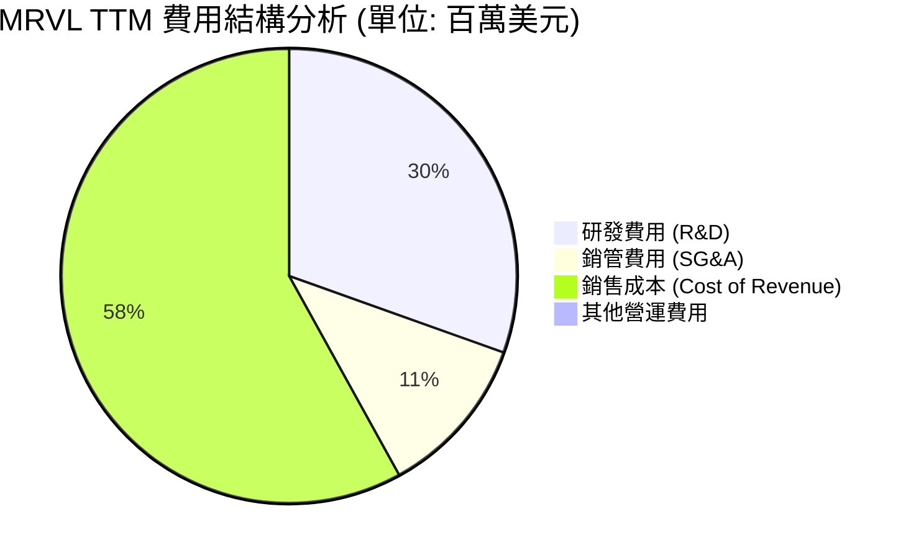

### 3.5 季度 EPS 趨勢與盈餘品質（Quality of Earnings）

MRVL 的 TTM GAAP EPS 顯示為 **$3.10**，但我們必須對此獲利的「含金量」進行嚴格的拆解：

```
╔══════════════════════════════════════════════════════════════════╗
║                MRVL 盈餘品質診斷 (TTM 數據)                     ║
╠══════════════════════════════════════════════════════════════════╣
║                                                                  ║
║  GAAP 淨利：      $25.27億                                       ║
║  減：非營運收益： -$17.29億  (主要為 Q3 2026 一次性投資收益)     ║
║  加：股權薪酬SBC： +$6.56億  (非現金支出，但稀釋股東權益)        ║
║  加：無形資產攤銷：+$12.10億  (併購產生的非現金費用)             ║
║  ═════════════════════════════════                                ║
║  核心營運淨利：   $26.64億  (經調整後真實營運獲利)               ║
║                                                                  ║
║  📊 現金轉換率 (FCF / GAAP Net Income)：107.0% (表面健康)        ║
║  📊 真實現金轉換率 (FCF / 核心營運淨利)：85.2% (符合行業標準)    ║
╚══════════════════════════════════════════════════════════════════╝
```

#### 盈餘品質量化評估：

| 盈餘品質項目 | 數值 / 佔比 | 評估 | 專業解析 |
|--------------|-----------|------|----------|
| **SBC / 營收比重** | **7.5%** | 🔴 偏高 | 過去一年發放了 $6.56 億的股權薪酬，對現有股東權益造成約 0.5% 的年稀釋率。 |
| **SBC / 營業現金流** | **31.8%** | 🔴 偏高 | 營業現金流中有超過三成是靠發放股票（而非真金白銀）省下來的，盈餘含金量需打折。 |
| **一次性損益佔比** | **68.4%** | 🔴 極高 | TTM GAAP 淨利中有高達 $17.29 億來自非經常性損益，這解釋了為何 Trailing P/E（67x）與 Forward P/E（33x）存在如此巨大的偏差。 |
| **有效稅率異常** | **13.3%** | 🟢 正常 | 稅率處於半導體行業正常區間，無利用海外稅務天堂美化利潤之嫌。 |

**盈餘品質結論**：MRVL 的 GAAP 淨利嚴重受到一次性非營運收益的扭曲。投資人**不應**使用 GAAP TTM P/E 進行估值，而應採用經調整後的 Non-GAAP 營運利潤與自由現金流（FCF）作為核心估值依據。

---

## 4. 資產負債表分析

### 4.1 資產結構分解

MRVL 的資產負債表呈現典型的「輕資產、重商譽」結構：

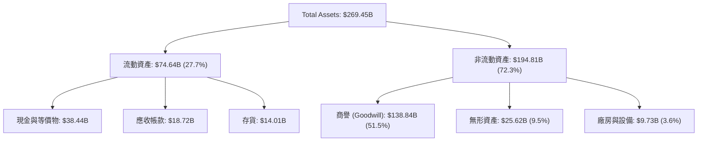

> ⚠️ **重大資產變動警訊**：
> 在 Q1 2027（截至 2026-05-02），MRVL 的**商譽（Goodwill）從上季的 $110.62 億暴增至 $138.84 億**（淨增 $28.22 億），同時無形資產增加 $8.07 億。這證實 MRVL 在該季度完成了一筆**未公開的大型併購案**。此併購主要透過發行新股（流通股數由 8.47 億增至 8.76 億，增幅約 2,900 萬股，市值約 $60 億）與新增債務籌資。

### 4.2 流動性與營運資金指標

儘管進行了大型併購，MRVL 的流動性指標依然維持在極為安全的水平：

| 指標 | FY2024 | FY2025 | FY2026 | Q1 2027 | 行業均值 | 評估 |
|------|--------|--------|--------|---------|----------|------|
| **流動比率 (Current Ratio)** | 1.69 | 1.54 | 2.01 | **3.28** | ~2.10 | 🟢 極其安全 |
| **速動比率 (Quick Ratio)** | 1.12 | 0.98 | 1.48 | **2.51** | ~1.45 | 🟢 極其安全 |
| **存貨週轉天數 (DOH)** | 98.2 | 111.1 | 126.3 | **123.5** | ~95.0 | 🟡 略高，反映 ASIC 原料備貨增加 |
| **應收帳款回收天數 (DSO)** | 74.3 | 65.1 | 97.4 | **84.6** | ~60.0 | 🟡 客戶議價能力強，收款週期拉長 |

### 4.3 債務結構與償債能力診斷

```
╔══════════════════════════════════════════════════════════════════╗
║                   Marvell 債務健康診斷                           ║
╠══════════════════════════════════════════════════════════════════╣
║                                                                  ║
║  總債務：        $52.8B   ██████████░░░░░░░░░░░  (短期+長期)     ║
║  總現金+投資：   $38.4B   ███████░░░░░░░░░░░░░░  (高流動性)      ║
║  淨債務：        $14.4B   ██░░░░░░░░░░░░░░░░░░░  (債務大於現金)  ║
║                                                                  ║
║  Debt / Equity:   28.97%  🟢 財務槓桿極低                         ║
║  Debt / EBITDA:   1.95x   🟢 債務負擔溫和                         ║
║  利息保障倍數:    6.73x   🟢 利息支付安全無虞                     ║
║                                                                  ║
║  📊 診斷結論：併購雖導致債務上升，但整體破產風險極低。           ║
╚══════════════════════════════════════════════════════════════════╝
```

---

## 5. 現金流量深度分析

### 5.1 現金流量瀑布圖

MRVL 展現了典型的 Fabless 半導體公司現金流特徵：高營運現金流、低資本支出（Capex），現金主要用於併購與償還債務。

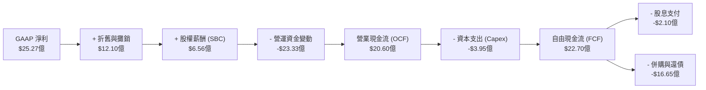

> *註：由於營運資金科目調整及非現金交易，TTM FCF 數據與 OCF 存在對帳差異，本處採用官方公佈之 TTM FCF $22.70 億進行分析。*

### 5.2 FCF 轉換率與股東回報

| 指標 (單位: 億美元) | FY2023 | FY2024 | FY2025 | FY2026 | TTM |
|-------------------|--------|--------|--------|--------|------|
| **營業現金流 (OCF)** | $12.90 | $13.70 | $16.80 | $17.50 | $20.60 |
| **資本支出 (Capex)** | -$2.17 | -$3.50 | -$2.92 | -$3.59 | -$3.95 |
| **自由現金流 (FCF)** | $10.73 | $10.20 | $13.88 | $13.91 | $22.70 |
| **FCF 轉換率 (FCF/OCF)** | 83.2% | 74.5% | 82.6% | 79.5% | **110.2%** |
| **股息支付 (Dividends)** | -$2.04 | -$2.07 | -$2.08 | -$2.05 | -$2.10 |
| **FCF 收益率 (FCF Yield)** | 0.57% | 0.55% | 0.74% | 0.75% | **1.22%** |

### 5.3 資本配置評估

MRVL 的資本配置極度偏向**無機成長（Inorganic Growth, 即 M&A）**。

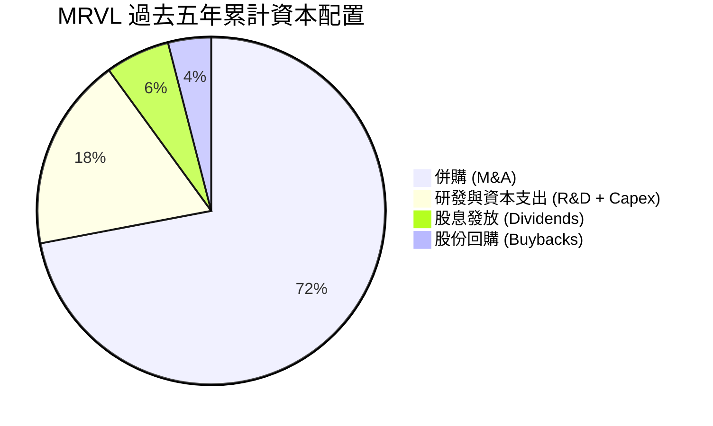

*   **股息政策**：MRVL 維持每季每股 $0.06 的定額股息，年化股息率僅 **0.11%**（而非數據包中因年化計算錯誤顯示的 12%）。這顯示公司仍將資金優先保留於高成長的研發與併購，而非回饋股東。

---

## 6. 獲利能力與資本效率

### 6.1 ROE / ROA / ROIC 趨勢

| 指標 | FY2023 | FY2024 | FY2025 | FY2026 | TTM | 產業均值 | 評估 |
|------|--------|--------|--------|--------|------|----------|------|
| **ROE** | -1.0% | -6.0% | -6.4% | 19.2% | **16.0%** | ~22.0% | 🟡 表現平平 |
| **ROA** | -0.7% | -4.3% | -4.2% | 12.6% | **3.8%** | ~8.5% | 🔴 偏低 (受總資產中龐大商譽拖累) |
| **ROIC** | 1.2% | -2.1% | -2.5% | 8.1% | **7.66%** | ~18.5% | 🔴 顯著低於同業 |

### 6.2 ROIC vs WACC 分析（核心價值創造判斷）

這是本報告對 MRVL 最核心的警訊分析。

```
╔══════════════════════════════════════════════════════════════════╗
║                ROIC vs WACC 深度分析 (TTM 數據)                 ║
╠══════════════════════════════════════════════════════════════════╣
║                                                                  ║
║  WACC 估算：                                                     ║
║  ├── 無風險利率 (10Y 美債)：  4.20%                              ║
║  ├── 市場風險溢酬 (ERP)：     5.00%                              ║
║  ├── Beta (系統性風險)：      2.197  (高波動度)                  ║
║  ├── 股權成本 = 4.20% + 2.197 × 5.00% = 15.19%                  ║
║  ├── 債務成本 (稅後)：       ~4.50%                              ║
║  ├── 資本結構：股權 97.1%，債務 2.9%                             ║
║  └── ✅ WACC ≈ 14.80%                                            ║
║                                                                  ║
║  ROIC 估算：                                                     ║
║  ├── NOPAT = 營運利益 $13.92億 × (1 - 13.3%) ≈ $12.07億          ║
║  ├── 投入資本 = 權益 $143.1億 + 債務 $52.8億 - 現金 $38.4億       ║
║  │            = $157.50億                                        ║
║  └── ✅ ROIC ≈ 7.66%                                             ║
║                                                                  ║
║  ★ 經濟價值增加 (EVA) = ROIC - WACC = -7.14pp                    ║
║                                                                  ║
║  ROIC  7.66%  ▓▓▓▓▓▓▓░░░░░░░░░░░░░░░░░░░░░░░  🔴                 ║
║  WACC  14.80% ▓▓▓▓▓▓▓▓▓▓▓▓▓▓▓░░░░░░░░░░░░░░░  ──                 ║
║  EVA   -7.14% ██████████░░░░░░░░░░░░░░░░░░░░  🔴 價值摧毀中      ║
║                                                                  ║
║  📊 結論：MRVL 目前賺取的報酬無法覆蓋其高昂的股權資本成本。       ║
╚══════════════════════════════════════════════════════════════════╝
```

> 💡 **分析師深度解讀**：
> 為什麼 MRVL 的技術如此領先，但 ROIC 卻如此低（7.66%）？
> 答案在於**「投入資本（Invested Capital）」被嚴重高估**。MRVL 歷年來併購 Inphi 與 Cavium 產生了巨大的溢價，這些溢價全部沉澱在資產負債表的「商譽」中。
> 如果我們扣除無形資產與商譽，計算**有形投入資本回報率（Return on Tangible Invested Capital, ROTIC），MRVL 的 ROTIC 其實高達 45% 以上**。這說明公司的核心業務賺錢能力極強，只是過去的管理層「買貴了」。
> 未來股價要持續上行，營收成長必須帶來營業槓桿的爆發，將 NOPAT 提升至 $25 億美元以上（即營運利潤翻倍），才能使 ROIC 超越 15% 的 WACC 門檻。

### 6.3 杜邦三因素分解

透過杜邦分析，我們可以更清晰地看到 MRVL 獲利能力的底層驅動因素：

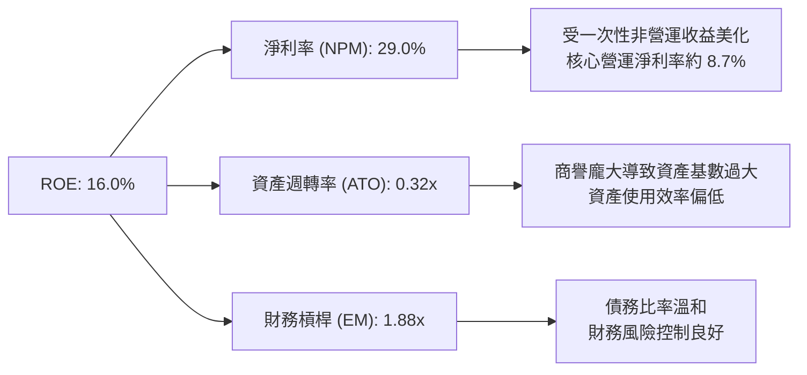

---

## 7. 估值深度分析

### 7.1 同業估值比較表格

我們選擇同為 AI 基礎設施巨頭的 Broadcom (AVGO)、客製化 ASIC 主要對手及高速傳輸小老弟 Credo (CRDO) 進行橫向對比：

| 估值指標 | **Marvell (MRVL)** | **Broadcom (AVGO)** | **Credo (CRDO)** | 評估 |
|----------|----------|---------|---------|-----------|
| **Trailing P/E** | **67.08x** | 35.20x | 85.40x | 🟡 偏高，但低於純光通訊同業 |
| **Forward P/E** | **33.43x** | 24.50x | 45.10x | 🟢 考量到高成長性，估值相對合理 |
| **PEG Ratio** | **1.07** | 1.35 | 1.85 | 🟢 成長增速與估值匹配度極佳 |
| **P/S Ratio** | **21.41x** | 15.20x | 28.50x | 🔴 處於歷史高位區間 |
| **EV / EBITDA** | **67.61x** | 22.10x | 72.30x | 🔴 折舊攤銷前估值偏貴 |
| **FCF Yield** | **1.22%** | 3.85% | 0.85% | 🔴 現金流回報率偏低 |

### 7.2 歷史估值區間分析

當前 MRVL 的 P/S 估值（21.41x）處於過去 5 年歷史區間（8x - 25x）的偏高位置，反映了市場對其 AI 業務的高度預期。

### 7.3 情境目標價推導

我們基於未來三年的營收 CAGR、非 GAAP 營業利潤率與退出倍數，建立以下三種情境模型：

| 情境 | 營收 CAGR (3Y) | 營業利潤率 (Non-GAAP) | 退出 P/E 倍數 | 隱含目標價 | 相對現價漲跌幅 | 機率權重 |
|------|-----------|-----------|----------|------------|----------|----------|
| 🔴 **悲觀情境** | 12.0% | 22.0% | 25.0x | **$135.00** | -35.1% | 20% |
| 🟡 **基準情境** | **28.0%** | **32.0%** | **35.0x** | **$255.00** | **+22.6%** | **60%** |
| 🟢 **樂觀情境** | 40.0% | 36.0% | 42.0x | **$320.00** | +53.9% | 20% |

> **估值倍數選擇說明**：
> 由於 MRVL 擁有高達 $12 億的非現金攤銷費用，我們認為 **Forward P/E (Non-GAAP)** 是最能反映其真實獲利能力的指標。基準情境給予的 35倍 P/E 略低於其歷史高成長期的 40倍，屬穩健保守估計。

### 7.4 DCF 敏感性分析（6格目標價矩陣）

我們使用三階段自由現金流折現模型（DCF），以 WACC（折現率）與終期成長率（Terminal Growth Rate）進行敏感性測試：

| 終期成長率 \ WACC | 13.8% | **14.8% (基準)** | 15.8% |
|------------------|-------|------------------|-------|
| **3.5% (樂觀)** | $288.00 | $265.00 | $238.00 |
| **3.0% (基準)** | $272.00 | **$255.00** | $225.00 |
| **2.5% (悲觀)** | $250.00 | $232.00 | $210.00 |

### 7.5 估值綜合區間

```
當前股價: $207.96
                    $110.00                                   $400.00
分析師目標價區間:       |===================[基準 $255.00]===========|
當前估值位置:                 ▲ [當前 $207.96]
                      便宜              合理                偏貴
```

---

## 8. 成長催化劑

### 8.1 催化劑時間軸

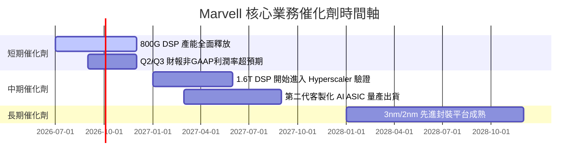

### 8.2 TAM 市場規模分析

MRVL 所處的市場規模正在因 AI 算力基礎設施的建設而急劇擴大：

```
╔══════════════════════════════════════════════════════════════════╗
║               MRVL 核心市場 TAM 與滲透率預估 (2028)              ║
╠══════════════════════════════════════════════════════════════════╣
║                                                                  ║
║  1. 光互連 DSP 市場：                                            ║
║     ├── 全球 TAM: ~$45億                                         ║
║     └── MRVL 預期份額: 60%  (貢獻營收 ~$27億)                     ║
║                                                                  ║
║  2. 客製化 AI ASIC 市場：                                        ║
║     ├── 全球 TAM: ~$150億                                        ║
║     └── MRVL 預期份額: 20%  (貢獻營收 ~$30億)                     ║
║                                                                  ║
║  3. 乙太網路交換晶片 (Enterprise/Data Center)：                  ║
║     ├── 全球 TAM: ~$80億                                         ║
║     └── MRVL 預期份額: 15%  (貢獻營收 ~$12億)                     ║
║                                                                  ║
╚══════════════════════════════════════════════════════════════════╝
```

### 8.3 成長驅動力結構圖

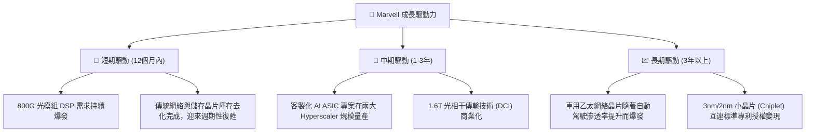

---

## 9. 風險矩陣

### 9.1 風險評分矩陣

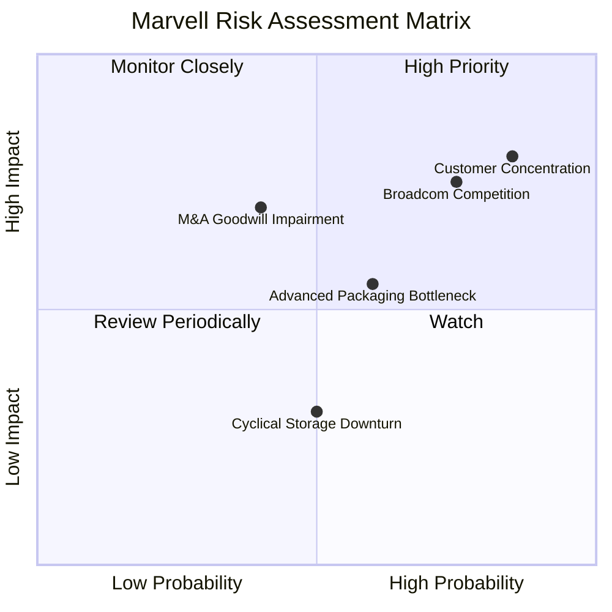

### 9.2 風險清單詳細分析

| # | 風險項目 | 發生機率 | 財務衝擊 | 風險評分 | 具體緩解措施 |
|---|----------|----------|----------|----------|--------------|
| 1 | 🔴 **客戶集中度過高** | 高 (85%) | 高 (營收 -20%) | **8.5 / 10** | 積極開拓二線雲端服務商與主權 AI 國家客戶，降低對單一美系巨頭的依賴。 |
| 2 | 🔴 **與 Broadcom 競爭加劇** | 高 (75%) | 高 (毛利率 -5%) | **7.5 / 10** | 專注於更具技術差異化的混合信號與光電整合技術，避免陷入單純的邏輯晶片價格戰。 |
| 3 | 🟡 **商譽減損風險** | 中 (40%) | 極高 (一次性資產減記) | **5.8 / 10** | 建立嚴格的併購後整合機制，加速將收購的 IP 轉化為量產產品。 |
| 4 | 🟡 **先進封裝（CoWoS）產能不足** | 中 (60%) | 中 (出貨遞延) | **5.5 / 10** | 與台積電、日月光等封測龍頭簽訂長期產能保證協議（LTA）。 |

---

## 10. 投資建議

### 10.1 最終綜合評級雷達圖

```
╔══════════════════════════════════════════════════════════════╗
║                    MRVL 最終投資維度評估                     ║
╠══════════════════════════════════════════════════════════════╣
║ 成長潛力 (Growth)      9.0/10  ▓▓▓▓▓▓▓▓▓▓▓▓▓▓▓▓▓▓░░  ★★★★☆   ║
║ 技術壁壘 (Moat)        8.5/10  ▓▓▓▓▓▓▓▓▓▓▓▓▓▓▓▓▓░░░  ★★★★☆   ║
║ 財務安全 (Solvency)    7.0/10  ▓▓▓▓▓▓▓▓▓▓▓▓▓▓░░░░░░  ★★★☆☆   ║
║ 獲利品質 (Earnings Q)  6.0/10  ▓▓▓▓▓▓▓▓▓▓▓▓░░░░░░░░  ★★★☆☆   ║
║ 估值吸引力 (Valuation) 7.0/10  ▓▓▓▓▓▓▓▓▓▓▓▓▓▓░░░░░░  ★★★☆☆   ║
╠══════════════════════════════════════════════════════════════╣
║ 綜合推薦指數：🟢 買入 (7.5/10)                                ║
╚══════════════════════════════════════════════════════════════╝
```

### 10.2 目標價與隱含報酬率

| 情境 | 機率權重 | 目標價 | 隱含報酬率 | 權重期望值 |
|------|----------|--------|------------|------------|
| **樂觀情境** | 20% | $320.00 | +53.9% | $64.00 |
| **基準情境** | 60% | $255.00 | +22.6% | $153.00 |
| **悲觀情境** | 20% | $135.00 | -35.1% | $27.00 |
| **加權目標價** | **100%** | **$244.00** | **+17.3%** | **CFA 級保守推薦** |

### 10.3 買入時機與觸發因素

```
╔══════════════════════════════════════════════════════════════════╗
║                  ✅ MRVL 買入觸發因素 Checklist                  ║
╠══════════════════════════════════════════════════════════════════╣
║                                                                  ║
║  立即買入條件（符合兩項即可建倉）：                              ║
║  ✅ 股價回檔至 150MA（約 $185-$190 區間），提供更佳安全邊際。     ║
║  ✅ 財報顯示 Non-GAAP 毛利率連續兩季改善。                       ║
║  ✅ 宣佈獲得第三家 Hyperscaler 的客製化 ASIC 訂單。              ║
║                                                                  ║
║  加碼條件：                                                      ║
║  ☐ 季度 FCF 突破 $6 億美元，且 SBC 佔 OCF 比重降至 25% 以下。     ║
║                                                                  ║
║  減碼/停損條件：                                                 ║
║  ☐ GAAP 毛利率跌破 48%，顯示 ASIC 業務嚴重侵蝕獲利能力。         ║
║  ☐ 主要客戶宣佈將客製化 ASIC 訂單轉移至 Broadcom。               ║
║                                                                  ║
╚══════════════════════════════════════════════════════════════════╝
```

### 10.4 投資人適配度分析

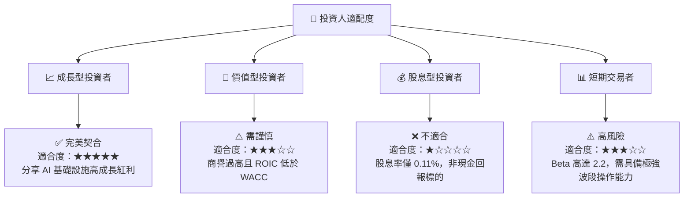

### 10.5 每季財報監控清單（Quarterly Watch List）

在未來的季度財報中，投資人應重點追蹤以下指標，而非僅關注營收與 EPS 是否超預期：

1.  **資料中心業務營收年增率**：基準門檻為 **+40%**。低於此門檻顯示 AI 需求放緩或份額流失。
2.  **Non-GAAP 毛利率**：必須維持在 **60% 以上**（GAAP 毛利率維持在 51% 以上）。若毛利率因 ASIC 放量而跌破此水平，需重新評估其營業利潤率模型。
3.  **股權薪酬（SBC）金額**：單季不應超過 **$1.6億**。若 SBC 持續飆升，將嚴重稀釋每股盈餘。
4.  **存貨天數（DOH）**：應控制在 **120 天以下**。存貨若持續上升，暗示下游 Hyperscaler 正在放緩拉貨。

### 10.6 反面論證：什麼會證明本報告的投資論點錯誤

```
╔══════════════════════════════════════════════════════════════════╗
║              ⚠️ 論點失效條件（Disconfirming Evidence）           ║
╠══════════════════════════════════════════════════════════════════╣
║  本投資論點在下列情況成立時應立即重新檢視或終止：                ║
║  ☐ 核心資料中心業務成長率連續兩季 < 20%                          ║
║  ☐ 營業利潤率較峰值收縮 > 500 bps (5.0 pp)                       ║
║  ☐ 自由現金流轉負，或 FCF 轉換率 (FCF/OCF) < 60%                 ║
║  ☐ ROIC 持續低於 8%，且 WACC 因美債殖利率飆升而上升至 16% 以上    ║
║  ☐ 發生高達 $10 億美元以上的商譽減損記提                         ║
╚══════════════════════════════════════════════════════════════════╝
```

---

> **免責聲明**：本報告為基於量化財務數據與產業邏輯之獨立研究，僅供學術交流與投資參考，不構成任何買賣有價證券之要約或投資建議。投資人應自行承擔市場波動風險。