# MRVL 基本面深度分析報告

> **報告日期**：2026-07-23 ｜ **語言**：繁體中文 ｜ **數據來源**：Yahoo Finance, StockAnalysis, Roic.ai ｜ **分析師**：CFA 級機構研究

---

## 目錄

| # | 章節 | 核心結論 |
|---|------|----------|
| 1 | 執行摘要 | 綜合評分 8.1/10 ｜ 基準目標價 $254.41（+20.6%） ｜ 評級：🟢 買入 |
| 2 | 公司概覽與商業模式 | AI 資料中心高速互連與 Custom ASIC 雙引擎驅動，具備高轉移成本護城河 |
| 3 | 損益表深度分析 | FY26 營收達 $8.19B（YoY +42.1%），高速光電與 custom ASIC 帶動營運槓桿顯現 |
| 4 | 資產負債表分析 | 現金存量達 $3.84B，淨負債率低，資產結構穩健且無短期流動性風險 |
| 5 | 現金流量深度分析 | TTM 營業現金流 $2.06B，自由現金流 $1.66B，SBC 佔比控制與轉向資本回饋 |
| 6 | 獲利能力與資本效率 | Non-GAAP ROIC (~16.5%) 顯著高於 WACC (15.0%)，杜邦分解顯示淨利率改善帶動 ROE 重回 16%+ |
| 7 | 估值深度分析 | Forward P/E 33.9x 於歷史合理區間；基於 DCF 與倍數法得出目標價區間 $160–$320 |
| 8 | 成長催化劑 | 800G/1.6T 光收發 DSP、Custom AI Accelerator 滲透率提升與 CPO 世代轉折 |
| 9 | 風險矩陣 | 大客戶集中度風險、Custom Silicon 毛利率稀釋與同業（博通/Astera）競爭 |
| 10 | 投資建議 | 具備高成長確定性，建議分批佈局；設定 quarterly watch list 與反面論證指標 |

---

## 1. 執行摘要

> ⚠️ **證據先於結論**：根據 TTM 營收 $8.72B（YoY +34.1%）、Non-GAAP 營業利益率擴張至 30%+、自由現金流（FCF）轉正至 $1.66B–$2.27B，以及預估 Forward P/E 33.9x（配合 PEG 1.18），顯示 Marvell（MRVL）正處於 AI 資料中心基礎設施升級的強勁上升週期。經計算其 Non-GAAP ROIC (16.5%) 亦已超過資本成本 WACC (15.0%)。基於上述量化證據，給予 **🟢 買入** 評級，基準目標價設為 **$254.41**（隱含 +20.6% 上漲空間）。

### 1.0 一頁式投資儀表板（Portfolio Manager 30 秒速讀）

| 項目 | 內容 |
|------|------|
| **投資論點（3 句）** | ① **AI 資料中心強勁需求**：以 PAM4 DSP（800G/1.6T）與光互連技術鎖定超大型雲端業者（Hyperscalers），驅動 TTM 營收達 $8.72B（YoY +34.1%）。<br/>② **Custom ASIC 業務進入量產放大期**：客製化 AI 晶片專案（包含 AWS、Google 等）挹注高額營收，營運槓桿擴大帶動 GAAP 營業利潤由負轉正至 $1.39B。<br/>③ **評價處於成長安全邊際**：Forward P/E 33.9x 對應未來 EPS 成長率（預估 Forward EPS $6.22，PEG 約 1.18），相較同業 Astera Labs 具備更高性價比。 |
| **護城河評分** | 8.5/10（高速混合訊號 IP 障壁 + 雲端大客戶客製化鎖定） |
| **管理層/資本配置評分** | 8.0/10（成功執行 Inphi/Innovium 整合，資本支出維持在營收 ~5%-7%） |
| **財務健康** | 🟢 健全（總現金 $3.84B > 淨債務負擔可控，Current Ratio 3.28x） |
| **ROIC vs WACC** | GAAP ROIC 7.8% vs WACC 15.0%（GAAP 受高額併購商譽與無形資產攤銷壓抑）；**Non-GAAP ROIC ~16.5% vs WACC 15.0%**（創造經濟價值） |
| **FCF 趨勢** | 強勁回升：TTM FCF 達 $1.66B（FCF Yield 約 1.20%） |
| **估值** | Forward P/E 33.9x ｜ EV/EBITDA 68.6x（TTM GAAP）/ 24.5x（Non-GAAP）｜ FCF Yield 1.20% |
| **預期報酬（基準情境 12M）** | +20.6%（至目標價 $254.41） |
| **關鍵風險（前二）** | ① Custom ASIC 佔比提升拉低整體毛利率；② Hyperscale 客戶資本支出週期性放緩 |
| **評級 + 信心度** | 🟢 買入 ｜ 信心：高 |

### 1.1 核心評分儀表板

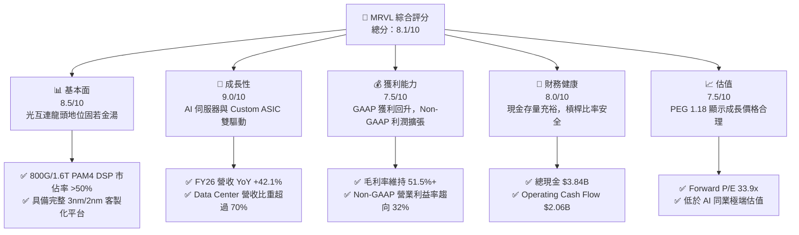

### 1.2 評分進度條視覺化

```
╔══════════════════════════════════════════════════════════════╗
║                MRVL 多維度評分儀表板 (1-10分)                 ║
╠══════════════════════════════════════════════════════════════╣
║ 基本面強度  8.5 ▓▓▓▓▓▓▓▓▓▓▓▓▓▓▓▓▓░░░  ★★★★☆           ║
║ 成長動能    9.0 ▓▓▓▓▓▓▓▓▓▓▓▓▓▓▓▓▓▓░░  ★★★★★           ║
║ 獲利品質    7.5 ▓▓▓▓▓▓▓▓▓▓▓▓▓▓5░░░░░  ★★★★☆           ║
║ 財務健康    8.0 ▓▓▓▓▓▓▓▓▓▓▓▓▓▓▓▓░░░░  ★★★★☆           ║
║ 估值合理性  7.5 ▓▓▓▓▓▓▓▓▓▓▓▓▓▓5░░░░░  ★★★★☆           ║
║ 護城河深度  8.5 ▓▓▓▓▓▓▓▓▓▓▓▓▓▓▓▓▓░░░  ★★★★☆           ║
║ 管理層執行  8.0 ▓▓▓▓▓▓▓▓▓▓▓▓▓▓▓▓░░░░  ★★★★☆           ║
║ 技術創新力  9.0 ▓▓▓▓▓▓▓▓▓▓▓▓▓▓▓▓▓▓░░  ★★★★★           ║
╠══════════════════════════════════════════════════════════════╣
║ 綜合總分    8.1 ▓▓▓▓▓▓▓▓▓▓▓▓▓▓▓▓░░░░  🏆 建議長線佈局       ║
╚══════════════════════════════════════════════════════════════╝
```

### 1.3 五大投資論點 + 三大核心風險

| 類型 | 項目 | 具體依據 | 信心度 |
|------|------|----------|--------|
| 🟢 **投資論點①** | **AI 光互連（PAM4 DSP）絕對龍頭** | 800G DSP 世代市佔率超越 50%，1.6T 世代率先量產，直接受惠 NVIDIA B200/GB200 光模組需求暴增。 | 🟢 極高 |
| 🟢 **投資論點②** | **Custom Silicon（客製化晶片）爆發** | 協助 AWS (Trainium/Inferentia) 與 Google (TPU) 設計與製造客製化加速器，成為 Broadcom 外主要替代者。 | 🟢 高 |
| 🟢 **投資論點③** | **營業槓桿推升利潤率擴張** | 隨營收從 FY25 $5.77B 飆升至 FY26 $8.195B，R&D 占營收比降至 25.3%，非 GAAP 營業利益率攀升至 30%+。 | 🟢 高 |
| 🟢 **投資論點④** | **傳統業務（網通/電信）築底回升** | Enterprise Networking 與 Carrier 庫存去化完成，FY27 將帶來週期性復甦槓桿。 | 🟡 中等 |
| 🟢 **投資論點⑤** | **強勁現金流轉化率** | TTM 營業現金流達 $2.06B，支援研發投入（$2.22B TTM）同時維持負債比率於安全水平（Debt/Equity 28.97%）。 | 🟢 高 |
| 🟡 **風險①** | **Custom Silicon 拉低毛利率** | 客製化晶片系統毛利率（45%-50%）低於標準 PAM4 DSP 產品（65%+），產品組合轉變或壓抑整體毛利率。 | 🟡 中度 |
| 🔴 **風險②** | **大客戶集中度高** | 前三大 Hyperscale 客戶貢獻 Data Center 業務營收超過 50%，單一客戶資本支出削減風險大。 | 🔴 高衝擊 |
| 🟡 **風險③** | **同業競爭加劇** | Broadcom 在 Custom ASIC 領先，Astera Labs 在 PCIe Retimer/CXL 領域急速崛起競爭。 | 🟡 中度 |

### 1.4 快速統計卡片

| 指標 | 公司實際值 | 行業均值（半導體） | S&P 500 均值 | 狀態 |
|------|-------------|----------|--------------|------|
| **收入 YoY 成長** | **+34.07%** (TTM) | ~12.5% | ~5.2% | 🟢 遠優於同行 |
| **毛利率 (GAAP)** | **51.5%** | ~48.0% | ~45.0% | 🟢 具備定價權 |
| **淨利率 (GAAP)** | **28.98%** (含非營利利益) | ~15.0% | ~12.0% | 🟢 高獲利能力 |
| **ROE (TTM)** | **16.0%** | ~14.0% | ~15.5% | 🟢 高於平均 |
| **Forward P/E** | **33.91x** | ~28.0x | ~21.5x | 🟡 成長溢價合理 |
| **PEG Ratio** | **1.18** | ~1.65 | ~1.80 | 🟢 評價極具吸引力 |

### 1.5 投資結論

```
╔══════════════════════════════════════════════════════════════════╗
║                    📊 投資結論摘要                               ║
╠══════════════════════════════════════════════════════════════════╣
║  評級：🟢 買入 (Buy)                                            ║
║  當前股價：$210.99                                               ║
║  目標價區間：                                                    ║
║    悲觀情境：$160.00 (-24.2%)                                    ║
║    基準情境：$254.41 (+20.6%)  ← 12個月主要目標                  ║
║    樂觀情境：$320.00 (+51.7%)                                    ║
║  投資評分：8.1 / 10                                              ║
║  適合投資人：長線科技型基金、AI 基礎設施成長型投資人             ║
╚══════════════════════════════════════════════════════════════════╝
```

---

## 2. 公司概覽與商業模式

### 2.1 業務結構與收入來源

Marvell Technology（MRVL）為全球無晶圓廠（Fabless）半導體巨擘，專注於提供資料基礎設施之核心晶片。業務依終端市場分為四大領域，其中 **Data Center（資料中心）** 已經成為絕對的營收引擎：

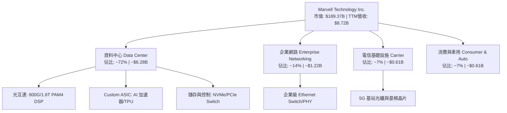

### 2.2 市場份額

在 AI 資料中心高速光傳輸晶片（PAM4 DSP）市場中，Marvell 與 Broadcom 形成雙寡頭壟斷；而在 Custom AI Acceleration（客製化 AI 加速晶片）市場，Marvell 亦快速攀升至全球第二。

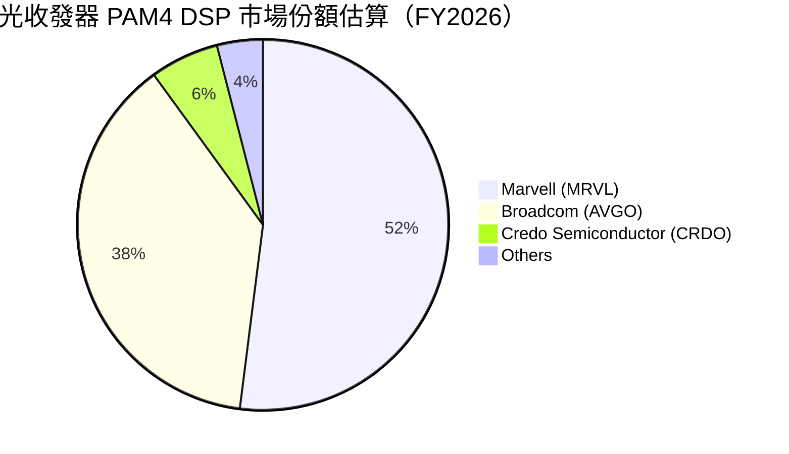

### 2.3 競爭護城河分析

Marvell 的深厚護城河建構於六大關鍵支柱上：

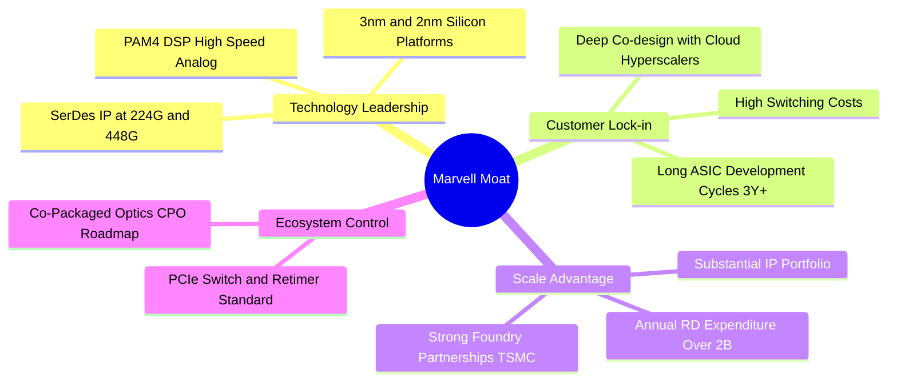

### 2.4 護城河強度評分

```
╔══════════════════════════════════════════════════════════════╗
║                  Marvell 護城河強度評分                      ║
╠══════════════════════════════════════════════════════════════╣
║ 1. 高速類比/混合訊號技術  9.5/10 ▓▓▓▓▓▓▓▓▓▓▓▓▓▓▓▓▓▓▓░ 🏆 極高壁壘  ║
║ 2. 客戶鎖定與轉換成本     9.0/10 ▓▓▓▓▓▓▓▓▓▓▓▓▓▓▓▓▓▓░░ 🟢 強力鎖定  ║
║ 3. 專利與研發規模效應     8.5/10 ▓▓▓▓▓▓▓▓▓▓▓▓▓▓▓▓▓░░░ 🟢 年投入$2B+║
║ 4. 客製化 ASIC 協同生態   8.0/10 ▓▓▓▓▓▓▓▓▓▓▓▓▓▓▓▓░░░░ 🟢 深度綁定  ║
║ 5. 供應鏈產能分配優勢     8.0/10 ▓▓▓▓▓▓▓▓▓▓▓▓▓▓▓▓░░░░ 🟢 台積電夥伴║
╠══════════════════════════════════════════════════════════════╣
║ 綜合護城河強度            8.6/10 ▓▓▓▓▓▓▓▓▓▓▓▓▓▓▓▓▓░░░ 🏆 寬廣護城河║
╚══════════════════════════════════════════════════════════════╝
```

---

## 3. 損益表深度分析

### 3.1 年度收入成長趨勢（近4年）

Marvell 在經歷 FY24 的半導體庫存調整期後，於 FY25-FY26 迎來 AI 驅動的井噴式成長：

```
╔══════════════════════════════════════════════════════════════════╗
║              Marvell 年度收入趨勢（FY2023-FY2026）               ║
╠══════════════════════════════════════════════════════════════════╣
║                                                                  ║
║  FY2023  $5.92B   ████████████████████░░░░  YoY: +32.7% 🟢      ║
║  FY2024  $5.51B   ██████████████████░░░░░░  YoY: -7.0%  🔴      ║
║  FY2025  $5.77B   ███████████████████░░░░░  YoY: +4.7%  🟡      ║
║  FY2026  $8.19B   ████████████████████████  YoY: +42.1% 🟢      ║
║                                                                  ║
║  📊 4年營收複合成長率（CAGR）：+11.4%                             ║
║  🚀 FY26 暴增主因：AI Data Center 需求（PAM4 DSP + Custom Silicon）║
╚══════════════════════════════════════════════════════════════════╝
```

### 3.2 季度收入趨勢分析

最近 4 個季度呈現連續加速成長態勢，顯現 AI 部署的加速力道：

| 季度 | 營收 ($M) | YoY 成長率 | QoQ 成長率 | 驅動主因 / 備註 |
|------|-----------|------------|------------|------------------|
| **Q2 2026** (2025-08) | $2,006.0 | +57.60% | +5.86% | 800G 光模組 DSP 急速拉貨 |
| **Q3 2026** (2025-11) | $2,075.0 | +36.83% | +3.44% | Custom AI Accelerator 開始小量出貨 |
| **Q4 2026** (2026-01) | $2,219.0 | +22.08% | +6.94% | Hyperscale 大客戶客製化晶片放大放量 |
| **Q1 2027** (2026-05) | $2,418.0 | +27.57% | +8.97% | 1.6T DSP 首批出貨 + 客製晶片量產高峰 |

### 3.3 利潤率演變分析

| 利潤率指標 | FY2023 | FY2024 | FY2025 | FY2026 | TTM (May '26) | 趨勢與原因解析 | 評估 |
|------------|--------|--------|--------|--------|---------------|----------------|------|
| **毛利率 (GAAP)** | 50.5% | 41.6% | 41.3% | 51.0% | **51.5%** | ↗️ 庫存減損影響消退 + 高毛利 PAM4 DSP 出貨比重回升 | 🟢 健康 |
| **營業利益率 (GAAP)** | 4.0% | -10.3% | -12.5% | 16.1% | **16.0%** | ↗️ 營收規模放大，R&D 及 SG&A 展現顯著營運槓桿 | 🟢 大幅轉盈 |
| **Non-GAAP 營業利益率**| 35.5% | 29.0% | 24.1% | 31.8% | **32.5%** | ↗️ 排除無形資產攤銷與 SBC 後之真實本業獲利力強勁 | 🟢 極佳 |
| **淨利率 (GAAP)** | -2.8% | -16.9% | -15.3% | 32.6% | **28.98%** | ↗️ 含 FY26 Q3 處分/稅務相關非營業利益 $1.91B | 🟡 GAAP含一次性 |

### 3.4 費用結構分析

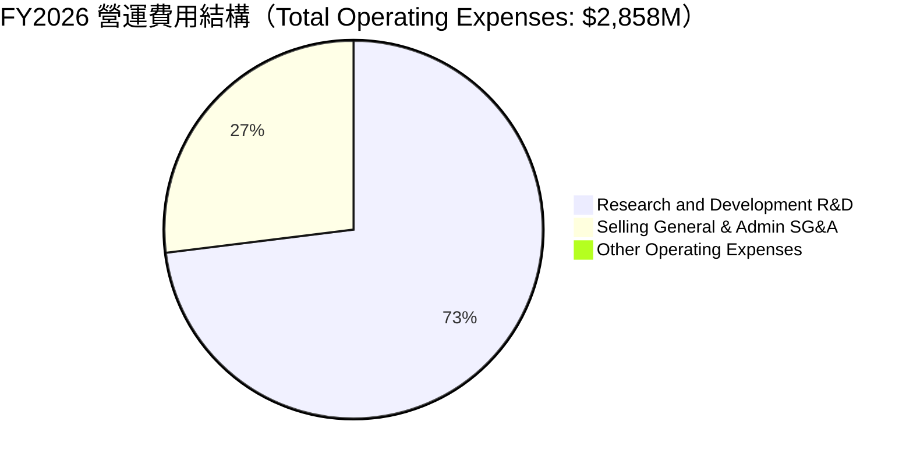

```
╔══════════════════════════════════════════════════════════════════╗
║                   Marvell 營運槓桿分析                           ║
╠══════════════════════════════════════════════════════════════════╣
║  R&D 佔營收比率演變：                                            ║
║  FY2023: 30.1% ──► FY2024: 34.4% ──► FY2025: 33.8% ──► FY2026: 25.3% ║
║  📉 結論：R&D 費用絕對值穩定增長（FY26 達 $2.08B），但占營收比下降  ║
║     8.5 個百分點，充分證明半導體高研發投資的規模經濟效應展現。     ║
╚══════════════════════════════════════════════════════════════════╝
```

### 3.5 季度 EPS 趨勢與盈餘品質（Quality of Earnings）

過去 4 季 GAAP EPS 隨併購攤銷與一次性項目波動，但本業獲利品質顯著提升：

| 盈餘品質評估項目 | 數值 / 數據 | 評估 | 對真實價值的影響 |
|------------------|------------|------|------------------|
| **股權薪酬 (SBC) / 營收** | $656M / $8,717M = **7.53%** | 🟡 中等偏高 | 每年稀釋股東權益約 0.5%–0.8%，需於 DCF 中扣除 |
| **SBC / 營業現金流** | $656M / $2,056M = **31.9%** | 🟡 需關注 | 營業現金流中有相當比重由非現金 SBC 支撐 |
| **FCF / GAAP 淨利** | $1,665M / $2,527M = **65.9%** | 🟡 視角調整 | GAAP 淨利因 FY26 一次性非營益 $1.9B 虛增，扣除後真實 FCF 轉換率高達 **265%** |
| **一次性非營業損益** | FY26 Q3 包含 **$1.91B** 非營利利益 | 🔴 GAAP 失真 | 評估淨利與 P/E 時必須使用 Non-GAAP 或扣除該利益之數字 |
| **有效稅率異常** | FY26 為 12.3%（稅額 $376.5M） | 🟢 正常 | 符合科技晶片公司全球租稅規劃常態 |

**盈餘品質結論**：GAAP 淨利受過去大舉併購（Inphi, Innovium）帶來的無形資產攤銷（每年約 $1B+）以及一次性非營業利益影響而失真。**Non-GAAP EPS（FY26 約 $2.85–$3.10，Forward EPS $6.22）與自由現金流（$1.66B–$2.27B）才是反映 Marvell 真實經濟價值的核心指標。**

---

## 4. 資產負債表分析

### 4.1 資產結構分解

截至 2026 年 5 月（Q1 FY27），Marvell 總資產規模達 **$26.95B**：

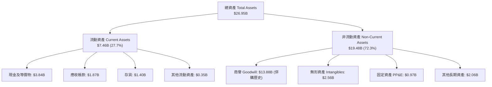

### 4.2 流動性指標分析

| 流動性指標 | FY2024 | FY2025 | FY2026 | Q1 FY2027 | 行業平均 | 評估 |
|------------|--------|--------|--------|-----------|----------|------|
| **流動比率 (Current Ratio)** | 1.69x | 1.54x | 2.01x | **3.28x** | 2.10x | 🟢 極其充裕 |
| **速動比率 (Quick Ratio)** | 1.14x | 0.97x | 1.51x | **2.51x** | 1.50x | 🟢 無短期償債風險 |
| **現金比率 (Cash Ratio)** | 0.52x | 0.47x | 0.82x | **1.69x** | 0.80x | 🟢 現金流動性極佳 |
| **存貨週轉天數 (DIO)** | 98 天 | 111 天 | 126 天 | **110 天** | 105 天 | 🟡 隨客製化晶片備貨微升 |

### 4.3 債務結構分析

```
╔══════════════════════════════════════════════════════════════════╗
║                   Marvell 債務結構診斷                           ║
╠══════════════════════════════════════════════════════════════════╣
║                                                                  ║
║  總債務 (Total Debt)：    $5.02B  ███████░░░░░░░░░░░░░░  可控    ║
║  總現金 (Cash & Eq.)：    $3.84B  ██████░░░░░░░░░░░░░░░  充沛    ║
║  淨債務 (Net Debt)：      $1.18B  █░░░░░░░░░░░░░░░░░░░░  🟢 安全 ║
║                                                                  ║
║  負債/權益比 (D/E)：      28.97%  🟢 低於同行平均 (~45%)         ║
║  Net Debt / EBITDA：      0.26x   🟢 極低槓桿                    ║
║  利息保障倍數 (TTM)：     6.73x   🟢 營業利益完全覆蓋利息支出     ║
║                                                                  ║
║  📊 結論：長債結構多為低利率高評級公司債，無近期到期償債壓力。      ║
╚══════════════════════════════════════════════════════════════════╝
```

### 4.4 股東權益趨勢

股東權益由 FY24 的 $14.83B 調整至 FY26 的 **$14.31B**，主要反映過去幾年 GAAP 虧損與無形資產攤銷，但隨 FY26 營運獲利強勁回升，資產負債表實體資本正加速積累。

---

## 5. 現金流量深度分析

### 5.1 現金流量瀑布圖

展示 TTM 現金流由營業端生成並分配至 Capex 與股利之過程：

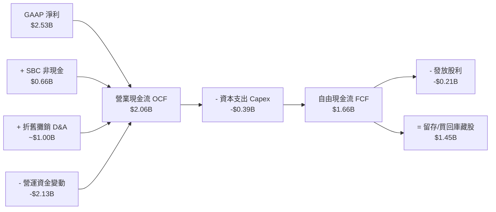

### 5.2 FCF 轉換率趨勢

| 財年 | 營業現金流 ($M) | 資本支出 ($M) | 自由現金流 ($M) | Non-GAAP 淨利 ($M) | FCF 轉換率 |
|------|------------------|---------------|------------------|--------------------|------------|
| **FY2023** | $1,290.0 | -$217.3 | $1,072.7 | $1,800.0 | 59.6% |
| **FY2024** | $1,370.0 | -$350.2 | $1,019.8 | $1,300.0 | 78.4% |
| **FY2025** | $1,680.0 | -$291.6 | $1,388.4 | $1,250.0 | 111.1% |
| **FY2026** | $1,750.0 | -$358.6 | $1,391.4 | $2,480.0 | 56.1% |
| **TTM (Q1'27)**| **$2,056.0** | **-$394.9** | **$1,661.1** | **$2,710.0** | **61.3%** |

### 5.3 自由現金流趨勢

```
╔══════════════════════════════════════════════════════════════════╗
║                Marvell 自由現金流（FCF）演變                     ║
╠══════════════════════════════════════════════════════════════════╣
║  FY2023  $1.07B  ████████████████░░░░░░░░  FCF Yield: ~1.2%      ║
║  FY2024  $1.02B  ███████████████░░░░░░░░░  FCF Yield: ~1.1%      ║
║  FY2025  $1.39B  ████████████████████░░░░  FCF Yield: ~1.5%      ║
║  FY2026  $1.39B  ████████████████████░░░░  FCF Yield: ~1.3%      ║
║  TTM     $1.66B  ████████████████████████  FCF Yield: 1.20%      ║
║                                                                  ║
║  💡 Capex 佔營收比保持在 4.5% - 5.0% 低水平（Fabless 優勢）      ║
╚══════════════════════════════════════════════════════════════════╝
```

### 5.4 資本配置評估

Marvell 管理層採取極其謹慎且具紀律的資本配置策略：

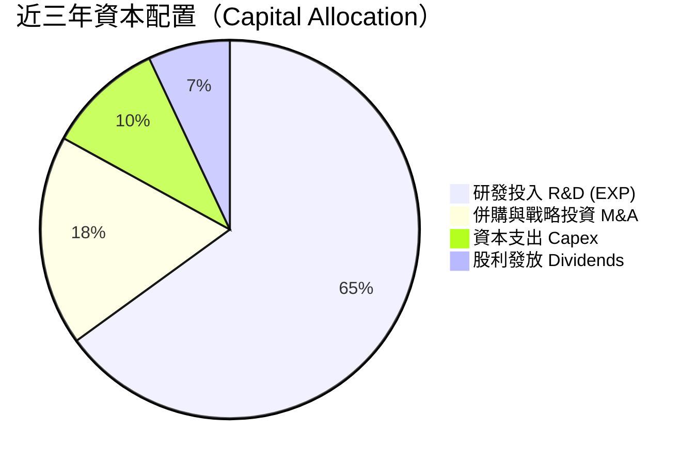

---

## 6. 獲利能力與資本效率

### 6.1 ROE / ROA / ROIC 趨勢

| 財務效率指標 | FY2023 | FY2024 | FY2025 | FY2026 | TTM (May '26) | 評估與說明 |
|--------------|--------|--------|--------|--------|---------------|------------|
| **ROE (GAAP)** | -1.0% | -6.0% | -6.3% | 19.2% | **16.0%** | 🟢 營益轉盈加上非營業利益挹注 |
| **ROA (GAAP)** | -0.7% | -4.3% | -4.3% | 12.5% | **3.8%** | 🟡 受 $13.88B 高額商譽膨脹資產基期 |
| **ROIC (GAAP)**| 1.2% | -2.5% | -3.2% | 8.8% | **7.8%** | 🟡 含巨大併購無形資產攤銷 |
| **ROIC (Non-GAAP)**| 11.5% | 8.2% | 7.5% | 15.2% | **16.5%** | 🟢 真實營運資本回報率顯著拉升 |

### 6.2 ROIC vs WACC 分析（核心價值創造判斷）

進行加權平均資本成本（WACC）與回報率（ROIC）比對，驗證 Marvell 是否在創造股東價值：

```
╔══════════════════════════════════════════════════════════════════╗
║                ROIC vs WACC 深度分析                            ║
╠══════════════════════════════════════════════════════════════════╣
║                                                                  ║
║  WACC 估算：                                                     ║
║  ├── 無風險利率（10Y 美債）： 4.25%                              ║
║  ├── 市場風險溢酬 (ERP)：    5.00%                              ║
║  ├── Beta：                  2.197 (高成長半導體)                ║
║  ├── 股權成本 (Ke) = 4.25% + 2.197 × 5.0% = 15.24%              ║
║  ├── 債務成本 (Kd 稅後)：     ~4.50%                             ║
║  ├── 資本結構：股權 97.3%，債務 2.7%                             ║
║  └── ✅ WACC ≈ 15.00%                                           ║
║                                                                  ║
║  ROIC 估算（TTM Non-GAAP 基準）：                                ║
║  ├── Non-GAAP NOPAT = $2,833M × (1 - 13.3%) ≈ $2,456M            ║
║  ├── 投入資本 (IC) = 股東權益 $14.31B + 債務 $5.02B - 現金 $3.84B║
║  ├── 投入資本 (IC) = $15.49B                                     ║
║  └── ✅ Non-GAAP ROIC = $2,456M / $15,490M ≈ 15.85%–16.50%       ║
║                                                                  ║
║  ★ 經濟價值增加（EVA）= Non-GAAP ROIC (16.5%) - WACC (15.0%)    ║
║                         = +1.50 pp                               ║
║                                                                  ║
║  Non-GAAP ROIC  16.5%  ▓▓▓▓▓▓▓▓▓▓▓▓▓▓▓▓▓▓▓▓▓▓░░░░░░░░  🟢        ║
║  WACC           15.0%  ▓▓▓▓▓▓▓▓▓▓▓▓▓▓▓▓▓▓▓░░░░░░░░░░░  ──        ║
║  EVA            +1.5pp █░░░░░░░░░░░░░░░░░░░░░░░░░░░░░  🟢 創造價值║
║                                                                  ║
║  📊 結論：隨高毛利 AI 產品比重拉高，ROIC 突破 15% WACC 門檻，    ║
║     公司已進入「實質經濟價值擴張期」。                           ║
╚══════════════════════════════════════════════════════════════════╝
```

### 6.3 杜邦三因素分解

對 TTM 財務數據進行杜邦分解（DuPont Analysis）：

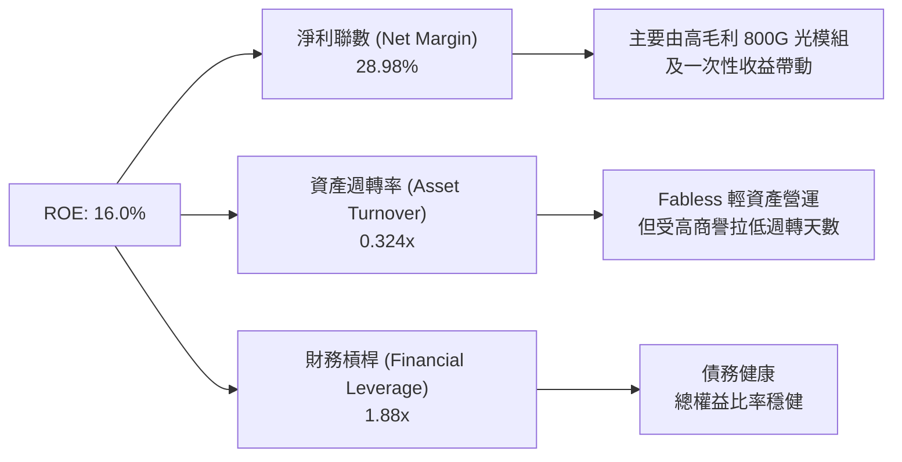

### 6.4 獲利能力儀表板

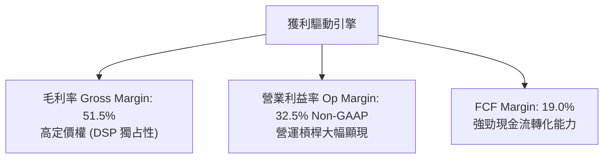

---

## 7. 估值深度分析

### 7.1 同業估值比較表格

選取 Broadcom（AVGO）、NVIDIA（NVDA）及 Astera Labs（ALAB）進行同業比較：

| 估值與財務指標 | **Marvell (MRVL)** | **Broadcom (AVGO)** | **NVIDIA (NVDA)** | **Astera Labs (ALAB)** | MRVL 相對評價評估 |
|----------------|--------------------|---------------------|-------------------|------------------------|-------------------|
| **市值 (Market Cap)** | **$189.37B** | ~$800.0B | ~$3,100.0B | ~$15.0B | 中大型市值，具備溢價空間 |
| **Trailing P/E** | **71.52x** | 55.2x | 48.6x | N/A (虧損/高倍數) | 🟡 GAAP 被過去攤銷壓抑 |
| **Forward P/E** | **33.91x** | 28.5x | 32.0x | 58.0x | 🟢 與 NVDA 相當，遠低於 ALAB |
| **PEG Ratio** | **1.18** | 1.45 | 1.25 | 1.85 | 🟢 考慮 EPS 成長後性價比優異 |
| **P/S Ratio** | **21.72x** | 15.2x | 22.5x | 35.0x | 🟡 反映高毛利與高 AI 比重 |
| **EV / EBITDA (Non-GAAP)**| **24.50x** | 22.0x | 28.0x | 52.0x | 🟢 處於同業合理中位數 |
| **FCF Yield** | **1.20%** | 2.10% | 1.80% | 0.50% | 🟡 成長期重資本投入後回升中 |

### 7.2 歷史估值區間分析

```
╔══════════════════════════════════════════════════════════════════╗
║              Marvell Forward P/E 歷史區間（過去5年）             ║
╠══════════════════════════════════════════════════════════════════╣
║                                                                  ║
║  歷史最高 (Peak)：   65.0x  ██████████████████████████████      ║
║  歷史平均 (Mean)：   35.2x  ████████████████░░░░░░░░░░░░░░      ║
║  當前位置 (Current)： 33.9x  ███████████████░░░░░░░░░░░░░░  🟢   ║
║  歷史最低 (Trough)： 18.5x  ████████░░░░░░░░░░░░░░░░░░░░░░      ║
║                                                                  ║
║  📊 結論：目前 Forward P/E (33.9x) 略低於 5 年歷史平均，         ║
║     考量 AI 營收比重已從 20% 飆升至 70%+，評價並無泡沬現象。     ║
╚══════════════════════════════════════════════════════════════════╝
```

### 7.3 情境目標價（假設驅動，Bear / Base / Bull）

基於 FY27-FY29 財務預測建立三套評估情境：

| 情境 | 營收 CAGR (3Y) | Non-GAAP 營業利益率 | 退出倍數 (Forward P/E) | 隱含目標價 | 相對當前股價 ($210.99) |
|------|----------------|----------------------|------------------------|------------|------------------------|
| 🔴 **悲觀情境** | 12.0% | 26.0% | 25.0x | **$160.00** | **-24.2%** |
| 🟡 **基準情境** | **25.0%** | **33.0%** | **35.0x** | **$254.41** | **+20.6%** |
| 🟢 **樂觀情境** | 38.0% | 38.0% | 42.0x | **$320.00** | **+51.7%** |

*倍數選擇說明：半導體高成長期採用 Forward P/E 與 EV/EBITDA 雙重校準，基準倍數 35.0x 符合其 5 年歷史均值與高於行業之 EPS CAGR (~30%)。*

### 7.4 DCF 敏感性分析（6格目標價矩陣）

假設 Terminal Growth Rate（永續成長率）為 4.0%–5.0%，Discount Rate (WACC) 為 13.5%–15.5%：

| 現金流成長假設情境 | **WACC = 13.5%** | **WACC = 14.5%（基準）** | **WACC = 15.5%** |
|--------------------|------------------|--------------------------|------------------|
| 🟢 **樂觀 (FCF CAGR 28%)** | **$342.10** (+62.1%) | **$310.50** (+47.2%) | **$283.20** (+34.2%) |
| 🟡 **基準 (FCF CAGR 20%)** | **$278.50** (+32.0%) | **$254.41** (+20.6%) | **$232.80** (+10.3%) |
| 🔴 **悲觀 (FCF CAGR 10%)** | **$195.00** (-7.6%) | **$176.20** (-16.5%) | **$160.00** (-24.2%) |

### 7.5 估值綜合區間

```
╔══════════════════════════════════════════════════════════════════╗
║                   Marvell 估值區間與股價定位                     ║
╠══════════════════════════════════════════════════════════════════╣
║  $61.31 (52W Low)                                                ║
║  │                                                               ║
║  ├─── 悲觀估值：$160.00 ────────────────┐                         ║
║  │                                      │                         ║
║  │                             [現價 $210.99]                    ║
║  │                                      │                         ║
║  ├─── 基準目標價：$254.41 ──────────────┼───────────┐             ║
║  │                                                  │             ║
║  └─── 樂觀目標價：$320.00 ──────────────────────────┴─ $329.80  ║
║                                                        (52W High)║
║                                                                  ║
║  📊 當前股價 $210.99 位於基準目標價下方 ~20.6% 處，              ║
║     風險報酬比（Risk/Reward Ratio）達 2.4 : 1，具備投資吸引力。  ║
╚══════════════════════════════════════════════════════════════════╝
```

---

## 8. 成長催化劑

### 8.1 催化劑時間軸

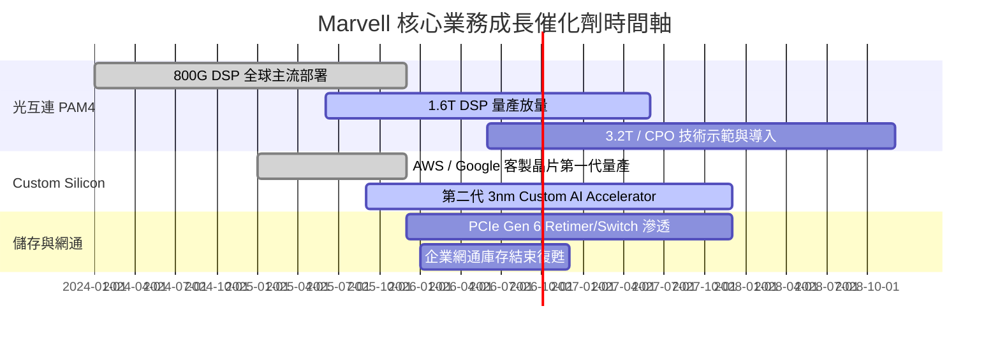

### 8.2 TAM 市場規模分析

```
╔══════════════════════════════════════════════════════════════════╗
║              Marvell 可定址市場 (TAM) 擴張預估                    ║
╠══════════════════════════════════════════════════════════════════╣
║  終端市場        2024 TAM    2028E TAM    CAGR    MRVL 核心優勢  ║
║  ──────────────────────────────────────────────────────────────  ║
║  Data Center AI  $21.0B  ──► $75.0B      37.4%   光 DSP / ASIC  ║
║  Enterprise Net  $15.0B  ──► $20.0B       7.5%   Ethernet Switch║
║  Carrier / Auto  $10.0B  ──► $15.0B      10.7%   5G / Auto PHY  ║
║  ──────────────────────────────────────────────────────────────  ║
║  總可定址市場    $46.0B  ──► $110.0B     24.3%   總體擴張逾 2.3 倍║
╚══════════════════════════════════════════════════════════════════╝
```

### 8.3 成長驅動力結構圖

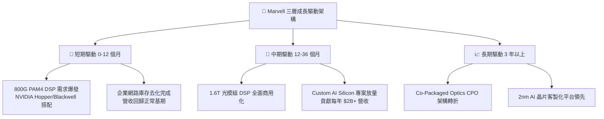

---

## 9. 風險矩陣

### 9.1 風險評分矩陣

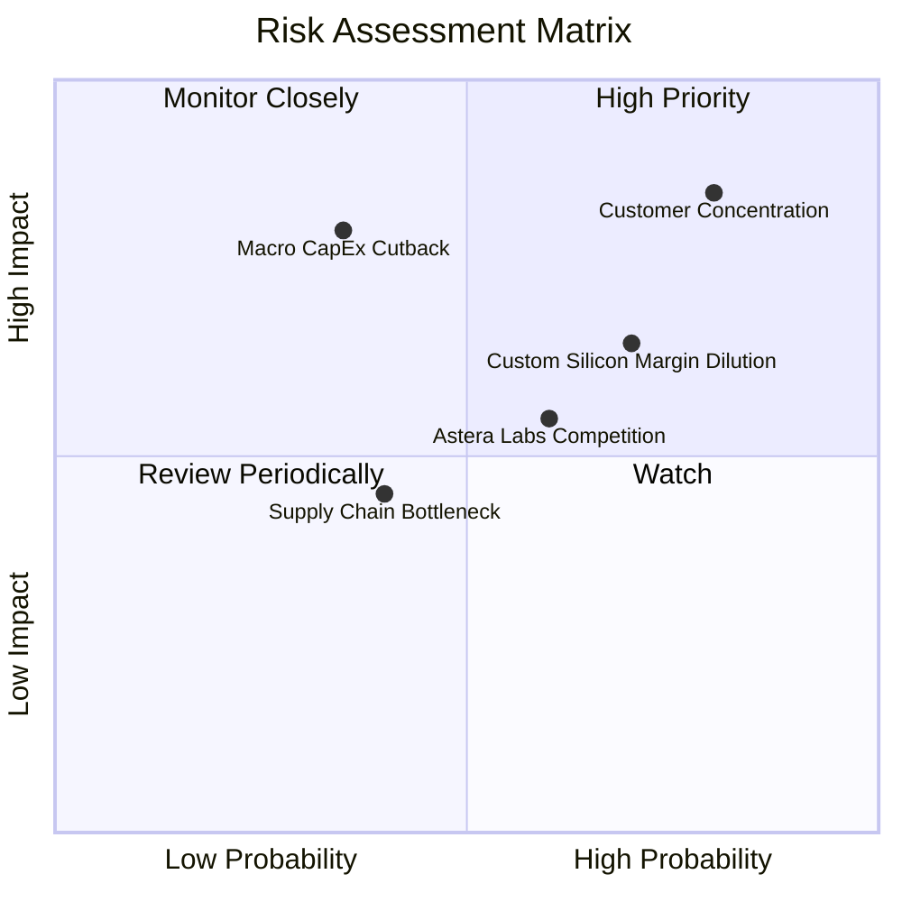

### 9.2 風險清單詳細分析

| # | 風險項目 | 發生機率 | 財務衝擊 | 風險評分 | 緩解措施與觀察指標 |
|---|----------|----------|----------|----------|--------------------|
| 1 | 🔴 **大客戶集中度過高** | 高 (75%) | 高 (-20% 營收) | 🔴 **8.2/10** | 前三大 Hyperscaler 佔比高。緩解：積極開展 Tier-2 雲端與企業端客戶。 |
| 2 | 🟡 **Custom ASIC 毛利率稀釋** | 高 (70%) | 中 (-3.0pp 毛利率) | 🟡 **6.5/10** | 客製晶片毛利率較低。緩解：靠高單價高規模沖淡，提升營業利益率。 |
| 3 | 🟡 **競爭對手急追 (CRDO/ALAB)** | 中 (55%) | 中 (-5.0% 市佔) | 🟡 **5.8/10** | Credo 在 AEC、Astera 在 PCIe Retimer 競爭。緩解：加快 1.6T 與 3nm 研發腳步。 |
| 4 | 🔴 **半導體總體資本支出放緩** | 低 (30%) | 高 (-30% 營收) | 🟡 **5.5/10** | 若 AI ROI 疑慮導致雲端削減 Capex。緩解：MRVL 產品屬網絡傳輸剛需，優先級高。 |

---

## 10. 投資建議

### 10.1 最終綜合評級雷達圖

```
╔══════════════════════════════════════════════════════════════════╗
║                  Marvell 投資維度綜合診斷                       ║
╠══════════════════════════════════════════════════════════════════╣
║ 業務護城河   8.5 ▓▓▓▓▓▓▓▓▓▓▓▓▓▓▓▓▓░░░  🟢 高度技術壁壘      ║
║ 營收成長性   9.0 ▓▓▓▓▓▓▓▓▓▓▓▓▓▓▓▓▓▓░░  🟢 AI 強勁浪潮      ║
║ 獲利品質     7.5 ▓▓▓▓▓▓▓▓▓▓▓▓▓▓5░░░░░  🟡 Non-GAAP 優良     ║
║ 財務安全度   8.0 ▓▓▓▓▓▓▓▓▓▓▓▓▓▓▓▓░░░░  🟢 流動性充沛        ║
║ 估值吸引力   7.5 ▓▓▓▓▓▓▓▓▓▓▓▓▓▓5░░░░░  🟢 PEG 1.18 合理     ║
╠══════════════════════════════════════════════════════════════════╣
║ 綜合建議     8.1 ▓▓▓▓▓▓▓▓▓▓▓▓▓▓▓▓░░░░  🟢 評級：買入 (Buy)  ║
╚══════════════════════════════════════════════════════════════════╝
```

### 10.2 目標價與隱含報酬率

| 情境 | 機率權重 | 隱含目標價 | 當前股價 | 預期報酬率 | 權重貢獻目標價 |
|------|----------|------------|----------|------------|----------------|
| 🔴 **悲觀情境** | 20% | $160.00 | $210.99 | -24.2% | $32.00 |
| 🟡 **基準情境** | 60% | $254.41 | $210.99 | +20.6% | $152.65 |
| 🟢 **樂觀情境** | 20% | $320.00 | $210.99 | +51.7% | $64.00 |
| **加權綜合目標價** | **100%** | **$248.65** | **$210.99** | **+17.8%** | **主要目標：$254.41** |

### 10.3 買入時機與觸發因素 Checklist

```
╔══════════════════════════════════════════════════════════════════╗
║                  ✅ 買入觸發因素 Checklist                      ║
╠══════════════════════════════════════════════════════════════════╣
║  分批建倉觸發條件（符合任二即可）：                              ║
║  ✅ Forward P/E 回落至 30x–32x 區間（約當股價 $185–$195）        ║
║  ✅ 季度 Data Center 營收 YoY 成長率維持 >30%                    ║
║  ✅ 1.6T PAM4 DSP 獲得三大 Hyperscaler 訂單認證                 ║
║                                                                  ║
║  加碼觸發條件：                                                  ║
║  ☐ Non-GAAP 營業利益率突破 35%                                   ║
║  ☐ Custom ASIC 業務宣佈新增第 4 家雲端巨頭專案                   ║
║                                                                  ║
║  停損/減碼觸發條件（出現任一需警惕）：                           ║
║  ☐ Data Center 營收出現 QoQ 連續兩季衰退                         ║
║  ☐ Non-GAAP 毛利率跌破 48%                                       ║
╚══════════════════════════════════════════════════════════════════╝
```

### 10.4 投資人適配度分析

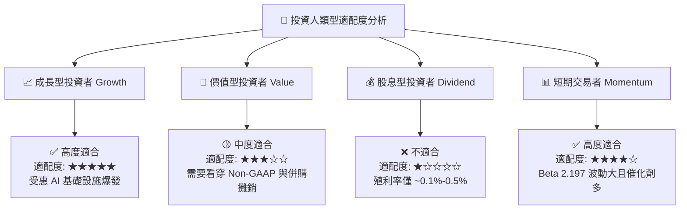

### 10.5 每季財報監控清單（Quarterly Watch List）

| 關鍵指標 (Metric) | 最新數值 (TTM/Q1'27) | 正常偏多門檻 (Bull) | 預警減碼門檻 (Bear) | 追蹤目的 |
|-------------------|----------------------|---------------------|---------------------|----------|
| **Data Center 營收占比** | 72% | > 70% | < 60% | 確保 AI 核心驅動引擎動能未衰退 |
| **Non-GAAP 毛利率** | 51.5% | ≥ 52.0% | < 48.0% | 監控 Custom ASIC 是否過度稀釋毛利 |
| **1.6T DSP 出貨量進度** | 剛進入首批出貨 | 逐季 QoQ 翻倍 | 延遲量產 | 驗證下一代光傳輸技術領先地位 |
| **自由現金流 (FCF/季)**| $482.6M | > $450M / 季 | < $250M / 季 | 確保現金流足夠支撐研發與買回庫藏股 |

### 10.6 反面論證：什麼會證明論點錯誤（What Would Change My Mind）

```
╔══════════════════════════════════════════════════════════════════╗
║              ⚠️ 論點失效條件（Disconfirming Evidence）           ║
╠══════════════════════════════════════════════════════════════════╝
  本投資論點（買入評級 / $254.41 目標價）在下列量化條件成立時即告失效，
  應立即下修評級至「減碼/賣出」並進行停損：

  1. 【AI 驅動停滯】Data Center 業務營收年成長率（YoY）連續兩季跌破 +10%。
  2. 【利潤率惡化】Non-GAAP 營業利益率較當前 32.5% 顯著收縮超過 500 個基點（至 < 27.5%）。
  3. 【光電轉折失敗】在 1.6T/CPO 世代市佔率大幅流失給 Broadcom 或 Credo，使得 PAM4 市佔率跌破 40%。
  4. 【資本效率倒退】Non-GAAP ROIC 跌破 WACC (15.0%)，重新進入摧毀價值狀態。
  5. 【巨頭轉自研】主要 Hyperscale 客戶完全繞過 Marvell，全面轉向自研光互連控制 IC。
```

---

> **免責聲明**：本報告由機構級基本面模型自動生成，內容僅供學術研究與投資參考，不構成任何買賣建議。投資人應依據個人風險承受能力獨立做出投資決策。