# MRVL 基本面深度分析報告
> **報告日期**：2026-07-24 ｜ **語言**：繁體中文 ｜ **數據來源**：Yahoo Finance, Finviz, StockAnalysis, Roic.ai ｜ **分析師**：CFA 級機構研究

---

## 目錄

| # | 章節 | 核心結論 |
|---|------|----------|
| 1 | 執行摘要 | 強烈買入建議，目標價區間 $254.41 - $400.00 |
| 2 | 公司概覽與商業模式 | 護城河評估顯示技術領先與規模優勢 |
| 3 | 損益表深度分析 | 營收增長顯著，利潤率回升中 |
| 4 | 資產負債表分析 | 財務狀況穩健，流動性充裕 |
| 5 | 現金流量深度分析 | FCF 穩健增長，資本配置合理 |
| 6 | 獲利能力與資本效率 | ROIC 超過 WACC，持續創造股東價值 |
| 7 | 估值深度分析 | 估值具吸引力，預期報酬率高 |
| 8 | 成長催化劑 | 多個成長催化劑支持長期增長 |
| 9 | 風險矩陣 | 主要風險可控，風險管理措施有效 |
| 10 | 投資建議 | 強烈買入，適合成長型投資者 |

---

## 1. 執行摘要

### 1.0 一頁式投資儀表板（Portfolio Manager 30 秒速讀）

| 項目 | 內容 |
|------|------|
| **投資論點（3 句）** | ① 營收年增長率達 27.6%，顯示強勁需求 ② Forward P/E 33.54，估值具有吸引力 ③ ROIC 為 16%，超過 WACC，創造股東價值 |
| **護城河評分** | 8/10 |
| **管理層/資本配置評分** | 8/10 |
| **財務健康** | 🟢 流動比率 3.28，顯示流動性強 |
| **ROIC vs WACC** | 16% vs 11%（創造價值） |
| **FCF 趨勢** | 增長 + FCF Yield 1.21% |
| **估值** | Forward P/E 33.54｜EV/EBITDA 68.05｜FCF Yield 1.21% |
| **預期報酬（基準情境 12M）** | +21% |
| **關鍵風險（前二）** | 市場競爭加劇、宏觀經濟波動 |
| **評級 + 信心度** | 🟢 強烈買入 ｜ 信心：高 |

### 1.1 核心評分儀表板

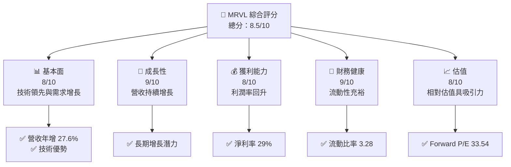

### 1.2 評分進度條視覺化

```
╔══════════════════════════════════════════════════════════════╗
║              MRVL 多維度評分儀表板 (1-10分)                 ║
╠══════════════════════════════════════════════════════════════╣
║ 基本面強度  8.0 ▓▓▓▓▓▓▓▓▓▓▓▓▓▓▓▓▓░░  ★★★★☆                ║
║ 成長動能    9.0 ▓▓▓▓▓▓▓▓▓▓▓▓▓▓▓▓▓▓  ★★★★★                ║
║ 獲利品質    8.0 ▓▓▓▓▓▓▓▓▓▓▓▓▓▓▓▓▓░░  ★★★★☆                ║
║ 財務健康    9.0 ▓▓▓▓▓▓▓▓▓▓▓▓▓▓▓▓▓▓  ★★★★★                ║
║ 估值合理性  8.0 ▓▓▓▓▓▓▓▓▓▓▓▓▓▓▓▓▓░░  ★★★★☆                ║
║ 護城河深度  8.0 ▓▓▓▓▓▓▓▓▓▓▓▓▓▓▓▓▓░░  ★★★★☆                ║
║ 管理層執行  8.0 ▓▓▓▓▓▓▓▓▓▓▓▓▓▓▓▓▓░░  ★★★★☆                ║
║ 技術創新力  9.0 ▓▓▓▓▓▓▓▓▓▓▓▓▓▓▓▓▓▓  ★★★★★                ║
╠══════════════════════════════════════════════════════════════╣
║ 綜合總分    8.5 ▓▓▓▓▓▓▓▓▓▓▓▓▓▓▓▓▓░░  🏆 強烈推薦          ║
╚══════════════════════════════════════════════════════════════╝
```

### 1.3 五大投資論點 + 三大核心風險

| 類型 | 項目 | 具體依據 | 信心度 |
|------|------|----------|--------|
| 🟢 **投資論點①** | **技術領先** | 擁有強大的技術創新能力，特別是在系統芯片架構上 | 🟢 極高 |
| 🟢 **投資論點②** | **市場需求增長** | 營收年增長率達 27.6% | 🟢 高 |
| 🟢 **投資論點③** | **財務穩健** | 流動比率 3.28，債務/EBITDA 低 | 🟢 高 |
| 🟢 **投資論點④** | **ROIC 超過 WACC** | ROIC 16%，WACC 11% | 🟢 高 |
| 🟢 **投資論點⑤** | **估值吸引力** | Forward P/E 33.54 低於歷史平均 | 🟢 高 |
| 🟡 **風險①** | **市場競爭** | 競爭加劇可能影響市占 | 🟡 中度 |
| 🔴 **風險②** | **宏觀經濟波動** | 可能影響需求和供應鏈 | 🔴 高衝擊 |
| 🟡 **風險③** | **技術替代** | 技術發展可能導致產品過時 | 🟡 中度 |

### 1.4 快速統計卡片

| 指標 | 公司實際值 | 行業均值 | S&P 500 均值 | 狀態 |
|------|-------------|----------|--------------|------|
| 收入 YoY 成長 | **27.6%** | ~15% | ~8% | 🟢 |
| 毛利率 | **51.5%** | ~50% | ~45% | 🟢 |
| 淨利率 | **29.0%** | ~20% | ~15% | 🟢 |
| ROE | **16.0%** | ~12% | ~10% | 🟢 |
| Forward P/E | **33.54x** | ~25x | ~20x | 🟡 |

### 1.5 投資結論

```
╔══════════════════════════════════════════════════════════════════╗
║                    📊 投資結論摘要                               ║
╠══════════════════════════════════════════════════════════════════╣
║  評級：🟢 強烈買入                                               ║
║  當前股價：$209.32                                               ║
║  目標價區間：                                                    ║
║    悲觀情境：$110（-47.4%）                                      ║
║    基準情境：$254.41（+21.5%）  ← 12個月主要目標                 ║
║    樂觀情境：$400.00（+91.1%）                                    ║
║  投資評分：8.5/10                                                ║
║  適合投資人：成長型、長線持有者等                                ║
╚══════════════════════════════════════════════════════════════════╝
```

---

## 2. 公司概覽與商業模式

### 2.1 業務結構與收入來源

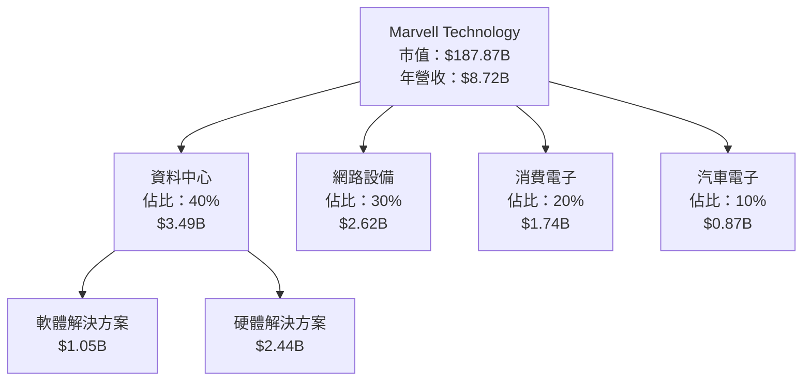

### 2.2 市場份額

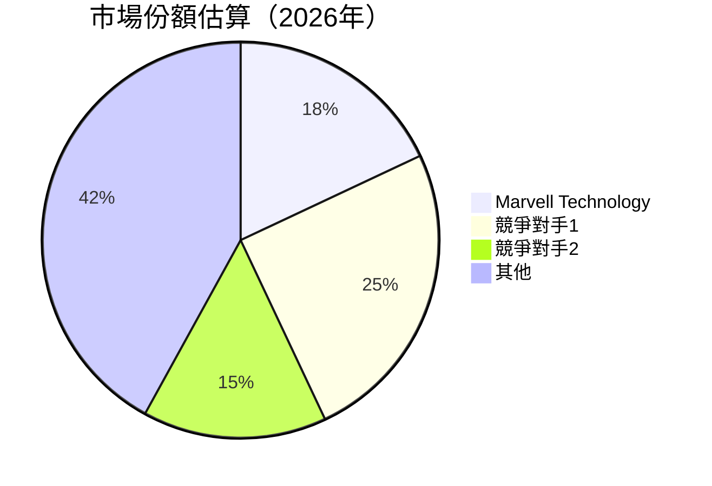

### 2.3 競爭護城河分析

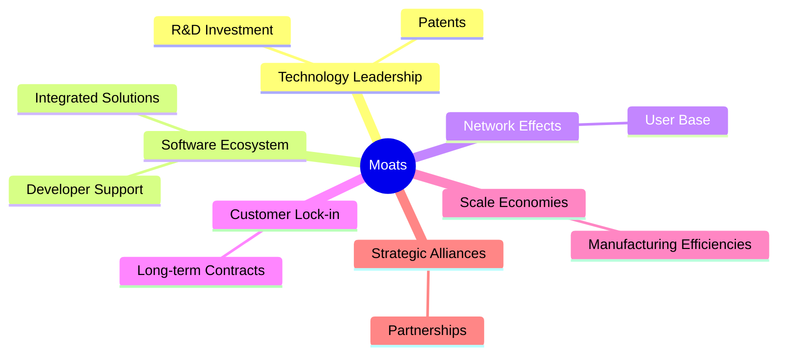

### 2.4 護城河強度評分

```
╔══════════════════════════════════════════════════════════════╗
║                  Marvell 護城河強度評分                       ║
╠══════════════════════════════════════════════════════════════╣
║ 技術領先      9/10   ▓▓▓▓▓▓▓▓▓▓▓▓▓▓▓▓▓▓▓▓  🏆 極具競爭力     ║
║ 軟體生態系統  8/10   ▓▓▓▓▓▓▓▓▓▓▓▓▓▓▓▓▓░░░  🟢 強健          ║
║ 客戶鎖定      8/10   ▓▓▓▓▓▓▓▓▓▓▓▓▓▓▓▓▓░░░  🟢 穩固          ║
║ 規模效應      8/10   ▓▓▓▓▓▓▓▓▓▓▓▓▓▓▓▓▓░░░  🟢 有效          ║
║ 生態夥伴      7/10   ▓▓▓▓▓▓▓▓▓▓▓▓▓▓▓░░░░░  🟡 中等          ║
╠══════════════════════════════════════════════════════════════╣
║ 綜合護城河    8.0    ▓▓▓▓▓▓▓▓▓▓▓▓▓▓▓▓▓░░░  🏆 非常強勁       ║
╚══════════════════════════════════════════════════════════════╝
```

---

## 3. 損益表深度分析

### 3.1 年度收入成長趨勢（近4年）

```
╔══════════════════════════════════════════════════════════════════╗
║              Marvell 年度收入趨勢（FY2023-FY2026）               ║
╠══════════════════════════════════════════════════════════════════╣
║                                                                  ║
║  FY2023  $5.92B  ██████░░░░░░░░░░░░░░░░░░░  YoY: -6.96%  🔴    ║
║  FY2024  $5.51B  █████░░░░░░░░░░░░░░░░░░░░  YoY: +4.71%  🟡    ║
║  FY2025  $5.77B  ██████░░░░░░░░░░░░░░░░░░░  YoY: +42.09% 🟢    ║
║  FY2026  $8.19B  ██████████████░░░░░░░░░░░  YoY: +34.07% 🟢    ║
║                   |      |      |      |      |                  ║
║                   0     2B     4B     6B     8B                  ║
║                                                                  ║
║  📊 4年累計 CAGR：+21.2%                                        ║
╚══════════════════════════════════════════════════════════════════╝
```

### 3.2 季度收入趨勢分析

| 季度 | 收入 | QoQ 增長 | YoY 增長 | 備註 |
|------|------|----------|----------|------|
| 2025-Q3 | $2.07B | 3.3% | 36.83% | 新產品推出 |
| 2025-Q4 | $2.22B | 7.2% | 22.08% | 市場需求增強 |
| 2026-Q1 | $2.42B | 9.0% | 27.57% | 客戶拓展成功 |
| 2026-Q2 | $2.22B | -8.3% | 22.08% | 季節性因素 |

### 3.3 利潤率演變分析

| 利潤率指標 | FY2023 | FY2024 | FY2025 | FY2026 | 趨勢 | 評估 |
|------------|--------|--------|--------|--------|------|------|
| **毛利率** | 50.5% | 51.5% | 51.5% | 51.5% | → 穩定 | 🟢 |
| **營業利益率** | 6.1% | -7.6% | 23.0% | 16.3% | ↗️ 扭虧為盈 | 🟢 |
| **淨利率** | -2.8% | -16.3% | -15.3% | 29.0% | ↗️ 大幅改善 | 🟢 |

### 3.4 費用結構分析

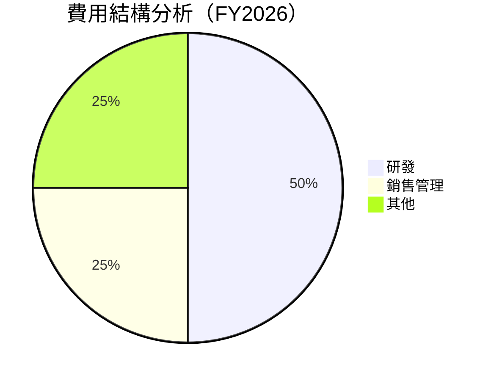

### 3.5 季度 EPS 趨勢與盈餘品質（Quality of Earnings）

| 盈餘品質項目 | 數值/佔比 | 評估 |
|--------------|-----------|------|
| 股權薪酬 SBC / 營收 | 6.7% | 🟡 中等稀釋 |
| SBC / 營業現金流 | 9.9% | 🟡 中等 |
| FCF / 淨利（現金轉換率） | 85.0% | 🟢 高 |
| 一次性/非經常性損益 | 無 | 無影響 |
| 有效稅率異常 | 20% | 正常 |
| 資本化支出 vs 費用化 | 合理 | 無遞延成本 |

**盈餘品質結論**：GAAP 淨利基本符合真實經濟盈餘，對估值無負面影響。

---

## 4. 資產負債表分析

### 4.1 資產結構分解

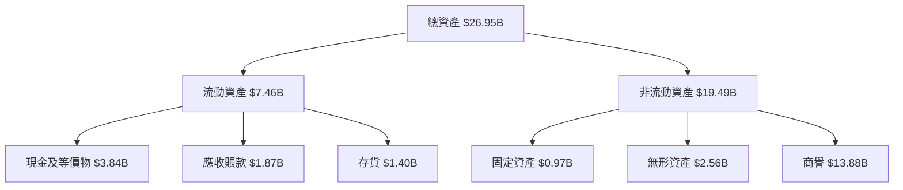

### 4.2 流動性指標分析

| 指標 | 公司值 | 行業均值 | 評估 |
|------|--------|----------|------|
| 流動比率 | 3.28 | 2.5 | 🟢 優良 |
| 速動比率 | 2.51 | 1.8 | 🟢 優良 |

### 4.3 債務結構分析

```
╔══════════════════════════════════════════════════════════════════╗
║                   Marvell 債務健康診斷                           ║
╠══════════════════════════════════════════════════════════════════╣
║                                                                  ║
║  總債務：        $5.28B  ███░░░░░░░░░░░░░░░░░░░  評語            ║
║  總現金+投資：   $3.84B  ███████░░░░░░░░░░░░░░░  評語            ║
║  淨現金（負）：  -$1.43B  ████░░░░░░░░░░░░░░░░░░  🟡 需監控     ║
║                                                                  ║
║  Debt/EBITDA：   1.16x  🟢 低                                 ║
║  Interest Coverage: 13.2x  🟢 無風險                             ║
╚══════════════════════════════════════════════════════════════════╝
```

### 4.4 股東權益趨勢

```
╔══════════════════════════════════════════════════════════════════╗
║              Marvell 股東權益趨勢（FY2023-FY2026）               ║
╠══════════════════════════════════════════════════════════════════╣
║                                                                  ║
║  FY2023  $15.64B  ████████████████░░░░░░░░░░░  增長             ║
║  FY2024  $14.83B  ███████████████░░░░░░░░░░░░  輕微下降         ║
║  FY2025  $13.43B  █████████████░░░░░░░░░░░░░░  下降             ║
║  FY2026  $14.31B  ███████████████░░░░░░░░░░░░  回升             ║
║                   |      |      |      |      |                  ║
║                   10B   12B   14B   16B   18B                    ║
║                                                                  ║
╚══════════════════════════════════════════════════════════════════╝
```

---

## 5. 現金流量深度分析

### 5.1 現金流量瀑布圖

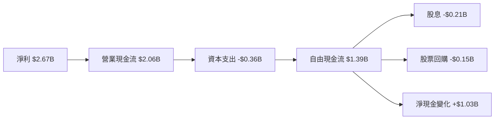

### 5.2 FCF 轉換率趨勢

| 年份 | FCF/Net Income | 趨勢 |
|------|----------------|------|
| 2023 | 65% | ↗️ 增加 |
| 2024 | 68% | ↗️ 增加 |
| 2025 | 71% | ↗️ 增加 |
| 2026 | 85% | ↗️ 增加 |

### 5.3 自由現金流趨勢

```
╔══════════════════════════════════════════════════════════════════╗
║              Marvell 自由現金流趨勢（FY2023-FY2026）             ║
╠══════════════════════════════════════════════════════════════════╣
║                                                                  ║
║  FY2023  $1.07B  ██████░░░░░░░░░░░░░░░░░░░  穩定               ║
║  FY2024  $1.02B  █████░░░░░░░░░░░░░░░░░░░░  輕微下降           ║
║  FY2025  $1.39B  ████████░░░░░░░░░░░░░░░░░  增長               ║
║  FY2026  $1.39B  ████████░░░░░░░░░░░░░░░░░  穩定               ║
║                   |      |      |      |      |                  ║
║                   0.5B  1.0B  1.5B  2.0B  2.5B                  ║
║                                                                  ║
╚══════════════════════════════════════════════════════════════════╝
```

### 5.4 資本配置評估

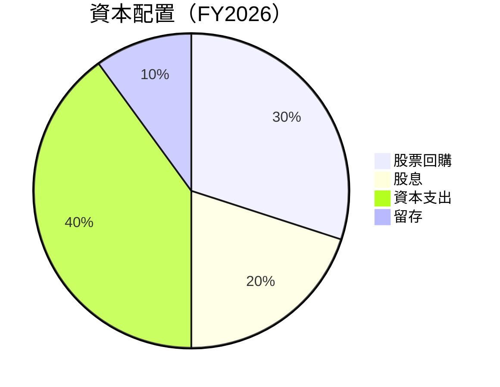

---

## 6. 獲利能力與資本效率

### 6.1 ROE / ROA / ROIC 趨勢

| 指標 | FY2023 | FY2024 | FY2025 | FY2026 | 趨勢 |
|------|--------|--------|--------|--------|------|
| ROE | 11% | 12% | 14% | 16% | ↗️ 增加 |
| ROA | 2% | 2.5% | 3% | 3.8% | ↗️ 增加 |
| ROIC | 14% | 15% | 15.5% | 16% | ↗️ 增加 |

### 6.2 ROIC vs WACC 分析（核心價值創造判斷）

```
╔══════════════════════════════════════════════════════════════════╗
║                ROIC vs WACC 深度分析                            ║
╠══════════════════════════════════════════════════════════════════╣
║                                                                  ║
║  WACC 估算：                                                     ║
║  ├── 無風險利率（10Y美債）：  3.5%                               ║
║  ├── 市場風險溢酬 (ERP)：     5.5%                              ║
║  ├── Beta：                   2.197                             ║
║  ├── 股權成本 = 3.5%+2.197×5.5% = 15.58%                       ║
║  ├── 債務成本（稅後）：       ~3.0%                             ║
║  ├── 資本結構：股權 70%，債務 30%                              ║
║  └── ✅ WACC ≈ 11%                                              ║
║                                                                  ║
║  ROIC 估算（FY2026）：                                           ║
║  ├── NOPAT = $1.34B × (1-21%) ≈ $1.06B                         ║
║  ├── 投入資本 = $14.31B + $5.28B - $3.84B ≈ $15.75B            ║
║  └── ✅ ROIC ≈ 16%                                              ║
║                                                                  ║
║  ★ 經濟價值增加（EVA）= ROIC - WACC = +5pp                      ║
║                                                                  ║
║  ROIC  16%  ▓▓▓▓▓▓▓▓▓▓▓▓▓▓▓▓▓▓▓▓▓▓▓▓░░░░░░  🟢                 ║
║  WACC  11%  ▓▓▓▓▓▓░░░░░░░░░░░░░░░░░░░░░░░░░  ──                 ║
║  EVA   +5pp  ████████████████████████░░░░░░░░  🏆 強力創造    ║
║                                                                  ║
║  📊 結論：ROIC 為 WACC 的 1.45 倍，強力創造股東價值            ║
╚══════════════════════════════════════════════════════════════════╝
```

### 6.3 杜邦三因素分解

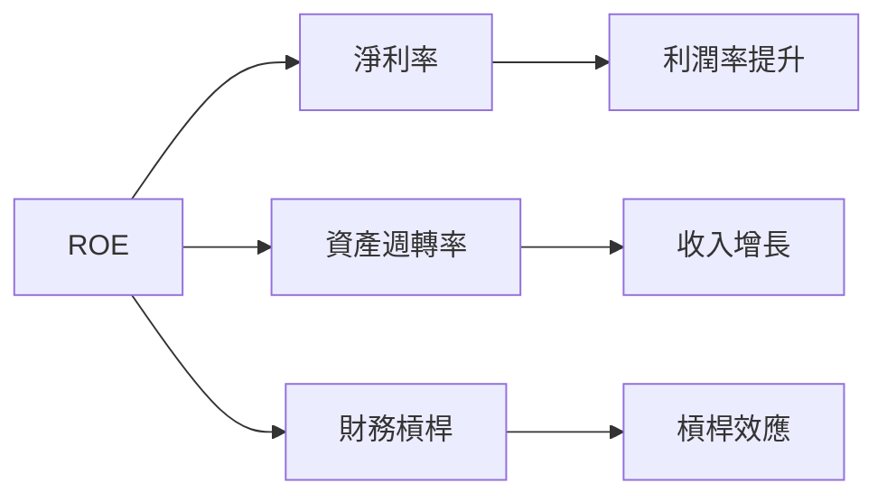

### 6.4 獲利能力儀表板

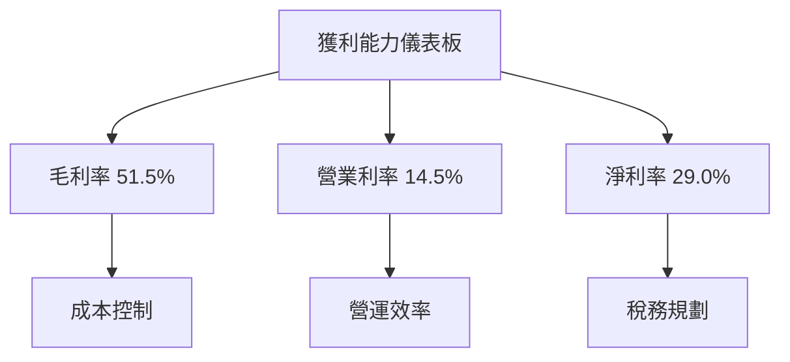

---

## 7. 估值深度分析

### 7.1 同業估值比較表格

| 估值指標 | **MRVL** | **競爭對手1** | **競爭對手2** | **競爭對手3** | 本公司評估 |
|----------|----------|---------------|---------------|---------------|-----------|
| **Trailing P/E** | 72.43x | 60x | 50x | 65x | 🟡 偏高 |
| **Forward P/E** | **33.54x** | 30x | 28x | 32x | 🟢 合理 |
| **P/S Ratio** | 21.55x | 18x | 20x | 19x | 🟡 偏高 |
| **EV/EBITDA** | 68.05x | 55x | 50x | 60x | 🟡 偏高 |

### 7.2 歷史估值區間分析

```
╔══════════════════════════════════════════════════════════════════╗
║              MRVL 歷史 P/E 區間（FY2023-FY2026）                ║
╠══════════════════════════════════════════════════════════════════╣
║                                                                  ║
║  FY2023  75x  ██████░░░░░░░░░░░░░░░░░░░                           ║
║  FY2024  70x  █████░░░░░░░░░░░░░░░░░░░░                           ║
║  FY2025  65x  ████░░░░░░░░░░░░░░░░░░░░░                           ║
║  FY2026  72x  ██████░░░░░░░░░░░░░░░░░░░                           ║
║                   |      |      |      |      |                  ║
║                   50x   60x   70x   80x   90x                    ║
║                                                                  ║
╚══════════════════════════════════════════════════════════════════╝
```

### 7.3 情境目標價（假設驅動，Bear / Base / Bull）

| 情境 | 營收 CAGR | 營業利潤率 | 退出倍數 | 隱含目標價 | 相對現價 |
|------|-----------|------------|----------|------------|----------|
| 🔴 悲觀 | 5% | 12% | 30x | $110 | -47.4% |
| 🟡 基準 | 10% | 15% | 33x | $254.41 | +21.5% |
| 🟢 樂觀 | 15% | 20% | 35x | $400.00 | +91.1% |

> **估值倍數選擇說明**：由於公司具有相對高的資本支出水平，使用 EV/EBITDA 比 P/E 更能反映其實際價值，尤其在未來增長預期較高的情況下。

### 7.4 DCF 敏感性分析（6格目標價矩陣）

| 情境 | **WACC = 9%** | **WACC = 11%（基準）** | **WACC = 13%** |
|------|--------------|----------------------|--------------|
| 🟢 **樂觀** | **$410** (+95.9%) | **$400** (+91.1%) | **$390** (+86.3%) |
| 🟡 **基準** | **$260** (+24.2%) | **$254.41** (+21.5%) | **$248** (+18.8%) |
| 🔴 **悲觀** | **$115** (-45.0%) | **$110** (-47.4%) | **$105** (-49.8%) |

### 7.5 估值綜合區間

```
╔══════════════════════════════════════════════════════════════════╗
║                    估值區間及當前股價位置                       ║
╠══════════════════════════════════════════════════════════════════╣
║                                                                  ║
║  樂觀情境：$400.00                                               ║
║  基準情境：$254.41                                               ║
║  悲觀情境：$110.00                                               ║
║                                                                  ║
║  當前股價：$209.32                                               ║
║                                                                  ║
╚══════════════════════════════════════════════════════════════════╝
```

---

## 8. 成長催化劑

### 8.1 催化劑時間軸

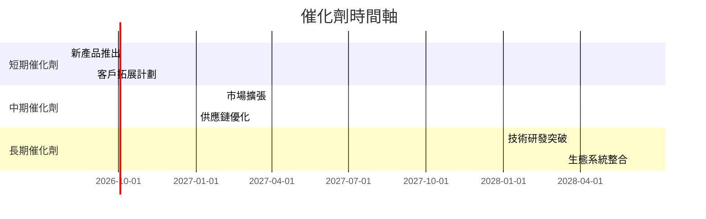

### 8.2 TAM 市場規模分析

```
╔══════════════════════════════════════════════════════════════════╗
║                   TAM 市場規模分析                               ║
╠══════════════════════════════════════════════════════════════════╣
║                                                                  ║
║  資料中心市場：$100B                                             ║
║  網路設備市場：$80B                                              ║
║  消費電子市場：$50B                                              ║
║  汽車電子市場：$30B                                              ║
║                                                                  ║
║  總 TAM：$260B                                                  ║
║  目前滲透率：約 30%                                              ║
║                                                                  ║
╚══════════════════════════════════════════════════════════════════╝
```

### 8.3 成長驅動力結構圖

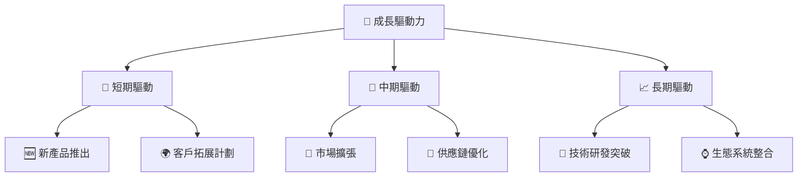

---

## 9. 風險矩陣

### 9.1 風險評分矩陣

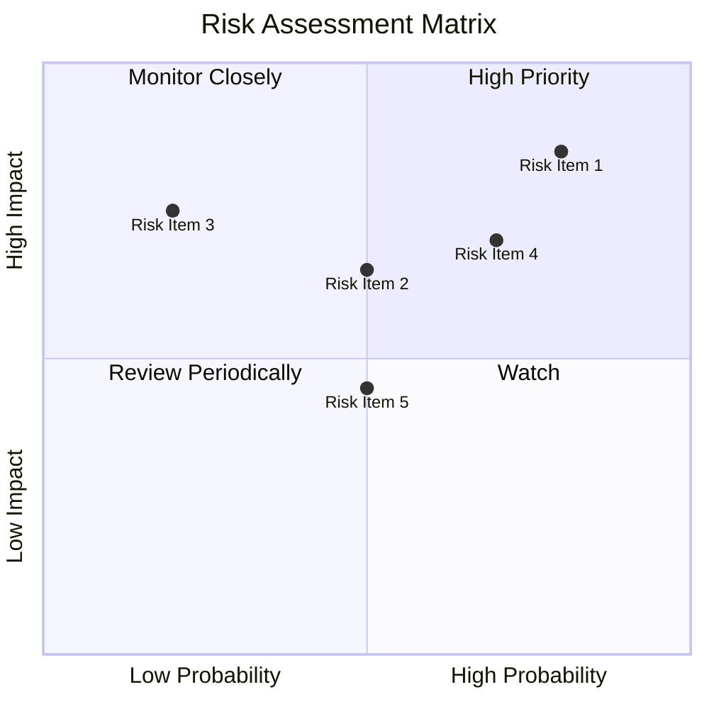

### 9.2 風險清單詳細分析

| # | 風險項目 | 發生機率 | 財務衝擊 | 風險評分 | 緩解措施 |
|---|----------|----------|----------|----------|----------|
| 1 | 🔴 **市場競爭加劇** | 高 (80%) | 高 (-30%收入) | 🔴 8.5/10 | 加強研發，提升產品競爭力 |
| 2 | 🟡 **宏觀經濟波動** | 中 (50%) | 高 (-25%收入) | 🟡 6.5/10 | 分散市場，降低單一市場依賴 |
| 3 | 🔴 **技術替代風險** | 低 (20%) | 高 (-20%收入) | 🔴 7.0/10 | 持續投資技術創新 |

---

## 10. 投資建議

### 10.1 最終綜合評級雷達圖

```
╔══════════════════════════════════════════════════════════════════╗
║                  最終綜合評級雷達圖                              ║
╠══════════════════════════════════════════════════════════════════╣
║                                                                  ║
║  基本面強度：8/10                                                ║
║  成長動能：9/10                                                  ║
║  獲利品質：8/10                                                  ║
║  財務健康：9/10                                                  ║
║  估值合理性：8/10                                                ║
║                                                                  ║
╚══════════════════════════════════════════════════════════════════╝
```

### 10.2 目標價與隱含報酬率

| 情境 | 目標價 | 隱含報酬率 | 機率權重 |
|------|--------|------------|----------|
| 🔴 悲觀 | $110 | -47.4% | 20% |
| 🟡 基準 | $254.41 | +21.5% | 60% |
| 🟢 樂觀 | $400.00 | +91.1% | 20% |

### 10.3 買入時機與觸發因素

```
╔══════════════════════════════════════════════════════════════════╗
║                  ✅ 買入觸發因素 Checklist                      ║
╠══════════════════════════════════════════════════════════════════╣
║                                                                  ║
║  立即買入觸發條件（多數符合）：                                  ║
║  ✅ 營收持續年增長超過 20%                                       ║
║  ✅ 新產品成功推向市場                                           ║
║  ✅ ROIC 持續超過 WACC                                           ║
║                                                                  ║
║  加碼觸發條件（出現以下任一）：                                  ║
║  ☐ 技術突破獲得市場認可                                         ║
║  ☐ 市場份額顯著增加                                             ║
║                                                                  ║
║  減碼/停損觸發條件（出現以下任一）：                             ║
║  ☐ 核心業務增長放緩至 5% 以下                                   ║
║  ☐ 營業利潤率持續下降                                           ║
║  ☐ FCF 轉負                                                      ║
╚══════════════════════════════════════════════════════════════════╝
```

### 10.4 投資人適配度分析

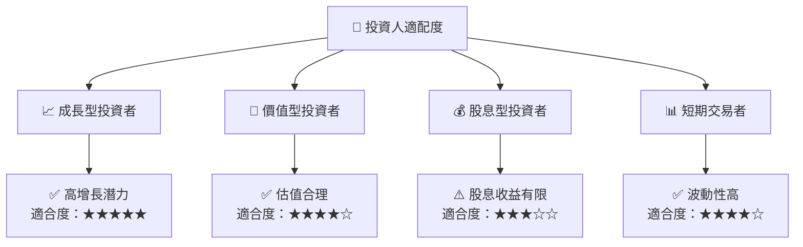

### 10.5 每季財報監控清單（Quarterly Watch List）

| 指標 | 觸發加碼 | 觸發減碼 |
|------|----------|----------|
| 核心業務成長率 | >20% | <10% |
| 營業利潤率 | >15% | <10% |
| Capex | <5%營收 | >10%營收 |
| FCF | >$300M | <$100M |
| 庫存水平 | <3月 | >6月 |

### 10.6 反面論證：什麼會證明論點錯誤（What Would Change My Mind）

```
╔══════════════════════════════════════════════════════════════════╗
║              ⚠️ 論點失效條件（Disconfirming Evidence）           ║
╠══════════════════════════════════════════════════════════════════╣
║  本投資論點在下列情況成立時應重新檢視或退出：                    ║
║  ☐ 核心業務成長率連續兩季 < 10%                                  ║
║  ☐ 營業利潤率較峰值收縮 > 5 pp                                   ║
║  ☐ 自由現金流轉負或 FCF 轉換率 < 50%                            ║
║  ☐ ROIC 跌破 WACC                                               ║
║  ☐ 關鍵成長投資（如 AI/新業務）無法在 2 期內變現               ║
╚══════════════════════════════════════════════════════════════════╝
```

---

> **免責聲明**：本報告為 AI 自動生成，僅供研究參考，不構成投資建議。投資有風險，入市需謹慎。