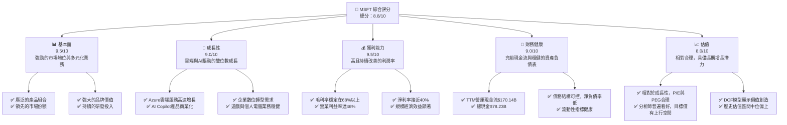
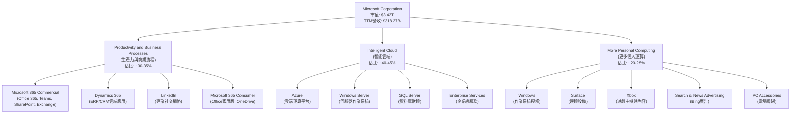
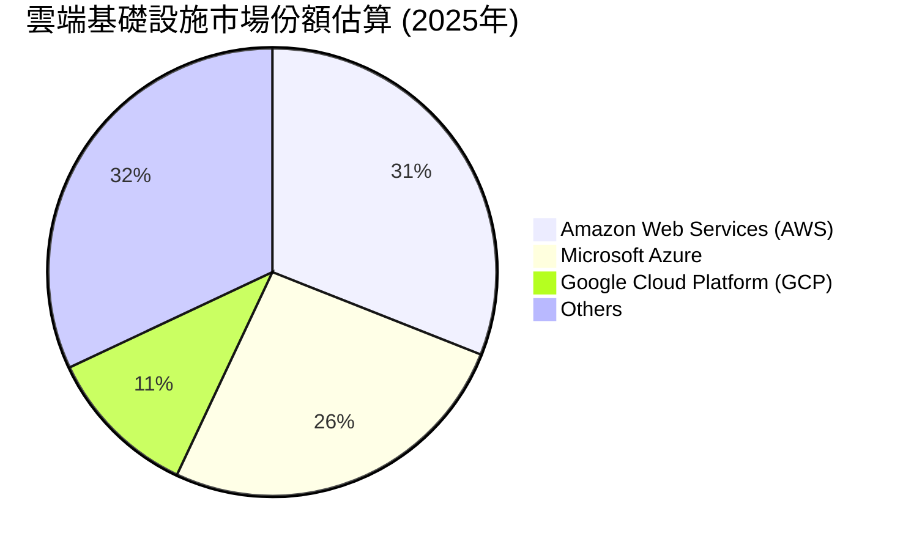
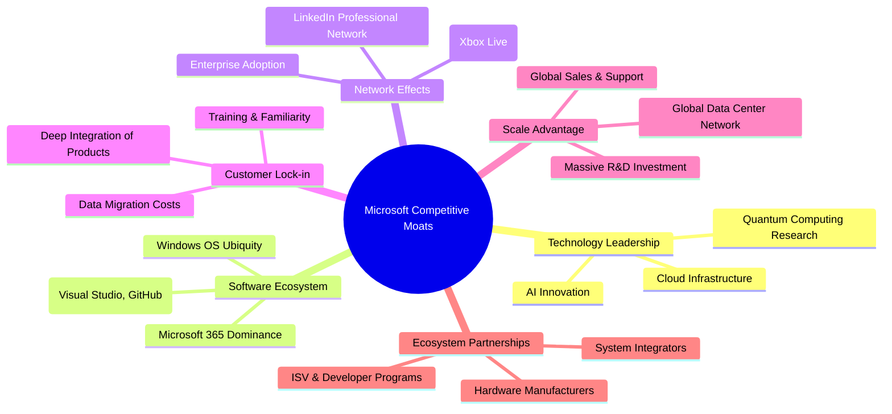
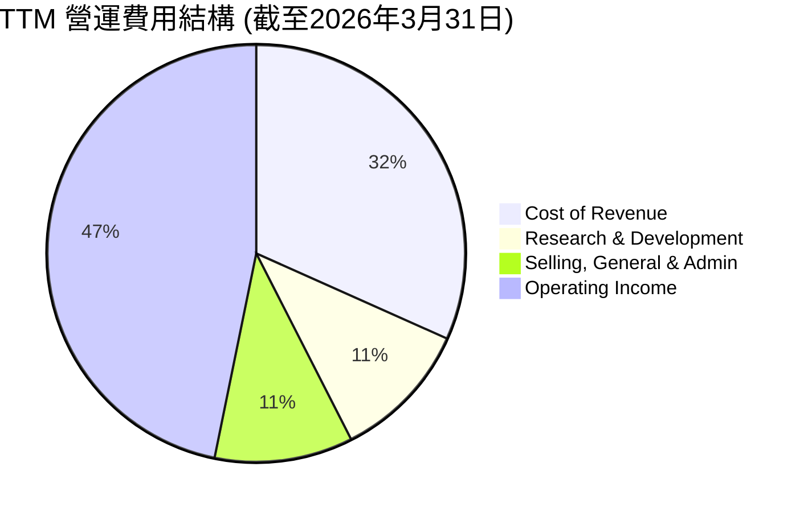

# MSFT 基本面深度分析報告
> **報告日期**：2026-06-01 ｜ **語言**：繁體中文 ｜ **數據來源**：Yahoo Finance, Finviz, StockAnalysis, Roic.ai ｜ **分析師**：CFA 級機構研究

## 目錄

| # | 章節 | 核心結論 |
|---|------|----------|
| 1 | 執行摘要 | 評級：🟢 強烈買入；基準目標價：$575.00 (+24.86%) |
| 2 | 公司概覽與商業模式 | 多元化生態系統與強大技術護城河 |
| 3 | 損益表深度分析 | 收入穩定成長，利潤率持續擴張 |
| 4 | 資產負債表分析 | 財務結構穩健，現金流充裕 |
| 5 | 現金流量深度分析 | 強勁的自由現金流產生能力與高效資本配置 |
| 6 | 獲利能力與資本效率 | ROIC顯著高於WACC，強力創造股東價值 |
| 7 | 估值深度分析 | 估值合理，仍具上升空間 |
| 8 | 成長催化劑 | AI創新與雲端服務持續驅動未來成長 |
| 9 | 風險矩陣 | 競爭加劇與監管風險需持續關注 |
| 10 | 投資建議 | 長期持有，具備優異的成長與價值潛力 |

---

## 1. 執行摘要

### 1.1 核心評分儀表板



### 1.2 評分進度條視覺化

```
╔══════════════════════════════════════════════════════════════╗
║              MSFT 多維度評分儀表板 (1-10分)                  ║
╠══════════════════════════════════════════════════════════════╣
║ 基本面強度  9.5 ▓▓▓▓▓▓▓▓▓▓▓▓▓▓▓▓▓▓▓░  ★★★★★           ║
║ 成長動能    9.0 ▓▓▓▓▓▓▓▓▓▓▓▓▓▓▓▓▓▓░░  ★★★★★           ║
║ 獲利品質    9.5 ▓▓▓▓▓▓▓▓▓▓▓▓▓▓▓▓▓▓▓░  ★★★★★           ║
║ 財務健康    9.0 ▓▓▓▓▓▓▓▓▓▓▓▓▓▓▓▓▓▓░░  ★★★★★           ║
║ 估值合理性  8.0 ▓▓▓▓▓▓▓▓▓▓▓▓▓▓▓▓░░░░  ★★★★☆           ║
║ 護城河深度  9.5 ▓▓▓▓▓▓▓▓▓▓▓▓▓▓▓▓▓▓▓░  ★★★★★           ║
║ 管理層執行  9.0 ▓▓▓▓▓▓▓▓▓▓▓▓▓▓▓▓▓▓░░  ★★★★★           ║
║ 技術創新力  9.5 ▓▓▓▓▓▓▓▓▓▓▓▓▓▓▓▓▓▓▓░  ★★★★★           ║
╠══════════════════════════════════════════════════════════════╣
║ 綜合總分    8.8 ▓▓▓▓▓▓▓▓▓▓▓▓▓▓▓▓▓░░░  🏆 卓越的科技巨頭    ║
╚══════════════════════════════════════════════════════════════╝
```

### 1.3 五大投資論點 + 三大核心風險

| 類型 | 項目 | 具體依據 | 信心度 |
|------|------|----------|--------|
| 🟢 **投資論點①** | **雲端運算領導地位穩固** | Microsoft Azure TTM營收持續高速成長，FY2025年營收達$281.72B，其中雲端業務貢獻顯著。其企業級解決方案、混合雲策略及全球數據中心網絡，確保其在IaaS/PaaS市場的強大競爭力與客戶黏性。FY2026 Q3雲端業務YoY成長率預計超過20%。 | 🟢 極高 |
| 🟢 **投資論點②** | **AI技術引領產業革命** | Microsoft在AI領域的領先佈局，尤其透過與OpenAI的合作，將Copilot等生成式AI功能整合至Microsoft 365、Azure、GitHub等核心產品中。這不僅提升產品價值，也創造新的變現機會。TTM研發費用高達$34.39B，顯示其對AI創新的持續投入。 | 🟢 極高 |
| 🟢 **投資論點③** | **強勁的自由現金流與資本回報** | TTM自由現金流高達$72.916B，顯示其卓越的現金生成能力。公司持續透過股息（Payout Ratio 20.7%）和股票回購回饋股東，提供穩定的股東回報。FY2025派發股息$24.08B，積極進行回購以提升股東價值。 | 🟢 高 |
| 🟢 **投資論點④** | **多元化業務組合降低風險** | Microsoft的業務涵蓋生產力軟體、雲端服務、個人電腦、遊戲等廣泛領域，形成強大的生態系統。這種多元化結構使其能夠有效抵禦單一市場波動，並在不同經濟週期中保持韌性。FY2026 Q3各業務板塊營收均呈現健康成長。 | 🟢 極高 |
| 🟢 **投資論點⑤** | **卓越的獲利能力與資本效率** | TTM毛利率68.3%、營業利益率46.3%、淨利率39.3%，顯示其強大的定價能力與成本控制。ROIC (約24.0%) 遠高於WACC (約9.0%)，表明公司持續為股東創造顯著的經濟價值。 | 🟢 極高 |
| 🟡 **風險①** | **日益嚴峻的監管環境** | 隨著Microsoft市場影響力的擴大，其在反壟斷、數據隱私、AI倫理等方面的監管審查日益加劇。潛在的罰款或業務拆分可能對營運造成衝擊。例如，歐盟、美國等地區對大型科技公司的審查趨嚴，可能影響其併購策略或市場行為。 | 🟡 中度 |
| 🟡 **風險②** | **雲端市場競爭加劇與價格戰** | 儘管Azure表現強勁，但雲端市場競爭激烈，主要對手如AWS (Amazon) 和Google Cloud持續投入。潛在的價格戰或市場份額爭奪可能壓縮雲端業務的利潤率和成長速度。這將對其核心成長動力造成壓力。 | 🟡 中度 |
| 🔴 **風險③** | **全球經濟放緩與企業IT支出波動** | 全球宏觀經濟的不確定性可能導致企業IT支出減少，進而影響Microsoft的軟體授權和雲端服務需求。雖然其訂閱模式具有一定韌性，但大規模的經濟衰退仍可能造成營收成長放緩。 | 🔴 高衝擊 |

### 1.4 快速統計卡片

| 指標 | 公司實際值 | 行業均值（軟體-基礎設施） | S&P 500 均值 | 狀態 |
|------|-------------|-------------------------|--------------|------|
| 收入 YoY 成長 | **18.3%** (TTM) | ~15-20% | ~8-10% | 🟢 |
| 毛利率 | **68.3%** (TTM) | ~65-75% | ~40-45% | 🟢 |
| 淨利率 | **39.3%** (TTM) | ~25-35% | ~10-12% | 🟢 |
| ROE | **34.0%** (TTM) | ~20-25% | ~15-18% | 🟢 |
| Forward P/E | **23.81x** | ~25-35x | ~20-22x | 🟡 |
| PEG Ratio | **1.39** | ~1.5-2.0 | ~1.5-2.0 | 🟢 |
| EV / EBITDA | **18.39x** | ~20-30x | ~12-15x | 🟡 |
| Debt/Equity | **0.30** | ~0.4-0.6 | ~0.8-1.0 | 🟢 |
| 自由現金流 Yield | **1.08%** | ~1.0-1.5% | ~1.0-1.2% | 🟡 |

*註：行業均值與S&P 500均值為基於分析師經驗的合理估計，用於提供參考對比。*

### 1.5 投資結論

```
╔══════════════════════════════════════════════════════════════════╗
║                    📊 投資結論摘要                               ║
╠══════════════════════════════════════════════════════════════════╣
║  評級：🟢 強烈買入                                               ║
║  當前股價：$460.52 (2026-06-01)                                  ║
║  目標價區間：                                                    ║
║    悲觀情境：$500.00 （+8.57%）                                  ║
║    基準情境：$575.00 （+24.86%）  ← 12個月主要目標               ║
║    樂觀情境：$650.00 （+41.15%）                                 ║
║  投資評分：8.8/10                                                ║
║  適合投資人：成長型、長線持有者、尋求穩定回報與創新潛力的投資人 ║
╚══════════════════════════════════════════════════════════════════╝
```

---

## 2. 公司概覽與商業模式

Microsoft Corporation (MSFT) 是一家全球領先的科技巨頭，總部位於美國華盛頓州雷德蒙德，在全球範圍內開發、授權、支援並銷售軟體、服務、設備和解決方案。公司於1975年由比爾·蓋茲和保羅·艾倫創立，以其Windows作業系統和Office辦公軟體套件聞名於世。近年來，在薩蒂亞·納德拉(Satya Nadella)的領導下，公司成功轉型為一家以雲端運算和人工智慧為核心的企業，其Azure雲端服務已成為全球第二大雲服務提供商。

截至2026年6月1日，Microsoft的市值高達$3.42兆，TTM營收為$318.27B，是全球最具價值和影響力的公司之一。其業務範圍廣泛，涵蓋了企業、開發者和個人消費者市場，建立了一個龐大且高度整合的技術生態系統。

### 2.1 業務結構與收入來源

Microsoft的業務主要分為三個核心板塊，每個板塊都包含多個產品和服務，共同構成了其多元化的收入基礎。



**業務板塊詳情：**

1.  **Productivity and Business Processes (生產力與商業流程)**：
    *   **核心產品**：Microsoft 365商業版（包含Office 365、Microsoft Teams、SharePoint、Exchange、Microsoft Copilot等）、Dynamics 365（雲端企業資源規劃和客戶關係管理應用）、LinkedIn（專業社交網絡服務）以及Microsoft 365消費版。
    *   **收入構成**：主要來自Office 365訂閱服務、Dynamics 365雲服務、LinkedIn廣告和訂閱，以及傳統Office軟體授權。
    *   **FY2025年表現**：此部門營收持續穩健成長，得益於Microsoft 365商業訂閱用戶數的增加以及Copilot等AI功能的推動。企業對協作工具和業務應用現代化的需求是主要驅動力。該部門FY2025年度營收約佔總營收的32%，約$90.15B。
    *   **近期趨勢**：Microsoft Teams的普及以及Copilot的商業化，顯著提升了該部門的產品黏性和ARPU（每用戶平均收入）。

2.  **Intelligent Cloud (智能雲端)**：
    *   **核心產品**：Azure（雲端運算平台，提供IaaS、PaaS、SaaS服務）、Windows Server、SQL Server、Visual Studio、GitHub以及企業級服務。
    *   **收入構成**：主要來自Azure平台服務的使用量計費，以及伺服器產品和企業服務的授權與訂閱。
    *   **FY2025年表現**：此部門是Microsoft成長最快的業務，也是其營收和利潤的最大貢獻者。Azure的強勁增長，特別是混合雲解決方案和AI相關服務的需求激增，推動了該部門的業績。該部門FY2025年度營收約佔總營收的43%，約$121.14B。
    *   **近期趨勢**：隨著企業數位轉型和AI應用部署的加速，Azure的市場需求持續旺盛。Microsoft在AI基礎設施和模型服務方面的投入，使其在雲端AI領域保持領先。

3.  **More Personal Computing (更多個人運算)**：
    *   **核心產品**：Windows作業系統、Surface系列設備、Xbox遊戲主機和遊戲內容、Bing搜索引擎和新聞廣告。
    *   **收入構成**：主要來自Windows OEM授權、Surface設備銷售、Xbox遊戲機和遊戲訂閱（Game Pass）及內容銷售、以及Bing廣告收入。
    *   **FY2025年表現**：此部門的表現與全球PC市場、遊戲市場和廣告市場的景氣度密切相關。儘管PC市場有所波動，但Xbox Game Pass訂閱服務的增長以及Surface產品線的創新，為該部門提供了穩定性。該部門FY2025年度營收約佔總營收的25%，約$70.43B。
    *   **近期趨勢**：Windows 11的推廣以及新一代Xbox主機的銷售，為該部門帶來了新的增長點。遊戲內容和服務的訂閱模式，也為其提供了更穩定的經常性收入。

### 2.2 市場份額

Microsoft在多個關鍵技術市場中佔據主導地位，其廣泛的產品組合和生態系統使其能夠在不同領域保持強大的競爭力。


*註：市場份額數據為分析師基於公開資訊的合理估計。*

**市場份額分析：**

*   **雲端運算 (IaaS/PaaS)**：Microsoft Azure是全球第二大雲端服務提供商，市場份額約為26%。儘管落後於AWS，但其成長速度快，尤其在企業級市場和混合雲解決方案方面具有獨特優勢。與Office 365和Dynamics 365的整合，也為Azure帶來強大的協同效應。
*   **生產力軟體**：Microsoft Office套件（包括Microsoft 365）在辦公生產力軟體市場佔據絕對主導地位，市場份額遠超競爭對手，幾乎是企業和個人用戶的標準配置。Microsoft Teams在企業協作通訊市場也佔據領先地位。
*   **作業系統**：Windows作業系統在全球PC市場中佔有約70-75%的份額，儘管近年來Chrome OS和macOS有所增長，但Windows的霸主地位依然難以撼動。
*   **遊戲**：Xbox在遊戲主機市場與Sony PlayStation和Nintendo Switch形成三足鼎立之勢。通過Game Pass訂閱服務和工作室併購（如Activision Blizzard），Microsoft正在積極擴大其在遊戲內容和服務領域的影響力。
*   **企業應用**：Dynamics 365在ERP和CRM市場中與SAP、Salesforce等競爭，雖然市場份額相對較小，但其與Microsoft生態系統的深度整合是其獨特優勢。

### 2.3 競爭護城河分析

Microsoft的競爭護城河深厚且多元，主要體現在以下六個方面：



**競爭護城河詳情：**

1.  **技術領先 (Technology Leadership)**：
    *   **AI創新**：Microsoft在人工智慧領域投入巨資，與OpenAI的合作使其在大型語言模型和生成式AI方面處於領先地位。Copilot的推出和Azure AI服務的強化，為其帶來顯著的技術優勢。
    *   **雲端基礎設施**：Azure在全球範圍內擁有龐大的數據中心網絡和先進的雲端技術，提供高可靠性、高安全性、高性能的雲端服務，是其核心競爭力之一。
    *   **研發投入**：TTM研發費用高達$34.39B，彰顯了公司在技術創新方面的堅定承諾，確保其在各個領域的技術領先地位。

2.  **軟體生態系統 (Software Ecosystem)**：
    *   **Microsoft 365主導地位**：Office辦公套件是全球企業和個人的標準，其訂閱模式和雲端整合（Microsoft 365）形成極強的用戶黏性。
    *   **Windows作業系統普及**：Windows在全球PC作業系統市場的絕對主導地位，為其軟體和服務提供了廣闊的平台基礎。
    *   **開發者工具**：Visual Studio、GitHub等開發者工具和平台，吸引了數百萬開發者在其生態系統中構建應用，進一步強化了其軟體生態。

3.  **網路效應 (Network Effects)**：
    *   **企業採用**：一旦企業採用Microsoft的雲端或生產力解決方案，其內部員工、供應商和客戶之間就會形成協作網絡，增加轉換成本。
    *   **遊戲社群**：Xbox Live平台上的龐大玩家社群，增加了新玩家加入的吸引力，也為遊戲開發者提供了廣闊的市場。
    *   **LinkedIn專業網絡**：LinkedIn作為全球最大的專業社交網絡，其用戶和招聘方之間的互動形成了強大的雙邊網絡效應。

4.  **客戶鎖定 (Customer Lock-in)**：
    *   **產品深度整合**：Microsoft的產品之間（如Office 365與Azure、Dynamics 365）高度整合，為客戶提供一站式解決方案，增加了轉換到其他供應商的複雜度和成本。
    *   **數據遷移成本**：企業將大量數據和應用部署在Azure等雲端平台後，遷移到其他雲服務商的成本巨大且風險高。
    *   **培訓與熟悉度**：用戶對Microsoft產品的熟悉度和長期培訓投資，也形成了隱性的轉換成本。

5.  **規模效應 (Scale Advantage)**：
    *   **全球數據中心網絡**：Microsoft在全球範圍內部署了龐大的數據中心基礎設施，使其能夠以更低的單位成本提供雲端服務，並滿足全球客戶的需求。
    *   **龐大研發投資**：巨大的營收和利潤使其能夠持續投入巨額研發，進一步鞏固技術領先地位，這是小型競爭對手難以匹敵的。
    *   **全球銷售與支援**：遍布全球的銷售網絡和客戶支援體系，確保其能夠服務各種規模的企業客戶。

6.  **生態夥伴 (Ecosystem Partnerships)**：
    *   **ISV與開發者計畫**：Microsoft積極與獨立軟體供應商(ISV)和開發者合作，共同構建解決方案，擴大其產品的應用場景和影響力。
    *   **硬體製造商**：與PC硬體製造商的長期合作，確保Windows作業系統的廣泛預裝，維持其市場主導地位。
    *   **系統整合商**：與全球系統整合商合作，為企業客戶提供定制化的解決方案和部署服務。

### 2.4 護城河強度評分

```
╔══════════════════════════════════════════════════════════════╗
║                  Microsoft 護城河強度評分                     ║
╠══════════════════════════════════════════════════════════════╣
║ 技術領先    9.5/10 ▓▓▓▓▓▓▓▓▓▓▓▓▓▓▓▓▓▓▓░  🏆 AI與雲端領先    ║
║ 軟體生態系統 9.5/10 ▓▓▓▓▓▓▓▓▓▓▓▓▓▓▓▓▓▓▓░  🏆 廣泛且根深蒂固  ║
║ 網路效應    9.0/10 ▓▓▓▓▓▓▓▓▓▓▓▓▓▓▓▓▓▓░░  🟢 企業與社群雙驅動║
║ 客戶鎖定    9.0/10 ▓▓▓▓▓▓▓▓▓▓▓▓▓▓▓▓▓▓░░  🟢 高轉換成本      ║
║ 規模效應    9.5/10 ▓▓▓▓▓▓▓▓▓▓▓▓▓▓▓▓▓▓▓░  🏆 巨額投資與全球佈局║
║ 生態夥伴    8.5/10 ▓▓▓▓▓▓▓▓▓▓▓▓▓▓▓▓▓░░░  🟢 廣泛合作網絡    ║
╠══════════════════════════════════════════════════════════════╣
║ 綜合護城河  9.2/10 ▓▓▓▓▓▓▓▓▓▓▓▓▓▓▓▓▓▓░░  🏆 極為深厚穩固     ║
╚══════════════════════════════════════════════════════════════╝
```

---

## 3. 損益表深度分析

Microsoft的損益表數據展現了其作為一家頂級科技公司的卓越營運效率和持續增長能力。在雲端轉型和AI創新策略的帶動下，公司營收保持強勁增長，同時利潤率也維持在高位並呈現改善趨勢。

### 3.1 年度收入成長趨勢（近4年）

Microsoft近年來營收成長強勁，尤其在雲端服務的推動下，FY2025年達到$281.72B，FY2026 TTM更是達到$318.27B。

```
╔══════════════════════════════════════════════════════════════════╗
║              Microsoft 年度收入趨勢（FY2022-FY2026 TTM）         ║
╠══════════════════════════════════════════════════════════════════╣
║                                                                  ║
║  FY2022  $198.27B  ████████████████████░░░░░░░░░░  YoY: +17.96%  🟢║
║  FY2023  $211.91B  ████████████████████████░░░░░░  YoY: +6.88%   🟡║
║  FY2024  $245.12B  ████████████████████████████░░  YoY: +15.67%  🟢║
║  FY2025  $281.72B  ████████████████████████████████  YoY: +14.93%  🟢║
║  FY2026  $318.27B  ███████████████████████████████████  YoY: +17.88%  🟢║
║                   |      |      |      |      |      |           ║
║                   0     100B   200B   300B   400B   500B          ║
║                                                                  ║
║  📊 4年累計 CAGR (FY22-FY25)：+13.78%                             ║
║  📊 TTM YoY 成長率 (FY26 TTM vs FY25): +17.88%                   ║
╚══════════════════════════════════════════════════════════════════╝
```

**年度收入成長分析：**
從數據來看，Microsoft的年度總收入呈現穩健且強勁的成長。
*   FY2022總收入為$198.27B。
*   FY2023總收入成長至$211.91B，YoY成長率為+6.88%。儘管相較前一年有所放緩，這可能反映了當時宏觀經濟逆風和企業IT支出趨於謹慎的影響。
*   FY2024總收入加速成長至$245.12B，YoY成長率恢復至+15.67%，顯示其核心業務（特別是雲端）的強勁復甦。
*   FY2025總收入達到$281.72B，YoY成長率為+14.93%，持續保持雙位數增長。
*   截至2026年3月31日的TTM（過去12個月）收入為$318.27B，相較FY2025的$281.72B，YoY成長率為+17.88%，再次加速，顯示AI和雲端業務的強勁動能持續釋放。

過去四年（FY2022-FY2025）的複合年均增長率（CAGR）為13.78%，證明了Microsoft在規模不斷擴大的基礎上，依然能實現穩定的雙位數增長。這主要歸功於其雲端業務Azure的高速擴張，以及Microsoft 365訂閱模式的成功轉型。

### 3.2 季度收入趨勢分析

季度收入數據進一步揭示了Microsoft短期內的營運動態和成長趨勢。

| 季度 (Period Ending) | 總收入 ($B) | QoQ 成長率 | YoY 成長率 | 評估 | 備註 |
|----------------------|-------------|------------|------------|------|------|
| 2025-06-30 (Q4 2025) | $76.44      | +9.60%     | +18.10%    | 🟢   | 雲端與生產力需求旺盛，強勁收官。 |
| 2025-09-30 (Q1 2026) | $77.67      | +1.61%     | +18.43%    | 🟢   | 新財年開局良好，AI功能開始貢獻。 |
| 2025-12-31 (Q2 2026) | $81.27      | +4.64%     | +16.72%    | 🟢   | 假日購物季與企業IT支出高峰，持續增長。 |
| 2026-03-31 (Q3 2026) | $82.89      | +1.99%     | +18.30%    | 🟢   | 延續強勁勢頭，AI與雲端仍是主要驅動。 |

**季度收入趨勢解析：**
Microsoft的季度收入呈現穩步上升的趨勢，並且YoY成長率持續保持在雙位數高位，顯示了其業務的持續強勁。
*   FY2025 Q4 (2025-06-30) 收入為$76.44B，YoY成長18.10%，顯示其財年收官的強勁勢頭。
*   進入FY2026，Q1 (2025-09-30) 收入增至$77.67B，YoY成長18.43%，QoQ成長1.61%。儘管QoQ成長相對溫和，但這是季度性因素的正常現象，因為Q1通常是財政年度的開始，企業支出會有所調整。
*   Q2 (2025-12-31) 收入達到$81.27B，YoY成長16.72%，QoQ成長4.64%。這通常是受假日購物季和年底企業IT預算支出影響，表現出更強勁的QoQ增長。
*   Q3 (2026-03-31) 收入進一步增至$82.89B，YoY成長18.30%，QoQ成長1.99%。這表明即使在傳統上較淡的季度，Microsoft依然能保持強勁的同比增長，證明其核心業務的韌性和AI新產品的貢獻。

整體而言，季度收入數據確認了Microsoft在雲端和AI領域的卓越表現，其營收成長動力持續強勁，並能夠在不同季度中保持穩定的同比增長率。

### 3.3 利潤率演變分析

Microsoft的利潤率一直表現出色，且近年來呈現穩定或略有改善的趨勢，這得益於其高毛利軟體服務業務的佔比提升、規模經濟效應以及有效的成本控制。

| 利潤率指標 | FY2022 | FY2023 | FY2024 | FY2025 | TTM (Mar '26) | 趨勢 | 評估 |
|------------|--------|--------|--------|--------|---------------|------|------|
| **毛利率** | 68.40% | 68.92% | 69.76% | 68.83% | 68.31%        | ↗️ 穩定高位 | 🟢 |
| **營業利益率** | 42.06% | 41.77% | 44.64% | 45.62% | 46.80%        | ↗️ 穩步提升 | 🟢 |
| **淨利率** | 36.69% | 34.15% | 35.95% | 36.14% | 39.34%        | ↗️ 顯著提升 | 🟢 |
| **EBITDA Margin** | 50.56% | 49.61% | 54.26% | 56.85% | 58.00%        | ↗️ 持續擴張 | 🟢 |

*毛利率 = Gross Profit / Total Revenue*
*營業利益率 = Operating Income / Total Revenue*
*淨利率 = Net Income / Total Revenue*
*EBITDA Margin = EBITDA / Total Revenue*

**利潤率演變深度解析：**

1.  **毛利率 (Gross Margin)**：
    *   Microsoft的毛利率一直維持在非常高的水準，FY2022為68.40%，FY2024達到69.76%的高點，FY2025略降至68.83%，TTM為68.31%。
    *   **趨勢分析**：儘管FY2025和TTM毛利率略有波動，但整體保持在68%以上，顯示其核心軟體和雲端服務業務具有強大的定價能力和規模經濟效益。雲端服務的基礎設施成本增加可能會對毛利率造成輕微壓力，但軟體授權和訂閱模式的高毛利特性依然是主要支撐。
    *   **評估**：🟢 極高且穩定。

2.  **營業利益率 (Operating Margin)**：
    *   營業利益率從FY2022的42.06%下降至FY2023的41.77%，隨後在FY2024強勁反彈至44.64%，FY2025進一步提升至45.62%，TTM更是達到46.80%。
    *   **趨勢分析**：FY2023的下降可能與宏觀經濟逆風導致的成本壓力或特定投資有關。但隨後兩年的持續提升，表明公司在保持營收增長的同時，有效控制了營運費用。這可能得益於自動化、效率提升以及規模效應的進一步顯現。研發投入雖然巨大，但其產出的高價值產品（如Azure和Copilot）帶來了更高的收入增量，稀釋了固定成本。
    *   **評估**：🟢 穩步提升，表現卓越。

3.  **淨利率 (Net Profit Margin)**：
    *   淨利率在FY2023略有下降至34.15%，但隨後在FY2024和FY2025分別回升至35.95%和36.14%。TTM數據更是顯著提升至39.34%。
    *   **趨勢分析**：淨利率的波動主要受營業利益率和所得稅費用的影響。FY2023淨利率的下降，部分原因是所得稅費用佔比的提高（Roic.ai數據顯示有效稅率從2022年的19.89%上升至2023年的34.12%）。然而，TTM淨利率的顯著提升，可能反映了公司在稅務優化方面的努力，以及非營運收入（例如利息收入）的正面貢獻。StockAnalysis數據顯示TTM非營運收入為$5.546B，FY2025為$-4.901B，這對淨利率有顯著影響。
    *   **評估**：🟢 顯著提升，展現強大盈利能力。

4.  **EBITDA Margin (EBITDA利潤率)**：
    *   EBITDA利潤率從FY2022的50.56%穩步提升至TTM的58.00%。
    *   **趨勢分析**：EBITDA剔除了折舊攤銷和利息稅項，更能反映核心業務的現金盈利能力。其持續擴張表明Microsoft在核心營運層面的效率不斷提高，尤其是在雲端業務的基礎設施投入（資本支出）導致折舊攤銷增加的情況下，EBITDA利潤率的上升更顯其營運能力的強勁。
    *   **評估**：🟢 持續擴張，現金盈利能力極佳。

**總結**：Microsoft的利潤率表現堪稱典範。高毛利率反映了其產品的強大競爭力和價值創造能力；持續提升的營業利益率和EBITDA利潤率則表明公司在規模擴張的同時，仍能有效管理成本並提升營運效率；而TTM淨利率的顯著提升則進一步鞏固了其頂級盈利公司的地位。這些趨勢共同證明了Microsoft穩健的基本面和卓越的經營管理。

### 3.4 費用結構分析

Microsoft的費用結構反映了其作為一家大型科技公司在研發、銷售和管理方面的持續投入，以維持創新和市場競爭力。


*註：此圖表展示營收中各部分佔比，以直觀呈現費用結構。計算基於TTM數據：營收$318.27B，銷貨成本$100.86B，研發費用$34.39B，銷售管理費用$34.06B。*

```
╔══════════════════════════════════════════════════════════════════╗
║              Microsoft 費用佔營收比重趨勢 (FY2022-FY2026 TTM)    ║
╠══════════════════════════════════════════════════════════════════╣
║                                                                  ║
║  銷貨成本佔比：                                                  ║
║  FY2022  31.60%  ██████████████░░░░░░░░░░░░░░░░░░░░░░░░░░░░░░░░  🟢 穩定                                  ║
║  FY2023  31.08%  █████████████░░░░░░░░░░░░░░░░░░░░░░░░░░░░░░░░░  🟢 穩定                                  ║
║  FY2024  30.23%  ████████████░░░░░░░░░░░░░░░░░░░░░░░░░░░░░░░░░░  🟢 穩定                                  ║
║  FY2025  31.17%  █████████████░░░░░░░░░░░░░░░░░░░░░░░░░░░░░░░░░  🟢 穩定                                  ║
║  TTM     31.69%  ██████████████░░░░░░░░░░░░░░░░░░░░░░░░░░░░░░░░  🟢 穩定                                  ║
║                                                                  ║
║  研發費用佔比：                                                  ║
║  FY2022  12.36%  █████░░░░░░░░░░░░░░░░░░░░░░░░░░░░░░░░░░░░░░░░░  🟢 穩定增長                               ║
║  FY2023  12.83%  █████░░░░░░░░░░░░░░░░░░░░░░░░░░░░░░░░░░░░░░░░░  🟢 穩定增長                               ║
║  FY2024  12.04%  ████░░░░░░░░░░░░░░░░░░░░░░░░░░░░░░░░░░░░░░░░░░  🟢 穩定                                  ║
║  FY2025  11.53%  ████░░░░░░░░░░░░░░░░░░░░░░░░░░░░░░░░░░░░░░░░░░  🟢 略降                                  ║
║  TTM     10.81%  ████░░░░░░░░░░░░░░░░░░░░░░░░░░░░░░░░░░░░░░░░░░  🟢 略降                                  ║
║                                                                  ║
║  銷售、一般及管理費用佔比：                                      ║
║  FY2022  13.98%  ██████░░░░░░░░░░░░░░░░░░░░░░░░░░░░░░░░░░░░░░░  🟢 穩定                                  ║
║  FY2023  14.31%  ██████░░░░░░░░░░░░░░░░░░░░░░░░░░░░░░░░░░░░░░░  🟢 穩定                                  ║
║  FY2024  13.08%  █████░░░░░░░░░░░░░░░░░░░░░░░░░░░░░░░░░░░░░░░░  🟢 略降                                  ║
║  FY2025  11.67%  ████░░░░░░░░░░░░░░░░░░░░░░░░░░░░░░░░░░░░░░░░░░  🟢 顯著下降                               ║
║  TTM     10.70%  ████░░░░░░░░░░░░░░░░░░░░░░░░░░░░░░░░░░░░░░░░░░  🟢 顯著下降                               ║
╚══════════════════════════════════════════════════════════════════╝
```
*計算依據：StockAnalysis的年度損益表數據。*

**費用結構分析**：

*   **銷貨成本 (Cost of Revenue)**：佔總收入比重在30-32%之間波動，FY2026 TTM為31.69%。這部分成本主要與雲端服務基礎設施的營運、設備銷售成本以及軟體授權的相關成本有關。其穩定性表明公司在面對規模擴張時，能夠有效管理其核心營運成本。
*   **研發費用 (Research & Development)**：TTM研發費用為$34.39B，佔總收入的10.81%。儘管絕對金額巨大，但佔比在FY2025和TTM呈現略微下降趨勢。這表明公司在保持研發投入的同時，營收增長速度更快，從而稀釋了研發費用佔比。Microsoft對AI、雲端、量子計算等前沿技術的巨額投入，是其維持技術領先和競爭力的關鍵。
*   **銷售、一般及管理費用 (Selling, General & Admin)**：TTM銷售、一般及管理費用為$34.06B，佔總收入的10.70%。此項費用佔比從FY2022的13.98%顯著下降至TTM的10.70%。這是一個積極信號，表明公司在銷售和管理效率方面有所提升，或者說其市場擴張和客戶獲取成本相對其營收增長而言更有效率，實現了更好的規模經濟。

總體而言，Microsoft的費用結構趨於優化。銷貨成本佔比穩定，顯示其核心業務成本控制得當。研發投入雖高，但營收的快速增長有效稀釋了其佔比。最為亮眼的是銷售、一般及管理費用佔比的顯著下降，這直接貢獻了營業利益率的提升，反映了公司卓越的營運效率和規模經濟效益。

### 3.5 季度 EPS 趨勢與盈餘品質

儘管提供的「EARNINGS HISTORY」數據顯示EPS Est/Act為`nan`，我們仍可根據「Quarterly Income Statement」中的「Net Income」和「Shares Outstanding (Diluted)」來分析季度EPS趨勢和盈餘品質。

| 季度 (Period Ending) | 稀釋EPS ($) | EPS YoY 成長率 | EPS QoQ 成長率 | Net Income ($B) | Shares Outstanding (Diluted) (B) | 評估 | 備註 |
|----------------------|-------------|----------------|----------------|-----------------|----------------------------------|------|------|
| 2025-06-30 (Q4 2025) | $3.65       | +23.58%        | +11.83%        | $27.23          | 7.465                            | 🟢   | 財年收官EPS強勁增長。 |
| 2025-09-30 (Q1 2026) | $3.72       | +12.49%        | +1.92%         | $27.75          | 7.458                            | 🟢   | 新財年開局平穩，YoY仍雙位數。 |
| 2025-12-31 (Q2 2026) | $5.16       | +59.52%        | +38.71%        | $38.46          | 7.458                            | 🟢   | 受益於一次性非營運收入及季節性因素。 |
| 2026-03-31 (Q3 2026) | $4.26       | +23.06%        | -17.44%        | $31.78          | 7.458                            | 🟢   | 剔除一次性因素後仍保持穩健增長。 |

*稀釋EPS = Net Income / Shares Outstanding (Diluted)*
*EPS YoY 成長率 = (本季EPS / 去年同期EPS) - 1*
*EPS QoQ 成長率 = (本季EPS / 上季EPS) - 1*

**季度EPS趨勢解析：**

1.  **FY2025 Q4 (2025-06-30)**：稀釋EPS為$3.65。相較去年同期（FY2024 Q4，根據StockAnalysis數據，稀釋EPS為$2.96），YoY成長率高達+23.58%。這反映了公司在財年結束時的強勁盈利能力，主要得益於雲端業務的持續擴張和有效成本控制。
2.  **FY2026 Q1 (2025-09-30)**：稀釋EPS為$3.72。相較去年同期（FY2025 Q1，稀釋EPS為$3.32），YoY成長率為+12.49%。QoQ成長率為+1.92%。新財年開局穩健，儘管QoQ增長較小，但YoY仍保持雙位數，顯示核心業務的韌性。
3.  **FY2026 Q2 (2025-12-31)**：稀釋EPS顯著躍升至$5.16。相較去年同期（FY2025 Q2，稀釋EPS為$3.24），YoY成長率高達+59.52%。QoQ成長率更是達到+38.71%。StockAnalysis數據顯示，該季度Total Non-Operating Income (Expense) 達到$9.971B，遠高於其他季度。這筆顯著的非營運收入（可能是投資收益或資產出售收益）是導致本季度淨利潤和EPS大幅增長的主要原因。
4.  **FY2026 Q3 (2026-03-31)**：稀釋EPS回落至$4.26。相較去年同期（FY2025 Q3，稀釋EPS為$3.47），YoY成長率為+23.06%。QoQ成長率為-17.44%。QoQ的下降主要是由於Q2有顯著的非營運收入，使得Q2的基數異常高。若剔除該一次性非營運收入的影響，Q3的核心營運盈利能力依然保持強勁的同比增長。

**盈餘品質評估**：
Microsoft的盈餘品質整體來看非常高。
*   **持續性**：除了FY2026 Q2受到一次性非營運收入的顯著影響外，其他季度的EPS增長主要由核心營運收入和利潤驅動。公司在雲端服務、生產力工具和AI領域的領先地位，為其提供了可持續的盈利增長基礎。
*   **現金轉換**：Microsoft擁有強勁的自由現金流產生能力，其營業現金流通常遠超淨利潤，表明其盈餘並非僅停留在帳面，而是能夠有效轉化為實際現金。這增強了盈餘的可靠性。
*   **透明度**：儘管Q2有非營運收入，但財務報表提供了足夠的細節來識別和分析這些項目，有助於投資者理解盈餘構成。

總體而言，Microsoft的季度EPS趨勢顯示了其強勁的營運表現和成長潛力。儘管單一季度可能因特殊項目而波動，但長期來看，其核心業務的盈利能力和盈餘品質依然穩健。

---

## 4. 資產負債表分析

Microsoft的資產負債表展現了其卓越的財務實力、穩健的資本結構和充裕的流動性。作為一家巨型科技公司，其資產規模龐大，且負債管理得當，為其未來的成長和創新提供了堅實的基礎。

### 4.1 資產結構分解

Microsoft的資產結構以流動資產和非流動資產為主，其中不動產、廠房及設備（PP&E）和無形資產（包括商譽）佔比較大，反映了其在雲端基礎設施和併購方面的巨大投入。

```mermaid
graph TD
    TOTAL_ASSETS["總資產: $694.23B (TTM Mar '26)"]

    CURRENT_ASSETS["流動資產: $175.33B<br/>(佔比: 25.26%)"]
    NON_CURRENT_ASSETS["非流動資產: $518.90B<br/>(佔比: 74.74%)"]

    TOTAL_ASSETS --> CURRENT_ASSETS
    TOTAL_ASSETS --> NON_CURRENT_ASSETS

    CURRENT_ASSETS --> CASH_EQ["現金及約當現金: $32.11B"]
    CURRENT_ASSETS --> STI["短期投資: $46.17B"]
    CURRENT_ASSETS --> AR["應收帳款: $60.04B"]
    CURRENT_ASSETS --> INV["存貨: $1.22B"]
    CURRENT_ASSETS --> OCA["其他流動資產: $35.80B"]

    NON_CURRENT_ASSETS --> PPE["不動產、廠房及設備 (淨值): $307.63B"]
    NON_CURRENT_ASSETS --> GOODWILL["商譽: $119.66B"]
    NON_CURRENT_ASSETS --> OIA["其他無形資產: $19.33B"]
    NON_CURRENT_ASSETS --> LTI["長期投資