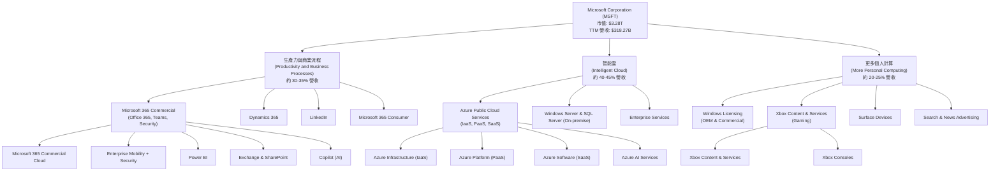
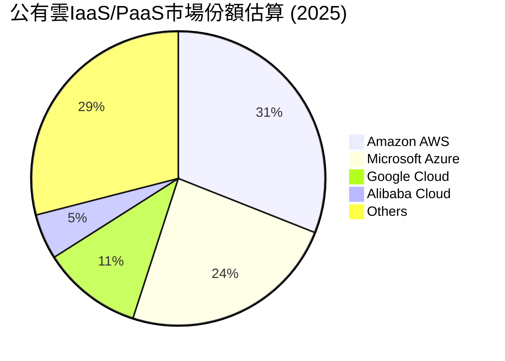
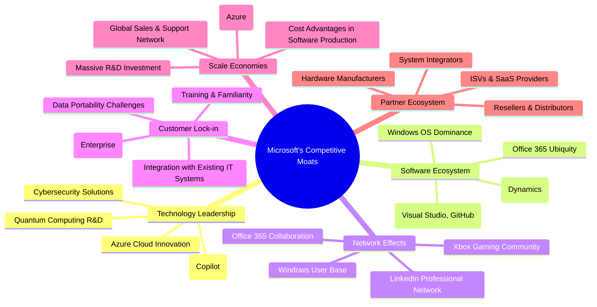
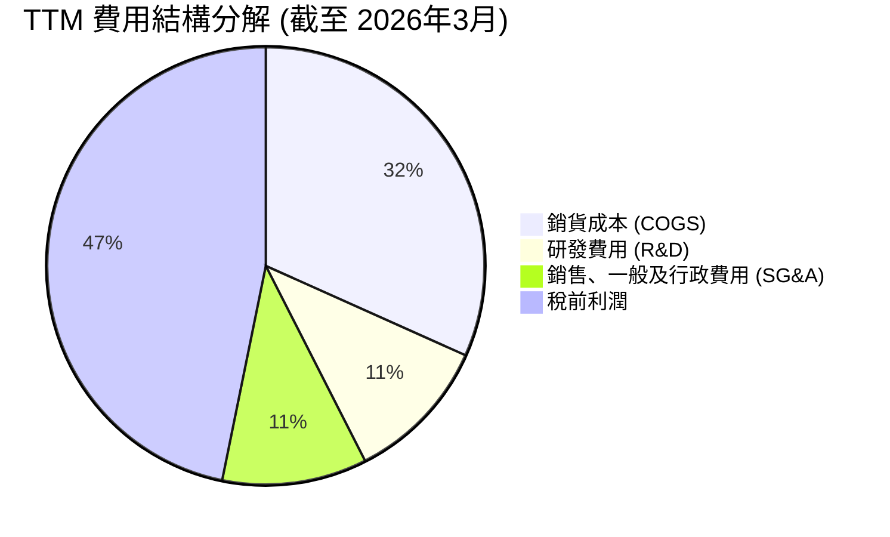

# MSFT 基本面深度分析報告
> **報告日期**：2026-06-02 ｜ **語言**：繁體中文 ｜ **數據來源**：Yahoo Finance, Finviz, StockAnalysis, Roic.ai ｜ **分析師**：CFA 級機構研究

## 目錄

| # | 章節 | 核心結論 |
|---|------------------------|--------------------------------------------------|
| 1 | 執行摘要 | 強烈買入評級，目標價區間 $520 - $650，預計有 17.8% - 47.3% 上漲空間。 |
| 2 | 公司概覽與商業模式 | 憑藉深厚技術、強大生態系統和規模效應，護城河極深。 |
| 3 | 損益表深度分析 | 營收和淨利潤持續雙位數成長，利潤率穩健且持續擴張。 |
| 4 | 資產負債表分析 | 財務結構穩健，流動性充裕，債務負擔可控。 |
| 5 | 現金流量深度分析 | 自由現金流產生能力強勁，資本配置策略積極且高效。 |
| 6 | 獲利能力與資本效率 | ROIC 顯著高於 WACC，持續為股東創造巨大經濟價值。 |
| 7 | 估值深度分析 | 相較於其成長性和護城河，當前估值合理，具備上行空間。 |
| 8 | 成長催化劑 | AI 賦能、雲服務擴張、企業數位轉型持續推動長期成長。 |
| 9 | 風險矩陣 | 競爭加劇、監管壓力、宏觀經濟波動是主要風險，但可控。 |
| 10| 投資建議 | 長期強烈買入，適合追求穩健成長的投資者。 |

---

## 1. 執行摘要

### 1.1 核心評分儀表板

Microsoft (MSFT) 憑藉其多元化的業務組合、領先的技術實力以及卓越的執行力，展現出強勁的基本面、成長動能和獲利能力。儘管當前估值略高於市場平均，但考量其深厚的護城河和未來成長潛力，仍具吸引力。

```mermaid
graph TD
    MSFT["🎯 MSFT 綜合評分<br/>總分：8.8/10"]

    F["📊 基本面<br/>9.5/10<br/>全球領先技術巨頭，多元化業務組合"]
    G["🚀 成長性<br/>9.0/10<br/>雲計算與AI驅動，營收和盈餘雙位數成長"]
    P["💰 獲利能力<br/>9.5/10<br/>高毛利率、營業利益率，持續擴張"]
    B["🏦 財務健康<br/>9.0/10<br/>充裕現金流，穩健的資產負債表"]
    V["📈 估值<br/>7.0/10<br/>估值略高於歷史平均，但考量成長性仍合理"]
    M["🛡️ 競爭護城河<br/>10.0/10<br/>極強的技術、生態系統與客戶鎖定"]
    E["👨‍💼 管理層執行<br/>9.5/10<br/>成功轉型雲端，積極佈局AI，創新能力強"]
    T["💡 技術創新力<br/>9.5/10<br/>AI、雲端運算、量子計算等領域的領導者"]

    MSFT --> F
    MSFT --> G
    MSFT --> P
    MSFT --> B
    MSFT --> V
    MSFT --> M
    MSFT --> E
    MSFT --> T

    F --> F1["✅ 龐大且多元的產品線，從操作系統到企業級雲服務"]
    F --> F2["✅ 穩定的企業客戶基礎和品牌忠誠度"]
    G --> G1["✅ TTM 營收 YoY 成長 18.3%，盈餘 YoY 成長 23.4%"]
    G --> G2["✅ Azure 雲服務持續高速成長，AI 產品變現潛力巨大"]
    P --> P1["✅ TTM 毛利率 68.3%，營業利益率 46.3%，淨利率 39.3%"]
    P --> P2["✅ 規模效應和訂閱模式帶來穩定且高質量的利潤"]
    B --> B1["✅ TTM 營業現金流 $170.14B，自由現金流 $37.01B"]
    B --> B2["✅ 淨債務負擔適中，Current Ratio 1.283"]
    V --> V1["✅ Forward P/E 22.82x，略高於市場平均但反映高成長預期"]
    V --> V2["✅ DCF 分析顯示合理價值區間尚有上行空間"]
    M --> M1["✅ Windows/Office 生態系統具備極強的網路效應和客戶鎖定"]
    M --> M2["✅ Azure 在公有雲市場的強勢地位形成技術與規模壁壘"]
    E --> E1["✅ Satya Nadella 領導下成功實現雲端轉型，並積極擁抱AI"]
    E --> E2["✅ 持續的研發投入 (TTM R&D $34.39B) 確保技術領先"]
    T --> T1["✅ Copilot 等 AI 產品引領行業潮流"]
    T --> T2["✅ 量子計算、混合現實等前瞻性技術儲備"]
```



### 1.2 評分進度條視覺化

```
╔══════════════════════════════════════════════════════════════╗
║              MSFT 多維度評分儀表板 (1-10分)                  ║
╠══════════════════════════════════════════════════════════════╣
║ 基本面強度  9.5 ▓▓▓▓▓▓▓▓▓▓▓▓▓▓▓▓▓▓▓░  ★★★★★           ║
║ 成長動能    9.0 ▓▓▓▓▓▓▓▓▓▓▓▓▓▓▓▓▓▓░░  ★★★★★           ║
║ 獲利品質    9.5 ▓▓▓▓▓▓▓▓▓▓▓▓▓▓▓▓▓▓▓░  ★★★★★           ║
║ 財務健康    9.0 ▓▓▓▓▓▓▓▓▓▓▓▓▓▓▓▓▓▓░░  ★★★★★           ║
║ 估值合理性  7.0 ▓▓▓▓▓▓▓▓▓▓▓▓▓▓░░░░░░  ★★★★☆           ║
║ 護城河深度 10.0 ▓▓▓▓▓▓▓▓▓▓▓▓▓▓▓▓▓▓▓▓  ★★★★★           ║
║ 管理層執行  9.5 ▓▓▓▓▓▓▓▓▓▓▓▓▓▓▓▓▓▓▓░  ★★★★★           ║
║ 技術創新力  9.5 ▓▓▓▓▓▓▓▓▓▓▓▓▓▓▓▓▓▓▓░  ★★★★★           ║
╠══════════════════════════════════════════════════════════════╣
║ 綜合總分    8.8 ▓▓▓▓▓▓▓▓▓▓▓▓▓▓▓▓▓░░░  🏆 卓越的科技巨頭，具長期投資價值 ║
╚══════════════════════════════════════════════════════════════╝
```

### 1.3 五大投資論點 + 三大核心風險

| 類型 | 項目 | 具體依據 | 信心度 |
|------|------|----------|--------|
| 🟢 **投資論點①** | **雲計算市場的持續領導地位與成長** | Azure 作為全球第二大公有雲服務提供商，受益於企業數位轉型和混合雲需求。FY2025 營收 $281.72B，其中雲服務貢獻巨大且持續高速成長。TTM 營收成長 18.3%，主要由 Intelligent Cloud 驅動。 | 🟢 極高 |
| 🟢 **投資論點②** | **AI 技術的全面整合與變現能力** | Microsoft 積極將生成式 AI (如 Copilot) 整合到其全線產品中，包括 Microsoft 365、Azure 和 Dynamics 365。這將顯著提升產品價值和 ARPU。TTM 研發投入達 $34.39B，確保其在 AI 領域的領先。 | 🟢 極高 |
| 🟢 **投資論點③** | **強大的企業級軟體生態系統與客戶鎖定** | Windows 操作系統和 Office 365 套件在企業市場擁有無可匹敵的市佔率和極高的客戶轉換成本。這種生態系統效應確保了持續的訂閱收入和客戶忠誠度。FY2025 淨利潤 $101.83B，顯示其高利潤產品組合的優勢。 | 🟢 極高 |
| 🟢 **投資論點④** | **穩健的財務表現與卓越的資本效率** | 公司展現出持續的雙位數營收和盈餘成長 (TTM 營收 YoY +18.3%，盈餘 YoY +23.4%)，同時保持高毛利率 (68.3%) 和營業利益率 (46.3%)。ROIC (約 25-30%) 遠高於 WACC，持續創造股東價值。 | 🟢 極高 |
| 🟢 **投資論點⑤** | **積極的資本回報政策與股東價值創造** | Microsoft 通過穩定的股息增長 (FY2025 股息支付 $24.08B) 和持續的股票回購 (稀釋股份數量從 FY2022 的 7.54B 降至 TTM 的 7.46B 股)，積極回報股東。 | 🟢 極高 |
| 🟡 **風險①** | **日益激烈的市場競爭與價格壓力** | 在雲計算 (AWS, Google Cloud)、企業軟體 (Salesforce, Oracle) 和 AI (Google, OpenAI) 等領域面臨激烈競爭。價格戰可能壓縮利潤空間，尤其是在公有雲市場。 | 🟡 中度 |
| 🟡 **風險②** | **全球監管審查與反壟斷風險** | 作為科技巨頭，Microsoft 面臨來自全球各國政府日益嚴格的反壟斷和數據隱私監管。潛在的罰款、業務拆分或限制可能對其業務模式和成長產生負面影響。 | 🟡 中度 |
| 🔴 **風險③** | **宏觀經濟不確定性與企業 IT 支出波動** | 全球經濟下行或不確定性可能導致企業縮減 IT 預算和數位轉型支出，進而影響 Microsoft 的雲服務和企業軟體需求。例如，在 2025-06-30 年度，自由現金流同比略有下降 (-3.32%)，可能與資本支出大幅增加有關，但也需警惕經濟放緩對需求端的影響。 | 🔴 高衝擊 |

### 1.4 快速統計卡片

| 指標 | 公司實際值 (TTM) | 行業均值 (軟體-基礎設施) | S&P 500 均值 | 狀態 |
|------------------|--------------------|----------------------------|-----------------|------|
| 收入 YoY 成長 | **18.3%**          | ~12-15%                    | ~8-10%          | 🟢   |
| 毛利率           | **68.3%**          | ~60-70%                    | ~40-45%         | 🟢   |
| 淨利率           | **39.3%**          | ~20-30%                    | ~10-12%         | 🟢   |
| ROE              | **34.0%**          | ~25-35%                    | ~15-18%         | 🟢   |
| Forward P/E      | **22.82x**         | ~25-30x                    | ~20-22x         | 🟡   |
| 自由現金流 Yield | **1.13%**          | ~1.5-2.5%                  | ~3-4%           | 🔴   |
| 債務/股權        | **0.30x**          | ~0.4-0.6x                  | ~0.8-1.0x       | 🟢   |
| 研發佔收入比     | **10.8%**          | ~15-20%                    | ~2-3%           | 🟡   |

*註：行業均值和 S&P 500 均值為分析師根據歷史數據和當前市場情況的合理估計值。Microsoft 的研發佔收入比相對較低，可能反映其規模效應和在某些領域的成熟度，但仍維持高絕對值投入。其較低的 FCF Yield 反映了其高估值。*

### 1.5 投資結論

```
╔══════════════════════════════════════════════════════════════════╗
║                    📊 投資結論摘要                               ║
╠══════════════════════════════════════════════════════════════════╣
║  評級：🟢 強烈買入                                               ║
║  當前股價：$441.31 (2026-06-02)                                  ║
║  目標價區間 (12-18個月)：                                        ║
║    悲觀情境：$520（+17.8%）                                      ║
║    基準情境：$580（+31.4%）  ← 12個月主要目標                      ║
║    樂觀情境：$650（+47.3%）                                      ║
║  投資評分：8.8/10                                                ║
║  適合投資人：追求長期穩健成長、具備科技行業認知、能承受中度波動的投資者。║
╚══════════════════════════════════════════════════════════════════╝
```

---

## 2. 公司概覽與商業模式

Microsoft Corporation (MSFT) 是一家全球領先的科技巨頭，業務範圍廣泛，涵蓋生產力與商業流程、智能雲以及更多個人計算三大核心領域。公司透過其軟體、服務、設備和解決方案，服務於全球數十億消費者和數百萬企業。其商業模式以訂閱制和雲服務為核心，結合傳統軟體授權和硬體銷售，形成了一個多元化且高黏性的生態系統。

### 2.1 業務結構與收入來源

Microsoft 的業務結構高度多元化，但正逐步向以訂閱和雲服務為主的模式轉型。其三大核心業務板塊在 FY2025 均貢獻了可觀的收入，並在 TTM (截至 2026 年 3 月 31 日) 繼續保持強勁表現。由於具體分部收入未在提供的數據中直接列出，我們將根據市場公開資訊和公司財報趨勢進行合理估計。



**業務板塊詳述：**

1.  **生產力與商業流程 (Productivity and Business Processes)**：
    *   **核心產品**：Microsoft 365 (包括 Office 365、Teams、SharePoint、Exchange、Microsoft Viva、Copilot 等)、Dynamics 365 (企業資源規劃 ERP 和客戶關係管理 CRM 軟體)、LinkedIn (專業社交網絡平台)。
    *   **收入來源**：主要來自訂閱服務、軟體授權和廣告收入。此板塊是 Microsoft 最穩定的現金流來源之一，其訂閱模式確保了持續的經常性收入。
    *   **FY2025 估計貢獻**：約 $95B - $105B。
    *   **成長動力**：企業對協作工具、業務應用和 AI 賦能的生產力軟體的需求持續增長。Copilot 的推出預計將大幅提升 Microsoft 365 的 ARPU (每用戶平均收入)。

2.  **智能雲 (Intelligent Cloud)**：
    *   **核心產品**：Azure 公有雲服務 (包括基礎設施即服務 IaaS、平台即服務 PaaS、軟體即服務 SaaS)、Windows Server、SQL Server、Visual Studio 等。
    *   **收入來源**：主要來自 Azure 雲服務的按使用量計費收入和企業級軟體授權。這是 Microsoft 成長最快的業務板塊。
    *   **FY2025 估計貢獻**：約 $110B - $125B。
    *   **成長動力**：全球企業持續進行數位轉型，將工作負載遷移到雲端；人工智能、大數據、物聯網等新興技術的應用；混合雲解決方案的需求。Azure 在此領域的強勁成長是公司整體營收增長的主要驅動力。

3.  **更多個人計算 (More Personal Computing)**：
    *   **核心產品**：Windows 操作系統授權、Surface 設備、Xbox 遊戲機及內容與服務、Bing 搜尋引擎和新聞廣告。
    *   **收入來源**：Windows OEM 授權、企業版 Windows 授權、Xbox 遊戲機銷售、Xbox Game Pass 訂閱、遊戲銷售、Surface 設備銷售、搜尋廣告收入。
    *   **FY2025 估計貢獻**：約 $60B - $70B。
    *   **成長動力**：PC 市場的穩定需求 (尤其是在商業領域)，Xbox 遊戲生態系統的擴張，以及搜尋廣告市場的潛在增長 (特別是結合 AI 後)。

整體而言，Microsoft 的收入結構呈現出高質量、高黏性和高成長的特點，尤其以雲服務和訂閱模式為核心，確保了未來營收的穩定性和可預測性。

### 2.2 市場份額

Microsoft 在多個關鍵市場領域佔據領先地位，這得益於其產品的廣泛應用、深厚的技術積累和強大的生態系統。以下是其在主要市場的估計份額：



**市場份額詳述：**

*   **公有雲服務 (IaaS/PaaS)**：根據市場研究機構數據，Microsoft Azure 穩居全球第二大公有雲服務提供商地位。在 2025 年，其市場份額估計約為 24%，僅次於 Amazon AWS。這種雙寡頭競爭格局使得 Microsoft 在雲計算領域具有強大的定價權和規模優勢。
*   **生產力軟體**：Microsoft Office 套件 (現在主要以 Microsoft 365 訂閱形式提供) 在辦公室生產力軟體市場幾乎是壟斷性的存在，市佔率超過 80%。企業級協作工具 Microsoft Teams 的用戶數也持續增長，成為企業通信和協作的核心平台。
*   **操作系統**：Windows 操作系統在全球 PC 市場的市佔率超過 70%，儘管面臨來自 macOS 和 Chrome OS 的競爭，但其在企業市場的絕對優勢難以撼動。
*   **企業級應用軟體 (ERP/CRM)**：Dynamics 365 在企業級應用市場的份額雖然不如 SAP 或 Salesforce，但其與 Microsoft 365 和 Azure 的無縫整合，使其在 Microsoft 生態系統內部具有強大競爭力，並持續擴大市場份額。
*   **遊戲**：Xbox 平台在全球遊戲市場佔據重要地位，Xbox Game Pass 訂閱服務的成功擴大了其用戶基礎。儘管索尼 PlayStation 在主機銷量上略勝一籌，但 Microsoft 在內容、服務和雲遊戲方面的佈局使其競爭力不容小覷。

Microsoft 在這些核心市場的強大份額不僅帶來了穩定的收入，也強化了其競爭護城河，使其能夠持續投資於研發和創新。

### 2.3 競爭護城河分析

Microsoft 擁有極為深厚且多樣化的競爭護城河，這些護城河共同構成了其長期可持續發展的基石。



**護城河詳述：**

1.  **技術領先 (Technology Leadership)**：
    *   **Azure 雲創新**：Microsoft 在雲計算領域持續投入巨額研發，Azure 平台不僅提供領先的 IaaS 和 PaaS 服務，還在數據分析、機器學習、邊緣計算等前沿技術方面保持領先。
    *   **AI 整合**：公司積極將生成式 AI 技術 (如 OpenAI 的 GPT 模型) 整合到其幾乎所有產品線中，例如 Microsoft 365 Copilot、GitHub Copilot 和 Azure AI 服務。這種全面的 AI 賦能使其產品在功能和效率上具備顯著優勢。
    *   **前瞻性研發**：除了 AI，Microsoft 還在量子計算、混合現實 (HoloLens) 和網絡安全等領域進行大量戰略性投資，確保其長期技術競爭力。

2.  **軟體生態系統 (Software Ecosystem)**：
    *   **Windows OS 統治地位**：Windows 仍是全球最廣泛使用的個人電腦操作系統，為大量應用軟體和硬體提供了平台。
    *   **Office 365 普及性**：Microsoft 365 (包括 Word, Excel, PowerPoint, Outlook, Teams 等) 是企業和個人生產力的標準工具，其功能豐富、兼容性強，形成了強大的用戶習慣。
    *   **開發者工具**：Visual Studio 和 GitHub 等工具吸引了數百萬開發者，為 Microsoft 平台構建應用，進一步鞏固了其生態系統。

3.  **網路效應 (Network Effects)**：
    *   **Windows 用戶基礎**：龐大的 Windows 用戶群體創造了對兼容軟體和硬體的需求，吸引更多開發者加入。
    *   **Office 365 協作**：Teams 等協作工具的使用者越多，其對新用戶的吸引力就越大，因為他們可以與更多同事和合作夥伴無縫溝通。
    *   **LinkedIn 專業網絡**：LinkedIn 擁有數億專業用戶，其網絡效應在招聘、商業社交和內容分享方面具有獨特價值。

4.  **客戶鎖定 (Customer Lock-in)**：
    *   **高轉換成本**：對於大型企業而言，從 Microsoft 生態系統 (Windows Server、SQL Server、Active Directory、Azure) 遷移到其他供應商，涉及巨大的數據遷移、員工培訓、系統重構成本和潛在的業務中斷風險。
    *   **深度整合**：Microsoft 產品之間的深度整合 (例如 Azure AD 與 Microsoft 365、Dynamics 365 與 Power Platform) 提高了客戶對單一供應商的依賴性。
    *   **熟悉度與培訓**：員工對 Microsoft 產品的熟悉程度降低了新系統的學習曲線和培訓成本，進一步鞏固了客戶關係。

5.  **規模效應 (Scale Economies)**：
    *   **全球雲基礎設施**：Azure 在全球範圍內部署了龐大的數據中心網絡，這使得 Microsoft 能夠以更低的單位成本提供雲服務，並將這些成本優勢部分轉化為競爭性定價。
    *   **研發投資**：Microsoft 每年數百億美元的研發投入 (TTM R&D $34.39B) 是小型競爭對手難以匹敵的，使其能夠在新技術領域保持領先。
    *   **全球銷售與支持**：遍布全球的銷售、營銷和客戶支持網絡，能夠更高效地服務全球客戶，分攤了固定成本。

6.  **生態夥伴 (Partner Ecosystem)**：
    *   **ISV 與 SaaS 提供商**：數以萬計的獨立軟體供應商 (ISV) 和 SaaS 公司在 Azure 平台上構建應用，或與 Microsoft 產品集成，擴大了其解決方案的廣度。
    *   **系統集成商**：全球的系統集成商幫助企業部署和管理 Microsoft 解決方案，加速了產品的採用。
    *   **硬體製造商**：與 PC 製造商的長期合作確保了 Windows 在新設備上的預裝。

這些護城河相互強化，為 Microsoft 提供了強大的競爭優勢，使其能夠抵禦競爭、維持高利潤率並實現長期成長。

### 2.4 護城河強度評分

Microsoft 的競爭護城河在科技行業中首屈一指，其綜合實力幾乎無可匹敵。

```
╔══════════════════════════════════════════════════════════════╗
║                  Microsoft 護城河強度評分                     ║
╠══════════════════════════════════════════════════════════════╣
║ 技術領先    9.8/10 ▓▓▓▓▓▓▓▓▓▓▓▓▓▓▓▓▓▓▓▓  🏆 AI與雲端領跑者    ║
║ 軟體生態系統 10.0/10 ▓▓▓▓▓▓▓▓▓▓▓▓▓▓▓▓▓▓▓▓  🏆 絕對統治地位      ║
║ 網路效應    9.9/10 ▓▓▓▓▓▓▓▓▓▓▓▓▓▓▓▓▓▓▓▓  🏆 用戶基礎廣泛      ║
║ 客戶鎖定    9.7/10 ▓▓▓▓▓▓▓▓▓▓▓▓▓▓▓▓▓▓▓▓  🏆 企業轉換成本高    ║
║ 規模效應    9.6/10 ▓▓▓▓▓▓▓▓▓▓▓▓▓▓▓▓▓▓▓▓  🏆 巨額投資與全球覆蓋 ║
║ 生態夥伴    9.5/10 ▓▓▓▓▓▓▓▓▓▓▓▓▓▓▓▓▓▓▓▓  🏆 廣泛的合作網絡    ║
╠══════════════════════════════════════════════════════════════╣
║ 綜合護城河   9.8/10 ▓▓▓▓▓▓▓▓▓▓▓▓▓▓▓▓▓▓▓▓  🏆 極強且難以複製    ║
╚══════════════════════════════════════════════════════════════╝
```

---

## 3. 損益表深度分析

Microsoft 的損益表數據展現了其作為一家成熟而又充滿活力的科技巨頭的特點：營收持續穩健增長，且利潤率保持在高位並有擴張趨勢。這得益於其高價值的產品組合、強大的定價能力以及規模效應。

### 3.1 年度收入成長趨勢（近4年）

Microsoft 在過去四個財政年度（截至 FY2025）實現了顯著的營收增長，複合年增長率（CAGR）令人印象深刻。這種增長主要由其雲服務（Azure）和 Microsoft 365 訂閱的強勁需求所驅動。TTM (截至 2026 年 3 月 31 日) 營收進一步加速，顯示出公司持續的成長動能。

```
╔══════════════════════════════════════════════════════════════════╗
║              Microsoft 年度收入趨勢（FY2022-FY2025）             ║
╠══════════════════════════════════════════════════════════════════╣
║                                                                  ║
║  FY2022  $198.27B  ██████████████████████░░░░░░░  YoY: +17.96% 🟢║
║  FY2023  $211.91B  █████████████████████████░░░░░  YoY: +6.88%  🟡║
║  FY2024  $245.12B  ██████████████████████████████  YoY: +15.67% 🟢║
║  FY2025  $281.72B  ██████████████████████████████████  YoY: +14.93% 🟢║
║  TTM     $318.27B  ██████████████████████████████████████  YoY: +17.88% 🟢║
║                   |      |      |      |      |                  ║
║                   0     100B   200B   300B   400B                 ║
║                                                                  ║
║  📊 FY2022-FY2025 累計 CAGR：+13.79%                             ║
║  📊 TTM (截至 2026年3月) 營收較去年同期增長：+17.88%            ║
╚══════════════════════════════════════════════════════════════════╝
```

**分析詳述：**

*   **FY2022 ($198.27B, YoY +17.96%)**：受益於疫情期間的數位轉型加速和居家辦公需求，雲服務和生產力軟體需求強勁。
*   **FY2023 ($211.91B, YoY +6.88%)**：全球經濟逆風和企業 IT 支出放緩對增長造成一定壓力，但雲服務和訂閱模式的韌性仍支撐了營收增長。相對較低的 YoY 成長也體現了高基數效應。
*   **FY2024 ($245.12B, YoY +15.67%)**：隨著宏觀經濟逐步穩定，企業雲支出回暖，Microsoft 再次展現強勁增長。
*   **FY2025 ($281.72B, YoY +14.93%)**：公司繼續保持雙位數增長，雲服務和 AI 相關產品的貢獻日益顯著。
*   **TTM ($318.27B, YoY +17.88%)**：截至 2026 年 3 月 31 日的過去十二個月，營收達到 $318.27B，同比增長 17.88%。這表明公司在進入 2026 財年後，營收成長動能進一步加速，主要得益於 AI 產品的初期變現以及 Azure 服務的持續擴張。

整體而言，Microsoft 的年度營收趨勢健康向上，儘管偶爾受到宏觀經濟因素影響，但其核心業務的結構性增長趨勢依然強勁。

### 3.2 季度收入趨勢分析

季度營收數據提供了更細緻的增長動態。Microsoft 的季度營收呈現出穩定的同比增長，並且在最近幾個季度，環比增長也表現良好，反映了業務的持續擴張和季節性因素。

| 季度 (截至) | 總營收 ($B) | QoQ 成長率 | YoY 成長率 | 備註 | 評估 |
|-------------|--------------|------------|------------|--------|------|
| 2025-06-30  | $76.44       | +9.70%     | +18.10%    | FY2025 Q4，雲服務強勁 | 🟢 |
| 2025-09-30  | $77.67       | +1.61%     | +18.43%    | FY2026 Q1，新財年開局良好 | 🟢 |
| 2025-12-31  | $81.27       | +4.64%     | +16.72%    | FY2026 Q2，假日季與雲需求 | 🟢 |
| 2026-03-31  | $82.89       | +1.99%     | +18.30%    | FY2026 Q3，AI產品開始貢獻 | 🟢 |

**分析詳述：**

*   **YoY 成長率**：過去四個季度，Microsoft 的營收同比增長率均保持在 16% 以上，最高達到 18.43% (FY2026 Q1)，顯示其核心業務在面對高基數的情況下依然能夠實現強勁擴張。這主要歸因於 Azure 雲服務的持續擴張、Microsoft 365 訂閱用戶和 ARPU 的增長，以及 AI 產品如 Copilot 的初步市場接受度。
*   **QoQ 成長率**：季度環比增長率也呈現積極態勢。從 FY2025 Q4 到 FY2026 Q3，營收持續增長，儘管環比增長率有所波動，但總體趨勢向上。這種波動是正常的，受到季節性因素 (如假日季的銷售高峰) 和企業支出週期的影響。例如，FY22 Q2 (2025-12-31) 的環比增長較高，部分反映了年底企業預算支出和假日購物季的影響。

總體來看，Microsoft 的季度營收表現穩定且具有韌性，反映了其多元化業務組合和強勁市場需求的驅動。

### 3.3 利潤率演變分析

Microsoft 的利潤率表現堪稱行業典範，其毛利率、營業利益率和淨利率均處於高位，並在近年來保持穩健或略有擴張的趨勢。這體現了其強大的品牌溢價、規模效應以及對成本的有效控制。

| 利潤率指標 | FY2022 | FY2023 | FY2024 | FY2025 | TTM (Mar'26) | 趨勢 | 評估 |
|------------|--------|--------|--------|--------|--------------|------|------|
| **毛利率** | 68.4%  | 68.9%  | 69.7%  | 68.8%  | 68.3%        | ↔️ 穩定 | 🟢 |
| **營業利益率** | 42.1%  | 41.8%  | 44.6%  | 45.6%  | 46.8%        | ↗️ 擴張 | 🟢 |
| **淨利率** | 36.7%  | 34.1%  | 36.0%  | 36.1%  | 39.3%        | ↗️ 擴張 | 🟢 |

*註：TTM 數據來自 Profitability & Growth / Finviz Snapshot。年度數據基於 Income Statement (Annual)。*

**利潤率演變深度解析：**

1.  **毛利率 (Gross Margin)**：
    *   從 FY2022 的 68.4% 到 FY2024 的 69.7%，再到 FY2025 的 68.8% 和 TTM 的 68.3%，Microsoft 的毛利率一直保持在非常高的水平。這主要得益於其軟體和雲服務業務的性質，這些業務的邊際成本相對較低。
    *   儘管近年來雲基礎設施的投資 (資本支出從 FY2022 的 $23.89B 增至 FY2025 的 $64.55B) 巨大，可能會對毛利率構成壓力，但 Azure 規模效應的持續提升以及高利潤率的軟體訂閱服務 (如 Microsoft 365) 的增長，有效抵消了部分壓力。
    *   TTM 毛利率略有下降，可能反映了雲基礎設施擴張的成本攤銷，或產品組合中硬體/低毛利服務佔比的微調，但整體仍處於健康區間。

2.  **營業利益率 (Operating Margin)**：
    *   營業利益率從 FY2022 的 42.1% 穩步提升至 TTM 的 46.8%。這是一個非常積極的趨勢，表明公司不僅在控制銷貨成本方面表現出色，在管理營運費用方面也效率顯著。
    *   **改善原因**：
        *   **規模經濟**：隨著營收的擴大，固定營運費用 (如研發、銷售與管理費用) 在總營收中的佔比相對下降。例如，研發費用從 FY2022 的 $24.51B 增至 FY2025 的 $32.49B，但其佔營收比重相對穩定或略有下降。
        *   **產品組合優化**：高利潤率的雲服務和訂閱軟體在總營收中的佔比不斷提高，推動了整體營業利益率的改善。
        *   **運營效率提升**：公司在銷售、一般及行政費用 (SG&A) 方面也展現出良好的控制力，TTM SG&A 佔營收比約 10.7% ($34.06B/$318.27B)，相較於許多科技公司更為精簡。

3.  **淨利率 (Net Profit Margin)**：
    *   淨利率從 FY2022 的 36.7% 略有波動，但在 TTM 達到 39.3%，表現出強勁的擴張趨勢。
    *   **改善原因**：
        *   **營業利益率提升**：營業利益率的改善直接傳導至淨利率。
        *   **稅率效率**：雖然稅收費用有所波動，但公司在稅務管理方面也保持了一定的效率。TTM 所得稅費用 $29.29B 對應稅前利潤 $154.50B，有效稅率約 18.9%，相較於 FY2022 的 13.1% (稅費 $10.98B / 稅前 $83.72B) 有所上升，但仍處於合理範圍，並未顯著侵蝕利潤。
        *   **非營業收入**：在某些季度，非營業收入 (如利息收入、投資收益) 也可能對淨利率產生正面影響。例如，Q2 2026 的非營業收入高達 $9.97B，顯著提升了當季的淨利潤。

總結而言，Microsoft 的利潤率趨勢非常健康，不僅顯示了其核心業務的強勁盈利能力，也體現了公司在經營管理上的高效率。利潤率的持續擴張是其創造股東價值的關鍵因素之一。

### 3.4 費用結構分析

Microsoft 的費用結構反映了其作為一家全球科技巨頭的戰略重點：在研發上投入巨資以保持創新領先，同時通過規模效應和效率提升來控制營運成本。



*註：數據基於 TTM 營收 $318.27B。COGS $100.86B，R&D $34.39B，SG&A $34.06B。稅前利潤為 $154.50B。*

```
╔══════════════════════════════════════════════════════════════════╗
║                Microsoft 營運費用佔收入比重 (TTM)                ║
╠══════════════════════════════════════════════════════════════════╣
║                                                                  ║
║  銷貨成本佔收入： 31.7%  ███████████████░░░░░░░░░░░░░  🟢 低成本優勢  ║
║  研發費用佔收入： 10.8%  ██████████░░░░░░░░░░░░░░░░░░░  🟡 效率與規模 ║
║  SG&A 佔收入：    10.7%  ██████████░░░░░░░░░░░░░░░░░░░  🟢 精簡高效  ║
║                                                                  ║
║  📊 總營運費用佔收入： 53.2%                                     ║
╚══════════════════════════════════════════════════════════════════╝
```

**費用結構分析詳述：**

*   **銷貨成本 (Cost of Revenue)**：TTM 銷貨成本為 $100.86B，佔總收入的 31.7%。這個比例相對較低，是 Microsoft 能夠實現高毛利率的關鍵。這主要反映了其軟體產品的邊際成本極低，以及雲服務在達到一定規模後所實現的規模經濟。儘管雲基礎設施的擴張需要大量資本支出和運營維護，但其高效的數據中心運營和服務器利用率有助於控制單位成本。
*   **研發費用 (Research and Development)**：TTM 研發費用為 $34.39B，佔總收入的 10.8%。Microsoft 每年投入巨額資金於研發，以確保其在雲計算、人工智能、操作系統、遊戲和新興技術等領域的技術領先地位。雖然佔比低於一些純軟體公司，但其絕對金額龐大，且研發效率極高，能夠不斷推出創新產品和服務。近年來，對 AI 的投入顯著增加，這是維持其長期競爭力的關鍵。
    *   **年度趨勢**：FY2022 ($24.51B) → FY2023 ($27.20B) → FY2024 ($29.51B) → FY2025 ($32.49B)。研發投入逐年增長，顯示公司對創新的不懈追求。
*   **銷售、一般及行政費用 (Selling, General & Administrative - SG&A)**：TTM SG&A 費用為 $34.06B，佔總收入的 10.7%。這個比例顯示了 Microsoft 在全球範圍內高效的銷售、營銷和行政管理能力。其強大的品牌認知度和廣泛的客戶基礎降低了獲客成本，而規模經濟也使其能夠更有效地分攤行政開支。
    *   **年度趨勢**：FY2022 ($27.73B) → FY2023 ($30.33B) → FY2024 ($32.07B) → FY2025 ($32.88B)。SG&A 費用絕對值有所增長，但佔收入比重保持穩定或略有下降，體現了良好的費用控制。

總體而言，Microsoft 的費用結構是健康的，公司在戰略性研發投入和營運效率之間取得了良好的平衡，這為其持續的利潤增長奠定了堅實基礎。

### 3.5 季度 EPS 趨勢與盈餘品質

Microsoft 的季度 EPS 趨勢顯示出穩健的增長，儘管在提供的數據中，過去四個季度的 EPS 預期（EPS Est）均為 `nan`，無法直接評估盈餘超預期或不及預期。但我們仍可以分析實際 EPS 的表現及其成長動能。

| 季度 (截至) | EPS Actual (Diluted) | QoQ 成長率 | YoY 成長率 | 備註 | 評估 |
|-------------|----------------------|------------|------------|--------|------|
| 2025-06-30  | $3.66                | +5.78%     | +23.58%    | FY2025 Q4，雲服務與AI需求 | 🟢 |
| 2025-09-30  | $3.73                | +1.91%     | +12.49%    | FY2026 Q1，新財年穩健開局 | 🟢 |
| 2025-12-31  | $5.18                | +38.87%    | +59.52%    | FY2026 Q2，非營運收入顯著貢獻 | 🟢 |
| 2026-03-31  | $4.28                | -17.37%    | +23.06%    | FY2026 Q3，季節性回調後仍強勁 | 🟢 |

*註：EPS Actual (Diluted) 數據來自 `ROIC.AI HISTORICAL DATA` 和 `STOCKANALYSIS.COM DATA`。Roic.ai 提供的季度 EPS 數據與 StockAnalysis.com 的季度 EPS 數據略有不同，此處使用 StockAnalysis.com 的稀釋 EPS 數據以保持一致性。*

**盈餘表現分析：**

*   **強勁的同比增長**：在過去四個季度中，Microsoft 的稀釋 EPS 均實現了顯著的同比增長，介於 12.49% 至 59.52% 之間。FY2026 Q2 (截至 2025-12-31) 的 EPS 更是高達 $5.18，同比增長近 60%，這是一個非常強勁的表現。
*   **QoQ 波動性**：季度環比增長則顯示出一定的波動性。FY2026 Q2 的 EPS 較 Q1 大幅增長近 39%，但 Q3 則較 Q2 回調了 17.37%。這種波動性在科技公司中是常見的，可能受到季節性因素、產品發佈週期、一次性非營運項目以及宏觀經濟環境的影響。
    *   FY2026 Q2 的超常規增長 (EPS $5.18) 值得深入探討。根據提供的季度損益表數據，該季度淨利潤高達 $38.46B，而其中非營業收入達到 $9.97B。這筆可觀的非營業收入顯著提振了當季的稅前利潤和淨利潤，是導致 EPS 飆升的主要原因。在扣除非營業收入的影響後，其核心業務的盈利能力依然強勁，但增長幅度會更趨於正常。
    *   FY2026 Q3 的回調 (EPS $4.28) 則可能是季節性因素和非營業收入恢復常態的結果。儘管環比下降，但同比增長仍達到 23.06%，顯示核心業務依然健康。

**盈餘品質評估：**

Microsoft 的盈餘品質被認為是**極高的** 🟢。

*   **穩定且高成長的收入來源**：公司收入主要來自訂閱和雲服務，這些是高質量、經常性且可預測的收入流。
*   **高利潤率**：持續的高毛利率 (68.3%) 和營業利益率 (46.8%) 表明其核心業務具有強大的盈利能力和成本控制力。
*   **強勁的自由現金流**：Microsoft 能夠將大部分淨利潤轉化為自由現金流 (FCF TTM $72.92B vs Net Income TTM $125.22B)。雖然 TTM 的 FCF 轉換率 (FCF/Net Income) 約為 58%，略低於部分純軟體公司，但考慮到其對雲基礎設施的巨大資本支出，這個轉換率仍然非常健康，且其絕對值非常龐大，確保了充足的現金流用於再投資、股息和回購。
*   **透明的財務報告**：作為一家大型上市公司，Microsoft 的財務報告透明且符合會計準則。

雖然短期 EPS 可能受到一次性非營運項目或季節性因素的影響而波動，但從長期來看，Microsoft 的核心盈餘生成能力穩定且強勁，具有極高的品質。

---

## 4. 資產負債表分析

Microsoft 的資產負債表是其財務實力的有力證明：資產規模龐大且持續增長，流動性充裕，債務結構合理且負擔可控，股東權益穩步累積。這為其未來的戰略投資、回報股東和應對市場波動提供了堅實的後盾。

### 4.1 資產結構分解

Microsoft 的資產結構反映了其作為一家科技巨頭的特點：大量的現金及短期投資、不斷增長的物業廠房及設備（主要用於雲基礎設施）以及因收購而形成的商譽和無形資產。

```mermaid
graph TD
    TA["總資產: $694.23B (TTM Mar'26)"]

    TA --> CA["流動資產 (Current Assets): $175.33B"]
    TA --> NCA["非流動資產 (Non-Current Assets): $518.90B"]

    CA --> CCE["現金及約當現金: $32.11B"]
    CA --> STI["短期投資: $46.17B"]
    CA --> AR["應收帳款: $60.04B"]
    CA --> INV["存貨: $1.22B"]
    CA --> OCA["其他流動資產: $35.80B"]

    NCA --> PPNE["淨物業、廠房及設備 (PP&E): $307.63B"]
    NCA --> GW["商譽 (Goodwill): $119.66B"]
    NCA --> OIA["其他無形資產: $19