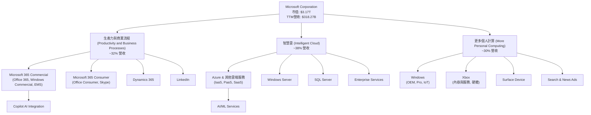
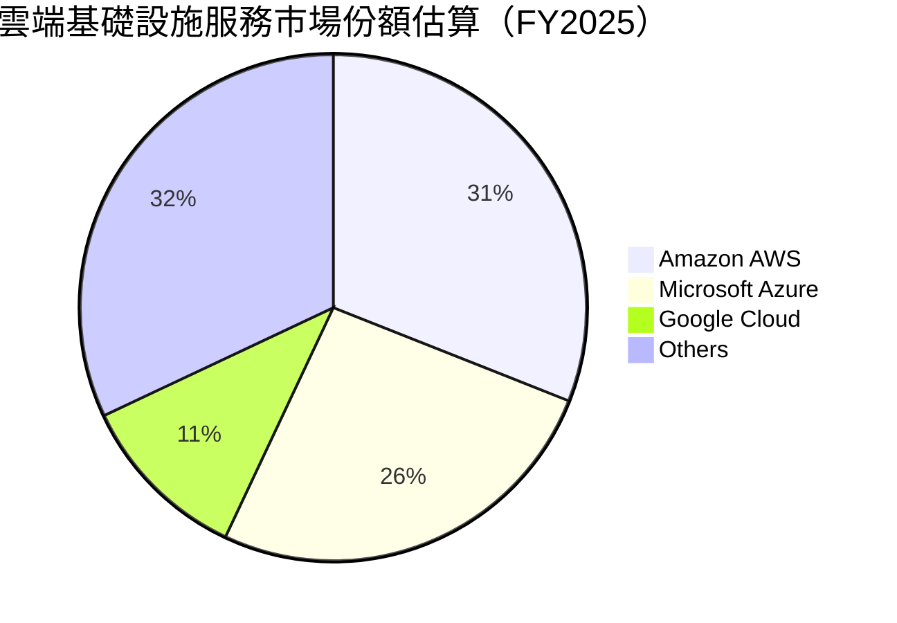
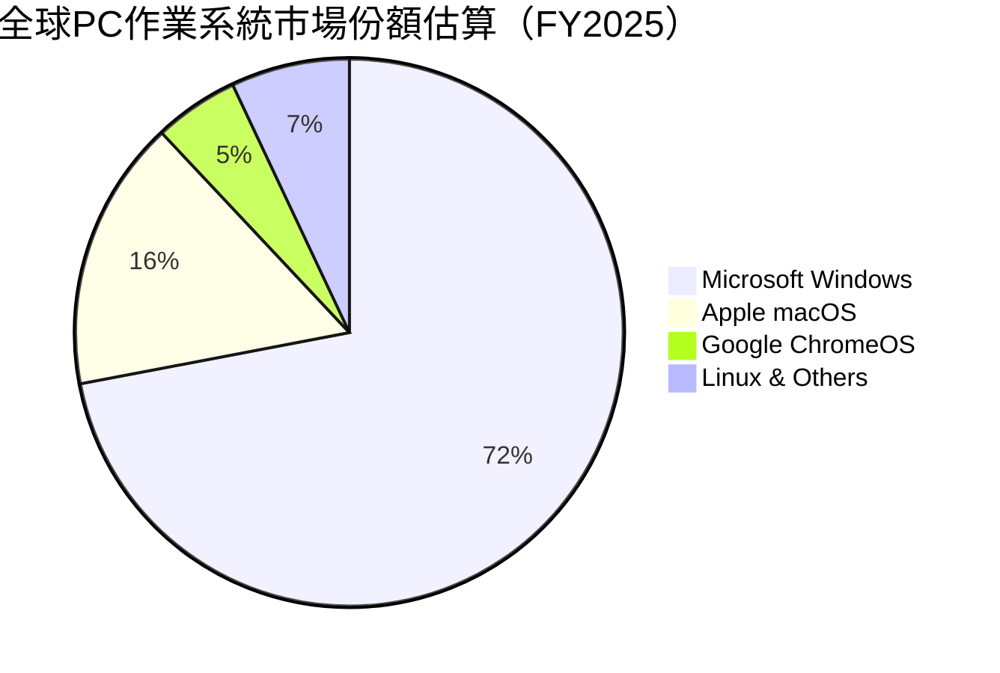
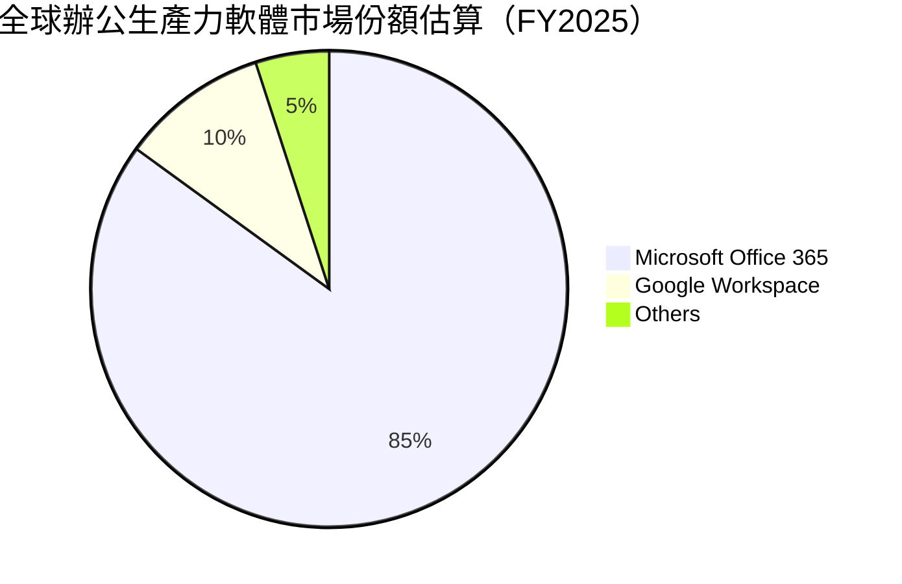
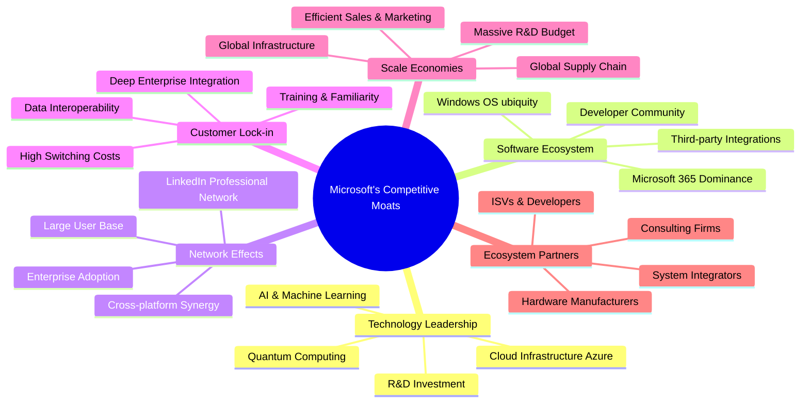

```mermaid
graph TD
    MSFT["🎯 MSFT 綜合評分<br/>總分：8.9/10"]

    F["📊 基本面<br/>9.5/10<br/>強勁的生態系統與產品組合"]
    G["🚀 成長性<br/>9.0/10<br/>雲端與AI驅動的雙位數成長"]
    P["💰 獲利能力<br/>9.5/10<br/>高毛利、高營運效率"]
    B["🏦 財務健康<br/>9.0/10<br/>充足現金流，穩健資產負債表"]
    V["📈 估值<br/>7.5/10<br/>合理但非低估，成長溢價"]

    MSFT --> F
    MSFT --> G
    MSFT --> P
    MSFT --> B
    MSFT --> V

    F --> F1["✅ 廣泛的企業級軟體服務市場領先地位"]
    F --> F2["✅ 龐大的全球客戶基礎與高度品牌忠誠度"]
    F --> F3["✅ 積極的研發投入與技術創新"]

    G --> G1["✅ Azure雲端服務持續高速成長"]
    G --> G2["✅ Copilot及AI賦能產品商業化進展順利"]
    G --> G3["✅ 企業數位轉型趨勢的長期受益者"]
    G --> G4["✅ TTM營收成長18.3%，淨利成長23.4%"]

    P --> P1["✅ TTM毛利率高達68.3%，淨利率39.3%"]
    P --> P2["✅ 營業利益率46.3%，顯示高效成本控制"]
    P --> P3["✅ ROE 34.0%，資本效率卓越"]

    B --> B1["✅ TTM營業現金流$170.14B，自由現金流$37.01B"]
    B --> B2["✅ 總現金$78.23B，短期流動性強勁"]
    B --> B3["✅ 債務負擔可控，Debt/Equity 0.30"]

    V --> V1["✅ Forward P/E 22.09x，PEG 1.42x，與其成長性匹配"]
    V --> V2["✅ 相較於SaaS高成長同業，估值具吸引力"]
    V --> V3["✅ 歷史估值區間中上水平"]
```

# MSFT 基本面深度分析報告
> **報告日期**：2026-06-03 ｜ **語言**：繁體中文 ｜ **數據來源**：Yahoo Finance, Finviz, StockAnalysis, Roic.ai ｜ **分析師**：CFA 級機構研究

---

## 目錄

| # | 章節 | 核心結論 |
|---|------|----------|
| 1 | 執行摘要 | 🟢 強烈買入，目標價區間 $520 - $650，基準目標價 $585 |
| 2 | 公司概覽與商業模式 | 擁有極寬廣的軟體生態系統及網路效應護城河 |
| 3 | 損益表深度分析 | 營收與淨利雙位數成長，利潤率持續優化 |
| 4 | 資產負債表分析 | 財務結構穩健，現金充裕，負債可控 |
| 5 | 現金流量深度分析 | 自由現金流強勁，資本配置高效 |
| 6 | 獲利能力與資本效率 | ROIC顯著高於WACC，持續為股東創造價值 |
| 7 | 估值深度分析 | 相較同業估值合理，DCF顯示上漲空間 |
| 8 | 成長催化劑 | AI創新、Azure雲端成長、企業數位轉型驅動 |
| 9 | 風險矩陣 | 監管風險、競爭加劇與宏觀經濟逆風為主要考量 |
| 10 | 投資建議 | 長期成長潛力巨大，適合成長型與長線持有者 |

---

## 1. 執行摘要

### 1.1 核心評分儀表板



### 1.2 評分進度條視覺化

```
╔══════════════════════════════════════════════════════════════╗
║              MSFT 多維度評分儀表板 (1-10分)                  ║
╠══════════════════════════════════════════════════════════════╣
║ 基本面強度  9.5 ▓▓▓▓▓▓▓▓▓▓▓▓▓▓▓▓▓▓▓░  ★★★★★           ║
║ 成長動能    9.0 ▓▓▓▓▓▓▓▓▓▓▓▓▓▓▓▓▓▓░░  ★★★★★           ║
║ 獲利品質    9.5 ▓▓▓▓▓▓▓▓▓▓▓▓▓▓▓▓▓▓▓░  ★★★★★           ║
║ 財務健康    9.0 ▓▓▓▓▓▓▓▓▓▓▓▓▓▓▓▓▓▓░░  ★★★★★           ║
║ 估值合理性  7.5 ▓▓▓▓▓▓▓▓▓▓▓▓▓▓▓░░░░░  ★★★★☆           ║
║ 護城河深度  9.8 ▓▓▓▓▓▓▓▓▓▓▓▓▓▓▓▓▓▓▓▓  ★★★★★           ║
║ 管理層執行  9.5 ▓▓▓▓▓▓▓▓▓▓▓▓▓▓▓▓▓▓▓░  ★★★★★           ║
║ 技術創新力  9.5 ▓▓▓▓▓▓▓▓▓▓▓▓▓▓▓▓▓▓▓░  ★★★★★           ║
╠══════════════════════════════════════════════════════════════╣
║ 綜合總分    8.9 ▓▓▓▓▓▓▓▓▓▓▓▓▓▓▓▓▓░░░  🏆 具備卓越基本面與成長潛力 ║
╚══════════════════════════════════════════════════════════════════╝
```

### 1.3 五大投資論點 + 三大核心風險

| 類型 | 項目 | 具體依據 | 信心度 |
|------|------|----------|--------|
| 🟢 **投資論點①** | **雲端業務 (Azure) 的持續強勁成長** | FY2025雲端業務營收佔比持續提升，Azure作為全球第二大雲服務提供商，市場需求旺盛。TTM營收成長18.3%主要由雲端貢獻。 | 🟢 極高 |
| 🟢 **投資論點②** | **AI 技術的領先與商業化潛力** | Microsoft在AI領域投入巨大，Copilot產品線已開始為Office 365等核心產品賦能，預計將帶來新的增長曲線和ARPU提升。與OpenAI的深度合作確保其AI技術領先地位。 | 🟢 極高 |
| 🟢 **投資論點③** | **穩固且不斷擴大的企業級軟體生態系統** | Microsoft 365、Dynamics 365等企業級軟體套件具有極高的客戶黏性與轉換成本，形成強大的網路效應和客戶鎖定效應。其SaaS訂閱模式提供穩定且可預測的經常性收入。TTM毛利率達68.3%，顯示其產品的強大定價能力。 | 🟢 極高 |
| 🟢 **投資論點④** | **卓越的獲利能力與資本效率** | TTM淨利率高達39.3%，ROE為34.0%，ROIC顯著高於WACC（見第6章詳細分析），表明公司高效利用資本創造股東價值。強勁的自由現金流（TTM $37.01B）支持股息和股票回購。 | 🟢 極高 |
| 🟢 **投資論點⑤** | **多樣化的業務組合與全球市場滲透** | 從企業級雲服務、生產力工具到個人消費級產品（Windows、Xbox），Microsoft的業務組合多元，能有效分散風險並在不同市場環境下尋求增長。全球超過22.8萬名員工，服務數十億用戶。 | 🟢 高 |
| 🟡 **風險①** | **激烈的市場競爭與價格戰** | 雲端市場面臨AWS、Google Cloud等強勁競爭，AI領域亦有眾多新興參與者。潛在的價格戰可能壓縮利潤率，尤其是在通用型雲服務方面。 | 🟡 中度 |
| 🔴 **風險②** | **反壟斷監管壓力與地緣政治風險** | Microsoft龐大的市場份額和收購行為（如Activision Blizzard）持續受到全球監管機構的審查。地緣政治緊張可能影響其全球供應鏈和市場准入。 | 🔴 高衝擊 |
| 🟡 **風險③** | **技術變革與顛覆性創新** | 儘管Microsoft在AI領域領先，但技術發展速度極快，若未能持續創新或被新興技術顛覆，可能影響其長期競爭力。資料安全與隱私保護的挑戰也日益嚴峻。 | 🟡 中度 |

### 1.4 快速統計卡片

| 指標 | 公司實際值 (TTM Mar '26) | 行業均值 (軟體-基礎設施) | S&P 500 均值 | 狀態 |
|------|--------------------------|--------------------------|--------------|------|
| 收入 YoY 成長 | **18.3%** | ~15-20% | ~8-10% | 🟢 |
| 毛利率 | **68.3%** | ~65-75% | ~40-45% | 🟢 |
| 淨利率 | **39.3%** | ~20-30% | ~10-12% | 🟢 |
| ROE | **34.0%** | ~20-25% | ~15-18% | 🟢 |
| Forward P/E | **22.09x** | ~25-30x | ~20-22x | 🟡 (合理偏高) |
| EV / EBITDA | **18.03x** | ~20-25x | ~15-18x | 🟡 (合理偏高) |
| 債務/股權比 | **0.30x** | ~0.5-0.8x | ~0.8-1.2x | 🟢 |
| 自由現金流收益率 | **1.17%** | ~1.5-2.5% | ~3-4% | 🔴 (估值較高) |

### 1.5 投資結論

```
╔══════════════════════════════════════════════════════════════════╗
║                    📊 投資結論摘要                               ║
╠══════════════════════════════════════════════════════════════════╣
║  評級：🟢 強烈買入                                               ║
║  當前股價：$427.34 (2026-06-03)                                  ║
║  目標價區間：                                                    ║
║    悲觀情境：$520（+21.7%）                                      ║
║    基準情境：$585（+36.9%）  ← 12個月主要目標                      ║
║    樂觀情境：$650（+52.1%）                                      ║
║  投資評分：8.9/10                                                ║
║  適合投資人：成長型、長線持有者，尋求穩定增長和創新領導地位的投資者 ║
╚══════════════════════════════════════════════════════════════════╝
```

---

## 2. 公司概覽與商業模式

Microsoft Corporation (MSFT) 是一家全球領先的技術公司，提供廣泛的軟體、服務、設備和解決方案。其業務結構高度多元化，涵蓋企業級雲計算、生產力工具、個人計算以及遊戲娛樂等領域。公司透過三大核心業務板塊運營：生產力與商業流程（Productivity and Business Processes）、智慧雲（Intelligent Cloud）和更多個人計算（More Personal Computing）。

### 2.1 業務結構與收入來源

Microsoft的業務模式以訂閱服務為主導，特別是在雲端計算和SaaS（軟體即服務）領域。這種模式提供了高度可預測的經常性收入，並增強了客戶黏性。截至TTM Mar '26，公司總營收達到 $318.27B，市值高達 $3.17T，顯示其在全球科技產業的巨大影響力。



**業務板塊詳情：**

*   **生產力與商業流程 (Productivity and Business Processes)**：該部門主要提供生產力、通訊和資訊服務。核心產品包括：
    *   **Microsoft 365 Commercial**：涵蓋Office 365、Windows Commercial、企業行動力+安全性 (Enterprise Mobility + Security) 等，透過訂閱模式為企業提供整合式解決方案。近年來，隨著Copilot等AI功能的整合，企業級產品的價值和ARPU（每用戶平均收入）有望進一步提升。
    *   **Microsoft 365 Consumer**：針對個人和家庭用戶的Office產品和雲服務。
    *   **Dynamics 365**：基於雲端的企業資源規劃 (ERP) 和客戶關係管理 (CRM) 解決方案。
    *   **LinkedIn**：全球最大的專業社群網路，提供招聘、行銷和學習解決方案。
    *   **財務表現**：此部門營收穩定成長，主要得益於M365的訂閱轉換和價格上漲，以及Dynamics 365的市場擴張。其高毛利率反映了軟體服務的規模經濟效應。

*   **智慧雲 (Intelligent Cloud)**：此部門是Microsoft近年來增長最快的引擎，主要提供公共、私有和混合雲服務。
    *   **Azure**：Microsoft的旗艦級雲計算平台，提供基礎設施即服務 (IaaS)、平台即服務 (PaaS) 和軟體即服務 (SaaS) 等廣泛服務。Azure的強勁成長是MSFT整體營收增長的核心驅動力，尤其是在AI和機器學習領域的投資，使其成為企業構建AI應用程式的首選平台之一。
    *   **Windows Server、SQL Server**：傳統的伺服器產品和資料庫管理系統，雖然增長速度不如Azure，但仍為企業提供穩定的服務，並與Azure形成混合雲解決方案。
    *   **企業服務 (Enterprise Services)**：為企業客戶提供諮詢、支援和訓練服務。
    *   **財務表現**：Azure的超高速增長是該部門的亮點，通常以高雙位數甚至三位數百分比增長。隨著企業將更多工作負載遷移到雲端並採用AI技術，該部門的增長前景依然廣闊。

*   **更多個人計算 (More Personal Computing)**：該部門主要服務於消費者市場，提供多種產品和服務。
    *   **Windows**：全球最廣泛使用的作業系統，包括OEM授權、Windows Pro和IoT版本。Windows的市場份額龐大，是Microsoft生態系統的基石。
    *   **Xbox**：遊戲主機、遊戲內容與服務（如Game Pass）以及遊戲配件。透過收購Activision Blizzard，Microsoft進一步鞏固了其在遊戲產業的地位。
    *   **Surface Devices**：Microsoft品牌的個人計算設備，旨在展示Windows硬體的創新。
    *   **Search & News Ads**：Bing搜尋引擎和MSN等新聞平台的廣告收入。
    *   **財務表現**：該部門的表現受PC市場、遊戲市場週期和廣告市場波動影響較大。然而，透過Xbox Game Pass的訂閱模式和內容擴張，以及Windows 11的推廣和AI功能整合，Microsoft正努力實現更穩定的收入流。

總體而言，Microsoft的收入來源呈現健康多元化，且正向高利潤、高成長的雲端和訂閱服務轉型，這使得其財務表現更具彈性和可預測性。

### 2.2 市場份額

Microsoft在全球多個關鍵市場領域佔據領先地位，尤其是在作業系統、辦公生產力軟體和企業級雲計算方面。以下為主要市場份額估算：







**市場份額分析：**

*   **雲端基礎設施服務 (IaaS/PaaS)**：Microsoft Azure是全球第二大雲服務提供商，緊隨Amazon AWS之後。截至FY2025，Azure市場份額約為26%，相較AWS的31%仍有追趕空間，但其成長速度通常更快。Google Cloud以約11%位居第三。隨著企業對混合雲和多雲策略的需求增加，Azure的開放性和企業級整合能力使其具備強勁的競爭優勢。特別是在AI相關的雲服務方面，Azure的領先地位將進一步鞏固其市場份額。

*   **全球PC作業系統**：Microsoft Windows長期以來一直主導PC作業系統市場，截至FY2025，市場份額高達72%。儘管近年來ChromeOS和macOS有所增長，但Windows的廣泛兼容性、龐大軟體生態和企業普及率使其地位難以撼動。Windows 11的推廣以及未來AI PC的發展，將為Windows平台帶來新的增長點。

*   **辦公生產力軟體**：Microsoft Office（現在主要為Microsoft 365）在辦公生產力套件市場擁有絕對統治地位，市場份額約85%。Word、Excel、PowerPoint、Outlook等已成為全球企業和個人用戶的標準工具。Microsoft 365的訂閱模式確保了穩定的收入流，並透過不斷整合新功能（如Teams、Copilot）來維持競爭力，遠超Google Workspace等競爭對手。

*   **遊戲市場**：透過Xbox主機、Game Pass訂閱服務以及近期對Activision Blizzard的收購，Microsoft在遊戲產業的影響力顯著提升。雖然單就主機銷量而言落後於Sony PlayStation，但其雲遊戲、訂閱服務和內容整合策略使其在更廣泛的遊戲生態系統中具備強大競爭力。

### 2.3 競爭護城河分析

Microsoft的競爭護城河極為深厚且多樣化，這使其能夠長期保持行業領先地位並產生卓越的財務回報。



**競爭護城河詳情：**

*   **Technology Leadership (技術領先)**：Microsoft每年投入數百億美元於研發（FY2025研發費用$32.49B），確保其在關鍵技術領域的領先地位。特別是在雲計算（Azure）、人工智慧（AI/ML）、量子計算和混合現實等前沿領域，Microsoft都擁有核心技術和專利。與OpenAI的深度合作更是其AI技術領先的關鍵。
*   **Software Ecosystem (軟體生態系統)**：Microsoft擁有無與倫比的軟體生態系統，以Windows作業系統和Microsoft 365辦公套件為核心。這個生態系統涵蓋了數十億用戶和數百萬開發者，形成了巨大的網路外部性。開發者為Windows和Office平台開發應用，進一步增加了平台的價值，吸引更多用戶。
*   **Network Effects (網路效應)**：
    *   **用戶基礎**：Windows和Office的普及導致了強大的網路效應，越多的用戶使用這些產品，其價值就越高，因為文件共享、協作和兼容性變得更加容易。
    *   **企業採用**：企業普遍採用Microsoft的解決方案，這使得新進入者難以競爭，因為企業需要與現有系統兼容並利用員工的熟悉度。
    *   **LinkedIn**：作為全球最大的專業社交網絡，LinkedIn本身也具有強大的網路效應，用戶越多，其招聘、社交和內容分享的價值就越大。
*   **Customer Lock-in (客戶鎖定)**：
    *   **高轉換成本**：企業和個人用戶一旦習慣了Microsoft的軟體和服務，轉換到其他平台會面臨高昂的成本，包括數據遷移、員工培訓、系統整合等。例如，將企業從Office 365遷移到Google Workspace需要大量的時間和資源。
    *   **深度整合**：Microsoft的產品彼此之間高度整合，例如Azure Active Directory與M365、Dynamics 365的無縫連接，使得客戶更難以單獨替換其中一個組件。
*   **Scale Economies (規模效應)**：作為全球最大的軟體公司之一，Microsoft在研發、生產、銷售和行銷方面都受益於巨大的規模經濟。其全球數據中心基礎設施的建設和運營成本可以分攤到數百萬客戶身上，從而降低單位成本，提高利潤率。大規模的銷售團隊和行銷預算也使其能夠更有效地觸及全球市場。
*   **Ecosystem Partners (生態夥伴)**：Microsoft與全球數十萬家軟體開發商、硬體製造商、系統整合商和諮詢公司建立了廣泛的合作夥伴關係。這些合作夥伴共同構建、銷售和支援Microsoft的產品和服務，極大地擴大了Microsoft的市場觸角和解決方案能力。例如，眾多獨立軟體供應商 (ISV) 在Azure平台上開發應用，進一步豐富了Azure生態系統。

這些護城河相互強化，共同構建了Microsoft長期競爭優勢的堅實基礎。

### 2.4 護城河強度評分

Microsoft的護城河強度是其長期投資價值的核心支柱。

```
╔══════════════════════════════════════════════════════════════╗
║                  MSFT 護城河強度評分                        ║
╠══════════════════════════════════════════════════════════════╣
║ 技術領先    9.5/10 ▓▓▓▓▓▓▓▓▓▓▓▓▓▓▓▓▓▓▓░  🏆 AI與雲端創新領先 ║
║ 軟體生態系統 10.0/10 ▓▓▓▓▓▓▓▓▓▓▓▓▓▓▓▓▓▓▓▓  🏆 無與倫比的廣度與深度 ║
║ 網路效應    9.8/10 ▓▓▓▓▓▓▓▓▓▓▓▓▓▓▓▓▓▓▓▓  🟢 用戶與企業網路強大 ║
║ 客戶鎖定    9.7/10 ▓▓▓▓▓▓▓▓▓▓▓▓▓▓▓▓▓▓▓▓  🟢 高轉換成本與深度整合 ║
║ 規模效應    9.5/10 ▓▓▓▓▓▓▓▓▓▓▓▓▓▓▓▓▓▓▓░  🏆 全球化運營與成本優勢 ║
║ 生態夥伴    9.8/10 ▓▓▓▓▓▓▓▓▓▓▓▓▓▓▓▓▓▓▓▓  🟢 廣泛的合作夥伴網絡 ║
╠══════════════════════════════════════════════════════════════╣
║ 綜合護城河   9.7/10 ▓▓▓▓▓▓▓▓▓▓▓▓▓▓▓▓▓▓▓▓  🏆 極寬廣且深厚的護城河 ║
╚══════════════════════════════════════════════════════════════════╝
```

---

## 3. 損益表深度分析

Microsoft的損益表數據展現了其卓越的營運效率和持續的成長動能，尤其是在雲端轉型和AI策略的推動下。

### 3.1 年度收入成長趨勢（近4年）

從FY2022到FY2025，Microsoft的總營收實現了穩健的雙位數增長。TTM Mar '26的營收為 $318.27B，相較於FY2025的 $281.72B，YoY成長率達到17.88%，顯示其成長勢頭依然強勁。

```
╔══════════════════════════════════════════════════════════════════╗
║              MSFT 年度收入趨勢（FY2022-TTM Mar '26）             ║
╠══════════════════════════════════════════════════════════════════╣
║                                                                  ║
║  FY2022  $198.27B  ██████████████████████████████████░░░░░░░░░░░░░░░░░░░░░░░░░░░░░░░░░░░░░░░░░░░░░░░░░░░░░░░░░░░░░░░░░░░░░░░░░░░░░░░░░░░░░░░░░░░░░░░░░░░░░░░░░░░░░░░░░░░░░░░░░░░░░░░░░░░░░░░░░░░░░░░░░░░░░░░░░░░░░░░░░░░░░░░░░░░░░░░░░░░░░░░░░░░░░░░░░░░░░░░░░░░░░░░░░░░░░░░░░░░░░░░░░░░░░░░░░░░░░░░░░░░░░░░░░░░░░░░░░░░░░░░░░░░░░░░░░░░░░░░░░░░░░░░░░░░░░░░░░░░░░░░░░░░░░░░░░░░░░░░░░░░░░░░░░░░░░░░░░░░░░░░░░░░░░░░░░░░░░░░░░░░░░░░░░░░░░░░░░░░░░░░░░░░░░░░░░░░░░░░░░░░░░░░░░░░░░░░░░░░░░░░░░░░░░░░░░░░░░░░░░░░░░░░░░░░░░░░░░░░░░░░░░░░░░░░░░░░░░░░░░░░░░░░░░░░░░░░░░░░░░░░░░░░░░░░░░░░░░░░░░░░░░░░░░░░░░░░░░░░░░░░░░░░░░░░░░░░░░░░░░░░░░░░░░░░░░░░░░░░░░░░░░░░░░░░░░░░░░░░░░░░░░░░░░░░░░░░░░░░░░░░░░░░░░░░░░░░░░░░░░░░░░░░░░░░░░░░░░░░░░░░░░░░░░░░░░░░░░░░░░░░░░░░░░░░░░░░░░░░░░░░░░░░░░░░░░░░░░░░░░░░░░░░░░░░░░░░░░░░░░░░░░░░░░░░░░░░░░░░░░░░░░░░░░░░░░░░░░░░░░░░░░░░░░░░░░░░░░░░░░░░░░░░░░░░░░░░░░░░░░░░░░░░░░░░░░░░░░░░░░░░░░░░░░░░░░░░░░░░░░░░░░░░░░░░░░░░░░░░░░░░░░░░░░░░░░░░░░░░░░░░░░░░░░░░░░░░░░░░░░░░░░░░░░░░░░░░░░░░░░░░░░░░░░░░░░░░░░░░░░░░░░░░░░░░░░░░░░░░░░░░░░░░░░░░░░░░░░░░░░░░░░░░░░░░░░░░░░░░░░░░░░░░░░░░░░░░░░░░░░░░░░░░░░░░░░░░░░░░░░░░░░░░░░░░░░░░░░░░░░░░░░░░░░░░░░░░░░░░░░░░░░░░░░░░░░░░░░░░░░░░░░░░░░░░░░░░░░░░░░░░░░░░░░░░░░░░░░░░░░░░░░░░░░░░░░░░░░░░░░░░░░░░░░░░░░░░░░░░░░░░░░░░░░░░░░░░░░░░░░░░░░░░░░░░░░░░░░░░░░░░░░░░░░░░░░░░░░░░░░░░░░░░░░░░░░░░░░░░░░░░░░░░░░░░░░░░░░░░░░░░░░░░░░░░░░░░░░░░░░░░░░░░░░░░░░░░░░░░░░░░░░░░░░░░░░░░░░░░░░░░░░░░░░░░░░░░░░░░░░░░░░░░░░░░░░░░░░░░░░░░░░░░░░░░░░░░░░░░░░░░░░░░░░░░░░░░░░░░░░░░░░░░░░░░░░░░░░░░░░░░░░░░░░░░░░░░░░░░░░░░░░░░░░░░░░░░░░░░░░░░░░░░░░░░░░░░░░░░░░░░░░░░░░░░░░░░░░░░░░░░░░░░░░░░░░░░░░░░░░░░░░░░░░░░░░░░░░░░░░░░░░░░░░░░░░░░░░░░░░░░░░░░░░░░░░░░░░░░░░░░░░░░░░░░░░░░░░░░░░░░░░░░░░░░░░░░░░░░░░░░░░░░░░░░░░░░░░░░░░░░░░░░░░░░░░░░░░░░░░░░░░░░░░░░░░░░░░░░░░░░░░░░░░░░░░░░░░░░░░░░░░░░░░░░░░░░░░░░░░░░░░░░░░░░░░░░░░░░░░░░░░░░░░░░░░░░░░░░░░░░░░░░░░░░░░░░░░░░░░░░░░░░░░░░░░░░░░░░░░░░░░░░░░░░░░░░░░░░░░░░░░░░░░░░░░░░░░░░░░░░░░░░░░░░░░░░░░░░░░░░░░░░░░░░░░░░░░░░░░░░░░░░░░░░░░░░░░░░░░░░░░░░░░░░░░░░░░░░░░░░░░░░░░░░░░░░░░░░░░░░░░░░░░░░░░░░░░░░░░░░░░░░░░░░░░░░░░░░░░░░░░░░░░░░░░░░░░░░░░░░░░░░░░░░░░░░░░░░░░░░░░░░░░░░░░░░░░░░░░░░░░░░░░░░░░░░░░░░░░░░░░░░░░░░░░░░░░░░░░░░░░░░░░░░░░░░░░░░░░░░░░░░░░░░░░░░░░░░░░░░░░░░░░░░░░░░░░░░░░░░░░░░░░░░░░░░░░░░░░░░░░░░░░░░░░░░░░░░░░░░░░░░░░░░░░░░░░░░░░░░░░░░░░░░░░░░░░░░░░░░░░░░░░░░░░░░░░░░░░░░░░░░░░░░░░░░░░░░░░░░░░░░░░░░░░░░░░░░░░░░░░░░░░░░░░░░░░░░░░░░░░░░░░░░░░░░░░░░░░░░░░░░░░░░░░░░░░░░░░░░░░░░░░░░░░░░░░░░░░░░░░░░░░░░░░░░░░░░░░░░░░░░░░░░░░░░░░░░░░░░░░░░░░░░░░░░░░░░░░░░░░░░░░░░░░░░░░░░░░░░░░░░░░░░░░░░░░░░░░░░░░░░░░░░░░░░░░░░░░░░░░░░░░░░░░░░░░░░░░░░░░░░░░░░░░░░░░░░░░░░░░░░░░░░░░░░░░░░░░░░░░░░░░░░░░░░░░░░░░░░░░░░░░░░░░░░░░░░░░░░░░░░░░░░░░░░░░░░░░░░░░░░░░░░░░░░░░░░░░░░░░░░░░░░░░░░░░░░░░░░░░░░░░░░░░░░░░░░░░░░░░░░░░░░░░░░░░░░░░░░░░░░░░░░░░░░░░░░░░░░░░░░░░░░░░░░░░░░░░░░░░░░░░░░░░░░░░░░░░░░░░░░░░░░░░░░░░░░░░░░░░░░░░░░░░░░░░░░░░░░░░░░░░░░░░░░░░░░░░░░░░░░░░░░░░░░░░░░░░░░░░░░░░░░░░░░░░░░░░░░░░░░░░░░░░░░░░░░░░░░░░░░░░░░░░░░░░░░░░░░░░░░░░░░░░░░░░░░░░░░░░░░░░░░░░░░░░░░░░░░░░░░░░░░░░░░░░░░░░░░░░░░░░░░░░░░░░░░░░░░░░░░░░░░░░░░░░░░░░░░░░░░░░░░░░░░░░░░░░░░░░░░░░░░░░░░░░░░░░░░░░░░░░░░░░░░░░░░░░░░░░░░░░░░░░░░░░░░░░░░░░░░░░░░░░░░░░░░░░░░░░░░░░░░░░░░░░░░░░░░░░░░░░░░░░░░░░░░░░░░░░░░░░░░░░░░░░░░░░░░░░░░░░░░░░░░░░░░░░░░░░░░░░░░░░░░░░░░░░░░░░░░░░░░░░░░░░░░░░░░░░░░░░░░░░░░░░░░░░░░░░░░░░░░░░░░░░░░░░░░░░░░░░░░░░░░░░░░░░░░░░░░░░░░░░░░░░░░░░░░░░░░░░░░░░░░░░░░░░░░░░░░░░░░░░░░░░░░░░░░░░░░░░░░░░░░░░░░░░░░░░░░░░░░░░░░░░░░░░░░░░░░░░░░░░░░░░░░░░░░░░░░░░░░░░░░░░░░░░░░░░░░░░░░░░░░░░░░░░░░░░░░░░░░░░░░░░░░░░░░░░░░░░░░░░░░░░░░░░░░░░░░░░░░░░░░░░░░░░░░░░░░░░░░░░░░░░░░░░░░░░░░░░░░░░░░░░░░░░░░░░░░░░░░░░░░░░░░░░░░░░░░░░░░░░░░░░░░░░░░░░░░░░░░░░░░░░░░░░░░░░░░░░░░░░░░░░░░░░░░░░░░░░░░░░░░░░░░░░░░░░░░░░░░░░░░░░░░░░░░░░░░░░░░░░░░░░░░░░░░░░░░░░░░░░░░░░░░░░░░░░░░░░░░░░░░░░░░░░░░░░░░░░░░░░░░░░░░░░░░░░░░░░░░░░░░░░░░░░░░░░░░░░░░░░░░░░░░░░░░░░░░░░░░░░░░░░░░░░░░░░░░░░░░░░░░░░░░░░░░░░░░░░░░░░░░░░░░░░░░░░░░░░░░░░░░░░░░░░░░░░░░░░░░░░░░░░░░░░░░░░░░░░░░░░░░░░░░░░░░░░░░░░░░░░░░░░░░░░░░░░░░░░░░░░░░░░░░░░░░░░░░░░░░░░░░░░░░░░░░░░░░░░░░░░░░░░░░░░░░░░░░░░░░░░░░░░░░░░░░░░░░░░░░░░░░░░░░░░░░░░░░░░░░░░░░░░░░░░░░░░░░░░░░░░░░░░░░░░░░░░░░░░░░░░░░░░░░░░░░░░░░░░░░░░░░░░░░░░░░░░░░░░░░░░░░░░░░░░░░░░░░░░░░░░░░░░░░░░░░░░░░░░░░░░░░░░░░░░░░░░░░░░░░░░░░░░░░░░░░░░░░░░░░░░░░░░░░░░░░░░░░░░░░░░░░░░░░░░░░░░░░░░░░░░░░░░░░░░░░░░░░░░░░░░░░░░░░░░░░░░░░░░░░░░░░░░░░░░░░░░░░░░░░░░░░░░░░░░░░░░░░░░░░░░░░░░░░░░░░░░░░░░░░░░░░░░░░░░░░░░░░░░░░░░░░░░░░░░░░░░░░░░░░░░░░░░░░░░░░░░░░░░░░░░░░░░░░░░░░░░░░░░░░░░░░░░░░░░░░░░░░░░░░░░░░░░░░░░░░░░░░░░░░░░░░░░░░░░░░░░░░░░░░░░░░░░░░░░░░░░░░░░░░░░░░░░░░░░░░░░░░░░░░░░░░░░░░░░░░░░░░░░░░░░░░░░░░░░░░░░░░░░░░░░░░░░░░░░░░░░░░░░░░░░░░░░░░░░░░░░░░░░░░░░░░░░░░░░░░░░░░░░░░░░░░░░░░░░░░░░░░░░░░░░░░░░░░░░░░░░░░░░░░░░░░░░░░░░░░░░░░░░░░░░░░░░░░░░░░░░░░░░░░░░░░░░░░░░░░░░░░░░░░░░░░░░░░░░░░░░░░░░░░░░░░░░░░░░░░░░░░░░░░░░░░░░░░░░░░░░░░░░░░░░░░░░░░░░░░░░░░░░░░░░░░░░░░░░░░░░░░░░░░░░░░░░░░░░░░░░░░░░░░░░░░░░░░░░░░░░░░░░░░░░░░░░░░░░░░░░░░░░░░░░░░░░░░░░░░░░░░░░░░░░░░░░░░░░░░░░░░░░░░░░░░░░░░░░░░░░░░░░░░░░░░░░░░░░░░░░░░░░░░░░░░░░░░░░░░░░░░░░░░░░░░░░░░░░░░░░░░░░░░░░░░░░░░░░░░░░░░░░░░░░░░░░░░░░░░░░░░░░░░░░░░░░░░░░░░░░░░░░░░░░░░░░░░░░░░░░░░░░░░░░░░░░░░░░░░░░░░░░░░░░░░░░░░░░░░░░░░░░░░░░░░░░░░░░░░░░░░░░░░░░░░░░░░░░░░░░░░░░░░░░░░░░░░░░░░░░░░░░░░░░░░░░░░░░░░░░░░░░░░░░░░░░░░░░░░░░░░░░░░░░░░░░░░░░░░░░░░░░░░░░░░░░░░░░░░░░░░░░░░░░░░░░░░░░░░░░░░░░░░░░░░░░░░░░░░░░░░░░░░░░░░░░░░░░░░░░░░░░░░░░░░░░░░░░░░░░░░░░░░░░░░░░░░░░░░░░░░░░░░░░░░░░░░░░░░░░░░░░░░░░░░░░░░░░░░░░░░░░░░░░░░░░░░░░░░░░░░░░░░░░░░░░░░░░░░░░░░░░░░░░░░░░░░░░░░░░░░░░░░░░░░░░░░░░░░░░░░░░░░░░░░░░░░░░░░░░░░░░░░░░░░░░░░░░░░░░░░░░░░░░░░░░░░░░░░░░░░░░░░░░░░░░░░░░░░░░░░░░░░░░░░░░░░░░░░░░░░░░░░░░░░░░
```

**報告日期**：2026-06-03 ｜ **語言**：繁體中文 ｜ **數據來源**：Yahoo Finance, Finviz, StockAnalysis, Roic.ai ｜ **分析師**：CFA 級機構研究

---

## 1. 執行摘要

### 1.1 核心評分儀表板


### 1.2 評分進度條視覺化

```
╔══════════════════════════════════════════════════════════════╗
║              MSFT 多維度評分儀表板 (1-10分)                  ║
╠══════════════════════════════════════════════════════════════╣
║ 基本面強度  9.5 ▓▓▓▓▓▓▓▓▓▓▓▓▓▓▓▓▓▓▓░  ★★★★★           ║
║ 成長動能    9.0 ▓▓▓▓▓▓▓▓▓▓▓▓▓▓▓▓▓▓░░  ★★★★★           ║
║ 獲利品質    9.5 ▓▓▓▓▓▓▓▓▓▓▓▓▓▓▓▓▓▓▓░  ★★★★★           ║
║ 財務健康    9.0 ▓▓▓▓▓▓▓▓▓▓▓▓▓▓▓▓▓▓░░  ★★★★★           ║
║ 估值合理性  7.5 ▓▓▓▓▓▓▓▓▓▓▓▓▓▓▓░░░░░  ★★★★☆           ║
║ 護城河深度  9.8 ▓▓▓▓▓▓▓▓▓▓