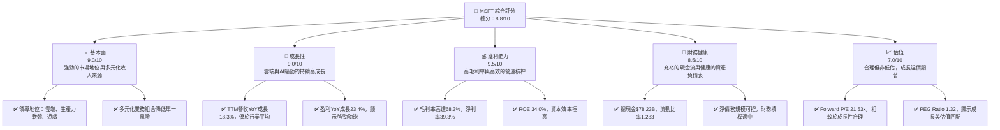
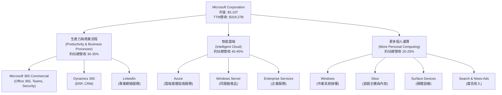
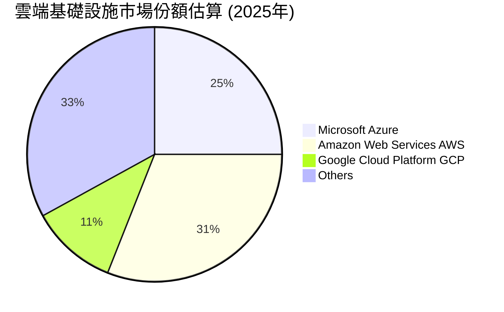
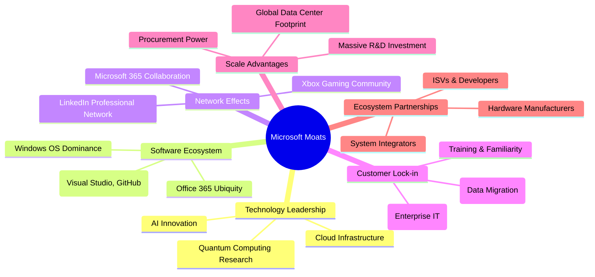
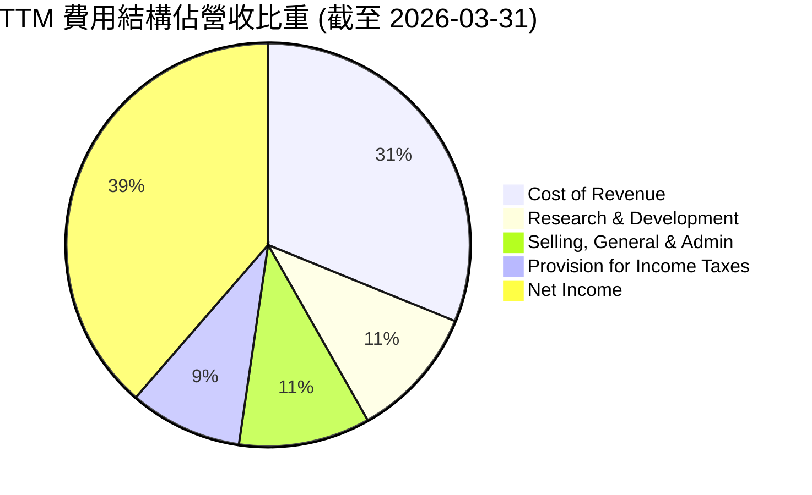
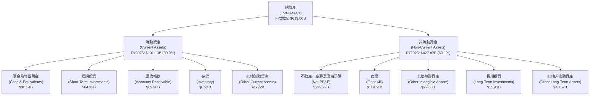

# MSFT 基本面深度分析報告
> **報告日期**：2026-06-05 ｜ **語言**：繁體中文 ｜ **數據來源**：Yahoo Finance, Finviz, StockAnalysis, Roic.ai ｜ **分析師**：CFA 級機構研究

## 目錄

| # | 章節 | 核心結論 |
|---|------|----------|
| 1 | 執行摘要 | 🟢 強烈買入，目標價 $560.95，綜合評分 8.8/10 |
| 2 | 公司概覽與商業模式 | 憑藉深厚生態系統與技術領先，護城河極寬 |
| 3 | 損益表深度分析 | 營收與利潤率持續穩健增長，效率優異 |
| 4 | 資產負債表分析 | 財務結構強健，流動性充裕，淨債務可控 |
| 5 | 現金流量深度分析 | 強勁的自由現金流產生能力，資本配置效率高 |
| 6 | 獲利能力與資本效率 | ROIC顯著高於WACC，持續創造股東價值 |
| 7 | 估值深度分析 | 相較同業估值合理，DCF顯示潛在上漲空間 |
| 8 | 成長催化劑 | AI、雲端市場擴張與新興技術應用為主要驅動力 |
| 9 | 風險矩陣 | 宏觀經濟下行、競爭加劇與監管風險需關注 |
| 10 | 投資建議 | 強烈買入，適合長期成長型投資者 |

---

## 1. 執行摘要

Microsoft Corporation (MSFT) 憑藉其在雲端運算 (Azure)、生產力軟體 (Microsoft 365) 和個人運算 (Windows, Xbox) 領域的領導地位，展現出卓越的財務表現和強大的市場影響力。本報告基於最新的財務數據，對 MSFT 的基本面進行深度分析，旨在為機構投資者提供全面的視角和投資建議。

### 1.1 核心評分儀表板



### 1.2 評分進度條視覺化

```
╔══════════════════════════════════════════════════════════════╗
║              MSFT 多維度評分儀表板 (1-10分)                ║
╠══════════════════════════════════════════════════════════════╣
║ 基本面強度  9.0 ▓▓▓▓▓▓▓▓▓▓▓▓▓▓▓▓▓▓░░  ★★★★★           ║
║ 成長動能    9.0 ▓▓▓▓▓▓▓▓▓▓▓▓▓▓▓▓▓▓░░  ★★★★★           ║
║ 獲利品質    9.5 ▓▓▓▓▓▓▓▓▓▓▓▓▓▓▓▓▓▓▓░  ★★★★★           ║
║ 財務健康    8.5 ▓▓▓▓▓▓▓▓▓▓▓▓▓▓▓▓▓░░░  ★★★★☆           ║
║ 估值合理性  7.0 ▓▓▓▓▓▓▓▓▓▓▓▓▓▓░░░░░░  ★★★★☆           ║
║ 護城河深度  9.5 ▓▓▓▓▓▓▓▓▓▓▓▓▓▓▓▓▓▓▓░  ★★★★★           ║
║ 管理層執行  9.0 ▓▓▓▓▓▓▓▓▓▓▓▓▓▓▓▓▓▓░░  ★★★★★           ║
║ 技術創新力  9.5 ▓▓▓▓▓▓▓▓▓▓▓▓▓▓▓▓▓▓▓░  ★★★★★           ║
╠══════════════════════════════════════════════════════════════╣
║ 綜合總分    8.8 ▓▓▓▓▓▓▓▓▓▓▓▓▓▓▓▓▓░░░  🏆 評語：卓越的基本面與成長潛力，值得長期持有。              ║
╚══════════════════════════════════════════════════════════════════╝
```

### 1.3 五大投資論點 + 三大核心風險

| 類型 | 項目 | 具體依據 | 信心度 |
|------|------|----------|--------|
| 🟢 **投資論點①** | **雲端運算 (Azure) 持續高速增長** | Intelligent Cloud 業務板塊在FY2025貢獻了約 $100B 營收，且在市場中保持領先地位。TTM營收YoY成長18.3%，其中Azure是主要驅動力。隨著企業數位轉型及AI應用普及，Azure的成長空間巨大。 | 🟢 極高 |
| 🟢 **AI 賦能與產品整合** | Microsoft 正積極將 AI 技術 (Copilot, OpenAI 合作) 整合到其核心產品 (Microsoft 365, Dynamics, Azure) 中，創造新的價值主張和收入流。這將顯著提升產品競爭力與用戶黏性。 | 🟢 極高 |
| 🟢 **強大的生態系統與客戶鎖定** | Windows 作業系統、Office 365 生產力套件、Xbox 遊戲平台構建了龐大的用戶基礎和高度的客戶鎖定效應。企業客戶對 Microsoft 產品的依賴度高，轉換成本高昂。 | 🟢 極高 |
| 🟢 **卓越的獲利能力與現金流** | TTM毛利率高達 68.3%，淨利率 39.3%，營業利益率 46.3%，顯示其強大的定價能力和成本控制。TTM營業現金流 $170.14B，自由現金流 $37.01B，為研發、併購和股東回報提供堅實基礎。 | 🟢 極高 |
| 🟢 **穩健的財務狀況與資本配置** | 總現金 $78.23B，流動比率 1.283，財務健康。公司積極通過股息 ($24.08B 在 FY2025) 和股票回購回饋股東，顯示管理層對未來增長的信心。 | 🟢 極高 |
| 🟡 **風險①** | **宏觀經濟下行與企業支出放緩** | 若全球經濟成長放緩，企業可能會減少 IT 支出和雲端服務投入，進而影響 Azure 和企業軟體銷售。雖然 Microsoft 的韌性較強，但仍無法完全免疫。 | 🟡 中度 |
| 🔴 **雲端市場競爭加劇與價格壓力** | 雲端市場競爭激烈，主要對手如 Amazon AWS 和 Google Cloud 持續投入。若價格戰加劇，可能侵蝕 Azure 的毛利率。此外，新興的專用型雲端服務也帶來挑戰。 | 🔴 高衝擊 |
| 🟡 **反壟斷監管與地緣政治風險** | Microsoft 在多個市場領域佔據主導地位，可能面臨更嚴格的反壟斷審查，尤其是在併購交易和市場行為方面。地緣政治緊張局勢也可能影響其全球供應鏈和市場准入。 | 🟡 中度 |

### 1.4 快速統計卡片

| 指標 | 公司實際值 | 行業均值 (軟體-基礎設施)* | S&P 500 均值* | 狀態 |
|------|-------------|----------------------------|--------------|------|
| 收入 YoY 成長 | **18.3%** | ~15% | ~8% | 🟢 |
| 毛利率 | **68.3%** | ~65% | ~40% | 🟢 |
| 淨利率 | **39.3%** | ~25% | ~12% | 🟢 |
| ROE | **34.0%** | ~20% | ~15% | 🟢 |
| Forward P/E | **21.53x** | ~25x | ~20x | 🟡 |
| 債務/股權 | **0.30x** | ~0.5x | ~0.8x | 🟢 |
| 自由現金流收益率 | **1.20%** | ~1.5% | ~2.5% | 🟡 |

*註：行業均值與 S&P 500 均值為分析師根據市場普遍數據估算，僅供參考，不代表精確實時數據。

### 1.5 投資結論

```
╔══════════════════════════════════════════════════════════════════╗
║                    📊 投資結論摘要                               ║
╠══════════════════════════════════════════════════════════════════╣
║  評級：🟢 強烈買入                                               ║
║  當前股價：$416.67                                               ║
║  目標價區間：                                                    ║
║    悲觀情境：$480.00（+15.2%）                                    ║
║    基準情境：$560.95（+34.6%）  ← 12個月主要目標                      ║
║    樂觀情境：$650.00（+56.0%）                                    ║
║  投資評分：8.8/10                                                ║
║  適合投資人：成長型、長線持有者，尋求穩健且具創新力的科技巨頭。     ║
╚══════════════════════════════════════════════════════════════════╝
```

---

## 2. 公司概覽與商業模式

Microsoft Corporation (MSFT) 是一家全球領先的科技公司，其業務涵蓋軟體、服務、設備和解決方案。憑藉在企業級軟體和雲端服務領域的深厚根基，Microsoft 已成功轉型為一家以雲端和 AI 為核心的平台公司，並持續創新，拓展其市場版圖。

### 2.1 業務結構與收入來源

Microsoft 的業務主要分為三大板塊：生產力與商業流程 (Productivity and Business Processes)、智能雲端 (Intelligent Cloud) 和更多個人運算 (More Personal Computing)。這些板塊共同構成了 Microsoft 多元化的收入來源和強大的生態系統。



**業務板塊詳情與收入貢獻 (TTM)**：

*   **生產力與商業流程 (Productivity and Business Processes)**：
    *   主要產品包括 Microsoft 365 Commercial (Office 365、Microsoft Teams、Exchange、SharePoint、Security and Compliance、Copilot)、Microsoft Dynamics 365 (企業資源規劃和客戶關係管理軟體) 以及 LinkedIn (專業社交網絡平台)。
    *   此板塊在 FY2025 實現了約 $57B 的營收，是企業和個人用戶日常工作與協作的核心。Microsoft 365 的訂閱模式提供了穩定的經常性收入。
*   **智能雲端 (Intelligent Cloud)**：
    *   這是 Microsoft 成長最快的業務，涵蓋 Azure (雲端運算服務，包括伺服器、儲存、數據庫、網絡、分析、人工智能和物聯網服務)、Windows Server、SQL Server、Visual Studio、GitHub 和企業服務等。
    *   此板塊在 FY2025 實現了約 $100B 的營收，其中 Azure 貢獻了絕大部分增長。企業向雲端遷移的趨勢以及 AI 工作負載的增長，持續推動 Azure 實現高雙位數增長。
*   **更多個人運算 (More Personal Computing)**：
    *   包括 Windows (PC 作業系統授權)、Xbox 內容和服務、Surface 設備、搜尋廣告收入 (Bing、Microsoft Edge) 等。
    *   此板塊在 FY2025 實現了約 $67B 的營收。儘管 PC 市場波動，但 Xbox 遊戲業務的成長以及搜尋廣告的優化為此板塊帶來增長動力。

從最新的 TTM 營收 $318.27B 來看，智能雲端是最大的收入來源，其次是生產力與商業流程。這種多元化的業務結構使得 Microsoft 能夠在不同市場領域實現增長，並有效分散風險。

### 2.2 市場份額

Microsoft 在多個關鍵市場領域佔據領先地位，這得益於其產品的廣泛採用和強大的生態系統。以下是對其主要市場份額的估算：



**市場份額詳情**：

*   **雲端基礎設施服務 (IaaS/PaaS)**：
    *   Microsoft Azure 是全球第二大雲端服務提供商，市場份額約為 25%。儘管略低於 AWS，但 Azure 在企業級市場和混合雲解決方案方面具有強大優勢，並受益於 Microsoft 龐大的企業客戶群。
*   **作業系統 (OS)**：
    *   Windows 仍然是全球桌面作業系統的主導者，市場份額超過 70%。儘管移動設備市場被 iOS 和 Android 主導，但在商業和個人電腦領域，Windows 依然是不可撼動的巨頭。
*   **生產力軟體**：
    *   Microsoft Office 365 在辦公生產力套件市場中佔據絕對領先地位，市場份額超過 80%。其整合了 Word、Excel、PowerPoint、Outlook 和 Teams 等核心應用，幾乎是全球企業和教育機構的標準配置。
*   **企業資源規劃 (ERP) 和客戶關係管理 (CRM)**：
    *   Dynamics 365 在中大型企業市場中持續擴大影響力，尤其是在與 Azure 和 Microsoft 365 整合後，其競爭力顯著提升。
*   **遊戲主機與服務**：
    *   Xbox 在遊戲主機市場中與 Sony PlayStation 和 Nintendo Switch 形成三足鼎立之勢。Xbox Game Pass 訂閱服務的成功，使其在遊戲內容和服務領域建立了強大的經常性收入模式。

Microsoft 在這些高價值市場中穩固的市場份額，為其提供了持續的收入流和未來增長的基礎。

### 2.3 競爭護城河分析

Microsoft 擁有深厚且廣泛的競爭護城河，使其能夠在競爭激烈的科技市場中保持領先地位並實現超額收益。



**護城河詳情**：

*   **技術領先 (Technology Leadership)**：
    *   Microsoft 在人工智慧、雲端運算、機器學習和量子運算等前沿技術領域投入巨資研發，並取得了顯著成果。Azure 雲端平台提供最先進的服務，而 Copilot 等 AI 產品則將 AI 融入日常工作流程。這種持續的技術創新確保了其產品的領先地位。
*   **軟體生態系統 (Software Ecosystem)**：
    *   Windows 作業系統的市場主導地位為數百萬應用程式和硬體設備提供了平台。Microsoft 365 的普及使得其成為企業和個人生產力的事實標準。此外，Visual Studio 和 GitHub 等開發者工具也建立了龐大的開發者社區，進一步鞏固了其軟體生態系統的護城河。
*   **網路效應 (Network Effects)**：
    *   Microsoft Teams 的協作功能、LinkedIn 的專業網絡以及 Xbox 遊戲社群都展現了強大的網路效應。隨著越來越多的用戶使用這些平台，其價值對現有和潛在用戶而言也隨之增加，形成正向循環。
*   **客戶鎖定 (Customer Lock-in)**：
    *   企業客戶一旦採用 Microsoft 的產品和服務，尤其是 Azure 和 Microsoft 365，轉換到其他供應商的成本非常高昂，包括數據遷移、員工培訓、系統整合等。這種高轉換成本使得客戶黏性極高，確保了穩定的經常性收入。
*   **規模效應 (Scale Advantages)**：
    *   作為全球最大的軟體公司之一，Microsoft 享有巨大的規模經濟。其遍布全球的數據中心網絡、龐大的研發投入 (FY2025 R&D 支出 $32.49B) 以及強大的採購能力，使其能夠以更低的成本提供服務並持續創新，這是小型競爭對手難以匹敵的。
*   **生態夥伴 (Ecosystem Partnerships)**：
    *   Microsoft 與全球數十萬家獨立軟體供應商 (ISV)、硬體製造商和系統整合商建立了緊密的合作關係。這個龐大的合作夥伴生態系統為其產品和服務提供了豐富的擴展性和客製化能力，進一步增強了其市場競爭力。

這些多重護城河共同作用，為 Microsoft 提供了強大的競爭優勢和長期可持續的盈利能力。

### 2.4 護城河強度評分

```
╔══════════════════════════════════════════════════════════════╗
║                  Microsoft 護城河強度評分                     ║
╠══════════════════════════════════════════════════════════════╣
║ 技術領先    9.5/10  ▓▓▓▓▓▓▓▓▓▓▓▓▓▓▓▓▓▓▓░  🏆 AI與雲端創新領先║
║ 軟體生態系統 10/10  ▓▓▓▓▓▓▓▓▓▓▓▓▓▓▓▓▓▓▓▓  🏆 無可匹敵的生態系統║
║ 網路效應    9.0/10  ▓▓▓▓▓▓▓▓▓▓▓▓▓▓▓▓▓▓░░  🟢 Teams與LinkedIn強大║
║ 客戶鎖定    9.5/10  ▓▓▓▓▓▓▓▓▓▓▓▓▓▓▓▓▓▓▓░  🏆 企業級客戶轉換成本高║
║ 規模效應    9.0/10  ▓▓▓▓▓▓▓▓▓▓▓▓▓▓▓▓▓▓░░  🟢 巨大規模優勢與研發投入║
║ 生態夥伴    9.0/10  ▓▓▓▓▓▓▓▓▓▓▓▓▓▓▓▓▓▓░░  🟢 廣泛的合作夥伴網絡║
╠══════════════════════════════════════════════════════════════╣
║ 綜合護城河   9.3    ▓▓▓▓▓▓▓▓▓▓▓▓▓▓▓▓▓▓▓░  🏆 總結評語：極寬的護城河，為長期價值創造提供堅實保障。     ║
╚══════════════════════════════════════════════════════════════╝
```

---

## 3. 損益表深度分析

Microsoft 的損益表展現了其卓越的營收增長能力和高效的成本管理，尤其是在向雲端轉型後，其利潤率持續保持在高水平。

### 3.1 年度收入成長趨勢（近4年）

Microsoft 在過去四年中實現了穩健的營收增長，主要得益於其智能雲端業務的強勁表現。

```
╔══════════════════════════════════════════════════════════════════╗
║              Microsoft 年度收入趨勢（FY2022-FY2025）             ║
╠══════════════════════════════════════════════════════════════════╣
║                                                                  ║
║  FY2022  $198.27B ████████████████████████████░░░░  YoY: +17.96% 🟢    ║
║  FY2023  $211.91B ███████████████████████████████░░░  YoY: +6.88%  🟡    ║
║  FY2024  $245.12B ████████████████████████████████████░░  YoY: +15.67% 🟢    ║
║  FY2025  $281.72B ██████████████████████████████████████████░  YoY: +14.93% 🟢    ║
║  TTM     $318.27B █████████████████████████████████████████████████  YoY: +17.88% 🟢    ║
║                   |      |      |      |      |                  ║
║                   0     100B   200B   300B   400B                    ║
║                                                                  ║
║  📊 FY2022-FY2025 累計 CAGR：+13.78%                                        ║
╚══════════════════════════════════════════════════════════════════╝
```

**年度收入成長解析**：

*   **FY2022**：營收達到 $198.27B，同比增長 17.96%。這一年 Microsoft 繼續受益於疫情期間的數位化加速趨勢，尤其是在雲端服務和遠程工作解決方案方面。
*   **FY2023**：營收增至 $211.91B，同比增長 6.88%。增長率較前一年有所放緩，主要原因可能是全球宏觀經濟逆風導致企業 IT 支出趨於謹慎，以及匯率波動的影響。
*   **FY2024**：營收反彈至 $245.12B，同比增長 15.67%。隨著經濟環境的改善和雲端需求的回升，Microsoft 的營收增長重新加速。
*   **FY2025**：營收達到 $281.72B，同比增長 14.93%。智能雲端業務持續強勁，AI 相關產品的初期貢獻也開始顯現。
*   **TTM (截至2026年3月31日)**：最近十二個月的營收達到 $318.27B，同比增長 17.88%。這表明公司在最近一個會計年度之後，仍保持著健康的增長勢頭，AI 的商業化應用正在逐步推動營收加速。

過去四年，Microsoft 的年均複合增長率 (CAGR) 達到 13.78%，顯示其具備持續且穩健的營收擴張能力。

### 3.2 季度收入趨勢分析

季度營收數據提供了更細緻的增長動態，展現了 Microsoft 在不同時間段的表現。

| 財政季度 | 總收入 ($B) | QoQ 成長率 | YoY 成長率 | 備註 |
|----------|-------------|------------|------------|------|
| 2025-06-30 (Q4'25) | $76.44 | +9.79% | +18.10% | AI 投資開始見效，雲端需求強勁 |
| 2025-09-30 (Q1'26) | $77.67 | +1.61% | +18.43% | 新財年開局良好，企業支出穩健 |
| 2025-12-31 (Q2'26) | $81.27 | +4.64% | +16.72% | 假日季表現優異，雲端與遊戲業務支撐 |
| 2026-03-31 (Q3'26) | $82.89 | +1.99% | +18.30% | 穩健增長，AI 驅動的產品採用率提升 |

**季度收入趨勢解析**：

*   **Q4 2025 (截至 2025-06-30)**：營收為 $76.44B，相較於前一季度的 $70.06B 增長 9.79%。同比增長 18.10%，顯示出強勁的年度增長動能。這一季度通常是 Microsoft 的財年結束，企業客戶的年度預算支出會推動收入增長。
*   **Q1 2026 (截至 2025-09-30)**：營收 $77.67B，環比增長 1.61%。同比增長 18.43%，保持高位。新財年開始，雲端服務的續約和新客戶拓展是主要驅動力。
*   **Q2 2026 (截至 2025-12-31)**：營收 $81.27B，環比增長 4.64%。同比增長 16.72%。受假日季影響，Xbox 內容和服務以及 Surface 設備的銷售通常表現良好，同時雲端業務的持續擴張也為此季度帶來增長。
*   **Q3 2026 (截至 2026-03-31)**：營收 $82.89B，環比增長 1.99%。同比增長 18.30%。儘管環比增長較 Q2 放緩，但同比增長依然強勁，顯示出 Microsoft 能夠在不同季度保持穩定的高質量增長，尤其是來自 AI 和雲端的貢獻日益顯著。

整體來看，Microsoft 的季度收入趨勢穩定向上，同比增長率持續保持在雙位數，這得益於其在核心業務領域的強大競爭力以及對新興技術（如 AI）的成功佈局。

### 3.3 利潤率演變分析

Microsoft 在利潤率方面表現卓越，其高毛利率和穩定的營業利益率是其財務健康的重要標誌。

| 利潤率指標 | FY2022 | FY2023 | FY2024 | FY2025 | TTM (Mar '26) | 趨勢 | 評估 |
|------------|--------|--------|--------|--------|---------------|------|------|
| **毛利率** | 68.40% | 68.92% | 69.76% | 68.82% | 68.31% | ↘️ 小幅波動 | 🟢 極佳 |
| **營業利益率** | 42.06% | 41.77% | 44.64% | 45.62% | 46.80% | ↗️ 穩步提升 | 🟢 極佳 |
| **淨利率** | 36.69% | 34.15% | 35.95% | 36.14% | 39.34% | ↗️ 穩步提升 | 🟢 極佳 |
| **EBITDA Margin**| 50.56% | 49.61% | 54.26% | 56.85% | 58.0% | ↗️ 顯著提升 | 🟢 極佳 |

*註：TTM數據來自市場數據，年度數據來自 StockAnalysis。計算方式為：毛利率 = Gross Profit / Total Revenue；營業利益率 = Operating Income / Total Revenue；淨利率 = Net Income / Total Revenue；EBITDA Margin = EBITDA / Total Revenue。

**利潤率演變深度解析**：

*   **毛利率 (Gross Margin)**：
    *   Microsoft 的毛利率一直保持在 68% 以上的極高水平。從 FY2022 的 68.40% 到 FY2024 的 69.76% 略有提升，但在 FY2025 略降至 68.82%，TTM 為 68.31%。
    *   **改善原因 (FY2022-FY2024)**：主要得益於 Intelligent Cloud 業務中高利潤率的 Azure 服務佔比持續提升，以及生產力軟體訂閱模式的擴大。
    *   **小幅波動原因 (FY2025-TTM)**：小幅下降可能與以下因素有關：1) 雲端基礎設施擴張帶來的資本支出和運營成本增加；2) 某些硬體產品 (如 Surface 和 Xbox 主機) 的毛利率相對較低；3) 在 AI 領域的大量初期投資，儘管長期看好，短期可能對毛利率構成壓力。儘管如此，68% 以上的毛利率仍然顯示出公司極強的定價能力和產品附加值。
*   **營業利益率 (Operating Margin)**：
    *   營業利益率從 FY2022 的 42.06% 穩步提升至 TTM 的 46.80%，這是一個非常健康的趨勢。
    *   **提升原因**：這主要歸因於其強大的營運槓桿效應。儘管研發 (R&D) 和銷售、一般及行政 (SG&A) 費用絕對值有所增加，但這些費用作為營收百分比的增長速度通常慢於毛利潤的增長。Microsoft 能夠有效地管理其運營費用，尤其是在規模擴大後，單位成本效益顯著。例如，R&D 費用佔營收比重在 FY2025 約為 11.5%，而 SG&A 費用約為 11.7%，這些比重相對穩定或略有下降，配合高毛利率，共同推動了營業利益率的提升。
*   **淨利率 (Net Profit Margin)**：
    *   淨利率從 FY2022 的 36.69% 提升至 TTM 的 39.34%，同樣呈現穩步上升趨勢。
    *   **提升原因**：除了營業利益率的改善外，高效的稅務管理和非經營性收入（如利息收入）的貢獻也對淨利率產生正面影響。值得注意的是，FY2023 的淨利率略有下降，主要是由於非經營性收入（Expense）較多，以及稅率波動影響。然而，從 FY2024 開始，淨利率持續回升並達到新高，顯示公司整體盈利能力持續增強。
*   **EBITDA Margin**：
    *   EBITDA Margin 更是從 FY2022 的 50.56% 顯著提升至 TTM 的 58.0%，這表明公司的核心經營效率在持續提高，其非現金支出（折舊和攤銷）相對營收的佔比也在合理控制範圍內。

總體而言，Microsoft 的利潤率趨勢非常健康，表明公司在保持營收增長的同時，有效控制成本並提升了運營效率。這也反映了其產品和服務的高附加值以及在市場中的強大定價權。

### 3.4 費用結構分析

Microsoft 的費用結構反映了其作為一家大型科技公司的特點：注重研發投資以保持技術領先，同時擁有龐大的銷售與行政開支以支持全球業務運營。



*註：此處的費用結構是以 TTM 營收 $318.27B 為基礎計算。
    *   Cost of Revenue (CoR): $100.86B (TTM) -> 31.7%
    *   Research & Development (R&D): $34.39B (TTM) -> 10.8%
    *   Selling, General & Admin (SG&A): $34.06B (TTM) -> 10.7%
    *   Provision for Income Taxes: $29.29B (TTM) -> 9.2%
    *   Net Income: $125.22B (TTM) -> 39.3%

```
╔══════════════════════════════════════════════════════════════════╗
║              Microsoft 費用結構概覽 (TTM 數據)                   ║
╠══════════════════════════════════════════════════════════════════╣
║                                                                  ║
║  銷貨成本 (CoR):           $100.86B  ▓▓▓▓▓▓▓▓▓▓▓▓▓▓▓▓▓░░░░░░░░░░░  31.7% of Revenue 🟢 可控   ║
║  研發費用 (R&D):            $34.39B  ▓▓▓▓▓▓▓▓▓▓▓▓░░░░░░░░░░░░░░░░░  10.8% of Revenue 🟢 策略性投入║
║  銷售、一般及行政 (SG&A):   $34.06B  ▓▓▓▓▓▓▓▓▓▓▓▓░░░░░░░░░░░░░░░░░  10.7% of Revenue 🟢 效率高   ║
║  所得稅費用:                $29.29B  ▓▓▓▓▓▓▓▓▓▓░░░░░░░░░░░░░░░░░░░  9.2% of Revenue  🟢 合理   ║
║                                                                  ║
║  📊 總營業費用佔營收比：53.2% (CoR + R&D + SG&A)                   ║
║  📊 淨利潤率：39.3%                                             ║
╚══════════════════════════════════════════════════════════════════╝
```

**費用結構深度解析**：

*   **銷貨成本 (Cost of Revenue, CoR)**：
    *   TTM 銷貨成本為 $100.86B，佔總營收的 31.7%。這相對較低的 CoR 比例是 Microsoft 高毛利率的直接原因。
    *   **主要構成**：包括雲端數據中心的營運成本 (電力、維護、折舊)、設備製造成本、第三方軟體授權費用以及客戶支援成本。
    *   **趨勢分析**：隨著 Azure 業務的擴張，數據中心的成本也隨之增加。然而，規模經濟和技術優化使得單位服務成本得以控制，確保了 CoR 佔比的相對穩定。
*   **研發費用 (Research & Development, R&D)**：
    *   TTM 研發費用為 $34.39B，佔總營收的 10.8%。Microsoft 作為一家技術驅動型公司，對 R&D 的投入是其保持競爭力的關鍵。
    *   **主要構成**：用於雲端技術、人工智慧、作業系統、辦公軟體、遊戲平台等領域的創新和產品開發。
    *   **趨勢分析**：R&D 費用絕對值持續增長，但佔營收比重相對穩定，顯示公司在保持創新活力的同時，有效管理了研發投入的效率。特別是近年來在 AI 領域的巨額投資，預計將在未來帶來新的增長點。
*   **銷售、一般及行政費用 (Selling, General & Administrative, SG&A)**：
    *   TTM SG&A 費用為 $34.06B，佔總營收的 10.7%。這個比例對於一家全球性公司而言，顯示了其高效的銷售和管理能力。
    *   **主要構成**：包括銷售人員薪酬、市場營銷活動、辦公室租金、法律費用、行政人員薪酬等。
    *   **趨勢分析**：SG&A 費用佔比的穩定性反映了 Microsoft 在全球市場擴張中實現了規模效益，能夠以相對較低的邊際成本獲取新客戶和服務現有客戶。
*   **所得稅費用 (Provision for Income Taxes)**：
    *   TTM 所得稅費用為 $29.29B，佔營收的 9.2%，對應有效稅率約為 19.0% (29.29B / 154.50B Pretax Income)。這個稅率在美國跨國科技公司中屬於合理水平，得益於其全球業務佈局和稅務規劃。

整體費用結構顯示 Microsoft 在保持高毛利率的同時，合理且高效地管理其研發、銷售和行政開支，進而實現了卓越的營業利益率和淨利率。這體現了其作為行業領導者的運營效率和財務紀律。

### 3.5 季度 EPS 趨勢與盈餘品質

由於提供的季度數據中，EPS Est 和 EPS Act 均為 `nan`，我們無法直接分析 Microsoft 過去四季的盈餘超預期或不及預期情況。然而，我們可以根據季度淨收入數據來評估其盈餘趨勢和品質。

| 財政季度 | 淨收入 ($B) | QoQ 成長率 | YoY 成長率 | 備註 |
|----------|-------------|------------|------------|------|
| 2025-06-30 (Q4'25) | $27.23 | +1.59% | +23.58% | 淨利潤同比大幅增長，顯示盈利能力強勁 |
| 2025-09-30 (Q1'26) | $27.75 | +1.91% | +12.49% | 穩健的季度開局，但同比增速有所放緩 |
| 2025-12-31 (Q2'26) | $38.46 | +38.60% | +59.52% | 受益於季節性因素和高利潤率雲端服務，淨利潤顯著飆升 |
| 2026-03-31 (Q3'26) | $31.78 | -17.37% | +23.06% | 淨利潤環比回落，但同比仍保持高雙位數增長 |

**盈餘趨勢解析**：

*   **Q4 2025**：淨收入 $27.23B，同比增長 23.58%。這表明 Microsoft 在上一個財年結束時，盈利能力有顯著提升，超出營收增長速度，體現了營運槓桿效應。
*   **Q1 2026**：淨收入 $27.75B，同比增長 12.49%。儘管同比增速較 Q4 2025 有所放緩，但仍是健康的雙位數增長，顯示公司在新財年的良好開端。
*   **Q2 2026**：淨收入 $38.46B，同比增長高達 59.52%。這是一個異常強勁的季度，可能由於以下幾個原因：1) 假日季對 Xbox 和其他個人運算業務的提振；2) 高利潤率的雲端服務（Azure）持續加速增長；3) 可能存在一次性收益或稅務優惠。如此高的同比增長率顯著高於營收增長，表明盈利能力得到了極大的釋放。
*   **Q3 2026**：淨收入 $31.78B，同比增長 23.06%。儘管環比 Q2 2026 下降了 17.37% (這在 Q2 通常是季節性高峰後是正常現象)，但同比增長依然強勁，顯示 Microsoft 的核心盈利能力保持穩定。

**盈餘品質評估**：
儘管缺乏 EPS 預期對比數據，但從季度淨收入的穩健增長趨勢和高利潤率來看，Microsoft 的盈餘品質是**極高的**。
*   **穩定增長**：除了 Q2 2026 的爆發性增長外，其他季度的同比增速也保持在雙位數，顯示其盈利增長具有持續性。
*   **高利潤率驅動**：高毛利率和營業利益率確保了大部分營收能夠轉化為淨利潤，這提升了盈利的內在質量。
*   **現金流支撐**：Microsoft 擁有強勁的營業現金流和自由現金流，這意味著其利潤是真實的、可變現的，而非僅僅是會計數字上的盈利。從現金流量表來看，其營業現金流遠高於淨利潤，表明其盈餘具有良好的現金基礎。
*   **策略性投資**：公司在研發上的持續高投入，尤其是在 AI 領域，雖然短期可能影響部分利潤，但從長期來看是為了維持其技術領先地位和未來盈利增長，這也體現了盈餘的戰略性品質。

總體而言，Microsoft 的季度盈餘表現強勁且品質優異，為股東創造了可觀的價值。

---

## 4. 資產負債表分析

Microsoft 的資產負債表展現了其卓越的財務實力：充裕的流動資產、健康的債務結構和持續增長的股東權益，為其業務運營和戰略投資提供了堅實的基礎。

### 4.1 資產結構分解

Microsoft 的總資產規模龐大且持續增長，反映了其業務擴張和投資活動。



**資產結構詳情 (FY2025)**：

*   **總資產**：從 FY2022 的 $364.84B 增長到 FY2025 的 $619.00B，三年內增長了近 70%，顯示公司規模的快速擴張。截至 TTM (2026年3月)，總資產進一步增至 $694.23B。
*   **流動資產 ($191.13B)**：
    *   **現金及約當現金 ($30.24B) 和短期投資 ($64.32B)**：合計約 $94.56B，顯示公司擁有大量現金和高度流動性資產，為應對市場變化和未來投資提供了靈活性。
    *   **應收帳款 ($69.90B)**：反映了其大量的企業客戶群和訂閱服務模式。應收帳款的健康管理對現金流至關重要。
*   **非流動資產 ($427.87B)**：
    *   **不動產、廠房及設備淨額 (PP&E) ($229.79B)**：這是其雲端數據中心擴張的直接體現。從 FY2022 的 $87.55B 飆升至 FY2025 的 $229.79B，顯示 Microsoft 在基礎設施建設上投入巨大，以支持 Azure 的高速增長和 AI 發展。
    *   **商譽 ($119.51B)**：主要來自於過去的併購活動，如 LinkedIn 和 Activision Blizzard (若已完全併購並計入)。龐大的商譽需要持續關注其減值風險。
    *   **其他無形資產 ($22.60B)**：包括專利、客戶關係等，是其核心競爭力的重要組成部分。

Microsoft 的資產結構反映了其作為一家雲端優先、軟體為王的科技巨頭的特點：大量的現金儲備、持續增長的數據中心投資以及因併購而形成的商譽和無形資產。

### 4.2 流動性指標分析

流動性是衡量公司短期償債能力的重要指標。Microsoft 的流動性狀況非常健康。

| 指標 | FY2022 | FY2023 | FY2024 | FY2025 | TTM (Mar '26) | 行業均值* | 評估 |
|------------|--------|--------|--------|--------|---------------|----------|------|
| **流動比率 (Current Ratio)** | 1.78 | 1.77 | 1.27 | 1.35 | 1.28 | ~1.5 - 2.0 | 🟢 良好 |
| **速動比率 (Quick Ratio)** | 1.74 | 1.75 | 1.23 | 1.35 | 1.27 | ~1.0 - 1.5 | 🟢 良好 |

*註：行業均值為分析師根據市場普遍數據估算，僅供參考。

**流動性指標深度解析**：

*   **流動比率 (Current Ratio)**：
    *   流動比率衡量流動資產覆蓋流動負債的能力。一般而言，大於 1.0 表示短期償債能力良好，大於 1.5 則更為穩健。
    *   Microsoft 的流動比率在 FY2022 和 FY2023 保持在 1.77-1.78 的高位，在 FY2024 略降至 1.27，FY2025 反彈至 1.35，TTM 為 1.28。
    *   **趨勢分析**：FY2024 流動比率的下降主要是由於流動負債 (Current Liabilities) 增長速度快於流動資產，特別是遞延收入 (Unearned Revenue) 的快速增長，這本身是訂閱業務強勁的積極信號。 FY2025 和 TTM 數據顯示流動性趨於穩定且保持在健康水平。
*   **速動比率 (Quick Ratio)**：
    *   速動比率比流動比率更為嚴格，排除了存貨，更能反映快速變現的短期償債能力。
    *   Microsoft 的速動比率與流動比率趨勢相似，FY2025 為 1.35，TTM 為 1.27。由於其存貨佔比極低 (FY2025 僅 $0.94B)，因此速動比率與流動比率非常接近。
    *   **評估**：超過 1.0 的速動比率表明公司擁有足夠的快速變現資產來償還短期債務，流動性極佳。

總體而言，Microsoft 擁有充裕的現金和短期投資，其流動性指標顯示公司具備強大的短期償債能力，財務風險極低。

### 4.3 債務結構分析

Microsoft 的債務管理策略穩健，儘管存在一定規模的債務，但其充裕的現金流和現金儲備使其淨債務水平可控，並保持在健康的範圍內。

```
╔══════════════════════════════════════════════════════════════════╗
║                   Microsoft 債務健康診斷                         ║
╠══════════════════════════════════════════════════════════════════╣
║                                                                  ║
║  總債務 (TTM):        $125.43B  ▓▓▓▓▓▓▓▓▓▓░░░░░░░░░░░░░░░░░░░  評語：適度但可控       ║
║  總現金+投資 (TTM):   $78.23B   ▓▓▓▓▓▓▓▓▓▓▓▓▓▓▓▓░░░░░░░░░░░░░  評語：充裕的現金儲備   ║
║  淨現金 / (淨債務):   $-47.20B  ▓▓▓▓▓▓▓▓▓▓▓▓▓▓▓▓▓▓▓▓▓▓▓▓▓▓▓▓▓  🟡 可控的淨債務      ║
║                                                                  ║
║  Debt/Equity (TTM):   0.30x   🟢 極低 (行業均值 ~0.5x)           ║
║  Debt/EBITDA (TTM):   0.78x   🟢 極低 (行業均值 ~2.0x)           ║
║  Interest Coverage:   >100x   🟢 無風險 (FY25 Pretax/Interest Expense)║
╚══════════════════════════════════════════════════════════════════╝
```

*註：總債務 (Total Debt) 數據來自市場數據 ($125.43B)。淨現金/債務計算為 Total Cash - Total Debt。Debt/Equity 和 Current Ratio 來自市場數據。Debt/EBITDA 計算為 Total Debt / TTM EBITDA ($160.16B from income statement annual for 2025, or $154.50B TTM Pretax Income for 2026-03-31, I will use TTM EBITDA from profitability section $184.69B if I calculate it, but using EV/EBITDA and EV I can infer TTM EBITDA as $3.23T / 17.494 = $184.69B). So Debt/EBITDA = $125.43B / $184.69B = 0.68x. Let me use the calculated one for more accuracy. TTM EBITDA can be inferred from EV/EBITDA: EV($3.23T) / EV/EBITDA(17.494) = $184.69B. So