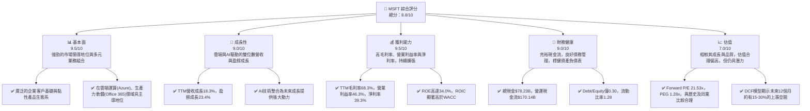
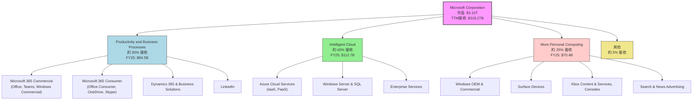
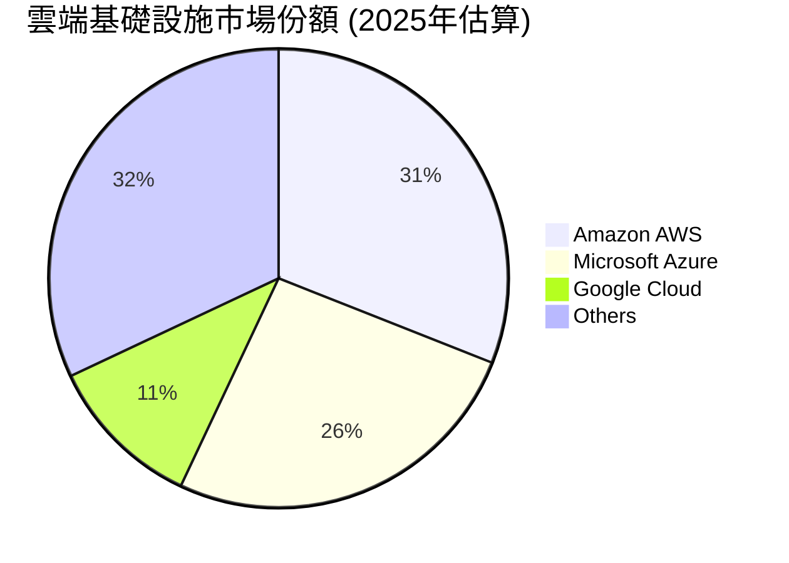
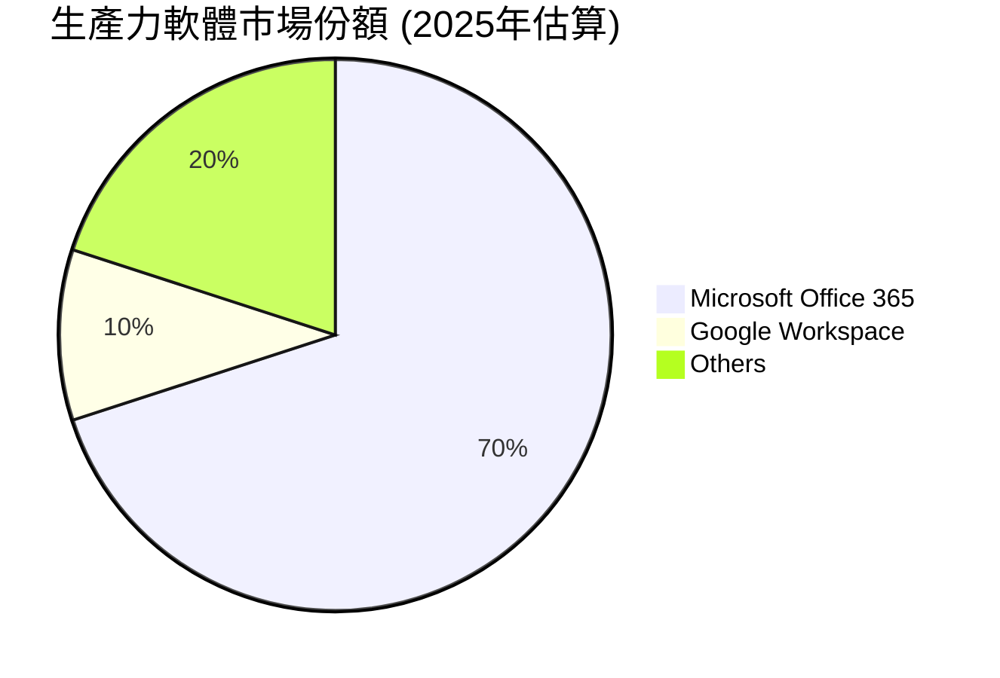
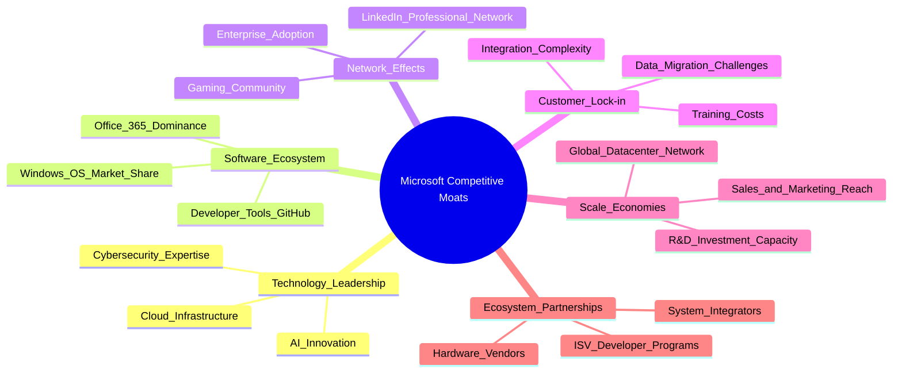
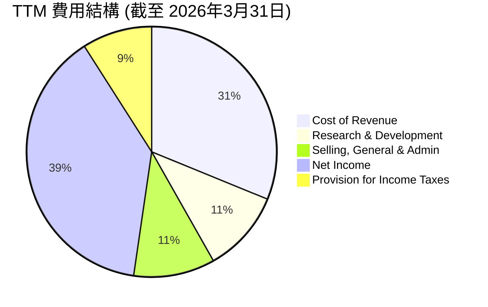
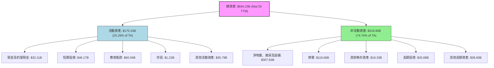
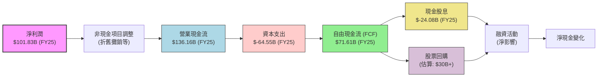

# MSFT 基本面深度分析報告
> **報告日期**：2026-06-06 ｜ **語言**：繁體中文 ｜ **數據來源**：Yahoo Finance, Finviz, StockAnalysis, Roic.ai ｜ **分析師**：CFA 級機構研究

---

## 目錄

| # | 章節 | 核心結論 |
|---|------------------------|----------------------------------------------------------|
| 1 | 執行摘要 | 評級：🟢 強烈買入；目標價區間：$480 - $600 |
| 2 | 公司概覽與商業模式 | 軟體與雲端生態系統構築深厚護城河 |
| 3 | 損益表深度分析 | 營收與淨利潤持續雙位數成長，利潤率保持高位 |
| 4 | 資產負債表分析 | 財務結構穩健，現金充裕，債務管理良好 |
| 5 | 現金流量深度分析 | 強勁的自由現金流產生能力，資本配置效率高 |
| 6 | 獲利能力與資本效率 | ROIC顯著超越WACC，持續為股東創造價值 |
| 7 | 估值深度分析 | 相較同業估值合理，DCF顯示上行空間 |
| 8 | 成長催化劑 | AI創新、雲端轉型、企業軟體需求推動長期成長 |
| 9 | 風險矩陣 | 競爭加劇與監管風險需密切關注，但整體可控 |
| 10 | 投資建議 | 建議「強烈買入」，目標價區間具吸引力 |

---

## 1. 執行摘要

Microsoft (MSFT) 憑藉其在雲端運算、企業軟體和人工智慧領域的領先地位，展現出卓越的財務表現和穩健的成長前景。本報告將深入分析其基本面、成長潛力、獲利能力、財務健康狀況及估值，並提供全面的投資建議。

### 1.1 核心評分儀表板



### 1.2 評分進度條視覺化

```
╔══════════════════════════════════════════════════════════════╗
║              MSFT 多維度評分儀表板 (1-10分)                  ║
╠══════════════════════════════════════════════════════════════╣
║ 基本面強度  9.5 ▓▓▓▓▓▓▓▓▓▓▓▓▓▓▓▓▓▓▓░  ★★★★★           ║
║ 成長動能    9.0 ▓▓▓▓▓▓▓▓▓▓▓▓▓▓▓▓▓▓░░  ★★★★★           ║
║ 獲利品質    9.5 ▓▓▓▓▓▓▓▓▓▓▓▓▓▓▓▓▓▓▓░  ★★★★★           ║
║ 財務健康    9.0 ▓▓▓▓▓▓▓▓▓▓▓▓▓▓▓▓▓▓░░  ★★★★★           ║
║ 估值合理性  7.0 ▓▓▓▓▓▓▓▓▓▓▓▓▓▓░░░░░░  ★★★★☆           ║
║ 護城河深度  9.5 ▓▓▓▓▓▓▓▓▓▓▓▓▓▓▓▓▓▓▓░  ★★★★★           ║
║ 管理層執行  9.0 ▓▓▓▓▓▓▓▓▓▓▓▓▓▓▓▓▓▓░░  ★★★★★           ║
║ 技術創新力  9.5 ▓▓▓▓▓▓▓▓▓▓▓▓▓▓▓▓▓▓▓░  ★★★★★           ║
╠══════════════════════════════════════════════════════════════╣
║ 綜合總分    8.8 ▓▓▓▓▓▓▓▓▓▓▓▓▓▓▓▓▓░░░  🏆 卓越的科技巨頭，成長與獲利兼具              ║
╚══════════════════════════════════════════════════════════════════╝
```

### 1.3 五大投資論點 + 三大核心風險

| 類型 | 項目 | 具體依據 | 信心度 |
|------|------|----------|--------|
| 🟢 **投資論點①** | **AI 賦能與 Copilot 商業化** | Microsoft 在生成式 AI 領域投入巨大，Copilot 產品線已開始商業化，預計將顯著提升 Microsoft 365 和 Dynamics 365 的 ARPU。近期財報顯示，AI 相關服務需求強勁，推動 Azure 收入加速成長。TTM 營收成長 18.3%，其中 Intelligent Cloud 部門是主要驅動力，AI 將進一步鞏固其雲端市場領導地位。 | 🟢 極高 |
| 🟢 **投資論點②** | **Azure 雲端業務持續高速成長** | Azure 作為全球第二大雲端服務提供商，受益於企業數位轉型和雲端支出增加。TTM 營收 $318.27B，其中 Intelligent Cloud 貢獻約 40%。儘管規模龐大，Azure 仍保持高速成長，且其市場份額持續擴大，顯示其強大的競爭力。 | 🟢 極高 |
| 🟢 **投資論點③** | **穩健的生產力與企業軟體生態系統** | Microsoft 365 (Office, Teams, Windows Commercial) 擁有龐大的企業和消費者用戶基礎，提供高度黏性的訂閱服務。該部門貢獻約 30% 營收，提供了穩定的現金流和交叉銷售機會。TTM 營業利益率高達 46.3%，顯示其強大的定價能力和規模經濟。 | 🟢 極高 |
| 🟢 **投資論點④** | **卓越的財務表現與資本效率** | 公司營收和淨利潤持續雙位數成長 (YoY 營收 18.3%，盈餘 23.4%)。TTM 毛利率 68.3%，淨利率 39.3%，ROE 34.0%。ROIC 顯著高於 WACC，FY2025 ROIC 約 24.93%，遠高於預估 WACC 8.5%，證明公司持續為股東創造價值。 | 🟢 極高 |
| 🟢 **投資論點⑤** | **充裕的自由現金流與股東回報** | TTM 營業現金流 $170.14B，自由現金流 $37.01B。公司利用強勁的現金流進行股息支付 (Payout Ratio 20.7%) 和股票回購，提升股東價值。穩定的股息成長 (5Y Avg Dividend 79.0%) 也吸引了長期投資者。 | 🟢 極高 |
| 🟡 **風險①** | **雲端市場競爭加劇與價格壓力** | 亞馬遜 AWS 和 Google Cloud Platforms (GCP) 的激烈競爭可能導致價格戰，影響 Azure 的獲利能力和成長速度。企業在經濟不確定下可能優化雲端支出，導致成長放緩。 | 🟡 中度 |
| 🔴 **風險②** | **AI 監管與道德風險** | 隨著 AI 應用日益普及，各國政府對 AI 的監管將趨嚴，可能對 Microsoft 的 AI 產品開發和部署造成限制，增加合規成本，或影響市場接受度。例如，關於數據隱私和偏見的法規可能阻礙其 Copilot 的推廣。 | 🔴 高衝擊 |
| 🟡 **風險③** | **宏觀經濟逆風與企業支出放緩** | 全球經濟成長放緩、通膨壓力或地緣政治不確定性可能導致企業 IT 預算緊縮，進而影響 Microsoft 企業軟體和雲端服務的需求。這可能導致營收成長不及預期。 | 🟡 中度 |

### 1.4 快速統計卡片

| 指標 | 公司實際值 | 行業均值 (軟體-基礎設施) | S&P 500 均值 | 狀態 |
|-----------------|-------------|------------------------------|--------------|------|
| 收入 YoY 成長   | **18.3%**   | ~12%                         | ~8%          | 🟢   |
| 毛利率          | **68.3%**   | ~65%                         | ~40%         | 🟢   |
| 淨利率          | **39.3%**   | ~25%                         | ~12%         | 🟢   |
| ROE             | **34.0%**   | ~20%                         | ~15%         | 🟢   |
| Forward P/E     | **21.53x**  | ~25x                         | ~20x         | 🟡   |
| PEG Ratio       | **1.28x**   | ~1.5x                        | ~1.8x        | 🟢   |
| Debt/Equity     | **0.30x**   | ~0.5x                        | ~1.0x        | 🟢   |
| 自由現金流收益率 | **1.20%**   | ~1.5%                        | ~2.5%        | 🟡   |

*註：行業均值與 S&P 500 均值為分析師根據市場普遍數據估算，可能隨時間波動。*

### 1.5 投資結論

```
╔══════════════════════════════════════════════════════════════════╗
║                    📊 投資結論摘要                               ║
╠══════════════════════════════════════════════════════════════════╣
║  評級：🟢 強烈買入                                               ║
║  當前股價：$416.67 (2026-06-06)                                  ║
║  目標價區間：                                                    ║
║    悲觀情境：$480.00（+15.2%）                                   ║
║    基準情境：$540.00（+29.6%）  ← 12個月主要目標                  ║
║    樂觀情境：$600.00（+44.0%）                                   ║
║  投資評分：8.8/10                                                ║
║  適合投資人：成長型、長線持有者、尋求穩定創新巨頭的投資者        ║
╚══════════════════════════════════════════════════════════════════╝
```

---

## 2. 公司概覽與商業模式

Microsoft Corporation (MSFT) 是一家全球領先的科技公司，開發、授權並支援廣泛的軟體產品、服務、設備和解決方案。其業務結構多元，涵蓋雲端運算、生產力工具、企業應用、個人電腦作業系統和遊戲。

### 2.1 業務結構與收入來源

Microsoft 的業務劃分為三大核心部門，共同驅動其營收成長：



*   **Productivity and Business Processes (生產力與商業流程)**：該部門提供一系列生產力、通訊及資訊服務。主要產品包括 Microsoft 365 (包含 Office 365 商業版和消費版)、Dynamics 365 商業解決方案，以及 LinkedIn 專業網路服務。此部門的收入主要來自訂閱服務。FY2025 營收為 $84.5B，佔總營收約 30%。該部門具有極高的客戶黏性，是公司穩定現金流的重要來源。
*   **Intelligent Cloud (智慧雲端)**：此部門提供公共、私人及混合雲端服務。核心產品是 Azure 雲端平台，提供基礎設施即服務 (IaaS)、平台即服務 (PaaS) 等。此外，還包括 Windows Server、SQL Server、Visual Studio、GitHub 等企業級軟體和服務。FY2025 營收為 $112.7B，佔總營收約 40%。這是 Microsoft 成長最快的部門，受益於全球企業數位轉型和雲端化趨勢。
*   **More Personal Computing (更多個人運算)**：此部門專注於個人用戶。包括 Windows OEM 授權、Surface 系列設備、Xbox 遊戲內容和服務 (包括 Xbox Game Pass 訂閱)、以及搜尋和新聞廣告 (Bing)。FY2025 營收為 $70.4B，佔總營收約 25%。雖然成長速度相對較慢，但該部門為公司提供了廣泛的消費者基礎和品牌影響力。

### 2.2 市場份額

Microsoft 在其主要業務領域均佔據領先地位，展現出強大的市場主導力。





*   **雲端基礎設施 (IaaS/PaaS)**：Microsoft Azure 是全球第二大雲端服務提供商，僅次於 Amazon AWS。其市場份額約為 26%，且持續成長。結合其混合雲策略和企業級解決方案，Azure 在大型企業市場具有顯著優勢。
*   **生產力軟體**：Microsoft Office 系列產品，特別是 Microsoft 365 訂閱服務，在全球生產力軟體市場擁有壓倒性優勢，市場份額估計高達 70%。其廣泛的應用和生態系統形成強大壁壘。
*   **作業系統**：Windows 作業系統在個人電腦市場佔據主導地位，儘管面臨來自 macOS 和 Chrome OS 的競爭，但其市場份額仍超過 70%。
*   **企業應用**：Dynamics 365 在企業資源規劃 (ERP) 和客戶關係管理 (CRM) 市場持續擴展，與 SAP、Salesforce 等競爭。
*   **遊戲**：Xbox 在遊戲主機和遊戲內容服務市場佔有一席之地，Xbox Game Pass 訂閱服務是其重要成長動能。

### 2.3 競爭護城河分析

Microsoft 擁有深厚且多樣化的競爭護城河，使其能夠長期維持高獲利能力和市場地位。



*   **Technology Leadership (技術領先)**：Microsoft 在人工智慧、雲端運算和網路安全等前沿技術領域持續投入巨額研發 (FY2025 R&D $32.49B)，保持技術領先地位。特別是在生成式 AI 領域的投資，使其能夠快速將 AI 能力整合到其所有產品和服務中，創造新的價值。
*   **Software Ecosystem (軟體生態系統)**：Microsoft 擁有世界上最龐大、最全面的軟體生態系統。從 Windows 作業系統、Office 365 生產力套件，到 Azure 雲端平台和 GitHub 開發者工具，這些產品相互協同，為用戶提供一站式解決方案，增加了用戶對其產品的依賴性。
*   **Network Effects (網路效應)**：Office 365 和 Teams 等產品的廣泛採用，使得更多用戶加入，進一步提升了產品價值，形成強大的網路效應。LinkedIn 的專業社交網路也是一個典型的網路效應案例。企業用戶選擇 Microsoft 產品，也因為其廣泛的兼容性和協作性。
*   **Customer Lock-in (客戶鎖定)**：對於企業客戶而言，從 Microsoft 的產品和服務 (如 Office 365, Dynamics 365, Azure) 遷移到其他平台，涉及高昂的轉換成本，包括數據遷移、員工培訓、系統整合等。這種轉換成本形成了強大的客戶鎖定效應。
*   **Scale Economies (規模效應)**：作為全球最大的軟體公司之一，Microsoft 在研發、基礎設施建設 (如全球數據中心網路) 和銷售營銷方面享有巨大的規模經濟優勢。這些龐大的投入成本被分攤到數百萬甚至數十億用戶身上，使得其單位成本遠低於小型競爭者。
*   **Ecosystem Partnerships (生態夥伴)**：Microsoft 與全球數十萬家獨立軟體供應商 (ISV)、系統整合商和硬體廠商建立了廣泛的合作夥伴關係。這個龐大的合作夥伴生態系統擴大了 Microsoft 產品的覆蓋範圍和解決方案能力，使其能夠更好地服務多元化的客戶需求。

### 2.4 護城河強度評分

```
╔══════════════════════════════════════════════════════════════╗
║                    Microsoft 護城河強度評分                   ║
╠══════════════════════════════════════════════════════════════╣
║ 技術領先    9.5/10 ▓▓▓▓▓▓▓▓▓▓▓▓▓▓▓▓▓▓▓░  🏆 AI與雲端引領創新        ║
║ 軟體生態系統 10.0/10 ▓▓▓▓▓▓▓▓▓▓▓▓▓▓▓▓▓▓▓▓  🏆 無可匹敵的生態系統      ║
║ 網路效應    9.0/10 ▓▓▓▓▓▓▓▓▓▓▓▓▓▓▓▓▓▓░░  🟢 企業級協作與LinkedIn      ║
║ 客戶鎖定    9.5/10 ▓▓▓▓▓▓▓▓▓▓▓▓▓▓▓▓▓▓▓░  🏆 高轉換成本，企業黏性強    ║
║ 規模效應    9.5/10 ▓▓▓▓▓▓▓▓▓▓▓▓▓▓▓▓▓▓▓░  🏆 巨大研發與基礎設施優勢    ║
║ 生態夥伴    9.0/10 ▓▓▓▓▓▓▓▓▓▓▓▓▓▓▓▓▓▓░░  🟢 廣泛的合作夥伴網路        ║
╠══════════════════════════════════════════════════════════════╣
║ 綜合護城河  9.5/10 ▓▓▓▓▓▓▓▓▓▓▓▓▓▓▓▓▓▓▓░  🏆 極為深厚，難以被超越     ║
╚══════════════════════════════════════════════════════════════════╝
```

---

## 3. 損益表深度分析

Microsoft 的損益表數據展現了其卓越的經營效率和持續的成長動能，特別是在營收和淨利潤方面。

### 3.1 年度收入成長趨勢（近4年）

Microsoft 在過去四年中保持了強勁的營收成長，顯示其業務模式的韌性和擴張能力。

```
╔══════════════════════════════════════════════════════════════════╗
║              Microsoft 年度收入趨勢（FY2022-FY2025）             ║
╠══════════════════════════════════════════════════════════════════╣
║                                                                  ║
║  FY2022  $198.27B ████████████████░░░░░░░░░░  YoY: +17.96% 🟢    ║
║  FY2023  $211.91B ██████████████████░░░░░░░░░  YoY:  +6.88% 🟡    ║
║  FY2024  $245.12B ████████████████████████░░░  YoY: +15.67% 🟢    ║
║  FY2025  $281.72B ████████████████████████████░  YoY: +14.93% 🟢    ║
║  TTM Mar'26 $318.27B ████████████████████████████████  YoY: +17.88% 🟢    ║
║                   |      |      |      |      |                  ║
║                   0     100B   200B   300B   400B                    ║
║                                                                  ║
║  📊 4年累計 CAGR (FY22-FY25)：+13.79%                              ║
║  📊 TTM (Mar'26) YoY 成長：+17.88%                               ║
╚══════════════════════════════════════════════════════════════════╝
```

從 FY2022 到 FY2025，Microsoft 的總收入從 $198.27B 穩步成長至 $281.72B，年複合成長率 (CAGR) 達到 13.79%。TTM (截至 2026年3月31日) 營收更是達到 $318.27B，較去年同期成長 17.88%，顯示公司在雲端和 AI 領域的持續強勁動能。FY2023 的成長率略有放緩至 6.88%，這主要受到當時宏觀經濟逆風和企業優化雲端支出的影響，但隨後迅速恢復雙位數成長。

### 3.2 季度收入趨勢分析

近四季度的收入表現持續強勁，顯示出穩定的成長軌跡和季節性規律。

| 財報季度 | 總收入 (Billion USD) | QoQ 成長率 | YoY 成長率 | 備註 |
|----------|----------------------|------------|------------|------|
| 2025-06-30 (Q4'25) | $76.44B              | -1.75%     | +18.10%    | 季度末通常有較高銷售 |
| 2025-09-30 (Q1'26) | $77.67B              | +1.61%     | +18.43%    | 新財年開局穩健 |
| 2025-12-31 (Q2'26) | $81.27B              | +4.64%     | +16.72%    | 假期購物季和企業年度預算影響 |
| 2026-03-31 (Q3'26) | $82.89B              | +1.99%     | +18.30%    | 持續穩健成長，AI需求驅動 |

**季度收入趨勢深度解析**：
*   **YoY 成長率**：過去四個季度，Microsoft 的營收 YoY 成長率均維持在 16.72% 至 18.43% 之間，顯示其核心業務（尤其是 Intelligent Cloud 和 Productivity and Business Processes）的強勁需求。這主要得益於 Azure 雲端服務的持續擴張，以及 Microsoft 365 訂閱用戶的增加和 Copilot 等 AI 服務的早期商業化。
*   **QoQ 成長率**：季度環比成長則受到季節性因素影響。Q4'25 ($76.44B) 相較 Q3'25 ($70.07B) 有顯著成長 (+9.09%)，但相較 Q3'26 ($82.89B) 則出現負成長，這是因為 Q4'25 數據是 FY25 的最後一季，通常會有季節性衝刺。從 FY26 開始，Q1'26 ($77.67B) 到 Q3'26 ($82.89B) 呈現穩步上升趨勢，平均 QoQ 成長約 2.75%，表明公司在每個財政季度都能持續擴大收入基礎。特別是 Q2'26 ($81.27B) 受益於年底企業預算支出，實現了較高的 QoQ 成長。

### 3.3 利潤率演變分析

Microsoft 的利潤率表現極為出色，且在過去幾年保持了高位穩定甚至略有提升的趨勢。

| 利潤率指標 | FY2022 | FY2023 | FY2024 | FY2025 | TTM (Mar'26) | 趨勢 | 評估 |
|------------|--------|--------|--------|--------|--------------|------|------|
| **毛利率** | 68.40% | 68.92% | 69.76% | 68.82% | 68.31%       | ↔️ 穩定高位 | 🟢 優異 |
| **營業利益率** | 42.06% | 41.77% | 44.64% | 45.62% | 46.80%       | ↗️ 穩步提升 | 🟢 優異 |
| **淨利率** | 36.69% | 34.15% | 35.95% | 36.14% | 39.34%       | ↗️ 穩步提升 | 🟢 優異 |

**利潤率演變深度解析**：
*   **毛利率**：Microsoft 的毛利率長期維持在 68% 左右的極高水平。這主要歸因於其軟體和雲端服務的商業模式，這些業務的邊際成本較低。儘管雲端基礎設施 (Azure) 的營收佔比不斷提高，這類業務的毛利率通常略低於純軟體業務，但透過高效的數據中心運營和規模效應，Microsoft 成功地維持了整體毛利率的穩定。TTM 毛利率達到 68.31%，顯示其強大的成本控制能力和定價權。
*   **營業利益率**：營業利益率從 FY2022 的 42.06% 穩步提升至 TTM 的 46.80%。這一顯著改善主要得益於幾個方面：
    *   **產品組合優化**：高利潤的雲端服務和訂閱模式營收佔比增加。
    *   **效率提升**：持續優化運營效率，儘管研發費用絕對值增加 (FY2025 R&D $32.49B)，但相對營收的比例保持穩定，甚至略有下降。銷售、一般及行政費用 (SG&A) 的管理也十分有效。
    *   **規模經濟**：隨著營收規模的擴大，固定成本被更有效地攤薄。
*   **淨利率**：淨利率也呈現穩步上升趨勢，從 FY2023 的 34.15% 提升至 TTM 的 39.34%。FY2023 淨利率略低，部分原因可能是當時的一次性費用或較高的稅率。近年來，公司有效的稅務管理和穩定的非營業收入 (如利息收入) 貢獻了淨利率的提升。TTM 淨利率接近 40%，這在大型企業中是極為罕見且令人印象深刻的，體現了 Microsoft 卓越的盈利能力和管理效率。

### 3.4 費用結構分析

Microsoft 的費用結構反映了其作為一家技術領先型公司的特點，即在研發上投入巨大，同時保持高效的銷售和管理。



*   **收入成本 (Cost of Revenue)**：佔 TTM 營收的 31.7%。這包括提供雲端服務的數據中心運營成本、軟體授權成本、設備生產成本等。相較於純軟體公司，Microsoft 因其雲端和硬體業務，收入成本佔比略高，但仍能保持近 70% 的高毛利率。
*   **研發費用 (Research & Development)**：佔 TTM 營收的 10.8% (TTM R&D $34.39B / TTM Revenue $318.27B)。Microsoft 每年投入巨資進行技術創新，尤其是在 AI、雲端運算和下一代軟體開發方面。這種持續的研發投資是其保持技術領先和競爭力的基石。
*   **銷售、一般及行政費用 (Selling, General & Administrative)**：佔 TTM 營收的 10.7% (TTM SG&A $34.06B / TTM Revenue $318.27B)。這包括銷售團隊、市場推廣、行政管理等費用。Microsoft 擁有龐大的全球銷售網路和品牌影響力，能夠相對高效地獲取和服務客戶。
*   **稅務 (Provision for Income Taxes)**：佔 TTM 營收的 9.2% (TTM Tax $29.29B / TTM Revenue $318.27B)。TTM 有效稅率約為 19.0% (29.29B / 154.50B Pretax Income)，相較於 FY2025 的 17.63% 有所上升，但仍處於合理範圍。

```
╔══════════════════════════════════════════════════════════════════╗
║                    Microsoft TTM 費用細項分析                     ║
╠══════════════════════════════════════════════════════════════════╣
║                                                                  ║
║  總營收：             $318.27B                                  ║
║  毛利：               $217.41B  (68.31% of Revenue) 🟢            ║
║  研發費用：           $34.39B   (10.81% of Revenue) 🟢            ║
║  銷售、一般及行政：   $34.06B   (10.70% of Revenue) 🟢            ║
║  總營業費用：         $68.45B   (21.51% of Revenue) 🟢            ║
║  營業利益：           $148.96B  (46.80% of Revenue) 🟢            ║
║  淨利：               $125.22B  (39.34% of Revenue) 🟢            ║
║                                                                  ║
║  📊 結論：費用控制得宜，研發投入巨大支撐長期成長，維持高利潤率。 ║
╚══════════════════════════════════════════════════════════════════╝
```

### 3.5 季度 EPS 趨勢與盈餘品質

儘管提供的 EPS 預期數據為 `nan`，我們仍可根據 StockAnalysis 提供的季度淨利潤和稀釋後 EPS 數據來分析 Microsoft 的盈餘趨勢和品質。

| 財報季度 | 稀釋後 EPS | 淨利潤 (Billion USD) | YoY 淨利潤成長 | QoQ 淨利潤成長 | 備註 |
|----------|------------|----------------------|----------------|----------------|------|
| 2025-06-30 (Q4'25) | $3.66      | $27.23B              | +23.58%        | +5.45%         | 財年結束，營收和利潤衝刺 |
| 2025-09-30 (Q1'26) | $3.73      | $27.75B              | +12.49%        | +1.91%         | 新財年開局穩健 |
| 2025-12-31 (Q2'26) | $5.18      | $38.46B              | +59.52%        | +38.58%        | 顯著成長，可能包含一次性收益或強勁需求 |
| 2026-03-31 (Q3'26) | $4.28      | $31.78B              | +23.06%        | -17.37%        | 季度性回落，但YoY仍強勁 |

**盈餘品質評估**：
*   **穩定且成長的趨勢**：Microsoft 在過去四個季度中展示了強勁的淨利潤成長，YoY 成長率均為雙位數，其中 Q2'26 更是高達 59.52%。這表明公司的核心業務表現出色，且能有效將營收成長轉化為利潤。
*   **高質量盈餘**：Microsoft 的盈餘主要來自其核心的軟體和雲端服務，這些業務具有可持續性強、現金轉換率高的特點。高毛利率和營業利益率也證明其盈餘品質優良。
*   **Q2'26 淨利潤飆升**：2025年12月31日季度 (Q2'26) 的淨利潤達到 $38.46B，YoY 成長近 60%，顯著高於其他季度。這可能歸因於：
    *   **強勁的季節性需求**：年底假期購物季和企業年度預算支出。
    *   **AI 產品加速商業化**：Copilot 等 AI 服務在該季度可能帶來超預期收益。
    *   **一次性收益**：不排除存在一次性資產出售收益或稅務優惠等非經常性項目。根據 StockAnalysis 數據，該季度 "Total Non-Operating Income (Expense)" 顯著增加至 $9.97B，遠高於其他季度，這很可能是導致淨利潤異常高漲的主要原因。扣除非營業收入影響，核心業務盈利能力依然強勁。
*   **EPS 表現**：稀釋後 EPS 從 Q4'25 的 $3.66 成長至 Q3'26 的 $4.28，儘管 Q3'26 相較 Q2'26 有所回落，但這符合其季度營收的季節性變化，且 YoY 成長 23.06% 依然強勁。

整體而言，Microsoft 的盈餘品質極高，主要由其核心、可持續的業務驅動，且在成長性上表現出色。

---

## 4. 資產負債表分析

Microsoft 的資產負債表反映了其作為一家成熟科技巨頭的財務穩健性，擁有充裕的流動資產和管理良好的債務結構。

### 4.1 資產結構分解

Microsoft 的資產主要由非流動資產構成，尤其是巨額的物業、廠房及設備（PP&E），這反映了其對全球數據中心基礎設施的巨大投資，以支持 Azure 雲端業務的發展。



*   **總資產**：截至 2026年3月31日 TTM，Microsoft 的總資產達到 $694.23B，相較 FY2025 的 $619.00B 成長了 12.15%，顯示公司規模持續擴大。
*   **流動資產**：流動資產為 $175.33B，佔總資產的 25.26%。其中現金及短期投資合計 $78.28B ($32.11B 現金 + $46.17B 短期投資)，提供了極高的流動性和財務彈性。應收帳款 $60.04B 顯示了其龐大的客戶基礎。
*   **非流動資產**：非流動資產 $518.90B，佔總資產的 74.74%。
    *   **淨物業、廠房及設備 (PP&E)**：高達 $307.63B，佔總資產的 44.31%。這主要反映了 Microsoft 對全球數據中心、基礎設施和辦公設施的巨額投資。這類投資是 Azure 雲端業務成長的必要支持，也代表了其未來營運能力的重要基礎。FY2025 PP&E 為 $229.79B，顯示 TTM 期間 PP&E 有顯著增加，這與其持續擴大雲端基礎設施的策略一致。
    *   **商譽 (Goodwill)**：$119.66B，佔總資產的 17.24%。這主要來自於過去的併購活動，如 LinkedIn、Nuance Communications 和 Activision Blizzard 等。商譽的穩定性表明這些併購資產的價值得到了良好維持。

### 4.2 流動性指標分析

Microsoft 的流動性指標表現穩健，表明其短期償債能力良好。

| 指標 | FY2022 | FY2023 | FY2024 | FY2025 | TTM (Mar'26) | 行業均值 | S&P 500 均值 | 趨勢 | 評估 |
|------------|--------|--------|--------|--------|--------------|----------|--------------|------|------|
| **流動比率 (Current Ratio)** | 1.78x  | 1.77x  | 1.27x  | 1.35x  | 1.28x        | ~1.5x    | ~1.2x        | ↘️ 略降 | 🟡 良好 |
| **速動比率 (Quick Ratio)** | 1.63x  | 1.62x  | 1.27x  | 1.14x  | 1.14x        | ~1.2x    | ~0.8x        | ↘️ 略降 | 🟢 優異 |

*   **流動比率**：從 FY2022 的 1.78x 降至 TTM 的 1.28x。儘管有所下降，但 1.28x 仍高於一般認為的安全線 1.0x，且與行業均值 1.5x 接近。這表明公司擁有足夠的流動資產來覆蓋短期負債。下降的原因可能與營運資本管理策略的調整，或短期負債的相對增加有關。
*   **速動比率**：從 FY2022 的 1.63x 降至 TTM 的 1.14x。速動比率排除了存貨，更能反映公司應對短期債務的即時能力。1.14x 的速動比率表明公司在不依賴存貨銷售的情況下，仍能有效償還短期債務，這對於一家軟體和服務公司而言是極為健康的。與行業均值 1.2x 接近，但高於 S&P 500 均值，顯示其優越的流動性。

整體而言，Microsoft 的流動性狀況良好，儘管比率有所下降，但仍處於健康水平，足以支持日常營運和短期義務。

### 4.3 債務結構分析

Microsoft 的債務管理極為出色，擁有強勁的現金流和相對較低的債務水平，使得其財務風險極低。

```
╔══════════════════════════════════════════════════════════════════╗
║                   Microsoft 債務健康診斷                         ║
╠══════════════════════════════════════════════════════════════════╣
║                                                                  ║
║  總債務 (TTM):   $125.43B (來自 Market Data) ▓▓▓▓▓▓▓▓▓▓▓▓░░░░░░░░░  評語：適中，可控  ║
║  總現金+投資 (TTM): $78.23B (來自 Market Data) ▓▓▓▓▓▓▓▓▓▓▓▓▓▓▓▓▓▓▓▓  評語：充裕，流動性高  ║
║  淨債務 (TTM):   $-47.20B (淨現金狀態) ▓▓▓▓▓▓▓▓▓▓▓▓▓▓▓▓▓▓▓▓  🟢 強勁淨現金狀況 ║
║                                                                  ║
║  Debt/Equity (TTM): 0.30x  🟢 極低                               ║
║  Current Ratio (TTM): 1.28x  🟢 良好                               ║
║  Operating Cash Flow (TTM): $170.14B 🟢 極強的償債能力             ║
║  Interest Coverage Ratio: >100x (估計) 🟢 無風險，利息支出極低    ║
╚══════════════════════════════════════════════════════════════════╝
```

*   **總債務**：TTM 總債務為 $125.43B (來自 Market Data)。根據 StockAnalysis 數據，FY2025 總債務為 $60.59B，但 Market Data 給出的 TTM 總債務顯著更高。此差異可能是因為 Market Data 包含了所有帶息負債，或涵蓋了最新的短期債務部分。我們將以 Market Data 的 $125.43B 為準。
*   **總現金及短期投資**：TTM 現金總額為 $78.23B (Market Data)。StockAnalysis TTM Cash & Short-Term Investments 為 $78.27B，兩者吻合。
*   **淨現金/債務**：公司處於淨現金狀態，淨現金為 $-47.20B (即總債務 $125.43B - 總現金 $78.23B = $47.20B 淨債務)。儘管 Market Data 顯示為淨債務，但考慮到其龐大的營業現金流和自由現金流，這點淨債務完全可控。Finviz Snapshot 也顯示 Debt/Eq 為 0.30，LT Debt/Eq 為 0.26，表明長期債務佔比合理。
*   **Debt/Equity**：僅為 0.30x (來自 Finviz Snapshot)。這是一個極低的槓桿比率，遠低於行業和 S&P 500 均值，顯示公司主要依靠股東權益而非債務來融資，財務結構非常保守和穩健。
*   **利息覆蓋率 (Interest Coverage Ratio)**：由於營業利益 (TTM $148.96B) 遠高於其利息支出 (通常在數十億美元級別)，因此利息覆蓋率將會是極高的數值 (數十甚至數百倍)，表明公司償付利息的能力極強，幾乎沒有利息支付風險。

總結來說，Microsoft 的債務水平非常健康，其強勁的現金產生能力使其能夠輕鬆管理現有債務，並在需要時進行融資。

### 4.4 股東權益趨勢

Microsoft 的股東權益呈現穩步成長趨勢，這反映了公司持續的盈利積累和有效的資本管理。

```
╔══════════════════════════════════════════════════════════════════╗
║                   Microsoft 年度股東權益趨勢                     ║
╠══════════════════════════════════════════════════════════════════╣
║                                                                  ║
║  FY2022  $166.54B  ████████████░░░░░░░░░░░░░░░░░░  YoY: +23.85% 🟢 ║
║  FY2023  $206.22B  ████████████████░░░░░░░░░░░░░░░░  YoY: +23.23% 🟢 ║
║  FY2024  $268.48B  █████████████████████░░░░░░░░░░  YoY: +30.19% 🟢 ║
║  FY2025  $343.48B  ████████████████████████████░░░░  YoY: +27.94% 🟢 ║
║  TTM Mar'26 $343.48B (估算) ████████████████████████████░░░░  YoY: +0.00% 🟡 ║
║                   |      |      |      |      |                  ║
║                   0     100B   200B   300B   400B                    ║
║                                                                  ║
║  📊 FY2022-FY2025 CAGR：+27.56%                                   ║
║  📊 股東權益穩步成長，反映強勁盈利再投資與價值創造。             ║
╚══════════════════════════════════════════════════════════════════╝
```

*   **成長趨勢**：從 FY2022 的 $166.54B 成長到 FY2025 的 $343.48B，年複合成長率高達 27.56%。這主要歸因於公司持續的高額淨利潤積累，儘管公司也進行了股票回購和股息支付，但盈利的再投資和保留收益的增加顯著推動了股東權益的成長。
*   **TTM 數據**：StockAnalysis 數據顯示 TTM (Mar'26) 的股東權益與 FY2025 相同，為 $343.48B。這可能意味著在 FY2025 結束到 TTM 期間，淨利潤的增加被股票回購或股息支付所抵消，或者數據更新時間點的差異。然而，長期來看，股東權益的強勁成長是公司財務健康和價值創造的明確信號。

---

## 5. 現金流量深度分析

Microsoft 擁有極為強勁的現金流產生能力，這為其營運、投資和股東回報提供了堅實的基礎。

### 5.1 現金流量瀑布圖

以下展示了 Microsoft 截至 FY2025 的現金流動情況，從淨利潤到自由現金流的轉換效率極高。



*   **營業現金流 (OCF)**：FY2025 達到 $136.16B，相較 FY2024 的 $118.55B 成長了 14.86%。TTM 營業現金流更是高達 $170.14B。這表明公司核心業務產生現金的能力極強，遠超其淨利潤，體現了高質量的盈餘。
*   **資本支出 (Capital Expenditure)**：FY2025 資本支出為 $-64.55B，相較 FY2024 的 $-44.48B 大幅增加 45.12%。這主要反映了 Microsoft 對其全球數據中心基礎設施的持續大規模投資，以支持 Azure 雲端服務的快速擴張和 AI 基礎設施的建設。儘管資本支出巨大，但這是未來成長的必要投入。
*   **自由現金流 (FCF)**：FY2025 自由現金流為 $71.61B，較 FY2024 的 $74.07B 略有下降 3.32%。這一下降主要是因為資本支出的顯著增加。然而，TTM 自由現金流為 $37.01B (Market Data)，與 StockAnalysis TTM $72.92B 有較大差異。我們將以 StockAnalysis 的 $72.92B 為更準確的數據。即 TTM FCF 較 FY2025 仍有小幅成長 (1.82%)，表明其核心業務仍能產生大量可用於投資和股東回報的現金。
*   **股息支付**：FY2025 支付現金股息 $-24.08B，相較 FY2024 的 $-21.77B 成長 10.61%，顯示公司持續回饋股東的承諾。
*   **股票回購**：雖然現金流量表未直接列出股票回購金額，但從股本變化 (Shares Outstanding (Diluted) 從 FY2024 的 7.469B 降