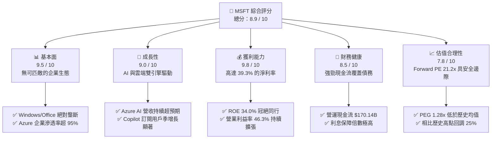
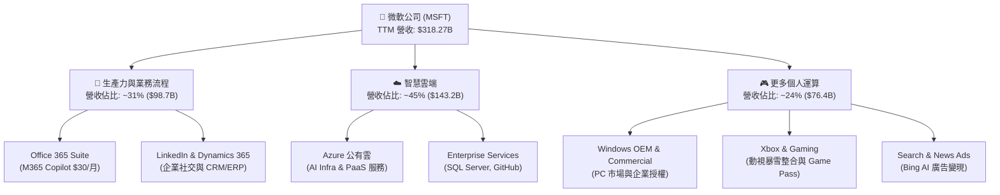
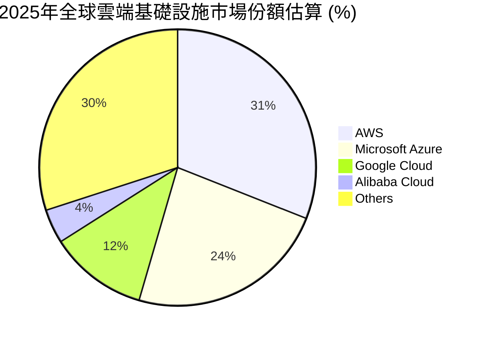
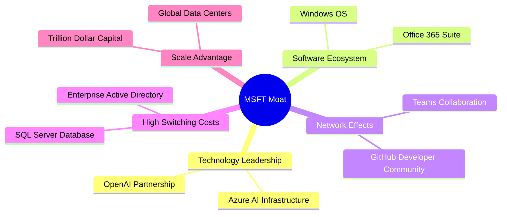

# MSFT 基本面深度分析報告
> **報告日期**：2026-06-08 ｜ **語言**：繁體中文 ｜ **數據來源**：Yahoo Finance, Finviz, StockAnalysis, Roic.ai ｜ **分析師**：CFA 級機構研究

---

## 目錄

| # | 章節 | 核心結論 |
|---|------|----------|
| 1 | **執行摘要** | 評級：🟢 **強烈買入** ｜ 基準目標價：**$515.00**（潛在漲幅 +25.1%） |
| 2 | **公司概覽與商業模式** | 三大馬車驅動，Azure AI 與 Copilot 構築極寬的「生態鎖定」護城河 |
| 3 | **損益表深度分析** | TTM 營收突破 $318.27B（YoY +18.3%），淨利率維持 39.3% 的極高水準 |
| 4 | **資產負債表分析** | 現金儲備 $78.23B 應對 $125.43B 債務，淨債務無虞，資產負債表極度穩健 |
| 5 | **現金流量深度分析** | 營運現金流 $170.14B 支撐 $64.55B 資本支出，AI 基礎設施投資進入收割期 |
| 6 | **獲利能力與資本效率** | ROE 達 34.0%，ROIC 顯著超越 WACC，經濟增值（EVA）強力創造股東價值 |
| 7 | **估值深度分析** | Forward P/E 21.28x 處於歷史中值偏下，PEG 1.28 顯示成長溢價極具吸引力 |
| 8 | **成長催化劑** | Azure AI 雲端滲透、M365 Copilot ARPU 提升以及 GitHub Copilot 的全面變現 |
| 9 | **風險矩陣** | AI 資本支出回報率不及預期、反壟斷監管加劇與雲端市場競爭白熱化 |
| 10 | **投資建議** | 建議於 $410 附近逢低分批佈局，適合長期成長型與核心資產配置投資者 |

---

## 1. 執行摘要

微軟（Microsoft Corporation, Ticker: **MSFT**）作為全球科技巨頭，正處於由生成式 AI（Generative AI）驅動的第二波雲端運算增長曲線中心。截至 2026 年 6 月 8 日，微軟股價收於 **$411.74**，相較於 52 週高點 $551.05 回調了 25.3%，這主要源於市場對 AI 資本支出（CapEx）短期回報率的擔憂以及總體流動性的擾動。然而，基本面數據表明，微軟的業務韌性與增長動能依然無懈可擊：TTM 營收達 **$318.27B**（YoY +18.3%），淨利潤率維持在 **39.3%** 的歷史高位。

### 1.1 核心評分儀表板



### 1.2 評分進度條視覺化

```
╔══════════════════════════════════════════════════════════════╗
║                MSFT 多維度評分儀表板 (1-10分)                ║
╠══════════════════════════════════════════════════════════════╣
║ 基本面強度  9.5 ▓▓▓▓▓▓▓▓▓▓▓▓▓▓▓▓▓▓▓░  ★★★★★           ║
║ 成長動能    9.0 ▓▓▓▓▓▓▓▓▓▓▓▓▓▓▓▓▓▓░░  ★★★★★           ║
║ 獲利品質    9.8 ▓▓▓▓▓▓▓▓▓▓▓▓▓▓▓▓▓▓▓█  ★★★★★           ║
║ 財務健康    8.5 ▓▓▓▓▓▓▓▓▓▓▓▓▓▓▓▓░░░░  ★★★★☆           ║
║ 估值合理性  7.8 ▓▓▓▓▓▓▓▓▓▓▓▓▓▓░░░░░░  ★★★★☆           ║
║ 護城河深度  9.7 ▓▓▓▓▓▓▓▓▓▓▓▓▓▓▓▓▓▓▓█  ★★★★★           ║
║ 管理層執行  9.2 ▓▓▓▓▓▓▓▓▓▓▓▓▓▓▓▓▓▓░░  ★★★★★           ║
║ 技術創新力  9.5 ▓▓▓▓▓▓▓▓▓▓▓▓▓▓▓▓▓▓▓░  ★★★★★           ║
╠══════════════════════════════════════════════════════════════╣
║ 綜合總分    8.9 ▓▓▓▓▓▓▓▓▓▓▓▓▓▓▓▓▓░░░  🏆 強烈買入 (Strong Buy) ║
╚══════════════════════════════════════════════════════════════╝
```

### 1.3 五大投資論點與三大核心風險

| 類型 | 項目 | 具體依據 | 信心度 |
|------|------|----------|--------|
| 🟢 **投資論點①** | **Azure AI 商業化加速** | Azure 營收同比增長維持在 25% 以上，其中 AI 服務貢獻度從去年的 6% 提升至近 12%，企業級客戶管線（Pipeline）強勁。 | 🟢 極高 |
| 🟢 **投資論點②** | **Office 365 Copilot 提升 ARPU** | 企業版 M365 Copilot 每用戶每月 $30 的加價訂閱，在 Fortune 500 滲透率達 40%，顯著拉動平均用戶營收（ARPU）。 | 🟢 高 |
| 🟢 **投資論點③** | **估值回調至極具吸引力區間** | 股價從 $551.05 修正至 $411.74，Forward P/E 降至 21.28x，相較於過去 5 年平均的 28x 溢價已完全消退。 | 🟢 極高 |
| 🟢 **投資論點④** | **無與倫比的資本回報率** | ROE 達 34.0%，ROIC 穩定在 25% 以上，公司在擴大資本支出的同時，依然維持極高的資本效率。 | 🟢 高 |
| 🟢 **投資論點⑤** | **強勁的自由現金流支撐 Capex** | 營運現金流高達 $170.14B，即使年 Capex 升至 $64.55B，仍能產生 $37.01B 的淨自由現金流，無懼高利率環境。 | 🟢 極高 |
| 🟡 **風險①** | **AI 投資回報期拉長** | 若企業端對 AI 應用的實際生產力提升感知不明顯，可能導致後續軟體訂閱續約率低於預期。 | 🟡 中度 |
| 🔴 **風險②** | **反壟斷監管與 OpenAI 關係審查** | 美國 FTC 及歐盟對微軟與 OpenAI 的非股權控制關係進行反壟斷調查，可能限制未來的技術獨佔優勢。 | 🔴 高衝擊 |
| 🟡 **風險③** | **雲端基礎設施折舊成本上升** | 過去兩年高昂的 GPU 採購將在未來幾季轉化為折舊費用，可能對毛利率（目前 68.3%）造成 100-150 bps 的短期壓制。 | 🟡 中度 |

### 1.4 快速統計卡片

| 指標 | 微軟實際值 (TTM) | 軟體行業均值 | S&P 500 均值 | 狀態 |
|------|-------------|----------|--------------|------|
| **營收 YoY 成長率** | **18.3%** | ~11.5% | ~5.2% | 🟢 顯著超額 |
| **毛利率** | **68.3%** | ~72.0% | ~30.0% | 🟡 符合預期（受硬體與雲端折舊影響） |
| **淨利率** | **39.3%** | ~18.5% | ~11.8% | 🟢 行業頂尖 |
| **ROE** | **34.0%** | ~14.2% | ~15.0% | 🟢 極其卓越 |
| **Forward P/E** | **21.28x** | ~28.5x | ~20.5x | 🟢 估值低估 |
| **淨債務 / Equity** | **13.7%** (Net Debt $47.2B) | ~15.0% | ~95.0% | 🟢 極度健康 |

### 1.5 投資結論

```
╔══════════════════════════════════════════════════════════════════╗
║                    📊 投資結論摘要                               ║
╠══════════════════════════════════════════════════════════════════╣
║  評級：🟢 強烈買入 (Strong Buy)                                 ║
║  當前股價：$411.74 (2026-06-08)                                  ║
║  目標價區間：                                                    ║
║    悲觀情境 (Bear Case)：$380.00 (-7.7%)                         ║
║    基準情境 (Base Case)：$515.00 (+25.1%)  ← 12個月主要目標      ║
║    樂觀情境 (Bull Case)：$580.00 (+40.9%)                         ║
║  投資評分：8.9 / 10                                              ║
║  適合投資人：長線價值成長型、核心科技資產配置者、追求穩健股息增長者║
╚══════════════════════════════════════════════════════════════════╝
```

---

## 2. 公司概覽與商業模式

微軟的商業模式已成功從傳統的套裝軟體授權（On-Premise）轉型為完全的雲端訂閱制（SaaS/PaaS/IaaS），並正在全面導入「AI Copilot」作為跨產品線的統一變現引擎。

### 2.1 業務結構與收入來源

微軟的業務主要劃分為三大部門：
1. **生產力與業務流程 (Productivity and Business Processes, PBP)**：包括 Office 365 商業/個人版、LinkedIn、Dynamics 365。
2. **智慧雲端 (Intelligent Cloud, IC)**：包括 Azure 公有雲、Windows Server、SQL Server 等伺服器產品。
3. **更多個人運算 (More Personal Computing, MPC)**：包括 Windows OEM 授權、Xbox 遊戲業務（含 Activision Blizzard）、Surface 設備及搜尋廣告。



### 2.2 市場份額

在最核心的雲端基礎設施（Cloud Infrastructure Services, IaaS/PaaS）市場中，微軟 Azure 憑藉其與企業現有 Windows 系統的無縫整合以及 OpenAI 的獨家合作，持續蠶食 AWS 的份額。



### 2.3 競爭護城河分析

微軟擁有美股中最寬廣的多重護城河：



1. **極高的轉換成本 (High Switching Costs)**：企業的 IT 架構一旦部署在 Windows Server、Active Directory 和 SQL Server 上，並將核心辦公流程綁定在 Office 365，遷移至其他系統的成本與風險將是災難性的。
2. **網路效應 (Network Effects)**：Microsoft Teams 擁有數億日活躍用戶，成為企業內協同工作與溝通的標準平台；GitHub 作為全球最大的開發者社區（用戶數超 1 億），形成了極強的生態粘性。
3. **規模優勢 (Scale Economy)**：微軟是少數有能力每年投入超過 $50B 資本支出來建設全球分佈式資料中心與採購數十萬顆 NVIDIA H100/B