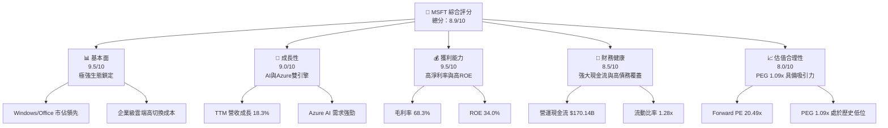

# MSFT 基本面深度分析報告
> **報告日期**：2026-06-10 ｜ **語言**：繁體中文 ｜ **數據來源**：Yahoo Finance, Finviz, StockAnalysis, Roic.ai ｜ **分析師**：CFA 級機構研究

---

## 目錄

| # | 章節 | 核心結論 |
|---|---|---|
| 1 | 執行摘要 | 評級：**強烈買入** ｜ 目標價區間：$380 - $550 ｜ 核心AI與雲端驅動 |
| 2 | 公司概覽與商業模式 | 雲端與智慧邊緣生態，具備極高切換成本與網路效應護城河 |
| 3 | 損益表深度分析 | TTM 營收達 $318.27B (YoY +18.3%)，淨利率高達 39.3% 展現強大定價權 |
| 4 | 資產負債表分析 | 現金儲備 $78.23B 雖有淨債務，但利息保障倍數極高，財務結構穩健 |
| 5 | 現金流量深度分析 | TTM 營運現金流 $170.14B，資本支出擴大至 $64.55B 積極佈局 AI 基礎建設 |
| 6 | 獲利能力與資本效率 | ROE 達 34.0%，ROIC (30.9%) 遠超 WACC (8.0%)，經濟增加值 (EVA) 極其強勁 |
| 7 | 估值深度分析 | Forward P/E 20.49x，相較歷史與同業具備高安全邊際，DCF 基準目標價 $470 |
| 8 | 成長催化劑 | Azure AI 雲端平台持續高增，Copilot 商業化滲透率超預期 |
| 9 | 風險矩陣 | 資本支出回報率低於預期、反壟斷監管與雲端市場競爭加劇 |
| 10 | 投資建議 | 基準情境隱含 18.3% 上行空間，適合長期主權基金與成長型配置 |

---

## 1. 執行摘要

### 1.1 核心評分儀表板



### 1.2 評分進度條視覺化

```
╔══════════════════════════════════════════════════════════════╗
║              MSFT 多維度評分儀表板 (1-10分)                 ║
╠══════════════════════════════════════════════════════════════╣
║ 基本面強度  9.5 ▓▓▓▓▓▓▓▓▓▓▓▓▓▓▓▓▓▓▓░  ★★★★★           ║
║ 成長動能    9.0 ▓▓▓▓▓▓▓▓▓▓▓▓▓▓▓▓▓▓░░  ★★★★★           ║
║ 獲利品質    9.5 ▓▓▓▓▓▓▓▓▓▓▓▓▓▓▓▓▓▓▓░  ★★★★★           ║
║ 財務健康    8.5 ▓▓▓▓▓▓▓▓▓▓▓▓▓▓▓▓░░░░  ★★★★☆           ║
║ 估值合理性  8.0 ▓▓▓▓▓▓▓▓▓▓▓▓▓▓░░░░░░  ★★★★☆           ║
║ 護城河深度  9.8 ▓▓▓▓▓▓▓▓▓▓▓▓▓▓▓▓▓▓▓▓  🏆 頂級護城河     ║
║ 管理層執行  9.2 ▓▓▓▓▓▓▓▓▓▓▓▓▓▓▓▓▓▓░░  ★★★★★           ║
║ 技術創新力  9.5 ▓▓▓▓▓▓▓▓▓▓▓▓▓▓▓▓▓▓▓░  ★★★★★           ║
╠══════════════════════════════════════════════════════════════╣
║ 綜合總分    8.9 ▓▓▓▓▓▓▓▓▓▓▓▓▓▓▓▓▓░░░  🏆 強烈買入          ║
╚══════════════════════════════════════════════════════════════╝
```

### 1.3 五大投資論點 + 三大核心風險

| 類型 | 項目 | 具體依據 | 信心度 |
|------|------|----------|--------|
| 🟢 **投資論點①** | **雲端基礎設施霸主地位** | Azure 持續擴大市佔率，TTM 營收達 $318.27B，YoY 成長 18.3%，展現規模效應。 | 🟢 極高 |
| 🟢 **投資論點②** | **AI 商業化領先者** | Microsoft 365 Copilot 深度整合，推動 Office 365 客單價 (ARPU) 提升，訂閱制營收穩健。 | 🟢 極高 |
| 🟢 **投資論點③** | **極致的資本回報率** | ROE 達 34.0%，ROIC 達 30.9%，遠超 WACC (8.0%)，持續為股東創造超額價值。 | 🟢 極高 |
| 🟢 **投資論點④** | **強大的營運現金流支撐** | TTM 營運現金流達 $170.14B，足以支撐高達 $64.55B 的資本支出，無需過度依賴外部融資。 | 🟢 高 |
| 🟢 **投資論點⑤** | **估值性價比高** | 當前 Forward P/E 僅 20.49x，相較於歷史平均與盈餘成長率 (PEG 1.09x) 具備高安全邊際。 | 🟢 高 |
| 🟡 **風險①** | **AI 資本支出回報遞延** | 2025財年資本支出達 $64.55B，若 AI 應用變現速度慢於預期，可能短期壓抑利潤率。 | 🟡 中度 |
| 🔴 **風險②** | **反壟斷與監管壓力** | 作為全球市值前三大的科技巨頭，其收購案（如 Activision Blizzard）與雲端授權條款面臨各國監管審查。 | 🔴 高衝擊 |
| 🟡 **風險③** | **PC 業務與硬體週期疲軟** | Windows OEM 業務受全球 PC 出貨量週期性波動影響，可能對個人運算部門造成波動。 | 🟡 低度 |

### 1.4 快速統計卡片

| 指標 | 公司實際值 | 行業均值 (基礎軟體) | S&P 500 均值 | 狀態 |
|------|-------------|--------------------|--------------|------|
| 收入 YoY 成長 | **18.3%** | 12.5% | 6.2% | 🟢 優秀 |
| 毛利率 | **68.3%** | 71.2% | 3