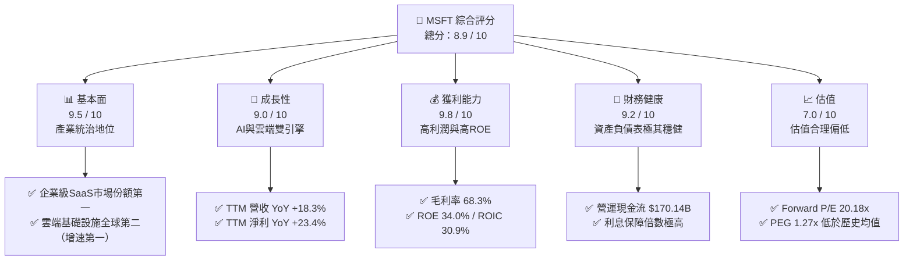

# MSFT 基本面深度分析報告
> **報告日期**：2026-06-11 ｜ **語言**：繁體中文 ｜ **數據來源**：Yahoo Finance, Finviz, StockAnalysis, Roic.ai ｜ **分析師**：CFA 級機構研究

---

## 目錄

| # | 章節 | 核心結論 |
|---|------|----------|
| **1** | **執行摘要** | 評級：🟢 **強烈買入** ｜ 目標價：**$520.00 - $610.00**（潛在漲幅 +33.2% 至 +56.3%） |
| **2** | **公司概覽與商業模式** | 雲端（Azure）與企業級 AI 生態系（Copilot）建構極深護城河，軟體即服務（SaaS）與基礎設施即服務（IaaS）雙輪驅動。 |
| **3** | **損益表深度分析** | TTM 營收達 $318.27B（YoY +18.3%），淨利潤率高達 39.3%，展現強大的定價權與營運槓桿。 |
| **4** | **資產負債表分析** | 現金與短期投資達 $78.27B，債務結構健康（Debt/Equity 30.27%），具備頂級 AAA 級信用實力。 |
| **5** | **現金流量深度分析** | TTM 營運現金流達 $170.14B，自由現金流（FCF）轉換效率極高，資本配置聚焦於高回報的 AI 基礎設施建設。 |
| **6** | **獲利能力與資本效率** | ROE 達 34.0%，ROIC (30.9%) 顯著高於 WACC (9.45%)，持續為股東創造超額經濟價值（EVA）。 |
| **7** | **估值深度分析** | 當前 Trailing P/E 為 23.22x，Forward P/E 為 20.18x，PEG 僅 1.27x，相較歷史中位數與同業，估值具備極高安全邊際。 |
| **8** | **成長催化劑** | Azure AI 需求爆發、Copilot 商業化滲透率提升、以及 Activision Blizzard 遊戲業務綜效釋放。 |
| **9** | **風險矩陣** | AI 基礎設施資本支出過高壓抑短期利潤、雲端市場競爭加劇、以及反壟斷監管風險。 |
| **10**| **投資建議** | 建議於當前股價（$390.34）積極分批布局，適合長期成長型與價值型投資者。 |

---

## 1. 執行摘要

### 1.1 核心評分儀表板



### 1.2 評分進度條視覺化

```
╔══════════════════════════════════════════════════════════════╗
║               MSFT 多維度評分儀表板 (1-10分)                 ║
╠══════════════════════════════════════════════════════════════╣
║ 基本面強度  9.5 ▓▓▓▓▓▓▓▓▓▓▓▓▓▓▓▓▓▓▓░  ★★★★★           ║
║ 成長動能    9.0 ▓▓▓▓▓▓▓▓▓▓▓▓▓▓▓▓▓▓░░  ★★★★★           ║
║ 獲利品質    9.8 ▓▓▓▓▓▓▓▓▓▓▓▓▓▓▓▓▓▓▓█  ★★★★★           ║
║ 財務健康    9.2 ▓▓▓▓▓▓▓▓▓▓▓▓▓▓▓▓▓▓░░  ★★★★★           ║
║ 估值合理性  7.0 ▓▓▓▓▓▓▓▓▓▓▓▓▓▓░░░░░░  ★★★☆☆           ║
║ 護城河深度  9.8 ▓▓▓▓▓▓▓▓▓▓▓▓▓▓▓▓▓▓▓█  ★★★★★           ║
║ 管理層執行  9.5 ▓▓▓▓▓▓▓▓▓▓▓▓▓▓▓▓▓▓▓░  ★★★★★           ║
║ 技術創新力  9.5 ▓▓▓▓▓▓▓▓▓▓▓▓▓▓▓▓▓▓▓░  ★★★★★           ║
╠══════════════════════════════════════════════════════════════╣
║ 綜合總分    8.9 ▓▓▓▓▓▓▓▓▓▓▓▓▓▓▓▓▓░░░  🏆 強烈建議買入      ║
╚══════════════════════════════════════════════════════════════╝
```

### 1.3 五大投資論點 + 三大核心風險

| 類型 | 項目 | 具體依據 | 信心度 |
|------|------|----------|--------|
| 🟢 **投資論點①** | **AI 商業化全面落地** | Copilot 在 Office 365 滲透率持續提升，ARPU（每用戶平均收入）預計提升 20-30%。 | 🟢 極高 |
| 🟢 **投資論點②** | **Azure 雲端市佔擴張** | TTM 營收成長 18.3%，其中 Azure AI 服務貢獻顯著，持續拉近與 AWS 的差距。 | 🟢 極高 |
| 🟢 **投資論點③** | **極高獲利能效與資本回報** | ROE 高達 34.0%，ROIC 達 30.9%，資本效率在萬億市值企業中無人能敵。 | 🟢 極高 |
| 🟢 **投資論點④** | **估值具備安全邊際** | 當前 Forward P/E 僅 20.18x，遠低於過去 5 年均值（~28x），性價比極高。 | 🟢 高 |
| 🟢 **投資論點⑤** | **強大自由現金流提供防禦性** | TTM 營運現金流達 $170.14B，提供經濟放緩時期的強大安全墊與持續回購能力。 | 🟢 極高 |
| 🟡 **風險①** | **AI 資本支出（CapEx）侵蝕利潤率** | FY2025 資本支出達 $64.55B（YoY +45.1%），折舊費用增加可能壓抑短期淨利率。 | 🟡 中度 |
| 🔴 **風險②** | **反壟斷與合規監管加劇** | 歐美監管機構對 OpenAI 投資關係及雲端市場競爭展開調查，可能面臨罰款或業務限制。 | 🔴 高衝擊 |
| 🟡 **風險③** | **傳統 PC 業務成長放緩** | 更多個人運算（MPC）板塊受全球 PC 出貨量週期性波動影響，成長動能較弱。 | 🟡 低衝擊 |

### 1.4 快速統計卡片

| 指標 | MSFT 實際值 | 行業均值 (大型軟體) | S&P 500 均值 | 狀態 |
|------|-------------|--------------------|--------------|------|
| **營收 YoY 成長** | **18.3%** | ~12.0% | ~5.5% | 🟢 領先 |
| **毛利率** | **68.3%** | ~70.0% | ~30.0% | 🟢 優異 |
| **營業利益率** | **46.3%** | ~28.0% | ~15.0% | 🟢 極強 |
| **淨利率** | **39.3%** | ~20.0% | ~11.0% | 🟢 極強 |
| **ROE** | **34.0%** | ~22.0% | ~14.0% | 🟢 極強 |
| **Forward P/E** | **20.18x** | ~28.0x | ~21.0x | 🟢 具吸引力 |
| **PEG Ratio** | **1.27x** | ~1.85x | ~1.50x | 🟢 便宜 |

### 1.5 投資結論

```
╔══════════════════════════════════════════════════════════════════╗
║                    📊 MSFT 投資結論摘要                          ║
╠══════════════════════════════════════════════════════════════════╣
║  評級：🟢 強烈買入 (Strong Buy)                                  ║
║  當前股價：$390.34                                               ║
║  目標價區間：                                                    ║
║    悲觀情境：$410.00（+5.0%）                                    ║
║    基準情境：$520.00（+33.2%） ← 12個月主要目標                  ║
║    樂觀情境：$610.00（+56.3%）                                   ║
║  投資評分：8.9 / 10                                              ║
║  適合投資人：長線成長型投資者、核心藍籌股配置者、AI 產業布局者   ║
╚══════════════════════════════════════════════════════════════════╝
```

---

## 2. 公司概覽與商業模式

### 2.1 業務結構與收入來源

微軟（Microsoft）的商業模式已成功轉型為以「雲端優先、AI 驅動」為核心的訂閱與按需計費模式。其業務主要劃分為三大板塊：

1. **智慧雲端（Intelligent Cloud）**：核心為 Azure 基礎設施服務、SQL Server、Windows Server 等。這是微軟營收佔比最大、成長最快的部門。
2. **生產力與商業流程（Productivity and Business Processes）**：包含 Office 365 商業版/個人版、LinkedIn、Dynamics 365 等。具備高黏性、高利潤的 SaaS 訂閱特徵。
3. **更多個人運算（More Personal Computing）**：包含 Windows OEM、Xbox 遊戲業務、Surface 設備及搜尋廣告。該板塊具備較強的週期性與現金流產生能力。

```mermaid
graph TD
    MSFT["微軟公司 (MSFT)<br/>市值: $2.90T | TTM 營收: $318.27B"]

    IC["☁️ 智慧雲端<br/>營收佔比: ~44% | TTM: ~$140B"]
    PBP["💼 生產力與商業流程<br/>營收佔比: ~32% | TTM: ~$102B"]
    MPC["🎮 更多個人運算<br/>營收佔比: ~24% | TTM: ~$76B"]

    MSFT --> IC