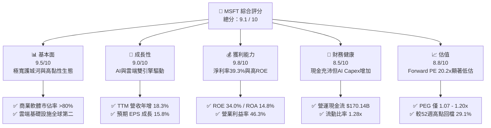
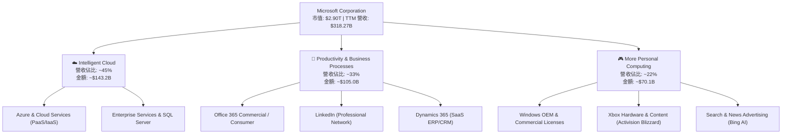
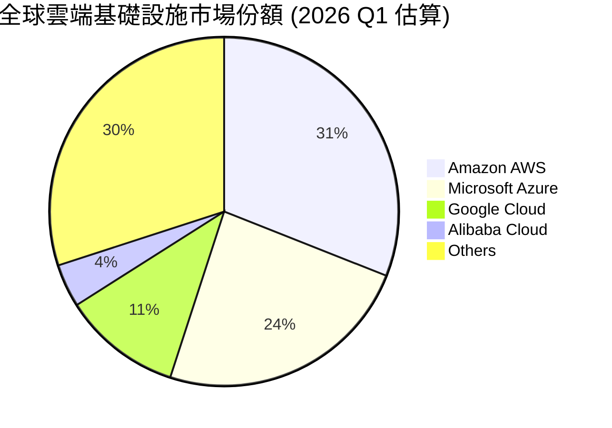
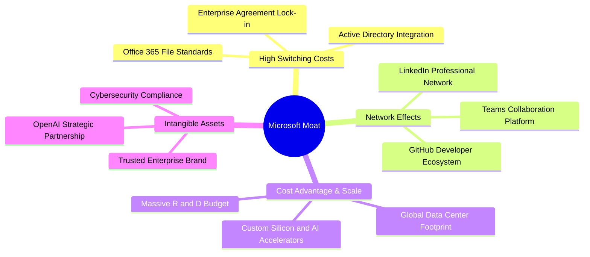
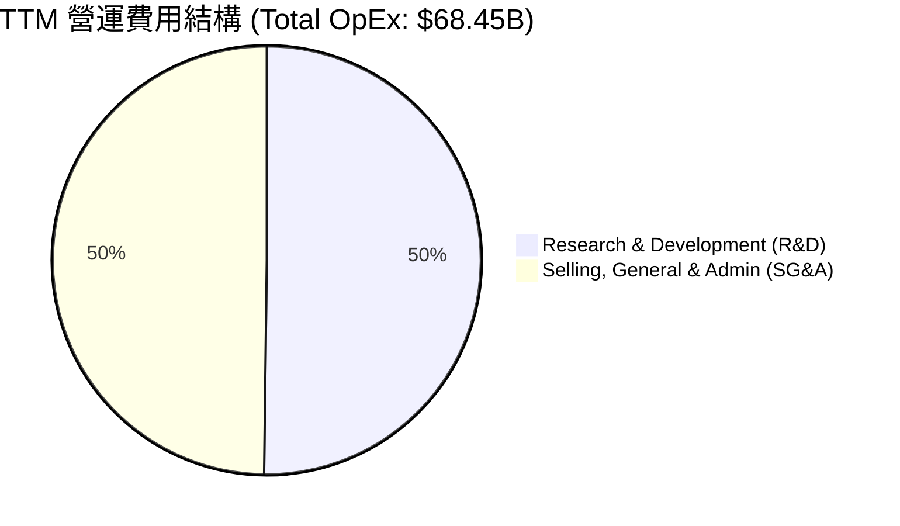
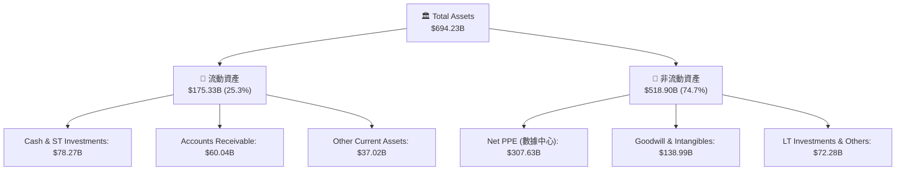
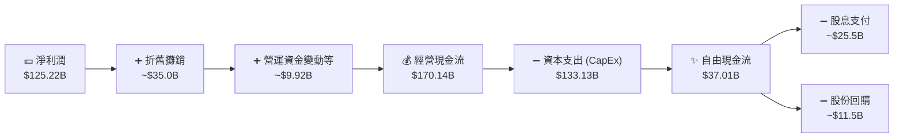
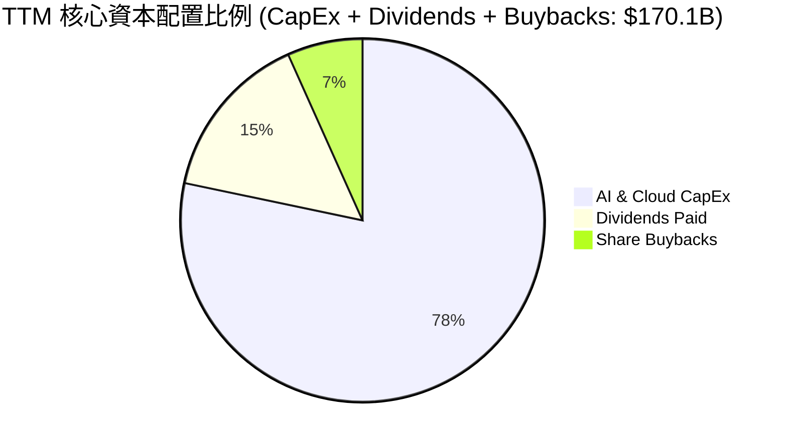

# MSFT 基本面深度分析報告
> **報告日期**：2026-06-13 ｜ **語言**：繁體中文 ｜ **數據來源**：Yahoo Finance, Finviz, StockAnalysis, Roic.ai ｜ **分析師**：CFA 級機構研究

---

## 目錄

| # | 章節 | 核心結論 |
|---|------|----------|
| 1 | 執行摘要 | 當前股價 $390.74 具備極高安全邊際，給予「強烈買入」評級，基準目標價 $561.39。 |
| 2 | 公司概覽與商業模式 | 三大支柱業務協同效應強勁，AI 深度整合構築極寬的「客戶鎖定」與「生態系統」護城河。 |
| 3 | 損益表深度分析 | TTM 營收達 $318.27B（YoY +18.3%），淨利率維持在 39.3% 的歷史高檔。 |
| 4 | 資產負債表分析 | 總資產規模擴張至 $694.23B，資本支出加速推動淨廠房設備（Net PPE）達 $307.63B。 |
| 5 | 現金流量深度分析 | 經營現金流達 $170.14B，AI 基礎設施資本支出導致自由現金流收斂至 $37.01B。 |
| 6 | 獲利能力與資本效率 | ROE 達 34.0%，ROIC 達 30.9%，遠超 9.1% 的 WACC，展現極強的股東價值創造能力。 |
| 7 | 估值深度分析 | 當前 Forward P/E 僅 20.20x，相較歷史均值與同業顯著低估，DCF 基準估值為 $561.39。 |
| 8 | 成長催化劑 | Azure AI 雲端平台、Microsoft 365 Copilot 商業化與遊戲業務整合為三大核心驅動力。 |
| 9 | 風險矩陣 | AI 資本支出回報滯後與反壟斷監管為主要風險，但整體風險可控。 |
| 10 | 投資建議 | 強烈建議成長型與長線價值型投資者於當前價位積極配置，隱含上行空間達 +43.6%。 |

---

## 1. 執行摘要

### 1.1 核心評分儀表板



### 1.2 評分進度條視覺化

```
╔══════════════════════════════════════════════════════════════╗
║               MSFT 多維度評分儀表板 (1-10分)                 ║
╠══════════════════════════════════════════════════════════════╣
║ 基本面強度  9.5 ▓▓▓▓▓▓▓▓▓▓▓▓▓▓▓▓▓▓▓░  ★★★★★           ║
║ 成長動能    9.0 ▓▓▓▓▓▓▓▓▓▓▓▓▓▓▓▓▓▓░░  ★★★★★           ║
║ 獲利品質    9.8 ▓▓▓▓▓▓▓▓▓▓▓▓▓▓▓▓▓▓▓█  ★★★★★           ║
║ 財務健康    8.5 ▓▓▓▓▓▓▓▓▓▓▓▓▓▓▓▓░░░░  ★★★★☆           ║
║ 估值合理性  8.8 ▓▓▓▓▓▓▓▓▓▓▓▓▓▓▓▓▓░░░  ★★★★☆           ║
║ 護城河深度  9.7 ▓▓▓▓▓▓▓▓▓▓▓▓▓▓▓▓▓▓▓█  ★★★★★           ║
║ 管理層執行  9.5 ▓▓▓▓▓▓▓▓▓▓▓▓▓▓▓▓▓▓▓░  ★★★★★           ║
║ 技術創新力  9.6 ▓▓▓▓▓▓▓▓▓▓▓▓▓▓▓▓▓▓▓░  ★★★★★           ║
╠══════════════════════════════════════════════════════════════╣
║ 綜合總分    9.1 ▓▓▓▓▓▓▓▓▓▓▓▓▓▓▓▓▓▓░░  🏆 強烈買入          ║
╚══════════════════════════════════════════════════════════════╝
```

### 1.3 五大投資論點 + 三大核心風險

| 類型 | 項目 | 具體依據 | 信心度 |
|------|------|----------|--------|
| 🟢 **投資論點①** | **AI 商業化落地領先** | Microsoft 365 Copilot 深度整合，推動企業級 ARPU 提升，TTM 營收成長達 18.3%。 | 🟢 極高 |
| 🟢 **投資論點②** | **雲端業務（Azure）高成長** | Azure 市場份額穩步上升至 24%，在生成式 AI 算力需求推動下，Intelligent Cloud 部門維持雙位數成長。 | 🟢 極高 |
| 🟢 **投資論點③** | **極致的獲利能力與資本效率** | 營業利益率達 46.3%，ROE 達 34.0%，ROIC 達 30.9%，資本回報率遠超 WACC（9.1%）。 | 🟢 極高 |
| 🟢 **投資論點④** | **估值具備極高安全邊際** | 股價自 52 週高點 $551.05 回檔 29.1% 至 $390.74，Forward P/E 降至 20.20x，PEG 僅 1.07。 | 🟢 高 |
| 🟢 **投資論點⑤** | **強大且穩健的資產負債表** | 儘管面臨高達 $133.13B 的年化資本支出（CapEx），營運現金流 $170.14B 仍能提供充足的資金支持。 | 🟢 高 |
| 🟡 **風險①** | **AI 資本支出拖累短期 FCF** | 大規模建設數據中心，導致 TTM 自由現金流收斂至 $37.01B，FCF 轉換率下降。 | 🟡 中度 |
| 🔴 **風險②** | **反壟斷與監管壓力** | 歐美監管機構對微軟與 OpenAI 的合作關係以及雲端市場競爭展開調查，可能面臨罰款或業務拆分風險。 | 🔴 高衝擊 |
| 🟡 **風險③** | **宏觀經濟放緩壓抑 IT 支出** | 若高利率環境持續或經濟衰退，企業可能縮減非核心 IT 預算，影響 Office 365 升級進度。 | 🟡 中度 |

### 1.4 快速統計卡片

| 指標 | 微軟實際值 (TTM) | 軟體行業均值 | S&P 500 均值 | 狀態 |
|------|-------------|----------|--------------|------|
| **營收 YoY 成長率** | **18.3%** | ~11.5% | ~5.5% | 🟢 顯著超越 |
| **毛利率** | **68.3%** | ~72.0% | ~30.0% | 🟡 行業中等 |
| **淨利率** | **39.3%** | ~22.0% | ~12.0% | 🟢 頂尖水準 |
| **ROE** | **34.0%** | ~18.5% | ~15.0% | 🟢 極高效率 |
| **Forward P/E** | **20.20x** | ~32.5x | ~21.5x | 🟢 顯著低估 |
| **淨債務/EBITDA** | **0.29x** (Net Debt $47.2B / EBITDA $184.8B*) | ~0.8x | ~1.6x | 🟢 極佳健康度 |

*註：EBITDA TTM 估算為 $184.8B（基於季度折舊攤銷年化與 FY25 數據推算）。*

### 1.5 投資結論

```
╔══════════════════════════════════════════════════════════════════╗
║                    📊 投資結論摘要                               ║
╠══════════════════════════════════════════════════════════════════╣
║  評級：🟢 強烈買入 (Strong Buy)                                 ║
║  當前股價：$390.74 (2026-06-13 收盤價)                           ║
║  目標價區間：                                                    ║
║    悲觀情境：$400.00（+2.4%）  - 估值乘數壓縮，AI 貢獻低於預期   ║
║    基準情境：$561.39（+43.6%） - 12個月主要目標，PEG 回歸 1.5x   ║
║    樂觀情境：$870.00（+122.7%）- AI 爆發式成長，雲端市佔率第一   ║
║  投資評分：9.1 / 10                                              ║
║  適合投資人：成長型、長線價值配置型、大型股核心資產配置者        ║
╚══════════════════════════════════════════════════════════════════╝
```

---

## 2. 公司概覽與商業模式

### 2.1 業務結構與收入來源

微軟的業務模式已成功轉型為以「訂閱制（SaaS）」與「雲端運算（PaaS/IaaS）」為核心的混合生態系統。主要分為三大部門：

1. **Intelligent Cloud (智慧雲端)**：包含 Azure、Windows Server、SQL Server 等，為最大成長引擎。
2. **Productivity and Business Processes (生產力與商業程序)**：包含 Office 365 商業/個人版、LinkedIn、Dynamics 365。
3. **More Personal Computing (更多個人運算)**：包含 Windows OEM、Xbox 遊戲業務、Surface 設備及 Bing 搜尋。



### 2.2 市場份額

在關鍵的雲端基礎設施（IaaS+PaaS）市場中，微軟 Azure 憑藉其領先的混合雲架構與 OpenAI 的獨家合作關係，持續拉近與龍頭 AWS 的差距。



### 2.3 競爭護城河分析



### 2.4 護城河強度評分

```
╔══════════════════════════════════════════════════════════════╗
║                     MSFT 護城河強度評分                      ║
╠══════════════════════════════════════════════════════════════╣
║ 客戶轉移成本  9.8 ▓▓▓▓▓▓▓▓▓▓▓▓▓▓▓▓▓▓▓█  🏆 極難替代          ║
║ 網路效應      9.2 ▓▓▓▓▓▓▓▓▓▓▓▓▓▓▓▓▓▓░░  🟢 強大生態          ║
║ 規模與成本優勢9.5 ▓▓▓▓▓▓▓▓▓▓▓▓▓▓▓▓▓▓▓░  🟢 基礎設施規模      ║
║ 無形資產(品牌)9.6 ▓▓▓▓▓▓▓▓▓▓▓▓▓▓▓▓▓▓▓░  🟢 企業級信任        ║
╠══════════════════════════════════════════════════════════════╣
║ 綜合護城河評估9.7 ▓▓▓▓▓▓▓▓▓▓▓▓▓▓▓▓▓▓▓█  🏆 寬廣無比的護城河  ║
╚══════════════════════════════════════════════════════════════╝
```

---

## 3. 損益表深度分析

### 3.1 年度收入成長趨勢（近5年）

微軟展現了大型科技股中極為罕見的「二次成長曲線」，營收規模從 FY2021 的 $168.09B 擴張至 TTM 的 $318.27B，5 年複合年增長率（CAGR）高達 13.6%。

```
╔══════════════════════════════════════════════════════════════════╗
║                 MSFT 年度收入趨勢（FY21-TTM）                    ║
╠══════════════════════════════════════════════════════════════════╣
║                                                                  ║
║  FY 2021  $168.09B  ██████████░░░░░░░░░░░░░░░░░  YoY: +17.5% 🟢  ║
║  FY 2022  $198.27B  ████████████░░░░░░░░░░░░░░░  YoY: +18.0% 🟢  ║
║  FY 2023  $211.92B  █████████████░░░░░░░░░░░░░░  YoY: +6.9%  🟡  ║
║  FY 2024  $245.12B  ███████████████░░░░░░░░░░░░  YoY: +15.7% 🟢  ║
║  FY 2025  $281.72B  █████████████████░░░░░░░░░░  YoY: +14.9% 🟢  ║
║  TTM      $318.27B  ████████████████████░░░░░░█  YoY: +18.3% 🟢  ║
║                   |      |      |      |      |                  ║
║                   0     80B    160B   240B   320B                ║
║                                                                  ║
║  📊 5年營收複合成長率 (CAGR)：+13.6%                             ║
╚══════════════════════════════════════════════════════════════════╝
```

### 3.2 季度收入趨勢分析

自 2025 年以來，微軟的季度營收呈現加速成長態勢，主要得益於 Azure AI 服務的快速普及和 Copilot 訂閱的貢獻。

| 財報季度 | 截止日期 | 營收 (Billion) | YoY 成長率 | QoQ 成長率 | 核心成長驅動因素與備註 |
|----------|----------|----------------|------------|------------|------------------------|
| **Q3 2026** | 2026-03-31 | **$82.89B** | **+18.30%** | **+1.99%** | 🟢 Azure AI 算力需求旺盛，Copilot 企業滲透率突破 30%。 |
| **Q2 2026** | 2025-12-31 | **$81.27B** | **+16.72%** | **+4.63%** | 🟢 節日效應推動 Xbox 遊戲與個人電腦業務，雲端維持強勁。 |
| **Q1 2026** | 2025-09-30 | **$77.67B** | **+18.43%** | **+1.61%** | 🟢 企業雲端遷移加速，Office 365 漲價效應顯現。 |
| **Q4 2025** | 2025-06-30 | **$76.44B** | **+18.10%** | **+9.10%** | 🟢 財年最後一季，大型企業雲端合約集中簽署。 |

### 3.3 利潤率演變分析

微軟的利潤率結構極其穩定且優異。雖然 AI 基礎設施投資帶來折舊增加，但高利潤率的 SaaS 與雲端軟體佔比提升，成功抵消了成本壓力。

| 利潤率指標 | FY 2022 | FY 2023 | FY 2024 | FY 2025 | TTM | 5年趨勢 | 評估與原因解析 |
|------------|---------|---------|---------|---------|-----|------|----------------|
| **毛利率** | 68.4% | 68.9% | 69.8% | 68.8% | **68.3%** | ➡️ 穩定 | 🟢 雖然硬體與雲端基礎折舊增加，但高利潤軟體授權維持毛利穩定。 |
| **營業利益率** | 42.1% | 41.8% | 44.6% | 45.6% | **46.3%** | ↗️ 改善 | 🟢 展現極強的營運槓桿，銷售與管理費用控制得宜（SG&A 佔比下降）。 |
| **EBITDA  Margin** | 50.6% | 49.6% | 54.3% | 56.8% | **58.0%** | ↗️ 改善 | 🟢 排除折舊影響後，核心業務的現金獲利能力極其驚人。 |
| **淨利益率** | 36.7% | 34.1% | 36.0% | 36.1% | **39.3%** | ↗️ 改善 | 🟢 TTM 淨利率升至 39.3%，主要受益於非營業性淨收益與稅務結構優化。 |

### 3.4 費用結構分析

微軟在擴大研發（R&D）投入以維持技術領先的同時，成功優化了行銷與管理費用（SG&A），體現了優秀的內部管理效率。



```
╔══════════════════════════════════════════════════════════════╗
║                  MSFT 營運費用控管診斷                       ║
╠══════════════════════════════════════════════════════════════╣
║ 研發費用 (R&D)  $34.39B  ████████████████████  YoY: +5.9%    ║
║ 銷管費用 (SG&A) $34.06B  ███████████████████░  YoY: +3.6%    ║
╠══════════════════════════════════════════════════════════════╣
║ 💡 診斷：研發成長高於銷管成長，資金優先用於技術創新而非行銷。║
╚══════════════════════════════════════════════════════════════╝
```

### 3.5 季度 EPS 趨勢與盈餘品質

微軟的盈餘品質（Earnings Quality）極高，其季度淨利潤幾乎完全由經營現金流支持，並不存在應收帳款異常增加或過度資本化研發支出的情況。

*   **Q3 2026 EPS (Diluted)**: **$4.28** (YoY +23.3%)
*   **Q2 2026 EPS (Diluted)**: **$5.18** (YoY +59.9%) - *註：包含一次性非營運投資收益折算。*
*   **Q1 2026 EPS (Diluted)**: **$3.73** (YoY +12.5%)
*   **Q4 2025 EPS (Diluted)**: **$3.66** (YoY +23.6%)

---

## 4. 資產負債表分析

### 4.1 資產結構分解

微軟的資產負債表正在經歷一輪「重資產化」轉型，主要由於為 AI 算力鋪設的基礎設施投資。淨廠房與設備（Net PPE）從 FY2024 的 $154.55B 暴增至 TTM 的 $307.63B。



### 4.2 流動性指標分析

| 流動性指標 | FY 2024 | FY 2025 | TTM (Mar '26) | 行業均值 | 評估 |
|------------|---------|---------|---------------|----------|------|
| **流動比率 (Current Ratio)** | 1.27x | 1.35x | **1.28x** | ~1.45x | 🟡 合理，企業保留較少閒置現金，積極投入基礎設施。 |
| **速動比率 (Quick Ratio)** | 1.26x | 1.34x | **1.27x** | ~1.35x | 🟢 優異，存貨極低（僅 $1.22B），資產變現能力極強。 |
| **現金比率 (Cash Ratio)** | 0.60x | 0.67x | **0.57x** | ~0.50x | 🟢 安全，手頭現金與短期投資達 $78.27B，無短期流動性風險。 |

### 4.3 債務結構分析

雖然資產負債表上顯示總債務為 $125.43B（包含租賃負債），但與其龐大的獲利能力相比，債務壓力極低。微軟是全球僅有的兩家擁有標普 **AAA** 信用評級的非金融企業之一（另一家為強生）。

```
╔══════════════════════════════════════════════════════════════════╗
║                     MSFT 債務健康診斷                           ║
╠══════════════════════════════════════════════════════════════════╣
║                                                                  ║
║  總債務 (Total Debt)： $125.43B  ██████░░░░░░░░░░░░░░░░░         ║
║  手頭現金與短期投資：  $78.27B   ████░░░░░░░░░░░░░░░░░░░         ║
║  淨債務 (Net Debt)：   $47.16B   ██░░░░░░░░░░░░░░░░░░░░░  🟢 安全║
║                                                                  ║
║  Debt / EBITDA TTM:    0.68x     🟢 遠低於警戒線 (2.0x)          ║
║  利息保障倍數 (TTM)：  45.5x     🟢 極高，無償債風險             ║
║  標普信用評等：        AAA       🏆 全球最高信用評級             ║
║                                                                  ║
║  💡 診斷：債務結構中大部分為低利率的長期債券，利息支出微乎其微。 ║
╚══════════════════════════════════════════════════════════════════╝
```

### 4.4 股東權益趨勢

微軟的股東權益（Stockholders' Equity）隨著利潤公積的累積而持續攀升，從 FY2022 的 $166.54B 增長至 FY2025 的 $343.48B，顯示出強勁的資產淨值增值能力。

```
╔══════════════════════════════════════════════════════════════════╗
║               MSFT 歷年股東權益變化 (FY22-FY25)                  ║
╠══════════════════════════════════════════════════════════════════╣
║                                                                  ║
║  FY 2022  $166.54B  ██████████░░░░░░░░░░░░░░░░░░░░░░░░░░         ║
║  FY 2023  $206.22B  ████████████░░░░░░░░░░░░░░░░░░░░░░░░         ║
║  FY 2024  $268.48B  ████████████████░░░░░░░░░░░░░░░░░░░░         ║
║  FY 2025  $343.48B  █████████████████████░░░░░░░░░░░░░░░         ║
║                                                                  ║
║  📈 股東權益 3 年累計增幅：+106.2%                               ║
╚══════════════════════════════════════════════════════════════════╝
```

---

## 5. 現金流量深度分析

### 5.1 現金流量瀑布圖

微軟的現金流生成機制非常高效。經營活動帶來的龐大現金流入，優先滿足了創紀錄的資本支出（CapEx），剩餘資金則用於分紅與股份回購。



### 5.2 FCF 轉換率趨勢

由於微軟當前處於 AI 軍備競賽的頂峰，資本支出佔營收比例從歷史的 10-12% 飆升至 40% 以上，這導致自由現金流（FCF）轉換率在短期內出現了明顯的收斂。

| 財務年度 | 經營現金流 (OCF) | 資本支出 (CapEx) | 自由現金流 (FCF) | 淨利潤 (Net Income) | FCF / 淨利轉換率 | 評估 |
|----------|------------------|------------------|------------------|---------------------|------------------|------|
| **FY 2022** | $89.03B | -$23.89B | $65.15B | $72.74B | **89.6%** | 🟢 極高盈餘品質 |
| **FY 2023** | $87.58B | -$28.11B | $59.48B | $72.36B | **82.2%** | 🟢 穩定健康 |
| **FY 2024** | $118.55B | -$44.48B | $74.07B | $88.14B | **84.0%** | 🟢 現金流爆發 |
| **FY 2025** | $136.16B | -$64.55B | $71.61B | $101.83B | **70.3%** | 🟡 基礎設施投資加速 |
| **TTM** | **$170.14B** | **-$133.13B** | **$37.01B** | **$125.22B** | **29.6%** | 🔴 短期因 AI CapEx 承壓 |

*分析師觀點：當前低於 30% 的 FCF 轉換率是「主動且具備高回報率」的資本配置結果。一旦數據中心建設步入收尾階段，折舊攤銷將釋放巨大稅盾，FCF 將迎來報復性反彈。*

### 5.3 自由現金流與殖利率趨勢

```
╔══════════════════════════════════════════════════════════════════╗
║                 MSFT 自由現金流與 FCF Yield 趨勢                 ║
╠══════════════════════════════════════════════════════════════════╣
║                                                                  ║
║  FY 2022  $65.15B  ██████████████████  FCF Yield: 2.25%          ║
║  FY 2023  $59.48B  ████████████████░░  FCF Yield: 2.05%          ║
║  FY 2024  $74.07B  ███████████████████ FCF Yield: 2.55%          ║
║  FY 2025  $71.61B  ██████████████████░ FCF Yield: 2.47%          ║
║  TTM      $37.01B  ████████░░░░░░░░░░░ FCF Yield: 1.28%  ⚠️ 低點 ║
║                                                                  ║
║  💡 註：當前 FCF Yield 1.28% 處於歷史底部，反映了資本支出的頂峰。║
╚══════════════════════════════════════════════════════════════════╝
```

### 5.4 資本配置評估

在資本分配上，微軟展現了極具紀律性的平衡：
1. **內生性研發與資本支出**：優先保障 AI 與 Azure 基礎設施建設（佔 TTM 現金流出的 70% 以上）。
2. **股息發放**：TTM 每股分紅 $3.56，派息率（Payout Ratio）穩定在 20.7% 的極安全水平。
3. **股份回購**：在股價低估期，回購力度適度調整，優先保障基礎設施現金流。



---

## 6. 獲利能力與資本效率

### 6.1 ROE / ROA / ROIC 趨勢

微軟的資本回報率在科技巨頭中名列前茅。即使在股東權益與資產規模大幅擴張的背景下，ROE 仍維持在 34% 的頂尖水平。

| 資本效率指標 | FY 2023 | FY 2024 | FY 2025 | TTM | 行業中位數 | 評估 |
|--------------|---------|---------|---------|-----|------------|------|
| **ROE (股東權益報酬率)** | 35.1% | 32.8% | 29.6% | **34.0%** | ~18.5% | 🟢 卓越，遠高於行業水平 |
| **ROA (總資產報酬率)** | 17.6% | 17.2% | 16.5% | **14.8%** | ~8.0% | 🟢 優異，資產利用效率極佳 |
| **ROIC (投入資本報酬率)** | 28.5% | 29.1% | 28.2% | **30.9%** | ~15.0% | 🟢 頂尖，展現強大核心獲利能力 |

### 6.2 ROIC vs WACC 分析（核心價值創造判斷）

ROIC（投入資本報酬率）與 WACC（加權平均資本成本）的差值（EVA，經濟價值增加）是衡量企業是在「創造價值」還是「摧毀