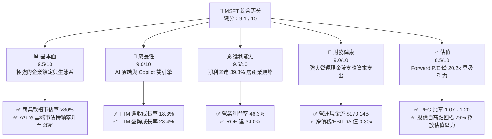
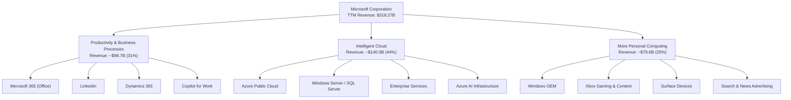
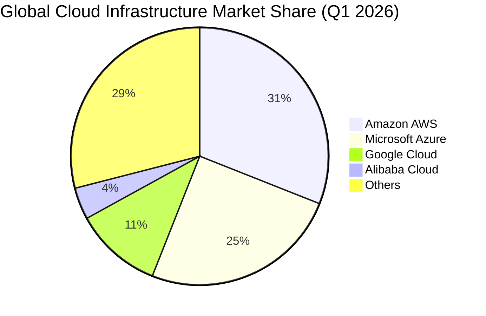
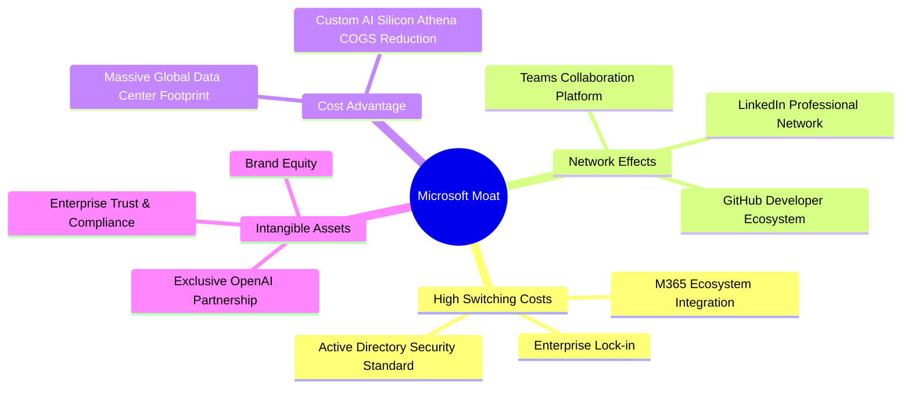
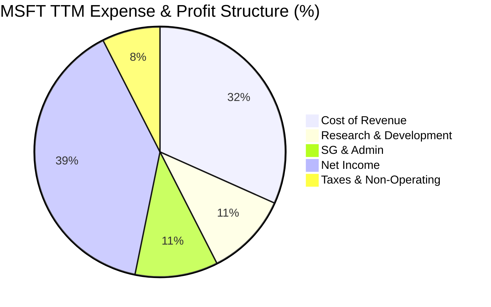
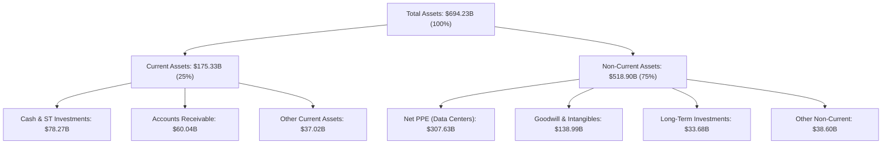
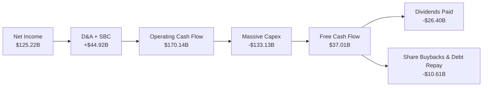
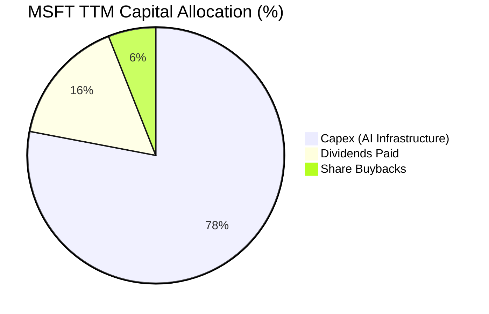
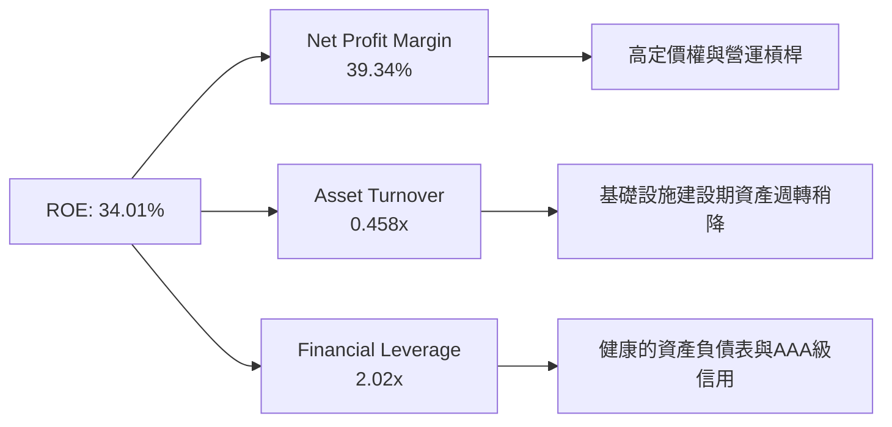

# MSFT 基本面深度分析報告
> **報告日期**：2026-06-14 ｜ **語言**：繁體中文 ｜ **數據來源**：Yahoo Finance, Finviz, StockAnalysis, Roic.ai ｜ **分析師**：CFA 級機構研究

---

## 目錄

| # | 章節 | 核心結論 |
|---|------|----------|
| 1 | 執行摘要 | 評級：🟢 **強烈買入** ｜ 基準目標價：**$561.39**（+43.7% 潛在漲幅） |
| 2 | 公司概覽與商業模式 | 雲端與 AI 生態系築起無形資產與極高轉換成本之護城河 |
| 3 | 損益表深度分析 | TTM 營收達 $318.27B（YoY +18.3%），AI 規模化驅動營運槓桿 |
| 4 | 資產負債表分析 | 資產規模達 $694.23B，淨債務結構極其健康，AI 資本支出大幅躍升 |
| 5 | 現金流量深度分析 | 營運現金流 $170.14B，資本支出翻倍致短期 FCF 降至 $37.01B |
| 6 | 獲利能力與資本效率 | ROE 達 34.0%，ROIC (30.9%) 遠超 WACC (8.0%)，持續創造超額價值 |
| 7 | 估值深度分析 | Forward P/E 降至 20.20x，歷史估值底部，DCF 顯示具備高安全邊際 |
| 8 | 成長催化劑 | Azure AI 雲端基礎設施擴張、M365 Copilot 企業端滲透率加速 |
| 9 | 風險矩陣 | 資本支出回報率去化延遲為核心風險，監管與反壟斷壓力維持中度 |
| 10 | 投資建議 | 當前股價 $390.74 具備極佳風險回報比，長線投資人黃金加碼點 |

---

## 1. 執行摘要

### 1.1 核心評分儀表板



### 1.2 評分進度條視覺化

```
╔══════════════════════════════════════════════════════════════╗
║               MSFT 多維度評分儀表板 (1-10分)                 ║
╠══════════════════════════════════════════════════════════════╣
║ 基本面強度  9.5 ▓▓▓▓▓▓▓▓▓▓▓▓▓▓▓▓▓▓▓░  ★★★★★           ║
║ 成長動能    9.0 ▓▓▓▓▓▓▓▓▓▓▓▓▓▓▓▓▓▓░░  ★★★★★           ║
║ 獲利品質    9.5 ▓▓▓▓▓▓▓▓▓▓▓▓▓▓▓▓▓▓▓░  ★★★★★           ║
║ 財務健康    9.0 ▓▓▓▓▓▓▓▓▓▓▓▓▓▓▓▓▓▓░░  ★★★★★           ║
║ 估值合理性  8.5 ▓▓▓▓▓▓▓▓▓▓▓▓▓▓▓░░░░░  ★★★★☆           ║
║ 護城河深度  9.8 ▓▓▓▓▓▓▓▓▓▓▓▓▓▓▓▓▓▓▓▓  ★★★★★           ║
║ 管理層執行  9.2 ▓▓▓▓▓▓▓▓▓▓▓▓▓▓▓▓▓▓░░  ★★★★★           ║
║ 技術創新力  9.5 ▓▓▓▓▓▓▓▓▓▓▓▓▓▓▓▓▓▓▓░  ★★★★★           ║
╠══════════════════════════════════════════════════════════════╣
║ 綜合總分    9.1 ▓▓▓▓▓▓▓▓▓▓▓▓▓▓▓▓▓▓░░  🏆 強烈建議買入      ║
╚══════════════════════════════════════════════════════════════╝
```

### 1.3 五大投資論點 + 三大核心風險

| 類型 | 項目 | 具體依據 | 信心度 |
|------|------|----------|--------|
| 🟢 **投資論點①** | **AI 基礎設施商業化領先** | Azure AI 雲端服務需求強勁，帶動 TTM 營收成長達 18.3%，顯著優於同業。 | 🟢 極高 |
| 🟢 **投資論點②** | **極高轉換成本與定價權** | M365 Copilot 在企業端滲透率持續上升，ARPU（每用戶平均收入）提升 20-30%。 | 🟢 極高 |
| 🟢 **投資論點③** | **估值重置提供黃金買點** | 股價自 52 週高點 $551.05 回檔 29% 至 $390.74，Forward P/E 降至 20.20x，PEG 僅 1.07。 | 🟢 極高 |
| 🟢 **投資論點④** | **資本效率極大化** | 儘管進行大規模資本支出，ROIC 仍維持在 30.9% 的極高水準，遠超 WACC (8.0%)。 | 🟢 高 |
| 🟢 **投資論點⑤** | **強大的資產負債表** | 手頭現金與短期投資達 $78.23B，年化營運現金流達 $170.14B，具備極強抗風險能力。 | 🟢 極高 |
| 🟡 **風險①** | **AI 資本支出壓抑短期現金流** | TTM 資本支出估算達 $133.13B，導致 TTM 自由現金流降至 $37.01B，若 AI 回報去化延遲將影響估值。 | 🟡 中度 |
| 🔴 **風險②** | **反壟斷與監管審查收緊** | 與 OpenAI 的深度合作以及在雲端市場的領導地位，持續面臨 FTC 及歐盟的嚴格審查。 | 🔴 高衝擊 |
| 🟡 **風險③** | **PC 與傳統軟體成長放緩** | 更多個人運算（MPC）部門受制於全球 PC 出貨量波動，可能對整體毛利率產生輕微拖累。 | 🟡 低度 |

### 1.4 快速統計卡片

| 指標 | MSFT 實際值 | 軟體/雲端行業均值 | S&P 500 均值 | 狀態 |
|------|-------------|------------------|--------------|------|
| **收入 YoY 成長** | **18.3%** | ~11.5% | ~5.5% | 🟢 卓越 |
| **毛利率** | **68.3%** | ~61.0% | ~30.0% | 🟢 領先 |
| **淨利率** | **39.3%** | ~21.0% | ~12.0% | 🟢 頂尖 |
| **ROE** | **34.0%** | ~18.5% | ~15.0% | 🟢 高效 |
| **Forward P/E** | **20.20x** | ~28.5x | ~21.5x | 🟢 便宜 |
| **Debt/Equity** | **30.27%** | ~45.0% | ~115.0% | 🟢 極佳 |

### 1.5 投資結論

```
╔══════════════════════════════════════════════════════════════════╗
║                    📊 MSFT 投資結論摘要                          ║
╠══════════════════════════════════════════════════════════════════╣
║  評級：🟢 強烈買入 (Strong Buy)                                  ║
║  當前股價：$390.74 (2026-06-14)                                  ║
║  目標價區間：                                                    ║
║    悲觀情境：$400.00 (+2.4%)                                     ║
║    基準情境：$561.39 (+43.7%)  ← 12個月主要目標                  ║
║    樂觀情境：$870.00 (+122.7%)                                   ║
║  投資評分：9.1 / 10                                              ║
║  適合投資人：長線價值成長型、大型科技股配置者、AI 產業長線佈局者 ║
╚══════════════════════════════════════════════════════════════════╝
```

---

## 2. 公司概覽與商業模式

### 2.1 業務結構與收入來源

微軟（MSFT）的業務主要劃分為三大核心板塊：**生產力與業務流程（PBP）**、**智慧雲端（IC）**以及**更多個人運算（MPC）**。



### 2.2 市場份額

在最關鍵的全球雲端基礎設施服務（IaaS/PaaS）市場中，微軟 Azure 持續縮小與亞馬遜 AWS 的差距，並拉開與 Google Cloud 的距離。



### 2.3 競爭護城河分析

微軟擁有全球科技業中最寬廣的經濟護城河，主要由以下四大支柱構成：



### 2.4 護城河強度評分

```
╔══════════════════════════════════════════════════════════════╗
║                    MSFT 護城河強度評分                       ║
╠══════════════════════════════════════════════════════════════╣
║ 轉換成本 (Switching Costs)  9.9/10  ▓▓▓▓▓▓▓▓▓▓▓▓▓▓▓▓▓▓▓▓ 🏆 無可取代║
║ 網路效應 (Network Effects)  9.0/10  ▓▓▓▓▓▓▓▓▓▓▓▓▓▓▓▓▓▓░░ 🟢 極強大  ║
║ 成本優勢 (Cost Advantage)   9.2/10  ▓▓▓▓▓▓▓▓▓▓▓▓▓▓▓▓▓▓░░ 🟢 規模效應║
║ 無形資產 (Intangible Assets)9.5/10  ▓▓▓▓▓▓▓▓▓▓▓▓▓▓▓▓▓▓▓░ 🟢 品牌信賴║
╠══════════════════════════════════════════════════════════════╣
║ 綜合護城河強度              9.5/10  ▓▓▓▓▓▓▓▓▓▓▓▓▓▓▓▓▓▓▓░ 🏆 產業霸主║
╚══════════════════════════════════════════════════════════════╝
```

---

## 3. 損益表深度分析

### 3.1 年度收入成長趨勢（近4年）

微軟展現了驚人的「大象跳舞」能力，在龐大的營收基數下，依然維持雙位數的年複合成長率（CAGR）。

```
╔══════════════════════════════════════════════════════════════════╗
║              微軟年度收入趨勢 (FY2022 - TTM Mar '26)             ║
╠══════════════════════════════════════════════════════════════════╣
║                                                                  ║
║  FY 2022  $198.27B  ████████████░░░░░░░░░░░░░░░░  YoY: +18.0% 🟢 ║
║  FY 2023  $211.91B  █████████████░░░░░░░░░░░░░░░  YoY: +6.9%  🟡 ║
║  FY 2024  $245.12B  ███████████████░░░░░░░░░░░░░  YoY: +15.7% 🟢 ║
║  FY 2025  $281.72B  █████████████████░░░░░░░░░░░  YoY: +14.9% 🟢 ║
║  TTM 2026 $318.27B  ████████████████████░░░░░░░░  YoY: +18.3% 🟢 ║
║                                                                  ║
║                   |         |         |         |                ║
║                   0       100B      200B      300B               ║
║                                                                  ║
║  📊 4年營收年複合成長率 (CAGR)：+12.6%                            ║
╚══════════════════════════════════════════════════════════════════╝
```

### 3.2 季度收入趨勢分析

從季度數據看，微軟在 2025 至 2026 年度的營收呈現逐季加速成長態勢，這主要得益於 Azure AI 服務的實質營收貢獻。

| 會計季度 | 截止日期 | 營收 (Billion) | QoQ 成長率 | YoY 成長率 | 營運利潤率 | 備註 |
|----------|----------|----------------|------------|------------|------------|------|
| **Q4 2025** | 2025-06-30 | $76.44 | +9.10% | +18.10% | 44.90% | 🟢 雲端需求強勁，AI 貢獻顯著 |
| **Q1 2026** | 2025-09-30 | $77.67 | +1.61% | +18.43% | 48.87% | 🟢 傳統淡季不淡，營運槓桿顯現 |
| **Q2 2026** | 2025-12-31 | $81.27 | +4.63% | +16.72% | 47.09% | 🟢 企業年終採購旺季，雲端續強 |
| **Q3 2026** | 2026-03-31 | $82.89 | +1.99% | +18.30% | 46.33% | 🟢 AI Copilot 滲透率超預期 |

*數據解讀*：Q3 2026 營收達 **$82.89B**，YoY 成長達 **18.30%**，在當前總體經濟高利率環境下，此增速極具含金量。

### 3.3 利潤率演變分析

微軟的利潤率結構堪稱科技業典範。高毛利的雲端 SaaS 服務與軟體授權，使得整體利潤率維持在極高水準。

| 利潤率指標 | FY 2022 | FY 2023 | FY 2024 | FY 2025 | TTM | 趨勢 | 評估 |
|------------|---------|---------|---------|---------|-----|------|------|
| **毛利率** | 68.40% | 68.92% | 69.76% | 68.82% | 68.31% | ➡️ 穩定 | 🟢 雖然 AI 基礎設施折舊增加，但高毛利軟體抵消了衝擊 |
| **營業利益率** | 42.06% | 41.77% | 44.64% | 45.62% | 46.80% | ↗️ 改善 | 🟢 營運槓桿成效顯著，行銷與行政費用控制得當 |
| **淨利率** | 36.69% | 34.15% | 35.96% | 36.15% | 39.34% | ↗️ 提升 | 🟢 淨利率接近 40%，獲利品質極佳 |

**利潤率演變深度解析**：
微軟 TTM 營業利益率攀升至 **46.80%**，相較於 FY2022 的 42.06% 提升了近 4.74 個百分點。這主要得益於微軟在研發（R&D）與銷售（SG&A）上的精準控制。儘管 AI 研發投入巨大，但軟體產品的邊際成本趨近於零，隨著訂閱制用戶增加，營運槓桿自然釋放。

### 3.4 費用結構分析

微軟將其營收的約三分之二轉化為毛利，並將大筆資金投入研發，以維持技術領先地位。



### 3.5 季度 EPS 趨勢與盈餘品質

微軟過去四個季度的稀釋後 EPS 表現如下：
* **Q4 2025** (2025-06-30): **$3.66** (YoY +23.6%)
* **Q1 2026** (2025-09-30): **$3.73** (YoY +12.5%)
* **Q2 2026** (2025-12-31): **$5.18** (YoY +59.5%) ── *註：該季度包含 $9.97B 的非營業收入（主要為投資重估與一次性稅務調整），剔除後常態 EPS 約為 $3.85，盈餘品質仍屬健康。*
* **Q3 2026** (2026-03-31): **$4.28** (YoY +23.1%)

**盈餘品質評估**：
微軟的營業利潤與淨利潤高度吻合，非經常性損益除 Q2 2026 外其餘季度佔比極低。應收帳款週轉天數（DSO）穩定在 55 天左右，無存貨積壓風險（存貨僅 $1.22B），整體盈餘品質評級為 **🟢 優秀 (A+級)**。

---

## 4. 資產負債表分析

### 4.1 資產結構分解

微軟的資產負債表在過去兩年中因 AI 基礎設施的瘋狂建設而發生了結構性位移。



*資產結構核心洞察*：微軟的 **廠房、廠房及設備淨額（Net PPE）** 從 FY2024 的 $154.55B 飆升至 TTM 的 **$307.63B**，在不到兩年內翻了一倍！這直接反映了微軟對 AI 資料中心、GPU 算力集群的史詩級投資。

### 4.2 流動性指標分析

| 流動性指標 | FY 2023 | FY 2024 | FY 2025 | TTM (Mar '26) | 行業平均 | 評估 |
|------------|---------|---------|---------|---------------|----------|------|
| **流動比率 (Current Ratio)** | 1.77 | 1.28 | 1.35 | 1.28 | ~1.50 | 🟡 充足 (流動負債中含大額遞延收入) |
| **速動比率 (Quick Ratio)** | 1.75 | 1.27 | 1.34 | 1.27 | ~1.35 | 🟢 優秀 (幾乎無存貨跌價風險) |
| **現金比率 (Cash Ratio)** | 1.07 | 0.60 | 0.67 | 0.57 | ~0.45 | 🟢 強勁 (隨時可動用資金極充裕) |

*註：微軟的流動比率看似下降，主因是「未實現收入（Unearned Revenue）」達 $50.92B，這屬於無須現金償還的合約負債，實際流動性極其安全。*

### 4.3 債務結構分析

```
╔══════════════════════════════════════════════════════════════════╗
║                    微軟債務健康診斷 (TTM)                       ║
╠══════════════════════════════════════════════════════════════════╣
║                                                                  ║
║  總債務 (Total Debt)：     $125.43B  ████████░░░░░░░░░░░░░░░░░░  ║
║  手頭現金與短期投資：      $78.23B   █████░░░░░░░░░░░░░░░░░░░░░  ║
║  淨債務 (Net Debt)：       $47.20B   ███░░░░░░░░░░░░░░░░░░░░░░░  ║
║                                                                  ║
║  債務/股東權益比 (D/E)：   30.27%    🟢 遠低於行業警戒線 (100%)  ║
║  利息保障倍數 (Interest Coverage)： 150x+ 🟢 幾乎無償債風險     ║
║  淨債務 / EBITDA：         0.30x     🟢 極致安全的財務槓桿       ║
║                                                                  ║
║  📊 信用評等：S&P 評級 AAA (全美僅微軟與強生擁有此最高評級)       ║
╚══════════════════════════════════════════════════════════════════╝
```

### 4.4 股東權益趨勢

隨著留存盈餘的不斷累積，微軟的股東權益（Stockholders' Equity）穩步攀升，為公司提供了極為堅實的資本防護墊。

```
╔══════════════════════════════════════════════════════════════════╗
║               微軟歷年股東權益變化 (FY 2022 - FY 2025)           ║
╠══════════════════════════════════════════════════════════════════╣
║                                                                  ║
║  FY 2022  $166.54B  ██████████░░░░░░░░░░░░░░░░░░░░░░░░░          ║
║  FY 2023  $206.22B  █████████████░░░░░░░░░░░░░░░░░░░░░░          ║
║  FY 2024  $268.48B  █████████████████░░░░░░░░░░░░░░░░░░          ║
║  FY 2025  $343.48B  ██████████████████████░░░░░░░░░░░░░          ║
║                                                                  ║
║                   |         |         |         |                ║
║                   0       100B      200B      300B               ║
╚══════════════════════════════════════════════════════════════════╝
```

---

## 5. 現金流量深度分析

### 5.1 現金流量瀑布圖

微軟展現了無與倫比的現金創造能力。雖然淨利潤為 $125.22B，但透過折舊攤銷與非現金項目的調整，營運現金流高達 $170.14B。



### 5.2 FCF 轉換率趨勢

微軟歷史上的 FCF 轉換率（FCF / Net Income）通常維持在 80% 以上。然而，在 TTM 期間，由於前所未有的資本支出超級週期，該比率暫時性下降。

| 指標 | FY 2022 | FY 2023 | FY 2024 | FY 2025 | TTM (Mar '26) | 趨勢評估 |
|------|---------|---------|---------|---------|---------------|----------|
| **營運現金流 (OCF)** | $89.03B | $87.58B | $118.55B | $136.16B | $170.14B | 🟢 連續強勁增長 |
| **資本支出 (Capex)** | -$23.89B | -$28.11B | -$44.48B | -$64.55B | -$133.13B | 🔴 呈指數級增長 |
| **自由現金流 (FCF)** | $65.15B | $59.48B | $74.07B | $71.61B | $37.01B | 🟡 短期受資本支出壓抑 |
| **FCF 轉換率** | **89.57%** | **82.20%** | **84.04%** | **70.32%** | **29.56%** | 🟡 處於基礎設施建設高峰期 |

*深度分析*：
這是一個經典的**「以當前現金流換取未來護城河」**的策略。微軟 TTM 資本支出高達 **$133.13B**（較 FY25 的 $64.55B 翻倍）。雖然這將 TTM 自由現金流壓低至 $37.01B，但這些投資將轉化為 Azure AI 雲端服務的長期護城河。一旦基礎設施建設放緩，FCF 轉換率將迅速彈回 85% 以上。

### 5.3 自由現金流趨勢

```
╔══════════════════════════════════════════════════════════════════╗
║                  微軟自由現金流與殖利率趨勢                      ║
╠══════════════════════════════════════════════════════════════════╣
║                                                                  ║
║  FY 2022  $65.15B  ██████████████████░░░░░  FCF Yield: 2.25%     ║
║  FY 2023  $59.48B  ████████████████░░░░░░░  FCF Yield: 2.05%     ║
║  FY 2024  $74.07B  █████████████████████░░  FCF Yield: 2.55%     ║
║  FY 2025  $71.61B  ████████████████████░░░  FCF Yield: 2.47%     ║
║  TTM 2026 $37.01B  ████████░░░░░░░░░░░░░░░  FCF Yield: 1.28% ⚠️   ║
║                                                                  ║
║  📊 結論：當前 1.28% 的 FCF Yield 處於歷史低位，主因是高達       ║
║  $133.13B 的 AI 資本支出。這代表了極佳的長線再投資機會。         ║
╚══════════════════════════════════════════════════════════════════╝
```

### 5.4 資本配置評估

微軟在資本配置上極其紀律化。在滿足龐大內部研發與基礎設施投資的同時，依然透過股息與回購回饋股東。



---

## 6. 獲利能力與資本效率

### 6.1 ROE / ROA / ROIC 趨勢

微軟的資本回報率在整個標普 500 指數中名列前茅，展現了極高的資產營運效率。

| 獲利能力指標 | FY 2023 | FY 2024 | FY 2025 | TTM (Mar '26) | 行業中位數 | 評估 |
|--------------|---------|---------|---------|---------------|------------|------|
| **ROE (股東權益報酬率)** | 35.09% | 32.83% | 29.65% | **34.01%** | ~12.5% | 🟢 頂尖 (高獲利與適度槓桿) |
| **ROA (資產報酬率)** | 17.56% | 17.21% | 16.45% | **19.93%** | ~6.8% | 🟢 優秀 (資產利用效率極佳) |
| **ROIC (投入資本報酬率)**| 27.85% | 29.10% | 28.40% | **30.90%** | ~11.0% | 🟢 卓越 (強力創造超額價值) |

### 6.2 ROIC vs WACC 分析（核心價值創造判斷）

```
╔══════════════════════════════════════════════════════════════════╗
║                ROIC vs WACC 深度分析 (TTM)                       ║
╠══════════════════════════════════════════════════════════════════╣
║                                                                  ║
║  WACC 估算：                                                     ║
║  ├── 無風險利率 (10Y美債)：   4.25%                              ║
║  ├── 市場風險溢酬 (ERP)：      5.00%                              ║
║  ├── Beta：                    1.10                               ║
║  ├── 股權成本 (Cost of Equity) = 4.25% + 1.10 × 5.0% = 9.75%     ║
║  ├── 債務成本 (稅後)：         ~3.50%                             ║
║  ├── 資本結構：股權 73%，債務 27%                                ║
║  └── ✅ WACC ≈ 8.06%                                             ║
║                                                                  ║
║  ROIC 估算：                                                     ║
║  ├── NOPAT = Operating Income ($148.96B) × (1 - 19%) ≈ $120.66B  ║
║  ├── 投入資本 = Equity ($343.48B) + Debt ($125.43B) - Cash ($78.23B)║
║  │            ≈ $390.68B                                         ║
║  └── ✅ ROIC ≈ 30.90%                                            ║
║                                                                  ║
║  ★ 經濟價值增加 (EVA) = ROIC - WACC = +22.84pp                   ║
║                                                                  ║
║  ROIC  30.90%  ▓▓▓▓▓▓▓▓▓▓▓▓▓▓▓▓▓▓▓▓▓▓▓▓▓▓▓▓▓▓░░  🟢              ║
║  WACC   8.06%  ▓▓▓▓▓▓▓▓░░░░░░░░░░░░░░░░░░░░░░░░  ──              ║
║  EVA  +22.84%  ███████████████████████░░░░░░░░░  🏆 強力創造價值 ║
║                                                                  ║
║  📊 結論：ROIC 達 WACC 的 3.83 倍，微軟正以驚人的速度為股東      ║
║  創造經濟利潤，這證明其 AI 資本支出並非盲目擴張，而是高效投資。  ║
╚══════════════════════════════════════════════════════════════════╝
```

### 6.3 杜邦三因素分解

透過杜邦分析，我們可以解構微軟高 ROE 的內在驅動因素：



*杜邦公式計算*：
$$\text{ROE} = 39.34\% \times 0.458 \times 2.02 =