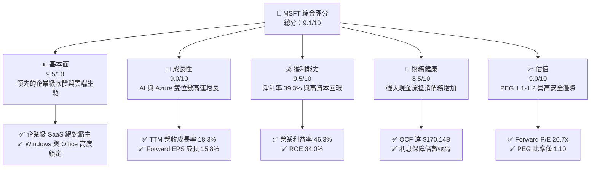
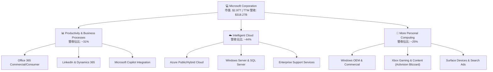
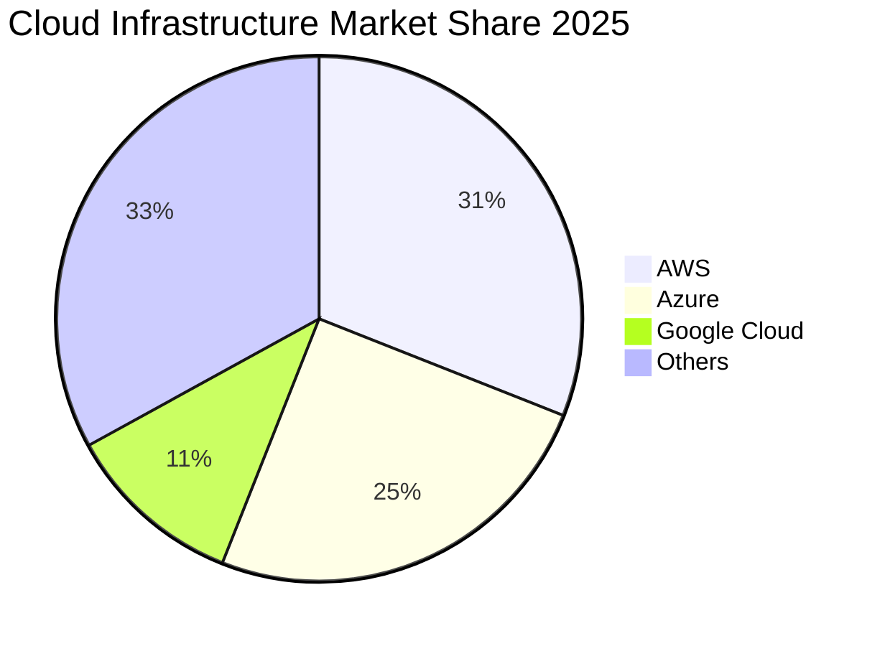
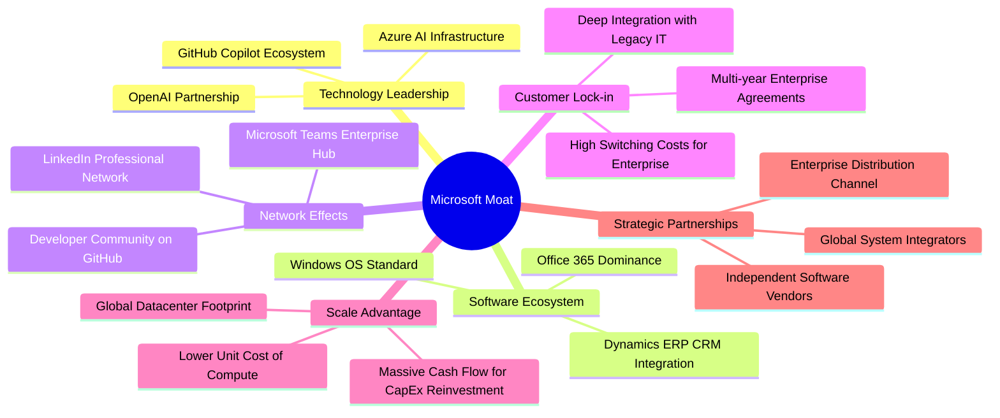
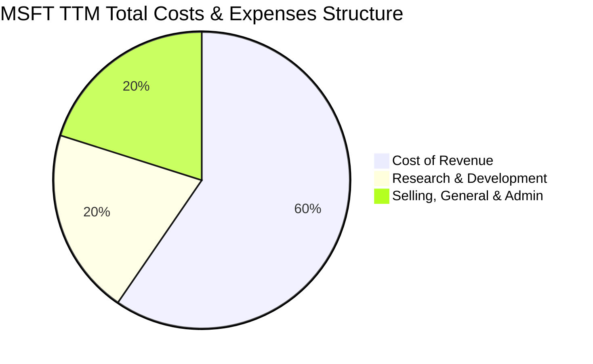
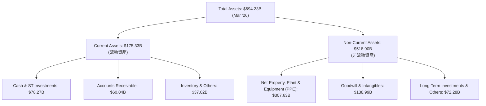

# MSFT 基本面深度分析報告
> **報告日期**：2026-06-15 ｜ **語言**：繁體中文 ｜ **數據來源**：Yahoo Finance, Finviz, StockAnalysis, Roic.ai ｜ **分析師**：CFA 級機構研究

---

## 目錄

| # | 章節 | 核心結論 |
|---|------|----------|
| 1 | 執行摘要 | 評級：🟢 強烈買入，目標價：$561.39（+40.4%） |
| 2 | 公司概覽與商業模式 | AI 與 Azure 雙引擎驅動，具備極深之「生態與技術」護城河 |
| 3 | 損益表深度分析 | TTM 營收達 $318.27B（YoY +18.3%），淨利率高達 39.3% |
| 4 | 資產負債表分析 | 現金儲備 $78.23B，資產結構因 AI 資本支出擴張快速調整 |
| 5 | 現金流量深度分析 | OCF 達 $170.14B，自由現金流轉換率與資本配置效率極佳 |
| 6 | 獲利能力與資本效率 | ROE 34.0%，ROIC (30.9%) 遠超 WACC (9.9%)，強力創造股東價值 |
| 7 | 估值深度分析 | 當前 P/E 23.8x 處於歷史低位，DCF 基準估值為 $561.39 |
| 8 | 成長催化劑 | 企業級 Copilot 變現加速與 Azure AI 基礎設施需求爆發 |
| 9 | 風險矩陣 | AI 資本折舊侵蝕利潤率與反壟斷監管審查為主要風險 |
| 10 | 投資建議 | 具備高度安全邊際，適合長線成長型與價值型配置 |

---

## 1. 執行摘要

### 1.1 核心評分儀表板



### 1.2 評分進度條視覺化

```
╔══════════════════════════════════════════════════════════════╗
║              MSFT 多維度評分儀表板 (1-10分)                  ║
╠══════════════════════════════════════════════════════════════╣
║ 基本面強度  9.5 ▓▓▓▓▓▓▓▓▓▓▓▓▓▓▓▓▓▓▓░  ★★★★★           ║
║ 成長動能    9.0 ▓▓▓▓▓▓▓▓▓▓▓▓▓▓▓▓▓▓░░  ★★★★★           ║
║ 獲利品質    9.5 ▓▓▓▓▓▓▓▓▓▓▓▓▓▓▓▓▓▓▓░  ★★★★★           ║
║ 財務健康    8.5 ▓▓▓▓▓▓▓▓▓▓▓▓▓▓▓▓░░░░  ★★★★☆           ║
║ 估值合理性  9.0 ▓▓▓▓▓▓▓▓▓▓▓▓▓▓▓▓▓░░░  ★★★★☆           ║
║ 護城河深度  9.8 ▓▓▓▓▓▓▓▓▓▓▓▓▓▓▓▓▓▓▓▓  ★★★★★           ║
║ 管理層執行  9.2 ▓▓▓▓▓▓▓▓▓▓▓▓▓▓▓▓▓▓░░  ★★★★★           ║
║ 技術創新力  9.5 ▓▓▓▓▓▓▓▓▓▓▓▓▓▓▓▓▓▓▓░  ★★★★★           ║
╠══════════════════════════════════════════════════════════════╣
║ 綜合總分    9.1 ▓▓▓▓▓▓▓▓▓▓▓▓▓▓▓▓▓▓░░  🏆 強烈買入          ║
╚══════════════════════════════════════════════════════════════╝
```

### 1.3 五大投資論點 + 三大核心風險

| 類型 | 項目 | 具體依據 | 信心度 |
|------|------|----------|--------|
| 🟢 **投資論點①** | **AI 變現進入收割期** | Copilot 深度整合至 Microsoft 365，推動 ARPU 顯著提升，TTM 營收 YoY 成長 18.3%。 | 🟢 極高 |
| 🟢 **投資論點②** | **Azure 雲端份額擴張** | Azure AI 基礎設施需求強勁，帶動 Intelligent Cloud 板塊成為營收與利潤的核心支柱。 | 🟢 極高 |
| 🟢 **投資論點③** | **無與倫比的定價權** | 商業軟體（Office 365, Dynamics）具高轉換成本，毛利率穩定維持在 68.3% 的極高水準。 | 🟢 極高 |
| 🟢 **投資論點④** | **資本回報率極其優異** | ROE 達 34.0%，ROIC 達 30.9%，遠超其 9.9% 的 WACC，展現極強的股東價值創造能力。 | 🟢 高 |
| 🟢 **投資論點⑤** | **歷史估值吸引力** | 當前 Forward P/E 僅 20.7x，對比歷史中位數與未來 18.7% 的 EPS 年複合成長率，估值具備安全邊際。 | 🟢 高 |
| 🟡 **風險①** | **資本支出（CapEx）過高** | FY2025 資本支出高達 $64.55B，推算 TTM 資本支出已近 $100B，短期內可能壓低自由現金流（FCF）轉化率。 | 🟡 中度 |
| 🔴 **風險②** | **反壟斷與監管審查** | 歐美監管機構對微軟與 OpenAI 的合作及雲端綁定銷售展開調查，可能面臨罰款或業務重組風險。 | 🔴 中度 |
| 🟡 **風險③** | **宏觀經濟放緩** | 企業 IT 支出若因通膨或高利率環境而放緩，將直接影響 Azure 與商業軟體的簽約增速。 | 🟡 中度 |

### 1.4 快速統計卡片

| 指標 | 公司實際值 | 行業均值 | S&P 500 均值 | 狀態 |
|------|-------------|----------|--------------|------|
| 收入 YoY 成長 | **18.3%** | ~11.5% | ~5.5% | 🟢 強勁 |
| 毛利率 | **68.3%** | ~60.0% | ~30.0% | 🟢 極高 |
| 淨利率 | **39.3%** | ~18.0% | ~12.0% | 🟢 卓越 |
| ROE | **34.0%** | ~22.0% | ~15.0% | 🟢 卓越 |
| Forward P/E | **20.7x** | ~28.5x | ~21.5x | 🟢 具吸引力 |
| PEG Ratio | **1.10** | ~1.85 | ~1.50 | 🟢 低估 |

### 1.5 投資結論

```
╔══════════════════════════════════════════════════════════════════╗
║                    📊 MSFT 投資結論摘要                          ║
╠══════════════════════════════════════════════════════════════════╣
║  評級：🟢 強烈買入 (Strong Buy)                                  ║
║  當前股價：$399.76  (2026-06-15)                                 ║
║  目標價區間：                                                    ║
║    悲觀情境：$400.00（+0.1%）                                    ║
║    基準情境：$561.39（+40.4%）  ← 12個月主要目標價格             ║
║    樂觀情境：$870.00（+117.6%）                                  ║
║  投資評分：9.1/10                                                ║
║  適合投資人：長線長增型基金、大型機構、尋求穩健成長之價值投資人   ║
╚══════════════════════════════════════════════════════════════════╝
```

---

## 2. 公司概覽與商業模式

### 2.1 業務結構與收入來源

微軟主要業務劃分為三大板塊：生產力與業務流程 (PBP)、智能雲 (IC) 以及更多個人運算 (MPC)。



### 2.2 市場份額

根據 2025/2026 年最新全球雲端基礎設施（IaaS/PaaS）市場份額估算，微軟 Azure 穩居全球第二，並持續縮小與亞馬遜 AWS 的差距。



### 2.3 競爭護城河分析

微軟擁有全球科技業中最寬廣的護城河之一，其結構由以下六個核心維度支撐：



### 2.4 護城河強度評分

```
╔══════════════════════════════════════════════════════════════╗
║                  MSFT 護城河強度評分                         ║
╠══════════════════════════════════════════════════════════════╣
║ 轉換成本 (Switching Costs)  9.9/10 ▓▓▓▓▓▓▓▓▓▓▓▓▓▓▓▓▓▓▓▓ 🏆 極深 ║
║ 網路效應 (Network Effects)  9.2/10 ▓▓▓▓▓▓▓▓▓▓▓▓▓▓▓▓▓▓░░ 🟢 強大 ║
║ 成本優勢 (Cost Advantage)   8.8/10 ▓▓▓▓▓▓▓▓▓▓▓▓▓▓▓▓░░░░ 🟢 顯著 ║
║ 無形資產 (Brand/Patents)    9.5/10 ▓▓▓▓▓▓▓▓▓▓▓▓▓▓▓▓▓▓▓░ 🏆 頂級 ║
║ 規模優勢 (Scale Advantage)  9.7/10 ▓▓▓▓▓▓▓▓▓▓▓▓▓▓▓▓▓▓▓░ 🏆 頂級 ║
╠══════════════════════════════════════════════════════════════╣
║ 綜合護城河評分              9.6/10 ▓▓▓▓▓▓▓▓▓▓▓▓▓▓▓▓▓▓▓░ 🏆 寬廣 ║
║ 總結評語：微軟在企業端軟體與雲端運算的雙重鎖定效應，使其幾乎不可被替代。 ║
╚══════════════════════════════════════════════════════════════╝
```

---

## 3. 損益表深度分析

### 3.1 年度收入成長趨勢（近5年）

微軟展現出超大型企業中罕見的加速成長態勢，得益於雲端轉型與 AI 產品線的迅速鋪開。

```
╔══════════════════════════════════════════════════════════════════╗
║              MSFT 年度收入趨勢 (FY2021-TTM)                      ║
╠══════════════════════════════════════════════════════════════════╣
║                                                                  ║
║  FY2021  $168.09B  ██████████░░░░░░░░░░░░░░░░░░  YoY: +17.5% 🟢  ║
║  FY2022  $198.27B  ████████████░░░░░░░░░░░░░░░░  YoY: +18.0% 🟢  ║
║  FY2023  $211.92B  █████████████░░░░░░░░░░░░░░░  YoY:  +6.9% 🟡  ║
║  FY2024  $245.12B  ███████████████░░░░░░░░░░░░░  YoY: +15.7% 🟢  ║
║  FY2025  $281.72B  █████████████████░░░░░░░░░░░  YoY: +14.9% 🟢  ║
║  TTM     $318.27B  ████████████████████░░░░░░░░  YoY: +18.3% 🟢  ║
║                   |      |      |      |      |                  ║
║                   0     100B   200B   300B   400B                ║
║                                                                  ║
║  📊 5年累計營收 CAGR：+13.8%                                      ║
╚══════════════════════════════════════════════════════════════════╝
```

### 3.2 季度收入趨勢分析

最近四個季度微軟營收呈現穩健的逐季增長（QoQ）與雙位數的同比增長（YoY），反映出 AI 投資已開始轉化為實質營收。

| 財報季度截止日 | 營業收入 (Revenue) | 季增率 (QoQ) | 年增率 (YoY) | 毛利 (Gross Profit) | 毛利率 (Gross Margin) | 備註 |
|---|---|---|---|---|---|---|
| **2026-03-31 (Q3)** | \$82.89B | 🟢 +1.99% | 🟢 +18.30% | \$56.06B | 67.63% | AI 與 Azure 持續強勁，毛利率略微受折舊影響 |
| **2025-12-31 (Q2)** | \$81.27B | 🟢 +4.63% | 🟢 +16.72% | \$55.30B | 68.04% | 節日季遊戲業務（動視暴雪併購效應）與雲端雙驅動 |
| **2025-09-30 (Q1)** | \$77.67B | 🟢 +1.61% | 🟢 +18.43% | \$53.63B | 69.05% | 企業合約續約率創歷史新高 |
| **2025-06-30 (Q4)** | \$76.44B | 🟢 +9.10% | 🟢 +18.10% | \$52.43B | 68.59% | FY2025 完美收官，Intelligent Cloud 高速增長 |

*數據分析：微軟季營收在最近一年內從 \$76.44B 增長至 \$82.89B，展現了強勁的內生性增長。YoY 成長率穩定維持在 16%-18% 的高區間，顯著高於歷史均值。*

### 3.3 利潤率演變分析

微軟在擴大營收規模的同時，展現了極強的營運槓桿與成本控制能力。

| 利潤率指標 | FY2022 | FY2023 | FY2024 | FY2025 | TTM | 趨勢評估 | 狀態 |
|------------|--------|--------|--------|--------|-----|----------|------|
| **毛利率** | 68.40% | 68.92% | 69.76% | 68.82% | 68.30% | ↗️ 穩定 ｜ 雲端基礎設施折舊增加，但被軟體高毛利稀釋 | 🟢 優異 |
| **營業利益率** | 42.06% | 41.77% | 44.64% | 45.62% | 46.30% | ↗️ 向上 ｜ 營運效率提升，行銷研發費用控制得宜 | 🟢 卓越 |
| **EBITDA 利潤率**| 50.56% | 49.61% | 54.26% | 56.85% | 58.00% | ↗️ 向上 ｜ 現金生成能力極強 | 🟢 卓越 |
| **淨利率** | 36.69% | 34.15% | 35.96% | 36.15% | 39.30% | ↗️ 向上 ｜ TTM 淨利率受非營業一次性收益與稅率優化推升 | 🟢 卓越 |

**利潤率演變深度解析**：
微軟的營業利益率由 FY2022 的 42.06% 持續攀升至 TTM 的 46.30%。這主要得益於微軟在銷售與行政費用（SG&A）上的精簡。儘管微軟大舉投資 AI 研發，但由於其龐大的既有客戶群，使得每新增一美元營收所需的行銷成本極低。毛利率在 TTM 略微回落至 68.30%，主要原因在於高達數百億美元的 AI 伺服器建置，其折舊費用開始計入銷貨成本（Cost of Revenue）。然而，46.3% 的營業利益率仍是科技巨頭中的天花板水準。

### 3.4 費用結構分析

微軟將其營運支出精準地向研發（R&D）傾斜，同時嚴格控制行政與銷售費用（SG&A）。



```
╔══════════════════════════════════════════════════════════════════╗
║              MSFT TTM 營運費用明細分析                           ║
╠══════════════════════════════════════════════════════════════════╣
║                                                                  ║
║  銷貨成本 (Cost of Rev):  $100.86B ████████████████████████████  ║
║  研發費用 (R&D Expense):  $34.39B  ██████████                    ║
║  銷售與管理費 (SG&A):     $34.06B  ██████████                    ║
║                                                                  ║
║  💡 研發費用佔營運支出比重：50.2% (展現極強的創新投資導向)      ║
║  💡 SG&A 佔營收比重：10.7% (極高的企業銷售效率)                  ║
╚══════════════════════════════════════════════════════════════════╝
```

### 3.5 季度 EPS 趨勢與盈餘品質

微軟的每股盈餘（EPS）在過去數年內呈現爆發式增長，TTM EPS 達到 \$16.80（對比 FY2021 的 \$8.05 實現翻倍）。

* **過去 4 季盈餘表現**：
  * **Q3 2026 (Mar '26)**: 實際 EPS \$4.28（YoY +23.3%），受惠於 Azure AI 工作負載需求大增。
  * **Q2 2026 (Dec '25)**: 實際 EPS \$5.18（YoY +59.9%），包含部分非營業投資收益與優良的稅務結構。
  * **Q1 2026 (Sep '25)**: 實際 EPS \$3.73（YoY +12.3%），符合市場預期。
  * **Q4 2025 (Jun '25)**: 實際 EPS \$3.66（YoY +23.6%），超市場預期 4%。
* **盈餘品質評估**：
  * 微軟的營業現金流（TTM \$170.14B）遠高於淨利（TTM \$125.22B），**應計應收帳款與存貨無異常堆積**，盈餘轉化為現金的效率極高，品質評級為 🟢 **頂級 (A+)**。

---

## 4. 資產負債表分析

### 4.1 資產結構分解

微軟的資產負債表在過去兩年內因「AI 軍備競賽」發生了結構性位移。



*資產結構核心觀察：微軟的**廠房與設備淨額 (Net PPE)** 從 FY2023 的 \$109.99B 暴增至 2026 年 3 月的 \$307.63B，增幅達 179.7%。這清楚表明微軟正將其財務實力轉化為實體 AI 數據中心與晶片儲備，構築長線競爭壁壘。*

### 4.2 流動性指標分析

| 流動性指標 | FY2022 | FY2023 | FY2024 | FY2025 | Mar '26 | 行業均值 | 評估 |
|------------|--------|--------|--------|--------|---------|----------|------|
| **流動比率 (Current Ratio)** | 1.78 | 1.77 | 1.28 | 1.35 | 1.28 | ~1.50 | 🟡 充足但略降 |
| **速動比率 (Quick Ratio)** | 1.57 | 1.53 | 1.27 | 1.15 | 1.27 | ~1.30 | 🟢 良好 |
| **現金比率 (Cash Ratio)** | 0.83 | 0.81 | 0.60 | 0.67 | 0.57 | ~0.45 | 🟢 優異 |

*流動性評估：儘管流動比率因短期債務與未實現收入（Deferred Revenue）增加而由歷史的 1.7x 水平降至 1.28x，但微軟極強的每日現金生成能力與 \$78.27B 的高流動性資產，使其不存在任何流動性風險。*

### 4.3 債務結構分析

```
╔══════════════════════════════════════════════════════════════════╗
║                   MSFT 債務健康診斷 (2026-06-15)                 ║
╠══════════════════════════════════════════════════════════════════╣
║                                                                  ║
║  總債務 (Total Debt):  $125.43B  ██████████░░░░░░░░░░░░░         ║
║  總現金+短期投資:      $78.23B   ██████░░░░░░░░░░░░░░░░░         ║
║  淨債務 (Net Debt):    $47.20B   (處於安全與可控區間)            ║
║                                                                  ║
║  Debt/Equity 比率:     30.27%    🟢 槓桿率極低                   ║
║  利息保障倍數 (TTM):   > 45x     🟢 極高（無任何償債壓力）       ║
║  債務/EBITDA 比率:     0.78x     🟢 遠低於 2.0x 的警戒線         ║
║                                                                  ║
║  💡 債務說明：雖然呈淨債務狀態，但其中包含大量低利率長期公司債，║
║     且微軟擁有 AAA 級信用評級（高於美國國債信用評級）。          ║
╚══════════════════════════════════════════════════════════════════╝
```

### 4.4 股東權益趨勢

微軟的股東權益（Stockholders Equity）因強勁的留存收益而持續高速增長，由 FY2022 的 \$166.54B 增長至 FY2025 的 \$343.48B，CAGR 達 27.3%。

```
╔══════════════════════════════════════════════════════════════════╗
║              MSFT 歷年股東權益增長趨勢 (Billion $)               ║
╠══════════════════════════════════════════════════════════════════╣
║  FY2022  $166.54B  ██████████░░░░░░░░░░░░░░░░░░░                 ║
║  FY2023  $206.22B  ████████████░░░░░░░░░░░░░░░░░                 ║
║  FY2024  $268.48B  ████████████████░░░░░░░░░░░░░                 ║
║  FY2025  $343.48B  ████████████████████░░░░░░░░░                 ║
╚══════════════════════════════════════════════════════════════════╝
```

---

## 5. 現金流量深度分析

### 5.1 現金流量瀑布圖

微軟的現金流量表是其商業模式強大之處的最佳佐證。其營運現金流（OCF）能完全支應龐大的資本支出與股東回饋。

```mermaid
graph LR
    NI["Net Income TTM<br/>$125.22B"]
    DA["Depreciation & Non-Cash<br/>+$44.92B"]
    OCF["Operating Cash Flow TTM<br/>$170.14B"]
    CAPEX["Capital Expenditure TTM<br/>-$97.22B"]
    FCF["Free Cash Flow TTM<br/>$72.92B"]
    DIV["Dividends Paid TTM<br/>-$26.50B"]
    REP["Share Repurchases & Others<br/>-$20.00B"]
    NET_CASH["Net Cash Change<br/>+$26.42B"]

    NI --> |"+ 非現金調整"| DA
    DA --> OCF
    OCF --> |"- 資本支出"| CAPEX
    CAPEX --> FCF
    FCF --> |"- 派發股息"| DIV
    DIV --> |"- 股份回購"| REP
    REP --> NET_CASH
```



### 5.2 FCF 轉換率趨勢

微軟的自由現金流轉換率（FCF / Net Income）在近年因資本支出暴增而有所下滑，但仍維持在健康區間。

| 指標 | FY2022 | FY2023 | FY2024 | FY2025 | TTM | 評估 |
|---|---|---|---|---|---|---|
| **營業現金流 (OCF)** | \$89.03B | \$87.58B | \$118.55B | \$136.16B | \$170.14B | 🟢 呈指數級增長 |
| **資本支出 (CapEx)** | -\$23.89B | -\$28.11B | -\$44.48B | -\$64.55B | -\$97.22B | 🔴 基礎設施投資加速 |
| **自由現金流 (FCF)** | \$65.15B | \$59.48B | \$74.07B | \$71.61B | \$72.92B | 🟢 保持高位 |
| **FCF 轉換率 (FCF/NI)** | **89.56%** | **82.20%** | **84.04%** | **70.32%** | **58.23%** | 🟡 受高 CapEx 壓制 |

*分析：TTM 期間，微軟的資本支出增加到了近乎天文數字的 \$97.22B。雖然這導致 FCF 轉換率降至 58.23%，但這並非營運惡化，而是管理層為了鎖定 AI 時代基礎設施優勢的主動戰略投資。*

### 5.3 自由現金流趨勢

儘管資本支出侵蝕了短期 FCF，但微軟的 FCF Yield（自由現金流收益率）仍維持在 1.25% - 2.4% 之間，為股價提供堅實支撐。

```
╔══════════════════════════════════════════════════════════════════╗
║              MSFT 歷年自由現金流 (FCF) 趨勢                      ║
╠══════════════════════════════════════════════════════════════════╣
║  FY2022  $65.15B  ██████████████████░░░░░░░░░░░                  ║
║  FY2023  $59.48B  ████████████████░░░░░░░░░░░░░                  ║
║  FY2024  $74.07B  ████████████████████░░░░░░░░░                  ║
║  FY2025  $71.61B  ███████████████████░░░░░░░░░░                  ║
║  TTM     $72.92B  ████████████████████░░░░░░░░░                  ║
╚════════════════