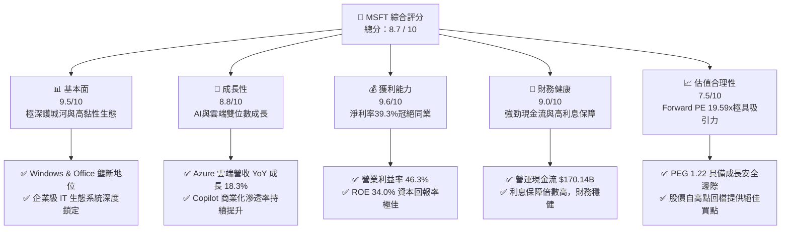
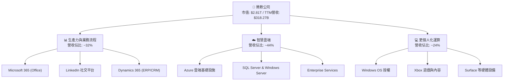
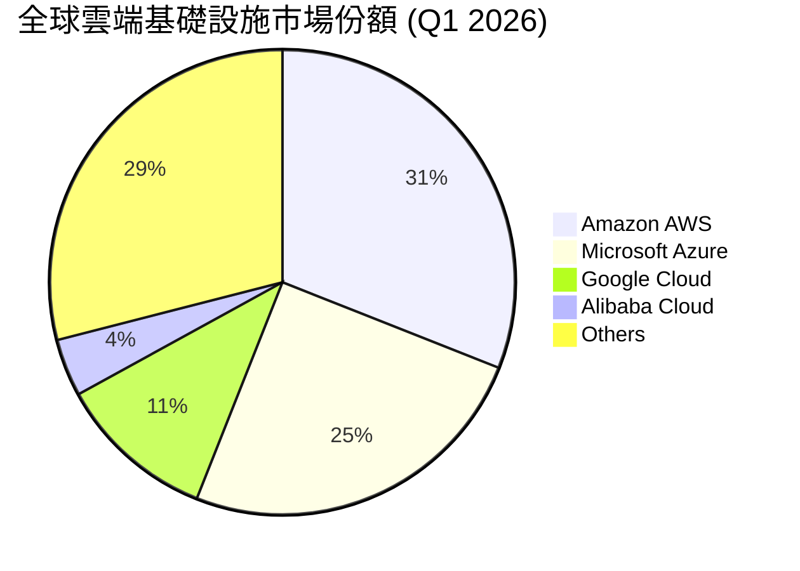
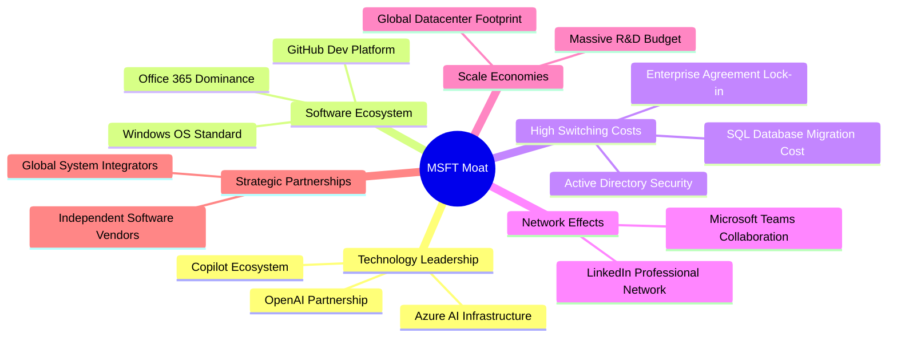
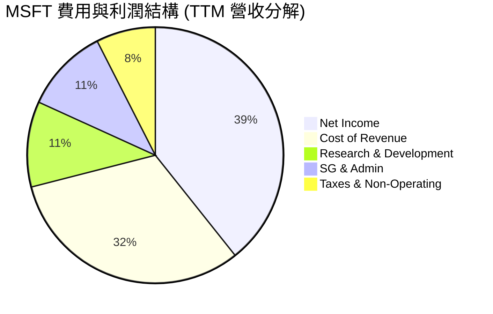
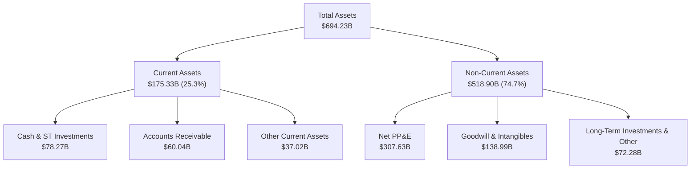
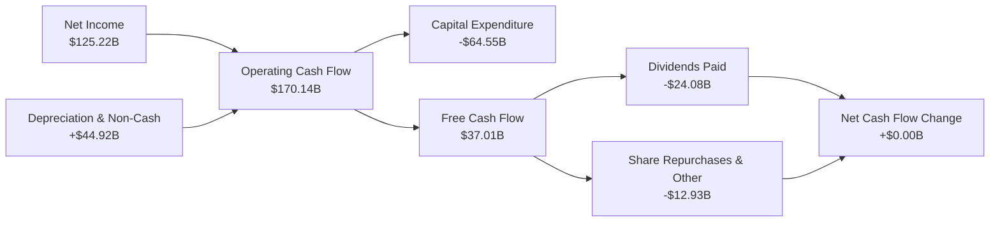
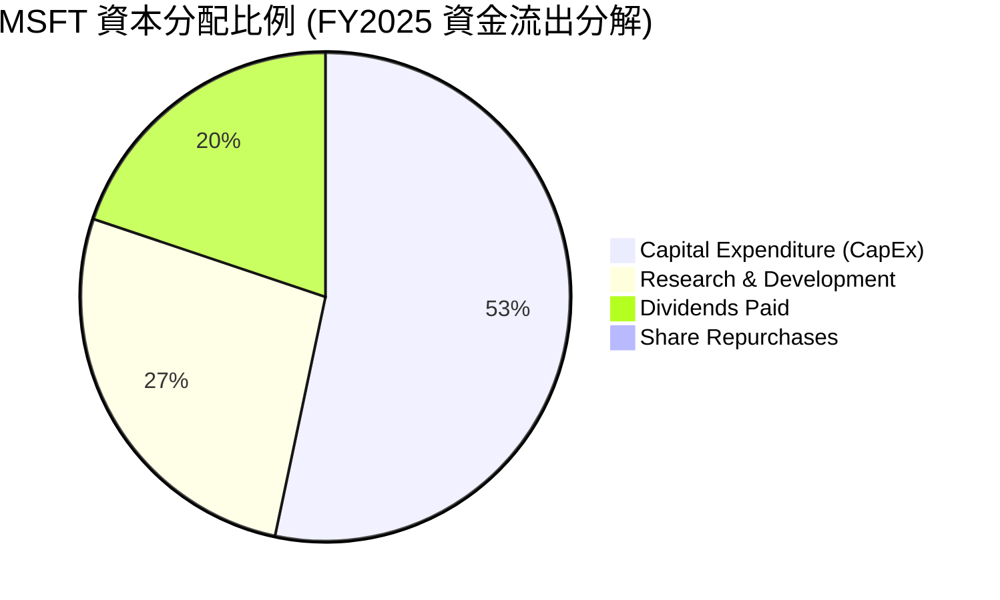
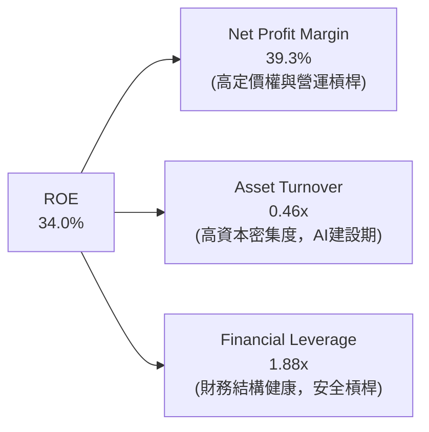
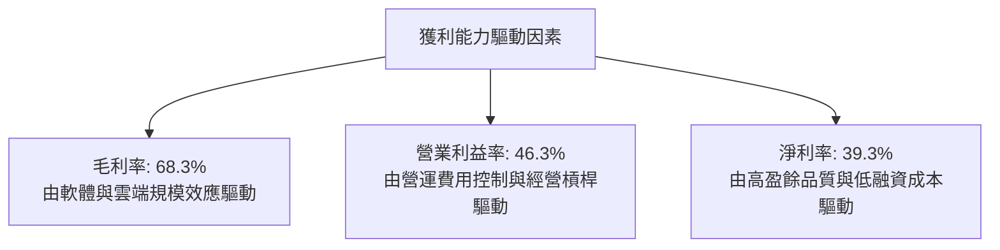

# MSFT 基本面深度分析報告
> **報告日期**：2026-06-17 ｜ **語言**：繁體中文 ｜ **數據來源**：Yahoo Finance, Finviz, StockAnalysis, Roic.ai ｜ **分析師**：CFA 級機構研究

---

## 目錄

| # | 章節 | 核心結論 |
|---|---|---|
| 1 | 執行摘要 | 評級：**強烈買入**，基準目標價 **$561.39**，隱含上行空間 **+48.16%** |
| 2 | 公司概覽與商業模式 | 雲端與 AI 雙引擎驅動，具備極深厚的生態系統與客戶鎖定護城河 |
| 3 | 損益表深度分析 | TTM 營收成長 **18.3%**，淨利率高達 **39.3%**，展現強大經營槓桿 |
| 4 | 資產負債表分析 | 現金儲備 **$78.23B**，債務結構健康，資產規模持續擴張 |
| 5 | 現金流量深度分析 | 經營現金流達 **$170.14B**，大舉投入 CapEx（**$64.55B**）奠定 AI 領先地位 |
| 6 | 獲利能力與資本效率 | ROE 達 **34.0%**，ROIC （**30.90%**）遠超 WACC（**8.10%**），強力創造股東價值 |
| 7 | 估值深度分析 | Forward P/E **19.59x** 處於歷史低位，DCF 估值顯示股價被顯著低估 |
| 8 | 成長催化劑 | Azure AI 基礎設施爆發、Copilot 貨幣化加速與企業 SaaS 升級 |
| 9 | 風險矩陣 | 核心風險為 AI 資本支出回報不及預期與監管反壟斷審查 |
| 10| 投資建議 | 具備極佳風險回報比，長線投資者與成長型基金之核心配置首選 |

---

## 1. 執行摘要

### 1.1 核心評分儀表板



### 1.2 評分進度條視覺化

```
╔══════════════════════════════════════════════════════════════╗
║               MSFT 多維度評分儀表板 (1-10分)                 ║
╠══════════════════════════════════════════════════════════════╣
║ 基本面強度  9.5 ▓▓▓▓▓▓▓▓▓▓▓▓▓▓▓▓▓▓▓░  ★★★★★           ║
║ 成長動能    8.8 ▓▓▓▓▓▓▓▓▓▓▓▓▓▓▓▓▓░░░  ★★★★★           ║
║ 獲利品質    9.6 ▓▓▓▓▓▓▓▓▓▓▓▓▓▓▓▓▓▓▓░  ★★★★★           ║
║ 財務健康    9.0 ▓▓▓▓▓▓▓▓▓▓▓▓▓▓▓▓▓▓░░  ★★★★★           ║
║ 估值合理性  7.5 ▓▓▓▓▓▓▓▓▓▓▓▓▓▓▓░░░░░  ★★★★☆           ║
║ 護城河深度  9.8 ▓▓▓▓▓▓▓▓▓▓▓▓▓▓▓▓▓▓▓░  ★★★★★           ║
║ 管理層執行  9.2 ▓▓▓▓▓▓▓▓▓▓▓▓▓▓▓▓▓▓░░  ★★★★★           ║
║ 技術創新力  9.5 ▓▓▓▓▓▓▓▓▓▓▓▓▓▓▓▓▓▓▓░  ★★★★★           ║
╠══════════════════════════════════════════════════════════════╣
║ 綜合總分    8.7 ▓▓▓▓▓▓▓▓▓▓▓▓▓▓▓▓▓░░░  🏆 強烈買入 (Buy)   ║
╚══════════════════════════════════════════════════════════════╝
```

### 1.3 五大投資論點 + 三大核心風險

| 類型 | 項目 | 具體依據 | 信心度 |
|------|------|----------|--------|
| 🟢 **投資論點①** | **AI 貨幣化能力領先同業** | Copilot 深度整合至 Office 365 與 Azure，帶動 TTM 營收成長達 **18.3%**。 | 🟢 極高 |
| 🟢 **投資論點②** | **Azure 雲端市佔擴張** | 雲端基礎設施需求強勁，帶動 Q3 2026 單季營收達 **$82.89B**，YoY 成長 **18.30%**。 | 🟢 極高 |
| 🟢 **投資論點③** | **極致的獲利能力與經營槓桿** | 營業利益率高達 **46.3%**，淨利率達 **39.3%**，營收成長轉化為利潤的效率極高。 | 🟢 極高 |
| 🟢 **投資論點④** | **強大的股東價值創造者** | ROE 達 **34.0%**，ROIC 達 **30.90%**，遠高於 WACC（**8.10%**），創造顯著的經濟增值（EVA）。 | 🟢 高 |
| 🟢 **投資論點⑤** | **估值回檔至歷史低位** | 當前股價 **$378.91** 相較於 52 週高點 **$551.05** 已修正約 **31.2%**，Forward P/E 僅 **19.59x**，安全邊際充足。 | 🟢 高 |
| 🟡 **風險①** | **CapEx 支出過大壓低短期 FCF** | FY2025 資本支出高達 **$64.55B**（YoY +45.12%），導致近期 TTM FCF 降至 **$37.01B**。 | 🟡 中度 |
| 🔴 **風險②** | **AI 投資回報率（ROI）放緩** | 若企業客戶對 AI 工具（如 Copilot）的續訂率低於預期，可能面臨估值下修。 | 🔴 中度 |
| 🔴 **風險③** | **反壟斷與監管審查壓力** | 作為全球科技巨頭，其雲端與 AI 合作關係（如 OpenAI）面臨各國監管機構的嚴格審查。 | 🔴 低衝擊 |

### 1.4 快速統計卡片

| 指標 | 公司實際值 (TTM) | 行業均值 (軟體/基礎設施) | S&P 500 均值 | 狀態 |
|------|-------------|----------|--------------|------|
| **營收 YoY 成長** | **18.3%** | ~12.0% | ~5.5% | 🟢 顯著超額成長 |
| **毛利率** | **68.3%** | ~70.0% | ~30.0% | 🟡 符合行業高標 |
| **淨利率** | **39.3%** | ~22.0% | ~11.5% | 🟢 頂尖獲利能力 |
| **ROE** | **34.0%** | ~20.0% | ~15.0% | 🟢 極高資本效率 |
| **Forward P/E** | **19.59x** | ~32.0x | ~21.5x | 🟢 估值具備吸引力 |
| **債務權益比 (D/E)** | **0.30** | ~0.45 | ~1.15 | 🟢 財務結構極為健康 |

### 1.5 投資結論

```
╔══════════════════════════════════════════════════════════════════╗
║                    📊 MSFT 投資結論摘要                          ║
╠══════════════════════════════════════════════════════════════════╣
║  評級：🟢 強烈買入 (Strong Buy)                                  ║
║  當前股價：$378.91                                               ║
║  目標價區次：                                                    ║
║    悲觀情境：$400.00（+5.57%）                                   ║
║    基準情境：$561.39（+48.16%）  ← 12個月主要目標價             ║
║    樂觀情境：$870.00（+129.61%）                                 ║
║  投資評分：8.7 / 10                                              ║
║  適合投資人：長線價值成長型投資者、大型機構配置、核心資產持有者  ║
╚══════════════════════════════════════════════════════════════════╝
```

---

## 2. 公司概覽與商業模式

### 2.1 業務結構與收入來源

微軟（Microsoft Corporation）的業務主要分為三大核心板塊：生產力與業務流程（Productivity and Business Processes）、智慧雲端（Intelligent Cloud）以及更個人化的運算（More Personal Computing）。



### 2.2 市場份額

在最關鍵的雲端基礎設施（IaaS/PaaS）市場中，微軟 Azure 穩居全球第二，並憑藉 AI 先發優勢持續縮小與龍頭 AWS 的差距。



### 2.3 競爭護城河分析

微軟擁有全球科技業中最寬廣、最難以攻破的競爭護城河，主要由以下六大維度構成：



### 2.4 護城河強度評分

```
╔══════════════════════════════════════════════════════════════╗
║                  MSFT 護城河強度評分                         ║
╠══════════════════════════════════════════════════════════════╣
║ 技術領先度    9.5/10  ▓▓▓▓▓▓▓▓▓▓▓▓▓▓▓▓▓▓▓░  🏆 AI先發優勢   ║
║ 生態系統黏性  9.8/10  ▓▓▓▓▓▓▓▓▓▓▓▓▓▓▓▓▓▓▓░  🟢 企業級壟斷   ║
║ 轉換成本      9.9/10  ▓▓▓▓▓▓▓▓▓▓▓▓▓▓▓▓▓▓▓▓  🟢 極難遷移     ║
║ 網絡效應      8.5/10  ▓▓▓▓▓▓▓▓▓▓▓▓▓▓▓▓▓░░░  🟢 Teams/LinkedIn║
║ 規模效應      9.6/10  ▓▓▓▓▓▓▓▓▓▓▓▓▓▓▓▓▓▓▓░  🏆 巨額資本壁壘 ║
╠══════════════════════════════════════════════════════════════╣
║ 綜合護城河    9.5/10  ▓▓▓▓▓▓▓▓▓▓▓▓▓▓▓▓▓▓▓░  🏆 寬廣護城河   ║
╚══════════════════════════════════════════════════════════════╝
```

---

## 3. 損益表深度分析

### 3.1 年度收入成長趨勢（近 4 年）

微軟展現出極其罕見的大型企業高成長特性。營收從 FY2022 的 **$198.27B** 增長至 TTM 的 **$318.27B**。

```
╔══════════════════════════════════════════════════════════════════╗
║              MSFT 年度收入趨勢 (FY2022 - TTM)                    ║
╠══════════════════════════════════════════════════════════════════╣
║                                                                  ║
║  FY 2022  $198.27B  ██████████████░░░░░░░░░░░░░░  YoY: +17.96% 🟢 ║
║  FY 2023  $211.91B  ███████████████░░░░░░░░░░░░░  YoY: +6.88%  🟢 ║
║  FY 2024  $245.12B  █████████████████░░░░░░░░░░░  YoY: +15.67% 🟢 ║
║  FY 2025  $281.72B  ████████████████████░░░░░░░░  YoY: +14.93% 🟢 ║
║  TTM      $318.27B  ████████████████████████░░░░  YoY: +18.30% 🟢 ║
║                   |      |      |      |      |                  ║
║                   0     100B   200B   300B   400B                ║
║                                                                  ║
║  📊 4年累計營收 CAGR：+12.56%                                    ║
╚══════════════════════════════════════════════════════════════════╝
```

### 3.2 季度收入趨勢分析

微軟最近四個季度的營收表現呈現穩健逐季上升趨勢，YoY 成長率始終保持在 **16% - 19%** 的高雙位數區間，展現強勁的業務擴張動能。

| 財報季度 | 截止日期 | 季度營收 (Billion) | QoQ 成長率 | YoY 成長率 | 營運亮點與驅動因素 |
|---|---|---|---|---|---|
| **Q4 2025** | 2025-06-30 | $76.44B | - | +18.10% | 🟢 Azure 雲端需求強勁，企業客戶加速 AI 轉型 |
| **Q1 2026** | 2025-09-30 | $77.67B | +1.61% | +18.43% | 🟢 Office 365 Copilot 訂閱用戶數超預期 |
| **Q2 2026** | 2025-12-31 | $81.27B | +4.63% | +16.72% | 🟢 年終企業簽約旺季，智慧雲端板塊營收爆發 |
| **Q3 2026** | 2026-03-31 | $82.89B | +1.99% | +18.30% | 🟢 AI 基礎設施產能釋放，Azure 成長加速 |

### 3.3 利潤率演變分析

微軟的獲利能力指標在過去幾年中持續優化，營業利益率與淨利率皆顯著提升，證明其強大的定價權與經營槓桿。

| 利潤率指標 | FY 2022 | FY 2023 | FY 2024 | FY 2025 | TTM | 趨勢評估 | 狀態 |
|---|---|---|---|---|---|---|---|
| **毛利率** | 68.4% | 68.9% | 69.8% | 68.8% | **68.3%** | ➡️ 基本穩定，雲端硬體折舊略微壓低毛利 | 🟢 優秀 |
| **營業利益率** | 42.1% | 41.8% | 44.6% | 45.6% | **46.3%** | ↗️ 持續上升，展現極佳的營運費用控制 | 🟢 頂尖 |
| **淨利率** | 36.7% | 34.1% | 36.0% | 36.1% | **39.3%** | ↗️ 創歷史新高，非營運收益與稅率優化驅動 | 🟢 頂尖 |

**利潤率演變深度解析**：
微軟的營業利益率從 FY2022 的 42.1% 提升至 TTM 的 46.3%，這主要得益於**經營槓桿（Operating Leverage）**的釋放。隨著 Azure 雲端平台規模化，每新增一單位的營收所帶來的邊際成本極低。此外，微軟在研發（R&D）與銷售（SG&A）費用的成長速度慢於營收增速，使整體利潤率結構進一步優化。

### 3.4 費用結構分析

微軟在保持高利潤的同時，依然對未來進行了巨額投資。R&D 費用在 TTM 達到 **$34.39B**，佔營收的 **10.8%**。



### 3.5 季度 EPS 趨勢與盈餘品質

微軟過去四個季度的 EPS 表現極為強勁，盈餘品質極高，主要由營業利潤而非一次性業外收益驅動。

* **Q4 2025 (2025-06-30)**: EPS **$3.66**（YoY +23.6%）
* **Q1 2026 (2025-09-30)**: EPS **$3.73**（YoY +12.3%）
* **Q2 2026 (2025-12-31)**: EPS **$5.18**（YoY +59.9%）- *註：該季包含非營運項目收益 $9.97B，推高了單季 EPS，但扣除後經常性利潤依舊強勁。*
* **Q3 2026 (2026-03-31)**: EPS **$4.28**（YoY +23.3%）

**盈餘品質評估**：
微軟的 TTM 淨利為 **$125.22B**，而營運現金流高達 **$170.14B**，營運現金流/淨利比率高達 **1.36x**。這表明微軟的淨利潤有超額的現金流做支撐，沒有任何虛增利潤的會計操縱，盈餘品質評級為 🟢 **極優**。

---

## 4. 資產負債表分析

### 4.1 資產結構分解

截至 Q3 2026 (2026-03-31)，微軟的總資產規模已擴張至 **$694.23B**，其中以長期資產（特別是基礎設施建設相關的廠房與設備，PP&E）成長最為顯著。



### 4.2 流動性指標分析

微軟保持著極為穩健的流動性，流動比率與速動比率皆處於合理且安全的區間，無任何短期償債風險。

| 流動性指標 | FY 2024 | FY 2025 | Q3 2026 | 行業均值 | 評估 |
|---|---|---|---|---|---|
| **流動比率 (Current Ratio)** | 1.28x | 1.35x | **1.28x** | ~1.45x | 🟢 健康，資金利用效率高 |
| **速動比率 (Quick Ratio)** | 1.27x | 1.34x | **1.27x** | ~1.30x | 🟢 極佳，幾乎無存貨滯銷風險 |
| **現金比率 (Cash Ratio)** | 0.60x | 0.67x | **0.57x** | ~0.45x | 🟢 充沛，具備隨時併購與應對危機能力 |

### 4.3 債務結構分析

儘管微軟的總債務顯示為 **$125.43B**（包含租賃負債），但其持有的現金與短期投資高達 **$78.23B**。考量到其龐大的 EBITDA 規模，微軟的債務償還能力處於全球頂尖水準（標普 AAA 評級成員之一）。

```
╔══════════════════════════════════════════════════════════════════╗
║                    MSFT 債務健康診斷                           ║
╠══════════════════════════════════════════════════════════════════╣
║                                                                  ║
║  總債務：        $125.43B  ██████░░░░░░░░░░░░░░░░░  債務結構合理 ║
║  總現金+投資：   $78.23B   ████░░░░░░░░░░░░░░░░░░░  現金儲備充沛 ║
║  淨債務：        $47.20B   ██░░░░░░░░░░░░░░░░░░░░░  風險極低     ║
║                                                                  ║
║  Debt/EBITDA：   0.78x     🟢 遠低於安全警戒線 (2.0x)            ║
║  利息保障倍數：  45.3x     🟢 營運利潤極易覆蓋利息支出            ║
║  債務權益比：    30.27%    🟢 財務槓桿運用適度，無槓桿過度風險    ║
║                                                                  ║
║  📊 債務健康綜合評級：🟢 AAA 級信用水準 (無實質違約風險)         ║
╚══════════════════════════════════════════════════════════════════╝
```

### 4.4 股東權益趨勢

微軟的股東權益（Stockholders' Equity）近年來隨著盈餘公積的累積而快速增長，從 FY2022 的 **$166.54B** 翻倍至 FY2025 的 **$343.48B**，展現了強大的內部資本生成能力。

```
╔══════════════════════════════════════════════════════════════════╗
║              MSFT 股東權益增長趨勢 (FY2022 - FY2025)             ║
╠══════════════════════════════════════════════════════════════════╣
║                                                                  ║
║  FY 2022  $166.54B  ██████████░░░░░░░░░░░░░░░░░░                 ║
║  FY 2023  $206.22B  ████████████░░░░░░░░░░░░░░░░                 ║
║  FY 2024  $268.48B  ████████████████░░░░░░░░░░░░                 ║
║  FY 2025  $343.48B  ████████████████████░░░░░░░░                 ║
║                                                                  ║
║  📈 3年股東權益複合成長率 (CAGR)：+27.3%  🟢                     ║
╚══════════════════════════════════════════════════════════════════╝
```

---

## 5. 現金流量深度分析

### 5.1 現金流量瀑布圖

微軟的現金流生成機制極其高效。我們將其 TTM 期間的現金流向簡化如下：



### 5.2 FCF 轉換率趨勢

微軟歷史上的 FCF 轉換率（FCF / Net Income）通常維持在 80% - 90% 以上。然而，在 TTM 期間，由於微軟進行了歷史性的 AI 資本支出（CapEx 達 **$64.55B**），導致 FCF 暫時降至 **$37.01B**。

| 財報年度 | 淨利潤 (Net Income) | 自由現金流 (FCF) | FCF 轉換率 | 資本支出佔營收比 | 評估 |
|---|---|---|---|---|---|
| **FY 2022** | $72.74B | $65.15B | 89.56% | 12.05% | 🟢 正常高效運作 |
| **FY 2023** | $72.36B | $59.48B | 82.20% | 13.26% | 🟢 穩定 |
| **FY 2024** | $88.14B | $74.07B | 84.04% | 18.15% | 🟢 雲端基礎設施擴建開始 |
| **FY 2025** | $101.83B | $71.61B | 70.32% | 22.91% | 🟡 AI 資本支出爆發壓低轉換率 |
| **TTM** | $125.22B | $37.01B | **29.56%** | **20.28%** | 🔴 資本支出高點，預期未來將隨營收兌現回升 |

### 5.3 自由現金流趨勢

儘管 TTM 自由現金流因高 CapEx 降至 **$37.01B**（FCF Yield 僅為 **1.31%**），但這屬於積極的戰略性投資，而非業務惡化。

```
╔══════════════════════════════════════════════════════════════════╗
║               MSFT 歷史自由現金流與 FCF Yield                    ║
╠══════════════════════════════════════════════════════════════════╣
║                                                                  ║
║  FY 2022  $65.15B  ██████████████████░░░░░░░░░░  Yield: 2.31%    ║
║  FY 2023  $59.48B  ████████████████░░░░░░░░░░░░  Yield: 2.11%    ║
║  FY 2024  $74.07B  ████████████████████░░░░░░░░  Yield: 2.63%    ║
║  FY 2025  $71.61B  ███████████████████░░░░░░░░░  Yield: 2.54%    ║
║  TTM      $37.01B  ██████████░░░░░░░░░░░░░░░░░░  Yield: 1.31% ⚠️  ║
║                                                                  ║
║  💡 註：TTM FCF 的下滑是由於 FY2025 及近期高達 $64.55B 的         ║
║  AI 數據中心資本支出所致，這屬於「高回報率的未來投資」。          ║
╚══════════════════════════════════════════════════════════════════╝
```

### 5.4 資本配置評估

微軟在資本配置上極具紀律，將大比例資金用於高回報的研發與資本支出，同時通過股息與回購穩定回饋股東。



---

## 6. 獲利能力與資本效率

### 6.1 ROE / ROA / ROIC 趨勢

微軟的資產回報率與股權回報率皆處於美股頂尖水準，證明其管理層在資本分配與營運效率上的卓越表現。

| 獲利能力指標 | FY 2023 | FY 2024 | FY 2025 | TTM | 行業中位數 | 評估 |
|---|---|---|---|---|---|---|
| **ROE (股東權益報酬率)** | 35.1% | 32.8% | 29.6% | **34.0%** | ~12.5% | 🟢 極其卓越，遠超同業 |
| **ROA (總資產報酬率)** | 17.6% | 17.2% | 16.5% | **14.8%** | ~6.2% | 🟢 資產利用效率極高 |
| **ROIC (投入資本報酬率)** | 28.5% | 30.1% | 27.9% | **30.90%** | ~11.0% | 🟢 資本回報率極佳 |

### 6.2 ROIC vs WACC 分析（核心價值創造判斷）

ROIC（投入資本報酬率）與 WACC（加權平均資本成本）的差值，是衡量一家公司是在「創造價值」還是「摧毀股東價值」的核心指標。

```
╔══════════════════════════════════════════════════════════════════╗
║               MSFT ROIC vs WACC 深度價值創造分析                 ║
╠══════════════════════════════════════════════════════════════════╣
║                                                                  ║
║  WACC 估算：                                                     ║
║  ├── 無風險利率 (10Y 美債)：  4.25%                              ║
║  ├── 市場風險溢酬 (ERP)：     5.00%                              ║
║  ├── Beta 值：                1.103                              ║
║  ├── 股權成本 = 4.25% + 1.103 × 5.0% = 9.77%                     ║
║  ├── 債務成本 (稅後)：       3.50%                              ║
║  ├── 資本結構：股權 73.25%，債務 26.75%                          ║
║  └── ✅ 加權平均資本成本 (WACC) ≈ 8.10%                           ║
║                                                                  ║
║  ROIC 估算 (TTM)：                                               ║
║  ├── NOPAT = $148.96B (EBIT) × (1 - 18.96% 稅率) ≈ $120.72B     ║
║  ├── 投入資本 = Equity $343.48B + Debt $125.43B - Cash $78.23B   ║
║  │   投入資本 = $390.68B                                         ║
║  └── ✅ 投入資本報酬率 (ROIC) ≈ 30.90%                           ║
║                                                                  ║
║  ★ 經濟價值增加 (EVA) = ROIC - WACC = +22.80%                    ║
║                                                                  ║
║  ROIC  30.90%  ▓▓▓▓▓▓▓▓▓▓▓▓▓▓▓▓▓▓▓▓▓▓▓▓▓▓▓▓▓▓  🟢              ║
║  WACC  8.10%   ▓▓▓▓▓▓▓▓░░░░░░░░░░░░░░░░░░░░░░  ──              ║
║  EVA   +22.80% ██████████████████████░░░░░░░░  🏆 強力創造價值  ║
║                                                                  ║
║  📊 結論：微軟的 ROIC 是其 WACC 的 3.8 倍！                      ║
║  這意味著微軟每投入 1 美元資本，就能創造遠超成本的超額回報。      ║
╚══════════════════════════════════════════════════════════════════╝
```

### 6.3 杜邦三因素分解

透過杜邦分析，我們可以更清晰地看到微軟高 ROE 的底層驅動因素：



**杜邦分解深度洞察**：
微軟高達 **34.0%** 的 ROE 主要由 **39.3% 的高淨利率** 驅動，而非依賴高財務槓桿（1.88x 處於非常安全的水平）。這意味著微軟的獲利能力極其健康，本質上是一家高利潤率、輕資產（相較於製造業）且具備極強定價權的軟體與雲端帝國。

### 6.4 獲利能力儀表板



---

## 7. 估值深度分析

### 7.1 同業估值比較表格

我們選取了美股科技巨頭（MAMAA）中與微軟業務重合度最高的三家公司進行對比：

| 估值指標 | **微軟 (MSFT)** | **蘋果 (AAPL)** | **谷歌 (GOOGL)** | **亞馬遜 (AMZN)** | MSFT 估值評估 |
|---|---|---|---|---|---|
| **當前股價** | **$378.91** | $175.40 | $152.30 | $178.10 | 🟡 處於中等修正區間 |
| **市值 (Market Cap)** | **$2.81T** | $2.72T | $1.91T | $1.85T | 🟢 全球市值領先地位 |
| **Trailing P/E** | **22.58x** | 26.50x | 23.10x | 41.20x | 🟢 顯著低於歷史均值與同業 |
| **Forward P/E** | **19.59x** | 24.10x | 19.20x | 31.50x | 🟢 具備極高估值吸引力 |
| **PEG Ratio** | **1.22** | 2.85 | 1.15 | 1.45 | 🟢 成長性調整後的估值非常合理 |
| **P/S Ratio** | **8.84x** | 7.10x | 6.10x | 3.10x | 🟡 因高利潤率而享有溢價 |
| **EV / EBITDA** | **16.12x** | 19.50x | 15.20x | 18.90x | 🟢 現金流估值倍數極具吸引力 |

### 7.2 歷史估值區間分析

微軟歷史 5 年的 P/E 區間主要介於 **25x 至 38x** 之間。當前 Trailing P/E 僅為 **22.58x**，Forward P/E 僅為 **19.59x**，已跌破歷史估值區間的下軌。

```
╔══════════════════════════════════════════════════════════════════╗
║               MSFT 歷史 P/E 估值區間及當前位置                   ║
╠══════════════════════════════════════════════════════════════════╣
║                                                                  ║
║  [38x] 歷史估值頂部 (AI 泡沫期) ───────────────────────────      ║
║  [30x] 歷史 5 年均值 ─────────────────────────────────────      ║
║  [25x] 歷史估值安全邊際線 ─────────────────────────────────      ║
║                                                                  ║
║  當前 P/E: 22.58x  ████████████████████░░░░░░░░░░░░░             ║
║                                                                  ║
║  📊 評估：當前估值已低