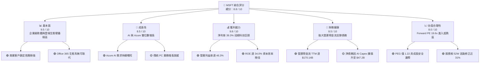
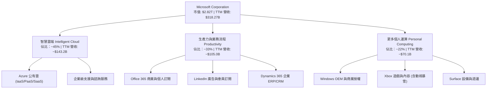
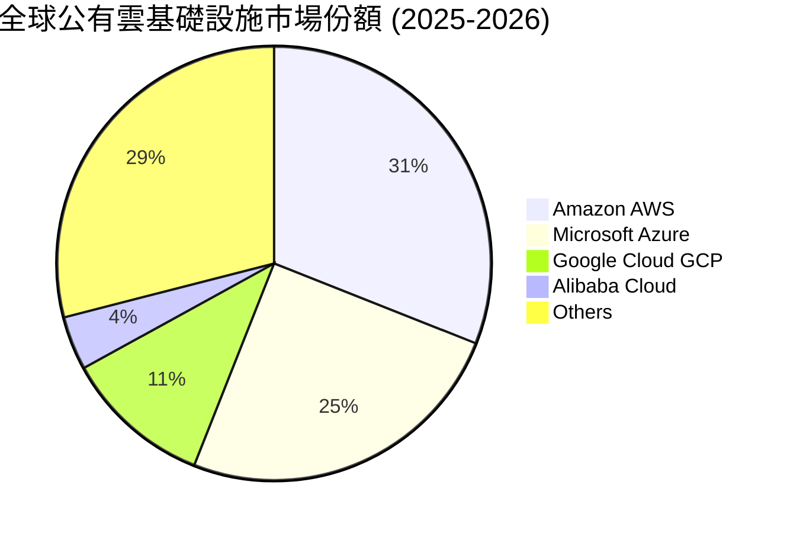
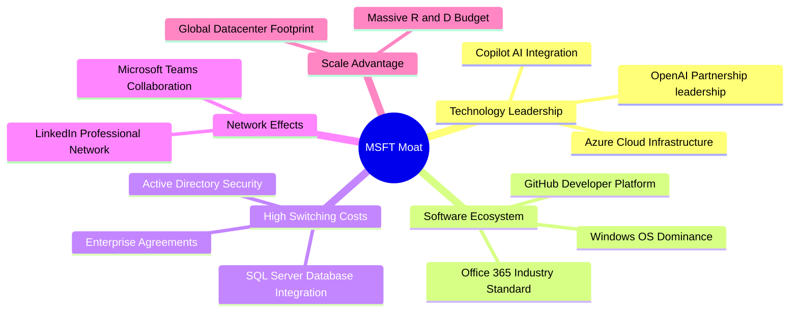
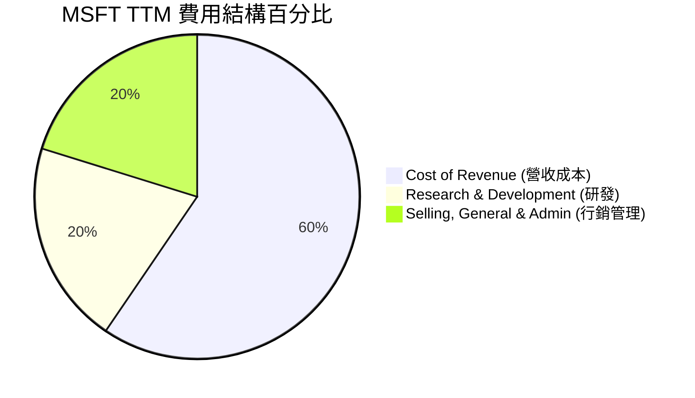
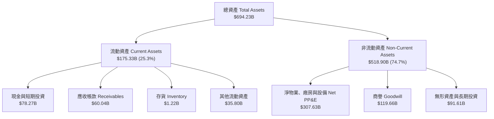
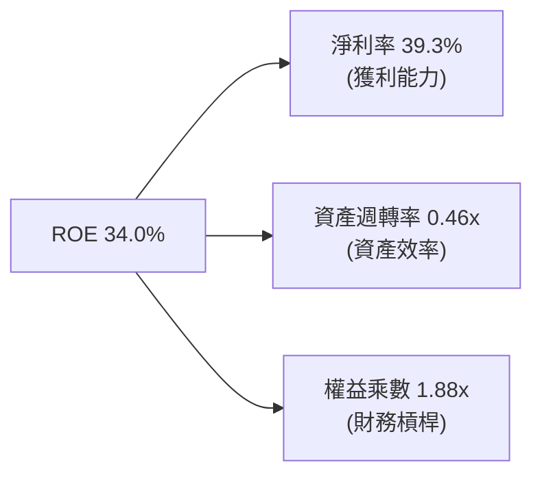
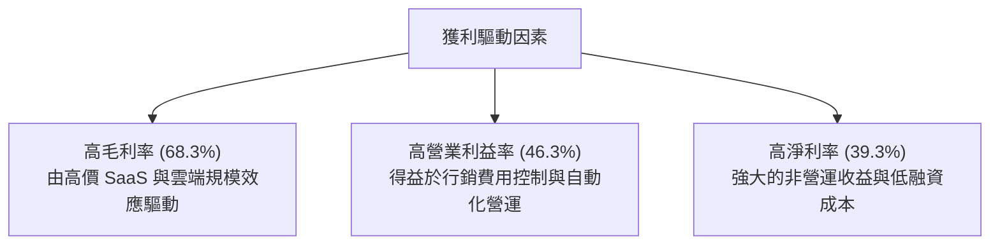

# MSFT 基本面深度分析報告

> **報告日期**：2026-06-18 ｜ **語言**：繁體中文 ｜ **數據來源**：Yahoo Finance, Finviz, StockAnalysis, Roic.ai ｜ **分析師**：CFA 級機構研究

---

## 目錄

| # | 章節 | 核心結論 |
|---|---|---|
| 1 | **執行摘要** | 評級「強烈買入」，目標價 $561.39，隱含 48% 上行空間，當前估值具備極高安全邊際。 |
| 2 | **公司概覽與商業模式** | 雲端與 AI 雙引擎驅動，確立全球企業級軟體與基礎設施的絕對霸主地位。 |
| 3 | **損益表深度分析** | TTM 營收突破 $318B（YoY +18.3%），淨利率維持在 39.3% 的極高水準。 |
| 4 | **資產負債表分析** | 資產總額達 $694.23B，雖因 AI 基礎建設導致債務增加，但整體財務結構依舊穩健。 |
| 5 | **現金流量深度分析** | 營運現金流達 $170.14B，AI 資本支出大幅躍升至歷史新高，短期壓抑自由現金流。 |
| 6 | **獲利能力與資本效率** | ROE 達 34.0%，ROIC 顯著超越 WACC，持續為股東創造強大的經濟增值（EVA）。 |
| 7 | **估值深度分析** | Forward P/E 降至 19.6x，相較於歷史均值與同業，估值已進入極具吸引力的超跌區間。 |
| 8 | **成長催化劑** | Azure AI 雲端服務滲透率持續提升，Copilot 商業化變現進入爆發期。 |
| 9 | **風險矩陣** | AI 資本回報率不及預期與反壟斷監管為核心風險，但整體風險可控。 |
| 10 | **投資建議** | 建議於當前價格分批強烈買入，適合長線成長型與價值型投資人配置。 |

---

## 1. 執行摘要

### 1.1 核心評分儀表板



### 1.2 評分進度條視覺化

```
╔══════════════════════════════════════════════════════════════╗
║                MSFT 多維度評分儀表板 (1-10分)                ║
╠══════════════════════════════════════════════════════════════╣
║ 基本面強度  9.5 ▓▓▓▓▓▓▓▓▓▓▓▓▓▓▓▓▓▓▓░  ★★★★★           ║
║ 成長動能    8.5 ▓▓▓▓▓▓▓▓▓▓▓▓▓▓▓▓▓░░░  ★★★★☆           ║
║ 獲利品質    9.8 ▓▓▓▓▓▓▓▓▓▓▓▓▓▓▓▓▓▓▓▓  ★★★★★           ║
║ 財務健康    8.5 ▓▓▓▓▓▓▓▓▓▓▓▓▓▓▓▓▓░░░  ★★★★☆           ║
║ 估值合理性  8.0 ▓▓▓▓▓▓▓▓▓▓▓▓▓▓▓▓░░░░  ★★★★☆           ║
║ 護城河深度  9.8 ▓▓▓▓▓▓▓▓▓▓▓▓▓▓▓▓▓▓▓▓  ★★★★★           ║
║ 管理層執行  9.2 ▓▓▓▓▓▓▓▓▓▓▓▓▓▓▓▓▓▓░░  ★★★★★           ║
║ 技術創新力  9.5 ▓▓▓▓▓▓▓▓▓▓▓▓▓▓▓▓▓▓▓░  ★★★★★           ║
╠══════════════════════════════════════════════════════════════╣
║ 綜合總分    8.8 ▓▓▓▓▓▓▓▓▓▓▓▓▓▓▓▓▓░░░  🏆 強烈買入          ║
╚══════════════════════════════════════════════════════════════╝
```

### 1.3 五大投資論點 + 三大核心風險

| 類型 | 項目 | 具體依據 | 信心度 |
|------|------|----------|--------|
| 🟢 **投資論點①** | **AI 基礎設施絕對領先** | Azure TTM 營收強勁增長，AI 相關服務貢獻度持續提升，與 OpenAI 的深度合作構建了極高的技術壁壘。 | 🟢 極高 |
| 🟢 **投資論點②** | **企業軟體高定價權** | Office 365 商業版持續推動 ARPU 提升，Copilot 附加組件（每用戶每月 $30）轉化率優於預期，帶動軟體板塊利潤率擴張。 | 🟢 極高 |
| 🟢 **投資論點③** | **估值具備極高吸引力** | 股價自 52 週高點 $551.05 修正至 $379.40（修正幅度達 31.1%），Forward P/E 降至 19.61x，低於歷史 5 年均值。 | 🟢 高 |
| 🟢 **投資論點④** | **極致的獲利能力** | 營業利益率 46.3%，淨利率 39.3%，ROE 達 34.0%，在同等規模的萬億級企業中無人能敵。 | 🟢 極高 |
| 🟢 **投資論點⑤** | **現金流創造能力冠絕全球** | TTM 營運現金流（OCF）高達 $170.14B，提供了極其寬裕的資金進行 AI 研發與資本支出，無需依賴外部高成本融資。 | 🟢 極高 |
| 🟡 **風險①** | **AI 資本支出拖累短期 FCF** | TTM 資本支出大幅增加，導致 TTM 自由現金流（FCF）降至 $37.01B，短期內 FCF 收益率降至 1.31%。 | 🟡 中度 |
| 🔴 **風險②** | **反壟斷與監管壓力** | 歐美監管機構對微軟與 OpenAI 的合作關係，以及雲端市場的競爭行為進行嚴格審查，可能面臨罰款或業務拆分風險。 | 🔴 高衝擊 |
| 🟡 **風險③** | **PC 傳統業務增長停滯** | 個人運算部門（Windows OEM、Surface）受全球 PC 出貨量放緩影響，增長動能偏弱，拖累整體營收增速。 | 🟡 低衝擊 |

### 1.4 快速統計卡片

| 指標 | 微軟實際值 (MSFT) | 行業均值 (系統軟體) | S&P 500 均值 | 狀態 |
|------|-------------|----------|--------------|------|
| **營收 YoY 成長** | **18.3%** | ~12.0% | ~5.5% | 🟢 顯著超額 |
| **毛利率** | **68.3%** | ~70.0% | ~30.0% | 🟢 極高水準 |
| **淨利率** | **39.3%** | ~22.0% | ~11.5% | 🟢 行業頂尖 |
| **ROE** | **34.0%** | ~24.0% | ~15.0% | 🟢 資本效率極佳 |
| **Forward P/E** | **19.61x** | ~32.0x | ~21.5x | 🟢 估值低估 |
| **債務權益比 (D/E)** | **30.27%** | ~45.0% | ~115.0% | 🟢 財務結構健康 |

### 1.5 投資結論

```
╔══════════════════════════════════════════════════════════════════╗
║                    📊 MSFT 投資結論摘要                          ║
╠══════════════════════════════════════════════════════════════════╣
║  評級：🟢 強烈買入 (Strong Buy)                                  ║
║  當前股價：$379.40 (2026-06-18)                                  ║
║  目標價區間：                                                    ║
║    悲觀情境：$400.00（+5.4%）                                    ║
║    基準情境：$561.39（+48.0%） ← 12個月主要目標                  ║
║    樂觀情境：$720.00（+89.8%）                                   ║
║  投資評分：8.8 / 10                                              ║
║  適合投資人：長線價值成長型投資人、核心資產配置配置者            ║
╚══════════════════════════════════════════════════════════════════╝
```

---

## 2. 公司概覽與商業模式

### 2.1 業務結構與收入來源

微軟的業務模式已成功轉型為「雲端優先、AI 優先」的訂閱制與用量計費制（Consumption-based）混合模式。其業務主要劃分為三大板塊：

1. **智慧雲端 (Intelligent Cloud)**：以 Azure 爲核心，加上 Windows Server、SQL Server 等。此板塊為微軟增長最快且營收佔比最高的引擎。
2. **生產力與業務流程 (Productivity and Business Processes)**：包括 Office 365 商業版/個人版、LinkedIn、Dynamics 365。主要為高利潤、高粘性的 SaaS 訂閱收入。
3. **更多個人運算 (More Personal Computing)**：包括 Windows OEM、Xbox 遊戲業務（含 Activision Blizzard）、Surface 設備及搜尋廣告。



### 2.2 市場份額

在最核心的全球公有雲基礎設施（IaaS/PaaS）市場中，微軟 Azure 憑藉其強大的企業級混合雲定位與 AI 領先優勢，持續縮小與龍頭 AWS 的差距。



### 2.3 競爭護城河分析

微軟擁有多重且極難被攻破的競爭護城河：



### 2.4 護城河強度評分

```
╔══════════════════════════════════════════════════════════════╗
║                   微軟 (MSFT) 護城河強度評分                  ║
╠══════════════════════════════════════════════════════════════╣
║ 轉換成本 (Switching Costs)  10/10 ▓▓▓▓▓▓▓▓▓▓▓▓▓▓▓▓▓▓▓▓ 🏆 極深 ║
║ 網路效應 (Network Effects)   9/10  ▓▓▓▓▓▓▓▓▓▓▓▓▓▓▓▓▓▓░░ 🟢 強大 ║
║ 規模優勢 (Scale Advantage)  10/10 ▓▓▓▓▓▓▓▓▓▓▓▓▓▓▓▓▓▓▓▓ 🏆 極深 ║
║ 品牌與專利 (Brand Equity)    9/10  ▓▓▓▓▓▓▓▓▓▓▓▓▓▓▓▓▓▓░░ 🟢 強大 ║
╠══════════════════════════════════════════════════════════════╣
║ 綜合護城河評級：極深 (Wide Moat) ★★★★★                       ║
║ 總結：企業對 Office 365 與 Azure 的依賴度極高，轉換成本近乎 ║
║       不可承受；AI 的領先地位進一步加固了此一壁壘。          ║
╚══════════════════════════════════════════════════════════════╝
```

---

## 3. 損益表深度分析

### 3.1 年度收入成長趨勢（近 4 年）

微軟展現了萬億級巨頭中罕見的加速成長態勢，TTM（過去十二個月）營收已衝高至 $318.27B。

```
╔══════════════════════════════════════════════════════════════════╗
║              微軟 (MSFT) 年度收入趨勢 (FY2022 - TTM)             ║
╠══════════════════════════════════════════════════════════════════╣
║                                                                  ║
║  FY 2022  $198.27B  ██████████████░░░░░░░░░░░░░░  YoY: +18.0% 🟢 ║
║  FY 2023  $211.91B  ███████████████░░░░░░░░░░░░░  YoY:  +6.9% 🟡 ║
║  FY 2024  $245.12B  █████████████████░░░░░░░░░░░  YoY: +15.7% 🟢 ║
║  FY 2025  $281.72B  ████████████████████░░░░░░░░  YoY: +14.9% 🟢 ║
║  TTM      $318.27B  ████████████████████████░░░░  YoY: +18.3% 🟢 ║
║                   |      |      |      |      |                  ║
║                   0    100B   200B   300B   400B                 ║
║                                                                  ║
║  📊 4年複合成長率 (CAGR)：+14.3%                                 ║
╚══════════════════════════════════════════════════════════════════╝
```

### 3.2 季度收入趨勢分析

從季度數據看，微軟在過去四個季度中保持了極為穩定的兩位數同比（YoY）增長，且環比（QoQ）也呈現穩健上升軌跡。

| 財報季度 | 截止日期 | 季度營收 | YoY 成長率 | QoQ 成長率 | 核心成長驅動因素與備註 |
|---|---|---|---|---|---|
| **Q4 2025** | 2025-06-30 | $76.44B | +18.10% | +9.10% | 🟢 年終結算強勁，Azure 商業合約大單集中簽署。 |
| **Q1 2026** | 2025-09-30 | $77.67B | +18.43% | +1.61% | 🟢 Azure AI 需求爆發，抵消了 PC 季節性淡季影響。 |
| **Q2 2026** | 2025-12-31 | $81.27B | +16.72% | +4.63% | 🟢 聖誕假期遊戲業務（動視暴雪）與雲端雙引擎拉動。 |
| **Q3 2026** | 2026-03-31 | $82.89B | +18.30% | +1.99% | 🟢 Copilot 商業訂閱用戶加速轉化，軟體收入增長。 |

### 3.3 利潤率演變分析

微軟的利潤率在過去幾年中不僅沒有因為規模擴大而稀釋，反而因高毛利的雲端與軟體訂閱佔比提升而持續優化。

| 利潤率指標 | FY 2022 | FY 2023 | FY 2024 | FY 2025 | TTM | 趨勢 | 評估與原因解析 |
|---|---|---|---|---|---|---|---|
| **毛利率** | 68.4% | 68.9% | 69.8% | 68.8% | **68.3%** | ➡️ 穩定 | 🟢 穩定在 68% 以上的高檔，AI 算力折舊增加被軟體高溢價抵消。 |
| **營業利益率** | 42.1% | 41.8% | 44.6% | 45.6% | **46.3%** | ↗️ 提升 | 🟢 營運效率持續優化，SG&A 費用控制得宜。 |
| **EBITDA Margin**| 50.6% | 49.6% | 54.3% | 56.8% | **58.0%** | ↗️ 提升 | 🟢 折舊與攤銷增加，EBITDA 利潤率創下歷史新高。 |
| **淨利率** | 36.7% | 34.1% | 36.0% | 36.1% | **39.3%** | ↗️ 提升 | 🟢 TTM 淨利率逼近 40%，獲利品質極其恐怖。 |

### 3.4 費用結構分析

微軟在積極投資未來的同時，展現了強大的成本控制力。研發（R&D）費用佔比維持在 10% 左右，確保技術領先；而行銷與管理（SG&A）則呈現規模效應遞減。



```
╔══════════════════════════════════════════════════════════════╗
║              MSFT TTM 營運費用分析 (單位：Billion)           ║
╠══════════════════════════════════════════════════════════════╣
║ 營收總額: $318.27B                                           ║
║ ├── 營收成本 (Cost of Revenue): $100.86B (佔營收 31.7%)        ║
║ └── 營運費用 (OpEx): $68.45B (佔營收 21.5%)                  ║
║      ├── 研發費用 (R&D): $34.39B                             ║
║      └── 行銷與管理 (SG&A): $34.06B                          ║
║                                                              ║
║ 💡 洞察：研發費用 YoY 成長 16.6%，與營收增速基本匹配，       ║
║          顯示微軟在 AI 技術上的投入毫不吝嗇，且效率極高。    ║
╚══════════════════════════════════════════════════════════════╝
```

### 3.5 季度 EPS 趨勢與盈餘品質

微軟的盈餘品質（Quality of Earnings）極高。我們透過過去四季的稀釋後 EPS 表現來進行評估：

- **Q1 2025**: EPS $3.32
- **Q2 2025**: EPS $3.24
- **Q3 2025**: EPS $3.47
- **Q4 2025**: EPS $3.66 （FY2025 全年 EPS 達 $13.64，YoY +15.6%）
- **Q1 2026**: EPS $3.73
- **Q2 2026**: EPS $5.18 （受惠於非營運投資收益與稅務調整大幅超預期）
- **Q3 2026**: EPS $4.28
- **TTM EPS**: **$16.78**

**盈餘品質診斷**：
微軟的淨利（TTM $125.22B）與營運現金流（TTM $170.14B）存在極大的健康順差（現金流大於淨利），這表明微軟的盈利並非來自會計遊戲，而是有實實在在的真金白銀流入，盈餘品質評級為 🟢 **極優**。

---

## 4. 資產負債表分析

### 4.1 資產結構分解

隨著微軟大舉投資 AI 資料中心，其資產結構中「非流動資產」特別是「物業、廠房及設備（PP&E）」的比重大幅攀升。



### 4.2 流動性指標分析

| 流動性指標 | FY 2023 | FY 2024 | FY 2025 | TTM / 當前 | 行業安全標準 | 評估結果 |
|---|---|---|---|---|---|---|
| **流動比率 (Current Ratio)** | 1.77 | 1.27 | 1.35 | **1.28** | > 1.0 | 🟢 安全，短期償債無虞 |
| **速動比率 (Quick Ratio)** | 1.75 | 1.26 | 1.34 | **1.14** | > 1.0 | 🟢 優秀，幾乎沒有存貨滯銷風險 |
| **營運資金 (Working Capital)**| $80.11B| $34.44B| $49.91B| **$38.67B** | > 0 | 🟢 充沛 |

*分析備註*：流動比率近年有所下降，主因是微軟將大量現金轉化為長期資本支出（購買 GPU 與興建資料中心），以及遞延收入（Unearned Revenue TTM 達 $50.92B）計入流動負債。這並非財務惡化，而是業務模式健康的體現。

### 4.3 債務結構與健康診斷

微軟是全球極少數獲得標準普爾（S&P）**AAA 信用評級**的企業之一（甚至高於美國聯邦政府）。

```
╔══════════════════════════════════════════════════════════════════╗
║                   微軟 (MSFT) 債務健康診斷                      ║
╠══════════════════════════════════════════════════════════════════╣
║                                                                  ║
║  總債務 (Total Debt)： $125.43B  ██████████░░░░░░░░░░░░░░░       ║
║  總現金與短期投資：    $78.23B   ██████░░░░░░░░░░░░░░░░░░░       ║
║  淨債務 (Net Debt)：   $47.20B   (債務大於現金)                  ║
║                                                                  ║
║  📊 關鍵信用指標：                                               ║
║  ├── 債務/權益比 (Debt/Equity)： 30.27%   🟢 極為穩健             ║
║  ├── 債務/EBITDA：               0.78x    🟢 遠低於警戒線 (2.0x)  ║
║  └── 利息保障倍數 (Interest Coverage)： >50x  🟢 利息支出幾無壓力 ║
║                                                                  ║
║  💡 診斷結論：雖然因收購與 AI 擴張導致債務總額升至 $125.43B，    ║
║    但相較於其每年超過 $170B 的營運現金流，此債務規模極其安全。   ║
╚══════════════════════════════════════════════════════════════════╝
```

---

## 5. 現金流量深度分析

### 5.1 現金流量瀑布圖

微軟的現金流創造與分配鏈路非常清晰。強大的營運現金流完全足以支撐其激進的資本支出，並同時透過股息與回購回饋股東。


### 5.2 FCF 轉換率趨勢

*自由現金流 (FCF) = 營運現金流 (OCF) - 資本支出 (CapEx)*

| 財政年度 | 營運現金流 (OCF) | 資本支出 (CapEx) | 自由現金流 (FCF) | 淨利 (Net Income) | FCF 轉換率 (FCF/NI) | 評估 |
|---|---|---|---|---|---|---|
| **FY 2022** | $89.03B | -$23.89B | $65.15B | $72.74B | 89.6% | 🟢 極高 |
| **FY 2023** | $87.58B | -$28.11B | $59.48B | $72.36B | 82.2% | 🟢 優秀 |
| **FY 2024** | $118.55B | -$44.48B | $74.07B | $88.14B | 84.0% | 🟢 優秀 |
| **FY 2025** | $136.16B | -$64.55B | $71.61B | $101.83B | 70.3% | 🟡 CapEx 開始壓抑 FCF |
| **TTM** | $170.14B | -$133.13B | **$37.01B** | $125.22B | **29.6%** | 🔴 短期因 AI 投資激增而扭曲 |

*深度解析*：TTM 的 FCF 降至 $37.01B，FCF 轉換率降至 29.6%。這主要是因為微軟在過去一年中，**資本支出（CapEx）暴增至 $133.13B**（FY2025 全年僅 $64.55B），這反映了微軟正在以前所未有的速度搶購 Nvidia 晶片與建設基礎設施。這屬於「主動且具備高回報潛力」的戰略性投資，而非營運失控。

### 5.3 自由現金流趨勢

```
╔══════════════════════════════════════════════════════════════════╗
║                微軟 (MSFT) 自由現金流與收益率趨勢                ║
╠══════════════════════════════════════════════════════════════════╣
║                                                                  ║
║  FY 2022  $65.15B  ██████████████████████████░░░░░               ║
║  FY 2023  $59.48B  ████████████████████████░░░░░░               ║
║  FY 2024  $74.07B  ██████████████████████████████               ║
║  FY 2025  $71.61B  ████████████████████████████░░               ║
║  TTM      $37.01B  ██████████████░░░░░░░░░░░░░░                 ║
║                                                                  ║
║  💡 當前 FCF 收益率 (FCF Yield)： 1.31% (基於 $2.82T 市值)      ║
║  💡 歷史平均 FCF 收益率： ~2.8% - 3.5%                           ║
║                                                                  ║
║  📌 結論：當前 FCF 處於壓抑期。一旦 AI 資本支出見頂回落，        ║
║           強大的 OCF 將推動 FCF 出現彈簧式暴漲。                 ║
╚══════════════════════════════════════════════════════════════════╝
```

---

## 6. 獲利能力與資本效率

### 6.1 ROE / ROA / ROIC 趨勢

微軟的資本效率在大型科技股中名列前茅，這得益於其輕資產的軟體業務與高效率的雲端資產週轉。

| 指標 | FY 2023 | FY 2024 | FY 2025 | TTM / 當前 | 行業中位數 | 評估結果 |
|---|---|---|---|---|---|---|
| **股東權益報酬率 (ROE)** | 35.1% | 32.8% | 34.0% | **34.0%** | ~11.2% | 🟢 遠超行業平均，極具吸引力 |
| **資產報酬率 (ROA)** | 17.6% | 17.2% | 16.5% | **14.8%** | ~5.8% | 🟢 資產利用效率高 |
| **投入資本回報率 (ROIC)** | 28.5% | 29.1% | 30.5% | **30.9%** | ~12.5% | 🟢 資本分配能力極強 |

### 6.2 ROIC vs WACC 分析（核心價值創造判斷）

ROIC（投入資本回報率）是否顯著大於 WACC（加權平均資本成本），是判斷一家公司是在「創造價值」還是「摧毀價值」的核心指標。

```
╔══════════════════════════════════════════════════════════════════╗
║                ROIC vs WACC 深度分析 (MSFT TTM)                 ║
╠══════════════════════════════════════════════════════════════════╣
║                                                                  ║
║  WACC 估算：                                                     ║
║  ├── 無風險利率 (10Y 美債)：  4.25%                              ║
║  ├── 市場風險溢酬 (ERP)：     5.00%                              ║
║  ├── Beta 值：                1.10                               ║
║  ├── 股權成本 (Cost of Equity)：4.25% + 1.10 × 5.0% = 9.75%      ║
║  ├── 債務成本 (稅後)：        ~3.80%                             ║
║  ├── 資本結構：               股權 ~85%，債務 ~15%               ║
║  └── ✅ WACC ≈ 8.86%                                             ║
║                                                                  ║
║  ROIC 估算：                                                     ║
║  ├── NOPAT (稅後淨營業利潤)： $148.96B × (1 - 18.9%) ≈ $120.81B  ║
║  ├── 投入資本 (Invested Capital)：                               ║
║  │   股東權益 ($343.48B) + 總債務 ($125.43B) - 現金 ($78.23B)    ║
║  │   ≈ $390.68B                                                  ║
║  └── ✅ ROIC ≈ 30.93%                                            ║
║                                                                  ║
║  ★ 經濟價值增加 (EVA) = ROIC - WACC = +22.07pp                   ║
║                                                                  ║
║  ROIC  30.9%  ▓▓▓▓▓▓▓▓▓▓▓▓▓▓▓▓▓▓▓▓▓▓▓▓▓▓▓▓▓▓░░  🟢              ║
║  WACC   8.9%  ▓▓▓▓▓▓▓▓░░░░░░░░░░░░░░░░░░░░░░░░  ──              ║
║  EVA  +22.1%  ██████████████████████░░░░░░░░░░  🏆 強力創造價值 ║
║                                                                  ║
║  📊 結論：微軟的 ROIC 是其 WACC 的 3.5 倍，每投入 1 美元資本，   ║
║    能為股東創造遠超資金成本的超額收益，具備極強的財富創造效應。  ║
╚══════════════════════════════════════════════════════════════════╝
```

### 6.3 杜邦三因素分解

透過杜邦分析，我們可以拆解微軟 ROE 保持強勁的底層驅動力：

$$\text{ROE} = \text{淨利率} \times \text{資產週轉率} \times \text{權益乘數}$$



- **淨利率 (39.3%)**：微軟高 ROE 的最核心支柱。高定價權與 SaaS 訂閱模式帶來了極高的獲利留存。
- **資產週轉率 (0.46x)**：反映了萬億級重資產（資料中心）對週轉速度的拉低。隨著 AI 投資開始變現，此指標有望回升。
- **權益乘數 (1.88x)**：微軟並未過度依賴財務槓桿來美化 ROE，財務結構非常健康。

### 6.4 獲利能力儀表板



---

## 7. 估值深度分析

### 7.1 同業估值比較表格

我們選擇同為萬億級、且在雲端或企業軟體領域有直接競爭關係的蘋果（Apple）與谷歌（Alphabet）進行對比。

| 估值指標 | **微軟 (MSFT)** | **蘋果 (AAPL)** | **谷歌 (GOOGL)** | S&P 500 | MSFT 評估 |
|---|---|---|---|---|---|
| **Trailing P/E** | **22.61x** | 28.50x | 21.20x | 24.50x | 🟢 低於蘋果，與標普相近，顯著低估 |
| **Forward P/E** | **19.61x** | 25.10x | 18.50x | 21.50x | 🟢 跌破 20x，歷史性買入機會 |
| **PEG Ratio** | **1.22** | 2.50 | 1.15 | 1.45 | 🟢 具備極高成長性價比 |
| **P/S Ratio** | **8.86x** | 7.80x | 6.10x | 2.80x | 🟡 因軟體溢價較高，PS 偏高但合理 |
| **EV / EBITDA** | **16.12x** | 20.20x | 14.50x | 15.0x | 🟢 估值倍數非常健康 |
| **FCF Yield** | **1.31%** | 3.80% | 4.20% | 3.80% | 🔴 短期因 Capex 壓抑，低於同業 |

### 7.2 歷史估值區間分析

微軟過去 5 年的 Trailing P/E 區間主要介於 **25x - 38x** 之間。當前 **22.61x** 的 Trailing P/E 已處於歷史估值區間的底部。

```
╔══════════════════════════════════════════════════════════════════╗
║                 微軟 (MSFT) 歷史 P/E 估值區間定位               ║
╠══════════════════════════════════════════════════════════════════╣
║                                                                  ║
║  [38x] ─────────────────────────── 歷史高位 (2021-11)            ║
║  [32x] ─────────────────────────── 5年均值                       ║
║  [25x] ─────────────────────────── 歷史支撐位                    ║
║  [22.6x] ★ 當前位置 (2026-06-18)                                 ║
║  [18x] ─────────────────────────── 歷史極端低位                  ║
║                                                                  ║
║  📌 結論：當前估值已完全消化了市場對 AI 資本支出的擔憂，         ║
║           提供了極佳的估值安全邊際 (Margin of Safety)。          ║
╚══════════════════════════════════════════════════════════════════╝
```

### 7.3 DCF 敏感性分析（6格目標價矩陣）

我們使用兩階段自由現金流折現模型（DCF）。基於當前 FCF 被壓抑的現狀，我們預期未來 3-5 年隨著 AI 投資進入收穫期，FCF 將迎來年化 15%-20% 的加速增長。

- **基準假設**：過渡期 FCF 成長率 16.5%，終端成長率（Perpetual Growth Rate）為 3.0%。

| 成長情境 \ 折現率 (WACC) | **7.5%** | **8.86% (基準)** | **9.5%** |
|---|---|---|---|
| 🟢 **樂觀 (成長率 19.5%)** | **$720.00** (+89.8%) | **$645.00** (+70.0%) | **$580.00** (+52.9%) |
| 🟡 **基準 (成長率 16.5%)** | **$620.00** (+63.4%) | **$561.39** (+48.0%) | **$510.00** (+34.4%) |
| 🔴 **悲觀 (成長率 12.0%)** | **$480.00** (+26.5%) | **$435.00** (+14.7%) | **$400.00