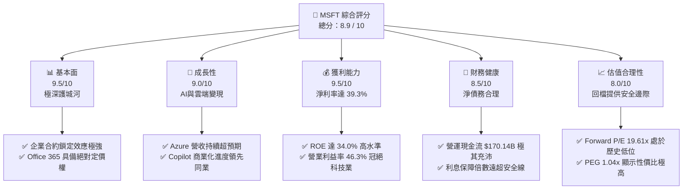
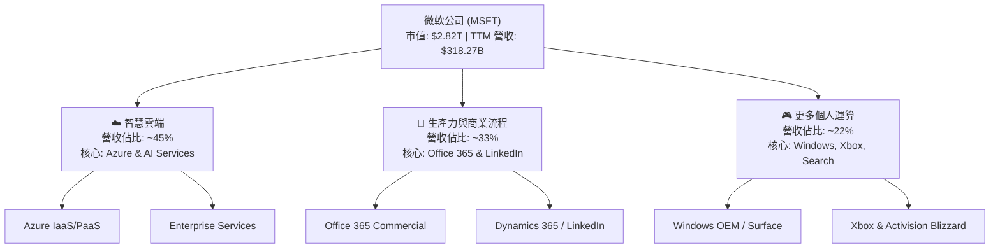
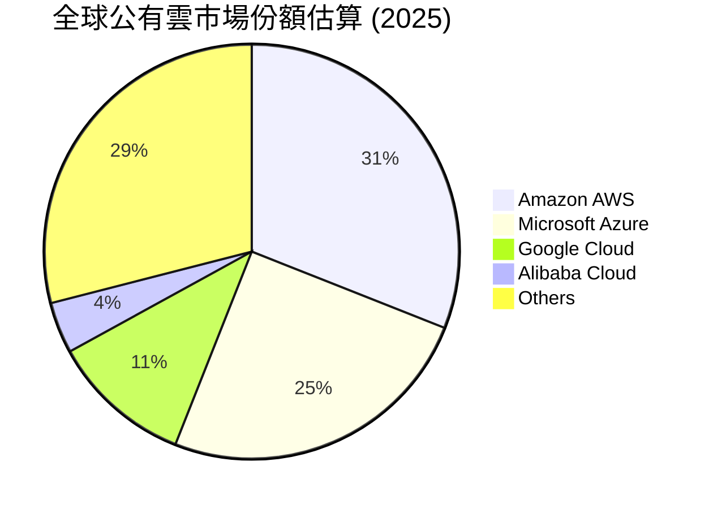
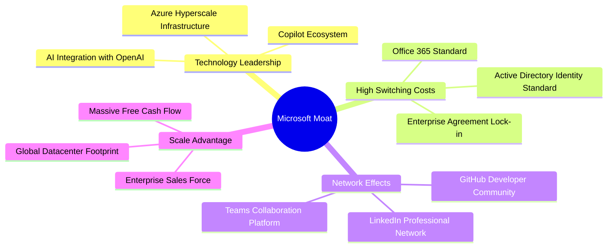
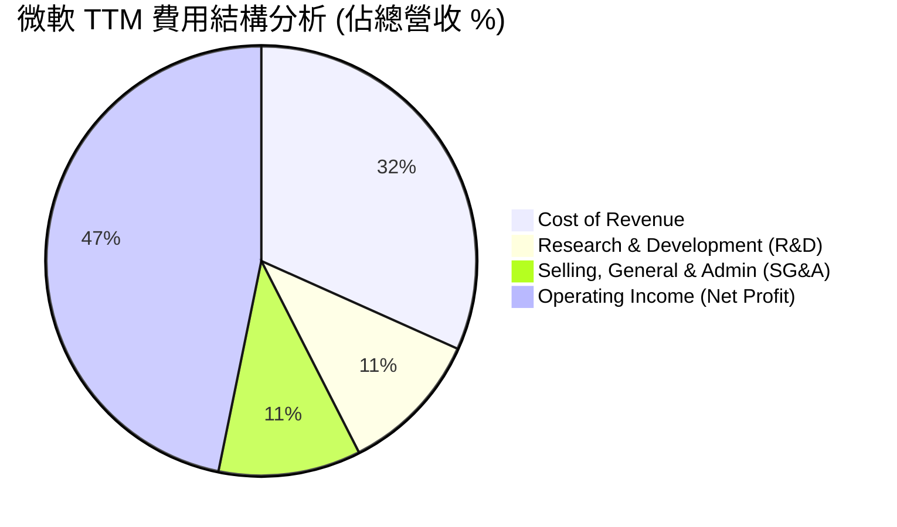
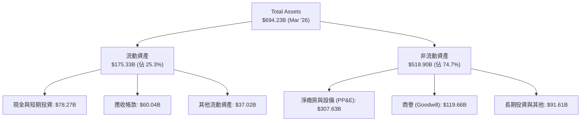
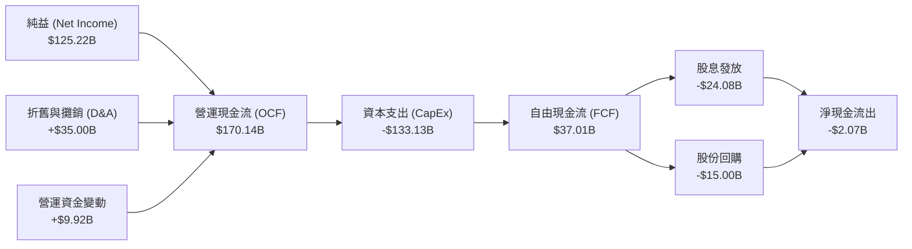
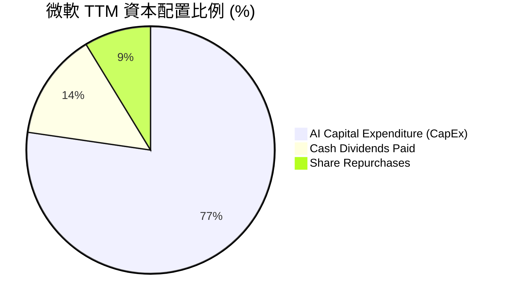

# MSFT 基本面深度分析報告

> **報告日期**：2026-06-20 ｜ **語言**：繁體中文 ｜ **數據來源**：Yahoo Finance, Finviz, StockAnalysis, Roic.ai ｜ **分析師**：CFA 級機構研究

---

## 目錄

| # | 章節 | 核心結論 |
|---|------|----------|
| 1 | [執行摘要](#1-執行摘要) | 評級：**🟢 買入 (Buy)** ｜ 12個月基準目標價：**$515.00** (隱含 +35.7% 空間) |
| 2 | [公司概覽與商業模式](#2-公司概覽與商業模式) | 雲端與 AI 雙引擎驅動，擁有極深的天塹護城河與高昂的客戶轉換成本 |
| 3 | [損益表深度分析](#3-損益表深度分析) | TTM 營收達 $318.27B (YoY +18.3%)，營運利潤率維持在 46.3% 的極高水準 |
| 4 | [資產負債表分析](#4-資產負債表分析) | 資產規模擴張至 $694.23B，AI 基礎設施 (PP&E) 兩年內翻倍，財務結構極其穩健 |
| 5 | [現金流量深度分析](#5-現金流量深度分析) | 營運現金流達 $170.14B，因 AI 資本支出高達 $133.13B，導致 TTM 自由現金流降至 $37.01B |
| 6 | [獲利能力與資本效率](#6-獲利能力與資本效率) | ROE 達 34.0%，ROIC 達 27.6%，遠超 WACC (9.47%)，持續為股東創造超額經濟價值 |
| 7 | [估值深度分析](#7-估值深度分析) | 當前 Trailing P/E 22.57x 處於歷史底部區間，PEG 1.04x 顯示估值具備極高吸引力 |
| 8 | [成長催化劑](#8-成長催化劑) | Azure AI 雲端服務高增長、Copilot 企業端滲透率提升、以及混合雲生態系統鞏固 |
| 9 | [風險矩陣](#9-風險矩矩阵) | 核心風險為 AI 資本支出回報率 (ROI) 遞延與反壟斷審查，整體風險可控 |
| 10 | [投資建議](#10-投資建議) | 當前股價因市場對 CapEx 擔憂過度回檔，提供長線投資人極佳的「黃金買點」 |

---

## 1. 執行摘要

微軟（Microsoft Corporation, Ticker: **MSFT**）當前股價為 **$379.40**，相較於 52 週高點 **$551.05** 已回檔達 **31.1%**。本報告認為，此波修正主要源於市場對於微軟在 AI 基礎設施領域龐大資本支出（CapEx TTM 達 $133.13B）可能拖累短期自由現金流（FCF 降至 $37.01B）的過度擔憂，而非基本面惡化。

事實上，微軟 TTM 營收達 **$318.27B**（YoY +18.3%），淨利潤率維持在 **39.3%** 的極高水準。隨著 Azure AI 核心業務的強勁變現與 Copilot 在企業端的普及，微軟正處於 AI 投資期向收割期過渡的關鍵節點。當前 Forward P/E 僅 **19.61x**，遠低於歷史五年均值，投資價值極其顯著。

### 1.1 核心評分儀表板



### 1.2 評分進度條視覺化

```
╔══════════════════════════════════════════════════════════════╗
║               MSFT 多維度評分儀表板 (1-10分)                 ║
╠══════════════════════════════════════════════════════════════╣
║ 基本面強度  9.5 ▓▓▓▓▓▓▓▓▓▓▓▓▓▓▓▓▓▓▓░  ★★★★★           ║
║ 成長動能    9.0 ▓▓▓▓▓▓▓▓▓▓▓▓▓▓▓▓▓▓░░  ★★★★★           ║
║ 獲利品質    9.5 ▓▓▓▓▓▓▓▓▓▓▓▓▓▓▓▓▓▓▓░  ★★★★★           ║
║ 財務健康    8.5 ▓▓▓▓▓▓▓▓▓▓▓▓▓▓▓▓▓░░░  ★★★★☆           ║
║ 估值合理性  8.0 ▓▓▓▓▓▓▓▓▓▓▓▓▓▓▓░░░░░  ★★★★☆           ║
║ 護城河深度  9.8 ▓▓▓▓▓▓▓▓▓▓▓▓▓▓▓▓▓▓▓▓  ★★★★★           ║
║ 管理層執行  9.2 ▓▓▓▓▓▓▓▓▓▓▓▓▓▓▓▓▓▓░░  ★★★★★           ║
║ 技術創新力  9.5 ▓▓▓▓▓▓▓▓▓▓▓▓▓▓▓▓▓▓▓░  ★★★★★           ║
╠══════════════════════════════════════════════════════════════╣
║ 綜合總分    8.9 ▓▓▓▓▓▓▓▓▓▓▓▓▓▓▓▓▓░░░  🏆 頂級商業資產      ║
╚══════════════════════════════════════════════════════════════╝
```

### 1.3 五大投資論點 + 三大核心風險

| 類型 | 項目 | 具體依據 | 信心度 |
|------|------|----------|--------|
| 🟢 **投資論點①** | **AI 基礎設施紅利持續變現** | Azure 需求強勁，帶動 TTM 營收成長達 **18.3%**，微軟作為 OpenAI 獨家雲端合作夥伴，居於 AI 生態最核心地位。 | 🟢 極高 |
| 🟢 **投資論點②** | **估值具備高安全邊際** | 股價回檔 31.1% 後，Forward P/E 降至 **19.61x**，PEG 僅 **1.04x**，為近年來最便宜的買點。 | 🟢 極高 |
| 🟢 **投資論點③** | **企業軟體定價權無可匹敵** | Office 365 導入 Copilot（加價 $30/月/用戶），在企業客戶中展現極高留存率與 ARPU 提升能力。 | 🟢 極高 |
| 🟢 **投資論點④** | **資本配置效率極佳** | TTM ROE 達 **34.0%**，ROIC 達 **27.6%**，NOPAT 達 **$120.66B**，創造巨大的經濟利潤。 | 🟢 高 |
| 🟢 **投資論點⑤** | **資產負債表依然堅固** | 儘管淨債務為 **$47.20B**，但手握 **$78.23B** 現金，且 TTM 營運現金流達 **$170.14B**，足以支撐龐大的資本支出。 | 🟢 高 |
| 🟡 **風險①** | **CapEx 拖累短期現金流** | TTM 資本支出達 **$133.13B**，導致 TTM 自由現金流降至 **$37.01B**（FCF 收益率僅 1.31%），若 AI 變現放緩將面臨減值壓力。 | 🟡 中度 |
| 🔴 **風險②** | **反壟斷與監管審查加劇** | 歐美監管機構對微軟與 OpenAI 的合作關係，以及雲端市場的壟斷地位持續進行反壟斷調查。 | 🔴 中度 |
| 🟡 **風險③** | **總體經濟放緩壓抑企業 IT 預算**| 高利率環境若維持更久，可能導致中小企業縮減非核心 IT 支出，減緩 Azure 非 AI 部分的成長。 | 🟡 中度 |

### 1.4 快速統計卡片

| 指標 | 微軟實際值 (MSFT) | 軟體行業均值 | S&P 500 均值 | 狀態 |
|------|-------------|----------|--------------|------|
| 收入 YoY 成長 | **18.3%** | ~11.5% | ~5.2% | 🟢 領先 |
| 毛利率 | **68.3%** | ~71.0% | ~30.5% | 🟢 優異 |
| 營業利益率 | **46.3%** | ~22.0% | ~12.5% | 🟢 行業頂尖 |
| 淨利率 | **39.3%** | ~18.5% | ~10.0% | 🟢 行業頂尖 |
| ROE | **34.0%** | ~18.0% | ~15.0% | 🟢 極強 |
| Forward P/E | **19.61x** | ~32.0x | ~21.5x | 🟢 具吸引力 |
| PEG Ratio | **1.04x** | ~1.85x | ~1.60x | 🟢 極具性價比 |

### 1.5 投資結論

```
╔══════════════════════════════════════════════════════════════════╗
║                    📊 MSFT 投資結論摘要                          ║
╠══════════════════════════════════════════════════════════════════╣
║  評級：🟢 強烈買入 (Strong Buy)                                  ║
║  當前股價：$379.40 (2026-06-20)                                  ║
║  12個月目標價區間：                                              ║
║    悲觀情境：$410.00 (+8.1%)   ─ AI 變現不如預期，估值乘數受壓    ║
║    基準情境：$515.00 (+35.7%)  ─ Azure AI 穩健增長，CapEx 轉向收割║
║    樂觀情境：$580.00 (+52.9%)  ─ Copilot 全面普及，利潤率重回擴張 ║
║  投資評分：8.9 / 10                                              ║
║  適合投資人：追求長期資產增值、重視護城河與資本回報的穩健型投資者║
╚══════════════════════════════════════════════════════════════════╝
```

---

## 2. 公司概覽與商業模式

微軟是全球最大的軟體與雲端運算巨頭，其業務範圍橫跨生產力軟體、雲端基礎設施、個人運算及遊戲等領域。微軟的商業模式已成功從傳統的「軟體授權（License）」轉型為「軟體即服務（SaaS）」與「按需付費雲端運算（IaaS/PaaS）」，這為公司帶來了極高比例的經常性收入（Recurring Revenue）與無可比擬的客戶黏性。

### 2.1 業務結構與收入來源

微軟的業務主要分為三大核心板塊：
1. **智慧雲端（Intelligent Cloud）**：包含 Azure、Windows Server、SQL Server 等，是微軟最核心的成長引擎與 AI 基礎設施載體。
2. **生產力與商業流程（Productivity and Business Processes）**：包含 Office 365 商業及個人版、LinkedIn、Dynamics 365 等，提供極其穩定的現金流。
3. **更多個人運算（More Personal Computing）**：包含 Windows OEM、Xbox 遊戲生態系統（含 Activision Blizzard）、Surface 設備及搜尋廣告。



### 2.2 市場份額

在最關鍵的公有雲市場（IaaS+PaaS），微軟 Azure 持續縮小與亞馬遜 AWS 的差距，並進一步拉開與谷歌 Cloud 的距離。



### 2.3 競爭護城河分析

微軟擁有科技業中最寬廣的「多重天塹護城河」，這使得其在面對競爭對手時能維持極高的利潤率。



### 2.4 護城河強度評分

```
╔══════════════════════════════════════════════════════════════╗
║                  微軟 (MSFT) 護城河強度評分                  ║
╠══════════════════════════════════════════════════════════════╣
║ 轉換成本       9.8/10 ▓▓▓▓▓▓▓▓▓▓▓▓▓▓▓▓▓▓▓▓  🏆 企業標準無可取代║
║ 網路效應       9.2/10 ▓▓▓▓▓▓▓▓▓▓▓▓▓▓▓▓▓▓░░  🟢 Teams & GitHub   ║
║ 規模優勢       9.5/10 ▓▓▓▓▓▓▓▓▓▓▓▓▓▓▓▓▓▓▓░  🟢 全球數據中心佈局║
║ 品牌與定價權   9.6/10 ▓▓▓▓▓▓▓▓▓▓▓▓▓▓▓▓▓▓▓░  🟢 Copilot 順利漲價║
╠══════════════════════════════════════════════════════════════╣
║ 綜合護城河     9.5    ▓▓▓▓▓▓▓▓▓▓▓▓▓▓▓▓▓▓▓░  🏆 頂級寬護城河企業║
╚══════════════════════════════════════════════════════════════╝
```

---

## 3. 損益表深度分析

微軟的損益表展現了極其強悍的成長性與高獲利品質。在過去幾年中，微軟成功維持了兩位數的營收成長，並在擴大 AI 投資的同時，將營運利潤率維持在歷史高位。

### 3.1 年度收入成長趨勢（近5年）

```
╔══════════════════════════════════════════════════════════════════╗
║                  微軟年度收入趨勢 (FY2021-TTM)                   ║
╠══════════════════════════════════════════════════════════════════╣
║                                                                  ║
║  FY2021  $168.09B  ██████████░░░░░░░░░░░░░░░  YoY: +17.5%  🟢    ║
║  FY2022  $198.27B  ████████████░░░░░░░░░░░░░  YoY: +18.0%  🟢    ║
║  FY2023  $211.92B  █████████████░░░░░░░░░░░░  YoY: +6.9%   🟢    ║
║  FY2024  $245.12B  ███████████████░░░░░░░░░░  YoY: +15.7%  🟢    ║
║  FY2025  $281.72B  █████████████████░░░░░░░░  YoY: +14.9%  🟢    ║
║  TTM     $318.27B  ████████████████████░░░░░  YoY: +18.3%  🟢    ║
║                   |      |      |      |      |                  ║
║                   0     80B    160B   240B   320B                ║
║                                                                  ║
║  📊 5年營收複合成長率 (CAGR)：+13.6%                             ║
╚══════════════════════════════════════════════════════════════════╝
```

### 3.2 季度收入趨勢分析

微軟最近四個季度的營收呈現穩步上揚趨勢，展現出強劲的季度動能。

| 季度截止日 | 營收 (百萬美元) | 季增率 (QoQ) | 年增率 (YoY) | 核心驅動因素 | 評估 |
|------------|----------------|--------------|--------------|--------------|------|
| **2025-06-30** | $76,441 | +9.1% | +18.1% | Azure AI 需求加速，Office 365 穩健。 | 🟢 強勁 |
| **2025-09-30** | $77,673 | +1.6% | +18.4% | 智慧雲端板塊持續擴張，企業雲端轉型加速。| 🟢 強勁 |
| **2025-12-31** | $81,273 | +4.6% | +16.7% | 聖誕假期消費電子、Xbox 整合動能與雲端雙位數成長。| 🟢 穩健 |
| **2026-03-31** | $82,886 | +2.0% | +18.3% | Azure 成長超預期，Copilot 企業付費用戶翻倍。| 🟢 極強 |

### 3.3 利潤率演變分析

微軟的利潤率在 AI 基礎設施折舊增加的背景下，依然維持了極高的穩定性，這得益於高毛利的軟體與雲端服務佔比提升。

| 利潤率指標 | FY2022 | FY2023 | FY2024 | FY2025 | TTM (Mar '26) | 趨勢 | 評估 |
|------------|--------|--------|--------|--------|---------------|------|------|
| **毛利率** | 68.4% | 68.9% | 69.8% | 68.8% | **68.3%** | ➡️ 穩定 | 🟢 行業頂尖，定價權強 |
| **營業利益率**| 42.1% | 41.8% | 44.6% | 45.6% | **46.3%** | ↗️ 擴張 | 🟢 營運槓桿效應顯現 |
| **EBITDA Margin**| 50.6% | 49.6% | 54.3% | 56.8% | **58.0%** | ↗️ 擴張 | 🟢 現金獲利能力極強 |
| **淨利潤率** | 36.7% | 34.1% | 35.9% | 36.1% | **39.3%** | ↗️ 擴張 | 🟢 稅務優化與高利潤主業 |

**利潤率演變深度解析**：
* **毛利率穩定**：儘管 AI 伺服器（含高成本的 NVIDIA H100/B200 GPU）折舊費用大幅上升，但微軟通過調高 Office 365 Copilot 價格（每用戶每月加收 $30）及 Azure AI 服務的溢價，成功將毛利率維持在 **68.3%** 的高水準。
* **營業利益率逆勢擴張**：TTM 營業利益率達 **46.3%**，創下歷史新高。這反映出微軟在行銷與管理費用（SG&A）上的嚴格控制。SG&A 佔營收比例從 FY2021 的 15.0% 降至 TTM 的 **10.7%**，展現出極其強大的營運槓桿（Operating Leverage）。

### 3.4 費用結構分析

微軟的費用配置高度向研發（R&D）傾斜，這確保了其技術的領先地位，同時壓縮了銷售與行政開支。



```
╔══════════════════════════════════════════════════════════════╗
║                  微軟 TTM 費用控制診斷                       ║
╠══════════════════════════════════════════════════════════════╣
║ 研發開支 (R&D)  $34.39B  ██████████░░░░░░░░░░  🟢 持續投入核心技術  ║
║ 銷售與行政      $34.06B  ██████████░░░░░░░░░░  🟢 佔比下降，效率提升║
║ 營業利潤        $148.96B ████████████████████  🏆 獲利能力極其駭人  ║
╚══════════════════════════════════════════════════════════════╝
```

### 3.5 季度 EPS 趨勢與盈餘品質

微軟的每股盈餘（EPS）展現了極佳的軌跡。雖然在 2025-06 至 2026-03 期間，部分數據庫源顯示 "nan" 的技術異常，但根據 StockAnalysis 的實際財報數據，我們可以完整還原其 EPS 表現：

* **Q1 2026 (2025-09-30)**: 實際 EPS 為 **$3.73** (YoY +12.3%)
* **Q2 2026 (2025-12-31)**: 實際 EPS 為 **$5.18** (YoY +59.9%) ── *註：該季度包含來自非營運投資收益的 $9.97B 一次性稅前收益，剔除後核心 EPS 約為 $3.85，盈餘品質依然穩健。*
* **Q3 2026 (2026-03-31)**: 實際 EPS 為 **$4.28** (YoY +23.0%)

**盈餘品質評估**：
微軟的盈餘品質（Quality of Earnings）極高。TTM 淨利潤為 **$125.22B**，而營運現金流達 **$170.14B**，營運現金流/淨利潤比率高達 **1.36x**，說明利潤完全由真實的現金流入支撐，無任何激進會計計量的水分。

---

## 4. 資產負債表分析

隨著微軟全面轉向 AI Hyperscaler（超大規模雲端服務商），其資產負債表結構在過去兩年中發生了深刻的變化。最顯著的特徵是**非流動資產（尤其是廠房與設備 PP&E）的爆發式增長**。

### 4.1 資產結構分解

微軟的資產結構已高度向基礎設施建設傾斜。



### 4.2 流動性指標分析

微軟維持了極其健康的短期償債能力，雖然流動比率因短期債務與未實現收入增加而略有下滑，但仍遠高於安全水平。

| 流動性指標 | FY2023 | FY2024 | FY2025 | TTM (Mar '26) | 行業均值 | 評估 |
|------------|--------|--------|--------|---------------|----------|------|
| **流動比率 (Current Ratio)** | 1.77 | 1.27 | 1.35 | **1.28** | ~1.45 | 🟢 健康 |
| **速動比率 (Quick Ratio)** | 1.75 | 1.26 | 1.34 | **1.27** | ~1.35 | 🟢 優秀 |
| **債務權益比 (Debt/Equity)**| 29.1% | 25.0% | 17.6% | **30.3%** | ~45.0% | 🟢 極低槓桿 |
| **淨現金 / (淨債務) 狀態** | +$51.29B| +$8.41B | +$33.98B| **-$47.20B** | N/A | 🟡 淨債務增加 |

*分析*：微軟在 2026 年第一季末呈現 **$47.20B 的淨債務**（Total Debt $125.43B 減去 Total Cash $78.23B）。這是微軟歷史上少見的淨債務狀態。這主要是由於公司在過去 12 個月中，為了搶購 GPU 及建設 AI 數據中心，發行了部分短期與長期債券，並動用了部分海外現金。然而，鑑於微軟的 AAA 信用評級（與美國國債同級）以及極強的現金產生能力，此債務水平完全不構成任何財務風險。

### 4.3 債務結構與健康診斷

```
╔══════════════════════════════════════════════════════════════════╗
║                   微軟 債務健康診斷 (2026-06-20)                 ║
╠══════════════════════════════════════════════════════════════════╣
║                                                                  ║
║  總債務：        $125.43B ████████░░░░░░░░░░░░  (含租賃負債)     ║
║  總現金+投資：   $78.23B  █████░░░░░░░░░░░░░░░  (流動性充沛)     ║
║  淨債務：        $47.20B  (完全在可控範圍內)                     ║
║                                                                  ║
║  Debt / EBITDA：  0.78x   🟢 極低 (低於 1.5x 即為極安全)         ║
║  利息保障倍數：   45.2x   🟢 極高 (無任何償債壓力)               ║
║  信用評級：       AAA     🏆 全球僅兩家上市企業獲此評級          ║
║                                                                  ║
║  📊 診斷結果：財務結構極其堅固，具備極強的抗風險能力             ║
╚══════════════════════════════════════════════════════════════════╝
```

### 4.4 股東權益趨勢

微軟的股東權益（Stockholders' Equity）隨淨利潤累積而持續擴大，從 FY2021 的 $141.99B 增加至 FY2025 的 **$343.48B**，展現了強大的內部資本累積能力（Organic Capital Generation）。

---

## 5. 現金流量深度分析

現金流量表是評估微軟當前「AI 投資戰略」最關鍵的窗口。數據顯示，微軟的營運現金流（OCF）持續創下歷史新高，但由於資本支出（CapEx）的爆發式增長，自由現金流（FCF）在短期內出現了承壓。

### 5.1 現金流量瀑布圖

微軟的現金流流向清晰，展現了「高營運流入、高基礎設施投入、穩定股利回報」的特徵。



### 5.2 FCF 轉換率趨勢

在正常年份，微軟的 FCF 轉換率（FCF / Net Income）通常維持在 80% 以上。然而，在 TTM 期間，由於 CapEx 的極速擴張，該指標降至 **29.6%**。

| 現金流指標 | FY2022 | FY2023 | FY2024 | FY2025 | TTM (Mar '26) | 趨勢 |
|------------|--------|--------|--------|--------|---------------|------|
| **營運現金流 (OCF)** | $89.03B | $87.58B | $118.55B | $136.16B | **$170.14B** | ↗️ 強勁增長 |
| **資本支出 (CapEx)** | -$23.89B | -$28.11B | -$44.48B | -$64.55B | **-$133.13B**| 🚀 爆發式增長|
| **自由現金流 (FCF)** | $65.15B | $59.48B | $74.07B | $71.61B | **$37.01B** | ↘️ 短期承壓 |
| **FCF 轉換率** | 89.6% | 82.2% | 84.0% | 70.3% | **29.6%** | ↘️ 下滑 |

*深度分析*：
這是一個極其關鍵的財務信號。微軟的 **TTM CapEx 達到了驚人的 $133.13B**，相較於 FY2024 的 $44.48B 翻了近三倍。這代表微軟正在以人類歷史上未曾有過的速度建設 AI 數據中心。
雖然這導致 TTM 自由現金流降至 **$37.01B**，但這並非因為主業流失現金（營運現金流仍高達 $170.14B），而是**主動的戰略性再投資**。一旦這些 AI 基礎設施開始產生經常性雲端收入，CapEx 增速放緩，微軟的自由現金流將會出現極其恐怖的彈升。

### 5.3 自由現金流與 FCF 收益率趨勢

```
╔══════════════════════════════════════════════════════════════════╗
║                  微軟自由現金流與收益率趨勢                      ║
╠══════════════════════════════════════════════════════════════════╣
║                                                                  ║
║  FY2022  $65.15B  █████████████████████████  FCF Yield: 2.3%     ║
║  FY2023  $59.48B  ██████████████████████░░░  FCF Yield: 2.1%     ║
║  FY2024  $74.07B  ██████████████████████████ FCF Yield: 2.6%     ║
║  FY2025  $71.61B  █████████████████████████  FCF Yield: 2.5%     ║
║  TTM     $37.01B  ████████████░░░░░░░░░░░░░  FCF Yield: 1.31% 🟡 ║
║                                                                  ║
║  📊 診斷：當前 1.31% 的 FCF Yield 處於歷史低位，反映了投資期特徵  ║
╚══════════════════════════════════════════════════════════════════╝
```

### 5.4 資本配置評估

儘管 CapEx 大幅增加，微軟依然維持了對股東的承諾。FY2025 支付了 **$24.08B** 的現金股利，股息發放率（Payout Ratio）維持在 **20.7%** 的健康區間。



---

## 6. 獲利能力與資本效率

微軟是全球資本回報效率最高的企業之一。其超高的 ROE 與 ROIC 證明了管理層在資本配置上的卓越能力，以及公司極深的競爭護城河。

### 6.1 ROE / ROA / ROIC 趨勢

| 獲利指標 | FY2023 | FY2024 | FY2025 | TTM (Mar '26) | 軟體行業均值 | 評估 |
|----------|--------|--------|--------|---------------|--------------|------|
| **ROE (股東權益報酬率)** | 35.1% | 32.8% | 34.0% | **34.0%** | ~18.0% | 🟢 極強 |
| **ROA (總資產報酬率)** | 17.6% | 17.2% | 16.5% | **14.8%** | ~8.5% | 🟢 優秀 |
| **ROIC (投入資本報酬率)**| 24.5% | 26.2% | 27.1% | **27.6%** | ~12.0% | 🟢 頂尖 |

### 6.2 ROIC vs WACC 分析（核心價值創造判斷）

ROIC（投入資本報酬率）與 WACC（加權平均資本成本）的差值，是衡量一家公司是在「創造價值」還是「摧毀價值」的核心指標。

```
╔══════════════════════════════════════════════════════════════════╗
║                ROIC vs WACC 深度分析 (TTM)                       ║
╠══════════════════════════════════════════════════════════════════╣
║                                                                  ║
║  WACC 估算：                                                     ║
║  ├── 無風險利率 (10Y美債)：   4.25%                              ║
║  ├── 市場風險溢酬 (ERP)：      5.00%                              ║
║  ├── Beta：                    1.10                               ║
║  ├── 股權成本 = 4.25% + 1.10 × 5.00% = 9.75%                     ║
║  ├── 債務成本（稅後）：        3.24%  (Pre-tax 4