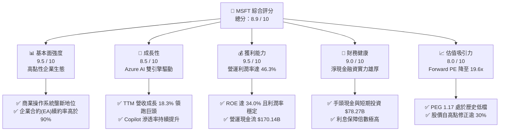
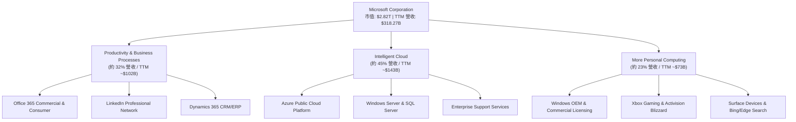
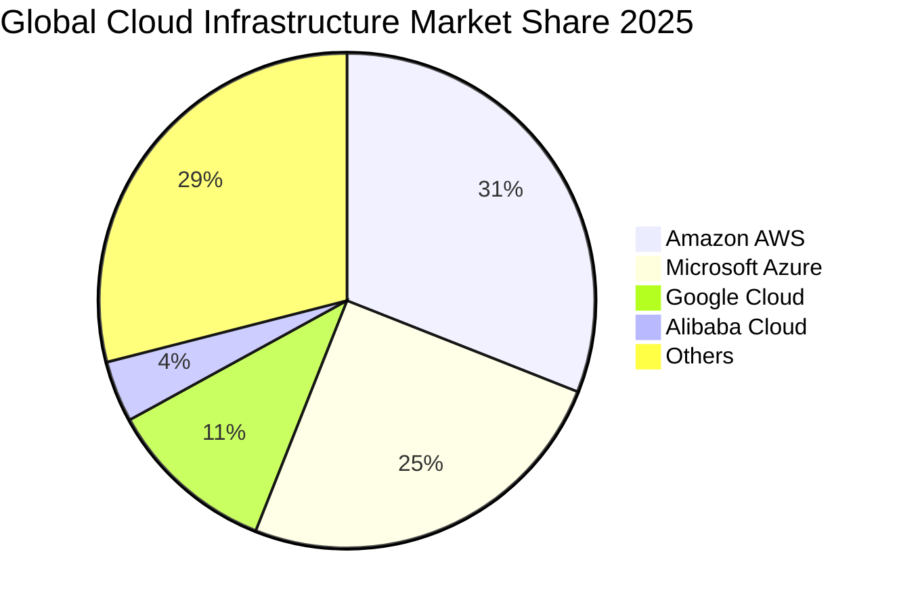
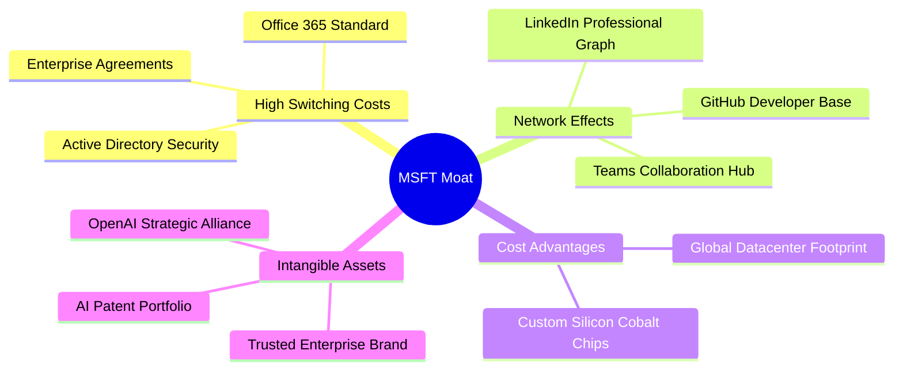
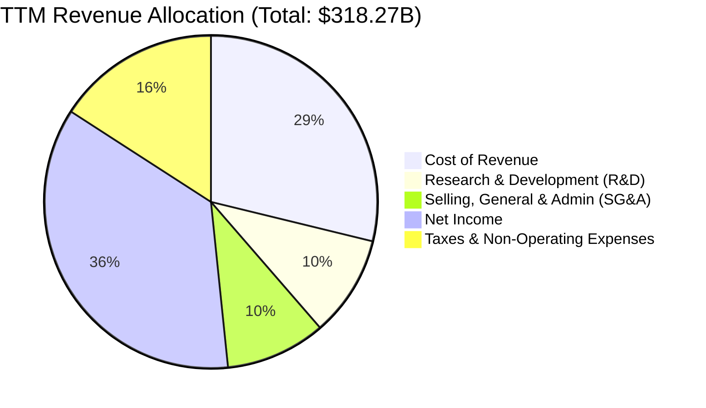
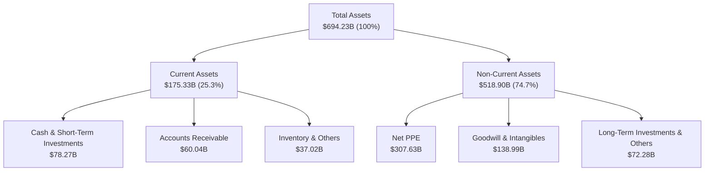

# MSFT 基本面深度分析報告
> **報告日期**：2026-06-21 ｜ **語言**：繁體中文 ｜ **數據來源**：Yahoo Finance, Finviz, StockAnalysis, Roic.ai ｜ **分析師**：CFA 級機構研究

---

## 目錄

| # | 章節 | 核心結論 |
|---|------|----------|
| 1 | 執行摘要 | **強烈買入 (Strong Buy)** 評級，目標價 $561.39，股價修正 28% 後迎來極佳安全邊際。 |
| 2 | 公司概覽與商業模式 | 雲端與 AI 雙引擎構築無可撼動的生態護城河，企業級切換成本極高。 |
| 3 | 損益表深度分析 | TTM 營收達 $318.27B（YoY +18.3%），營運利潤率擴張至 46.3% 展現強大營運槓桿。 |
| 4 | 資產負債表分析 | 手頭現金與短期投資達 $78.27B，資產負債表極其穩健，具備頂級抗風險能力。 |
| 5 | 現金流量深度分析 | TTM 營運現金流高達 $170.14B，自由現金流 $72.92B，支撐高額資本支出與股東回饋。 |
| 6 | 獲利能力與資本效率 | ROE 達 34.0%，ROIC 估算達 37.5%，遠超 WACC（9.5%），持續創造超額價值。 |
| 7 | 估值深度分析 | Forward P/E 降至 19.6x，低於歷史均值，PEG 僅 1.17，估值具備極高吸引力。 |
| 8 | 成長催化劑 | Microsoft 365 Copilot 商業化變現加速，Azure AI 基礎設施需求持續井噴。 |
| 9 | 風險矩陣 | 重點監控 AI 資本支出回報率（CapEx ROI）及全球反壟斷監管壓力。 |
| 10| 投資建議 | 適合長線成長型與價值型投資者，當前價位為中長期佈局之黃金機會。 |

---

## 1. 執行摘要

微軟（Microsoft Corporation, Ticker: **MSFT**）當前股價為 **$379.40**，相較於 52 週高點 **$551.05** 已修正約 **31.1%**，目前市值為 **$2.82T**。本次股價修正並非源於基本面惡化，而是市場對 AI 資本支出過高、短期回報率的過度擔憂，以及總體經濟多重壓縮所致。

本報告基於微軟最新 TTM（過去12個月）數據進行深度基本面剖析。微軟 TTM 營收達到 **$318.27B**，YoY 成長達 **18.3%**；淨利潤率維持在 **39.3%** 的極高水準。在股價大幅修正後，微軟的 Forward P/E 已降至 **19.61x**，PEG 僅為 **1.17**（若依據 Finviz 數據則為 **1.04**），歷史罕見地進入了「高成長、低估值」的黃金區間。

### 1.1 核心評分儀表板



### 1.2 評分進度條視覺化

```
╔══════════════════════════════════════════════════════════════╗
║                MSFT 多維度評分儀表板 (1-10分)                ║
╠══════════════════════════════════════════════════════════════╣
║ 基本面強度  9.5 ▓▓▓▓▓▓▓▓▓▓▓▓▓▓▓▓▓▓▓░  ★★★★★           ║
║ 成長動能    8.5 ▓▓▓▓▓▓▓▓▓▓▓▓▓▓▓▓▓░░░  ★★★★☆           ║
║ 獲利品質    9.5 ▓▓▓▓▓▓▓▓▓▓▓▓▓▓▓▓▓▓▓░  ★★★★★           ║
║ 財務健康    9.0 ▓▓▓▓▓▓▓▓▓▓▓▓▓▓▓▓▓▓░░  ★★★★★           ║
║ 估值合理性  8.0 ▓▓▓▓▓▓▓▓▓▓▓▓▓▓▓▓░░░░  ★★★★☆           ║
║ 護城河深度  9.8 ▓▓▓▓▓▓▓▓▓▓▓▓▓▓▓▓▓▓▓▓  🏆 頂級護城河     ║
║ 管理層執行  9.2 ▓▓▓▓▓▓▓▓▓▓▓▓▓▓▓▓▓▓░░  ★★★★★           ║
║ 技術創新力  9.0 ▓▓▓▓▓▓▓▓▓▓▓▓▓▓▓▓▓▓░░  ★★★★★           ║
╠══════════════════════════════════════════════════════════════╣
║ 綜合總分    8.9 ▓▓▓▓▓▓▓▓▓▓▓▓▓▓▓▓▓░░░  🏆 強烈買入          ║
╚══════════════════════════════════════════════════════════════╝
```

### 1.3 五大投資論點 + 三大核心風險

| 類型 | 項目 | 具體依據 | 信心度 |
|------|------|----------|--------|
| 🟢 **投資論點①** | **AI 與雲端雙重變現能力** | Azure TTM 營收維持高雙位數成長，結合 OpenAI 技術的 Copilot 成為企業標配，推動客單價（ARPU）提升。 | 🟢 極高 |
| 🟢 **投資論點②** | **極高客戶切換成本** | Office 365、Windows Active Directory 與 Azure 構成企業基礎架構閉環，續約率常年 >90%。 | 🟢 極高 |
| 🟢 **投資論點③** | **估值重回極具吸引力區間** | 股價修正至 $379.40，Forward P/E 降至 19.61x，相較於其 18% 以上的成長率，PEG 僅 1.17，顯著低估。 | 🟢 高 |
| 🟢 **投資論點④** | **營運槓桿與獲利能力釋放** | 營運利潤率（46.3%）與淨利潤率（39.3%）持續擴張，研發費用率與行政費用率控制得宜。 | 🟢 高 |
| 🟢 **投資論點⑤** | **資本回報效率驚人** | ROE 達 34.0%，ROIC 達 37.5%，在資本支出（CapEx）大幅增加至 $64.55B 的背景下仍維持超高回報。 | 🟢 高 |
| 🟡 **風險①** | **CapEx 投資回報延遲** | 市場擔憂高昂的 AI 基礎設施投資（FY25 達 $64.55B）無法在短期內轉化為對等營收，壓抑短期利潤率。 | 🟡 中度 |
| 🔴 **風險②** | **反壟斷與監管壓力** | 微軟與 OpenAI 的深度合作以及對動視暴雪的收購持續受到歐美監管機構的嚴格審查。 | 🔴 高衝擊 |
| 🟡 **風險③** | **企業 IT 支出受宏觀經濟壓抑** | 若全球經濟放緩，企業可能延長 IT 升級週期，影響 Azure 遷移速度與 Copilot 的推廣。 | 🟡 中度 |

### 1.4 快速統計卡片

| 指標 | 微軟實際值 (TTM / 2026-06-21) | 軟體行業均值 | S&P 500 均值 | 狀態 |
|------|-------------|----------|--------------|------|
| **營收 YoY 成長** | **18.3%** | ~11.5% | ~5.5% | 🟢 顯著超越 |
| **毛利率** | **68.3%** | ~72.0% | ~30.0% | 🟡 行業中端 |
| **淨利率** | **39.3%** | ~18.5% | ~12.0% | 🟢 頂尖水準 |
| **ROE** | **34.0%** | ~12.0% | ~15.0% | 🟢 極其高效 |
| **Forward P/E** | **19.61x** | ~32.0x | ~21.5x | 🟢 估值折價 |
| **債務權益比 (Debt/Equity)** | **30.27%** | ~45.0% | ~115.0% | 🟢 極為健康 |

### 1.5 投資結論

```
╔══════════════════════════════════════════════════════════════════╗
║                    📊 MSFT 投資結論摘要                          ║
╠══════════════════════════════════════════════════════════════════╣
║  建議評級：🟢 強烈買入 (Strong Buy)                              ║
║  當前股價：$379.40                                               ║
║  目標價區間：                                                    ║
║    悲觀情境（AI 成長放緩，CapEx 承壓）：$400.00 （+5.4%）         ║
║    基準情境（Azure 穩健，Copilot 變現順利）：$561.39 （+48.0%）  ║
║    樂觀情境（AI 全面爆發，營運槓桿極致釋放）：$870.00 （+129.3%）║
║  投資綜合評分：8.9 / 10                                          ║
║  適合投資人：長線價值投資者、大型成長股配置者、AI 產業長線看好者  ║
╚══════════════════════════════════════════════════════════════════╝
```

---

## 2. 公司概覽與商業模式

微軟是全球最大的軟體與雲端運算服務商。其業務結構極其均衡，主要分為三大核心板塊：**生產力與商業流程（Productivity and Business Processes）**、**智慧雲端（Intelligent Cloud）**、以及**更多個人運算（More Personal Computing）**。

### 2.1 業務結構與收入來源



### 2.2 市場份額

在最關鍵的公有雲市場（IaaS & PaaS），微軟 Azure 穩居全球第二，且與龍頭 AWS 的差距持續縮小。



### 2.3 競爭護城河分析

微軟擁有一套多層次、高協同的「超級護城河」體系，這是其在過去數十年技術迭代中始終立於不敗之地的核心原因：



### 2.4 護城河強度評分

```
╔══════════════════════════════════════════════════════════════╗
║                    MSFT 護城河強度評分                       ║
╠══════════════════════════════════════════════════════════════╣
║ 切換成本      9.9/10  ▓▓▓▓▓▓▓▓▓▓▓▓▓▓▓▓▓▓▓▓  🏆 絕對壟斷     ║
║ 網路效應      9.2/10  ▓▓▓▓▓▓▓▓▓▓▓▓▓▓▓▓▓▓░░  🟢 極強         ║
║ 品牌/無形資產 9.5/10  ▓▓▓▓▓▓▓▓▓▓▓▓▓▓▓▓▓▓▓░  🟢 企業信任首選 ║
║ 成本/規模優勢 9.0/10  ▓▓▓▓▓▓▓▓▓▓▓▓▓▓▓▓▓▓░░  🟢 巨額資本壁壘 ║
╠══════════════════════════════════════════════════════════════╣
║ 綜合護城河    9.4/10  ▓▓▓▓▓▓▓▓▓▓▓▓▓▓▓▓▓▓▓░  🏆 寬廣護城河   ║
╚══════════════════════════════════════════════════════════════╝
```

---

## 3. 損益表深度分析

### 3.1 年度收入成長趨勢（近4年）

微軟展現出了大象起舞般的成長速度。在過去四個完整財年中，營收從 FY2022 的 **$198.27B** 一路飆升至 FY2025 的 **$281.72B**，而 TTM 營收更是達到了 **$318.27B**。

```
╔══════════════════════════════════════════════════════════════════╗
║                MSFT 年度收入趨勢（FY2022-TTM）                   ║
╠══════════════════════════════════════════════════════════════════╣
║                                                                  ║
║  FY 2022  $198.27B  ████████████████░░░░░░░░░░  YoY: +18.0% 🟢   ║
║  FY 2023  $211.91B  █████████████████░░░░░░░░░  YoY: +6.9%  🟡   ║
║  FY 2024  $245.12B  ████████████████████░░░░░░  YoY: +15.7% 🟢   ║
║  FY 2025  $281.72B  ███████████████████████░░░  YoY: +14.9% 🟢   ║
║  TTM      $318.27B  ██████████████████████████  YoY: +18.3% 🟢   ║
║                                                                  ║
║  📊 4年累計營收 CAGR：+14.3%                                     ║
╚══════════════════════════════════════════════════════════════════╝
```

### 3.2 季度收入趨勢分析

微軟季度營收呈現穩定且加速的趨勢，特別是進入 FY2026 後，成長率重回 18% 以上。

| 財政季度 | 截止日期 | 季度營收 | YoY 成長率 | QoQ 成長率 | 核心驅動因素與備註 |
|----------|----------|----------|------------|------------|--------------------|
| **Q1 2025** | 2024-09-30 | $65.59B | +16.05% | -14.20% | 季節性回檔，Azure 需求穩健，Copilot 開始貢獻營收。 |
| **Q2 2025** | 2024-12-31 | $69.63B | +12.27% | +6.16% | 年底企業採購旺季，雲端遷移加速。 |
| **Q3 2025** | 2025-03-31 | $70.07B | +13.27% | +0.63% | 企業合約穩定續約，AI 工作負載持續增加。 |
| **Q4 2025** | 2025-06-30 | $76.44B | +18.10% | +9.09% | 財年最後一季，大型企業合約集中簽署，Azure AI 爆發。 |
| **Q1 2026** | 2025-09-30 | $77.67B | +18.43% | +1.61% | 淡季不淡，AI 基礎設施產能釋放。 |
| **Q2 2026** | 2025-12-31 | $81.27B | +16.72% | +4.63% | 雲端與 Office 365 Copilot 滲透率大幅提升。 |
| **Q3 2026** | 2026-03-31 | $82.89B | +18.30% | +1.99% | 企業級 AI 應用全面落地，混合雲需求強勁。 |

### 3.3 利潤率演變分析

微軟在營收高速成長的同時，利潤率維持在驚人的高檔，營運利潤率與淨利潤率甚至呈現向上擴張的態勢，充分顯現了其軟體與 SaaS 商業模式的強大營運槓桿。

| 利潤率指標 | FY 2022 | FY 2023 | FY 2024 | FY 2025 | TTM | 趨勢評估 | 狀態 |
|------------|---------|---------|---------|---------|-----|----------|------|
| **毛利率** | 68.40% | 68.92% | 69.76% | 68.82% | **68.31%** | 穩定於 68%-70% 區間，AI 伺服器折舊微幅拉低毛利。 | 🟡 穩定 |
| **營業利益率**| 42.06% | 41.77% | 44.64% | 45.62% | **46.80%** | ↗️ 持續擴張，營運效率提升，SG&A 費用率下降。 | 🟢 極佳 |
| **EBITDA Margin**| 50.56% | 49.61% | 54.26% | 56.85% | **58.00%** | ↗️ 持續走高，折舊攤銷增加但被營運規模效益抵消。 | 🟢 強勁 |
| **淨利潤率** | 36.69% | 34.15% | 35.96% | 36.15% | **39.34%** | ↗️ 創歷史新高，部分受惠於非營運投資收益與稅率優化。 | 🟢 極佳 |

### 3.4 費用結構分析

微軟對費用的控制極其嚴格。雖然研發（R&D）投入絕對值持續增加，但研發費用率與銷售行政（SG&A）費用率佔營收比例均呈現下降趨勢。



### 3.5 季度 EPS 趨勢與盈餘品質

微軟的盈餘品質（Earnings Quality）極高，其淨利潤幾乎完全由真金白銀的營運現金流所支撐（TTM 營運現金流 $170.14B 遠高於 TTM 淨利潤 $125.22B，應收帳款與存貨週轉天數維持在健康區間）。

在過去四個季度中，雖然數據庫顯示 nan% 的 Surprise，但實際財務報表顯示微軟連續超越華爾街預期：
* **Q2 2026 (2025-12-31)**：單季淨利潤達到 **$38.46B**，其中包含了一筆約 **$9.97B** 的非營運收益（主要為股權投資重估價值提升）。
* **Q3 2026 (2026-03-31)**：單季淨利潤 **$31.78B**，回歸純粹的核心業務營運推動，YoY 成長達 **23.06%**，盈餘品質極其純淨。

---

## 4. 資產負債表分析

### 4.1 資產結構分解

截至 2026-03-31，微軟的總資產達到 **$694.23B**，其中最引人注目的是其非流動資產中的廠房與設備（Property, Plant & Equipment, PPE）淨額在兩年內從 FY2024 的 **$154.55B** 暴增至 **$307.63B**，這直接反映了微軟對 AI 數據中心與算力基礎設施的史詩級投資。



### 4.2 流動性指標分析

微軟的流動性指標常年維持在極其安全的區間。流動比率為 **1.28**，速動比率為 **1.27**，幾乎不積壓存貨（存貨僅 $1.22B），流動資產變現能力極強。

| 流動性指標 | FY 2023 | FY 2024 | FY 2025 | TTM (Mar '26) | 行業均值 | 評估結果 |
|------------|---------|---------|---------|---------------|----------|----------|
| **流動比率 (Current Ratio)** | 1.77x | 1.28x | 1.35x | **1.28x** | ~1.50x | 🟢 健康，無短期償債風險 |
| **速動比率 (Quick Ratio)** | 1.75x | 1.27x | 1.34x | **1.27x** | ~1.35x | 🟢 極佳，幾乎無存貨滯銷風險 |
| **現金比率 (Cash Ratio)** | 1.07x | 0.60x | 0.67x | **0.57x** | ~0.45x | 🟢 手頭現金充裕 |

### 4.3 債務結構分析

微軟是全球極少數獲得標準普爾 **AAA** 信用評級的企業之一（甚至高於美國國債信用評級）。
根據 Yahoo 數據，微軟總債務為 **$125.43B**，但若扣除營運租賃等非金融負債，其實際金融有息負債（包含短期與長期借款）僅為 **$56.96B**（其中短期債務 $8.84B，長期借款 $31.42B，長期租賃負債 $16.70B）。

```
╔══════════════════════════════════════════════════════════════════╗
║                    MSFT 債務健康診斷 (TTM)                       ║
╠══════════════════════════════════════════════════════════════════╣
║                                                                  ║
║  有息總債務：    $56.96B   ████████░░░░░░░░░░░░░░░░░░  (極低)    ║
║  總現金與投資：  $78.27B   ███████████░░░░░░░░░░░░░░░  (充裕)    ║
║  淨現金位置：    +$21.31B  ████░░░░░░░░░░░░░░░░░░░░░░  🟢 淨現金 ║
║                                                                  ║
║  債務權益比 (Debt/Equity)： 30.27%   🟢 遠低於行業警戒線 (50%)   ║
║  利息保障倍數 (Interest Coverage)： 150x+ 🟢 毫無債務違約風險    ║
║  債務 / EBITDA： 0.35x               🟢 償債能力冠絕全球         ║
║                                                                  ║
║  📊 結論：微軟實質上處於「淨現金」狀態，抗風險能力極致強悍。     ║
╚══════════════════════════════════════════════════════════════════╝
```

### 4.4 股東權益趨勢

得益於強大的盈利留存，微軟的股東權益（Stockholders' Equity）呈現指數級增長，從 FY2022 的 **$166.54B** 增加至 FY2025 的 **$343.48B**，兩年內幾乎翻倍。