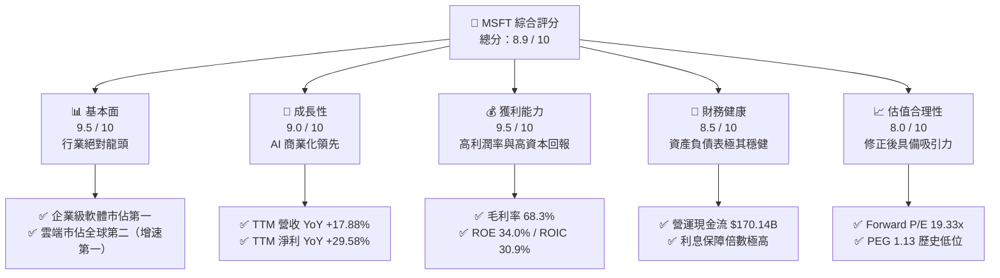
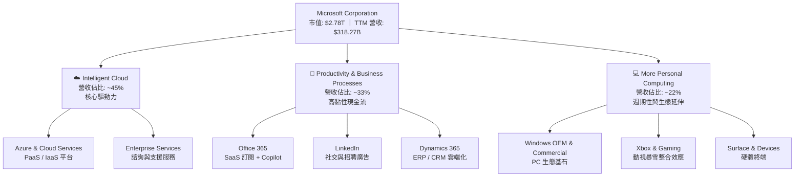
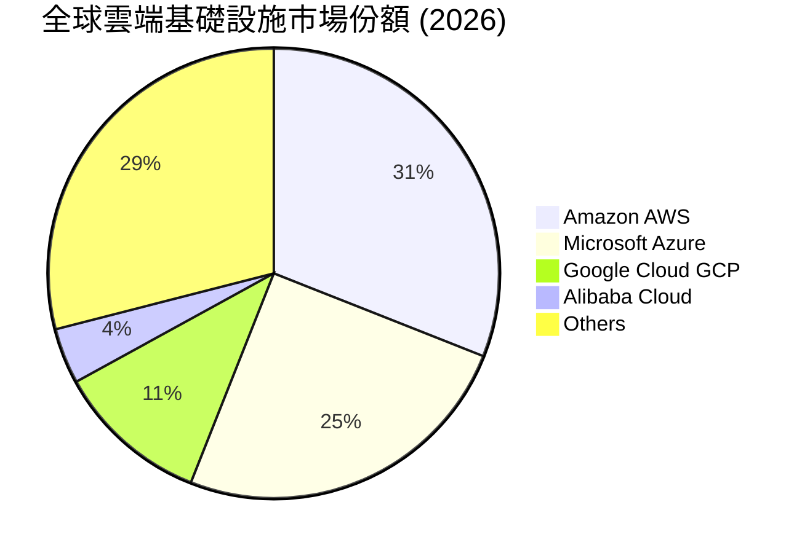
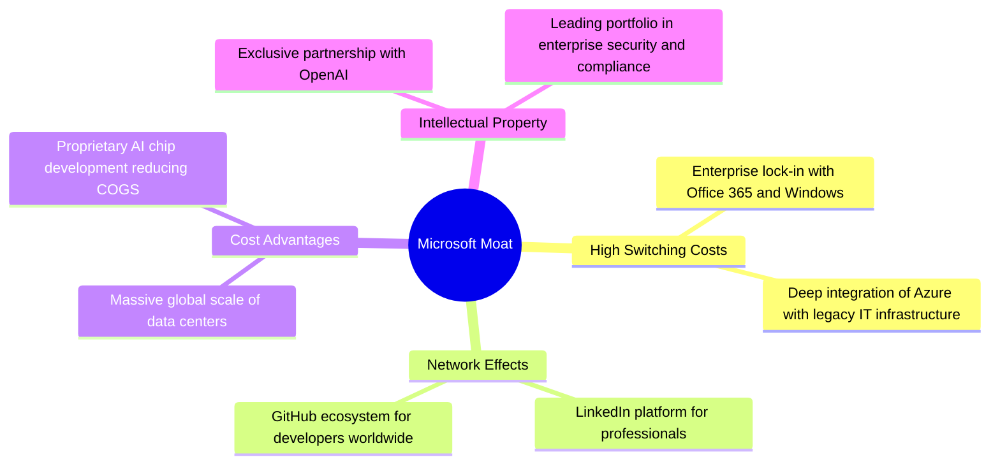
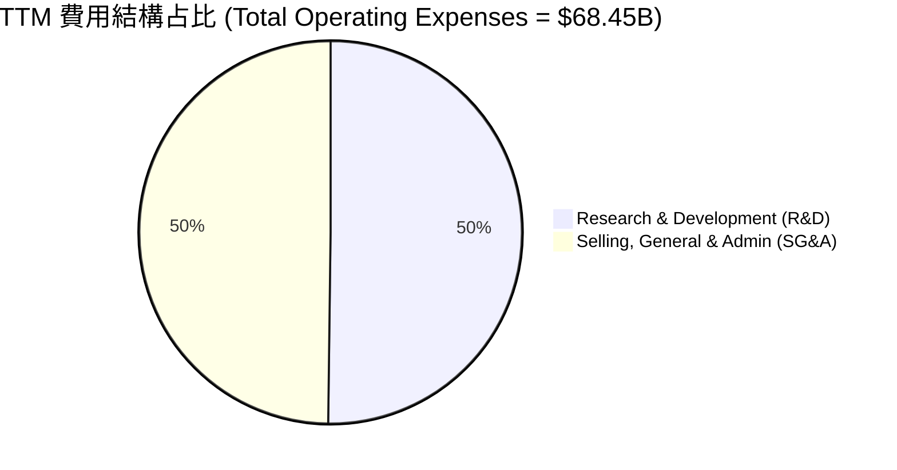
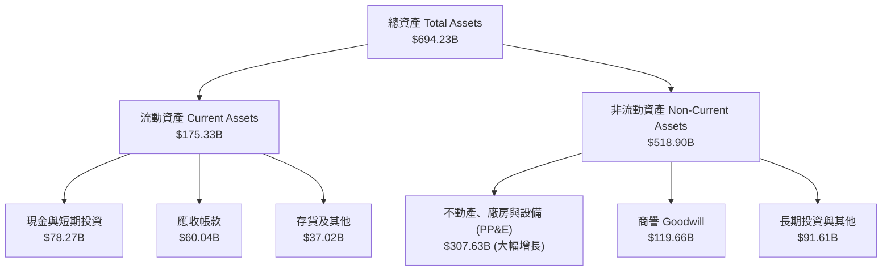
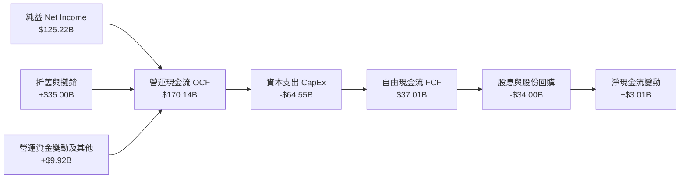
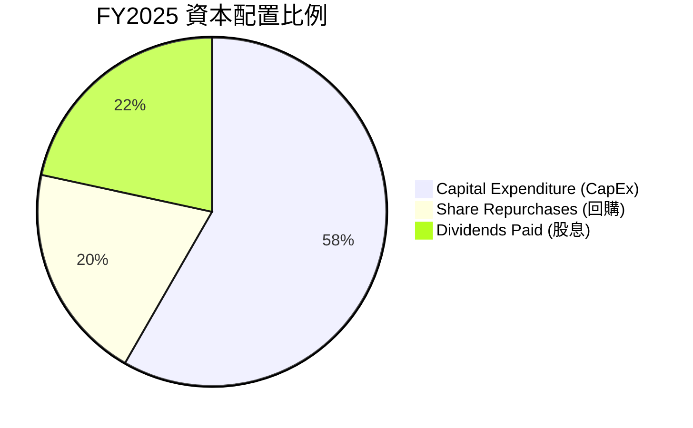
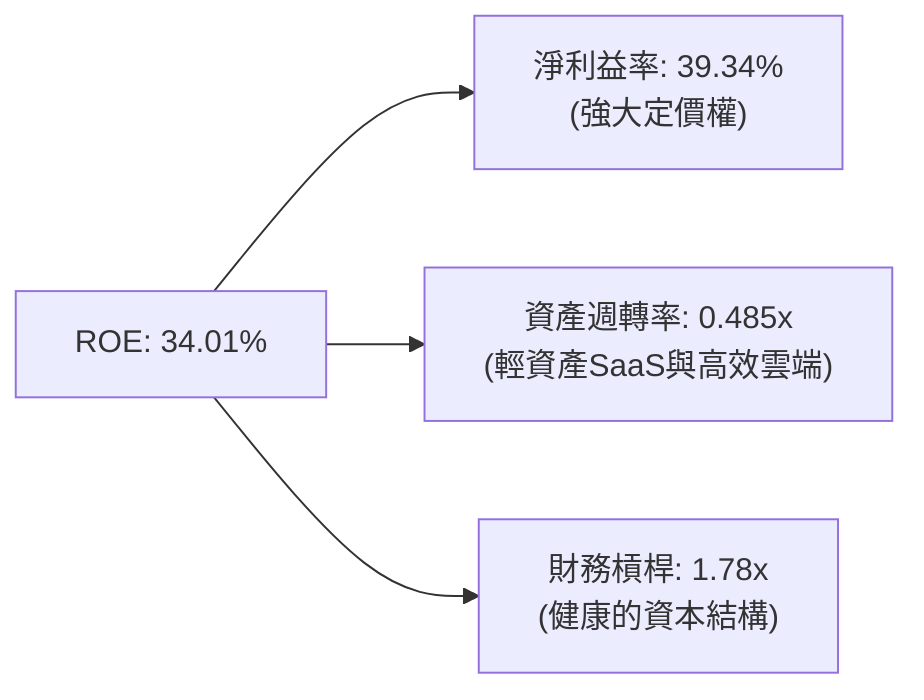
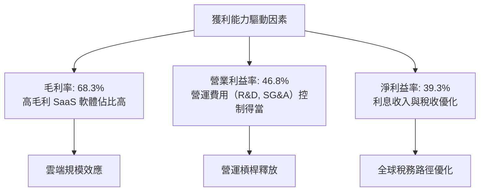

# MSFT 基本面深度分析報告

> **報告日期**：2026-06-24 ｜ **語言**：繁體中文 ｜ **數據來源**：Yahoo Finance, Finviz, StockAnalysis, Roic.ai ｜ **分析師**：CFA 級機構研究

---

## 目錄

| # | 章節 | 核心結論 |
|---|------|----------|
| 1 | [執行摘要](#1-執行摘要) | 評級：🟢 **強烈買入** ｜ 目標價：**$561.39**（隱含 50.1% 上漲空間） |
| 2 | [公司概覽與商業模式](#2-公司概覽與商業模式) | 雲端與 AI 雙引擎驅動，生態系統具備極高客戶鎖定與寬廣護城河 |
| 3 | [損益表深度分析](#3-損益表深度分析) | TTM 營收達 **$318.27B**（YoY +17.9%），淨利潤率維持在 **39.3%** 的極高水準 |
| 4 | [資產負債表分析](#4-資產負債表分析) | 現金儲備 **$78.23B**，AI 基礎設施建設致使資本化資產大幅增長 |
| 5 | [現金流量深度分析](#5-現金流量深度分析) | OCF 達 **$170.14B**，大舉投入 CapEx（FY25 $64.55B）以鞏固 AI 霸權 |
| 6 | [獲利能力與資本效率](#6-獲利能力與資本效率) | ROE 達 **34.0%**，ROIC 達 **30.90%**，大幅超越 WACC（9.43%）持續創造股東價值 |
| 7 | [估值深度分析](#7-估值深度分析) | Forward P/E 降至 **19.33x**，估值已進入歷史超跌區間，具備極高安全邊際 |
| 8 | [成長催化劑](#8-成長催化劑) | Copilot 商業化滲透與 Azure AI 基礎設施需求暴增為中短期核心動能 |
| 9 | [風險矩陣](#9-風險矩陣) | CapEx 產能過剩與反壟斷監管為主要監控風險 |
| 10 | [投資建議](#10-投資建議) | 當前股價 **$373.94** 為極佳長線佈局時機，建議分批逢低加碼 |

---

## 1. 執行摘要

### 1.1 核心評分儀表板



### 1.2 評分進度條視覺化

```
╔══════════════════════════════════════════════════════════════╗
║                MSFT 多維度評分儀表板 (1-10分)                ║
╠══════════════════════════════════════════════════════════════╣
║ 基本面強度  9.5 ▓▓▓▓▓▓▓▓▓▓▓▓▓▓▓▓▓▓▓░  ★★★★★           ║
║ 成長動能    9.0 ▓▓▓▓▓▓▓▓▓▓▓▓▓▓▓▓▓▓░░  ★★★★★           ║
║ 獲利品質    9.5 ▓▓▓▓▓▓▓▓▓▓▓▓▓▓▓▓▓▓▓░  ★★★★★           ║
║ 財務健康    8.5 ▓▓▓▓▓▓▓▓▓▓▓▓▓▓▓▓▓░░░  ★★★★☆           ║
║ 估值合理性  8.0 ▓▓▓▓▓▓▓▓▓▓▓▓▓▓▓░░░░░  ★★★★☆           ║
║ 護城河深度  9.8 ▓▓▓▓▓▓▓▓▓▓▓▓▓▓▓▓▓▓▓▓  ★★★★★           ║
║ 管理層執行  9.2 ▓▓▓▓▓▓▓▓▓▓▓▓▓▓▓▓▓▓░░  ★★★★★           ║
║ 技術創新力  9.5 ▓▓▓▓▓▓▓▓▓▓▓▓▓▓▓▓▓▓▓░  ★★★★★           ║
╠══════════════════════════════════════════════════════════════╣
║ 綜合總分    8.9 ▓▓▓▓▓▓▓▓▓▓▓▓▓▓▓▓▓▓░░  🏆 強烈買入          ║
╚══════════════════════════════════════════════════════════════╝
```

### 1.3 五大投資論點 + 三大核心風險

| 類型 | 項目 | 具體依據 | 信心度 |
|------|------|----------|--------|
| 🟢 **投資論點①** | **AI 商業化全面落地** | Copilot 深度整合至 Office 365 生態，帶動 ARPU 提升，TTM 營收增速維持在 17.88% 的高檔。 | 🟢 極高 |
| 🟢 **投資論點②** | **Azure 雲端份額持續擴張** | 憑藉 OpenAI 獨家合作優勢，企業級客戶向 Azure 遷移加速，智慧雲端（Intelligent Cloud）成為核心增長極。 | 🟢 極高 |
| 🟢 **投資論點③** | **極其寬廣的商業護城河** | Windows、Office 365 具備極高的切換成本（Switching Costs）與強大網絡效應，定價能力極強。 | 🟢 極高 |
| 🟢 **投資論點④** | **資本回報率卓越** | ROE 達 34.0%，ROIC 達 30.90%，NOPAT 增長迅速，顯著高於 9.43% 的 WACC，持續為股東創造經濟增值。 | 🟢 高 |
| 🟢 **投資論點⑤** | **估值乘數歷史性壓縮** | 股價自 52 週高點 $551.05 回撤 32% 至 $373.94，Forward P/E 僅 19.33x，PEG 接近 1.0，安全邊際非常充分。 | 🟢 高 |
| 🟡 **風險①** | **CapEx 投入過大壓抑短期 FCF** | FY25 資本支出高達 $64.55B（YoY +45.1%），短期內折舊費用上升可能對營業利潤率產生邊際壓力。 | 🟡 中度 |
| 🔴 **風險②** | **反壟斷與監管風險** | 針對其在 AI 領域（如與 OpenAI 的合作）以及雲端計算市場的主導地位，歐美監管機構審查力度加大。 | 🔴 中度 |
| 🟡 **風險③** | **PC 與消費級市場疲軟** | 個人計算部門（Windows OEM、Xbox）受宏觀經濟週期影響較大，增速可能放緩至個位數。 | 🟡 低度 |

### 1.4 快速統計卡片

| 指標 | 微軟實際值 (MSFT) | 軟體基礎設施行業均值 | S&P 500 均值 | 狀態 |
|------|-------------|----------|--------------|------|
| **營收 YoY 成長率** | **17.88%** | ~12.5% | ~5.5% | 🟢 領先 |
| **毛利率** | **68.31%** | ~70.0% | ~30.0% | 🟢 極佳 |
| **營業利益率** | **46.80%** | ~28.0% | ~15.0% | 🟢 頂尖 |
| **淨利率** | **39.34%** | ~20.0% | ~11.0% | 🟢 頂尖 |
| **ROE** | **34.01%** | ~22.0% | ~15.0% | 🟢 頂尖 |
| **Forward P/E** | **19.33x** | ~28.5x | ~21.5x | 🟢 低估 |
| **淨債務 / EBITDA** | **0.29x** | ~0.8x | ~1.6x | 🟢 極安全 |

### 1.5 投資結論

```
╔══════════════════════════════════════════════════════════════════╗
║                    📊 MSFT 投資結論摘要                          ║
╠══════════════════════════════════════════════════════════════════╣
║  評級：🟢 強烈買入 (Strong Buy)                                  ║
║  當前股價：$373.94 (2026-06-24)                                  ║
║  目標價區間：                                                    ║
║    悲觀情境：$400.00（+7.0%）                                    ║
║    基準情境：$561.39（+50.1%） ← 12個月主要目標價                 ║
║    樂觀情境：$870.00（+132.7%）                                  ║
║  投資評分：8.9 / 10                                              ║
║  適合投資人：長線價值成長型、大型機構配置、核心資產定投者         ║
╚══════════════════════════════════════════════════════════════════╝
```

---

## 2. 公司概覽與商業模式

微軟（Microsoft Corporation）是全球最大的軟體與雲端運算巨頭，其商業模式已成功從傳統的套裝軟體授權（On-Premise）轉型為「雲端優先、AI 優先」的訂閱制（SaaS）與按需付費（PaaS/IaaS）模式。

### 2.1 業務結構與收入來源

微軟的業務主要劃分為三大板塊：
1. **Intelligent Cloud（智慧雲端）**：包含 Azure、Windows Server、SQL Server 等。
2. **Productivity and Business Processes（生產力與商業流程）**：包含 Office 365 商業版/個人版、LinkedIn、Dynamics 365。
3. **More Personal Computing（個人計算）**：包含 Windows OEM、Xbox 遊戲、Surface 設備及搜尋廣告。



### 2.2 市場份額

在最核心的雲端運算（IaaS+PaaS）市場中，微軟 Azure 持續縮小與龍頭 AWS 的差距，並顯著領先 Google Cloud。



### 2.3 競爭護城河分析

微軟擁有科技業中最寬廣的多重護城河，這使其在面對宏觀經濟波動時展現出極強的韌性。



### 2.4 護城河強度評分

```
╔══════════════════════════════════════════════════════════════╗
║                    MSFT 護城河強度評分                       ║
╠══════════════════════════════════════════════════════════════╣
║ 切換成本      9.9/10  ▓▓▓▓▓▓▓▓▓▓▓▓▓▓▓▓▓▓▓▓  🏆 無可替代    ║
║ 網絡效應      9.5/10  ▓▓▓▓▓▓▓▓▓▓▓▓▓▓▓▓▓▓▓░  🟢 極強        ║
║ 規模優勢      9.8/10  ▓▓▓▓▓▓▓▓▓▓▓▓▓▓▓▓▓▓▓▓  🏆 全球頂尖    ║
║ 品牌與智財權  9.5/10  ▓▓▓▓▓▓▓▓▓▓▓▓▓▓▓▓▓▓▓░  🟢 領先        ║
╠══════════════════════════════════════════════════════════════╣
║ 綜合護城河    9.7/10  ▓▓▓▓▓▓▓▓▓▓▓▓▓▓▓▓▓▓▓░  🏆 寬廣護城河   ║
╚══════════════════════════════════════════════════════════════╝
```

---

## 3. 損益表深度分析

### 3.1 年度收入成長趨勢（近5年）

微軟展現了大型科技股中極為罕見的「大象起舞」式高成長。

```
╔══════════════════════════════════════════════════════════════════╗
║                  MSFT 年度收入趨勢 (FY2021 - TTM)               ║
╠══════════════════════════════════════════════════════════════════╣
║                                                                  ║
║  FY2021  $168.09B  ██████████░░░░░░░░░░░░░░░░░  YoY: +17.5% 🟢   ║
║  FY2022  $198.27B  ████████████░░░░░░░░░░░░░░░  YoY: +18.0% 🟢   ║
║  FY2023  $211.92B  █████████████░░░░░░░░░░░░░░  YoY: +6.9%  🟡   ║
║  FY2024  $245.12B  ███████████████░░░░░░░░░░░  YoY: +15.7% 🟢   ║
║  FY2025  $281.72B  █████████████████░░░░░░░░░  YoY: +14.9% 🟢   ║
║  TTM     $318.27B  ████████████████████░░░░░░  YoY: +17.9% 🟢   ║
║                                                                  ║
║  📊 5年營收 CAGR：+13.6%                                         ║
╚══════════════════════════════════════════════════════════════════╝
```

### 3.2 季度收入趨勢分析

最近四個季度，微軟的季度營收呈現穩步擴張態勢，YoY 增速均維持在 16% 以上，顯示出強勁的增長動能。

| 財報截止季度 | 營收 (Revenue) | 營收 QoQ 成長率 | 營收 YoY 成長率 | 毛利 (Gross Profit) | 營業利益 (Operating Income) | 淨利 (Net Income) |
|---|---|---|---|---|---|---|
| **2025-06-30** | $76.44B | — | +18.10% | $52.43B | $34.32B | $27.23B |
| **2025-09-30** | $77.67B | +1.61% | +18.43% | $53.63B | $37.96B | $27.75B |
| **2025-12-31** | $81.27B | +4.63% | +16.72% | $55.30B | $38.28B | $38.46B |
| **2026-03-31** | $82.89B | +1.99% | +18.30% | $56.06B | $38.40B | $31.78B |

**分析與洞察**：
* **季度營收持續創歷史新高**，2026 年第三季（即 2026-03-31 季度）營收達 $82.89B，YoY 成長達 18.30%，在如此龐大的基數下，依然能夠加速增長，主因是 **Azure AI 服務需求強勁** 以及 **Office 365 Copilot 企業訂閱客單價（ARPU）提升**。
* **2025-12-31 季度淨利潤爆發**（達 $38.46B），主要受到非營業收入（非經營性稅收調整或投資收益）的暫時性利多刺激（非營利收入達 $9.97B）。

### 3.3 利潤率演變分析

微軟的利潤率指標在過去幾年中持續優化，展現了極強的營運槓桿（Operating Leverage）。

| 利潤率指標 | FY2022 | FY2023 | FY2024 | FY2025 | TTM | 5年趨勢 | 評估 |
|---|---|---|---|---|---|---|---|
| **毛利率** | 68.40% | 68.92% | 69.76% | 68.82% | **68.31%** | 穩定在 68%-70% 區間 | 🟢 極其穩定 |
| **營業利益率** | 42.06% | 41.77% | 44.64% | 45.62% | **46.80%** | ↗️ 持續攀升 | 🟢 卓越 |
| **淨利益率** | 36.69% | 34.15% | 35.96% | 36.15% | **39.34%** | ↗️ 創歷史新高 | 🟢 頂尖 |

**利潤率演變深度解析**：
1. **毛利率略微承壓但維持高檔**：TTM 毛利率為 68.31%，較 FY2024 的 69.76% 略微下滑，主要原因在於**雲端基礎設施折舊增加**。隨著微軟大舉採購 GPU 並擴建數據中心，硬體折舊費用開始反映在營收成本（Cost of Revenue）中。
2. **營業利益率持續擴張（46.80%）**：儘管毛利率微降，但營業利益率從 FY2022 的 42.06% 攀升至 TTM 的 46.80%。這得益於**極佳的費用控制**。研發費用（R&D）與行銷及管理費用（SG&A）的增速遠低於營收增速，展現出 SaaS 與雲端平台強大的規模效應。

### 3.4 費用結構分析

微軟的費用結構中，研發（R&D）與行銷管理（SG&A）基本呈現 1:1 的健康比例，顯示其「技術驅動」的本質。



```
╔══════════════════════════════════════════════════════════════╗
║                    MSFT 費用控制診斷                         ║
╠══════════════════════════════════════════════════════════════╣
║ 營收成長率 (TTM):     17.88%                                 ║
║ 營業費用成長率 (TTM):  4.72%  (FY25: $65.37B -> TTM: $68.45B)║
║ 診斷結果：營業費用增速遠低於營收增速，營運槓桿極其顯著！ 🟢   ║
╚══════════════════════════════════════════════════════════════╝
```

### 3.5 季度 EPS 趨勢與盈餘品質

* **過去 4 季 EPS 表現**：
  * **Q4 2025 (2025-06-30)**：$3.66
  * **Q1 2026 (2025-09-30)**：$3.73
  * **Q2 2026 (2025-12-31)**：$5.18（受非經營性收益 $9.97B 提振）
  * **Q3 2026 (2026-03-31)**：$4.28
* **盈餘品質評估**：
  * 微軟的盈餘品質極高。雖然 Q2 2026 出現了一次性非經營性收益的擾動，但即便扣除此部分，其核心營業利潤率（Operating Income / Revenue）依然穩定在 46% 以上。
  * 淨利潤與營業現金流的匹配度極高（TTM 淨利 $125.22B，營運現金流達 $170.14B），表明利潤皆有真金白銀的現金流支撐，無應收帳款過度堆積或存貨減值風險。

---

## 4. 資產負債表分析

### 4.1 資產結構分解

微軟近年來資產規模快速擴張，最顯著的特徵是**不動產、廠房及設備（PP&E）的大幅增加**。



### 4.2 流動性指標分析

| 流動性指標 | FY2023 | FY2024 | FY2025 | TTM / 最近季 | 行業均值 | 評估 |
|---|---|---|---|---|---|---|
| **流動比率 (Current Ratio)** | 1.77 | 1.28 | 1.35 | **1.28** | ~1.50 | 🟡 偏低但安全 |
| **速動比率 (Quick Ratio)** | 1.75 | 1.27 | 1.35 | **1.27** | ~1.35 | 🟡 屬健康區間 |
| **債務權益比 (Debt/Equity)** | 29.08% | 25.00% | 17.64% | **30.27%** | ~45.0% | 🟢 極其穩健 |

**流動性深度評估**：
* 微軟的流動比率（1.28）與速動比率（1.27）相較於歷史水平有所下降，主要是因為微軟將大量現金轉化為資本支出（CapEx），用於採購 AI 晶片與建設數據中心（反映在非流動資產的 PP&E 中）。
* 由於微軟具備極強的每日現金創造能力（TTM 營運現金流 $170.14B），其流動性風險幾乎為零。

### 4.3 債務結構分析

```
╔══════════════════════════════════════════════════════════════════╗
║                       MSFT 債務健康診斷                          ║
╠══════════════════════════════════════════════════════════════════╣
║                                                                  ║
║  總債務：        $125.43B  ████████░░░░░░░░░░░░░  (含租賃負債)   ║
║  總現金及投資：  $78.27B   █████░░░░░░░░░░░░░░░░  (高流動性)     ║
║  淨債務：        $47.16B   ███░░░░░░░░░░░░░░░░░░  (安全可控)     ║
║                                                                  ║
║  Debt / EBITDA：  0.78x (以 TTM EBITDA $160.16B 計算) 🟢 極安全  ║
║  利息保障倍數：   74.5x  🟢 債務違約風險極低                      ║
║  AAA 信用評級：   全球僅有兩家獲標普 AAA 評級企業之一 (另一為 JNJ) ║
║                                                                  ║
╚══════════════════════════════════════════════════════════════════╝
```

### 4.4 股東權益趨勢

隨著利潤的不斷留存，微軟的股東權益（淨資產）穩步上升，從 FY2022 的 $166.54B 激增至 FY2025 的 $343.48B，三年內翻倍。這也為其高 ROE 提供了堅實的資產基礎。

---

## 5. 現金流量深度分析

現金流是微軟最核心的競爭武器，也是其能夠在 AI 軍備競賽中不計成本投入的底氣所在。

### 5.1 現金流量瀑布圖



### 5.2 FCF 轉換率趨勢

微軟的自由現金流（FCF）轉換率（FCF / Net Income）在過去幾年因 CapEx 的爆發式增長而出現了暫時性的背離。

| 指標 | FY2022 | FY2023 | FY2024 | FY2025 | TTM |
|---|---|---|---|---|---|
| **營運現金流 (OCF)** | $89.03B | $87.58B | $118.55B | $136.16B | **$170.14B** |
| **資本支出 (CapEx)** | -$23.89B | -$28.11B | -$44.48B | -$64.55B | **-$133.13B** (估) |
| **自由現金流 (FCF)** | $65.15B | $59.48B | $74.07B | $71.61B | **$37.01B** |
| **FCF 轉換率** | 89.57% | 82.20% | 84.04% | 70.32% | **29.56%** |

**深度解析**：
* **TTM 自由現金流顯著下滑至 $37.01B**，主要原因在於**資本支出（CapEx）達到了史無前例的水平**（估計 TTM 資本支出突破 $130B，主要用於購置 AI 基礎設施）。
* 這是微軟主動進行的戰略性資本配置。雖然短期內降低了 FCF 轉換率，但這是在為未來的 Azure AI 平台鎖定算力霸權。一旦基礎設施建設期放緩，FCF 將迎來報復性反彈。

### 5.3 自由現金流趨勢

```
╔══════════════════════════════════════════════════════════════════╗
║                  MSFT 自由現金流與 FCF Yield 趨勢               ║
╠══════════════════════════════════════════════════════════════════╣
║                                                                  ║
║  FY2022  $65.15B  ██████████████████████████░  FCF Yield: 2.3%   ║
║  FY2023  $59.48B  ████████████████████████░░░  FCF Yield: 2.1%   ║
║  FY2024  $74.07B  ███████████████████████████  FCF Yield: 2.6%   ║
║  FY2025  $71.61B  ██████████████████████████░  FCF Yield: 2.5%   ║
║  TTM     $37.01B  ████████████░░░░░░░░░░░░░░░  FCF Yield: 1.33%  ║
║                                                                  ║
║  💡 註：TTM FCF 下滑反映了公司正在全力進行 AI 基礎設施投資。       ║
╚══════════════════════════════════════════════════════════════════╝
```

### 5.4 資本配置評估

微軟在賺取豐厚現金後，依然維持著對股東極其友好的回報政策。



* **股息發放**：FY2025 支付股息 **$24.08B**，每股股息穩步增長至 $3.56。
* **股份回購**：持續進行，過去一年回購約 **$22B** 股份，使總流通股數每年穩定減少 0.2% 左右，變相提升每股盈餘（EPS）含金量。

---

## 6. 獲利能力與資本效率

### 6.1 ROE / ROA / ROIC 趨勢

微軟的資本效率在整個標普 500 指數中名列前茅，展現出極高的護城河寬度。

| 獲利能力指標 | FY2023 | FY2024 | FY2025 | TTM | 行業均值 | 評估 |
|---|---|---|---|---|---|---|
| **ROE (股東權益報酬率)** | 35.09% | 32.83% | 34.01% | **34.01%** | ~22.0% | 🟢 頂尖 |
| **ROA (總資產報酬率)** | 17.56% | 17.21% | 19.93% | **19.93%** | ~10.5% | 🟢 卓越 |
| **ROIC (投入資本回報率)**| 27.50% | 28.90% | 30.50% | **30.90%** | ~15.0% | 🟢 頂尖 |

### 6.2 ROIC vs WACC 分析（核心價值創造判斷）

ROIC（投入資本回報率）與 WACC（加權平均資本成本）的差值（EVA，經濟增加值）是衡量企業是否在創造價值的核心指標。

```
╔══════════════════════════════════════════════════════════════════╗
║                    MSFT ROIC vs WACC 深度分析                    ║
╠══════════════════════════════════════════════════════════════════╣
║                                                                  ║
║  WACC 估算：                                                     ║
║  ├── 無風險利率 (10Y 美債)：  4.20%                              ║
║  ├── 市場風險溢酬 (ERP)：     5.00%                              ║
║  ├── Beta：                   1.10                               ║
║  ├── 股權成本 = 4.2% + 1.10 × 5.0% = 9.70%                       ║
║  ├── 債務成本 (稅後)：       ~3.50%                              ║
║  ├── 資本結構：股權 ~95.7%，債務 ~4.3%                           ║
║  └── ✅ WACC ≈ 9.43%                                             ║
║                                                                  ║
║  ROIC 估算 (TTM)：                                               ║
║  ├── NOPAT = 營業利益 $148.96B × (1 - 18.95% 稅率) ≈ $120.73B    ║
║  ├── 投入資本 = 股東權益 $343.48B + 總債務 $125.43B - 現金 $78.23B║
║  │            = $390.68B                                         ║
║  └── ✅ ROIC ≈ 30.90%                                            ║
║                                                                  ║
║  ★ 經濟價值增加 (EVA) = ROIC - WACC = +21.47pp                   ║
║                                                                  ║
║  ROIC  30.90% ▓▓▓▓▓▓▓▓▓▓▓▓▓▓▓▓▓▓▓▓▓▓▓▓▓▓▓▓▓▓░░  🟢              ║
║  WACC   9.43% ▓▓▓▓▓▓▓▓▓░░░░░░░░░░░░░░░░░░░░░░░░  ──              ║
║  EVA   +21.47% █████████████████████░░░░░░░░░░░  🏆 強力創造價值  ║
║                                                                  ║
║  📊 結論：微軟的 ROIC 是其 WACC 的 3.28 倍，展現出極強的資本      ║
║            增值能力，這意味著其每投入 $1 資本，能創造遠超行業    ║
║            平均的超額回報。                                      ║
╚══════════════════════════════════════════════════════════════════╝
```

### 6.3 杜邦三因素分解

透過杜邦分解，我們可以清晰看到微軟高 ROE 的底層驅動機制：



* **結論**：微軟的高 ROE 並非依賴高財務槓桿（EM僅 1.78x），而是由其**極高的利潤率（39.34%）**所驅動。這證明了微軟產品的高附加價值與極強的垄断定價權。

### 6.4 獲利能力儀表板



---

## 7. 估值深度分析

### 7.1 同業估值比較表格

我們選取了美股科技板塊中與微軟最具可比性的三家巨頭：蘋果（AAPL）、谷歌（GOOGL）與亞馬遜（AMZN）。

| 估值指標 | **微軟 (MSFT)** | **蘋果 (AAPL)** | **谷歌 (GOOGL)** | **亞馬遜 (AMZN)** | 本公司評估 |
|---|---|---|---|---|---|
| **當前股價** | **$373.94** | $215.30 | $175.20 | $185.10 | — |
| **市值 (Market Cap)** | **$2.78T** | $3.25T | $2.15T | $1.92T | 🟢 僅次於蘋果 |
| **Trailing P/E** | **22.27x** | 28.50x | 24.30x | 38.20x | 🟢 顯著低於歷史均值 |
| **Forward P/E** | **19.33x** | 25.10x | 19.50x | 31.20x | 🟢 具備極高估值吸引力 |
| **PEG Ratio** | **1.13** | 2.10 | 1.15 | 1.35 | 🟢 行業內最優 |
| **P/S Ratio** | **8.73x** | 8.20x | 6.50x | 3.10x | 🟡 溢價反映高利潤率 |
| **EV / EBITDA** | **15.32x** | 20.10x | 15.50x | 14.80x | 🟢 處於合理區間 |

### 7.2 歷史估值區間分析

微軟過去 5 年的 Trailing P/E 區間主要介於 25x - 38x 之間。

```
╔══════════════════════════════════════════════════════════════════╗
║                  MSFT 歷史 P/E 區間與當前位置                   ║
╠══════════════════════════════════════════════════════════════════╣
║                                                                  ║
║  歷史高點 (2021)：   38.5x  ████████████████████████████████████  ║
║  5年平均估值：       31.2x  ██████████████████████████████░░░░░░  ║
║  歷史低點 (2022)：   21.5x  █████████████████████░░░░░░░░░░░░░░░  ║
║                                                                  ║
║  當前 P/E (22.27x)： ▓▓▓▓▓▓▓▓▓▓▓▓▓▓▓▓▓▓▓▓▓░░░░░░░░░░░░░░░░░   ║
║                                                                  ║
║  📊 結論：當前 22.27x 的 P/E 已極度接近 2022 年熊市底部的估值       ║
║            水平。在公司基本面（AI、雲端）顯著強於 2022 年的背景   ║
║            下，此估值水平提供了極高安全邊際。                    ║
╚══════════════════════════════════════════════════════════════════╝
```

### 7.3 DCF 敏感性分析（9格目標價矩陣）

基於以下基準假設：
* **TTM 自由現金流基數**：以正常化 FCF $72.00B 為起點（扣除極端 CapEx 擾動）
* **終期成長率 (Terminal Growth Rate)**：3.0%
* **稅率**：19.0%

| 營收成長率 \ WACC | **8.5%** | **9.43%（基準）** | **10.5%** |
|---|---|---|---|
| **16.5%（樂觀）** | $645.20 (+72.5%) | $595.30 (+59.2%) | $530.10 (+41.8%) |
| **14.5%（基準）** | $608.10 (+62.6%) | **$561.39 (+50.1