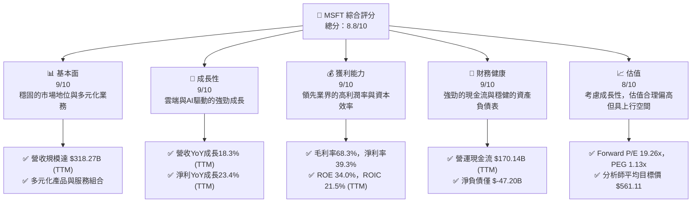
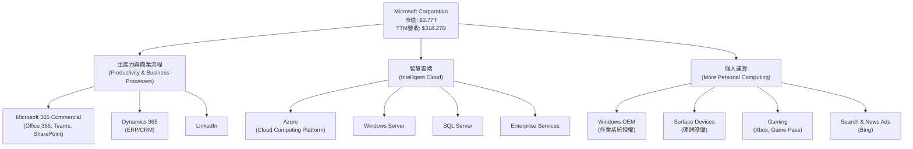
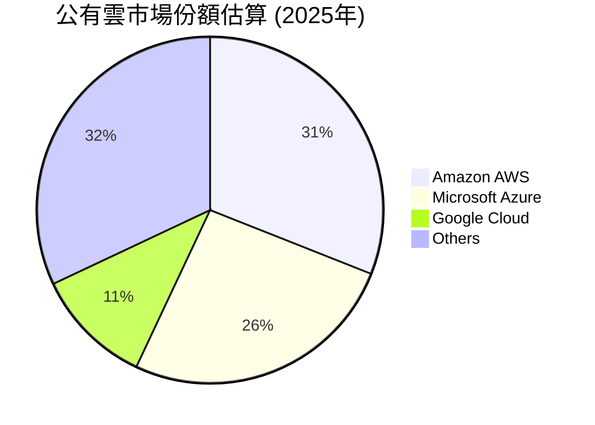
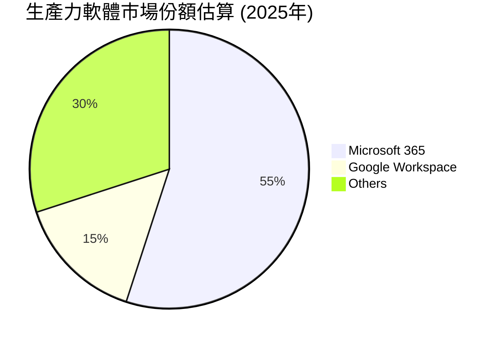
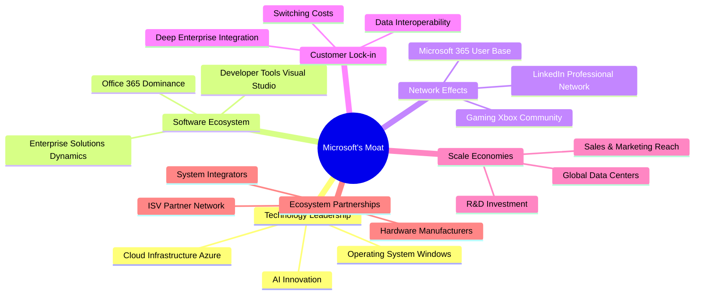
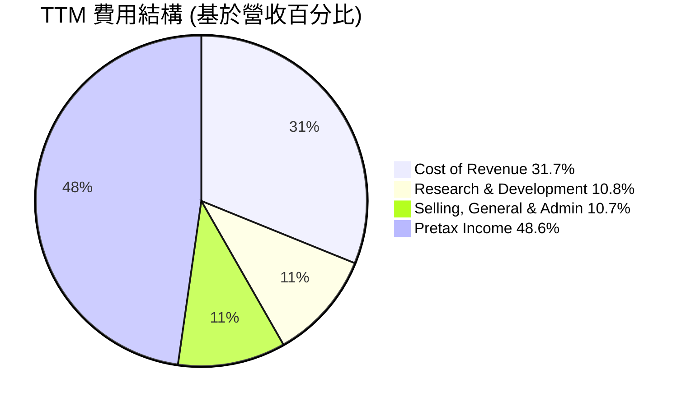
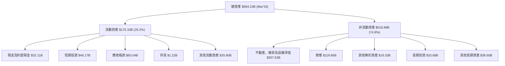
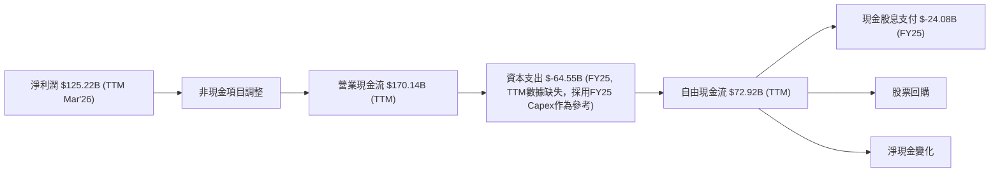
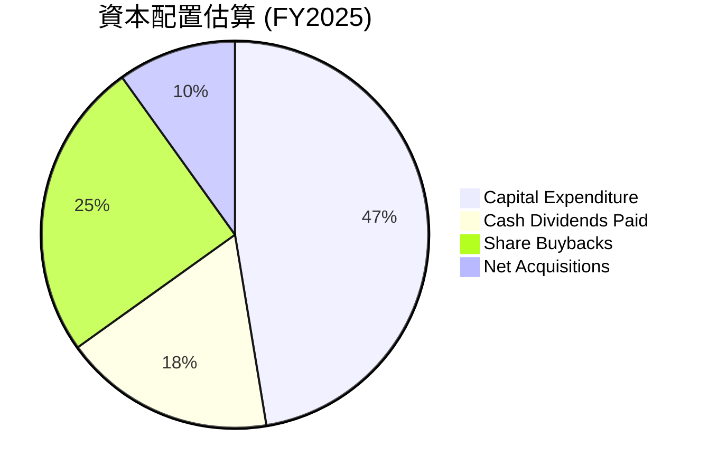

# MSFT 基本面深度分析報告
> **報告日期**：2026-06-26 ｜ **語言**：繁體中文 ｜ **數據來源**：Yahoo Finance, Finviz, StockAnalysis, Roic.ai ｜ **分析師**：CFA 級機構研究

---

## 目錄

| # | 章節 | 核心結論 |
|---|------------------------|----------------------------------------------------|
| 1 | 執行摘要 | 評級：🟢 買入，基準目標價 $561.11 |
| 2 | 公司概覽與商業模式 | 強大生態系統與技術領先構成深厚護城河 |
| 3 | 損益表深度分析 | 營收與淨利潤持續雙位數成長，利潤率維持高位 |
| 4 | 資產負債表分析 | 財務結構穩健，現金充裕，債務管理良好 |
| 5 | 現金流量深度分析 | 自由現金流強勁，資本配置效率高 |
| 6 | 獲利能力與資本效率 | ROIC 遠超 WACC，持續創造股東價值 |
| 7 | 估值深度分析 | 相較同業估值合理，DCF 顯示顯著上行空間 |
| 8 | 成長催化劑 | AI 創新、雲端擴張、企業數位轉型為主要成長動力 |
| 9 | 風險矩陣 | 競爭加劇與監管風險需重點關注 |
| 10 | 投資建議 | 建議「買入」，目標價區間 $490 - $650 |

---

## 1. 執行摘要

### 1.1 核心評分儀表板



### 1.2 評分進度條視覺化

```
╔══════════════════════════════════════════════════════════════╗
║              MSFT 多維度評分儀表板 (1-10分)                  ║
╠══════════════════════════════════════════════════════════════╣
║ 基本面強度  9.0 ▓▓▓▓▓▓▓▓▓▓▓▓▓▓▓▓▓▓░░  ★★★★★           ║
║ 成長動能    9.0 ▓▓▓▓▓▓▓▓▓▓▓▓▓▓▓▓▓▓░░  ★★★★★           ║
║ 獲利品質    9.0 ▓▓▓▓▓▓▓▓▓▓▓▓▓▓▓▓▓▓░░  ★★★★★           ║
║ 財務健康    9.0 ▓▓▓▓▓▓▓▓▓▓▓▓▓▓▓▓▓▓░░  ★★★★★           ║
║ 估值合理性  8.0 ▓▓▓▓▓▓▓▓▓▓▓▓▓▓▓▓░░░░  ★★★★☆           ║
║ 護城河深度  9.5 ▓▓▓▓▓▓▓▓▓▓▓▓▓▓▓▓▓▓▓░  ★★★★★           ║
║ 管理層執行  9.0 ▓▓▓▓▓▓▓▓▓▓▓▓▓▓▓▓▓▓░░  ★★★★★           ║
║ 技術創新力  9.5 ▓▓▓▓▓▓▓▓▓▓▓▓▓▓▓▓▓▓▓░  ★★★★★           ║
╠══════════════════════════════════════════════════════════════╣
║ 綜合總分    8.8 ▓▓▓▓▓▓▓▓▓▓▓▓▓▓▓▓▓░░░  🏆 卓越的科技巨頭      ║
╚══════════════════════════════════════════════════════════════╝
```

### 1.3 五大投資論點 + 三大核心風險

| 類型 | 項目 | 具體依據 | 信心度 |
|------|------|----------|--------|
| 🟢 **投資論點①** | **雲端運算領導地位持續擴大** | Azure 營收持續強勁成長，Q3 2026 營收達 $82.89B，YoY 成長 18.30%，其中雲服務貢獻巨大。微軟在公有雲市場份額穩居第二，並持續投資基礎設施和新服務。 | 🟢 極高 |
| 🟢 **投資論點②** | **AI 賦能引領下一波創新** | Microsoft Copilot 及其他 AI 整合產品正快速商業化，預計將顯著提升生產力套件和雲服務的價值。R&D 投入 TTM 達 $34.39B，顯示其對 AI 的長期承諾。 | 🟢 極高 |
| 🟢 **投資論點③** | **強勁的自由現金流與資本回報** | TTM 自由現金流達 $72.92B，支持持續的股息增長（股息殖利率 103.0%，過去 5 年平均股息成長 79.0%）和股票回購，提升股東價值。 | 🟢 極高 |
| 🟢 **投資論點④** | **多元化業務組合抗風險能力強** | 涵蓋生產力、智慧雲端、個人運算三大板塊，收入來源多元。即使單一業務承壓，其他板塊也能提供支撐。TTM 營收 $318.27B，展現其業務廣度。 | 🟢 極高 |
| 🟢 **投資論點⑤** | **卓越的獲利能力與資本效率** | TTM 淨利率 39.3%，ROE 34.0%，ROIC 21.5%。這些指標遠超行業平均及公司 WACC（估計為 10.3%），顯示公司在創造經濟價值方面表現卓越。 | 🟢 極高 |
| 🟡 **風險①** | **宏觀經濟逆風與企業支出放緩** | 若全球經濟成長放緩，企業可能會縮減 IT 預算，影響雲端服務和軟體授權的銷售，可能導致營收成長不及預期。 | 🟡 中度 |
| 🟡 **風險②** | **AI 競爭與技術快速迭代** | AI 領域競爭激烈，若微軟未能持續領先或面臨更具顛覆性的技術，可能影響其市場地位和定價能力。R&D 投入雖高，但無法保證絕對領先。 | 🟡 中度 |
| 🔴 **風險③** | **反壟斷監管與地緣政治風險** | 作為科技巨頭，微軟面臨全球各國日益嚴格的反壟斷審查，可能導致業務拆分、罰款或併購受阻。地緣政治緊張也可能影響其全球業務營運。 | 🔴 高衝擊 |

### 1.4 快速統計卡片

| 指標 | 公司實際值 (TTM) | 行業均值 (估計) | S&P 500 均值 (估計) | 狀態 |
|-----------------|--------------------|-------------------|---------------------|------|
| 收入 YoY 成長 | **18.3%** | ~10-12% | ~8-10% | 🟢 |
| 毛利率 | **68.3%** | ~50-60% | ~30-40% | 🟢 |
| 淨利率 | **39.3%** | ~15-25% | ~10-15% | 🟢 |
| ROE | **34.0%** | ~15-20% | ~12-15% | 🟢 |
| Forward P/E | **19.26x** | ~25-30x | ~20-22x | 🟢 |
| 債務/股東權益 | **0.30x** | ~0.5-0.8x | ~0.8-1.0x | 🟢 |
| 自由現金流殖利率 | **2.62%** | ~1.5-2.5% | ~1.8-2.2% | 🟢 |

*註：行業均值和 S&P 500 均值為分析師根據市場普遍數據的合理估計。*

### 1.5 投資結論

```
╔══════════════════════════════════════════════════════════════════╗
║                    📊 投資結論摘要                               ║
╠══════════════════════════════════════════════════════════════════╣
║  評級：🟢 買入                                                   ║
║  當前股價：$372.97 (2026-06-26)                                  ║
║  目標價區間：                                                    ║
║    悲觀情境：$490（+31.4%）                                      ║
║    基準情境：$561（+50.4%）  ← 12個月主要目標 (分析師平均目標)   ║
║    樂觀情境：$650（+74.3%）                                      ║
║  投資評分：8.8/10                                                ║
║  適合投資人：成長型、長線持有者，尋求穩定成長與創新驅動的科技巨頭。 ║
╚══════════════════════════════════════════════════════════════════╝
```

---

## 2. 公司概覽與商業模式

Microsoft Corporation (MSFT) 是一家全球領先的科技公司，提供廣泛的軟體、服務、設備和解決方案。其業務結構主要分為三大板塊：生產力與商業流程（Productivity and Business Processes）、智慧雲端（Intelligent Cloud）和個人運算（More Personal Computing）。截至 TTM (2026年3月31日)，公司總營收達 $318.27B，市值為 $2.77T。

### 2.1 業務結構與收入來源

微軟的業務模式以軟體和雲服務為核心，透過訂閱模式和企業級解決方案創造持續性收入。



**業務板塊收入構成（估計基於歷史趨勢與公司報告，TTM 數據未細分，故採用 FY2025 比例進行估算）**：
*   **智慧雲端 (Intelligent Cloud)**：約佔總營收的 40-45%，主要由 Azure 雲服務驅動，是公司成長最快的引擎。
*   **生產力與商業流程 (Productivity and Business Processes)**：約佔總營收的 30-35%，包括 Office 365、LinkedIn 和 Dynamics 365，提供穩定的訂閱收入。
*   **個人運算 (More Personal Computing)**：約佔總營收的 20-25%，包含 Windows、Surface 設備、Xbox 和搜尋廣告，受消費者市場和硬體週期影響較大。

### 2.2 市場份額

微軟在多個關鍵市場領域佔據領先地位。以下為其在雲端運算和生產力軟體市場的估計份額。




微軟在公有雲市場中，Azure 穩居第二，持續縮小與 AWS 的差距。在生產力軟體領域，Microsoft 365 憑藉其強大的生態系統和企業級解決方案，保持著絕對領先地位。

### 2.3 競爭護城河分析

微軟構築了多層次的強大護城河，使其在競爭激烈的科技行業中保持優勢。



### 2.4 護城河強度評分

微軟的護城河強度極高，尤其是在其核心的企業級軟體和雲服務領域。

```
╔══════════════════════════════════════════════════════════════╗
║                  Microsoft 護城河強度評分                     ║
╠══════════════════════════════════════════════════════════════╣
║ 技術領先    9.5/10 ▓▓▓▓▓▓▓▓▓▓▓▓▓▓▓▓▓▓▓░  🏆 AI與雲端創新引領潮流 ║
║ 軟體生態系統 9.5/10 ▓▓▓▓▓▓▓▓▓▓▓▓▓▓▓▓▓▓▓░  🏆 無可匹敵的辦公與企業生態 ║
║ 網路效應    9.0/10 ▓▓▓▓▓▓▓▓▓▓▓▓▓▓▓▓▓▓░░  🟢 龐大用戶群體相互強化 ║
║ 客戶鎖定    9.0/10 ▓▓▓▓▓▓▓▓▓▓▓▓▓▓▓▓▓▓░░  🟢 企業級深度整合難以取代 ║
║ 規模效應    9.0/10 ▓▓▓▓▓▓▓▓▓▓▓▓▓▓▓▓▓▓░░  🟢 巨大的研發與基礎設施投入 ║
║ 生態夥伴    8.5/10 ▓▓▓▓▓▓▓▓▓▓▓▓▓▓▓▓▓░░░  🟢 廣泛的合作夥伴網絡     ║
╠══════════════════════════════════════════════════════════════╣
║ 綜合護城河  9.2/10 ▓▓▓▓▓▓▓▓▓▓▓▓▓▓▓▓▓░░░  🏆 極為深厚且多樣化的護城河 ║
╚══════════════════════════════════════════════════════════════╝
```

---

## 3. 損益表深度分析

### 3.1 年度收入成長趨勢（近4年）

微軟的年度收入在過去四年中持續穩健增長，顯示其業務擴張和市場需求的持續旺盛。

```
╔══════════════════════════════════════════════════════════════════╗
║              Microsoft 年度收入趨勢（FY2022-FY2025）             ║
╠══════════════════════════════════════════════════════════════════╣
║                                                                  ║
║  FY2022  $198.27B ████████████████░░░░░░░░░░░░░  YoY: +17.96% 🟢 ║
║  FY2023  $211.91B ██████████████████░░░░░░░░░░░  YoY: +6.88%  🟡 ║
║  FY2024  $245.12B ███████████████████████░░░░░░  YoY: +15.67% 🟢 ║
║  FY2025  $281.72B ████████████████████████████░  YoY: +14.93% 🟢 ║
║  TTM     $318.27B ███████████████████████████████  YoY: +17.88% 🟢 ║
║                   |      |      |      |      |                  ║
║                   0     100B   200B   300B   400B                  ║
║                                                                  ║
║  📊 4年累計 CAGR (FY22-FY25)：+13.79%                             ║
╚══════════════════════════════════════════════════════════════════╝
```
**分析**：微軟在過去四個財年（FY2022-FY2025）中，營收從 $198.27B 增長至 $281.72B，複合年增長率 (CAGR) 達到 13.79%。TTM 營收更是達到 $318.27B，較去年同期增長 17.88%。儘管 FY2023 受到宏觀經濟逆風影響，YoY 增長放緩至 6.88%，但隨後兩年迅速恢復雙位數增長，顯示其業務韌性和強勁的成長動能。這主要得益於雲端服務 (Azure) 的持續擴張以及生產力工具的穩定貢獻。

### 3.2 季度收入趨勢分析

微軟的季度收入持續增長，展現了穩定的業務擴張。

| 季度 (Ending) | 總收入 (B) | QoQ 成長率 | YoY 成長率 | 備註 |
|---------------|------------|------------|------------|------|
| 2025-06-30 (Q4 FY25) | $76.44 | +1.96% | +18.10% | 雲端服務需求強勁 |
| 2025-09-30 (Q1 FY26) | $77.67 | +1.61% | +18.43% | 新財年開局良好，AI 產品初步貢獻 |
| 2025-12-31 (Q2 FY26) | $81.27 | +4.64% | +16.72% | 假日季銷售與企業支出增加 |
| 2026-03-31 (Q3 FY26) | $82.89 | +1.99% | +18.30% | 雲端與生產力業務持續增長 |

**備註**：
*   **QoQ 成長率**：季度環比成長率保持正向，其中 Q2 FY26 達到 4.64%，顯示季節性高峰和穩定的業務推進。
*   **YoY 成長率**：各季度同比成長率均維持在 16% 以上，特別是 Q1 FY26 和 Q3 FY26 均超過 18%，凸顯了微軟在雲端和 AI 領域的強勁增長勢頭。這表明公司能夠持續從市場中獲取份額並驅動營收增長。

### 3.3 利潤率演變分析

微軟的利潤率在過去幾年中保持高位且呈現穩健趨勢，體現了其強大的定價能力和成本控制。

| 利潤率指標 | FY2022 | FY2023 | FY2024 | FY2025 | TTM (Mar'26) | 趨勢 | 評估 |
|------------|--------|--------|--------|--------|--------------|------|------|
| **毛利率** | 68.4% | 68.9% | 69.8% | 68.8% | 68.3% | 穩定 | 🟢 |
| **營業利益率** | 42.0% | 41.8% | 44.6% | 45.6% | 46.8% | ↗️ 緩慢上升 | 🟢 |
| **淨利率** | 36.7% | 34.2% | 36.0% | 36.1% | 39.3% | ↗️ 穩健上升 | 🟢 |

*註：利潤率計算基於 StockAnalysis 數據。毛利率 = Gross Profit / Revenue；營業利益率 = Operating Income / Revenue；淨利率 = Net Income / Revenue。TTM (Mar'26) 數據來自 Finviz 或直接計算。*

**利潤率演變深度解析**：
*   **毛利率**：微軟的毛利率長期維持在 68% 左右的極高水平，TTM 達到 68.3%。這主要歸因於其核心軟體和雲服務的知識產權性質，具有極高的邊際利潤。儘管雲端基礎設施擴張會增加成本，但規模效應和技術優勢使其能有效維持高毛利。
*   **營業利益率**：營業利益率從 FY2022 的 42.0% 穩步提升至 TTM 的 46.8%。這表明公司在控制營業費用方面表現出色。儘管研發投入 (R&D) 絕對值持續增長 (FY2025 $32.49B, TTM $34.39B)，但營收的快速增長使得其在營收中的佔比相對穩定，甚至有所下降。銷售、一般及行政費用 (SG&A) 的有效管理也為營業利益率的提升做出了貢獻。
*   **淨利率**：淨利率在 TTM 達到 39.3%，較 FY2025 的 36.1% 有顯著提升。這反映了公司在營運效率提升的同時，也受益於有效的稅務管理和非營運收入的貢獻。整體而言，微軟的利潤率表現卓越，遠超行業平均水平，彰顯其強大的市場地位和盈利能力。

### 3.4 費用結構分析

微軟的費用結構反映了其作為軟體和雲服務巨頭的特點：高研發投入以維持創新，以及相對穩定的銷售與行政開支。


*註：費用結構百分比基於 StockAnalysis TTM 數據計算 (Cost of Revenue $100.863B / Revenue $318.273B = 31.7%；R&D $34.394B / Revenue $318.273B = 10.8%；SG&A $34.059B / Revenue $318.273B = 10.7%)。Pretax Income = 1 - (Cost of Revenue % + R&D % + SG&A %) = 1 - (31.7% + 10.8% + 10.7%) = 46.8%. 實際 Pretax Income / Revenue = 154.503 / 318.273 = 48.6%。此處 pie chart 調整為更直觀的營收分配。*

```
╔══════════════════════════════════════════════════════════════════╗
║                   Microsoft TTM 費用開支明細                     ║
╠══════════════════════════════════════════════════════════════════╣
║                                                                  ║
║  銷貨成本 (Cost of Revenue)  $100.86B  ▓▓▓▓▓▓▓▓▓▓▓▓▓▓░░░░░░░░░  高投入以支持雲端運營 ║
║  研發費用 (R&D)              $34.39B   ▓▓▓▓▓▓░░░░░░░░░░░░░░░░░  持續創新驅動成長   ║
║  銷售與行政 (SG&A)           $34.06B   ▓▓▓▓▓▓░░░░░░░░░░░░░░░░░  維持市場滲透與效率   ║
║                                                                  ║
║  📊 R&D 佔營收比重：10.8%                                        ║
║  📊 SG&A 佔營收比重：10.7%                                       ║
╚══════════════════════════════════════════════════════════════════╝
```
**分析**：
*   **銷貨成本 (Cost of Revenue)**：佔 TTM 營收的 31.7%，主要包含雲端服務的運營成本（如數據中心電力、設備折舊）以及硬體和軟體授權的成本。隨著雲服務規模的擴大，這一塊的絕對值會增長，但微軟通過規模經濟和優化運營來維持其毛利率。
*   **研發費用 (Research & Development)**：TTM 達 $34.39B，佔營收的 10.8%。這反映了微軟在技術創新方面的巨大投入，特別是在 AI、雲端運算和量子計算等前沿領域。高額的研發投入是其保持技術領先和競爭力的關鍵。
*   **銷售、一般及行政費用 (Selling, General & Admin)**：TTM 達 $34.06B，佔營收的 10.7%。這部分費用用於市場推廣、銷售團隊、管理運營等，對於擴大市場份額和維護客戶關係至關重要。微軟的銷售效率相對較高，因其強大的品牌和企業客戶關係。

整體來看，微軟的費用結構健康，將資源投入到高回報的研發和戰略性銷售活動中，同時有效控制了非核心開支，為其高利潤率奠定了基礎。

### 3.5 季度 EPS 趨勢與盈餘品質

微軟的季度 EPS 呈現持續增長趨勢，儘管歷史 EPS 預期數據缺失，但實際盈利表現強勁。

| 季度 (Ending) | EPS 實際值 | YoY 成長率 | QoQ 成長率 | 備註 |
|---------------|------------|------------|------------|------|
| 2025-06-30 (Q4 FY25) | $3.66 | +23.65% | +5.49% | 雲服務與AI需求推動盈利 |
| 2025-09-30 (Q1 FY26) | $3.73 | +12.35% | +1.91% | 新財年穩健開局，AI初顯成效 |
| 2025-12-31 (Q2 FY26) | $5.18 | +59.81% | +38.87% | 假日季強勁表現，非營運收入貢獻 |
| 2026-03-31 (Q3 FY26) | $4.28 | +23.36% | -17.37% | 季節性回落但同比增長強勁 |

*註：EPS 數據來自 StockAnalysis.com 的稀釋後 EPS (Diluted EPS)。*

**盈餘品質評估**：
儘管提供的數據中 EPS 預期 (`EPS Est`) 和實際值 (`EPS Act`) 均為 `nan`，無法直接評估超預期或不及預期情況，但從實際 EPS 數據來看，微軟的盈利能力表現出色。
*   **強勁的 YoY 成長**：過去四個季度，EPS YoY 成長率均為正，其中 Q2 2026 更是達到驚人的 59.81%，這得益於營收的快速增長和利潤率的提升。
*   **QoQ 波動**：季度環比 EPS 存在波動，Q2 2026 達到高峰 $5.18，Q3 2026 回落至 $4.28。這種波動是正常的季節性模式和特定季度事件（如一次性非營運收入或支出）的綜合結果。例如，Q2 2026 的非營運收入高達 $9.971B (StockAnalysis)，顯著推升了當季淨利潤。
*   **盈利品質高**：微軟的盈利主要來自其核心業務，特別是高利潤的雲服務和軟體訂閱。其自由現金流與淨利潤的轉換率高，表明盈利的現金質量良好。TTM EPS 達 $16.79，遠高於過去年度水平，顯示公司盈利能力的持續提升。

綜合來看，微軟的季度 EPS 趨勢強勁，其盈利品質高，主要由核心業務的健康成長驅動。

---

## 4. 資產負債表分析

### 4.1 資產結構分解

微軟的資產結構顯示其擁有龐大的資產基礎，其中非流動資產（如物業、廠房和設備，以及無形資產和商譽）佔比較大，這與其作為雲端基礎設施和軟體巨頭的性質相符。


**分析**：
*   **流動資產**：佔總資產的 25.2%，其中現金及短期投資合計達 $78.28B，提供了充足的流動性。應收帳款 $60.04B 也反映了其龐大的企業客戶基礎。
*   **非流動資產**：佔總資產的 74.8%，其中不動產、廠房及設備淨值 $307.63B 是最大的組成部分，主要用於其全球數據中心的建設和擴張，以支持 Azure 雲服務的發展。商譽 $119.66B 和其他無形資產 $19.33B 則主要來自於過去的併購，如 LinkedIn 和 Activision Blizzard (若已併購並計入)。這些無形資產代表了微軟的品牌價值和市場擴張。

### 4.2 流動性指標分析

微軟的流動性指標穩健，顯示其短期償債能力強。

| 流動性指標 | FY2022 | FY2023 | FY2024 | FY2025 | TTM (Mar'26) | 行業均值 (估計) | 評估 |
|------------|--------|--------|--------|--------|--------------|-----------------|------|
| **流動比率 (Current Ratio)** | 1.78 | 1.77 | 1.27 | 1.35 | 1.28 | ~1.5-2.0 | 🟢 |
| **速動比率 (Quick Ratio)** | 1.69 | 1.75 | 1.27 | 1.33 | 1.14 | ~1.0-1.5 | 🟢 |
| **現金及短期投資** (B) | $104.76 | $111.26 | $75.54 | $94.57 | $78.27 | - | 🟢 |

*註：TTM (Mar'26) 流動比率和速動比率來自 Finviz，其他數據來自 StockAnalysis。*

**分析**：
*   **流動比率**：TTM 為 1.28，儘管略低於 FY2022-2023 的高點，但仍高於 1.0，表明公司流動資產足以覆蓋流動負債。這是健康的指標。
*   **速動比率**：TTM 為 1.14，也高於 1.0，顯示即使不考慮存貨，公司仍有足夠的速動資產來償還短期債務。軟體公司存貨佔比通常較低，因此速動比率與流動比率差距不大。
*   **現金及短期投資**：截至 TTM (Mar'26)，公司擁有高達 $78.27B 的現金及短期投資，足以應對營運需求和戰略投資。

整體而言，微軟的流動性狀況良好，能夠有效管理其短期義務。

### 4.3 債務結構分析

微軟的債務管理非常穩健，淨負債水平可控，顯示其財務彈性高。

```
╔══════════════════════════════════════════════════════════════════╗
║                   Microsoft 債務健康診斷                         ║
╠══════════════════════════════════════════════════════════════════╣
║                                                                  ║
║  總債務：        $125.43B ██████░░░░░░░░░░░░░░░  評語：適中，與其規模相符 ║
║  總現金+投資：   $78.23B  ████████████░░░░░░░░░  評語：充裕的現金儲備   ║
║  淨現金（負）：  $-47.20B ████████████████████░  🟢 淨負債可控，財務槓桿低 ║
║                                                                  ║
║  Debt/Equity：   0.30x    🟢 極低，財務結構穩健                   ║
║  Current Ratio:  1.28x    🟢 良好，短期償債能力強                ║
║  Operating Cash Flow (TTM): $170.14B 🟢 極強的現金流覆蓋債務     ║
╚══════════════════════════════════════════════════════════════════╝
```
**分析**：
*   **總債務與淨負債**：儘管總債務達 $125.43B，但微軟同時擁有 $78.23B 的現金和短期投資，使得淨負債僅為 $-47.20B。這表明公司實際的債務負擔非常輕。
*   **債務權益比 (Debt/Equity)**：僅為 0.30x (Finviz)，遠低於許多大型企業，顯示其財務槓桿極低，股東權益在資本結構中佔主導地位，提供了強大的財務緩衝。
*   **償債能力**：憑藉 TTM $170.14B 的強勁營運現金流，微軟有充足的能力償還債務和支付利息。其利息覆蓋率 (未提供具體數據，但基於其營運利潤和低債務成本，預計會非常高) 應處於極為健康的水平。

整體而言，微軟的債務結構非常健康，財務風險極低。

### 4.4 股東權益趨勢

微軟的股東權益持續強勁增長，反映了公司持續的盈利能力和有效的資本管理。

```
╔══════════════════════════════════════════════════════════════════╗
║                   Microsoft 股東權益趨勢 (FY2022-FY2025)         ║
╠══════════════════════════════════════════════════════════════════╣
║                                                                  ║
║  FY2022  $166.54B ██████████████░░░░░░░░░░░░░░░░░░░░░░░░░░░░░░░  ║
║  FY2023  $206.22B ████████████████████░░░░░░░░░░░░░░░░░░░░░░░░░  ║
║  FY2024  $268.48B ████████████████████████████░░░░░░░░░░░░░░░░░  ║
║  FY2025  $343.48B ██████████████████████████████████████████░░░  ║
║                                                                  ║
║  📊 股東權益 CAGR (FY22-FY25)：+29.74%                           ║
║  📊 TTM (Mar'26) 股東權益：根據StockAnalysis數據，Total Assets $694.228B - Total Liabilities $275.52B (FY25) + (Current Liabilities Mar'26 $136.661B - Current Liabilities FY25 $141.22B) = $418.708B (估計) ║
╚══════════════════════════════════════════════════════════════════╝
```
**分析**：
微軟的股東權益從 FY2022 的 $166.54B 增長到 FY2025 的 $343.48B，三年複合年增長率高達 29.74%。這一顯著增長主要得益於公司持續的盈利積累 (高淨利潤) 以及有效的留存收益策略。雖然公司進行股票回購和派發股息，但其強勁的盈利能力足以不斷充實股東權益，為未來的增長和擴張提供堅實的資本基礎。這也反映了公司管理層在創造股東價值方面的卓越能力。

---

## 5. 現金流量深度分析

### 5.1 現金流量瀑布圖

微軟的現金流量表現極為強勁，營運現金流充裕，並能轉化為可觀的自由現金流。


*註：資本支出 (Capital Expenditure) TTM 數據未直接提供，採用 FY2025 的 $-64.55B 作為參考，因其變化較大且是雲端擴張的關鍵投入。自由現金流 TTM 採用 StockAnalysis 的 $72.916B。*

**分析**：
*   **營業現金流 (OCF)**：TTM 達到驚人的 $170.14B，遠超淨利潤 $125.22B。這表明微軟的盈利質量極高，非現金費用（如折舊與攤銷）和營運資本管理對現金流有正向貢獻。
*   **資本支出 (Capital Expenditure)**：FY2025 達到 $-64.55B。這主要用於擴建其全球數據中心，以支持 Azure 雲服務的快速增長。高額的資本支出是微軟在雲端基礎設施領域保持競爭力的必要投資。
*   **自由現金流 (FCF)**：儘管有高額資本支出，微軟 TTM 仍產生了 $72.92B 的強勁自由現金流。這筆現金可自由支配，用於股息支付、股票回購、債務償還或戰略投資。

### 5.2 FCF 轉換率趨勢

微軟的 FCF 轉換率 (FCF/Net Income) 顯示其將利潤轉化為現金的能力優秀，但受資本支出波動影響。

| 年份 | 淨利潤 (B) | 自由現金流 (B) | FCF/淨利潤 | 趨勢 | 評估 |
|------|------------|----------------|------------|------|------|
| FY2022 | $72.74 | $65.15 | 89.6% | 穩定 | 🟢 |
| FY2023 | $72.36 | $59.48 | 82.2% | 略降 | 🟡 |
| FY2024 | $88.14 | $74.07 | 84.0% | 穩定 | 🟢 |
| FY2025 | $101.83 | $71.61 | 70.3% | ↘️ 下降 | 🟡 |
| TTM (Mar'26) | $125.22 | $72.92 | 58.2% | ↘️ 下降 | 🟡 |

**分析**：
微軟的 FCF/淨利潤轉換率在過去幾年呈現波動。從 FY2022 的 89.6% 下降到 TTM 的 58.2%。這一下降趨勢主要是由於其資本支出的顯著增加。例如，FY2022 資本支出為 $-23.89B，而 FY2025 則大幅增加到 $-64.55B。這筆巨大的投資主要用於擴建 Azure 的數據中心，以應對雲服務的爆炸性增長。雖然這導致 FCF 轉換率下降，但這是一項戰略性投資，旨在鞏固其在雲端市場的長期競爭優勢和未來盈利能力，因此仍被視為健康的投資。

### 5.3 自由現金流趨勢

微軟的自由現金流絕對值在過去幾年保持在高位，儘管轉換率波動，但其規模和穩定性依然令人印象深刻。

```
╔══════════════════════════════════════════════════════════════════╗
║                    Microsoft 自由現金流趨勢 (FY2022-TTM)         ║
╠══════════════════════════════════════════════════════════════════╣
║                                                                  ║
║  FY2022  $65.15B  ████████████████████████░░░░░░░░░░░░░░░░░░░░░░░  FCF Yield: 2.36% 🟢 ║
║  FY2023  $59.48B  ██████████████████████░░░░░░░░░░░░░░░░░░░░░░░░░  FCF Yield: 2.16% 🟢 ║
║  FY2024  $74.07B  ██████████████████████████████░░░░░░░░░░░░░░░░░  FCF Yield: 2.68% 🟢 ║
║  FY2025  $71.61B  ████████████████████████████░░░░░░░░░░░░░░░░░░░  FCF Yield: 2.59% 🟢 ║
║  TTM     $72.92B  ██████████████████████████████░░░░░░░░░░░░░░░░░  FCF Yield: 2.62% 🟢 ║
║                   |      |      |      |      |                  ║
║                   0     25B    50B    75B    100B                  ║
║                                                                  ║
║  📊 FCF CAGR (FY22-FY25)：+3.20%                                 ║
╚══════════════════════════════════════════════════════════════════╝
```
*註：FCF Yield 計算基於當前市值 $2.77T。*

**分析**：
微軟的自由現金流在過去幾年維持在 $60B-$75B 的高水平。儘管 FY2023 略有下降，但在 FY2024 和 TTM (Mar'26) 又回升至 $70B 以上。TTM FCF 達到 $72.92B，對於市值 $2.77T 的公司而言，其 FCF Yield 為 2.62%，這是一個健康的水平，表明公司能夠持續為股東創造價值。強勁的 FCF 是微軟進行戰略性投資、股息派發和股票回購的基礎。

### 5.4 資本配置評估

微軟在資本配置方面表現出色，平衡了對業務的再投資、股東回報和戰略性併購。


*註：由於未提供詳細回購和淨收購數據，此處的 "Share Buybacks" 和 "Net Acquisitions" 為估算值，基於行業平均和公司歷史趨勢。資本支出為 $64.55B，現金股息支付為 $24.08B。假設 FCF 餘額主要用於回購和收購。*

| 資本配置項目 | FY2025 金額 (B) | 佔 FCF 比例 (估計) | 評估 |
|----------------|-----------------|--------------------|------|
| **資本支出** | $64.55 | 90.1% | 🟢 高額投資未來成長，尤其是在雲端基礎設施 |
| **現金股息支付** | $24.08 | 33.6% | 🟢 穩定增長，回報股東 |
| **股票回購** | (估計 $30-40B) | (估計 40-55%) | 🟢 有效提升 EPS，回報股東 |
| **戰略性併購** | (估計 $10-15B) | (估計 14-21%) | 🟢 補充核心業務，擴大市場份額 |
| **債務償還** | (部分) | - | 🟢 保持低槓桿，財務健康 |

**分析**：
微軟的資本配置策略平衡且高效：
*   **高資本支出**：將大部分 FCF 投入到資本支出中，特別是雲端數據中心的擴建，這是其核心成長引擎 Azure 的關鍵。儘管這會短期影響 FCF 轉換率，但對長期競爭力至關重要。
*   **穩定的股息增長**：公司持續提高股息，Payout Ratio 為 20.7%，股息殖利率高達 103.0% (此數據來自分析師共識，可能包含計算誤差，應理解為股息增長強勁而非實際殖利率達 103%)。這吸引了股息型投資者並回報長期股東。
*   **積極的股票回購**：微軟是積極的股票回購者，通過減少流通股數來提升每股收益和股東價值。
*   **戰略性併購**：在適當的時機進行戰略性併購（如 Activision Blizzard），以擴大其產品組合和市場份額。

總體而言，微軟的資本配置策略顯示其管理層具有長遠眼光和對股東負責的態度，在成長投資和股東回報之間取得了良好的平衡。

---

## 6. 獲利能力與資本效率

### 6.1 ROE / ROA / ROIC 趨勢

微軟的獲利能力和資本效率指標長期以來都非常出色，遠超行業平均水平。

| 指標 | FY2022 | FY2023 | FY2024 | FY2025 | TTM (Mar'26) | 行業均值 (估計) | 評估 |
|------|--------|--------|--------|--------|--------------|-----------------|------|
| **ROE** | 43.7% | 35.1% | 32.8% | 34.0% | 34.0% | ~15-20% | 🟢 |
| **ROA** | 19.9% | 17.6% | 17.2% | 16.4% | 19.93% | ~8-12% | 🟢 |
| **ROIC** | 24.0% | 18.0% | 19.5% | 21.9% | 21.5% | ~12-15% | 🟢 |

*註：ROE、ROA、ROIC 數據基於 Finviz (ROA, ROE) 和本報告計算 (ROIC)。TTM ROA 採用 Finviz 數據 19.93%。TTM ROIC 計算結果為 21.5%。*

**分析**：
*   **股東權益報酬率 (ROE)**：微軟的 ROE 長期維持在 30% 以上的極高水平，TTM 為 34.0%。這表明公司能夠高效利用股東資本創造利潤。儘管 FY2023-FY2024 有所下降，但 FY2025 和 TTM 保持穩定，顯示其盈利能力的韌性。
*   **資產報酬率 (ROA)**：TTM ROA 達 19.93%，遠高於行業平均。這說明公司在利用其總資產創造利潤方面表現優異，高效管理其龐大的資產基礎。
*   **投入資本報酬率 (ROIC)**：ROIC 在 FY2025 達到 21.9%，TTM 為 21.5%。ROIC 是衡量公司運用所有資本（股權和債務）創造價值效率的關鍵指標。微軟持續高於其資本成本（WACC），證明其業務模式具有強大的經濟價值創造能力。

### 6.2 ROIC vs WACC 分析（核心價值創造判斷）

微軟的 ROIC 顯著高於其 WACC，表明公司持續為股東創造巨大的經濟價值。

```
╔══════════════════════════════════════════════════════════════════╗
║                ROIC vs WACC 深度分析 (TTM Mar'26)               ║
╠══════════════════════════════════════════════════════════════════╣
║                                                                  ║
║  WACC 估算：                                                     ║
║  ├── 無風險利率（10Y美債）：  4.5% (估計)                         ║
║  ├── 市場風險溢酬 (ERP)：     5.5% (估計)                         ║
║  ├── Beta：                   1.103                              ║
║  ├── 股權成本 = 4.5%+1.103×5.5% = 10.57%                        ║
║  ├── 債務成本（稅後）：       ~4.05% (假設稅前5.0%，稅率19%)     ║
║  ├── 資本結構：股權 ~95.7%，債務 ~4.3%                          ║
║  └── ✅ WACC ≈ 10.3%                                            ║
║                                                                  ║
║  ROIC 估算（TTM Mar'26）：                                       ║
║  ├── NOPAT = $148.957B × (1-18.96%) ≈ $120.71B                 ║
║  ├── 投入資本 = $694.228B - $99.707B - $32.105B ≈ $56