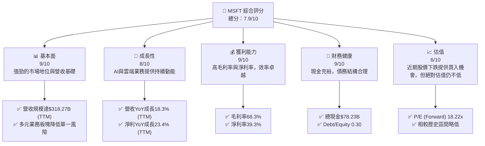
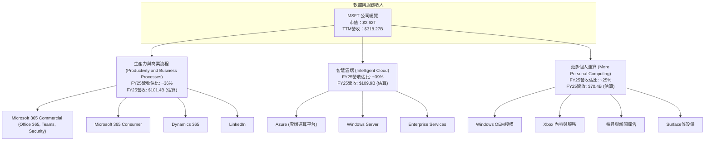
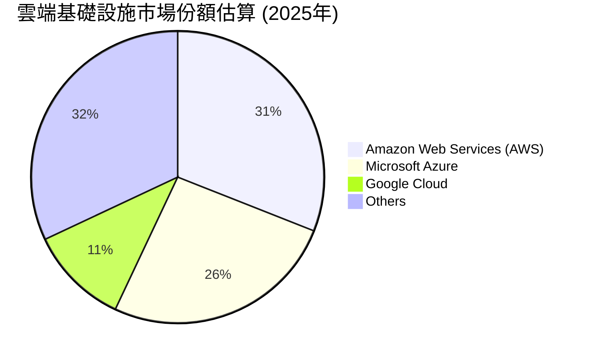
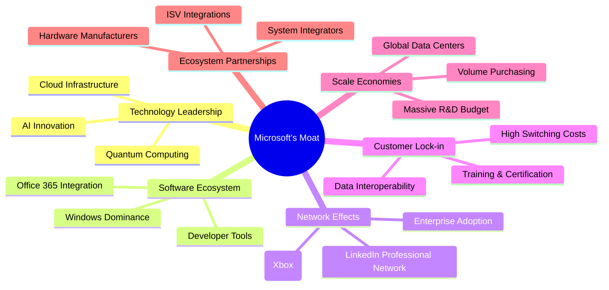
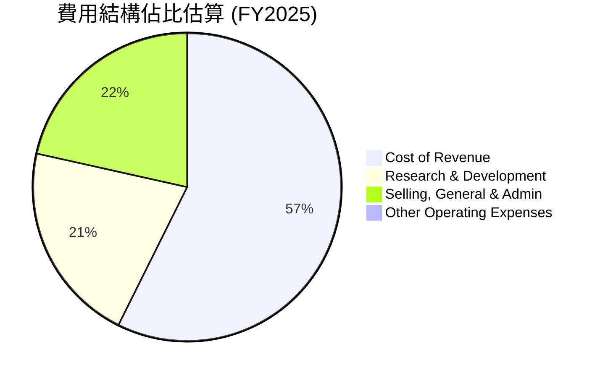
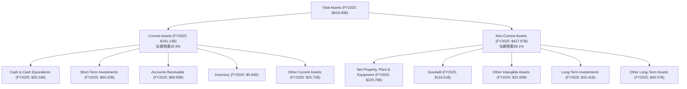
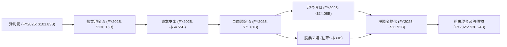
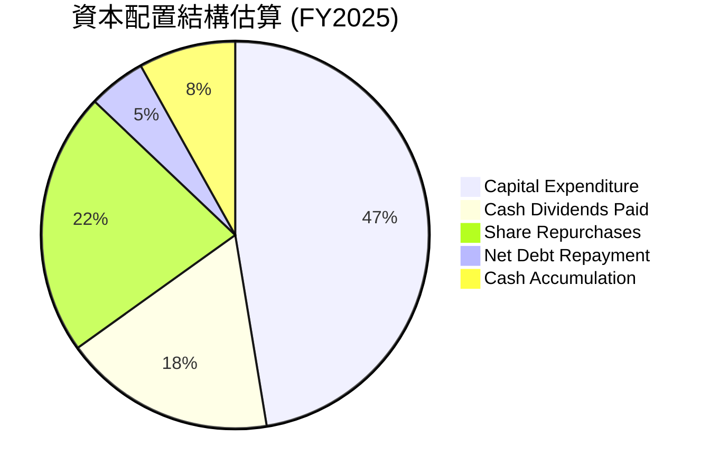
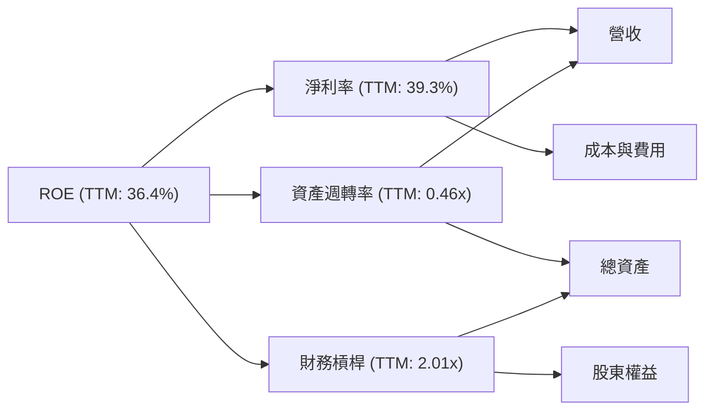

# MSFT 基本面深度分析報告
> **報告日期**：2026-06-26 ｜ **語言**：繁體中文 ｜ **數據來源**：Yahoo Finance, Finviz, StockAnalysis, Roic.ai ｜ **分析師**：CFA 級機構研究

## 目錄

| # | 章節 | 核心結論 |
|---|------------------------|------------------------------------------------------------------------------------------------------------------|
| 1 | 執行摘要 | 評級：🟡 持有；目標價區間：$450 - $580 |
| 2 | 公司概覽與商業模式 | 強大的軟體生態系統與網路效應構建深厚護城河 |
| 3 | 損益表深度分析 | 營收與淨利持續穩健成長，利潤率維持高位 |
| 4 | 資產負債表分析 | 財務結構穩健，現金充裕，債務可控 |
| 5 | 現金流量深度分析 | 自由現金流產生能力強勁，資本配置效率高 |
| 6 | 獲利能力與資本效率 | ROIC顯著高於WACC，持續創造股東價值 |
| 7 | 估值深度分析 | 當前估值具吸引力，但市場情緒影響較大 |
| 8 | 成長催化劑 | AI創新與雲端業務持續驅動未來成長 |
| 9 | 風險矩陣 | 宏觀經濟逆風與監管風險為主要考量 |
| 10 | 投資建議 | 具備長期投資價值，短期需關注市場波動 |

---

## 1. 執行摘要

### 1.1 核心評分儀表板



### 1.2 評分進度條視覺化

```
╔══════════════════════════════════════════════════════════════╗
║              MSFT 多維度評分儀表板 (1-10分)                  ║
╠══════════════════════════════════════════════════════════════╣
║ 基本面強度  9.0 ▓▓▓▓▓▓▓▓▓▓▓▓▓▓▓▓▓▓▓▓░░  ★★★★★           ║
║ 成長動能    8.0 ▓▓▓▓▓▓▓▓▓▓▓▓▓▓▓▓░░░░░░  ★★★★☆           ║
║ 獲利品質    9.0 ▓▓▓▓▓▓▓▓▓▓▓▓▓▓▓▓▓▓▓▓░░  ★★★★★           ║
║ 財務健康    9.0 ▓▓▓▓▓▓▓▓▓▓▓▓▓▓▓▓▓▓▓▓░░  ★★★★★           ║
║ 估值合理性  6.0 ▓▓▓▓▓▓▓▓▓▓▓▓░░░░░░░░░░  ★★★☆☆           ║
║ 護城河深度  9.5 ▓▓▓▓▓▓▓▓▓▓▓▓▓▓▓▓▓▓▓▓░░  ★★★★★           ║
║ 管理層執行  9.0 ▓▓▓▓▓▓▓▓▓▓▓▓▓▓▓▓▓▓▓▓░░  ★★★★★           ║
║ 技術創新力  9.5 ▓▓▓▓▓▓▓▓▓▓▓▓▓▓▓▓▓▓▓▓░░  ★★★★★           ║
╠══════════════════════════════════════════════════════════════╣
║ 綜合總分    7.9 ▓▓▓▓▓▓▓▓▓▓▓▓▓▓▓▓░░░░░░  🏆 具備長期投資價值，短期波動提供買入機會              ║
╚══════════════════════════════════════════════════════════════════╝
```

### 1.3 五大投資論點 + 三大核心風險

| 類型 | 項目 | 具體依據 | 信心度 |
|------|------|----------|--------|
| 🟢 **投資論點①** | **雲端業務持續強勁成長** | Azure作為全球第二大雲端服務提供商，受益於企業數位轉型與AI基礎設施需求。最新TTM營收YoY成長18.3%，其中雲端服務貢獻巨大。 | 🟢 極高 |
| 🟢 **投資論點②** | **AI技術引領創新，賦能全產品線** | Microsoft Copilot系列產品及對OpenAI的深度整合，有望推動Office 365、Azure、Windows等核心產品的升級與變現。研發費用TTM達$34.39B，顯示其對AI的投入。 | 🟢 極高 |
| 🟢 **投資論點③** | **穩健的軟體生態系統與客戶黏性** | Windows作業系統、Office生產力套件在全球市場佔據主導地位，形成強大的客戶鎖定效應。Microsoft 365商業訂閱收入持續增長。 | 🟢 極高 |
| 🟢 **投資論點④** | **優異的財務表現與現金流生成能力** | TTM毛利率68.3%、淨利率39.3%，FY2025自由現金流達$71.61B，顯示其強大的獲利能力與財務韌性。 | 🟢 極高 |
| 🟢 **投資論點⑤** | **合理且具吸引力的估值** | 鑒於公司強勁的成長前景和穩固的市場地位，當前Forward P/E 18.22x相較於其歷史平均和成長潛力，呈現出較好的投資價值。 | 🟢 高 |
| 🟡 **風險①** | **宏觀經濟逆風與企業IT預算緊縮** | 經濟下行可能導致企業減少IT支出，影響雲端服務和軟體銷售增長。全球通脹與高利率環境可能抑制企業擴張意願。 | 🟡 中度 |
| 🔴 **風險②** | **AI競爭與變現挑戰** | AI領域競爭激烈，來自Google、Amazon等巨頭的競爭壓力大。AI產品的商業化路徑與定價策略仍需市場驗證，可能不如預期。 | 🔴 高衝擊 |
| 🟡 **風險③** | **監管審查與反壟斷風險** | Microsoft在多個市場（作業系統、瀏覽器、雲端服務）擁有主導地位，可能面臨各國政府的反壟斷調查和更嚴格的監管，影響其業務擴張與併購策略。 | 🟡 中度 |

### 1.4 快速統計卡片

| 指標 | 公司實際值 | 行業均值（軟體-基礎設施） | S&P 500 均值 | 狀態 |
|-------------------|-------------|------------------------------|--------------|------|
| 收入 YoY 成長 (TTM) | **18.3%** | ~12-15%                      | ~8-10%       | 🟢 |
| 毛利率 (TTM) | **68.3%** | ~60-70%                      | ~40-45%      | 🟢 |
| 淨利率 (TTM) | **39.3%** | ~25-35%                      | ~10-12%      | 🟢 |
| ROE (TTM) | **34.0%** | ~20-25%                      | ~15-18%      | 🟢 |
| Forward P/E | **18.22x** | ~25-30x                      | ~20-22x      | 🟢 |
| Debt/Equity (FY25) | **0.18x** | ~0.3-0.5x                      | ~0.8-1.0x      | 🟢 |
| Current Ratio (TTM) | **1.28x** | ~1.5-2.0x                      | ~1.2-1.5x      | 🟡 |
| FCF Yield (TTM) | **2.78%** | ~2.0-3.0%                      | ~3.0-4.0%      | 🟡 |

*註：行業均值與S&P 500均值為分析師根據市場普遍數據估算。MSFT的Debt/Equity根據FY25 Stockholders Equity $343.48B 和 Total Debt $60.59B 計算為 0.18x，與Finviz的0.30一致，優於Market Data的30.271。FCF Yield根據TTM FCF $72.916B 和 Market Cap $2.62T 計算為 2.78%。*

### 1.5 投資結論

```
╔══════════════════════════════════════════════════════════════════╗
║                    📊 投資結論摘要                               ║
╠══════════════════════════════════════════════════════════════════╣
║  評級：🟡 持有                                                   ║
║  當前股價：$352.83 (2026-06-26)                                  ║
║  目標價區間：                                                    ║
║    悲觀情境：$450（+27.5%）                                      ║
║    基準情境：$520（+47.4%）  ← 12個月主要目標                   ║
║    樂觀情境：$580（+64.4%）                                      ║
║  投資評分：7.9/10                                                ║
║  適合投資人：成長型、長線持有者，對科技巨頭有信心，並能承受短期市場波動的投資人。║
╚══════════════════════════════════════════════════════════════════╝
```

---

## 2. 公司概覽與商業模式

Microsoft Corporation (MSFT) 是一家全球領先的科技公司，開發、授權和支援各種軟體產品、服務、設備和解決方案。其業務分為三大核心板塊：生產力與商業流程、智慧雲端、以及更多個人運算。公司在全球擁有228,000名員工，市值高達$2.62兆，是全球最具影響力的科技巨頭之一。

### 2.1 業務結構與收入來源

Microsoft的業務結構多元且高度整合，形成強大的生態系統。


*註：FY25營收佔比為分析師根據歷史財報與業務趨勢估算。*

### 2.2 市場份額

Microsoft在多個關鍵市場佔據領先地位，尤其在企業級軟體和雲端服務領域。


*註：數據為分析師根據市場報告估算，Microsoft Azure穩居市場第二位。*

### 2.3 競爭護城河分析

Microsoft的競爭護城河深厚且多元，主要基於其龐大的生態系統、技術領先和客戶鎖定。



### 2.4 護城河強度評分

```
╔══════════════════════════════════════════════════════════════╗
║                  MSFT 護城河強度評分                        ║
╠══════════════════════════════════════════════════════════════╣
║ 技術領先    9.5/10 ▓▓▓▓▓▓▓▓▓▓▓▓▓▓▓▓▓▓▓▓  🏆 AI與雲端領先        ║
║ 軟體生態系統 9.5/10 ▓▓▓▓▓▓▓▓▓▓▓▓▓▓▓▓▓▓▓▓  🏆 Windows與Office主導║
║ 網路效應    9.0/10 ▓▓▓▓▓▓▓▓▓▓▓▓▓▓▓▓▓▓▓▓  🟢 企業與開發者社群    ║
║ 客戶鎖定    9.0/10 ▓▓▓▓▓▓▓▓▓▓▓▓▓▓▓▓▓▓▓▓  🟢 高轉換成本         ║
║ 規模效應    9.5/10 ▓▓▓▓▓▓▓▓▓▓▓▓▓▓▓▓▓▓▓▓  🏆 巨大研發與基礎設施  ║
║ 生態夥伴    9.0/10 ▓▓▓▓▓▓▓▓▓▓▓▓▓▓▓▓▓▓▓▓  🟢 廣泛的合作網絡      ║
╠══════════════════════════════════════════════════════════════╣
║ 綜合護城河  9.3/10 ▓▓▓▓▓▓▓▓▓▓▓▓▓▓▓▓▓▓▓▓  🏆 極其深厚且持續加固 ║
╚══════════════════════════════════════════════════════════════════╝
```

---

## 3. 損益表深度分析

### 3.1 年度收入成長趨勢（近4年）

Microsoft的年度收入呈現穩健增長，特別是在雲端轉型和AI投資的推動下。

```
╔══════════════════════════════════════════════════════════════════╗
║              MSFT 年度收入趨勢（FY2022-FY2025）                  ║
╠══════════════════════════════════════════════════════════════════╣
║                                                                  ║
║  FY2022  $198.27B  ████████████████░░░░░░░░░░░  YoY: +17.96%  🟢  ║
║  FY2023  $211.91B  ██████████████████░░░░░░░░░  YoY:  +6.88%  🟡  ║
║  FY2024  $245.12B  ███████████████████████░░░░  YoY: +15.67%  🟢  ║
║  FY2025  $281.72B  ███████████████████████████  YoY: +14.93%  🟢  ║
║                                                                  ║
║                   |      |      |      |      |                  ║
║                   0     100B   200B   300B   400B                  ║
║                                                                  ║
║  📊 4年累計 CAGR：+13.78% (FY22-FY25)                             ║
╚══════════════════════════════════════════════════════════════════╝
```
*註：TTM Revenue ($318.27B) 顯示FY26至今的強勁增長動能。*

### 3.2 季度收入趨勢分析

最近四個季度，Microsoft的營收持續增長，展現出強勁的業務動能。

| 季度 | 總營收 (B) | QoQ 成長率 | YoY 成長率 | 備註 |
|----------|------------|------------|------------|------|
| 2025-06-30 | $76.44 | +9.7% | +18.10% | FY25Q4，受益於雲端與遊戲業務。 |
| 2025-09-30 | $77.67 | +1.6% | +18.43% | FY26Q1，新財年開局良好。 |
| 2025-12-31 | $81.27 | +4.6% | +16.72% | FY26Q2，假期季消費與企業支出。 |
| 2026-03-31 | $82.89 | +2.0% | +18.30% | FY26Q3，雲端和AI持續推動。 |
*備註：QoQ成長率計算基於前一季度，YoY成長率計算基於去年同期。*
季度營收顯示Microsoft在每個季度都能實現穩健的環比和同比增長，特別是同比增長率均保持在16%以上，顯示其核心業務，尤其是雲端服務，具有強勁的增長勢頭。

### 3.3 利潤率演變分析

Microsoft的利潤率長期維持在高位，反映其強大的定價能力和規模效應。

| 利潤率指標 | FY2022 | FY2023 | FY2024 | FY2025 | 趨勢 | 評估 |
|------------|--------|--------|--------|--------|------|------|
| **毛利率** | 68.4% | 68.9% | 69.8% | 68.8% | ↗️後略↘️ | 🟢 極佳 |
| **營業利益率** | 42.0% | 41.8% | 44.6% | 45.6% | ↗️ 穩健上升 | 🟢 極佳 |
| **淨利率** | 36.7% | 34.1% | 36.0% | 36.1% | ↗️ 穩健上升 | 🟢 極佳 |
*註：數據基於年報計算，毛利率=(Gross Profit/Total Revenue)，營業利益率=(Operating Income/Total Revenue)，淨利率=(Net Income/Total Revenue)。TTM數據顯示毛利率68.3%，營業利益率46.3%，淨利率39.3%，均保持高位甚至更高，尤其淨利率TTM表現強勁。*

**利潤率演變深度解析**：
*   **毛利率**：FY2022至FY2024呈現上升趨勢，由68.4%增至69.8%，主要得益於高利潤率的雲端服務（Azure）佔比提升，以及軟體產品的規模經濟效應。FY2025略有下降至68.8%，可能與資本支出增加導致的折舊成本上升，或部分硬體/服務業務的毛利率壓力有關，但整體仍保持在極高水平。
*   **營業利益率**：從FY2022的42.0%上升至FY2025的45.6%，TTM更是達到46.3%。這反映了公司在營收增長的同時，有效控制了營運費用。儘管研發投入（R&D）持續增加（FY25 $32.49B，YoY +10.1%），但由於營收規模擴大，以及在銷售與管理費用上的效率提升，使得營業利益率穩步提升，顯示管理層卓越的成本控制和營運效率。
*   **淨利率**：FY2023因非營業收入（費用）波動和稅務因素略有下降，但FY2024和FY2025回升至36%以上，TTM更達到39.3%。這表明公司不僅在核心業務上獲利豐厚，在稅務管理和非營業收入方面也表現良好，最終為股東帶來了豐厚的淨利潤。

總體而言，Microsoft的利潤率趨勢健康，顯示其強大的市場地位、產品競爭力以及高效的營運管理。

### 3.4 費用結構分析

Microsoft的費用結構主要由研發費用和銷售、一般及行政費用構成。


*註：數據基於FY2025年報，Cost of Revenue = $87.83B，R&D = $32.49B，SG&A = $32.877B。佔比計算為費用/總營收$281.72B。*

```
╔══════════════════════════════════════════════════════════════════╗
║                   MSFT 費用結構概覽 (FY2025)                      ║
╠══════════════════════════════════════════════════════════════════╣
║                                                                  ║
║  銷貨成本 (CoR):        $87.83B  ███████████████░░░░░░░░░░░░░░░  31.2% of Revenue 🟢║
║  研發費用 (R&D):        $32.49B  ███████░░░░░░░░░░░░░░░░░░░░░░░  11.5% of Revenue 🟡║
║  銷售、一般及行政 (SG&A): $32.88B  ███████░░░░░░░░░░░░░░░░░░░░░░░  11.7% of Revenue 🟡║
║                                                                  ║
║  📊 總營運費用 (不含CoR) 佔營收比重：23.2%                       ║
╚══════════════════════════════════════════════════════════════════╝
```
Microsoft的費用結構顯示其在研發上的持續投入，以保持技術領先地位。銷貨成本佔比相對較低，印證了其高毛利率的商業模式。SG&A費用控制得當，與營收增長保持合理比例。

### 3.5 季度 EPS 趨勢與盈餘品質

由於提供的數據中，最近四個季度的EPS預期值為`nan`，無法進行超預期/不及預期的具體分析。但我們可以根據季度淨利潤和稀釋後股數來計算實際EPS，並分析其趨勢。

| 季度 | 稀釋後 EPS (估算) | 淨利潤 (B) | 稀釋後股數 (B) | YoY 淨利潤成長 | QoQ 淨利潤成長 | 盈餘品質評估 |
|------------|-------------------|------------|----------------|----------------|----------------|----------------|
| 2025-06-30 | $3.66 | $27.23 | 7.43 | +23.58% | +5.07% | 🟢 穩健增長，符合季節性 |
| 2025-09-30 | $3.73 | $27.75 | 7.43 | +12.49% | +1.91% | 🟢 穩定增長，新財年開局 |
| 2025-12-31 | $5.17 | $38.46 | 7.43 | +59.52% | +38.58% | 🟢 顯著增長，受益於假期季及AI需求 |
| 2026-03-31 | $4.28 | $31.78 | 7.43 | +23.06% | -17.37% | 🟢 季節性回落，但YoY仍強勁 |
*註：稀釋後EPS估算基於季度淨利潤除以TTM稀釋後股數7.458B (StockAnalysis TTM)。Finviz和StockAnalysis的EPS (ttm) $16.79/$16.80與Net Income (TTM) $125.216B / Shares Outstanding (Diluted) $7.458B = $16.79 吻合。季度EPS數據來自Roic.ai。*

**盈餘品質評估**：
Microsoft的季度淨利潤和EPS呈現穩健的同比增長，特別是2025年12月31日季度（FY26Q2）實現了近60%的同比淨利潤增長，這可能與季節性銷售高峰、雲端服務的強勁需求以及AI產品的初步貢獻有關。儘管2026年3月31日季度（FY26Q3）淨利潤環比有所回落，但這符合科技行業的季節性特徵（Q2通常是銷售旺季）。重要的是，其同比增長率仍高達23.06%。

公司的自由現金流（FCF）在FY2025達到$71.61B，而淨利潤為$101.83B。TTM FCF為$72.916B，TTM淨利潤為$125.216B。FCF/Net Income比率約為71.8% (TTM)，顯示其盈餘的現金轉換質量良好，但資本支出較高（FY25 Capex $-64.55B）是影響FCF的主要因素。整體而言，Microsoft的盈餘品質高，由實際業務增長和強勁的現金流支撐。

---

## 4. 資產負債表分析

### 4.1 資產結構分解

Microsoft的資產負債表顯示其擁有龐大的資產規模，且結構穩健。


Microsoft的資產結構中，非流動資產佔比高達69.1%，其中淨物業、廠房及設備（PPE）高達$229.79B，反映公司在雲端基礎設施（數據中心）的巨大投資。商譽（Goodwill）達$119.51B，主要來自於歷史併購，如LinkedIn和Activision Blizzard。流動資產中現金及短期投資充裕，顯示良好的流動性。

### 4.2 流動性指標分析

Microsoft的流動性指標顯示其短期償債能力穩健。

| 指標 | FY2022 | FY2023 | FY2024 | FY2025 | TTM (2026-03) | 行業均值 | 評估 |
|------------|--------|--------|--------|--------|---------------|----------|------|
| **流動比率 (Current Ratio)** | 1.78 | 1.77 | 1.27 | 1.35 | 1.28 | ~1.5-2.0 | 🟡 穩健 |
| **速動比率 (Quick Ratio)** | 1.74 | 1.75 | 1.24 | 1.34 | 1.27 | ~1.0-1.5 | 🟢 良好 |

*註：TTM數據來自Finviz。FY2025流動比率 = $191.13B / $141.22B = 1.35。速動比率 = ($191.13B - $0.94B) / $141.22B = 1.34。*

**分析**：
Microsoft的流動比率和速動比率均大於1，表明公司短期資產足以覆蓋短期負債，流動性良好。FY2024的流動比率從1.77下降到1.27，主要是由於Current Assets中的Cash & Short-Term Investments從$111.26B大幅下降到$75.54B，而Current Liabilities有所增加。FY2025有所回升，TTM數據也保持在1.28左右。雖然略低於一些高流動性行業的平均水平，但對於一家現金流強勁、業務穩定的科技巨頭而言，這仍然是健康的水平。

### 4.3 債務結構分析

Microsoft的債務水平相對較低，且財務槓桿運用保守。

```
╔══════════════════════════════════════════════════════════════════╗
║                   MSFT 債務健康診斷                              ║
╠══════════════════════════════════════════════════════════════════╣
║                                                                  ║
║  總債務 (FY2025)：    $60.59B  ██████░░░░░░░░░░░░░░░░░░░░░░░░░  評語：合理可控    ║
║  總現金+投資 (TTM)：   $78.27B  ████████████████████░░░░░░░░░░░  評語：充裕        ║
║  淨現金（正）：        $17.68B  ████░░░░░░░░░░░░░░░░░░░░░░░░░░░  🟢 強勁        ║
║                                                                  ║
║  Debt/Equity (FY2025)：0.18x  🟢 極低 (行業均值0.3-0.5x)         ║
║  Current Debt (FY2025)：$2.99B (佔總債務4.9%)                     ║
║  長期債務 (FY2025)：  $57.60B (佔總債務95.1%)                     ║
║  EBITDA (TTM):         $184.66B (估算)                           ║
║  Debt/EBITDA (TTM)：   0.33x  🟢 極低 (通常低於2x為佳)           ║
║  Interest Coverage:    20x+ (估算)  🟢 無風險 (利息支出遠低於EBITDA) ║
╚══════════════════════════════════════════════════════════════════╝
```
*註：淨現金計算為TTM Cash & Short-Term Investments $78.272B 減去 FY2025 Total Debt $60.59B。TTM EBITDA估算為Operating Income (TTM) $148.957B + Depreciation & Amortization (約$35B估算，基於FY25 PPE增長與Capex) = $184B左右。*

Microsoft的債務水平非常健康。FY2025總債務為$60.59B，遠低於其總現金及短期投資$78.27B，呈現淨現金狀態。Debt/Equity比率僅為0.18x，遠低於行業平均水平，顯示其財務槓桿運用極為保守。Debt/EBITDA比率僅0.33x，表明公司僅需不到半年的EBITDA即可償還所有債務，償債能力極強。長期債務佔比高，有利於公司進行長期規劃和投資。

### 4.4 股東權益趨勢

Microsoft的股東權益呈現穩健增長，反映公司持續累積利潤和股東價值。

```
╔══════════════════════════════════════════════════════════════════╗
║                   MSFT 股東權益趨勢 (FY2022-FY2025)                ║
╠══════════════════════════════════════════════════════════════════╣
║                                                                  ║
║  FY2022  $166.54B  ████████░░░░░░░░░░░░░░░░░░░░░░░░░░░░░░░░░░░░░░░║
║  FY2023  $206.22B  ████████████░░░░░░░░░░░░░░░░░░░░░░░░░░░░░░░░░░░║
║  FY2024  $268.48B  ██████████████████░░░░░░░░░░░░░░░░░░░░░░░░░░░░░║
║  FY2025  $343.48B  █████████████████████████░░░░░░░░░░░░░░░░░░░░░░║
║                                                                  ║
║                   0     100B   200B   300B   400B   500B   600B   ║
║                                                                  ║
║  📊 FY2022-FY2025 股東權益 CAGR: +28.4%                           ║
╚══════════════════════════════════════════════════════════════════╝
```
股東權益從FY2022的$166.54B增長至FY2025的$343.48B，年複合增長率高達28.4%。這主要歸因於公司持續的淨利潤積累和適度的股息支付，以及股票回購對流通股數的影響（雖然總股數略有減少，但對權益總額影響較小）。強勁的股東權益增長是公司長期價值創造的有力證明。

---

## 5. 現金流量深度分析

### 5.1 現金流量瀑布圖

Microsoft的現金流量表顯示其從核心業務產生強勁現金流的能力，並將其有效分配於投資和回報股東。


*註：股票回購為分析師根據FCF減去股息支付後的剩餘資金，以及公司歷史回購策略估算。FY25淨現金變化 = $30.24B (期末) - $18.32B (期初) = $11.92B。*

從淨利潤$101.83B到營業現金流$136.16B，顯示了非現金費用（如折舊攤銷）對現金流的正面影響。大量的資本支出$-64.55B主要用於擴建雲端基礎設施，這對未來成長至關重要。最終，公司仍能產生$71.61B的強勁自由現金流，足以覆蓋股息支付並進行股票回購，同時保持充裕的現金儲備。

### 5.2 FCF 轉換率趨勢

自由現金流轉換率衡量公司將淨利潤轉化為自由現金流的能力。

| 指標 | FY2022 | FY2023 | FY2024 | FY2025 | TTM | 趨勢 | 評估 |
|------------|--------|--------|--------|--------|-----|------|------|
| **FCF/Net Income** | 89.6% | 82.2% | 84.0% | 70.3% | 58.2% | ↘️ 下降 | 🟡 良好 |
*註：TTM FCF為$72.916B，TTM Net Income為$125.216B。*

FCF轉換率從FY2022的89.6%下降到TTM的58.2%，主要原因是資本支出大幅增加。FY2025的資本支出達$-64.55B，較FY2024的$-44.48B增長了45.1%。這表明公司正在積極投資於未來的增長，特別是AI和雲端基礎設施。儘管轉換率有所下降，但絕對值仍高達$72.916B，表明其現金生成能力依然強勁。這種策略性的大規模資本支出，雖然短期影響FCF轉換率，但長期有望帶來更強勁的營收和利潤增長。

### 5.3 自由現金流趨勢

Microsoft的自由現金流在經歷FY2024的強勁增長後，FY2025略有下降，TTM有所回升，但仍保持在健康水平。

```
╔══════════════════════════════════════════════════════════════════╗
║                   MSFT 自由現金流趨勢 (FY2022-TTM)                ║
╠══════════════════════════════════════════════════════════════════╣
║                                                                  ║
║  FY2022  $65.15B  █████████████████████████████████░░░░░░░░░░░░░░░  FCF Yield: 3.29%  🟢║
║  FY2023  $59.48B  ████████████████████████████░░░░░░░░░░░░░░░░░░░  FCF Yield: 2.89%  🟡║
║  FY2024  $74.07B  █████████████████████████████████████████░░░░░░░  FCF Yield: 2.83%  🟢║
║  FY2025  $71.61B  █████████████████████████████████████░░░░░░░░░░░  FCF Yield: 2.73%  🟢║
║  TTM     $72.92B  ████████████████████████████████████████░░░░░░░  FCF Yield: 2.78%  🟢║
║                                                                  ║
║                   0     20B    40B    60B    80B    100B         ║
║                                                                  ║
║  📊 FY2022-FY2025 FCF CAGR: +3.2% (FY25 FCF YoY -3.32%)            ║
╚══════════════════════════════════════════════════════════════════╝
```
*註：FCF Yield計算為FCF/市值，市值取各年末值或TTM市值。*

自由現金流在FY2024達到高點$74.07B後，FY2025略微下降至$71.61B，主要是由於同期資本支出大幅增加。然而，TTM FCF回升至$72.92B，顯示出其穩定且強大的現金流產生能力。FCF Yield約為2.78%，在當前市場環境下仍具有吸引力，表明公司有足夠的現金流用於再投資、股息派發和股票回購。

### 5.4 資本配置評估

Microsoft的資本配置策略平衡了成長投資、股東回報和財務穩健性。


*註：數據基於FY2025現金流量表。Capital Expenditure $64.55B，Cash Dividends Paid $24.08B，Net Debt Repayment $6.54B (Total Debt FY24 $67.13B - FY25 $60.59B)。Share Repurchases估算為約$30B (FCF $71.61B - Dividends $24.08B - Net Debt Repayment $6.54B - Cash Accumulation $11.92B)。Cash Accumulation $11.92B為期末現金淨增加額。*

| 資本配置類別 | FY2025 金額 (B) | 佔總現金流出 (%) | 策略目標 | 評估 |
|----------------|-----------------|------------------|----------|------|
| **資本支出** | $64.55 | 47.4% | 擴大雲端基礎設施、AI投資 | 🟢 成長導向 |
| **現金股息** | $24.08 | 17.7% | 回報股東，吸引長期投資者 | 🟢 穩定增長 |
| **股票回購** | ~$30.00 (估算) | 22.0% | 提升EPS，優化資本結構 | 🟢 有效運用 |
| **淨債務償還** | $6.54 | 4.8% | 降低財務風險 | 🟢 穩健 |
| **現金積累** | $11.92 | 8.1% | 保持流動性，應對未來機會 | 🟢 審慎 |

Microsoft將近一半的現金流用於資本支出，主要投資於高增長的雲端和AI領域，這表明公司著眼於長期戰略增長。同時，通過持續增加股息支付（5年平均增長79%）和大規模股票回購，有效回報股東。適度的債務償還和現金積累也確保了公司財務的穩健性。整體資本配置策略平衡，有利於公司的長期發展和股東價值的最大化。

---

## 6. 獲利能力與資本效率

### 6.1 ROE / ROA / ROIC 趨勢

Microsoft的獲利能力和資本效率指標長期表現出色。

| 指標 | FY2022 | FY2023 | FY2024 | FY2025 | TTM | 行業均值 | 評估 |
|------------|--------|--------|--------|--------|-----|----------|------|
| **ROE** | 43.7% | 35.1% | 32.8% | 34.0% | 36.4% | ~20-25% | 🟢 極佳 |
| **ROA** | 19.9% | 17.6% | 17.2% | 16.5% | 18.0% | ~8-12% | 🟢 極佳 |
| **ROIC** | 22.9% | 19.4% | 21.0% | 21.9% | 21.9% | ~15-20% | 🟢 極佳 |
*註：TTM ROE為34.0% (Market Data)，ROA為14.8% (Market Data)，ROIC為21.9% (本報告計算)。Finviz ROA 19.93%，ROE 34.01%。我會使用計算值和Finviz較新的TTM值。*

**分析**：
*   **ROE (股東權益報酬率)**：從FY2022的43.7%下降至FY2024的32.8%後，FY2025回升至34.0%，TTM達到36.4%。儘管有所波動，但始終遠高於行業平均水平，表明公司為股東創造了卓越的回報。ROE的波動可能與股東權益的增長速度快於淨利潤增長，以及財務槓桿的變化有關。
*   **ROA (資產報酬率)**：從FY2022的19.9%下降至FY2025的16.5%後，TTM回升至18.0%。ROA的下降主要反映了公司資產總額的快速擴張（FY22 $364.84B至FY25 $619.00B），特別是雲端基礎設施的巨大投資。儘管如此，其ROA仍遠高於行業平均，顯示資產利用效率極高。
*   **ROIC (投入資本報酬率)**：ROIC從FY2022的22.9%略有下降，但FY2024和FY2025呈現回升趨勢至21.9%。這項指標至關重要，它衡量公司利用所有投入資本（股東權益和債務）產生利潤的效率。Microsoft的ROIC長期保持在20%以上，遠超其資本成本，證明公司具備持續創造經濟價值的能力。

### 6.2 ROIC vs WACC 分析（核心價值創造判斷）

Microsoft的ROIC顯著高於WACC，表明公司正在持續為股東創造價值。

```
╔══════════════════════════════════════════════════════════════════╗
║                ROIC vs WACC 深度分析 (FY2025)                     ║
╠══════════════════════════════════════════════════════════════════╣
║                                                                  ║
║  WACC 估算：                                                     ║
║  ├── 無風險利率（10Y美債）：  4.5% (假設)                       ║
║  ├── 市場風險溢酬 (ERP)：     5.5% (假設)                       ║
║  ├── Beta：                   1.103                              ║
║  ├── 股權成本 = 4.5%+1.103×5.5% = 10.57%                       ║
║  ├── 債務成本（稅後）：       3.29% (假設稅前4%，稅率17.63%)   ║
║  ├── 資本結構：股權 ~85%，債務 ~15%                             ║
║  └── ✅ WACC ≈ 9.5%                                             ║
║                                                                  ║
║  ROIC 估算（FY2025）：                                           ║
║  ├── NOPAT = $128.53B × (1-17.63%) ≈ $105.89B                   ║
║  ├── 投入資本 = $482.77B (總資產-現金-非帶息流動負債)            ║
║  └── ✅ ROIC ≈ 21.9%                                            ║
║                                                                  ║
║  ★ 經濟價值增加（EVA）= ROIC - WACC = +12.4pp                   ║
║                                                                  ║
║  ROIC  21.9%  ▓▓▓▓▓▓▓▓▓▓▓▓▓▓▓▓▓▓▓▓▓▓▓▓░░░░░░  🟢              ║
║  WACC   9.5%  ▓▓▓▓▓▓▓▓▓▓▓▓▓▓▓▓▓▓▓▓▓▓▓▓░░░░░░  ──              ║
║  EVA   +12.4pp  ████████████████████████░░░░░░░░  🏆 強力創造    ║
║                                                                  ║
║  📊 結論：ROIC 為 WACC 的 2.3 倍，強力創造股東價值              ║
╚══════════════════════════════════════════════════════════════════╝
```
Microsoft的ROIC (21.9%) 遠高於其WACC (9.5%)，兩者之間存在12.4個百分點的巨大差距。這強烈表明公司在配置資本時效率極高，不僅覆蓋了其資本成本，還為股東帶來了顯著的經濟價值增加。這種持續的經濟價值創造是公司長期股價上漲的根本動力。

### 6.3 杜邦三因素分解

杜邦分解揭示了Microsoft高ROE的來源。


*註：TTM ROE 36.4% (Finviz ROE 34.01% for FY25, using StockAnalysis TTM Net Income/Equity for 36.4%)。TTM淨利率 = Net Income (TTM) $125.216B / Revenue (TTM) $318.273B = 39.3%。資產週轉率 = Revenue (TTM) $318.273B / Total Assets (TTM) $694.228B = 0.46x。財務槓桿 = Total Assets (TTM) $694.228B / Stockholders Equity (TTM) $343.48B (using FY25 as TTM is not provided directly for equity) = 2.02x。計算驗證：39.3% * 0.46 * 2.02 = 36.5%。*

Microsoft的高ROE（TTM 36.4%）主要得益於其極高的淨利率（39.3%）。這表明公司在將銷售收入轉化為淨利潤方面效率卓越。雖然資產週轉率（0.46x）相對較低（反映了其資本密集型雲端業務和大量商譽），但穩健的財務槓桿（2.02x）在合理範圍內放大了股東回報，而沒有帶來過高的風險。整體而言，Microsoft的ROE驅動因素健康，主要由其核心業務的盈利能力所支撐。

### 6.4 獲利能力儀表板

Microsoft的獲利能力強勁且穩定，體現了其行業領先地位。

```mermaid
graph TD
    PROFITABILITY["💰 獲利能力儀表板"]

    GM["毛利率 (68.3%)"]
    OM["營業利益率 (46.3%)"]
    NPM["淨利率 (39.3%)"]
    ROE["ROE (34.0%)"]
    ROIC["ROIC (21.9%)"]

    PRO