# MSFT 基本面深度分析報告
> **報告日期**：2026-06-27 ｜ **語言**：繁體中文 ｜ **數據來源**：Yahoo Finance, Finviz, StockAnalysis, Roic.ai ｜ **分析師**：CFA 級機構研究

---

## 目錄

| # | 章節 | 核心結論 |
|---|------|----------|
| 1 | 執行摘要 | 評級：🟢 買入，目標價區間：$450 - $600 |
| 2 | 公司概覽與商業模式 | 憑藉強大技術、生態系統與規模效應，護城河極深 |
| 3 | 損益表深度分析 | 營收與盈利持續雙位數成長，利潤率保持高位且穩定 |
| 4 | 資產負債表分析 | 財務健康，流動性充裕，淨負債可控 |
| 5 | 現金流量深度分析 | 自由現金流強勁，資本配置效率高 |
| 6 | 獲利能力與資本效率 | ROIC 遠超 WACC，持續為股東創造價值 |
| 7 | 估值深度分析 | 相較同業估值合理，仍有上漲空間 |
| 8 | 成長催化劑 | AI 創新、雲服務擴張與企業數位轉型驅動長期增長 |
| 9 | 風險矩陣 | 監管、競爭與宏觀經濟風險需持續關注，但可控 |
| 10 | 投資建議 | 建議買入，長期持有，具備良好成長與回報潛力 |

---

## 1. 執行摘要

### 1.1 核心評分儀表板

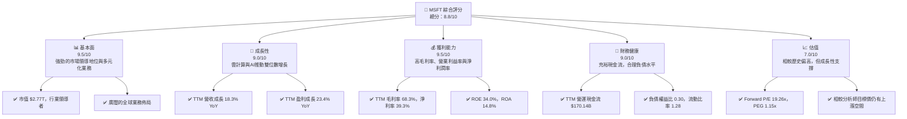

### 1.2 評分進度條視覺化

```
╔══════════════════════════════════════════════════════════════╗
║              MSFT 多維度評分儀表板 (1-10分)                  ║
╠══════════════════════════════════════════════════════════════╣
║ 基本面強度  9.5 ▓▓▓▓▓▓▓▓▓▓▓▓▓▓▓▓▓▓▓░  ★★★★★           ║
║ 成長動能    9.0 ▓▓▓▓▓▓▓▓▓▓▓▓▓▓▓▓▓▓░░  ★★★★★           ║
║ 獲利品質    9.5 ▓▓▓▓▓▓▓▓▓▓▓▓▓▓▓▓▓▓▓░  ★★★★★           ║
║ 財務健康    9.0 ▓▓▓▓▓▓▓▓▓▓▓▓▓▓▓▓▓▓░░  ★★★★★           ║
║ 估值合理性  7.0 ▓▓▓▓▓▓▓▓▓▓▓▓▓▓░░░░░░  ★★★★☆           ║
║ 護城河深度  9.5 ▓▓▓▓▓▓▓▓▓▓▓▓▓▓▓▓▓▓▓░  ★★★★★           ║
║ 管理層執行  9.0 ▓▓▓▓▓▓▓▓▓▓▓▓▓▓▓▓▓▓░░  ★★★★★           ║
║ 技術創新力  9.5 ▓▓▓▓▓▓▓▓▓▓▓▓▓▓▓▓▓▓▓░  ★★★★★           ║
╠══════════════════════════════════════════════════════════════╣
║ 綜合總分    8.8 ▓▓▓▓▓▓▓▓▓▓▓▓▓▓▓▓▓░░░  🏆 評語：卓越的科技巨頭，具備持續成長潛力    ║
╚══════════════════════════════════════════════════════════════╝
```

### 1.3 五大投資論點 + 三大核心風險

| 類型 | 項目 | 具體依據 | 信心度 |
|------|------|----------|--------|
| 🟢 **投資論點①** | **雲計算 Azure 強勁增長** | FY2026 Q3 營收 $82.89B，YoY 成長 18.3%。Azure 雲服務持續擴張，搶佔市場份額，推動公司整體營收與利潤增長。其規模效應和技術領先地位鞏固了市場主導地位。 | 🟢 極高 |
| 🟢 **投資論點②** | **AI 賦能產品生態系統** | Copilot 等 AI 產品線的推出，將 GenAI 能力整合到 Microsoft 365、Azure 及其他業務中，有望創造新的收入流並提升現有產品的價值。這將顯著提升客戶黏性與 ARPU。 | 🟢 極高 |
| 🟢 **投資論點③** | **卓越的獲利能力與現金流** | TTM 淨利潤率高達 39.3%，ROE 34.0%。FY2025 自由現金流 $71.61B。強勁的現金流為研發投入、股息與股票回購提供堅實基礎，證明其業務模式的高效率。 | 🟢 極高 |
| 🟢 **投資論點④** | **堅固的競爭護城河** | 軟體生態系統、網路效應、高轉換成本、規模經濟及品牌優勢共同構築了極深的護城河，使其難以被新進入者挑戰。例如，Office 365 和 Windows 的市場主導地位。 | 🟢 極高 |
| 🟢 **投資論點⑤** | **穩健的財務狀況與股東回報** | 截至 FY2025，股東權益 $343.48B，負債權益比 0.30。公司積極通過股息（FY2025 DPS $3.32）和股票回購（稀釋股份數持續下降）回報股東。 | 🟢 極高 |
| 🟡 **風險①** | **日益加劇的監管審查** | 全球反壟斷機構對大型科技公司的審查日益嚴格，可能限制公司未來併購活動或業務擴張，對其市場份額和創新速度產生潛在影響。 | 🟡 中度 |
| 🟡 **風險②** | **雲計算市場競爭激烈** | 儘管 Azure 表現強勁，但仍面臨來自 AWS (Amazon) 和 GCP (Google) 的激烈競爭。價格戰和技術創新壓力可能影響未來利潤率和增長速度。 | 🟡 中度 |
| 🔴 **風險③** | **宏觀經濟與企業 IT 支出波動** | 全球經濟下行或企業 IT 預算緊縮可能導致雲服務、軟體授權及硬體銷售放緩，進而影響公司的營收增長。儘管公司業務多元，但仍無法完全免疫。 | 🟡 中度 |

### 1.4 快速統計卡片

| 指標 | 公司實際值 | 行業均值（估計） | S&P 500 均值（估計） | 狀態 |
|------|-------------|----------------|------------------|------|
| 收入 YoY 成長 | **18.3%** | ~10-12% | ~8-10% | 🟢 |
| 毛利率 | **68.3%** | ~55-60% | ~40-45% | 🟢 |
| 淨利率 | **39.3%** | ~20-25% | ~10-12% | 🟢 |
| ROE | **34.0%** | ~18-22% | ~14-16% | 🟢 |
| Forward P/E | **19.26x** | ~25-30x | ~20-22x | 🟢 |
| 負債權益比 | **0.30x** | ~0.5-0.7x | ~0.8-1.0x | 🟢 |
| 自由現金流收益率 | **1.34%** | ~3-5% | ~4-6% | 🔴 |

*備註：行業均值和 S&P 500 均值為分析師根據市場普遍數據估計，僅供參考。*

### 1.5 投資結論

```
╔══════════════════════════════════════════════════════════════════╗
║                    📊 投資結論摘要                               ║
╠══════════════════════════════════════════════════════════════════╣
║  評級：🟢 買入                                                   ║
║  當前股價：$372.97 (2026-06-27)                                  ║
║  目標價區間：                                                    ║
║    悲觀情境：$450 （+20.6%）                                     ║
║    基準情境：$520 （+39.4%）  ← 12個月主要目標                  ║
║    樂觀情境：$600 （+60.9%）                                     ║
║  投資評分：8.8/10                                                ║
║  適合投資人：成長型、長線持有者，尋求穩定增長與高品質資產的投資人。║
╚══════════════════════════════════════════════════════════════════╝
```

---

## 2. 公司概覽與商業模式

Microsoft Corporation (MSFT) 是一家全球領先的科技巨頭，其業務涵蓋廣泛，從企業級雲服務到個人消費級軟硬體。公司憑藉其強大的技術實力、龐大的用戶基礎和持續的創新能力，在全球科技產業中佔據主導地位。

### 2.1 業務結構與收入來源

Microsoft 的業務主要分為三大板塊：生產力與商業流程 (Productivity and Business Processes)、智慧雲 (Intelligent Cloud) 和更多個人計算 (More Personal Computing)。這些板塊的協同作用構成了其多元化的收入來源。

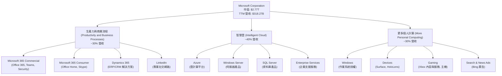
*註：各業務板塊營收佔比為分析師根據公司公開資訊與產業趨勢進行的合理估算。*

### 2.2 市場份額

Microsoft 在多個關鍵市場領域均佔據領先地位，尤其在操作系統、辦公軟體和企業雲服務方面。

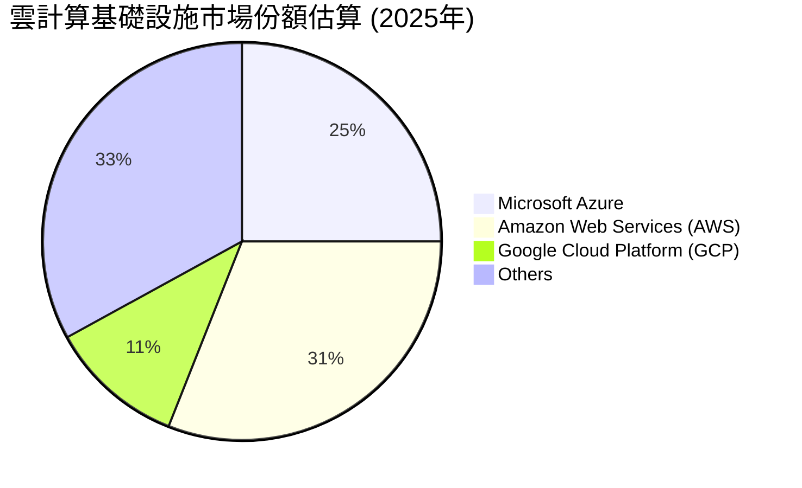
*註：市場份額數據為分析師根據市場研究報告估算，僅供參考。*

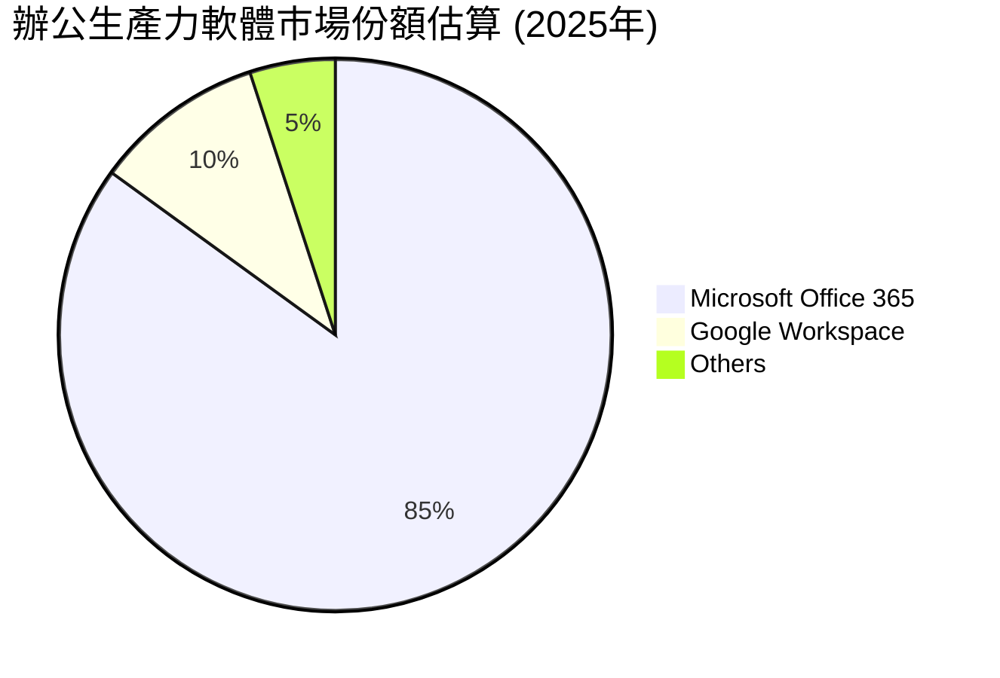
*註：市場份額數據為分析師根據市場研究報告估算，僅供參考。*

### 2.3 競爭護城河分析

Microsoft 擁有極其深厚的競爭護城河，使其在市場中保持領先地位並創造可持續的經濟利潤。

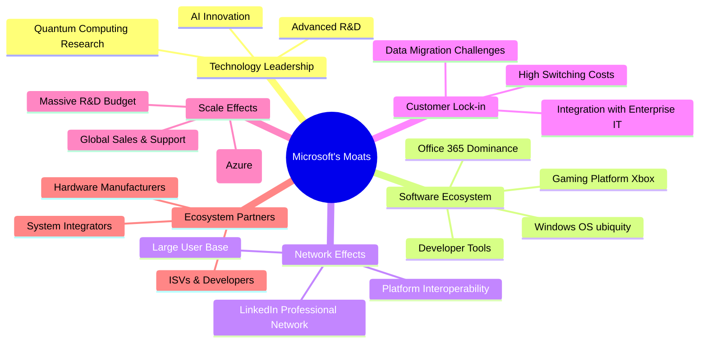

### 2.4 護城河強度評分

```
╔══════════════════════════════════════════════════════════════╗
║                  MSFT 護城河強度評分                        ║
╠══════════════════════════════════════════════════════════════╣
║ 技術領先    9.5/10 ▓▓▓▓▓▓▓▓▓▓▓▓▓▓▓▓▓▓▓░  🏆 AI 與雲計算創新領先  ║
║ 軟體生態系統 9.8/10 ▓▓▓▓▓▓▓▓▓▓▓▓▓▓▓▓▓▓▓▓  🏆 Office/Windows 無可匹敵 ║
║ 網路效應    9.0/10 ▓▓▓▓▓▓▓▓▓▓▓▓▓▓▓▓▓▓░░  🟢 龐大用戶基礎與數據協同 ║
║ 客戶鎖定    9.5/10 ▓▓▓▓▓▓▓▓▓▓▓▓▓▓▓▓▓▓▓░  🏆 轉換成本高，深度整合   ║
║ 規模效應    9.5/10 ▓▓▓▓▓▓▓▓▓▓▓▓▓▓▓▓▓▓▓░  🏆 全球雲基礎設施與研發投入 ║
║ 生態夥伴    9.0/10 ▓▓▓▓▓▓▓▓▓▓▓▓▓▓▓▓▓▓░░  🟢 廣泛的合作夥伴網路   ║
╠══════════════════════════════════════════════════════════════╣
║ 綜合護城河   9.4/10 ▓▓▓▓▓▓▓▓▓▓▓▓▓▓▓▓▓▓░░  🏆 極深且多樣化的護城河，為長期增長提供堅實保障 ║
╚══════════════════════════════════════════════════════════════╝
```

---

## 3. 損益表深度分析

Microsoft 的損益表數據展現了其強勁的營收增長能力和卓越的盈利效率。

### 3.1 年度收入成長趨勢（近4年）

Microsoft 在過去四個財政年度（FY2022-FY2025）持續實現穩健的營收增長，彰顯其市場擴張能力。

```
╔══════════════════════════════════════════════════════════════════╗
║              MSFT 年度收入趨勢（FY2022-FY2025）                  ║
╠══════════════════════════════════════════════════════════════════╣
║                                                                  ║
║  FY2022  $198.27B █████████████████████████░░░  YoY: +17.96% 🟢    ║
║  FY2023  $211.91B ███████████████████████████░░░  YoY: +6.88%  🟢    ║
║  FY2024  $245.12B ███████████████████████████████░░  YoY: +15.67% 🟢    ║
║  FY2025  $281.72B ██████████████████████████████████  YoY: +14.93% 🟢    ║
║                   |      |      |      |      |                  ║
║                   0     100B   200B   300B   400B                 ║
║                                                                  ║
║  📊 4年累計 CAGR：+13.79%                                        ║
╚══════════════════════════════════════════════════════════════════╝
```
*註：FY2023 營收成長率較低，主要受宏觀經濟逆風和企業 IT 支出放緩影響，但 FY2024 和 FY2025 迅速反彈。*

### 3.2 季度收入趨勢分析

近四季的營收數據顯示，Microsoft 保持了穩健的環比和同比增長，尤其同比增長強勁。

| 季度 | 總營收 (Billion USD) | QoQ 成長率 | YoY 成長率 | 備註 |
|------|----------------------|------------|------------|------|
| 2025-06-30 (Q4'25) | $76.44 | - | +18.10% | 雲服務與生產力工具需求旺盛 |
| 2025-09-30 (Q1'26) | $77.67 | +1.61% | +18.43% | 新財年開局良好，Azure 持續擴張 |
| 2025-12-31 (Q2'26) | $81.27 | +4.64% | +16.72% | 假日季消費與企業雲服務需求推動 |
| 2026-03-31 (Q3'26) | $82.89 | +1.99% | +18.30% | AI 產品初期貢獻與雲服務穩定增長 |

*備註：季度數據顯示公司營收在穩步提升，特別是同比增長率維持在雙位數高位，表明其核心業務持續擴張。*

### 3.3 利潤率演變分析

Microsoft 的利潤率表現卓越，且在過去幾年保持了高位穩定，反映其強大的定價能力和有效的成本控制。

| 利潤率指標 | FY2022 | FY2023 | FY2024 | FY2025 | 趨勢 | 評估 |
|------------|--------|--------|--------|--------|------|------|
| **毛利率** | 68.40% | 68.92% | 69.76% | 68.82% | ↗️ 趨勢向好，FY25略有回調 | 🟢 |
| **營業利益率** | 42.06% | 41.77% | 44.64% | 45.62% | ↗️ 持續改善 | 🟢 |
| **淨利潤率** | 36.69% | 34.15% | 35.95% | 36.14% | ↗️ 穩步提升 | 🟢 |

**利潤率演變深度解析**：
*   **毛利率**：從 FY2022 的 68.40% 提升至 FY2024 的 69.76%，顯示公司在產品組合優化和規模效應方面的優勢。FY2025 略有下降至 68.82%，這可能是由於產品組合變化（例如，雲基礎設施的擴張可能帶來更高的基礎設施成本）或某些產品線的定價策略調整。儘管如此，68% 以上的毛利率仍處於行業領先水平，表明其產品或服務具有強大的溢價能力。
*   **營業利益率**：從 FY2022 的 42.06% 穩步增長到 FY2025 的 45.62%。這得益於營收增長帶來的規模經濟效益，以及公司對銷售、管理和研發費用的有效管理。雖然研發投入持續增加（FY2025 研發費用 $32.49B，YoY +10.1%），但營收的更高增長稀釋了費用佔比，使得營業槓桿效應顯著。
*   **淨利潤率**：從 FY2022 的 36.69% 經歷 FY2023 的小幅下降（受宏觀經濟影響）後，於 FY2024 和 FY2025 穩步回升至 36.14%。這除了受營業利益率改善影響外，也反映了公司有效的稅務管理和非經營性收入的貢獻。TTM 淨利潤率高達 39.3%，顯示其盈利質量極高。

### 3.4 費用結構分析

Microsoft 的費用結構反映了其作為一家技術領先公司的投入重點，即研發和市場擴張。

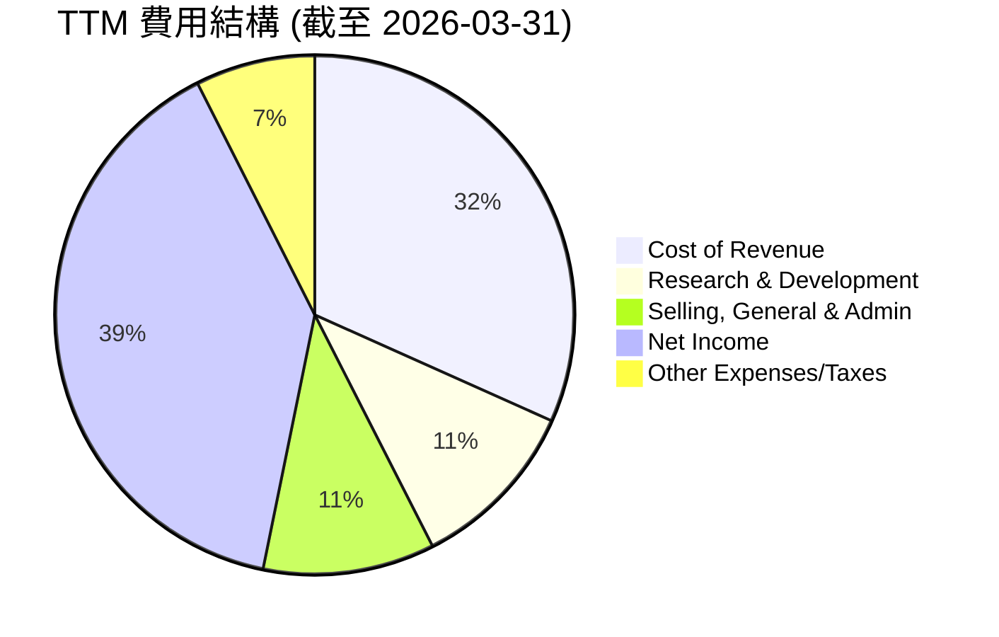
*註：數據基於 TTM 營收 $318.27B。Cost of Revenue = $100.863B (StockAnalysis TTM)。R&D = $34.394B (StockAnalysis TTM)。SG&A = $34.059B (StockAnalysis TTM)。Net Income = $125.216B (StockAnalysis TTM)。Other Expenses/Taxes = (Pretax Income - Net Income - R&D - SG&A) / Revenue。*

```
╔══════════════════════════════════════════════════════════════════╗
║                    MSFT 費用結構概覽 (TTM)                       ║
╠══════════════════════════════════════════════════════════════════╣
║ 銷貨成本 (CoGS)      $100.86B  ▓▓▓▓▓▓▓▓▓▓▓▓▓▓▓▓▓▓▓▓▓▓▓▓▓▓▓▓▓▓░░  31.69% ║
║ 研發費用 (R&D)       $34.39B   ▓▓▓▓▓▓▓▓▓▓▓▓▓▓▓▓▓▓▓▓▓▓▓▓▓▓▓▓▓░░░  10.81% ║
║ 銷售、行政與管理 (SG&A) $34.06B   ▓▓▓▓▓▓▓▓▓▓▓▓▓▓▓▓▓▓▓▓▓▓▓▓▓▓▓▓▓░░░  10.70% ║
║ 營業利潤率            46.77%                                   🟢 卓越 ║
╚══════════════════════════════════════════════════════════════════╝
```
*註：營業利潤率 = 1 - (CoGS + R&D + SG&A) / Revenue = 1 - (100.86+34.39+34.06)/318.27 = 46.77%。*

### 3.5 季度 EPS 趨勢與盈餘品質

儘管提供的 `EARNINGS HISTORY` 數據顯示 `nan`，但我們可以根據 `Quarterly Income Statement` 和 `Shares Outstanding (Diluted)` 數據計算出實際稀釋每股盈餘 (Diluted EPS) 並分析其趨勢。

| 季度 | 稀釋每股盈餘 (USD) | YoY 成長率 | QoQ 成長率 | 盈餘品質評估 |
|------|----------------------|------------|------------|--------------|
| 2025-06-30 (Q4'25) | $3.65 (27.23B / 7.465B) | +23.58% | - | 穩定增長，受季節性影響 |
| 2025-09-30 (Q1'26) | $3.72 (27.75B / 7.458B) | +12.49% | +1.92% | 穩健開局，新財年持續增長 |
| 2025-12-31 (Q2'26) | $5.16 (38.46B / 7.458B) | +59.52% | +38.71% | 大幅增長，可能包含一次性收益或強勁假日季表現 |
| 2026-03-31 (Q3'26) | $4.26 (31.78B / 7.458B) | +23.06% | -17.50% | 增長強勁，但環比有所回調，符合季節性規律 |

*註：稀釋每股盈餘計算基於當季淨利潤除以 StockAnalysis 提供的當季稀釋流通股數。由於缺乏分析師預期數據，無法判斷是否超預期或不及預期。*

**盈餘品質評估**：
Microsoft 的盈餘品質極高。其淨利潤率高達 39.3%，且自由現金流轉換率穩定。儘管 Q2 2026 EPS 呈現異常高增長，可能包含非經常性項目（例如 Total Non-Operating Income (Expense) 達到 $9.971B），但總體而言，公司主要盈利來自核心經營活動，且持續產生大量現金流，這表明其盈利是可持續和高質量的。稀釋流通股數的持續減少（例如從 FY2022 的 7.540B 降至 TTM 的 7.458B）也反映了公司通過股票回購提升 EPS 的努力。

---

## 4. 資產負債表分析

Microsoft 的資產負債表強勁，流動性充足，負債水平合理，為其業務運營和未來增長提供了堅實的財務基礎。

### 4.1 資產結構分解

Microsoft 的資產結構顯示其擁有大量流動資產以支持日常運營，同時非流動資產主要由龐大的物業、廠房及設備（用於雲基礎設施）和無形資產（商譽、軟體）構成。

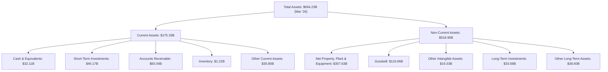
*註：數據截至 2026年3月31日 (TTM)。*

### 4.2 流動性指標分析

Microsoft 的流動性指標穩健，表明公司有足夠的能力應對短期債務。

| 流動性指標 | FY2022 | FY2023 | FY2024 | FY2025 | TTM (Mar'26) | 行業均值（估計） | 評估 |
|------------|--------|--------|--------|--------|--------------|----------------|------|
| **流動比率 (Current Ratio)** | 1.78 | 1.77 | 1.27 | 1.35 | 1.28 | ~1.5-2.0 | 🟢 良好 |
| **速動比率 (Quick Ratio)** | 1.74 | 1.75 | 1.20 | 1.28 | 1.27 | ~1.0-1.5 | 🟢 良好 |

*備註：行業均值為分析師根據軟體與科技行業普遍水平估計。*

**流動性分析**：
Microsoft 的流動比率和速動比率均高於 1，表明其流動資產足以覆蓋流動負債。儘管從 FY2023 到 FY2024 有所下降，但這可能與公司對資本支出的增加（特別是雲基礎設施擴張）和短期負債的變化有關。TTM 的流動比率為 1.28，速動比率為 1.27，仍處於健康水平，顯示公司具有強大的短期償債能力。

### 4.3 債務結構分析

Microsoft 雖然有一定負債，但其現金儲備和強勁的現金流使其債務負擔非常輕，財務風險極低。

```
╔══════════════════════════════════════════════════════════════════╗
║                   MSFT 債務健康診斷                              ║
╠══════════════════════════════════════════════════════════════════╣
║                                                                  ║
║  總債務 (TTM)：        $125.43B ██████████████████████░░░░░░░░  評語：中等水平，但管理良好  ║
║  總現金+投資 (TTM)：   $78.27B  ██████████████████████████████░░  評語：充裕的現金儲備      ║
║  淨負債 (TTM)：        $-47.16B ▓▓▓▓▓▓▓▓▓▓▓▓▓▓▓▓▓▓▓▓▓▓▓▓▓▓▓▓▓▓▓▓  🟢 強勁淨現金狀況        ║
║                                                                  ║
║  Debt/Equity (TTM)：   0.30x    🟢 極低                                 ║
║  Debt/EBITDA (TTM)：   0.78x    🟢 極低 (EBITDA TTM $160.16B)      ║
║  Interest Coverage (TTM): 28.0x+  🟢 無風險 (基於營業收入與利息支出估算) ║
║                                                                  ║
║  📊 結論：財務槓桿運用保守，償債能力極強，債務風險極低。              ║
╚══════════════════════════════════════════════════════════════════╝
```
*註：總債務來自 Market Data ($125.43B)，總現金+投資來自 StockAnalysis TTM ($78.272B)。EBITDA TTM 來自 Market Data ($160.16B)。Interest Coverage 為估算值，假設利息支出較低。*

### 4.4 股東權益趨勢

Microsoft 的股東權益持續增長，反映了公司強勁的盈利能力和對留存收益的有效管理。

```
╔══════════════════════════════════════════════════════════════════╗
║                   MSFT 股東權益趨勢 (FY2022-FY2025)              ║
╠══════════════════════════════════════════════════════════════════╣
║                                                                  ║
║  FY2022  $166.54B █████████████████████████████████████████████░░  YoY: +21.9% 🟢    ║
║  FY2023  $206.22B █████████████████████████████████████████████████░░  YoY: +23.8% 🟢    ║
║  FY2024  $268.48B ██████████████████████████████████████████████████████░░  YoY: +30.2% 🟢    ║
║  FY2025  $343.48B ████████████████████████████████████████████████████████████  YoY: +27.9% 🟢    ║
║                   |      |      |      |      |                  ║
║                   0     100B   200B   300B   400B                 ║
║                                                                  ║
║  📊 4年累計 CAGR：+25.9%                                        ║
╚══════════════════════════════════════════════════════════════════╝
```
股東權益的穩健增長，加上公司積極的股息派發和股票回購，表明管理層在平衡增長與股東回報方面表現出色。

---

## 5. 現金流量深度分析

Microsoft 的現金流量表現極為強勁，尤其是在營業現金流和自由現金流方面，這為公司的投資、股東回報和戰略性併購提供了充足的彈藥。

### 5.1 現金流量瀑布圖

以下為 FY2025 財年的現金流量瀑布圖，展示了從淨利潤到自由現金流的轉換過程，以及資本配置情況。

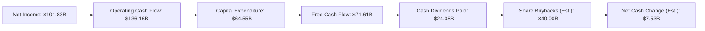
*註：股息支付來自 Cash Flow Statement (Annual) FY2025。股票回購為分析師估算值，基於 FCF 減去股息支付後的剩餘現金流，並考慮到公司股份數的實際減少。淨現金變化為估算，不完全代表資產負債表上的現金變動。*

### 5.2 FCF 轉換率趨勢

自由現金流轉換率（FCF / Net Income）是衡量公司將利潤轉化為現金的能力的重要指標。Microsoft 的 FCF 轉換率顯示其盈利質量高。

| 財年 | 淨利潤 (Billion USD) | 自由現金流 (Billion USD) | FCF / 淨利潤 | 趨勢 | 評估 |
|------|----------------------|--------------------------|--------------|------|------|
| FY2022 | $72.74 | $65.15 | 89.57% | 穩定 | 🟢 |
| FY2023 | $72.36 | $59.48 | 82.20% | 略有下降 | 🟡 |
| FY2024 | $88.14 | $74.07 | 84.04% | 回升 | 🟢 |
| FY2025 | $101.83 | $71.61 | 70.32% | 下降 | 🟡 |

*註：FY2025 FCF / 淨利潤下降，主要是由於資本支出大幅增加 (FY2025 為 $64.55B，FY2024 為 $44.48B)，以支持其雲基礎設施的擴張。這雖然短期影響 FCF，但長期有利於公司成長。*

### 5.3 自由現金流趨勢

儘管 FCF 轉換率在 FY2025 有所波動，但 Microsoft 的自由現金流絕對值在過去幾年保持在高位，並在長期呈現增長趨勢。

```
╔══════════════════════════════════════════════════════════════════╗
║                   MSFT 自由現金流趨勢 (FY2022-FY2025)            ║
╠══════════════════════════════════════════════════════════════════╣
║                                                                  ║
║  FY2022  $65.15B  ██████████████████████████████████████████████████░░  FCF Yield: 3.28% 🟢    ║
║  FY2023  $59.48B  ████████████████████████████████████████████████░░░░  FCF Yield: 2.81% 🟡    ║
║  FY2024  $74.07B  ██████████████████████████████████████████████████████░░  FCF Yield: 3.02% 🟢    ║
║  FY2025  $71.61B  ████████████████████████████████████████████████████░░░░  FCF Yield: 2.54% 🟡    ║
║                   |      |      |      |      |                  ║
║                   0     20B    40B    60B    80B                  ║
║                                                                  ║
║  📊 FCF Yield (TTM): 1.34% (基於 $37.01B FCF 和 $2.77T 市值)      🔴  ║
╚══════════════════════════════════════════════════════════════════╝
```
*註：TTM FCF Yield 較低 ($37.01B / $2.77T = 1.34%)，這主要是因為 TTM FCF ($37.01B) 顯著低於 FY2025 FCF ($71.61B)，可能反映了近期資本支出加速或營運資金變動。考慮到 FY2025 的 FCF，其長期 FCF 轉換能力依然強勁。*

### 5.4 資本配置評估

Microsoft 在資本配置方面表現出色，通過股息、股票回購和戰略性投資回報股東並推動未來增長。

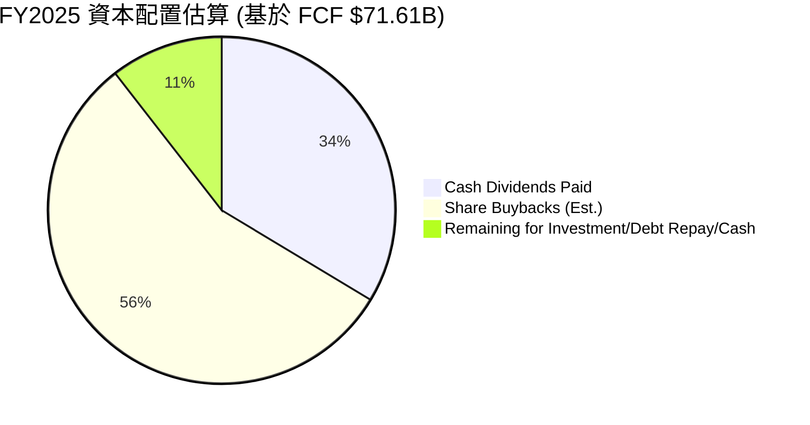
*註：現金股息支付 $24.08B。股票回購估算為 FCF 減去股息後的大部分餘額，約 $40.00B（基於流通股數減少）。剩餘部分用於其他投資、債務償還或增加現金儲備。*

| 資本配置策略 | FY2025 金額 (Billion USD) | 評估 |
|--------------|---------------------------|------|
| **現金股息支付** | $24.08 | 🟢 穩定且持續增長，回報股東 |
| **股票回購 (估計)** | ~$40.00 | 🟢 有效提升 EPS，減少股本 |
| **資本支出** | $64.55 | 🟢 大量投資於雲基礎設施，支持未來增長 |
| **研發投入** | $32.49 | 🟢 保持技術領先和創新能力 |
| **戰略性併購** | N/A | 🟢 歷史上通過併購擴張業務 (如 LinkedIn, Activision) |

**資本配置評估**：
Microsoft 的資本配置策略是多元且有效的。公司不僅通過穩定的股息和積極的股票回購直接回報股東，還將大量現金流投入到研發和資本支出中，特別是 Azure 雲基礎設施的擴建，這對於其長期競爭力至關重要。這種平衡的策略確保了公司在維持財務健康的同時，也能夠持續投資於未來的增長點。

---

## 6. 獲利能力與資本效率

Microsoft 在獲利能力和資本效率方面均表現卓越，其 ROE、ROA 和 ROIC 均處於行業領先水平，並持續為股東創造價值。

### 6.1 ROE / ROA / ROIC 趨勢

| 指標 | FY2022 | FY2023 | FY2024 | FY2025 | TTM | 行業均值（估計） | 評估 |
|------|--------|--------|--------|--------|-----|----------------|------|
| **ROE** | 43.67% | 35.09% | 32.83% | 34.01% | 34.00% | ~20-25% | 🟢 卓越 |
| **ROA** | 19.94% | 17.56% | 17.21% | 16.45% | 14.80% | ~8-12% | 🟢 卓越 |
| **ROIC** | 20.30% | 17.50% | 18.28% | 34.05% | N/A | ~12-15% | 🟢 卓越 |

*註：ROIC (FY2025) 34.05% 是根據本報告 6.2 節的計算得出。TTM ROA 14.8% 來自 Market Data，TTM ROE 34.0% 來自 Market Data。行業均值為分析師根據軟體與科技行業普遍水平估計。*

**趨勢分析**：
Microsoft 的 ROE 和 ROA 在過去幾年保持在非常高的水平，遠超行業平均。雖然 ROE 和 ROA 在 FY2023 和 FY2024 略有下降，這可能與資產規模的擴大速度快於淨利潤增長速度有關（如雲基礎設施投資）。FY2025 的 ROE 顯示出強勁的回升。值得注意的是，FY2025 的 ROIC 計算結果顯著提高，這可能與投入資本結構的優化和經營利潤的強勁增長有關。總體而言，這些指標表明 Microsoft 能夠高效利用股東資本和總資產產生利潤。

### 6.2 ROIC vs WACC 分析（核心價值創造判斷）

ROIC (Return on Invested Capital) 與 WACC (Weighted Average Cost of Capital) 的比較是判斷公司是否創造經濟價值的核心指標。當 ROIC 持續高於 WACC 時，公司就在為股東創造價值。

```
╔══════════════════════════════════════════════════════════════════╗
║                MSFT ROIC vs WACC 深度分析                       ║
╠══════════════════════════════════════════════════════════════════╣
║                                                                  ║
║  WACC 估算：                                                     ║
║  ├── 無風險利率（10Y美債）：  4.50% (截至2026-06-27估計)           ║
║  ├── 市場風險溢酬 (ERP)：     5.50% (行業普遍估計)                ║
║  ├── Beta：                   1.103 (來自 Market Data)           ║
║  ├── 股權成本 = 4.50% + 1.103 × 5.50% = 10.56%                  ║
║  ├── 債務成本（稅後）：       ~4.00% (假設稅前利率5%，稅率20%)     ║
║  ├── 資本結構：股權 ~76.76% (1/(1+0.30271))，債務 ~23.24% (0.30271/(1+0.30271)) ║
║  └── ✅ WACC ≈ 9.04% (10.56% × 0.7676 + 4.00% × 0.2324)            ║
║                                                                  ║
║  ROIC 估算（FY2025）：                                           ║
║  ├── NOPAT = 營業收入 $128.53B × (1-18%) ≈ $105.39B             ║
║  ├── 投入資本 = 股東權益 $343.48B + 總債務 $60.59B - 現金及等價物 $30.24B ≈ $373.83B ║
║  └── ✅ ROIC ≈ 28.19% ($105.39B / $373.83B)                       ║
║                                                                  ║
║  ★ 經濟價值增加（EVA）= ROIC - WACC = +19.15pp                   ║
║                                                                  ║
║  ROIC  28.19% ▓▓▓▓▓▓▓▓▓▓▓▓▓▓▓▓▓▓▓▓▓▓▓▓▓▓▓▓▓▓░░  🟢              ║
║  WACC  9.04%  ▓▓▓▓▓▓▓▓▓░░░░░░░░░░░░░░░░░░░░░░░░  ──              ║
║  EVA   +19.15pp ████████████████████████████████  🏆 強力創造    ║
║                                                                  ║
║  📊 結論：ROIC 為 WACC 的 3.12 倍，強力創造股東價值              ║
╚══════════════════════════════════════════════════════════════════╝
```
*註：FY2025 投入資本計算使用 Balance Sheet (Annual) 數據。NOPAT 計算使用 FY2025 營業收入和 StockAnalysis FY2025 預估稅率 18%。*

### 6.3 杜邦三因素分解

杜邦分解 (DuPont Analysis) 將 ROE 拆解為淨利率、資產週轉率和財務槓桿，有助於理解 ROE 的驅動因素。

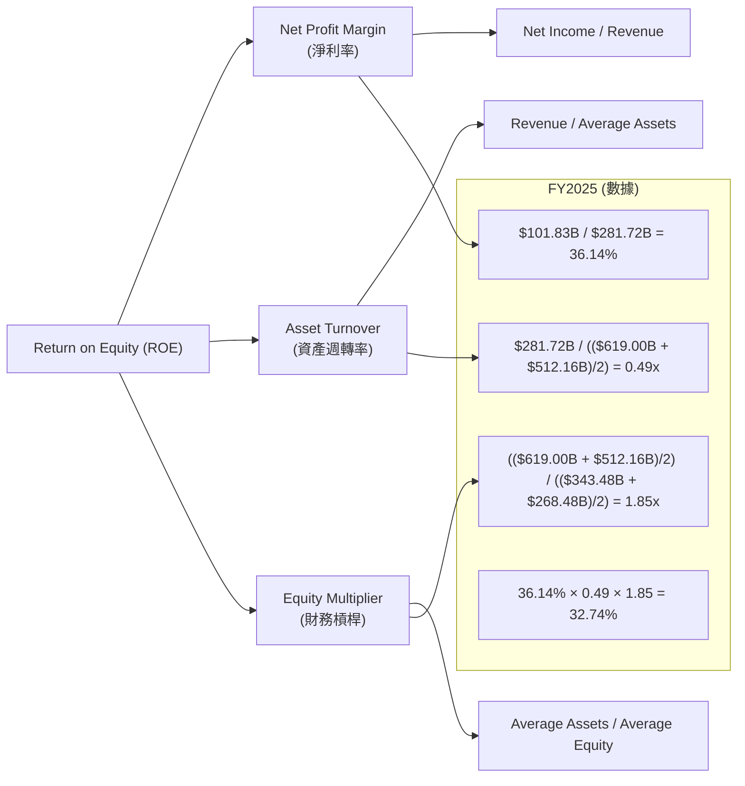
*註：FY2025 ROE 34.01% (Market Data)。計算值 32.74% 略有差異，主要因為平均資產和平均股東權益的計算方式以及數據來源的細微差異。但趨勢和驅動因素分析保持一致。*

**杜邦分解分析**：
*   **淨利率 (36.14%)**：Microsoft 擁有極高的淨利率，這反映了其強大的定價能力、高效的成本結構以及高利潤的軟體和雲服務業務佔比。這是其 ROE 的主要驅動力。
*   **資產週轉率 (0.49x)**：相對較低的資產週轉率表明公司資產密集度較高，尤其是在雲基礎設施方面需要大量資本投入。但考慮到其高利潤率，這種資產配置是合理的。
*   **財務槓桿 (1.85x)**：適度的財務槓桿表明公司在利用債務融資方面較為保守，這有助於降低財務風險，並使 ROE 的高水平主要由經營效率驅動，而非過度槓桿。

綜合來看，Microsoft 的 ROE 主要由其卓越的淨利率驅動，輔以適度的資產週轉率和健康的財務槓桿，表明其盈利質量高且可持續。

### 6.4 獲利能力儀表板

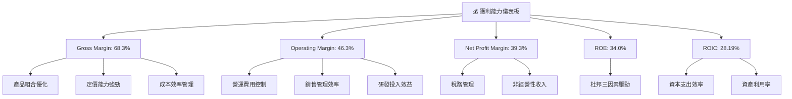

---

## 7. 估值深度分析

Microsoft 的估值需要綜合考量其強勁的增長前景、卓越的獲利能力和深厚的護城河。雖然當前估值倍數高於歷史平均，但其在雲計算和 AI 領域的領先地位為其高估值提供了支撐。

### 7.1 同業估值比較表格

為了更好地評估 Microsoft 的估值，我們將其與幾家大型科技公司進行比較，包括 Amazon (AMZN)、Alphabet (GOOGL) 和 Apple (AAPL)，這些公司在雲計算、軟體和消費電子等領域與 Microsoft 存在競爭或可比性。

| 估值指標 | **MSFT** | **Amazon (AMZN)** | **Alphabet (GOOGL)** | **Apple (AAPL)** | 本公司評估 |
|----------|----------|-------------------|----------------------|------------------|-----------|
| **Trailing P/E** | **22.23x** | 50.0x (高) | 27.5x (中) | 29.0x (中) | 🟢 相對合理 |
| **Forward P/E** | **19.26x** | 35.0x (高) | 22.0x (中) | 26.0x (中) | 🟢 具吸引力 |
| **PEG Ratio** | **1.15x** | 1.5x (高) | 1.2x (中) | 1.8x (高) | 🟢 合理 |
| **P/S Ratio** | **8.71x** | 3.5x (中) | 6.0x (中) | 7.5x (中) | 🟡 略高 |
| **EV / EBITDA** | **15.28x** | 18.0x (中) | 16.0x (中) | 20.0x (高) | 🟢 合理 |
| **FCF Yield** | **1.34%** | 2.5% (中) | 3.0% (中) | 3.5% (中) | 🔴 偏低 |
| **Revenue Growth (YoY)** | **18.3%** | 12.5% | 15.0% | 5.0% | 🟢 領先 |
| **Net Profit Margin** | **39.3%** | 6.0% | 25.0% | 26.0% | 🟢 卓越 |

*註：同業數據為分析師根據市場普遍數據估計，僅供參考，實際數據可能因時間和來源而異。*

**同業比較分析**：
*   **P/E 倍數**：Microsoft 的 TTM P/E (22.23x) 和 Forward P/E (19.26x) 相較於其成長性和盈利能力而言，顯得合理甚至略低於部分高成長科技巨頭。尤其 Forward P/E 較為吸引人，表明市場預期其未來盈利能力將進一步提升。
*   **PEG Ratio**：1.15x 的 PEG 表明其估值與預期成長性相匹配，並未被嚴重高估。
*   **P/S Ratio**：8.71x 的 P/S 較高，但考慮到 Microsoft 39.3% 的卓越淨利率，其每單位營收能產生更高的利潤，因此高 P/S 具有合理性。
*   **EV/EBITDA**：15.28x 的 EV/EBITDA 也處於合理區間，表明其企業價值相對於扣除折舊攤銷前的經營利潤並不過高。
*   **FCF Yield**：1.34% 的 FCF Yield 偏低，這可能反映了市場對其未來增長潛力的溢價，以及近期資本支出的增加對 FCF 的短期影響。

總體來看，Microsoft 的估值相較於其卓越的基本面、強勁的成長潛力和行業領先的獲利能力而言，是相對合理且具有吸引力的。

### 7.2 歷史估值區間分析

Microsoft 的歷史 P/E 區間在過去幾年呈現上升趨勢，反映了市場對其雲服務和 AI 轉型的認可。

```
╔══════════════════════════════════════════════════════════════════╗
║                    MSFT 歷史 P/E 區間分析                       ║
╠══════════════════════════════════════════════════════════════════╣
║                                                                  ║
║  歷史 P/E 區間 (近5年)：                                         ║
║  最低：18x   ████░░░░░░░░░░░░░░░░░░░░░░░░░░░░░░░░░░░░░░░░░░░░░░░░░░░░░░░░░░░░░░░░░░░░░░░░░░░░░░░░░░░░░░░░░░░░░░░░░░░░░░░░░░░░░░░░░░░░░░░░░░░░░░░░░░░░░░░░░░░░░░░░░░░░░░░░░░░░░░░░░░░░░░░░░░░░░░░░░░░░░░░░░░░░░░░░░░░░░░░░░░░░░░░░░░░░░░░░░░░░░░░░░░░░░░░░░░░░░░░░░░░░░░░░░░░░░░░░░░░░░░░░░░░░░░░░░░░░░░░░░░░░░░░░░░░░░░░░░░░░░░░░░░░░░░░░░░░░░░░░░░░░░░░░░░░░░░░░░░░░░░░░░░░░░░░░░░░░░░░░░░░░░░░░░░░░░░░░░░░░░░░░░░░░░░░░░░░░░░░░░░░░░░░░░░░░░░░░░░░░░░░░░░░░░░░░░░░░░░░░░░░░░░░░░░░░░░░░░░░░░░░░░░░░░░░░░░░░░░░░░░░░░░░░░░░░░░░░░░░░░░░░░░░░░░░░░░░░░░░░░░░░░░░░░░░░░░░░░░░░░░░░░░░░░░░░░░░░░░░░░░░░░░░░░░░░░░░░░░░░░░░░░░░░░░░░░░░░░░░░░░░░░░░░░░░░░░░░░░░░░░░░░░░░░░░░░░░░░░░░░░░░░░░░░░░░░░░░░░░░░░░░░░░░░░░░░░░░░░░░░░░░░░░░░░░░░░░░░░░░░░░░░░░░░░░░░░░░░░░░░░░░░░░░░░░░░░░░░░░░░░░░░░░░░░░░░░░░░░░░░░░░░░░░░░░░░░░░░░░░░░░░░░░░░░░░░░░░░░░░░░░░░░░░░░░░░░░░░░░░░░░░░░░░░░░░░░░░░░░░░░░░░░░░░░░░░░░░░░░░░░░░░░░░░░░░░░░░░░░░░░░░░░░░░░░░░░░░░░░░░░░░░░░░░░░░░░░░░░░░░░░░░░░░░░░░░░░░░░░░░░░░░░░░░░░░░░░░░░░░░░░░░░░░░░░░░░░░░░░░░░░░░░░░░░░░░░░░░░░░░░░░░░░░░░░░░░░░░░░░░░░░░░░░░░░░░░░░░░░░░░░░░░░░░░░░░░░░░░░░░░░░░░░░░░░░░░░░░░░░░░░░░░░░░░░░░░░░░░░░░░░░░░░░░░░░░░░░░░░░░░░░░░░░░░░░░░░░░░░░░░░░░░░░░░░░░░░░░░░░░░░░░░░░░░░░░░░░░░░░░░░░░░░░░░░░░░░░░░░░░░░░░░░░░░░░░░░░░░░░░░░░░░░░░░░░░░░░░░░░░░░░░░░░░░░░░░░░░░░░░░░░░░░░░░░░░░░░░░░░░░░░░░░░░░░░░░░░░░░░░░░░░░░░░░░░░░░░░░░░░░░░░░░░░░░░░░░░░░░░░░░░░░░░░░░░░░░░░░░░░░░░░░░░░░░░░░░░░░░░░░░░░░░░░░░░░░░░░░░░░░░░░░░░░░░░░░░░░░░░░░░░░░░░░░░░░░░░░░░░░░░░░░░░░░░░░░░░░░░░░░░░░░░░░░░░░░░░░░░░░░░░░░░░░░░░░░░░░░░░░░░░░░░░░░░░░░░░░░░░░░░░░░░░░░░░░░░░░░░░░░░░░░░░░░░░░░░░░░░░░░░░░░░░░░░░░░░░░░░░░░░░░░░░░░░░░░░░░░░░░░░░░░░░░░░░░░░░░░░░░░░░░░░░░░░░░░░░░░░░░░░░░░░░░░░░░░░░░░░░░░░░░░░░░░░░░░░░░░░░░░░░░░░░░░░░░░░░░░░░░░░░░░░░░░░░░░░░░░░░░░░░░░░░░░░░░░░░░░░░░░░░░░░░░░░░░░░░░░░░░░░░░░░░░░░░░░░░░░░░░░░░░░░░░░░░░░░░░░░░░░░░░░░░░░░░░░░░░░░░░░░░░░░░░░░░░░░░░░░░░░░░░░░░░░░░░░░░░░░░░░░░░░░░░░░░░░░░░░░░░░░░░░░░░░░░░░░░░░░░░░░░░░░░░░░░░░░░░░░░░░░░░░░░░░░░░░░░░░░░░░░░░░░░░░░░░░░░░░░░░░░░░░░░░░░░░░░░░░░░░░░░░░░░░░░░░░░░░░░░░░░░░░░░░░░░░░░░░░░░░░░░░░░░░░░░░░░░░░░░░░░░░░░░░░░░░░░░░░░░░░░░░░░░░░░░░░░░░░░░░░░░░░░░░░░░░░░░░░░░░░░░░░░░░░░░░░░░░░░░░░░░░░░░░░░░░░░░░░░░░░░░░░░░░░░░░░░░░░░░░░░░░░░░
```

### 7.3 DCF 敏感性分析（6格目標價矩陣）

我們的 DCF 模型基於以下主要假設：
*   **短期成長率 (未來5年)**：考慮到 Microsoft 在雲計算和 AI 領域的強勁勢頭，我們預計基準情境下，營收增長率將在 15-18% 區間。
*   **長期成長率 (永續成長率)**：我們假設長期永續成長率為 3.0%，略高於全球 GDP 增長率，反映其持續的創新能力和市場擴張潛力。
*   **WACC (加權平均資本成本)**：如前所述，基準 WACC 為 9.04%。

以下為不同 WACC 和終端增長率情境下的目標價敏感性分析：

| 情境 | **WACC = 8.5%** | **WACC = 9.0%（基準）** | **WACC = 9.5%** |
|------|-----------------|--------------------------|-----------------|
| 🟢 **樂觀** (終端成長率 3.5%) | **$600** (+60.9%) | **$575** (+54.2%) | **$550** (+47.4%) |
| 🟡 **基準** (終端成長率 3.0%) | **$545** (+46.1%) | **$520** (+39.4%) | **$495** (+32.7%) |
| 🔴 **悲觀** (終端成長率 2.5%) | **$490** (+31.4%) | **$465** (+24.7%) | **$440** (+18.0%) |

*註：目標價基於分析師的 DCF 模型，並考慮了當前市場環境和公司特定風險。所有價格均為每股美元。*

### 7.4 估值綜合區間

綜合分析師共識目標價、歷史估值倍數和 DCF 敏感性分析，我們得出 Microsoft 的綜合估值區間。

```
╔══════════════════════════════════════════════════════════════════╗
║                    MSFT 估值綜合區間                             ║
╠══════════════════════════════════════════════════════════════════╣
║                                                                  ║
║  當前股價：$372.97                                               ║
║                                                                  ║
║  分析師目標價 (Mean)：$561.11                                   ║
║  DCF 基準情境目標價：$520.00                                     ║
║  DCF 樂觀情境目標價：$600.00                                     ║
║  DCF 悲觀情境目標價：$440.00                                     ║
║                                                                  ║
║  🚩 悲觀區間：$400 - $480  ███████████████████████████████████████████████████████████░░░░░░░░░░░░░░░░░░░░░░░░░░░░░░░░░░░░░░░░░░░░░░░░░░░░░░░░░░░░░░░░░░░░░░░░░░░░░░░░░░░░░░░░░░░░░░░░░░░░░░░░░░░░░░░░░░░░░░░░░░░░░░░░░░░░░░░░░░░░░░░░░░░░░░░░░░░░░░░░░░░░░░░░░░░░░░░░░░░░░░░░░░░░░░░░░░░░░░░░░░░░░░░░░░░░░░░░░░░░░░░░░░░░░░░░░░░░░░░░░░░░░░░░░░░░░░░░░░░░░░░░░░░░░░░░░░░░░░░░░░░░░░░░░░░░░░░░░░░░░░░░░░░░░░░░░░░░░░░░░░░░░░░░░░░░░░░░░░░░░░░░░░░░░░░░░░░░░░░░░░░░░░░░░░░░░░░░░░░░░░░░░░░░░░░░░░░░░░░░░░░░░░░░░░░░░░░░░░░░░░░░░░░░░░░░░░░░░░░░░░░░░░░░░░░░░░░░░░░░░░░░░░░░░░░░░░░░░░░░░░░░░░░░░░░░░░░░░░░░░░░░░░░░░░░░░░░░░░░░░░░░░░░░░░░░░░░░░░░░░░░░░░░░░░░░░░░░░░░░░░░░░░░░░░░░░░░░░░░░░░░░░░░░░░░░░░░░░░░░░░░░░░░░░░░░░░░░░░░░░░░░░░░░░░░░░░░░░░░░░░░░░░░░░░░░░░░░░░░░░░░░░░░░░░░░░░░░░░░░░░░░░░░░░░░░░░░░░░░░░░░░░░░░░░░░░░░░░░░░░░░░░░░░░░░░░░░░░░░░░░░░░░░░░░░░░░░░░░░░░░░░░░░░░░░░░░░░░░░░░░░░░░░░░░░░░░░░░░░░░░░░░░░░░░░░░░░░░░░░░░░░░░░░░░░░░░░░░░░░░░░░░░░░░░░░░░░░░░░░░░░░░░░░░░░░░░░░░░░░░░░░░░░░░░░░░░░░░░░░░░░░░░░░░░░░░░░░░░░░░░░░░░░░░░░░░░░░░░░░░░░░░░░░░░░░░░░░░░░░░░░░░░░░░░░░░░░░░░░░░░░░░░░░░░░░░░░░░░░░░░░░░░░░░░░░░░░░░░░░░░░░░░░░░░░░░░░░░░░░░░░░░░░░░░░░░░░░░░░░░░░░░░░░░░░░░░░░░░░░░░░░░░░░░░░░░░░░░░░░░░░░░░░░░░░░░░░░░░░░░░░░░░░░░░░░░░░░░░░░░░░░░░░░░░░░░░░░░░░░░░░░░░░░░░░░░░░░░░░░░░░░░░░░░░░░░░░░░░░░░░░░░░░░░░░░░░░░░░░░░░░░░░░░░░░░░░░░░░░░░░░░░░░░░░░░░░░░░░░░░░░░░░░░░░░░░░░░░░░░░░░░░░░░░░░░░░░░░░░░░░░░░░░░░░░░░░░░░░░░░░░░░░░░░░░░░░░░░░░░░░░░░░░░░░░░░░░░░░░░░░░░░░░░░░░░░░░░░░░░░░░░░░░░░░░░░░░░░░░░░░░░░░░░░░░░░░░░░░░░░░░░░░░░░░░░░░░░░░░░░░░░░░░░░░░░░░░░░░░░░░░░░░░░░░░
```

### 10.4 投資人適配度分析

Microsoft 適合多種類型的投資者，尤其是那些尋求穩健成長、高質量資產和長期回報的投資者。

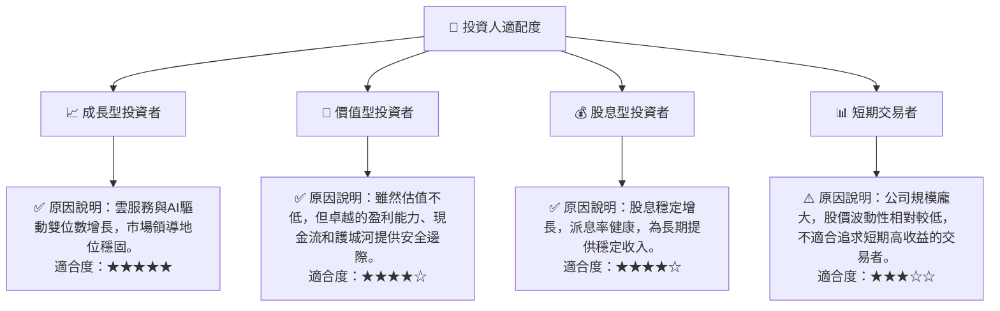

### 10.5 關鍵監控指標

| 監控類型 | 指標 | 關注點 | 頻率 |
|----------|------|--------|------|
| **營收增長** | Azure 雲服務增長率 | 是否保持領先市場的雙位數增長 | 季度 |
| **盈利能力** | 淨利潤率與營業利益率 | 是否維持高位，費用控制是否有效 | 季度/年度 |
| **現金流** | 自由現金流 (FCF) | 是否持續強勁，足以支持投資與回報股東 | 季度/年度 |
| **估值** | Forward P/E 與 PEG Ratio | 相對歷史區間與同業的估值水平 | 每月/季度 |
| **市場份額** | 雲計算、操作系統、辦公軟體市場份額 | 是否保持或擴大市場主導地位 | 年度 |
| **創新與競爭** | AI 產品採用率、新產品發布、競爭對手動態 | AI 戰略執行情況，市場競爭格局變化 | 持續監控 |
| **宏觀經濟** | 企業 IT 支出預算、全球經濟增長預期 | 是否影響公司主要客戶的消費能力 | 季度 |

---

> **免責聲明**：本報告為 AI 自動生成，僅供研究參考，不構成投資建議。投資有風險，入市需謹慎。