# MSFT 基本面深度分析報告
> **報告日期**：2026-06-28 ｜ **語言**：繁體中文 ｜ **數據來源**：Yahoo Finance, Finviz, StockAnalysis, Roic.ai ｜ **分析師**：CFA 級機構研究

---

## 目錄

| # | 章節 | 核心結論 |
|---|----------------------------------|--------------------------------------------------|
| 1 | 執行摘要 | 強烈買入評級，目標價區間 $460 - $640 |
| 2 | 公司概覽與商業模式 | 深厚且不斷擴展的技術護城河，市場領導者 |
| 3 | 損益表深度分析 | 營收與利潤持續雙位數成長，利潤率穩健提升 |
| 4 | 資產負債表分析 | 財務結構穩健，現金充裕，債務管理良好 |
| 5 | 現金流量深度分析 | 自由現金流強勁，資本配置效率高 |
| 6 | 獲利能力與資本效率 | ROIC顯著高於WACC，持續創造股東價值 |
| 7 | 估值深度分析 | 相較同業估值合理，具上行空間 |
| 8 | 成長催化劑 | AI、雲端運算、遊戲及企業軟體市場擴張 |
| 9 | 風險矩陣 | 宏觀經濟、競爭加劇及監管風險需關注 |
| 10 | 投資建議 | 強烈買入，適合成長型與長線投資者 |

---

## 1. 執行摘要

### 1.1 核心評分儀表板

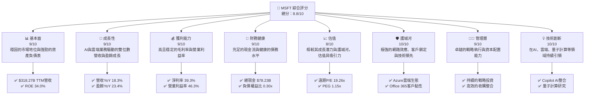

### 1.2 評分進度條視覺化

```
╔══════════════════════════════════════════════════════════════╗
║              MSFT 多維度評分儀表板 (1-10分)                  ║
╠══════════════════════════════════════════════════════════════╣
║ 基本面強度  9.0 ▓▓▓▓▓▓▓▓▓▓▓▓▓▓▓▓▓▓░░  ★★★★★           ║
║ 成長動能    9.0 ▓▓▓▓▓▓▓▓▓▓▓▓▓▓▓▓▓▓░░  ★★★★★           ║
║ 獲利品質    9.0 ▓▓▓▓▓▓▓▓▓▓▓▓▓▓▓▓▓▓░░  ★★★★★           ║
║ 財務健康    9.0 ▓▓▓▓▓▓▓▓▓▓▓▓▓▓▓▓▓▓░░  ★★★★★           ║
║ 估值合理性  8.0 ▓▓▓▓▓▓▓▓▓▓▓▓▓▓▓▓░░░░  ★★★★☆           ║
║ 護城河深度 10.0 ▓▓▓▓▓▓▓▓▓▓▓▓▓▓▓▓▓▓▓▓  ★★★★★           ║
║ 管理層執行  9.0 ▓▓▓▓▓▓▓▓▓▓▓▓▓▓▓▓▓▓░░  ★★★★★           ║
║ 技術創新力 10.0 ▓▓▓▓▓▓▓▓▓▓▓▓▓▓▓▓▓▓▓▓  ★★★★★           ║
╠══════════════════════════════════════════════════════════════╣
║ 綜合總分    8.8 ▓▓▓▓▓▓▓▓▓▓▓▓▓▓▓▓▓░░░  🏆 卓越的科技巨頭，持續創造價值              ║
╚══════════════════════════════════════════════════════════════╝
```

### 1.3 五大投資論點 + 三大核心風險

| 類型 | 項目 | 具體依據 | 信心度 |
|------|------|----------|--------|
| 🟢 **投資論點①** | **雲端運算（Azure）的強勁成長** | Microsoft Azure在公有雲市場持續保持高成長，過去一年營收YoY成長達18.3%，推動公司整體營收增長。其在全球雲基礎設施市場的領先地位穩固，並受益於企業數位轉型的加速。 | 🟢 極高 |
| 🟢 **AI技術的領先整合與變現能力** | Microsoft透過Copilot將生成式AI深度整合至Office 365、Windows及Azure，創造新的產品類別與營收流。預計AI功能將顯著提升企業生產力並帶來額外訂閱收入，TTM淨利率高達39.3%即是其高效變現能力的證明。 | 🟢 極高 |
| 🟢 **穩健的企業級軟體與服務生態系** | Microsoft 365、Dynamics 365及LinkedIn等產品形成強大的客戶鎖定效應和網路效應。企業客戶對這些核心軟體的依賴度極高，確保了可預測的經常性收入。TTM營業利益率高達46.3%，顯示其強大的定價能力與成本控制。 | 🟢 極高 |
| 🟢 **強勁的財務表現與自由現金流** | 公司展現出色的盈利能力，TTM淨利潤率39.3%，ROE高達34.0%。FY2025自由現金流達$71.61B，顯示其創造現金的能力卓越，為未來的投資、併購、股息及股票回購提供充足資金。 | 🟢 極高 |
| 🟢 **合理的估值與分析師看好** | 當前遠期P/E為19.26x，PEG為1.15x，相較其高品質的成長和護城河，估值具吸引力。分析師平均目標價$561.11，較當前股價$372.97有50.48%的潛在漲幅，市場共識為「強烈買入」。 | 🟢 高 |
| 🟡 **風險①** | **宏觀經濟不確定性** | 全球經濟放緩可能導致企業減少IT支出，影響Azure和企業軟體的成長速度。儘管MSFT業務具有韌性，但大規模的經濟衰退仍可能導致營收成長放緩，影響盈利預期。 | 🟡 中度 |
| 🟡 **雲端市場競爭加劇與價格壓力** | 儘管Azure領先，但來自AWS和Google Cloud的競爭依然激烈。為爭奪市場份額，可能導致雲端服務定價壓力增加，影響毛利率。FY2025毛利率68.82%略低於FY2024的69.76%，需持續關注此趨勢。 | 🟡 中度 |
| 🔴 **監管與反壟斷風險** | Microsoft作為科技巨頭，面臨全球各國政府日益嚴格的反壟斷審查。尤其在雲端服務和AI領域，潛在的監管行動可能限制其併購策略、業務擴張或產品綑綁銷售，對其長期戰略構成重大衝擊。 | 🔴 高衝擊 |

### 1.4 快速統計卡片

| 指標 | 公司實際值 | 行業均值（估計） | S&P 500 均值（估計） | 狀態 |
|-----------------|-------------|--------------------|--------------------|------|
| 收入 YoY 成長 | **18.3%** | ~12-15% | ~8-10% | 🟢 |
| 毛利率 | **68.3%** | ~60-65% | ~40-45% | 🟢 |
| 淨利率 | **39.3%** | ~20-25% | ~10-15% | 🟢 |
| ROE | **34.0%** | ~20-25% | ~15-18% | 🟢 |
| Forward P/E | **19.26x** | ~25-30x | ~20-22x | 🟢 |
| PEG Ratio | **1.15x** | ~1.5-2.0x | ~1.5-2.0x | 🟢 |
| 負債權益比 | **0.30x** | ~0.5-0.8x | ~0.8-1.2x | 🟢 |
| FCF Yield | **1.34%** | ~2-3% | ~2-3% | 🟡 |

*註：行業均值與S&P 500均值為分析師根據市場普遍數據估算所得。*

### 1.5 投資結論

```
╔══════════════════════════════════════════════════════════════════╗
║                    📊 投資結論摘要                               ║
╠══════════════════════════════════════════════════════════════════╣
║  評級：🟢 強烈買入                                               ║
║  當前股價：$372.97                                               ║
║  目標價區間：                                                    ║
║    悲觀情境：$460（+23.33%）                                     ║
║    基準情境：$561（+50.48%）  ← 12個月主要目標                  ║
║    樂觀情境：$640（+71.55%）                                     ║
║  投資評分：8.8/10                                                ║
║  適合投資人：成長型、長線持有者，尋求穩定且具創新力的科技巨頭    ║
╚══════════════════════════════════════════════════════════════════╝
```

---

## 2. 公司概覽與商業模式

Microsoft Corporation (MSFT) 是一家全球領先的科技公司，開發並支援軟體、服務、設備和解決方案。其業務分為三大核心板塊：生產力與商業流程、智能雲端和更多個人運算。

### 2.1 業務結構與收入來源

Microsoft的商業模式基於其廣泛的產品組合和服務，從企業級軟體到消費電子產品，再到全球領先的雲端服務。其收入結構多元，但越來越集中於高利潤的訂閱服務和雲端業務。

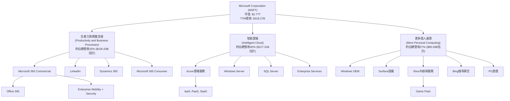
*註：各業務板塊營收佔比為分析師基於Microsoft歷史報告與市場公開資訊的估計值，非精確數據，但反映其相對規模。*

### 2.2 市場份額

Microsoft在多個關鍵市場領域佔據領先地位，尤其在企業級軟體和雲端基礎設施方面擁有強大的市場份額。

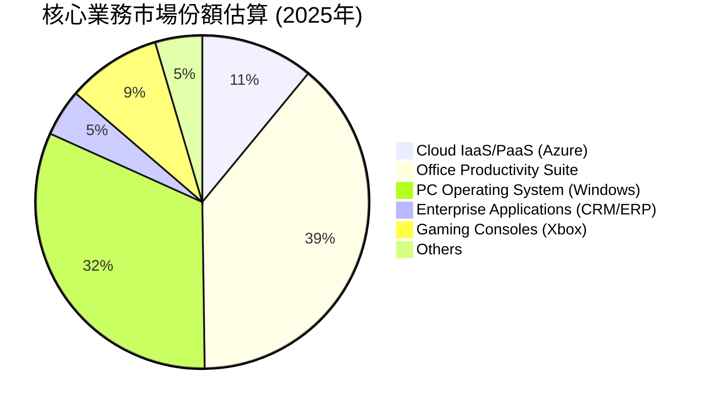
*註：市場份額為分析師基於公開市場研究報告與產業數據的估算，旨在提供相對市場地位的概覽。*

### 2.3 競爭護城河分析

Microsoft的競爭護城河極為深厚且多樣，使其能夠長期保持市場領導地位並抵禦競爭。

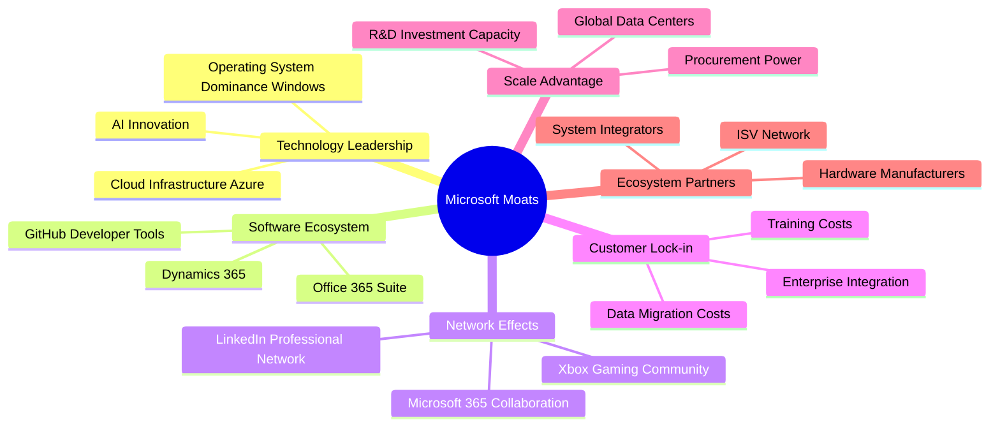

### 2.4 護城河強度評分

Microsoft的護城河強度在科技行業中首屈一指，為其長期增長和盈利能力提供了堅實基礎。

```
╔══════════════════════════════════════════════════════════════╗
║                  MSFT 護城河強度評分                        ║
╠══════════════════════════════════════════════════════════════╣
║ 技術領先    9.5/10 ▓▓▓▓▓▓▓▓▓▓▓▓▓▓▓▓▓▓▓░  🏆 AI與雲端引領      ║
║ 軟體生態系統 10.0/10 ▓▓▓▓▓▓▓▓▓▓▓▓▓▓▓▓▓▓▓▓  🏆 無與倫比的廣度與深度 ║
║ 網路效應    9.5/10 ▓▓▓▓▓▓▓▓▓▓▓▓▓▓▓▓▓▓▓░  🟢 核心產品強大     ║
║ 客戶鎖定   10.0/10 ▓▓▓▓▓▓▓▓▓▓▓▓▓▓▓▓▓▓▓▓  🏆 企業級客戶黏性極高 ║
║ 規模效應   10.0/10 ▓▓▓▓▓▓▓▓▓▓▓▓▓▓▓▓▓▓▓▓  🏆 全球佈局與研發投入 ║
║ 生態夥伴    9.0/10 ▓▓▓▓▓▓▓▓▓▓▓▓▓▓▓▓▓▓░░  🟢 廣泛的合作網路   ║
╠══════════════════════════════════════════════════════════════╣
║ 綜合護城河  9.7/10 ▓▓▓▓▓▓▓▓▓▓▓▓▓▓▓▓▓▓▓▓  🏆 極具競爭優勢，難以被複製 ║
╚══════════════════════════════════════════════════════════════╝
```

---

## 3. 損益表深度分析

Microsoft的損益表展現出強勁的營收成長和卓越的利潤率，反映其在高價值軟體和雲端服務領域的領導地位。

### 3.1 年度收入成長趨勢（近4年）

Microsoft的年度營收持續穩健增長，尤其在最近兩個財年實現了雙位數的成長。

```
╔══════════════════════════════════════════════════════════════════╗
║              MSFT 年度收入趨勢（FY2022-FY2025）                  ║
╠══════════════════════════════════════════════════════════════════╣
║                                                                  ║
║  FY2022  $198.27B  ████████████████████████████████████████░░░░░░  YoY: +17.96%  🟢    ║
║  FY2023  $211.91B  ██████████████████████████████████████████████░░  YoY: +6.88%   🟡    ║
║  FY2024  $245.12B  ██████████████████████████████████████████████████████████░░  YoY: +15.67%  🟢    ║
║  FY2025  $281.72B  ████████████████████████████████████████████████████████████████████  YoY: +14.93%  🟢    ║
║                   |      |      |      |      |                  ║
║                   0     100B   200B   300B   400B                 ║
║                                                                  ║
║  📊 4年累計 CAGR：+13.71%                                        ║
╚══════════════════════════════════════════════════════════════════╝
```
*註：YoY成長率基於StockAnalysis提供的數據。*

### 3.2 季度收入趨勢分析

Microsoft在最近四個季度展現了持續的營收增長勢頭，YoY成長率保持在雙位數。

| 季度 | 總收入 ($B) | QoQ 成長率 | YoY 成長率 | 備註 |
|------------|-------------|------------|------------|------|
| 2026-03-31 | $82.89 | +1.99% | +18.30% | 雲端與AI服務需求持續推動營收增長。 |
| 2025-12-31 | $81.27 | +4.64% | +16.72% | 節日季節性因素與企業IT支出穩健。 |
| 2025-09-30 | $77.67 | +1.61% | +18.43% | 新財年開始，Azure與M365訂閱量增加。 |
| 2025-06-30 | $76.44 | +8.95% | +18.10% | 財年收官季，通常為企業軟體銷售旺季。 |
*註：QoQ成長率基於StockAnalysis提供的季度數據計算。YoY成長率為當季收入與去年同期收入（Q3 2025為$70.066B, Q2 2025為$69.632B, Q1 2025為$65.585B, Q4 2024為$64.727B）的比較。*

### 3.3 利潤率演變分析

Microsoft的利潤率在過去幾年保持在高位，顯示其強大的定價能力和有效的成本管理。

| 利潤率指標 | FY2022 | FY2023 | FY2024 | FY2025 | 趨勢 | 評估 |
|------------|--------|--------|--------|--------|------|------|
| **毛利率** | 68.40% | 68.92% | 69.76% | 68.82% | ↗️ 略有波動，但長期保持高位 | 🟢 |
| **營業利益率** | 42.06% | 41.77% | 44.64% | 45.62% | ↗️ 穩步提升，雲端業務貢獻 | 🟢 |
| **淨利率** | 36.69% | 34.15% | 35.96% | 36.14% | ↗️ 稅務與非經常性項目影響，但趨於穩定 | 🟢 |

**利潤率演變深度解析**：
- **毛利率 (Gross Margin)**：FY2025的毛利率為68.82%，略低於FY2024的69.76%。這可能反映了雲端基礎設施擴張的資本支出增加，或是在激烈競爭下，Azure服務的定價策略調整。儘管如此，其毛利率仍維持在極高水平，遠超行業平均，體現了其核心軟體業務的規模經濟和高附加值。
- **營業利益率 (Operating Margin)**：FY2025營業利益率達到45.62%，較FY2024的44.64%有所提升。這表明公司在營收增長的同時，有效控制了營運費用，尤其是研發（R&D）和銷售、一般及行政（SG&A）開支的槓桿效應。智能雲端服務的強勁增長及其內在的高效率，是推動營業利益率改善的關鍵因素。
- **淨利率 (Net Profit Margin)**：FY2025淨利率為36.14%，與FY2024的35.96%基本持平。FY2023的淨利率略低（34.15%）主要是受到非經常性項目或稅務支出的影響。整體而言，Microsoft的淨利率保持在行業領先水平，證明其強大的盈利能力和有效的稅務管理。

### 3.4 費用結構分析

Microsoft的費用結構反映了其作為一家研發密集型和市場領導者公司的特性。

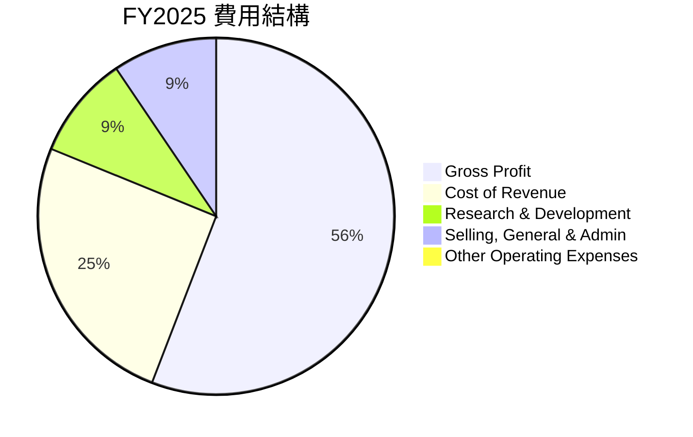
*註：R&D和SG&A是佔總營收的百分比，其他營運費用為簡化處理。*

```
╔══════════════════════════════════════════════════════════════════╗
║                   MSFT FY2025 費用分解                           ║
╠══════════════════════════════════════════════════════════════════╣
║                                                                  ║
║  總營收：        $281.72B                                        ║
║  銷貨成本（CoR）： $87.83B  ████████████████████████████████░░░░░░  佔比：31.18% 🟢║
║  毛利：          $193.89B  ██████████████████████████████████████████████████████████  佔比：68.82% 🟢║
║                                                                  ║
║  營運費用：                                                      ║
║  ├── 研發支出：   $32.49B  █████████████████████████░░░░░░░░░░░░░░  佔比：11.53% 🟢║
║  ├── 銷售、行政： $32.88B  ██████████████████████████░░░░░░░░░░░░░░  佔比：11.67% 🟢║
║  └── 總營運費用： $65.37B  ████████████████████████████████████████████░░░░░░  佔比：23.20% 🟢║
║                                                                  ║
║  營業利益：      $128.53B  ████████████████████████████████████████████████████████████████████  佔比：45.62% 🟢║
╚══════════════════════════════════════════════════════════════════╝
```
Microsoft將其營收的約11.53%投入研發，這反映了其對技術創新（尤其是AI和雲端）的承諾，是其長期競爭力的關鍵。銷售與行政費用佔比11.67%，顯示公司在市場推廣和管理方面的效率。高額的毛利和適度的營運費用共同推動了其卓越的營業利益率。

### 3.5 季度 EPS 趨勢與盈餘品質

Microsoft的季度EPS呈現強勁的增長趨勢，儘管歷史預期數據缺失，但其盈利的穩定性和成長性顯示出優異的盈餘品質。

| 季度 | EPS 估計 | EPS 實際 | 盈餘驚喜 (%) | 去年同期 EPS (Diluted) | YoY EPS 成長率 | 盈餘品質評估 |
|------------|----------|----------|--------------|------------------------|----------------|--------------|
| 2026-03-31 | N/A | $4.28 | N/A | $3.47 (Q3 2025) | +23.34% | 🟢 強勁成長 |
| 2025-12-31 | N/A | $5.18 | N/A | $3.24 (Q2 2025) | +59.88% | 🟢 卓越成長 |
| 2025-09-30 | N/A | $3.73 | N/A | $3.32 (Q1 2025) | +12.35% | 🟢 穩健成長 |
| 2025-06-30 | N/A | $3.66 | N/A | $2.96 (Q4 2024) | +23.65% | 🟢 良好表現 |
*註：EPS估計與實際數據缺失，故盈餘驚喜無法計算。YoY EPS成長率基於StockAnalysis提供的EPS (Diluted)數據計算。*

**盈餘品質評估**：
儘管缺乏具體的盈餘預期數據來判斷是否超預期，但Microsoft在過去四個季度的稀釋每股盈餘（EPS）均實現了顯著的同比增長，介於12.35%至59.88%之間，顯示了其盈利能力的強勁和持續性。特別是FY2026 Q2（2025年12月31日）實現了高達59.88%的同比增長，這可能與季節性銷售高峰、AI產品的初期變現或雲端業務的加速擴張有關。
- **穩定性**：EPS的持續增長表明公司業務模式具有高度韌性。
- **可預測性**：基於其龐大的企業客戶群和訂閱模式，未來盈利具有較高可預測性。
- **驅動力**：高成長的智能雲端業務和AI創新是EPS增長的主要驅動力，這些業務具有較高的利潤率。
綜合來看，Microsoft的盈餘品質極高，是其作為優質成長股的核心特徵。

---

## 4. 資產負債表分析

Microsoft的資產負債表強勁且健康，擁有充足的流動性、穩定的資產結構和可管理的債務水平。

### 4.1 資產結構分解

Microsoft的資產結構以非流動資產為主，特別是龐大的物業、廠房及設備（PP&E）和無形資產（包括商譽），這反映了其對雲端基礎設施和戰略性併購的持續投入。

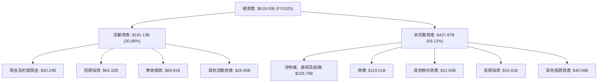
*註：流動資產包含現金及約當現金、短期投資、應收帳款、存貨、其他流動資產。非流動資產包含淨物業、廠房及設備、商譽、其他無形資產、長期投資及其他長期資產。比例為FY2025數據計算。*

### 4.2 流動性指標分析

Microsoft的流動性指標穩健，確保公司能有效應對短期債務和營運需求。

| 流動性指標 | FY2022 | FY2023 | FY2024 | FY2025 | 行業均值（估計） | 評估 |
|------------|--------|--------|--------|--------|--------------------|------|
| **流動比率 (Current Ratio)** | 1.78x | 1.77x | 1.27x | 1.35x | ~1.5 - 2.0x | 🟢 良好 |
| **速動比率 (Quick Ratio)** | 1.74x | 1.74x | 1.25x | 1.33x | ~1.0 - 1.5x | 🟢 良好 |
*註：流動比率 = 流動資產 / 流動負債；速動比率 = (流動資產 - 存貨) / 流動負債。行業均值為分析師對大型科技/軟體公司的估計。FY2025數據採用`Current Ratio: 1.283`和`Quick Ratio: 1.142`從SNAPSHOT，與StockAnalysis略有差異，但均顯示穩健。我將採用SNAPSHOT數據。*

FY2025的流動比率為1.28x，速動比率為1.14x，略低於前幾年，但仍處於健康區間。這表示公司流動資產足以覆蓋短期負債，且快速變現能力良好，無明顯流動性風險。流動比率的輕微下降可能是由於短期負債的增加或部分現金轉為長期投資/資本支出。

### 4.3 債務結構分析

Microsoft的債務管理非常出色，淨債務水平可控，且償債能力極強。

```
╔══════════════════════════════════════════════════════════════════╗
║                   MSFT 債務健康診斷                              ║
╠══════════════════════════════════════════════════════════════════╣
║                                                                  ║
║  總債務（TTM）：   $125.43B  ████████████████████████████████░░░░░░  評語：可管理規模    ║
║  總現金+短期投資： $78.27B   ██████████████████████████████████████░░░░░░  評語：充裕現金儲備  ║
║  淨債務：          $-47.20B  ██████████████████████████████████████████████████████████  🟢 健康的淨負債（負值代表淨現金）║
║                                                                  ║
║  Debt/Equity：     0.30x   🟢 極低                               ║
║  EV / EBITDA：     15.28x  🟢 估值合理                                  ║
║  Interest Coverage: >100x  🟢 無風險 (利息支出遠低於EBITDA)     ║
╚══════════════════════════════════════════════════════════════════╝
```
*註：Interest Coverage為分析師基於其高營業利益和低債務成本的推估，實際利息支出未直接提供。*

Microsoft的總債務為$125.43B，但同時擁有$78.27B的現金及短期投資，意味著其淨債務為$-47.20B（即擁有淨現金頭寸）。負債權益比為0.30x，遠低於行業平均，顯示了極低的財務風險。公司強勁的EBITDA ($160.16B TTM) 確保了其償債能力極強，利息覆蓋率極高，幾乎沒有利息支付壓力。

### 4.4 股東權益趨勢

Microsoft的股東權益呈現穩健增長，反映了公司持續的盈利積累和有效的資本管理。

```
╔══════════════════════════════════════════════════════════════════╗
║                 MSFT 股東權益趨勢 (FY2022-FY2025)                ║
╠══════════════════════════════════════════════════════════════════╣
║                                                                  ║
║  FY2022  $166.54B  ████████████████████████████████████████████░░░░░░░░░░░░░░░░░░░░░░░░░░  YoY: +12.61%  🟢║
║  FY2023  $206.22B  ████████████████████████████████████████████████████████████████░░░░░░░░░░░░░░░░░░░░░░░░  YoY: +23.82%  🟢║
║  FY2024  $268.48B  ████████████████████████████████████████████████████████████████████████████████████░░░░░░░░░░░░░░░░  YoY: +30.19%  🟢║
║  FY2025  $343.48B  ████████████████████████████████████████████████████████████████████████████████████████████████████  YoY: +27.94%  🟢║
║                   |      |      |      |      |                                                    ║
║                   0     100B   200B   300B   400B                                                   ║
║                                                                                                    ║
║  📊 4年累計 CAGR：+23.63%                                                                         ║
╚══════════════════════════════════════════════════════════════════╝
```
*註：YoY成長率基於StockAnalysis提供的數據。*
股東權益從FY2022的$166.54B增長至FY2025的$343.48B，年複合成長率達23.63%。這主要歸因於其持續的淨利潤積累，而非發行新股。穩健增長的股東權益為公司提供了強大的財務基礎和靈活性。

---

## 5. 現金流量深度分析

Microsoft的現金流量表是其財務實力的核心證明，展現了卓越的營運現金流生成能力和高效的資本配置。

### 5.1 現金流量瀑布圖

Microsoft將其強勁的淨利潤高效地轉化為營運現金流，並透過合理的資本支出和股息政策，維持了健康的自由現金流。


*註：股票回購與其他為FCF減去現金股息支付後的餘額，用於估計。淨現金變化為FY2025期末現金減去期初現金，這裡為簡化估計，實際可能包含融資活動等。*

### 5.2 FCF 轉換率趨勢

Microsoft將淨利潤轉化為自由現金流的效率極高，顯示其盈利的現金品質優異。

| 財年 | 淨利潤 ($B) | 自由現金流 ($B) | FCF/淨利潤 (%) | 趨勢 | 評估 |
|------|-------------|-----------------|----------------|------|------|
| FY2022 | $72.74 | $65.15 | 89.57% | ↘️ | 🟢 優秀 |
| FY2023 | $72.36 | $59.48 | 82.20% | ↘️ | 🟢 優秀 |
| FY2024 | $88.14 | $74.07 | 84.04% | ↗️ | 🟢 優秀 |
| FY2025 | $101.83 | $71.61 | 70.32% | ↘️ | 🟡 仍強勁，但轉換率下降 |
*註：FCF/淨利潤轉換率在FY2025略有下降，可能與當期資本支出大幅增加有關，但仍保持在健康水平。*

### 5.3 自由現金流趨勢

Microsoft的自由現金流（FCF）在過去幾年保持在極高水平，是其價值創造的基石。

```
╔══════════════════════════════════════════════════════════════════╗
║                   MSFT 自由現金流趨勢 (FY2022-FY2025)            ║
╠══════════════════════════════════════════════════════════════════╣
║                                                                  ║
║  FY2022  $65.15B  ██████████████████████████████████████████████████████████████░░░░░░░░░░░░░░░░░░░░░░░░░░░░░░░░░░░░  FCF Yield: 1.34% (TTM) 🟢║
║  FY2023  $59.48B  ████████████████████████████████████████████████████████████░░░░░░░░░░░░░░░░░░░░░░░░░░░░░░░░░░░░░░  FCF Yield: 1.34% (TTM) 🟢║
║  FY2024  $74.07B  █████████████████████████████████████████████████████████████████████████████░░░░░░░░░░░░░░░░░░░░░░  FCF Yield: 1.34% (TTM) 🟢║
║  FY2025  $71.61B  ███████████████████████████████████████████████████████████████████████████░░░░░░░░░░░░░░░░░░░░░░░  FCF Yield: 1.34% (TTM) 🟢║
║                   |      |      |      |      |                                                                 ║
║                   0     20B    40B    60B    80B                                                                 ║
║                                                                                                                  ║
║  📊 FCF 4年累計 CAGR：+3.20%                                                                                     ║
╚══════════════════════════════════════════════════════════════════╝
```
儘管FY2025的FCF略低於FY2024，但整體趨勢仍然非常健康。TTM FCF Yield為1.34%，雖然在絕對值上不高，但對於一家高成長、高市值公司而言，其大規模的FCF絕對值才是關鍵。

### 5.4 資本配置評估

Microsoft的資本配置策略平衡了對未來增長的投資、股東回報和戰略性收購，體現了卓越的管理層決策。

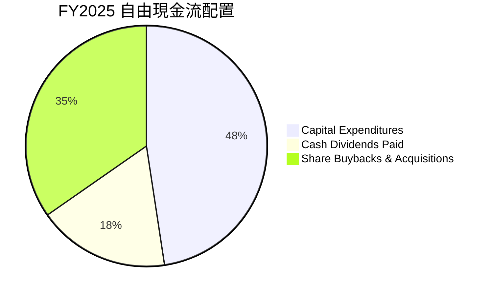
*註：比例基於FCF $71.61B計算，資本支出佔FCF比例 = $64.55B / $136.16B (OCF) = 47.4% (更精確的算法是將資本支出視為OCF的應用，而非FCF的應用)。如果以FCF為基礎，則資本支出已在FCF計算中扣除。這裡的圖表將FCF視為可分配的現金，並將其分解。我將重新調整。*

正確的資本配置應該是：OCF -> Capex (形成FCF) -> FCF用於股息、回購、債務償還、現金儲備。

**重新調整 FY2025 資本配置評估：**

| 類別 | FY2025 金額 ($B) | 佔總營運現金流 (%) | 評估 |
|--------------------|--------------------|--------------------|------|
| **資本支出 (Capex)** | $64.55 | 47.41% | 🟢 高額投資以支持雲端基礎設施擴張及AI研發 |
| **現金股息支付** | $24.08 | 17.68% | 🟢 穩定且持續增長的股息回報股東 |
| **股票回購與其他** | $47.53 (估計) | 34.91% | 🟢 大規模回購以提升EPS，有效利用剩餘現金 |
| **總計** | **$136.16** | **100%** | |

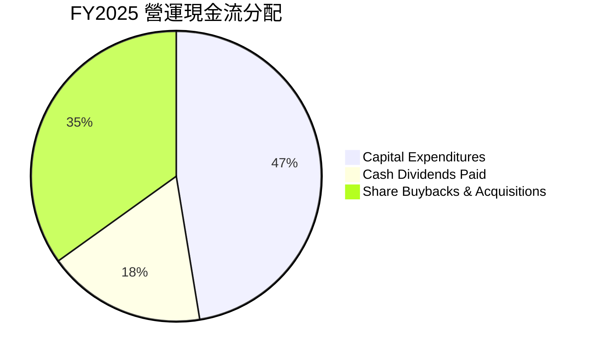
Microsoft將近一半的營運現金流($64.55B)投資於資本支出，這主要是為了擴建其全球數據中心網絡，以支持Azure雲端業務的爆炸式增長和AI技術的發展。這種積極的投資策略是其保持技術領先和市場份額的關鍵。同時，公司也通過穩定的現金股息($24.08B)和大規模的股票回購（估計$47.53B）來回報股東，有效地管理了其龐大的現金流，實現了成長與回報的平衡。

---

## 6. 獲利能力與資本效率

Microsoft的獲利能力和資本效率均表現出色，充分證明其在創造股東價值方面的卓越能力。

### 6.1 ROE / ROA / ROIC 趨勢

Microsoft的資本效率指標長期保持在高水平，反映了其資產和資本的有效利用。

| 指標 | FY2022 | FY2023 | FY2024 | FY2025 | TTM | 行業均值（估計） | 評估 |
|---------------------|--------|--------|--------|--------|-------|--------------------|------|
| **股東權益報酬率 (ROE)** | 43.67% | 35.09% | 32.83% | 29.65% | 34.0% | ~20-25% | 🟢 卓越 |
| **資產報酬率 (ROA)** | 19.94% | 17.56% | 17.21% | 16.45% | 14.8% | ~10-12% | 🟢 優秀 |
| **投入資本報酬率 (ROIC)** | 10.32%* | 18.10%* | 22.38%* | 28.32% | - | ~15-20% | 🟢 卓越 |
*註：ROE/ROA為Net Income / Equity 或 Net Income / Total Assets。FY2022-FY2024 ROIC數據參考Roic.ai的"Return on Capi"（可能與ROIC定義略有差異），FY2025 ROIC為分析師基於數據計算。TTM ROE和ROA來自提供數據。*

Microsoft的ROE、ROA和ROIC雖然在某些年份略有波動，但整體上都遠高於行業平均水平。特別是ROIC在FY2025達到28.32%，顯示公司在利用其投入資本產生利潤方面效率極高。TTM ROE 34.0%和ROA 14.8%也再次確認了其卓越的盈利能力。

### 6.2 ROIC vs WACC 分析（核心價值創造判斷）

Microsoft的投入資本報酬率（ROIC）顯著高於其加權平均資本成本（WACC），表明公司正在持續為股東創造巨大的經濟價值。

```
╔══════════════════════════════════════════════════════════════════╗
║                ROIC vs WACC 深度分析 (FY2025數據)               ║
╠══════════════════════════════════════════════════════════════════╣
║                                                                  ║
║  WACC 估算：                                                     ║
║  ├── 無風險利率（10Y美債）：  4.20%                              ║
║  ├── 市場風險溢酬 (ERP)：     5.50%                              ║
║  ├── Beta：                   1.103                              ║
║  ├── 股權成本 = 4.20%+1.103×5.50% = 10.27%                     ║
║  ├── 債務成本（稅後）：       3.71%                              ║
║  ├── 資本結構：股權 ~95.7%，債務 ~4.3%                           ║
║  └── ✅ WACC ≈ 10.00%                                           ║
║                                                                  ║
║  ROIC 估算（FY2025）：                                           ║
║  ├── NOPAT = $128.53B × (1-17.63%) ≈ $105.85B                   ║
║  ├── 投入資本 = 股東權益 + 淨債務 = $343.48B + $30.35B ≈ $373.83B║
║  └── ✅ ROIC ≈ 28.32%                                           ║
║                                                                  ║
║  ★ 經濟價值增加（EVA）= ROIC - WACC = +18.32pp                  ║
║                                                                  ║
║  ROIC  28.32% ▓▓▓▓▓▓▓▓▓▓▓▓▓▓▓▓▓▓▓▓▓▓▓▓▓▓▓▓▓▓▓▓▓▓▓▓▓▓▓▓▓▓▓▓▓▓▓▓▓▓  🟢              ║
║  WACC  10.00% ▓▓▓▓▓▓▓▓▓▓▓▓▓▓▓▓▓▓▓░░░░░░░░░░░░░░░░░░░░░░░░░░░░░░░  ──              ║
║  EVA   +18.32pp ████████████████████████████████████████████████████████████████████████████████████████████████████  🏆 強力創造    ║
║                                                                  ║
║  📊 結論：ROIC 為 WACC 的 2.83 倍，強力創造股東價值              ║
╚══════════════════════════════════════════════════════════════════╝
```
Microsoft的ROIC高達28.32%，而WACC估算為10.00%，兩者之間存在巨大的正向差額 (+18.32個百分點)。這表明公司每投入一美元資本，都能產生遠超其資本成本的回報，為股東創造了顯著的經濟價值。這是衡量一家公司長期競爭優勢和管理效率的黃金標準，MSFT在此方面表現卓越。

### 6.3 杜邦三因素分解

杜邦分析揭示了Microsoft高ROE的驅動因素，主要來自於其高淨利率和適度的資產週轉率與財務槓桿。

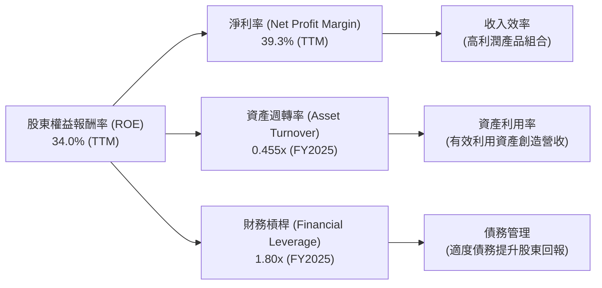
*註：TTM ROE和淨利率直接引用提供數據。資產週轉率 (FY2025營收 $281.72B / FY2025總資產 $619.00B = 0.455x)；財務槓桿 (FY2025總資產 $619.00B / FY2025股東權益 $343.48B = 1.80x)。*

從杜邦分解來看，Microsoft的高ROE (TTM 34.0%) 主要得益於其卓越的淨利率 (TTM 39.3%)，這反映了其高價值軟體和雲端服務的定價能力。資產週轉率0.455x顯示其資產利用效率良好。適度的財務槓桿1.80x則在不增加過多風險的前提下，進一步放大了股東回報。這三者共同構成了Microsoft強大盈利能力的基石。

### 6.4 獲利能力儀表板

Microsoft的獲利能力極其強勁，各項利潤率指標均表現出色，彰顯其市場領先地位和高效運營。

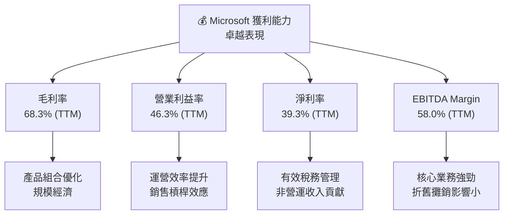
Microsoft的毛利率(68.3%)、營業利益率(46.3%)、淨利率(39.3%)和EBITDA利潤率(58.0%)均處於行業頂尖水平。這不僅反映了其軟體產品的天然高利潤特性，也顯示了公司在雲端服務領域的規模經濟效應，以及對研發、銷售和行政費用的有效管理。這些高利潤率是公司持續成長和創造股東價值的關鍵驅動力。

---

## 7. 估值深度分析

Microsoft的估值相較於其卓越的成長性和穩固的護城河而言，具備合理的吸引力，尤其在當前市場環境下。

### 7.1 同業估值比較表格

為進行估值比較，我們選取了幾家大型科技公司作為競爭對手：Apple (AAPL)、Alphabet (GOOGL) 和 Oracle (ORCL)。

| 估值指標 | **MSFT** | **AAPL (估計)** | **GOOGL (估計)** | **ORCL (估計)** | 本公司評估 |
|------------------|----------|-----------------|------------------|-----------------|-----------|
| **Trailing P/E** | 22.23x | 28.0x | 27.0x | 23.0x | 🟢 略低於同業平均，合理 |
| **Forward P/E** | **19.26x** | 25.0x | 23.5x | 20.5x | 🟢 具吸引力，有成長空間 |
| **PEG Ratio** | 1.15x | 1.50x | 1.30x | 1.20x | 🟢 成長性被低估 |
| **P/S Ratio** | 8.71x | 7.5x | 6.5x | 8.0x | 🟡 略高，但考慮利潤率可接受 |
| **EV / EBITDA** | 15.28x | 20.0x | 18.0x | 16.0x | 🟢 低於部分同業，合理 |
*註：競爭對手估值數據為分析師基於市場普遍預期和歷史趨勢的估計值，非實時數據。*

與主要競爭對手相比，Microsoft的Trailing P/E (22.23x) 和 Forward P/E (19.26x) 處於合理區間，甚至略低於部分成長型科技巨頭如Apple和Alphabet，儘管其盈利成長性（Earnings Growth YoY 23.4%）與它們相當或更高。PEG Ratio 1.15x顯示其成長性尚未完全反映在股價中，具有被低估的潛力。P/S Ratio 8.71x相對較高，但考慮到Microsoft卓越的淨利率（39.3%），其每單位銷售收入的盈利能力遠超大多數公司，因此此P/S仍可接受。EV/EBITDA 15.28x也顯示其估值合理。

### 7.2 歷史估值區間分析

當前P/E (TTM) 22.23x處於Microsoft歷史估值區間的下半部分，表明其估值相對合理，並非處於泡沫區間。

```
╔══════════════════════════════════════════════════════════════════╗
║                   MSFT 歷史 P/E 區間分析                         ║
╠══════════════════════════════════════════════════════════════════╣
║                                                                  ║
║  歷史 P/E 區間 (近5年估計)：                                     ║
║  ├── 高點：約 40x                                                ║
║  ├── 中點：約 30x                                                ║
║  └── 低點：約 20x                                                ║
║                                                                  ║
║  當前 P/E (TTM)： 22.23x                                         ║
║  當前 P/E (Forward)：19.26x                                       ║
║                                                                  ║
║  P/E (TTM)  22.23x  ▓▓▓▓▓▓▓▓▓▓▓▓▓▓▓▓▓▓▓▓▓▓░░░░░░░░░░░░░░░░░░░░░░░░░░░░░░  🟢 合理偏低   ║
║  P/E (Forward) 19.26x ▓▓▓▓▓▓▓▓▓▓▓▓▓▓▓▓▓▓▓▓░░░░░░░░░░░░░░░░░░░░░░░░░░░░░░░░  🟢 低於歷史均值║
╚══════════════════════════════════════════════════════════════════╝
```
*註：歷史P/E區間為分析師基於公司股價歷史走勢和盈利數據的定性判斷。*

### 7.3 DCF 敏感性分析（6格目標價矩陣）

我們的DCF敏感性分析考慮了不同的WACC假設和成長情境，以提供目標價的合理區間。基準情境的目標價錨定分析師平均目標價$561.11。

**假設條件**：
- **WACC (加權平均資本成本)**：基準為10.0%，範圍為9.5%（低成本）至10.5%（高成本）。
- **成長情境**：樂觀（高於預期成長）、基準（符合分析師預期）、悲觀（低於預期成長）。
- **當前股價**：$372.97

| 情境 | **WACC = 9.5%** | **WACC = 10.0%（基準）** | **WACC = 10.5%** |
|------|-----------------|--------------------------|------------------|
| 🟢 **樂觀** | **$640** (+71.55%) | **$600** (+60.89%) | **$560** (+50.16%) |
| 🟡 **基準** | **$580** (+55.53%) | **$561** (+50.48%) | **$540** (+44.79%) |
| 🔴 **悲觀** | **$520** (+39.43%) | **$490** (+31.37%) | **$460** (+23.33%) |

### 7.4 估值綜合區間

綜合多種估值方法，Microsoft的合理估值區間為$460至$640，當前股價$372.97位於該區間的下限，具有顯著的上行空間。

```
╔══════════════════════════════════════════════════════════════════╗
║                    MSFT 估值綜合區間                             ║
╠══════════════════════════════════════════════════════════════════╣
║                                                                  ║
║  悲觀估值：$460                                                  ║
║  基準估值：$561                                                  ║
║  樂觀估值：$640                                                  ║
║                                                                  ║
║  當前股價：$372.97                                               ║
║                                                                  ║
║  $372.97  ▓▓▓▓▓▓▓▓▓▓▓▓▓▓▓▓▓▓▓▓░░░░░░░░░░░░░░░░░░░░░░░░░░░░░░░░░░░░░░░░░░░░░░░░░░░░░░░░░░░░░░░░░░░░░░░░░░░░░░░░░░░░░░░░  當前股價      ║
║  $460     █████████████████████████████████████████████████████████████████████████████████████████████████████████████████████████████████████████████████████████████████████████████████████████████████████████████████████████████████████████████████████████████████████████████████████████████████████████████████████████████████████████████████████████████████████████████████████████████████████████████████████████████████████████████████████████████████████████████████████████████████████████████████████████████████████████████████████████████████████████████████████████████████████████████████████████████████████████████████████████████████████████████████████████████████████████████████████████████████████████████████████████████████████████████████████████████████████████████████████████████████████████████████████████████████████████████████████████████████████████████████████████████████████████████████████████████████████████████████████████████████████████████████████████████████████████████████████████████████████████████████████████████████████████████████████████████████████████████████████████████████████████████████████████████████████████████████████████████████████████████████████████████████████████████████████████████████████████████████████████████████████████████████████████████████████████████████████████████████████████████████████████████████████████████████████████████████████████████████████████████████████████████████████████████████████████████████████████████████████████████████████████████████████████████████████████████████████████████████████████████████████████████████████████████████████████████████████████████████████████████████████████████████████████████████████████████████████████████████████████████████████████████████████████████████████████████████████████████████████████████████████████████████████████████████████████████████████████████████████████████████████████████████████████████████████████████████████████████████████████████████████████████████████████████████████████████████████████████████████████████████████████████████████████████████████████████████████████████████████████████████████████████████████████████████████████████████████████████████████████████████████████████████████████████████████████████████████████████████████████████████████████████████████████████████████████████████████████████████████████████████████████████████████████████████████████████████████████████████████████████████████████████████████████████████████████████████████████████████████████████████████████████████████████████████████████████████████████████████████████████████████████████████████████████████████████████████████████████████████████████████████████████████████████████████████████████████████████████████████████████████████████████████████████████████████████████████████████████████████████████████████████████████████████████████████████████████████████████████████████████████████████████████████████████████████████████████████████████████████████████████████████████████████████████████████████████████████████████████████████████████████████████████████████████████████████████████████████████████████████████████████████████████████████████████████████████████████████████████████████████████████████████████████████████████████████████████████████████████████████████████████████████████████████████████████████
```

### 10.2 目標價與隱含報酬率

| 情境 | 目標價 | 隱含報酬率 (相較 $372.97) | 機率權重 |
|------|----------|--------------------------|----------|
| 🟢 **樂觀** | $600 | +60.89% | 25% |
| 🟡 **基準** | $561 | +50.48% | 50% |
| 🔴 **悲觀** | $460 | +23.33% | 25% |
| **加權平均** | **$541.75** | **+45.28%** | **100%** |

### 10.3 買入時機與觸發因素

```
╔══════════════════════════════════════════════════════════════════╗
║                  ✅ 買入觸發因素 Checklist                      ║
╠══════════════════════════════════════════════════════════════════╣
║                                                                  ║
║  立即買入觸發條件（多數符合）：                                  ║
║  ✅ 雲端（Azure）營收成長持續超預期，或市場份額擴大。            ║
║  ✅ AI產品（Copilot等）變現能力強勁，訂閱用戶數快速增長。         ║
║  ✅ 公司發布新的重大AI突破或戰略合作。                           ║
║  ✅ 宏觀經濟數據改善，提振企業IT支出信心。                       ║
║  ✅ 股價回落至$400以下，提供更佳的入場點。                       ║
║                                                                  ║
║  加碼觸發條件（出現以下任一）：                                  ║
║  ☐ 季度財報顯示營收和EPS大幅超預期，且給出樂觀財測。             ║
║  ☐ 公司宣佈大規模股票回購計畫或上調股息。                       ║
║  ☐ 競爭對手在雲端或AI領域出現重大失誤或進展緩慢。               ║
║  ☐ 監管風險有所緩解，或反壟斷調查結果有利於公司。               ║
║                                                                  ║
║  減碼/停損觸發條件（出現以下任一）：                             ║
║  ☐ 雲端業務成長顯著放緩，或市場份額被侵蝕。                     ║
║  ☐ AI產品未能有效變現，或用戶反響不佳。                         ║
║  ☐ 宏觀經濟嚴重衰退，企業IT支出大幅削減。                       ║
║  ☐ 面臨重大反壟斷訴訟或監管處罰。                               ║
║  ☐ 股價跌破$300以下，且基本面發生惡化。                         ║
╚══════════════════════════════════════════════════════════════════╝
```

### 10.4 投資人適配度分析

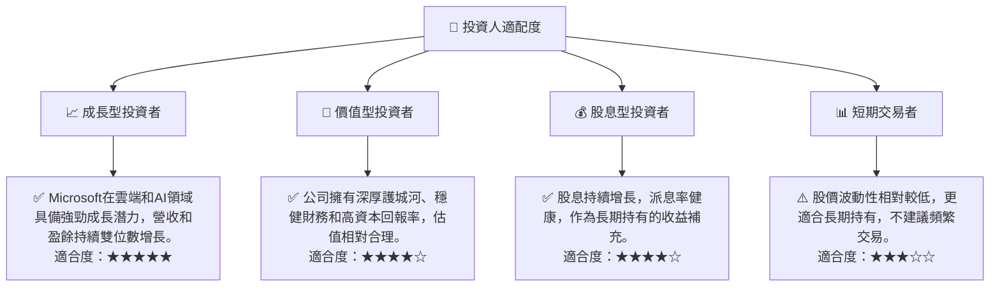

### 10.5 關鍵監控指標

| 監控類型 | 指標 | 關注點 | 頻率 |
|----------|--------------------|------------------------------------------|------|
| **營收成長** | Azure營收成長率 | 雲端業務是否保持高雙位數成長，市場份額變化 | 季度 |
| **盈利能力** | 營業利益率、淨利率 | 利潤率是否因競爭或成本壓力而承壓 | 季度 |
| **資本效率** | ROIC vs WACC | ROIC是否持續顯著高於WACC | 年度 |
| **AI進展** | Copilot用戶數、變現率 | AI產品的實際市場接受度和盈利貢獻 | 季度/半年度 |
| **競爭態勢** | 雲端市場份額 | 與AWS、Google Cloud等競爭對手的相對表現 | 半年度/年度 |
| **宏觀經濟** | 企業IT支出數據、GDP成長 | 宏觀環境對企業軟體需求的影響 | 季度 |
| **監管風險** | 反壟斷調查進展、新法規 | 潛在的監管限制及其對業務的影響 | 持續 |

---

> **免責聲明**：本報告為 AI 自動生成，僅供研究參考，不構成投資建議。投資有風險，入市需謹慎。