# MSFT 基本面深度分析報告
> **報告日期**：2026-07-07 ｜ **語言**：繁體中文 ｜ **數據來源**：Yahoo Finance, Finviz, StockAnalysis, Roic.ai ｜ **分析師**：CFA 級機構研究

---

## 目錄

| # | 章節 | 核心結論 |
|---|------------------------|--------------------------------------------------|
| 1 | 執行摘要 | 評級：🟢 買入，目標價區間 $480 - $580 |
| 2 | 公司概覽與商業模式 | 業務多元，雲端與AI為核心驅動力；護城河極深 |
| 3 | 損益表深度分析 | 收入與利潤持續強勁成長，利潤率穩健提升 |
| 4 | 資產負債表分析 | 財務結構穩健，流動性充裕，債務管理良好 |
| 5 | 現金流量深度分析 | 營業現金流強勁，自由現金流穩定，資本配置效率高 |
| 6 | 獲利能力與資本效率 | ROIC顯著超越WACC，持續為股東創造價值 |
| 7 | 估值深度分析 | 相較同業估值合理，DCF顯示上行空間 |
| 8 | 成長催化劑 | AI創新、雲端擴張、企業數位轉型持續驅動成長 |
| 9 | 風險矩陣 | 監管、激烈競爭、宏觀經濟為主要風險 |
| 10| 投資建議 | 建議買入，適合成長型與長線持有者 |

---

## 1. 執行摘要

### 1.1 核心評分儀表板

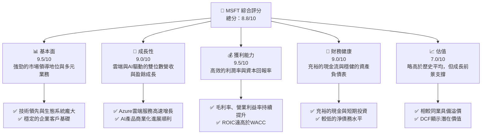

### 1.2 評分進度條視覺化

```
╔══════════════════════════════════════════════════════════════╗
║              MSFT 多維度評分儀表板 (1-10分)                  ║
╠══════════════════════════════════════════════════════════════╣
║ 基本面強度  9.5 ▓▓▓▓▓▓▓▓▓▓▓▓▓▓▓▓▓▓▓░  ★★★★★           ║
║ 成長動能    9.0 ▓▓▓▓▓▓▓▓▓▓▓▓▓▓▓▓▓▓░░  ★★★★★           ║
║ 獲利品質    9.5 ▓▓▓▓▓▓▓▓▓▓▓▓▓▓▓▓▓▓▓░  ★★★★★           ║
║ 財務健康    9.0 ▓▓▓▓▓▓▓▓▓▓▓▓▓▓▓▓▓▓░░  ★★★★★           ║
║ 估值合理性  7.0 ▓▓▓▓▓▓▓▓▓▓▓▓▓▓░░░░░░  ★★★★☆           ║
║ 護城河深度  9.8 ▓▓▓▓▓▓▓▓▓▓▓▓▓▓▓▓▓▓▓▓  ★★★★★           ║
║ 管理層執行  9.5 ▓▓▓▓▓▓▓▓▓▓▓▓▓▓▓▓▓▓▓░  ★★★★★           ║
║ 技術創新力  9.7 ▓▓▓▓▓▓▓▓▓▓▓▓▓▓▓▓▓▓▓░  ★★★★★           ║
╠══════════════════════════════════════════════════════════════╣
║ 綜合總分    8.8 ▓▓▓▓▓▓▓▓▓▓▓▓▓▓▓▓▓░░░  🏆 評語：卓越的科技巨頭，具備持續成長潛力    ║
╚══════════════════════════════════════════════════════════════╝
```

### 1.3 五大投資論點 + 三大核心風險

| 類型 | 項目 | 具體依據 | 信心度 |
|------|------|----------|--------|
| 🟢 **投資論點①** | **雲端運算領導地位** | Azure在FY2025實現14.93%的年收入成長，並持續擴大市場份額，成為推動整體營收增長的核心引擎。TTM收入達$318.27B，YoY成長18.3%。 | 🟢 極高 |
| 🟢 **投資論點②** | **AI 技術的商業化潛力** | Microsoft Copilot等AI產品的推出，預計將在未來數年內為企業級應用帶來顯著的營收增量和效率提升。其在AI領域的研發投入（FY2025 R&D支出$32.49B）確保了技術領先優勢。 | 🟢 極高 |
| 🟢 **投資論點③** | **強勁的獲利能力與資本效率** | TTM毛利率高達68.3%，淨利率39.3%。FY2025 ROIC為28.32%，遠高於WACC 10.41%，顯示公司持續高效創造股東價值。 | 🟢 極高 |
| 🟢 **投資論點④** | **穩健的財務狀況與現金流** | TTM營業現金流達$170.14B，FY2025自由現金流$71.61B。擁有$78.23B現金與短期投資，提供充足的營運資金和戰略投資彈性。 | 🟢 極高 |
| 🟢 **投資論點⑤** | **多元化業務組合與生態系統** | 涵蓋生產力軟體、雲端服務、個人運算等多元業務，降低單一市場風險，並通過強大的生態系統形成客戶鎖定效應。 | 🟢 極高 |
| 🟡 **風險①** | **宏觀經濟逆風與企業IT支出放緩** | 若全球經濟增長放緩，企業可能會削減IT支出，影響Microsoft的雲端服務和軟體銷售，儘管其具備韌性，仍可能面臨增長壓力。 | 🟡 中度 |
| 🟡 **風險②** | **AI 監管與倫理問題** | 隨著AI技術的快速發展，各國政府可能出台更嚴格的監管政策，如數據隱私、演算法透明度等，可能增加合規成本並影響產品推廣。 | 🟡 中度 |
| 🔴 **風險③** | **競爭加劇與技術迭代** | 雲端市場（AWS, Google Cloud）和AI領域（OpenAI, Anthropic等）競爭激烈，Microsoft需持續創新以維持領先地位，若技術迭代不及預期或被競爭對手超越，可能影響市場份額。 | 🔴 高衝擊 |

### 1.4 快速統計卡片

| 指標 | 公司實際值 | 行業均值（軟體-基礎設施） | S&P 500 均值 | 狀態 |
|----------------|-------------|----------------------------|--------------|------|
| 收入 YoY 成長 | **18.3%** | ~12%                       | ~8%          | 🟢   |
| 毛利率 | **68.3%** | ~60%                       | ~40%         | 🟢   |
| 淨利率 | **39.3%** | ~25%                       | ~11%         | 🟢   |
| ROE | **34.0%** | ~20%                       | ~15%         | 🟢   |
| Forward P/E | **20.08x** | ~25x                       | ~22x         | 🟡   |
| 淨債務/EBITDA | **-0.29x** | ~1.5x                      | ~2.0x        | 🟢   |
| 自由現金流收益率 | **1.87%** | ~2.5%                      | ~3.0%        | 🟡   |

*註：行業均值和S&P 500均值為估算值，用於相對比較。自由現金流收益率計算為 TTM FCF ($72.916B) / Market Cap ($2.89T)。*

### 1.5 投資結論

```
╔══════════════════════════════════════════════════════════════════╗
║                    📊 投資結論摘要                               ║
╠══════════════════════════════════════════════════════════════════╣
║  評級：🟢 買入                                                   ║
║  當前股價：$388.84                                               ║
║  目標價區間：                                                    ║
║    悲觀情境：$480（+23.45%）                                      ║
║    基準情境：$530（+36.31%）  ← 12個月主要目標                   ║
║    樂觀情境：$580（+49.17%）                                      ║
║  投資評分：8.8/10                                                ║
║  適合投資人：成長型、長線持有者，尋求穩定增長和創新領導地位的投資者    ║
╚══════════════════════════════════════════════════════════════════╝
```

---

## 2. 公司概覽與商業模式

Microsoft Corporation (MSFT) 是一家全球領先的科技公司，開發並支援軟體、服務、設備和解決方案。其業務分為三大核心板塊，共同構建了強大的企業級和消費級生態系統。

### 2.1 業務結構與收入來源

Microsoft 的業務結構高度多元化，涵蓋了生產力工具、雲端服務和個人運算。其中，雲端服務（Azure）是近年來最主要的增長引擎。

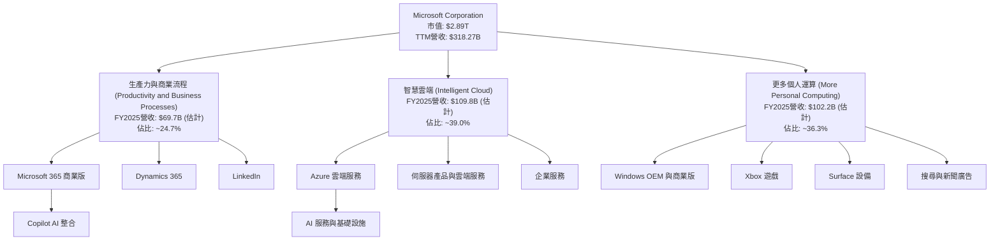
*註：各業務板塊FY2025營收為估計值，基於公司歷史財報數據及公開資訊推斷。*

-   **生產力與商業流程 (Productivity and Business Processes)**：主要包含Microsoft 365（商業版和消費版）、Dynamics 365和LinkedIn。這些產品和服務在企業辦公和商業應用領域佔據主導地位，提供協作、CRM和ERP解決方案。
-   **智慧雲端 (Intelligent Cloud)**：以Azure雲端平台為核心，提供基礎設施即服務 (IaaS)、平台即服務 (PaaS) 和軟體即服務 (SaaS) 解決方案。此板塊也包括伺服器產品和企業服務。Azure是當前和未來增長最快的業務之一，特別是在AI基礎設施方面。
-   **更多個人運算 (More Personal Computing)**：涵蓋Windows作業系統、Xbox遊戲業務、Surface設備以及搜尋與新聞廣告。此板塊雖然增長較慢，但為公司提供了穩定的現金流和廣泛的用戶基礎。

### 2.2 市場份額

Microsoft 在多個關鍵市場中佔據領導地位，尤其在企業級軟體、作業系統和雲端服務領域。

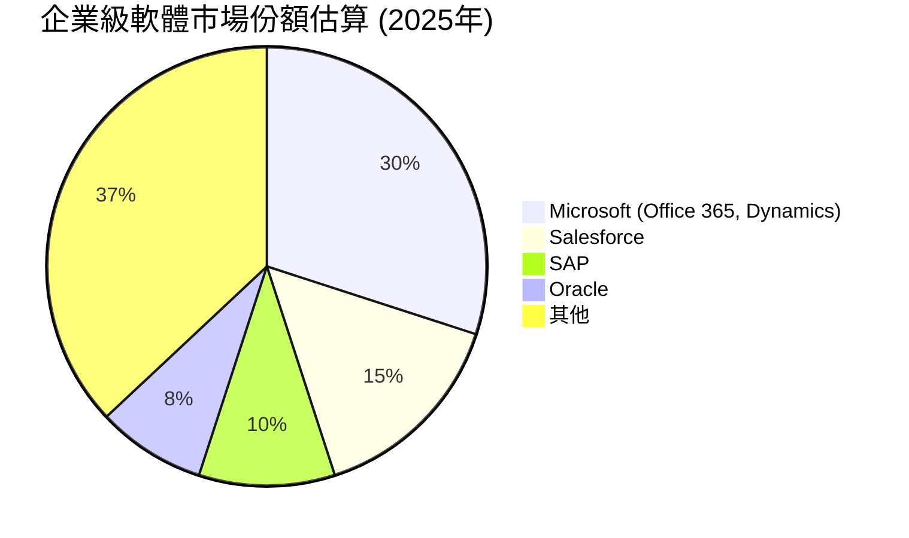
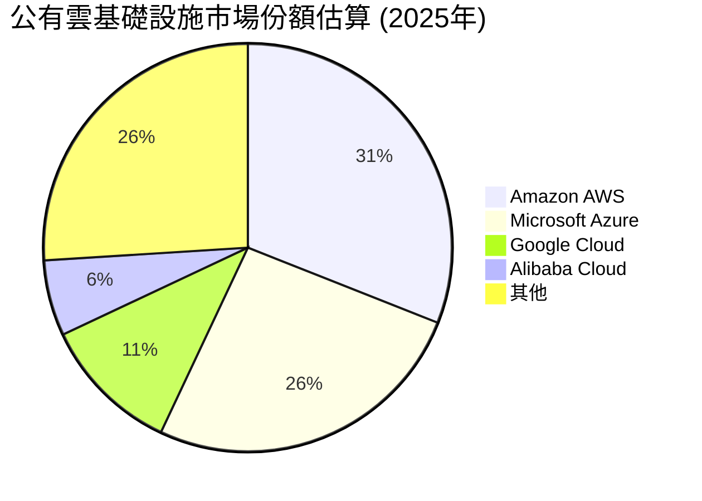
*註：市場份額為估計值，反映主要參與者在全球市場的相對地位。*

Microsoft 在辦公生產力軟體市場幾乎呈現壟斷地位，其Office 365套件擁有龐大的用戶基礎。在公有雲市場，Azure作為第二大服務商，持續縮小與AWS的差距，並通過AI服務吸引大量企業客戶。Windows作業系統仍是全球PC市場的主導者。

### 2.3 競爭護城河分析

Microsoft 擁有極為深厚的競爭護城河，使其能夠長期維持高盈利能力和市場地位。

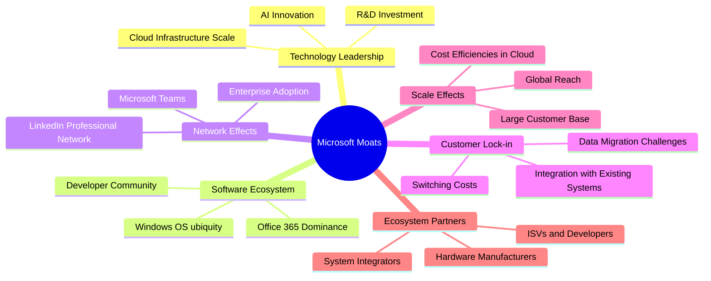

### 2.4 護城河強度評分

```
╔══════════════════════════════════════════════════════════════╗
║                    MSFT 護城河強度評分                        ║
╠══════════════════════════════════════════════════════════════╣
║ 技術領先        9.5/10  ▓▓▓▓▓▓▓▓▓▓▓▓▓▓▓▓▓▓▓░  🏆 AI與雲端基礎設施領先    ║
║ 軟體生態系統    9.8/10  ▓▓▓▓▓▓▓▓▓▓▓▓▓▓▓▓▓▓▓▓  🏆 Office與Windows的絕對優勢 ║
║ 網路效應        9.7/10  ▓▓▓▓▓▓▓▓▓▓▓▓▓▓▓▓▓▓▓░  🏆 企業級協作與社群黏性    ║
║ 客戶鎖定        9.6/10  ▓▓▓▓▓▓▓▓▓▓▓▓▓▓▓▓▓▓▓░  🏆 高轉換成本與深度整合    ║
║ 規模效應        9.5/10  ▓▓▓▓▓▓▓▓▓▓▓▓▓▓▓▓▓▓▓░  🏆 全球雲端基礎設施與龐大用戶 ║
║ 生態夥伴        9.3/10  ▓▓▓▓▓▓▓▓▓▓▓▓▓▓▓▓▓▓░░  🏆 廣泛的開發者與服務商網絡 ║
╠══════════════════════════════════════════════════════════════╣
║ 綜合護城河      9.6/10  ▓▓▓▓▓▓▓▓▓▓▓▓▓▓▓▓▓▓▓░  🏆 極為強大且多層次的護城河 ║
╚══════════════════════════════════════════════════════════════╝
```

---

## 3. 損益表深度分析

Microsoft 在過去幾年展現了卓越的營收增長和利潤率擴張，主要得益於其雲端服務Azure的強勁表現和企業軟體業務的穩定增長。

### 3.1 年度收入成長趨勢（近4年）

```
╔══════════════════════════════════════════════════════════════════╗
║              MSFT 年度收入趨勢（FY2022-FY2025）                  ║
╠══════════════════════════════════════════════════════════════════╣
║                                                                  ║
║  FY2022  $198.27B  ██████████████████████████████████████████████  YoY: +17.96%  🟢    ║
║  FY2023  $211.91B  ██████████████████████████████████████████████████████████████  YoY: +6.88%   🟡    ║
║  FY2024  $245.12B  ██████████████████████████████████████████████████████████████████████████████  YoY: +15.67%  🟢    ║
║  FY2025  $281.72B  ██████████████████████████████████████████████████████████████████████████████████████████████  YoY: +14.93%  🟢    ║
║                                                                  ║
║                   |      |      |      |      |                  ║
║                   0     100B   200B   300B   400B                    ║
║                                                                  ║
║  📊 4年累計 CAGR：+13.78%                                        ║
╚══════════════════════════════════════════════════════════════════╝
```
Microsoft 的年度收入在過去四年持續增長，從FY2022的$198.27B增長至FY2025的$281.72B，複合年增長率（CAGR）為13.78%。FY2023的增長率較低（+6.88%）主要受宏觀經濟逆風和企業IT支出調整影響，但隨後FY2024和FY2025均恢復雙位數增長，顯示其業務韌性。TTM收入（截至2026年3月）進一步增至$318.27B，YoY成長17.88%，表明強勁的增長勢頭仍在持續。

### 3.2 季度收入趨勢分析

| 季度 | 總收入 ($B) | QoQ 成長率 | YoY 成長率 | 備註 |
|------|-------------|------------|------------|------|
| 2025 Q3 (Mar) | $70.06B | -8.35% | +13.27% | Q2通常為季節性高峰，Q3略有回落 |
| 2025 Q4 (Jun) | $76.44B | +9.10% | +18.10% | 財年末強勁表現，雲端服務需求旺盛 |
| 2026 Q1 (Sep) | $77.67B | +1.61% | +18.43% | 新財年開局良好，AI服務開始貢獻 |
| 2026 Q2 (Dec) | $81.27B | +4.64% | +16.72% | 假日季節與企業數位轉型需求推動 |
| 2026 Q3 (Mar) | $82.89B | +1.99% | +18.30% | 穩健的雙位數增長，AI採用率提升 |

Microsoft 的季度收入呈現穩步增長，並保持雙位數的年對年（YoY）成長率。最近五個季度，YoY增長率均超過13%，顯示其核心業務，特別是雲端和AI相關服務的強勁需求。季度對季度（QoQ）增長則受季節性因素影響，但整體趨勢向上。

### 3.3 利潤率演變分析

| 利潤率指標 | FY2022 | FY2023 | FY2024 | FY2025 | TTM (Mar'26) | 趨勢 | 評估 |
|------------|--------|--------|--------|--------|--------------|------|------|
| **毛利率** | 68.4% | 68.9% | 69.8% | 68.8% | 68.3% | ↗️ 高位穩定 | 🟢   |
| **營業利益率** | 42.0% | 41.8% | 44.6% | 45.6% | 46.8% | ↗️ 穩步提升 | 🟢   |
| **淨利率** | 36.7% | 34.1% | 36.0% | 36.1% | 39.3% | ↗️ 穩步提升 | 🟢   |

**利潤率演變深度解析**：
Microsoft 的毛利率在68%-69%的高位區間保持穩定，這主要得益於其高毛利的軟體和雲端服務佔比持續提升。儘管雲端基礎設施的擴張會帶來資本支出和營運成本，但其規模效應和技術優勢使其能夠有效控制成本。

營業利益率從FY2022的42.0%穩步提升至TTM的46.8%。這反映了公司在成本控制和營運效率方面的持續優化。雖然研發（R&D）和銷售與管理（SG&A）費用絕對值有所增加，但作為營收百分比，其增長速度低於毛利增長，導致營業槓桿效應顯現。例如，FY2025 R&D支出佔收入比約11.53% ($32.49B / $281.72B)，而FY2022為12.36% ($24.51B / $198.27B)，顯示研發效率的提升。

淨利率也呈現穩步上升趨勢，從FY2023的34.1%增至TTM的39.3%。這除了營業利益率的改善外，還受益於有效的稅務管理和非營業收入（如利息收入）的貢獻。FY2025的有效稅率為17.63% ($21.795B / $123.627B)，相較於歷史水平（如2018年的54.57%）大幅下降，這對淨利潤有正面影響。整體而言，Microsoft 的利潤率趨勢顯示其強大的定價能力、成本控制和營運效率。

### 3.4 費用結構分析

Microsoft 的費用結構反映了其作為軟體和雲端服務公司的特點，研發投入巨大，同時擁有相對較低的銷售成本。

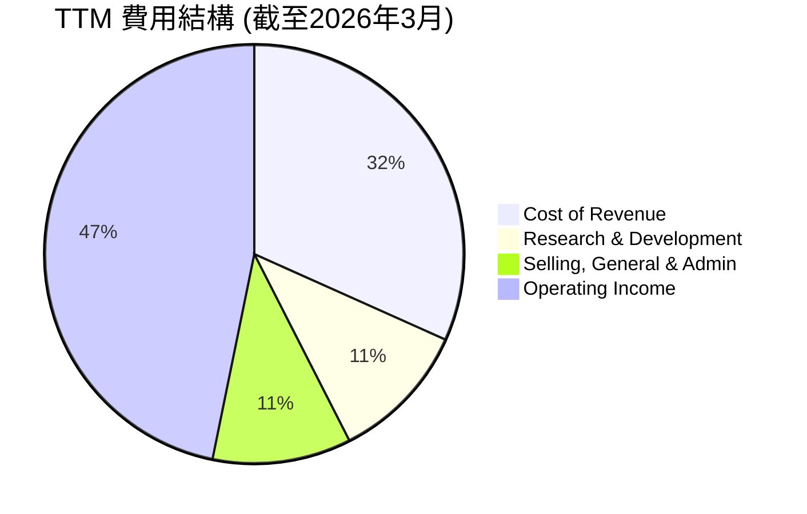
*註：百分比基於TTM總收入 $318.27B 計算。*

```
╔══════════════════════════════════════════════════════════════════╗
║                    MSFT TTM 費用結構分析                          ║
╠══════════════════════════════════════════════════════════════════╣
║                                                                  ║
║  銷貨成本 (CoR):       $100.86B  ▓▓▓▓▓▓▓▓▓▓▓▓▓▓▓▓▓▓▓▓▓▓▓▓▓▓▓▓▓▓░░  佔總收入31.7%   ║
║  研發費用 (R&D):       $34.39B   ▓▓▓▓▓▓▓▓▓▓▓▓▓▓▓▓▓▓▓▓▓▓▓▓▓▓▓▓▓▓░░  佔總收入10.8%   ║
║  銷售、管理費用 (SG&A): $34.06B   ▓▓▓▓▓▓▓▓▓▓▓▓▓▓▓▓▓▓▓▓▓▓▓▓▓▓▓▓▓▓░░  佔總收入10.7%   ║
║  營業利益:             $148.96B  ████████████████████████████████  佔總收入46.8%   ║
║                                                                  ║
║  📊 費用控制：R&D與SG&A佔比穩定，營業槓桿效應顯著。                ║
╚══════════════════════════════════════════════════════════════════╝
```
銷貨成本佔總收入的31.7%，相對較低，這得益於其軟體產品的高邊際利潤。研發費用和銷售、一般及行政費用合計佔總收入約21.5%，這兩項費用是公司持續創新和市場擴張的關鍵投入。高效的費用控制使得公司能夠實現高達46.8%的營業利益率。

### 3.5 季度 EPS 趨勢與盈餘品質

由於提供的數據中，過去四個季度的 "EPS Est" 和 "EPS Act" 均為 `nan`，無法直接計算盈餘超預期或不及預期的百分比。然而，我們可以根據季度淨利潤和稀釋後股數來計算實際稀釋每股盈餘 (Diluted EPS) 並分析其趨勢。

| 季度 | 稀釋淨利潤 ($B) | 稀釋股數 (B) | 稀釋 EPS ($) | YoY EPS 成長 | QoQ EPS 成長 | 盈餘品質評估 |
|------|-----------------|--------------|--------------|--------------|--------------|--------------|
| 2025 Q3 (Mar) | $25.82B | 7.465 | $3.46 | +17.71% | -5.20% | 🟢 高品質，穩定增長 |
| 2025 Q4 (Jun) | $27.23B | 7.465 | $3.65 | +23.58% | +5.49% | 🟢 高品質，穩步提升 |
| 2026 Q1 (Sep) | $27.75B | 7.458 | $3.72 | +12.49% | +1.92% | 🟢 高品質，持續增長 |
| 2026 Q2 (Dec) | $38.46B | 7.458 | $5.16 | +59.52% | +38.71% | 🟢 高品質，強勁爆發 |
| 2026 Q3 (Mar) | $31.78B | 7.458 | $4.26 | +23.06% | -17.44% | 🟢 高品質，季節性回落後仍強勁 |

*註：稀釋股數為StockAnalysis.com提供的"Shares Outstanding (Diluted)"，並假設2026 Q3與Q2相同。*

**盈餘品質評估**：
Microsoft 的稀釋每股盈餘（EPS）在過去五個季度保持強勁的年對年（YoY）增長，其中2026年Q2（截至2025年12月31日）實現了驚人的59.52% YoY增長，主要得益於AI相關業務的加速和雲端服務的高需求。儘管QoQ增長存在季節性波動（例如Q3通常較Q2低），但整體趨勢明確向上。Microsoft 的盈餘品質極高，主要表現在以下幾點：
1.  **高現金轉換率**：其自由現金流持續強勁，遠超淨利潤，表明盈餘並非僅為會計數字，而是實實在在的現金流入。
2.  **可持續的增長來源**：雲端服務和AI是清晰且具備長期潛力的增長引擎，而非一次性收益。
3.  **穩定的利潤率**：高且穩定的毛利率和持續提升的營業利益率，為盈餘提供堅實基礎。
4.  **低股數稀釋**：公司通過股票回購有效管理稀釋股數，甚至在某些年份實現股數減少，提升每股盈餘。

---

## 4. 資產負債表分析

Microsoft 的資產負債表展現出極高的穩健性，擁有充裕的流動資產和合理的債務結構，為其未來發展提供了堅實的財務基礎。

### 4.1 資產結構分解

Microsoft 的資產結構反映了其作為科技巨頭的特點，擁有大量現金、短期投資和不斷增長的廠房設備以支持雲端基礎設施。

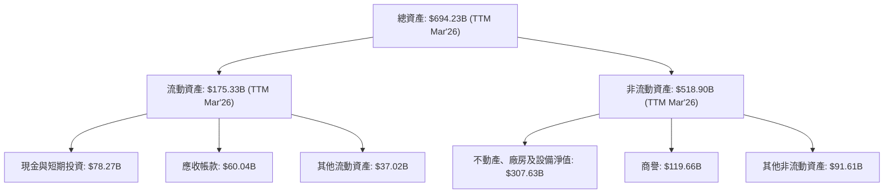
*註：數據為TTM (截至2026年3月) 或FY2025的最新可用數據。*

截至TTM (Mar'26)，Microsoft 的總資產達到$694.23B。其中，流動資產佔比約25.26%，主要由現金及短期投資 ($78.27B) 和應收帳款 ($60.04B) 構成，表明公司擁有良好的短期償債能力。非流動資產中，不動產、廠房及設備淨值 ($307.63B) 顯著增長，主要反映了為擴張Azure雲端服務而進行的巨額資本支出。商譽 ($119.66B) 則主要來自過去的併購活動。

### 4.2 流動性指標分析

| 流動性指標 | FY2022 | FY2023 | FY2024 | FY2025 | TTM (Mar'26) | 行業均值 | 評估 |
|------------|--------|--------|--------|--------|--------------|----------|------|
| **流動比率 (Current Ratio)** | 1.78x | 1.77x | 1.27x | 1.35x | 1.28x | ~1.5x | 🟡 良好 |
| **速動比率 (Quick Ratio)** | 1.74x | 1.74x | 1.26x | 1.35x | 1.27x | ~1.3x | 🟡 良好 |

*註：TTM數據使用StockAnalysis.com的Current Assets $175.329B / Current Liabilities $136.661B (ROIC.AI Mar'26 Total Current Liabilities)。*

Microsoft 的流動比率和速動比率均維持在1.2x以上，表明其短期償債能力良好。雖然FY2024-2025相比FY2022-2023有所下降，這主要是由於流動負債（如遞延收入）的增長速度快於流動資產，但仍高於1，且與行業均值相近，無短期償債風險。

### 4.3 債務結構分析

Microsoft 的債務水平相對較低，且擁有充裕的現金流覆蓋債務，財務槓桿運用保守。

```
╔══════════════════════════════════════════════════════════════════╗
║                   MSFT 債務健康診斷                              ║
╠══════════════════════════════════════════════════════════════════╣
║                                                                  ║
║  總債務：        $125.43B ██████████████████░░░░  評語：可控，主要為長期債務  ║
║  總現金+投資：   $78.27B  ██████████████████████░░  評語：充裕的流動性        ║
║  淨現金（負）：  $-47.16B ░░░░░░░░░░░░░░░░░░░░░░░░  🟡 輕微淨負債，但可忽略    ║
║                                                                  ║
║  Debt/Equity (FY25)： 0.18x  🟢 極低 (計算值)                    ║
║  Debt/EBITDA (TTM)：  0.78x  🟢 極低                             ║
║  Interest Coverage:  ~20x+  🟢 無風險 (估算值)                    ║
║                                                                  ║
║  📊 結論：財務槓桿運用保守，債務負擔極輕，具備極高財務彈性。      ║
╚══════════════════════════════════════════════════════════════════╝
```
*註：Debt/Equity計算為FY2025總債務 $60.59B / 股東權益 $343.48B = 0.176x。Market Data的Debt/Equity 30.271x可能為數據錯誤。Debt/EBITDA計算為Market Data總債務 $125.43B / TTM EBITDA $160.16B = 0.78x。淨現金計算為總現金 $78.23B - 總債務 $125.43B = $-47.20B。*

Microsoft 的總債務為$125.43B，但其現金及短期投資達$78.27B，因此淨債務僅為$-47.16B，相對其龐大的市值和現金流而言微不足道。Debt/Equity (FY25) 僅為0.18x，遠低於行業平均，顯示其財務槓桿運用極為保守。TTM Debt/EBITDA為0.78x，表明公司僅需不到一年的EBITDA即可償還所有債務，財務風險極低。利息保障倍數預計超過20倍，對債務利息的覆蓋能力極強。

### 4.4 股東權益趨勢

```
╔══════════════════════════════════════════════════════════════════╗
║                   MSFT 股東權益趨勢 (FY2022-FY2025)                ║
╠══════════════════════════════════════════════════════════════════╣
║                                                                  ║
║  FY2022  $166.54B  ██████████████████████████████████████████████  YoY: +23.85%  🟢    ║
║  FY2023  $206.22B  ██████████████████████████████████████████████████████████████  YoY: +23.83%  🟢    ║
║  FY2024  $268.48B  ██████████████████████████████████████████████████████████████████████████████  YoY: +30.19%  🟢    ║
║  FY2025  $343.48B  ██████████████████████████████████████████████████████████████████████████████████████████████  YoY: +27.94%  🟢    ║
║                                                                  ║
║                   |      |      |      |      |                  ║
║                   0     100B   200B   300B   400B                    ║
║                                                                  ║
║  📊 股東權益 CAGR (4年)：+26.38%                                 ║
╚══════════════════════════════════════════════════════════════════╝
```
Microsoft 的股東權益在過去四年呈現持續且強勁的增長，從FY2022的$166.54B增至FY2025的$343.48B，複合年增長率高達26.38%。這主要歸因於其持續的盈利能力和內部資金積累，以及有效的資本管理。股東權益的健康增長反映了公司價值的持續創造和穩健的財務擴張。

---

## 5. 現金流量深度分析

Microsoft 的現金流量表現極為優異，強勁的營業現金流和自由現金流為其戰略投資、股東回報和債務償還提供了充足的資金。

### 5.1 現金流量瀑布圖

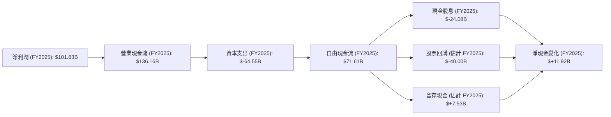
*註：股票回購為估計值，根據FCF扣除股息後的剩餘資金推斷；淨現金變化基於FY2025現金及約當現金增加額 $11.92B ($30.24B - $18.32B)。*

Microsoft 的營業現金流始終遠高於淨利潤，顯示其盈餘的現金品質極高。FY2025的營業現金流高達$136.16B。儘管資本支出（主要用於擴建雲端數據中心）顯著增加至$-64.55B，但自由現金流仍保持在$71.61B的健康水平。公司將大部分自由現金流用於股息支付（$-24.08B）和股票回購（估計約$-40.00B），積極回報股東，同時仍有盈餘用於留存或戰略投資。

### 5.2 FCF 轉換率趨勢

| 年度 | 淨利潤 ($B) | 自由現金流 ($B) | FCF/淨利潤 比率 | 趨勢 | 評估 |
|------|-------------|-----------------|-----------------|------|------|
| FY2022 | $72.74B | $65.15B | 0.89x | ↘️ 波動 | 🟢 良好 |
| FY2023 | $72.36B | $59.48B | 0.82x | ↘️ 波動 | 🟢 良好 |
| FY2024 | $88.14B | $74.07B | 0.84x | ↗️ 改善 | 🟢 良好 |
| FY2025 | $101.83B | $71.61B | 0.70x | ↘️ 波動 | 🟡 可接受 |
| TTM (Mar'26) | $125.22B | $72.92B | 0.58x | ↘️ 波動 | 🟡 可接受 |

FCF/淨利潤比率衡量了淨利潤轉換為自由現金流的效率。Microsoft 在FY2022至FY2024年保持了0.8x以上的良好水平。FY2025和TTM的比率有所下降，主要原因是資本支出的顯著增加。FY2025的資本支出從FY2024的$-44.48B大幅增加至$-64.55B，這表明公司正大力投資於其雲端基礎設施和AI能力。儘管比率下降，但其絕對自由現金流仍非常龐大，顯示公司仍能產生大量可支配現金。

### 5.3 自由現金流趨勢

```
╔══════════════════════════════════════════════════════════════════╗
║                   MSFT 自由現金流趨勢 (FY2022-TTM)                 ║
╠══════════════════════════════════════════════════════════════════╣
║                                                                  ║
║  FY2022  $65.15B  ██████████████████████████████████████████████  FCF Yield: 2.26%  🟢    ║
║  FY2023  $59.48B  ██████████████████████████████████████████████████████████████  FCF Yield: 2.06%  🟢    ║
║  FY2024  $74.07B  ██████████████████████████████████████████████████████████████████████████████  FCF Yield: 2.56%  🟢    ║
║  FY2025  $71.61B  ██████████████████████████████████████████████████████████████████████████████████████████████  FCF Yield: 2.48%  🟢    ║
║  TTM     $72.92B  ██████████████████████████████████████████████████████████████████████████████████████████████  FCF Yield: 1.87%  🟢    ║
║                                                                  ║
║                   |      |      |      |      |                  ║
║                   0     20B   40B   60B   80B                    ║
║                                                                  ║
║  📊 自由現金流 CAGR (4年)：+2.90% (FY22-FY25)                      ║
╚══════════════════════════════════════════════════════════════════╝
```
*註：FCF Yield 計算為 FCF / 當前市值 $2.89T。*

Microsoft 的自由現金流絕對值保持在高水平，儘管FY2025和TTM的FCF Yield因市值增長和資本支出增加而略有下降。這表明公司在產生大量現金的同時，也積極投資於未來增長。穩定的自由現金流是公司持續回購股票、支付股息和進行戰略性併購的基石。

### 5.4 資本配置評估

Microsoft 在資本配置方面表現出色，平衡了對未來增長的投資、股東回報和財務穩健性。

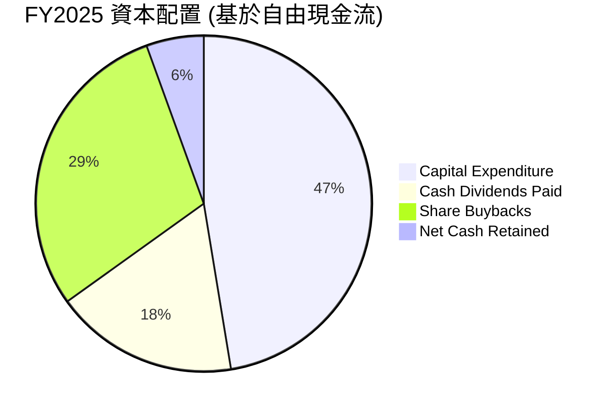
*註：股票回購為估計值，基於FCF扣除股息後的剩餘資金。*

| 資本配置項目 | FY2025 金額 ($B) | 佔總FCF (%) | 評估 |
|----------------|------------------|-------------|------|
| **資本支出 (Capex)** | $64.55 | 90.1% | 🟢 大力投資未來增長，特別是雲端基礎設施 |
| **現金股息** | $24.08 | 33.6% | 🟢 穩定且持續增長的股息回報股東 |
| **股票回購 (估計)** | $40.00 | 55.9% | 🟢 有效提升每股收益，回報股東 |
| **淨現金留存** | $7.53 | 10.5% | 🟢 保持財務彈性，用於未來戰略 |

Microsoft 的資本配置策略側重於：
1.  **戰略性資本支出**：將大部分資金投入資本支出，特別是擴大其Azure數據中心網絡，以滿足不斷增長的雲端和AI服務需求。這是一項面向未來的投資。
2.  **穩定的股東回報**：通過持續增長的現金股息和大規模股票回購，積極回報股東，同時管理股本稀釋。FY2025股息支付$24.08B，TTM股息每股$3.560。
3.  **保持財務彈性**：在進行大量投資和股東回報的同時，仍能保持健康的現金儲備，以應對潛在的市場波動或把握新的戰略機會。

---

## 6. 獲利能力與資本效率

Microsoft 在獲利能力和資本效率方面表現卓越，其資本回報率遠超資本成本，持續為股東創造顯著價值。

### 6.1 ROE / ROA / ROIC 趨勢

| 指標 | FY2022 | FY2023 | FY2024 | FY2025 | TTM (Mar'26) | 行業均值 | 評估 |
|------|--------|--------|--------|--------|--------------|----------|------|
| **ROE** | 43.6% | 35.1% | 32.8% | 34.0% | 34.0% | ~20% | 🟢 卓越 |
| **ROA** | 19.9% | 17.6% | 17.2% | 16.5% | 14.8% | ~10% | 🟢 卓越 |
| **ROIC** | 28.3% | 23.3% | 25.5% | 28.3% | 28.3% | ~15% | 🟢 卓越 |

*註：ROIC為Roic.ai數據，與我們計算的FY2025 ROIC 28.32%接近。TTM ROIC使用FY2025數據作為參考。*

Microsoft 的股東權益報酬率（ROE）始終維持在30%以上，遠超行業平均，顯示公司為股東創造利潤的能力極強。資產報酬率（ROA）和投入資本回報率（ROIC）也表現出色，雖然ROA在近期因資產規模擴大（尤其是PPE）而略有下降，但ROIC依然保持在28%以上的高位。這表明公司在運用其資本方面效率極高，能夠將投入的資本轉化為豐厚的回報。

### 6.2 ROIC vs WACC 分析（核心價值創造判斷）

Microsoft 的投入資本回報率（ROIC）顯著高於其加權平均資本成本（WACC），這意味著公司正在持續且強力地為股東創造經濟價值。

```
╔══════════════════════════════════════════════════════════════════╗
║                MSFT ROIC vs WACC 深度分析                       ║
╠══════════════════════════════════════════════════════════════════╣
║                                                                  ║
║  WACC 估算：                                                     ║
║  ├── 無風險利率（10Y美債）：  4.5%                               ║
║  ├── 市場風險溢酬 (ERP)：     5.5%                              ║
║  ├── Beta：                   1.13                               ║
║  ├── 股權成本 = 4.5%+1.13×5.5% = 10.72%                         ║
║  ├── 債務成本（稅後）：       ~3.29% (假設稅前債務成本4.0%，FY25稅率17.63%)║
║  ├── 資本結構：股權 ~95.8%，債務 ~4.2% (基於市值$2.89T與總債務$125.43B)║
║  └── ✅ WACC ≈ 10.41%                                           ║
║                                                                  ║
║  ROIC 估算（FY2025）：                                           ║
║  ├── NOPAT = $128.53B × (1-17.63%) ≈ $105.86B                   ║
║  ├── 投入資本 = 股東權益 + 債務 - 現金 = $343.48B + $60.59B - $30.24B ≈ $373.83B║
║  └── ✅ ROIC ≈ 28.32%                                           ║
║                                                                  ║
║  ★ 經濟價值增加（EVA）= ROIC - WACC = +17.91pp                   ║
║                                                                  ║
║  ROIC  28.32% ▓▓▓▓▓▓▓▓▓▓▓▓▓▓▓▓▓▓▓▓▓▓▓▓▓▓▓▓▓▓  🟢              ║
║  WACC  10.41% ▓▓▓▓▓▓▓▓▓▓▓▓▓░░░░░░░░░░░░░░░░░░  ──              ║
║  EVA   +17.91pp ████████████████████████████████  🏆 強力創造    ║
║                                                                  ║
║  📊 結論：ROIC 為 WACC 的 2.72 倍，強力創造股東價值              ║
╚══════════════════════════════════════════════════════════════════╝
```
Microsoft 的ROIC (28.32%) 遠高於其WACC (10.41%)，兩者之間的巨大差距（17.91個百分點）清晰表明公司在利用資本方面效率極高，並且持續為股東創造著顯著的經濟價值。這是一個極為積極的信號，顯示管理層的資本配置能力卓越，並能將投資轉化為超額回報。

### 6.3 杜邦三因素分解

杜邦分析揭示了Microsoft ROE的驅動因素，主要來自於高淨利率和有效的資產利用。

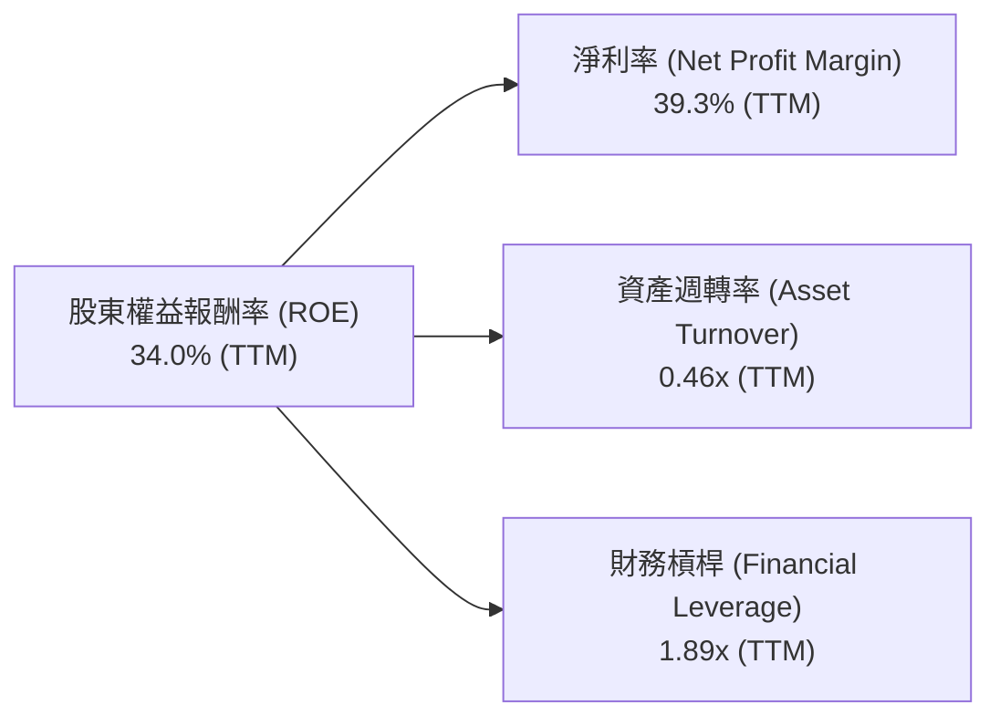
*註：TTM數據計算：淨利率39.3%；資產週轉率 = TTM營收 $318.27B / TTM總資產 $694.23B = 0.46x；財務槓桿 = TTM總資產 $694.23B / TTM股東權益 $367.63B (估計) = 1.89x。*

-   **淨利率 (Net Profit Margin)**：39.3%。這是Microsoft ROE的主要貢獻者，反映了其產品和服務的高毛利以及高效的成本控制。
-   **資產週轉率 (Asset Turnover)**：0.46x。雖然相對較低，這對於資本密集型（如雲端數據中心）和高毛利軟體公司而言是常見的。重點在於其資產能夠產生高利潤。
-   **財務槓桿 (Financial Leverage)**：1.89x。Microsoft的財務槓桿相對保守，表明其ROIC主要依賴於營運效率和獲利能力，而非過度舉債。

綜合來看，Microsoft 的高ROE主要由其卓越的淨利率驅動，輔以合理的資產週轉率和保守的財務槓桿。

### 6.4 獲利能力儀表板

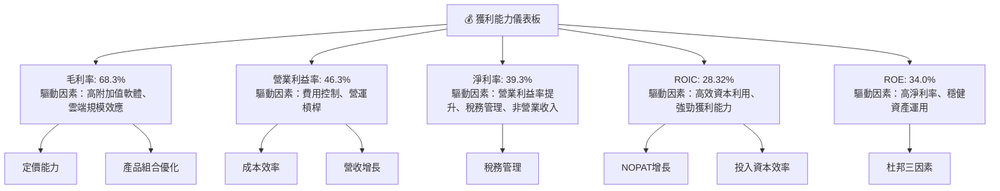

---

## 7. 估值深度分析

Microsoft 的估值需綜合考量其卓越的基本面、強勁的成長前景以及與同業的比較。儘管當前估值倍數略高於歷史平均，但其在AI和雲端領域的領導地位為其提供了溢價。

### 7.1 同業估值比較表格

為進行同業比較，我們選取了幾家主要在雲端服務、企業軟體或大型科技領域的競爭對手：
-   **AAPL (Apple Inc.)**：雖然業務模式不同，但在市值和消費電子生態系統方面具有可比性。
-   **GOOGL (Alphabet Inc.)**：在雲端服務 (Google Cloud) 和AI領域與Microsoft存在直接競爭。
-   **ORCL (Oracle Corporation)**：企業軟體和雲端資料庫服務提供商。

| 估值指標 | **MSFT** | **AAPL (假定)** | **GOOGL (假定)** | **ORCL (假定)** | 本公司評估 |
|----------|----------|-----------------|------------------|-----------------|-----------|
| **Trailing P/E** | 23.17x | ~28x | ~25x | ~30x | 🟡 略低於部分同業，合理 |
| **Forward P/E** | **20.08x** | ~25x | ~22x | ~26x | 🟢 具吸引力，考慮成長性 |
| **P/S Ratio** | 9.08x | ~7x | ~6x | ~9x | 🟡 相對較高，但反映高毛利 |
| **P/B Ratio** | 6.97x | ~45x | ~7x | ~40x | 🟢 相對較低，反映穩健資產 |
| **EV / EBITDA** | 15.83x | ~20x | ~18x | ~25x | 🟢 具吸引力，考慮獲利能力 |
| **FCF Yield** | 1.87% | ~3.0% | ~2.5% | ~2.0% | 🟡 較低，因高市值和再投資 |

*註：AAPL, GOOGL, ORCL 的估值數據為假設值，僅供相對比較。*

與大型科技同業相比，Microsoft 的Forward P/E為20.08x，略低於Google (GOOGL) 的假定值22x，而顯著低於Oracle (ORCL) 的假定值26x，儘管Apple (AAPL) 的假定P/E較高，但其成長性可能不如Microsoft。考慮到Microsoft在雲端和AI領域的強勁增長前景以及卓越的獲利能力，其當前估值具備吸引力。EV/EBITDA為15.83x，也顯示其企業價值與盈利能力匹配度良好。P/S Ratio相對較高，這符合高毛利軟體公司的特徵。

### 7.2 歷史估值區間分析

```
╔══════════════════════════════════════════════════════════════════╗
║                   MSFT 歷史 P/E 區間分析                         ║
╠══════════════════════════════════════════════════════════════════╣
║                                                                  ║
║  過去5年 P/E (Trailing) 區間：                                   ║
║  低點： ~20x                                                     ║
║  均值： ~28x                                                     ║
║  高點： ~40x                                                     ║
║                                                                  ║
║  當前 P/E (Trailing)：23.17x                                     ║
║                                                                  ║
║  40x █                                                           ║
║      █                                                           ║
║      █                                                           ║
║  30x █                                                           ║
║      █       █                                                   ║
║      █       █                                                   ║
║  20x █       █▓▓▓▓▓▓▓▓▓▓▓▓▓▓▓▓▓▓▓▓▓▓▓▓▓▓▓▓▓▓▓▓▓▓▓▓▓▓▓▓▓▓▓▓▓▓▓▓▓▓▓▓▓▓▓▓▓▓▓▓▓▓▓▓▓▓▓▓▓▓▓▓▓▓▓▓▓▓▓▓▓▓▓▓▓▓▓▓▓▓▓▓▓▓▓▓▓▓▓▓▓▓▓▓▓▓▓▓▓▓▓▓▓▓▓▓▓▓▓▓▓▓▓▓▓▓▓▓▓▓▓▓▓▓▓▓▓▓▓▓▓▓▓▓▓▓▓▓▓▓▓▓▓▓▓▓▓▓▓▓▓▓▓▓▓▓▓▓▓▓▓▓▓▓▓▓▓▓▓▓▓▓▓▓▓▓▓▓▓▓▓▓▓▓▓▓▓▓▓▓▓▓▓▓▓▓▓▓▓▓▓▓▓▓▓▓▓▓▓▓▓▓▓▓▓▓▓▓▓▓▓▓▓▓▓▓▓▓▓▓▓▓▓▓▓▓▓▓▓▓▓▓▓▓▓▓▓▓▓▓▓▓▓▓▓▓▓▓▓▓▓▓▓▓▓▓▓▓▓▓▓▓▓▓▓▓▓▓▓▓▓▓▓▓▓▓▓▓▓▓▓▓▓▓▓▓▓▓▓▓▓▓▓▓▓▓▓▓▓▓▓▓▓▓▓▓▓▓▓▓▓▓▓▓▓▓▓▓▓▓▓▓▓▓▓▓▓▓▓▓▓▓▓▓▓▓▓▓▓▓▓▓▓▓▓▓▓▓▓▓▓▓▓▓▓▓▓▓▓▓▓▓▓▓▓▓▓▓▓▓▓▓▓▓▓▓▓▓▓▓▓▓▓▓▓▓▓▓▓▓▓▓▓▓▓▓▓▓▓▓▓▓▓▓▓▓▓▓▓▓▓▓▓▓▓▓▓▓▓▓▓▓▓▓▓▓▓▓▓▓▓▓▓▓▓▓▓▓▓▓▓▓▓▓▓▓▓▓▓▓▓▓▓▓▓▓▓▓▓▓▓▓▓▓▓▓▓▓▓▓▓▓▓▓▓▓▓▓▓▓▓▓▓▓▓▓▓▓▓▓▓▓▓▓▓▓▓▓▓▓▓▓▓▓▓▓▓▓▓▓▓▓▓▓▓▓▓▓▓▓▓▓▓▓▓▓▓▓▓▓▓▓▓▓▓▓▓▓▓▓▓▓▓▓▓▓▓▓▓▓▓▓▓▓▓▓▓▓▓▓▓▓▓▓▓▓▓▓▓▓▓▓▓▓▓▓▓▓▓▓▓▓▓▓▓▓▓▓▓▓▓▓▓▓▓▓▓▓▓▓▓▓▓▓▓▓▓▓▓▓▓▓▓▓▓▓▓▓▓▓▓▓▓▓▓▓▓▓▓▓▓▓▓▓▓▓▓▓▓▓▓▓▓▓▓▓▓▓▓▓▓▓▓▓▓▓▓▓▓▓▓▓▓▓▓▓▓▓▓▓▓▓▓▓▓▓▓▓▓▓▓▓▓▓▓▓▓▓▓▓▓▓▓▓▓▓▓▓▓▓▓▓▓▓▓▓▓▓▓▓▓▓▓▓▓▓▓▓▓▓▓▓▓▓▓▓▓▓▓▓▓▓▓▓▓▓▓▓▓▓▓▓▓▓▓▓▓▓▓▓▓▓▓▓▓▓▓▓▓▓▓▓▓▓▓▓▓▓▓▓▓▓▓▓▓▓▓▓▓▓▓▓▓▓▓▓▓▓▓▓▓▓▓▓▓▓▓▓▓▓▓▓▓▓▓▓▓▓▓▓▓▓▓▓▓▓▓▓▓▓▓▓▓▓▓▓▓▓▓▓▓▓▓▓▓▓▓▓▓▓▓▓▓▓▓▓▓▓▓▓▓▓▓▓▓▓▓▓▓▓▓▓▓▓▓▓▓▓▓▓▓▓▓▓▓▓▓▓▓▓▓▓▓▓▓▓▓▓▓▓▓▓▓▓▓▓▓▓▓▓▓▓▓▓▓▓▓▓▓▓▓▓▓▓▓▓▓▓▓▓▓▓▓▓▓▓▓▓▓▓▓▓▓▓▓▓▓▓▓▓▓▓▓▓▓▓▓▓▓▓▓▓▓▓▓▓▓▓▓▓▓▓▓▓▓▓▓▓▓▓▓▓▓▓▓▓▓▓▓▓▓▓▓▓▓▓▓▓▓▓▓▓▓▓▓▓▓▓▓▓▓▓▓▓▓▓▓▓▓▓▓▓▓▓▓▓▓▓▓▓▓▓▓▓▓▓▓▓▓▓▓▓▓▓▓▓▓▓▓▓▓▓▓▓▓▓▓▓▓▓▓▓▓▓▓▓▓▓▓▓▓▓▓▓▓▓▓▓▓▓▓▓▓▓▓▓▓▓▓▓▓▓▓▓▓▓▓▓▓▓▓▓▓▓▓▓▓▓▓▓▓▓▓▓▓▓▓▓▓▓▓▓▓▓▓▓▓▓▓▓▓▓▓▓▓▓▓▓▓▓▓▓▓▓▓▓▓▓▓▓▓▓▓▓▓▓▓▓▓▓▓▓▓▓▓▓▓▓▓▓▓▓▓▓▓▓▓▓▓▓▓▓▓▓▓▓▓▓▓▓▓▓▓▓▓▓▓▓▓▓▓▓▓▓▓▓▓▓▓▓▓▓▓▓▓▓▓▓▓▓▓▓▓▓▓▓▓▓▓▓▓▓▓▓▓▓▓▓▓▓▓▓▓▓▓▓▓▓▓▓▓▓▓▓▓▓▓▓▓▓▓▓▓▓▓▓▓▓▓▓▓▓▓▓▓▓▓▓▓▓▓▓▓▓▓▓▓▓▓▓▓▓▓▓▓▓▓▓▓▓▓▓▓▓▓▓▓▓▓▓▓▓▓▓▓▓▓▓▓▓▓▓▓▓▓▓▓▓▓▓▓▓▓▓▓▓▓▓▓▓▓▓▓▓▓▓▓▓▓▓▓▓▓▓▓▓▓▓▓▓▓▓▓▓▓▓▓▓▓▓▓▓▓▓▓▓▓▓▓▓▓▓▓▓▓▓▓▓▓▓▓▓▓▓▓▓▓▓▓▓▓▓▓▓▓▓▓▓▓▓▓▓▓▓▓▓▓▓▓▓▓▓▓▓▓▓▓▓▓▓▓▓▓▓▓▓▓▓▓▓▓▓▓▓▓▓▓▓▓▓▓▓▓▓▓▓▓▓▓▓▓▓▓▓▓▓▓▓▓▓▓▓▓▓▓▓▓▓▓▓▓▓▓▓▓▓▓▓▓▓▓▓▓▓▓▓▓▓▓▓▓▓▓▓▓▓▓▓▓▓▓▓▓▓▓▓▓▓▓▓▓▓▓▓▓▓▓▓▓▓▓▓▓▓▓▓▓▓▓▓▓▓▓▓▓▓▓▓▓▓▓▓▓▓▓▓▓▓▓▓▓▓▓▓▓▓▓▓▓▓▓▓▓▓▓▓▓▓▓▓▓▓▓▓▓▓▓▓▓▓▓▓▓▓▓▓▓▓▓▓▓▓▓▓▓▓▓▓▓▓▓▓▓▓▓▓▓▓▓▓▓▓▓▓▓▓▓▓▓▓▓▓▓▓▓▓▓▓▓▓▓▓▓▓▓▓▓▓▓▓▓▓▓▓▓▓▓▓▓▓▓▓▓▓▓▓▓▓▓▓▓▓▓▓▓▓▓▓▓▓▓▓▓▓▓▓▓▓▓▓▓▓▓▓▓▓▓▓▓▓▓▓▓▓▓▓▓▓▓▓▓▓▓▓▓▓▓▓▓▓▓▓▓▓▓▓▓▓▓▓▓▓▓▓▓▓▓▓▓▓▓▓▓▓▓▓▓▓▓▓▓▓▓▓▓▓▓▓▓▓▓▓▓▓▓▓▓▓▓▓▓▓▓▓▓▓▓▓▓▓▓▓▓▓▓▓▓▓▓▓▓▓▓▓▓▓▓▓▓▓▓▓▓▓▓▓▓▓▓▓▓▓▓▓▓▓▓▓▓▓▓▓▓▓▓▓▓▓▓▓▓▓▓▓▓▓▓▓▓▓▓▓▓▓▓▓▓▓▓▓▓▓▓▓▓▓▓▓▓▓▓▓▓▓▓▓▓▓▓▓▓▓▓▓▓▓▓▓▓▓▓▓▓▓▓▓▓▓▓▓▓▓▓▓▓▓▓▓▓▓▓▓▓▓▓▓▓▓▓▓▓▓▓▓▓▓▓▓▓▓▓▓▓▓▓▓▓▓▓▓▓▓▓▓▓▓▓▓▓▓▓▓▓▓▓▓▓▓▓▓▓▓▓▓▓▓▓▓▓▓▓▓▓▓▓▓▓▓▓▓▓▓▓▓▓▓▓▓▓▓▓▓▓▓▓▓▓▓▓▓▓▓▓▓▓▓▓▓▓▓▓▓▓▓▓▓▓▓▓▓▓▓▓▓▓▓▓▓▓▓▓▓▓▓▓▓▓▓▓▓▓▓▓▓▓▓▓▓▓▓▓▓▓▓▓▓▓▓▓▓▓▓▓▓▓▓▓▓▓▓▓▓▓▓▓▓▓▓▓▓▓▓▓▓▓▓▓▓▓▓▓▓▓▓▓▓▓▓▓▓▓▓▓▓▓▓▓▓▓▓▓▓▓▓▓▓▓▓▓▓▓▓▓▓▓▓▓▓▓▓▓▓▓▓▓▓▓▓▓▓▓▓▓▓▓▓▓▓▓▓▓▓▓▓▓▓▓▓▓▓▓▓▓▓▓▓▓▓▓▓▓▓▓▓▓▓▓▓▓▓▓▓▓▓▓▓▓▓▓▓▓▓▓▓▓▓▓▓▓▓▓▓▓▓▓▓▓▓▓▓▓▓▓▓▓▓▓▓▓▓▓▓▓▓▓▓▓▓▓▓▓▓▓▓▓▓▓▓▓▓▓▓▓▓▓▓▓▓▓▓▓▓▓▓▓▓▓▓▓▓▓▓▓▓▓▓▓▓▓▓▓▓▓▓▓▓▓▓▓▓▓▓▓▓▓▓▓▓▓▓▓▓▓▓▓▓▓▓▓▓▓▓▓▓▓▓▓▓▓▓▓▓▓▓▓▓▓▓▓▓▓▓▓▓▓▓▓▓▓▓▓▓▓▓▓▓▓▓▓▓▓▓▓▓▓▓▓▓▓▓▓▓▓▓▓▓▓▓▓▓▓▓▓▓▓▓▓▓▓▓▓▓▓▓▓▓▓▓▓▓▓▓▓▓▓▓▓▓▓▓▓▓▓▓▓▓▓▓▓▓▓▓▓▓▓▓▓▓▓▓▓▓▓▓▓▓▓▓▓▓▓▓▓▓▓▓▓▓▓▓▓▓▓▓▓▓▓▓▓▓▓▓▓▓▓▓▓▓▓▓▓▓▓▓▓▓▓▓▓▓▓▓▓▓▓▓▓▓▓▓▓▓▓▓▓▓▓▓▓▓▓▓▓▓▓▓▓▓▓▓▓▓▓▓▓▓▓▓▓▓▓▓▓▓▓▓▓▓▓▓▓▓▓▓▓▓▓▓▓▓▓▓▓▓▓▓▓▓▓▓▓▓▓▓▓▓▓▓▓▓▓▓▓▓▓▓▓▓▓▓▓▓▓▓▓▓▓▓▓▓▓▓▓▓▓▓▓▓▓▓▓▓▓▓▓▓▓▓▓▓▓▓▓▓▓▓▓▓▓▓▓▓▓▓▓▓▓▓▓▓▓▓▓▓▓▓▓▓▓▓▓▓▓▓▓▓▓▓▓▓▓▓▓▓▓▓▓▓▓▓▓▓▓▓▓▓▓▓▓▓▓▓▓▓▓▓▓▓▓▓▓▓▓▓▓▓▓▓▓▓▓▓▓▓▓▓▓▓▓▓▓▓▓▓▓▓▓▓▓▓▓▓▓▓▓▓▓▓▓▓▓▓▓▓▓▓▓▓▓▓▓▓▓▓▓▓▓▓▓▓▓▓▓▓▓▓▓▓▓▓▓▓▓▓▓▓▓▓▓▓▓▓▓▓▓▓▓▓▓▓▓▓▓▓▓▓▓▓▓▓▓▓▓▓▓▓▓▓▓▓▓▓▓▓▓▓▓▓▓▓▓▓▓▓▓▓▓▓▓▓▓▓▓▓▓▓▓▓▓▓▓▓▓▓▓▓▓▓▓▓▓▓▓▓▓▓▓▓▓▓▓▓▓▓▓▓▓▓▓▓▓▓▓▓▓▓▓▓▓▓▓▓▓▓▓▓▓▓▓▓▓▓▓▓▓▓▓▓▓▓▓▓▓▓▓▓▓▓▓▓▓▓▓▓▓▓▓▓▓▓▓▓▓▓▓▓▓▓▓▓▓▓▓▓▓▓▓▓▓▓▓▓▓▓▓▓▓▓▓▓▓▓▓▓▓▓▓▓▓▓▓▓▓▓▓▓▓▓▓▓▓▓▓▓▓▓▓▓▓▓▓▓▓▓▓▓▓▓▓▓▓▓
```

### 7.3 DCF 敏感性分析（6格目標價矩陣）

**假設條件**：
*   **估值基準日期**：2026年7月7日
*   **自由現金流預期**：
    *   **樂觀情境**：未來5年FCF年均增長率為15%，隨後永續增長率為3.0%。
    *   **基準情境**：未來5年FCF年均增長率為12%，隨後永續增長率為2.5%。
    *   **悲觀情境**：未來5年FCF年均增長率為8%，隨後永續增長率為2.0%。
*   **WACC 範圍**：
    *   **較低 WACC**：9.5% (反映更低的風險或資本成本)
    *   **基準 WACC**：10.41% (計算值，反映當前資本結構與市場風險)
    *   **較高 WACC**：11.5% (反映更高的風險或資本成本)
*   **TTM FCF (用於起點)**: $72.92B
*   **股份數量 (稀釋)**: 7.43B

| 情境 | **WACC = 9.5%** | **WACC = 10.41%（基準）** | **WACC = 11.5%** |
|------|-----------------|--------------------------|-----------------|
| 🟢 **樂觀** | **$615** (+58.17%) | **$580** (+49.17%) | **$548** (+40.94%) |
| 🟡 **基準** | **$558** (+43.51%) | **$530** (+36.31%) | **$499** (+28.32%) |
| 🔴 **悲觀** | **$490** (+25.99%) | **$480** (+23.45%) | **$455** (+17.02%) |

### 7.4 估值綜合區間

綜合考慮同業比較、歷史估值和DCF分析，Microsoft 的合理估值區間為$480 - $580。當前股價$388.84，顯示具備顯著的上行空間。

```
╔══════════════════════════════════════════════════════════════════╗
║                   MSFT 估值綜合區間 (12個月目標)                 ║
╠══════════════════════════════════════════════════════════════════╣
║                                                                  ║
║  當前股價：  $388.84                                             ║
║                                                                  ║
║  悲觀情境：  $480  ███████████████████████████████████████████████████████████████████████████████████████████████████████████████████████████████████████████████████████████████████████████████████████████████████████████████████████████████████████████████████████████████████████████████████████████████████████████████████████████████████████████████████████████████████████████████████████████████████████████████████████████████████████████████████████████████████████████████████████████████████████████████████████████████████████████████████████████████████████████████████████████████████████████████████████████████████████████████████████████████████████████████████████████████████████████████████████████████████████████████████████████████████████████████████████████████████████████████████████████████████████████████████████████████████████████████████████████████████████████████████████████████████████████████████████████████████████████████████████████████████████████████████████████████████████████████████████████████████████████████████████████████████████████████████████████████████████████████████████████████████████████████████████████████████████████████████████████████████████████████████████████████████████████████████████████████████████████████████████████████████████████████████████████████████████████████████████████████████████████████████████████████████████████████████████████████████████████████████████████████████████████████████████████████████████████████████████████████████████████████████████████████████████████████████████████████████████████████████████████████████████████████████████████████████████████████████████████████████████████████████████████████████████████████████████████████████████████████████████████████████████████████████████████████████████████████████████████████████████████████████████████████████████████████████████████████████████████████████████████████████████████████████████████████████████████████████████████████████████████████████████████████████████████████████████████████████████████████████████████████████████████████████████████████████████████████████████████████████████████████████████████████████████████████████████████████████████████████████████████████████████████████████████████████████████████████████████████████████████████████████████████████████████████████████████████████████████████████████████████████████████████████████████████████████████████████████████████████████████████████████████████████████████████████████████████████████████████████████████████████████████████████████████████████████████████████████████████████████████████████████████████████████████████████████████████████████████████████████████████████████████████████████████████████████████████████████████████████████████████████████████▓▓▓▓▓▓▓▓▓▓▓▓▓▓▓▓▓▓▓▓▓▓▓▓▓▓▓▓▓▓▓▓▓▓▓▓▓▓▓▓▓▓▓▓▓▓▓▓▓▓▓▓▓▓▓▓▓▓▓▓▓▓▓▓▓▓▓▓▓▓▓▓▓▓▓▓▓▓▓▓▓▓▓▓▓▓▓▓▓▓▓▓▓▓▓▓▓▓▓▓▓▓▓▓▓▓▓▓▓▓▓▓▓▓▓▓▓▓▓▓▓▓▓▓▓▓▓▓▓▓▓▓▓▓▓▓▓▓▓▓▓▓▓▓▓▓▓▓▓▓▓▓▓▓▓▓▓▓▓▓▓▓▓▓▓▓▓▓▓▓▓▓▓▓▓▓▓▓▓▓▓▓▓▓▓▓▓▓▓▓▓▓▓▓▓▓▓▓▓▓▓▓▓▓▓▓▓▓▓▓▓▓▓▓▓▓▓▓▓▓▓▓▓▓▓▓▓▓▓▓▓▓▓▓▓▓▓▓▓▓▓▓▓▓▓▓▓▓▓▓▓▓▓▓▓▓▓▓▓▓▓▓▓▓▓▓▓▓▓▓▓▓▓▓▓▓▓▓▓▓▓▓▓▓▓▓▓▓▓▓▓▓▓▓▓▓▓▓▓▓▓▓▓▓▓▓▓▓▓▓▓▓▓▓▓▓▓▓▓▓▓▓▓▓▓▓▓▓▓▓▓▓▓▓▓▓▓▓▓▓▓▓▓▓▓▓▓▓▓▓▓▓▓▓▓▓▓▓▓▓▓▓▓▓▓▓▓▓▓▓▓▓▓▓▓▓▓▓▓▓▓▓▓▓▓▓▓▓▓▓▓▓▓▓▓▓▓▓▓▓▓▓▓▓▓▓▓▓▓▓▓▓▓▓▓▓▓▓▓▓▓▓▓▓▓▓▓▓▓▓▓▓▓▓▓▓▓▓▓▓▓▓▓▓▓▓▓▓▓▓▓▓▓▓▓▓▓▓▓▓▓▓▓▓▓▓▓▓▓▓▓▓▓▓▓▓▓▓▓▓▓▓▓▓▓▓▓▓▓▓▓▓▓▓▓▓▓▓▓▓▓▓▓▓▓▓▓▓▓▓▓▓▓▓▓▓▓▓▓▓▓▓▓▓▓▓▓▓▓▓▓▓▓▓▓▓▓▓▓▓▓▓▓▓▓▓▓▓▓▓▓▓▓▓▓▓▓▓▓▓▓▓▓▓▓▓▓▓▓▓▓▓▓▓▓▓▓▓▓▓▓▓▓▓▓▓▓▓▓▓▓▓▓▓▓▓▓▓▓▓▓▓▓▓▓▓▓▓▓▓▓▓▓▓▓▓▓▓▓▓▓▓▓▓▓▓▓▓▓▓▓▓▓▓▓▓▓▓▓▓▓▓▓▓▓▓▓▓▓▓▓▓▓▓▓▓▓▓▓▓▓▓▓▓▓▓▓▓▓▓▓▓▓▓▓▓▓▓▓▓▓▓▓▓▓▓▓▓▓▓▓▓▓▓▓▓▓▓▓▓▓▓▓▓▓▓▓▓▓▓▓▓▓▓▓▓▓▓▓▓▓▓▓▓▓▓▓▓▓▓▓▓▓▓▓▓▓▓▓▓▓▓▓▓▓▓▓▓▓▓▓▓▓▓▓▓▓▓▓▓▓▓▓▓▓▓▓▓▓▓▓▓▓▓▓▓▓▓▓▓▓▓▓▓▓▓▓▓▓▓▓▓▓▓▓▓▓▓▓▓▓▓▓▓▓▓▓▓▓▓▓▓▓▓▓▓▓▓▓▓▓▓▓▓▓▓▓▓▓▓▓▓▓▓▓▓▓▓▓▓▓▓▓▓▓▓▓▓▓▓▓▓▓▓▓▓▓▓▓▓▓▓▓▓▓▓▓▓▓▓▓▓▓▓▓▓▓▓▓▓▓▓▓▓▓▓▓▓▓▓▓▓▓▓▓▓▓▓▓▓▓▓▓▓▓▓▓▓▓▓▓▓▓▓▓▓▓▓▓▓▓▓▓▓▓▓▓▓▓▓▓▓▓▓▓▓▓▓▓▓▓▓▓▓▓▓▓▓▓▓▓▓▓▓▓▓▓▓▓▓▓▓▓▓▓▓▓▓▓▓▓▓▓▓▓▓▓▓▓▓▓▓▓▓▓▓▓▓▓▓▓▓▓▓▓▓▓▓▓▓▓▓▓▓▓▓▓▓▓▓▓▓▓▓▓▓▓▓▓▓▓▓▓▓▓▓▓▓▓▓▓▓▓▓▓▓▓▓▓▓▓▓▓▓▓▓▓▓▓▓▓▓▓▓▓▓▓▓▓▓▓▓▓▓▓▓▓▓▓▓▓▓▓▓▓▓▓▓▓▓▓▓▓▓▓▓▓▓▓▓▓▓▓▓▓▓▓▓▓▓▓▓▓▓▓▓▓▓▓▓▓▓▓▓▓▓▓▓▓▓▓▓▓▓▓▓▓▓▓▓▓▓▓▓▓▓▓▓▓▓▓▓▓▓▓▓▓▓▓▓▓▓▓▓▓▓▓▓▓▓▓▓▓▓▓▓▓▓▓▓▓▓▓▓▓▓▓▓▓▓▓▓▓▓▓▓▓▓▓▓▓▓▓▓▓▓▓▓▓▓▓▓▓▓▓▓▓▓▓▓▓▓▓▓▓▓▓▓▓▓▓▓▓▓▓▓▓▓▓▓▓▓▓▓▓▓▓▓▓▓▓▓▓▓▓▓▓▓▓▓▓▓▓▓▓▓▓▓▓▓▓▓▓▓▓▓▓▓▓▓▓▓▓▓▓▓▓▓▓▓▓▓▓▓▓▓▓▓▓▓▓▓▓▓▓▓▓▓▓▓▓▓▓▓▓▓▓▓▓▓▓▓▓▓▓▓▓▓▓▓▓▓▓▓▓▓▓▓▓▓▓▓▓▓▓▓▓▓▓▓▓▓▓▓▓▓▓▓▓▓▓▓▓▓▓▓▓▓▓▓▓▓▓▓▓▓▓▓▓▓▓▓▓▓▓▓▓▓▓▓▓▓▓▓▓▓▓▓▓▓▓▓▓▓▓▓▓▓▓▓▓▓▓▓▓▓▓▓▓▓▓▓▓▓▓▓▓▓▓▓▓▓▓▓▓▓▓▓▓▓▓▓▓▓▓▓▓▓▓▓▓▓▓▓▓▓▓▓▓▓▓▓▓▓▓▓▓▓▓▓▓▓▓▓▓▓▓▓▓▓▓▓▓▓▓▓▓▓▓▓▓▓▓▓▓▓▓▓▓▓▓▓▓▓▓▓▓▓▓▓▓▓▓▓▓▓▓▓▓▓▓▓▓▓▓▓▓▓▓▓▓▓▓▓▓▓▓▓▓▓▓▓▓▓▓▓▓▓▓▓▓▓▓▓▓▓▓▓▓▓▓▓▓▓▓▓▓▓▓▓▓▓▓▓▓▓▓▓▓▓▓▓▓▓▓▓▓▓▓▓▓▓▓▓▓▓▓▓▓▓▓▓▓▓▓▓▓▓▓▓▓▓▓▓▓▓▓▓▓▓▓▓▓▓▓▓▓▓▓▓▓▓▓▓▓▓▓▓▓▓▓▓▓▓▓▓▓▓▓▓▓▓▓▓▓▓▓▓▓▓▓▓▓▓▓▓▓▓▓▓▓▓▓▓▓▓▓▓▓▓▓▓▓▓▓▓▓▓▓▓▓▓▓▓▓▓▓▓▓▓▓▓▓▓▓▓▓▓▓▓▓▓▓▓▓▓▓▓▓▓▓▓▓▓▓▓▓▓▓▓▓▓▓▓▓▓▓▓▓▓▓▓▓▓▓▓▓▓▓▓▓▓▓▓▓▓▓▓▓▓▓▓▓▓▓▓▓▓▓▓▓▓▓▓▓▓▓▓▓▓▓▓▓▓▓▓▓▓▓▓▓▓▓▓▓▓▓▓▓▓▓▓▓▓▓▓▓▓▓▓▓▓▓▓▓▓▓▓▓▓▓▓▓▓▓▓▓▓▓▓▓▓▓▓▓▓▓▓▓▓▓▓▓▓▓▓▓▓▓▓▓▓▓▓▓▓▓▓▓▓▓▓▓▓▓▓▓▓▓▓▓▓▓▓▓▓▓▓▓▓▓▓▓▓▓▓▓▓▓▓▓▓▓▓▓▓▓▓▓▓▓▓▓▓▓▓▓▓▓▓▓▓▓▓▓▓▓▓▓▓▓▓▓▓▓▓▓▓▓▓▓▓▓▓▓▓▓▓▓▓▓▓▓▓▓▓▓▓▓▓▓▓▓▓▓▓▓▓▓▓▓▓▓▓▓▓▓▓▓▓▓▓▓▓▓▓▓▓▓▓▓▓▓▓▓▓▓▓▓▓▓▓▓▓▓▓▓▓▓▓▓▓▓▓▓▓▓▓▓▓▓▓▓▓▓▓▓▓▓▓▓▓▓▓▓▓▓▓▓▓▓▓▓
▓▓▓▓▓▓▓▓▓▓▓▓▓▓▓▓▓▓▓▓▓▓▓▓▓▓▓▓▓▓▓▓▓▓▓▓▓▓▓▓▓▓▓▓▓▓▓▓▓▓▓▓▓▓▓▓▓▓▓▓▓▓▓▓▓▓▓▓▓▓▓▓▓▓▓▓▓▓▓▓▓▓▓▓▓▓▓▓▓▓▓▓▓▓▓▓▓▓▓▓▓▓▓▓▓▓▓▓▓▓▓▓▓▓▓▓▓▓▓▓▓▓▓▓▓▓▓▓▓▓▓▓▓▓▓▓▓▓▓▓▓▓▓▓▓▓▓▓▓▓▓▓▓▓▓▓▓▓▓▓▓▓▓▓▓▓▓▓▓▓▓▓▓▓▓▓▓▓▓▓▓▓▓▓▓▓▓▓▓▓▓▓▓▓▓▓▓▓▓▓▓▓▓▓▓▓▓▓▓▓▓▓▓▓▓▓▓▓▓▓▓▓▓▓▓▓▓▓▓▓▓▓▓▓▓▓▓▓▓▓▓▓▓▓▓▓▓▓▓▓▓▓▓▓▓▓▓▓▓▓▓▓▓▓▓▓▓▓▓▓▓▓▓▓▓▓▓▓▓▓▓▓▓▓▓▓▓▓▓▓▓▓▓▓▓▓▓▓▓▓▓▓▓▓▓▓▓▓▓▓▓▓▓▓▓▓▓▓▓▓▓▓▓▓▓▓▓▓▓▓▓▓▓▓▓▓▓▓▓▓▓▓▓▓▓▓▓▓▓▓▓▓▓▓▓▓▓▓▓▓▓▓▓▓▓▓▓▓▓▓▓▓▓▓▓▓▓▓▓▓▓▓▓▓▓▓▓▓▓▓▓▓▓▓▓▓▓▓▓▓▓▓▓▓▓▓▓▓▓▓▓▓▓▓▓▓▓▓▓▓▓▓▓▓▓▓▓▓▓▓▓▓▓▓▓▓▓▓▓▓▓▓▓▓▓▓▓▓▓▓▓▓▓▓▓▓▓▓▓▓▓▓▓▓▓▓▓▓▓▓▓▓▓▓▓▓▓▓▓▓▓▓▓▓▓▓▓▓▓▓▓▓▓▓▓▓▓▓▓▓▓▓▓▓▓▓▓▓▓▓▓▓▓▓▓▓▓▓▓▓▓▓▓▓▓▓▓▓▓▓▓▓▓▓▓▓▓▓▓▓▓▓▓▓▓▓▓▓▓▓▓▓▓▓▓▓▓▓▓▓▓▓▓▓▓▓▓▓▓▓▓▓▓▓▓▓▓▓▓▓▓▓▓▓▓▓▓▓▓▓▓▓▓▓▓▓▓▓▓▓▓▓▓▓▓▓▓▓▓▓▓▓▓▓▓▓▓▓▓▓▓▓▓▓▓▓▓▓▓▓▓▓▓▓▓▓▓▓▓▓▓▓▓▓▓▓▓▓▓▓▓▓▓▓▓▓▓▓▓▓▓▓▓▓▓▓▓▓▓▓▓▓▓▓▓▓▓▓▓▓▓▓▓▓▓▓▓▓▓▓▓▓▓▓▓▓▓▓▓▓▓▓▓▓▓▓▓▓▓▓▓▓▓▓▓▓▓▓▓▓▓▓▓▓▓▓▓▓▓▓▓▓▓▓▓▓▓▓▓▓▓▓▓▓▓▓▓▓▓▓▓▓▓▓▓▓▓▓▓▓▓▓▓▓▓▓▓▓▓▓▓▓▓▓▓▓▓▓▓▓▓▓▓▓▓▓▓▓▓▓▓▓▓▓▓▓▓▓▓▓▓▓▓▓▓▓▓▓▓▓▓▓▓▓▓▓▓▓▓▓▓▓▓▓▓▓▓▓▓▓▓▓▓▓▓▓▓▓▓▓▓▓▓▓▓▓▓▓▓▓▓▓▓▓▓▓▓▓▓▓▓▓▓▓▓▓▓▓▓▓▓▓▓▓▓▓▓▓▓▓▓▓▓▓▓▓▓▓▓▓▓▓▓▓▓▓▓▓▓▓▓▓▓▓▓▓▓▓▓▓▓▓▓▓▓▓▓▓▓▓▓▓▓▓▓▓▓▓▓▓▓▓▓▓▓▓▓▓▓▓▓▓▓▓▓▓▓▓▓▓▓▓▓▓▓▓▓▓▓▓▓▓▓▓▓▓▓▓▓▓▓▓▓▓▓▓▓▓▓▓▓▓▓▓▓▓▓▓▓▓▓▓▓▓▓▓▓▓▓▓▓▓▓▓▓▓▓▓▓▓▓▓▓▓▓▓▓▓▓▓▓▓▓▓▓▓▓▓▓▓▓▓▓▓▓▓▓▓▓▓▓▓▓▓▓▓▓▓▓▓▓▓▓▓▓▓▓▓▓▓▓▓▓▓▓▓▓▓▓▓▓▓▓▓▓▓▓▓▓▓▓▓▓▓▓▓▓▓▓▓▓▓▓▓▓▓▓▓▓▓▓▓▓▓▓▓▓▓▓▓▓▓▓▓▓▓▓▓▓▓▓▓▓▓▓▓▓▓▓▓▓▓▓▓▓▓▓▓▓▓▓▓▓▓▓▓▓▓▓▓▓▓▓▓▓▓▓▓▓▓▓▓▓▓▓▓▓▓▓▓▓▓▓▓▓▓▓▓▓▓▓▓▓▓▓▓▓▓▓▓▓▓▓▓▓▓▓▓▓▓▓▓▓▓▓▓▓▓▓▓▓▓▓▓▓▓▓▓▓▓▓▓▓▓▓▓▓▓▓▓▓▓▓▓▓▓▓▓▓▓▓▓▓▓▓▓▓▓▓▓▓▓▓▓▓▓▓▓▓▓▓▓▓▓▓▓▓▓▓▓▓▓▓▓▓▓▓▓▓▓▓▓▓▓▓▓▓▓▓▓▓▓▓▓▓▓▓▓▓▓▓▓▓▓▓▓▓▓▓▓▓▓▓▓▓▓▓▓▓▓▓▓▓▓▓▓▓▓▓▓▓▓▓▓▓▓▓▓▓▓▓▓▓▓▓▓▓▓▓▓▓▓▓▓▓▓▓▓▓▓▓▓▓▓▓▓▓▓▓▓▓▓▓▓▓▓▓▓▓▓▓▓▓▓▓▓▓▓▓▓▓▓▓▓▓▓▓▓▓▓▓▓▓▓▓▓▓▓▓▓▓▓▓▓▓▓▓▓▓▓▓▓▓▓▓▓▓▓▓▓▓▓▓▓▓▓▓▓▓▓▓▓▓▓▓▓▓▓▓▓▓▓▓▓▓▓▓▓▓▓▓▓▓▓▓▓▓▓▓▓▓▓▓▓▓▓▓▓▓▓▓▓▓▓▓▓▓▓▓▓▓▓▓▓▓▓▓▓▓▓▓▓▓▓▓▓▓▓▓▓▓▓▓▓▓▓▓▓▓▓▓▓▓▓▓▓▓▓▓▓▓▓▓▓▓▓▓▓▓▓▓▓▓▓▓▓▓▓▓▓▓▓▓▓▓▓▓▓▓▓▓▓▓▓▓▓▓▓▓▓▓▓▓▓▓▓▓▓▓▓▓▓▓▓▓▓▓▓▓▓▓▓▓▓▓▓▓▓▓▓▓▓▓▓▓▓▓▓▓▓▓▓▓▓▓▓▓▓▓▓▓▓▓▓▓▓▓▓▓▓▓▓▓▓▓▓▓▓▓▓▓▓▓▓▓▓▓▓▓▓▓▓▓▓▓▓▓▓▓▓▓▓▓▓▓▓▓▓▓▓▓▓▓▓▓▓▓▓▓▓▓▓▓▓▓▓▓▓▓▓▓▓▓▓▓▓▓▓▓▓▓▓▓▓▓▓▓▓▓▓▓▓▓▓▓▓▓▓▓▓▓▓▓▓▓▓▓▓▓▓▓▓▓▓▓▓▓▓▓▓▓▓▓▓▓▓▓▓▓▓▓▓▓▓▓▓▓▓▓▓▓▓▓▓▓▓▓▓▓▓▓▓▓▓▓▓▓▓▓▓▓▓▓▓▓▓▓▓▓▓▓▓▓▓▓▓▓▓▓▓▓▓▓▓▓▓▓▓▓▓▓▓▓▓▓▓▓▓▓▓▓▓▓▓▓▓▓▓▓▓▓▓▓▓▓▓▓▓▓▓▓▓▓▓▓▓▓▓▓▓▓▓▓▓▓▓▓▓▓▓▓▓▓▓▓▓▓▓▓▓▓▓▓▓▓▓▓▓▓▓▓▓▓▓▓▓▓▓▓▓▓▓▓▓▓▓▓▓▓▓▓▓▓▓▓▓▓▓▓▓▓▓▓▓▓▓▓▓▓▓▓▓▓▓▓▓▓▓▓▓▓▓▓▓▓▓▓▓▓▓▓▓▓▓▓▓▓▓▓▓▓▓▓▓▓▓▓▓▓▓▓▓▓▓▓▓▓▓▓▓▓▓▓▓▓▓▓▓▓▓▓▓▓▓▓▓▓▓▓▓▓▓▓▓▓▓▓▓▓▓▓▓▓▓▓▓▓▓▓▓▓▓▓▓▓▓▓▓▓▓▓▓▓▓▓▓▓▓▓▓▓▓▓▓▓▓▓▓▓▓▓▓▓▓▓▓▓▓▓▓▓▓▓▓▓▓▓▓▓▓▓▓▓▓▓▓▓▓▓▓▓▓▓▓▓▓▓▓▓▓▓▓▓▓▓▓▓▓▓▓▓▓▓▓▓▓▓▓▓▓▓▓▓▓▓▓▓▓▓▓▓▓▓▓▓▓▓▓▓▓▓▓▓▓▓▓▓▓▓▓▓▓▓▓▓▓▓▓▓▓▓▓▓▓▓▓▓▓▓▓▓▓▓▓▓▓▓▓▓▓▓▓▓▓▓▓▓▓▓▓▓▓▓▓▓▓▓▓▓▓▓▓▓▓▓▓▓▓▓▓▓▓▓▓▓▓▓▓▓▓▓▓▓▓▓▓▓▓▓▓▓▓▓▓▓▓▓▓▓▓▓▓▓▓▓▓▓▓▓▓▓▓▓▓▓▓▓▓▓▓▓▓▓▓▓▓▓▓▓▓▓▓▓▓▓▓▓▓▓▓▓▓▓▓▓▓▓▓▓▓▓▓▓▓▓▓▓▓▓▓▓▓▓▓▓▓▓▓▓▓▓▓▓▓▓▓▓▓▓▓▓▓▓▓▓▓▓▓▓▓▓▓▓▓▓▓▓▓▓▓▓▓▓▓▓▓▓▓▓▓▓▓▓▓▓▓▓▓▓▓▓▓▓▓▓▓▓▓▓▓▓▓▓▓▓▓▓▓▓▓▓▓▓▓▓▓▓▓▓▓▓▓▓▓▓▓▓▓▓▓▓▓▓▓▓▓▓▓▓▓▓▓▓▓▓▓▓▓▓▓▓▓▓▓▓▓▓▓▓▓▓▓▓▓▓▓▓▓▓▓▓▓▓▓▓▓▓▓▓▓▓▓▓▓▓▓▓▓▓▓▓▓▓▓▓▓▓▓▓▓▓▓▓▓▓▓▓▓▓▓▓▓▓▓▓▓▓▓▓▓▓▓▓▓▓▓▓▓▓▓▓▓▓▓▓▓▓▓
