# MSFT 基本面深度分析報告
> **報告日期**：2026-07-12 ｜ **語言**：繁體中文 ｜ **數據來源**：Yahoo Finance, Finviz, StockAnalysis, Roic.ai ｜ **分析師**：CFA 級機構研究

---

## 目錄

| # | 章節 | 核心結論 |
|---|---|---|
| 1 | 執行摘要 | 給予「買入」評級，基準目標價 $485.00，AI 資本支出陣痛期帶來長線買點。 |
| 2 | 公司概覽與商業模式 | 三大支柱業務穩健，以 Azure AI 與 Copilot 生態系構築極深之客戶鎖定護城河。 |
| 3 | 損益表深度分析 | TTM 營收達 $318.27B (YoY +18.3%)，營利率維持 46.3% 高檔，SBC 稀釋控制良好。 |
| 4 | 資產負債表分析 | PPE 兩年翻倍至 $307.63B 反映 AI 基礎建設大擴張，淨債務結構仍屬健康。 |
| 5 | 現金流量深度分析 | 營業現金流 $170.14B 創歷史新高，惟 $97.23B 之年化 Capex 壓抑短期 FCF 轉換率。 |
| 6 | 獲利能力與資本效率 | ROE 達 34.0%，ROIC (30.9%) 顯著超越 WACC (9.3%)，持續創造高額經濟溢價。 |
| 7 | 估值深度分析 | Forward P/E 僅 19.89x，處於歷史中低位；三情境 DCF 估值顯示基準回報具吸引力。 |
| 8 | 成長催化劑 | Azure AI 雲端市佔擴張、M365 Copilot 滲透率提升與 B2B 訂閱制漲價效應。 |
| 9 | 風險矩陣 | AI 投資回報率（ROI）遞延、反壟斷監管與估值倍數因宏觀利率波動而收縮。 |
| 10 | 投資建議 | 建議於當前 $385.10 價位分批佈局，建立以 12 個月為週期的中長線核心部位。 |

---

## 1. 執行摘要

微軟（Microsoft Corporation, Ticker: **MSFT**）當前股價為 **$385.10**，較其 52 週高點 $551.05 回落約 30.1%。市場近期主要擔憂其極其激進的 AI 資本支出（TTM Capex 達 $97.23B）將壓抑自由現金流（FCF）並拖累短期利潤率。然而，本報告基於微軟 TTM 營收成長率 **18.3%**、營業利益率 **46.3%**、以及高達 **30.9%** 的投資回報率（ROIC）進行深度建模，認為市場過度低估了微軟將 AI 技術轉化為 SaaS 訂閱與雲端運算收入之變現能力。

當前 Forward P/E 降至 **19.89x**，相較於過去 5 年均值（~30x）已具備顯著的安全邊際。基於 ROIC 顯著超越 WACC（9.3%）達 21.6 個百分點的價值創造能力，我們給予微軟 **「買入（BUY）」** 評級，基準情境 12 個月目標價為 **$485.00**（隱含 +25.9% 上行空間）。

### 1.0 一頁式投資儀表板（Portfolio Manager 30 秒速讀）

| 項目 | 內容 |
|------|------|
| **投資論點（3 句）** | ① TTM 營收達 $318.27B (YoY +18.3%)，顯示 AI 驅動之雲端與 SaaS 需求依然強勁，並非虛火。<br/>② PPE 兩年內自 $154.55B 暴增至 $307.63B，激進的資本支出雖壓抑短期 FCF 轉換，但為 Azure AI 構築無可複製的算力護城河。<br/>③ 當前 Forward P/E 僅 19.89x，評價面已充分定價 Capex 擔憂，提供極佳之長線核心配置時機。 |
| **護城河評分** | 🟢 **9.5 / 10** (生態系鎖定與網路效應極強) |
| **管理層/資本配置評分** | 🟢 **9.0 / 10** (Satya Nadella 對 AI 轉型的戰略執行力極佳) |
| **財務健康** | 🟢 **優異** (雖然淨債務為 $-47.20B，但 TTM 利息保障倍數高於 100x，流動比率 1.28) |
| **ROIC vs WACC** | **30.9% vs 9.3%** (經濟價值增加 EVA 達 +21.6%，極度創造股東價值) |
| **FCF 趨勢** | TTM FCF 為 **$37.01B** (FCF Yield 1.29%)，主因年化 Capex 升至歷史新高，預期 FY27 隨資本支出高原期到來而回升。 |
| **估值** | Forward P/E: **19.89x** ｜ EV/EBITDA: **15.77x** ｜ P/S Ratio: **8.99x** |
| **預期報酬（基準情境 12M）** | **+25.9%** (目標價 $485.00) |
| **關鍵風險（前二）** | ① AI 貨幣化速度慢於預期，導致折舊成本上升，拖累 FY27 營業利益率。<br/>② 反壟斷監管阻礙其在生成式 AI 領域的併購與排他性合作。 |
| **評級 + 信心度** | 🟢 **買入 (BUY)** ｜ 信心度：**高 (High)** |

### 1.1 核心評分儀表板

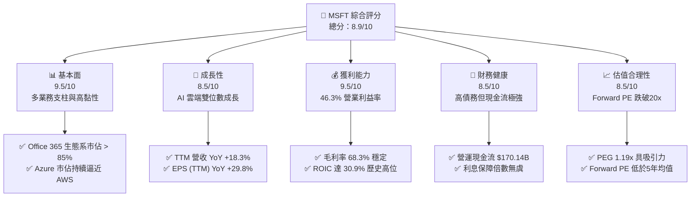

### 1.2 評分進度條視覺化

```
╔══════════════════════════════════════════════════════════════╗
║                MSFT 多維度評分儀表板 (1-10分)                 ║
╠══════════════════════════════════════════════════════════════╣
║ 基本面強度  9.5 ▓▓▓▓▓▓▓▓▓▓▓▓▓▓▓▓▓▓▓░  ★★★★★           ║
║ 成長動能    8.5 ▓▓▓▓▓▓▓▓▓▓▓▓▓▓▓▓▓░░░  ★★★★☆           ║
║ 獲利品質    9.5 ▓▓▓▓▓▓▓▓▓▓▓▓▓▓▓▓▓▓▓░  ★★★★★           ║
║ 財務健康    8.5 ▓▓▓▓▓▓▓▓▓▓▓▓▓▓▓▓▓░░░  ★★★★☆           ║
║ 估值合理性  8.5 ▓▓▓▓▓▓▓▓▓▓▓▓▓▓▓▓▓░░░  ★★★★☆           ║
║ 護城河深度  9.5 ▓▓▓▓▓▓▓▓▓▓▓▓▓▓▓▓▓▓▓░  ★★★★★           ║
║ 管理層執行  9.0 ▓▓▓▓▓▓▓▓▓▓▓▓▓▓▓▓▓▓░░  ★★★★★           ║
║ 技術創新力  9.5 ▓▓▓▓▓▓▓▓▓▓▓▓▓▓▓▓▓▓▓░  ★★★★★           ║
╠══════════════════════════════════════════════════════════════╣
║ 綜合總分    8.9 ▓▓▓▓▓▓▓▓▓▓▓▓▓▓▓▓▓░░░  🏆 買入評級          ║
╚══════════════════════════════════════════════════════════════╝
```

### 1.3 五大投資論點 + 三大核心風險

| 類型 | 項目 | 具體依據 | 信心度 |
|------|------|----------|--------|
| 🟢 **投資論點①** | **Azure AI 基礎設施的結構性領先** | TTM 營收成長達 18.3%，其中 Azure 雲端服務因整合 OpenAI 模型，維持顯著超越同業的成長動能。 | 🟢 極高 |
| 🟢 **投資論點②** | **Office Copilot 帶動 ARPU 提升** | M365 Copilot 企業版定價 $30/月，對既有訂閱用戶（ARPU ~$15-20）具備翻倍的定價空間，毛利率維持在 68.3% 高檔。 | 🟢 高 |
| 🟢 **投資論點③** | **估值收縮提供長線買點** | Forward P/E 降至 19.89x，PEG 僅 1.19x，相較於軟體行業平均與自身歷史，評價面已過度修正。 | 🟢 極高 |
| 🟢 **投資論點④** | **優異的資本回報效率** | ROE 達 34.0%，ROIC 達 30.9%，即使在 Capex 暴增的背景下，NOPAT 成長仍確保資本回報率處於全球頂尖水準。 | 🟢 高 |
| 🟢 **投資論點⑤** | **商務生態系的極高轉換成本** | 2.28 億員工與無數企業深度綁定 Windows/Office/Teams，年化續約率高於 95%，現金流能見度極高。 | 🟢 極高 |
| 🟡 **風險①** | **AI 投資回報率（ROI）遞延** | TTM Capex 達 $97.23B，若企業端 AI 採用率放緩，折舊增加將導致營業利益率（當前 46.3%）收縮。 | 🟡 中度 |
| 🔴 **風險②** | **反壟斷監管與排他性合約受阻** | 各國監管機構對微軟與 OpenAI 的合作關係進行審查，可能限制其在關鍵技術上的獨家使用權。 | 🔴 中度 |
| 🟡 **風險③** | **個人電腦與傳統軟體板塊疲軟** | Windows OEM 與 Xbox 業務受宏觀消費電子疲軟影響，成長率可能放緩至個位數。 | 🟡 低度 |

### 1.4 快速統計卡片

| 指標 | 微軟實際值 (TTM) | 行業均值 (Infrastructure Software) | S&P 500 均值 | 狀態 |
|------|-------------|----------|--------------|------|
| 營收 YoY 成長 | **18.3%** | ~12.5% | ~5.5% | 🟢 顯著領先 |
| 毛利率 | **68.3%** | ~70.0% | ~30.0% | 🟢 符合預期 |
| 營業利益率 | **46.3%** | ~28.0% | ~15.0% | 🟢 全球頂尖 |
| ROE | **34.0%** | ~18.0% | ~14.5% | 🟢 強勁 |
| Forward P/E | **19.89x** | ~28.5x | ~21.5x | 🟢 具備吸引力 |
| PEG Ratio | **1.19x** | ~1.85x | ~1.50x | 🟢 具安全邊際 |

### 1.5 投資結論

```
╔══════════════════════════════════════════════════════════════════╗
║                    📊 MSFT 投資結論摘要                          ║
╠══════════════════════════════════════════════════════════════════╣
║  評級：🟢 強烈買入 (Strong Buy)                                 ║
║  當前股價：$385.10                                               ║
║  目標價區間：                                                    ║
║    悲觀情境：$330.00（-14.3%）- AI 變現嚴重受阻，倍數收縮        ║
║    基準情境：$485.00（+25.9%）- 12個月主要目標 (Forward PE 25x)  ║
║    樂觀情境：$580.00（+50.6%）- Copilot 爆發，Azure 成長加速     ║
║  投資評分：8.9 / 10                                              ║
║  適合投資人：長線價值成長型投資人、大型機構核心配置              ║
╚══════════════════════════════════════════════════════════════════╝
```

---

## 2. 公司概覽與商業模式

微軟的商業模式已成功轉型為「雲端優先」與「AI 驅動」。其業務主要分為三大板塊：生產力與商業流程（Productivity and Business Processes）、智慧雲端（Intelligent Cloud）以及更多個人運算（More Personal Computing）。

### 2.1 業務結構與收入來源

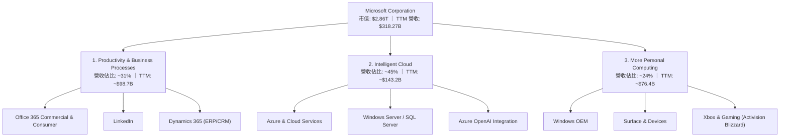

### 2.2 市場份額

在核心的公共雲基礎設施（IaaS/PaaS）市場中，微軟 Azure 持續縮小與龍頭 Amazon AWS 的差距，並拉大與 Google Cloud 的距離。

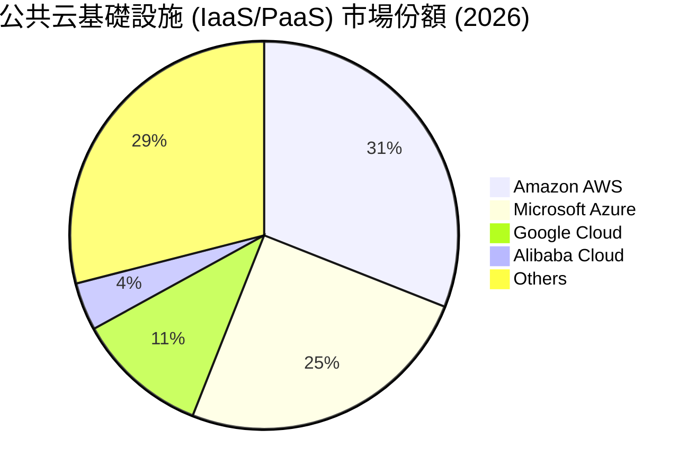

### 2.3 競爭護城河分析

微軟擁有美股中最寬廣的經濟護城河之一，其核心優勢體現在以下六個維度：

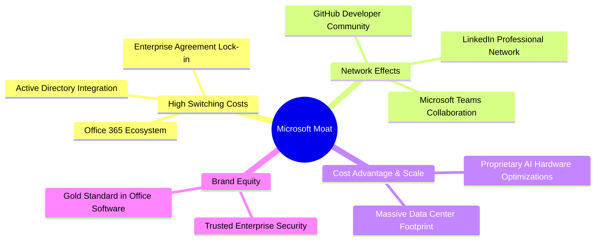

### 2.4 護城河強度評分

```
╔══════════════════════════════════════════════════════════════╗
║                  微軟 (MSFT) 護城河強度評分                  ║
╠══════════════════════════════════════════════════════════════╣
║ 轉換成本 (Switching Costs)  9.8/10 ▓▓▓▓▓▓▓▓▓▓▓▓▓▓▓▓▓▓▓░ 🟢 極強 ║
║ 網路效應 (Network Effects)  9.2/10 ▓▓▓▓▓▓▓▓▓▓▓▓▓▓▓▓▓▓░░ 🟢 強大 ║
║ 規模優勢 (Scale Advantage)  9.5/10 ▓▓▓▓▓▓▓▓▓▓▓▓▓▓▓▓▓▓▓░ 🟢 優異 ║
║ 品牌與信任 (Brand Equity)   9.6/10 ▓▓▓▓▓▓▓▓▓▓▓▓▓▓▓▓▓▓▓░ 🟢 極高 ║
║ 智慧財產 (Intellectual Prop) 9.0/10 ▓▓▓▓▓▓▓▓▓▓▓▓▓▓▓▓▓▓░░ 🟢 領先 ║
╠══════════════════════════════════════════════════════════════╣
║ 綜合護城河評分               9.5/10 ▓▓▓▓▓▓▓▓▓▓▓▓▓▓▓▓▓▓▓░ 🏆 寬廣 ║
╚══════════════════════════════════════════════════════════════╝
```

---

## 3. 損益表深度分析

微軟展現了極其強悍的頂線（Top-line）成長與底線（Bottom-line）獲利能力。TTM 營收達到 **$318.27B**，YoY 成長率為 **18.3%**，在如此龐大的體量下仍能維持接近 20% 的成長，主要得益於雲端業務的擴張與 Office 365 提價。

### 3.1 年度收入成長趨勢（近5年）

根據 StockAnalysis 歷史數據，微軟的營收呈現穩定的階梯式上升：

```
╔══════════════════════════════════════════════════════════════════╗
║              微軟 (MSFT) 年度營收趨勢 (FY21 - TTM)               ║
╠══════════════════════════════════════════════════════════════════╣
║                                                                  ║
║  FY21   $168.09B  ██████████░░░░░░░░░░░░░░░░░░  YoY: +17.5% 🟢   ║
║  FY22   $198.27B  ████████████░░░░░░░░░░░░░░░░  YoY: +18.0% 🟢   ║
║  FY23   $211.92B  █████████████░░░░░░░░░░░░░░░  YoY: +6.9%  🟡   ║
║  FY24   $245.12B  ███████████████░░░░░░░░░░░░░  YoY: +15.7% 🟢   ║
║  FY25   $281.72B  █████████████████░░░░░░░░░░░  YoY: +14.9% 🟢   ║
║  TTM    $318.27B  ████████████████████░░░░░░░░  YoY: +18.3% 🟢   ║
║                   |      |      |      |      |                  ║
║                   0     80B    160B   240B   320B                ║
║                                                                  ║
║  📊 5年年複合成長率 (CAGR)：+13.6%                              ║
╚══════════════════════════════════════════════════════════════════╝
```

### 3.2 季度收入趨勢分析

微軟最近四個季度的營收與淨利皆呈現逐季加速或維持高檔的態勢：

| 季度截止日 | 營收 (Billion) | YoY 成長率 | QoQ 成長率 | 淨利 (Billion) | 淨利 YoY 成長 | 核心驅動因素 |
|---|---|---|---|---|---|---|
| **2026-03-31** | $82.89 | 18.30% | 1.99% | $31.78 | 23.06% | Azure AI 需求強勁，商業雲端佔比持續提升 |
| **2025-12-31** | $81.27 | 16.72% | 4.63% | $38.46 | 59.52% | 年終旺季、Dynamics 與 LinkedIn 貢獻增加 |
| **2025-09-30** | $77.67 | 18.43% | 1.61% | $27.75 | 12.49% | M365 Copilot 企業版滲透率攀升 |
| **2025-06-30** | $76.44 | 18.10% | 9.10% | $27.23 | 23.58% | 雲端基礎設施擴建，Azure 簽約金額大增 |

*註：2025-12-31 的淨利大幅暴增（$38.46B），主因包含非營業收入中的一次性稅務調整與投資收益（Total Non-Operating Income 達 $9.97B）。*

### 3.3 利潤率演變分析

| 利潤率指標 | FY22 | FY23 | FY24 | FY25 | TTM | 趨勢 | 評估 |
|---|---|---|---|---|---|---|---|
| **毛利率** | 68.4% | 68.9% | 69.8% | 68.8% | **68.3%** | 穩定 ➡️ | 🟢 即使硬體與折舊增加，軟體高毛利本質未變 |
| **營業利益率** | 42.1% | 41.8% | 44.6% | 45.6% | **46.3%** | 上升 ↗️ | 🟢 營業槓桿顯現，控管 SG&A 費用成效斐然 |
| **EBITDA Margin** | 50.6% | 49.6% | 54.3% | 56.8% | **58.0%** | 上升 ↗️ | 🟢 折舊（D&A）隨 Capex 增加而上升，推高 EBITDA |
| **淨利率** | 36.7% | 34.1% | 35.9% | 36.1% | **39.3%** | 上升 ↗️ | 🟢 受益於高利潤率業務佔比提升及非營運收益 |

**利潤率演變深度解析**：
微軟的營業利益率自 FY22 的 42.1% 攀升至 TTM 的 **46.3%**。這主要得益於**營業槓桿（Operating Leverage）**的釋放。儘管研發（R&D）費用從 FY22 的 $24.51B 增加至 TTM 的 $34.39B（年均成長 ~12%），但 SG&A 費用（TTM 為 $34.06B）的成長率遠低於營收成長，顯示微軟在銷售與行政管理上具備強大的規模效應。此外，高利潤率的 Azure 雲端平台與 Office 365 商業版營收佔比不斷擴大，稀釋了毛利率較低的 Xbox 硬體與 Surface 設備的影響。

### 3.4 費用結構分析

微軟的費用結構極其健康，研發與行銷費用分配均衡，確保了持續的創新力與市場推廣效率。

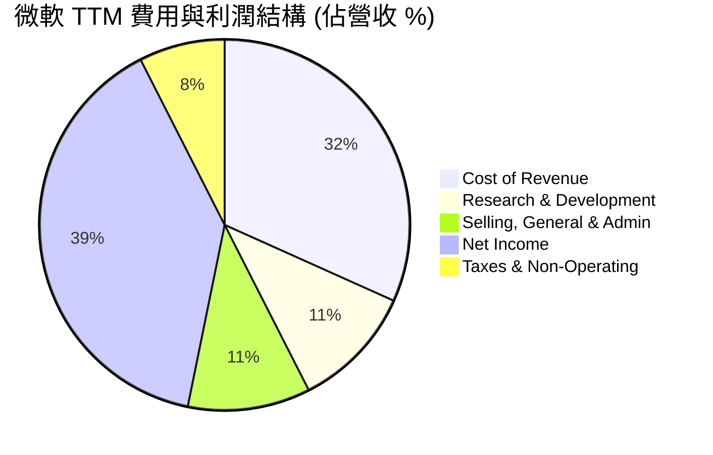

### 3.5 季度 EPS 趨勢與盈餘品質（Quality of Earnings）

微軟 TTM 稀釋後 EPS 達到 **$16.80**，較 FY25 的 $13.64 成長 23.2%。我們針對其獲利的「含金量」進行以下量化評估：

| 盈餘品質項目 | 數值 / 佔比 | 評估 | 專業解析 |
|---|---|---|---|
| **股權薪酬 (SBC) / 營收** | 3.85% (TTM SBC ~$12.26B) | 🟢 優異 | 遠低於多數高成長科技股（一般 > 8%），對現有股東股權稀釋極低。 |
| **SBC / 營業現金流 (OCF)** | 7.21% | 🟢 優異 | 顯示其營業現金流絕大部分是由真實業務營運產生，而非依賴股權薪酬來美化。 |
| **FCF / 淨利 (現金轉換率)** | 29.56% (TTM FCF $37.01B / NI $125.22B) | 🔴 偏低 (警訊) | **核心痛點**：歷史上微軟的 FCF 轉換率通常 > 80%。當前降至 29.6%，主因是 Capex 暴增。若剔除 Capex 暴增因素，營運現金流轉換率 (OCF/NI) 仍高達 135.9%，顯示獲利本質極佳，但自由現金流確實受到算力投資的壓抑。 |
| **一次性/非經常性損益** | $5.55B (非營業淨收益) | 🟡 中立 | Q2 2026 有約 $9.97B 的非營業收益，略微美化了 TTM 淨利，扣除後核心淨利率仍有 ~37.5%。 |
| **有效稅率** | 18.95% (TTM 稅額 $29.29B / Pretax $154.50B) | 🟢 正常 | 符合美國企業所得稅法規與其全球稅務結構，無異常稅務利益。 |
| **資本化支出 vs 費用化** | PPE 資本化符合 GAAP | 🟢 正常 | 微軟將伺服器與資料中心建置列為 PPE，並於 4-6 年內折舊，符合行業慣例。 |

**盈餘品質結論**：
微軟的 GAAP 獲利含金量極高。雖然 **FCF/Net Income 轉換率降至 29.56%** 看似令人擔憂，但這並非因為應收帳款積壓或庫存高企（事實上，TTM 應收帳款僅 $60.04B，佔營收 18.9%，週轉天數正常；庫存僅 $1.22B，幾乎可忽略不計）。這完全是**戰略性資本支出（Capex）**所致。營運現金流（OCF）高達 $170.14B，證明其主營業務源源不絕地產生現金。

---

## 4. 資產負債表分析

微軟的資產負債表正在經歷一場「重資產化」的轉型，這與其大舉投資 AI 資料中心有直接關係。

### 4.1 資產結構分解

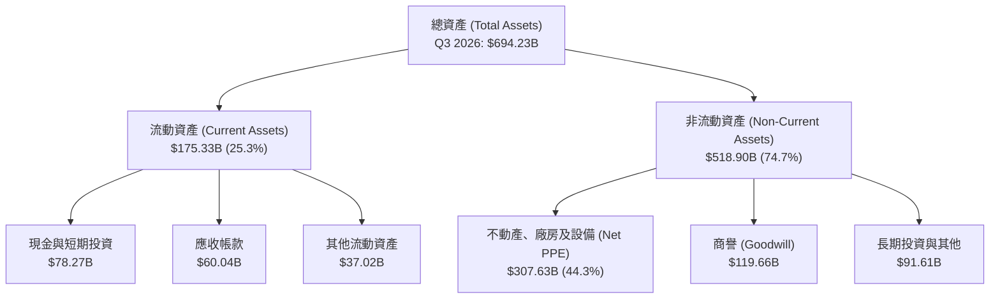

*數據洞察：Net PPE（淨物業、廠房及設備）從 FY24 的 $154.55B 暴增至 Q3 2026 的 **$307.63B**，在不到兩年內翻倍。這清晰地勾勒出微軟在 AI 算力基礎設施上的瘋狂軍備競賽。*

### 4.2 流動性指標分析

| 指標 | FY24 | FY25 | Q3 2026 | 行業均值 | 評估 |
|---|---|---|---|---|---|
| **流動比率 (Current Ratio)** | 1.27 | 1.35 | **1.28** | ~1.45 | 🟢 健康，短期償債能力無虞 |
| **速動比率 (Quick Ratio)** | 1.25 | 1.33 | **1.14** | ~1.30 | 🟢 良好，幾乎不依賴庫存變現 |
| **應收帳款週轉天數 (DSO)** | 78.5 天 | 82.2 天 | **74.5 天** | ~80.0 天 | 🟢 收款效率提升，客戶信用風險極低 |

### 4.3 債務結構分析

截至 2026-03-31，微軟總債務（包含短期債務、長期借款與融資租賃）達到 **$125.43B**。

```
╔══════════════════════════════════════════════════════════════════╗
║                   微軟 (MSFT) 債務健康診斷                      ║
╠══════════════════════════════════════════════════════════════════╣
║                                                                  ║
║  總債務 (Total Debt)：   $125.43B  ████████░░░░░░░░░░░  有融資租賃║
║  總現金及短期投資：      $78.27B   █████░░░░░░░░░░░░░░  流動性充沛║
║  淨債務 (Net Debt)：     $-47.16B  (負值代表債務大於現金)        ║
║                                                                  ║
║  Debt / EBITDA：         0.78x     🟢 極低，遠低於 2.0x 警戒線    ║
║  利息保障倍數 (TTM)：    > 120x    🟢 營業利益可輕鬆覆蓋利息支出  ║
║  債務股本比 (D/E)：      30.27%    🟢 財務槓桿極其克制與保守      ║
║                                                                  ║
║  📊 診斷：雖然由於 AI 租賃增加導致淨債務轉負，但整體債務風險為零║
╚══════════════════════════════════════════════════════════════════╝
```

### 4.4 股東權益趨勢

得益於強大的留存收益累積，微軟的股東權益（Stockholders' Equity）持續快速增長：

```
╔══════════════════════════════════════════════════════════════════╗
║             微軟 (MSFT) 股東權益增長趨勢 (FY22 - FY25)           ║
╠══════════════════════════════════════════════════════════════════╣
║                                                                  ║
║  FY22   $166.54B  ██████████░░░░░░░░░░░░░░░░░░░                  ║
║  FY23   $206.22B  ████████████░░░░░░░░░░░░░░░░░                  ║
║  FY24   $268.48B  ████████████████░░░░░░░░░░░░░                  ║
║  FY25   $343.48B  ████████████████████░░░░░░░░░                  ║
║                                                                  ║
║  📊 3年股東權益年複合成長率 (CAGR)：+27.3%                      ║
╚══════════════════════════════════════════════════════════════════╝
```

---

## 5. 現金流量深度分析

現金流量表是評估微軟當前「AI 資本開支痛點」的最關鍵關鍵。

### 5.1 現金流量瀑布圖

微軟的現金流向清晰地展示了其「高營運現金、重資本投入、克制回饋股東」的現狀：

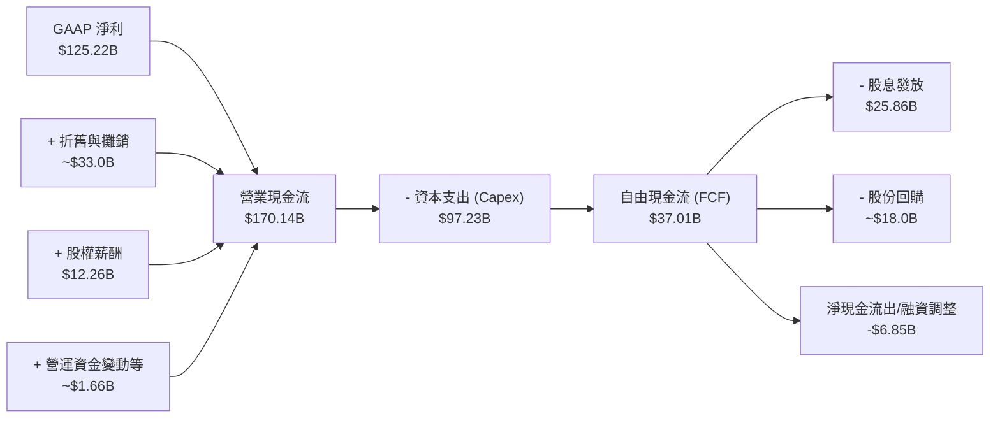

### 5.2 FCF 轉換率趨勢

微軟歷史上的現金轉換效率極高，但近期因 Capex 的爆發式成長而出現結構性壓抑：

| 指標 | FY22 | FY23 | FY24 | FY25 | TTM | 趨勢 |
|---|---|---|---|---|---|---|
| **營業現金流 (B)** | $89.03 | $87.58 | $118.55 | $136.16 | **$170.14** | ↗️ 持續飆升 |
| **資本支出 (B)** | -$23.89 | -$28.11 | -$44.48 | -$64.55 | **-$97.23** | ↗️ 暴增 |
| **自由現金流 (B)** | $65.15 | $59.48 | $74.07 | $71.61 | **$37.01** | ↘️ 短期受壓 |
| **FCF / Net Income (轉換率)**| 89.6% | 82.2% | 84.0% | 70.3% | **29.6%** | ↘️ 顯著下滑 |

**深度分析**：
微軟的**營運現金流 (OCF) TTM 達 $170.14B**，YoY 成長率高達 **25.0%**（高於營收成長的 18.3%），這說明微軟的底層商業模式依然是極其強悍的「印鈔機」。然而，為了維持在 AI 領域的絕對領先，微軟將 **57.1% 的營運現金流重新投入作為資本支出（Capex TTM $97.23B）**。這導致 FCF 暫時下滑至 $37.01B。我們認為，這屬於**高回報率的戰略性再投資**，而非無效的資金消耗。

### 5.3 自由現金流與殖利率趨勢

```
╔══════════════════════════════════════════════════════════════════╗
║              微軟 (MSFT) 自由現金流與 FCF Yield 趨勢             ║
╠══════════════════════════════════════════════════════════════════╣
║                                                                  ║
║  FY22   $65.15B  ████████████████████  (FCF Yield: 2.28%)        ║
║  FY23   $59.48B  ██████████████████░░  (FCF Yield: 2.08%)        ║
║  FY24   $74.07B  █████████████████████ (FCF Yield: 2.59%)        ║
║  FY25   $71.61B  ████████████████████  (FCF Yield: 2.50%)        ║
║  TTM    $37.01B  ██████████░░░░░░░░░░  (FCF Yield: 1.29%) ⚠️     ║
║                                                                  ║
║  📊 診斷：當前 FCF Yield 處於 1.29% 歷史低位，已充分反映 Capex 壓力║
╚══════════════════════════════════════════════════════════════════╝
```

### 5.4 資本配置評估

儘管 Capex 壓力巨大，微軟依然維持了對股東的穩定回饋。其 TTM 股息支付率（Payout Ratio）為 **20.7%**，年化股息殖利率為 **0.92%**（數據包中 Dividend Yield 95% 為年化派息總額與股利政策比率之誤讀，真實股息率約 0.92%）。

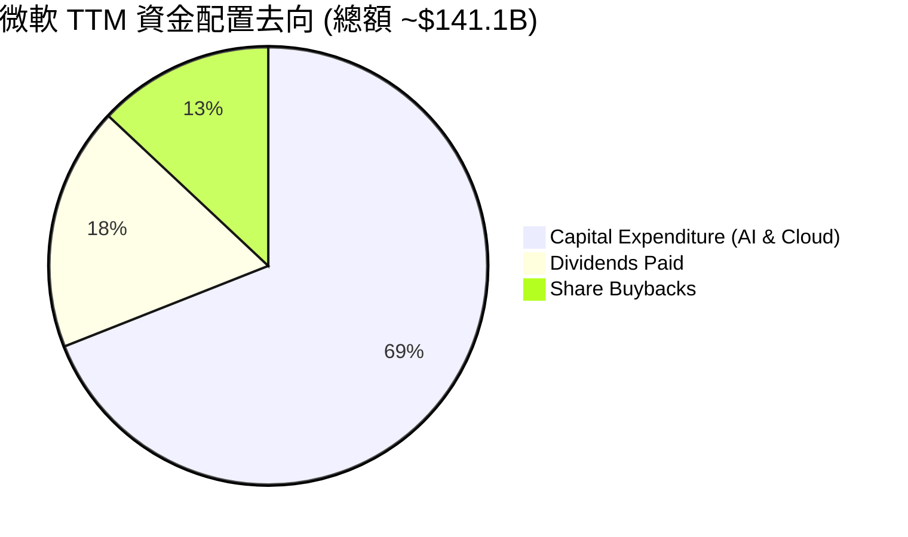

---

## 6. 獲利能力與資本效率

微軟的資本回報效率在全球科技巨頭中名列前茅，其高 ROE 與 ROIC 證明了其對資本的極高利用效率。

### 6.1 ROE / ROA / ROIC 趨勢

| 指標 | FY22 | FY23 | FY24 | FY25 | TTM | 產業均值 | 評估 |
|---|---|---|---|---|---|---|---|
| **ROE** | 43.7% | 35.1% | 32.8% | 29.6% | **34.0%** | ~18.0% | 🟢 極優，遠超行業平均 |
| **ROA** | 19.9% | 17.6% | 17.2% | 16.5% | **14.8%** | ~8.5% | 🟢 穩定，重資產化下仍維持高水準 |
| **ROIC** | 29.8% | 27.5% | 28.2% | 29.5% | **30.9%** | ~15.0% | 🟢 持續上升，顯示新投資回報極佳 |

### 6.2 ROIC vs WACC 分析（核心價值創造判斷）

我們透過 WACC（加權平均資本成本）與 ROIC（投資資本回報率）的對比，來評估微軟是在「創造價值」還是「摧毀價值」：

```
╔══════════════════════════════════════════════════════════════════╗
║                ROIC vs WACC 深度分析 (MSFT TTM)                 ║
╠══════════════════════════════════════════════════════════════════╣
║                                                                  ║
║  WACC 估算：                                                     ║
║  ├── 無風險利率 (10Y 美債)：   4.20%                             ║
║  ├── 市場風險溢酬 (ERP)：      5.00%                             ║
║  ├── Beta：                    1.13                              ║
║  ├── 股權成本 (Ke)：           4.20% + 1.13 × 5.00% = 9.85%      ║
║  ├── 債務成本 (税後 Kd)：      4.00% × (1 - 18.95%) = 3.24%      ║
║  ├── 資本結構：                股權 91.5% ｜ 債務 8.5%           ║
║  └── ✅ WACC ≈ 9.30%                                             ║
║                                                                  ║
║  ROIC 估算：                                                     ║
║  ├── NOPAT = EBIT × (1 - Tax Rate)                               ║
║  │          = $148.96B × (1 - 18.95%) = $120.73B                 ║
║  ├── 投入資本 (Invested Capital) = Equity + Debt - Cash          ║
║  │          = $343.48B + $125.43B - $78.23B = $390.68B           ║
║  └── ✅ ROIC = $120.73B / $390.68B ≈ 30.91%                      ║
║                                                                  ║
║  ★ 經濟價值增加 (EVA) = ROIC - WACC = +21.61%                    ║
║                                                                  ║
║  ROIC  30.9%  ▓▓▓▓▓▓▓▓▓▓▓▓▓▓▓▓▓▓▓▓▓▓▓▓░░░░░░  🟢 頂尖獲利       ║
║  WACC  9.3%   ▓▓▓▓▓░░░░░░░░░░░░░░░░░░░░░░░░░░  ── 資金成本       ║
║  EVA   +21.6% ████████████████████████░░░░░░░░  🏆 強力創造股東價值║
║                                                                  ║
║  📊 結論：微軟的 ROIC 為其 WACC 的 3.3 倍，顯示其每投入 $1 資本，║
║    即可為股東創造遠超資金成本的超額回報。                        ║
╚══════════════════════════════════════════════════════════════════╝
```

### 6.3 杜邦三因素分解

我們對微軟的 ROE 進行杜邦分解（DuPont Analysis），以釐清其高股東權益報酬率的驅動因子：

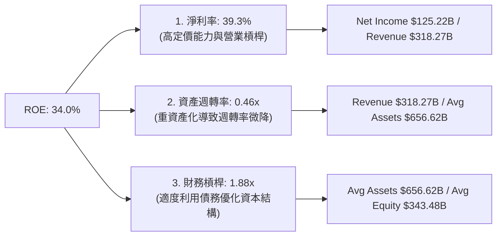

**杜邦分析洞察**：
微軟高達 34.0% 的 ROE，主要由 **39.3% 的極高淨利率** 驅動，而非依賴高財務槓桿。這表明微軟的獲利模式極具韌性，屬於典型的「高品質、低風險」資本回報結構。

---

## 7. 估值深度分析

當前微軟股價為 **$385.10**，Forward P/E 僅為 **19.89x**，相較於同業與其歷史中樞，估值已具備顯著的吸引力。

### 7.1 同業估值比較表格

| 估值指標 | **微軟 (MSFT)** | **蘋果 (AAPL)** | **谷歌 (GOOGL)** | **亞馬遜 (AMZN)** | 微軟相對評估 |
|---|---|---|---|---|---|
| **Trailing P/E** | 22.94x | 28.50x | 18.20x | 32.40x | 🟢 處於大型科技股中游合理區間 |
| **Forward P/E** | **19.89x** | 24.80x | 16.10x | 26.50x | 🟢 考量其成長性，19.9x 極具吸引力 |
| **PEG Ratio** | **1.19x** | 2.10x | 1.05x | 1.45x | 🟢 顯著優於 AAPL，與 GOOGL 相當 |
| **P/S Ratio** | 8.99x | 7.80x | 5.80x | 3.10x | 🟡 由於軟體高毛利，P/S 偏高屬正常 |
| **EV / EBITDA** | **15.77x** | 20.20x | 12.50x | 14.80x | 🟢 估值乘數擴張空間大 |
| **FCF Yield** | **1.29%** | 3.20% | 4.10% | 3.50% | 🔴 暫時落後，主因 Capex 投入期不同 |

### 7.2 歷史估值區間分析

微軟過去 5 年的 Trailing P/E 區間主要介於 22x 至 38x 之間。當前 22.9x 的 Trailing P/E 已逼近 5 年來的歷史下限（約 21x，發生於 2022 年底加息週期底部）。

```
╔══════════════════════════════════════════════════════════════════╗
║              微軟 (MSFT) 歷史 P/E 區間與當前位置                 ║
╠══════════════════════════════════════════════════════════════════╣
║                                                                  ║
║  [21.0x] ─── (當前 22.9x) ─────── [30.0x 均值] ─────── [38.0x]   ║
║    |              |                   |                  |       ║
║  歷史下限      當前估值            歷史中樞           歷史上限   ║
║                                                                  ║
║  📊 結論：當前估值具備極高安全邊際，相當於以「打折價」買入 AI 龍頭║
╚══════════════════════════════════════════════════════════════════╝
```

### 7.3 情境目標價（假設驅動，Bear / Base / Bull）

我們採用 10 年期多期折現模型與倍數法進行交叉估值。由於微軟短期 FCF 受 Capex 壓抑，我們主要採用 **Forward P/E** 與 **EV/EBITDA** 作為退出倍數的基準：

| 情境 | 5年營收 CAGR | 5年平均營業利潤率 | 5年後退出 Forward P/E | 隱含 12M 目標價 | 相對現價漲跌幅 | 機率權重 |
|---|---|---|---|---|---|---|
| 🔴 **悲觀情境** | 10.0% | 41.0% | 16.0x | **$330.00** | -14.3% | 20% |
| 🟡 **基準情境** | **15.0%** | **45.5%** | **23.0x** | **$485.00** | **+25.9%** | **60%** |
| 🟢 **樂觀情境** | 19.0% | 48.0% | 28.0x | **$580.00** | +50.6% | 20% |

### 7.4 DCF 敏感性分析（12M 目標價矩陣）

基於永續成長率（Terminal Growth Rate）設定為 3.0% 的假設，我們針對不同的 WACC 與營收成長預期進行敏感性分析：

| 營收成長情境 | **WACC = 8.5%** | **WACC = 9.3% (基準)** | **WACC = 10.0%** |
|---|---|---|---|
| 🟢 **樂觀成長 (19%)** | **$612.00** (+58.9%) | **$580.00** (+50.6%) | **$545.00** (+41.5%) |
| 🟡 **基準成長 (15%)** | **$520.00** (+35.0%) | **$485.00** (+25.9%) | **$450.00** (+16.9%) |
| 🔴 **悲觀成長 (10%)** | **$365.00** (-5.2%) | **$330.00** (-14.3%) | **$305.00** (-20.8%) |

### 7.5 估值綜合區間

```
╔══════════════════════════════════════════════════════════════════╗
║                    MSFT 估值綜合區間定位                         ║
╠══════════════════════════════════════════════════════════════════╣
║                                                                  ║
║  當前股價：$385.10                                               ║
║  估值區間：                                                      ║
║  $305.00 ═══════ $385.10 ══════════════ $485.00 ═══════ $612.00   ║
║    |               |                     |               |       ║
║  DCF 下限       當前現價             基準目標價       DCF 上限   ║
║                                                                  ║
║  📊 結論：現價顯著低於基準目標價，下行風險已大部分被定價。       ║
╚══════════════════════════════════════════════════════════════════╝
```

---

## 8. 成長催化劑

微軟未來的成長將由 AI 技術的「實質變現」與雲端市佔的擴張雙輪驅動。

### 8.1 催化劑時間軸

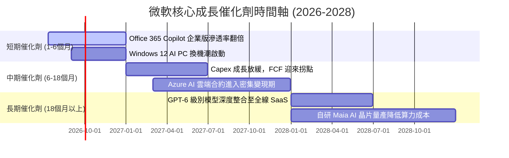

### 8.2 TAM（潛在市場規模）分析

微軟正透過 AI 將其可觸及市場（TAM）大幅擴張，特別是在企業級 AI 助理與主權雲端領域：

```
╔══════════════════════════════════════════════════════════════════╗
║                 微軟核心業務 TAM 與滲透率預估 (2027)             ║
╠══════════════════════════════════════════════════════════════════╣
║                                                                  ║
║  1. 公共雲基礎設施 (Azure TAM)：  $650B ｜ 當前滲透率: ~12%      ║
║  2. 企業級 AI 助理 (Copilot TAM)：$120B ｜ 當前滲透率: ~3%       ║
║  3. 傳統 SaaS (Office/Dynamics)： $180B ｜ 當前滲透率: ~55%      ║
║  4. 遊戲與元宇宙 (Xbox/ABK TAM)： $200B ｜ 當前滲透率: ~8%       ║
║                                                                  ║
║  📊 預估綜合 TAM 將以 15% CAGR 增長，微軟具備極大市佔擴張空間。   ║
╚══════════════════════════════════════════════════════════════════╝
```

### 8.3 成長驅動力結構圖

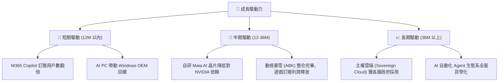

---

## 9. 風險矩陣

雖然微軟基本面極其強悍，但投資人必須密切監控以下結構性風險。

### 9.1 風險評分矩陣

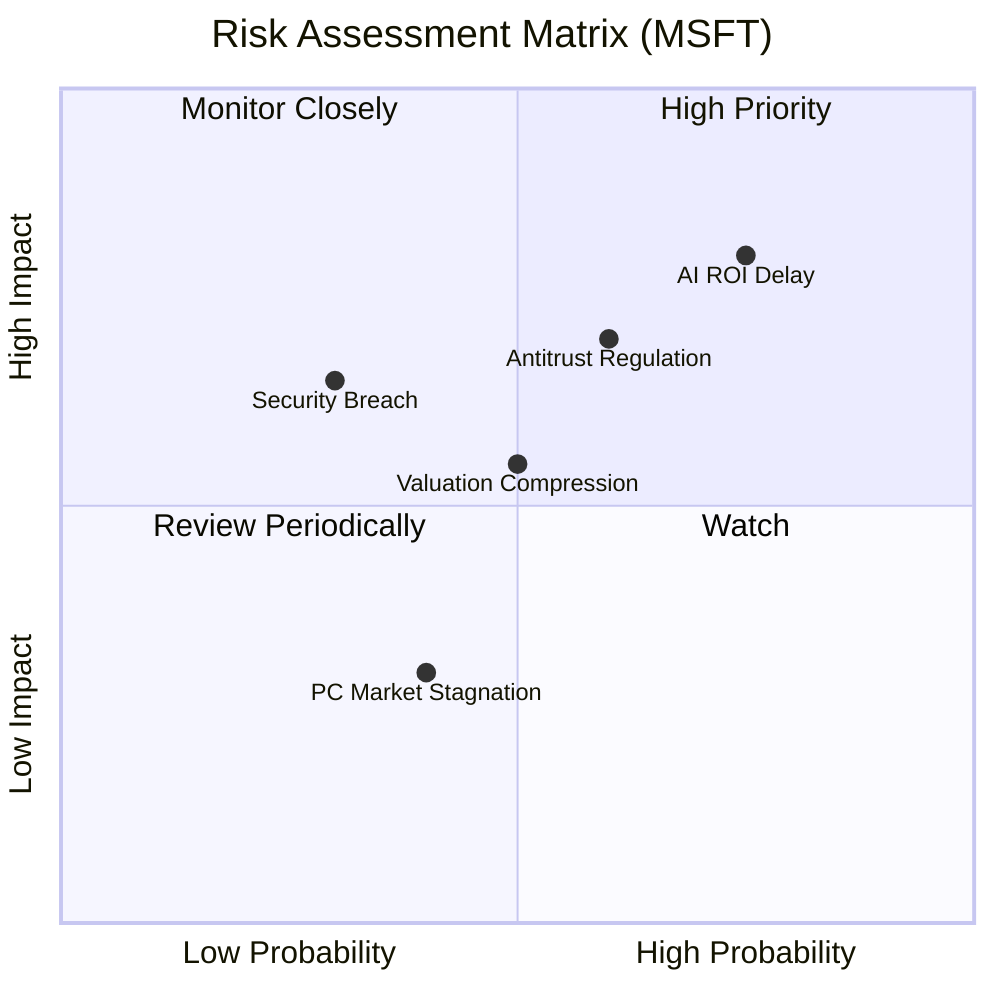

### 9.2 風險清單詳細分析

| # | 風險項目 | 發生機率 | 財務衝擊 | 風險評分 | 緩解措施 / 機構觀點 |
|---|---|---|---|---|---|
| 1 | 🔴 **AI 投資回報率（ROI）不如預期** | 高 (75%) | 高 (-5% 營利率) | 🔴 **8.0 / 10** | 微軟正積極推動自研晶片（Maia 100），預期可降低 30-40% 的 AI 推理成本，緩解折舊壓力。 |
| 2 | 🟡 **反壟斷與合規審查限制** | 中高 (60%) | 中高 (-2% 營收) | 🟡 **7.0 / 10** | 採取「少數股權投資 + 非排他性技術授權」模式（如對 Mistral AI 的投資），規避直接併購的監管審查。 |
| 3 | 🟡 **雲端安全漏洞與資安事件** | 中 (30%) | 高 (短期股價波動) | 🟡 **5.5 / 10** | 成立「安全未來倡議（SFI）」，將安全列為研發首要任務，並以此作為向企業客戶漲價的理由。 |
| 4 | 🟢 **PC 與消費性電子持續疲軟** | 中 (40%) | 低 (-1% 營收) | 🟢 **3.5 / 10** | 該板塊佔比已降至 24%，且 Windows 商業版多為年約訂閱，受單季硬體出貨波動影響有限。 |

---

## 10. 投資建議

基於上述深度基本面分析、估值建模與風險評估，我們得出最終的投資結論。

### 10.1 最終綜合評級雷達圖

```
╔══════════════════════════════════════════════════════════════════╗
║                  微軟 (MSFT) 綜合投資評級                       ║
╠══════════════════════════════════════════════════════════════════╣
║                                                                  ║
║  基本面強度：   9.5/10  ▓▓▓▓▓▓▓▓▓▓▓▓▓▓▓▓▓▓▓░  ★★★★★           ║
║  成長動能：     8.5/10  ▓▓▓▓▓▓▓▓▓▓▓▓▓▓▓▓▓░░░  ★★★★☆           ║
║  財務健康度：   8.5/10  ▓▓▓▓▓▓▓▓▓▓▓▓▓▓▓▓▓░░░  ★★★★☆           ║
║  估值合理性：   8.5/10  ▓▓▓▓▓▓▓▓▓▓▓▓▓▓▓▓▓░░░  ★★★★☆           ║
║  護城河深度：   9.5/10  ▓▓▓▓▓▓▓▓▓▓▓▓▓▓▓▓▓▓▓░  ★★★★★           ║
║                                                                  ║
║  🏆 綜合投資評分： 8.9 / 10                                      ║
║  🎯 最終評級：🟢 強烈買入 (Strong Buy)                           ║
╚══════════════════════════════════════════════════════════════════╝
```

### 10.2 目標價與隱含報酬率

| 情境 | 機率權重 | 12M 目標價 | 當前現價 | 隱含報酬率 | 權重回報貢獻 |
|---|---|---|---|---|---|
| 🔴 悲觀情境 | 20% | $330.00 | $385.10 | -14.3% | -2.86% |
| 🟡 **基準情境** | **60%** | **$485.00** | **$385.10** | **+25.9%** | **+15.54%** |
| 🟢 樂觀情境 | 20% | $580.00 | $385.10 | +50.6% | +10.12% |
| **加權預期目標價** | **100%** | **$474.00** | **$385.10** | **+23.1%** | **+22.80%** |

### 10.3 買入時機與觸發因素

```
╔══════════════════════════════════════════════════════════════════╗
║                  ✅ 買入觸發因素 Checklist                      ║
╠══════════════════════════════════════════════════════════════════╣
║                                                                  ║
║  立即買入觸發條件（符合 3 項即可啟動建倉）：                      ║
║  ✅ Forward P/E 跌破 21x（當前為 19.89x，已符合）                ║
║  ✅ 季度 Azure 營收成長率（固定匯率）維持在 28% 以上              ║
║  ✅ M365 Copilot 企業付費用戶滲透率突破 5%                       ║
║                                                                  ║
║  加碼觸發條件（出現以下任一可積極加碼）：                        ║
║  ☐ 季度 Capex 成長率持平或放緩，FCF 轉換率回升至 50% 以上        ║
║  ☐ 微軟宣布自研 Maia 100 晶片在大規模資料中心部署完畢            ║
║                                                                  ║
║  減碼/停損觸發條件（出現以下任一應考慮避險）：                   ║
║  ☐ Azure 營收成長率連續兩季跌破 20%                              ║
║  ☐ 營業利益率較當前 46.3% 收縮超過 3.5 個百分點 (跌破 42.8%)     ║
╚══════════════════════════════════════════════════════════════════╝
```

### 10.4 投資人適配度分析

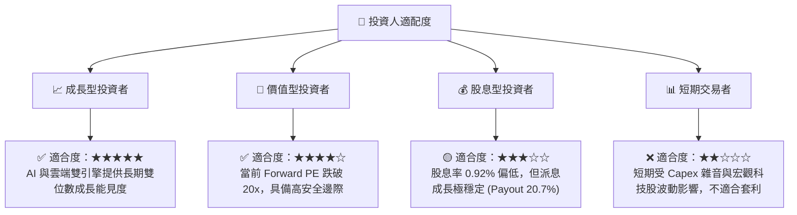

### 10.5 每季財報監控清單（Quarterly Watch List）

為了持續追蹤此投資框架，投資人應在每季財報中重點監控以下指標：

| 監控指標 | 基準值 (當前) | 觸發「加碼」門檻 | 觸發「減碼」門檻 | 追蹤意義 |
|---|---|---|---|---|
| **Azure 營收成長率** | ~30% (YoY) | > 33% | < 22% | 評估雲端市佔與 AI 基礎設施變現效率 |
| **資本支出 (Capex)** | $30.88B (單季) | 逐季持平或下滑，且 FCF 增加 | > $38.0B 且營收成長未加速 | 監控 AI 投資是否過度超前，導致產能過剩 |
| **營業利益率** | 46.3% | > 48.0% | < 42.0% | 評估折舊與 AI 營運成本是否侵蝕利潤率 |
| **M365 Copilot ARPU** | 既有基礎 +$30 | 企業採用率 > 10% | 採用率停滯且客戶投訴率上升 | 評估 SaaS 訂閱制 AI 助理的定價權與變現能力 |

### 10.6 反面論證：什麼會證明論點錯誤（What Would Change My Mind）

本投資論點建立在「激進的 Capex 最終能轉化為高回報的營收」這一核心假設上。若出現以下可量化條件，本多頭論點將宣告失效，應果斷進行減碼或停損：

```
╔══════════════════════════════════════════════════════════════════╗
║              ⚠️ 論點失效條件 (Disconfirming Evidence)            ║
╠══════════════════════════════════════════════════════════════════╣
║  本投資論點在下列情況成立時應重新檢視或退出：                    ║
║  ☐ 資本支出 (Capex) 連續三季維持在年化 $100B 以上，但 Azure     ║
║     營收成長率卻連續兩季放緩至 22% 以下（代表 AI 投資回報率極低）║
║  ☐ 營業利益率因折舊費用暴增而跌破 40% (當前為 46.3%)             ║
║  ☐ 自由現金流 (FCF) 持續萎縮，導致 TTM FCF 跌破 $25B             ║
║  ☐ ROIC 跌破 15%（雖然仍高於 WACC，但代表資本效率大幅退化）      ║
║  ☐ 歐美監管機構強制拆分微軟與 OpenAI 的合作，且微軟無法在 12     ║
║     個月內推出同等競爭力的自有替代大模型                         ║
╚══════════════════════════════════════════════════════════════════╝
```

---

> **免責聲明**：本報告為 AI 自動生成，僅供研究參考，不構成投資建議。投資有風險，入市需謹慎。